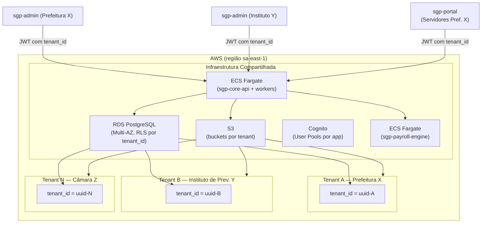
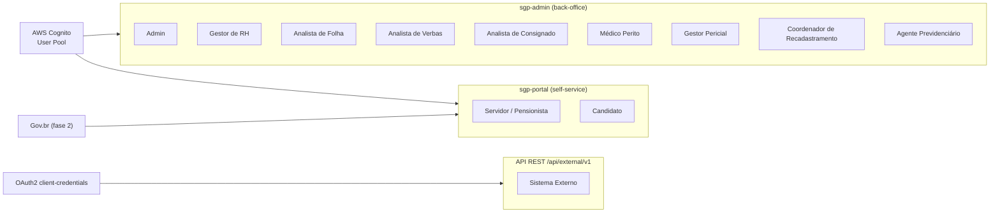
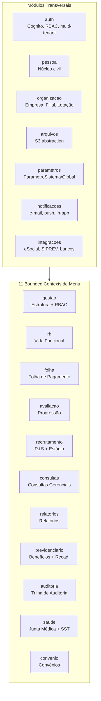

# Visão de Produto e Glossário — SGP Moderno
**Versão:** 1.0 | **Data:** 2026-04-21 | **Status:** Draft
**Escopo:** transversal (todos os bounded contexts) | **Depende de:** BRIEF.md

---

## Sumário

1. [Visão de Produto](#1-visão-de-produto)
2. [Público-alvo e Perfis de Usuário](#2-público-alvo-e-perfis-de-usuário)
3. [Escopo Funcional](#3-escopo-funcional)
4. [Não-escopo](#4-não-escopo)
5. [Glossário](#5-glossário)
6. [Acrônimos](#6-acrônimos)
7. [Convenções de Escrita](#7-convenções-de-escrita)

---

## 1. Visão de Produto

### 1.1 Contexto e Motivação

O setor público brasileiro opera um dos regimes de gestão de pessoas mais complexos do mundo. Diferentemente do setor privado, o servidor público está sujeito a:

- **Múltiplos regimes previdenciários simultâneos** — RPPS (Regime Próprio de Previdência Social) para efetivos, RGPS (INSS) para contratados temporários e celetistas, com regras de compensação mútua quando o servidor migra entre regimes.
- **Estrutura de verbas extremamente heterogênea** — adicional de insalubridade, gratificação de função, adicional por tempo de serviço (ATS/ADTS), abono de permanência, progressões por titularidade e mérito, cada uma com fórmulas de elegibilidade e cálculo definidas em lei ou decreto municipal.
- **Obrigações acessórias rigorosas** — DIRF anual, eSocial S-1.2, SEFIP, SIPREV, cada uma com leiautes e prazos distintos.
- **Transparência pública obrigatória** — publicação de remunerações nominais e identificadas no Portal de Transparência (Lei 12.527/2011 e Lei Complementar 131/2009).
- **Particularidades de cada ente** — cada prefeitura, autarquia, câmara ou fundo de previdência tem plano de cargos e carreira, tabela salarial, regras de aposentadoria e legislação própria, frequentemente alteradas por lei ordinária local.

Prefeituras, autarquias, câmaras, fundos e institutos de previdência precisam de um ERP que entenda profundamente essa realidade sem forçar adaptações simplificadoras que rompam com a legislação local.

O **SGP legado**, construído em Java/Spring + AngularJS ao longo de mais de uma década, acumula:
- 643 estados de navegação rastreados no frontend;
- 192 controladores REST no backend;
- aproximadamente 1.200 endpoints REST mapeados;
- 159 diretórios de páginas AngularJS.

Embora funcionalmente completo, a base de código apresenta débito técnico severo:

- **Ausência de testes automatizados** cobrindo os cálculos de folha — a única garantia de correção são comparações manuais com folhas históricas.
- **Interface AngularJS (EOL desde 2021)** — sem suporte a dispositivos móveis, acessibilidade limitada, carregamento lento.
- **Multi-tenancy por schema isolado** — custo operacional crescente: cada novo cliente exige DDL completo de schema, migrations duplicadas e aumento proporcional de conexões de pool.
- **Lógica de negócio em procedimentos SQL** — fórmulas de verbas em PL/pgSQL e Groovy acopladas ao código Java, impossíveis de testar unitariamente.
- **Integrações frágeis** — eSocial no leiaute S-1.0 (em descontinuação), integrações bancárias sem retry, eSocial sem rastreabilidade de eventos.
- **Ausência de auditoria estruturada** — logs de aplicação genéricos sem diff de estado, impossível reconstruir quem alterou qual valor em qual momento.

### 1.2 Proposta de Valor

O **SGP Moderno** é uma reimplementação completa do SGP legado sobre uma arquitetura contemporânea — PostgreSQL 16 + NestJS (TypeScript) + Angular (última LTS) — projetada para operar como SaaS multi-tenant na AWS, mantendo paridade funcional total com o legado e eliminando os débitos técnicos descritos acima.

**Comparativo direto:**

| Dimensão | Legado | SGP Moderno |
|---|---|---|
| Arquitetura | Monólito Java/Spring com schema por tenant | NestJS modular, microsserviço de folha, RLS PostgreSQL |
| Multi-tenancy | Schema por tenant (alto custo, migrações complexas) | Row-level isolation com `tenant_id` + PostgreSQL RLS |
| Frontend | AngularJS (EOL) | Angular última LTS, standalone components, signals, mobile-ready |
| Autenticação | Session-based + API-key proprietária (`SGP-API-KEY`) | OAuth2/OIDC via AWS Cognito, federação Gov.br (fase 2) |
| Motor de folha | Procedimentos SQL + Groovy embutidos no monólito | Microsserviço `sgp-payroll-engine` isolado, Step Functions para lotes |
| Fórmulas de verbas | Java/Groovy interpretado, sem validação estática | DSL declarativa compilada para SQL parametrizado, versionada e auditável |
| Armazenamento de arquivos | Disco local / NFS | AWS S3 exclusivo, SSE-KMS por tenant, versionamento, lifecycle |
| eSocial | Leiaute S-1.0 (descontinuado), integração ad-hoc | Leiaute S-1.2, Lambda + Step Functions, retry exponencial automático |
| Observabilidade | Logs de arquivo sem rastreamento distribuído | OpenTelemetry → CloudWatch/X-Ray, métricas de negócio customizadas |
| Testes | Ausência de cobertura sistematizada | Jest + Playwright + Pact (contract testing) + testes de migração de dados |
| Portal do servidor | Seção dentro do back-office administrativo | SPA Angular separada (`sgp-portal`) com Gov.br SSO |
| Auditoria | Logs genéricos de aplicação | `audit_log` com diff JSONB em domínios sensíveis, particionado por período |
| Escalabilidade | Vertical (aumento de VM) | Horizontal (ECS Fargate auto scaling por serviço independente) |

**Benefícios quantificáveis esperados:**
- Redução de 70%+ no custo de infraestrutura por novo ente incorporado (row-level vs schema isolado).
- Eliminação do custo de manutenção de server on-premise para os entes contratantes.
- Fechamento de folha auditável por linha de lançamento, com `memoria_calculo` JSONB rastreável.
- Tempo médio de onboarding de novo ente: de semanas (provisionar schema + instância) para horas (criar tenant + seed).

### 1.3 Stakeholders

| Papel | Organização | Interesse principal |
|---|---|---|
| **Gestor municipal / dirigente de instituto** | Ente contratante | Conformidade legal, redução de risco de passivo trabalhista, transparência pública |
| **Diretor de RH** | Ente contratante | Confiabilidade dos dados funcionais, velocidade de atendimento a servidores, progressões e promoções corretas |
| **Diretor de Folha / Tesouraria** | Ente contratante | Cálculo correto, fechamento no prazo, remessa bancária sem erros, DIRF sem inconsistências |
| **Equipe de TI do ente** | Ente contratante | Nenhuma infraestrutura on-premise, SLA de disponibilidade, integrações documentadas e estáveis |
| **Auditores externos (TCE/TCU)** | Órgão de controle | Trilha de auditoria completa, SIPREV enviado, DIRF correta, transparência de remunerações |
| **Servidores e pensionistas** | Usuários finais | Contracheque online, self-service de recadastramento, prova de vida sem deslocamento |
| **Fornecedores de consignado** | Bancos e financeiras | API padronizada de remessa/retorno Neoconsig/CNAB, controle de contratos |
| **Empresas de estágio / CIEE** | Parceiros | Interface de cadastro de estagiários, relatórios de acompanhamento |
| **Time de produto (SGP)** | Fornecedor SaaS | Base de código sustentável, entregas incrementais por wave, NPS alto de usuários |

### 1.4 Posicionamento frente ao Legado

O SGP Moderno **não é** uma evolução incremental do legado; é uma reescrita completa com paridade funcional como pré-requisito de entrega. Esta distinção é fundamental:

1. **Paridade funcional como critério de aceite** — os 11 menus de primeiro nível do legado são mapeados um-a-um para bounded contexts NestJS/Angular. Nenhuma funcionalidade documentada nos 62 documentos de análise será perdida ou simplificada sem ADR aprovado.

2. **Migração de dados como entregável de primeira classe** — a migração de dados do SQL Server legado para o PostgreSQL do SGP Moderno é tratada com a mesma seriedade que o desenvolvimento de features, coberta por testes automatizados com dumps reais de entes-piloto.

3. **Período de coexistência** — durante a Wave 4, o legado permanece ativo como sistema de referência para validação de paridade de folha. O cut-over acontece somente após todos os golden scenarios passarem em homologação com dados reais.

4. **Continuidade de contrato** — os entes não percebem interrupção de serviço. A migração é invisível do ponto de vista do servidor que acessa o contracheque.

### 1.5 Princípios de Design

Os seguintes princípios guiam todas as decisões de design do SGP Moderno:

| Princípio | Descrição |
|---|---|
| **Tenant como cidadão de primeira classe** | Todo objeto de domínio carrega `tenant_id`; nenhuma query de negócio é aceita sem esse filtro; RLS é a salvaguarda de banco. |
| **Cálculo reprodutível** | Um contracheque calculado hoje deve poder ser recalculado amanhã com resultado idêntico — fórmulas versionadas, alíquotas históricas preservadas, `memoria_calculo` imutável. |
| **Auditoria como produto** | A trilha de auditoria não é um log de sistema — é um produto entregável para órgãos de controle. Deve ser consultável, exportável e legível por humanos. |
| **Portal como produto autônomo** | O `sgp-portal` tem equipe, deploy e roadmap independentes do back-office. Servidores merecem UX de qualidade, não uma tela emprestada do sistema administrativo. |
| **Integrações com degradação elegante** | Falha no eSocial ou Gov.br não derruba o sistema principal. Circuit breakers e filas garantem que o impacto seja isolado e os eventos sejam reprocessados quando o sistema externo voltar. |
| **Transparência do cálculo** | O analista de folha deve conseguir responder a qualquer servidor "por que meu contracheque tem esse valor?" usando somente o SGP, sem consulta a planilhas externas. |

### 1.6 Modelo Operacional SaaS



---

## 2. Público-alvo e Perfis de Usuário

O SGP Moderno atende dois grupos distintos de usuários:
- **Usuários operacionais** — profissionais do ente que operam o back-office via `sgp-admin`.
- **Usuários finais** — servidores, pensionistas e candidatos que acessam o self-service via `sgp-portal`.
- **Sistemas externos** — aplicações de terceiros que consomem a API REST autenticada.

### Diagrama de Perfis



### 2.1 Admin

**Papel técnico:** `ROLE_ADMIN_TENANT` + todos os `ROLE_*_GESTAO`.

**Descrição:** Usuário com acesso irrestrito a todos os módulos e parametrizações do tenant. Normalmente um profissional de TI ou gestor sênior de RH designado pelo ente como responsável técnico pelo sistema.

**Responsabilidades:**
- Criação e gestão de usuários, perfis e papéis (`ROLE_*`) dentro do tenant.
- Configuração dos parâmetros de sistema (`ParametroSistema`): `termo_funcionario`, `matricula_automatica`, `matricula_formato`, `logo_principal_s3_key`, `esocial_cnpj_empregador`, etc.
- Configuração de parâmetros globais (`ParametroGlobal`): `TETO_INSS`, `SALARIO_MINIMO`, `VALOR_DEPENDENTE_IRRF`, `NUMERO_REMESSA`.
- Habilitação e desabilitação de feature flags: `esocial.enabled`, `PORTAL_SERVIDOR_ENABLED`, `GOV_BR_SSO_ENABLED`, `PROVA_VIDA_PUBLIC_API_ENABLED`.
- Cadastro e manutenção da estrutura organizacional: empresa matriz, filiais, lotações, centros de custo.
- Gestão de cadastros mestres estruturantes: banco, agência, cargo, função, turno, tipo de folha, referência salarial, faixa salarial, grupo salarial.
- Monitoramento e exportação de trilha de auditoria (`audit_log`) de todos os domínios.
- Configuração de integrações externas: certificado eSocial, URL do WebService eSocial e convênios Neoconsig.
- Gestão de aplicações clientes Cognito para API externa.

**Acesso a dados:** irrestrito dentro do tenant. Não pode acessar dados de outros tenants.

**Restrição:** a conta do Admin deve ser protegida com MFA obrigatório (configuração do Cognito User Pool).

---

### 2.2 Gestor de RH

**Papel técnico:** `ROLE_MODULO_RH_GESTAO`, `ROLE_POSSE_EFETIVO`, `ROLE_POSSE_COMISSIONADO`, `ROLE_POSSE_CONTRATADO`, `ROLE_MODULO_AVALIACAO_GESTAO`.

**Descrição:** Profissional responsável pela gestão estratégica e operacional de pessoas — admissões, transferências, afastamentos, designações e desligamentos. Entende profundamente o ciclo de vida funcional do servidor mas não necessariamente acessa os detalhes financeiros da folha.

**Responsabilidades:**
- Abertura de cadastro base de servidores (etapas 1 e 2 quando `funcionario_etapas = true`).
- Condução do processo de posse: registro de dados funcionais, bancários, contratuais e bens declarados; geração do termo de posse PDF.
- Gestão de afastamentos: abertura, validação de limites anuais, retorno e sustação automática por excesso.
- Condução de transferências (designadas e com/sem ônus) entre filiais e lotações.
- Gestão de cedências: preenchimento de documento de amparo, controle de sigilo.
- Registro de observações funcionais e manutenção do dossiê.
- Gestão de dependentes por finalidade (IR, salário-família, pensão, saúde).
- Iniciação de processos de progressão e avaliação de desempenho.
- Consulta e emissão de ficha funcional.
- Gerenciamento de desligamentos (exoneração, rescisão, aposentadoria).
- Aprovação de requisições de pessoal (quando configurado como aprovador).
- Gestão de estagiários (quando não há analista dedicado).

**Acesso a dados:** todos os vínculos funcionais do tenant. Sem acesso direto a fórmulas de verba, lançamentos individuais de folha ou dados sigilosos de prontuário médico.

---

### 2.3 Analista de Folha

**Papel técnico:** `ROLE_FOLHA_DE_PGT_GESTAO`, `ROLE_RELATORIO_FOLHA_PAGAMENTO_GESTAO`, `ROLE_ARQUIVO_REMESSA_GESTAO`, `ROLE_DIRF_GESTAO`, `ROLE_RELATORIO_BATIMENTO_FOLHA_GESTAO`, `ROLE_RELATORIO_PROVENTOS_DESCONTOS_GESTAO`.

**Descrição:** Profissional que opera o ciclo mensal de folha de pagamento — desde a abertura de competência até o fechamento, passando pelo cálculo, conferência e geração de obrigações acessórias.

**Responsabilidades:**
- Abertura e configuração de competências (mes/ano, data programada de fechamento).
- Criação de folhas por (filial × tipo de processamento): MENSAL, DECIMO_TERCEIRO_ADIANTAMENTO, DECIMO_TERCEIRO_INTEGRACAO, FERIAS, RESCISAO, COMPLEMENTAR, ADIANTAMENTO_SALARIAL.
- Composição da massa: adição de servidores e pensionistas à folha, inclusões tardias.
- Lançamentos manuais por servidor e importação de verbas via arquivo (servidores/pensionistas).
- Importação de consignado (arquivo CSV Neoconsig e CNAB).
- Acionamento de cálculo em lote e monitoramento de progresso (Step Functions).
- Reprocessamento em 3 modos: seletivo (contracheques marcados), total (folha inteira), pendentes apenas.
- Conferência via relatório de batimento, relatório financeiro (salvo/não salvo) e resumo da folha.
- Emissão de contracheques individuais e em massa (com/sem marca d'água).
- Programação ou execução do fechamento de competência.
- Reabertura de competência anterior para reprocessamento (quando autorizado).
- Geração de remessa bancária CNAB (240/400).
- Geração de DIRF e acompanhamento de entrega ao PGD-DIRF.
- Monitoramento de erros de cálculo e análise de `memoria_calculo` JSONB.

**Acesso a dados:** todos os contracheques e lançamentos do tenant. Pode visualizar ficha financeira histórica de qualquer servidor. Sem acesso a prontuários médicos, dados sigilosos de cedência nem informações de candidatos.

**Atenção de segurança:** este perfil acessa os dados de rendimentos de todos os servidores do ente, o que o classifica como acesso a dado sigiloso para fins de LGPD. Todas as exportações de relatórios de folha são registradas em `audit_log` com `acao = EXPORT`.

---

### 2.4 Analista de Verbas

**Papel técnico:** `ROLE_RELATORIO_VERBAS_GESTAO`, papéis de leitura em `FOLHA_DE_PGT` (`ROLE_FOLHA_DE_PGT_VISUALIZAR`).

**Descrição:** Especialista em regras salariais — responsável pela criação, manutenção e validação das verbas, fórmulas e tabelas de referência que determinam quanto cada servidor recebe. É o "intérprete" da legislação local em termos de sistema.

**Responsabilidades:**
- Cadastro e manutenção de verbas (`rubrica`): código, descrição, tipo (PROVENTO, DESCONTO, BASE, APOIO_CALCULO), recorrência, parcelas padrão.
- Escrita, compilação e validação de fórmulas DSL para o motor SQL-based.
- Gestão de atributos de fórmula (`atributo_formula`): mapeamento de variáveis semânticas para colunas do banco.
- Configuração de elegibilidade N:N: por funcionário (`funcionario_verba`), cargo (`cargo_verba`), função (`funcao_verba`), tipo de vínculo (`vinculo_verba`), categoria profissional (`categoria_profissional_verba`), tipo de folha (`tipo_folha_verbas`).
- Manutenção de tabelas de alíquota anuais: INSS, IRRF, previdência própria (faixas, percentuais, deduções).
- Configuração de verbas individuais de servidores (`funcionario_verba`): tipo de valor, recorrência, valor, parcelas, competência inicial, observação.
- Análise de discrepâncias de cálculo via `memoria_calculo` JSONB de lançamentos.
- Gestão de versões de fórmula com vigência temporal (retroalimentação de cálculos históricos).
- Atualização do `SALARIO_MINIMO` e outros `ParametroGlobal` de referência salarial.

**Restrição crítica:** o analista de verbas não deve ter acesso às verbas e salários individuais de servidores específicos para fins de sigilo fiscal — acessa as regras (fórmulas, elegibilidades) mas não os resultados individuais de cálculo de terceiros.

---

### 2.5 Analista de Consignado

**Papel técnico:** `ROLE_CONVENIO_GESTAO`, `ROLE_ARQUIVO_REMESSA_GESTAO`.

**Descrição:** Profissional responsável pela operação de descontos consignados em folha — importação de arquivos de entidades consignadoras, validação de contratos, monitoramento de lotes e conciliação de retornos bancários.

**Responsabilidades:**
- Cadastro de entidades consignadoras e contratos (`consignado`): descrição, número de contrato, banco, agência, validação.
- Importação de arquivos CSV Neoconsig com validação de estrutura e de CPF dos beneficiários.
- Importação de arquivos CNAB de convênios bancários.
- Gestão de lotes de importação: monitoramento de status (`NAO_IMPORTADO`, `IMPORTADO`, `IMPORTADO_PARCIALMENTE`), identificação de linhas rejeitadas e tratamento de exceções.
- Validação de contratos antes do lançamento em folha.
- Geração de remessa bancária CNAB 240/400 para pagamento de salários.
- Processamento de retorno bancário (arquivo CNAB retorno): atualização de status de pagamento, identificação de créditos rejeitados.
- Geração de relatório de consignados por competência e entidade.
- Gestão de convênios de desconto em folha (`convenio`, `convenio_beneficiario`).

**Acesso a dados:** dados de convênios e consignados de todos os servidores do tenant. Acesso aos arquivos de remessa e retorno no S3.

---

### 2.6 Médico Perito

**Papel técnico:** `ROLE_PERICIA_MEDICA_GESTAO`, `ROLE_AGENDA_MEDICA_GESTAO`, papéis de leitura em `MODULO_RH` (dados funcionais básicos, sem folha nem sigilo de cedência).

**Descrição:** Profissional médico com CRM ativo que realiza atendimentos periciais na junta médica do ente, preenche prontuários, emite laudos e prescreve licenças ou readaptações.

**Responsabilidades:**
- Consulta da própria agenda médica e das janelas disponíveis.
- Registro de comparecimento ou não-comparecimento do servidor no agendamento.
- Preenchimento completo do prontuário pericial: motivo, HDA (história da doença atual), exame físico, diagnóstico, observação.
- Seleção de CID principal e CIDs secundários.
- Definição de ação pericial: APOSENTAR, NAO_APOSENTAR, DESAPOSENTAR, REMARCAR, RETORNO, ENCAMINHAR_ESPECIALISTA.
- Emissão de laudo pericial (padrão e aposentadoria) com gestão de situação do laudo (PENDENTE_ENVIO → PENDENTE_VALIDACAO).
- Prescrição de licença médica: tipo de avaliação, benefício previdenciário ou motivo de afastamento remunerado (exclusão mútua), dias concedidos, restrições, readaptação, invalidez.
- Encaminhamento a especialistas com registro de equipe multiprofissional.
- Acesso restrito ao histórico pericial do servidor (laudos anteriores, licenças, restrições).

**Restrição crítica:** o médico perito não pode acessar dados de folha, remuneração nem documentos fiscais do servidor. O prontuário é dado sensível de saúde — classificado como dado sensível pela LGPD (Art. 11). Todo acesso a prontuário é registrado em `audit_log`.

---

### 2.7 Gestor Pericial

**Papel técnico:** `ROLE_ESPECIALIDADE_MEDICA_GESTAO`, `ROLE_MEDICO_GESTAO`, `ROLE_AGENDA_MEDICA_GESTAO`, `ROLE_PERICIA_MEDICA_GESTAO`.

**Descrição:** Coordenador da junta médica e/ou do serviço de saúde ocupacional — configura a estrutura de atendimento, monitora laudos e valida os documentos emitidos pelos médicos peritos.

**Responsabilidades:**
- Cadastro e manutenção de especialidades médicas e vínculos de médicos com filiais.
- Cadastro de profissionais de saúde não médicos (psicólogos, fisioterapeutas) da equipe multiprofissional.
- Criação e manutenção de agendas médicas: datas, horários, intervalo entre atendimentos, periodicidade.
- Geração automática de janelas de agenda a partir dos parâmetros da `agenda_medica`.
- Gestão de agendamentos: cancelamento, remarcação, bloqueio de janelas por feriado ou ausência do médico.
- Validação de laudos em status `PENDENTE_VALIDACAO`: aprovação (→ APROVADO) ou devolução (→ REPROVADO com justificativa).
- Geração de relatório de agenda médica por período, especialidade e médico.
- Gestão de exames ocupacionais (`exame_ocupacional`, `entidade_exame`).
- Gestão de EPI, EPC e agentes nocivos por posto de trabalho.
- Registro e controle de acidentes de trabalho (CAT).
- Gestão de categorias e subcategorias de doenças para fins de SST.

---

### 2.8 Coordenador de Recadastramento

**Papel técnico:** `ROLE_RECADASTRAMENTO_GESTAO`.

**Descrição:** Profissional responsável pelas campanhas de recadastramento periódico de aposentados e pensionistas — controle de ciclos, atendimento telefônico, atualização cadastral e emissão de comprovantes.

**Responsabilidades:**
- Criação e configuração de campanhas de recadastramento: tipo (APOSENTADO, PENSIONISTA, PENSIONISTA_UNIVERSITARIO), ciclo início/fim, filtros de aplicação.
- Consulta da carteira de beneficiários: `RECADASTRADO`, `PERTO_VENCER`, `NAO_RECADASTRADO`.
- Atendimento presencial: registro de recadastramento com dados atualizados (endereço, telefone, estado civil), upload de comprovante digitalizado.
- Registro de histórico de ligações: data, usuário operador, observação obrigatória.
- Emissão de comprovante de recadastramento em PDF (somente para status `RECADASTRADO`).
- Monitamento da prova de vida externa nos três canais: PORTAL_COLABORADOR, PREFEITURA_PUBLICA, GOV_BR.
- Geração do relatório da carteira de recadastramento (XLSX).
- Controle de pensionistas universitários: alerta de proximidade dos 25 anos (configurável, não bloqueante no legado).
- Retroalimentação do cadastro base com dados atualizados no recadastramento (endereço, telefone, estado civil).

**Acesso a dados:** dados de aposentados e pensionistas do tenant. Sem acesso a dados de folha de servidores ativos nem dados de prontuário médico.

---

### 2.9 Agente Previdenciário


**Descrição:** Analista do instituto ou fundo de previdência responsável pelos benefícios, certidões e obrigações acessórias do RPPS.

**Responsabilidades:**
- Parametrização de regras de aposentadoria: critérios de idade, tempo de contribuição, carência, aplicabilidade por tipo de vínculo.
- Execução de simulações de aposentadoria para servidores elegíveis.
- Instrução e concessão de aposentadorias com fundamento legal e ato de nomeação.
- Revisão e cassação de aposentadorias quando necessário.
- Gestão de pensões por morte: concessão, definição de beneficiários, cota-parte, forma de reajuste, data de cessação.
- Emissão de certidões: tempo de contribuição, compensação previdenciária, ex-segurado, declaração de aposentado.
- Controle de compensações previdenciárias entre RPPS e RGPS.
- Exportação do arquivo SIPREV por competência e acompanhamento do envio ao portal MPS.

---

### 2.10 Servidor / Pensionista

**Papel técnico:** `ROLE_PORTAL_SERVIDOR` (escopo restrito ao próprio `pessoa_id`).

**Descrição:** Usuário final do `sgp-portal` — o próprio servidor ativo, servidor aposentado ou pensionista. Acessa exclusivamente seus próprios dados, isolados por `tenant_id + pessoa_id`.

**Funcionalidades disponíveis no Portal:**
- Visualização e download do contracheque de competências disponíveis.
- Consulta de ficha financeira histórica (competências liberadas para o portal).
- Atualização de dados cadastrais básicos: endereço, contatos, dados bancários para crédito de folha.
- Atualização de dependentes (sujeito a aprovação do RH quando configurado).
- Recadastramento online com envio de comprovante digitalizado (aposentados/pensionistas).
- Prova de vida eletrônica via Gov.br (fase 2) ou via validação no portal.
- Consulta de situação previdenciária, benefício de aposentadoria ou pensão (read-only).
- Visualização de informações funcionais básicas: cargo, lotação, situação atual.

**Autenticação:** Cognito User Pool com matrícula/CPF como identificador. Gov.br federado na fase 2 do roadmap.

**Restrições técnicas:**
- Todos os endpoints `/api/portal/v1/` aplicam filtro duplo: `tenant_id` (do JWT) + `pessoa_id` (do claim pessoal).
- Nenhuma query do portal pode retornar dados de outros servidores — validado por teste de contrato obrigatório.
- Alterações de dados cadastrais (endereço, banco) geram registro em `audit_log` para rastreabilidade.

---

### 2.11 Candidato

**Papel técnico:** `ROLE_PORTAL_CANDIDATO` (escopo restrito ao próprio banco de talentos e candidaturas).

**Descrição:** Pessoa física que cadastrou currículo no banco de talentos ou submeteu candidatura a um processo seletivo em andamento. Pode ser externo (sem vínculo com o ente) ou servidor de outro órgão.

**Funcionalidades disponíveis:**
- Auto-cadastro no portal com e-mail e CPF (sem aprovação prévia do RH).
- Criação e atualização de banco de talentos: dados pessoais, histórico profissional, formação acadêmica, habilidades, idiomas, certificados, cursos, links (LinkedIn, portfólio), upload de currículo PDF.
- Candidatura a requisição de pessoal publicada: submissão de candidatura com comentário inicial.
- Acompanhamento do status da candidatura: PENDENTE → APROVADO / REPROVADO.
- Recebimento de notificação de resultado da análise (e-mail).
- Download de documentos do processo seletivo disponibilizados pelo RH.
- Exclusão da conta (direito ao esquecimento, LGPD Art. 18): remove candidatura e currículo do S3.

**Autenticação:** Cognito User Pool com self-registration. CPF como identificador único. Gov.br não obrigatório nesta fase.

---

### 2.12 Sistema Externo

**Papel técnico:** `ROLE_EXTERNAL_SYSTEM` (claim Cognito via client-credentials flow).

**Descrição:** Aplicação de terceiros — portal da prefeitura, sistema de BI municipal, integrador de dados — que acessa a API do SGP de forma programática com credenciais de serviço.

**Capacidades disponíveis:**
- `GET /api/external/v1/dados` — consulta de dados de pessoa (validação de CPF, nome, foto).
- `GET /api/external/v1/dicionario/entidades` — dicionário de entidades do tenant.
- `GET /api/external/v1/dicionario/enums` — catálogo de enumerações (tipos de vínculo, situação, etc.).
- `POST /api/external/v1/prefeitura/dependente` — notificação de novo dependente via portal da prefeitura.
- `POST /api/external/v1/prefeitura/endereco` — atualização de endereço via portal da prefeitura.
- `POST /api/external/v1/prefeitura/incorretos` — notificação de dados divergentes (prova de vida).
- `GET /api/external/v1/prefeitura/imagem/{cpf}` — foto do servidor para portal da prefeitura.

**Autenticação:** OAuth2 client-credentials flow no Cognito — substitui completamente a antiga `SGP-API-KEY` do legado. Cada sistema externo tem seu próprio App Client com escopo limitado.

**Restrições:** `ROLE_EXTERNAL_SYSTEM` não permite acesso a dados de folha, prontuário médico, dossiê, auditoria nem qualquer tela administrativa.

---

## 3. Escopo Funcional

O SGP Moderno cobre paridade funcional completa com os **11 menus de primeiro nível** do legado. Cada menu corresponde a um bounded context NestJS e uma lib Angular no monorepo Nx.

### 3.1 Diagrama de Bounded Contexts



### 3.2 Tabela dos 12 Menus

| # | Menu | Módulo NestJS | Lib Angular | Resumo funcional |
|---|---|---|---|---|
| 1 | **Gestão** | `gestao` | `@sgp/gestao` | Parametrizações gerais do tenant, estrutura organizacional completa (empresa matriz, filiais, lotações, centros de custo), cadastros mestres estruturantes (banco, cargo, função, turno, tipo de folha, natureza, referência salarial, faixa e grupo salarial, motivo de afastamento, causa de afastamento), e gestão completa de usuários, perfis e papéis RBAC. |
| 2 | **Módulo RH** | `rh` | `@sgp/rh` | Ciclo completo de vida funcional do servidor: cadastro de pessoa física com todos os documentos, posse (efetivo, comissionado, contratado), situação funcional, afastamentos com controle de limite anual, transferências com ônus/sem ônus/designadas, cedência com sigilo, reaproveitamento de CPF, desligamentos, ficha funcional (view materializada), dossiê e observações funcionais. Inclui gestão de dependentes, dados bancários e foto. |
| 3 | **Folha de Pagamento** | `folha` | `@sgp/folha` | Ciclo completo de folha: competência (abertura, programação, fechamento), folhas por filial × tipo de processamento (7 tipos), composição de massa, lançamentos manuais, importação de verbas (servidor/pensionista), importação de consignado, cálculo em lote (Step Functions) e pontual, reprocessamento em 3 modos, contracheques PDF (SERVIDOR/PENSIONISTA) com/sem marca d'água, relatório financeiro persistido, batimento, ficha financeira, resumo de folha e remessa bancária CNAB. |
| 4 | **Módulo Avaliação** | `avaliacao` | `@sgp/avaliacao` | Avaliações de desempenho com critérios parametrizáveis por cargo/função, progressões por mérito (avaliação), titularidade (acadêmica), judicial e correção salarial, plano de cargos e carreira versionado com níveis e referências em JSON, simulador de nível salarial para projeção de impacto financeiro, e controle de período probatório. |
| 5 | **Recrutamento e Seleção** | `recrutamento` | `@sgp/recrutamento` | Requisições de pessoal (ciclo completo: RASCUNHO → CONCLUIDO, com aumento de quadro ou substituição), análise de candidatos com currículo S3, banco de talentos, e gestão completa de estagiários: programas com normativo, matrícula com dados acadêmicos e bancários, prorrogação com controle de limite, recesso, e desligamento automático por job diário ao atingir data de término. |
| 6 | **Consultas Gerenciais** | `consultas` | `@sgp/consultas` | Consultas analíticas avançadas: ficha financeira histórica por servidor/pensionista, relatório gerencial de folha por filial/cargo/lotação, quadro de pessoal (quantitativo e qualitativo), servidores em pagamento bloqueado, relatório de repasse para fundo RH, relatório de proventos e descontos por servidor ou coletivo. |
| 7 | **Relatório** | `relatorios` | `@sgp/relatorios` | Central de emissão de todos os relatórios do sistema — folha, verbas, aposentados/pensionistas, batimento de folha, recrutamento e seleção, estágio (com limite de registros), recesso — em PDF e XLSX. Geração assíncrona via fila; download por S3 presigned URL. Filtros avançados por período, filial, cargo, lotação, situação. |
| 8 | **Módulo Previdenciário** | `previdenciario` | `@sgp/previdenciario` | Aposentadorias (parametrização de regras, simulação com múltiplos critérios, concessão, revisão, cassação), pensões por morte (beneficiários, cota-parte, rateio, forma de reajuste, cessação), certidões de tempo de contribuição e compensação previdenciária entre regimes, recadastramento com ciclos diferenciados por tipo de beneficiário, histórico de ligações, prova de vida pelos 3 canais, e declarações de aposentado/ex-servidor. |
| 9 | **Auditoria** | `auditoria` | `@sgp/auditoria` | Trilha de auditoria de domínios sensíveis (folha, verbas, vida funcional, previdenciário, perícia, usuários/papéis) com diff JSONB antes/depois, metadados de contexto (IP, user-agent, request_id), filtros avançados por entidade/ação/usuário/período/tenant, e exportação para conformidade com órgãos de controle. Feature flag `AUDIT_FULL_TRACE_ENABLED` para auditoria total. |
| 10 | **Área de Saúde** | `saude` | `@sgp/saude` | Saúde ocupacional e junta médica: cadastro de especialidades médicas e médicos peritos com vínculos por filial, agendas com geração automática de janelas, ciclo completo de agendamento pericial → prontuário → laudo (com validação por gestor) → licença médica → réplica para múltiplos vínculos do mesmo CPF, restrições ocupacionais, readaptação, invalidez, SST (exames ocupacionais, EPI/EPC, agentes nocivos, categorias de doenças) e acidentes de trabalho (CAT). |
| 11 | **Convênio** | `convenio` | `@sgp/convenio` | Cadastro de convênios de desconto em folha (farmácias, planos de saúde, associações, clubes), gestão de beneficiários com valor mensal e vigência, geração de arquivo de remessa para as entidades conveniadas e processamento de retorno, integração automática com lançamentos de folha na competência vigente. |

### 3.3 Módulos Transversais

| Módulo | Descrição | Depende de |
|---|---|---|
| `auth` | Cognito/Gov.br, JWT, RBAC com 4 camadas (Tenant/Perfil/Papel/Usuário), guards NestJS composáveis | AWS Cognito, `organizacao` |
| `pessoa` | Núcleo civil compartilhado: Pessoa (CPF, dados pessoais, foto S3), Documentos polimórficos (RG, CTPS, PIS, CNH, etc.), Endereço, Contato | — |
| `organizacao` | Tenant, Empresa Matriz, Filial, Lotação, Centro de Custo — hierarquia completa com validações de cascata | `pessoa` |
| `arquivos` | Abstração S3: geração de presigned URL para upload/download, metadata, versionamento, ciclo de vida | AWS S3, KMS |
| `notificacoes` | E-mail (SES), push (SNS Mobile), in-app (WebSocket) para eventos de negócio (cálculo concluído, requisição aprovada, etc.) | AWS SES, SNS |
| `integracoes` | Workers de eSocial, SIPREV, DIRF, Neoconsig, bancos CNAB, Gov.br, API da prefeitura | SQS, EventBridge, Lambda |
| `parametros` | ParametroSistema (identidade do tenant), ParametroGlobal (chaves operacionais), feature flags, cache Redis | ElastiCache |
| `enums-catalogo` | Listas enumeradas parametrizáveis: tipos de vínculo, situação funcional, ingresso, folha, processamento, recorrência, incidência e demais | PostgreSQL seed |

---

## 4. Não-escopo

Arrecadação Previdenciária é escopo de versão futura. O v0.0.1 não expõe menus, rotas, papéis, objetos de banco, telas ou testes para esse domínio.

Os itens a seguir estão **deliberadamente fora** do escopo do SGP Moderno. Qualquer proposta de inclusão deve ser tratada como nova feature com ADR dedicado e aprovação do product owner.

| Item excluído | Justificativa técnica e de produto | Alternativa sugerida |
|---|---|---|
| **Contabilidade pública (SIAFEM / SIAFIC / SAGRES)** | Contabilidade pública envolve plano de contas, empenho, liquidação, pagamento e prestação de contas — domínio completamente distinto do ERP de pessoas, regido por normas próprias (MCASP). Integração pontual via API de referência é suficiente para conciliação de despesa de pessoal. | Sistema dedicado de contabilidade pública; integração via exportação de arquivo de despesa de pessoal. |
| **Gestão patrimonial** | Controle de inventário, bens imóveis e móveis do ente não tem sobreposição funcional com RH/Folha. A entidade "servidor" no SGP não inclui guarda de bens patrimoniais. | SIAP, PatrimonioBR ou sistema patrimonial do ente. |
| **Protocolo e gestão documental (SEI / SIPAC / e-DOC)** | Tramitação de processos administrativos, assinatura digital de documentos gerais e arquivamento permanente são cobertos por sistemas de gestão documental. O SGP apenas referencia números de processo em campos de texto livre. | SEI ou equivalente adotado pelo ente; o SGP recebe o número do processo como dado textual. |
| **Licitação e compras públicas** | Regido pela Lei 14.133/2021; sistemas específicos (ComprasNet, BLL, BNC, sistema próprio). Sem sobreposição com gestão de pessoas. | Sistema de licitação e compras do ente. |
| **Prontuário clínico ambulatorial completo** | O SGP cobre exclusivamente o prontuário pericial (avaliação de aptidão ao trabalho e concessão de licença). Prontuário clínico integral (consultas, exames, prescrições, histórico de saúde geral) é escopo de sistemas de saúde (e-SUS, Tasy, MV, Philips). | Sistema de saúde municipal integrado; dado médico relevante para perícia é inserido manualmente pelo médico perito no prontuário pericial. |
| **Previdência complementar (FUNPRESP / EFPC)** | Fundos de pensão complementar são regulados pela PREVIC (Lei 12.618/2012), com regras, demonstrativos e obrigações acessórias próprias. A interface do SGP limita-se a exportar dados salariais para o EFPC via arquivo. | Sistema próprio do fundo de previdência complementar; o SGP exporta base salarial para cálculo da contribuição. |
| **Ensino e capacitação (LMS / EAD)** | Gestão de trilhas de aprendizagem, matrículas em cursos, avaliações e certificados de capacitação interna constitui domínio de Gestão do Conhecimento, não de Gestão de Pessoas no sentido administrativo. | Plataforma LMS (Moodle, Totara, etc.); integração via importação de certificados para fins de progressão por titularidade. |
| **Gestão de contratos de terceirizados** | O SGP registra dados básicos do terceirizado para fins de SST e eSocial (evento S-1200), mas não gerencia o contrato de prestação de serviço, medições, aditivos e encargos da empresa prestadora. | Sistema de contratos e fiscalização de terceiros; o SGP recebe apenas o cadastro mínimo necessário para eSocial. |
| **Portal de transparência (exibição pública)** | O SGP exporta dados de remuneração no formato CSV conforme Layout de Transparência Ativa, mas a publicação pública (interface web, motor de busca, gráficos comparativos) é responsabilidade do portal de transparência municipal. | Portal de Transparência municipal; o SGP alimenta com arquivo CSV agendado. |
| **Módulo financeiro / contas a pagar / orçamento** | Pagamento de salários ocorre via remessa bancária CNAB processada pela tesouraria; gestão de contas, fluxo de caixa e orçamento de pessoal são domínio financeiro-contábil externo. | Sistema financeiro/orçamentário do ente; integração via arquivo de despesa de pessoal. |
| **Controle de ponto eletrônico / biometria** | Registro de frequência (batida de ponto) pode ser importado via arquivo AFD/AFDT, mas o relógio biométrico, o software de REP e o motor de apuração de horas trabalhadas são sistemas externos. O SGP consome o resultado (dias trabalhados por período), não a coleta bruta. | Software de REP homologado pelo MTE; exportação AFD → importação no SGP. |
| **Aplicativo mobile nativo (iOS / Android)** | O MVP entrega SPAs responsivas acessíveis em smartphones via browser. Apps nativos têm custo adicional significativo de desenvolvimento e manutenção. Planejados como fase pós-MVP mediante ADR e análise de adoção. | PWA (Progressive Web App) como evolução do `sgp-portal` sem necessidade de app store; app nativo em roadmap pós-Wave 4. |
| **Integração direta com tribunais (certidões negativas automáticas)** | Consulta automática a sistemas externos de justiça (TRT, TRF, CNJ) para certidões negativas de débitos trabalhistas está fora do escopo; o analista de RH insere o número do processo manualmente. | Campos de texto livre para número de processo e upload de certidão digitalizada. |

---

## 5. Glossário

Os termos a seguir são usados de forma precisa em toda a documentação do SGP Moderno. Quando existe mapeamento direto no modelo de dados, a coluna **Entidade/Tabela** indica o nome técnico em `snake_case`. Termos configuráveis pelo parâmetro `termo_funcionario` são marcados com *.

| Termo | Entidade/Tabela | Definição |
|---|---|---|
| **Ativo** | `situacao_funcional` (tipo `ATIVO`) | Situação funcional em que o servidor está em pleno exercício de suas funções, sem afastamento, suspensão ou cessão. Condição habilitante para agendamento pericial, concessão de verbas, lançamento regular em folha e para a maioria dos fluxos do módulo RH. |
| **Afastamento** | `situacao_funcional` (tipo `AFASTAMENTO`) | Período em que o servidor está impedido de exercer suas funções, com ou sem prejuízo de remuneração. Registrado em `situacao_funcional` com `motivo_id`, `data_inicio`, `data_fim` e `justificativa`. O sistema controla limite anual de dias por motivo; excedente é rejeitado. Afastamento sem retorno na data prevista pode gerar sustação automática via job diário. |
| **Agente Nocivo** | `agente_nocivo` | Fator ambiental ou ocupacional (físico, químico ou biológico) presente no ambiente de trabalho com potencial de causar dano à saúde do trabalhador. Exemplos: ruído acima de 85 dB, benzeno, poeiras de sílica. Vinculado a exames ocupacionais periódicos, fornecimento de EPI/EPC e enquadramento em aposentadoria especial nos termos da legislação previdenciária. |
| **Alíquota** | `aliquota` | Percentual aplicado sobre uma base de cálculo para apuração de tributo ou contribuição previdenciária. No SGP: tabela de faixas progressivas para INSS (RGPS), IRRF (Receita Federal) e contribuição ao RPPS, por ano-calendário. A entidade `aliquota` armazena `faixa_inicial`, `faixa_final`, `aliquota_pct` e `deducao_valor` para cálculo da parcela progressiva. |
| **Anexo** | `anexo_funcionario` | Arquivo digital (PDF, imagem JPEG/PNG) associado ao histórico funcional de um servidor. Armazenado no S3 com chave determinística `{tenant_id}/outputs/dossie/{ano}/{mes}/{id}.{ext}`. Integra o dossiê e pode ser baixado individualmente ou em arquivo ZIP consolidado. |
| **Aposentadoria** | `aposentadoria` | Ato administrativo que concede ao servidor o benefício de inatividade remunerada pelo RPPS, com fundamento em regra previdenciária (por idade e tempo de contribuição, invalidez, compulsória ou especial). O servidor aposentado deixa de ser `ATIVO` e passa a ser beneficiário do instituto, com contracheque próprio e recadastramento anual obrigatório. Status possíveis: `CONCEDIDA`, `REVISADA`, `CASSADA`. |
| **ATS / ADTS** | `funcionario.ats_adts` | Anuênio por Tempo de Serviço / Adicional por Tempo de Serviço. Verba calculada proporcionalmente ao tempo de serviço acumulado do servidor, geralmente com acréscimo anual de 1% ou conforme legislação do ente. Controlado por parâmetro booleano `ats_adts` no vínculo; o cálculo é feito pela fórmula da verba correspondente. |
| **Atendimento Pericial** | `agendamento_pericia` | Evento em que o servidor comparece (ou não) à junta médica do ente para avaliação pericial. Transita pelos status: `PENDENTE` → `AGENDADO` → `COMPARECEU` / `NAO_COMPARECEU`. O comparecimento abre o fluxo de preenchimento de prontuário e laudo. O não-comparecimento pode ser retentado com novo agendamento. |
| **Atributo de Fórmula** | `atributo_formula` | Variável semântica utilizada em expressões DSL de fórmulas de verbas. Mapeada para uma coluna específica do banco de dados via `path_semantico` (ex.: `salario_base` → `funcionario.nivel_salarial_valor`). Permite que analistas de verbas escrevam fórmulas legíveis sem conhecer a estrutura física do banco. |
| **Banco de Talentos** | `banco_talentos` | Repositório de currículos de candidatos a processos seletivos futuros. Inclui dados pessoais, histórico profissional, formação acadêmica, habilidades, idiomas, certificações, cursos, links de portfólio e arquivo de currículo PDF no S3. Alimentado pelos próprios candidatos via `sgp-portal`. |
| **Batimento** | — (relatório) | Conferência cruzada entre os valores lançados na folha de uma competência e os valores esperados com base em regras de negócio ou competências anteriores. Identifica discrepâncias de valor, servidores incluídos/excluídos indevidamente e verbas com variação anormal. Produz relatório PDF de batimento de folha. Etapa obrigatória de conferência antes do fechamento de competência. |
| **Beneficiário** | `beneficiario_recadastramento` / `pensao` | (1) Pessoa que recebe pensão por morte de servidor instituidor — gerida no módulo Previdenciário; (2) Pessoa inscrita em campanha de recadastramento periódico (aposentado ou pensionista). Em folha, o pensionista é tratado como beneficiário com contracheque próprio de template `PENSIONISTA`. |
| **Cargo** | `cargo` | Conjunto de atribuições, deveres e responsabilidades criado por lei com denominação própria, número certo e vencimento pago pelos cofres públicos. Base fundamental da elegibilidade de verbas — praticamente todas as verbas têm elegibilidade por cargo. Integrado ao eSocial via evento S-1035 (tabela de cargos públicos). |
| **Categoria Profissional** | `categoria_profissional` | Agrupamento de cargos ou funções com características afins para fins de elegibilidade de verbas, negociação coletiva ou enquadramento em plano de carreira. Permite aplicar uma verba a um conjunto de cargos sem precisar cadastrar a elegibilidade individualmente para cada cargo. |
| **CID** | `cid` | Código Internacional de Doenças (CID-10/CID-11 da OMS). Obrigatório em prontuários periciais, licenças médicas e acidentes de trabalho (CAT). O SGP mantém a tabela CID como catálogo seed completo. Permite seleção de CID principal e CIDs secundários no prontuário. |
| **CNAB** | — | Padrão de troca de arquivos entre bancos e empresas, definido pela FEBRABAN. O SGP gera arquivos de remessa (pagamento de folha e convênios) e processa arquivos de retorno (confirmações bancárias) nos layouts CNAB 240 e CNAB 400. Cada banco tem variações do leiaute que são tratadas por parsers tipesafe específicos. |
| **Competência** | `competencia` | Período mensal (mês e ano) que delimita um ciclo completo de processamento de folha. Possui três estados: `ABERTA` (processamento permitido, criação e cálculo de folhas habilitados), `PROGRAMADA_FECHAR` (fechamento agendado para uma data/hora futura), `FECHADA` (bloqueada para novas alterações; todas as folhas da competência ficam com status `BLOQUEADO`). |
| **Compensação Previdenciária** | `compensacao_previdenciaria` | Mecanismo previsto em lei pelo qual o RPPS (Regime Próprio) ressarce o RGPS (INSS) — ou vice-versa — pelos anos de contribuição que o servidor realizou antes de migrar entre regimes. Vinculada a uma `certidao_tempo_contribuicao` do regime de origem; o valor é calculado e controlado pelo módulo previdenciário. |
| **Conselho Profissional** | `documento_pessoa` (tipo `CONSELHO_PROFISSIONAL`) | Registro em entidade de fiscalização profissional: CRM (medicina), CREA (engenharia), CRO (odontologia), OAB (advocacia), CRC (contabilidade), COREN (enfermagem), etc. Documento obrigatório para médicos peritos e profissionais de saúde no SGP. Armazenado com número do conselho, UF e data de validade. |
| **Contracheque** | `contracheque` | Documento oficial que discrimina todos os proventos (vencimentos, adicionais, gratificações) e descontos (IRRF, RPPS, convênios, consignados) do servidor ou pensionista em uma competência. Gerado em PDF com template `SERVIDOR` ou `PENSIONISTA`. Pode ser emitido com marca d'água de rascunho. Particionado por competência (mês/ano) no banco. |
| **Convênio** | `convenio` | Acordo formal entre o ente público e uma entidade privada ou cooperativa (farmácia, plano de saúde, clube recreativo, associação) que permite o desconto automático em folha de pagamento em favor de beneficiários cadastrados. Registrado com tipo, vigência, banco de cobrança e lista de beneficiários. |
| **Cota-Parte** | `pensao.cota_parte` | Fração da pensão por morte atribuída a cada beneficiário quando há mais de um herdeiro ou dependente com direito ao benefício. O rateio pode ser igualitário ou proporcional conforme disposição legal e configuração da pensão. A soma das cotas-parte de todos os beneficiários de uma pensão deve ser 100%. |
| **Dependente** | `dependente` | Pessoa com vínculo de parentesco ou dependência econômica reconhecida com o servidor, inscrita para uma ou mais finalidades: dedução no cálculo de IRRF, percepção de salário-família, beneficiário de pensão por morte, ou inclusão em plano de saúde. Cada finalidade tem critérios de elegibilidade, início e fim de vigência distintos. |
| **Designação** | `funcionario.designacao` / `transferencia.designado` | (1) Ato de atribuir ao servidor uma função de confiança ou cargo em comissão temporariamente, sem alterar o cargo efetivo de origem; (2) Modalidade de transferência em que o servidor é formalmente designado para outra unidade, mantendo o vínculo financeiro com a unidade de origem (a responsabilidade pelos custos permanece na filial origem). |
| **DIRF** | — | Declaração do Imposto de Renda Retido na Fonte. Obrigação acessória anual entregue à Receita Federal com os valores de IRRF retidos de cada beneficiário (servidores, pensionistas, prestadores). O SGP gera o arquivo TXT no leiaute RFB vigente e o respectivo PDF de comprovante de entrega. |
| **Dossiê** | `dossie` / `anexo_funcionario` | Conjunto de documentos digitalizados associados ao histórico funcional do servidor: atos de nomeação e exoneração, portarias de designação, diplomas, declarações, certidões, publicações no diário oficial e outros documentos relevantes ao vínculo. Disponível para download como arquivo ZIP consolidado com todos os anexos. |
| **eSocial** | — | Sistema de Escrituração Digital das Obrigações Fiscais, Previdenciárias e Trabalhistas. Plataforma federal obrigatória para envio de informações sobre vínculos empregatícios, remunerações, saúde e segurança do trabalho. O SGP implementa exclusivamente o leiaute S-1.2, com envio assíncrono via Lambda + Step Functions e retry automático com backoff exponencial. |
| **Elegibilidade** | `funcionario_verba`, `cargo_verba`, `funcao_verba`, `vinculo_verba`, `categoria_profissional_verba`, `tipo_folha_verbas` | Conjunto de regras que determina quais servidores têm direito a receber determinada verba na folha de pagamento. Implementada como relações N:N entre `verba` e as entidades de dimensão (funcionário, cargo, função, tipo de vínculo, categoria profissional, tipo de folha). Um servidor recebe uma verba se atende a pelo menos uma regra de elegibilidade ativa. |
| **Empresa Matriz** | `empresa_matriz` | Nível organizacional superior às filiais — representa o CNPJ principal do ente contratante (prefeitura, autarquia, câmara, fundo). Utilizada como pivot para criação e consolidação de folhas de pagamento e para relatórios gerenciais consolidados entre filiais. |
| **Ente** | — | Organização da administração pública que contrata o SGP como serviço SaaS. Exemplos: prefeitura municipal, câmara municipal, autarquia, fundação pública, fundo de previdência, instituto de previdência. No modelo técnico, corresponde a um **tenant** com `tenant_id` único. |
| **Estagiário** | `estagiario` | Estudante de nível médio ou superior vinculado ao ente por contrato de estágio, regido pela Lei 11.788/2008. No SGP tem matrícula própria, folha de pagamento específica com verbas de bolsa e auxílio-transporte, e desligamento automático via job diário ao atingir a `data_fim` do contrato. Acumulado máximo de 2 anos no mesmo programa. |
| **Exoneração** | `situacao_funcional` (tipo `DESLIGAMENTO`, motivo exoneração) | Ato administrativo que desfaz o vínculo funcional de servidor comissionado por ato da autoridade, ou de servidor efetivo a pedido. Registrado como desligamento com motivo específico de exoneração. Gera folha de tipo `RESCISAO` para pagamento das verbas rescisórias cabíveis. |
| **Fechamento de Competência** | `competencia.estado = FECHADA` | Operação que encerra definitivamente o período de processamento de folha para uma competência. Bloqueia todas as folhas da competência (`status = BLOQUEADO`) impedindo novos lançamentos, cálculos ou alterações. Pode ser executado imediatamente ou agendado para uma data/hora futura (`PROGRAMADA_FECHAR`), com execução pelo job `daily:competencia-programada-fechamento`. |
| **Ficha Financeira** | — (view/relatório) | Histórico completo de rendimentos e descontos de um servidor ou pensionista ao longo de múltiplas competências. Agrupa todos os `lancamento` de todos os `contracheque` vinculados a um `funcionario_id` ou `pensionista_id`, apresentados de forma cronológica. Disponível para consulta e exportação em PDF e XLSX. |
| **Ficha Funcional** | `ficha_funcional` (view materializada) | Consolidado do histórico completo de vida funcional do servidor: férias gozadas, todas as licenças, transferências entre unidades, progressões salariais, vencimentos, licença-prêmio, desligamentos e observações gerais. Gerada como PDF oficial para uso em processos administrativos. Atualizada periodicamente pela view materializada do banco. |
| **Filial** | `filial` | Unidade organizacional subordinada à empresa matriz que representa um órgão, secretaria ou departamento com ou sem CNPJ próprio. As folhas de pagamento são criadas e calculadas por filial × tipo de processamento. A lotação e o centro de custo do servidor sempre pertencem a uma filial. |
| **Folha de Pagamento** | `folha_pagamento` | Conjunto de contracheques calculados para uma combinação única de (competência × empresa matriz × filial × tipo de processamento). Possui ciclo de status independente: `PENDENTE` → `EM_CALCULO` → `CALCULADO`, e status de bloqueio: `DESBLOQUEADO` / `BLOQUEADO`. Chave composta de negócio: `(competencia_id, empresa_matriz_id, filial_id, tipo_processamento_id)`. |
| **Fórmula de Verba** | `formula` | Expressão em DSL declarativa não-Turing-complete que define como o valor de uma verba é calculado para um servidor. Validada sintática e semanticamente pelo compilador DSL, traduzida para SQL parametrizado e executada sobre a base de competência. Versionada com `data_vigencia_inicio` e `data_vigencia_fim` — retroalimentação histórica usa a versão vigente na data da competência. |
| **Função** | `funcao` | Atribuição complementar ao cargo de natureza transitória ou de confiança, criada em lei ou decreto (ex.: chefe de divisão, coordenador de seção, gerente de projeto). Impacta a elegibilidade de verbas de gratificação por função e pode gerar proventos específicos enquanto o servidor estiver designado. |
| **Gov.br** | — | Plataforma de identidade digital do Governo Federal Brasileiro, operada pelo Ministério da Gestão e Inovação em Serviços Públicos. No SGP, será utilizada na fase 2 como Identity Provider federado ao Cognito para autenticação de servidores e pensionistas no `sgp-portal`, com verificação de identidade em múltiplos níveis (Bronze, Prata, Ouro). |
| **INSS** | — | Instituto Nacional do Seguro Social, autarquia federal gestora do RGPS (Regime Geral de Previdência Social). No contexto do SGP, refere-se à contribuição previdenciária ao INSS — calculada por faixa progressiva conforme tabela anual vigente. Verba de desconto obrigatória para servidores com vínculo celetista, temporário ou prestador de serviço não cobertos pelo RPPS. |
| **IRRF** | — | Imposto de Renda Retido na Fonte. Calculado mensalmente sobre a renda tributável do servidor (vencimentos + adicionais tributáveis − deduções legais: dependentes, contribuição previdenciária, pensão alimentícia). A tabela progressiva de IRRF é atualizada anualmente pela Receita Federal e cadastrada no SGP como `aliquota` de tributo `IRRF`. |
| **Janela de Agenda** | `janela_agenda` | Slot de tempo disponível em uma agenda médica para agendamento de atendimento pericial. Gerada automaticamente a partir dos parâmetros da `agenda_medica` (data inicial/final, hora início/fim, intervalo em minutos, periodicidade). Cada janela tem status: disponível, ocupada, bloqueada ou encerrada. |
| **Jornada** | `funcionario.jornada_id` | Distribuição da carga horária semanal do servidor ao longo dos dias úteis (ex.: 8h/dia, 6h/dia, 12x36, 4h/dia). Base para cálculo proporcional de verbas (adicional noturno proporcional à jornada, faltas em dias, etc.). Diferente do turno, que define o período do dia. |
| **Laudo Pericial** | `prontuario_pericia` (campo `tipo_laudo`, `situacao_laudo`) | Documento médico produzido pelo médico perito após atendimento pericial que formaliza o diagnóstico, CID principal/secundários, ação pericial recomendada (APOSENTAR, NAO_APOSENTAR, REMARCAR, etc.) e a situação do laudo no fluxo de validação: `PENDENTE_ENVIO` → `PENDENTE_VALIDACAO` → `APROVADO` / `REPROVADO`. Gerado em PDF (laudo padrão ou laudo de aposentadoria). |
| **Licença Médica** | `licenca_medica` | Afastamento formal do servidor por motivo de saúde, criado a partir de um prontuário pericial aprovado. Registra tipo de avaliação, se há benefício previdenciário ou motivo de afastamento remunerado (exclusão mútua — um dos dois é obrigatório), dias concedidos (máx. 720 dias acumulados), CID, dependente (quando licença de tratamento familiar), restrições, readaptação e invalidez. Replicada para todas as matrículas do mesmo CPF. |
| **Licença-Prêmio** | — (verba / motivo afastamento) | Benefício concedido ao servidor efetivo estável pelo cumprimento de período de serviço público ininterrupto sem penalidades (normalmente a cada 5 anos). No SGP, é tratada como motivo de afastamento (quando gozada) ou como verba de provento (quando convertida em pecúnia na rescisão/aposentadoria), conforme legislação do ente. |
| **Lotação** | `lotacao` | Unidade administrativa à qual o servidor está formalmente alocado dentro de uma filial (ex.: Departamento de Pessoal e Capacitação, Secretaria Municipal de Saúde, Núcleo de Informática). Base para filtros de relatórios, concessão de verbas com âmbito local e definição de responsável hierárquico para aprovação de requisições. |
| **Lote de Processamento** | `lote_processamento` | Agrupamento de folhas de múltiplas filiais para cálculo simultâneo e coordenado via Step Functions. Registra lista de filiais incluídas, tipo de processamento, período, status global e progresso em percentual de folhas calculadas e contracheques gerados. Permite monitoramento em tempo real pelo analista de folha. |
| **Marca d'Água** | `contracheque.marca_dagua_flag` | Indicador booleano que, quando verdadeiro, sobrepõe o texto "RASCUNHO" ou "SIMULAÇÃO" ao PDF do contracheque gerado. Garante que versões preliminares (folha ainda não fechada, contracheque de simulação de verba) não sejam confundidas com documentos oficiais pelo servidor. |
| **Matrícula** | `funcionario.matricula` | Identificador único do vínculo funcional do servidor dentro do ente. Pode ser gerada automaticamente pelo sistema conforme formato parametrizado (`matricula_automatica = true`, `matricula_formato`, `matricula_prefixo`, `matricula_sufixo`) ou informada manualmente. Imutável após a criação do vínculo — travada pelo sistema para preservar integridade histórica. |
| **Motivo de Afastamento** | `motivo_afastamento` | Classificação padronizada do tipo de afastamento do servidor: licença médica, férias anuais, férias-prêmio, licença-prêmio, licença maternidade, licença paternidade, licença gala, licença nojo, suspensão disciplinar, cessão a outros órgãos, entre outros. Controla a elegibilidade à remuneração durante o afastamento, o limite anual de dias por motivo e o código de afastamento para eSocial. |
| **Neoconsig** | — | Empresa de gestão de crédito consignado público e sistema de intermediação de empréstimos e financiamentos com desconto em folha. O SGP recebe arquivos CSV no layout Neoconsig para processar descontos de empréstimos consignados (`lancamento` de tipo `CONSIGNADO`) em folha. |
| **Órgão** | `filial` / `empresa_matriz` | Unidade da estrutura administrativa pública. No SGP, órgãos com CNPJ próprio são cadastrados como empresa matriz ou filial; órgãos sem CNPJ próprio são cadastrados como filiais subordinadas. A hierarquia é: `empresa_matriz` (CNPJ raiz) → `filial` (secretaria, autarquia) → `lotacao` (departamento). |
| **Parcela** | `funcionario_verba.parcelas_totais` / `parcelas_pagas` | Fração de valor de uma verba parcelada ao longo de múltiplas competências. O SGP controla o total de parcelas, quantas já foram incluídas na folha (`parcelas_pagas`) e quantas restam (`parcelas_totais - parcelas_pagas`). Quando `parcelas_pagas = parcelas_totais`, a verba individual (`funcionario_verba`) é automaticamente encerrada. |
| **Pensão** | `pensao` | Benefício previdenciário pago mensalmente pelo RPPS a dependentes do servidor falecido (pensão por morte). No SGP, o pensionista é tratado como entidade separada com matrícula própria, gerando contracheque de template `PENSIONISTA` e participando de recadastramento semestral. |
| **Pensionista** | `pensao.beneficiario_pessoa_id` (via `pensao`) | Beneficiário de pensão por morte. Possui matrícula própria no SGP Moderno, é sujeito de contracheque, recadastramento periódico (semestral) e prova de vida. Pensionistas universitários têm alerta especial ao se aproximar de 25 anos. |
| **Perícia** | `agendamento_pericia` / `prontuario_pericia` | Avaliação médica formal realizada pela junta médica do ente para fins de concessão de licença por motivo de saúde, readaptação de função, aposentadoria por invalidez, retorno ao trabalho após afastamento prolongado ou encaminhamento a especialista. Distinta do atendimento clínico ambulatorial. |
| **Portal do Servidor** | `sgp-portal` (SPA Angular) | Aplicação Angular separada (`sgp-portal`) para acesso self-service de servidores ativos, servidores aposentados, pensionistas e candidatos a processos seletivos. Hospedada em domínio próprio (`portal.{ente}.sgp.com.br`), reutiliza os serviços de backend via endpoints `/api/portal/v1/` com escopo de permissão estritamente limitado ao próprio usuário. |
| **Posse** | `posse` | Ato formal de ingresso do servidor no cargo público — assinatura do termo de posse com declaração de bens, nos termos da Constituição Federal e da lei orgânica do ente. No SGP, o registro de posse consolida todos os dados do vínculo funcional: cargo, função, lotação, nível salarial, referência, banco e conta para crédito, jornada, turno e demais campos. Gera o PDF do termo de posse. |
| **Probatório** | `funcionario.estado_probatorio` | Período de avaliação do servidor efetivo recém-empossado (normalmente 3 anos, conforme art. 41 da Constituição Federal), durante o qual o servidor não tem estabilidade garantida e está sujeito a exoneração por insuficiência de desempenho. Controlado como parâmetro booleano no vínculo; impacta elegibilidade a certas progressões que exigem estabilidade. |
| **Processamento** | `tipo_processamento` / `lote_processamento` | (1) Tipo de cálculo de folha: `MENSAL` (folha regular mensal), `DECIMO_TERCEIRO_ADIANTAMENTO` (adiantamento de 50% do 13º), `DECIMO_TERCEIRO_INTEGRACAO` (pagamento integral do 13º em dezembro), `FERIAS` (folha de férias), `RESCISAO` (verbas rescisórias), `COMPLEMENTAR` (acertos de competências anteriores), `ADIANTAMENTO_SALARIAL` (adiantamento do salário da quinzena); (2) Execução em lote de um conjunto de folhas. |
| **Programa de Estágio** | `programa_estagio` | Instrumento normativo interno que regula as condições gerais de estágio no ente: período de vigência do programa, duração máxima por estudante, número de renovações permitidas, valor da bolsa, carga horária semanal, relação de trabalho (obrigatório/não obrigatório), idade mínima e normativo legal associado (resolução, decreto). |
| **Progressão** | `progressao_merito` | Avanço do servidor de uma referência salarial para a imediatamente superior dentro do mesmo nível ou grupo salarial. Tipos: `MERITO` (baseada em avaliação de desempenho), `TITULARIDADE` (obtida por novo título acadêmico), `JUDICIAL` (determinada por sentença judicial), `CORRECAO_SALARIAL` (ajuste de enquadramento por reestruturação do plano). Registrada com `nivel_origem`, `nivel_destino`, `data_vigencia` e `ato_nomeacao`. |
| **Prontuário** | `prontuario_pericia` | Registro médico confidencial produzido pelo médico perito durante o atendimento pericial. Contém: motivo da perícia, história da doença atual (HDA), exame físico, diagnóstico, observações clínicas, CID principal e secundários, ação pericial recomendada, tipo e situação do laudo, e identificação da equipe multiprofissional. Dado classificado como sensível pela LGPD; acesso auditado. |
| **Prova de Vida** | `prova_vida_externa` | Procedimento periódico que confirma que o beneficiário (aposentado ou pensionista) está vivo, cumprindo exigência de legislação previdenciária municipal. Pode ser realizada presencialmente (registro pelo coordenador de recadastramento), via `sgp-portal` (autenticação com Gov.br ou CPF) ou via API da prefeitura pública. Alimenta o status de recadastramento e impede sustação indevida de benefício. |
| **Readaptação** | `readaptacao` | Medida pericial que designa o servidor com capacidade laborativa reduzida (por doença, acidente ou limitação funcional permanente) para exercer atividades compatíveis com seu estado de saúde, sem afastamento integral. Registra atividades compatíveis em texto livre, data início/fim e número de dias. Pode ser combinada com restrições ocupacionais. |
| **Rubrica / Verba** | `verba` | Unidade básica de cálculo da folha de pagamento. Cada rubrica tem código único, descrição, tipo (`PROVENTO` — crédito ao servidor; `DESCONTO` — débito do servidor; `BASE` — valor de referência para cálculo de outras verbas; `APOIO_CALCULO` — auxiliar interno não exibido no contracheque), recorrência e número padrão de parcelas. Também denominada "rubrica" ou "verba" indistintamente no jargão de folha pública. |
| **Recadastramento** | `recadastramento` | Processo periódico de confirmação e atualização dos dados cadastrais de aposentados e pensionistas, obrigatório para manutenção do benefício. Ciclos: anual para aposentados, semestral para pensionistas, com primeiro ciclo 6 meses após a concessão. O recadastramento bem-sucedido emite comprovante e retroalimenta o cadastro base (endereço, telefone, estado civil). |
| **Referência Salarial** | `referencia_salarial` | Posição na tabela salarial de um cargo ou grupo salarial (ex.: Referência A, B, C ou Nível I, II, III, IV). Define o vencimento-base do servidor em combinação com o cargo e o grupo salarial. Progressões movem o servidor de uma referência para a seguinte. |
| **Relação de Trabalho** | `estagiario.relacao_trabalho` | Classificação legal do vínculo do estagiário com o ente (estágio obrigatório previsto no projeto pedagógico vs. estágio não obrigatório). Necessária para preenchimento correto do eSocial e RAIS. A distinção impacta o cálculo do recesso (proporcional ao período trabalhado para não obrigatório). |
| **Remessa** | arquivo CNAB remessa | Arquivo bancário no padrão CNAB enviado ao banco credor para crédito de salários na folha de pagamento, armazenado no S3 com número sequencial e rastreado por status. |
| **Requisição de Pessoal** | `requisicao_pessoal` | Solicitação formal de abertura de vaga (aumento de quadro) ou de contratação para substituição de colaborador afastado ou desligado. Iniciada pelo gestor de unidade, analisada pelo RH. Ciclo de status: `RASCUNHO` (editável pelo solicitante) → `EM_PROCESSO` (encaminhada para análise; notifica RH por e-mail) → `APROVADO` / `REJEITADO` / `CANCELADA` → `CONCLUIDO` (notifica solicitante). |
| **Rescisão** | `tipo_processamento` tipo `RESCISAO` + `situacao_funcional` tipo `DESLIGAMENTO` | Encerramento formal do vínculo empregatício. Gera folha de tipo `RESCISAO` para cálculo das verbas rescisórias devidas: saldo de salário, aviso prévio indenizado, férias proporcionais com 1/3, 13º proporcional, multa FGTS quando aplicável. O registro de desligamento em `situacao_funcional` inativa todas as verbas individuais ativas do servidor. |
| **Restrição Ocupacional** | `restricao_ocupacional` | Limitação médica formal que impede o servidor de exercer determinadas atividades (trabalho noturno, carga de peso, exposição a agentes nocivos, uso de equipamentos específicos) ou de ser alocado em certos postos de trabalho. Registrada com lista de tipos de restrição, data início, data fim e observação clínica. |
| **Retorno Bancário** | — (arquivo CNAB retorno) | Arquivo devolvido pelo banco credor após o processamento da remessa de pagamento, confirmando (crédito realizado) ou rejeitando (conta inválida, CPF divergente) cada lançamento. Processado pelo `sgp-integrations-worker`; atualiza o status de pagamento dos contracheques afetados. Registros rejeitados geram alerta para o analista de folha. |
| **RG** | `documento_pessoa` (tipo `RG`) | Registro Geral — documento de identidade civil emitido pela Secretaria de Segurança Pública do estado de residência. Armazenado no SGP com número, órgão emissor, UF emissora e data de emissão. Documento básico obrigatório para cadastro de pessoa física. |
| **RPPS** | — | Regime Próprio de Previdência Social — sistema previdenciário exclusivo dos servidores públicos titulares de cargos efetivos da União, estados, Distrito Federal e municípios, gerido pelo próprio ente por meio de instituto ou fundo de previdência. Regido pela Emenda Constitucional 103/2019 e pelas legislações locais. O Módulo Previdenciário do SGP é dedicado inteiramente à gestão do RPPS do ente. |
| **SEFIP** | — | Sistema Empresa de Recolhimento do FGTS e Informações à Previdência Social, software da Caixa Econômica Federal. Obrigação acessória mensal para servidores com recolhimento de FGTS. O SGP gera os dados estruturados necessários para preenchimento da GFIP (Guia de Recolhimento do FGTS e Informações à Previdência Social) via software SEFIP. |
| **Servidor** | `funcionario` (terminologia configurável via `termo_funcionario`) | Pessoa física ocupante de cargo público ou função de confiança, vinculada ao ente por nomeação (efetivo ou comissionado), contrato (temporário, CLT), cessão de outro órgão ou outro instrumento legal. A terminologia é configurável por tenant (`termo_funcionario`): "Servidor", "Funcionário", "Colaborador" ou outro termo local. |
| **SGP** | — | Sistema de Gestão de Pessoas — nome do produto documentado neste conjunto de artefatos. Referido no singular: "o SGP". No contexto de documentação: "SGP Moderno" para distinguir da versão legada. |
| **SIAPE** | — | Sistema Integrado de Administração de Recursos Humanos do Governo Federal, operado pelo SERPRO em nome do Ministério da Gestão. Referência externa para importação de histórico funcional de servidores federais cedidos a estados ou municípios. O SGP pode receber dados do SIAPE via arquivo para pré-preenchimento do cadastro de cedidos. |
| **SIPREV** | — | Sistema de Informações Previdenciárias — plataforma do Ministério do Trabalho e Previdência para coleta de dados de regimes próprios de previdência (RPPS). O SGP exporta arquivo XML no leiaute SIPREV vigente por competência, para upload manual pelo agente previdenciário no portal SIPREV. |
| **Sustação** | `situacao_funcional` (tipo `SUSTADO`) | Situação em que o servidor tem os efeitos financeiros do vínculo suspensos — sem geração de contracheque e sem crédito de remuneração. Pode decorrer de excesso de afastamento sem retorno na data prevista (sustação automática via job) ou de decisão administrativa (processo disciplinar). Encerrada com retorno ou com desligamento. |
| **Tenant** | — | Instância lógica de um ente contratante no SaaS multi-tenant do SGP. Todas as tabelas de negócio do banco de dados possuem `tenant_id` (UUID) como coluna indexada, com PostgreSQL Row-Level Security (RLS) ativa como barreira de isolamento. Cada tenant tem parametrizações, usuários, dados e feature flags independentes. |
| **Tempo de Contribuição** | `certidao_tempo_contribuicao` | Período total durante o qual o servidor realizou contribuições previdenciárias, contado para fins de elegibilidade à aposentadoria. Inclui tempo no RPPS atual e tempos averbados de outros regimes (RGPS, outros RPPS) via `certidao_tempo_contribuicao`. Fundamental para as simulações e concessões de aposentadoria no Módulo Previdenciário. |
| **Terceirizado** | — (cadastro básico) | Trabalhador de empresa prestadora de serviço alocado nas dependências do ente público. Cadastrado no SGP apenas com os dados mínimos necessários para SST (exames ocupacionais, EPI/EPC) e eSocial (evento S-1200 quando aplicável). Não gera folha de pagamento no SGP — é pago pela empresa contratada. |
| **Titularidade** | `progressao_merito` (tipo `TITULARIDADE`) | Progressão salarial decorrente da obtenção de título acadêmico superior (especialização, mestrado, doutorado) que a lei ou o estatuto do ente prevê como critério de avanço na tabela salarial. Requer comprovação do título (diploma digitalizado como anexo) e despacho autorizativo. |
| **Turno** | `turno` | Período específico do dia em que o servidor exerce suas funções: diurno matutino, diurno vespertino, noturno, misto, integral, ou escalas especiais (12x36, 24x72). Cadastro mestre que impacta o cálculo de adicional noturno e a composição de escalas de trabalho. Diferente da jornada, que define o total de horas semanais. |
| **Vale-Transporte** | — (verba / benefício legal) | Benefício de custeio parcial do deslocamento casa-trabalho-casa, obrigatório pela Lei 7.418/1985. No SGP implementado como par de verbas: um provento ("Vale-Transporte creditado") cujo valor é o custo do trajeto calculado pelo declarado pelo servidor, e um desconto ("Desconto Vale-Transporte") de até 6% do salário base. O percentual de desconto é parametrizável. |
| **Vínculo** | `funcionario` / `vinculo_tipo` | Relação jurídica formal entre o servidor e o ente que define direitos, deveres e regime previdenciário. Tipos suportados pelo SGP: `EFETIVO` (nomeado por concurso, RPPS), `COMISSIONADO` (cargo em comissão), `CONTRATADO` (contrato temporário, CLT), `PRESTADOR` (prestador de serviço com nota fiscal), `CEDIDO` (cedido de outro órgão), `ESTAGIARIO` (Lei 11.788/2008), `TEMPORARIO` (contrato temporário por processo seletivo simplificado). O tipo de vínculo é um dos principais critérios de elegibilidade a verbas. |

---

## 6. Acrônimos

| Acrônimo | Forma extensa | Contexto no SGP |
|---|---|---|
| **AD** | Active Directory | Diretório corporativo da Microsoft. No legado, alguns entes integram autenticação via LDAP/AD. No SGP Moderno, o Cognito User Pool pode federar um IdP AD via SAML 2.0 — fora do escopo do MVP, mas previsto em ADR futuro. |
| **AFD** | Arquivo Fonte de Dados | Arquivo de espelho do REP (Registrador Eletrônico de Ponto) exportado pelo relógio ponto para importação de frequência. O SGP pode consumir o AFD para calcular dias trabalhados como insumo de atributos de fórmula. |
| **ASO** | Atestado de Saúde Ocupacional | Documento emitido após realização de exame ocupacional (admissional, periódico, retorno ao trabalho, mudança de função, demissional) certificando a aptidão do trabalhador para o cargo. Gerado no módulo SST da Área de Saúde. |
| **CAT** | Comunicação de Acidente de Trabalho | Documento obrigatório emitido ao INSS/RPPS quando o servidor sofre acidente em serviço, doença profissional ou acidente de trajeto. Registrado na entidade `acidente_trabalho` do SGP; dados enviados via eSocial. |
| **CBO** | Classificação Brasileira de Ocupações | Tabela do Ministério do Trabalho e Emprego que codifica todas as ocupações do mercado de trabalho brasileiro. Vinculado ao cargo/função para preenchimento obrigatório de eSocial (evento S-1030/S-1035) e RAIS. |
| **CNAE** | Classificação Nacional de Atividades Econômicas | Código de atividade econômica da empresa matriz, definido pelo IBGE. Obrigatório em transmissões eSocial (evento S-1000 — tabela de empregadores) e SEFIP. Cadastrado nos parâmetros da empresa matriz. |
| **CNH** | Carteira Nacional de Habilitação | Documento de habilitação para conduzir veículos automotores. Registrado como `documento_pessoa` tipo `CNH` com número, categoria e data de validade. Relevante para cargos como motorista e operador de veículos. |
| **CPF** | Cadastro de Pessoas Físicas | Número de inscrição individual na Receita Federal, composto por 11 dígitos. Principal chave de negócio da entidade `pessoa` no SGP. Validado por algoritmo de dígito verificador. Único por tenant (com validação cross-tenant opcional por configuração). |
| **CTC** | Certidão de Tempo de Contribuição | Documento emitido pelo RPPS ou RGPS certificando um período de contribuição previdenciária de um segurado. No SGP, representado pela entidade `certidao_tempo_contribuicao`; base para cálculo de compensação previdenciária e simulação de aposentadoria. |
| **CTPS** | Carteira de Trabalho e Previdência Social | Documento do trabalhador que registra contratos de trabalho, períodos de contribuição e anotações trabalhistas. Registrado como `documento_pessoa` tipo `CTPS` com número, série e UF emissora. Obrigatório para servidores celetistas e temporários. |
| **DIRF** | Declaração do Imposto de Renda Retido na Fonte | Obrigação acessória anual à Receita Federal com todos os valores de IRRF retidos de beneficiários (servidores, pensionistas, prestadores autônomos). O SGP gera o arquivo TXT no leiaute RFB e o PDF de comprovante. Prazo legal: até o último dia útil de fevereiro do ano seguinte. |
| **eSocial** | Sistema de Escrituração Digital das Obrigações Fiscais, Previdenciárias e Trabalhistas | Plataforma federal obrigatória gerida pelo Governo Federal (Receita Federal, INSS, MTE). O SGP implementa o leiaute S-1.2 com envio assíncrono via Lambda + Step Functions, com retry automático e rastreabilidade de recibo. |
| **FGTS** | Fundo de Garantia por Tempo de Serviço | Depósito mensal obrigatório de 8% sobre a remuneração bruta do trabalhador celetista e de alguns servidores temporários, feito pelo empregador na CEF. Parâmetro booleano `fgts` no vínculo do SGP; gera dados para SEFIP/GFIP quando habilitado. |
| **IR / IRRF** | Imposto de Renda / Imposto de Renda Retido na Fonte | Tributo federal sobre renda do trabalho. No SGP: calculado mensalmente na folha pela tabela progressiva de IRRF, deduzidas as deduções legais. Base anual consolidada na DIRF. Verba de desconto obrigatória para servidores com rendimento tributável acima da faixa de isenção. |
| **INSS** | Instituto Nacional do Seguro Social | Autarquia federal gestora do RGPS. No SGP, referência para alíquotas de contribuição de servidores celetistas/temporários e para dados de compensação previdenciária entre RPPS e RGPS. |
| **MIT** | Movimento de Inclusão Tardia | Inclusão de servidor ou pensionista em uma folha de pagamento após o início do processamento da competência (folha já criada). Dispara cálculo imediato do contracheque do servidor incluído, sem aguardar o próximo lote. |
| **MR** | Movimento de Reprocessamento | Reprocessamento de um ou mais contracheques dentro de uma folha já calculada. Três modos disponíveis no SGP: seletivo (apenas contracheques marcados pelo analista), total (recalcula a folha inteira) e pendentes (somente contracheques em status `PENDENTE` ou com erro). |
| **PIS / PASEP** | Programa de Integração Social / Programa de Formação do Patrimônio do Servidor Público | Número de identificação único do trabalhador na previdência social. PIS para trabalhadores do setor privado, PASEP para servidores públicos. Registrado como `documento_pessoa` tipo `PIS_PASEP`. Único por CPF — validado com alerta de divergência entre CPFs. Obrigatório para eSocial. |
| **RPPS** | Regime Próprio de Previdência Social | Sistema previdenciário exclusivo de servidores públicos efetivos. Gerido pelo ente por meio de instituto ou fundo de previdência. Regido pela EC 103/2019 e legislações locais. O Módulo Previdenciário do SGP é o núcleo funcional para gestão do RPPS. |
| **SEFIP** | Sistema Empresa de Recolhimento do FGTS e Informações à Previdência Social | Software da CEF para geração da GFIP. O SGP exporta os dados estruturados por competência para preenchimento da GFIP pelo analista no SEFIP. Obrigação mensal para recolhimento de FGTS. |
| **SIPREV** | Sistema de Informações Previdenciárias | Plataforma do Ministério do Trabalho e Previdência para coleta de dados de RPPS. O SGP exporta arquivo XML no leiaute SIPREV por competência para envio manual pelo agente previdenciário ao portal federal. |
| **SST** | Saúde e Segurança do Trabalho | Conjunto de normas, procedimentos e práticas para prevenção de acidentes, doenças ocupacionais e promoção da saúde dos trabalhadores. O módulo Área de Saúde do SGP cobre a parte de SST do ente: exames ocupacionais, EPI/EPC, agentes nocivos, categorias de doença e acidentes de trabalho (CAT). |
| **TCE** | Tribunal de Contas do Estado | Órgão de controle externo estadual que fiscaliza a aplicação de recursos públicos municipais e estaduais. |

---

## 7. Convenções de Escrita

Esta seção define as regras editoriais obrigatórias para todos os artefatos de documentação do SGP Moderno. Sua observância garante consistência entre documentos produzidos por diferentes autores e agentes de IA.

### 7.1 Idioma e Ortografia

- Todos os documentos são escritos em **pt-BR** conforme o Acordo Ortográfico de 1990 (vigente no Brasil desde 2016).
- Não usar trema (ü) em palavras portuguesas; usar apenas em nomes próprios estrangeiros.
- Hífens: conforme o acordo — "bem-estar", "anti-inflamatório", mas "antivírus" (prefixos terminados em consoante antes de vogal: hífen; antes de consoante: sem hífen, geralmente).
- Evitar anglicismos desnecessários: preferir "lote de processamento" a *batch*, "fila de mensagens" a *queue*, "envio" a *deploy* em contextos não técnicos, "espera" a *timeout* em textos de usuário final.
- Termos técnicos consagrados em inglês (token, payload, endpoint, widget, header, request, response) podem ser usados sem itálico quando incorporados ao vocabulário técnico brasileiro.
- Substantivos próprios de sistemas e produtos estrangeiros mantêm grafia original: Amazon Web Services, Angular, NestJS, PostgreSQL, Gov.br.

### 7.2 Citação de Papéis (RBAC)

- Papéis RBAC são sempre citados em `código estilo monospace`, prefixo `ROLE_`, maiúsculas e underscore: `ROLE_FOLHA_DE_PGT_GESTAO`, `ROLE_MODULO_RH_VISUALIZAR`.
- Ações padrão: `GESTAO`, `VISUALIZAR`, `CADASTRAR`, `ATUALIZAR`, `EXCLUIR`.
- Formato canônico: `ROLE_<MODULO>_<ACAO>`.
- Forma discursiva: "o usuário precisa do papel `ROLE_FOLHA_DE_PGT_GESTAO`" (nunca "papel de GESTAO DE FOLHA").
- Nunca usar `@PreAuthorize` (legado Java) — usar o decorator NestJS `@Permissions('FOLHA_DE_PGT.GESTAO')`.
- No código Angular: `AuthzService.can('FOLHA_DE_PGT', 'GESTAO')` como expressão de controle de interface.

### 7.3 Citação de Menus e Módulos

- Nomes de menus são citados em **negrito** com capitalização do legado, exatamente como aparecem no sistema: **Folha de Pagamento**, **Módulo RH**, **Área de Saúde**.
- Nomes de módulos NestJS são citados em `backtick` minúsculos: `folha`, `rh`, `saude`, `previdenciario`.
- Libs Angular são citadas com namespace `@sgp/`: `@sgp/folha`, `@sgp/rh`, `@sgp/saude`.
- Apps NestJS e Angular são citados em `backtick` com prefixo `sgp-`: `sgp-core-api`, `sgp-payroll-engine`, `sgp-esocial-worker`, `sgp-integrations-worker`, `sgp-admin`, `sgp-portal`.
- Workers especializados: `sgp-esocial-worker`, `sgp-integrations-worker`, `sgp-report-service`.

### 7.4 Citação de Entidades de Banco de Dados

- Nomes de tabelas, views materializadas e colunas em `snake_case` e `backtick`: `folha_pagamento`, `contracheque`, `tenant_id`, `funcionario.matricula`.
- PKs sempre: `id` (UUID v4, gerado por `gen_random_uuid()`).
- FKs sempre: `<entidade>_id` (ex.: `funcionario_id`, `competencia_id`).
- Enums de banco (valores) em `SCREAMING_SNAKE_CASE`: `ATIVO`, `PENDENTE`, `EM_CALCULO`, `NAO_IMPORTADO`.
- Ao citar uma entidade pela primeira vez em um documento, incluir o nome técnico entre parênteses: "A Folha de Pagamento (`folha_pagamento`) possui ciclo próprio de status...".
- Views materializadas são identificadas com sufixo explicativo: `ficha_funcional` (view materializada), `resumo_folha` (view materializada).

### 7.5 Citação de Endpoints REST

- Endpoints em `backtick` com método HTTP em maiúsculas antes da URL: `GET /api/v1/funcionarios/{id}`, `POST /api/v1/contracheques/{id}/calcular`.
- Prefixos canônicos obrigatórios:
  - `/api/v1/` — back-office administrativo (sgp-admin).
  - `/api/admin/v1/` — operações administrativas de tenant (gestão de usuários, parametrização).
  - `/api/external/v1/` — API para sistemas externos (OAuth2 client-credentials, ex-`SGP-API-KEY`).
  - `/api/portal/v1/` — Portal do Servidor/Pensionista/Candidato (sgp-portal).
- IDs na URL sempre em UUID: `/api/v1/funcionarios/{uuid}`, nunca matrícula ou CPF.
- Paginação padrão: `?page=1&limit=50&sort=nome&order=asc`.
- Erros em RFC 7807 (`application/problem+json`): `type`, `title`, `status`, `detail`, `instance`.

### 7.6 Citação de Parâmetros e Feature Flags

- Parâmetros de sistema em `backtick` com o nome exato da chave camelCase: `termo_funcionario`, `matricula_automatica`, `logo_principal_s3_key`.
- Parâmetros globais em `backtick` SCREAMING_SNAKE_CASE: `TETO_INSS`, `SALARIO_MINIMO`, `NUMERO_REMESSA`.
- Feature flags em `backtick` com notação ponto: `esocial.enabled`, `GOV_BR_SSO_ENABLED`.
- Forma condicional: "quando `PORTAL_SERVIDOR_ENABLED = true`, o menu Portal é exibido no `sgp-admin`".
- Nunca hardcodes de valor — sempre referenciar o parâmetro: ✓ "conforme `TETO_INSS`", ✗ "para rendimentos acima de R$ 7.786,02".

### 7.7 Diagramas Mermaid

- Todos os diagramas são obrigatoriamente em **Mermaid** embutidos como bloco ` ```mermaid ` no markdown.
- Tipos preferidos por caso de uso:
  - `flowchart TD` ou `flowchart LR` — fluxos de processo, arquitetura de componentes.
  - `sequenceDiagram` — interações entre atores e sistemas (ex.: fluxo de autenticação).
  - `stateDiagram-v2` — lifecycles de entidades (ex.: estados de `competencia`, de `contracheque`).
  - `erDiagram` — modelo de dados simplificado (relações entre entidades).
  - `gantt` — roadmap e cronogramas.
  - `graph LR` — hierarquias organizacionais e dependências de módulo.
- Cada diagrama deve ser precedido por um parágrafo descritivo que explique o que está sendo representado.
- Limitar a 20 nós por diagrama sem justificativa — para diagramas maiores, dividir em subgrafos ou usar múltiplos diagramas encadeados.
- Não usar caracteres especiais (acentos, cedilha) em identificadores de nós Mermaid — usar em labels entre aspas: `A["Módulo RH"]`.

### 7.8 Cabeçalho Padrão de Documento

Todo artefato de documentação formal do SGP Moderno deve iniciar com o cabeçalho:

```markdown
# <Título do Documento>
**Versão:** X.Y | **Data:** AAAA-MM-DD | **Status:** Draft | Approved | Deprecated
**Escopo:** <bounded context(s)> | **Depende de:** BRIEF.md, <outros arquivos>.
```

- **Versão:** inicia em `1.0` (Draft); `1.1` a `1.x` para revisões menores; `2.0` para reescrita significativa.
- **Status:** `Draft` (em construção), `Approved` (revisado e aprovado pelo product owner), `Deprecated` (substituído por versão mais recente).
- **Escopo:** um ou mais bounded contexts separados por vírgula, ou "transversal" quando aplicável a todos.
- **Depende de:** lista de outros artefatos que devem ser lidos antes deste.

### 7.9 Terminologia Variável (i18n)

- O termo para o trabalhador público varia por tenant: "Servidor", "Funcionário", "Colaborador", etc.
- Na documentação, usar sempre **Servidor** como termo canônico de referência, com nota "(configurável via `termo_funcionario`)" na primeira ocorrência do documento.
- No código Angular: `{{ termoFuncionario }}` (property binding via `ParametroService.get('termo_funcionario')`).
- No código NestJS: injetar `ParametroSistemaService.get('termo_funcionario')` onde necessário para labels dinâmicas em PDFs e e-mails.
- Forma plural: `{{ termoFuncionarioPlural }}` via chave `termo_funcionario_plural`.
- Nunca hardcodar "Servidor" em templates de PDF, e-mail ou labels de interface que sejam visíveis ao usuário final.

### 7.10 Referências Cruzadas

- Referência a outro documento desta pasta: caminho relativo com âncora: `[Decisão #2](./01-escopo-e-decisoes.md#decisão-2--motor-de-folha-como-microsserviço)`.
- Referência a documento legado: caminho absoluto: `/Users/aarusso/Downloads/interno-rh/docs/12-folha-de-pagamento-detalhado.md`.
- ADRs: referenciados como `ADR-0001`, `ADR-0002`, com link para `./adr/0001-titulo-kebab.md`.
- BRIEF: sempre referenciado como "BRIEF.md" ou `./BRIEF.md` (sem número de versão — é documento vivo).
- Golden scenarios: `GS-A1` (Cadastro e Ingresso, cenário 1), `GS-B2` (Folha, cenário 2), etc.

### 7.11 Status e Fluxos de Estado

- Status de entidades (valores de enum) em `SCREAMING_SNAKE_CASE` no texto corrido: "quando o status muda para `EM_CALCULO`...".
- Transições de estado indicadas com seta `→`: `PENDENTE → EM_CALCULO → CALCULADO`.
- Condições de transição entre colchetes: `PENDENTE → [ao acionar calcular lote] → EM_CALCULO`.
- Guarda de transição proibida entre parênteses: `CALCULADO → (se folha BLOQUEADA) → sem ação`.
- Variações de lifecycle devem ser documentadas tanto em texto como em `stateDiagram-v2` Mermaid quando o fluxo tiver 4 ou mais estados.

### 7.12 Numeração e Formatação de Valores

- Valores monetários em real brasileiro: `R$ 1.234,56` (ponto para milhares, vírgula para decimais).
- Percentuais: `7,5%` (vírgula decimal, símbolo `%` colado ao número).
- Datas: `DD/MM/AAAA` para exibição ao usuário; `AAAA-MM-DD` (ISO 8601) em código, APIs e banco.
- Horários: `HH:MM` (24 horas) para exibição; ISO 8601 com timezone (`2026-04-21T14:30:00-03:00`) em APIs.
- Matrícula: formato configurável pelo ente (ex.: `00001`, `SP-0001/2026`); nunca hardcodar.
- CPF: exibir mascarado `XXX.XXX.XXX-XX` na interface; armazenar apenas dígitos no banco.

---

*Fim do documento 00-visao-produto-glossario.md*
