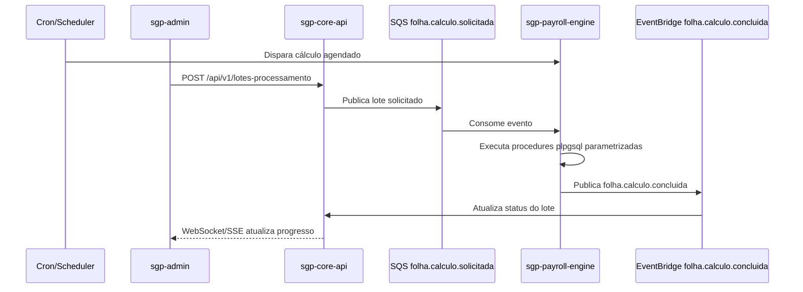
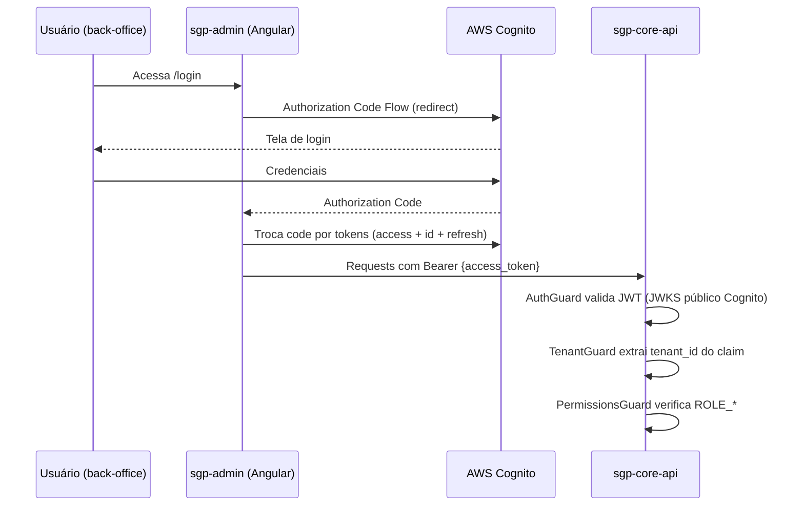
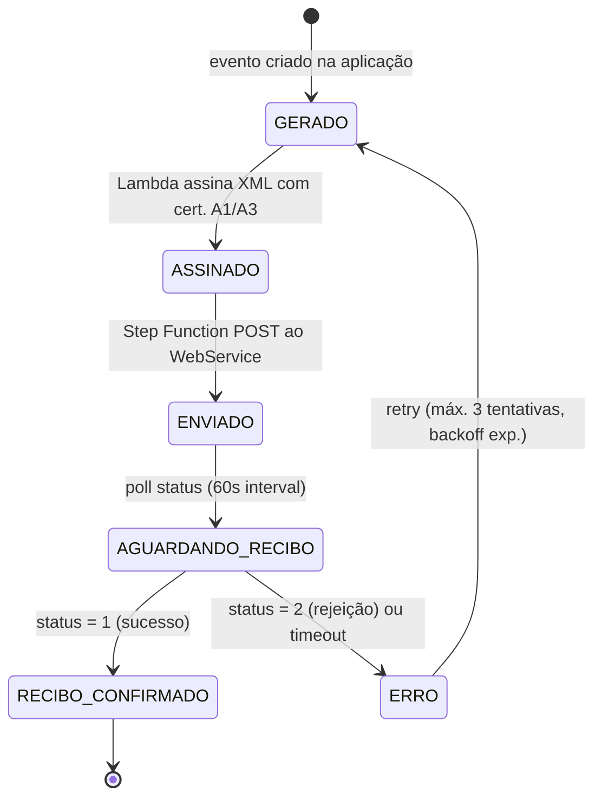
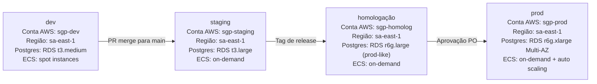

# Escopo e Decisões de Arquitetura — SGP Moderno
**Versão:** 1.0 | **Data:** 2026-04-21 | **Status:** Draft
**Escopo:** transversal (todas as decisões de produto e arquitetura) | **Depende de:** BRIEF.md, 00-visao-produto-glossario.md

---

## Sumário

1. [Decisões de Arquitetura](#1-decisões-de-arquitetura)
2. [Stack Tecnológico Consolidado](#2-stack-tecnológico-consolidado)
3. [Ambientes](#3-ambientes)
4. [Critérios de Paridade com o Legado](#4-critérios-de-paridade-com-o-legado)
5. [Roadmap de Implementação (Ordem Mandatória)](#5-roadmap-de-implementação-ordem-mandatória)
6. [Riscos e Mitigações](#6-riscos-e-mitigações)
7. [Critérios de Aceite por Domínio](#7-critérios-de-aceite-por-domínio)

---

## 1. Decisões de Arquitetura

**Decisão de escopo:** Arrecadação Previdenciária fica em versão futura, fora dos gates de paridade, rotas, banco, menus, autorização e testes do v0.0.1.

**Decisões temporárias de 2026-04-26:** a árvore frontend do `sgp-admin`, rotas administrativas backend, OAuth/Cognito/Gov.br e gestão administrativa de identidade ficam para instalação posterior; eSocial é stub/sandbox no pacote atual; testes sem S3 podem usar MiniIO em Docker; a estratégia de `./infra` e os gates de governança ficam postergados até nova decisão.

As dez decisões a seguir foram aprovadas pelo product owner e são **imutáveis no escopo do MVP**. Alterações requerem novo ADR com número sequencial em `./adr/`.

### Tabela Resumo

| # | Tema | Decisão |
|---|---|---|
| 1 | Multi-tenancy | SaaS multi-tenant com `tenant_id` em todas as tabelas; PostgreSQL Row-Level Security obrigatória |
| 2 | Motor de folha | Implementação separada `sgp-payroll-engine`, acionável por cron e requisição, com progresso de lote/in-lote e camada fina sobre rotinas `plpgsql` parametrizadas |
| 3 | Escopo de domínios | Todos os 11 menus de 1º nível cobertos em profundidade equivalente ao legado |
| 4 | Autenticação / SSO | Alvo futuro OAuth2/OIDC com user pools separados; fluxos OAuth/Cognito/Gov.br ficam em instalação posterior |
| 5 | Portal do Funcionário | Aplicação separada (`sgp-portal-ui` + `sgp-portal-api`), backend próprio, acesso read-only ao banco com menor privilégio |
| 6 | Armazenamento de arquivos | S3 real em produção/homologação; MiniIO em Docker permitido em testes sem S3 configurado |
| 7 | eSocial | Apenas leiaute S-1.2; adapter stub/sandbox no pacote atual; envio real futuro |
| 8 | Motor de fórmulas de verbas | SQL-based: DSL declarativa compilada para SQL parametrizado no momento do cálculo |
| 9 | Auditoria | Somente em domínios sensíveis; tabela única `audit_log` com diff JSONB |
| 10 | i18n / Terminologia | `termo_funcionario` como chave de i18n; pt-BR único idioma no MVP |

---

### Decisão 1 — Multi-tenancy com Row-Level Security

**Decisão:** Modelo SaaS multi-tenant com isolamento de dados por `tenant_id` em todas as tabelas de negócio, aplicando PostgreSQL Row-Level Security (RLS) como barreira de garantia.

**Contexto:** O legado implementa multi-tenancy por schema isolado (um schema PostgreSQL ou banco SQL Server por cliente). Esse modelo tem custo operacional alto: cada novo cliente exige DDL de schema inteiro, as migrations precisam ser rodadas N vezes (uma por tenant), índices e estatísticas ficam fragmentados, e conexões de pool aumentam proporcionalmente ao número de clientes. Com dezenas de prefeituras, o modelo legado se torna inviável.

**Justificativa:**
- **Row-level isolation** permite que todos os tenants compartilhem a mesma instância RDS Multi-AZ, reduzindo custo de infra em até 70% comparado a schemas isolados.
- **PostgreSQL RLS** é o mecanismo de banco que garante isolamento mesmo se um bug de aplicação não filtrar `tenant_id` — a política de banco é a última linha de defesa.
- **Migrations únicas:** com Flyway/Prisma Migrate, uma única migration é aplicada a todos os tenants simultaneamente, eliminando deriva de schema.
- O `TenantGuard` NestJS injeta o `tenant_id` no contexto de request a partir do claim JWT do Cognito, antes de qualquer acesso a repositório.
- Dados de um tenant nunca aparecem em queries de outro tenant, verificável por teste de contrato (`Pact`).

**Consequências e restrições:**
- Nenhuma tabela de negócio pode existir sem `tenant_id` (verificado por linter de migration).
- Relatórios cross-tenant (ex.: consolidado de todos os entes para o fornecedor do SaaS) usam conta AWS separada com acesso read-only via AWS DMS/replicação.
- Backup por tenant é implementado via tag S3 + snapshot RDS filtrado por `tenant_id` em scripts de restore.

---

### Decisão 2 — Motor de Folha como Microsserviço

**Decisão:** O cálculo de folha de pagamento é implementado como serviço separado (`sgp-payroll-engine`), com possibilidade de execução em infraestrutura dedicada, acionamento por agendamento (cron) e por requisição explícita de cálculo, consulta de progresso por lote e por item do lote, e lógica de cálculo concentrada em rotinas parametrizadas `plpgsql` sob uma camada fina de orquestração.

**Contexto:** O legado calcula folha diretamente no monólito, misturando lógica de negócio com chamadas de banco e procedimentos SQL. Isso torna impossível escalar o cálculo independentemente do restante da aplicação, gera timeouts em competências com muitos servidores e impede testes unitários isolados das regras de cálculo.

**Justificativa:**
- **Escala independente:** a engine pode escalar e ser implantada separadamente sem degradar o backend REST administrativo.
- **Execução operacional flexível:** suporta fechamento automático por agenda e execução sob demanda por ação de usuário/sistema.
- **Visibilidade de execução:** progresso de lote e in-lote alimenta interfaces sem polling pesado no backend principal.
- **Performance orientada a banco:** rotinas `plpgsql` reduzem tráfego entre aplicação e banco e aproveitam processamento próximo dos dados.
- **Camada de gestão mínima:** orchestration e observabilidade ficam na aplicação; regras matemáticas e agregações ficam no banco.

**Comunicação:**


---

### Decisão 3 — Cobertura de Todos os 12 Menus

**Decisão:** O escopo do SGP Moderno cobre paridade funcional completa com todos os 11 menus de primeiro nível do legado, sem simplificações ou exclusões de funcionalidade documentada.

**Contexto:** Houve debate sobre priorizar apenas Módulo RH + Folha no MVP e deixar Previdenciário, Perícia e Recrutamento para fases posteriores. Essa abordagem foi rejeitada porque clientes do legado utilizam os 11 módulos em operação diária — uma migração parcial obrigaria a manutenção simultânea de dois sistemas por prazo indeterminado.

**Justificativa:**
- Paridade total elimina o risco de dupla operação (legado + novo) que gera inconsistência de dados e custo operacional dobrado.
- Os 11 bounded contexts são suficientemente isolados para serem desenvolvidos em paralelo por times diferentes.
- Os golden scenarios (ver seção BRIEF §10) cobrem os fluxos críticos de todos os módulos.
- O roadmap por waves (seção 5 deste documento) define a ordem de entrega, mas o escopo total é garantido no MVP.

---

### Decisão 4 — Autenticação via AWS Cognito e OAuth2/OIDC

**Decisão:** A autenticação usa OAuth2/OIDC com separação explícita de domínios de identidade: user pool de staff para `SGP-CORE` e user pool de employees/beneficiários/candidatos para `SGP-PORTAL`. Sistemas externos seguem client-credentials flow.

**Contexto:** O legado usa session-based authentication com uma API-key proprietária (`SGP-API-KEY`) para sistemas externos. Não há SSO, não há MFA padronizado e a gestão de usuários é acoplada ao banco de dados da aplicação.

**Justificativa:**
- **Separação de blast radius:** incidente de autenticação no portal não contamina autenticação administrativa do core.
- **Políticas diferentes por população:** MFA, ciclo de senha, lockout e políticas de risco podem divergir entre staff e employees.
- **Client-credentials flow** para sistemas externos é auditável, revogável e elimina API-keys proprietárias.
- **Claim `tenant_id`** no JWT mantém isolamento multitenant no core.
- **Integração com IdP externo** (ex.: Gov.br) pode existir no pool do portal sem impactar o pool do core.

**Fluxo de autenticação back-office:**


---

### Decisão 5 — Portal do Funcionário como Aplicação Separada

**Decisão:** O Portal do Funcionário é uma aplicação separada do core, composta por frontend próprio (`sgp-portal-ui`) e backend próprio (`sgp-portal-api`), com acesso somente leitura ao banco e privilégios mínimos.

**Contexto:** No legado, o portal do servidor é uma seção dentro da mesma aplicação administrativa, com controle de acesso frágil baseado em roles. Isso cria risco de exposição de dados sensíveis e dificulta customização da experiência do usuário final.

**Justificativa:**
- **Separação real de aplicação:** portal não compartilha processo backend com core administrativo.
- **Privilégio mínimo de banco:** `sgp-portal-api` opera com role read-only e acesso restrito a objetos publicados para portal.
- **Userpool separado:** autenticação de employees não compartilha superfície de identidade com staff.
- **Deploy e escala independentes:** mudanças no portal não afetam o backend administrativo.

---

### Decisão 6 — S3-Compatible como Único Armazenamento de Arquivos

**Decisão:** Todo arquivo digital gerado ou recebido pelo SGP (PDFs, contracheques, remessas CNAB, XMLs eSocial, currículos, laudos, comprovantes) é armazenado em S3-compatible storage. Produção/homologação usam AWS S3; testes sem S3 configurado podem usar MiniIO em Docker. Sem fallback para disco local ou NFS.

**Contexto:** O legado armazena arquivos em sistema de arquivos local do servidor de aplicação, criando dependência de volume compartilhado (NFS) em ambientes com múltiplas instâncias, risco de perda em restart de containers e impossibilidade de controle de acesso por tenant.

**Justificativa:**
- **Isolamento por tenant:** cada tenant tem bucket próprio (ou prefixo de bucket com política de bucket policy por `tenant_id`), garantindo que arquivos de um ente não sejam acessíveis a outro.
- **SSE-KMS:** cifragem em repouso com chave KMS por tenant — atende requisitos de LGPD para dados sensíveis (laudos médicos, dados de folha).
- **Versionamento:** habilitado para buckets de documentos oficiais; permite auditoria de versões anteriores de contracheques e laudos.
- **Lifecycle policies:** arquivos de remessa CNAB processados são movidos para S3 Glacier após 90 dias; contracheques de competências fechadas após 12 meses.
- **Presigned URLs:** o backend não serve arquivos diretamente — emite presigned URLs com TTL curto (15 minutos), eliminando o custo de transferência pelo Fargate.

**Convenção de chave S3:**
```
{tenant_id}/outputs/{dominio}/{ano}/{mes}/{entidade_id}.{ext}
{tenant_id}/inputs/{dominio}/{ano}/{mes}/{arquivo_original}
{tenant_id}/fotos/{pessoa_id}.jpg
```

---

### Decisão 7 — eSocial Apenas Leiaute S-1.2

**Decisão:** O SGP implementa exclusivamente o leiaute eSocial S-1.2. Eventos assíncronos são processados por Lambda + Step Functions (`sgp-esocial-worker`). Leiautes anteriores (S-1.0, S-1.1) não são suportados.

**Contexto:** O legado suporta o leiaute S-1.0, que está em processo de descontinuação pelo Governo Federal. Manter compatibilidade com múltiplos leiautes aumentaria o custo de manutenção e o risco de inconsistência.

**Justificativa:**
- **S-1.2 é o leiaute ativo e obrigatório** para entes do setor público a partir dos prazos estabelecidos pelo Governo Federal; suportar S-1.0 apenas adicionaria débito técnico.
- **Lambda + Step Functions** torna o envio resiliente: retry automático com backoff exponencial até 3 tentativas, rastreabilidade de cada evento (estado: gerado, assinado, enviado, recibo confirmado).
- **Eventos cobertos:** S-1000 (empregador), S-1005 (tabela de estabelecimentos), S-1010 (tabela de rubricas), S-1020 (tabela de lotações), S-1030 (tabela de cargos), S-1035 (cargos públicos), S-1040 (funções), S-1050 (horários), S-1060 (ambientes), S-1070 (processos adm./judicial), S-1080 (operadores portuários), S-2xxx (eventos não-periódicos), S-3xxx (exclusões).
- **Feature flag `esocial.enabled`:** permite habilitar/desabilitar o módulo por tenant sem redeploy, facilitando implantação faseada.

**Fluxo de envio:**


---

### Decisão 8 — Motor de Fórmulas SQL-Based

**Decisão:** As fórmulas de verbas são escritas em DSL declarativa, validadas e compiladas para expressões SQL parametrizadas no momento do cálculo de folha. A execução ocorre sobre a base consolidada de competência no banco PostgreSQL.

**Contexto:** O legado implementa fórmulas como código Java/Groovy interpretado, o que torna a manutenção arriscada (scripts podem executar código arbitrário), impede validação estática e dificulta auditoria. A alternativa de reescrever em Turing-complete (ex.: JavaScript sandbox) foi considerada e descartada por risco de performance e segurança.

**Justificativa:**
- **Segurança por design:** a DSL é não-Turing-complete — não permite loops, recursão nem acesso a sistemas externos. O compilador rejeita qualquer expressão fora do subconjunto permitido.
- **Performance:** expressões SQL executadas diretamente no PostgreSQL aproveitam índices, estatísticas e paralelismo do banco — mais eficiente que loops em aplicação para N servidores.
- **Transparência:** `memoria_calculo JSONB` no lançamento registra cada variável (`atributo_formula`) e seu valor no momento do cálculo, permitindo auditoria linha a linha do contracheque.
- **Versionamento:** a entidade `formula` tem `versao`, `data_vigencia_inicio` e `data_vigencia_fim` — retroalimentar cálculos históricos usa a versão vigente na data da competência.
- **Atributos semânticos:** `atributo_formula` mapeia nomes legíveis (`salario_base`, `dias_trabalhados`) para colunas do banco, isolando o analista de verbas da estrutura física.

**Exemplo de DSL e SQL compilado:**

```
DSL:    valor = salario_base * (dias_trabalhados / dias_mes)
SQL:    SELECT f.nivel_salarial_valor * (t.dias_trab / t.dias_mes)
        FROM funcionario f
        JOIN competencia_contexto t ON t.funcionario_id = f.id
        WHERE f.id = :funcionario_id AND f.tenant_id = :tenant_id
```

---

### Decisão 9 — Auditoria Seletiva em Domínios Sensíveis

**Decisão:** A trilha de auditoria é registrada apenas em domínios sensíveis (folha, verbas, vida funcional, previdenciário, perícia, usuários/papéis). A tabela `audit_log` é única, com diff JSONB, particionada por ano/mês.

**Contexto:** Auditar 100% das operações de todos os módulos geraria volume de dados excessivo, degradaria performance de escrita e tornaria inviável a análise humana dos registros. A decisão é fazer auditoria seletiva e rica (diff de estado) em vez de auditoria exaustiva e rasa (apenas log de acesso).

**Justificativa:**
- **Conformidade LGPD:** dados sensíveis de folha (rendimentos, descontos, situação previdenciária) e dados médicos (CID, laudos) requerem trilha rastreável de acesso e modificação.
- **Diff JSONB:** registrar antes/depois em JSON permite reconstruir o histórico exato de qualquer entidade auditada sem consultar tabelas de negócio.
- **Particionamento:** `audit_log` particionado por `(tenant_id, ano, mes)` mantém queries ágeis mesmo com bilhões de registros acumulados ao longo de anos.
- **Feature flag `AUDIT_FULL_TRACE_ENABLED`:** permite habilitar auditoria completa para tenants que requeiram (ex.: por determinação judicial) sem afetar outros.
- **Módulos auditados obrigatoriamente:** folha, verbas, vida funcional, previdenciário, perícia, usuários, papéis. Módulos opcionais (quando flag ativa): cadastro de pessoa, documentos, dependentes.

---

### Decisão 10 — i18n por Terminologia Configurável, pt-BR Único Idioma

**Decisão:** O único idioma suportado no MVP é pt-BR. A variação de terminologia (Servidor vs Funcionário vs Colaborador) é resolvida por chave de i18n `termo_funcionario` / `termo_funcionario_plural`, injetada em runtime por tenant.

**Contexto:** Entes públicos usam termos diferentes para seus trabalhadores: prefeituras falam "servidor", câmaras falam "vereador" ou "funcionário", empresas mistas falam "colaborador". O legado resolve isso com parametrização de label, mantida como chave de sistema. A pedido do product owner, i18n completo para outros idiomas (espanhol, inglês) foi descartado do MVP por custo/benefício.

**Justificativa:**
- **Custo de i18n completo:** traduzir 11 módulos com centenas de labels, mensagens de erro e relatórios para múltiplos idiomas representa esforço desproporcionalmente alto para um produto de mercado interno brasileiro.
- **Terminologia variável é suficiente:** a única variação real entre tenants é o nome do trabalhador — não a língua. Resolver só isso tem custo mínimo e valor máximo.
- **Angular i18n:** `@angular/localize` com chave única `{{ termoFuncionario }}` interpolada em todos os componentes que exibam esse label.
- **Backend:** `ParametroSistemaService.get('termo_funcionario')` é injetado em labels de relatórios PDF e mensagens de e-mail via template Handlebars.

---

### Diretriz Complementar — Framework Corporativo Comum para Auth/Authz e Storage

**Decisão:** Funcionalidades de armazenamento/recuperação documental, gestão de usuários, login, autenticação, autorização e RBAC são providas por framework interno comum da organização, consumido pelo SGP como dependência externa.

**Contexto:** Esses blocos não são diferenciais de domínio do SGP e já possuem implementação institucional mantida por equipe dedicada.

**Justificativa:**
- **Foco no domínio:** times SGP concentram esforço em RH/Folha/Previdência e paridade com legado.
- **Padronização corporativa:** mecanismos de identidade e autorização ficam consistentes entre produtos internos.
- **Menor custo de manutenção local:** o core não reimplementa funcionalidades transversais já maduras.

---

## 2. Stack Tecnológico Consolidado

### Backend

| Componente | Tecnologia | Versão mínima | Justificativa |
|---|---|---|---|
| Runtime | Node.js | 20 LTS | Suporte LTS ativo; compatível com NestJS e dependências |
| Framework | NestJS (TypeScript) | 10.x | Modular, decorators, DI nativo, OpenAPI integrado, guards composáveis |
| Linguagem | TypeScript | 5.x | Tipagem forte; fundamental para DSL/motor de fórmulas |
| ORM / Query Builder | Prisma OU TypeORM | Prisma 5.x / TypeORM 0.3.x | Decidir em ADR-0002; Prisma preferido por migrations versionadas e type-safety |
| Banco de dados | PostgreSQL | 16+ | RLS, JSONB, particionamento, pg_trgm, paralelismo de queries |
| Mensageria | AWS SQS + SNS + EventBridge | — | Fanout, dead-letter queues, retry gerenciado |
| Cache | AWS ElastiCache (Redis) | 7.x | Cache de parâmetros de sistema, sessões, rate limiting |
| Geração de PDF | Puppeteer (headless Chrome) | — | Templates Handlebars renderizados server-side |
| Validação | class-validator + class-transformer | — | DTOs com decorators; integrado ao NestJS Pipes |
| Documentação API | @nestjs/swagger (OpenAPI 3.1) | — | Gerado automaticamente dos decorators |
| Testes unitários | Jest | 29.x | Padrão NestJS; mocks, coverage, snapshot |
| Testes de contrato | Pact | 12.x | Garantia de compatibilidade entre `sgp-core-api` e `sgp-payroll-engine` |

### Frontend

| Componente | Tecnologia | Versão mínima | Justificativa |
|---|---|---|---|
| Framework | Angular | última LTS (18.x+) | Standalone components, signals, SSR, enterprise-grade |
| Linguagem | TypeScript | 5.x | Consistência com backend |
| Monorepo | Nx | 19.x | Lazy loading, libs compartilhadas (`@sgp/*`), build cache, affected builds |
| State management | NgRx Signal Store OU Akita | — | Decidir em ADR-0003; Signal Store preferido por integração nativa com signals |
| UI Kit | Angular Material + customização | 18.x | Acessibilidade (WCAG 2.1 AA), componentes de formulário ricos |
| i18n | @angular/localize | — | Chaves pt-BR; `termo_funcionario` como token injetável |
| Testes e2e | Playwright | 1.x | Multi-browser; testes de fluxo completo de folha e perícia |
| Build | esbuild (via Angular CLI) | — | Build incremental; code splitting por feature lib |

### Infra AWS

| Serviço | Uso |
|---|---|
| **RDS PostgreSQL Multi-AZ** | Banco principal; réplica de leitura para relatórios pesados |
| **ECS Fargate** | Containers de `sgp-core-api`, `sgp-portal-api`, `sgp-payroll-engine`, workers; auto scaling |
| **S3** | Armazenamento de arquivos por tenant (contracheques, remessas, laudos, currículos) |
| **SNS / SQS** | Mensageria assíncrona entre serviços; dead-letter queues para retry |
| **EventBridge** | Eventos de domínio cross-service (folha calculada, eSocial pendente) |
| **Lambda** | Funções utilitárias: assinatura digital eSocial, conversão de arquivo, CRON triggers |
| **Step Functions** | Orquestração de cálculo em lote (`payroll-lote`) e envio eSocial (`esocial-envio`) |
| **Cognito User Pools** | User pools separados para `SGP-CORE` (staff) e `SGP-PORTAL` (employees/beneficiários/candidatos) |
| **API Gateway** | Entrada pública de APIs; WAF integrado; rate limiting por tenant |
| **CloudFront + WAF** | CDN para SPAs Angular; proteção de borda; regras de geo-bloqueio |
| **Secrets Manager** | Credenciais de banco, certificados eSocial, API keys de bancos |
| **KMS** | Chaves de cifragem S3 SSE-KMS por tenant; cifragem de secrets em repouso |
| **CloudWatch** | Logs estruturados JSON; métricas de negócio; dashboards operacionais |
| **X-Ray** | Rastreamento distribuído de requests através dos microsserviços |
| **ECR** | Registry de imagens Docker dos serviços |
| **Route 53** | DNS gerenciado; health checks; failover |

### Observabilidade

| Dimensão | Ferramenta | Detalhes |
|---|---|---|
| Logs | CloudWatch Logs | Estruturado JSON; campos obrigatórios: `tenant_id`, `request_id`, `service`, `level` |
| Traces | AWS X-Ray via OpenTelemetry | Span por request HTTP, span por query DB, span por evento SQS |
| Métricas de negócio | CloudWatch Custom Metrics | `folhas_fechadas_mes`, `contracheques_emitidos_mes`, `esocial_eventos_enviados` |
| Alertas | CloudWatch Alarms → SNS → PagerDuty/Slack | SLA: p99 API < 2s; erro 5xx < 0.1%; fila SQS > 1000 msgs |
| Dashboards | CloudWatch Dashboards | Por ambiente (staging, prod) e por serviço |

### Testes

| Nível | Ferramenta | Escopo |
|---|---|---|
| Unitário | Jest | Services, repositories, formula engine, DTOs |
| Integração | Jest + testcontainers (PostgreSQL) | Módulos completos com banco real |
| Contrato | Pact | Interface `sgp-core-api` ↔ `sgp-payroll-engine` |
| E2E | Playwright | Golden scenarios A-G (ver BRIEF §10) |
| Migração | Scripts Jest + dumps SQL Server reais | Comparação de dados legado × novo após ETL |
| Carga | k6 | Simulação de fechamento de folha com 10k servidores simultâneos |

### CI/CD

Alvo futuro. Pela decisão temporária de 2026-04-26, gates de governança/release e a escolha final de IaC não bloqueiam a reavaliação atual.

| Etapa | Ferramenta | Ação |
|---|---|---|
| CI | GitHub Actions | Lint, typecheck, testes, build, SAST (CodeQL) |
| CD (staging) | GitHub Actions → ECR → ECS | Deploy automático em push para `main` |
| CD (prod) | GitHub Actions + aprovação manual | Deploy via approval gate em PR de release |
| Migrations | Flyway (ou Prisma Migrate) | Aplicadas antes do deploy; rollback automático em falha |
| IaC | A definir | CloudFormation, Terraform, AWS SDK e scripts AWS CLI permanecem opções abertas |

---

## 3. Ambientes

### Visão Geral



### Detalhamento por Ambiente

| Dimensão | dev | staging | homologação | prod |
|---|---|---|---|---|
| **Conta AWS** | `sgp-dev` | `sgp-staging` | `sgp-homolog` | `sgp-prod` |
| **Região AWS** | sa-east-1 (São Paulo) | sa-east-1 | sa-east-1 | sa-east-1 (+ us-east-1 para DR) |
| **PostgreSQL** | RDS t3.medium, Single-AZ | RDS t3.large, Single-AZ | RDS r6g.large, Single-AZ | RDS r6g.xlarge, Multi-AZ, réplica de leitura |
| **ECS** | Fargate Spot (reduz custo) | Fargate on-demand | Fargate on-demand | Fargate on-demand + auto scaling (min 2, max 10) |
| **S3** | Bucket por ambiente, sem lifecycle | Bucket por ambiente | Bucket prod-like com lifecycle | Buckets por tenant, SSE-KMS, lifecycle policies |
| **Cognito** | UserPools core+portal (dev) | UserPools core+portal (staging) | UserPools core+portal (homolog) | UserPools core+portal (prod), com federação externa opcional apenas no portal |
| **Deploy** | Automático em push para branch feature (opcional) | Automático em push para `main` | Manual via tag de release | Manual via aprovação do PO |
| **Dados** | Fixtures e seeds gerados; sem dados reais | Dados anonimizados do legado (ETL obfuscado) | Cópia de prod anonimizada para testes de paridade | Dados reais dos tenants; LGPD em pleno vigor |
| **Migrations** | Automáticas no boot | Automáticas no boot | Automáticas via pipeline | Pré-aprovadas; rodadas no pipeline antes do deploy |
| **Monitoramento** | CloudWatch básico; sem alertas PagerDuty | CloudWatch + alertas Slack | CloudWatch + alertas Slack | CloudWatch + X-Ray + alertas PagerDuty (on-call) |
| **Backup** | Não (dados sintéticos) | Snapshot diário (retenção 7 dias) | Snapshot diário (retenção 30 dias) | Snapshot automático Multi-AZ + PITR 35 dias |

### Isolamento de Dados

- Dados de produção **nunca** são copiados para dev ou staging sem processo de anonimização aprovado.
- Para homologação, um job de ETL obfusca CPF, nome, data de nascimento, dados bancários e endereço antes da cópia.
- Cada conta AWS tem IAM roles separadas — um desenvolvedor com acesso a `sgp-dev` não pode assumir role em `sgp-prod`.
- Secrets de produção (certificados eSocial, chaves KMS de tenant) são inacessíveis fora da conta `sgp-prod`.

---

## 4. Critérios de Paridade com o Legado

Paridade funcional é o critério de aceite do MVP. A tabela abaixo define o que deve existir por menu para declarar paridade.

### 4.1 Paridade por Menu

| Menu | Critério de paridade mínimo |
|---|---|
| **Gestão** | CRUD de empresa matriz, filial, lotação, centro de custo, cargo, função, turno, banco, referência salarial; gestão de usuários, perfis e papéis com todos os `ROLE_*` documentados; parametrização de `ParametroSistema` e `ParametroGlobal`. |
| **Módulo RH** | Ciclo funcional completo (CADASTRO_BASE → POSSE → ATIVO → AFASTAMENTO → TRANSFERÊNCIA → DESLIGAMENTO); ficha funcional como view materializada; dossiê com download ZIP; regras de CPF único, matrícula automática/manual, cedência com sigilo, validação de limite anual de afastamentos. |
| **Folha de Pagamento** | Abertura/fechamento de competência; criação de folha por (filial × tipo_processamento); todos os 7 tipos de processamento; lançamentos manuais, importação de verbas (servidor/pensionista), importação de consignado; cálculo em lote e pontual; reprocessamento em 3 modos; emissão de contracheque (SERVIDOR, PENSIONISTA) com/sem marca d'água; relatório financeiro, batimento, ficha financeira; remessa CNAB. |
| **Módulo Avaliação** | Avaliações de desempenho com critérios parametrizáveis; progressões por mérito, titularidade, judicial e correção salarial; plano de cargos e carreira; simulador de nível salarial. |
| **Recrutamento e Seleção** | Ciclo completo de requisição de pessoal (RASCUNHO → CONCLUIDO); banco de talentos com currículo S3; programa de estágio; matrícula de estagiário; prorrogação e recesso; desligamento automático por data. |
| **Consultas Gerenciais** | Ficha financeira histórica; relatório gerencial de folha; quadro de pessoal; servidores em pagamento bloqueado; relatório de repasse fundo RH. |
| **Relatório** | Todos os relatórios PDF/XLSX documentados no BRIEF §7; geração assíncrona; filtros avançados; download via S3 presigned URL. |
| **Módulo Previdenciário** | Simulação e concessão de aposentadoria; pensão com rateio por cota-parte; certidão de tempo de contribuição; compensação previdenciária; ciclo de recadastramento (aposentado anual, pensionista semestral, universitário com alerta 25 anos); prova de vida pelos 3 canais. |
| **Auditoria** | Registro em `audit_log` para todos os 6 domínios sensíveis; diff JSONB antes/depois; filtros por entidade, ação, usuário, período; exportação; feature flag `AUDIT_FULL_TRACE_ENABLED`. |
| **Área de Saúde** | Cadastro de especialidades, médicos e agendas; janelas de agenda geradas automaticamente; ciclo completo de agendamento → prontuário → laudo → licença médica; réplica de licença por CPF para múltiplos vínculos; restrição ocupacional; readaptação; SST (exames, EPI/EPC, agentes nocivos, CAT). |
| **Convênio** | Cadastro de convênios; gestão de beneficiários; geração de arquivo de remessa e processamento de retorno; desconto automático em folha na competência. |

### 4.2 Paridade por Saída Oficial

Cada documento listado no BRIEF §7 deve ser produzido pelo SGP Moderno com conteúdo equivalente ao legado:

| Documento | Formato | Critério de paridade |
|---|---|---|
| Contracheque servidor | PDF | Mesmo layout de verbas, totais, dados funcionais; com/sem marca d'água |
| Contracheque pensionista | PDF | Template PENSIONISTA com beneficiários e rateio |
| Ficha financeira | PDF / XLSX | Histórico completo de competências com todos os lançamentos |
| Ficha funcional | PDF | View materializada com histórico funcional completo |
| Relatório de folha | PDF / XLSX | Totais por filial, tipo de processamento, verba |
| Batimento | PDF | Comparação competências; sinalização de discrepâncias |
| Laudo pericial padrão | PDF | Campos de prontuário + assinatura do médico |
| Comprovante de recadastramento | PDF | Dados do beneficiário + data/hora + operador |
| Certidão de tempo de contribuição | PDF | Período, órgão, ato de emissão |
| DIRF | TXT + PDF | Leiaute RFB anual com todos os beneficiários |
| SIPREV | XML | Leiaute MPS/SIPREV vigente |
| Remessa CNAB | TXT | CNAB 240 ou 400 por banco; todos os campos obrigatórios |

### 4.3 Paridade por Integração

| Integração | Critério |
|---|---|
| eSocial S-1.2 | Envio dos 11 eventos S-1xxx + S-2xxx/S-3xxx com recibo confirmado em staging |
| SIPREV | Arquivo XML gerado sem erros de validação no portal SIPREV sandbox |
| DIRF | Arquivo TXT validado pelo PGD-DIRF sem inconsistências |
| CNAB remessa/retorno | Remessa gerada; retorno bancário processado com atualização de status de pagamento |
| Portal prefeitura | Endpoints `/publico/prefeitura/*` respondendo com dados equivalentes ao legado |
| API externa | Endpoints `/externo/dados` e `/externo/dicionario/*` com OAuth2 client-credentials |
| Neoconsig | Import CSV com status `IMPORTADO` / `IMPORTADO_PARCIALMENTE` corretos |

---

## 5. Roadmap de Implementação (Ordem Mandatória)

O roadmap de v0.0.1 segue sequência estrita e não prevê camada de compatibilidade retroativa, shim ou modo híbrido com legado.

1. **SGP-CORE Database**
- Implementar o modelo físico canônico cobrindo 100% das features de referência.
- Garantir operações 1-para-1 com o legado no nível de dados.
- Organizar por schemas (`hr`, `payroll`, `portal`) sempre que aplicável.
- Publicar consumo do portal sobre `MATVIEWs` de `hr` e `payroll`.
- Melhorar desenho quando houver ganho técnico claro, preservando equivalência funcional.

2. **SGP-CORE Backend**
- Implementar rotas, métodos e contratos necessários para toda a cobertura funcional extraída da referência.
- Priorizar fechamento de lacunas em endpoints mutáveis (create/update/delete/ações de negócio).
- Manter `sgp-core-api` e `sgp-portal-api` separados, sem compartilhamento de runtime.

3. **Testes de Backend**
- Subir cobertura com testes unitários, testes de API/contrato e testes e2e de backend.
- Atingir os thresholds de governança definidos no repositório.
- Consolidar suíte de regressão para paridade de regras críticas (folha, RH, previdenciário, perícia).

4. **SGP-CORE Frontend**
- Estender a implementação atual para cobrir todos os casos de uso reportados na referência.
- Preservar separação de aplicações (`sgp-admin` e `sgp-portal-ui`) com experiência e escopo próprios.

5. **Testes de Frontend**
- Implantar testes unitários e e2e para frontend até níveis de cobertura exigidos pela governança.
- Assegurar regressão automatizada para fluxos críticos administrativos e de autoatendimento.

---

## 6. Riscos e Mitigações

| # | Risco | Probabilidade | Impacto | Mitigação |
|---|---|---|---|---|
| R01 | **Paridade de fórmulas de verbas:** fórmulas do legado (Java/Groovy) produzem resultados diferentes das fórmulas SQL compiladas para edge cases numéricos (arredondamento, truncamento, dias úteis) | Alta | Crítico (folha errada = passivo trabalhista) | Criar test suite com 200+ casos extraídos de folhas históricas reais; validar cada verba individualmente durante a Fase 1 (database) e Fase 2 (backend) |
| R02 | **Migração de dados:** schema legado (SQL Server) tem inconsistências históricas, CPFs inválidos, vínculos sem posse, períodos sobrepostos | Alta | Alto | ETL incremental com regras de sanitização documentadas; testes de migração com dumps reais de staging; campo `migrado_legado_id` para rastreabilidade; período de coexistência com legado |
| R03 | **eSocial S-1.2 complexidade:** leiaute S-1.2 tem regras de validação XSD e regras de negócio publicadas pelo governo; falhas geram multas | Média | Alto | Ambiente sandbox eSocial desde início da Fase 2 (backend); parceria com empresa especializada em eSocial para revisão; cobertura de testes com XSD validator |
| R04 | **Multi-tenancy performance:** queries com `tenant_id` em tabelas de bilhões de linhas (contracheque, lancamento, audit_log) podem degradar com muitos tenants | Média | Alto | Particionamento por `(tenant_id, ano, mes)`; índices compostos `(tenant_id, <campo_filtro>)`; testes de carga k6 simulando 50 tenants com 10k servidores cada |
| R05 | **Sigilo fiscal IRRF:** dados de rendimentos e IRRF são sigilosos; vazamento entre tenants ou exposição indevida via API tem implicações legais | Baixa | Crítico | RLS PostgreSQL como última barreira; `TenantGuard` validado em testes de contrato; auditoria obrigatória de `EXPORT` e `PRINT`; pentest antes do go-live de produção |
| R06 | **Integração bancária CNAB:** cada banco tem variações do layout CNAB 240/400; formato de agência, conta e dígito variam | Alta | Médio | Biblioteca de parsers CNAB tipesafe com testes por banco (Bradesco, BB, Caixa, Itaú, Santander como prioritários); modo simulação de retorno para homologação |
| R07 | **Escalabilidade do motor de folha:** processamento de lote de 50.000+ contracheques em uma única competência pode ultrapassar timeouts de Lambda e ECS | Média | Alto | Step Functions `payroll-lote` com paralelismo por filial; cada tarefa processa até 500 contracheques; timeout por tarefa 15min; teste de carga obrigatório até o fim da Fase 2 |
| R08 | **Certificado digital eSocial (A1/A3):** gestão do ciclo de vida do certificado (expiração, revogação) pode causar interrupção de envios | Média | Médio | Alerta automático com 90/30/7 dias de antecedência; rotação de certificado em Secrets Manager sem downtime; runbook documentado |
| R09 | **Dependência de IdP externo no portal:** integrações federadas podem sofrer instabilidade e mudanças de contrato sem aviso prévio | Alta | Médio (apenas portal) | Circuit breaker no módulo de federação; fallback para autenticação no user pool próprio do portal; separar domínio de identidade do core |
| R10 | **Complexidade do Módulo Previdenciário:** regras de aposentadoria variam por ente (EC 103/2019 + legislações estaduais/municipais); parametrização insuficiente pode bloquear implantação | Alta | Alto | `regra_aposentadoria` totalmente parametrizável (critérios em JSON); levantamento de regras com pelo menos 3 entes-piloto antes da Wave 2; validação legal por especialista previdenciário |

---

## 7. Critérios de Aceite por Domínio

Os checklists a seguir são a tradução operacional da matriz de paridade legado × novo. Cada item deve ser verificado em ambiente de homologação com dados reais (anonimizados) antes da entrega final.

### 7.1 Gestão e RBAC

- [ ] Todos os 21 módulos com GESTAO integral listados no BRIEF §4 têm papel `ROLE_*_GESTAO` criado e funcional.
- [ ] Todos os CRUD granulares (`VISUALIZAR`, `CADASTRAR`, `ATUALIZAR`, `EXCLUIR`) funcionam por papel.
- [ ] `TenantGuard` bloqueia acesso de usuário de tenant A a dados de tenant B (teste de contrato obrigatório).
- [ ] Feature flags `esocial.enabled`, `PORTAL_SERVIDOR_ENABLED`, `GOV_BR_SSO_ENABLED` controlam exposição de menus corretamente.
- [ ] `ParametroSistema.termo_funcionario` altera labels em todas as telas do back-office e nos PDFs gerados.
- [ ] Estrutura organizacional: criação de empresa matriz → filial → lotação → centro de custo em cascata, com validações de unicidade.

### 7.2 Módulo RH

- [ ] Golden scenario A1: cadastro com matrícula automática conforme formato configurado.
- [ ] Golden scenario A2: cadastro com matrícula manual com validação de unicidade.
- [ ] Golden scenario A3: posse de servidor efetivo com todos os campos obrigatórios e geração de termo de posse PDF.
- [ ] CPF inválido (dígito verificador) é rejeitado; CPF duplicado no tenant é rejeitado.
- [ ] Afastamento com motivo de limite anual: excedente é rejeitado com mensagem explicativa.
- [ ] Cedência com sigilo: dados do documento de amparo ocultados para usuários sem papel de gestão.
- [ ] Transferência designada: custos permanecem na filial de origem.
- [ ] Reaproveitamento de CPF: sistema oferece reuso de dados pessoais existentes.
- [ ] Desligamento: inativa todas as verbas individuais ativas (`funcionario_verba`).
- [ ] Ficha funcional (view materializada) exibe histórico completo e é gerada em PDF.
- [ ] Dossiê: download ZIP com todos os anexos do funcionário, preservando nomes de arquivo originais.

### 7.3 Folha de Pagamento

- [ ] Golden scenario B1: abertura de competência e criação de folha mensal para pelo menos 2 filiais.
- [ ] Golden scenario B2: inclusão de servidor + cálculo imediato (MIT) + conferência do contracheque.
- [ ] Golden scenario B3: reprocessamento seletivo de contracheques marcados com erro.
- [ ] Golden scenario B4: fechamento programado — `competencia.estado` muda para FECHADA no horário configurado; folhas mudam para BLOQUEADO.
- [ ] Todos os 7 tipos de processamento geram contracheques corretos (verificar 13º integrante vs adiantamento, rescisão com verbas rescisórias).
- [ ] Importação de verbas é saneadora: importação substitui lançamentos existentes para a mesma verba.
- [ ] Batimento identifica discrepâncias ≥ R$ 0,01.
- [ ] Relatório financeiro: salvo com status `SALVO` e recuperado sem recálculo.
- [ ] Contracheque com marca d'água: PDF contém sobreposição visual "RASCUNHO".
- [ ] Motor de fórmulas: para cada verba com fórmula, `memoria_calculo` JSONB contém todos os atributos usados e seus valores.
- [ ] Remessa CNAB gerada sem erros de validação para os 5 bancos prioritários.

### 7.4 Módulo Previdenciário e Recadastramento

- [ ] Golden scenario C1: aposentado recadastrado presencialmente; comprovante emitido; status atualizado para RECADASTRADO.
- [ ] Golden scenario C2: pensionista universitário com 24 anos e 11 meses; alerta de proximidade dos 25 anos exibido (não bloqueante).
- [ ] Golden scenario C3: registro de ligação sem observação é rejeitado; com observação é aceito e aparece no histórico.
- [ ] Simulação de aposentadoria: resultado consistente com regra parametrizada do ente.
- [ ] Pensão: rateio entre beneficiários soma 100% (validação).
- [ ] Recadastramento via portal: prova de vida registrada com canal `PORTAL_COLABORADOR` e atualiza status.
- [ ] Certidão de tempo de contribuição: gerada em PDF com período, órgão e ato de emissão.

### 7.5 Área de Saúde (Junta Médica + SST)

- [ ] Golden scenario D1: agendamento de servidor ATIVO para especialidade disponível; janela de agenda marcada como ocupada.
- [ ] Golden scenario D2: atendimento com COMPARECEU → prontuário preenchido → licença médica criada com dias concedidos ≤ 720 acumulado.
- [ ] Golden scenario D3: laudo em PENDENTE_VALIDACAO → gestor aprova → status APROVADO; laudo reprovado retorna para médico.
- [ ] Golden scenario D4: licença replicada para todas as matrículas do mesmo CPF.
- [ ] Licença de tratamento familiar: dependente obrigatório; validação rejeita sem dependente.
- [ ] Benefício previdenciário XOR motivo afastamento remunerado: sistema rejeita ambos preenchidos simultaneamente.
- [ ] Dias acumulados de licença > 720: sistema exibe alerta e bloqueia concessão.

### 7.6 Recrutamento e Seleção

- [ ] Golden scenario E1: requisição aberta por gestor em RASCUNHO → encaminhada → EM_PROCESSO → notificação de e-mail para RH.
- [ ] Golden scenario E2: candidato adicionado com currículo PDF em S3 → análise → APROVADO → requisição CONCLUIDO com notificação ao solicitante.
- [ ] Golden scenario E3: programa de estágio criado → estagiário matriculado → prorrogação dentro do limite → recesso registrado → desligamento automático no job diário.
- [ ] Substituição sem colaborador substituído preenchido é rejeitada.
- [ ] Remoção de candidato: currículo excluído do S3.

### 7.7 Auditoria

- [ ] Criação de servidor: registro em `audit_log` com `acao = CREATE`, `dominio = VIDA_FUNCIONAL`, diff com estado inicial.
- [ ] Atualização de vínculo funcional: registro com `acao = UPDATE`, diff JSONB mostrando campos alterados.
- [ ] Emissão de contracheque: registro com `acao = PRINT`.
- [ ] Exportação de relatório de folha: registro com `acao = EXPORT`.
- [ ] Filtro por `usuario_id + periodo` retorna somente registros do tenant correto.
- [ ] Feature flag `AUDIT_FULL_TRACE_ENABLED = false`: nenhum registro gerado para módulos não sensíveis (ex.: cadastro de banco).

### 7.8 Integrações

- [ ] eSocial: evento S-1000 gerado com CNPJ do tenant e enviado ao sandbox com recibo confirmado.
- [ ] SIPREV: arquivo XML gerado para competência fechada sem erros de validação XSD.
- [ ] DIRF: arquivo TXT do ano-calendário validado pelo PGD-DIRF sem inconsistências.
- [ ] CNAB remessa: arquivo CNAB 240 gerado para folha calculada; campo de agência, conta e dígito corretos por banco.
- [ ] CNAB retorno: arquivo processado com atualização de status de pagamento dos contracheques correspondentes.
- [ ] Neoconsig: arquivo CSV importado com status `IMPORTADO`; descontos aparecem em lançamentos da folha.
- [ ] API externa: `GET /api/external/v1/` com token de sistema externo retorna dados do tenant correto; token de outro tenant é rejeitado com 403.

---

*Fim do documento 01-escopo-e-decisoes.md*
