# Use Cases — Administração & Segurança (UC-ADM)

**Versão:** 1.0 | **Data:** 2026-04-21 | **Status:** Draft
**Escopo:** Bounded context Auth, RBAC, Usuários/Perfis/Papéis, Menus, Parametrização, Auditoria, Tenancy, Arquivos S3, Notificações, Integrações horizontais.
**Depende de:** BRIEF.md, 01-escopo-e-decisoes.md, 40-divisao-modular.md.

---

## 1. Visão Geral do Contexto

O bounded context de **Administração & Segurança** é transversal a todos os demais contextos do SGP. Ele provê os alicerces de identidade, autorização, rastreabilidade e parametrização sobre os quais todo o sistema opera.

### Responsabilidades principais

| Subdomain              | Responsabilidade                                                                                                              |
| ---------------------- | ----------------------------------------------------------------------------------------------------------------------------- |
| **Autenticação**       | Fluxos OAuth2/OIDC com AWS Cognito (authorization code + PKCE, client-credentials, refresh, revogação, MFA, Gov.br federado). |
| **Autorização (RBAC)** | Modelo de 4 camadas: Tenant → Perfil → Papel → Usuário. Guards NestJS validam cada requisição.                                |
| **Gestão de usuários** | CRUD de usuários, convite por e-mail, desativação, associação de perfis e papéis.                                             |
| **Menus dinâmicos**    | Sidebar carregada por conjunto de papéis do usuário; cadastro de itens e feature flags.                                       |
| **Parametrização**     | `ParametroSistema` (identidade do tenant) e `ParametroGlobal` (tetos, índices), feature flags.                                |
| **Auditoria**          | Tabela `audit_log` com diff JSONB em domínios sensíveis; consulta e exportação.                                               |
| **Tenancy**            | Provisionamento, seeds e ciclo de vida de tenants.                                                                            |
| **Arquivos (S3)**      | Presigned URLs, metadados de anexos, exclusão lógica.                                                                         |
| **Notificações**       | E-mail transacional (SES), notificações in-app, preferências.                                                                 |

### Princípios arquiteturais aplicados

- **Row-Level Security** em PostgreSQL: todas as queries filtram `tenant_id` via `TenantGuard` NestJS que injeta o contexto antes da execução.
- **JWT Cognito** como token de acesso; claims `tenant_id`, `usuario_id`, `papeis[]` incluídos via Lambda trigger `pre-token-generation`.
- **Proteção dos SPAs**: `sgp-admin` e `sgp-portal` registram guardas de autenticação nas rotas privadas e enviam o JWT Cognito no cabeçalho `Authorization: Bearer` das chamadas HTTP autenticadas.
- **Sem segredo no front-end**: o PKCE elimina `client_secret` no SPA Angular; o `client_secret` existe apenas nos workers server-side (client-credentials).
- **Imutabilidade de papéis de sistema**: papéis `ROLE_*` são gerados por seed e versionados; o Admin do Tenant opera sobre associações, nunca sobre a definição dos papéis.
- **Presigned URLs efêmeras**: upload e download de S3 via URL com TTL ≤ 15 min; nenhum arquivo trafega pelo backend.

---

## 2. Atores

| Ator                  | Tipo            | Descrição                                                                                                                                                                  |
| --------------------- | --------------- | -------------------------------------------------------------------------------------------------------------------------------------------------------------------------- |
| **Admin do Tenant**   | Humano interno  | Usuário com perfil administrativo pleno dentro de um tenant. Gerencia usuários, perfis, papéis, parâmetros e feature flags do próprio tenant.                              |
| **Auditor**           | Humano interno  | Usuário com papel `ROLE_AUDITORIA_GESTAO`. Acesso somente-leitura à trilha de auditoria e exportação de relatórios.                                                        |
| **Usuário Final**     | Humano interno  | Qualquer colaborador autenticado com papel funcional (RH, Folha, Previdenciário etc.). Realiza autenticação, troca de senha, logout, upload/download de arquivos próprios. |
| **Servidor (Portal)** | Humano externo  | Servidor/pensionista/candidato que acessa o `sgp-portal`. Autenticação via Cognito ou Gov.br (fase 2).                                                                     |
| **Sistema Externo**   | Sistema         | Aplicações externas (prefeitura, BI, integrações) que consomem a API via OAuth2 client-credentials. Representa o legado `SGP-API-KEY`.                                     |
| **Gov.br IdP**        | Sistema externo | Provedor de identidade federado ao Cognito User Pool via OIDC. Autentica cidadãos com credenciais Gov.br.                                                                  |
| **AWS Cognito**       | Sistema AWS     | User Pool que centraliza identidade, emissão de tokens JWT, MFA, e federation.                                                                                             |
| **AWS S3**            | Sistema AWS     | Armazenamento objeto para anexos, logos, relatórios e arquivos de integração.                                                                                              |

---

## 3. Diagrama de Use Cases

```mermaid
flowchart TD
    subgraph Atores
        ADM([Admin do Tenant])
        AUD([Auditor])
        USR([Usuário Final])
        SRV([Servidor - Portal])
        EXT([Sistema Externo])
        GOVBR([Gov.br IdP])
        COG([AWS Cognito])
        S3([AWS S3])
    end

    subgraph AUTH[Autenticação]
        UC001[UC-ADM-001\nAutenticar via Cognito PKCE]
        UC002[UC-ADM-002\nAutenticar via Gov.br]
        UC003[UC-ADM-003\nAutenticar Sistema Externo]
        UC004[UC-ADM-004\nRefresh Token]
        UC005[UC-ADM-005\nLogout / Revogar]
        UC006[UC-ADM-006\nMFA TOTP/SMS]
        UC007[UC-ADM-007\nRecuperar Senha]
        UC008[UC-ADM-008\nAlterar Senha]
    end

    subgraph USERS[Usuários e Perfis]
        UC010[UC-ADM-010\nCriar Usuário]
        UC011[UC-ADM-011\nConvidar por E-mail]
        UC012[UC-ADM-012\nDesativar Usuário]
        UC013[UC-ADM-013\nCriar/Editar Perfil]
        UC014[UC-ADM-014\nAssociar Papéis a Perfil]
        UC015[UC-ADM-015\nAssociar Perfis a Usuário]
        UC016[UC-ADM-016\nAtribuir Papel Direto]
        UC017[UC-ADM-017\nListar Usuários por Filial/Perfil]
    end

    subgraph MENUS[Menus e Autorização]
        UC020[UC-ADM-020\nCarregar Sidebar Dinâmica]
        UC021[UC-ADM-021\nVerificar Permissão em Endpoint]
        UC022[UC-ADM-022\nCadastrar Novo Menu]
        UC023[UC-ADM-023\nAtivar/Desativar Menu por Feature Flag]
    end

    subgraph PARAMS[Parametrização]
        UC030[UC-ADM-030\nEditar ParametroSistema]
        UC031[UC-ADM-031\nEditar ParametroGlobal]
        UC032[UC-ADM-032\nAtivar/Desativar Feature Flag]
        UC033[UC-ADM-033\nConfigurar Terminologia]
    end

    subgraph AUDIT[Auditoria]
        UC040[UC-ADM-040\nConsultar Trilha por Entidade]
        UC041[UC-ADM-041\nConsultar Alterações por Usuário]
        UC042[UC-ADM-042\nExportar Relatório de Auditoria]
        UC043[UC-ADM-043\nVisualizar Diff JSONB]
    end

    subgraph TENANT[Tenancy]
        UC050[UC-ADM-050\nProvisionar Novo Tenant]
        UC051[UC-ADM-051\nImportar Dados Iniciais]
        UC052[UC-ADM-052\nDesativar Tenant]
    end

    subgraph FILES[Arquivos S3]
        UC060[UC-ADM-060\nPresigned URL Upload]
        UC061[UC-ADM-061\nPresigned URL Download]
        UC062[UC-ADM-062\nListar Anexos por Entidade]
        UC063[UC-ADM-063\nExcluir Anexo]
    end

    subgraph NOTIF[Notificações]
        UC070[UC-ADM-070\nEnviar E-mail Transacional]
        UC071[UC-ADM-071\nNotificação In-App]
        UC072[UC-ADM-072\nConfigurar Preferências]
    end

    USR --> UC001
    SRV --> UC002
    EXT --> UC003
    USR --> UC004
    USR --> UC005
    USR --> UC006
    USR --> UC007
    USR --> UC008

    ADM --> UC010
    ADM --> UC011
    ADM --> UC012
    ADM --> UC013
    ADM --> UC014
    ADM --> UC015
    ADM --> UC016
    ADM --> UC017

    USR --> UC020
    UC021 -.->|guard| UC001
    ADM --> UC022
    ADM --> UC023

    ADM --> UC030
    ADM --> UC031
    ADM --> UC032
    ADM --> UC033

    AUD --> UC040
    AUD --> UC041
    AUD --> UC042
    AUD --> UC043

    ADM --> UC050
    ADM --> UC051
    ADM --> UC052

    USR --> UC060
    USR --> UC061
    USR --> UC062
    USR --> UC063

    UC070 -.->|disparado por| UC011
    UC071 -.->|disparado por| UC070
    USR --> UC072

    UC001 --> COG
    UC002 --> GOVBR
    UC002 --> COG
    UC003 --> COG
    UC060 --> S3
    UC061 --> S3
```

---

## 4. Catálogo de Use Cases

| Código     | Nome                                               | Ator Principal           | Prioridade |
| ---------- | -------------------------------------------------- | ------------------------ | ---------- |
| UC-ADM-001 | Autenticar via Cognito (authorization code + PKCE) | Usuário Final / Servidor | Alta       |
| UC-ADM-002 | Autenticar via Gov.br (federado Cognito)           | Servidor (Portal)        | Alta       |
| UC-ADM-003 | Autenticar Sistema Externo (client-credentials)    | Sistema Externo          | Alta       |
| UC-ADM-004 | Refresh Token                                      | Usuário Final            | Alta       |
| UC-ADM-005 | Logout (revogar tokens)                            | Usuário Final            | Alta       |
| UC-ADM-006 | MFA (TOTP ou SMS)                                  | Usuário Final            | Alta       |
| UC-ADM-007 | Recuperar senha                                    | Usuário Final            | Alta       |
| UC-ADM-008 | Alterar senha                                      | Usuário Final            | Alta       |
| UC-ADM-010 | Criar usuário                                      | Admin do Tenant          | Alta       |
| UC-ADM-011 | Convidar usuário por e-mail                        | Admin do Tenant          | Alta       |
| UC-ADM-012 | Desativar usuário                                  | Admin do Tenant          | Alta       |
| UC-ADM-013 | Criar/editar perfil                                | Admin do Tenant          | Alta       |
| UC-ADM-014 | Associar papéis a perfil                           | Admin do Tenant          | Alta       |
| UC-ADM-015 | Associar perfis a usuário                          | Admin do Tenant          | Alta       |
| UC-ADM-016 | Atribuir papel direto a usuário                    | Admin do Tenant          | Média      |
| UC-ADM-017 | Listar usuários por filial/perfil                  | Admin do Tenant          | Média      |
| UC-ADM-020 | Carregar sidebar dinamicamente                     | Usuário Final            | Alta       |
| UC-ADM-021 | Verificar permissão em endpoint (guard)            | Sistema (automático)     | Alta       |
| UC-ADM-022 | Cadastrar novo item de menu                        | Admin do Tenant          | Média      |
| UC-ADM-023 | Ativar/desativar menu por feature flag             | Admin do Tenant          | Média      |
| UC-ADM-030 | Editar ParametroSistema do tenant                  | Admin do Tenant          | Alta       |
| UC-ADM-031 | Editar ParametroGlobal                             | Admin do Tenant          | Alta       |
| UC-ADM-032 | Ativar/desativar feature flag                      | Admin do Tenant          | Alta       |
| UC-ADM-033 | Configurar terminologia Funcionário/Servidor       | Admin do Tenant          | Média      |
| UC-ADM-040 | Consultar trilha de auditoria por entidade         | Auditor                  | Alta       |
| UC-ADM-041 | Consultar alterações por usuário                   | Auditor                  | Alta       |
| UC-ADM-042 | Exportar relatório de auditoria (período)          | Auditor                  | Alta       |
| UC-ADM-043 | Visualizar diff de alteração (JSONB)               | Auditor                  | Alta       |
| UC-ADM-050 | Provisionar novo tenant                            | Admin do Tenant          | Alta       |
| UC-ADM-051 | Importar dados iniciais de tenant (seeds + legado) | Admin do Tenant          | Alta       |
| UC-ADM-052 | Desativar tenant                                   | Admin do Tenant          | Baixa      |
| UC-ADM-060 | Gerar presigned URL de upload                      | Usuário Final            | Alta       |
| UC-ADM-061 | Gerar presigned URL de download                    | Usuário Final            | Alta       |
| UC-ADM-062 | Listar anexos por entidade                         | Usuário Final            | Alta       |
| UC-ADM-063 | Excluir anexo                                      | Usuário Final            | Média      |
| UC-ADM-070 | Enviar e-mail de transação (requisição, folha)     | Sistema (automático)     | Alta       |
| UC-ADM-071 | Notificação in-app                                 | Sistema (automático)     | Média      |
| UC-ADM-072 | Configurar preferências de notificação             | Usuário Final            | Baixa      |

---

## 5. Use Cases Detalhados

---

### UC-ADM-001 — Autenticar via Cognito (Authorization Code + PKCE)

**Ator principal:** Usuário Final (sgp-admin) / Servidor (sgp-portal)
**Atores secundários:** AWS Cognito

**Pré-condições:**

- Usuário possui cadastro ativo no Cognito User Pool do tenant.
- App Client Cognito configurado com `ALLOW_USER_SRP_AUTH` e `ALLOW_REFRESH_TOKEN_AUTH`.
- SPA Angular inicializada com `cognitoUserPoolId` e `cognitoAppClientId` obtidos de `ParametroSistema`.

**Fluxo principal:**

1. Usuário acessa a URL raiz do SPA (`/` ou rota protegida).
2. `AuthGuard` Angular detecta ausência de token válido e redireciona para `/login`.
3. SPA gera `code_verifier` (aleatório 128 bytes) e `code_challenge` (SHA-256 Base64URL).
4. SPA redireciona o browser para o Cognito Hosted UI com parâmetros: `response_type=code`, `client_id`, `redirect_uri`, `scope=openid profile email`, `code_challenge`, `code_challenge_method=S256`, `state` (CSRF token).
5. Cognito exibe tela de login; usuário informa e-mail e senha.
6. Se MFA habilitado, Cognito solicita código (ver UC-ADM-006).
7. Cognito redireciona para `redirect_uri` com `code` e `state`.
8. SPA valida `state`; troca `code` por tokens via `POST /oauth2/token` Cognito com `grant_type=authorization_code`, `code`, `redirect_uri`, `code_verifier`.
9. Cognito retorna `access_token` (JWT), `id_token`, `refresh_token`.
10. SPA armazena tokens em memória (access/id) e `sessionStorage` (refresh); configura interceptor HTTP com `Authorization: Bearer <access_token>`.
11. SPA chama `GET /api/v1/auth/me` para obter perfil completo do usuário (papéis, filiais, preferências).
12. `AuthzService` carrega permissões; SPA redireciona para rota inicial configurada.

**Fluxos alternativos / exceções:**

- **FA-1 — Credenciais inválidas:** Cognito retorna `NotAuthorizedException`; SPA exibe mensagem "Credenciais inválidas".
- **FA-2 — Usuário bloqueado:** Cognito retorna `UserNotConfirmedException` ou `UserDisabledException`; SPA exibe mensagem e orienta contato com o administrador.
- **FA-3 — State CSRF inválido:** SPA descarta resposta e reinicia fluxo.
- **FA-4 — Token Cognito com `tenant_id` ausente:** backend retorna `401`; SPA redireciona para `/login`.

**Pós-condições:**

- Usuário autenticado com tokens válidos em memória.
- `audit_log` registra evento `LOGIN` com `usuario_id`, `ip`, `user_agent`, `timestamp`.
- Sidebar carregada dinamicamente (aciona UC-ADM-020).

**Regras de negócio:**

- RN-ADM-001: `code_verifier` nunca trafega pela URL; apenas `code_challenge` vai ao Cognito.
- RN-ADM-002: `refresh_token` não é armazenado em `localStorage` (risco XSS).
- RN-ADM-003: `access_token` expira em 1h; `refresh_token` expira em 30 dias.
- RN-ADM-004: Lambda trigger `pre-token-generation` adiciona claims customizadas: `tenant_id`, `usuario_id`, `papeis`.

**Requisitos não-funcionais:**

- Tempo de resposta do fluxo de troca de código < 2s (p95).
- HTTPS obrigatório; HSTS habilitado no CloudFront.

**Dados de entrada:** `email`, `senha` (inseridos no Cognito Hosted UI).
**Dados de saída:** `access_token`, `id_token`, `refresh_token`; perfil de usuário (papéis, filiais).

**Telas:** `/login` (Hosted UI Cognito, personalizável com logo do tenant via `ParametroSistema.logo_principal_s3_key`).

**Endpoints REST:**

- `GET /api/v1/auth/me` — retorna perfil do usuário autenticado.
- `POST /oauth2/token` (Cognito) — troca de código por tokens.

---

### UC-ADM-002 — Autenticar via Gov.br (Federado Cognito)

**Ator principal:** Servidor (Portal sgp-portal)
**Atores secundários:** Gov.br IdP, AWS Cognito

**Pré-condições:**

- Feature flag `GOV_BR_SSO_ENABLED = true` para o tenant.
- Cognito User Pool configurado com Identity Provider Gov.br (OIDC).
- Usuário possui CPF vinculado a uma conta Gov.br ativa.
- No SGP, existe registro `usuario` com `cpf` correspondente e `vinculo_govbr = true`.

**Fluxo principal:**

1. Servidor acessa sgp-portal e clica em "Entrar com Gov.br".
2. SPA inicia fluxo PKCE idêntico ao UC-ADM-001, porém com parâmetro `identity_provider=GOVBR` na URL do Hosted UI Cognito.
3. Cognito redireciona o browser para o endpoint OIDC do Gov.br.
4. Servidor autentica-se no Gov.br (CPF + senha ou certificado digital Nível Prata/Ouro).
5. Gov.br retorna `code` ao Cognito.
6. Cognito mapeia os atributos Gov.br → User Pool (CPF → `username`, nome, e-mail).
7. Lambda trigger `pre-token-generation` enriquece token com `tenant_id` (derivado do CPF, pesquisa em `usuario.cpf`).
8. Fluxo continua idêntico a UC-ADM-001 a partir do passo 9.

**Fluxos alternativos / exceções:**

- **FA-1 — CPF não cadastrado no SGP:** Lambda trigger retorna erro customizado; Cognito redireciona com `error_description=CPF_NAO_ENCONTRADO`; sgp-portal exibe mensagem "CPF não encontrado. Contate seu departamento de RH.".
- **FA-2 — Feature flag desabilitada:** botão "Entrar com Gov.br" não é renderizado; rota `/auth/govbr` retorna `403`.
- **FA-3 — Usuário Gov.br sem nível prata:** Gov.br rejeita a autenticação; Hosted UI exibe erro nativo Gov.br.
- **FA-4 — Timeout Gov.br > 10s:** SPA exibe "Serviço Gov.br indisponível. Tente novamente mais tarde."

**Pós-condições:**

- Servidor autenticado com escopo restrito ao Portal.
- `audit_log` registra `LOGIN` com `canal=GOVBR`.

**Regras de negócio:**

- RN-ADM-005: Conta Gov.br Nível Bronze não é aceita para operações que alteram dados (ex: prova de vida).
- RN-ADM-006: A associação CPF → `tenant_id` é feita pelo Lambda; se o CPF existir em múltiplos tenants, o Lambda retorna o tenant com vínculo `ATIVO` mais recente.

**Requisitos não-funcionais:**

- SLA Gov.br é externo; o SGP deve exibir fallback em até 10s.
- Auditoria com canal Gov.br deve ser distinguível nas consultas.

**Dados de entrada:** CPF e credenciais Gov.br (inseridos no IdP Gov.br).
**Dados de saída:** tokens Cognito com claims SGP enriquecidas.

**Telas:** Portal `/login` com botão Gov.br visível apenas se `GOV_BR_SSO_ENABLED`.

**Endpoints REST:**

- `GET /api/portal/v1/auth/me`
- `GET /api/portal/v1/auth/govbr/status` — verifica se o tenant tem Gov.br ativo.
- `POST /api/portal/v1/auth/govbr/sign` — inicia assinatura avancada Gov.br local/sandbox para fluxos de autosservico.
- `GET /api/portal/v1/auth/govbr/sign/callback` — aplica a decisao local/sandbox e retorna ao callback do portal.

---

### UC-ADM-003 — Autenticar Sistema Externo (Client-Credentials)

**Ator principal:** Sistema Externo
**Atores secundários:** AWS Cognito

**Pré-condições:**

- App Client Cognito do tipo "Machine-to-Machine" provisionado para o sistema externo.
- `client_id` e `client_secret` entregues com segurança ao sistema externo.
- Sistema externo possui papel `ROLE_EXTERNAL_SYSTEM` no tenant.

**Fluxo principal:**

1. Sistema externo envia `POST /oauth2/token` ao Cognito com `grant_type=client_credentials`, `client_id`, `client_secret`, `scope=sgp/external.read sgp/external.write`.
2. Cognito valida credenciais e retorna `access_token` (JWT sem `refresh_token`).
3. Sistema externo inclui `Authorization: Bearer <access_token>` em cada requisição ao SGP.
4. `AuthGuard` NestJS valida assinatura JWT via JWKS Cognito (cache local 5min).
5. `TenantGuard` extrai `tenant_id` do claim customizado; injeta no contexto da requisição.
6. `PermissionsGuard` verifica `ROLE_EXTERNAL_SYSTEM` e o escopo do endpoint acessado.
7. Requisição processada normalmente.

**Fluxos alternativos / exceções:**

- **FA-1 — `client_secret` inválido:** Cognito retorna `invalid_client`; sistema externo deve renovar credenciais via processo administrativo.
- **FA-2 — Token expirado (1h):** sistema externo repete passo 1 automaticamente.
- **FA-3 — Papel insuficiente:** `PermissionsGuard` retorna `403 Forbidden` com body RFC 7807.
- **FA-4 — Rate limit:** API Gateway retorna `429 Too Many Requests`; sistema externo implementa backoff.

**Pós-condições:**

- `audit_log` registra requisições com `usuario_id = <client_id>`, `dominio = EXTERNAL_API`.

**Regras de negócio:**

- RN-ADM-007: Client-credentials não geram `refresh_token`; o `access_token` tem TTL de 1h.
- RN-ADM-008: `ROLE_EXTERNAL_SYSTEM` é obrigatório; papéis funcionais adicionais podem ser concedidos seletivamente.
- RN-ADM-009: Endpoints `/api/external/v1/...` aceitam exclusivamente tokens de client-credentials.

**Dados de entrada:** `client_id`, `client_secret`, `scope`.
**Dados de saída:** `access_token`, `token_type=Bearer`, `expires_in=3600`.

**Telas:** Nenhuma (fluxo machine-to-machine).

**Endpoints REST:**

- `POST /oauth2/token` (Cognito)
- `GET /api/external/v1/dados` — exemplo de endpoint externo protegido.
- `GET /api/external/v1/dicionario/entidades`

---

### UC-ADM-004 — Refresh Token

**Ator principal:** Usuário Final (processo automático no SPA)
**Atores secundários:** AWS Cognito

**Pré-condições:**

- `refresh_token` válido armazenado em `sessionStorage`.
- `access_token` expirado ou prestes a expirar (janela de 60s antes do vencimento).

**Fluxo principal:**

1. Interceptor HTTP Angular detecta `401 Unauthorized` ou timer de pré-expiração.
2. SPA envia `POST /oauth2/token` com `grant_type=refresh_token`, `refresh_token`, `client_id`.
3. Cognito valida o refresh_token e retorna novos `access_token` e `id_token`.
4. SPA atualiza tokens em memória; reexecuta a requisição original pendente.
5. Caso haja múltiplas requisições paralelas aguardando, o SPA serializa a renovação (mutex) e libera todas após renovação.

**Fluxos alternativos / exceções:**

- **FA-1 — `refresh_token` expirado:** Cognito retorna `NotAuthorizedException`; SPA remove tokens, emite evento `sessionExpired`, redireciona para `/login`.
- **FA-2 — Usuário desativado entre renovações:** Lambda trigger bloqueia emissão de novo token; SPA exibe "Sessão encerrada pelo administrador".

**Pós-condições:** `access_token` atualizado; sessão prolongada sem novo login.

**Regras de negócio:**

- RN-ADM-010: Apenas um refresh simultâneo por sessão (fila de espera no interceptor).
- RN-ADM-011: `refresh_token` Cognito tem rotação habilitada; token antigo é invalidado após uso.

**Endpoints REST:** `POST /oauth2/token` (Cognito).

---

### UC-ADM-005 — Logout (Revogar Tokens)

**Ator principal:** Usuário Final
**Atores secundários:** AWS Cognito

**Pré-condições:** Sessão ativa com tokens válidos.

**Fluxo principal:**

1. Usuário clica em "Sair" no menu de perfil.
2. SPA chama `POST /api/v1/auth/logout` enviando `refresh_token` no body.
3. Backend revoga o `refresh_token` via Cognito `RevokeToken` API.
4. Backend retorna `204 No Content`.
5. SPA limpa tokens de memória e `sessionStorage`.
6. SPA redireciona para Cognito logout endpoint (`/logout?client_id=...&logout_uri=...`) para invalidar a sessão SSO do Hosted UI.
7. Cognito redireciona para `logout_uri` (página pública do SGP).
8. `audit_log` registra evento `LOGOUT`.

**Fluxos alternativos / exceções:**

- **FA-1 — Backend indisponível:** SPA limpa tokens localmente mesmo assim; usuário redirecionado para login.
- **FA-2 — Logout por inatividade:** Timer de 30min (configurável em `ParametroSistema`) dispara logout automático com aviso de 2min.

**Pós-condições:** Todos os tokens revogados; sessão SSO encerrada.

**Endpoints REST:** `POST /api/v1/auth/logout`.

---

### UC-ADM-006 — MFA (TOTP ou SMS)

**Ator principal:** Usuário Final
**Atores secundários:** AWS Cognito

**Pré-condições:**

- MFA configurado no Cognito User Pool (obrigatório ou opcional, por `ParametroSistema.mfa_obrigatorio`).
- Usuário completou etapa de senha no Hosted UI.

**Fluxo principal (TOTP):**

1. Após senha válida, Cognito retorna desafio `SOFTWARE_TOKEN_MFA`.
2. Hosted UI exibe campo para código TOTP.
3. Usuário abre aplicativo autenticador (Google Authenticator, Authy) e digita código de 6 dígitos.
4. SPA envia código ao Cognito via `RespondToAuthChallenge`.
5. Cognito valida código (janela de 30s ± 1 período de tolerância).
6. Cognito emite tokens; fluxo continua no passo 9 de UC-ADM-001.

**Fluxo alternativo — SMS:**

1. Cognito retorna desafio `SMS_MFA`.
2. Cognito envia SMS com código de 6 dígitos para telefone cadastrado.
3. Usuário digita código no Hosted UI.
4. Cognito valida; fluxo continua.

**Fluxos alternativos / exceções:**

- **FA-1 — Código TOTP inválido:** Cognito retorna `CodeMismatchException`; usuário tem até 3 tentativas antes de bloqueio temporário (15min).
- **FA-2 — SMS não recebido:** Opção "Reenviar código" disponível; re-envio limitado a 3 por sessão.
- **FA-3 — Primeiro acesso (setup TOTP):** Cognito retorna desafio `MFA_SETUP`; Hosted UI exibe QR Code para cadastro do autenticador.

**Pós-condições:** Segundo fator validado; tokens emitidos.

**Regras de negócio:**

- RN-ADM-012: Administrador pode exigir MFA para todos os usuários via `ParametroSistema.mfa_obrigatorio`.
- RN-ADM-013: TOTP é o método preferido; SMS é fallback.

**Endpoints REST:** Gerenciados internamente pelo Cognito Hosted UI; nenhum endpoint SGP direto.

---

### UC-ADM-007 — Recuperar Senha

**Ator principal:** Usuário Final

**Pré-condições:**

- Usuário possui e-mail cadastrado no Cognito User Pool.
- Conta não está desativada (`UserDisabledException`).

**Fluxo principal:**

1. Usuário clica em "Esqueci minha senha" na tela de login.
2. SPA exibe formulário com campo e-mail.
3. Usuário informa e-mail e confirma.
4. SPA envia `POST /api/v1/auth/recuperar-senha` com `{ "email": "..." }`.
5. Backend chama `ForgotPassword` na API Cognito.
6. Cognito envia e-mail com código de confirmação (OTP 6 dígitos, TTL 1h).
7. Backend retorna `202 Accepted` com mensagem genérica ("Se o e-mail existir, você receberá as instruções").
8. Usuário acessa e-mail, copia código.
9. SPA exibe formulário: código de confirmação + nova senha + confirmação.
10. SPA envia `POST /api/v1/auth/confirmar-nova-senha` com `{ "email", "codigo", "nova_senha" }`.
11. Backend chama `ConfirmForgotPassword` no Cognito.
12. Cognito valida código e atualiza a senha.
13. Backend retorna `200 OK`; SPA redireciona para `/login` com mensagem de sucesso.

**Fluxos alternativos / exceções:**

- **FA-1 — E-mail não encontrado:** backend retorna `202` de qualquer forma (anti-enumeração).
- **FA-2 — Código expirado:** Cognito retorna `ExpiredCodeException`; SPA orienta solicitar novo código.
- **FA-3 — Senha não atende critérios:** Cognito retorna `InvalidPasswordException`; SPA exibe requisitos de força.

**Pós-condições:** Senha atualizada no Cognito; `audit_log` registra `UPDATE` em `usuario`.

**Regras de negócio:**

- RN-ADM-014: Senha deve ter no mínimo 8 caracteres, 1 maiúscula, 1 minúscula, 1 número, 1 caractere especial.
- RN-ADM-015: Limite de 3 solicitações de recuperação por hora por e-mail.

**Endpoints REST:**

- `POST /api/v1/auth/recuperar-senha`
- `POST /api/v1/auth/confirmar-nova-senha`

---

### UC-ADM-008 — Alterar Senha

**Ator principal:** Usuário Final autenticado

**Pré-condições:** Sessão ativa com `access_token` válido.

**Fluxo principal:**

1. Usuário acessa "Meu Perfil" → "Alterar Senha".
2. SPA exibe formulário: senha atual, nova senha, confirmação.
3. Usuário preenche e submete.
4. SPA envia `PUT /api/v1/auth/alterar-senha` com `{ "senha_atual", "nova_senha" }` e header `Authorization`.
5. Backend chama `ChangePassword` no Cognito com `AccessToken` + `PreviousPassword` + `ProposedPassword`.
6. Cognito valida senha atual e aplica nova senha.
7. Backend retorna `200 OK`; SPA exibe mensagem de sucesso.
8. `audit_log` registra `UPDATE` em `usuario` com campo `senha_alterada=true`.

**Fluxos alternativos / exceções:**

- **FA-1 — Senha atual incorreta:** Cognito retorna `NotAuthorizedException`; SPA exibe "Senha atual incorreta".
- **FA-2 — Nova senha igual à atual:** Cognito retorna `InvalidPasswordException`; SPA exibe "A nova senha deve ser diferente da atual".

**Pós-condições:** Senha atualizada; sessão corrente mantida (Cognito não invalida tokens ao trocar senha via `ChangePassword`).

**Endpoints REST:** `PUT /api/v1/auth/alterar-senha`.

---

### UC-ADM-010 — Criar Usuário

**Ator principal:** Admin do Tenant

**Pré-condições:**

- Admin autenticado com papel `ROLE_GESTAO_USUARIOS_CADASTRAR`.
- Tenant ativo.
- E-mail do novo usuário não existe no Cognito User Pool do tenant.

**Fluxo principal:**

1. Admin acessa "Administração" → "Usuários" → "Novo Usuário".
2. SPA exibe formulário: nome completo, CPF, e-mail, filial padrão, perfis iniciais.
3. Admin preenche e submete.
4. SPA envia `POST /api/v1/admin/usuarios` com payload JSON.
5. Backend valida CPF (formato, unicidade no tenant), e-mail (formato, unicidade Cognito).
6. Backend cria registro em `usuario` (tabela SGP) com `status = ATIVO`.
7. Backend chama `AdminCreateUser` no Cognito com `email` + atributos customizados (`tenant_id`, `usuario_id`); Cognito envia e-mail de boas-vindas com senha temporária.
8. Backend associa perfis iniciais ao usuário (ver UC-ADM-015).
9. Backend publica evento `usuario.criado` no EventBridge.
10. Backend retorna `201 Created` com o recurso criado.
11. `audit_log` registra `CREATE` em `usuario`.

**Fluxos alternativos / exceções:**

- **FA-1 — E-mail duplicado no Cognito:** backend retorna `409 Conflict`.
- **FA-2 — CPF duplicado no tenant:** backend retorna `422 Unprocessable Entity` com detalhe.
- **FA-3 — Filial inexistente:** validação falha com `400 Bad Request`.

**Pós-condições:** Usuário criado e ativo; senha temporária enviada por e-mail; no primeiro login, usuário será forçado a trocar a senha (Cognito `FORCE_CHANGE_PASSWORD`).

**Regras de negócio:**

- RN-ADM-016: CPF é único por tenant; e-mail é único no Cognito User Pool (que é por tenant).
- RN-ADM-017: Ao criar usuário, sempre associar ao menos um perfil ou papel direto.

**Dados de entrada:** `nome`, `cpf`, `email`, `filial_id`, `perfis[]`.
**Dados de saída:** `usuario_id` (UUID), `status`, `created_at`.

**Telas:** `sgp-admin` → `/administracao/usuarios/novo`.

**Endpoints REST:** `POST /api/v1/admin/usuarios`.

---

### UC-ADM-011 — Convidar Usuário por E-mail

**Ator principal:** Admin do Tenant

**Pré-condições:** Mesmo que UC-ADM-010.

**Fluxo principal:**

1. Admin acessa "Usuários" → "Convidar".
2. Admin informa e-mail e perfis iniciais (CPF pode ser preenchido depois pelo próprio usuário).
3. SPA envia `POST /api/v1/admin/usuarios/convite`.
4. Backend cria registro em `convite_usuario` com `status=PENDENTE`, `token` (UUID v4), `expira_em` (+48h).
5. Backend dispara UC-ADM-070 (e-mail de convite com link `sgp-portal/aceitar-convite?token=...`).
6. Backend retorna `202 Accepted`.
7. Usuário convidado recebe e-mail, clica no link.
8. sgp-portal exibe formulário de conclusão de cadastro: nome, CPF, senha.
9. SPA envia `POST /api/v1/convites/:token/aceitar` com os dados.
10. Backend valida token (existência, prazo, `status=PENDENTE`).
11. Backend cria usuário no Cognito com a senha informada (sem `FORCE_CHANGE_PASSWORD`).
12. Backend atualiza `convite_usuario.status = ACEITO`.
13. Redireciona para `/login`.

**Fluxos alternativos / exceções:**

- **FA-1 — Token expirado:** backend retorna `410 Gone`; orientar novo convite.
- **FA-2 — E-mail já cadastrado:** backend retorna `409 Conflict`.
- **FA-3 — Admin cancela convite pendente:** `DELETE /api/v1/admin/convites/:id` → `status=CANCELADO`.

**Pós-condições:** Usuário ativo; `audit_log` `CREATE` em `usuario`.

**Endpoints REST:**

- `POST /api/v1/admin/usuarios/convite`
- `POST /api/v1/convites/:token/aceitar`
- `DELETE /api/v1/admin/convites/:id`

---

### UC-ADM-012 — Desativar Usuário

**Ator principal:** Admin do Tenant

**Pré-condições:**

- Admin com papel `ROLE_GESTAO_USUARIOS_ATUALIZAR`.
- Usuário alvo está ativo e pertence ao mesmo tenant.
- Usuário alvo não é o único Admin do tenant.

**Fluxo principal:**

1. Admin acessa lista de usuários, seleciona usuário, clica em "Desativar".
2. SPA exibe modal de confirmação com motivo (campo livre obrigatório).
3. Admin confirma.
4. SPA envia `PATCH /api/v1/admin/usuarios/:id` com `{ "status": "INATIVO", "motivo_desativacao": "..." }`.
5. Backend atualiza `usuario.status = INATIVO` e `deleted_at = now()` (soft delete).
6. Backend chama `AdminDisableUser` no Cognito.
7. Backend revoga todos os refresh_tokens do usuário via `AdminUserGlobalSignOut`.
8. Backend retorna `200 OK`.
9. `audit_log` registra `UPDATE` em `usuario` com diff.

**Fluxos alternativos / exceções:**

- **FA-1 — Usuário é o único Admin:** backend retorna `422` com detalhe "Não é possível desativar o único administrador do tenant".
- **FA-2 — Usuário já inativo:** backend retorna `409`.

**Pós-condições:** Usuário não consegue mais autenticar; sessões ativas encerradas.

**Regras de negócio:**

- RN-ADM-018: Desativação é soft-delete; o registro `usuario` é preservado para auditoria histórica.
- RN-ADM-019: Reativação segue processo inverso via `PATCH ... { "status": "ATIVO" }` + `AdminEnableUser`.

**Endpoints REST:** `PATCH /api/v1/admin/usuarios/:id`.

---

### UC-ADM-013 — Criar/Editar Perfil

**Ator principal:** Admin do Tenant

**Pré-condições:**

- Admin com papel `ROLE_GESTAO_PERFIS_CADASTRAR` ou `ROLE_GESTAO_PERFIS_ATUALIZAR`.

**Fluxo principal (Criar):**

1. Admin acessa "Administração" → "Perfis" → "Novo Perfil".
2. SPA exibe formulário: nome do perfil, descrição, papéis iniciais (multi-select com busca).
3. Admin preenche e submete.
4. SPA envia `POST /api/v1/admin/perfis`.
5. Backend valida nome único no tenant; cria `perfil` com `tenant_id`.
6. Backend associa papéis (ver UC-ADM-014).
7. Backend retorna `201 Created`.
8. `audit_log` `CREATE` em `perfil`.

**Fluxo principal (Editar):**

1. Admin acessa perfil existente, clica em "Editar".
2. SPA carrega dados atuais.
3. Admin altera nome, descrição e/ou papéis.
4. SPA envia `PUT /api/v1/admin/perfis/:id`.
5. Backend aplica alterações; atualiza associação de papéis (delta: insere novos, remove removidos).
6. Backend invalida cache de permissões dos usuários associados (evento `perfil.atualizado`).
7. `audit_log` `UPDATE` com diff JSONB.

**Fluxos alternativos / exceções:**

- **FA-1 — Nome duplicado:** `422 Unprocessable Entity`.
- **FA-2 — Perfil em uso (tem usuários):** edição permitida; remoção bloqueada (ver regra RN-ADM-020).

**Pós-condições:** Perfil criado/atualizado; permissões dos usuários refletidas na próxima requisição.

**Regras de negócio:**

- RN-ADM-020: Perfil com usuários associados não pode ser excluído; apenas desativado.
- RN-ADM-021: Perfis são de escopo tenant; nunca compartilhados entre tenants.

**Dados de entrada:** `nome`, `descricao`, `papeis[]`.
**Dados de saída:** `perfil_id`, `nome`, `papeis[]`, `created_at`.

**Telas:** `sgp-admin` → `/administracao/perfis`.

**Endpoints REST:**

- `POST /api/v1/admin/perfis`
- `PUT /api/v1/admin/perfis/:id`
- `GET /api/v1/admin/perfis`
- `GET /api/v1/admin/perfis/:id`
- `DELETE /api/v1/admin/perfis/:id`

---

### UC-ADM-014 — Associar Papéis a Perfil

**Ator principal:** Admin do Tenant

**Pré-condições:**

- Perfil existente no tenant.
- Papéis são imutáveis (definidos por seed); Admin apenas associa/desassocia.

**Fluxo principal:**

1. Admin acessa perfil → aba "Papéis".
2. SPA exibe lista de papéis disponíveis (agrupados por módulo) com checkboxes.
3. Admin marca/desmarca papéis desejados.
4. SPA envia `PUT /api/v1/admin/perfis/:id/papeis` com `{ "papeis": ["ROLE_RH_VISUALIZAR", "ROLE_FOLHA_GESTAO", ...] }`.
5. Backend substitui integralmente a lista de papéis do perfil (upsert com deleção dos removidos).
6. Backend publica evento `perfil.papeis.atualizados` → consumidores invalidam cache de papéis dos usuários do perfil.
7. `audit_log` `UPDATE` com diff (papéis adicionados/removidos).

**Fluxos alternativos / exceções:**

- **FA-1 — Papel inexistente na lista de seeds:** `422` com detalhe.
- **FA-2 — Tentativa de associar papel de outro tenant:** `403 Forbidden`.

**Pós-condições:** Papéis atualizados; usuários do perfil terão permissões recalculadas.

**Regras de negócio:**

- RN-ADM-022: `ROLE_EXTERNAL_SYSTEM` não pode ser associado a perfis de usuários humanos.
- RN-ADM-023: A operação de substituição completa é atômica (transação).

**Endpoints REST:** `PUT /api/v1/admin/perfis/:id/papeis`.

---

### UC-ADM-015 — Associar Perfis a Usuário

**Ator principal:** Admin do Tenant

**Pré-condições:** Usuário e perfis pertencem ao mesmo tenant.

**Fluxo principal:**

1. Admin acessa usuário → aba "Perfis".
2. SPA exibe perfis disponíveis com checkboxes; perfis já associados aparecem marcados.
3. Admin altera seleção e confirma.
4. SPA envia `PUT /api/v1/admin/usuarios/:id/perfis` com `{ "perfis": ["perfil_id_1", ...] }`.
5. Backend substitui lista de perfis do usuário atomicamente.
6. Backend atualiza claims do usuário no Cognito via `AdminUpdateUserAttributes` (array de papéis derivados).
7. `audit_log` `UPDATE` em `usuario_perfil`.

**Fluxos alternativos / exceções:**

- **FA-1 — Perfil de outro tenant:** `403`.
- **FA-2 — Remoção de todos os perfis:** permitido se o usuário tiver pelo menos um papel direto (UC-ADM-016); caso contrário, `422`.

**Pós-condições:** Permissões do usuário refletidas imediatamente nas próximas requisições (tokens novos conterão os papéis atualizados após próximo refresh).

**Endpoints REST:** `PUT /api/v1/admin/usuarios/:id/perfis`.

---

### UC-ADM-016 — Atribuir Papel Direto a Usuário

**Ator principal:** Admin do Tenant

**Pré-condições:** Mesmo que UC-ADM-015.

**Fluxo principal:**

1. Admin acessa usuário → aba "Papéis Diretos".
2. SPA exibe lista de papéis disponíveis não herdados por perfil.
3. Admin marca papéis adicionais e salva.
4. SPA envia `PUT /api/v1/admin/usuarios/:id/papeis-diretos` com `{ "papeis": [...] }`.
5. Backend persiste em `usuario_papel` (papel direto, sem intermediação de perfil).
6. Backend atualiza claims Cognito.
7. `audit_log` `UPDATE`.

**Regras de negócio:**

- RN-ADM-024: Papéis diretos somam-se aos herdados por perfil (union).
- RN-ADM-025: Papéis diretos são auditados separadamente para rastreabilidade de concessões pontuais.

**Endpoints REST:** `PUT /api/v1/admin/usuarios/:id/papeis-diretos`.

---

### UC-ADM-017 — Listar Usuários por Filial/Perfil

**Ator principal:** Admin do Tenant

**Pré-condições:** Admin autenticado com papel `ROLE_GESTAO_USUARIOS_VISUALIZAR`.

**Fluxo principal:**

1. Admin acessa "Administração" → "Usuários".
2. SPA exibe filtros: filial, perfil, status, busca por nome/CPF/e-mail.
3. Admin define filtros e aciona busca.
4. SPA envia `GET /api/v1/admin/usuarios?filial_id=...&perfil_id=...&status=ATIVO&q=...&page=1&limit=20`.
5. Backend aplica filtros com RLS + joins em `usuario`, `usuario_perfil`, `perfil`, `usuario_filial`.
6. Backend retorna lista paginada com `{ data[], total, page, limit }`.
7. SPA renderiza tabela com colunas: nome, CPF (mascarado), e-mail, filial, perfis, status, último acesso.

**Fluxos alternativos / exceções:**

- **FA-1 — Nenhum resultado:** SPA exibe estado vazio com orientação de ajustar filtros.

**Dados de saída:** Lista paginada de usuários com metadados de perfil e filial.

**Telas:** `sgp-admin` → `/administracao/usuarios`.

**Endpoints REST:** `GET /api/v1/admin/usuarios`.

---

### UC-ADM-020 — Carregar Sidebar Dinamicamente

**Ator principal:** Usuário Final (automaticamente após login)

**Pré-condições:**

- Usuário autenticado com `access_token` válido.
- Claims `papeis[]` presentes no token.

**Fluxo principal:**

1. Após autenticação bem-sucedida, SPA chama `GET /api/v1/auth/menus`.
2. Backend lê `papeis[]` do JWT (sem consulta ao banco; performance).
3. Backend carrega árvore de menus do cache Redis (chave `menus:{tenant_id}`, TTL 5min).
4. Backend filtra itens de menu onde `menu_item.papeis_requeridos` intersecta com os papéis do usuário.
5. Backend verifica feature flags do tenant (`feature_flag` table); oculta itens com flag desabilitada.
6. Backend retorna árvore JSON filtrada: `{ items: [{ id, label, rota, icone, filhos[], ordem }] }`.
7. SPA renderiza sidebar com itens autorizados; itens ocultos não são enviados (segurança: não apenas `hidden`).

**Fluxos alternativos / exceções:**

- **FA-1 — Cache Redis indisponível:** backend cai para consulta direta no banco com aviso de latência.
- **FA-2 — Nenhum menu autorizado:** SPA exibe tela de "Sem permissões atribuídas. Contate o administrador."
- **FA-3 — Feature flag desabilitada:** itens associados à flag não retornam no response.

**Pós-condições:** Sidebar renderizada com exatamente os itens que o usuário pode acessar.

**Regras de negócio:**

- RN-ADM-026: A filtragem de menus ocorre no servidor; o front-end não implementa lógica de ocultação própria.
- RN-ADM-027: Alteração de papéis/perfis invalida cache de menus do tenant (`menus:{tenant_id}`).

**Requisitos não-funcionais:** Resposta < 300ms (p95) para carga de menus (cache Redis).

**Endpoints REST:** `GET /api/v1/auth/menus`.

---

### UC-ADM-021 — Verificar Permissão em Endpoint (Guard)

**Ator principal:** Sistema (automático — NestJS Guards)
**Atores secundários:** Usuário Final (indiretamente)

**Pré-condições:** Requisição HTTP chegando a qualquer endpoint protegido do sgp-core-api.

**Fluxo principal:**

1. Requisição chega ao API Gateway; passa pelo WAF e rate limiting.
2. `AuthGuard` (NestJS) valida assinatura JWT usando JWKS Cognito (cache local 5min); extrai `tenant_id`, `usuario_id`, `papeis[]`.
3. `TenantGuard` injeta `tenant_id` no `RequestContext`; configura `SET LOCAL app.tenant_id = '...'` para ativar RLS no Postgres da requisição.
4. `PermissionsGuard` lê decorator `@RequirePermissions('MODULO.ACAO')` ou `@Permissions('ROLE_X')` do handler; verifica se `papeis[]` do token satisfaz a exigência.
5. Se aprovado: handler executa normalmente.
6. Resposta retornada ao cliente.

**Fluxos alternativos / exceções:**

- **FA-1 — JWT inválido/expirado:** `AuthGuard` retorna `401 Unauthorized` (RFC 7807: `type: /erros/nao-autenticado`).
- **FA-2 — `tenant_id` ausente ou incompatível:** `TenantGuard` retorna `403 Forbidden`.
- **FA-3 — Papel insuficiente:** `PermissionsGuard` retorna `403 Forbidden` (RFC 7807: `type: /erros/sem-permissao`, detalhe: módulo e ação exigidos).
- **FA-4 — Rate limit excedido:** API Gateway retorna `429 Too Many Requests`.

**Pós-condições:** Acesso concedido ou negado; falhas de autorização registradas no `audit_log` com `acao=ACCESS_DENIED`.

**Regras de negócio:**

- RN-ADM-028: RLS é a defesa de profundidade no banco; o guard é a defesa de aplicação. Ambas são obrigatórias.
- RN-ADM-029: Endpoints públicos (`/api/v1/auth/recuperar-senha`, `/api/v1/convites/:token/aceitar`) são decorados com `@Public()` e ignorados pelo `AuthGuard`.

**Requisitos não-funcionais:** Overhead total dos guards < 10ms por requisição.

---

### UC-ADM-022 — Cadastrar Novo Item de Menu

**Ator principal:** Admin do Tenant

**Pré-condições:**

- Admin com papel `ROLE_GESTAO_MENUS_CADASTRAR`.
- Rota Angular destino já existe no SPA.

**Fluxo principal:**

1. Admin acessa "Administração" → "Menus" → "Novo Item".
2. SPA exibe formulário: label, ícone (Material Icons), rota Angular, menu pai (opcional), papéis requeridos (multi-select), ordem, feature flag associada (opcional).
3. Admin preenche e submete.
4. SPA envia `POST /api/v1/admin/menus`.
5. Backend valida unicidade de rota + tenant; persiste `menu_item` com `tenant_id`.
6. Backend invalida cache `menus:{tenant_id}` no Redis.
7. Backend retorna `201 Created`.
8. `audit_log` `CREATE` em `menu_item`.

**Fluxos alternativos / exceções:**

- **FA-1 — Rota duplicada:** `409 Conflict`.
- **FA-2 — Menu pai inexistente:** `400 Bad Request`.

**Dados de entrada:** `label`, `icone`, `rota`, `pai_id`, `papeis_requeridos[]`, `ordem`, `feature_flag_chave`.
**Dados de saída:** `menu_item_id`, `label`, `rota`.

**Endpoints REST:**

- `POST /api/v1/admin/menus`
- `GET /api/v1/admin/menus`
- `PUT /api/v1/admin/menus/:id`
- `DELETE /api/v1/admin/menus/:id`

---

### UC-ADM-023 — Ativar/Desativar Menu por Feature Flag

**Ator principal:** Admin do Tenant

**Pré-condições:**

- Menu cadastrado com `feature_flag_chave` associada.
- Admin com papel `ROLE_GESTAO_FEATURE_FLAGS_ATUALIZAR`.

**Fluxo principal:**

1. Admin acessa "Administração" → "Feature Flags".
2. SPA exibe lista de flags com toggle (ativo/inativo) e descrição.
3. Admin alterna a flag (ex: `PORTAL_SERVIDOR_ENABLED = false → true`).
4. SPA envia `PATCH /api/v1/admin/feature-flags/:chave` com `{ "ativo": true }`.
5. Backend atualiza `feature_flag.ativo` para o tenant.
6. Backend invalida cache `menus:{tenant_id}`.
7. Backend retorna `200 OK`.
8. Na próxima chamada a `GET /api/v1/auth/menus`, o item aparece ou desaparece conforme o novo estado.
9. `audit_log` `UPDATE` em `feature_flag`.

**Fluxos alternativos / exceções:**

- **FA-1 — Flag de sistema (imutável por tenant):** algumas flags são globais (ex: `AUDIT_FULL_TRACE_ENABLED`); backend retorna `403` se tenant tentar alterá-las.

**Regras de negócio:**

- RN-ADM-030: Flags de menu, como `PORTAL_SERVIDOR_ENABLED`, são por tenant.
- RN-ADM-031: Alteração de feature flag é auditada com diff `{ "antes": false, "depois": true }`.

**Endpoints REST:** `PATCH /api/v1/admin/feature-flags/:chave`.

---

### UC-ADM-030 — Editar ParametroSistema do Tenant

**Ator principal:** Admin do Tenant

**Pré-condições:**

- Admin com papel `ROLE_GESTAO_PARAMETROS_ATUALIZAR`.
- Tenant ativo.

**Fluxo principal:**

1. Admin acessa "Administração" → "Parâmetros do Sistema".
2. SPA carrega `GET /api/v1/admin/parametros/sistema` e exibe formulário estruturado em abas: Identidade, Matrícula, eSocial, Cognito.
3. Admin altera campos desejados (ex: upload de novo logo, alteração de sigla).
4. Para campos de arquivo (logo): SPA solicita presigned URL (UC-ADM-060), faz upload direto no S3, obtém `s3_key` e inclui no payload.
5. SPA envia `PUT /api/v1/admin/parametros/sistema` com payload completo.
6. Backend valida campos obrigatórios e formatos; persiste alterações em `parametro_sistema`.
7. Backend invalida cache `params:{tenant_id}` no Redis.
8. Backend retorna `200 OK` com o recurso atualizado.
9. `audit_log` `UPDATE` com diff JSONB.

**Fluxos alternativos / exceções:**

- **FA-1 — Formato de logo inválido:** apenas PNG/JPG, máx. 2 MB; SPA valida antes de solicitar presigned URL.
- **FA-2 — `matricula_formato` inválido:** backend valida regex; `422` se inválido.

**Dados de entrada:** qualquer campo de `ParametroSistema` (ver seção 9 do BRIEF).
**Dados de saída:** `parametro_sistema` completo atualizado.

**Telas:** `sgp-admin` → `/administracao/parametros/sistema`.

**Endpoints REST:**

- `GET /api/v1/admin/parametros/sistema`
- `PUT /api/v1/admin/parametros/sistema`

---

### UC-ADM-031 — Editar ParametroGlobal

**Ator principal:** Admin do Tenant

**Pré-condições:**

- Admin com papel `ROLE_GESTAO_PARAMETROS_ATUALIZAR`.

**Fluxo principal:**

1. Admin acessa "Administração" → "Parâmetros Globais".
2. SPA exibe tabela com chave, valor atual, descrição, data de vigência.
3. Admin clica em uma chave (ex: `SALARIO_MINIMO`) e edita o valor + data de vigência.
4. SPA envia `PUT /api/v1/admin/parametros/globais/:chave` com `{ "value": "1518.00" }`; o campo JSON canônico do contrato v0.0.1 é `value`.
5. Backend valida tipo do valor (numérico para tetos, etc.); persiste em `parametro_global`.
6. Backend invalida cache relevante; retorna `200 OK`.
7. `audit_log` `UPDATE`.

**Regras de negócio:**

- RN-ADM-032: Alteração de `SALARIO_MINIMO` ou `TETO_INSS` com `vigencia_inicio` futura não afeta cálculos da competência corrente até que a data seja atingida.
- RN-ADM-033: `ParametroGlobal` é compartilhado por tenant; não existe valor global inter-tenant.

**Endpoints REST:**

- `GET /api/v1/admin/parametros/globais`
- `PUT /api/v1/admin/parametros/globais/:chave`

---

### UC-ADM-032 — Ativar/Desativar Feature Flag

**Ator principal:** Admin do Tenant

**Pré-condições:** Admin com papel `ROLE_GESTAO_FEATURE_FLAGS_ATUALIZAR`.

**Fluxo principal:**

1. Admin acessa "Administração" → "Feature Flags".
2. SPA exibe lista com chave, descrição, estado atual (toggle).
3. Admin alterna flag desejada.
4. SPA envia `PATCH /api/v1/admin/feature-flags/:chave` com `{ "ativo": true/false }`.
5. Backend atualiza `feature_flag` para o tenant.
6. Backend dispara evento `feature_flag.alterada` → consumidores invalidam caches dependentes.
7. Retorna `200 OK`.
8. `audit_log` `UPDATE`.

**Regras de negócio:**

- RN-ADM-034: `esocial.enabled` só pode ser ativado se `esocial_cnpj_empregador` e `esocial_certificado_s3_key` estiverem preenchidos em `ParametroSistema`.
- RN-ADM-035: `GOV_BR_SSO_ENABLED` só pode ser ativado se o Cognito User Pool do tenant tiver o IdP Gov.br configurado.

**Endpoints REST:** `PATCH /api/v1/admin/feature-flags/:chave`.

---

### UC-ADM-033 — Configurar Terminologia Funcionário/Servidor

**Ator principal:** Admin do Tenant

**Pré-condições:** Admin com papel `ROLE_GESTAO_PARAMETROS_ATUALIZAR`.

**Fluxo principal:**

1. Admin acessa "Administração" → "Terminologia".
2. SPA exibe formulário com dois campos: "Termo singular" e "Termo plural" (ex: "Servidor" / "Servidores").
3. Admin altera e salva.
4. SPA envia `PUT /api/v1/admin/parametros/sistema` com `{ "termo_funcionario": "Servidor", "termo_funcionario_plural": "Servidores" }`.
5. Backend persiste; invalida cache de `ParametroSistema`.
6. Frontend recarrega chaves i18n (`@angular/localize`); placeholder `{{ termoFuncionario }}` é atualizado em runtime.
7. `audit_log` `UPDATE`.

**Regras de negócio:**

- RN-ADM-036: Os termos substituem globalmente rótulos de campos, labels de tela e mensagens de validação via sistema i18n do Angular.
- RN-ADM-037: Apenas pt-BR é suportado no MVP; a terminologia é a única "localização" permitida.

**Endpoints REST:** `PUT /api/v1/admin/parametros/sistema`.

---

### UC-ADM-040 — Consultar Trilha de Auditoria por Entidade

**Ator principal:** Auditor

**Pré-condições:**

- Auditor autenticado com papel `ROLE_AUDITORIA_GESTAO`.
- Entidade alvo pertence a domínio auditado (ver decisão #9 do BRIEF).

**Fluxo principal:**

1. Auditor acessa "Auditoria" → "Trilha por Entidade".
2. SPA exibe formulário de filtro: domínio (dropdown), entidade (ex: `usuario`, `funcionario`), `entidade_id` (UUID), período (data_inicio / data_fim).
3. Auditor define filtros e aciona pesquisa.
4. SPA envia `GET /api/v1/auditoria/logs?dominio=USUARIOS&entidade=usuario&entidade_id=uuid&data_inicio=...&data_fim=...&page=1&limit=50`.
5. Backend consulta `audit_log` com RLS + filtros; retorna lista paginada.
6. SPA renderiza tabela: timestamp, usuário autor, ação, domínio, IP, resumo da alteração.
7. Auditor pode clicar em uma entrada para ver o diff completo (UC-ADM-043).

**Fluxos alternativos / exceções:**

- **FA-1 — Entidade não auditada (domínio fora da política):** backend retorna `[]` com aviso `"Domínio não registra auditoria"`.
- **FA-2 — Período maior que 1 ano:** `400 Bad Request` com orientação de exportação (UC-ADM-042).

**Dados de saída:** Lista paginada de `audit_log` com `{ id, timestamp, usuario_nome, acao, entidade_id, ip, resumo_diff }`.

**Telas:** `sgp-admin` → `/auditoria/entidade`.

**Endpoints REST:** `GET /api/v1/auditoria/logs`.

---

### UC-ADM-041 — Consultar Alterações por Usuário

**Ator principal:** Auditor

**Pré-condições:** Mesmo que UC-ADM-040.

**Fluxo principal:**

1. Auditor acessa "Auditoria" → "Alterações por Usuário".
2. SPA exibe campo de busca de usuário (nome/CPF/e-mail) e período.
3. Auditor seleciona usuário e período.
4. SPA envia `GET /api/v1/auditoria/logs?usuario_id=uuid&data_inicio=...&data_fim=...`.
5. Backend retorna todos os eventos daquele usuário no período, agrupáveis por domínio.
6. SPA exibe linha do tempo visual com ações: `LOGIN`, `CREATE`, `UPDATE`, `DELETE`, `EXPORT`, `PRINT`.

**Fluxos alternativos / exceções:**

- **FA-1 — Usuário sem registros no período:** estado vazio com orientação.

**Endpoints REST:** `GET /api/v1/auditoria/logs` (mesmo endpoint, filtro por `usuario_id`).

---

### UC-ADM-042 — Exportar Relatório de Auditoria (Período)

**Ator principal:** Auditor

**Pré-condições:** Auditor autenticado; período ≤ 12 meses por exportação.

**Fluxo principal:**

1. Auditor acessa "Auditoria" → "Exportar Relatório".
2. SPA exibe formulário: período, domínio(s), formato (CSV ou XLSX), e-mail de destino.
3. Auditor preenche e submete.
4. SPA envia `POST /api/v1/auditoria/exportacoes` com `{ "data_inicio", "data_fim", "dominios[]", "formato", "email_destino" }`.
5. Backend valida período; enfileira job assíncrono na fila SQS `auditoria.exportacao.solicitada`.
6. Backend retorna `202 Accepted` com `{ "job_id": "uuid", "status": "ENFILEIRADO" }`.
7. SPA exibe notificação "Seu relatório está sendo gerado. Você receberá um e-mail quando estiver pronto."
8. Worker processa o job: consulta `audit_log` em batches, gera CSV/XLSX, persiste no S3 (`{tenant}/auditoria/{ano}/{mes}/{job_id}.xlsx`), gera presigned URL de download.
9. Worker dispara UC-ADM-070 com link de download para o e-mail informado.
10. `audit_log` registra `EXPORT` pelo Auditor.

**Fluxos alternativos / exceções:**

- **FA-1 — Período > 12 meses:** `400 Bad Request`.
- **FA-2 — Falha no worker:** job marcado como `ERRO`; auditor notificado por e-mail; possibilidade de retentar.

7. Auditor pode verificar status em `GET /api/v1/auditoria/exportacoes/:job_id`.

**Dados de saída:** Arquivo XLSX/CSV em S3 com colunas: timestamp, usuario, acao, dominio, entidade, entidade_id, ip, user_agent, diff_resumo.

**Endpoints REST:**

- `POST /api/v1/auditoria/exportacoes`
- `GET /api/v1/auditoria/exportacoes/:job_id`

---

### UC-ADM-043 — Visualizar Diff de Alteração (JSONB)

**Ator principal:** Auditor

**Pré-condições:** Auditor autenticado; entrada de `audit_log` com `diff_jsonb` preenchido.

**Fluxo principal:**

1. Auditor clica em uma entrada da trilha de auditoria (UC-ADM-040 ou UC-ADM-041).
2. SPA envia `GET /api/v1/auditoria/logs/:id`.
3. Backend retorna o registro completo incluindo `diff_jsonb` (estrutura `{ "antes": {...}, "depois": {...} }`).
4. SPA renderiza comparação visual lado-a-lado (before/after): campos alterados destacados em vermelho (removido) e verde (adicionado); campos inalterados em cinza.
5. Campos sensíveis (CPF, conta bancária) são mascarados na exibição (`***`), mesmo para Auditores (proteção de dados).

**Fluxos alternativos / exceções:**

- **FA-1 — Ação `CREATE` sem `antes`:** apenas coluna "depois" renderizada.
- **FA-2 — Ação `DELETE` sem `depois`:** apenas coluna "antes" renderizada.
- **FA-3 — `diff_jsonb` muito grande (> 500KB):** exibição truncada com link de download.

**Regras de negócio:**

- RN-ADM-038: CPF e dados de conta bancária sempre mascarados na exibição do diff, mesmo para admins.
- RN-ADM-039: O `diff_jsonb` e o registro físico em `public.audit_event` são imutáveis após gravação; `UPDATE` e `DELETE` disparam a função `sgp_audit_event_immutable()` e falham com `audit_event is immutable`.
- RN-ADM-039A: Toda rota mutante (`POST`, `PUT`, `PATCH`, `DELETE`) deve registrar auditoria por `sgp_append_audit_event(...)` na mesma unidade de trabalho lógica. Em todos os ambientes, incluindo produção, o interceptor global `AuditRequiredInterceptor` falha a requisição com `500` se uma rota mutante termina sem chamada de auditoria ou sem declaração explícita `@AuditMutation(...)` para fallback controlado.
- RN-ADM-039B: O papel aplicacional `sgp_app_role` possui apenas `INSERT` e `SELECT` em `public.audit_event`; `UPDATE` e `DELETE` ficam revogados. Janelas de retenção de pelo menos 6 meses dependem de papel administrativo dedicado e não são feitas pela aplicação.
- RN-ADM-039C: Mutações sensíveis podem informar `reason` no evento de auditoria. Quando um handler for marcado com `reasonRequired`, o interceptor rejeita a mutação em todos os ambientes se a justificativa não vier no payload.

**Endpoints REST:** `GET /api/v1/auditoria/logs/:id`.

---

### UC-ADM-050 — Provisionar Novo Tenant

**Ator principal:** Admin do Tenant (operador da plataforma SGP)
**Atores secundários:** AWS Cognito, AWS S3, PostgreSQL

**Pré-condições:**

- Operador com papel `ROLE_PLATFORM_ADMIN` (papel reservado ao operador da plataforma, não exposto a tenants individuais).
- Dados do contratante disponíveis: razão social, CNPJ, e-mail do admin inicial, slug do tenant.

**Fluxo principal:**

1. Operador acessa painel de plataforma `/platform/admin/tenants/novo`.
2. Preenche formulário: `slug`, `razao_social`, `cnpj`, `email_admin`, `plano`.
3. SPA envia `POST /api/admin/v1/tenants`.
4. Backend executa transação de provisionamento:
   a. Cria registro `tenant` com `id` (UUID), `slug`, `status=ATIVO`.
   b. Cria User Pool Cognito (ou App Client dedicado em pool compartilhado, dependendo do plano).
   c. Cria bucket S3 `sgp-{tenant_slug}-{ambiente}` com SSE-KMS, versionamento, lifecycle.
   d. Executa migrations do schema de banco para o tenant (RLS policies).
   e. Insere seeds obrigatórios: papéis do sistema, feature flags defaults, parâmetros globais defaults.
   f. Cria usuário Admin inicial no Cognito + registro `usuario` com papel `ROLE_GESTAO_USUARIOS_CADASTRAR` et al.
   g. Envia e-mail de boas-vindas com credenciais iniciais.
5. Backend retorna `201 Created` com `{ "tenant_id", "slug", "admin_email" }`.
6. `audit_log` plataforma registra `CREATE` em `tenant`.

**Fluxos alternativos / exceções:**

- **FA-1 — `slug` duplicado:** `409 Conflict`.
- **FA-2 — CNPJ inválido:** `422`.
- **FA-3 — Falha em etapa intermediária:** transação revertida; bucket S3 e User Pool criados são marcados para limpeza assíncrona (Step Function `tenant-rollback`).
- **FA-4 — Cognito quota excedida:** operador notificado; provisionamento pausado.

**Pós-condições:** Tenant provisionado e operacional; admin inicial pode fazer primeiro login.

**Regras de negócio:**

- RN-ADM-040: Cada tenant tem exatamente um bucket S3 por ambiente.
- RN-ADM-041: Seeds de papéis e feature flags são versionados; nova versão de seeds pode ser reaplicada via UC-ADM-051.

**Endpoints REST:** `POST /api/admin/v1/tenants`.

---

### UC-ADM-051 — Importar Dados Iniciais de Tenant (Seeds + Migração Legado)

**Ator principal:** Admin do Tenant (com assistência do operador da plataforma)

**Pré-condições:**

- Tenant provisionado (UC-ADM-050).
- Dump do banco legado (SQL Server) disponível e convertido para formato de importação SGP (CSV + JSON normalizado).

**Fluxo principal:**

1. Operador acessa "Platform Admin" → "Importação de Legado".
2. Faz upload do arquivo de importação (zip com CSVs de cada domínio) via presigned URL (UC-ADM-060).
3. Envia `POST /api/admin/v1/tenants/:id/importacao` com `{ "arquivo_s3_key": "...", "modo": "SEED" | "LEGADO" }`.
4. Backend valida estrutura do arquivo zip.
5. Backend enfileira job `tenant.importacao.solicitada` na fila SQS.
6. Worker processa em ordem:
   a. Cadastros mestres (banco, cargo, função, lotação, etc.)
   b. Pessoas e vínculos
   c. Histórico funcional
   d. Usuários e permissões
7. Worker reporta progresso via SSE `GET /api/admin/v1/tenants/:id/importacao/:job_id/progresso`.
8. Ao concluir, envia e-mail de resultado com relatório de inconsistências.

**Fluxos alternativos / exceções:**

- **FA-1 — Arquivo corrompido:** `400 Bad Request` com detalhe de validação de estrutura.
- **FA-2 — Erros em registros individuais:** worker continua, acumula erros em relatório; importação parcial.
- **FA-3 — Reexecução:** modo `SEED` é idempotente (upsert); modo `LEGADO` exige tenant vazio ou confirmação de sobrescrita.

**Pós-condições:** Dados históricos disponíveis no SGP; usuários legados podem fazer login.

**Endpoints REST:**

- `POST /api/admin/v1/tenants/:id/importacao`
- `GET /api/admin/v1/tenants/:id/importacao/:job_id/progresso`

---

### UC-ADM-052 — Desativar Tenant

**Ator principal:** Admin do Tenant (operador da plataforma)

**Pré-condições:**

- Operador com `ROLE_PLATFORM_ADMIN`.
- Tenant sem folhas abertas (`competencia.status != ABERTA`).
- Confirmação escrita do representante legal do contratante.

**Fluxo principal:**

1. Operador acessa painel de plataforma → tenant → "Desativar".
2. SPA exibe modal de confirmação com campo de texto livre para motivo + checkbox de confirmação.
3. Operador confirma.
4. SPA envia `PATCH /api/admin/v1/tenants/:id` com `{ "status": "INATIVO", "motivo": "..." }`.
5. Backend:
   a. Verifica inexistência de competências abertas.
   b. Atualiza `tenant.status = INATIVO`.
   c. Chama `AdminDisableUser` para todos os usuários do tenant no Cognito.
   d. Agenda exclusão do bucket S3 para 90 dias (lifecycle rule).
   e. Registra data de desativação e motivo.
6. `audit_log` plataforma `UPDATE` em `tenant`.
7. Backend retorna `200 OK`.

**Fluxos alternativos / exceções:**

- **FA-1 — Competências abertas:** `422 Unprocessable Entity` com lista de competências pendentes.
- **FA-2 — Reativação:** `PATCH ... { "status": "ATIVO" }` recria acessos Cognito e cancela lifecycle S3.

**Regras de negócio:**

- RN-ADM-042: Dados do tenant são retidos por 90 dias após desativação (LGPD, prazo de contestação).
- RN-ADM-043: Desativação não é exclusão; é soft-disable com auditoria completa.

**Endpoints REST:** `PATCH /api/admin/v1/tenants/:id`.

---

### UC-ADM-060 — Gerar Presigned URL de Upload

**Ator principal:** Usuário Final

**Pré-condições:**

- Usuário autenticado com papel que permite upload no contexto (ex: `ROLE_RH_CADASTRAR` para anexos de funcionário).
- Entidade alvo (`funcionario_id`, `agendamento_id`, etc.) existe no tenant.

**Fluxo principal:**

1. Frontend prepara upload: valida tipo MIME e tamanho do arquivo localmente.
2. SPA envia `POST /api/v1/arquivos/presigned-upload` com `{ "entidade": "funcionario", "entidade_id": "uuid", "nome_arquivo": "ctps.pdf", "mime_type": "application/pdf", "tamanho_bytes": 204800 }`.
3. Backend valida: autenticação, permissão no contexto da entidade, tipo MIME permitido, tamanho máximo (10MB default, 50MB para documentos legais).
4. Backend gera chave S3 determinística: `{tenant_id}/{entidade}/{entidade_id}/{timestamp}-{uuid}.pdf`.
5. Backend chama AWS SDK `createPresignedPost` ou `getSignedUrl(PutObject)` com TTL de 15 minutos, condições Content-Type e tamanho máximo.
6. Backend cria registro pendente em `anexo` com `status=PENDENTE`, `s3_key`, metadados.
7. Backend retorna `{ "url": "https://s3...", "fields": {...}, "anexo_id": "uuid", "expira_em": "..." }`.
8. SPA realiza upload direto ao S3 usando a presigned URL (multipart form ou PUT).
9. S3 retorna `204 No Content` (sucesso) ou erro HTTP.
10. SPA envia `PATCH /api/v1/arquivos/:anexo_id/confirmar` para confirmar o upload.
11. Backend atualiza `anexo.status = ATIVO`.

**Fluxos alternativos / exceções:**

- **FA-1 — MIME não permitido:** `422 Unprocessable Entity` (lista de tipos permitidos por contexto em config).
- **FA-2 — Tamanho excede limite:** `422`.
- **FA-3 — Upload não confirmado em 30min:** job `cleanup:anexos-pendentes` exclui registro e marca S3 key para deleção.
- **FA-4 — S3 retorna erro:** SPA exibe mensagem de erro; usuário pode tentar novamente (nova presigned URL).

**Pós-condições:** Arquivo disponível no S3 com metadados registrados; `anexo_id` disponível para associação à entidade.

**Regras de negócio:**

- RN-ADM-044: Nenhum arquivo trafega pelo backend; apenas metadados e a URL assinada.
- RN-ADM-045: A chave S3 é determinística e inclui `tenant_id` como prefixo obrigatório (bucket policy exige).
- RN-ADM-046: Buckets com SSE-KMS (`aws:kms`); chave KMS por tenant.

**Endpoints REST:**

- `POST /api/v1/arquivos/presigned-upload`
- `PATCH /api/v1/arquivos/:id/confirmar`

---

### UC-ADM-061 — Gerar Presigned URL de Download

**Ator principal:** Usuário Final

**Pré-condições:**

- Usuário autenticado com permissão de visualização na entidade dona do anexo.
- `anexo_id` com `status = ATIVO` no tenant.

**Fluxo principal:**

1. SPA exibe lista de anexos de uma entidade (UC-ADM-062) e usuário clica em "Baixar".
2. SPA envia `GET /api/v1/arquivos/:id/download`.
3. Backend valida: autenticação, propriedade do tenant, permissão funcional, `status = ATIVO`.
4. Backend chama `getSignedUrl(GetObject)` com TTL de 15 minutos e `ResponseContentDisposition: attachment; filename="..."`.
5. Backend registra acesso em `audit_log` (`acao=DOWNLOAD`, `entidade=anexo`).
6. Backend retorna `{ "url": "https://s3...", "expira_em": "..." }`.
7. SPA abre URL em nova aba ou dispara download automático (`<a href download>`).

**Fluxos alternativos / exceções:**

- **FA-1 — Arquivo não encontrado no S3 (inconsistência):** `404 Not Found` com detalhe `ARQUIVO_NAO_ENCONTRADO_S3`.
- **FA-2 — URL expirada (usuário demora a clicar):** S3 retorna `403`; SPA detecta e solicita nova URL automaticamente.
- **FA-3 — Arquivo marcado como excluído (`status=EXCLUIDO`):** backend retorna `410 Gone`.

**Regras de negócio:**

- RN-ADM-047: Download de documentos sensíveis (laudo pericial, contracheque, certidão) é registrado em auditoria.
- RN-ADM-048: Presigned URL de download é pessoal; o compartilhamento da URL com terceiros não é prevenido tecnicamente, mas é auditado.

**Endpoints REST:** `GET /api/v1/arquivos/:id/download`.

---

### UC-ADM-062 — Listar Anexos por Entidade

**Ator principal:** Usuário Final

**Pré-condições:** Usuário autenticado com permissão de visualização na entidade.

**Fluxo principal:**

1. SPA (ex: tela de dossiê do funcionário) carrega lista de anexos ao abrir a seção de documentos.
2. SPA envia `GET /api/v1/arquivos?entidade=funcionario&entidade_id=uuid&page=1&limit=20`.
3. Backend consulta `anexo` com RLS, filtra `status != EXCLUIDO`, ordena por `created_at DESC`.
4. Backend retorna lista paginada: `{ data: [{ id, nome_arquivo, mime_type, tamanho_bytes, tipo_documento, data_emissao, created_at, usuario_upload_nome }], total }`.
5. SPA renderiza tabela com ações: baixar (UC-ADM-061), excluir (UC-ADM-063).

**Fluxos alternativos / exceções:**

- **FA-1 — Entidade sem anexos:** retorna `{ data: [], total: 0 }`.

**Dados de saída:** Lista de anexos com metadados (sem URL de acesso; URL gerada sob demanda).

**Endpoints REST:** `GET /api/v1/arquivos`.

---

### UC-ADM-063 — Excluir Anexo

**Ator principal:** Usuário Final (com permissão de exclusão) ou Admin do Tenant

**Pré-condições:**

- Usuário com papel que permite exclusão no contexto (ex: `ROLE_RH_EXCLUIR`).
- Anexo `status = ATIVO`, pertence ao tenant.

**Fluxo principal:**

1. Usuário clica em "Excluir" na lista de anexos; SPA exibe confirmação.
2. Usuário confirma.
3. SPA envia `DELETE /api/v1/arquivos/:id`.
4. Backend realiza exclusão lógica: `anexo.status = EXCLUIDO`, `deleted_at = now()`.
5. Backend **não** remove o objeto do S3 imediatamente (retenção por 30 dias via lifecycle).
6. Backend registra `audit_log` `DELETE` com metadados do anexo.
7. Backend retorna `204 No Content`.

**Fluxos alternativos / exceções:**

- **FA-1 — Anexo referenciado por documento oficial (ex: laudo aprovado):** backend retorna `422 Unprocessable Entity` com `"Arquivo vinculado a laudo aprovado não pode ser excluído"`.
- **FA-2 — Anexo já excluído:** `404 Not Found`.

**Regras de negócio:**

- RN-ADM-049: Exclusão é lógica; o objeto S3 é retido por 30 dias e removido pelo lifecycle S3.
- RN-ADM-050: Anexos de laudos aprovados, contracheques oficiais e certidões são imutáveis.

**Endpoints REST:** `DELETE /api/v1/arquivos/:id`.

---

### UC-ADM-070 — Enviar E-mail de Transação

**Ator principal:** Sistema (disparado por eventos de negócio)
**Atores secundários:** AWS SES, Usuário Final (destinatário)

**Pré-condições:**

- Evento de negócio publicado (ex: `usuario.convidado`, `requisicao.encaminhada`, `folha.calculada`).
- E-mail do destinatário disponível e verificado no SES (para tenants em modo sandbox: whitelist).
- Template de e-mail cadastrado no SES para o evento.

**Fluxo principal:**

1. Evento `notificacao.email.solicitada` chega à fila SQS `notificacoes-email`.
2. Worker `sgp-notifications-worker` consome o evento.
3. Worker valida preferências do destinatário (UC-ADM-072): se `email_habilitado = false`, descarta.
4. Worker carrega template do SES correspondente ao `tipo_evento` (ex: `CONVITE_USUARIO`, `REQUISICAO_ENCAMINHADA`).
5. Worker preenche variáveis do template com dados do evento (`{ nome_destinatario, link_acao, tenant_sigla, ... }`).
6. Worker chama AWS SES `SendTemplatedEmail` com `Source: noreply@{tenant_dominio}`, `Destination`, `Template`, `TemplateData`.
7. SES entrega o e-mail; retorna `MessageId`.
8. Worker persiste log em `notificacao_log` com `status=ENTREGUE`.

**Fluxos alternativos / exceções:**

- **FA-1 — SES bounce (e-mail inválido):** worker registra `status=BOUNCE`; dispara alerta para Admin do Tenant.
- **FA-2 — SES complaint (spam):** worker desabilita e-mail do destinatário automaticamente (`usuario.email_habilitado = false`).
- **FA-3 — Falha no SES:** retentativa com backoff exponencial (3 tentativas); após falha final, `status=ERRO`.
- **FA-4 — Template não encontrado:** worker registra erro; alerta operacional via CloudWatch.

**Pós-condições:** E-mail entregue ou falha registrada; rastreabilidade via `notificacao_log`.

**Regras de negócio:**

- RN-ADM-051: Todos os e-mails transacionais incluem rodapé com identidade do tenant (`sigla`, logo) e link de opt-out para notificações não-críticas.
- RN-ADM-052: E-mails de segurança (recuperação de senha, convite) não possuem opt-out.

**Dados de entrada (evento):** `tipo_evento`, `destinatario_usuario_id`, `dados_contexto{}`.
**Dados de saída:** `notificacao_log_id`, `ses_message_id`, `status`.

**Endpoints REST:** Nenhum direto; disparado internamente via fila SQS.

---

### UC-ADM-071 — Notificação In-App

**Ator principal:** Sistema (disparado por eventos)
**Atores secundários:** Usuário Final (destinatário)

**Pré-condições:**

- Usuário destinatário autenticado ou com sessão recente.
- Evento de negócio com flag `notificacao_inapp = true`.

**Fluxo principal:**

1. Evento `notificacao.inapp.solicitada` chega à fila SQS.
2. Worker persiste em `notificacao_inapp` com `{ usuario_id, tipo, titulo, mensagem, link_acao, lida=false, created_at }`.
3. SPA Angular mantém conexão SSE (`EventSource`) com `GET /api/v1/notificacoes/stream` (Server-Sent Events).
4. Backend emite evento SSE com `{ tipo: "NOVA_NOTIFICACAO", count_nao_lidas: N }` ao detectar novo registro.
5. SPA atualiza badge no sino de notificações com contagem.
6. Usuário clica no sino; SPA chama `GET /api/v1/notificacoes?lida=false&page=1&limit=10`.
7. Backend retorna lista de notificações não lidas.
8. Usuário clica em uma notificação.
9. SPA navega para `link_acao`; chama `PATCH /api/v1/notificacoes/:id` com `{ "lida": true }`.

**Fluxos alternativos / exceções:**

- **FA-1 — SSE desconectado (rede):** SPA reconecta com backoff; ao reconectar, recarrega contagem.
- **FA-2 — Usuário não preferir in-app:** worker verifica `usuario.notificacao_inapp_habilitada`; se false, não persiste.

**Pós-condições:** Notificação lida marcada; contagem atualizada.

**Regras de negócio:**

- RN-ADM-053: Notificações não lidas são retidas por 90 dias; lidas por 30 dias.
- RN-ADM-054: Contagem máxima exibida no badge: 99+.

**Endpoints REST:**

- `GET /api/v1/notificacoes/stream` (SSE)
- `GET /api/v1/notificacoes`
- `PATCH /api/v1/notificacoes/:id`
- `PATCH /api/v1/notificacoes/marcar-todas-lidas`

---

### UC-ADM-072 — Configurar Preferências de Notificação

**Ator principal:** Usuário Final

**Pré-condições:** Usuário autenticado.

**Fluxo principal:**

1. Usuário acessa "Meu Perfil" → "Preferências de Notificação".
2. SPA carrega `GET /api/v1/usuarios/me/preferencias-notificacao`.
3. SPA exibe tabela: tipo de evento (linha) × canal (coluna: email, in-app) com checkboxes.
4. Usuário ajusta preferências e salva.
5. SPA envia `PUT /api/v1/usuarios/me/preferencias-notificacao` com payload de preferências.
6. Backend persiste em `usuario_preferencia_notificacao` (upsert por `usuario_id + tipo_evento + canal`).
7. Backend retorna `200 OK`.

**Fluxos alternativos / exceções:**

- **FA-1 — Tipo de notificação crítico (ex: `CONVITE_USUARIO`):** checkbox desabilitado; tooltip explica que não pode ser desativado.

**Regras de negócio:**

- RN-ADM-055: Notificações de segurança (`CONVITE`, `RECUPERACAO_SENHA`, `LOGOUT_FORCADO`) são obrigatórias e não podem ser desabilitadas.
- RN-ADM-056: Preferências de e-mail são verificadas no worker antes de cada envio (UC-ADM-070 passo 3).

**Dados de entrada:** `{ preferencias: [{ tipo_evento, canal, habilitado }] }`.

**Endpoints REST:**

- `GET /api/v1/usuarios/me/preferencias-notificacao`
- `PUT /api/v1/usuarios/me/preferencias-notificacao`

---

## 6. Resumo de Regras de Negócio

| Código     | Descrição resumida                                                                |
| ---------- | --------------------------------------------------------------------------------- |
| RN-ADM-001 | `code_verifier` PKCE nunca trafega pela URL.                                      |
| RN-ADM-002 | `refresh_token` não armazenado em `localStorage`.                                 |
| RN-ADM-003 | `access_token` expira em 1h; `refresh_token` em 30 dias.                          |
| RN-ADM-004 | Lambda Cognito enriquece token com `tenant_id`, `usuario_id`, `papeis[]`.         |
| RN-ADM-005 | Gov.br Nível Bronze não aceito para operações que alteram dados.                  |
| RN-ADM-006 | CPF em múltiplos tenants: Lambda seleciona tenant com vínculo ATIVO mais recente. |
| RN-ADM-007 | Client-credentials não gera `refresh_token`; TTL de 1h.                           |
| RN-ADM-008 | `ROLE_EXTERNAL_SYSTEM` obrigatório para APIs externas.                            |
| RN-ADM-009 | Endpoints `/api/external/v1/...` aceitam apenas tokens client-credentials.        |
| RN-ADM-010 | Apenas um refresh simultâneo por sessão (mutex no interceptor).                   |
| RN-ADM-011 | Cognito rotate refresh tokens; token antigo invalidado após uso.                  |
| RN-ADM-012 | MFA obrigatório configurável via `ParametroSistema.mfa_obrigatorio`.              |
| RN-ADM-013 | TOTP é método preferido; SMS é fallback.                                          |
| RN-ADM-014 | Senha: mínimo 8 chars, 1 maiúscula, 1 minúscula, 1 número, 1 especial.            |
| RN-ADM-015 | Máximo 3 solicitações de recuperação por hora por e-mail.                         |
| RN-ADM-016 | CPF único por tenant; e-mail único no Cognito User Pool.                          |
| RN-ADM-017 | Usuário criado deve ter ao menos um perfil ou papel direto.                       |
| RN-ADM-018 | Desativação de usuário é soft-delete.                                             |
| RN-ADM-019 | Reativação segue processo inverso com `AdminEnableUser`.                          |
| RN-ADM-020 | Perfil com usuários não pode ser excluído; apenas desativado.                     |
| RN-ADM-021 | Perfis são de escopo tenant; nunca compartilhados.                                |
| RN-ADM-022 | `ROLE_EXTERNAL_SYSTEM` não pode ser associado a perfis humanos.                   |
| RN-ADM-023 | Substituição de papéis de perfil é atômica.                                       |
| RN-ADM-024 | Papéis diretos somam-se aos herdados por perfil (union).                          |
| RN-ADM-025 | Papéis diretos auditados separadamente.                                           |
| RN-ADM-026 | Filtragem de menus ocorre no servidor.                                            |
| RN-ADM-027 | Alteração de papéis/perfis invalida cache de menus do tenant.                     |
| RN-ADM-028 | RLS no banco + PermissionsGuard na aplicação são ambos obrigatórios.              |
| RN-ADM-029 | Endpoints públicos decorados com `@Public()` ignoram `AuthGuard`.                 |
| RN-ADM-030 | Flags de menu são por tenant; algumas flags globais são imutáveis por tenant.     |
| RN-ADM-031 | Alteração de feature flag auditada com diff.                                      |
| RN-ADM-032 | Parâmetros com `vigencia_inicio` futura não afetam competência corrente.          |
| RN-ADM-033 | `ParametroGlobal` é por tenant (não inter-tenant).                                |
| RN-ADM-034 | `esocial.enabled` exige `esocial_cnpj_empregador` e certificado preenchidos.      |
| RN-ADM-035 | `GOV_BR_SSO_ENABLED` exige IdP Gov.br configurado no Cognito.                     |
| RN-ADM-036 | Terminologia substitui globalmente via i18n Angular.                              |
| RN-ADM-037 | Apenas pt-BR suportado no MVP.                                                    |
| RN-ADM-038 | CPF e conta bancária mascarados no diff de auditoria.                             |
| RN-ADM-039 | `diff_jsonb` é imutável após gravação.                                            |
| RN-ADM-040 | Cada tenant tem exatamente um bucket S3 por ambiente.                             |
| RN-ADM-041 | Seeds são versionados e reaplicáveis de forma idempotente.                        |
| RN-ADM-042 | Dados retidos 90 dias após desativação do tenant (LGPD).                          |
| RN-ADM-043 | Desativação de tenant é soft-disable, não exclusão.                               |
| RN-ADM-044 | Nenhum arquivo trafega pelo backend (apenas metadados e presigned URL).           |
| RN-ADM-045 | Chave S3 inclui `tenant_id` como prefixo obrigatório.                             |
| RN-ADM-046 | Buckets com SSE-KMS; chave KMS por tenant.                                        |
| RN-ADM-047 | Download de documentos sensíveis é registrado em auditoria.                       |
| RN-ADM-048 | Presigned URL de download é pessoal e auditada.                                   |
| RN-ADM-049 | Exclusão de anexo é lógica; objeto S3 retido 30 dias.                             |
| RN-ADM-050 | Anexos de laudos aprovados, contracheques e certidões são imutáveis.              |
| RN-ADM-051 | E-mails transacionais incluem identidade do tenant e link de opt-out.             |
| RN-ADM-052 | E-mails de segurança não possuem opt-out.                                         |
| RN-ADM-053 | Notificações não lidas retidas 90 dias; lidas 30 dias.                            |
| RN-ADM-054 | Badge de notificações exibe máximo 99+.                                           |
| RN-ADM-055 | Notificações de segurança são obrigatórias e não desativáveis.                    |
| RN-ADM-056 | Preferências de e-mail verificadas no worker antes de cada envio.                 |

---

## 7. Mapa de Endpoints REST

| Método   | Endpoint                                                 | UC relacionado                     |
| -------- | -------------------------------------------------------- | ---------------------------------- |
| `POST`   | `/oauth2/token` (Cognito)                                | UC-ADM-001, UC-ADM-003, UC-ADM-004 |
| `GET`    | `/api/v1/auth/me`                                        | UC-ADM-001, UC-ADM-002             |
| `POST`   | `/api/v1/auth/logout`                                    | UC-ADM-005                         |
| `POST`   | `/api/v1/auth/recuperar-senha`                           | UC-ADM-007                         |
| `POST`   | `/api/v1/auth/confirmar-nova-senha`                      | UC-ADM-007                         |
| `PUT`    | `/api/v1/auth/alterar-senha`                             | UC-ADM-008                         |
| `GET`    | `/api/v1/auth/menus`                                     | UC-ADM-020                         |
| `GET`    | `/api/portal/v1/auth/me`                                 | UC-ADM-002                         |
| `GET`    | `/api/portal/v1/auth/govbr/status`                       | UC-ADM-002                         |
| `GET`    | `/api/external/v1/dados`                                 | UC-ADM-003                         |
| `GET`    | `/api/external/v1/dicionario/entidades`                  | UC-ADM-003                         |
| `POST`   | `/api/v1/admin/usuarios`                                 | UC-ADM-010                         |
| `POST`   | `/api/v1/admin/usuarios/convite`                         | UC-ADM-011                         |
| `POST`   | `/api/v1/convites/:token/aceitar`                        | UC-ADM-011                         |
| `DELETE` | `/api/v1/admin/convites/:id`                             | UC-ADM-011                         |
| `PATCH`  | `/api/v1/admin/usuarios/:id`                             | UC-ADM-012                         |
| `GET`    | `/api/v1/admin/usuarios`                                 | UC-ADM-017                         |
| `POST`   | `/api/v1/admin/perfis`                                   | UC-ADM-013                         |
| `PUT`    | `/api/v1/admin/perfis/:id`                               | UC-ADM-013                         |
| `GET`    | `/api/v1/admin/perfis`                                   | UC-ADM-013                         |
| `GET`    | `/api/v1/admin/perfis/:id`                               | UC-ADM-013                         |
| `DELETE` | `/api/v1/admin/perfis/:id`                               | UC-ADM-013                         |
| `PUT`    | `/api/v1/admin/perfis/:id/papeis`                        | UC-ADM-014                         |
| `PUT`    | `/api/v1/admin/usuarios/:id/perfis`                      | UC-ADM-015                         |
| `PUT`    | `/api/v1/admin/usuarios/:id/papeis-diretos`              | UC-ADM-016                         |
| `POST`   | `/api/v1/admin/menus`                                    | UC-ADM-022                         |
| `GET`    | `/api/v1/admin/menus`                                    | UC-ADM-022                         |
| `PUT`    | `/api/v1/admin/menus/:id`                                | UC-ADM-022                         |
| `DELETE` | `/api/v1/admin/menus/:id`                                | UC-ADM-022                         |
| `PATCH`  | `/api/v1/admin/feature-flags/:chave`                     | UC-ADM-023, UC-ADM-032             |
| `GET`    | `/api/v1/admin/parametros/sistema`                       | UC-ADM-030                         |
| `PUT`    | `/api/v1/admin/parametros/sistema`                       | UC-ADM-030, UC-ADM-033             |
| `GET`    | `/api/v1/admin/parametros/globais`                       | UC-ADM-031                         |
| `PUT`    | `/api/v1/admin/parametros/globais/:chave`                | UC-ADM-031                         |
| `GET`    | `/api/v1/auditoria/logs`                                 | UC-ADM-040, UC-ADM-041             |
| `GET`    | `/api/v1/auditoria/logs/:id`                             | UC-ADM-043                         |
| `POST`   | `/api/v1/auditoria/exportacoes`                          | UC-ADM-042                         |
| `GET`    | `/api/v1/auditoria/exportacoes/:job_id`                  | UC-ADM-042                         |
| `POST`   | `/api/admin/v1/tenants`                                  | UC-ADM-050                         |
| `POST`   | `/api/admin/v1/tenants/:id/importacao`                   | UC-ADM-051                         |
| `GET`    | `/api/admin/v1/tenants/:id/importacao/:job_id/progresso` | UC-ADM-051                         |
| `PATCH`  | `/api/admin/v1/tenants/:id`                              | UC-ADM-052                         |
| `POST`   | `/api/v1/arquivos/presigned-upload`                      | UC-ADM-060                         |
| `PATCH`  | `/api/v1/arquivos/:id/confirmar`                         | UC-ADM-060                         |
| `GET`    | `/api/v1/arquivos/:id/download`                          | UC-ADM-061                         |
| `GET`    | `/api/v1/arquivos`                                       | UC-ADM-062                         |
| `DELETE` | `/api/v1/arquivos/:id`                                   | UC-ADM-063                         |
| `GET`    | `/api/v1/notificacoes/stream` (SSE)                      | UC-ADM-071                         |
| `GET`    | `/api/v1/notificacoes`                                   | UC-ADM-071                         |
| `PATCH`  | `/api/v1/notificacoes/:id`                               | UC-ADM-071                         |
| `PATCH`  | `/api/v1/notificacoes/marcar-todas-lidas`                | UC-ADM-071                         |
| `GET`    | `/api/v1/usuarios/me/preferencias-notificacao`           | UC-ADM-072                         |
| `PUT`    | `/api/v1/usuarios/me/preferencias-notificacao`           | UC-ADM-072                         |

---

## 8. Mapa de Telas Angular

| Rota Angular                             | Aplicação              | UC(s) relacionado(s)                           |
| ---------------------------------------- | ---------------------- | ---------------------------------------------- |
| `/login`                                 | sgp-admin / sgp-portal | UC-ADM-001, UC-ADM-002, UC-ADM-007             |
| `/login/mfa`                             | sgp-admin / sgp-portal | UC-ADM-006                                     |
| `/login/recuperar-senha`                 | sgp-admin / sgp-portal | UC-ADM-007                                     |
| `/aceitar-convite`                       | sgp-portal             | UC-ADM-011                                     |
| `/meu-perfil`                            | sgp-admin / sgp-portal | UC-ADM-008                                     |
| `/meu-perfil/notificacoes`               | sgp-admin / sgp-portal | UC-ADM-072                                     |
| `/administracao/usuarios`                | sgp-admin              | UC-ADM-010, UC-ADM-011, UC-ADM-012, UC-ADM-017 |
| `/administracao/usuarios/novo`           | sgp-admin              | UC-ADM-010                                     |
| `/administracao/usuarios/:id`            | sgp-admin              | UC-ADM-012, UC-ADM-015, UC-ADM-016             |
| `/administracao/perfis`                  | sgp-admin              | UC-ADM-013, UC-ADM-014                         |
| `/administracao/perfis/novo`             | sgp-admin              | UC-ADM-013                                     |
| `/administracao/perfis/:id`              | sgp-admin              | UC-ADM-013, UC-ADM-014                         |
| `/administracao/menus`                   | sgp-admin              | UC-ADM-022                                     |
| `/administracao/feature-flags`           | sgp-admin              | UC-ADM-023, UC-ADM-032                         |
| `/administracao/parametros/sistema`      | sgp-admin              | UC-ADM-030, UC-ADM-033                         |
| `/administracao/parametros/globais`      | sgp-admin              | UC-ADM-031                                     |
| `/auditoria/entidade`                    | sgp-admin              | UC-ADM-040, UC-ADM-043                         |
| `/auditoria/usuario`                     | sgp-admin              | UC-ADM-041                                     |
| `/auditoria/exportar`                    | sgp-admin              | UC-ADM-042                                     |
| `/platform/admin/tenants`                | sgp-admin (platform)   | UC-ADM-050, UC-ADM-052                         |
| `/platform/admin/tenants/novo`           | sgp-admin (platform)   | UC-ADM-050                                     |
| `/platform/admin/tenants/:id/importacao` | sgp-admin (platform)   | UC-ADM-051                                     |

---

_Fim do documento UC-ADM — Administração & Segurança._
