# Diagramas de Entidade-Relacionamento — SGP
**Versão:** 1.0 | **Data:** 2026-04-21 | **Status:** Draft
**Escopo:** Todos os bounded contexts (13 módulos + transversais) | **Depende de:** BRIEF.md.

---

## 1. Introdução e Convenções

### 1.1 Notação Mermaid `erDiagram`

Todos os diagramas por contexto utilizam a sintaxe `erDiagram` do Mermaid. O diagrama macro de contextos utiliza `flowchart LR`.

### 1.2 Cardinalidades

| Notação | Significado |
|---|---|
| `||--||` | Um-para-um (exatamente um dos dois lados) |
| `||--o{` | Um-para-muitos (obrigatório à esquerda, zero ou mais à direita) |
| `}o--o{` | Muitos-para-muitos (via tabela de associação) |
| `||--o|` | Um-para-um opcional (zero ou um à direita) |
| `o|--o{` | Zero-ou-um para muitos |

### 1.3 Convenção de Atributos

- **PK** sempre listado primeiro (`id UUID PK`).
- **FKs** listadas em seguida (`funcionario_id UUID FK`).
- **Atributos de negócio** críticos na sequência (5–10 por entidade).
- Tipos de dados: `UUID`, `VARCHAR`, `TEXT`, `INTEGER`, `DECIMAL`, `BOOLEAN`, `TIMESTAMP`, `DATE`, `JSONB`, `ENUM`.
- Comentários e rótulos de relacionamento em **pt-BR**.

### 1.4 Convenções do Banco

- PKs: `id UUID` gerado por `gen_random_uuid()`.
- Toda tabela de negócio contém `tenant_id UUID FK` para Row-Level Security.
- Timestamps padrão: `created_at TIMESTAMP`, `updated_at TIMESTAMP`, `deleted_at TIMESTAMP` (soft delete).
- Enums fechados: definidos como `ENUM` Postgres ou `VARCHAR` com `CHECK`.
- Particionamento por competência (mês/ano) em: `contracheque`, `lancamento`, `audit_log`.

---

## 2. Diagrama Macro de Contextos

Visão panorâmica dos 13 bounded contexts e suas dependências principais.

```flowchart
flowchart LR
    subgraph CORE["Core (Transversais)"]
        TENANT["Tenant"]
        PESSOA["Pessoa +\nDocumentos"]
        ORG["Organização\n(Empresa/Filial/\nLotação/CC)"]
        AUTH["Autenticação\n(Usuário/Perfil/\nPapel/Menu)"]
        ARQ["Arquivos S3"]
        PARAM["Parametrização"]
        AUDIT["Auditoria\naudit_log"]
    end

    subgraph RH["Módulo RH"]
        FUNC["Funcionário +\nVínculo +\nSituação Funcional"]
        DOSSIE["Dossiê /\nAnexos"]
    end

    subgraph FOLHA["Folha de Pagamento"]
        COMP["Competência"]
        FPAG["Folha +\nControleque +\nLançamento"]
        VERBA["Verba +\nFórmula +\nElegibilidade"]
        CONSIG["Consignado /\nImportações"]
    end

    subgraph AVAL["Avaliação"]
        AVAL_D["Avaliação\nDesempenho"]
        PROG["Progressão /\nPCC"]
    end

    subgraph RECRUT["Recrutamento"]
        REQ["Requisição +\nCandidato"]
        ESTAGIO["Estágio +\nPrograma"]
    end

    subgraph PREV["Previdenciário"]
        APOSEN["Aposentadoria +\nPensão"]
        RECAD["Recadastramento\n(Campanha +\nBeneficiário)"]
    end

    subgraph SAUDE["Saúde / Junta Médica"]
        PERICIA["Perícia +\nAgenda +\nProntuário"]
        LICENCA["Licença Médica"]
        SST["SST (Acidente,\nEPI, Agente Nocivo)"]
    end

    subgraph CONV["Convênio"]
        CONVENIO["Convênio +\nBeneficiário"]
    end


    subgraph ESOC["eSocial"]
        ESOCIAL["Evento +\nLote +\nTransmissão"]
    end

    TENANT --> ORG
    TENANT --> AUTH
    PESSOA --> FUNC
    ORG --> FUNC
    AUTH --> FUNC
    FUNC --> FPAG
    FUNC --> PERICIA
    FUNC --> RECRUT
    FUNC --> PREV
    FUNC --> CONV
    FUNC --> AVAL
    VERBA --> FPAG
    COMP --> FPAG
    FPAG --> ESOCIAL
    PERICIA --> LICENCA
    LICENCA --> FUNC
    REQ --> FUNC
    APOSEN --> FPAG
    ARQ -.->|"armazena anexos"| DOSSIE
    ARQ -.->|"armazena anexos"| PERICIA
    AUDIT -.->|"registra eventos"| FPAG
    AUDIT -.->|"registra eventos"| FUNC
    AUDIT -.->|"registra eventos"| PREV
```

---

## 3. ER por Contexto

---

### 3.1 Contexto: Tenant (Multi-tenancy)

O `tenant` é o ente contratante (prefeitura, autarquia, fundo previdenciário). Todo registro de negócio carrega `tenant_id`, isolado por PostgreSQL Row-Level Security. O `parametro_sistema` armazena as configurações de identidade visual e comportamentos do tenant.

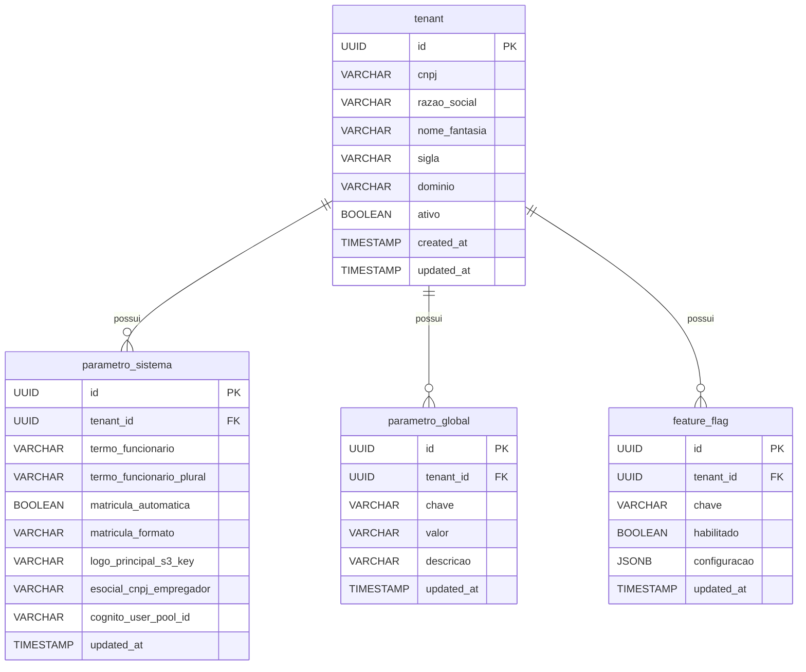
```mermaid
erDiagram
    tenant {
        UUID id PK
        VARCHAR cnpj
        VARCHAR razao_social
        VARCHAR nome_fantasia
        VARCHAR sigla
        VARCHAR dominio
        BOOLEAN ativo
        TIMESTAMP created_at
        TIMESTAMP updated_at
    }

    parametro_sistema {
        UUID id PK
        UUID tenant_id FK
        VARCHAR termo_funcionario
        VARCHAR termo_funcionario_plural
        BOOLEAN matricula_automatica
        VARCHAR matricula_formato
        VARCHAR logo_principal_s3_key
        VARCHAR esocial_cnpj_empregador
        VARCHAR cognito_user_pool_id
        TIMESTAMP updated_at
    }

    parametro_global {
        UUID id PK
        UUID tenant_id FK
        VARCHAR chave
        VARCHAR valor
        VARCHAR descricao
        TIMESTAMP updated_at
    }

    feature_flag {
        UUID id PK
        UUID tenant_id FK
        VARCHAR chave
        BOOLEAN habilitado
        JSONB configuracao
        TIMESTAMP updated_at
    }

    tenant ||--o{ parametro_sistema : "possui"
    tenant ||--o{ parametro_global : "possui"
    tenant ||--o{ feature_flag : "possui"
```

---

### 3.2 Contexto: Pessoa + Documentos + Endereço + Contato

Núcleo civil compartilhado. `pessoa` é a entidade raiz de qualquer sujeito no sistema (funcionário, pensionista, candidato, beneficiário). `documento_pessoa` é polimórfico por tipo. Endereço e contato são entidades separadas com FK para `pessoa`.

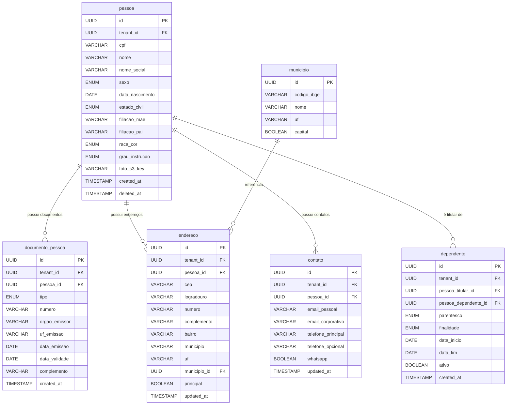
```mermaid
erDiagram
    pessoa {
        UUID id PK
        UUID tenant_id FK
        VARCHAR cpf
        VARCHAR nome
        VARCHAR nome_social
        ENUM sexo
        DATE data_nascimento
        ENUM estado_civil
        VARCHAR filiacao_mae
        VARCHAR filiacao_pai
        ENUM raca_cor
        ENUM grau_instrucao
        VARCHAR foto_s3_key
        TIMESTAMP created_at
        TIMESTAMP deleted_at
    }

    documento_pessoa {
        UUID id PK
        UUID tenant_id FK
        UUID pessoa_id FK
        ENUM tipo
        VARCHAR numero
        VARCHAR orgao_emissor
        VARCHAR uf_emissao
        DATE data_emissao
        DATE data_validade
        VARCHAR complemento
        TIMESTAMP created_at
    }

    endereco {
        UUID id PK
        UUID tenant_id FK
        UUID pessoa_id FK
        VARCHAR cep
        VARCHAR logradouro
        VARCHAR numero
        VARCHAR complemento
        VARCHAR bairro
        VARCHAR municipio
        VARCHAR uf
        UUID municipio_id FK
        BOOLEAN principal
        TIMESTAMP updated_at
    }

    contato {
        UUID id PK
        UUID tenant_id FK
        UUID pessoa_id FK
        VARCHAR email_pessoal
        VARCHAR email_corporativo
        VARCHAR telefone_principal
        VARCHAR telefone_opcional
        BOOLEAN whatsapp
        TIMESTAMP updated_at
    }

    dependente {
        UUID id PK
        UUID tenant_id FK
        UUID pessoa_titular_id FK
        UUID pessoa_dependente_id FK
        ENUM parentesco
        ENUM finalidade
        DATE data_inicio
        DATE data_fim
        BOOLEAN ativo
        TIMESTAMP created_at
    }

    municipio {
        UUID id PK
        VARCHAR codigo_ibge
        VARCHAR nome
        VARCHAR uf
        BOOLEAN capital
    }

    pessoa ||--o{ documento_pessoa : "possui documentos"
    pessoa ||--o{ endereco : "possui endereços"
    pessoa ||--o{ contato : "possui contatos"
    pessoa ||--o{ dependente : "é titular de"
    municipio ||--o{ endereco : "referencia"
```

---

### 3.3 Contexto: Organização (EmpresaMatriz / Filial / Lotação / CentroCusto)

Define a estrutura hierárquica do ente. `empresa_matriz` agrupa `filial` (unidade administrativa). `lotacao` é a unidade de lotação funcional dentro da filial. `centro_custo` é a unidade orçamentária. Cargo e função são cadastros mestres ligados à estrutura organizacional.

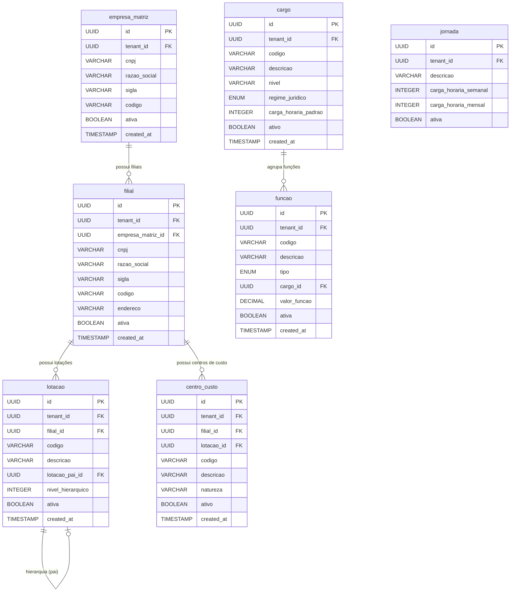
```mermaid
erDiagram
    empresa_matriz {
        UUID id PK
        UUID tenant_id FK
        VARCHAR cnpj
        VARCHAR razao_social
        VARCHAR sigla
        VARCHAR codigo
        BOOLEAN ativa
        TIMESTAMP created_at
    }

    filial {
        UUID id PK
        UUID tenant_id FK
        UUID empresa_matriz_id FK
        VARCHAR cnpj
        VARCHAR razao_social
        VARCHAR sigla
        VARCHAR codigo
        VARCHAR endereco
        BOOLEAN ativa
        TIMESTAMP created_at
    }

    lotacao {
        UUID id PK
        UUID tenant_id FK
        UUID filial_id FK
        VARCHAR codigo
        VARCHAR descricao
        UUID lotacao_pai_id FK
        INTEGER nivel_hierarquico
        BOOLEAN ativa
        TIMESTAMP created_at
    }

    centro_custo {
        UUID id PK
        UUID tenant_id FK
        UUID filial_id FK
        UUID lotacao_id FK
        VARCHAR codigo
        VARCHAR descricao
        VARCHAR natureza
        BOOLEAN ativo
        TIMESTAMP created_at
    }

    cargo {
        UUID id PK
        UUID tenant_id FK
        VARCHAR codigo
        VARCHAR descricao
        VARCHAR nivel
        ENUM regime_juridico
        INTEGER carga_horaria_padrao
        BOOLEAN ativo
        TIMESTAMP created_at
    }

    funcao {
        UUID id PK
        UUID tenant_id FK
        VARCHAR codigo
        VARCHAR descricao
        ENUM tipo
        UUID cargo_id FK
        DECIMAL valor_funcao
        BOOLEAN ativa
        TIMESTAMP created_at
    }

    jornada {
        UUID id PK
        UUID tenant_id FK
        VARCHAR descricao
        INTEGER carga_horaria_semanal
        INTEGER carga_horaria_mensal
        BOOLEAN ativa
    }

    empresa_matriz ||--o{ filial : "possui filiais"
    filial ||--o{ lotacao : "possui lotações"
    filial ||--o{ centro_custo : "possui centros de custo"
    lotacao ||--o| lotacao : "hierarquia (pai)"
    cargo ||--o{ funcao : "agrupa funções"
```

---

### 3.4 Contexto: Autenticação (Usuário / Perfil / Papel / Menu)

Implementa o RBAC em 4 camadas: Tenant → Perfil → Papel → Usuário. Papéis seguem o padrão `ROLE_<MODULO>_<ACAO>`. Usuários herdam papéis via perfis. O menu é controlado por papel e feature flag.

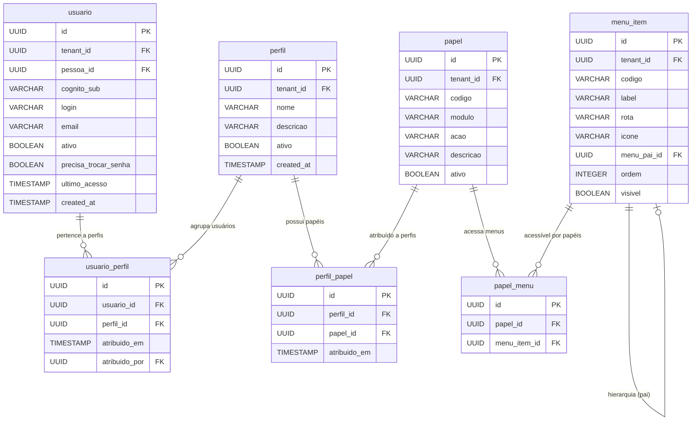
```mermaid
erDiagram
    usuario {
        UUID id PK
        UUID tenant_id FK
        UUID pessoa_id FK
        VARCHAR cognito_sub
        VARCHAR login
        VARCHAR email
        BOOLEAN ativo
        BOOLEAN precisa_trocar_senha
        TIMESTAMP ultimo_acesso
        TIMESTAMP created_at
    }

    perfil {
        UUID id PK
        UUID tenant_id FK
        VARCHAR nome
        VARCHAR descricao
        BOOLEAN ativo
        TIMESTAMP created_at
    }

    papel {
        UUID id PK
        UUID tenant_id FK
        VARCHAR codigo
        VARCHAR modulo
        VARCHAR acao
        VARCHAR descricao
        BOOLEAN ativo
    }

    usuario_perfil {
        UUID id PK
        UUID usuario_id FK
        UUID perfil_id FK
        TIMESTAMP atribuido_em
        UUID atribuido_por FK
    }

    perfil_papel {
        UUID id PK
        UUID perfil_id FK
        UUID papel_id FK
        TIMESTAMP atribuido_em
    }

    menu_item {
        UUID id PK
        UUID tenant_id FK
        VARCHAR codigo
        VARCHAR label
        VARCHAR rota
        VARCHAR icone
        UUID menu_pai_id FK
        INTEGER ordem
        BOOLEAN visivel
    }

    papel_menu {
        UUID id PK
        UUID papel_id FK
        UUID menu_item_id FK
    }

    usuario ||--o{ usuario_perfil : "pertence a perfis"
    perfil ||--o{ usuario_perfil : "agrupa usuários"
    perfil ||--o{ perfil_papel : "possui papéis"
    papel ||--o{ perfil_papel : "atribuído a perfis"
    papel ||--o{ papel_menu : "acessa menus"
    menu_item ||--o{ papel_menu : "acessível por papéis"
    menu_item ||--o| menu_item : "hierarquia (pai)"
```

---

### 3.5 Contexto: Arquivos S3

Abstração sobre AWS S3. Cada registro de arquivo armazena metadados do objeto S3. O relacionamento com entidades de negócio é polimórfico: `entidade_tipo` + `entidade_id` referenciam qualquer tabela que possua anexos.

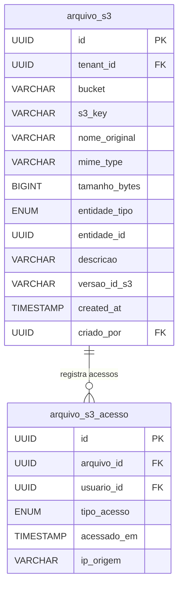
```mermaid
erDiagram
    arquivo_s3 {
        UUID id PK
        UUID tenant_id FK
        VARCHAR bucket
        VARCHAR s3_key
        VARCHAR nome_original
        VARCHAR mime_type
        BIGINT tamanho_bytes
        ENUM entidade_tipo
        UUID entidade_id
        VARCHAR descricao
        VARCHAR versao_id_s3
        TIMESTAMP created_at
        UUID criado_por FK
    }

    arquivo_s3_acesso {
        UUID id PK
        UUID arquivo_id FK
        UUID usuario_id FK
        ENUM tipo_acesso
        TIMESTAMP acessado_em
        VARCHAR ip_origem
    }

    arquivo_s3 ||--o{ arquivo_s3_acesso : "registra acessos"
```

---

### 3.6 Contexto: Parametrização

Catálogos de enumerações parametrizáveis e cadastros mestres estruturantes que alimentam selects, regras e cálculos em toda a aplicação.

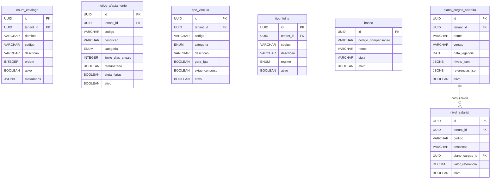
```mermaid
erDiagram
    enum_catalogo {
        UUID id PK
        UUID tenant_id FK
        VARCHAR dominio
        VARCHAR codigo
        VARCHAR descricao
        INTEGER ordem
        BOOLEAN ativo
        JSONB metadados
    }

    motivo_afastamento {
        UUID id PK
        UUID tenant_id FK
        VARCHAR codigo
        VARCHAR descricao
        ENUM categoria
        INTEGER limite_dias_anuais
        BOOLEAN remunerado
        BOOLEAN afeta_ferias
        BOOLEAN ativo
    }

    tipo_vinculo {
        UUID id PK
        UUID tenant_id FK
        VARCHAR codigo
        ENUM categoria
        VARCHAR descricao
        BOOLEAN gera_fgts
        BOOLEAN exige_concurso
        BOOLEAN ativo
    }

    tipo_folha {
        UUID id PK
        UUID tenant_id FK
        VARCHAR codigo
        VARCHAR descricao
        ENUM regime
        BOOLEAN ativo
    }

    banco {
        UUID id PK
        VARCHAR codigo_compensacao
        VARCHAR nome
        VARCHAR sigla
        BOOLEAN ativo
    }

    nivel_salarial {
        UUID id PK
        UUID tenant_id FK
        VARCHAR codigo
        VARCHAR descricao
        UUID plano_cargos_id FK
        DECIMAL valor_referencia
        BOOLEAN ativo
    }

    plano_cargos_carreira {
        UUID id PK
        UUID tenant_id FK
        VARCHAR nome
        VARCHAR versao
        DATE data_vigencia
        JSONB niveis_json
        JSONB referencias_json
        BOOLEAN ativo
    }

    plano_cargos_carreira ||--o{ nivel_salarial : "possui níveis"
```

---

### 3.7 Contexto: Auditoria

Tabela única `audit_log` recebe eventos de todos os domínios sensíveis via fila SQS. O relacionamento com entidades é lógico (polimórfico por `entidade` + `entidade_id`), sem FK física. Particionada por ano/mês.

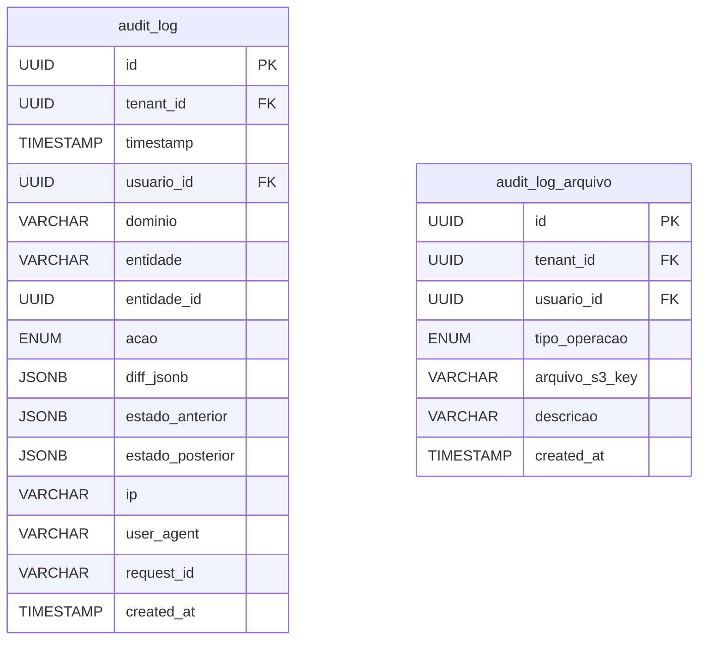
```mermaid
erDiagram
    audit_log {
        UUID id PK
        UUID tenant_id FK
        TIMESTAMP timestamp
        UUID usuario_id FK
        VARCHAR dominio
        VARCHAR entidade
        UUID entidade_id
        ENUM acao
        JSONB diff_jsonb
        JSONB estado_anterior
        JSONB estado_posterior
        VARCHAR ip
        VARCHAR user_agent
        VARCHAR request_id
        TIMESTAMP created_at
    }

    audit_log_arquivo {
        UUID id PK
        UUID tenant_id FK
        UUID usuario_id FK
        ENUM tipo_operacao
        VARCHAR arquivo_s3_key
        VARCHAR descricao
        TIMESTAMP created_at
    }
```

---

### 3.8 Contexto: Módulo RH — Funcionário e Vida Funcional

Núcleo funcional do SGP. `funcionario` agrega vínculo, situação funcional e dados de pagamento. O lifecycle vai de CADASTRO_BASE até DESLIGAMENTO, passando por POSSE, ATIVO, AFASTAMENTOS e TRANSFERÊNCIAS. `situacao_funcional` mantém histórico imutável de cada mudança de estado.

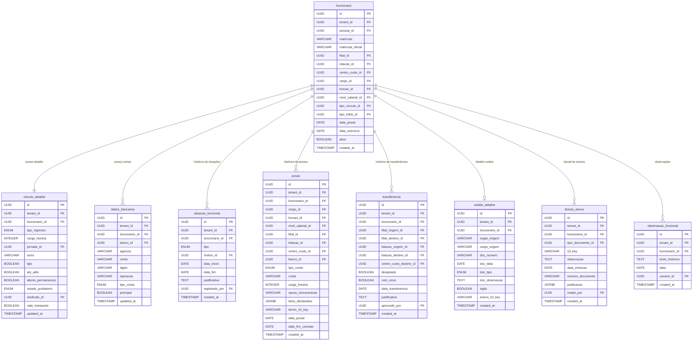
```mermaid
erDiagram
    funcionario {
        UUID id PK
        UUID tenant_id FK
        UUID pessoa_id FK
        VARCHAR matricula
        VARCHAR matricula_oficial
        UUID filial_id FK
        UUID lotacao_id FK
        UUID centro_custo_id FK
        UUID cargo_id FK
        UUID funcao_id FK
        UUID nivel_salarial_id FK
        UUID tipo_vinculo_id FK
        UUID tipo_folha_id FK
        DATE data_posse
        DATE data_exercicio
        BOOLEAN ativo
        TIMESTAMP created_at
    }

    vinculo_detalhe {
        UUID id PK
        UUID tenant_id FK
        UUID funcionario_id FK
        ENUM tipo_ingresso
        INTEGER carga_horaria
        UUID jornada_id FK
        VARCHAR turno
        BOOLEAN fgts
        BOOLEAN ats_adts
        BOOLEAN abono_permanencia
        ENUM estado_probatorio
        UUID sindicato_id FK
        BOOLEAN vale_transporte
        TIMESTAMP updated_at
    }

    dados_bancarios {
        UUID id PK
        UUID tenant_id FK
        UUID funcionario_id FK
        UUID banco_id FK
        VARCHAR agencia
        VARCHAR conta
        VARCHAR digito
        VARCHAR operacao
        ENUM tipo_conta
        BOOLEAN principal
        TIMESTAMP updated_at
    }

    situacao_funcional {
        UUID id PK
        UUID tenant_id FK
        UUID funcionario_id FK
        ENUM tipo
        UUID motivo_id FK
        DATE data_inicio
        DATE data_fim
        TEXT justificativa
        UUID registrado_por FK
        TIMESTAMP created_at
    }

    posse {
        UUID id PK
        UUID tenant_id FK
        UUID funcionario_id FK
        UUID cargo_id FK
        UUID funcao_id FK
        UUID nivel_salarial_id FK
        UUID filial_id FK
        UUID lotacao_id FK
        UUID centro_custo_id FK
        UUID banco_id FK
        ENUM tipo_conta
        VARCHAR conta
        INTEGER carga_horaria
        VARCHAR opcao_remuneracao
        JSONB bens_declarados
        VARCHAR termo_s3_key
        DATE data_posse
        DATE data_fim_contrato
        TIMESTAMP created_at
    }

    transferencia {
        UUID id PK
        UUID tenant_id FK
        UUID funcionario_id FK
        UUID filial_origem_id FK
        UUID filial_destino_id FK
        UUID lotacao_origem_id FK
        UUID lotacao_destino_id FK
        UUID centro_custo_destino_id FK
        BOOLEAN designado
        BOOLEAN com_onus
        DATE data_transferencia
        TEXT justificativa
        UUID aprovado_por FK
        TIMESTAMP created_at
    }

    cedido_detalhe {
        UUID id PK
        UUID tenant_id FK
        UUID funcionario_id FK
        VARCHAR orgao_origem
        VARCHAR cargo_origem
        VARCHAR doc_numero
        DATE doc_data
        ENUM doc_tipo
        TEXT doc_observacao
        BOOLEAN sigilo
        VARCHAR anexo_s3_key
        TIMESTAMP created_at
    }

    dossie_anexo {
        UUID id PK
        UUID tenant_id FK
        UUID funcionario_id FK
        UUID tipo_documento_id FK
        VARCHAR s3_key
        TEXT observacao
        DATE data_emissao
        VARCHAR numero_documento
        JSONB publicacao
        UUID criado_por FK
        TIMESTAMP created_at
    }

    observacao_funcional {
        UUID id PK
        UUID tenant_id FK
        UUID funcionario_id FK
        TEXT texto_historico
        DATE data
        UUID usuario_id FK
        TIMESTAMP created_at
    }

    funcionario ||--|| vinculo_detalhe : "possui detalhe"
    funcionario ||--o{ dados_bancarios : "possui contas"
    funcionario ||--o{ situacao_funcional : "histórico de situações"
    funcionario ||--o{ posse : "histórico de posses"
    funcionario ||--o{ transferencia : "histórico de transferências"
    funcionario ||--o| cedido_detalhe : "detalhe cedido"
    funcionario ||--o{ dossie_anexo : "dossiê de anexos"
    funcionario ||--o{ observacao_funcional : "observações"
```

---

### 3.9 Contexto: Folha de Pagamento

Motor central do SGP. `competencia` é o período mensal de referência. `folha_pagamento` é criada por filial × tipo_processamento dentro de uma competência. `contracheque` agrega os `lancamento` de cada `verba`. As fórmulas são compiladas para SQL. A elegibilidade associa verbas a funcionários, cargos, funções, vínculos ou categorias (N:N).

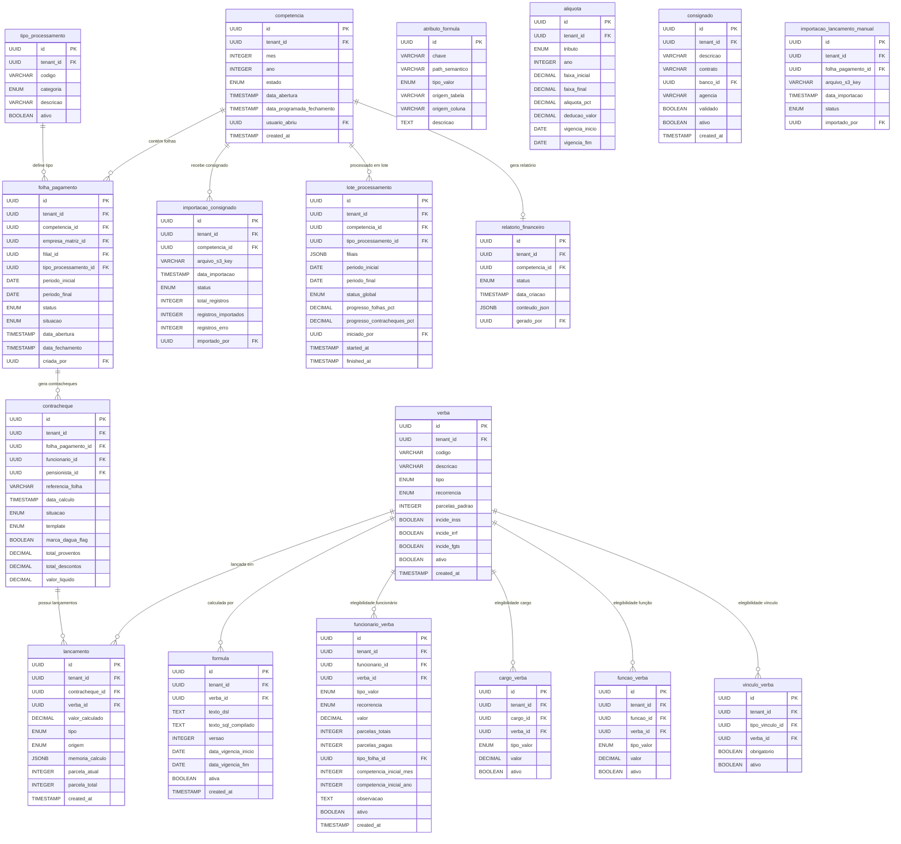
```mermaid
erDiagram
    competencia {
        UUID id PK
        UUID tenant_id FK
        INTEGER mes
        INTEGER ano
        ENUM estado
        TIMESTAMP data_abertura
        TIMESTAMP data_programada_fechamento
        UUID usuario_abriu FK
        TIMESTAMP created_at
    }

    folha_pagamento {
        UUID id PK
        UUID tenant_id FK
        UUID competencia_id FK
        UUID empresa_matriz_id FK
        UUID filial_id FK
        UUID tipo_processamento_id FK
        DATE periodo_inicial
        DATE periodo_final
        ENUM status
        ENUM situacao
        TIMESTAMP data_abertura
        TIMESTAMP data_fechamento
        UUID criada_por FK
    }

    tipo_processamento {
        UUID id PK
        UUID tenant_id FK
        VARCHAR codigo
        ENUM categoria
        VARCHAR descricao
        BOOLEAN ativo
    }

    contracheque {
        UUID id PK
        UUID tenant_id FK
        UUID folha_pagamento_id FK
        UUID funcionario_id FK
        UUID pensionista_id FK
        VARCHAR referencia_folha
        TIMESTAMP data_calculo
        ENUM situacao
        ENUM template
        BOOLEAN marca_dagua_flag
        DECIMAL total_proventos
        DECIMAL total_descontos
        DECIMAL valor_liquido
    }

    lancamento {
        UUID id PK
        UUID tenant_id FK
        UUID contracheque_id FK
        UUID verba_id FK
        DECIMAL valor_calculado
        ENUM tipo
        ENUM origem
        JSONB memoria_calculo
        INTEGER parcela_atual
        INTEGER parcela_total
        TIMESTAMP created_at
    }

    verba {
        UUID id PK
        UUID tenant_id FK
        VARCHAR codigo
        VARCHAR descricao
        ENUM tipo
        ENUM recorrencia
        INTEGER parcelas_padrao
        BOOLEAN incide_inss
        BOOLEAN incide_irrf
        BOOLEAN incide_fgts
        BOOLEAN ativo
        TIMESTAMP created_at
    }

    formula {
        UUID id PK
        UUID tenant_id FK
        UUID verba_id FK
        TEXT texto_dsl
        TEXT texto_sql_compilado
        INTEGER versao
        DATE data_vigencia_inicio
        DATE data_vigencia_fim
        BOOLEAN ativa
        TIMESTAMP created_at
    }

    atributo_formula {
        UUID id PK
        VARCHAR chave
        VARCHAR path_semantico
        ENUM tipo_valor
        VARCHAR origem_tabela
        VARCHAR origem_coluna
        TEXT descricao
    }

    aliquota {
        UUID id PK
        UUID tenant_id FK
        ENUM tributo
        INTEGER ano
        DECIMAL faixa_inicial
        DECIMAL faixa_final
        DECIMAL aliquota_pct
        DECIMAL deducao_valor
        DATE vigencia_inicio
        DATE vigencia_fim
    }

    funcionario_verba {
        UUID id PK
        UUID tenant_id FK
        UUID funcionario_id FK
        UUID verba_id FK
        ENUM tipo_valor
        ENUM recorrencia
        DECIMAL valor
        INTEGER parcelas_totais
        INTEGER parcelas_pagas
        UUID tipo_folha_id FK
        INTEGER competencia_inicial_mes
        INTEGER competencia_inicial_ano
        TEXT observacao
        BOOLEAN ativo
        TIMESTAMP created_at
    }

    cargo_verba {
        UUID id PK
        UUID tenant_id FK
        UUID cargo_id FK
        UUID verba_id FK
        ENUM tipo_valor
        DECIMAL valor
        BOOLEAN ativo
    }

    funcao_verba {
        UUID id PK
        UUID tenant_id FK
        UUID funcao_id FK
        UUID verba_id FK
        ENUM tipo_valor
        DECIMAL valor
        BOOLEAN ativo
    }

    vinculo_verba {
        UUID id PK
        UUID tenant_id FK
        UUID tipo_vinculo_id FK
        UUID verba_id FK
        BOOLEAN obrigatorio
        BOOLEAN ativo
    }

    consignado {
        UUID id PK
        UUID tenant_id FK
        VARCHAR descricao
        VARCHAR contrato
        UUID banco_id FK
        VARCHAR agencia
        BOOLEAN validado
        BOOLEAN ativo
        TIMESTAMP created_at
    }

    importacao_consignado {
        UUID id PK
        UUID tenant_id FK
        UUID competencia_id FK
        VARCHAR arquivo_s3_key
        TIMESTAMP data_importacao
        ENUM status
        INTEGER total_registros
        INTEGER registros_importados
        INTEGER registros_erro
        UUID importado_por FK
    }

    importacao_lancamento_manual {
        UUID id PK
        UUID tenant_id FK
        UUID folha_pagamento_id FK
        VARCHAR arquivo_s3_key
        TIMESTAMP data_importacao
        ENUM status
        UUID importado_por FK
    }

    lote_processamento {
        UUID id PK
        UUID tenant_id FK
        UUID competencia_id FK
        UUID tipo_processamento_id FK
        JSONB filiais
        DATE periodo_inicial
        DATE periodo_final
        ENUM status_global
        DECIMAL progresso_folhas_pct
        DECIMAL progresso_contracheques_pct
        UUID iniciado_por FK
        TIMESTAMP started_at
        TIMESTAMP finished_at
    }

    relatorio_financeiro {
        UUID id PK
        UUID tenant_id FK
        UUID competencia_id FK
        ENUM status
        TIMESTAMP data_criacao
        JSONB conteudo_json
        UUID gerado_por FK
    }

    competencia ||--o{ folha_pagamento : "contém folhas"
    folha_pagamento ||--o{ contracheque : "gera contracheques"
    contracheque ||--o{ lancamento : "possui lançamentos"
    verba ||--o{ lancamento : "lançada em"
    verba ||--o{ formula : "calculada por"
    verba ||--o{ funcionario_verba : "elegibilidade funcionário"
    verba ||--o{ cargo_verba : "elegibilidade cargo"
    verba ||--o{ funcao_verba : "elegibilidade função"
    verba ||--o{ vinculo_verba : "elegibilidade vínculo"
    competencia ||--o{ importacao_consignado : "recebe consignado"
    competencia ||--o{ lote_processamento : "processado em lote"
    competencia ||--o| relatorio_financeiro : "gera relatório"
    tipo_processamento ||--o{ folha_pagamento : "define tipo"
```

---

### 3.10 Contexto: Avaliação e Progressão

Gerencia a avaliação de desempenho periódica e as progressões de carreira (mérito, titularidade, judicial, correção salarial). O `simulador_nivel_salarial` permite cenários hipotéticos sem alterar dados reais.

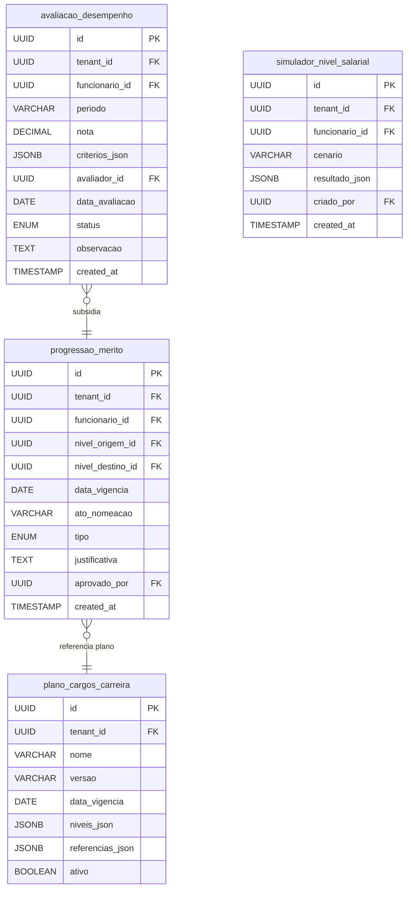
```mermaid
erDiagram
    avaliacao_desempenho {
        UUID id PK
        UUID tenant_id FK
        UUID funcionario_id FK
        VARCHAR periodo
        DECIMAL nota
        JSONB criterios_json
        UUID avaliador_id FK
        DATE data_avaliacao
        ENUM status
        TEXT observacao
        TIMESTAMP created_at
    }

    progressao_merito {
        UUID id PK
        UUID tenant_id FK
        UUID funcionario_id FK
        UUID nivel_origem_id FK
        UUID nivel_destino_id FK
        DATE data_vigencia
        VARCHAR ato_nomeacao
        ENUM tipo
        TEXT justificativa
        UUID aprovado_por FK
        TIMESTAMP created_at
    }

    plano_cargos_carreira {
        UUID id PK
        UUID tenant_id FK
        VARCHAR nome
        VARCHAR versao
        DATE data_vigencia
        JSONB niveis_json
        JSONB referencias_json
        BOOLEAN ativo
    }

    simulador_nivel_salarial {
        UUID id PK
        UUID tenant_id FK
        UUID funcionario_id FK
        VARCHAR cenario
        JSONB resultado_json
        UUID criado_por FK
        TIMESTAMP created_at
    }

    avaliacao_desempenho }o--|| progressao_merito : "subsidia"
    progressao_merito }o--|| plano_cargos_carreira : "referencia plano"
```

---

### 3.11 Contexto: Recrutamento, Seleção e Estágio

Gerencia o ciclo completo desde a abertura de requisição de pessoal até a admissão. O `banco_talentos` armazena candidatos espontâneos. O módulo de estágio controla programas, prorrogações e recessos.

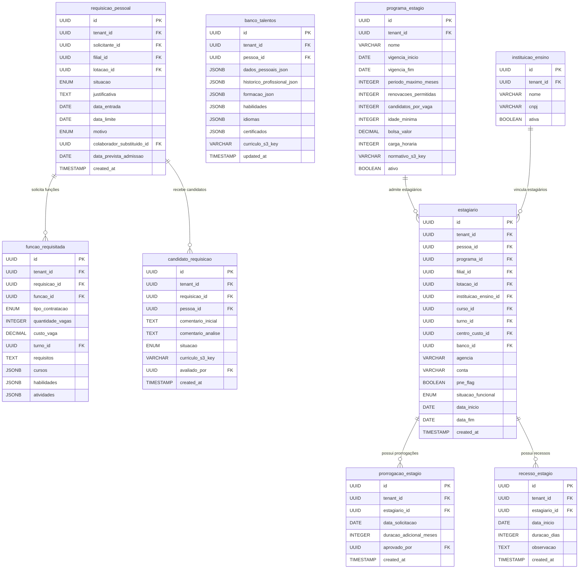
```mermaid
erDiagram
    requisicao_pessoal {
        UUID id PK
        UUID tenant_id FK
        UUID solicitante_id FK
        UUID filial_id FK
        UUID lotacao_id FK
        ENUM situacao
        TEXT justificativa
        DATE data_entrada
        DATE data_limite
        ENUM motivo
        UUID colaborador_substituido_id FK
        DATE data_prevista_admissao
        TIMESTAMP created_at
    }

    funcao_requisitada {
        UUID id PK
        UUID tenant_id FK
        UUID requisicao_id FK
        UUID funcao_id FK
        ENUM tipo_contratacao
        INTEGER quantidade_vagas
        DECIMAL custo_vaga
        UUID turno_id FK
        TEXT requisitos
        JSONB cursos
        JSONB habilidades
        JSONB atividades
    }

    candidato_requisicao {
        UUID id PK
        UUID tenant_id FK
        UUID requisicao_id FK
        UUID pessoa_id FK
        TEXT comentario_inicial
        TEXT comentario_analise
        ENUM situacao
        VARCHAR curriculo_s3_key
        UUID avaliado_por FK
        TIMESTAMP created_at
    }

    banco_talentos {
        UUID id PK
        UUID tenant_id FK
        UUID pessoa_id FK
        JSONB dados_pessoais_json
        JSONB historico_profissional_json
        JSONB formacao_json
        JSONB habilidades
        JSONB idiomas
        JSONB certificados
        VARCHAR curriculo_s3_key
        TIMESTAMP updated_at
    }

    programa_estagio {
        UUID id PK
        UUID tenant_id FK
        VARCHAR nome
        DATE vigencia_inicio
        DATE vigencia_fim
        INTEGER periodo_maximo_meses
        INTEGER renovacoes_permitidas
        INTEGER candidatos_por_vaga
        INTEGER idade_minima
        DECIMAL bolsa_valor
        INTEGER carga_horaria
        VARCHAR normativo_s3_key
        BOOLEAN ativo
    }

    estagiario {
        UUID id PK
        UUID tenant_id FK
        UUID pessoa_id FK
        UUID programa_id FK
        UUID filial_id FK
        UUID lotacao_id FK
        UUID instituicao_ensino_id FK
        UUID curso_id FK
        UUID turno_id FK
        UUID centro_custo_id FK
        UUID banco_id FK
        VARCHAR agencia
        VARCHAR conta
        BOOLEAN pne_flag
        ENUM situacao_funcional
        DATE data_inicio
        DATE data_fim
        TIMESTAMP created_at
    }

    prorrogacao_estagio {
        UUID id PK
        UUID tenant_id FK
        UUID estagiario_id FK
        DATE data_solicitacao
        INTEGER duracao_adicional_meses
        UUID aprovado_por FK
        TIMESTAMP created_at
    }

    recesso_estagio {
        UUID id PK
        UUID tenant_id FK
        UUID estagiario_id FK
        DATE data_inicio
        INTEGER duracao_dias
        TEXT observacao
        TIMESTAMP created_at
    }

    instituicao_ensino {
        UUID id PK
        UUID tenant_id FK
        VARCHAR nome
        VARCHAR cnpj
        BOOLEAN ativa
    }

    requisicao_pessoal ||--o{ funcao_requisitada : "solicita funções"
    requisicao_pessoal ||--o{ candidato_requisicao : "recebe candidatos"
    programa_estagio ||--o{ estagiario : "admite estagiários"
    estagiario ||--o{ prorrogacao_estagio : "possui prorrogações"
    estagiario ||--o{ recesso_estagio : "possui recessos"
    instituicao_ensino ||--o{ estagiario : "vincula estagiários"
```

---

### 3.12 Contexto: Previdenciário (Aposentadoria + Pensão + Recadastramento)

Módulo de benefícios. `aposentadoria` e `pensao` são os benefícios concedidos. O recadastramento periódico valida a existência do beneficiário: `campanha_recadastramento` dispara o ciclo, `beneficiario_recadastramento` acompanha cada beneficiário, e `recadastramento` registra cada ato de recadastro com snapshot dos dados.

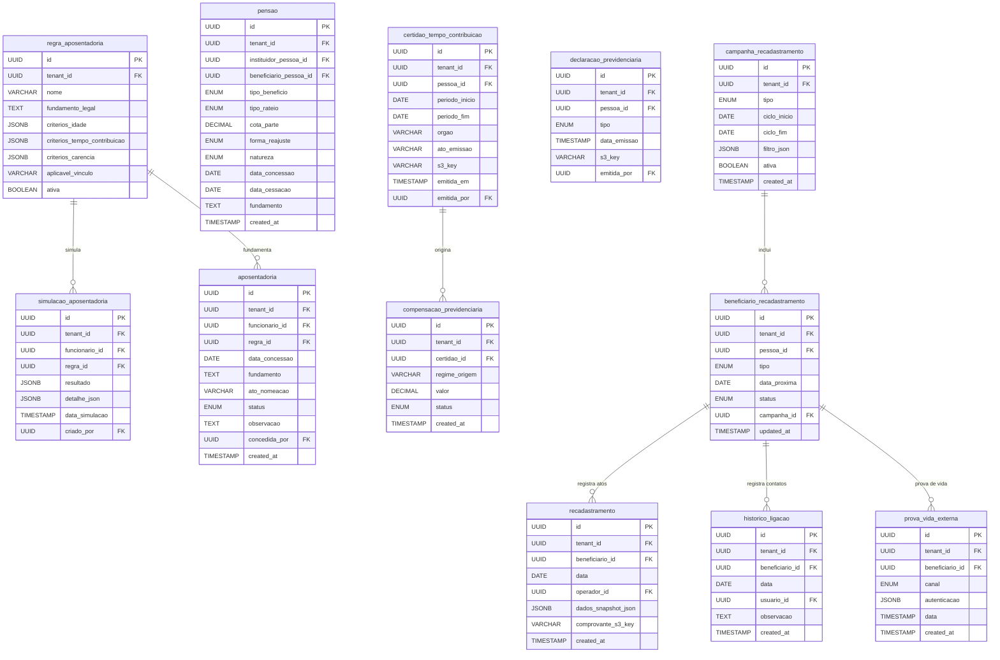
```mermaid
erDiagram
    regra_aposentadoria {
        UUID id PK
        UUID tenant_id FK
        VARCHAR nome
        TEXT fundamento_legal
        JSONB criterios_idade
        JSONB criterios_tempo_contribuicao
        JSONB criterios_carencia
        VARCHAR aplicavel_vinculo
        BOOLEAN ativa
    }

    simulacao_aposentadoria {
        UUID id PK
        UUID tenant_id FK
        UUID funcionario_id FK
        UUID regra_id FK
        JSONB resultado
        JSONB detalhe_json
        TIMESTAMP data_simulacao
        UUID criado_por FK
    }

    aposentadoria {
        UUID id PK
        UUID tenant_id FK
        UUID funcionario_id FK
        UUID regra_id FK
        DATE data_concessao
        TEXT fundamento
        VARCHAR ato_nomeacao
        ENUM status
        TEXT observacao
        UUID concedida_por FK
        TIMESTAMP created_at
    }

    pensao {
        UUID id PK
        UUID tenant_id FK
        UUID instituidor_pessoa_id FK
        UUID beneficiario_pessoa_id FK
        ENUM tipo_beneficio
        ENUM tipo_rateio
        DECIMAL cota_parte
        ENUM forma_reajuste
        ENUM natureza
        DATE data_concessao
        DATE data_cessacao
        TEXT fundamento
        TIMESTAMP created_at
    }

    certidao_tempo_contribuicao {
        UUID id PK
        UUID tenant_id FK
        UUID pessoa_id FK
        DATE periodo_inicio
        DATE periodo_fim
        VARCHAR orgao
        VARCHAR ato_emissao
        VARCHAR s3_key
        TIMESTAMP emitida_em
        UUID emitida_por FK
    }

    compensacao_previdenciaria {
        UUID id PK
        UUID tenant_id FK
        UUID certidao_id FK
        VARCHAR regime_origem
        DECIMAL valor
        ENUM status
        TIMESTAMP created_at
    }

    declaracao_previdenciaria {
        UUID id PK
        UUID tenant_id FK
        UUID pessoa_id FK
        ENUM tipo
        TIMESTAMP data_emissao
        VARCHAR s3_key
        UUID emitida_por FK
    }

    campanha_recadastramento {
        UUID id PK
        UUID tenant_id FK
        ENUM tipo
        DATE ciclo_inicio
        DATE ciclo_fim
        JSONB filtro_json
        BOOLEAN ativa
        TIMESTAMP created_at
    }

    beneficiario_recadastramento {
        UUID id PK
        UUID tenant_id FK
        UUID pessoa_id FK
        ENUM tipo
        DATE data_proxima
        ENUM status
        UUID campanha_id FK
        TIMESTAMP updated_at
    }

    recadastramento {
        UUID id PK
        UUID tenant_id FK
        UUID beneficiario_id FK
        DATE data
        UUID operador_id FK
        JSONB dados_snapshot_json
        VARCHAR comprovante_s3_key
        TIMESTAMP created_at
    }

    historico_ligacao {
        UUID id PK
        UUID tenant_id FK
        UUID beneficiario_id FK
        DATE data
        UUID usuario_id FK
        TEXT observacao
        TIMESTAMP created_at
    }

    prova_vida_externa {
        UUID id PK
        UUID tenant_id FK
        UUID beneficiario_id FK
        ENUM canal
        JSONB autenticacao
        TIMESTAMP data
        TIMESTAMP created_at
    }

    regra_aposentadoria ||--o{ simulacao_aposentadoria : "simula"
    regra_aposentadoria ||--o{ aposentadoria : "fundamenta"
    certidao_tempo_contribuicao ||--o{ compensacao_previdenciaria : "origina"
    campanha_recadastramento ||--o{ beneficiario_recadastramento : "inclui"
    beneficiario_recadastramento ||--o{ recadastramento : "registra atos"
    beneficiario_recadastramento ||--o{ historico_ligacao : "registra contatos"
    beneficiario_recadastramento ||--o{ prova_vida_externa : "prova de vida"
```

---

### 3.13 Contexto: Saúde Ocupacional e Perícia (Junta Médica + SST)

Gestão da saúde funcional. O fluxo principal: `agenda_medica` → `janela_agenda` → `agendamento_pericia` → `prontuario_pericia` → `licenca_medica` (que retroalimenta `situacao_funcional`). SST complementa com acidentes, EPIs, EPCs e agentes nocivos.

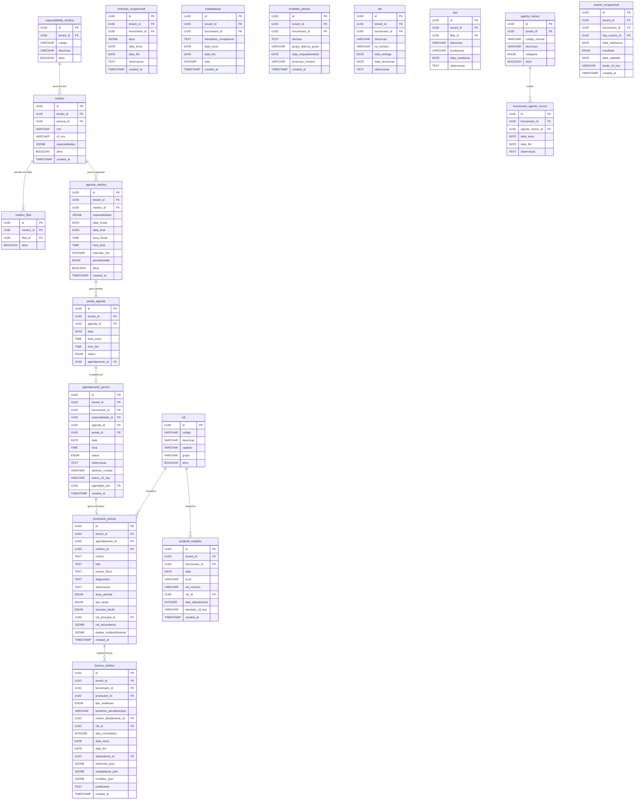
```mermaid
erDiagram
    especialidade_medica {
        UUID id PK
        UUID tenant_id FK
        VARCHAR codigo
        VARCHAR descricao
        BOOLEAN ativa
    }

    medico {
        UUID id PK
        UUID tenant_id FK
        UUID pessoa_id FK
        VARCHAR crm
        VARCHAR uf_crm
        JSONB especialidades
        BOOLEAN ativo
        TIMESTAMP created_at
    }

    medico_filial {
        UUID id PK
        UUID medico_id FK
        UUID filial_id FK
        BOOLEAN ativo
    }

    agenda_medica {
        UUID id PK
        UUID tenant_id FK
        UUID medico_id FK
        JSONB especialidades
        DATE data_inicial
        DATE data_final
        TIME hora_inicial
        TIME hora_final
        INTEGER intervalo_min
        ENUM periodicidade
        BOOLEAN ativa
        TIMESTAMP created_at
    }

    janela_agenda {
        UUID id PK
        UUID tenant_id FK
        UUID agenda_id FK
        DATE data
        TIME hora_inicio
        TIME hora_fim
        ENUM status
        UUID agendamento_id FK
    }

    agendamento_pericia {
        UUID id PK
        UUID tenant_id FK
        UUID funcionario_id FK
        UUID especialidade_id FK
        UUID agenda_id FK
        UUID janela_id FK
        DATE data
        TIME hora
        ENUM status
        TEXT observacao
        VARCHAR telefone_contato
        VARCHAR anexo_s3_key
        UUID agendado_por FK
        TIMESTAMP created_at
    }

    prontuario_pericia {
        UUID id PK
        UUID tenant_id FK
        UUID agendamento_id FK
        UUID medico_id FK
        TEXT motivo
        TEXT hda
        TEXT exame_fisico
        TEXT diagnostico
        TEXT observacao
        ENUM acao_pericial
        ENUM tipo_laudo
        ENUM situacao_laudo
        UUID cid_principal_id FK
        JSONB cid_secundarios
        JSONB equipe_multiprofissional
        TIMESTAMP created_at
    }

    licenca_medica {
        UUID id PK
        UUID tenant_id FK
        UUID funcionario_id FK
        UUID prontuario_id FK
        ENUM tipo_avaliacao
        VARCHAR beneficio_previdenciario
        UUID motivo_afastamento_id FK
        UUID cid_id FK
        INTEGER dias_concedidos
        DATE data_inicio
        DATE data_fim
        UUID dependente_id FK
        JSONB restricoes_json
        JSONB readaptacao_json
        JSONB invalidez_json
        TEXT justificativa
        TIMESTAMP created_at
    }

    cid {
        UUID id PK
        VARCHAR codigo
        VARCHAR descricao
        VARCHAR capitulo
        VARCHAR grupo
        BOOLEAN ativo
    }

    restricao_ocupacional {
        UUID id PK
        UUID tenant_id FK
        UUID funcionario_id FK
        JSONB tipos
        DATE data_inicio
        DATE data_fim
        TEXT observacao
        TIMESTAMP created_at
    }

    readaptacao {
        UUID id PK
        UUID tenant_id FK
        UUID funcionario_id FK
        TEXT atividades_compativeis
        DATE data_inicio
        DATE data_fim
        INTEGER dias
        TIMESTAMP created_at
    }

    invalidez_pericia {
        UUID id PK
        UUID tenant_id FK
        UUID funcionario_id FK
        TEXT decisao
        VARCHAR grupo_doenca_grave
        DATE data_enquadramento
        VARCHAR processo_numero
        TIMESTAMP created_at
    }

    acidente_trabalho {
        UUID id PK
        UUID tenant_id FK
        UUID funcionario_id FK
        DATE data
        VARCHAR local
        VARCHAR cat_numero
        UUID cid_id FK
        INTEGER dias_afastamento
        VARCHAR atestado_s3_key
        TIMESTAMP created_at
    }

    epi {
        UUID id PK
        UUID tenant_id FK
        UUID funcionario_id FK
        VARCHAR descricao
        VARCHAR ca_numero
        DATE data_entrega
        DATE data_devolucao
        TEXT observacao
    }

    epc {
        UUID id PK
        UUID tenant_id FK
        UUID filial_id FK
        VARCHAR descricao
        VARCHAR localizacao
        DATE data_instalacao
        TEXT observacao
    }

    agente_nocivo {
        UUID id PK
        UUID tenant_id FK
        VARCHAR codigo_esocial
        VARCHAR descricao
        ENUM categoria
        BOOLEAN ativo
    }

    funcionario_agente_nocivo {
        UUID id PK
        UUID funcionario_id FK
        UUID agente_nocivo_id FK
        DATE data_inicio
        DATE data_fim
        TEXT observacao
    }

    exame_ocupacional {
        UUID id PK
        UUID tenant_id FK
        UUID funcionario_id FK
        UUID tipo_exame_id FK
        DATE data_realizacao
        ENUM resultado
        DATE data_validade
        VARCHAR laudo_s3_key
        TIMESTAMP created_at
    }

    especialidade_medica ||--o{ medico : "exercida por"
    medico ||--o{ medico_filial : "atende em filiais"
    medico ||--o{ agenda_medica : "possui agendas"
    agenda_medica ||--o{ janela_agenda : "gera janelas"
    janela_agenda ||--o| agendamento_pericia : "ocupada por"
    agendamento_pericia ||--o| prontuario_pericia : "gera prontuário"
    prontuario_pericia ||--o{ licenca_medica : "origina licença"
    cid ||--o{ prontuario_pericia : "classifica"
    cid ||--o{ acidente_trabalho : "classifica"
    agente_nocivo ||--o{ funcionario_agente_nocivo : "expõe"
```

---

### 3.14 Contexto: Convênio

Gerencia convênios de desconto em folha (planos de saúde, associações, outros). `convenio_beneficiario` vincula o servidor ao convênio com valor e período. `convenio_desconto_folha` materializa o desconto a ser lançado em cada competência.

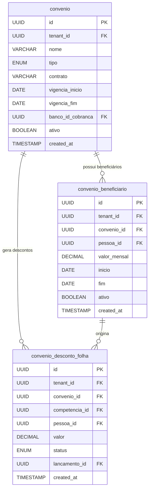
```mermaid
erDiagram
    convenio {
        UUID id PK
        UUID tenant_id FK
        VARCHAR nome
        ENUM tipo
        VARCHAR contrato
        DATE vigencia_inicio
        DATE vigencia_fim
        UUID banco_id_cobranca FK
        BOOLEAN ativo
        TIMESTAMP created_at
    }

    convenio_beneficiario {
        UUID id PK
        UUID tenant_id FK
        UUID convenio_id FK
        UUID pessoa_id FK
        DECIMAL valor_mensal
        DATE inicio
        DATE fim
        BOOLEAN ativo
        TIMESTAMP created_at
    }

    convenio_desconto_folha {
        UUID id PK
        UUID tenant_id FK
        UUID convenio_id FK
        UUID competencia_id FK
        UUID pessoa_id FK
        DECIMAL valor
        ENUM status
        UUID lancamento_id FK
        TIMESTAMP created_at
    }

    convenio ||--o{ convenio_beneficiario : "possui beneficiários"
    convenio ||--o{ convenio_desconto_folha : "gera descontos"
    convenio_beneficiario ||--o{ convenio_desconto_folha : "origina"
```

---

### 3.15 Contexto: eSocial

Gerencia o ciclo de vida dos eventos eSocial S-1.2: geração do XML, envio assíncrono via Lambda/Step Functions, recebimento de recibo. `esocial_lote` agrupa eventos para transmissão em lote.

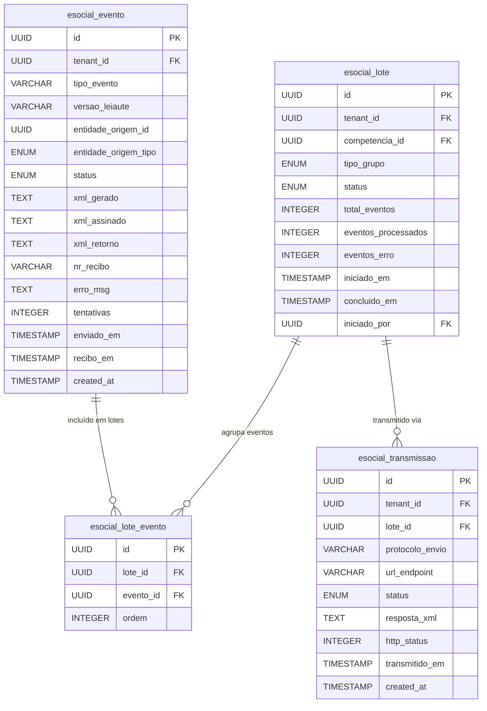
```mermaid
erDiagram
    esocial_evento {
        UUID id PK
        UUID tenant_id FK
        VARCHAR tipo_evento
        VARCHAR versao_leiaute
        UUID entidade_origem_id
        ENUM entidade_origem_tipo
        ENUM status
        TEXT xml_gerado
        TEXT xml_assinado
        TEXT xml_retorno
        VARCHAR nr_recibo
        TEXT erro_msg
        INTEGER tentativas
        TIMESTAMP enviado_em
        TIMESTAMP recibo_em
        TIMESTAMP created_at
    }

    esocial_lote {
        UUID id PK
        UUID tenant_id FK
        UUID competencia_id FK
        ENUM tipo_grupo
        ENUM status
        INTEGER total_eventos
        INTEGER eventos_processados
        INTEGER eventos_erro
        TIMESTAMP iniciado_em
        TIMESTAMP concluido_em
        UUID iniciado_por FK
    }

    esocial_lote_evento {
        UUID id PK
        UUID lote_id FK
        UUID evento_id FK
        INTEGER ordem
    }

    esocial_transmissao {
        UUID id PK
        UUID tenant_id FK
        UUID lote_id FK
        VARCHAR protocolo_envio
        VARCHAR url_endpoint
        ENUM status
        TEXT resposta_xml
        INTEGER http_status
        TIMESTAMP transmitido_em
        TIMESTAMP created_at
    }

    esocial_lote ||--o{ esocial_lote_evento : "agrupa eventos"
    esocial_evento ||--o{ esocial_lote_evento : "incluído em lotes"
    esocial_lote ||--o{ esocial_transmissao : "transmitido via"
```

---

## 4. Diagrama Cross-Context Crítico 1 — Encadeamento Funcional Folha

Fluxo completo desde o funcionário elegível a uma verba até o evento eSocial gerado, passando pelo cálculo da folha.

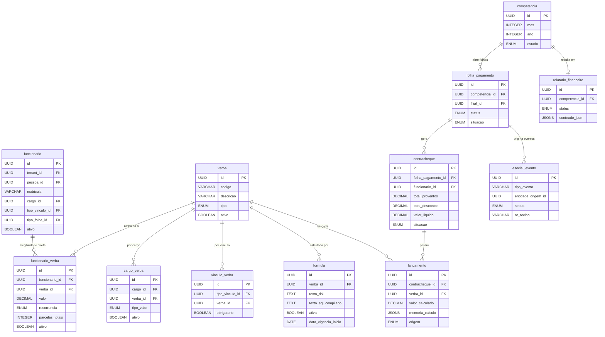
```mermaid
erDiagram
    funcionario {
        UUID id PK
        UUID tenant_id FK
        UUID pessoa_id FK
        VARCHAR matricula
        UUID cargo_id FK
        UUID tipo_vinculo_id FK
        UUID tipo_folha_id FK
        BOOLEAN ativo
    }

    verba {
        UUID id PK
        VARCHAR codigo
        VARCHAR descricao
        ENUM tipo
        BOOLEAN ativo
    }

    funcionario_verba {
        UUID id PK
        UUID funcionario_id FK
        UUID verba_id FK
        DECIMAL valor
        ENUM recorrencia
        INTEGER parcelas_totais
        BOOLEAN ativo
    }

    cargo_verba {
        UUID id PK
        UUID cargo_id FK
        UUID verba_id FK
        ENUM tipo_valor
        BOOLEAN ativo
    }

    vinculo_verba {
        UUID id PK
        UUID tipo_vinculo_id FK
        UUID verba_id FK
        BOOLEAN obrigatorio
    }

    formula {
        UUID id PK
        UUID verba_id FK
        TEXT texto_dsl
        TEXT texto_sql_compilado
        BOOLEAN ativa
        DATE data_vigencia_inicio
    }

    competencia {
        UUID id PK
        INTEGER mes
        INTEGER ano
        ENUM estado
    }

    folha_pagamento {
        UUID id PK
        UUID competencia_id FK
        UUID filial_id FK
        ENUM status
        ENUM situacao
    }

    contracheque {
        UUID id PK
        UUID folha_pagamento_id FK
        UUID funcionario_id FK
        DECIMAL total_proventos
        DECIMAL total_descontos
        DECIMAL valor_liquido
        ENUM situacao
    }

    lancamento {
        UUID id PK
        UUID contracheque_id FK
        UUID verba_id FK
        DECIMAL valor_calculado
        JSONB memoria_calculo
        ENUM origem
    }

    relatorio_financeiro {
        UUID id PK
        UUID competencia_id FK
        ENUM status
        JSONB conteudo_json
    }

    esocial_evento {
        UUID id PK
        VARCHAR tipo_evento
        UUID entidade_origem_id
        ENUM status
        VARCHAR nr_recibo
    }

    funcionario ||--o{ funcionario_verba : "elegibilidade direta"
    verba ||--o{ funcionario_verba : "atribuída a"
    verba ||--o{ cargo_verba : "por cargo"
    verba ||--o{ vinculo_verba : "por vínculo"
    verba ||--o{ formula : "calculada por"
    competencia ||--o{ folha_pagamento : "abre folhas"
    folha_pagamento ||--o{ contracheque : "gera"
    contracheque ||--o{ lancamento : "possui"
    verba ||--o{ lancamento : "lançada"
    competencia ||--o| relatorio_financeiro : "resulta em"
    folha_pagamento ||--o{ esocial_evento : "origina eventos"
```

---

## 5. Diagrama Cross-Context Crítico 2 — Fluxo Perícia → Licença → Situação Funcional

Fluxo que conecta o agendamento de perícia ao efeito funcional no vínculo do servidor, passando pelo prontuário e pela licença médica.

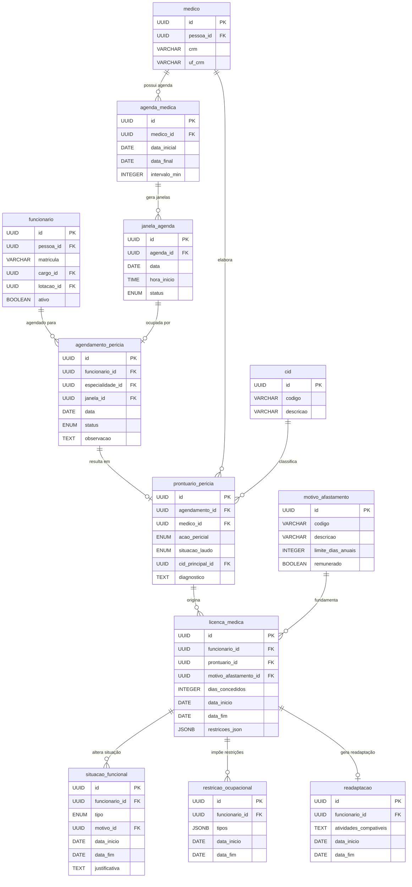
```mermaid
erDiagram
    funcionario {
        UUID id PK
        UUID pessoa_id FK
        VARCHAR matricula
        UUID cargo_id FK
        UUID lotacao_id FK
        BOOLEAN ativo
    }

    agendamento_pericia {
        UUID id PK
        UUID funcionario_id FK
        UUID especialidade_id FK
        UUID janela_id FK
        DATE data
        ENUM status
        TEXT observacao
    }

    janela_agenda {
        UUID id PK
        UUID agenda_id FK
        DATE data
        TIME hora_inicio
        ENUM status
    }

    agenda_medica {
        UUID id PK
        UUID medico_id FK
        DATE data_inicial
        DATE data_final
        INTEGER intervalo_min
    }

    medico {
        UUID id PK
        UUID pessoa_id FK
        VARCHAR crm
        VARCHAR uf_crm
    }

    prontuario_pericia {
        UUID id PK
        UUID agendamento_id FK
        UUID medico_id FK
        ENUM acao_pericial
        ENUM situacao_laudo
        UUID cid_principal_id FK
        TEXT diagnostico
    }

    cid {
        UUID id PK
        VARCHAR codigo
        VARCHAR descricao
    }

    licenca_medica {
        UUID id PK
        UUID funcionario_id FK
        UUID prontuario_id FK
        UUID motivo_afastamento_id FK
        INTEGER dias_concedidos
        DATE data_inicio
        DATE data_fim
        JSONB restricoes_json
    }

    motivo_afastamento {
        UUID id PK
        VARCHAR codigo
        VARCHAR descricao
        INTEGER limite_dias_anuais
        BOOLEAN remunerado
    }

    situacao_funcional {
        UUID id PK
        UUID funcionario_id FK
        ENUM tipo
        UUID motivo_id FK
        DATE data_inicio
        DATE data_fim
        TEXT justificativa
    }

    restricao_ocupacional {
        UUID id PK
        UUID funcionario_id FK
        JSONB tipos
        DATE data_inicio
        DATE data_fim
    }

    readaptacao {
        UUID id PK
        UUID funcionario_id FK
        TEXT atividades_compativeis
        DATE data_inicio
        DATE data_fim
    }

    funcionario ||--o{ agendamento_pericia : "agendado para"
    agenda_medica ||--o{ janela_agenda : "gera janelas"
    janela_agenda ||--o| agendamento_pericia : "ocupada por"
    medico ||--o{ agenda_medica : "possui agenda"
    agendamento_pericia ||--o| prontuario_pericia : "resulta em"
    medico ||--o{ prontuario_pericia : "elabora"
    cid ||--o{ prontuario_pericia : "classifica"
    prontuario_pericia ||--o{ licenca_medica : "origina"
    motivo_afastamento ||--o{ licenca_medica : "fundamenta"
    licenca_medica ||--o{ situacao_funcional : "altera situação"
    licenca_medica ||--o{ restricao_ocupacional : "impõe restrições"
    licenca_medica ||--o| readaptacao : "gera readaptação"
```

---

## 6. Diagrama Cross-Context Crítico 3 — Requisição → Admissão / Estagiário → Vínculo

Fluxo que conecta a abertura de uma vaga (requisição de pessoal ou programa de estágio) até a criação do vínculo funcional do servidor ou estagiário admitido.

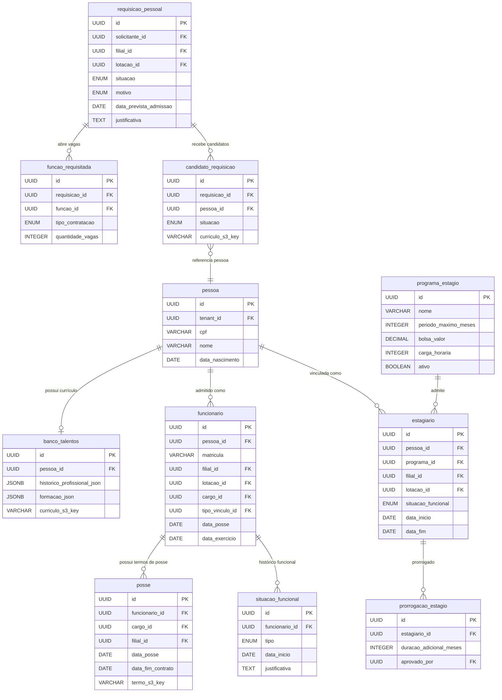
```mermaid
erDiagram
    requisicao_pessoal {
        UUID id PK
        UUID solicitante_id FK
        UUID filial_id FK
        UUID lotacao_id FK
        ENUM situacao
        ENUM motivo
        DATE data_prevista_admissao
        TEXT justificativa
    }

    funcao_requisitada {
        UUID id PK
        UUID requisicao_id FK
        UUID funcao_id FK
        ENUM tipo_contratacao
        INTEGER quantidade_vagas
    }

    candidato_requisicao {
        UUID id PK
        UUID requisicao_id FK
        UUID pessoa_id FK
        ENUM situacao
        VARCHAR curriculo_s3_key
    }

    banco_talentos {
        UUID id PK
        UUID pessoa_id FK
        JSONB historico_profissional_json
        JSONB formacao_json
        VARCHAR curriculo_s3_key
    }

    pessoa {
        UUID id PK
        UUID tenant_id FK
        VARCHAR cpf
        VARCHAR nome
        DATE data_nascimento
    }

    funcionario {
        UUID id PK
        UUID pessoa_id FK
        VARCHAR matricula
        UUID filial_id FK
        UUID lotacao_id FK
        UUID cargo_id FK
        UUID tipo_vinculo_id FK
        DATE data_posse
        DATE data_exercicio
    }

    posse {
        UUID id PK
        UUID funcionario_id FK
        UUID cargo_id FK
        UUID filial_id FK
        DATE data_posse
        DATE data_fim_contrato
        VARCHAR termo_s3_key
    }

    situacao_funcional {
        UUID id PK
        UUID funcionario_id FK
        ENUM tipo
        DATE data_inicio
        TEXT justificativa
    }

    programa_estagio {
        UUID id PK
        VARCHAR nome
        INTEGER periodo_maximo_meses
        DECIMAL bolsa_valor
        INTEGER carga_horaria
        BOOLEAN ativo
    }

    estagiario {
        UUID id PK
        UUID pessoa_id FK
        UUID programa_id FK
        UUID filial_id FK
        UUID lotacao_id FK
        ENUM situacao_funcional
        DATE data_inicio
        DATE data_fim
    }

    prorrogacao_estagio {
        UUID id PK
        UUID estagiario_id FK
        INTEGER duracao_adicional_meses
        UUID aprovado_por FK
    }

    requisicao_pessoal ||--o{ funcao_requisitada : "abre vagas"
    requisicao_pessoal ||--o{ candidato_requisicao : "recebe candidatos"
    candidato_requisicao }o--|| pessoa : "referencia pessoa"
    pessoa ||--o| banco_talentos : "possui currículo"
    pessoa ||--o{ funcionario : "admitido como"
    funcionario ||--o{ posse : "possui termos de posse"
    funcionario ||--o{ situacao_funcional : "histórico funcional"
    programa_estagio ||--o{ estagiario : "admite"
    pessoa ||--o{ estagiario : "vinculada como"
    estagiario ||--o{ prorrogacao_estagio : "prorrogado"
```

---

*Fim do documento — 32-diagramas-er.md*

## Apêndice HR-06 — Estrutura Organizacional Runtime

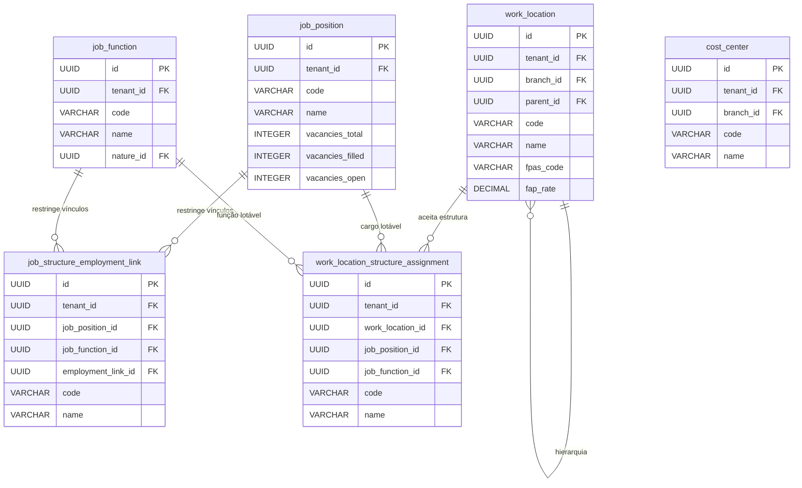
```mermaid
erDiagram
    job_position {
        UUID id PK
        UUID tenant_id FK
        VARCHAR code
        VARCHAR name
        INTEGER vacancies_total
        INTEGER vacancies_filled
        INTEGER vacancies_open
    }

    job_function {
        UUID id PK
        UUID tenant_id FK
        VARCHAR code
        VARCHAR name
        UUID nature_id FK
    }

    work_location {
        UUID id PK
        UUID tenant_id FK
        UUID branch_id FK
        UUID parent_id FK
        VARCHAR code
        VARCHAR name
        VARCHAR fpas_code
        DECIMAL fap_rate
    }

    cost_center {
        UUID id PK
        UUID tenant_id FK
        UUID branch_id FK
        VARCHAR code
        VARCHAR name
    }

    job_structure_employment_link {
        UUID id PK
        UUID tenant_id FK
        UUID job_position_id FK
        UUID job_function_id FK
        UUID employment_link_id FK
        VARCHAR code
        VARCHAR name
    }

    work_location_structure_assignment {
        UUID id PK
        UUID tenant_id FK
        UUID work_location_id FK
        UUID job_position_id FK
        UUID job_function_id FK
        VARCHAR code
        VARCHAR name
    }

    work_location ||--o{ work_location : "hierarquia"
    job_position ||--o{ job_structure_employment_link : "restringe vínculos"
    job_function ||--o{ job_structure_employment_link : "restringe vínculos"
    work_location ||--o{ work_location_structure_assignment : "aceita estrutura"
    job_position ||--o{ work_location_structure_assignment : "cargo lotável"
    job_function ||--o{ work_location_structure_assignment : "função lotável"
```

Regra de vagas: `job_position.vacancies_total = vacancies_filled + vacancies_open`. Todas as entidades são tenant-scoped, protegidas por RLS e auditadas por `sgp_append_audit_event(...)`.
