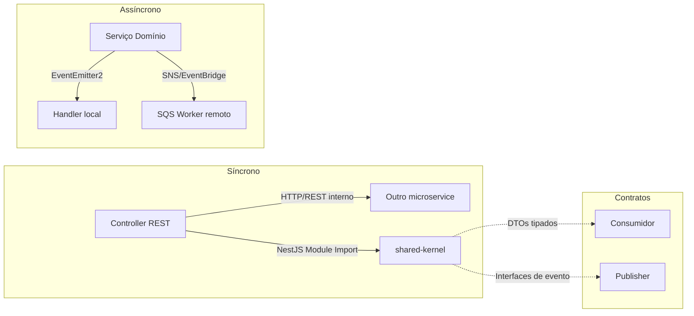
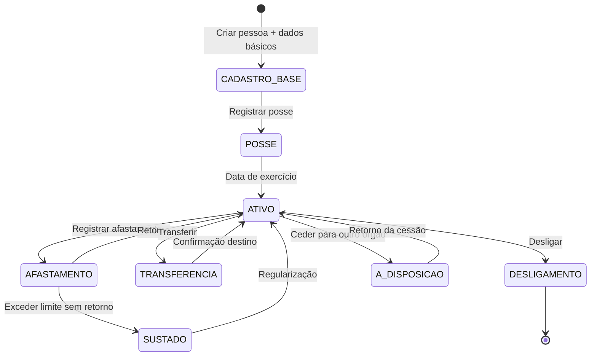
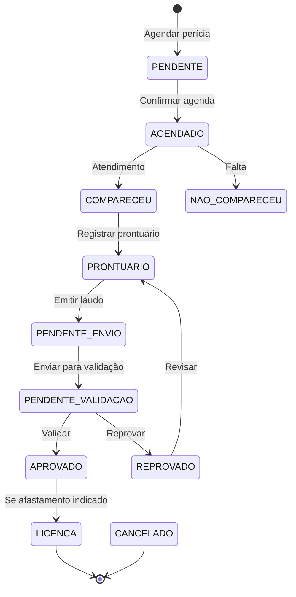
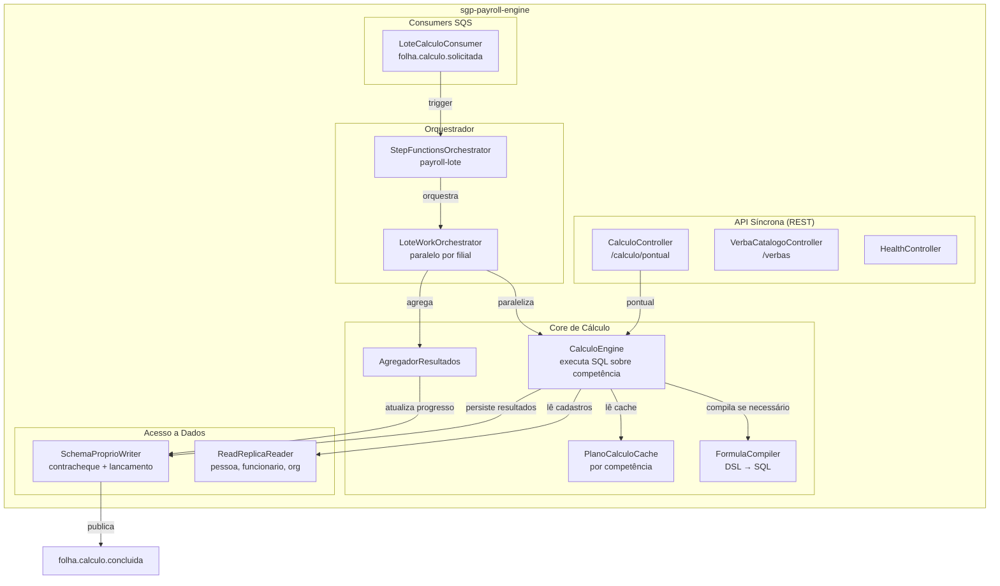
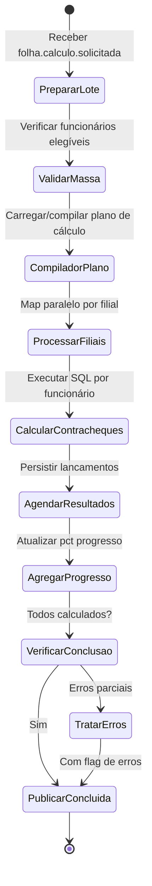
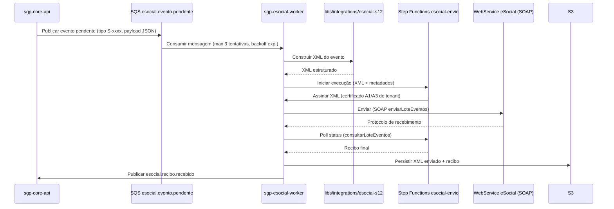
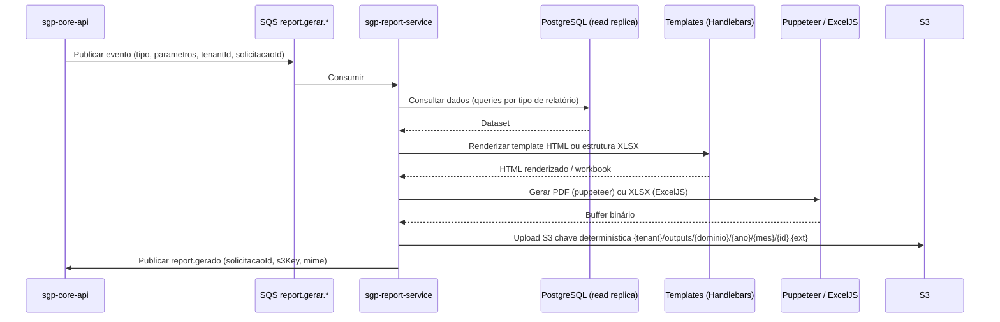
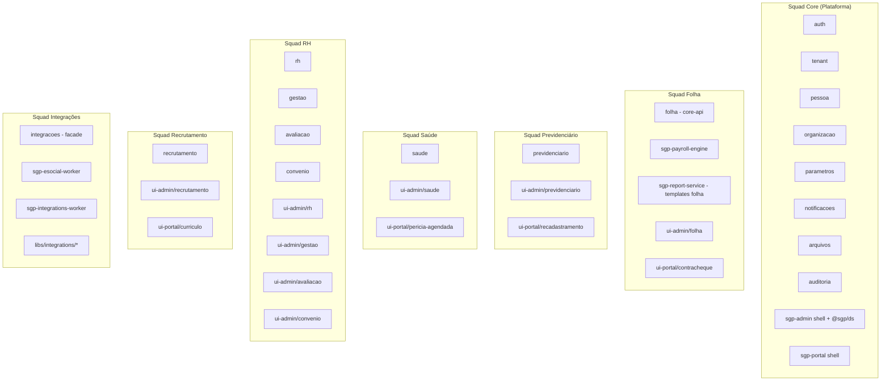

# Divisão Modular — SGP

**Versão:** 1.0 | **Data:** 2026-04-21 | **Status:** Draft
**Escopo:** Todos os bounded contexts | **Depende de:** BRIEF.md

---

## Sumário

1. [Princípios de Divisão Modular](#1-princípios-de-divisão-modular)
2. [Layout do Monorepo](#2-layout-do-monorepo)
3. [Backend Modular — NestJS](#3-backend-modular--nestjs)
4. [Microsserviço de Folha — sgp-payroll-engine](#4-microsserviço-de-folha--sgp-payroll-engine)
5. [Workers Assíncronos](#5-workers-assíncronos)
6. [Frontend Modular — Angular](#6-frontend-modular--angular)
7. [Dependências Cross-Context](#7-dependências-cross-context)
8. [Políticas de Compartilhamento](#8-políticas-de-compartilhamento)
9. [Estratégia de Deploy por Módulo](#9-estratégia-de-deploy-por-módulo)
10. [Boundaries de Equipe](#10-boundaries-de-equipe)

---

## 1. Princípios de Divisão Modular

### 1.1 Domain-Driven Design e Bounded Contexts

O SGP adota **Domain-Driven Design (DDD)** como filosofia central de divisão. Cada área funcional do sistema é mapeada para um **bounded context** (contexto delimitado) com:

- **Linguagem ubíqua própria:** termos como `matricula`, `competencia`, `contracheque`, `beneficiario` têm significados precisos dentro de cada contexto e podem diferir entre contextos vizinhos.
- **Modelo de domínio privado:** entidades, agregados e value objects são internos ao contexto; nunca expostos diretamente a outros contextos.
- **Fronteiras explícitas:** a borda entre contextos é demarcada por contratos tipados (DTOs em `shared-kernel`) ou por eventos de domínio.

Os bounded contexts identificados são:

| Bounded Context             | Código                  | Módulo NestJS principal                                    |
| --------------------------- | ----------------------- | ---------------------------------------------------------- |
| Identidade e Acesso         | `CORE_AUTH`             | `auth`                                                     |
| Multi-tenancy               | `CORE_TENANT`           | `tenant`                                                   |
| Pessoa Civil                | `CORE_PESSOA`           | `pessoa`                                                   |
| Estrutura Organizacional    | `CORE_ORGANIZACAO`      | `organizacao`                                              |
| Parametrizações e Estrutura | `GESTAO`                | `gestao`                                                   |
| Vida Funcional (RH)         | `MODULO_RH`             | `rh`                                                       |
| Folha de Pagamento          | `FOLHA_PAGAMENTO`       | `folha` (cliente) + `sgp-payroll-engine`                   |
| FGTS CLT                    | `FOLHA_PAGAMENTO`       | `folha-pagamento/fgts`; `folha-pagamento/operations/sifge` |
| Avaliação e Progressão      | `MODULO_AVALIACAO`      | `avaliacao`                                                |
| Recrutamento e Seleção      | `RECRUTAMENTO_SELECAO`  | `recrutamento`                                             |
| Prova Online com Proctoring | `RECRUTAMENTO_SELECAO`  | `recrutamento/prova-online`                                |
| Certificação da Banca       | `RECRUTAMENTO_SELECAO`  | `recrutamento/banca`                                       |
| Consultas Gerenciais        | `CONSULTAS_GERENCIAIS`  | `consultas`                                                |
| Relatórios                  | `RELATORIO`             | `relatorios`                                               |
| Previdenciário              | `MODULO_PREVIDENCIARIO` | `previdenciario`                                           |
| Auditoria                   | `AUDITORIA`             | `auditoria`                                                |
| Saúde Ocupacional           | `JUNTA_MEDICA`          | `saude`                                                    |
| Ponto Eletrônico            | `PONTO_ELETRONICO`      | `ponto`                                                    |
| Convênios                   | `CONVENIO`              | `convenio`                                                 |
| Notificações                | `NOTIFICACOES`          | `notificacoes`                                             |
| Arquivos                    | `ARQUIVOS`              | `arquivos`                                                 |
| Parâmetros e Feature Flags  | `PARAMETROS`            | `parametros`                                               |
| Integrações Externas        | `INTEGRACOES`           | `integracoes`                                              |
| Tribunais de Contas         | `COMPLIANCE_TCE`        | `tce`                                                      |
| Portal Publico              | `PUBLICO`               | `publico/transparency`                                     |

### 1.2 Módulos NestJS por Contexto

Cada bounded context é implementado como um **NestJS Module** (`@Module()`). A convenção é:

```
src/modules/<contexto>/
├── <contexto>.module.ts
├── controllers/
│   └── <recurso>.controller.ts
├── services/
│   └── <recurso>.service.ts
├── repositories/
│   └── <recurso>.repository.ts
├── dto/
│   ├── create-<recurso>.dto.ts
│   ├── update-<recurso>.dto.ts
│   └── <recurso>.response.dto.ts
├── entities/
│   └── <recurso>.entity.ts
└── events/
    ├── <evento>.event.ts
    └── <evento>.handler.ts
```

Os módulos NestJS **não importam diretamente** módulos de outros contextos de negócio. A comunicação ocorre:

- Via injeção do `EventEmitter2` para publicar eventos de domínio internos.
- Via publicação em tópicos SNS/EventBridge para eventos que cruzam fronteiras de deployment.
- Via HTTP interno (chamadas REST entre `sgp-core-api` e `sgp-payroll-engine`).

### 1.3 Monorepo Nx

O repositório usa **Nx** como ferramenta de monorepo. As decisões estruturais são:

- **`nx affected`** determina quais apps/libs precisam ser recompiladas, testadas e deployadas em cada push.
- **`nx graph`** gera o grafo de dependências e é parte obrigatória da revisão de PRs que cruzam fronteiras de contexto.
- **Executors nx** padronizam build, test, lint e serve para TypeScript/Angular.
- **Tags nx** classificam projetos: `type:app`, `type:lib`, `scope:<contexto>`. Regras em `.eslintrc` impedem libs de `scope:folha` importando diretamente libs de `scope:rh` (comunicação deve passar por contratos ou eventos).

### 1.4 Shared Kernel

O `shared-kernel` é uma biblioteca nx de tipo `type:lib, scope:shared`. Contém **exclusivamente**:

- Tipos TypeScript e interfaces de contratos entre contextos.
- Enums e constantes de domínio (`VinculoTipo`, `SituacaoFuncional`, `TipoProcessamento`, etc.).
- Classes de erro padronizadas (`SgpError`, `SgpValidationError`, `SgpNotFoundError`).
- Utilitários genéricos sem lógica de negócio (formatação de CPF, datas, CNPJ).
- Tipos de evento de domínio (interfaces `DomainEvent<T>`).

**Proibições explícitas no shared-kernel:**

- Entidades Prisma/TypeORM (ficam privadas em cada módulo).
- Serviços com lógica de negócio.
- Dependências de frameworks (NestJS, Angular).
- Qualquer import de libs de domínio específico.

### 1.5 Comunicação Inter-Contexto



**Regras de comunicação:**

| Cenário                              | Mecanismo                                 | Quando usar                                                 |
| ------------------------------------ | ----------------------------------------- | ----------------------------------------------------------- |
| Mesma app, mesmo processo            | `EventEmitter2` (in-process)              | Eventos de domínio dentro do `sgp-core-api`                 |
| Mesma app, lógica cross-module       | Injeção de DTO via contrato shared-kernel | Consulta de dados de outro módulo sem acoplamento           |
| Microservice para microservice       | HTTP REST (API Gateway interna)           | `sgp-core-api` ↔ `sgp-payroll-engine` (consultas síncronas) |
| Notificação assíncrona cross-service | SNS → SQS                                 | Folha calculo solicitada, eSocial evento pendente           |
| Orquestração complexa                | Step Functions                            | Cálculo de lote, envio eSocial                              |

### 1.6 Testes de Contrato

Os contratos entre contextos são validados via **Pact** (consumer-driven contract testing):

- O consumidor define o contrato esperado (ex.: `sgp-payroll-engine` espera receber `PessoaContrato` com campos obrigatórios).
- O provedor (`sgp-core-api`) publica a verificação do contrato no Pact Broker.
- O pipeline de CI bloqueia deploy do provedor se algum contrato de consumidor for quebrado.
- Contratos versionados junto com o código; change log em `libs/shared-kernel/CHANGELOG.md`.

---

## 2. Layout do Monorepo

```
sgp/
├── apps/
│   ├── sgp-core-api/                    (NestJS — API principal)
│   │   ├── src/
│   │   │   ├── main.ts
│   │   │   ├── app.module.ts
│   │   │   └── modules/
│   │   │       ├── auth/
│   │   │       ├── tenant/
│   │   │       ├── pessoa/
│   │   │       ├── organizacao/
│   │   │       ├── gestao/
│   │   │       ├── rh/
│   │   │       ├── folha/
│   │   │       ├── avaliacao/
│   │   │       ├── recrutamento/
│   │   │       ├── consultas/
│   │   │       ├── relatorios/
│   │   │       ├── previdenciario/
│   │   │       ├── auditoria/
│   │   │       ├── saude/
│   │   │       ├── convenio/
│   │   │       ├── notificacoes/
│   │   │       ├── arquivos/
│   │   │       ├── parametros/
│   │   │       └── integracoes/
│   │   ├── project.json
│   │   └── Dockerfile
│   │
│   ├── sgp-payroll-engine/              (NestJS microservice — cálculo de folha)
│   │   ├── src/
│   │   │   ├── main.ts
│   │   │   ├── app.module.ts
│   │   │   └── modules/
│   │   │       ├── calculo/
│   │   │       ├── formula-compiler/
│   │   │       ├── plano-calculo/
│   │   │       ├── lote/
│   │   │       └── replica-read/
│   │   ├── project.json
│   │   └── Dockerfile
│   │
│   ├── sgp-esocial-worker/              (NestJS worker — eSocial S-1.2)
│   │   ├── src/
│   │   │   ├── main.ts
│   │   │   ├── app.module.ts
│   │   │   └── modules/
│   │   │       ├── evento-consumer/
│   │   │       ├── xml-builder/
│   │   │       ├── assinatura/
│   │   │       ├── envio/
│   │   │       └── recibo/
│   │   ├── project.json
│   │   └── Dockerfile
│   │
│   ├── sgp-integrations-worker/         (NestJS worker — CNAB, SIPREV, DIRF)
│   │   ├── src/
│   │   │   ├── main.ts
│   │   │   ├── app.module.ts
│   │   │   └── modules/
│   │   │       ├── cnab-remessa/
│   │   │       ├── cnab-retorno/
│   │   │       ├── siprev/
│   │   │       └── dirf/
│   │   ├── project.json
│   │   └── Dockerfile
│   │
│   ├── sgp-report-service/              (NestJS — geração PDF/XLSX/XML)
│   │   ├── src/
│   │   │   ├── main.ts
│   │   │   ├── app.module.ts
│   │   │   └── modules/
│   │   │       ├── report-consumer/
│   │   │       ├── pdf-renderer/
│   │   │       ├── xlsx-renderer/
│   │   │       ├── xml-builder/
│   │   │       └── storage/
│   │   ├── project.json
│   │   └── Dockerfile
│   │
│   ├── sgp-admin/                       (Angular SPA — back-office)
│   │   ├── src/
│   │   │   ├── main.ts
│   │   │   ├── app/
│   │   │   │   ├── app.component.ts
│   │   │   │   ├── app.routes.ts
│   │   │   │   └── shell/
│   │   │   └── environments/
│   │   ├── project.json
│   │   └── nginx.conf
│   │
│   └── sgp-portal/                      (Angular SPA — servidor/pensionista/candidato)
│       ├── src/
│       │   ├── main.ts
│       │   ├── app/
│       │   │   ├── app.component.ts
│       │   │   ├── app.routes.ts
│       │   │   └── shell/
│       │   └── environments/
│       ├── project.json
│       └── nginx.conf
│
├── libs/
│   ├── shared-kernel/                   (tipos, enums, erros, utils)
│   │   ├── src/
│   │   │   ├── index.ts
│   │   │   ├── enums/
│   │   │   │   ├── vinculo-tipo.enum.ts
│   │   │   │   ├── situacao-funcional.enum.ts
│   │   │   │   ├── tipo-processamento.enum.ts
│   │   │   │   ├── status-folha.enum.ts
│   │   │   │   └── ...
│   │   │   ├── types/
│   │   │   │   ├── domain-event.type.ts
│   │   │   │   ├── paginated-result.type.ts
│   │   │   │   └── tenant-context.type.ts
│   │   │   ├── errors/
│   │   │   │   ├── sgp.error.ts
│   │   │   │   ├── sgp-validation.error.ts
│   │   │   │   └── sgp-not-found.error.ts
│   │   │   └── utils/
│   │   │       ├── cpf.util.ts
│   │   │       ├── cnpj.util.ts
│   │   │       ├── date.util.ts
│   │   │       └── currency.util.ts
│   │   └── project.json
│   │
│   ├── domain/
│   │   ├── core-auth/
│   │   ├── core-tenant/
│   │   ├── core-pessoa/
│   │   ├── core-organizacao/
│   │   ├── gestao/
│   │   ├── rh/
│   │   ├── folha/
│   │   ├── avaliacao/
│   │   ├── recrutamento/
│   │   ├── consultas/
│   │   ├── relatorios/
│   │   ├── previdenciario/
│   │   ├── auditoria/
│   │   ├── saude/
│   │   ├── convenio/
│   │
│   ├── integrations/
│   │   ├── esocial-s12/                 (builders de XML S-1.2, S-2xxx, S-3xxx)
│   │   ├── siprev/                      (builder XML SIPREV)
│   │   ├── dirf/                        (builder TXT DIRF)
│   │   ├── prefeitura-publica/          (cliente REST prefeitura pública)
│   │   ├── gov-br/                      (cliente OIDC Gov.br)
│   │   ├── cognito/                     (wrapper AWS Cognito SDK)
│   │   ├── banco-cnab/                  (parsers/builders CNAB 240/400)
│   │   └── neoconsig/                   (parser CSV Neoconsig)
│   │
│   ├── ui-admin/                        (Angular libs para sgp-admin)
│   │   ├── gestao/
│   │   ├── rh/
│   │   ├── folha/
│   │   ├── avaliacao/
│   │   ├── recrutamento/
│   │   ├── consultas/
│   │   ├── relatorios/
│   │   ├── previdenciario/
│   │   ├── auditoria/
│   │   ├── saude/
│   │   ├── convenio/
│   │
│   ├── ui-portal/                       (Angular libs para sgp-portal)
│   │   ├── contracheque/
│   │   ├── recadastramento/
│   │   ├── solicitacoes/
│   │   ├── pericia-agendada/
│   │   ├── curriculo/
│   │   └── termos/
│   │
│   └── testing/                         (Jest factories, Playwright fixtures)
│       ├── src/
│       │   ├── factories/
│       │   │   ├── pessoa.factory.ts
│       │   │   ├── funcionario.factory.ts
│       │   │   ├── folha.factory.ts
│       │   │   └── ...
│       │   ├── fixtures/
│       │   │   └── playwright/
│       │   └── mocks/
│       └── project.json
│
└── tools/
    ├── db-migrations/                   (Flyway / Prisma Migrate scripts)
    │   ├── V001__schema_base.sql
    │   ├── V002__rls_policies.sql
    │   └── ...
    ├── seeds/                           (dados de referência e desenvolvimento)
    │   ├── enums.seed.ts
    │   ├── tenant-demo.seed.ts
    │   └── ...
    └── openapi-gen/                     (geração de clientes TypeScript a partir do OpenAPI)
        ├── generate.ts
        └── templates/
```

---

## 3. Backend Modular — NestJS

Arrecadação Previdenciária é versão futura. O layout atual não declara biblioteca, módulo NestJS, rota, evento, dependência cross-context ou lib Angular para esse domínio.

### 3.1 Módulos de Infraestrutura Transversal

#### `auth` — Identidade e Acesso

**Responsabilidades:** autenticação JWT via AWS Cognito; validação de tokens; RBAC multi-camada (Tenant → Perfil → Papel → Usuário); guards globais; refresh de tokens; logout; gestão de usuários e perfis; feature flags por tenant.

**Entidades:** `usuario` (cognito_sub, email, tenant_id, perfis[], ativo), `perfil`, `papel`, `usuario_papel`, `feature_flag`.

**Serviços:** `AuthService`, `TokenValidationService`, `RbacService`, `FeatureFlagService`, `UserManagementService`.

**Controladores:** `POST /api/v1/auth/refresh`, `POST /api/v1/auth/logout`, `GET /api/v1/auth/me`, `GET /api/admin/v1/usuarios`, `POST /api/admin/v1/usuarios`, `PUT /api/admin/v1/usuarios/:id/perfis`, `GET /api/admin/v1/perfis`, `POST /api/admin/v1/perfis`, `GET /api/admin/v1/papeis`.

**Eventos publicados:** `auth.usuario.criado`, `auth.usuario.bloqueado`, `auth.login.realizado`.

**Eventos consumidos:** nenhum (é produtor primário).

**Dependências cross-module:** `tenant` (para carregar contexto de tenant no guard), `parametros` (para feature flags).

---

#### `tenant` — Multi-tenancy

**Responsabilidades:** gestão do ciclo de vida de tenants (entes contratantes); parametrização por tenant; isolamento row-level (RLS); provisionamento inicial de tenant (schema, seed de enums, usuário admin).

**Entidades:** `tenant` (id, nome, cnpj, sigla, plano, ativo, criado_em), `parametro_sistema` (chave-valor por tenant), `parametro_global`.

**Serviços:** `TenantService`, `TenantProvisioningService`, `ParametroSistemaService`.

**Controladores:** `GET /api/admin/v1/tenants`, `POST /api/admin/v1/tenants`, `GET /api/admin/v1/tenants/:id/parametros`, `PUT /api/admin/v1/tenants/:id/parametros`.

**Eventos publicados:** `tenant.provisionado`, `tenant.desativado`.

**Eventos consumidos:** nenhum.

**Dependências cross-module:** nenhuma (módulo raiz).

---

#### `pessoa` — Núcleo Civil

**Responsabilidades:** cadastro e manutenção da pessoa física (dados pessoais, documentos, endereço, contato, dependentes); reaproveitamento de CPF entre vínculos; busca textual por nome/CPF.

**Entidades:** `pessoa`, `documento_pessoa`, `endereco`, `contato`, `dependente`.

**Serviços:** `PessoaService`, `DocumentoService`, `EnderecoService`, `ContatoService`, `DependenteService`.

**Controladores:** `GET /api/v1/pessoas`, `POST /api/v1/pessoas`, `GET /api/v1/pessoas/:id`, `PUT /api/v1/pessoas/:id`, `GET /api/v1/pessoas/:id/documentos`, `POST /api/v1/pessoas/:id/documentos`, `GET /api/v1/pessoas/:id/dependentes`, `POST /api/v1/pessoas/:id/dependentes`, `GET /api/v1/pessoas/:id/enderecos`, `PUT /api/v1/pessoas/:id/contato`.

**Eventos publicados:** `pessoa.criada`, `pessoa.atualizada`, `pessoa.endereco.atualizado`, `pessoa.contato.atualizado`.

**Eventos consumidos:** `recadastramento.concluido` (para retroalimentar endereço/contato/estado civil).

**Dependências cross-module:** nenhuma (é provedor primário).

---

#### `organizacao` — Estrutura Organizacional

**Responsabilidades:** gestão de empresa matriz, filiais, lotações, centros de custo, hierarquia organizacional; cadastros mestres (banco, agência, município, UF, cargo, função, jornada, turno, tipo de folha, tipo de contratação).

**Entidades:** `empresa_matriz`, `filial`, `lotacao`, `centro_custo`, `banco`, `agencia`, `municipio`, `uf`, `cargo`, `funcao`, `jornada`, `turno`, `tipo_folha`, `tipo_contratacao`.

**Serviços:** `EmpresaMatrizService`, `FilialService`, `LotacaoService`, `CentroCustoService`, `CargoService`, `FuncaoService`, `BancoService`, `MunicipioService`.

**Controladores:** `GET /api/v1/organizacao/filiais`, `POST /api/v1/organizacao/filiais`, `GET /api/v1/organizacao/filiais/:id/lotacoes`, `GET /api/v1/organizacao/cargos`, `POST /api/v1/organizacao/cargos`, `GET /api/v1/organizacao/funcoes`, `GET /api/v1/organizacao/bancos`, `GET /api/v1/organizacao/municipios`.

**Eventos publicados:** `organizacao.lotacao.criada`, `organizacao.cargo.atualizado`, `organizacao.filial.desativada`.

**Eventos consumidos:** nenhum.

**Dependências cross-module:** `pessoa` (para validações de endereço via município).

---

### 3.2 Módulos de Negócio

#### `gestao` — Parametrizações e Estrutura

**Responsabilidades:** cadastros estruturantes do sistema (plano de cargos e carreira, referências salariais, faixas salariais, grupos salariais, motivos de afastamento, causas de afastamento, naturezas de função, tipos de vínculo de ingresso, tipos de estabilidade, enums parametrizáveis, programação de competências).

**Entidades:** `plano_cargos_carreira`, `referencia_salarial`, `faixa_salarial`, `grupo_salarial`, `motivo_afastamento`, `causa_afastamento`, `tipo_vinculo_ingresso`, `tipo_estabilidade`, `enum_catalogo`, `enum_item`.

**Serviços:** `PlanoCargosService`, `ReferenciaSalarialService`, `EnumCatalogoService`, `MotivoAfastamentoService`.

**Controladores:** `GET /api/v1/gestao/planos-cargos`, `POST /api/v1/gestao/planos-cargos`, `GET /api/v1/gestao/referencias-salariais`, `GET /api/v1/gestao/enums/:catalogo`, `POST /api/v1/gestao/enums/:catalogo/itens`, `GET /api/v1/gestao/motivos-afastamento`.

**Eventos publicados:** `gestao.plano-cargos.atualizado`, `gestao.referencia-salarial.atualizada`.

**Eventos consumidos:** nenhum.

**Dependências cross-module:** `organizacao` (faixas salariais ligadas a cargos).

##### `gestao.master-data` — Estrutura organizacional

**Responsabilidades:** CRUD administrativo de cargos, funções, lotações hierárquicas, centros de custo e vínculos entre cargo/função e vínculo funcional. Essa base é pré-requisito para o vínculo funcional (`rh`) e para o cadastro do servidor.

**Entidades físicas:** `hr.job_position`, `hr.job_function`, `hr.work_location`, `hr.cost_center`, `hr.job_structure_employment_link`, `hr.work_location_structure_assignment`.

**Controladores:** `GET/POST/PATCH/DELETE /api/v1/master-data/{resource}` para `cargo`, `funcao`, `lotacao`, `centroCusto`, `cargoVinculo` e `funcaoVinculo`; `POST /api/v1/cargos` é a rota operacional de cargo exigida pelo contrato HR-06.

**Permissões:** leitura exige `gestao.master_data.read`; mutações exigem `gestao.master_data.write`. As tabelas tenant-scoped têm RLS por `tenant_id` e registram mutações por `sgp_append_audit_event(...)`.

---

#### `rh` — Vida Funcional

**Responsabilidades:** gestão completa do funcionário/servidor desde a posse até o desligamento; controle de matrículas; situação funcional e histórico; transferências; dossiê digital; ficha funcional; observações funcionais; afastamentos; cedência.

**Entidades:** `hr.employee`, `hr.employment_link`, `hr.employment_contract`, `hr.employee_status_history`, `posse`, `transferencia`, `cedido_detalhe`, `anexo_funcionario`, `dossie`, `observacao_funcional`, `controle_anual_afastamento`.

**Lifecycle:**



**Serviços:** `EmployeesService` (`rh.employees`), `VacationService` (`rh.vacation`), `VinculoService`, `SituacaoFuncionalService`, `PosseService`, `TransferenciaService`, `CedidoService`, `DossieService`, `ObservacaoFuncionalService`, `MatriculaService`, `AfastamentoService`, `FichaFuncionalService`.

**Controladores:**

- `GET /api/v1/funcionarios` — listagem paginada com filtros
- `POST /api/v1/funcionarios` — admissão HR-01; cria `employee`, contrato ativo, linha imutável em `employee_status_history` e evento em `audit_event`
- `GET /api/v1/rh/funcionarios/:id` — perfil completo
- `PUT /api/v1/rh/funcionarios/:id` — atualização
- `POST /api/v1/rh/funcionarios/:id/posse` — registrar posse
- `POST /api/v1/rh/funcionarios/:id/situacoes` — alterar situação funcional
- `GET /api/v1/rh/funcionarios/:id/situacoes` — histórico de situações
- `POST /api/v1/rh/funcionarios/:id/transferencias` — transferir
- `POST /api/v1/funcionarios/:id/desligamento` — desligar; altera situação funcional, encerra contrato ativo e audita a mutação
- `GET /api/v1/ferias/saldo/:employee_id` — saldo de férias por período aquisitivo
- `POST /api/v1/ferias/programacao` — programação de férias com até três parcelas e abono pecuniário limitado
- `POST /api/v1/ferias/programacao/:id/aprovar` — aprovação de chefia/RH
- `POST /api/v1/ferias/programacao/:id/cancelar` — cancelamento administrativo
- `GET /api/v1/rh/funcionarios/:id/ficha-funcional` — ficha funcional consolidada
- `GET /api/v1/rh/funcionarios/:id/dossie` — listar anexos
- `POST /api/v1/rh/funcionarios/:id/dossie` — anexar documento
- `POST /api/v1/rh/funcionarios/:id/observacoes` — registrar observação
- `GET /api/v1/rh/funcionarios/:id/afastamentos` — histórico de afastamentos

**Eventos publicados:** `rh.funcionario.criado`, `rh.funcionario.posse.registrada`, `rh.funcionario.situacao.alterada`, `rh.funcionario.transferido`, `rh.funcionario.desligado`, `rh.afastamento.iniciado`, `rh.afastamento.encerrado`.

**Eventos consumidos:** `saude.licenca.concedida` (cria afastamento automático), `previdenciario.aposentadoria.concedida` (desligamento por aposentadoria), `recrutamento.estagiario.desligado`.

**Dependências cross-module:** `pessoa` (dados pessoais), `organizacao` (cargo, lotação, filial), `gestao` (referências salariais, motivos de afastamento), `folha` (inativa verbas ativas no desligamento via evento).

---

#### `folha` — Cliente do Microsserviço de Folha

**Responsabilidades:** orquestração do ciclo de folha no `sgp-core-api`; gestão de competências; criação e configuração de folhas de pagamento; lançamentos manuais e importados; consignados; disparo de cálculo para o `sgp-payroll-engine`; acompanhamento de progresso; exposição de resultados (contracheques, resumos, relatórios financeiros).

**Entidades (no sgp-core-api):** `competencia`, `folha_pagamento`, `tipo_processamento`, `lote_processamento`, `lancamento` (lançamentos manuais pré-cálculo), `consignado`, `importacao_consignado`, `importacao_lancamento_manual`, `relatorio_financeiro`.

**Serviços:** `CompetenciaService`, `FolhaPagamentoService`, `LancamentoService`, `ConsignadoService`, `ImportacaoService`, `CalculoOrquestradorService` (dispara para payroll-engine), `ContrachequeViewService`, `RelatorioFinanceiroService`, `folha-pagamento/operations/bank-account` para validação BANK-03 de dados bancários antes da elegibilidade CNAB, `folha-pagamento/operations/alimony` para BANK-04: cadastro de ordens judiciais de pensão alimentícia, retenção prioritária em folha e repasse CNAB à conta judicial do beneficiário, `folha-pagamento/operations/consignment` para CONS-01: cadastro de consignantes, averbações, cálculo de margem geral/cartão e emissão de descontos consignados na cadeia CALC-11, e `folha-pagamento/operations/sifge` para BANK-05: geração de GRF mensal, GRRF rescisória, DAE e arquivo SIFGE 4.0 por adapter Caixa pluggável.

**Controladores:**

- `POST /api/v1/folha/competencias` — abrir competência
- `GET /api/v1/folha/competencias` — listar
- `PUT /api/v1/folha/competencias/:id/fechar` — fechar (imediato ou agendar)
- `POST /api/v1/folha/competencias/:id/folhas` — criar folha por filial/tipo
- `GET /api/v1/folha/competencias/:id/folhas` — listar folhas da competência
- `POST /api/v1/folha/folhas/:id/lancamentos` — incluir lançamento manual
- `POST /api/v1/folha/folhas/:id/calcular` — disparar cálculo (síncrono pontual ou lote)
- `GET /api/v1/folha/folhas/:id/contracheques` — listar contracheques
- `GET /api/v1/folha/contracheques/:id` — contracheque individual
- `GET /api/v1/folha/contracheques/:id/pdf` — PDF do contracheque
- `POST /api/v1/folha/importacoes/consignados` — importar arquivo consignado
- `GET /api/v1/employees/:id/consignment-margin?competence=YYYY-MM` — consultar margem consignável geral/cartão
- `GET /api/v1/employees/:id/consignment-loans` — listar averbações de consignado do servidor
- `POST /api/v1/employees/:id/consignment-loans` — averbar contrato respeitando margem disponível
- `GET /api/v1/employees/:id/alimonies?status=ACTIVE` — listar ordens judiciais de pensão alimentícia do servidor
- `POST /api/v1/employees/:id/alimonies` — cadastrar ordem judicial com beneficiário, conta judicial, base, vigência e prioridade
- `PATCH /api/v1/employees/:id/alimonies/:alimonyId` — atualizar, suspender ou encerrar ordem preservando versão anterior em histórico
- `POST /api/v1/folha/importacoes/verbas` — importar verbas servidor/pensionista
- `GET /api/v1/folha/relatorios-financeiros` — listar relatórios financeiros
- `GET /api/v1/folha/verbas` — catálogo de verbas/rubricas
- `GET /api/v1/payroll-engine/health` — health check do runtime separado de cálculo
- `GET /api/v1/payroll-engine/status` — status operacional e readiness do motor de fórmulas
- `POST /api/v1/payroll-engine/calculations` — solicitação runtime de cálculo pelo contrato do engine

**Eventos publicados:** `folha.calculo.solicitada` (para `sgp-payroll-engine`), `folha.competencia.fechada`, `folha.contracheque.disponivel`, `contracheque.gerar.pdf`, `report.gerar.folha`, `remessa.gerar`.

**Eventos consumidos:** `folha.calculo.concluida` (atualiza situação da folha e notifica UI), `retorno.processar`.

**Dependências cross-module:** `rh` (massa de funcionários via evento/read), `organizacao` (filiais/lotações), `previdenciario` (pensionistas), `convenio` (descontos de convênio), `consignado/integracoes`.

---

#### `avaliacao` — Avaliação e Progressão

**Responsabilidades:** gestão de avaliações de desempenho; progressões de mérito, titularidade e judicial; simulador de nível salarial; plano de cargos e progressão.

**Entidades:** `avaliacao_desempenho`, `progressao_merito`, `simulador_nivel_salarial`.

**Serviços:** `AvaliacaoDesempenhoService`, `ProgressaoMeritoService`, `SimuladorNivelSalarialService`.

**Controladores:**

- `GET /api/v1/avaliacao/funcionarios/:id/avaliacoes`
- `POST /api/v1/avaliacao/funcionarios/:id/avaliacoes`
- `GET /api/v1/avaliacao/funcionarios/:id/progressoes`
- `POST /api/v1/avaliacao/progressoes` — registrar progressão
- `POST /api/v1/avaliacao/simulador` — simular próximo nível
- `GET /api/v1/avaliacao/plano-cargos` — consultar estrutura

**Eventos publicados:** `avaliacao.progressao.aprovada`.

**Eventos consumidos:** nenhum.

**Dependências cross-module:** `rh` (funcionário), `gestao` (plano cargos e carreira, referências salariais).

---

#### `recrutamento` — Recrutamento, Seleção e Estágio

**Responsabilidades:** fluxo completo de requisição de pessoal (rascunho → aprovação → análise de candidatos → conclusão); cadastro administrativo de concurso publico com edital, vagas por cargo, reservas legais e publicacao no Portal Transparencia; inscrição pública com consentimento LGPD; `recrutamento/biometria` para captura de template digital/facial, consentimento específico art. 11, retenção limitada e conferência presencial no dia da prova; `recrutamento/banca` para membros de banca examinadora, assinatura sequencial XAdES/PAdES de gabarito final, ata e lista de aprovados, e verificação pública por token; banco de talentos; gestão de estagiários (programa, prorrogação, recesso, desligamento automático).

**Entidades:** `requisicao_pessoal`, `funcao_requisitada`, `candidato_requisicao`, `concurso`, `edital`, `vaga`, `candidato`, `inscricao`, `biometric_consent`, `candidate_biometric`, `biometric_match_attempt`, `banca_membro`, `signed_document`, `document_signature`, `banco_talentos`, `programa_estagio`, `estagiario`, `prorrogacao_estagio`, `recesso_estagio`, `instituicao_ensino`, `curso`.

**Serviços:** `RequisicaoService`, `CandidatoService`, `ConcursoService`, `EditalService`, `PublishService`, `BiometricConsentService`, `BiometricCaptureService`, `BiometricMatcherService`, `BiometricRetentionScheduler`, `BancaService`, `DocumentSigningService`, `BancoTalentosService`, `ProgramaEstagioService`, `EstagiarioService`, `ProrrogacaoEstagioService`, `RecessoEstagioService`.

**Controladores:**

- `POST /api/v1/recrutamento/requisicoes`
- `GET /api/v1/recrutamento/requisicoes`
- `PUT /api/v1/recrutamento/requisicoes/:id/encaminhar`
- `PUT /api/v1/recrutamento/requisicoes/:id/aprovar`
- `POST /api/v1/recrutamento/requisicoes/:id/candidatos`
- `PUT /api/v1/recrutamento/candidatos/:id/situacao`
- `GET /api/v1/recrutamento/concursos`
- `POST /api/v1/recrutamento/concursos`
- `POST /api/v1/recrutamento/concursos/:id/editais`
- `POST /api/v1/recrutamento/concursos/:id/editais/publish`
- `POST /api/v1/recrutamento/biometria/consentimentos`
- `POST /api/v1/recrutamento/biometria/capturas`
- `POST /api/v1/recrutamento/biometria/matching`
- `DELETE /api/v1/recrutamento/biometria/candidatos/:candidatoId`
- `GET /api/v1/recrutamento/banca/concursos/:concursoId/membros`
- `POST /api/v1/recrutamento/banca/membros`
- `POST /api/v1/recrutamento/banca/documentos`
- `POST /api/v1/recrutamento/banca/documentos/:id/signatures`
- `POST /api/v1/recrutamento/banca/documentos/:id/publicacao`
- `GET /api/v1/publico/banca/verify/:token`
- `GET /api/v1/publico/concursos/:slug`
- `GET /api/v1/recrutamento/banco-talentos`
- `POST /api/v1/recrutamento/banco-talentos`
- `GET /api/v1/recrutamento/estagios/programas`
- `POST /api/v1/recrutamento/estagios/programas`
- `GET /api/v1/recrutamento/estagios/estagiarios`
- `POST /api/v1/recrutamento/estagios/estagiarios`
- `POST /api/v1/recrutamento/estagios/:id/prorrogacao`
- `POST /api/v1/recrutamento/estagios/:id/recesso`
- `POST /api/v1/recrutamento/estagios/:id/desligar`

**Eventos publicados:** `recrutamento.requisicao.concluida` (notifica solicitante), `recrutamento.estagiario.desligado`.

**Eventos consumidos:** nenhum.

**Dependências cross-module:** `pessoa` (dados de candidatos/estagiários), `organizacao` (filial, lotação), `notificacoes` (e-mail ao solicitante), `arquivos` (currículo S3).

---

#### `consultas` — Consultas Gerenciais

**Responsabilidades:** endpoints de consulta analítica e gerencial (quadro de servidores, distribuição por cargo/lotação/vínculo, indicadores de folha, histórico de afastamentos, controle de pessoal); views materializadas e queries parametrizadas.

**Entidades:** sem entidades próprias (lê dados de outros módulos via views e queries somente-leitura).

**Serviços:** `QuadroServidoresService`, `IndicadoresFolhaService`, `DistribuicaoPessoalService`, `RelatorioAfastamentosService`, `ConsultaPersonalizadaService`.

**Controladores:**

- `GET /api/v1/consultas/quadro-servidores`
- `GET /api/v1/consultas/distribuicao-por-cargo`
- `GET /api/v1/consultas/distribuicao-por-lotacao`
- `GET /api/v1/consultas/afastamentos`
- `GET /api/v1/consultas/indicadores-folha`
- `GET /api/v1/consultas/ficha-financeira`
- `GET /api/v1/consultas/historico-salarial`
- `GET /api/v1/consultas/servidores-situacao` — filtrar por situação funcional

**Eventos publicados:** nenhum.

**Eventos consumidos:** nenhum.

**Dependências cross-module:** `rh`, `folha`, `organizacao`, `previdenciario` (queries de leitura apenas, sem imports de módulos).

---

#### `relatorios` — Emissão de Relatórios

**Responsabilidades:** disparo de geração assíncrona de relatórios (PDF/XLSX/TXT/XML); controle de status de geração; download de relatórios prontos; agendamento de relatórios recorrentes.

**Entidades:** `solicitacao_relatorio` (tipo, parametros_json, status, s3_key, criado_por, criado_em).

**Serviços:** `RelatorioService`, `RelatorioAgendadoService`.

**Controladores:**

- `POST /api/v1/relatorios/solicitar` — disparar geração assíncrona
- `GET /api/v1/relatorios` — listar solicitações do tenant
- `GET /api/v1/relatorios/:id/status` — verificar status
- `GET /api/v1/relatorios/:id/download` — URL presignada S3
- `GET /api/v1/report-service/health` — health check do runtime separado de relatórios
- `GET /api/v1/report-service/status` — status operacional do adaptador de fila
- `POST /api/v1/report-service/requests` — enfileirar solicitação runtime de relatório
- `POST /api/v1/report-service/poll` — executar ciclo pontual de processamento em ambiente controlado
- `POST /api/v1/admin/payslip-batches` — gera lote de contracheques oficiais PDF/A-1b por competência e folha
- `GET /api/v1/portal/payslips` — lista contracheques oficiais do servidor autenticado
- `GET /api/v1/portal/payslips/:id/pdf` — baixa o PDF oficial do próprio servidor autenticado

**Eventos publicados:** `report.gerar.<tipo>` (para `sgp-report-service`).

`report-service/payslip` substitui a geração textual de contracheque por PDF binário gerado com `pdf-lib`. O serviço lê `payroll.payroll_run`, `payroll.payroll_financial_record` e `payroll.v_payroll_run_line_active`, grava metadados em `public.generated_report_file` com `report_kind = PAYSLIP`, `pdf_a_compliance = PDF_A_1B`, `retention_until` e `file_hash` SHA-256, e controla geração administrativa em `public.payslip_batch`. O portal aplica filtro de controller e RLS por `employee_id = sgp_current_employee_id()`.

**Eventos consumidos:** `report.gerado` (atualiza status da solicitação).

**Dependências cross-module:** `arquivos` (para gerar presigned URL), todos os módulos de domínio (via queries de leitura para montar dados do relatório).

---

#### `previdenciario` — Módulo Previdenciário e Recadastramento

**Responsabilidades:** gestão de aposentadorias e pensões; certidões de tempo de contribuição e compensação previdenciária; campanhas de recadastramento; controle de beneficiários (prazo, status RECADASTRADO/PERTO_VENCER/NAO_RECADASTRADO); histórico de ligações; prova de vida por canais externos.

**Entidades:** `regra_aposentadoria`, `simulacao_aposentadoria`, `aposentadoria`, `pensao`, `certidao_tempo_contribuicao`, `compensacao_previdenciaria`, `declaracao_aposentadoria`, `declaracao_ex_servidor`, `campanha_recadastramento`, `beneficiario_recadastramento`, `recadastramento`, `historico_ligacao`, `prova_vida_externa`.

**Serviços:** `AposentadoriaService`, `PensaoService`, `SimulacaoAposentadoriaService`, `CertidaoService`, `RecadastramentoService`, `BeneficiarioService`, `ProvaVidaService`, `CampanhaRecadastramentoService`.

**Controladores:**

- `GET /api/v1/previdenciario/aposentadorias`
- `POST /api/v1/previdenciario/aposentadorias`
- `POST /api/v1/previdenciario/simulacoes`
- `GET /api/v1/previdenciario/pensoes`
- `POST /api/v1/previdenciario/pensoes`
- `GET /api/v1/previdenciario/certidoes`
- `POST /api/v1/previdenciario/certidoes`
- `GET /api/v1/previdenciario/campanhas`
- `POST /api/v1/previdenciario/campanhas`
- `GET /api/v1/previdenciario/beneficiarios`
- `POST /api/v1/previdenciario/beneficiarios/:id/recadastrar`
- `GET /api/v1/previdenciario/beneficiarios/:id/historico-ligacoes`
- `POST /api/v1/previdenciario/beneficiarios/:id/historico-ligacoes`
- `POST /api/v1/previdenciario/prova-vida` — entrada de prova de vida externa
- `GET /api/portal/v1/previdenciario/recadastramento` — portal do servidor/pensionista

**Eventos publicados:** `previdenciario.aposentadoria.concedida`, `previdenciario.recadastramento.concluido`, `previdenciario.prova-vida.confirmada`.

**Eventos consumidos:** `rh.funcionario.desligado` (se motivo aposentadoria, cria registro em andamento), `daily:prova-vida-proxima-vencer` (job cron).

**Dependências cross-module:** `pessoa` (retroalimenta dados), `rh` (vínculo do servidor que se aposenta), `folha` (pensionistas integram folha).

---

#### `saude` — Saúde Ocupacional e Perícia

**Responsabilidades:** gestão de médicos e especialidades; agenda médica; agendamento de perícias; prontuário pericial com CID; laudo e validação; licenças médicas; restrições e readaptações; acidente de trabalho; exames ocupacionais; SST (Saúde e Segurança do Trabalho).

**Entidades:** `especialidade_medica`, `medico`, `agenda_medica`, `janela_agenda`, `agendamento_pericia`, `prontuario_pericia`, `licenca_medica`, `restricao_ocupacional`, `readaptacao`, `invalidez_pericia`, `acidente_trabalho`, `exame_ocupacional`, `entidade_exame`, `epi`, `epc`, `agente_nocivo`, `cid`.

**Lifecycle de perícia:**



**Serviços:** `MedicoService`, `EspecialidadeService`, `AgendaMedicaService`, `AgendamentoPericiasService`, `ProntuarioService`, `LaudoService`, `LicencaMedicaService`, `RestricaoOcupacionalService`, `AcidenteTrabalhoService`, `ExameOcupacionalService`.

**Controladores:**

- `GET /api/v1/saude/medicos`
- `POST /api/v1/saude/medicos`
- `GET /api/v1/saude/especialidades`
- `GET /api/v1/saude/agendas`
- `POST /api/v1/saude/agendas`
- `GET /api/v1/saude/agendamentos`
- `POST /api/v1/saude/agendamentos`
- `PUT /api/v1/saude/agendamentos/:id/status`
- `POST /api/v1/saude/agendamentos/:id/prontuario`
- `PUT /api/v1/saude/prontuarios/:id/laudo`
- `POST /api/v1/saude/licencas`
- `GET /api/v1/saude/funcionarios/:id/licencas`
- `GET /api/v1/saude/funcionarios/:id/restricoes`
- `POST /api/v1/saude/acidentes`
- `GET /api/portal/v1/saude/agendamentos` — portal servidor

**Eventos publicados:** `saude.licenca.concedida` (dispara afastamento em `rh`), `saude.pericia.agendada` (notificação ao servidor), `saude.laudo.aprovado`.

**Eventos consumidos:** nenhum.

**Dependências cross-module:** `rh` (funcionário deve estar ATIVO), `organizacao` (filiais do médico), `notificacoes` (alertas de agendamento), `arquivos` (laudos S3).

---

#### `ponto` — Ponto Eletrônico e Jornada

**Responsabilidades:** cadastro de jornadas contratadas, turnos e horários diários; vigência de atribuição de jornada ao servidor; registro imutável de marcações de ponto com encadeamento criptográfico; abertura de períodos de apuração para posterior integração com folha; cadastro e conferência de biometria digital, palmar e facial como identificador adicional dos REPs, com reconhecimento facial executado localmente, liveness obrigatório e consentimento LGPD específico.

**Entidades:** `work_schedule`, `work_shift`, `day_schedule`, `employee_schedule_assignment`, `time_record`, `timesheet_period`, `employee_biometric_template`, `biometric_consent`, `biometric_match`, `employee_face_template`, `face_match`, `face_threshold_config`, `face_consent`.

**Serviços:** `WorkScheduleService`, `AssignmentService`, `TimeRecordHashService`, `TimesheetPeriodService`, `TemplateEnrollmentService`, `PontoBiometricConsentService`, `PontoBiometricMatcherService`, `FaceEnrollmentService`, `FaceMatcherService`, `FaceLivenessService`, `FaceConsentService`, `FaceThresholdAdminService`.

**Controladores:**

- `GET /api/v1/ponto/jornadas`
- `POST /api/v1/ponto/jornadas`
- `GET /api/v1/ponto/atribuicoes`
- `POST /api/v1/ponto/atribuicoes`
- `GET /api/v1/ponto/marcacoes/:employeeId`
- `POST /api/v1/ponto/marcacoes`
- `POST /api/v1/ponto/periodos`
- `GET /api/v1/ponto/biometria/templates`
- `POST /api/v1/ponto/biometria/consents`
- `DELETE /api/v1/ponto/biometria/employees/:employeeId/consent`
- `POST /api/v1/ponto/biometria/templates`
- `POST /api/v1/ponto/biometria/matches`
- `GET /api/v1/ponto/face/templates`
- `POST /api/v1/ponto/face/consents`
- `DELETE /api/v1/ponto/face/employees/:employeeId/consent`
- `GET /api/v1/ponto/face/employees/:employeeId/status`
- `POST /api/v1/ponto/face/templates`
- `POST /api/v1/ponto/face/matches`
- `POST /api/v1/ponto/face/clock`
- `GET /api/v1/ponto/face/threshold`
- `PUT /api/v1/ponto/face/threshold`

**Eventos publicados:** nenhum evento de domínio neste corte; mutações registram `public.audit_event` via `sgp_append_audit_event(...)`.

**Eventos consumidos:** nenhum.

**Dependências cross-module:** `rh` para validar servidor existente; `folha` consome `timesheet_period` em PONTO-07 por contrato explícito, sem import direto; `auditoria` recebe mutações de templates, consentimentos e matches sem persistir template em claro.

---

#### `folha-pagamento/operations/tsv` — Contratos TS-V

**Responsabilidades:** manter contratos de trabalhadores sem vínculo de emprego/estatutário, incluindo estagiários da Lei 11.788/2008, conselheiros tutelares, agentes políticos e demais categorias TS-V 7XX/9XX aceitas pelo MOS eSocial; registrar alterações contratuais por data efetiva; calcular diff real entre o snapshot atual e o patch administrativo; persistir `fields_changed`, `previous_values` e `new_values` somente com os campos efetivamente alterados.

**Entidades:** `hr.tsv_contract`, `hr.tsv_contract_change`.

**Serviços:** `TsvContractService`.

**Controladores:**

- `PATCH /api/v1/admin/hr/tsv-contracts/:id`

**Eventos publicados:** nenhum evento de domínio separado neste corte; a alteração registrada habilita emissão S-2306 pelo `esocial-worker/s2306`.

**Eventos consumidos:** nenhum.

**Dependências cross-module:** `rh.employment_link` para o vínculo TS-V; `hr.work_location` para lotação; `esocial-worker/s2306` para XML e transmissão; auditoria imutável via `sgp_append_audit_event(...)`.

---

#### `folha-pagamento/operations/reintegration` — Reintegração S-2298

**Responsabilidades:** registrar ordem judicial, anulação administrativa ou anistia para vínculo desligado; aplicar a transição `TERMINATED -> ACTIVE` no histórico funcional; reabrir o vínculo; reprocessar competências retroativas com `payroll_calc.evaluate_earning_deduction(...)` e causa `REINSTATEMENT_RETRO`.

**Entidades:** `hr.reintegration_order`, `hr.employee_status_history`, `payroll.payroll_run`, `payroll.employee_payroll_item`, `payroll.payroll_financial_record`.

**Serviços:** `ReintegrationOrderService`.

**Controladores:**

- `POST /api/v1/admin/hr/reintegrations`
- `POST /api/v1/admin/hr/reintegrations/:id/apply`

**Eventos publicados:** nenhum evento de domínio separado neste corte; a ordem aplicada habilita emissão S-2298 pelo `esocial-worker/s2298`.

**Eventos consumidos:** recibo e rastreabilidade do S-2299 original em `public.esocial_event`.

**Dependências cross-module:** `rh.employment_link` e `hr.employee` para vínculo e servidor; `payroll_calc` para cálculo retroativo idempotente; `esocial-worker/s2298` para XML e transmissão; auditoria imutável via `sgp_append_audit_event(...)`.

---

#### `convenio` — Convênios e Descontos

**Responsabilidades:** gestão de convênios (farmácia, plano de saúde, cooperativas); vínculo de beneficiários; integração de descontos na folha de pagamento por competência.

**Entidades:** `convenio`, `convenio_beneficiario`, `convenio_desconto_folha`.

**Serviços:** `ConvenioService`, `BeneficiarioConvenioService`, `DescontoFolhaConvenioService`.

**Controladores:**

- `GET /api/v1/convenios`
- `POST /api/v1/convenios`
- `PUT /api/v1/convenios/:id`
- `GET /api/v1/convenios/:id/beneficiarios`
- `POST /api/v1/convenios/:id/beneficiarios`
- `DELETE /api/v1/convenios/:id/beneficiarios/:pessoaId`
- `GET /api/v1/convenios/descontos-folha/:competenciaId`

**Eventos publicados:** `convenio.desconto.calculado` (para módulo `folha` incluir na folha).

**Eventos consumidos:** `rh.funcionario.desligado` (encerrar benefícios ativos).

**Dependências cross-module:** `pessoa`, `folha` (descontos na competência).

---

#### `auditoria` — Trilha de Auditoria

**Responsabilidades:** registro de eventos de auditoria em domínios sensíveis; consulta filtrada por domínio, entidade, usuário e período; exportação de trilha de auditoria.

**Entidades:** `audit_log` (particionada por ano/mês).

**Serviços:** `AuditLogService`, `AuditQueryService`, `AuditExportService`.

**Controladores:**

- `GET /api/v1/auditoria/logs` — filtros: domínio, entidade, entidade_id, usuario_id, acao, data_inicio, data_fim
- `GET /api/v1/auditoria/logs/:id`
- `POST /api/v1/auditoria/exportar` — gerar relatório de auditoria

**Eventos publicados:** nenhum.

**Eventos consumidos:** `audit.evento.criado` (persiste em `audit_log`; consumidor assíncrono SQS).

**Dependências cross-module:** nenhuma (receptor passivo; todos os módulos publicam eventos de auditoria sem acoplar diretamente).

---

#### `notificacoes` — Notificações Multi-canal

**Responsabilidades:** envio de e-mail, notificação in-app e push; templates de mensagem parametrizáveis; fila de envio; histórico de notificações por usuário.

**Entidades:** `notificacao` (usuario_id, canal, template, parametros_json, status, enviado_em), `template_notificacao`.

**Serviços:** `NotificacaoService`, `EmailService` (SES), `PushService`, `InAppNotificationService`.

**Controladores:**

- `GET /api/v1/notificacoes` — notificações do usuário autenticado
- `GET /api/v1/notificacoes/unread-count` — total de notificações não lidas para badge do portal/admin
- `PUT /api/v1/notificacoes/:id/lida`
- `GET /api/admin/v1/notificacoes/templates`

**Eventos publicados:** nenhum.

**Eventos consumidos:** qualquer evento de domínio que gere notificação (ex.: `recrutamento.requisicao.concluida`, `saude.pericia.agendada`, `previdenciario.recadastramento.vencendo`).

---

#### `arquivos` — Abstração S3

**Responsabilidades:** geração de presigned URLs para upload e download; armazenamento de metadados de arquivos; gerenciamento de lifecycle (expiração, versionamento); download de arquivos com controle de acesso por tenant.

**Entidades:** `arquivo_metadata` (s3_key, bucket, tenant_id, nome_original, mime_type, tamanho, criado_por, criado_em).

**Serviços:** `ArquivoService` (upload presigned URL, download URL, delete), `S3StorageService`.

**Controladores:**

- `POST /api/v1/arquivos/upload-url` — retorna presigned URL para upload direto ao S3
- `GET /api/v1/arquivos/:id/download-url` — retorna presigned URL para download
- `DELETE /api/v1/arquivos/:id` — soft delete

---

#### `parametros` — Parâmetros e Feature Flags

**Responsabilidades:** leitura e escrita de `ParametroSistema` por tenant; `ParametroGlobal` de escopo plataforma; feature flags com avaliação contextual; cache de parâmetros; manutenção de tabelas legais progressivas em `system-parameters.tax-rate`, incluindo IRRF por vigência de competência.

**Entidades:** `parametro_sistema`, `parametro_global`, `feature_flag`, `tax_rate`.

**Serviços:** `ParametroSistemaService`, `ParametroGlobalService`, `FeatureFlagService`, `TaxRateService`.

**Controladores:**

- `GET /api/admin/v1/parametros/sistema`
- `PUT /api/admin/v1/parametros/sistema/:chave`
- `GET /api/admin/v1/parametros/globais`
- `GET /api/admin/v1/feature-flags`
- `PUT /api/admin/v1/feature-flags/:flag`
- `GET /api/v1/admin/parametros/tax-rate/irrf`
- `PUT /api/v1/admin/parametros/tax-rate/irrf`

---

#### `integracoes` — Integrações Externas (Facade)

**Responsabilidades:** facade de configuração e status das integrações externas (eSocial, SIPREV, DIRF, GPS residual, CNAB, Neoconsig, Gov.br, Prefeitura Pública); endpoints para disparo manual de remessas; monitoramento de status de envio; configuração de credenciais por tenant. O contrato pluggável de Tribunais de Contas vive no módulo `tce/` para evitar que layouts estaduais/municipais contaminem o core de submissão.

**Serviços:** `EsocialFacadeService`, `SiprevFacadeService`, `CnabFacadeService`, `NeoconsigFacadeService`, `GovBrFacadeService`, `PrefeituraPublicaFacadeService`, `integrations-worker/cnab240/Cnab240BuilderService`, `integrations-worker/cnab240/Cnab240EmitService`, `integrations-worker/consignment-portability/PortabilityProcessService`, `integrations-worker/dctfweb/*` e `integrations-worker/gps/*`.

`integrations-worker/cnab240` gera remessa CNAB 240 de crédito em conta para BB, Caixa, Itaú, Bradesco e Santander. A emissão consome uma `payroll.payroll_run` aprovada, filtra somente contas `hr.employee_bank_account.validation_status = 'VALID'`, acrescenta repasses de pensão alimentícia com `purpose_code` de crédito alimentício para a conta judicial do beneficiário, grava metadados e SHA-256 em `payroll.payment_remittance_file` e persiste o vínculo linha-servidor em `payroll.payment_remittance_detail`.

`integrations-worker/cnab240/return` processa retorno CNAB 240 por parser posicional, concilia cada segmento A por sequência, servidor e valor contra `payroll.payment_remittance_detail`, grava `payroll.payment_return_file` e `payroll.payment_return_detail`, propaga o status de pagamento para `payroll.employee_payroll_item.payment_status` e cria remessa restrita aos rejeitados quando houver reprocessamento depois da correção cadastral.

`integrations-worker/consignment-portability` importa arquivos canonicos ou adaptados por consignante para portabilidade de consignados. O processamento concilia por CPF, contrato antigo e consignante origem, marca a averbação antiga como `TRANSFERRED`, cria a nova em `payment.consignment_loan` com referências cruzadas e mantém detalhe `MATCHED` ou `UNMATCHED` reprocessável por arquivo.

`integrations-worker/dctfweb` gera a DCTFWeb a partir dos totalizadores eSocial S-5011, S-5012 e S-5013 aceitos para a competência, persiste a declaração em `fiscal.dctfweb_declaration`, grava os débitos em `fiscal.dctfweb_item`, assina o XML com o certificado ICP-Brasil ativo do tenant e transmite ao endpoint RFB configurado ou ao emissor sandbox local. Retificadoras são obrigadas a referenciar explicitamente a declaração original e o recibo guarda o hash do XML transmitido para conferir integridade com o XML assinado.

`integrations-worker/gps` gera GPS residual RGPS somente quando explicitamente solicitado e quando `fiscal.assert_no_dctfweb_for_competence(...)` confirma que não existe DCTFWeb transmitida ou aceita para a competência. O módulo usa `fiscal.gps_payment_code`, grava `fiscal.gps_remittance`, emite TXT de transição IN 925/2009 e mantém FISC-01/DCTFWeb como fluxo principal.

#### `tce` — Tribunais de Contas

**Responsabilidades:** declarar o contrato `TceAdapter`, descobrir adapters via metadata NestJS, registrar o catálogo global de adapters em `tce.adapter_registry`, emitir eventos de lifecycle em `tce.adapter_lifecycle_event` e expor administração read/manage para habilitar ou desabilitar adapters. O submódulo `tce/catalog` mantém o catálogo público de UFs, TCU, TCMs e versões de leiaute em `tce.state`, `tce.layout_version` e `tce.layout_field`, com vigência temporal, transições controladas e placeholders sem leiautes proprietários. O submódulo `tce/adapters/audesp-sp` implementa o adapter de referência AUDESP/SP para Folha de Pagamento em modo stub, persistindo submissões tenant-scoped em `tce.submission`. O submódulo `tce/queue` executa a fila Postgres de submissão, retry exponencial, circuit breaker por adapter+endpoint e a tela administrativa de replay/reset. O catálogo é global, não tenant-scoped; submissões e filas são tenant-scoped; circuitos são globais; mutações são auditadas via `sgp_append_audit_event`.

**Serviços:** `AdapterLoaderService`, `AdapterRegistryService`, `LifecycleEmitterService`, `StateService`, `LayoutVersionService`, `LayoutFieldService`, `AudespSpSubmissionService`, `PayrollToAudespMapper`, `AudespXmlSerializer`, `AudespValidatorService`, `AudespStubServerService` e adapters concretos anotados com `@TceAdapter`. O adapter `noop` (`state_code = XX`) é o stub determinístico de contrato para validar registration, validation, serialization, submission, response parsing e health check sem chamadas externas reais. O adapter `audesp-sp` (`state_code = SP`) serializa XML AUDESP/SP localmente, valida campos publicos do placeholder e simula aceite/rejeicao sem chamada de rede.

**Controladores:**

- `GET /api/admin/v1/integracoes/esocial/status`
- `POST /api/admin/v1/integracoes/esocial/reenviar/:id`
- `GET /api/admin/v1/integracoes/cnab/remessas`
- `POST /api/admin/v1/integracoes/cnab/gerar`
- `POST /api/admin/v1/integracoes/siprev/gerar`
- `POST /api/admin/v1/integracoes/dirf/gerar`
- `GET /api/v1/admin/fiscal/dctfweb` — listar declarações por competência
- `POST /api/v1/admin/fiscal/dctfweb/gerar` — gerar original ou retificadora
- `POST /api/v1/admin/fiscal/dctfweb/:id/assinar` — assinar com ICP-Brasil
- `POST /api/v1/admin/fiscal/dctfweb/:id/transmitir` — transmitir e registrar recibo
- `GET /api/v1/tce/adapters` — listar adapters TCE/TCM/TCU registrados
- `GET /api/v1/tce/adapters/:id/events` — consultar histórico de lifecycle
- `POST /api/v1/tce/adapters/:id/enable` — habilitar adapter
- `POST /api/v1/tce/adapters/:id/disable` — desabilitar adapter
- `GET /api/v1/tce/states` — listar UFs, TCU e TCMs catalogados
- `GET /api/v1/tce/states/:code/layouts` — listar versões de leiaute por UF/sistema
- `GET /api/v1/tce/layouts/:id/fields` — listar metadados de campos de uma versão
- `POST /api/v1/tce/layouts` — criar versão `DRAFT`
- `PATCH /api/v1/tce/layouts/:id/status` — transicionar `DRAFT -> ACTIVE -> SUPERSEDED -> RETIRED`
- `POST /api/v1/tce/layout-fields` e `DELETE /api/v1/tce/layout-fields/:id` — administrar metadados de campos
- `GET /api/v1/tce/audesp-sp/submissions` — listar submissões AUDESP/SP por competência
- `POST /api/v1/tce/audesp-sp/submissions` — criar draft a partir de `payroll_run_id`
- `POST /api/v1/tce/audesp-sp/submissions/:id/validate` — validar DTO/XML contra `tce.layout_field`
- `POST /api/v1/tce/audesp-sp/submissions/:id/submit` — enviar para stub local quando `TCE_STUB_MODE=true`
- `GET /api/v1/tce/audesp-sp/submissions/:id/envelope.xml` — baixar XML determinístico gerado
- `GET /api/external/v1/prefeitura/autenticacao` — endpoint prefeitura pública
- `GET /api/external/v1/prefeitura/dependentes`
- `GET /api/external/v1/dicionario/entidades`

---

## 4. Microsserviço de Folha — sgp-payroll-engine

### 4.1 Arquitetura Interna



### 4.2 Fronteira de Dados

O `sgp-payroll-engine` opera com **schema próprio** (`payroll`) dentro do mesmo cluster PostgreSQL do `sgp-core-api`:

| Schema    | Proprietário         | Conteúdo                                                                                  |
| --------- | -------------------- | ----------------------------------------------------------------------------------------- |
| `public`  | `sgp-core-api`       | Todos os dados de cadastro, vida funcional, competências, meta-dados de folha             |
| `payroll` | `sgp-payroll-engine` | `contracheque`, `lancamento`, `formula` (compilada), `plano_calculo_cache`, `log_calculo` |

**Read Replica para cadastros:** o `sgp-payroll-engine` mantém conexão com a **read replica** do RDS para leitura dos dados de cadastro (`pessoa`, `funcionario`, `vinculo`, `verba`, `cargo`, `lotacao`, `aliquota`, etc.) consumidos durante o cálculo. Isso garante que:

- O cálculo em lote não cause contenção de I/O na instância primária.
- Os cadastros são lidos no estado do momento do cálculo (snapshot por competência não volatizado).
- A escrita de resultados (`contracheque`, `lancamento`) ocorre **apenas na instância primária** do schema `payroll`.

### 4.3 Eventos de Comunicação

| Evento                     | Direção                               | Payload                                                                  |
| -------------------------- | ------------------------------------- | ------------------------------------------------------------------------ |
| `folha.calculo.solicitada` | `sgp-core-api` → `sgp-payroll-engine` | `{ folhaId, competenciaId, tenantId, tipoCalculo, filtroFuncionarios? }` |
| `folha.calculo.concluida`  | `sgp-payroll-engine` → `sgp-core-api` | `{ folhaId, status, totalCalculados, totalErros, duracaoMs }`            |
| `folha.calculo.progresso`  | `sgp-payroll-engine` → `sgp-core-api` | `{ folhaId, pctContracheques, pctFolhas }`                               |

### 4.4 Compilador SQL de Fórmulas

O `FormulaCompiler` é o componente central responsável por traduzir a **DSL declarativa de fórmulas de verbas** em SQL parametrizado executável:

```
DSL (texto_dsl)          → Lexer → Parser → AST → SQLBuilder → SQL (texto_sql_compilado)
```

**Etapas:**

1. **Lexer:** tokeniza a expressão DSL (operadores aritméticos, funções nativas como `IF()`, `MAX()`, `MIN()`, identificadores de atributos e referências a outra rubrica por alias).
2. **Parser:** produz AST validado (erros de sintaxe com posição).
3. **Validador semântico:** verifica que todos os atributos referenciados existem em `payroll.formula_attribute`, incluindo os canônicos `SALARIO_BASE`, `CARGA_HORARIA`, `DEPENDENTES`, `BASE_RPPS`, `BASE_IRRF` e `TEMPO_SERVICO_ANOS`.
4. **SQLBuilder:** percorre o AST e emite SQL parametrizado para função `payroll_calc.f_<alias>(p_employee_id, p_month, p_year)`, substituindo atributos por helpers SQL estáveis em `payroll_calc`.
5. **Persistência:** o SQL compilado é salvo em `payroll_calc.formula_cache(tenant_id, earning_deduction_id, version, compiled_sql, compiled_at)`; alterações de fórmula invalidam a versão anterior e registram `audit_event`.

**Cache de Plano de Cálculo:**

O `PlanoCalculoCache` armazena, por `(tenant_id, competencia_id)`, o conjunto ordenado de verbas elegíveis e seus SQL compilados. O cache é invalidado quando:

- Nova verba é ativada na competência.
- Fórmula de verba é alterada.
- Elegibilidade de cargo/função/vínculo é modificada.

O plano compilado é persistido em `plano_calculo_cache` no schema `payroll`, evitando recompilação em reprocessamentos parciais.

### 4.5 Step Functions — `payroll-lote`



---

## 5. Workers Assíncronos

### 5.1 `sgp-esocial-worker`

**Tecnologia:** NestJS standalone para o worker e serviços compartilhados importados pelo `sgp-core-api`; consome fila SQS `esocial.evento.pendente`; orquestra envio via AWS Step Functions `esocial-envio`.

**Gate ES-07:** toda emissão real deve passar pelo hub `source/backend/src/esocial-worker/esocial-emit.service.ts` antes de entrar em `public.esocial_event`. O hub valida o XML contra o bundle oficial XSD S-1.3 commitado em `source/backend/src/esocial-worker/xsd/`, assina com XML-DSig enveloped em `source/backend/src/esocial-worker/signature/` usando certificado ICP-Brasil A1/A3 do tenant, registra falhas em `esocial.xsd_validation_failure` e só então persiste o XML assinado na fila. O cadastro e rotação de certificados ficam em `source/backend/src/esocial-worker/certificate-store/`, com blobs PKCS#12 cifrados em repouso e RLS por tenant.

**Submódulo ES-11:** `source/backend/src/esocial-worker/s2306` gera e transmite S-2306 para alteração contratual de TS-V a partir de `hr.tsv_contract_change`. O builder inclui apenas os grupos correspondentes aos campos presentes em `fields_changed`, valida contra `evtTSVAltContr.xsd` pelo bundle S-1.3 e persiste a rastreabilidade em `esocial.s2306_event`.

**Submódulo ES-10:** `source/backend/src/esocial-worker/s2298` gera e transmite S-2298 para reintegração a partir de `hr.reintegration_order`. O builder referencia o recibo S-2299 original mantido em `esocial.s2298_event`, mapeia `tpReint`, `nrProcJud`, `dtEfetRetorno` e `dtEfeito`, valida contra `evtReintegr.xsd` pelo bundle S-1.3 e persiste rastreabilidade em `esocial.s2298_event`.

**Fluxo de processamento:**



**Módulos internos:**

- `evento-consumer`: deserializa mensagem SQS, valida schema, roteia por tipo de evento.
- `builders`: `source/backend/src/esocial-worker/builders/` contém os builders ES-01 para S-1000, S-1005, S-1010, S-1020, S-1050 e S-1070. Eles leem empresa/estabelecimento, rubricas, lotações, jornadas e processos via `DatabaseService`, passam obrigatoriamente pelo hub ES-07 e usam `esocial.s1xxx_dispatch_state` para idempotência por hash.
- `xml-builder`: invoca `libs/integrations/esocial-s12` para construção dos demais XML S-2.xxx e S-3.xxx ainda fora de ES-01.
- `xsd`: mantém o bundle oficial S-1.3 local, verifica hash de arquivos críticos e rejeita mutações antes da fila.
- `signature`: assina XML eSocial com XML-DSig enveloped via `xml-crypto` e material ICP-Brasil lido de PKCS#12 via `node-forge`, sem shell-out para OpenSSL.
- `certificate-store`: lista, cadastra, rotaciona e revoga certificados A1/A3 por tenant, com alerta de rotação 30 dias antes da expiração.
- `submission`: agrupa eventos assinados em `esocial.submission_batch`, monta o lote oficial `EnviarLoteEventos`, assina o envelope SOAP com WS-Security, usa mTLS com o PKCS#12 ativo do tenant, registra hash de request/response e controla retry/circuit breaker por endpoint. O envio real usa somente endpoints configurados por `ESOCIAL_ENDPOINT_ENVIO`; testes e CI usam WSDL stub local sem chamada a `gov.br`.
- `assinatura`: legado conceitual substituído pelo par `signature` + `certificate-store`; futuras integrações KMS devem preservar o contrato do hub ES-07.
- `envio`: substituído pelo submódulo `submission` para envio SOAP real em lote.
- `recibo`: persiste protocolo e recibo em `esocial_envio` e `esocial_recibo` no schema do core.

**Políticas de retry:** máximo 3 tentativas com backoff exponencial (1s, 4s, 16s); mensagem move para DLQ `esocial.evento.pendente.dlq` após falha.

---

### 5.2 `sgp-integrations-worker`

**Sub-módulos:**

| Módulo                    | Fila                                 | Responsabilidade                                                                                  |
| ------------------------- | ------------------------------------ | ------------------------------------------------------------------------------------------------- |
| `cnab-remessa`            | `remessa.gerar`                      | Gera arquivo CNAB 240/400 por banco; persiste em S3; notifica banco (SFTP ou portal)              |
| `cnab-retorno`            | `retorno.processar`                  | Processa arquivo de retorno bancário; atualiza status de pagamentos; gera relatório de retorno    |
| `siprev`                  | `siprev.gerar`                       | Gera XML SIPREV no leiaute MPS vigente; persiste em S3; notifica gestor para upload manual        |
| `dirf`                    | `dirf.gerar`                         | Gera arquivo TXT DIRF no leiaute RFB anual; persiste em S3; atualiza status                       |
| `gps`                     | `gps.gerar`                          | Gera GPS residual RGPS quando DCTFWeb não cobre a competência; persiste TXT IN 925/2009           |
| `consignment-portability` | `consignado.portabilidade.processar` | Importa arquivo de portabilidade, concilia contratos, transfere averbações e audita linha a linha |

---

### 5.3 `sgp-report-service`

**Tecnologia:** NestJS standalone; consome filas SQS `contracheque.gerar.pdf`, `report.gerar.<tipo>`; usa Puppeteer (headless Chrome) para PDF e ExcelJS para XLSX.

**Fluxo geral:**



**Tipos de relatório suportados:**

| Tipo de evento                          | Saída      | Motor                           |
| --------------------------------------- | ---------- | ------------------------------- |
| `report.gerar.contracheque`             | PDF        | Puppeteer + template Handlebars |
| `report.gerar.folha`                    | PDF / XLSX | Puppeteer / ExcelJS             |
| `report.gerar.financeiro`               | PDF / XLSX | Puppeteer / ExcelJS             |
| `report.gerar.batimento`                | PDF        | Puppeteer                       |
| `report.gerar.ficha-funcional`          | PDF        | Puppeteer                       |
| `report.gerar.ficha-financeira`         | PDF / XLSX | Puppeteer / ExcelJS             |
| `report.gerar.carteira-recadastramento` | XLSX       | ExcelJS                         |
| `report.gerar.certidao`                 | PDF        | Puppeteer                       |
| `report.gerar.laudo-pericial`           | PDF        | Puppeteer                       |
| `report.gerar.estagio`                  | PDF / XLSX | Puppeteer / ExcelJS             |
| `report.gerar.siprev`                   | XML        | Builder tipesafe                |
| `report.gerar.dirf`                     | TXT        | Builder tipesafe                |

---

## 6. Frontend Modular — Angular

### 6.1 Workspace Nx

O monorepo nx contém duas apps Angular (`sgp-admin` e `sgp-portal`) e um conjunto de feature libs organizadas em `libs/ui-admin/` e `libs/ui-portal/`. A configuração nx usa tags para garantir que `sgp-portal` importa apenas libs de `scope:ui-portal` e `scope:shared`.

### 6.2 Shared UI Library — Design System `@sgp/ds`

Localização: `libs/ui-admin/shared/` e reusada pelo portal via alias `@sgp/ds`.

**Conteúdo:**

- Componentes atômicos: `SgpButton`, `SgpInput`, `SgpSelect`, `SgpDatepicker`, `SgpModal`, `SgpToast`, `SgpBadge`, `SgpAvatar`, `SgpSpinner`.
- Componentes compostos: `SgpDataTable` (paginação, ordenação, filtros coluna, exportação), `SgpFilterBar`, `SgpFormBuilder`, `SgpTabs`, `SgpAccordion`, `SgpTimeline`.
- Layout: `SgpShellLayout` (sidebar + topbar + content), `SgpPageHeader`, `SgpBreadcrumb`, `SgpSideNav`.
- Formulários reativos: `SgpFormGroup`, diretivas de máscara (CPF, CNPJ, CEP, moeda, telefone).
- Tokens de design: variáveis CSS (cores, tipografia, espaçamento) derivadas do padrão Gov.br.

### 6.3 Aplicação `sgp-admin` — Back-office

**Shell e roteamento lazy:**

```typescript
// app.routes.ts (sgp-admin)
export const routes: Routes = [
  { path: "gestao", loadChildren: () => import("@sgp/ui-admin/gestao") },
  { path: "rh", loadChildren: () => import("@sgp/ui-admin/rh") },
  { path: "folha", loadChildren: () => import("@sgp/ui-admin/folha") },
  { path: "avaliacao", loadChildren: () => import("@sgp/ui-admin/avaliacao") },
  {
    path: "recrutamento",
    loadChildren: () => import("@sgp/ui-admin/recrutamento"),
  },
  { path: "consultas", loadChildren: () => import("@sgp/ui-admin/consultas") },
  {
    path: "relatorios",
    loadChildren: () => import("@sgp/ui-admin/relatorios"),
  },
  {
    path: "previdenciario",
    loadChildren: () => import("@sgp/ui-admin/previdenciario"),
  },
  { path: "auditoria", loadChildren: () => import("@sgp/ui-admin/auditoria") },
  { path: "saude", loadChildren: () => import("@sgp/ui-admin/saude") },
  { path: "convenio", loadChildren: () => import("@sgp/ui-admin/convenio") },
  { path: "admin", loadChildren: () => import("@sgp/ui-admin/admin") },
];
```

**Features por domínio em `libs/ui-admin/`:**

| Lib                            | Principais componentes Angular                                                                                                            | API Service                |
| ------------------------------ | ----------------------------------------------------------------------------------------------------------------------------------------- | -------------------------- |
| `@sgp/ui-admin/gestao`         | `PlanoCargosList`, `ReferenciaSalarialForm`, `EnumCatalogoAdmin`                                                                          | `GestaoApiService`         |
| `@sgp/ui-admin/rh`             | `FuncionarioList`, `FuncionarioForm`, `PosseWizard`, `FichaFuncional`, `DossiePanel`, `AfastamentoTimeline`, `TransferenciaForm`          | `RhApiService`             |
| `@sgp/ui-admin/folha`          | `CompetenciaDashboard`, `FolhaList`, `LancamentoForm`, `CalculoProgress`, `ContrachequeViewer`, `RelatorioFinanceiro`, `ImportacaoWizard` | `FolhaApiService`          |
| `@sgp/ui-admin/avaliacao`      | `AvaliacaoForm`, `ProgressaoList`, `SimuladorNivelSalarial`                                                                               | `AvaliacaoApiService`      |
| `@sgp/ui-admin/recrutamento`   | `RequisicaoKanban`, `CandidatoAnalise`, `BancoTalentosSearch`, `EstagioPrograma`, `EstagioList`                                           | `RecrutamentoApiService`   |
| `@sgp/ui-admin/consultas`      | `QuadroServidoresChart`, `DistribuicaoTree`, `FichaFinanceiraTable`, `ConsultaPersonalizada`                                              | `ConsultasApiService`      |
| `@sgp/ui-admin/relatorios`     | `RelatorioSolicitacaoForm`, `RelatorioQueue`, `DownloadButton`                                                                            | `RelatoriosApiService`     |
| `@sgp/ui-admin/previdenciario` | `AposentadoriaForm`, `SimulacaoAposentadoria`, `PensaoForm`, `RecadastramentoCampanha`, `BeneficiarioList`, `CertidaoForm`                | `PrevidenciarioApiService` |
| `@sgp/ui-admin/auditoria`      | `AuditLogTable`, `AuditDiffViewer`, `AuditExportForm`                                                                                     | `AuditoriaApiService`      |
| `@sgp/ui-admin/saude`          | `AgendaMedicaCalendar`, `AgendamentoForm`, `ProntuarioForm`, `LaudoViewer`, `LicencaForm`, `AcidenteTrabalhoForm`                         | `SaudeApiService`          |
| `@sgp/ui-admin/convenio`       | `ConvenioList`, `ConvenioForm`, `BeneficiarioConvenioTable`                                                                               | `ConvenioApiService`       |
| `@sgp/ui-admin/admin`          | `UsuarioAdmin`, `PerfilAdmin`, `TenantParametros`, `FeatureFlagAdmin`                                                                     | `AdminApiService`          |

**State Management:** NgRx Signal Store por feature lib; stores locais sem estado global compartilhado entre libs; comunicação entre features via eventos de roteamento ou parâmetros de rota.

**Conventions Angular:**

- Standalone components em todos os novos componentes.
- Control flow `@if` / `@for` (sem `*ngIf` / `*ngFor`).
- Signals para estado reativo local.
- `inject()` para injeção de dependências (sem construtores com parâmetros).
- HTTP via `HttpClient` com interceptors de tenant, auth e error handling.

### 6.4 Aplicação `sgp-portal` — Portal do Servidor/Pensionista/Candidato

**Acesso:** `https://portal.sgp.<tenant>.com.br` ou subpath configurável. Autenticação via Cognito com Gov.br como IdP federado (feature flag `GOV_BR_SSO_ENABLED`).

**Features disponíveis no portal:**

| Lib                               | Funcionalidade                                                                      | Usuário                 |
| --------------------------------- | ----------------------------------------------------------------------------------- | ----------------------- |
| `@sgp/ui-portal/contracheque`     | Consulta e download de contracheques históricos; última competência destacada       | Servidor, Pensionista   |
| `@sgp/ui-portal/recadastramento`  | Formulário de recadastramento digital; upload de documentos; emissão de comprovante | Aposentado, Pensionista |
| `@sgp/ui-portal/solicitacoes`     | Abertura e acompanhamento de solicitações (férias, afastamentos, etc.)              | Servidor                |
| `@sgp/ui-portal/pericia-agendada` | Visualização de agendamento de perícia; confirmação de presença                     | Servidor                |
| `@sgp/ui-portal/curriculo`        | Cadastro e atualização de banco de talentos/currículo                               | Candidato, Servidor     |
| `@sgp/ui-portal/termos`           | Visualização e aceite de termos e políticas do tenant                               | Todos                   |

**Roteamento do portal:**

```typescript
// app.routes.ts (sgp-portal)
export const routes: Routes = [
  {
    path: "contracheque",
    loadChildren: () => import("@sgp/ui-portal/contracheque"),
  },
  {
    path: "recadastramento",
    loadChildren: () => import("@sgp/ui-portal/recadastramento"),
  },
  {
    path: "solicitacoes",
    loadChildren: () => import("@sgp/ui-portal/solicitacoes"),
  },
  {
    path: "pericia",
    loadChildren: () => import("@sgp/ui-portal/pericia-agendada"),
  },
  { path: "curriculo", loadChildren: () => import("@sgp/ui-portal/curriculo") },
  { path: "termos", loadChildren: () => import("@sgp/ui-portal/termos") },
  { path: "", redirectTo: "contracheque", pathMatch: "full" },
];
```

**Endpoints de API dedicados ao portal:** `/api/portal/v1/...` com escopo reduzido; os guards verificam a permissão `PORTAL_SERVIDOR_ENABLED` (feature flag) e o papel do usuário no Cognito.

---

## 7. Dependências Cross-Context

A tabela abaixo descreve as dependências entre módulos (contexto consumidor → contexto provedor), com o mecanismo e motivo.

| Módulo A (consumidor) | Módulo B (provedor)                            | Mecanismo                                    | Motivo                                                |
| --------------------- | ---------------------------------------------- | -------------------------------------------- | ----------------------------------------------------- |
| `rh`                  | `pessoa`                                       | Evento `pessoa.atualizada` / leitura direta  | Dados pessoais do funcionário derivam de `pessoa`     |
| `rh`                  | `organizacao`                                  | Leitura direta (mesmo app)                   | Cargo, lotação, filial, centro de custo do vínculo    |
| `rh`                  | `gestao`                                       | Leitura direta (mesmo app)                   | Referências salariais, motivos de afastamento         |
| `folha` (core)        | `rh`                                           | Evento `rh.funcionario.situacao.alterada`    | Massa de funcionários elegíveis para a folha          |
| `folha` (core)        | `organizacao`                                  | Leitura direta                               | Filiais e tipos de processamento                      |
| `folha` (core)        | `convenio`                                     | Evento `convenio.desconto.calculado`         | Descontos de convênio incluídos na folha              |
| `folha` (core)        | `sgp-payroll-engine`                           | HTTP REST + SNS/SQS                          | Disparo e recebimento de cálculos                     |
| `sgp-payroll-engine`  | `pessoa`                                       | Read replica (SQL direto)                    | CPF, nome, dados pessoais para o contracheque         |
| `sgp-payroll-engine`  | `rh`                                           | Read replica (SQL direto)                    | Vínculo, cargo, salário base, elegibilidade de verbas |
| `sgp-payroll-engine`  | `organizacao`                                  | Read replica (SQL direto)                    | Filial, lotação para agrupamentos de folha            |
| `sgp-payroll-engine`  | `gestao`                                       | Read replica (SQL direto)                    | Alíquotas, referências salariais, plano de cargos     |
| `avaliacao`           | `rh`                                           | Leitura direta                               | Funcionário e vínculo para progressão                 |
| `avaliacao`           | `gestao`                                       | Leitura direta                               | Plano cargos e carreira, referências salariais        |
| `recrutamento`        | `pessoa`                                       | Leitura direta                               | Dados pessoais de candidatos/estagiários              |
| `recrutamento`        | `organizacao`                                  | Leitura direta                               | Filial e lotação para alocação de estagiário          |
| `recrutamento`        | `notificacoes`                                 | Evento `recrutamento.requisicao.concluida`   | E-mail ao solicitante                                 |
| `previdenciario`      | `pessoa`                                       | Evento `recadastramento.concluido` + leitura | Retroalimentação e dados do beneficiário              |
| `previdenciario`      | `rh`                                           | Evento `rh.funcionario.desligado`            | Abertura de processo de aposentadoria                 |
| `previdenciario`      | `folha`                                        | Leitura direta                               | Pensionistas na folha                                 |
| `saude`               | `rh`                                           | Leitura + Evento `saude.licenca.concedida`   | Servidor deve estar ATIVO; afastamento automático     |
| `saude`               | `organizacao`                                  | Leitura direta                               | Filiais do médico                                     |
| `saude`               | `notificacoes`                                 | Evento `saude.pericia.agendada`              | Alerta ao servidor                                    |
| `convenio`            | `pessoa`                                       | Leitura direta                               | Beneficiário do convênio                              |
| `convenio`            | `rh`                                           | Evento `rh.funcionario.desligado`            | Encerrar benefícios ativos                            |
| `auditoria`           | todos os módulos sensíveis                     | Evento `audit.evento.criado`                 | Registro passivo de ações auditáveis                  |
| `relatorios`          | todos os módulos                               | Leitura direta (read replica)                | Dados para composição de relatórios                   |
| `consultas`           | `rh`, `folha`, `organizacao`, `previdenciario` | Leitura direta (read replica)                | Consultas analíticas                                  |
| `notificacoes`        | nenhum                                         | Receptor de eventos                          | Envio ativo de notificações                           |
| `arquivos`            | nenhum                                         | Chamada direta por outros módulos            | Abstração S3 usada por qualquer módulo                |
| `parametros`          | nenhum                                         | Injetado como provider transversal           | Parâmetros e feature flags                            |

---

## 8. Políticas de Compartilhamento

### 8.1 O que vai em `shared-kernel`

A biblioteca `shared-kernel` deve conter apenas artefatos **sem lógica de negócio** e **sem dependência de framework**:

```
libs/shared-kernel/src/
├── enums/
│   ├── vinculo-tipo.enum.ts          — VinculoTipo (EFETIVO, COMISSIONADO, ...)
│   ├── situacao-funcional.enum.ts    — SituacaoFuncional (ATIVO, AFASTAMENTO, ...)
│   ├── tipo-processamento.enum.ts    — TipoProcessamento (MENSAL, FERIAS, ...)
│   ├── status-folha.enum.ts          — StatusFolha (DESBLOQUEADO, BLOQUEADO)
│   ├── situacao-folha.enum.ts        — SituacaoFolha (PENDENTE, EM_CALCULO, ...)
│   ├── tipo-lancamento.enum.ts       — TipoLancamento (MANUAL, IMPORTADO, CALCULADO)
│   ├── situacao-recadastramento.enum.ts
│   ├── status-agendamento.enum.ts
│   ├── acao-pericial.enum.ts
│   └── ...
├── types/
│   ├── domain-event.type.ts          — interface DomainEvent<T> { eventType, tenantId, payload: T, timestamp }
│   ├── paginated-result.type.ts      — interface PaginatedResult<T> { data, total, page, limit }
│   ├── tenant-context.type.ts        — interface TenantContext { tenantId, userId, roles }
│   └── audit-context.type.ts
├── errors/
│   ├── sgp.error.ts                  — class SgpError extends Error
│   ├── sgp-validation.error.ts       — class SgpValidationError (campo, mensagem[])
│   ├── sgp-not-found.error.ts
│   ├── sgp-conflict.error.ts
│   └── sgp-forbidden.error.ts
├── contracts/                        — DTOs de contratos inter-contexto (sem decorators NestJS)
│   ├── pessoa.contract.ts            — interface PessoaContrato { id, cpf, nome, ... }
│   ├── funcionario.contract.ts
│   ├── competencia.contract.ts
│   └── ...
└── utils/
    ├── cpf.util.ts                   — validação/formatação CPF
    ├── cnpj.util.ts
    ├── date.util.ts                  — utilitários de data (competência, períodos)
    └── currency.util.ts              — formatação BRL
```

**Regra de ouro:** se um artefato precisa de `import` de `@nestjs/*`, `@angular/*`, `typeorm`, `prisma`, ou de qualquer outra lib de domínio, ele **não pertence** ao shared-kernel.

### 8.2 O que fica privado (por módulo)

| Artefato                                        | Onde fica                              | Justificativa                                   |
| ----------------------------------------------- | -------------------------------------- | ----------------------------------------------- |
| Entidades TypeORM/Prisma (`@Entity`, `@Column`) | `libs/domain/<contexto>/entities/`     | Acoplamento ao ORM é detalhe de implementação   |
| Repositórios e queries SQL                      | `libs/domain/<contexto>/repositories/` | Otimizações e índices são privados do contexto  |
| Serviços de domínio com lógica de negócio       | `libs/domain/<contexto>/services/`     | Protege invariantes do domínio                  |
| Regras de validação específicas                 | `libs/domain/<contexto>/`              | Evita vazamento de regras entre contextos       |
| Schema SQL (`payroll.*`)                        | `sgp-payroll-engine`                   | Fronteira de dados do microsserviço             |
| Templates de relatório (Handlebars)             | `sgp-report-service/templates/`        | Responsabilidade única do serviço de relatórios |

### 8.3 O que vai via HTTP (cross-context)

Comunicação síncrona via HTTP REST é reservada para:

- **`sgp-core-api` → `sgp-payroll-engine`:** cálculo pontual de contracheque (síncrono, resposta imediata).
- **`sgp-core-api` → `sgp-report-service`:** consulta de status de relatório em andamento (polling).
- **API Externa → `sgp-core-api`:** integrações de terceiros (Prefeitura Pública, sistemas externos) via `/api/external/v1/`.

Em todos os casos, o payload trafega como **DTO tipado** definido no `shared-kernel` (para contratos inter-service) ou via OpenAPI gerado (para integrações externas).

### 8.4 O que vai via Evento

Comunicação assíncrona via eventos (SNS/EventBridge + SQS) é usada para:

- **Notificações de estado:** `rh.funcionario.desligado`, `folha.competencia.fechada` — outros contextos reagem sem precisar consultar.
- **Disparo de trabalho:** `folha.calculo.solicitada`, `contracheque.gerar.pdf`, `report.gerar.<tipo>` — enfileiram trabalho para workers.
- **Auditoria:** `audit.evento.criado` — desacopla o produtor do registro de auditoria.
- **Retroalimentação:** `recadastramento.concluido` → `pessoa` atualiza dados — evita chamada síncrona entre contextos de negócio.

**Formato padrão de evento (envelope):**

```typescript
interface SgpDomainEvent<T> {
  eventId: string; // UUID único do evento
  eventType: string; // ex.: 'rh.funcionario.desligado'
  eventVersion: string; // '1.0'
  tenantId: string;
  timestamp: string; // ISO 8601
  source: string; // 'sgp-core-api' | 'sgp-payroll-engine' | ...
  correlationId?: string; // para rastreamento
  payload: T;
}
```

---

## 9. Estratégia de Deploy por Módulo

### 9.1 Unidades Deployáveis Independentes

| App / Lib                 | Deployável independente | Observação                                                              |
| ------------------------- | ----------------------- | ----------------------------------------------------------------------- |
| `sgp-core-api`            | Sim                     | Deploy mais frequente; cobre maioria dos módulos de negócio             |
| `sgp-payroll-engine`      | Sim                     | Deploy independente; evolução do compilador SQL separada                |
| `sgp-esocial-worker`      | Sim                     | Deploy quando leiaute eSocial é atualizado ou há mudança de certificado |
| `sgp-integrations-worker` | Sim                     | Deploy quando novos bancos CNAB são suportados                          |
| `sgp-report-service`      | Sim                     | Deploy quando templates de relatório são alterados                      |
| `sgp-admin`               | Sim                     | Deploy via CDN/CloudFront; versionamento de assets                      |
| `sgp-portal`              | Sim                     | Idem `sgp-admin`; deploy separado                                       |
| `libs/shared-kernel`      | Não (lib)               | Quebra de contrato exige deploy coordenado dos consumidores             |
| `libs/domain/*`           | Não (lib)               | Compiladas junto com as apps que as importam                            |
| `libs/integrations/*`     | Não (lib)               | Compiladas junto com os workers                                         |

### 9.2 Pipeline de CI com `nx affected`

```mermaid
graph TD
    PR[Pull Request / Push] --> NX[nx affected --target=lint,test,build]
    NX -->|Analisa grafo de dependências| AF[Projetos afetados]
    AF --> LT[Lint + Type check]
    LT --> UT[Unit tests (Jest)]
    UT --> IT[Integration tests]
    IT --> CT[Contract tests (Pact)]
    CT -->|Verde| BU[Build Docker images (apenas afetados)]
    BU --> SH[Push para ECR]
    SH --> SD[Deploy staging (nx affected --target=deploy-staging)]
    SD --> E2E[E2E tests (Playwright)]
    E2E -->|Verde| HM[Deploy homologação (manual)]
    HM --> PROD[Deploy produção (manual + aprovação)]
```

**Tags de nx para controle de deploy:**

```json
// project.json (exemplo sgp-payroll-engine)
{
  "tags": ["type:app", "scope:folha", "deploy:microservice"]
}
```

**Regras de lint cross-boundary:**

- `scope:folha` não pode importar `scope:rh` diretamente (apenas via shared-kernel).
- `scope:ui-portal` não pode importar `scope:ui-admin`.
- `type:lib, scope:shared` (shared-kernel) não pode importar nenhuma lib de domínio específico.

### 9.3 Estratégia de Migração de Banco

- Migrations gerenciadas por **Flyway** com versionamento semântico (`V<numero>__<descricao>.sql`).
- Migrations executadas **antes** do deploy da app (init container no ECS Task ou step dedicado no pipeline).
- Migrations de `schema payroll` (do `sgp-payroll-engine`) separadas em diretório `tools/db-migrations/payroll/`.
- Retrocompatibilidade obrigatória: nova coluna com default → deploy da app → remoção da coluna antiga (2 releases de gap).
- RLS policies versionadas junto com as migrations de cada tabela.

### 9.4 Variáveis de Ambiente por App

Cada app possui seu conjunto de variáveis de ambiente gerenciadas no **AWS Secrets Manager** e injetadas via ECS Task Definition:

| Variável                   | Apps                           | Descrição                      |
| -------------------------- | ------------------------------ | ------------------------------ |
| `DATABASE_URL`             | sgp-core-api, payroll-engine   | Connection string RDS primário |
| `DATABASE_READ_URL`        | payroll-engine, report-service | Connection string read replica |
| `SQS_*_URL`                | workers                        | URLs das filas SQS             |
| `SNS_*_ARN`                | sgp-core-api                   | ARNs dos tópicos SNS           |
| `AWS_COGNITO_USER_POOL_ID` | sgp-core-api                   | Pool ID do Cognito             |
| `STEP_FUNCTIONS_*_ARN`     | payroll-engine, esocial-worker | ARNs das State Machines        |
| `S3_BUCKET_*`              | todos com arquivos             | Buckets por tenant/tipo        |

---

## 10. Boundaries de Equipe

### 10.1 Squads Sugeridos



### 10.2 Responsabilidades por Squad

| Squad                 | Responsabilidade principal                                                                            | Módulos NestJS                                                                                                                      | Libs Frontend                                                                                   | Apps/Workers                                                 |
| --------------------- | ----------------------------------------------------------------------------------------------------- | ----------------------------------------------------------------------------------------------------------------------------------- | ----------------------------------------------------------------------------------------------- | ------------------------------------------------------------ |
| **Core (Plataforma)** | Infraestrutura de acesso, identidade, arquivos, observabilidade, CI/CD, shared-kernel, design system  | `auth`, `tenant`, `pessoa`, `organizacao`, `parametros`, `notificacoes`, `arquivos`, `auditoria`, `consultas`, `relatorios` (infra) | `@sgp/ds`, shells admin/portal, `ui-admin/auditoria`, `ui-portal/termos`                        | `sgp-core-api` (infra), pipeline CI                          |
| **Folha**             | Ciclo completo de folha de pagamento, motor de cálculo, contracheques, relatórios financeiros         | `folha` (core-api), fórmulas, verbas                                                                                                | `@sgp/ui-admin/folha`, `@sgp/ui-portal/contracheque`                                            | `sgp-payroll-engine`, `sgp-report-service` (templates folha) |
| **Saúde**             | Perícia médica, licenças, agenda, SST, acidente de trabalho                                           | `saude`                                                                                                                             | `@sgp/ui-admin/saude`, `@sgp/ui-portal/pericia-agendada`                                        | —                                                            |
| **RH**                | Vida funcional, cadastro de funcionários, gestão de parametrizações, avaliação, progressão, convênios | `rh`, `gestao`, `avaliacao`, `convenio`                                                                                             | `@sgp/ui-admin/rh`, `@sgp/ui-admin/gestao`, `@sgp/ui-admin/avaliacao`, `@sgp/ui-admin/convenio` | —                                                            |
| **Recrutamento**      | Requisições de pessoal, banco de talentos, estágio                                                    | `recrutamento`                                                                                                                      | `@sgp/ui-admin/recrutamento`, `@sgp/ui-portal/curriculo`                                        | —                                                            |
| **Integrações**       | Obrigações fiscais, eSocial, bancos, TCE/TCM/TCU e adapters externos                                  | `integracoes`, `tce`                                                                                                                | `@sgp/ui-admin/fiscal`, `@sgp/ui-admin/tce`                                                     | `sgp-esocial-worker`, `sgp-integrations-worker`              |

### 10.3 Interfaces Entre Squads

| Interface                                            | Squads envolvidos                   | Tipo de contrato                                           |
| ---------------------------------------------------- | ----------------------------------- | ---------------------------------------------------------- |
| Evento `rh.funcionario.situacao.alterada`            | RH → Folha                          | `DomainEvent<FuncionarioSituacaoPayload>` no shared-kernel |
| Evento `folha.competencia.fechada`                   | Folha → Previdenciário, Integrações | `DomainEvent<CompetenciaFechadaPayload>`                   |
| Evento `saude.licenca.concedida`                     | Saúde → RH                          | `DomainEvent<LicencaConcedidaPayload>`                     |
| Evento `previdenciario.aposentadoria.concedida`      | Previdenciário → RH, Folha          | `DomainEvent<AposentadoriaConcedidaPayload>`               |
| Pact contract: `sgp-payroll-engine` consome `pessoa` | Core → Folha                        | Contrato Pact versionado                                   |
| API `GET /api/v1/rh/funcionarios`                    | RH → todos (leitura)                | OpenAPI versionado                                         |

**Processo de evolução de contrato:**

1. Squad produtor propõe mudança em ADR.
2. Pact Broker verifica se consumidores são afetados.
3. Se contrato quebra: todos os consumidores afetados devem ser atualizados no mesmo PR ou em PRs sequenciados.
4. Versão do evento incrementa em breaking changes (`eventVersion: '2.0'`); consumidores recebem versões paralelas durante período de migração.

### 10.4 Cerimônias Cross-Squad

- **Tech sync semanal (squads Core + Folha):** revisão de contratos de eventos, performance de cálculo, migrações de banco.
- **Review de ADR (todas as squads):** qualquer mudança em `shared-kernel` ou em contratos entre contextos deve ter ADR aprovado por representantes das squads afetadas.
- **Pact Broker dashboard:** alvo de release; o bloqueio automático via GitHub Actions fica postergado junto aos gates de governança.
- **Dependency graph review:** a cada sprint, `nx graph` é gerado e revisado para detectar dependências indevidas entre contextos.

---

## 11. Sucessão da Evidência Reversa de 2026-04-26

Os levantamentos em `docs/legacy-reverse/data-archaeology/` e `docs/legacy-reverse/modules/` são evidência de descoberta. A divisão modular canônica para o SGP Moderno é a tabela abaixo; o legado não cria novos bounded contexts nem reabre escopo postergado.

| Evidência reversa           | Contexto canônico                                                              | Decisão de arquitetura                                                                                                                                                                                                                                                           |
| --------------------------- | ------------------------------------------------------------------------------ | -------------------------------------------------------------------------------------------------------------------------------------------------------------------------------------------------------------------------------------------------------------------------------- |
| `modules/funcionario/*`     | `pessoa`, `rh`, `organizacao`, `gestao`, `arquivos`                            | Pessoa civil fica separada do vínculo funcional. Posse, lotação, transferência, situação funcional, dossiê, observações e verbas vinculadas ao servidor pertencem ao `rh`; cadastros estruturantes ficam em `organizacao`/`gestao`; anexos usam `arquivos`/S3.                   |
| `modules/folha/*`           | `folha`, `sgp-payroll-engine`, `sgp-integrations-worker`, `sgp-report-service` | O `sgp-core-api` orquestra competência, folha, população pagável, lançamentos, importações e leitura de contracheques. O cálculo e a ordem de fórmulas ficam no `sgp-payroll-engine`; remessas, retornos, DIRF/SIPREV/CNAB ficam nos workers; PDFs/XLSX ficam no report service. |
| `modules/pericias/*`        | `saude`, `rh`, `arquivos`                                                      | Regulação de agenda e atendimento clínico são subdomínios do `saude`. Laudos/licenças publicam eventos para `rh` atualizar afastamentos/situação funcional; anexos e documentos clínicos usam o módulo `arquivos`.                                                               |
| `modules/recadastramento/*` | `previdenciario`, `pessoa`, `arquivos`, `sgp-portal`                           | Campanha/carteira, atendimento, histórico de ligações, comprovantes e API pública de prova de vida pertencem ao `previdenciario`. Endereço/contato confirmado retroalimenta `pessoa`; comprovantes e anexos usam `arquivos`; autoatendimento fica no portal.                     |
| `modules/recrutamento/*`    | `recrutamento`, `pessoa`, `organizacao`, `arquivos`, `notificacoes`            | Demanda de pessoal e pipeline de seleção são camadas internas do mesmo bounded context. Banco de talentos, currículo, análise curricular e estágio consomem pessoa/organização e usam arquivos/notificações por contrato.                                                        |
| `data-archaeology/*`        | `63-guia-migracao-legado.md`, `50-arvore-menus.md`, `64-*` a `68-*`            | Dumps SQL Server, superfícies provadas e achados operacionais são insumos de migração/alinhamento. Nenhum nome físico legado se torna contrato runtime.                                                                                                                          |

### 11.1 Regras de fronteira confirmadas

- A nomenclatura legada `funcionario` continua sendo termo de negócio, mas o modelo físico separa `pessoa` de `funcionario/vinculo`.
- `rh.employees.vinculos` é a superfície HR-02 para reenquadramento de regime jurídico: o backend expõe `POST /api/v1/funcionarios/:id/vinculos`, usa `hr.employment_link` como registro tenant-scoped do regime e mantém a vigência em `hr.employment_contract`; a UI dedicada fica em `source/frontend/src/app/features/rh/funcionarios/vinculos/`.
- `rh.vacation` é a superfície HR-03 para saldo e programação de férias: o backend expõe `GET /api/v1/ferias/saldo/:employee_id` e `POST /api/v1/ferias/programacao`, persiste em `hr.vacation_record`, calcula saldo em `hr.f_calculate_vacation_balance`, atende o portal em `source/frontend/portal/src/app/pages/ferias/` e a fila administrativa em `source/frontend/src/app/features/rh/ferias/`.
- `rh.workflows.leaves` é a superfície HR-05 para licenças não médicas: o backend expõe `POST /api/v1/licencas`, `GET /api/v1/licencas/:employee_id`, aprovação e cancelamento; persiste em `hr.leave_record` com motivo em `hr.absence_reason`, valida elegibilidade em `hr.f_validate_leave_eligibility`, atende o portal em `source/frontend/portal/src/app/pages/licencas/` e a fila administrativa em `source/frontend/src/app/features/rh/licencas/`.
- `ponto/mobile` é a superfície PONTO-09 para batida móvel georreferenciada: o backend expõe `POST /api/v1/ponto/mobile/clock`, registra dispositivos e consentimento LGPD, valida `hr.work_location.geofence_polygon` com PostGIS e persiste tentativas em `ponto.mobile_clock_in_attempt`; a UI do empregado fica em `source/frontend/src/app/features/portal-empregado/ponto-mobile/` e a administração de polígonos em `source/frontend/src/app/features/ponto/geofence-admin/`.
- `ponto/face` é a superfície PONTO-10 para reconhecimento facial no ponto eletrônico: o backend expõe cadastro, consentimento, matching, batida `POST /api/v1/ponto/face/clock`, threshold por tenant e exclusão LGPD; persiste embeddings cifrados em `ponto.employee_face_template`, decisões em `ponto.face_match`, configuração em `ponto.face_threshold_config` e consentimento em `ponto.face_consent`; a UI administrativa fica em `source/frontend/src/app/features/ponto/face-admin/` e o portal `/meus-dados` em `source/frontend/src/app/features/portal-empregado/meus-dados/face/`.
- Fórmulas de folha, dependências entre verbas e atributos calculáveis são responsabilidade do engine; telas e APIs de folha apenas solicitam cálculo e leem resultados.
- Recadastramento permanece em `previdenciario`, mesmo quando a jornada atualiza dados civis ou usa canal público.
- Perícia médica não grava situação funcional diretamente; ela publica decisão homologada/licença para o `rh`.
- Recrutamento não vira submódulo de RH; integração ocorre por eventos de nomeação, estágio e desligamento.
- Arrecadação Previdenciária, árvore administrativa completa, identidade OAuth/Cognito/Gov.br e transmissão real de eSocial continuam fora do escopo corrente até decisão de owner.

---

_Documento gerado em 2026-04-21. Referências: BRIEF.md, docs legados `/Users/aarusso/Downloads/interno-rh/docs/` (especialmente `06-modulos-prioritarios-detalhados.md`, `52-folha-verbas-formulas-atributos.md`, `34-rotinas-operacionais-jobs-e-integracoes.md`)._
