# Arquitetura do Sistema — SGP

**Versão:** 1.0 | **Data:** 2026-04-21 | **Status:** Draft
**Escopo:** Arquitetura Geral (todos os bounded contexts) | **Depende de:** BRIEF.md

---

## Sumário

1. [Visão Geral da Arquitetura](#1-visão-geral-da-arquitetura)
2. [Princípios Arquiteturais](#2-princípios-arquiteturais)
3. [C4 Nível 1 — Diagrama de Contexto](#3-c4-nível-1--diagrama-de-contexto)
4. [C4 Nível 2 — Diagrama de Containers](#4-c4-nível-2--diagrama-de-containers)
5. [C4 Nível 3 — Componentes do sgp-core-api](#5-c4-nível-3--componentes-do-sgp-core-api)
6. [C4 Nível 3 — Componentes do sgp-payroll-engine](#6-c4-nível-3--componentes-do-sgp-payroll-engine)
7. [Deployment View](#7-deployment-view)
8. [Data Flow Diagrams](#8-data-flow-diagrams)
9. [Segurança](#9-segurança)
10. [Escalabilidade e Performance](#10-escalabilidade-e-performance)
11. [Observabilidade](#11-observabilidade)
12. [Resiliência e DR](#12-resiliência-e-dr)
13. [Ambientes](#13-ambientes)
14. [Infra-as-Code](#14-infra-as-code)
15. [Decisões em Aberto e Evoluções Futuras](#15-decisões-em-aberto-e-evoluções-futuras)

---

## 1. Visão Geral da Arquitetura

O SGP — Sistema de Gestão de Pessoas é uma plataforma **SaaS multi-tenant** projetada para a administração pública brasileira. Substitui um legado Java/Spring + AngularJS com paridade funcional completa em 11 módulos de primeiro nível, abrangendo gestão de pessoas, folha de pagamento, previdência, saúde ocupacional, recrutamento e obrigações fiscais.

O backend é implementado em **NestJS (TypeScript)** com aplicações separadas: API administrativa principal (`sgp-core-api`), API própria do portal (`sgp-portal-api`), implementação separada do cálculo de folha (`sgp-payroll-engine`) e workers especializados para eSocial, integrações bancárias e relatórios. O frontend é composto por duas SPAs distintas: `sgp-admin` (staff) e `sgp-portal-ui` (employee/beneficiário/candidato).

O isolamento entre clientes é implementado via **Row-Level Security (RLS)** no PostgreSQL, com `tenant_id` presente em todas as tabelas de negócio. A autenticação definitiva usa **OAuth2/OIDC** com user pools separados para core e portal, mas as rotas e telas OAuth/Cognito/Gov.br foram movidas para instalação posterior conforme decisão temporária de 2026-04-26. Processos de longa duração — principalmente cálculo em lote da folha — são executados fora do backend REST, com agendamento, requisição sob demanda e acompanhamento de progresso via canais assíncronos. A estratégia definitiva de infraestrutura (`./infra`) e pipeline será escolhida depois entre CloudFormation, Terraform, AWS SDK e scripts AWS CLI antes de release produtiva.

---

## 2. Princípios Arquiteturais

Os princípios a seguir orientam todas as decisões de design e implementação do SGP. Cada princípio possui justificativa e consequências práticas. Violações a esses princípios devem ser documentadas em ADRs com justificativa explícita e aprovação de arquiteto sênior.

### 2.1 Multi-tenancy com Isolamento Row-Level (RLS)

Cada ente contratante (prefeitura, autarquia, instituto de previdência) constitui um **tenant** isolado. O campo `tenant_id` é obrigatório em todas as tabelas de negócio. O PostgreSQL Row-Level Security é habilitado em cada tabela relevante, com policies vinculadas à variável de sessão `app.current_tenant`. O `TenantGuard` do NestJS injeta esse valor no início de cada requisição, logo após a validação do JWT do Cognito, impedindo que qualquer consulta acesse dados de outro tenant por omissão ou por injeção.

Consequência: nenhuma query de aplicação precisa incluir `WHERE tenant_id = $1` manualmente; o banco garante o isolamento na camada de storage. Testes de regressão de multi-tenancy são executados com tenants distintos no mesmo banco de staging.

### 2.2 Bounded Contexts com Contratos Explícitos

O sistema é dividido em 11 bounded contexts alinhados aos módulos funcionais (GESTAO, RH, FOLHA_PAGAMENTO, AVALIACAO, RECRUTAMENTO_SELECAO, CONSULTAS_GERENCIAIS, RELATORIO, MODULO_PREVIDENCIARIO, AUDITORIA, JUNTA_MEDICA, CONVENIO), mais os módulos transversais (auth, pessoa, organizacao, arquivos, notificacoes, integracoes, parametros, enums-catalogo).

Cada contexto expõe suas entidades ao mundo externo somente via DTOs e eventos de domínio tipados. Acesso direto a repositórios de outro módulo é proibido; a comunicação intra-processo ocorre via interfaces de serviço exportadas; a comunicação inter-processo ocorre via EventBridge. Isso permite evolução independente e testabilidade isolada.

### 2.3 Folha Isolada como Microsserviço

O motor de cálculo da folha (`sgp-payroll-engine`) opera em schema PostgreSQL próprio e processo separado. Isso isola a carga computacional intensiva do cálculo em lote (100 k servidores) do tráfego CRUD da API principal, permitindo escalonamento independente. A API principal dispara o cálculo via evento `folha.calculo.solicitada` e recebe a conclusão via `folha.calculo.concluida`, mantendo acoplamento fraco.

### 2.4 Event-Driven para Jobs Longos, Síncrono para CRUD

Operações de leitura e escrita de entidades (CRUD) são atendidas sincronamente pela `sgp-core-api` via API Gateway. Operações de longa duração — cálculo em lote da folha, geração de PDFs em massa, envio de eventos eSocial, geração de remessas bancárias — são orquestradas de forma assíncrona via SQS/SNS/EventBridge e Step Functions. Essa separação garante que usuários não sofram timeout de browser aguardando processamento pesado e que os workers possam ser reprocessados em caso de falha sem risco de operações duplicadas em dados CRUD.

### 2.5 Imutabilidade de Outputs Oficiais

Documentos oficiais — contracheques (PDF), remessas CNAB, arquivos eSocial (XML), relatórios financeiros salvos, laudos periciais — são gravados em armazenamento S3-compatible com versionamento habilitado. Produção e homologação usam S3 real; testes locais/CI sem configuração S3 podem usar MiniIO em Docker como substituto compatível. Uma vez gravado, o objeto não é sobrescrito; nova versão gera nova chave ou nova versão S3. O status `BLOQUEADO` de uma folha impede qualquer modificação nos lançamentos, garantindo auditabilidade e integridade fiscal. A chave é determinística: `{tenant}/outputs/{dominio}/{ano}/{mes}/{id}.{ext}`.

### 2.6 Zero-Trust entre Serviços

Comunicação inter-serviço (API → payroll-engine, API → workers, workers → API) utiliza **mTLS** ou **IAM Roles** para autenticação mútua, sem segredos estáticos em variáveis de ambiente. Segredos de aplicação (strings de conexão, certificados eSocial, chaves de API externas) residem exclusivamente no **AWS Secrets Manager** e são recuperados em runtime. ECS Tasks recebem permissões mínimas via IAM task roles (princípio do menor privilégio).

### 2.7 Observabilidade First-Class

Observabilidade produtiva continua objetivo arquitetural: cada serviço deve emitir **logs estruturados JSON**, **traces distribuídos** via OpenTelemetry e **métricas customizadas** de negócio. A implementação de CloudWatch/X-Ray/alarms fica postergada junto aos gates de governança; no pacote atual, health checks e readiness probes seguem como evidência mínima de runtime.

### 2.8 Estratégia de Infraestrutura Temporariamente Aberta

`./infra` não impõe Terraform no pacote atual. CloudFormation, Terraform, AWS SDK e scripts AWS CLI permanecem opções válidas até decisão posterior do owner. Qualquer caminho escolhido deverá registrar estado remoto, revisão humana, segregação por ambiente e proteção de segredos antes de produção.

### 2.9 Portal Isolado do Core

`SGP-PORTAL` é composto por frontend e backend próprios (`sgp-portal-ui` e `sgp-portal-api`), sem compartilhamento de runtime com `SGP-CORE`. O backend do portal acessa apenas objetos read-only do banco e opera com menor privilégio possível. O domínio de identidade do portal é separado do domínio de identidade do core.

### 2.10 Framework Corporativo Externo para Auth/Authz e Storage

Fluxos de documento/storage, gestão de usuários, autenticação, autorização e RBAC são providos por framework corporativo comum. O SGP integra esses serviços e não reimplementa esses blocos como domínio próprio.

---

## 3. C4 Nível 1 — Diagrama de Contexto

Este diagrama apresenta o SGP como sistema central e seus relacionamentos com atores humanos e sistemas externos, sem entrar em detalhes tecnológicos internos.

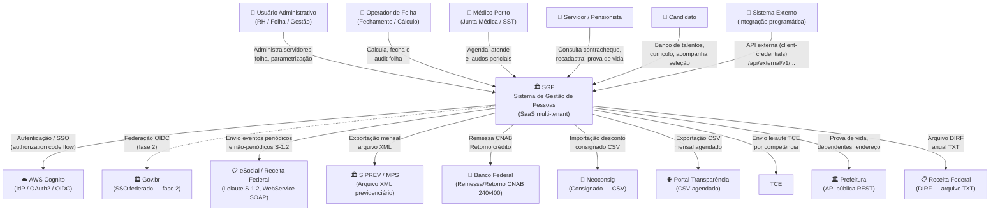

**Legenda:**
- Setas sólidas representam integrações ativas no MVP.
- Seta tracejada representa integração prevista para fase 2 (Gov.br SSO).
- Atores humanos interagem com SGP via navegador (HTTPS / OAuth2).
- Sistemas externos interagem via arquivos transferidos (S3/SFTP), WebService SOAP (eSocial) ou REST (Prefeitura, API Externa).

### 3.1 Descrição dos Atores

| Ator | Perfil | Canal de acesso |
|---|---|---|
| **Usuário Administrativo** | Servidor público na área de RH, Gestão de Pessoal, Financeiro ou Contabilidade. Acessa backoffice do SGP para manter cadastros, parametrizar verbas, gerar relatórios e acompanhar folha. | `sgp-admin` (Angular SPA) via browser |
| **Operador de Folha** | Especialista responsável pelo fechamento mensal da folha de pagamento. Cria competências, aciona cálculos em lote, confere batimento e fecha folha. Papel sensível com acesso a `FOLHA_DE_PGT.GESTAO`. | `sgp-admin` (Angular SPA) via browser |
| **Médico Perito** | Profissional de saúde vinculado à Junta Médica do ente. Gerencia agenda, realiza perícias, emite laudos e licenças médicas. Papel `PERICIA_MEDICA.GESTAO`. | `sgp-admin` (Angular SPA) via browser |
| **Servidor / Pensionista** | Beneficiário final dos serviços de RH. Acessa portal para consultar contracheque, recadastrar-se, acompanhar perícia e consultar histórico funcional. Acesso read-mostly, sem alteração de dados cadastrais de terceiros. | `sgp-portal` (Angular SPA) via browser |
| **Candidato** | Pessoa física que se inscreveu em processo seletivo. Acessa portal para enviar currículo, acompanhar candidatura e atualizar banco de talentos. | `sgp-portal` (Angular SPA) via browser |
| **Sistema Externo** | Sistemas de terceiros (ex.: sistema de ponto, ERP municipal, portal próprio do cliente) que consomem a API do SGP via OAuth2 client-credentials. Identificado pelo papel `ROLE_EXTERNAL_SYSTEM`. | `/api/external/v1/...` (REST + OAuth2) |

### 3.2 Descrição dos Sistemas Externos

| Sistema | Direção | Protocolo | Frequência |
|---|---|---|---|
| **AWS Cognito** | Bidirecional (SGP delega autenticação) | OIDC / OAuth2 HTTPS | A cada login; refresh de token a cada hora |
| **Gov.br** | Inbound (federation IdP) | OIDC (IdP federado no Cognito) | Fase 2; fluxo idêntico ao Cognito do usuário |
| **eSocial / Receita Federal** | Outbound (envio eventos) + Inbound (recibos) | SOAP/HTTPS + XML S-1.2 | Mensal (periódicos) e por evento (não-periódicos) |
| **SIPREV / MPS** | Outbound (exportação) | Arquivo XML | Mensal (geração automática) |
| **Banco Federal (CNAB)** | Bidirecional (remessa crédito + retorno) | Arquivo CNAB 240/400 | Mensal (folha) |
| **Neoconsig** | Inbound (importação desconto) | Arquivo CSV | Mensal (antes do cálculo) |
| **Portal Transparência** | Outbound (publicação) | Arquivo CSV agendado | Mensal (após fechamento) |
| **Prefeitura (API pública)** | Bidirecional (prova de vida, dependentes) | REST / JSON | Por evento (prova de vida) |
| **Receita Federal (DIRF)** | Outbound (obrigação acessória) | Arquivo TXT (leiaute RFB) | Anual (entrega em fevereiro) |

---

## 4. C4 Nível 2 — Diagrama de Containers

Este diagrama detalha os containers de software que compõem o SGP: frontends, APIs, workers, armazenamento, mensageria, segurança e observabilidade.

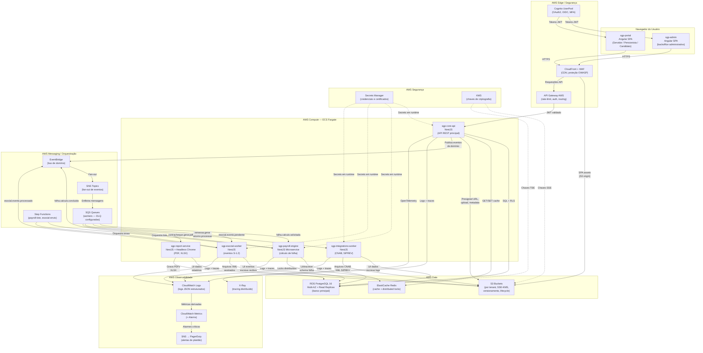

**Legenda:**
- Setas sólidas representam fluxo de dados principal.
- Setas tracejadas representam fornecimento de configuração/segredos (sem dados de negócio).
- Cada worker ECS possui DLQ (Dead-Letter Queue) associada para mensagens que falham repetidamente.
- RDS Read Replicas são utilizadas pela `sgp-core-api` para consultas de leitura pesada (relatórios, consultas gerenciais).

### 4.1 Descrição dos Containers

| Container | Tecnologia | Responsabilidade |
|---|---|---|
| **sgp-admin** | Angular SPA (última LTS), hosted em S3/CloudFront | Interface administrativa completa para os 11 módulos de 1º nível. Lazy loading por bounded context. Comunica-se exclusivamente com `sgp-core-api` via `/api/v1/...` |
| **sgp-portal-ui** | Angular SPA (última LTS), hosted em S3/CloudFront | Interface de autoatendimento para employee/beneficiário/candidato. Comunica-se somente com `sgp-portal-api`. |
| **API Gateway AWS** | AWS API Gateway (HTTP API) | Ponto de entrada único para todas as chamadas REST. Responsável por rate-limiting, validação de JWT (Cognito Authorizer), roteamento para `sgp-core-api`, throttling por tenant. |
| **sgp-core-api** | NestJS 10+ / TypeScript, ECS Fargate | API REST administrativa com os bounded contexts do core. Expõe `/api/v1/...`, `/api/external/v1/...` e `/api/admin/v1/...`. |
| **sgp-portal-api** | NestJS 10+ / TypeScript, ECS Fargate | Backend exclusivo do portal, com credenciais de banco read-only e escopo de autoatendimento. Expõe `/api/portal/v1/...`. |
| **sgp-payroll-engine** | NestJS 10+ / TypeScript, ECS Fargate (ou host dedicado) | Implementação separada de cálculo de folha. Permite execução por cron e sob demanda, com acompanhamento de progresso por lote/in-lote. Camada fina sobre procedures `plpgsql` parametrizadas. |
| **sgp-esocial-worker** | NestJS 10+ / TypeScript, ECS Fargate | Worker assíncrono para geração, assinatura e envio de eventos eSocial S-1.2. Consome fila SQS `esocial.evento.pendente`. Gerencia retry, polling de recibo e DLQ. |
| **sgp-integrations-worker** | NestJS 10+ / TypeScript, ECS Fargate | Worker para integrações batch: remessa/retorno CNAB bancário, exportação SIPREV e geração DIRF. Consome filas SQS `remessa.gerar` e `retorno.processar`. |
| **sgp-report-service** | NestJS + Puppeteer (Headless Chrome), ECS Fargate | Serviço dedicado à geração de PDFs e XLSX. Consome fila `contracheque.gerar.pdf`. Templates em Handlebars. Persiste arquivos finalizados no S3. |
| **RDS PostgreSQL 16** | AWS RDS Multi-AZ + Read Replicas | Banco relacional principal. Multi-AZ para HA (failover automático). Read Replicas para leitura pesada. RLS por tenant. Particionamento por competência em tabelas de folha. |
| **ElastiCache Redis** | AWS ElastiCache Redis 7, Cluster Mode | Cache L2 para parâmetros do sistema, enums, fórmulas compiladas. Locks distribuídos para cálculo de folha (evitar processamento duplicado). Cache de sessão se necessário. |
| **S3 Buckets** | AWS S3 | Armazenamento de objetos por tenant. Buckets separados por propósito: `uploads` (anexos), `outputs` (documentos oficiais), `archives` (arquivos históricos), `assets` (logotipos, templates). |

| **EventBridge** | AWS EventBridge (Custom Bus) | Bus de domínio central. Desacopla publishers de consumers. Regras de roteamento por `detail-type` para encaminhar eventos aos SNS/SQS corretos. |
| **SNS Topics** | AWS SNS | Fan-out de eventos para múltiplos consumers. Ex.: `folha.calculo.concluida` notifica UI (via WebSocket/SSE) e serviço de relatórios simultaneamente. |
| **SQS Queues** | AWS SQS Standard + FIFO onde necessário | Filas de trabalho para workers assíncronos. Visibility timeout configurado por tipo de job. DLQ com retenção de 14 dias. Métricas de profundidade alimentam auto-scaling. |
| **Step Functions** | AWS Step Functions Standard | Orquestração de workflows de longa duração. `payroll-lote`: paraleliza cálculo por filial. `esocial-envio`: geração → assinatura → envio → poll → recibo. Retry e catch configurados por state. |
| **Cognito UserPools** | AWS Cognito | Domínios de identidade separados para `SGP-CORE` (staff) e `SGP-PORTAL` (employees/beneficiários/candidatos). |
| **Secrets Manager** | AWS Secrets Manager | Armazenamento de segredos (strings de conexão RDS, certificados eSocial PKCS#12, chaves de API bancárias). Rotação automática de senhas RDS via Lambda built-in. |
| **KMS** | AWS KMS (Customer Managed Keys) | Chaves de criptografia para S3 (SSE-KMS), RDS (TDE), ElastiCache, Secrets Manager. Rotation anual automática. Política de uso restrita a roles dos serviços SGP. |
| **CloudFront + WAF** | AWS CloudFront + AWS WAF v2 | CDN para SPAs Angular (cache de assets). WAF com AWS Managed Rules (OWASP Top 10, Known Bad Inputs), rate-based rules, IP reputation lists. |
| **CloudWatch Logs/Metrics** | AWS CloudWatch | Agregação de logs JSON estruturados de todos os containers. Log groups por serviço. Métricas customizadas de negócio via PutMetricData. Dashboards operacionais. |
| **X-Ray** | AWS X-Ray | Tracing distribuído via OpenTelemetry. Service Map interativo. Análise de latência por segmento. Correlação com logs via traceId. |
| **CloudWatch Alarms → SNS → PagerDuty** | AWS CloudWatch Alarms + SNS + PagerDuty | Alertas P1/P2 baseados em métricas e logs. Escalação automática para plantão via PagerDuty. |

---

## 5. C4 Nível 3 — Componentes do `sgp-core-api`

Arrecadação Previdenciária é escopo de versão futura e não compõe os containers, controllers, módulos ou papéis do v0.0.1.

Este diagrama detalha a organização interna da API principal, descendo ao nível de componentes NestJS por responsabilidade.

```mermaid
flowchart TB
    subgraph Entrada["Camada de Entrada"]
        AGW_IN["API Gateway\n(JWT + rate-limit)"]
    end

    subgraph Guards["Guards — Autenticação e Autorização"]
        AG["AuthGuard\n(valida JWT Cognito,\nextrail claims)"]
        TG["TenantGuard\n(injeta tenant_id no contexto,\nSET app.current_tenant)"]
        PG["PermissionsGuard\n(@RequirePermissions\nverifica papéis RBAC)"]
    end

    subgraph Interceptors["Interceptors Transversais"]
        AI["AuditInterceptor\n(grava audit_log\nem domínios sensíveis)"]
        LI["LoggingInterceptor\n(log estruturado JSON\npor request)"]
        MI["MetricsInterceptor\n(latência, throughput\npor endpoint)"]
    end

    subgraph Controllers["Controllers por Bounded Context"]
        CC_GESTAO["GestaoController\n(/api/v1/gestao/...)"]
        CC_RH["RhController\n(/api/v1/rh/...)"]
        CC_FOLHA["FolhaController\n(/api/v1/folha/...)"]
        CC_PREV["PrevidenciarioController\n(/api/v1/previdenciario/...)"]
        CC_SAUDE["SaudeController\n(/api/v1/saude/...)"]
        CC_REC["RecrutamentoController\n(/api/v1/recrutamento/...)"]
        CC_CONV["ConvenioController\n(/api/v1/convenio/...)"]
        CC_AUD["AuditoriaController\n(/api/v1/auditoria/...)"]
        CC_EXT["ExternalApiController\n(/api/external/v1/...)"]
        CC_PRT["PortalController\n(/api/portal/v1/...)"]
    end

    subgraph Services["Services (Lógica de Negócio)"]
        SV_PESSOA["PessoaService"]
        SV_FUNC["FuncionarioService"]
        SV_FOLHA["FolhaService\n(dispara evento calculo)"]
        SV_COMP["CompetenciaService"]
        SV_PREV["PrevidenciarioService"]
        SV_PERIC["PericiaService"]
        SV_RECAT["RecadastramentoService"]
        SV_REC["RecrutamentoService"]
        SV_ARQ["ArquivosService\n(abstração S3 presigned)"]
        SV_AUTH["AuthService\n(usuarios, papeis, perfis)"]
        SV_PARAM["ParametrosService\n(cache Redis)"]
        SV_NOTIF["NotificacoesService\n(e-mail, push, in-app)"]
    end

    subgraph Repositories["Repositories (Acesso a Dados)"]
        RP_PESSOA["PessoaRepository"]
        RP_FUNC["FuncionarioRepository"]
        RP_FOLHA["FolhaRepository"]
        RP_PREV["BeneficioRepository"]
        RP_AUD["AuditLogRepository"]
        RP_PARAM["ParametroRepository"]
    end

    subgraph EventPublishers["Event Publishers"]
        EP_EVB["EventBridgePublisher\n(publica em bus de domínio)"]
        EP_DOM["DomainEventEmitter\n(EventEmitter2 interno)"]
    end

    subgraph External["Dependências Externas"]
        RDS_DB["PostgreSQL\n(RLS ativo)"]
        REDIS["ElastiCache Redis"]
        S3_STORE["S3 Buckets"]
        EVB_BUS["EventBridge Bus"]
    end

    %% Fluxo de entrada
    AGW_IN --> AG --> TG --> PG

    %% Guards → Interceptors → Controllers
    PG --> AI
    PG --> LI
    PG --> MI
    AI --> Controllers
    LI --> Controllers
    MI --> Controllers

    %% Controllers → Services
    CC_GESTAO --> SV_PARAM
    CC_RH --> SV_PESSOA
    CC_RH --> SV_FUNC
    CC_FOLHA --> SV_FOLHA
    CC_FOLHA --> SV_COMP
    CC_PREV --> SV_PREV
    CC_PREV --> SV_RECAT
    CC_SAUDE --> SV_PERIC
    CC_REC --> SV_REC
    CC_PRT --> SV_FUNC
    CC_PRT --> SV_PREV
    CC_EXT --> SV_FUNC
    CC_AUD --> RP_AUD

    %% Services → Repositories
    SV_PESSOA --> RP_PESSOA
    SV_FUNC --> RP_FUNC
    SV_FOLHA --> RP_FOLHA
    SV_PREV --> RP_PREV
    SV_AUTH --> RP_FUNC
    SV_PARAM --> RP_PARAM
    SV_PARAM --> REDIS

    %% Services → Event Publishers
    SV_FOLHA --> EP_DOM
    SV_FOLHA --> EP_EVB
    SV_FUNC --> EP_DOM
    SV_PREV --> EP_DOM
    SV_PERIC --> EP_DOM
    EP_EVB --> EVB_BUS

    %% Repositories → DB
    RP_PESSOA --> RDS_DB
    RP_FUNC --> RDS_DB
    RP_FOLHA --> RDS_DB
    RP_PREV --> RDS_DB
    RP_AUD --> RDS_DB
    RP_PARAM --> RDS_DB

    %% Services → S3
    SV_ARQ --> S3_STORE
```

**Legenda:**
- Os Guards são executados em cadeia obrigatória: Auth → Tenant → Permissions.
- Os Interceptors decoram todas as rotas protegidas; o AuditInterceptor é condicional por domínio sensível.
- Os Services nunca acessam repositórios de outros bounded contexts diretamente — comunicam via interfaces exportadas ou eventos.
- O `ParametrosService` mantém cache L2 em Redis para evitar leituras repetidas de parâmetros globais e de sistema a cada requisição.

### 5.1 Estrutura de Módulos NestJS (`sgp-core-api`)

A `sgp-core-api` segue arquitetura modular NestJS com pasta raiz `src/modules/<contexto>/` por bounded context. Cada módulo é isolado e possui sua própria coleção de controllers, services, repositories, DTOs, entidades e publishers de eventos.

```
src/
├── app.module.ts                  # Módulo raiz — importa todos os módulos de negócio
├── common/
│   ├── guards/
│   │   ├── auth.guard.ts          # Valida JWT Cognito (JWKS)
│   │   ├── tenant.guard.ts        # Injeta tenant_id, SET app.current_tenant
│   │   └── permissions.guard.ts   # Avalia @RequirePermissions
│   ├── interceptors/
│   │   ├── audit.interceptor.ts   # Grava audit_log em domínios sensíveis
│   │   ├── logging.interceptor.ts # Log JSON estruturado por request
│   │   └── metrics.interceptor.ts # CloudWatch PutMetricData
│   ├── decorators/
│   │   ├── require-permissions.decorator.ts
│   │   ├── current-tenant.decorator.ts
│   │   └── current-user.decorator.ts
│   ├── filters/
│   │   └── http-exception.filter.ts  # RFC 7807 problem+json
│   └── pipes/
│       └── uuid-validation.pipe.ts
├── modules/
│   ├── auth/                      # Usuários, papéis, perfis, Cognito sync
│   ├── pessoa/                    # Núcleo civil (Pessoa, Documento, Endereço, Contato)
│   ├── organizacao/               # Tenant, Empresa, Filial, Lotação, Centro de Custo
│   ├── gestao/                    # Estrutura corporativa, parametrizações
│   ├── rh/                        # Funcionário, vínculo, situação, posse, transferência
│   ├── folha/                     # Competência, folha, contracheque, lançamento, verba
│   ├── previdenciario/            # Aposentadoria, pensão, recadastramento, certidões
│   ├── saude/                     # Agenda, agendamento, prontuário, licença médica
│   ├── recrutamento/              # Requisição, candidato, banco de talentos, estágio
│   ├── avaliacao/                 # Avaliação de desempenho, progressão, plano de carreira
│   ├── convenio/                  # Convênios, beneficiários, descontos em folha
│   ├── auditoria/                 # Consulta audit_log
│   ├── relatorios/                # Orquestração de geração de relatórios
│   ├── arquivos/                  # Abstração S3 (presigned upload/download)
│   ├── notificacoes/              # E-mail (SES), push, in-app
│   ├── integracoes/               # eSocial, SIPREV, DIRF, bancos, Gov.br, prefeitura
│   └── parametros/                # ParametroSistema, ParametroGlobal, feature flags
└── infrastructure/
    ├── database/                  # Prisma/TypeORM config, migrations runner
    ├── redis/                     # RedisModule (ioredis)
    ├── s3/                        # S3Client wrapper
    ├── eventbridge/               # EventBridgePublisher
    └── secrets/                   # SecretsManagerService
```

### 5.2 Convenções de Controller e DTO

- Cada Controller define a rota base via `@Controller('api/v1/<recurso>')` e declara o Swagger `@ApiTags('<ModuloNome>')`.
- DTOs de entrada usam `class-validator` com decorators `@IsUUID()`, `@IsString()`, `@IsEnum()`, etc. e são validados pelo `ValidationPipe` global.
- DTOs de saída seguem o padrão `<Entidade>ResponseDto` com campos selecionados (sem expor campos internos como `tenant_id` ou timestamps de auditoria interna).
- Paginação padronizada: `PageDto<T>` com campos `data: T[]`, `total: number`, `page: number`, `limit: number`.
- Erros HTTP retornam RFC 7807: `{ type, title, status, detail, instance }`.

### 5.3 Fluxo de Autorização Detalhado

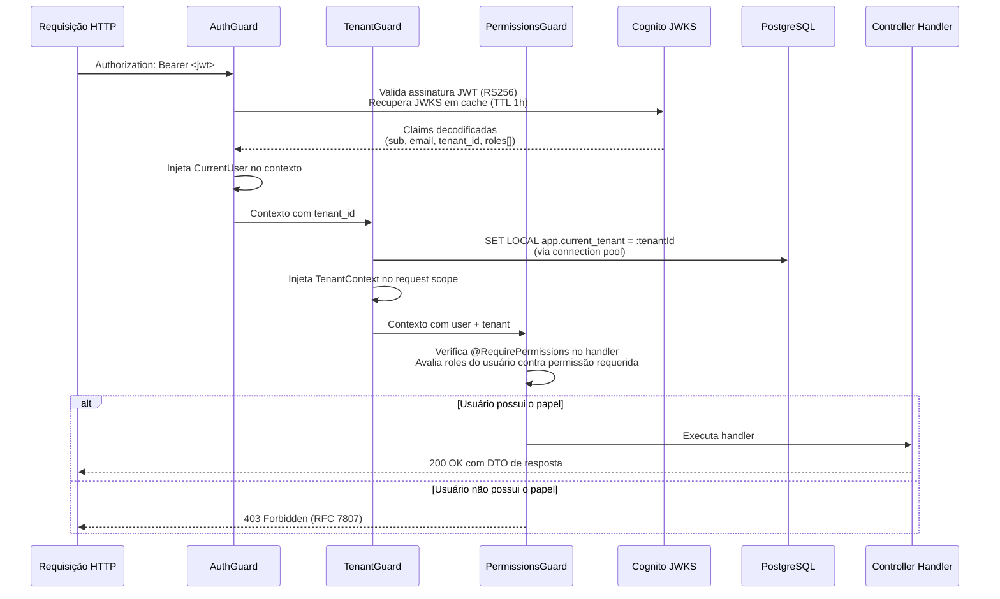

---

## 6. C4 Nível 3 — Componentes do `sgp-payroll-engine`

Este diagrama detalha a arquitetura interna do microsserviço de cálculo de folha, responsável pelo processamento computacional mais intensivo do sistema.

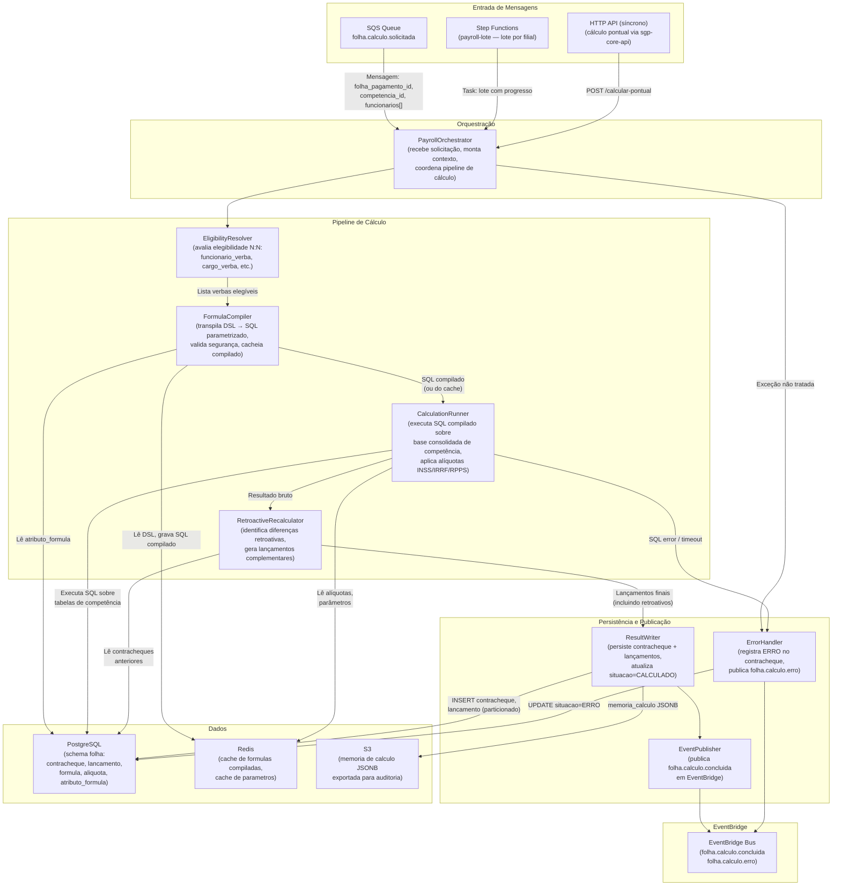

**Legenda:**
- O `FormulaCompiler` transpila as fórmulas DSL para SQL parametrizado uma única vez e armazena o resultado compilado no Redis; reutiliza o cache nas execuções subsequentes da mesma competência.
- O `RetroactiveRecalculator` é acionado quando há competências anteriores abertas ou reaberturas, gerando lançamentos complementares na competência atual.
- O `ResultWriter` utiliza transação explícita: contracheque + todos os lançamentos são persistidos atomicamente; em caso de erro a transação é revertida e o status é atualizado para `ERRO`.
- A tabela `contracheque` e `lancamento` são particionadas por `(ano, mes)` de competência no PostgreSQL, permitindo manutenção e purga eficiente de dados históricos.

### 6.1 FormulaCompiler — Detalhe de Funcionamento

O `FormulaCompiler` é o componente mais crítico do `sgp-payroll-engine`. Ele recebe o texto DSL de uma fórmula de verba e o transpila para SQL parametrizado seguro, executável sobre a base consolidada de competência.

**Ciclo de vida de uma fórmula:**

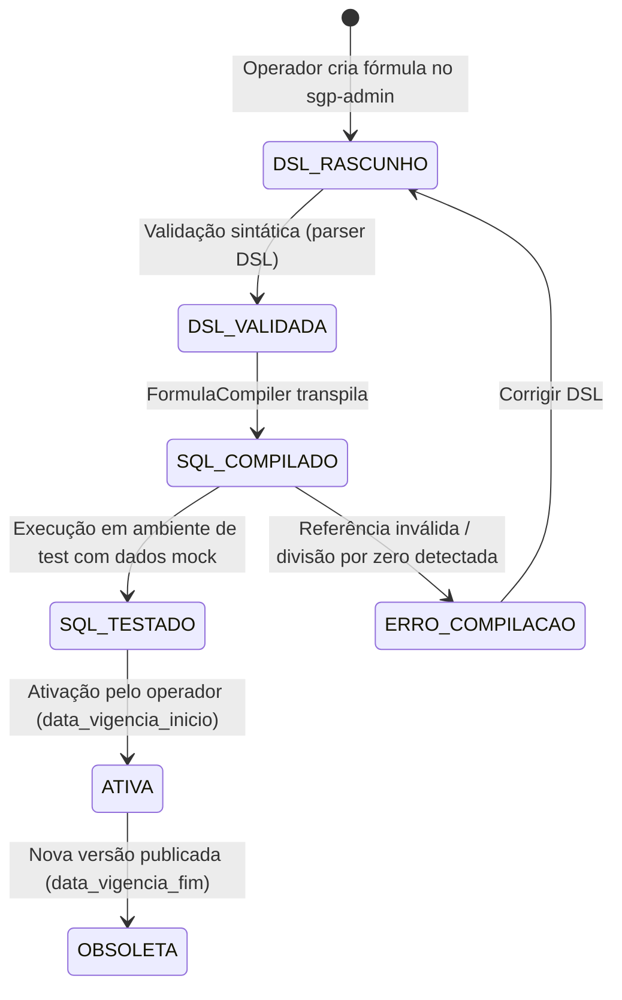

**Atributos de fórmula disponíveis** (`atributo_formula`):
- `SALARIO_BASE` → `funcionario.nivel_salarial.valor`
- `TEMPO_SERVICO_DIAS` → calculado via função SQL a partir de `data_posse`
- `DEPENDENTES_IR` → `funcionario.dependentes_ir_count`
- `DEPENDENTES_SF` → `funcionario.dependentes_salario_familia_count`
- `CARGA_HORARIA` → `funcionario.carga_horaria`
- `ALIQUOTA_INSS` → lookup em `aliquota` por faixa salarial
- `ALIQUOTA_IRRF` → lookup em `aliquota` por faixa com dedução

**Exemplo de transpilação DSL → SQL:**

```
DSL:  SALARIO_BASE * 0.08 * (CARGA_HORARIA / 220)

SQL:  (SELECT nivel_salarial.valor FROM nivel_salarial
       WHERE id = f.nivel_salarial_id)
      * 0.08
      * (f.carga_horaria / 220.0)
```

O SQL gerado nunca usa interpolação de strings — todos os valores dinâmicos são referências a colunas tipadas da query principal. O compilador rejeita qualquer tentativa de injeção (`DROP`, `DELETE`, `UPDATE`, subqueries não aprovadas em whitelist).

### 6.2 Step Function `payroll-lote` — Estados

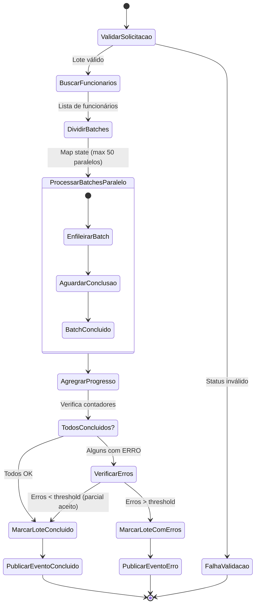

---

## 7. Deployment View

Este diagrama apresenta a topologia de implantação do SGP na AWS, incluindo regiões, VPCs, ambientes e estratégia de DR.

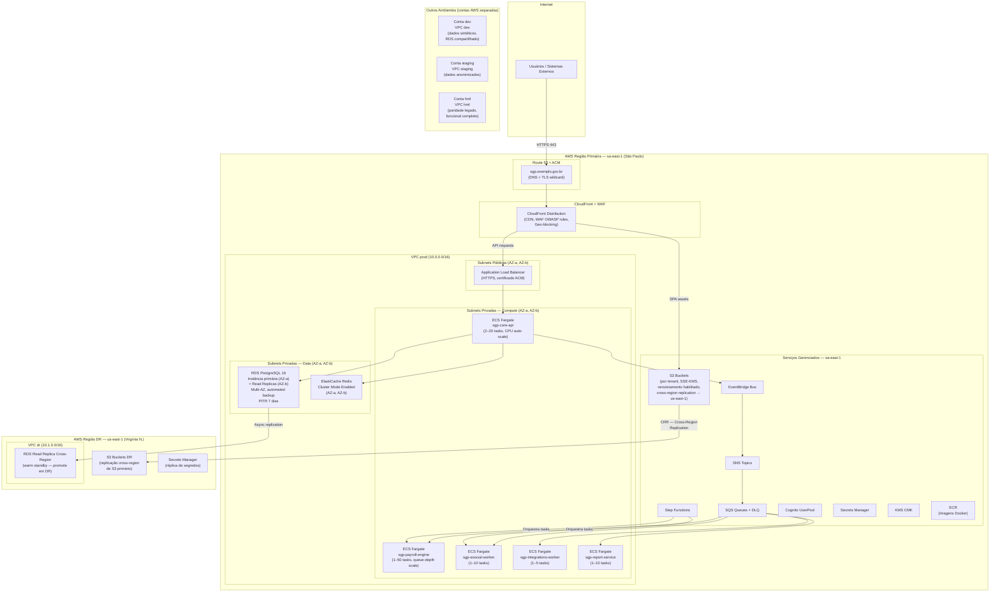

**Notas de Deployment:**

| Aspecto | Detalhe |
|---|---|
| **Runtime** | ECS Fargate (sem gestão de servidor); migração para EKS avaliada em roadmap futuro se necessidade de customização avançada de scheduling |
| **Auto-scaling** | `sgp-core-api`: CPU > 70% por 3 min → escala; `sgp-payroll-engine`: profundidade de fila SQS > 100 mensagens → escala até 50 tasks |
| **RDS** | Multi-AZ com failover automático < 60 s; PITR habilitado (7 dias); snapshots diários retidos 30 dias; snapshots cross-region para us-east-1 |
| **Redis** | Cluster Mode habilitado; Multi-AZ; failover automático via ElastiCache |
| **S3** | Versionamento + lifecycle (objetos > 90 dias → Glacier IR); replicação cross-region assíncrona para DR |
| **CI/CD** | Alvo futuro: GitHub Actions build → teste → push ECR → deploy ECS. O gate produtivo fica postergado pela decisão temporária de 2026-04-26. |
| **DNS** | Route 53 com failover health-check; TTL baixo para switchover de DR manual ou automático |

### 7.1 Pipeline CI/CD Completo

Este fluxo permanece como arquitetura-alvo. A implementação do gate de governança/release não é obrigatória no pacote atual.

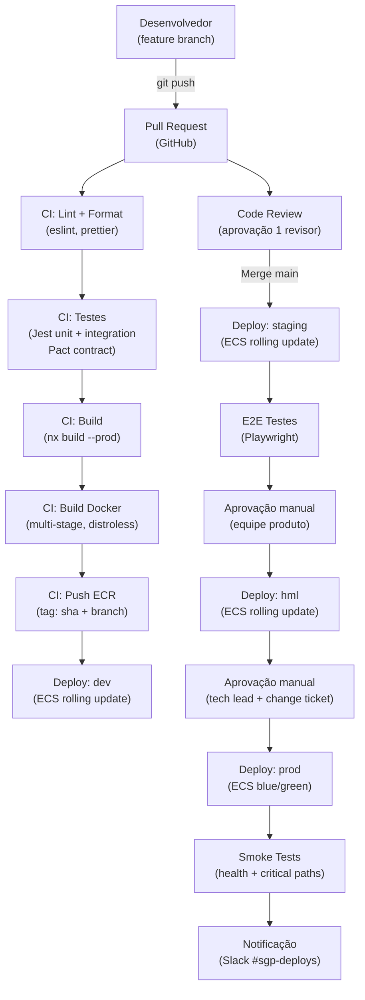

### 7.2 ECS Task Definitions — Configuração de Recursos

| Serviço | vCPU | Memória | Min Tasks | Max Tasks | Escala por |
|---|---|---|---|---|---|
| `sgp-core-api` | 1 vCPU | 2 GB | 2 | 20 | CPU > 70% por 3 min |
| `sgp-payroll-engine` | 2 vCPU | 4 GB | 1 | 50 | SQS depth > 100 msgs |
| `sgp-esocial-worker` | 0.5 vCPU | 1 GB | 1 | 10 | SQS depth > 20 msgs |
| `sgp-integrations-worker` | 0.5 vCPU | 1 GB | 1 | 5 | SQS depth > 10 msgs |
| `sgp-report-service` | 2 vCPU | 4 GB | 1 | 10 | SQS depth > 5 msgs |

Todos os containers utilizam imagens base **distroless** (sem shell, sem package manager) para reduzir superfície de ataque. Health check via `curl -f http://localhost:3000/api/v1/health || exit 1` a cada 30 s.

---

## 8. Data Flow Diagrams

### 8.1 Fluxo — Cálculo de Folha (Lote)

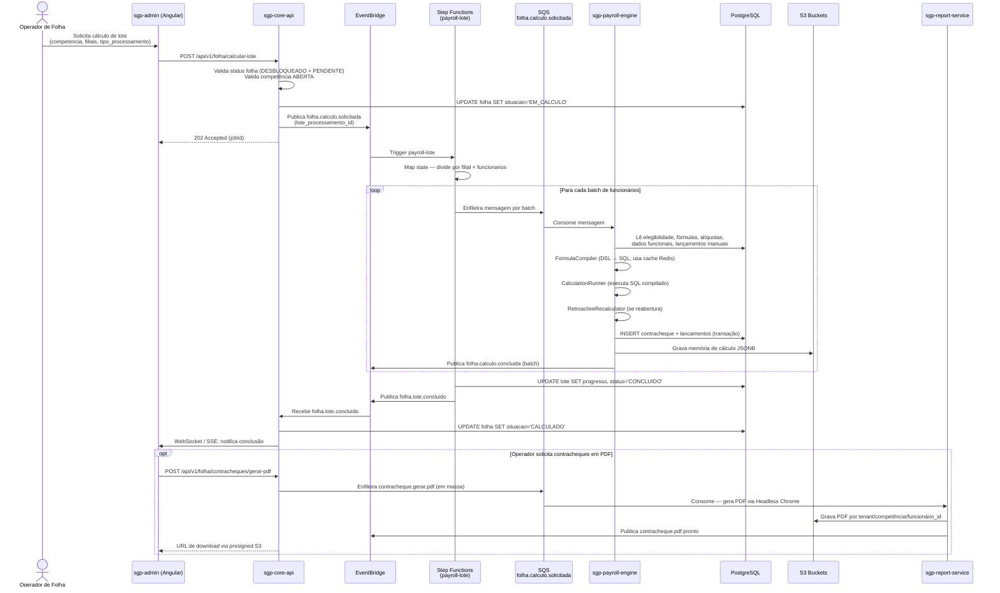

---

### 8.2 Fluxo — Evento eSocial (S-1.2)

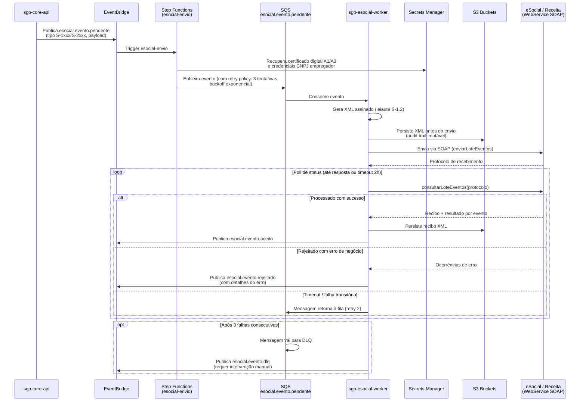

---

### 8.3 Fluxo — Login e SSO (OAuth2 / Cognito)

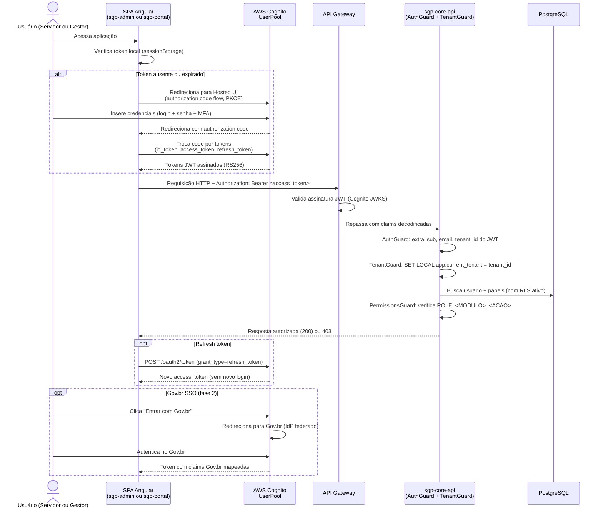

---

### 8.4 Fluxo — Upload de Anexo (Presigned URL)

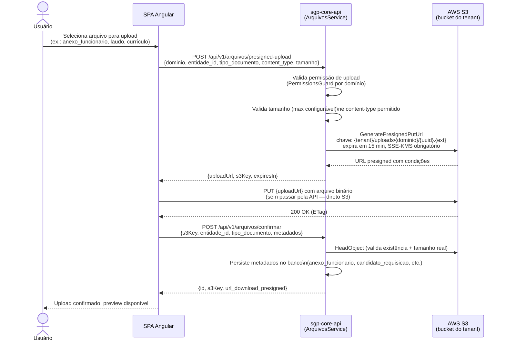

---

### 8.5 Fluxo — Recadastramento Externo via Gov.br

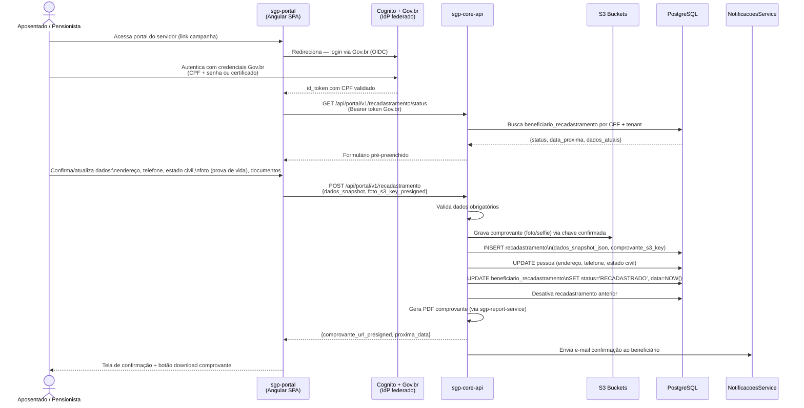

### 8.5.1 Detalhamento — Autenticação Cognito com Tenant Mapping

Um detalhe crítico do fluxo de autenticação é como o `tenant_id` chega ao token JWT. O SGP utiliza **Cognito User Pool com custom attributes**:

- O atributo `custom:tenant_id` é definido no UserPool e populado durante a criação do usuário (via `sgp-core-api` ao criar o usuário no Cognito via Admin API).
- O `custom:tenant_id` é incluído no `id_token` e no `access_token` via Cognito App Client configuration (`ReadAttributes`).
- O `AuthGuard` extrai esse claim e o repassa ao `TenantGuard` sem necessidade de consulta ao banco para resolver o tenant na maioria das requisições.

Para usuários que pertencem a **múltiplos tenants** (caso futuro — ex.: auditor externo), o design prevê um campo `custom:tenant_ids` (JSON array) com o tenant ativo selecionado no login. No MVP, cada usuário pertence a exatamente um tenant.

### 8.6 Fluxo — Jobs Agendados (Cron)

Os jobs agendados do SGP são executados como tarefas cron dentro da `sgp-core-api` (via `@nestjs/schedule`) e disparados por eventos internos. Para jobs com impacto em produção (ex.: fechamento programado), um mecanismo de lock Redis garante execução única mesmo com múltiplas instâncias da API em execução.

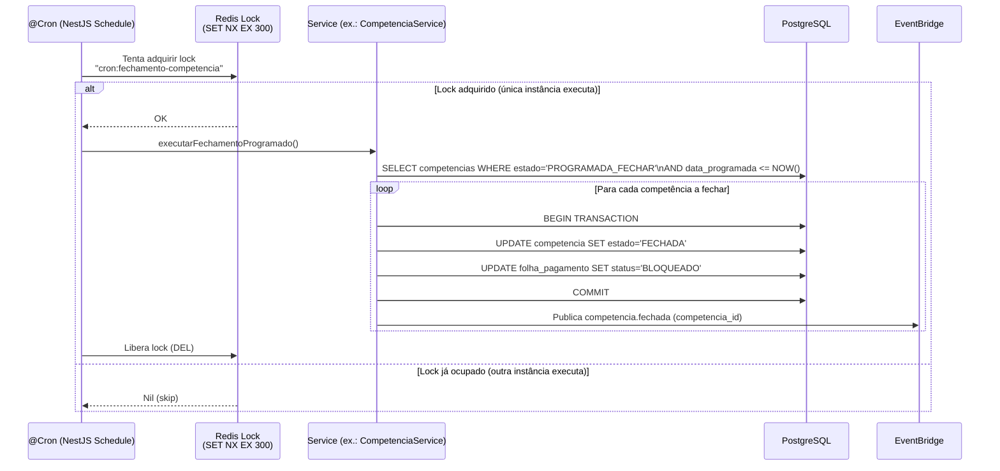

**Jobs agendados configurados:**

| Job | Cron expression | Serviço | Função |
|---|---|---|---|
| `situacao-funcional-retorno` | `0 6 * * *` (06h diário) | RhService | Retorna servidores de afastamento encerrado |
| `licenca-medica-vencida` | `0 6 * * *` (06h diário) | SaudeService | Inativa licenças médicas vencidas |
| `ferias-programadas` | `0 7 * * *` (07h diário) | RhService | Manutenção de férias programadas |
| `competencia-fechamento-programado` | `0 0 * * *` (meia-noite) | CompetenciaService | Executa fechamento agendado de competências |
| `estagio-desligamento-auto` | `0 8 * * *` (08h diário) | RecrutamentoService | Desliga estagiários que atingiram data_fim |
| `controle-anual-afastamentos` | `0 3 1 * *` (1º dia do mês) | RhService | Atualiza tabela de controle anual |
| `prova-vida-proxima-vencer` | `0 9 * * *` (09h diário) | PrevidenciarioService | Atualiza status PERTO_VENCER |

---

## 9. Segurança

### 9.1 Autenticação

| Fluxo | Mecanismo | Detalhes |
|---|---|---|
| Usuário administrativo (sgp-admin) | OAuth2 Authorization Code + PKCE | Cognito UserPool; MFA obrigatório para perfis com GESTAO; tokens RS256 |
| Servidor / Pensionista (sgp-portal) | OAuth2 Authorization Code + PKCE | Cognito; federação Gov.br para prova de identidade (fase 2) |
| API Externa (sistemas terceiros) | OAuth2 Client Credentials | Cognito App Client com escopo restrito; substitui `SGP-API-KEY` legado; papel `ROLE_EXTERNAL_SYSTEM` |
| Comunicação inter-serviços | IAM Roles + mTLS | ECS Tasks com task roles mínimas; sem segredos estáticos em variáveis de ambiente |
| Integrações SOAP/REST externas | Certificado digital A1/A3 (eSocial), API-key parametrizada (bancos), OAuth2 (Gov.br) | Credenciais no Secrets Manager, rotação automatizada |

### 9.2 Autorização (RBAC Multi-Camadas)

O modelo de autorização possui quatro camadas concêntricas, aplicadas nesta ordem:

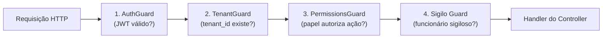

- **AuthGuard:** Valida assinatura JWT Cognito (JWKS endpoint), extrai `sub`, `email`, `custom:tenant_id`, `custom:roles`.
- **TenantGuard:** Injeta `tenant_id` no contexto da requisição e executa `SET LOCAL app.current_tenant = $1` na conexão PostgreSQL, ativando o RLS.
- **PermissionsGuard:** Avalia `@RequirePermissions('MODULO.ACAO')` — verifica se o usuário possui o papel `ROLE_<MODULO>_<ACAO>` necessário. Suporta papéis compostos (perfil agrega múltiplos papéis).
- **Sigilo Guard:** Para entidades `cedido_detalhe.sigilo=true`, bloqueia visualização de dados sensíveis mesmo para usuários com `VISUALIZAR`, exceto para papéis com `GESTAO` explícito no módulo RH.

**Papéis reservados:**
- `ROLE_EXTERNAL_SYSTEM` — API externa (client-credentials), acesso read-only a dados públicos e exportações.
- `ROLE_ADMIN_TENANT` — administrador do tenant; acesso a configuração de usuários e papéis.
- `ROLE_SUPER_ADMIN` — operador da plataforma SaaS (sem acesso a dados de negócio).

### 9.2.1 Mapeamento de Papéis por Módulo

A tabela abaixo lista os papéis disponíveis por módulo e os tipos de ação. Papéis marcados com `GESTAO` têm acesso integral ao módulo sem necessidade de papéis CRUD granulares.

| Módulo | Papéis disponíveis | Tipo |
|---|---|---|
| `GESTAO` | `ROLE_GESTAO_VISUALIZAR`, `ROLE_GESTAO_CADASTRAR`, `ROLE_GESTAO_ATUALIZAR`, `ROLE_GESTAO_EXCLUIR`, `ROLE_GESTAO_GESTAO` | CRUD + GESTAO |
| `MODULO_RH` | `ROLE_MODULO_RH_VISUALIZAR`, `..._CADASTRAR`, `..._ATUALIZAR`, `..._EXCLUIR`, `..._GESTAO` | CRUD + GESTAO |
| `FOLHA_DE_PGT` | `ROLE_FOLHA_DE_PGT_GESTAO` | Somente GESTAO |
| `MODULO_PREVIDENCIARIO` | `ROLE_MODULO_PREVIDENCIARIO_VISUALIZAR`, `..._CADASTRAR`, `..._ATUALIZAR`, `..._EXCLUIR`, `..._GESTAO` | CRUD + GESTAO |
| `RECADASTRAMENTO` | `ROLE_RECADASTRAMENTO_GESTAO` | Somente GESTAO |
| `PERICIA_MEDICA` | `ROLE_PERICIA_MEDICA_GESTAO` | Somente GESTAO |
| `AGENDA_MEDICA` | `ROLE_AGENDA_MEDICA_GESTAO` | Somente GESTAO |
| `AUDITORIA` | `ROLE_AUDITORIA_GESTAO` | Somente GESTAO |
| `DIRF` | `ROLE_DIRF_GESTAO` | Somente GESTAO |
| `ARQUIVO_REMESSA` | `ROLE_ARQUIVO_REMESSA_GESTAO` | Somente GESTAO |
| `ARQUIVO_EXPORTACAO_SIPREV` | `ROLE_ARQUIVO_EXPORTACAO_SIPREV_GESTAO` | Somente GESTAO |
| `RECRUTAMENTO_SELECAO` | `ROLE_RECRUTAMENTO_SELECAO_VISUALIZAR`, `..._GESTAO` | VISUALIZAR + GESTAO |
| `CONVENIO` | `ROLE_CONVENIO_VISUALIZAR`, `..._CADASTRAR`, `..._ATUALIZAR`, `..._EXCLUIR`, `..._GESTAO` | CRUD + GESTAO |
| `POSSE_EFETIVO` | `ROLE_POSSE_EFETIVO_GESTAO` | Somente GESTAO |
| `POSSE_COMISSIONADO` | `ROLE_POSSE_COMISSIONADO_GESTAO` | Somente GESTAO |
| `POSSE_CONTRATADO` | `ROLE_POSSE_CONTRATADO_GESTAO` | Somente GESTAO |

O Frontend (`AuthzService.can(modulo, acao)`) controla a **exposição** de menus e botões baseado nos papéis do usuário logado. O servidor **revalida sempre** via `PermissionsGuard` — a UI nunca é a única barreira de autorização.

### 9.3 Multi-Tenancy e Isolamento de Dados

```sql
-- Exemplo de policy RLS para tabela funcionario
CREATE POLICY tenant_isolation ON funcionario
    USING (tenant_id = current_setting('app.current_tenant')::uuid);

ALTER TABLE funcionario ENABLE ROW LEVEL SECURITY;
ALTER TABLE funcionario FORCE ROW LEVEL SECURITY;
```

O `TenantGuard` NestJS garante que `SET LOCAL app.current_tenant` seja executado em **cada conexão** antes de qualquer query de negócio. O pool de conexões (PgBouncer ou conexões diretas) é configurado em modo de transação para garantir que o `SET LOCAL` tenha escopo correto.

Buckets S3 são particionados por tenant: `s3://sgp-prod-{tenant_id}/`. Policies IAM do bucket proibem acesso cross-tenant. KMS keys são compartilhadas por tenant (Customer Managed Keys por ambiente).

### 9.3.1 Fluxo de Isolamento por Requisição

Para ilustrar como o isolamento multi-tenant opera em runtime em uma consulta típica:

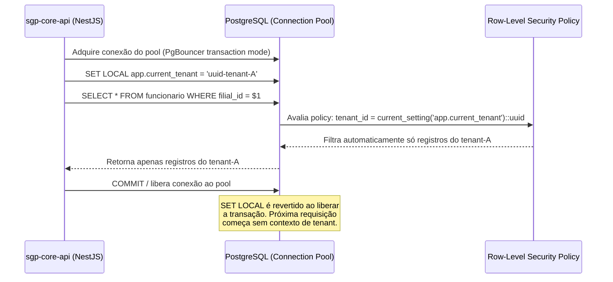

**Teste de segurança multi-tenant obrigatório:**

O cenário dourado G3 (autorização) verifica que um usuário do tenant-B não consegue acessar dados do tenant-A mesmo que obtenha um JWT válido com `tenant_id` adulterado. O banco rejeita a query via RLS antes de qualquer dado ser retornado.

### 9.4 Criptografia

| Camada | Mecanismo | Detalhes |
|---|---|---|
| Em trânsito (externo) | TLS 1.3 | CloudFront → ALB → ECS; certificados ACM rotacionados automaticamente |
| Em trânsito (interno) | TLS 1.2+ (mínimo) + mTLS | Entre ECS services; API Gateway → Core API |
| Em repouso (S3) | SSE-KMS (Customer Managed Key) | Chave por ambiente; rotação anual automática |
| Em repouso (RDS) | Encryption at rest (KMS) | Storage encryption habilitado na criação da instância |
| Em repouso (Redis) | Encryption at rest + in-transit | ElastiCache com TLS e encryption at rest habilitados |
| Colunas sensíveis (opcional) | `pgcrypto` (AES-256) | CPF, dados bancários para sigilo fiscal elevado; avaliado por ADR |
| Segredos | AWS Secrets Manager | Rotação automática de senhas RDS; segredos referenciados por ARN em task definitions |

### 9.5 LGPD e Privacidade

- **Mascaramento de logs:** CPF, número de conta, dados bancários são mascarados nos logs estruturados (substituídos por `***`). O `LoggingInterceptor` aplica o mascaramento antes de enviar ao CloudWatch.
- **Data retention:** Logs de negócio retidos por 5 anos (obrigação legal folha pública); logs de acesso retidos 12 meses; dados pessoais de candidatos não contratados: 6 meses após encerramento do processo seletivo.
- **Consentimento:** registro de consentimento LGPD na entidade `pessoa` (campo `consentimento_lgpd` com data e canal).
- **Direito de acesso / portabilidade:** endpoint `GET /api/portal/v1/meus-dados` retorna dados pessoais consolidados em JSON.
- **Anonimização em ambientes não-produção:** pipeline de dados sintetização/anonimização para staging e HML; proibido uso de dados reais de produção fora de prod.

### 9.5.1 Modelo de Consentimento e Direitos LGPD

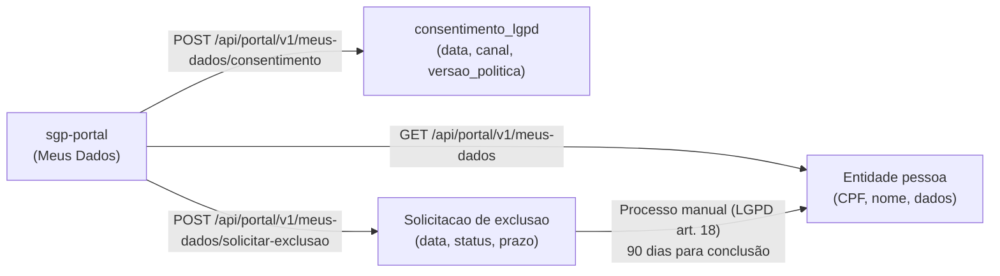

Candidatos não contratados têm seus dados anonimizados automaticamente 6 meses após encerramento do processo seletivo via job `monthly:limpeza-candidatos-inativos`. O currículo S3 é deletado; dados pessoais são substituídos por UUID anonimizado.

### 9.6 Proteção contra OWASP Top 10

| Ameaça | Controle |
|---|---|
| Injeção SQL | Queries parametrizadas (Prisma/TypeORM); FormulaCompiler gera SQL parametrizado (DSL nunca interpolada) |
| Quebra de autenticação | OAuth2 PKCE; tokens de curta duração (1h access, 24h refresh); logout revoga refresh token no Cognito |
| Exposição de dados sensíveis | TLS obrigatório; SSE-KMS; mascaramento de logs; campos `sigilo` |
| XXE | Parser XML eSocial com XXE desabilitado (feature `FEATURE_SECURE_PROCESSING`) |
| Controle de acesso quebrado | Guards multi-camadas; RLS no banco; testes de autorização nos golden scenarios G1/G2/G3 |
| Misconfiguration | Terraform valida configurações; SAST no CI; WAF com regras AWS Managed Rules |
| XSS | Angular escapa automaticamente; Content-Security-Policy via CloudFront; HttpOnly cookies |
| CSRF | SPA usa Bearer token (não cookies); sem formulário com cookie session |
| Componentes vulneráveis | Dependabot no repositório; `npm audit` no CI; imagens Docker base atualizadas mensalmente |
| Logging insuficiente | Logs estruturados JSON obrigatórios; `AuditInterceptor` em domínios sensíveis; alertas em CloudWatch |

### 9.7 Auditoria de Segurança

A tabela `audit_log` registra todas as operações em domínios sensíveis (folha, verbas, vida funcional, previdenciário, perícia, usuários/papéis). O `AuditInterceptor` popula o registro após cada operação bem-sucedida de mutação nos domínios configurados.

**Estrutura do registro de auditoria:**

```sql
-- Tabela audit_log (particionada por ano/mes)
CREATE TABLE audit_log (
    id              UUID DEFAULT gen_random_uuid() PRIMARY KEY,
    tenant_id       UUID NOT NULL,
    timestamp       TIMESTAMPTZ NOT NULL DEFAULT NOW(),
    usuario_id      UUID NOT NULL,
    dominio         VARCHAR(50) NOT NULL,       -- ex.: 'FOLHA_PAGAMENTO'
    entidade        VARCHAR(100) NOT NULL,      -- ex.: 'folha_pagamento'
    entidade_id     UUID NOT NULL,
    acao            VARCHAR(20) NOT NULL,       -- CREATE, UPDATE, DELETE, LOGIN, EXPORT, PRINT
    diff_jsonb      JSONB,                     -- {before: {...}, after: {...}}
    ip              INET,
    user_agent      TEXT,
    request_id      UUID
) PARTITION BY RANGE (timestamp);
```

O diff JSONB contém apenas os campos que foram alterados (`before` + `after`), não o objeto completo, para economizar espaço. Campos sensíveis (senha hash, token) são excluídos do diff automaticamente pelo `AuditInterceptor`.

Retenção: 5 anos (obrigação legal para folha pública). Partições antigas são arquivadas em S3 via Glacier e removidas da base ativa após o período de retenção ativa (2 anos no PostgreSQL).

---

## 10. Escalabilidade e Performance

### 10.1 Objetivos de Performance

| Métrica | Meta |
|---|---|
| Cálculo de folha mensal (100 k servidores) | < 30 minutos end-to-end |
| Latência p95 de API (operações CRUD) | < 500 ms |
| Latência p95 de geração de contracheque individual (PDF) | < 5 s |
| Throughput API em pico (abertura de competência) | > 500 req/s |
| Disponibilidade | 99,5% (SLA contratual mensal) |

### 10.2 Estratégias de Escalabilidade

**Leitura:**

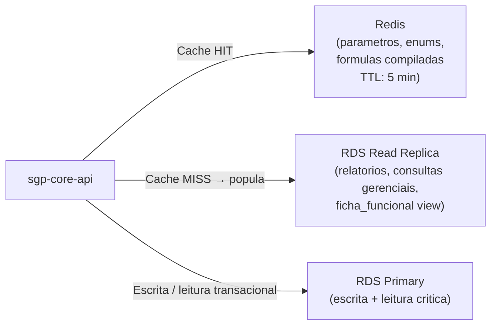

- O `ParametrosService` mantém cache Redis para `ParametroSistema`, `ParametroGlobal` e `enums_catalogo`, evitando queries a cada requisição.
- Consultas gerenciais e relatórios são roteadas para a Read Replica, isolando carga da instância primária.
- Views materializadas (`ficha_funcional`, `resumo_folha`, `carteira_recadastramento`) são atualizadas por job agendado fora do horário de pico.

**Escrita:**

- Tabelas `contracheque`, `lancamento` e `audit_log` são particionadas por `(ano, mes)` no PostgreSQL, permitindo truncate eficiente de partições históricas e melhoria de performance em queries por competência.
- Índices em FKs obrigatórios; índice `GIN` em `memoria_calculo JSONB` para queries de auditoria de fórmula; índice `pg_trgm` em `pessoa.nome`, `pessoa.cpf`, `funcionario.matricula` para busca textual.
- Writes em lote (INSERT batching) no `ResultWriter` do payroll-engine: grupos de 500 lançamentos por transação.

**Cálculo de Folha:**

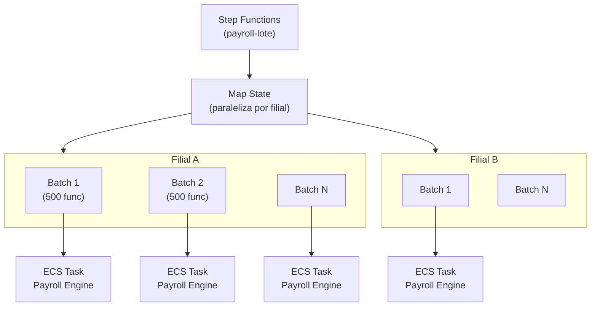

- A Step Function `payroll-lote` divide o processamento em batches de 500 funcionários por filial.
- Cada batch é processado por uma ECS Task independente do `sgp-payroll-engine`, com até 50 tasks em paralelo.
- O auto-scaling do ECS é baseado na profundidade da fila SQS: 1 task por 100 mensagens na fila, com cooldown de 60 s.
- Locks Redis (`SET NX EX`) garantem que a mesma folha não seja calculada em paralelo por tasks concorrentes (idempotência).

### 10.3 Estratégia de Índices PostgreSQL

```sql
-- Busca textual em nome e CPF (pg_trgm)
CREATE INDEX CONCURRENTLY idx_pessoa_nome_trgm
    ON pessoa USING GIN (nome gin_trgm_ops)
    WHERE deleted_at IS NULL;

CREATE INDEX CONCURRENTLY idx_pessoa_cpf_trgm
    ON pessoa USING GIN (cpf gin_trgm_ops);

-- Lookup por matrícula
CREATE INDEX CONCURRENTLY idx_funcionario_matricula
    ON funcionario (tenant_id, matricula)
    WHERE deleted_at IS NULL;

-- Particionamento de contracheque por competência
CREATE TABLE contracheque (
    id                  UUID NOT NULL,
    tenant_id           UUID NOT NULL,
    folha_pagamento_id  UUID NOT NULL,
    funcionario_id      UUID,
    competencia_ano     SMALLINT NOT NULL,
    competencia_mes     SMALLINT NOT NULL,
    situacao            VARCHAR(20) NOT NULL,
    -- ...demais colunas
    PRIMARY KEY (id, competencia_ano, competencia_mes)
) PARTITION BY RANGE (competencia_ano, competencia_mes);

-- Partição exemplo
CREATE TABLE contracheque_2026_01
    PARTITION OF contracheque
    FOR VALUES FROM (2026, 1) TO (2026, 2);

-- Índice na partição
CREATE INDEX idx_contracheque_2026_01_funcionario
    ON contracheque_2026_01 (tenant_id, funcionario_id);
```

### 10.4 Cache Strategy

```mermaid
flowchart TB
    REQ["Requisição API"]
    L1["L1: In-Memory NestJS\n(NestCache, TTL 30s)\nPara endpoints de alta frequência\n(enums, feature flags)"]
    L2["L2: Redis ElastiCache\n(TTL configurável por chave)\nPara parâmetros, fórmulas compiladas,\npermissões de usuário"]
    L3["L3: RDS Read Replica\n(Para dados não cacheáveis:\nregistros individuais, consultas complexas)"]
    L4["L4: RDS Primary\n(Escrita + leitura crítica transacional)"]

    REQ -->|"Cache HIT"| L1
    L1 -->|"MISS"| L2
    L2 -->|"MISS"| L3
    L3 -->|"Dados sensíveis / escrita"| L4
    L3 -->|"Popula L2"| L2
    L2 -->|"Popula L1"| L1
```

**Chaves de cache Redis por domínio:**

| Chave Redis | TTL | Conteúdo |
|---|---|---|
| `tenant:{id}:parametros-sistema` | 5 min | ParametroSistema completo do tenant |
| `tenant:{id}:parametros-globais` | 5 min | ParametroGlobal (TETO_INSS, SALARIO_MINIMO, etc.) |
| `global:enums-catalogo:{tipo}` | 60 min | Lista enumerada completa (versionada) |
| `tenant:{id}:feature-flags` | 5 min | Feature flags do tenant |
| `formula:{id}:sql-compilado:{versao}` | 24h | SQL compilado da fórmula (invalidado na edição) |
| `usuario:{id}:papeis` | 2 min | Lista de papéis RBAC do usuário |
| `lock:folha:{folha_id}:calculo` | 30 min | Lock de cálculo de folha (SET NX EX) |
| `lock:cron:{job-name}` | 5 min | Lock de job agendado (evita execução duplicada) |

---

## 11. Observabilidade

### 11.1 Logs Estruturados

Todos os serviços emitem logs em formato JSON compatível com CloudWatch Logs Insights. Campos obrigatórios em cada log:

```json
{
  "timestamp": "2026-04-21T10:30:00.000Z",
  "level": "info",
  "service": "sgp-core-api",
  "traceId": "1-abc123-...",
  "spanId": "def456",
  "tenantId": "uuid-do-tenant",
  "userId": "uuid-do-usuario",
  "requestId": "uuid-da-requisicao",
  "method": "POST",
  "path": "/api/v1/folha/calcular-lote",
  "statusCode": 202,
  "durationMs": 145,
  "message": "Cálculo de lote solicitado com sucesso"
}
```

Dados sensíveis (CPF, conta bancária, valores salariais) são mascarados antes de qualquer log. O mascaramento é aplicado no `LoggingInterceptor` via lista de campos bloqueados configurável.

### 11.2 Tracing Distribuído

OpenTelemetry SDK é inicializado em cada serviço NestJS, com exportador para AWS X-Ray. Cada requisição recebe um `traceId` propagado via headers HTTP (`X-Amzn-Trace-Id`) e mensagens SQS (atributo de mensagem). O X-Ray Service Map exibe o grafo de dependências completo, permitindo identificar gargalos e falhas em cascata.

Spans customizados são criados para operações críticas:
- Compilação de fórmula DSL → SQL.
- Execução de cálculo de verba individual.
- Chamada SOAP ao eSocial.
- Geração de PDF via Headless Chrome.

### 11.3 Métricas de Negócio

| Métrica | Frequência | Alerta |
|---|---|---|
| `folhas_fechadas_mes` | Mensal | — |
| `contracheques_gerados` | Diário | — |
| `esocial_eventos_pendentes` | Tempo real | > 50 eventos pendentes > 1h → alerta P2 |
| `pericias_agendadas_hoje` | Diário | — |
| `integracao_bancaria_falha_count` | Por remessa | > 0 falhas → alerta P1 |
| `folha_calculo_duracao_minutos` | Por lote | > 120 min → alerta P1 (folha travada) |
| `dlq_message_count` | Tempo real | > 0 mensagens → alerta P2 |
| `rds_connections_count` | 1 min | > 80% do max → alerta P2 |
| `redis_evictions` | 1 min | > 0 evictions → investigar |

### 11.4 Health Checks e Readiness Probes

Cada container ECS expõe:
- `GET /api/v1/health` (liveness): retorna 200 se o processo está vivo (sem verificar dependências externas); falha reinicia o container.
- `GET /api/v1/health/ready` (readiness): verifica conectividade com RDS (query `SELECT 1`) e Redis (`PING`); falha remove o container do target group do ALB até recuperação.

### 11.4.1 Exemplo de Log Estruturado — Cálculo de Verba

```json
{
  "timestamp": "2026-04-21T14:22:31.104Z",
  "level": "debug",
  "service": "sgp-payroll-engine",
  "traceId": "1-66255e37-7c4d2b8a3f19e605",
  "spanId": "7e3d4c2a1b0f9e8d",
  "tenantId": "a1b2c3d4-...",
  "competenciaId": "e5f6a7b8-...",
  "folhaPagamentoId": "c9d0e1f2-...",
  "funcionarioId": "b3c4d5e6-...",
  "verbaCodigo": "0125",
  "verbaDescricao": "Adicional Noturno",
  "formulaId": "f7a8b9c0-...",
  "durationMs": 3,
  "valorCalculado": 412.50,
  "message": "Verba calculada com sucesso"
}
```

### 11.5 Alertas Configurados

```mermaid
flowchart LR
    CW["CloudWatch Alarms"]
    SNS_ALERTA["SNS Topic\n(alertas operacionais)"]
    PD["PagerDuty\n(plantão P1/P2)"]
    EMAIL["E-mail\n(equipe dev)"]
    SLACK["Slack\n(#sgp-alertas)"]

    CW -->|"Alarme disparado"| SNS_ALERTA
    SNS_ALERTA -->|"P1 (crítico)"| PD
    SNS_ALERTA -->|"P2 (atenção)"| EMAIL
    SNS_ALERTA -->|"Todos"| SLACK
```

**Alarmes P1 (críticos — acordo imediato):**
- Folha em cálculo há mais de 2 horas sem progresso.
- Falha de integração bancária (remessa não enviada).
- RDS Primary unreachable.
- DLQ com mensagens eSocial (implica eventos fiscais não enviados).

**Alarmes P2 (atenção — próximas 4 horas):**
- Fila eSocial com mais de 50 eventos pendentes há mais de 1 hora.
- Error rate da API > 1% por 5 minutos.
- Latência p95 da API > 2 s por 5 minutos.
- Uso de CPU do RDS > 80% por 10 minutos.

### 11.5.1 Matriz de Alertas por Serviço

| Serviço | Condição | Severidade | Ação |
|---|---|---|---|
| `sgp-core-api` | Error rate 5xx > 1% por 5 min | P2 | Investigar logs CW; se persistir, rollback deploy |
| `sgp-core-api` | Latência p95 > 2s por 5 min | P2 | Verificar RDS slow queries; Redis hit rate |
| `sgp-payroll-engine` | Lote em EM_CALCULO > 120 min | P1 | Runbook folha travada (seção 12.4) |
| `sgp-payroll-engine` | Task exit code != 0 | P1 | Logs CW; restart automático ECS |
| `sgp-esocial-worker` | DLQ depth > 0 | P1 | Eventos fiscais não enviados; acionar operador |
| `sgp-esocial-worker` | Fila pendente > 50 msgs por > 1h | P2 | Verificar conectividade com eSocial (SOAP) |
| `sgp-integrations-worker` | Falha remessa bancária | P1 | Acionar operador financeiro; reprocessar |
| `RDS Primary` | Unreachable / failover em andamento | P1 | RDS Multi-AZ: failover automático ~60s; monitorar |
| `RDS Primary` | CPU > 80% por 10 min | P2 | Verificar slow queries; avaliar scale up |
| `RDS Primary` | Connections > 85% do max | P2 | Verificar pool de conexões; reiniciar instâncias ECS |
| `ElastiCache Redis` | Evictions > 0 | P2 | Aumentar memória ou revisar TTLs de cache |
| `S3 Cross-region replication` | Lag > 30 min | P2 | Verificar replication rule; alerta de risco DR |
| `Cognito` | Error rate > 5% por 3 min | P1 | Login indisponível; verificar UserPool status |

### 11.6 Dashboard Operacional

O CloudWatch Dashboard principal do SGP exibe os seguintes painéis em tempo real:

| Painel | Métricas exibidas |
|---|---|
| **Visão geral da API** | Request count, error rate (4xx/5xx), latência p50/p95/p99 por endpoint |
| **Folha de Pagamento** | Folhas em cálculo, lotes concluídos hoje, contracheques gerados, duração média do lote |
| **eSocial** | Eventos pendentes, aceitos, rejeitados, na DLQ; tempo médio de processamento |
| **Infraestrutura** | CPU/Memória por ECS service, RDS connections, Redis hit rate, SQS depth por fila |
| **Erros** | Top 10 erros por serviço (CloudWatch Logs Insights), taxa de erro por bounded context |

---

## 12. Resiliência e DR

### 12.1 Objetivos de Recuperação

| Objetivo | Meta |
|---|---|
| **RPO** (Recovery Point Objective) | 1 hora |
| **RTO** (Recovery Time Objective) | 4 horas |

### 12.2 Estratégias de Resiliência

**Backups e PITR:**

```mermaid
flowchart LR
    RDS_P["RDS Primary\n(sa-east-1)"]
    PITR["PITR\n(point-in-time recovery\naté 7 dias)"]
    SNAP_DAILY["Snapshots Diários\n(retidos 30 dias)"]
    SNAP_CR["Snapshots Cross-Region\n(us-east-1, retidos 7 dias)"]
    RDS_DR["RDS Read Replica\n(us-east-1 — DR)"]

    RDS_P --> PITR
    RDS_P --> SNAP_DAILY
    SNAP_DAILY -->|"Cópia cross-region"| SNAP_CR
    RDS_P -->|"Async replication"| RDS_DR
```

- Backups automáticos habilitados (janela de manutenção fora do horário de pico).
- PITR retém até 7 dias de WAL logs.
- Snapshots diários copiados automaticamente para us-east-1.
- Read Replica cross-region em us-east-1 pode ser promovida a primária em cenário de DR (RTO < 1h para promoção + DNS cutover).

**Circuit Breakers:**

Implementados via biblioteca `nestjs-opossum` ou equivalente entre:
- `sgp-core-api` → `sgp-payroll-engine` (API síncrona de cálculo pontual).
- Workers → RDS (failover para read replica em leituras em caso de falha da primária).
- `sgp-esocial-worker` → WebService eSocial (circuit breaker com half-open probe a cada 5 min).

**Retry com Backoff Exponencial:**

| Integração | Tentativas | Backoff | DLQ |
|---|---|---|---|
| eSocial (SOAP) | 3 | Exponencial (30s, 2min, 8min) | Sim |
| Geração PDF | 3 | Linear (10s) | Sim |
| Remessa bancária | 2 | Manual (requer operador) | Sim |
| Eventos EventBridge internos | 3 | Automático (EventBridge retry policy) | Não (idempotente) |

**Dead-Letter Queues:**

Todas as SQS queues possuem DLQ associada com retenção de 14 dias. Mensagens na DLQ geram alarme P2 automático. Processo de reprocessamento manual documentado em runbook operacional.

**Idempotência:**

- Cálculo de folha: `lote_processamento_id` como chave de idempotência; Step Function verifica status antes de reprocessar.
- eSocial: `evento_id` UUID como chave; banco valida unicidade antes de inserir.
- Geração PDF: chave S3 determinística; se objeto já existe e tamanho correto, skip.

### 12.2.1 Política de Retry por Tipo de Operação

```mermaid
flowchart TB
    OP["Operação assíncrona"]
    TRY1["Tentativa 1"]
    TRY2["Tentativa 2\n(backoff: 30s)"]
    TRY3["Tentativa 3\n(backoff: 2min)"]
    DLQ["Dead-Letter Queue\n(retenção 14 dias)"]
    ALERTA["Alarme P1/P2"]
    MANUAL["Reprocessamento manual\n(operador)"]
    SUCCESS["Sucesso"]

    OP --> TRY1
    TRY1 -->|"Sucesso"| SUCCESS
    TRY1 -->|"Falha transitória"| TRY2
    TRY2 -->|"Sucesso"| SUCCESS
    TRY2 -->|"Falha"| TRY3
    TRY3 -->|"Sucesso"| SUCCESS
    TRY3 -->|"Falha"| DLQ
    DLQ --> ALERTA --> MANUAL
```

Para operações **síncronas** (CRUD via API), erros retornam imediatamente ao cliente com status HTTP adequado (4xx para erros de negócio, 5xx para erros técnicos). O cliente (SPA Angular) implementa retry com backoff apenas para erros 503 (Service Unavailable) — máximo 2 retries automáticos.

Para operações **SOAP com eSocial**, o timeout de conexão é configurado em 30 segundos e o timeout de leitura em 120 segundos (envio de lote grande pode ser lento). Após timeout, a mensagem retorna à fila SQS para retry.

### 12.3 Procedimento de DR

```mermaid
flowchart TB
    INCIDENT["Incidente: Região sa-east-1 indisponível"]
    ASSESS["Avaliação: RTO/RPO viável?"]
    PROMOTE["Promover RDS Read Replica\nus-east-1 → Primary"]
    DNS_SWITCH["Route 53: Failover Record\n(DNS cutover para us-east-1)"]
    SCALE_UP["ECS Fargate us-east-1:\nInicia containers (imagens ECR replicadas)"]
    S3_VERIFY["Verificar S3 DR:\nbuckets cross-region atualizados"]
    VALIDATE["Validar health checks\ne smoke tests"]
    NOTIFY["Notificar clientes\n(status page + e-mail)"]
    RESTORE["Restaurar sa-east-1\nquando disponível"]
    FAILBACK["Failback planejado\n(janela de manutenção)"]

    INCIDENT --> ASSESS --> PROMOTE --> DNS_SWITCH
    DNS_SWITCH --> SCALE_UP --> S3_VERIFY --> VALIDATE --> NOTIFY
    NOTIFY --> RESTORE --> FAILBACK
```

### 12.4 Runbook — Incidente de Folha Travada

Quando o alarme `folha_calculo_duracao_minutos > 120` é disparado, o procedimento é:

```mermaid
flowchart TB
    ALARME["Alarme: Folha travada > 2h\n(CloudWatch → PagerDuty P1)"]
    CHECK_SFN["1. Verificar Step Function\n(Console AWS → sgp-payroll-lote)\nEstado atual dos Map states"]
    CHECK_SQS["2. Verificar SQS\n(profundidade fila folha.calculo.solicitada)\nMensagens visíveis vs. em processamento"]
    CHECK_ECS["3. Verificar ECS Tasks\n(sgp-payroll-engine)\nCPU/Memória, exit codes, logs CW"]
    CHECK_RDS["4. Verificar RDS\n(active queries, locks, connections)\npg_stat_activity + pg_locks"]
    DIAGNOSE{"Diagnóstico"}
    KILL_TASK["Reiniciar ECS tasks\n(force new deployment)"]
    UNBLOCK_LOCK["Remover lock Redis\nDEL lock:folha:{id}:calculo"]
    RETRY_SFN["Reprocessar Step Function\n(start execution com mesmo input)"]
    NOTIFY_OP["Notificar operador de folha\n(status, ETA estimado)"]
    ESCALATE["Escalar para engenheiro sênior\n(se não resolvido em 1h)"]

    ALARME --> CHECK_SFN --> CHECK_SQS --> CHECK_ECS --> CHECK_RDS --> DIAGNOSE
    DIAGNOSE -->|"Task travada"| KILL_TASK --> RETRY_SFN
    DIAGNOSE -->|"Lock Redis órfão"| UNBLOCK_LOCK --> RETRY_SFN
    DIAGNOSE -->|"RDS lento (lock contention)"| CHECK_RDS
    RETRY_SFN --> NOTIFY_OP
    NOTIFY_OP -->|"Não resolvido em 1h"| ESCALATE
```

---

## 13. Ambientes

| Ambiente | Conta AWS | Banco | Dados | Propósito |
|---|---|---|---|---|
| **dev** | `sgp-dev` (conta isolada) | RDS compartilhado (t3.medium) | Sintéticos (seeds automatizados) | Desenvolvimento local integrado; branch por feature usando mesma conta |
| **staging** | `sgp-staging` (conta isolada) | RDS dedicado (r6g.large) | Anonimizados (pipeline de sanitização a partir de dump hml) | Integração contínua; testes de contrato Pact; smoke tests automáticos pós-deploy |
| **homologação (hml)** | `sgp-hml` (conta isolada) | RDS dedicado (r6g.xlarge) | Paridade com legado (dados reais anonimizados do cliente piloto) | Validação funcional pela equipe de produto; testes de regressão golden scenarios; validação de clientes |
| **produção (prod)** | `sgp-prod` (conta isolada) | RDS Multi-AZ (r6g.2xlarge + read replicas) | Dados reais multi-tenant | Operação; SLA 99,5%; monitoramento 24×7 |

**Políticas por ambiente:**

- **dev/staging:** Auto-shutdown às 22h (Lambda scheduler); RDS scaled down durante weekends; sem dados pessoais reais; feature flags permissivas (eSocial mockado).
- **hml:** Ligado 24×7 durante sprint de validação; acesso restrito a equipe de produto e cliente piloto; dados anonimizados seguem política LGPD; eSocial apontado para ambiente de QA da Receita Federal.
- **prod:** Sem acesso humano direto ao banco (bastion com MFA + session logging no SSM Session Manager); todas as mudanças via CI/CD; mudanças de schema somente via migration versionada; zero-downtime deployments obrigatórios (blue/green ECS).

### 13.1 Estratégia de Migração de Dados do Legado

A transição do sistema legado (Java/Spring + AngularJS) para o SGP Moderno é feita por cliente (tenant), com os seguintes passos:

```mermaid
flowchart TB
    LEGADO["Sistema Legado\n(SQL Server / Oracle)"]
    EXTRACT["1. Extração\n(dump SQL + scripts Python)\nTabelas mapeadas por domínio"]
    TRANSFORM["2. Transformação\n(scripts TypeScript ETL)\nNormalização, limpeza, UUID geração,\nvalidação CPF/CNPJ, deduplicação"]
    LOAD["3. Carga no SGP\n(bulk INSERT via Prisma\nem ambiente hml)"]
    VALIDATE["4. Validação\n(contagem de registros,\nselect amostrais,\nscenários dourados de regressão)"]
    CUTOVER["5. Cutover\n(janela de manutenção)\nDNS redirect + freeze legado"]
    PARALLEL["Fase paralela opcional\n(30 dias ambos operando)"]

    LEGADO --> EXTRACT --> TRANSFORM --> LOAD --> VALIDATE --> PARALLEL --> CUTOVER
```

O ambiente `hml` executa com dados reais anonimizados do cliente piloto para validar os cenários dourados de regressão funcional (seção 10 do BRIEF) antes do cutover.

### 13.2 Estratégia de Migrations de Schema

Migrations são versionadas e executadas automaticamente no início de cada deploy via **Flyway** (ou Prisma Migrate — pendente ADR). Convenções:

- Nomenclatura: `V{sequencial}__{descricao_snake_case}.sql`
- Migrations são **somente-adição** (additive-only) em produção: nunca `DROP COLUMN` ou `ALTER TYPE` destrutivo sem coluna intermediária.
- Remoção de colunas é feita em dois passos: (1) deprecar e ignorar na aplicação; (2) remover na sprint seguinte.
- Scripts de rollback documentados em `migrations/rollbacks/` para situações de emergência.
- Migrations de dados volumosos (ex.: popular nova coluna em tabela com 10M linhas) são feitas em batches com `pg_sleep` para evitar lock contention.

**Isolamento de ambientes:**

```mermaid
flowchart LR
    GH["GitHub\n(repositório monorepo)"]
    CI["GitHub Actions\n(CI/CD pipeline)"]

    subgraph Contas["Contas AWS Isoladas"]
        DEV["sgp-dev\n(conta AWS separada)"]
        STG["sgp-staging\n(conta AWS separada)"]
        HML["sgp-hml\n(conta AWS separada)"]
        PROD["sgp-prod\n(conta AWS separada)"]
    end

    GH -->|"Push feature branch"| CI
    CI -->|"Deploy automático"| DEV
    CI -->|"Deploy automático (merge PR)"| STG
    CI -->|"Deploy manual aprovado"| HML
    CI -->|"Deploy manual aprovado\n(change management)"| PROD
```

### 13.3 Onboarding de Novo Tenant

O processo de onboarding de um novo cliente (tenant) no SGP SaaS é automatizado via API administrativa interna:

```mermaid
sequenceDiagram
    actor ADM as Administrador SGP\n(equipe de implantação)
    participant API_ADM as /api/admin/v1/tenants
    participant COG as Cognito
    participant RDS as PostgreSQL
    participant S3 as S3
    participant KMS as KMS
    participant SM as Secrets Manager

    ADM->>API_ADM: POST /tenants\n{nome, cnpj, plano, contato}
    API_ADM->>KMS: CreateKey (CMK dedicada ao tenant)
    KMS-->>API_ADM: KeyArn
    API_ADM->>S3: CreateBucket s3://sgp-prod-{tenant_id}/\nAplicar bucket policy + SSE-KMS
    API_ADM->>COG: CreateUserPoolClient (App Client)\npara o tenant
    API_ADM->>RDS: INSERT tenant (id, nome, cnpj, ...)\nINSERT parametro_sistema (defaults)\nINSERT parametro_global (TETO_INSS, etc.)\nINSERT feature_flag (defaults do plano)
    API_ADM->>SM: CreateSecret sgp/{env}/{tenant_id}/config\n{cognito_app_client_secret, s3_kms_arn}
    API_ADM-->>ADM: {tenantId, loginUrl, adminEmail}

    ADM->>ADM: Configura usuário admin inicial\nno Cognito
    ADM->>API_ADM: POST /tenants/{id}/seed\n(dados mestres iniciais: bancos, UFs, municipios)
```

---

## 14. Infra-as-Code

### 14.1 Estrutura Terraform

```
infra/
├── modules/
│   ├── vpc/                  # VPC, subnets, NAT, security groups
│   ├── rds/                  # RDS PostgreSQL, parameter groups, backups
│   ├── elasticache/          # Redis cluster, subnet groups
│   ├── ecs/                  # ECS cluster, task definitions, services
│   ├── s3/                   # Buckets, lifecycle, replication, policies
│   ├── cognito/              # UserPool, App Clients, identity providers
│   ├── api-gateway/          # APIs, stages, usage plans, authorizers
│   ├── cloudfront/           # Distributions, WAF associations, OAI
│   ├── eventbridge/          # Event buses, rules, targets
│   ├── sqs-sns/              # Queues, topics, subscriptions, DLQs
│   ├── step-functions/       # State machines (payroll-lote, esocial-envio)
│   ├── secrets-manager/      # Secrets, rotation lambdas
│   ├── kms/                  # Customer Managed Keys por ambiente
│   ├── iam/                  # Roles, policies, instance profiles
│   ├── cloudwatch/           # Log groups, alarms, dashboards
│   └── route53/              # Hosted zones, records, health checks
├── environments/
│   ├── dev/
│   │   ├── main.tf           # Instancia módulos com variáveis dev
│   │   ├── variables.tf
│   │   └── terraform.tfvars
│   ├── staging/
│   ├── hml/
│   └── prod/
│       ├── main.tf
│       ├── variables.tf
│       └── terraform.tfvars  # NÃO commitado (secrets via CI/CD)
└── backend.tf                # S3 remote state + DynamoDB lock
```

### 14.2 Estado Remoto e Lock

```hcl
# backend.tf
terraform {
  backend "s3" {
    bucket         = "sgp-terraform-state-{env}"
    key            = "sgp/{env}/terraform.tfstate"
    region         = "sa-east-1"
    dynamodb_table = "sgp-terraform-locks"
    encrypt        = true
    kms_key_id     = "arn:aws:kms:sa-east-1:ACCOUNT_ID:key/KEY_ID"
  }
}
```

- Estado em S3 com SSE-KMS e versionamento habilitado.
- Lock via DynamoDB para prevenir applies concorrentes.
- Acesso ao estado controlado via IAM roles (CI tem acesso ao S3 de estado, desenvolvedor tem acesso read-only).

### 14.3 Pipeline de Infra

Este fluxo é um exemplo de alvo caso Terraform seja escolhido. A estratégia final de `./infra` permanece aberta entre CloudFormation, Terraform, AWS SDK e scripts AWS CLI.

```mermaid
flowchart LR
    PR["Pull Request\n(branch feature/*)"]
    PLAN["terraform plan\n(GitHub Actions)\nComentário no PR"]
    REVIEW["Code Review\n(aprovação humana)"]
    MERGE["Merge na main"]
    APPLY["terraform apply\n(GitHub Actions)\n--auto-approve"]
    NOTIFY_INFRA["Notificação Slack\n#sgp-infra-deploy"]

    PR --> PLAN --> REVIEW --> MERGE --> APPLY --> NOTIFY_INFRA
```

- Se Terraform for escolhido, `terraform fmt` e `terraform validate` devem executar no lint stage do CI.
- Se Terraform for escolhido, `terraform plan` deve executar em cada PR e postar o diff como comentário.
- Se Terraform for escolhido, `terraform apply` pode ser acionado no merge para `main` apenas em ambientes dev/staging.
- Para hml e prod, qualquer apply futuro deve requerer aprovação manual de um segundo engenheiro via GitHub Environments protection rules.
- Drift detection futuro: Lambda agendado diariamente executa `terraform plan` e alerta se detectar drift entre estado e infraestrutura real.

### 14.4 Convenções Terraform

- Todos os recursos recebem tags obrigatórias: `Environment`, `Project`, `ManagedBy=terraform`, `Owner`.
- Módulos seguem versionamento semântico; mudanças breaking incrementam versão major.
- Variáveis sensíveis (senhas, ARNs de segredos) nunca em `.tfvars` commitados; injetados via CI/CD secrets ou recuperados do Secrets Manager no pipeline.
- `terraform-docs` gera documentação de variáveis e outputs automaticamente.

### 14.5 Módulos Terraform — Detalhamento

Os módulos Terraform seguem o princípio de responsabilidade única. Cada módulo aceita variáveis de entrada padronizadas e expõe outputs necessários para composição. Módulos não devem ter dependências circulares.

**Módulo `rds` — variáveis principais:**

| Variável | Tipo | Descrição |
|---|---|---|
| `environment` | string | dev, staging, hml, prod |
| `instance_class` | string | db.r6g.large, db.r6g.xlarge, etc. |
| `multi_az` | bool | true em prod e hml; false em dev/staging |
| `backup_retention_days` | number | 7 (prod), 1 (dev) |
| `deletion_protection` | bool | true em prod |
| `replica_count` | number | 1 em prod (read replica) |
| `parameter_group_family` | string | postgres16 |
| `db_name` | string | sgp |

**Módulo `ecs-service` — variáveis principais:**

| Variável | Tipo | Descrição |
|---|---|---|
| `service_name` | string | sgp-core-api, sgp-payroll-engine, etc. |
| `container_image` | string | ECR URI com tag |
| `cpu` | number | 256, 512, 1024, 2048 (unidades Fargate) |
| `memory` | number | 512, 1024, 2048, 4096 MB |
| `min_capacity` | number | Mínimo de tasks |
| `max_capacity` | number | Máximo de tasks |
| `scaling_metric` | string | cpu, sqs-depth |
| `scaling_target_value` | number | 70 (CPU%), 100 (SQS msgs) |
| `secrets_arns` | list(string) | ARNs do Secrets Manager a injetar |
| `environment_vars` | map(string) | Variáveis não-sensíveis |

**Módulo `s3-tenant-bucket` — comportamento:**

Cria bucket com: nome `sgp-{env}-{tenant_id}`, SSE-KMS com CMK do tenant, versionamento habilitado, lifecycle rules (transition to Glacier IR após 90 dias para outputs, 365 dias para uploads), block public access habilitado, e CORS configurado para permitir upload direto do browser (método PUT da presigned URL).

### 14.6 Segurança de Pipeline

A segurança do pipeline CI/CD segue os princípios:

- **OIDC entre GitHub Actions e AWS:** Sem chaves de acesso AWS estáticas no GitHub. O workflow usa `aws-actions/configure-aws-credentials` com OIDC provider, assumindo role com permissões mínimas por ambiente.
- **Separação de ambientes:** Roles IAM diferentes para dev/staging (permissões amplas) e hml/prod (permissões restritas, aprovação obrigatória via GitHub Environments).
- **Image scanning:** `amazon-ecr-public/scan-on-push` habilitado; falhas CRITICAL bloqueiam o deploy.
- **Secrets no GitHub:** Somente ARNs e identifiers (sem valores sensíveis) armazenados como GitHub Secrets. Os valores reais vivem no AWS Secrets Manager.
- **Assinatura de imagem:** `cosign` assina imagens Docker no push para ECR; verificação da assinatura no deploy via admission controller (se EKS) ou task definition validation.

---

## 15. Decisões em Aberto e Evoluções Futuras

As decisões a seguir são conhecidas e deliberadamente adiadas para fases posteriores do produto. Cada item deve ser formalizado em um ADR quando a decisão for tomada.

| # | Tema | Status | Contexto |
|---|---|---|---|
| 1 | **Migração Cognito → Keycloak** | Em avaliação | Se vários clientes demandarem customização avançada de fluxos de autenticação, MFA hardware ou integração com AD/LDAP corporativo, Keycloak oferece maior flexibilidade. Custo operacional adicional de gestão. ADR pendente. |
| 2 | **Multi-região ativa-ativa** | Roadmap futuro | Atualmente DR passiva (us-east-1 warm standby). Multi-região ativa-ativa com Aurora Global Database reduziria RTO para < 1 min mas eleva custo e complexidade de replicação de eventos. Avaliar quando base de clientes justificar. |
| 3 | **ORM — Prisma vs TypeORM** | Pendente ADR | Ambos suportados no stack NestJS. Prisma oferece type-safety superior e migrations; TypeORM tem suporte maduro a herança de entidades. Decisão antes do início da implementação dos primeiros módulos. |
| 4 | **State Management Angular — NgRx Signal Store vs Akita** | Pendente ADR | Signal Store é mais moderno e alinhado ao futuro do Angular (signals); Akita tem maior maturidade e adoção. Decisão antes da implementação do primeiro módulo frontend. |
| 5 | **ECS Fargate vs EKS** | ECS Fargate por padrão | Fargate elimina gestão de nodes. EKS avaliado se houver necessidade de scheduling customizado (ex.: GPU para modelos de ML em análise de perícia futura), multi-tenancy de namespace, ou redução de custo em escala muito alta. |
| 6 | **Gov.br SSO (fase 2)** | Planejado (não implementado no MVP) | Federação OIDC do Gov.br como IdP externo no Cognito. Depende de aprovação de integrador Gov.br e certificação. Feature flag `GOV_BR_SSO_ENABLED` já prevista. |
| 7 | **Prova de Vida via API Pública** | Planejado (feature flag off) | `PROVA_VIDA_PUBLIC_API_ENABLED` — permite que prefeitura parceira envie confirmação de prova de vida via API REST sem passar pelo portal. Requer definição de contrato e autenticação OAuth2 client-credentials do parceiro. |
| 8 | **Motor de fórmulas avançado (interpretador nativo)** | Avaliação futura | O FormulaCompiler atual compila DSL para SQL. Se fórmulas complexas exigirem lógica imperativa (loops, condicionais multi-nível), avaliar interpretador TypeScript nativo ou migração parcial para Lua/WASM. |
| 9 | **Particionamento de tenant por schema** | Descartado para MVP | Schema-per-tenant oferece isolamento forte mas dificulta migrações e impede pooling de conexões. RLS row-level é o modelo adotado; revisar se surgirem requisitos de compliance que exijam isolamento absoluto de schema. |
| 10 | **Módulo de BI / OLAP** | Roadmap futuro | As consultas gerenciais atuais operam sobre o OLTP. Para dashboards analíticos históricos (ex.: evolução da folha por 10 anos), avaliar DataLake S3 + Amazon Athena ou Redshift, alimentado por Change Data Capture (Debezium) a partir do RDS. |
| 11 | **Portal Transparência — API em tempo real** | Roadmap futuro | Atualmente exportação CSV agendada. Avaliar API REST pública para consulta em tempo real de salários (Lei de Acesso à Informação) com cache CloudFront agressivo. |
| 12 | **Certificado eSocial A3 (HSM)** | Dependente de cliente | Certificados A3 em HSM requerem integração com provider (ex.: Safenet / Thales). Para MVP, suporte apenas a A1 (PKCS#12 armazenado no Secrets Manager com rotação anual). |

### 15.0 Matriz de Decisões Arquiteturais (ADRs Concluídos)

Os itens a seguir foram decididos formalmente e não estão mais em aberto. Cada um deve ter um ADR correspondente criado em `adr/`:

| # | Decisão | Status | ADR |
|---|---|---|---|
| AD-001 | Multi-tenancy por RLS (não por schema) | Aprovado | `adr/0001-multitenancy-rls.md` |
| AD-002 | Motor de fórmulas via SQL compilado (DSL → SQL) | Aprovado | `adr/0002-formula-engine-sql.md` |
| AD-003 | AWS Cognito como IdP principal (OAuth2/OIDC) | Aprovado | `adr/0003-cognito-idp.md` |
| AD-004 | S3 exclusivo para armazenamento de arquivos | Aprovado | `adr/0004-s3-file-storage.md` |
| AD-005 | eSocial apenas leiaute S-1.2 no MVP | Aprovado | `adr/0005-esocial-s12.md` |
| AD-006 | sgp-payroll-engine como microsserviço separado | Aprovado | `adr/0006-payroll-microservice.md` |
| AD-007 | Auditoria somente em domínios sensíveis | Aprovado | `adr/0007-auditoria-seletiva.md` |
| AD-008 | Particionamento de contracheque/lancamento por competência | Aprovado | `adr/0008-particao-folha.md` |
| AD-009 | ECS Fargate como runtime padrão (não EKS no MVP) | Aprovado | `adr/0009-ecs-fargate.md` |
| AD-010 | Step Functions para orquestração de folha e eSocial | Aprovado | `adr/0010-step-functions.md` |

### 15.1 Impactos e Dependências das Decisões em Aberto

Cada decisão pendente tem impacto direto em artefatos de documentação e código ainda não finalizados:

| Decisão | Artefatos bloqueados | Decisão necessária até |
|---|---|---|
| ORM (Prisma vs TypeORM) | DDL físico, módulo `infrastructure/database`, convenção de migrations | Sprint 1 de implementação |
| State Management Angular | Arquitetura de módulo frontend, lib `@sgp/shared-state` | Sprint 1 de implementação frontend |
| ECS Fargate vs EKS | `infra/modules/ecs/` vs `infra/modules/eks/`; pipeline de deploy | Sprint 0 de infra |
| Gov.br SSO | `AuthModule`, fluxo de federação Cognito, testes de integração | Aprovação Gov.br (externo) |
| Prisma Migrate vs Flyway | Pipeline CI migration step, naming conventions, rollback scripts | Sprint 0 de infra |

### 15.2 Roadmap Técnico Resumido

```mermaid
gantt
    title Roadmap Arquitetural SGP — 2026
    dateFormat  YYYY-MM
    section Infraestrutura Base
    Módulos Terraform (prod)          :done,    tf1, 2026-01, 2026-03
    Pipeline CI/CD completo           :done,    ci1, 2026-02, 2026-03
    RDS + Redis + S3 provisionados    :done,    db1, 2026-02, 2026-03

    section MVP Backend
    sgp-core-api (módulos GESTAO/RH/FOLHA)  :active, be1, 2026-03, 2026-07
    sgp-payroll-engine                       :active, be2, 2026-04, 2026-07
    sgp-esocial-worker                       :        be3, 2026-05, 2026-08
    sgp-integrations-worker                  :        be4, 2026-05, 2026-08

    section MVP Frontend
    sgp-admin (módulos GESTAO/RH/FOLHA)     :active, fe1, 2026-04, 2026-07
    sgp-portal (contracheque/recadastramento):        fe2, 2026-06, 2026-08

    section Módulos Avançados
    Previdenciário + Perícia                 :        ma1, 2026-07, 2026-10
    Recrutamento + Estágio                   :        ma2, 2026-07, 2026-09

    section Fase 2
    Gov.br SSO                               :        f2a, 2026-10, 2026-12
    Multi-região ativa-ativa (avaliação)     :        f2b, 2026-11, 2027-02
    BI / DataLake (avaliação)                :        f2c, 2027-01, 2027-06
```

---

*Fim do documento. Próximos artefatos relacionados: `42-modelo-dados-fisico.md` (DDL PostgreSQL por bounded context), `43-especificacao-api-openapi.md` (OpenAPI 3.1 completo), `adr/0001-orm-prisma-vs-typeorm.md`.*
