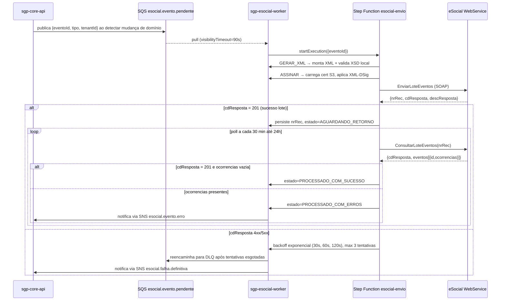
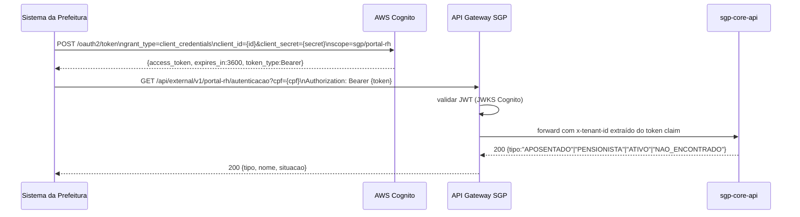
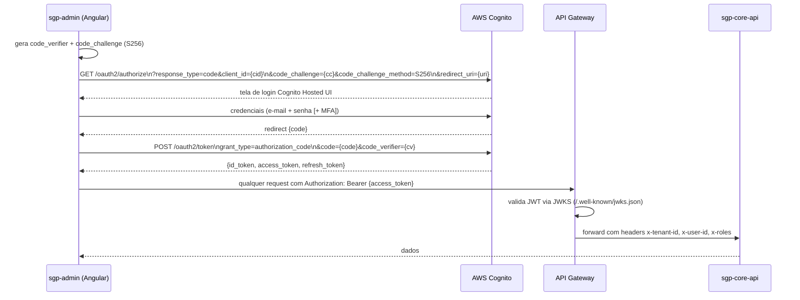
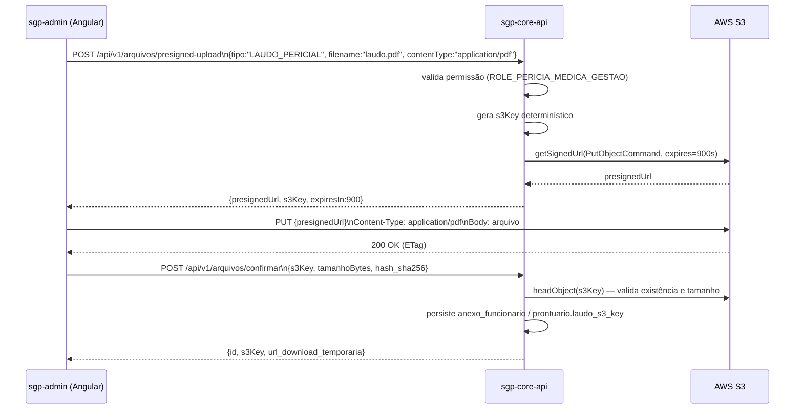
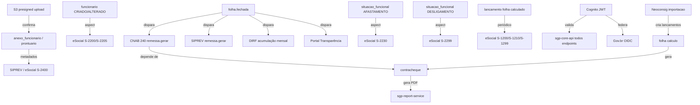

# Contratos de Integração — SGP Moderno
**Versão:** 1.0 | **Data:** 2026-04-21 | **Status:** Draft
**Escopo:** `integracoes`, `sgp-esocial-worker`, `sgp-integrations-worker`, `sgp-payroll-engine`, `sgp-core-api`, `sgp-portal`
**Depende de:** BRIEF.md, 34-rotinas-operacionais-jobs-e-integracoes.md, 59-integracoes-e-contratos-estaticos.md, 33-catalogo-de-saidas-oficiais-e-arquivos.md

---

## Sumário geral

Arrecadação Previdenciária e DUAM ficam para versão futura; não há contrato de integração, evento ou rota exigida para esse domínio no v0.0.1.

Decisão temporária de 2026-04-26: eSocial permanece stubado/sandbox como qualquer outro provedor externo no pacote atual. As seções abaixo documentam o contrato-alvo e a homologação futura; o aceite corrente cobre geração de payload, persistência interna, estado do evento e adapter sandbox, não transmissão real ao ambiente nacional nem certificado produtivo.

Licenças saúde geradas por perícia oficial permanecem internas no HR-04. O contrato futuro para INSS/SIASS deverá consumir `hr.medical_record` e `hr.medical_leave` após a decisão `granted`, incluindo CID-10 principal/secundário, período concedido, dias consolidados e identificador do parecer oficial; não há transmissão externa ativa neste slice.

| # | Integração | Direção | Protocolo | Auth | Criticidade |
|---|---|---|---|---|---|
| 1 | eSocial S-1.2 | Saída / Entrada (recibo) | Stub/sandbox S-1.2 no pacote atual; SOAP/HTTPS + XML no alvo futuro | Adapter sandbox agora; mTLS/cert. A1/A3 futuro | Crítica |
| 2 | SIPREV/Gestão | Saída | Arquivo TXT + portal HTTPS | Upload manual autenticado | Alta |
| 3 | DIRF (RFB) | Saída | Arquivo TXT + validador PGD | Upload via PGD-DIRF | Alta |
| 4 | Portal do RH (ente) | Entrada / Saída | REST HTTPS | OAuth2 client-credentials (substitui API-KEY) | Alta |
| 5 | API externa de terceiros | Saída | REST HTTPS | OAuth2 client-credentials (`ROLE_EXTERNAL_SYSTEM`) | Média |
| 6 | Gov.br OIDC federation | Entrada | OIDC/OAuth2 | Gov.br como IdP federado Cognito | Alta (fase 2) |
| 7 | AWS Cognito UserPools | Entrada | OIDC/OAuth2 | Authorization-code + PKCE / client-credentials | Crítica |
| 8 | Neoconsig / consignatárias | Entrada | Arquivo CSV/TXT | Upload manual / SFTP (por consignatária) | Média |
| 9 | CNAB 240 / 400 | Saída / Entrada | Arquivo texto CNAB | SFTP bancário ou portal banco | Crítica |
| 10 | Portal da Transparência | Saída | Arquivo JSON/CSV | Upload agendado / HTTPS sem auth ou token | Alta |
| 11 | SEFIP / GFIP | Saída | Arquivo TXT SEFIP | Upload via SEFIP/GEFIP client | Congelado (legado) |
| 12 | Upload/Download S3 presigned | Interno | HTTPS presigned URL | SigV4 (Cognito → API → S3) | Crítica |
| 13 | EventBridge / SNS / SQS | Interno | AWS messaging | IAM Role + policy | Crítica |

---

## 1. eSocial S-1.2

### 1.1 Finalidade e dono de negócio

Transmissão dos eventos de folha, cadastro e desligamento ao ambiente nacional do eSocial (RFB/MTE/INSS). Dono: **Módulo Folha + Módulo RH** — responsável operacional: Departamento Pessoal / Contador do ente.

Somente o leiaute **S-1.2** é suportado. Versões anteriores (S-1.0, S-1.1) não serão mantidas.

Feature flag: `esocial.enabled` — quando `false`, menus e workers estão desativados.

### 1.2 Protocolo, autenticação e endpoints

| Atributo | Valor |
|---|---|
| Protocolo | HTTPS + SOAP 1.1 |
| Binding | `ServicosEmprSREmpregador` (produção) / `ServicoSolicitarDownloadEventosPorId` (consulta) |
| Endpoint produção | `https://webservices.esocial.gov.br/servicos/empregador/envioLoteEventos/enviarLoteEventos/v1_1_0/` |
| Endpoint homologação | `https://webservices.esocial.gov.br/servicos/empregador/homologacao/...` |
| Auth | mTLS: certificado e-CNPJ A1 (PKCS12) ou A3 (via PKCS11 → HSM) |
| Assinatura | XML-DSig (RSA-SHA1 ou RSA-SHA256) em cada evento e no lote |
| Cert armazenado em | S3 `{tenant}/certs/esocial.p12` (SSE-KMS) + Secrets Manager (senha) |
| Parâmetros tenant | `esocial_url`, `esocial_cnpj_empregador`, `esocial_certificado_s3_key` |

### 1.3 Eventos cobertos

| Grupo | Eventos |
|---|---|
| Tabelas empregador | S-1000, S-1005, S-1010, S-1020 |
| Folha periódica | S-1200, S-1210, S-1299 |
| Não periódicos — admissão/vínculo | S-2200, S-2205, S-2206 |
| Não periódicos — afastamento/desligamento | S-2230, S-2299 |
| Não periódicos — trabalhador sem vínculo | S-2300, S-2399 |
| Benefício previdenciário | S-2400 (série) |
| Exclusão | S-3000 |
| Retornos (totalizadores) | S-5001, S-5002, S-5003, S-5011, S-5012 |

### 1.4 Esquema de entrada (campos mínimos SGP → eSocial)

```xml
<!-- Fragmento S-2200 — Admissão de Trabalhador -->
<eSocial xmlns="http://www.esocial.gov.br/schema/evt/evtAdmissao/v02_05_00">
  <evtAdmissao Id="ID{tipo}{cnpj}{dataHora}{seq}">
    <ideEvento>
      <indRetif>1</indRetif>  <!-- 1=Original 2=Retificação -->
      <tpAmb>1</tpAmb>        <!-- 1=Prod 2=Hom -->
      <procEmi>1</procEmi>
      <verProc>SGP-2.0</verProc>
    </ideEvento>
    <ideEmpregador>
      <tpInsc>1</tpInsc>
      <nrInsc>{cnpj14}</nrInsc>
    </ideEmpregador>
    <trabalhador>
      <cpfTrab>{cpf}</cpfTrab>
      <nmTrab>{nome}</nmTrab>
      <sexo>{M|F}</sexo>
      <racaCor>{1..6}</racaCor>
      <estCiv>{1..5}</estCiv>
      <grauInstr>{01..12}</grauInstr>
      <nascimento>
        <dtNascto>{yyyy-MM-dd}</dtNascto>
        <paisNascto>105</paisNascto>
        <paisNac>105</paisNac>
      </nascimento>
      <documentos>
        <ctps><nrCtps/><serieCtps/><ufCtps/><dtExped/></ctps>
      </documentos>
      <enderecoExt/>
    </trabalhador>
    <vinculo>
      <matricEmp>{matricula}</matricEmp>
      <tpRegTrab>1</tpRegTrab>   <!-- 1=CLT 2=Est. Público -->
      <tpRegPrev>2</tpRegPrev>   <!-- 2=RPPS -->
      <dtAdm>{yyyy-MM-dd}</dtAdm>
      <cargo><nmCargo>{cargo}</nmCargo><CBOCargo>{cbo}</CBOCargo></cargo>
      <remuneracao>
        <vrSalFx>{valor}</vrSalFx>
        <undSalFixo>5</undSalFixo> <!-- 5=mensal -->
      </remuneracao>
      <infoRegimeTrab>
        <infoCeletista>...</infoCeletista>
        <!-- ou infoEstatutario -->
      </infoRegimeTrab>
      <infoContrato>...</infoContrato>
    </vinculo>
  </evtAdmissao>
  <Signature xmlns="http://www.w3.org/2000/09/xmldsig#">...</Signature>
</eSocial>
```

### 1.5 Fluxo de envio e consulta (state machine)



**Estados do evento eSocial no SGP:**

```
PENDENTE → GERANDO_XML → ASSINANDO → ENVIANDO → AGUARDANDO_RETORNO
         → PROCESSADO_COM_SUCESSO
         → PROCESSADO_COM_ERROS
         → ERRO_TECNICO_RETENTAVEL
         → ERRO_DEFINITIVO (DLQ)
         → EXCLUIDO (S-3000 enviado)
```

### 1.6 Retorno e taxonomia de erros

| Código eSocial | Significado SGP | Ação |
|---|---|---|
| 201 | Lote aceito/processado | Aguardar/concluir |
| 202 | Lote em processamento | Poll continua |
| 401 | Certificado inválido | Alerta imediato; bloqueia envios |
| 402 | Prazo transmissão expirado | Reprocessar S-1299 corretivo |
| 403 | Erro de schema XML | Bug SGP; registra em DLQ; notifica dev |
| 404 | Evento não encontrado | Ignorar; log warn |
| 501 | Erro interno eSocial | Retry exponencial |

### 1.7 Idempotência

Cada evento tem `Id` derivado de `{tipo}{cnpj}{dataHora}{seq}` (padrão RFB). Retificação usa `indRetif=2` com número do recibo original em `nrRecEvt`. O SGP persiste `nrRec` do lote e impede reenvio de evento já com estado `PROCESSADO_COM_SUCESSO`.

### 1.8 Observabilidade

- **Log estruturado:** `{tenantId, eventoId, tipo, nrRec, estado, tentativa, durationMs}` em cada transição.
- **Métricas CloudWatch:** `esocial.eventos.enviados`, `esocial.eventos.erro`, `esocial.lotes.abertos`, `esocial.poll.latencia_ms`.
- **Alarme:** taxa de erro > 5% em 15 min → SNS → PagerDuty.
- **Trace:** X-Ray em cada step da Step Function.

### 1.9 Estratégia de falha / compensação

- DLQ retém por 14 dias; reprocessamento manual via endpoint `POST /api/admin/v1/esocial/eventos/{id}/reprocessar`.
- Evento em `ERRO_DEFINITIVO` bloqueia o fechamento da competência se for periódico (S-1200/S-1299).
- Revogação de certificado: `ROLE_GESTAO_ESOCIAL` pode atualizar cert via `PUT /api/admin/v1/esocial/certificado` sem downtime (faz upload para S3 + invalida cache do worker).

---

## 2. SIPREV / Gestão

### 2.1 Finalidade e dono de negócio

Exportação anual/mensal dos dados previdenciários para o sistema SIPREV (Ministério da Previdência Social). Dono: **Módulo Previdenciário** — responsável: Gestor do RPPS / Atuário.

### 2.2 Protocolo e autenticação

| Atributo | Valor |
|---|---|
| Protocolo | Geração de arquivo TXT estruturado (layout MPS SIPREV vigente) + upload manual no portal SIPREV |
| Portal | `https://www.previdencia.gov.br/siprev-gestao/` |
| Auth portal | Certificado digital ICP-Brasil + credencial gov.br do gestor |
| Direção SGP | Somente saída (geração do arquivo) |

### 2.3 Esquema do arquivo (fragmento)

```
# Layout SIPREV — Registro tipo 1 (Identificação)
Pos  Tam  Campo
001  001  Tipo de registro = "1"
002  014  CNPJ do ente
016  060  Razão social
076  006  Competência (AAAAMM)
082  008  Data de geração (AAAAMMDD)
090  003  Versão do leiaute

# Registro tipo 2 (Servidor ativo)
001  001  Tipo = "2"
002  011  CPF
013  060  Nome
073  008  Data admissão (AAAAMMDD)
081  001  Sexo (M/F)
082  002  Regime = "RP" (RPPS)
084  012  Remuneração bruta (10d + 2 decimais sem ponto)
096  012  Base de contribuição
108  010  Alíquota (8d+2 decimais)
...
```

### 2.4 Fluxo de geração

```
Usuário aciona "Gerar SIPREV" (competência X)
  → sgp-core-api publica remessa.gerar{tipo=SIPREV, competenciaId}
  → sgp-integrations-worker consome, monta arquivo via builder tipado
  → persiste em S3: {tenant}/outputs/siprev/{ano}/{mes}/siprev_{cnpj}_{aaaamm}.txt
  → registra siprev_envio (tipo=SIPREV, status=GERADO)
  → disponibiliza download via presigned URL
Usuário baixa e faz upload manual no portal SIPREV
Usuário registra protocolo de envio em siprev_envio.protocolo
```

### 2.5 Taxonomia de erros

| Erro | Causa | Ação |
|---|---|---|
| Dados incompletos (CPF sem PIS) | Falta PIS/NIT no cadastro | Relatório de inconsistências antes de gerar |
| Competência sem folha fechada | Folha não foi fechada | Bloquear geração até `folha.status=BLOQUEADO` |
| Timeout geração | Volume > 50k registros | Step Function com chunking por lote de 5k |

### 2.6 Observabilidade

- Métrica `siprev.arquivos.gerados` por tenant/competência.
- Log `{tenantId, competenciaId, registros, tamanhoBytes, s3Key, durationMs}`.
- Alerta se geração falha > 1 vez em 24h para mesma competência.

### 2.7 Falha / compensação

Arquivo gerado é idempotente: regerar sobrescreve o S3 key determinístico. Histórico de versões do S3 mantém todas as gerações anteriores (versionamento habilitado).

---

## 3. DIRF (Receita Federal do Brasil)

### 3.1 Finalidade e dono de negócio

Declaração do Imposto de Renda Retido na Fonte — entrega anual à RFB até último dia útil de fevereiro do ano seguinte. Dono: **Módulo Folha** — responsável: Contador / DP.

### 3.2 Protocolo e autenticação

| Atributo | Valor |
|---|---|
| Protocolo | Arquivo TXT leiaute RFB anual + validador PGD-DIRF |
| Entrega | Upload no portal e-CAC ou via Receitanet |
| Auth portal | Certificado digital ICP-Brasil ou Gov.br nivel ouro |
| Validador | PGD-DIRF (instalado localmente pelo contador) |

### 3.3 Esquema do arquivo (fragmento)

```
DIRF 2026
DECPJ
IDEMP {cnpj} {razaosocial} {anobase}
RESP {cpf_responsavel} {nome} {ddd}{fone}
RTRT
BPFDEC
  CPF {cpf_beneficiario}
  NOME {nome_beneficiario}
  ENDI {logradouro} {num} {comp} {bairro} {municipio} {uf} {cep}
  RTRT {codigo_receita} {ano} {valor_rendimento} {valor_irrf}
FPFDEC
...
FFIM
```

Campos SGP → DIRF:

| Campo DIRF | Origem SGP |
|---|---|
| CPF beneficiário | `pessoa.cpf` |
| Rendimentos tributáveis | `lancamento` (tipo PROVENTO, incidência IRRF = sim) |
| IRRF retido | `lancamento` (verba IRRF) |
| Deduções dependentes | `dependente` (finalidade IR) |
| Plano saúde | `convenio_desconto_folha` (natureza saúde) |

### 3.4 Fluxo de geração

```
Usuário aciona "Gerar DIRF" (ano-base)
  → Validação prévia: todas as competências do ano estão fechadas?
  → sgp-integrations-worker agrega lançamentos do ano via query particionada
  → Gera arquivo TXT
  → Persiste S3: {tenant}/outputs/dirf/{ano}/DIRF_{cnpj}_{ano}.txt
  → Gera PDF conferência (relatório)
  → Disponibiliza ambos para download
Contador baixa, valida no PGD-DIRF e entrega via e-CAC
```

### 3.5 Idempotência e retentativa

Regerar DIRF para mesmo ano-base é permitido até a data de entrega. Versão anterior fica em histórico S3. Cada geração produz `relatorio_integracao` com hash SHA-256 do arquivo.

### 3.6 Observabilidade

- Métrica `dirf.geracoes.total` por ano.
- Alerta: geração executada após a data limite (28/fev).

---

## 4. Portal do RH (Prefeitura / Ente)

### 4.1 Finalidade e dono de negócio

API pública emitida pelo SGP para sistemas externos do ente (portal de autoatendimento da prefeitura, sistemas de gestão de benefícios, quiosques de prova de vida). Substitui o legado `SGP-API-KEY` por OAuth2 client-credentials. Dono: **Módulo Previdenciário + Módulo RH** — responsável: TI do ente contratante.

### 4.2 Protocolo e autenticação

| Atributo | Valor |
|---|---|
| Protocolo | REST HTTPS / JSON |
| Base path | `/api/external/v1/portal-rh/` |
| Auth | OAuth2 client-credentials (Cognito App Client com escopo `sgp/portal-rh`) |
| Token | JWT HS256/RS256; exp 3600s; renovação automática pelo consumidor |
| Rate limit | 60 req/min por client_id; 429 com `Retry-After` |
| Versão | v1 (legado `/api/publico/prefeitura/*` mantido em `/api/legacy/v0/portal-rh/` por 12 meses) |

### 4.3 Fluxo OAuth2 client-credentials



### 4.4 Endpoints expostos

| Método | Path | Descrição |
|---|---|---|
| GET | `/autenticacao` | Identifica CPF: APOSENTADO / PENSIONISTA / ATIVO / NAO_ENCONTRADO |
| GET | `/dependente` | Lista dependentes de um beneficiário (CPF query param) |
| PUT | `/endereco` | Atualiza endereço do beneficiário (prova de vida presencial) |
| POST | `/incorretos` | Reporta dados incorretos para saneamento |
| POST | `/imagem` | Envia foto/documento (multipart; max 10 MB; tipos: JPEG, PNG, PDF) |
| GET | `/recadastramento/status` | Consulta status do recadastramento atual |
| POST | `/prova-vida` | Registra prova de vida via canal PREFEITURA_PUBLICA |

### 4.5 Schema de resposta (autenticacao)

```json
{
  "cpf": "000.000.000-00",
  "nome": "string",
  "tipo": "APOSENTADO | PENSIONISTA | ATIVO | NAO_ENCONTRADO",
  "situacaoFuncional": "ATIVO | AFASTAMENTO | ...",
  "dataConcessaoBeneficio": "2020-01-15",
  "proximoRecadastramento": "2026-07-01",
  "statusRecadastramento": "RECADASTRADO | PERTO_VENCER | NAO_RECADASTRADO"
}
```

### 4.6 Taxonomia de erros

| HTTP | Código | Descrição |
|---|---|---|
| 401 | `TOKEN_INVALIDO` | JWT expirado ou inválido |
| 403 | `SCOPE_INSUFICIENTE` | Client não tem escopo `sgp/portal-rh` |
| 404 | `PESSOA_NAO_ENCONTRADA` | CPF não cadastrado no tenant |
| 422 | `DADOS_INVALIDOS` | Campos obrigatórios ausentes ou inválidos |
| 429 | `RATE_LIMIT` | Excedeu limite de requisições |
| 503 | `SERVICO_INDISPONIVEL` | SGP em manutenção |

### 4.7 Observabilidade

- `portal_rh.requests.total` por endpoint/status.
- `portal_rh.prova_vida.registradas` por canal.
- Alerta: taxa de 401 > 10% em 5 min (possível vazamento de credencial).

---

## 5. API Externa de Terceiros (Dicionário + Dados)

### 5.1 Finalidade e dono de negócio

Expõe dados e metadados do SGP para sistemas consumidores autorizados (BI, ERPs municipais, sistemas de transparência de terceiros). Substitui o header `SGP-API-KEY`. Dono: **Módulo Gestão + Módulo RH** — responsável: TI / Gestor de dados do ente.

### 5.2 Protocolo e autenticação

| Atributo | Valor |
|---|---|
| Protocolo | REST HTTPS / JSON |
| Base path | `/api/external/v1/` |
| Auth | OAuth2 client-credentials (escopo `sgp/external-api`) |
| Papel obrigatório | `ROLE_EXTERNAL_SYSTEM` |
| Legado | Header `SGP-API-KEY` suportado em `/api/legacy/v0/externo/` por 12 meses |

### 5.3 Endpoints

| Método | Path | Descrição |
|---|---|---|
| GET | `/dados` | Dados confidenciais do servidor (conforme escopo liberado) |
| GET | `/dicionario/entidades` | Lista entidades do domínio SGP |
| GET | `/dicionario/entidades/{nome}` | Detalhes de uma entidade (campos, tipos, constraints) |
| GET | `/dicionario/enums` | Lista todos os enums parametrizáveis |
| GET | `/dicionario/enums/{nome}` | Valores de um enum específico |

### 5.4 Schema dicionário de entidades

```json
{
  "nome": "funcionario",
  "descricao": "Vínculo funcional de um servidor com o ente",
  "campos": [
    {
      "nome": "matricula",
      "tipo": "string",
      "obrigatorio": true,
      "descricao": "Matrícula única do servidor no ente"
    }
  ],
  "relacionamentos": [
    { "entidade": "cargo", "cardinalidade": "N:1" }
  ]
}
```

### 5.5 Taxonomia de erros

Mesma tabela da Seção 5.6, acrescentando:

| HTTP | Código | Descrição |
|---|---|---|
| 403 | `ROLE_INSUFICIENTE` | Cliente sem `ROLE_EXTERNAL_SYSTEM` |

### 5.6 Observabilidade

- `api_externa.requests.total` por endpoint.
- `api_externa.dicionario.consultas` por entidade (para detectar scraping).
- Alerta: volume > 1000 req/min por client_id.

---

## 6. Gov.br OIDC Federation (fase 2)

### 6.1 Finalidade e dono de negócio

Login do servidor/pensionista/cidadão no Portal do Servidor (`sgp-portal`) via conta Gov.br, eliminando cadastro de senha no SGP. Feature flag: `GOV_BR_SSO_ENABLED`. Dono: **Módulo Auth + Portal do Servidor**.

### 6.2 Protocolo e autenticação

| Atributo | Valor |
|---|---|
| Protocolo | OIDC 1.0 / OAuth2 authorization code + PKCE |
| IdP | Gov.br (OIDC broker do SERPRO) |
| Integração AWS | Gov.br configurado como **OIDC IdP externo** no Cognito User Pool |
| Endpoint discovery | `https://sso.staging.acesso.gov.br/.well-known/openid-configuration` |
| Client registration | Solicitação via `https://www.gov.br/governodigital/pt-br/api-conta-gov-br` |
| Nível de autenticação | Bronze (CPF), Prata (validado), Ouro (com certificado) — mínimo: Prata |
| Scopes requeridos | `openid profile email cpf` |

### 6.3 Fluxo federation

```mermaid
sequenceDiagram
    participant Browser as Browser (sgp-portal)
    participant Cognito as AWS Cognito
    participant GovBR as Gov.br OIDC
    participant Core as sgp-core-api

    Browser->>Cognito: GET /oauth2/authorize?identity_provider=GovBR&response_type=code&scope=openid+profile+email+cpf&code_challenge={pkce}
    Cognito->>GovBR: redirect com parâmetros OIDC
    GovBR-->>Browser: tela de login Gov.br
    Browser->>GovBR: autenticação (senha/cert/biometria)
    GovBR-->>Cognito: authorization code
    Cognito->>GovBR: POST /token (code + client_secret)
    GovBR-->>Cognito: {id_token, access_token}
    Cognito->>Cognito: mapeia claims Gov.br → atributos Cognito\n(cpf → custom:cpf, nome → name)
    Cognito-->>Browser: {authorization_code Cognito}
    Browser->>Cognito: POST /oauth2/token (code + code_verifier)
    Cognito-->>Browser: {id_token, access_token, refresh_token}
    Browser->>Core: GET /api/portal/v1/me\nAuthorization: Bearer {access_token}
    Core->>Core: valida JWT; extrai cpf; localiza pessoa; injeta tenant
    Core-->>Browser: perfil do servidor/pensionista
```

### 6.4 Mapeamento de claims

| Claim Gov.br | Atributo Cognito | Uso SGP |
|---|---|---|
| `sub` | `custom:govbr_sub` | Vinculação de conta |
| `cpf` | `custom:cpf` | Localização de `pessoa` no tenant |
| `name` | `name` | Exibição |
| `email` | `email` | Notificações |
| `amr` | `custom:govbr_amr` | Verificar nível mínimo (Prata) |

### 6.5 Provisionamento JIT

Se CPF existe em `pessoa` mas não há `usuario` para o portal, o SGP cria `usuario` com `tipo=PORTAL` e papel `ROLE_PORTAL_SERVIDOR` na primeira autenticação bem-sucedida.

### 6.6 Fallback

Quando `GOV_BR_SSO_ENABLED=false`, o Portal exibe apenas login com Cognito nativo (e-mail + senha). Nunca força Gov.br em ambientes de homologação sem aprovação prévia.

### 6.7 Observabilidade

- `govbr.logins.sucesso`, `govbr.logins.falha`, `govbr.logins.nivel_insuficiente`.
- Alerta: taxa de `nivel_insuficiente` > 20% indica orientação inadequada ao usuário.

---

## 7. AWS Cognito UserPools

### 7.1 Finalidade e dono de negócio

IdP primário do backoffice (`sgp-admin`) e fallback do portal (`sgp-portal`). Gerencia usuários administrativos (RH, DP, contadores, gestores). Dono: **Módulo Auth + Gestão** — responsável: TI do ente.

### 7.2 Configuração

| Atributo | Valor |
|---|---|
| Recurso AWS | Cognito User Pool (1 por tenant ou pool compartilhado com isolamento por `custom:tenantId`) |
| App Client admin | Fluxo authorization-code + PKCE; `sgp-admin` SPA |
| App Client portal | Fluxo authorization-code + PKCE; `sgp-portal` SPA |
| App Client API externa | Fluxo client-credentials; sem usuário humano |
| Parâmetros tenant | `cognito_user_pool_id`, `cognito_app_client_id` em `ParametroSistema` |
| Tokens | ID Token (identidade), Access Token (autorização), Refresh Token (7 dias) |
| MFA | Opcional por tenant; suportado TOTP e SMS |

### 7.3 Fluxo authorization-code + PKCE (admin)



### 7.4 Estrutura do JWT

```json
{
  "sub": "uuid-cognito",
  "custom:tenantId": "uuid-tenant",
  "custom:cpf": "00000000000",
  "cognito:groups": ["ROLE_FOLHA_DE_PGT_GESTAO", "ROLE_RH_VISUALIZAR"],
  "email": "usuario@ente.gov.br",
  "iss": "https://cognito-idp.{region}.amazonaws.com/{poolId}",
  "exp": 1745280000,
  "iat": 1745276400
}
```

### 7.5 Gestão de usuários via SGP

- Criação/bloqueio/desbloqueio de usuário no Cognito via `CognitoIdentityProviderClient` (SDK v3).
- Sync bidirecional: `usuario` SGP ↔ Cognito User; papel → Cognito Group.
- Reset de senha: Cognito envia e-mail com link temporário.

### 7.6 Refresh Token

SPA armazena refresh token em cookie `HttpOnly; Secure; SameSite=Strict`. Access token em memória (não persiste). Silently renovado 60s antes da expiração.

### 7.7 Observabilidade

- `cognito.logins.sucesso`, `cognito.logins.falha`, `cognito.token.refresh`.
- Alerta: logins falhos > 10 em 5 min por IP (brute force).

---

## 8. Neoconsig / Consignatárias

### 8.1 Finalidade e dono de negócio

Importação de descontos em folha referentes a empréstimos consignados, convênios e seguros. Dono: **Módulo Folha (Convênio + Consignado)** — responsável: DP / Gestor financeiro.

### 8.2 Protocolo e autenticação

| Atributo | Valor |
|---|---|
| Protocolo | Arquivo CSV ou TXT (leiaute Neoconsig + variações por consignatária) |
| Transferência | Upload manual na tela "Importação Consignado" ou SFTP por consignatária (futuro) |
| Auth SFTP (futuro) | Chave SSH por par de chaves, host key fingerprint fixado |
| Periodicidade | Mensal por competência |

### 8.3 Leiaute CSV (Neoconsig padrão)

```
# Header
MATRICULA;CPF;NOME;CONTRATO;BANCO;AGENCIA;VALOR_PARCELA;COMPETENCIA;TIPO_DESCONTO

# Linha de dados
000123;123.456.789-00;JOAO DA SILVA;CONT-2024-0001;001;0001;850.00;202604;EMPRESTIMO
```

Campos consumidos pelo SGP:

| Campo | Destino |
|---|---|
| MATRICULA | `funcionario.matricula` (lookup) |
| CPF | Validação cruzada |
| CONTRATO | `consignado.contrato` |
| VALOR_PARCELA | `lancamento.valor_calculado` |
| TIPO_DESCONTO | Mapeia para `verba_id` via tabela `consignado_verba_map` |
| COMPETENCIA | Validação: deve bater com competência aberta |

### 8.4 Fluxo de importação

```
Usuário faz upload do arquivo na tela Consignado
  → sgp-core-api valida formato (encoding UTF-8 ou ISO-8859-1)
  → preview: retorna linhas OK, linhas com erro, total de descontos
  → Usuário confirma importação
  → sgp-core-api persiste importacao_consignado (status=IMPORTADO)
  → Cria/atualiza lancamentos na folha em aberto
  → Linhas com matrícula não encontrada → log de inconsistência
  → Notifica usuário: "X lançamentos criados, Y rejeitados"
```

### 8.5 Idempotência

Reimportação do mesmo arquivo em mesma competência é permitida — opera em modo "substitui existentes" (os lançamentos de origem `CONSIGNADO` são removidos antes de recriar).

### 8.6 Taxonomia de erros

| Erro | Causa | Ação |
|---|---|---|
| Matrícula não encontrada | Servidor desligado ou erro no arquivo | Lista em relatório de rejeição |
| Valor negativo | Dado inválido | Linha rejeitada; demais processadas |
| Competência divergente | Arquivo de mês errado | Bloquear toda a importação; exigir confirmação |
| Encoding inválido | Arquivo não-UTF8/ISO | Detectar automaticamente; falhar com instrução |

### 8.7 Observabilidade

- `neoconsig.importacoes.total`, `neoconsig.lancamentos.criados`, `neoconsig.lancamentos.rejeitados`.

---

## 9. CNAB 240 / 400 (Remessa e Retorno Bancário)

### 9.1 Finalidade e dono de negócio

Geração da remessa de crédito em conta do valor líquido da folha (CNAB 240 preferencial; CNAB 400 para bancos legados) e processamento do retorno com confirmações de pagamento. Dono: **Módulo Folha** — responsável: DP / Tesouraria.

### 9.2 Protocolo e autenticação

| Atributo | Valor |
|---|---|
| Protocolo | Arquivo texto posicional CNAB 240 (FEBRABAN) ou CNAB 400 |
| Transferência | SFTP bancário (credencial por banco) ou upload/download no portal do banco |
| Auth SFTP | Usuário + senha ou chave SSH (configurável por banco em `ParametroSistema`) |
| Periodicidade | Por evento de fechamento de folha / sob demanda |

### 9.3 Estrutura CNAB 240 (fragmento)

```
# Header de arquivo (registro tipo 0)
Pos  Tam  Campo
001  003  Código banco (341 Itaú, 033 Santander, 001 BB, etc.)
018  009  CNPJ empresa
073  030  Nome empresa
143  010  Data geração (DDMMAAAA)
178  006  Número remessa (sequencial)

# Segment A — crédito em conta (registro tipo 3, segmento A)
001  003  Código banco
005  004  Lote
010  001  Tipo registro = 3
011  001  Segmento = A
012  001  Tipo movimento (C=crédito)
073  020  Nome favorecido
088  003  Banco favorecido
091  005  Agência favorecido
096  001  DV agência
097  012  Conta favorecido
109  001  DV conta
114  015  Valor pagamento (13d+2 decimais)
145  010  Data pagamento (DDMMAAAA)
```

### 9.4 Fluxo remessa

```mermaid
sequenceDiagram
    participant User as Usuário (DP)
    participant Core as sgp-core-api
    participant Worker as sgp-integrations-worker
    participant S3 as S3 Bucket
    participant Banco as Portal Banco / SFTP

    User->>Core: POST /api/v1/folha/{id}/remessa {bancoId, dataCredito}
    Core->>Worker: publica remessa.gerar{folhaId, bancoId, dataCredito}
    Worker->>Worker: agrega contracheques CALCULADO da folha
    Worker->>Worker: monta arquivo CNAB 240 (ou 400 se banco legado)
    Worker->>S3: persiste {tenant}/outputs/remessa/{cnpj}/{aaaamm}/{seq}.txt
    Worker->>Core: atualiza folha.remessa_s3_key, incrementa NUMERO_REMESSA
    Core-->>User: presigned URL para download
    User->>Banco: upload manual ou SFTP automatizado
    Banco-->>User: arquivo retorno (D+1 ou D+2)
    User->>Core: POST /api/v1/folha/{id}/retorno (upload arquivo)
    Core->>Worker: publica retorno.processar{folhaId, s3Key}
    Worker->>Worker: parse CNAB retorno; atualiza status por CPF/matrícula
    Worker->>Core: relatório de ocorrências (pagos, rejeitados, reprocessar)
```

### 9.5 Campos críticos por banco

| Banco | CNAB | Peculiaridade |
|---|---|---|
| Banco do Brasil (001) | 240 | Convênio obrigatório no header do lote |
| Itaú (341) | 240 | Código de finalidade no segmento B |
| Bradesco (237) | 240 | Código do produto no campo de uso exclusivo |
| Caixa (104) | 240 ou 400 | CNAB 400 ainda em uso para alguns tipos de folha |

Configuração por banco: `banco.cnab_versao`, `banco.convenio_codigo`, `banco.layout_arquivo`.

### 9.6 Controle de número de remessa

`NUMERO_REMESSA` em `ParametroGlobal` é incrementado atomicamente a cada geração. Nunca regerar com mesmo número para mesmo banco. Regenar é permitido antes do envio ao banco (incrementa).

### 9.7 Taxonomia de erros retorno

| Ocorrência CNAB | Significado | Ação SGP |
|---|---|---|
| 00 | Crédito efetuado | Marcar `lancamento.status=PAGO` |
| BD | Conta encerrada | Alertar DP; manter pendente |
| AC | Agência/Conta incorreta | Alertar; solicitar correção cadastral |
| TJ | Conta bloqueada judicial | Alertar; registrar ocorrência |

### 9.8 Observabilidade

- `cnab.remessas.geradas`, `cnab.creditos.confirmados`, `cnab.creditos.rejeitados` por banco/competência.
- Alerta: % rejeições > 5% no retorno.

---

## 10. Portal da Transparência

### 10.1 Finalidade e dono de negócio

Publicação periódica da folha pública conforme Lei de Acesso à Informação (LAI/LRF). Dono: **Módulo Folha + Módulo Gestão** — responsável: Controladoria / Assessoria de comunicação.

### 10.2 Protocolo e autenticação

| Atributo | Valor |
|---|---|
| Protocolo | Arquivo CSV ou JSON |
| Entrega | Upload agendado (HTTPS POST com token) ou depósito em bucket S3 público |
| Auth | Token estático do portal da transparência municipal (configurável) ou S3 presigned URL |
| Periodicidade | Mensal; execução automática após fechamento de competência |

### 10.3 Schema do arquivo

```json
[
  {
    "competencia": "2026-04",
    "cpf": "***.***.***-00",
    "nome": "NOME DO SERVIDOR",
    "matricula": "000123",
    "cargo": "ANALISTA ADMINISTRATIVO",
    "lotacao": "SECRETARIA DE FINANÇAS",
    "remuneracaoBruta": 8500.00,
    "descontos": 2100.00,
    "remuneracaoLiquida": 6400.00,
    "verbas": [
      {"codigo": "001", "descricao": "VENCIMENTO BASE", "tipo": "P", "valor": 7000.00},
      {"codigo": "100", "descricao": "INSS", "tipo": "D", "valor": 770.00}
    ]
  }
]
```

**Regras de anonimização:** CPF exibido mascarado (`***.xxx.xxx-**`); dados de benefícios médicos nunca exportados; salário de cargo comissionado incluso somente se determinado pelo ente.

### 10.4 Fluxo

```
Evento folha.fechada recebido (EventBridge)
  → sgp-integrations-worker verifica se PORTAL_TRANSPARENCIA_ENABLED=true
  → Gera arquivo JSON (ou CSV conforme configuração do ente)
  → Persiste S3: {tenant}/outputs/transparencia/{ano}/{mes}/folha_publica_{aaaamm}.json
  → Se configurado endpoint externo: POST arquivo ao portal da transparência do ente
  → Registra transparencia_publicacao (competenciaId, s3Key, status, timestamp)
```

### 10.5 Observabilidade

- `transparencia.publicacoes.total` por tenant.
- Alerta: falha na publicação automática após fechamento.

---

## 11. SEFIP / GFIP (Congelado — Compatibilidade Histórica)

> **Status: CONGELADO** — mantido apenas para geração de histórico e consulta de dados legados. Não recebe novas funcionalidades. Marcado como `@deprecated` nas APIs de configuração.

### 11.1 Contexto

SEFIP/GFIP foi descontinuado pela RFB com a implantação do eSocial (Portaria MF nº 1.006/2022 encerrou obrigatoriedade). O SGP mantém capacidade de geração para entes que ainda precisam reprocessar períodos históricos anteriores à implantação do eSocial.

### 11.2 Protocolo

| Atributo | Valor |
|---|---|
| Protocolo | Arquivo TXT SEFIP (leiaute CAIXA) |
| Entrega | Import no aplicativo SEFIP (instalação local, versão 8.4+) |
| Auth | Não aplicável (arquivo local) |
| Permissão | `ROLE_FOLHA_DE_PGT_GESTAO` |

### 11.3 Restrições operacionais

- Geração disponível apenas para competências com `data < 2023-01` (data de desativação configurável).
- Interface marcada com banner "CONGELADO — somente consulta histórica".
- Nenhum novo campo ou layout será adicionado.
- Não emite métricas de negócio.

---

## 12. Upload / Download S3 Presigned

### 12.1 Finalidade e dono de negócio

Contrato interno entre a SPA `sgp-admin` / `sgp-portal` e `sgp-core-api` para transferência eficiente de anexos grandes (laudos, dossiês, fotos de recadastramento, arquivos de remessa). Elimina tráfego de arquivos pelo servidor da API. Dono: **Módulo Arquivos** (transversal).

### 12.2 Protocolo

| Atributo | Valor |
|---|---|
| Protocolo | HTTPS presigned URL (AWS SigV4) |
| Auth upload | Cognito JWT → `sgp-core-api` gera presigned URL via SDK S3 → SPA faz PUT direto no S3 |
| Auth download | Idem; URL com expiração configurável (padrão 15 min; laudos médicos 5 min) |
| Tamanho máximo | 100 MB (configurável por tipo de documento) |
| Tipos permitidos | PDF, JPEG, PNG, DOCX, XLSX, TXT, XML, ZIP |
| Bucket | `sgp-{tenant-slug}-docs` (SSE-KMS, versionamento ligado, CORS configurado) |
| Chave S3 | `{tenant}/uploads/{dominio}/{ano}/{mes}/{uuid}.{ext}` |

### 12.3 Fluxo de upload



### 12.4 Fluxo de download

```
SPA solicita: GET /api/v1/arquivos/{id}/download
  → Core valida permissão sobre o recurso (não apenas role, mas ownership)
  → Core gera presigned GET URL (expiresIn configurável por tipo)
  → SPA abre URL em nova aba ou inicia download direto
```

### 12.5 Segurança

- Bucket configurado com `BlockPublicAccess: true`.
- CORS restrito a domínios SGP (`sgp-admin.{tenant}.sgp.com.br`, `sgp-portal.{tenant}.sgp.com.br`).
- Validação de `Content-Type` no presigned URL (parâmetro `Content-Type` fixado na assinatura).
- Limite de tamanho imposto via `Content-Length` na presigned URL.
- Auditoria: `audit_log` registra CREATE para cada upload confirmado.

### 12.6 Taxonomia de erros

| HTTP | Cenário | Ação |
|---|---|---|
| 400 | Tipo MIME não permitido | Retorna lista de tipos aceitos |
| 403 | Permissão insuficiente | RFC 7807 com `type: PERMISSAO_INSUFICIENTE` |
| 410 | Presigned URL expirada | SPA solicita nova URL automaticamente |
| 413 | Arquivo acima do limite | Informar limite por tipo de documento |

### 12.7 Observabilidade

- `s3.uploads.total`, `s3.uploads.falhos`, `s3.downloads.total` por domínio.
- `s3.uploads.tamanho_bytes` (histogram) para planejamento de storage.
- Alerta: taxa de falha em confirmação > 10% (indica problema de rede entre SPA e S3).

---

## 13. EventBridge / SNS / SQS — Contratos de Eventos Internos

### 13.1 Finalidade e dono de negócio

Backbone de comunicação assíncrona entre os microsserviços e workers do SGP. Elimina acoplamento síncrono em operações de longa duração (cálculo de folha, geração de PDFs em massa, envio eSocial, integrações de arquivo). Dono: **Arquitetura** — todos os módulos são produtores e/ou consumidores.

### 13.2 Topologia

```
EventBridge Bus: sgp-{env}
  → Rules por padrão de evento
  → SNS Topics (fan-out opcional para múltiplos consumidores)
  → SQS Queues (consumo por worker)
  → DLQ (por fila; retenção 14 dias)
```

| Bus / Tópico / Fila | Produtor | Consumidor | Uso |
|---|---|---|---|
| `sgp-folha-events` SNS | `sgp-core-api` | `sgp-payroll-engine`, `sgp-report-service`, `sgp-integrations-worker` | Eventos de ciclo de folha |
| `sgp-esocial-queue` SQS | `sgp-core-api` | `sgp-esocial-worker` | Envio de eventos eSocial |
| `sgp-integrações-queue` SQS | `sgp-core-api` | `sgp-integrations-worker` | Remessas, SIPREV, DIRF |
| `sgp-relatorios-queue` SQS | `sgp-core-api`, `sgp-payroll-engine` | `sgp-report-service` | Geração de PDF/XLSX |
| `sgp-audit-queue` SQS | `sgp-core-api`, `sgp-payroll-engine` | `sgp-core-api` (audit writer) | Trilha de auditoria assíncrona |
| `sgp-notificacoes-queue` SQS | todos | `sgp-core-api` (notif writer) | E-mail, push, in-app |

### 13.3 Catálogo de eventos

#### 13.3.1 Eventos de Folha

```json
// folha.aberta
{
  "source": "sgp.folha",
  "detail-type": "folha.aberta",
  "detail": {
    "tenantId": "uuid",
    "competenciaId": "uuid",
    "mes": 4,
    "ano": 2026,
    "usuarioId": "uuid",
    "timestamp": "2026-04-01T08:00:00Z"
  }
}

// folha.calculo.solicitada
{
  "source": "sgp.folha",
  "detail-type": "folha.calculo.solicitada",
  "detail": {
    "tenantId": "uuid",
    "folhaPagamentoId": "uuid",
    "loteProcessamentoId": "uuid",
    "tipoProcessamento": "MENSAL",
    "filialId": "uuid",
    "competenciaId": "uuid",
    "modoReprocessamento": "TOTAL | SELETIVO | PENDENTES",
    "funcionarioIds": ["uuid"] // somente em SELETIVO
  }
}

// folha.calculo.concluida
{
  "source": "sgp.payroll-engine",
  "detail-type": "folha.calculo.concluida",
  "detail": {
    "tenantId": "uuid",
    "folhaPagamentoId": "uuid",
    "loteProcessamentoId": "uuid",
    "status": "CALCULADO | ERRO",
    "totalContracheques": 1523,
    "totalErros": 0,
    "valorTotalBruto": 4125000.00,
    "valorTotalLiquido": 3102000.00,
    "durationMs": 47230
  }
}

// folha.fechada
{
  "source": "sgp.folha",
  "detail-type": "folha.fechada",
  "detail": {
    "tenantId": "uuid",
    "competenciaId": "uuid",
    "mes": 4,
    "ano": 2026,
    "totalFolhas": 5,
    "usuarioId": "uuid",
    "timestamp": "2026-04-28T17:00:00Z",
    "triggers": ["SIPREV", "CNAB", "TRANSPARENCIA", "ESOCIAL_S1299"]
  }
}
```

#### 13.3.2 Eventos de Contracheque

```json
// contracheque.gerado
{
  "source": "sgp.payroll-engine",
  "detail-type": "contracheque.gerado",
  "detail": {
    "tenantId": "uuid",
    "contrachequeId": "uuid",
    "funcionarioId": "uuid",
    "folhaPagamentoId": "uuid",
    "template": "SERVIDOR | PENSIONISTA",
    "competencia": "2026-04"
  }
}

// contracheque.gerar.pdf
{
  "source": "sgp.core-api",
  "detail-type": "contracheque.gerar.pdf",
  "detail": {
    "tenantId": "uuid",
    "contrachequeId": "uuid",
    "templateId": "SERVIDOR",
    "marcaDagua": false,
    "callbackUrl": "PUT /api/v1/contracheques/{id}/pdf-key"
  }
}

// contracheque.pdf.disponivel
{
  "source": "sgp.report-service",
  "detail-type": "contracheque.pdf.disponivel",
  "detail": {
    "tenantId": "uuid",
    "contrachequeId": "uuid",
    "s3Key": "{tenant}/outputs/contracheques/2026/04/{uuid}.pdf",
    "tamanhoBytes": 124000
  }
}
```

#### 13.3.3 Eventos eSocial

```json
// esocial.evento.pendente
{
  "source": "sgp.core-api",
  "detail-type": "esocial.evento.pendente",
  "detail": {
    "tenantId": "uuid",
    "eventoId": "uuid",
    "tipoEvento": "S-2200",
    "entidadeOrigem": "funcionario",
    "entidadeOrigemId": "uuid",
    "prioridade": "NORMAL | ALTA",
    "competencia": "2026-04"
  }
}

// esocial.evento.processado
{
  "source": "sgp.esocial-worker",
  "detail-type": "esocial.evento.processado",
  "detail": {
    "tenantId": "uuid",
    "eventoId": "uuid",
    "nrRec": "1.4.20260401.0001",
    "estado": "PROCESSADO_COM_SUCESSO | PROCESSADO_COM_ERROS",
    "ocorrencias": []
  }
}

// esocial.falha.definitiva
{
  "source": "sgp.esocial-worker",
  "detail-type": "esocial.falha.definitiva",
  "detail": {
    "tenantId": "uuid",
    "eventoId": "uuid",
    "tipoEvento": "S-2200",
    "ultimoErro": "string",
    "tentativas": 3,
    "dlqMessageId": "string"
  }
}
```

#### 13.3.4 Eventos de Recadastramento

```json
// recadastramento.aprovado
{
  "source": "sgp.previdenciario",
  "detail-type": "recadastramento.aprovado",
  "detail": {
    "tenantId": "uuid",
    "recadastramentoId": "uuid",
    "beneficiarioId": "uuid",
    "canal": "BALCAO | PORTAL_COLABORADOR | PREFEITURA_PUBLICA | GOV_BR",
    "timestamp": "2026-04-15T14:30:00Z",
    "proximoVencimento": "2027-04-15"
  }
}

// recadastramento.vencido
{
  "source": "sgp.jobs",
  "detail-type": "recadastramento.vencido",
  "detail": {
    "tenantId": "uuid",
    "beneficiarioId": "uuid",
    "diasEmAtraso": 30,
    "tipoAcao": "NOTIFICAR | BLOQUEAR_BENEFICIO"
  }
}
```

#### 13.3.5 Eventos de Integração

```json
// remessa.gerar
{
  "source": "sgp.core-api",
  "detail-type": "remessa.gerar",
  "detail": {
    "tenantId": "uuid",
    "tipo": "CNAB240 | CNAB400 | SIPREV | DIRF | TRANSPARENCIA",
    "folhaPagamentoId": "uuid",
    "competenciaId": "uuid",
    "parametros": {}
  }
}

// remessa.gerada
{
  "source": "sgp.integrations-worker",
  "detail-type": "remessa.gerada",
  "detail": {
    "tenantId": "uuid",
    "tipo": "CNAB240",
    "s3Key": "{tenant}/outputs/remessa/{cnpj}/202604/remessa_001.txt",
    "registros": 1523,
    "valorTotal": 3102000.00
  }
}

// retorno.processar
{
  "source": "sgp.core-api",
  "detail-type": "retorno.processar",
  "detail": {
    "tenantId": "uuid",
    "tipo": "CNAB240",
    "folhaPagamentoId": "uuid",
    "s3Key": "uploads/retorno/...",
    "bancoId": "uuid"
  }
}
```

#### 13.3.6 Eventos de Auditoria

```json
// audit.evento.criado
{
  "source": "sgp.core-api",
  "detail-type": "audit.evento.criado",
  "detail": {
    "tenantId": "uuid",
    "timestamp": "2026-04-21T10:00:00Z",
    "usuarioId": "uuid",
    "dominio": "folha | rh | previdenciario | ...",
    "entidade": "funcionario",
    "entidadeId": "uuid",
    "acao": "CREATE | UPDATE | DELETE | LOGIN | EXPORT | PRINT",
    "diffJsonb": { "anterior": {}, "posterior": {} },
    "ip": "10.0.0.1",
    "userAgent": "Mozilla/5.0...",
    "requestId": "uuid"
  }
}
```

### 13.4 Política de retry / DLQ

| Fila | maxReceiveCount | Retry delay | DLQ retenção |
|---|---|---|---|
| `sgp-esocial-queue` | 3 | exponencial 30s/60s/120s | 14 dias |
| `sgp-integracoes-queue` | 3 | 60s fixo | 14 dias |
| `sgp-relatorios-queue` | 5 | 30s fixo | 7 dias |
| `sgp-audit-queue` | 10 | 10s fixo | 30 dias |
| `sgp-notificacoes-queue` | 3 | 30s fixo | 3 dias |

### 13.5 Observabilidade de filas

- `sqs.messages.sent`, `sqs.messages.received`, `sqs.messages.dlq` por fila.
- Alerta CloudWatch: `ApproximateNumberOfMessagesNotVisible > 1000` por > 5 min em qualquer fila.
- Alerta DLQ: qualquer mensagem na DLQ de `sgp-esocial` → PagerDuty imediato.
- X-Ray tracing end-to-end: correlação `traceId` propagado em atributos da mensagem SQS.

### 13.6 Idempotência nas filas

- Cada mensagem carrega `messageDeduplicationId` (hash do payload para FIFO queues críticas).
- Consumidores verificam `idempotency_key` no banco antes de processar (tabela `processamento_mensagem`).
- Garantia "at-least-once"; lógica de negócio idempotente em todos os consumidores.

---

## Matriz de Dependências Críticas



### Dependências bloqueantes por integração

| Integração | Pré-requisito obrigatório | Bloqueante se ausente |
|---|---|---|
| eSocial periódico (S-1299) | Folha fechada + S-1200/S-1210 processados | Sim — impede fechamento de transmissão |
| CNAB remessa | Folha calculada + contas bancárias cadastradas | Sim — sem remessa = folha não paga |
| SIPREV | Folha fechada + PIS/NIT em todos os servidores | Não — gera com inconsistências marcadas |
| DIRF | Todas as competências do ano fechadas | Não — geração parcial possível com alerta |
| Gov.br federation | Cognito UserPool configurado + client_id Gov.br aprovado | Não — fallback login Cognito nativo |
| Neoconsig import | Competência aberta + folha desbloqueada | Sim — arquivo rejeitado fora da janela |

---

## Estratégia de Feature Flag por Integração

Todas as integrações são controláveis por feature flags. Flags são persistidos em `feature_flag` (tabela), consultados em cache Redis (TTL 60s) e nunca hardcoded.

| Feature Flag | Integração | Granularidade | Efeito quando `false` |
|---|---|---|---|
| `esocial.enabled` | eSocial S-1.2 | Tenant | Menus ocultos; workers não processam; aspects não publicam eventos |
| `PORTAL_SERVIDOR_ENABLED` | Portal do Servidor (`sgp-portal`) | Tenant | Portal inacessível; retorna 503 |
| `GOV_BR_SSO_ENABLED` | Gov.br OIDC | Tenant | Botão Gov.br oculto; somente Cognito nativo |
| `PROVA_VIDA_PUBLIC_API_ENABLED` | Portal RH — prova de vida via API | Tenant | Endpoint `/prova-vida` retorna 404 |
| `DIRF_AUTO_ENABLED` | DIRF — geração automática ao final do ano | Tenant | Geração apenas manual |
| `TRANSPARENCIA_AUTO_ENABLED` | Portal da Transparência — publicação automática | Tenant | Publicação apenas manual |
| `CNAB_SFTP_ENABLED` | CNAB — envio automático por SFTP | Tenant | Somente download manual |
| `NEOCONSIG_SFTP_ENABLED` | Neoconsig — coleta automática SFTP | Tenant | Somente upload manual |
| `SEFIP_HABILITADO` | SEFIP (congelado) | Global | Oculta seção SEFIP completamente |
| `AUDIT_FULL_TRACE_ENABLED` | Auditoria detalhada | Tenant | Registra apenas ações críticas |

### Protocolo de ativação

1. Flag criada com valor `false` em todos os tenants no deploy inicial.
2. Equipe de implantação ativa flag por tenant via endpoint `PATCH /api/admin/v1/feature-flags/{chave}` (requer `ROLE_ADMIN_GLOBAL`).
3. Rollout gradual: ativar em ambiente de homologação → 1 tenant piloto → demais tenants.
4. Flags do tipo "congelado" (ex: `SEFIP_HABILITADO`) mantidas como `false` global; não expostas na UI de configuração de tenant.

### Verificação de flag no código

```typescript
// NestJS — Guard de feature flag
@Injectable()
export class FeatureFlagGuard implements CanActivate {
  constructor(
    private readonly flags: FeatureFlagService,
    private readonly reflector: Reflector,
  ) {}

  async canActivate(context: ExecutionContext): Promise<boolean> {
    const flag = this.reflector.get<string>('feature_flag', context.getHandler());
    if (!flag) return true;
    const tenant = GqlExecutionContext.create(context).getContext().tenant;
    const enabled = await this.flags.isEnabled(flag, tenant.id);
    if (!enabled) throw new ServiceUnavailableException(`Funcionalidade ${flag} não habilitada para este ente.`);
    return true;
  }
}

// Uso no controller
@Get('esocial/filiais')
@UseGuards(FeatureFlagGuard)
@SetMetadata('feature_flag', 'esocial.enabled')
async listarFiliais() { ... }
```

---

*Fim do documento — 42-contratos-integracao.md*
