# Máquinas de Estado — SGP Moderno
**Versão:** 1.0 | **Data:** 2026-04-21 | **Status:** Draft
**Escopo:** folha, previdenciário, saúde, recrutamento, consignado, estágio | **Depende de:** BRIEF.md, 12–15, 24–27.

---

## Convenções gerais

- Estados: `snake_case` nos enums PostgreSQL / TypeScript.
- Eventos emitidos: `dominio.entidade.evento` (EventBridge/SNS — cf. BRIEF §8).
- Papéis: prefixo `ROLE_<MODULO>_<ACAO>` (cf. BRIEF §4).
- Guarda `[cond]` — pré-condição que deve ser verdadeira **antes** da transição.
- Efeito `/ efeito` — ação executada **durante** a transição.
- Compensação — estado ou evento acionado quando um processamento assíncrono falha.
- Abreviações de papéis usadas nas tabelas:
  - **GF** = `ROLE_FOLHA_DE_PGT.GESTAO`
  - **AF** = `ROLE_FOLHA_DE_PGT.ATUALIZAR`
  - **GP** = `ROLE_MODULO_PREVIDENCIARIO.GESTAO`
  - **GR** = `ROLE_RECADASTRAMENTO.GESTAO`
  - **GM** = `ROLE_PERICIA_MEDICA.GESTAO` / `ROLE_AGENDA_MEDICA.GESTAO`
  - **GRH** = `ROLE_RECRUTAMENTO_SELECAO.GESTAO`
  - **SOL** = solicitante (sem papel especial além de CRUD próprio)
  - **MED** = médico logado (papel `MEDICO`)
  - **SIS** = sistema / job assíncrono

---

## 0.1. Cadastro do servidor HR-01

`hr.employee_status_history` é a linha do tempo imutável da situação funcional do servidor. A admissão cria `hr.employee`, vincula `hr.employment_contract` ativo ao vínculo funcional e registra o primeiro status; o desligamento altera o status para desligado, fecha `employment_contract.ends_on` e registra novo ponto na linha do tempo. Atualizações e exclusões diretas em `employee_status_history` são bloqueadas.

| Estado | Descrição |
|---|---|
| `cadastro_base` | Dados civis e matrícula recebidos para admissão |
| `em_exercicio` | Servidor admitido, com posse/exercício e contrato ativo |
| `desligado` | Servidor desligado, contrato encerrado e folha rescisória opcional |

| Transição | De | Evento | Guarda | Ação | Para |
|---|---|---|---|---|---|
| HR01-T1 | *(início)* | `ADMITIR` | matrícula única por tenant; vínculo/cargo/lotação válidos quando informados | cria `employee`, `employment_contract`, `employee_status_history`; emite `audit_event` | `em_exercicio` |
| HR01-T2 | `em_exercicio` | `DESLIGAR` | motivo e data obrigatórios | muda `functional_status`, preenche `terminated_on`, fecha contrato ativo, emite `audit_event` | `desligado` |

Permissões: leitura exige `rh.employee.read`; admissão exige `rh.employee.admit`; desligamento exige `rh.employee.terminate`.

## 0.2. Vínculo e regime jurídico HR-02

`hr.employment_link` registra a classificação física do vínculo por regime jurídico e `hr.employment_contract` registra a vigência contratual do servidor. A alteração de regime fecha o contrato ativo, abre novo vínculo/contrato, insere uma linha em `hr.employee_status_history` e grava evento imutável em `public.audit_event` via `sgp_append_audit_event`.

| Regime | Guarda obrigatória | Base normativa |
|---|---|---|
| `statutory` | `regime_law_reference` preenchido | Lei 8.112/90 ou estatuto local equivalente |
| `celetista` | contrato CLT com vigência inicial | CLT e Lei 9.962/00 |
| `commissioned` | `commission_position_id` preenchido | CF art. 37, V |
| `temporary` | `end_date` preenchido | Lei 8.745/93 |

| Transição | De | Evento | Guarda | Ação | Para |
|---|---|---|---|---|---|
| HR02-T1 | qualquer regime ativo | `ALTERAR_REGIME_ESTATUTARIO` | fundamento legal informado | fecha contrato anterior; cria vínculo `statutory`; cria contrato; registra histórico e auditoria | `statutory` |
| HR02-T2 | qualquer regime ativo | `ALTERAR_REGIME_CELETISTA` | data de vigência válida | fecha contrato anterior; cria vínculo `celetista`; cria contrato; registra histórico e auditoria | `celetista` |
| HR02-T3 | qualquer regime ativo | `NOMEAR_COMISSIONADO` | cargo em comissão informado | fecha contrato anterior; cria vínculo `commissioned`; cria contrato; registra histórico e auditoria | `commissioned` |
| HR02-T4 | qualquer regime ativo | `CONTRATAR_TEMPORARIO` | data final obrigatória | fecha contrato anterior; cria vínculo `temporary`; cria contrato com `ends_on`; registra histórico e auditoria | `temporary` |

Permissões: alteração de regime exige `rh.employment_link.write`.

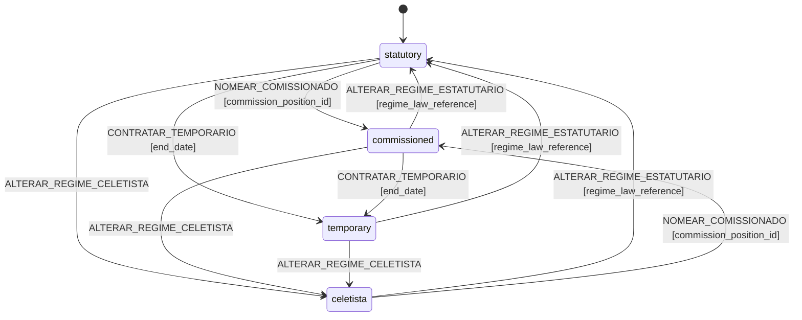
```mermaid
stateDiagram-v2
    [*] --> statutory
    statutory --> commissioned : NOMEAR_COMISSIONADO [commission_position_id]
    statutory --> temporary : CONTRATAR_TEMPORARIO [end_date]
    statutory --> celetista : ALTERAR_REGIME_CELETISTA
    celetista --> statutory : ALTERAR_REGIME_ESTATUTARIO [regime_law_reference]
    celetista --> commissioned : NOMEAR_COMISSIONADO [commission_position_id]
    commissioned --> statutory : ALTERAR_REGIME_ESTATUTARIO [regime_law_reference]
    commissioned --> celetista : ALTERAR_REGIME_CELETISTA
    commissioned --> temporary : CONTRATAR_TEMPORARIO [end_date]
    temporary --> statutory : ALTERAR_REGIME_ESTATUTARIO [regime_law_reference]
    temporary --> celetista : ALTERAR_REGIME_CELETISTA
```

---

## 1. Competência

**Agregado:** `competencia` (tenant_id, mes, ano)
**Bounded context:** `folha`

### 1.1 Estados

| Enum | Descrição |
|---|---|
| `aberta` | Período liberado para criação e cálculo de folha |
| `programada_fechar` | Fechamento futuro agendado |
| `em_processamento` | Rotina de fechamento em execução (transição assíncrona) |
| `fechada` | Folhas bloqueadas; somente leitura histórica |
| `reaberta` | Reabertura para correção (ex-`fechada`) |
| `em_reprocessamento` | Recálculo total em andamento após reabertura |
| `refechada` | Segundo fechamento após reprocessamento |
| `arquivada` | Imutável para consulta histórica de longo prazo |

### 1.2 Transições permitidas

| # | De | Evento | Guarda | Efeito | Para |
|---|---|---|---|---|---|
| T1 | *(início)* | `ABRIR_COMPETENCIA` | mês/ano não existe no tenant | cria registro; `data_abertura = now()` | `aberta` |
| T2 | `aberta` | `PROGRAMAR_FECHAMENTO` | `data_programada > today` | persiste `data_programada_fechamento` | `programada_fechar` |
| T3 | `programada_fechar` | `CANCELAR_PROGRAMACAO` | laudo ainda em `aberta` | remove data programada | `aberta` |
| T4 | `programada_fechar` | `job: daily:competencia-programada-fechamento` | `today >= data_programada_fechamento` | idem T5 | `em_processamento` |
| T5 | `aberta` | `FECHAR_IMEDIATO` | — | bloqueia todas as folhas; emite `folha.competencia.fechamento_iniciado` | `em_processamento` |
| T6 | `em_processamento` | `folha.competencia.fechamento_concluido` *(SIS)* | todas folhas `BLOQUEADO` | emite `folha.competencia.fechada` | `fechada` |
| T7 | `em_processamento` | `folha.competencia.fechamento_erro` *(SIS)* | erro irrecuperável | emite `folha.competencia.erro`; alerta operador | `aberta` *(compensação)* |
| T8 | `fechada` | `REABRIR_COMPETENCIA` | GF solicitante; competência imediatamente anterior | desbloqueia folhas; emite `folha.competencia.reaberta` | `reaberta` |
| T9 | `reaberta` | `INICIAR_REPROCESSAMENTO` | GF | enfileira `folha.calculo.solicitada` para todas as folhas | `em_reprocessamento` |
| T10 | `em_reprocessamento` | `folha.reprocessamento.concluido` *(SIS)* | — | emite `folha.competencia.refechada` | `refechada` |
| T11 | `refechada` | `ARQUIVAR` | GF; competência com ≥ 12 meses de `refechada` | imutabiliza registro | `arquivada` |
| T12 | `fechada` | `ARQUIVAR` | idem T11 | idem | `arquivada` |

### 1.3 Invariantes por estado

- `aberta` → pode ter N folhas em qualquer situação exceto nenhuma com `BLOQUEADO`.
- `fechada` / `refechada` / `arquivada` → todas as folhas filhas com `status = BLOQUEADO`.
- `arquivada` → nenhuma transição possível.

### 1.4 Papéis por transição

| Evento | Papéis |
|---|---|
| ABRIR_COMPETENCIA | GF |
| PROGRAMAR_FECHAMENTO / CANCELAR | GF |
| FECHAR_IMEDIATO / REABRIR | GF |
| ARQUIVAR | GF |
| Fechamento automático | SIS (job `daily:competencia-programada-fechamento`) |

### 1.5 Efeitos colaterais

- `folha.competencia.fechada` → job `daily:controle-anual-afastamentos` atualiza o mês.
- `folha.competencia.reaberta` → todas as folhas da competência voltam a `DESBLOQUEADO`.
- `folha.competencia.fechada` → habilita geração de DIRF e SIPREV do mês.

### 1.6 Diagrama

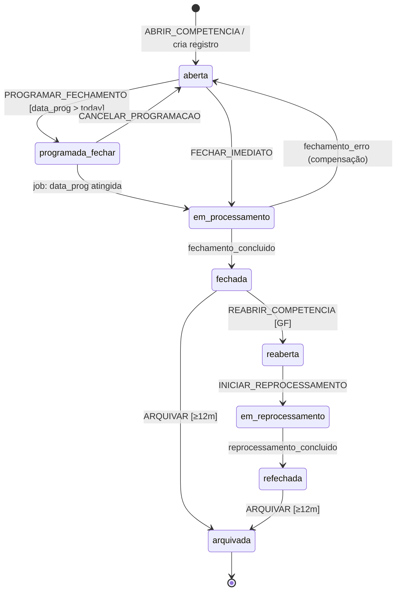
```mermaid
stateDiagram-v2
    [*] --> aberta : ABRIR_COMPETENCIA / cria registro
    aberta --> programada_fechar : PROGRAMAR_FECHAMENTO [data_prog > today]
    programada_fechar --> aberta : CANCELAR_PROGRAMACAO
    programada_fechar --> em_processamento : job: data_prog atingida
    aberta --> em_processamento : FECHAR_IMEDIATO
    em_processamento --> fechada : fechamento_concluido
    em_processamento --> aberta : fechamento_erro (compensação)
    fechada --> reaberta : REABRIR_COMPETENCIA [GF]
    reaberta --> em_reprocessamento : INICIAR_REPROCESSAMENTO
    em_reprocessamento --> refechada : reprocessamento_concluido
    fechada --> arquivada : ARQUIVAR [≥12m]
    refechada --> arquivada : ARQUIVAR [≥12m]
    arquivada --> [*]
```

### 1.7 Exemplo concreto — Janeiro/2026

| Data | Evento | Estado |
|---|---|---|
| 02/01/2026 | GF abre competência 01/2026 | `aberta` |
| 10/01/2026 | GF programa fechamento para 31/01 | `programada_fechar` |
| 31/01/2026 00:05 | Job executa fechamento | `em_processamento` |
| 31/01/2026 00:47 | Todas as folhas bloqueadas | `fechada` |
| 05/02/2026 | GF reabre para corrigir contracheque de afastamento | `reaberta` |
| 05/02/2026 | GF inicia reprocessamento | `em_reprocessamento` |
| 05/02/2026 02:00 | Reprocessamento concluído | `refechada` |
| 01/03/2027 | GF arquiva após 12 meses | `arquivada` |

---

## 2. Folha de Pagamento

**Agregado:** `folha_pagamento` (competencia_id, empresa_matriz_id, filial_id, tipo_processamento_id)
**Chave composta:** (competência × filial × tipo_processamento)
**Bounded context:** `folha`

### 2.1 Estados

| Enum | Eixo | Descrição |
|---|---|---|
| `rascunho` | status | Folha criada, sem cálculo |
| `calculada` | situacao | Cálculo concluído com sucesso |
| `em_calculo` | situacao | Cálculo em andamento |
| `conferida` | situacao | Relatórios conferidos pelo analista |
| `aprovada` | status | Gestor aprovou resultado |
| `paga` | status | Remessa bancária enviada |
| `contabilizada` | status | Contabilidade encerrou o mês |
| `bloqueada` | status | Competência fechou; folha imutável |
| `erro` | situacao | Cálculo com falha irrecuperável |
| `excluindo` | situacao | Exclusão assíncrona em andamento |

> **Nota:** O legado separa `status` (administrativo) de `situacao` (processamento). O novo modelo unifica em estado canônico para clareza; os campos físicos `status` e `situacao` permanecem na tabela por retrocompatibilidade de relatórios.

### 2.2 Transições

| # | De | Evento | Guarda | Efeito | Para |
|---|---|---|---|---|---|
| T1 | *(início)* | `CRIAR_FOLHA` | competência `aberta`; (filial × tipo) inexistente | cria registro `PENDENTE/DESBLOQUEADO`; emite `folha.criada` | `rascunho` |
| T2 | `rascunho` | `CALCULAR_LOTE` | folha `DESBLOQUEADO`; ≥1 contracheque | enfileira `folha.calculo.solicitada` | `em_calculo` |
| T3 | `rascunho` | `INCLUIR_SERVIDOR` | folha `DESBLOQUEADO`; servidor elegível | adiciona contracheque; enfileira cálculo individual | `rascunho` |
| T4 | `em_calculo` | `folha.calculo.concluida` *(SIS)* | todos contracheques `CONCLUIDO` | emite `folha.calculada` | `calculada` |
| T5 | `em_calculo` | `folha.calculo.erro` *(SIS)* | ≥1 contracheque `ERRO` sem retry | emite `folha.erro`; notifica GF | `erro` |
| T6 | `calculada` | `CONFERIR` | GF/AF | marca `data_conferencia`; emite `folha.conferida` | `conferida` |
| T7 | `conferida` | `APROVAR` | GF | emite `folha.aprovada` | `aprovada` |
| T8 | `aprovada` | `GERAR_REMESSA` | GF; integração bancária configurada | enfileira `remessa.gerar`; emite `folha.remessa_gerada` | `paga` |
| T9 | `paga` | `CONTABILIZAR` | GF | emite `folha.contabilizada` | `contabilizada` |
| T10 | `contabilizada` OU `paga` OU `aprovada` | `BLOQUEAR` *(SIS: competência fechou)* | competência `fechada` | emite `folha.bloqueada` | `bloqueada` |
| T11 | `calculada` | `REPROCESSAR_TOTAL` | GF; folha `DESBLOQUEADO` | reenfileira cálculo de todos; emite `folha.reprocessamento_iniciado` | `em_calculo` |
| T12 | `calculada` OU `erro` | `REPROCESSAR_PENDENTES` | GF | reenfileira somente contracheques `PENDENTE/ERRO` | `em_calculo` |
| T13 | `bloqueada` | `DESBLOQUEAR` *(SIS: competência reaberta)* | competência `reaberta` | emite `folha.desbloqueada` | `rascunho` |
| T14 | `rascunho` | `EXCLUIR_FOLHA` | GF; competência `aberta`; status `DESBLOQUEADO` | deleta contracheques; emite `folha.excluindo` | `excluindo` |
| T15 | `excluindo` | `folha.exclusao_concluida` *(SIS)* | — | registro removido | *(fim)* |

### 2.3 Invariantes por estado

- `bloqueada` → nenhuma inclusão, lançamento, remoção ou recálculo permitido.
- `em_calculo` → nenhum lançamento manual aceito (lock otimista).
- `rascunho` → exige competência `aberta` para qualquer mutação.

### 2.4 Papéis

| Ação | Papéis |
|---|---|
| CRIAR / EXCLUIR | GF |
| CALCULAR / REPROCESSAR | GF |
| CONFERIR | GF, AF |
| APROVAR | GF |
| GERAR_REMESSA / CONTABILIZAR | GF |
| Bloquear/Desbloquear | SIS |

### 2.5 Efeitos colaterais

- `folha.calculada` → dispara geração em massa de PDF de contracheques (`contracheque.gerar.pdf`).
- `folha.aprovada` → habilita impressão oficial sem marca d'água.
- `folha.remessa_gerada` → `sgp-integrations-worker` gera arquivo CNAB.
- `folha.contabilizada` → alimenta `relatorio_financeiro` com status `SALVO`.
- Em qualquer transição sensível → `audit.evento.criado` gravado em `audit_log`.

### 2.6 Compensações e falha

- `em_calculo` → `erro` : job de retry até 3 tentativas com backoff exponencial; após limite emite `folha.calculo.falha_permanente` → notificação ao GF.
- `excluindo` → falha : rollback; estado retorna a `rascunho`; emite `folha.exclusao_falhou`.

### 2.7 Diagrama

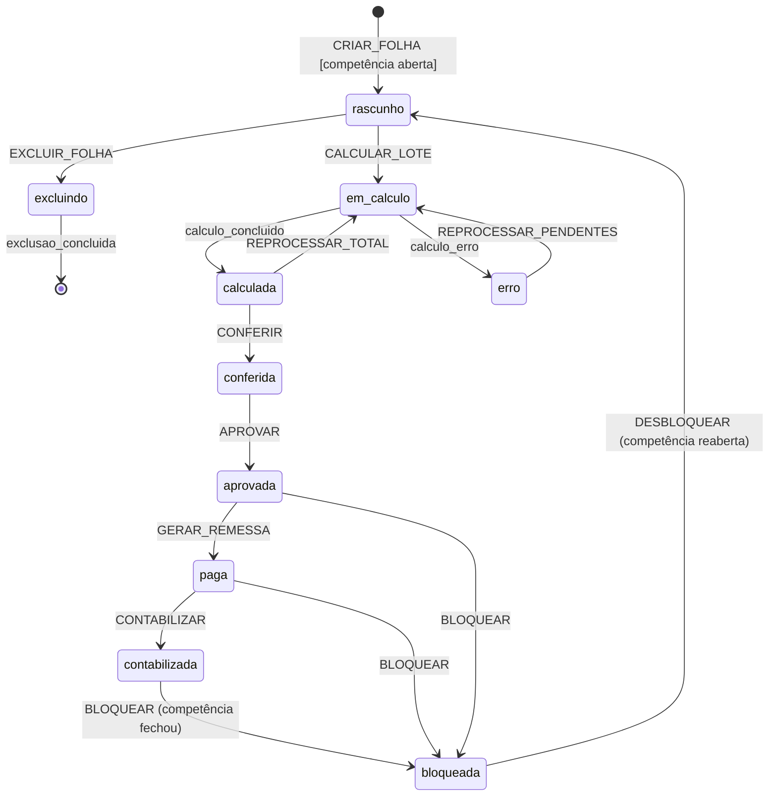
```mermaid
stateDiagram-v2
    [*] --> rascunho : CRIAR_FOLHA [competência aberta]
    rascunho --> em_calculo : CALCULAR_LOTE
    rascunho --> excluindo : EXCLUIR_FOLHA
    excluindo --> [*] : exclusao_concluida
    em_calculo --> calculada : calculo_concluido
    em_calculo --> erro : calculo_erro
    erro --> em_calculo : REPROCESSAR_PENDENTES
    calculada --> em_calculo : REPROCESSAR_TOTAL
    calculada --> conferida : CONFERIR
    conferida --> aprovada : APROVAR
    aprovada --> paga : GERAR_REMESSA
    paga --> contabilizada : CONTABILIZAR
    contabilizada --> bloqueada : BLOQUEAR (competência fechou)
    paga --> bloqueada : BLOQUEAR
    aprovada --> bloqueada : BLOQUEAR
    bloqueada --> rascunho : DESBLOQUEAR (competência reaberta)
```

### 2.8 Exemplo concreto — Folha Mensal 01/2026, Filial Centro

| Data | Evento | Estado |
|---|---|---|
| 02/01 09:00 | GF cria folha MENSAL / filial Centro | `rascunho` |
| 02/01 09:30 | AF inclui 3 servidores tardios | `rascunho` |
| 03/01 08:00 | GF dispara cálculo em lote | `em_calculo` |
| 03/01 10:15 | Payroll engine conclui todos os contracheques | `calculada` |
| 10/01 | AF confere relatórios e bate números | `conferida` |
| 28/01 | GF aprova resultado | `aprovada` |
| 29/01 | GF gera remessa CNAB ao banco | `paga` |
| 31/01 | GF contabiliza | `contabilizada` |
| 31/01 00:47 | SIS: competência fechou | `bloqueada` |

---

## 3. Contracheque

**Agregado:** `contracheque` (folha_pagamento_id, funcionario_id | pensionista_id)
**Particionado:** por (ano, mes) da competência
**Bounded context:** `folha`

### 3.1 Estados

| Enum | Descrição |
|---|---|
| `draft` | Contracheque criado, cálculo não iniciado |
| `em_calculo` | Engine processando |
| `gerado` | Cálculo concluído com sucesso |
| `erro_calculo` | Falha no cálculo; contém `memoria_calculo` com diagnóstico |
| `disponibilizado_portal` | Visível no Portal do Servidor |
| `impresso` | PDF emitido oficialmente (sem marca d'água) |
| `republicado` | Reemitido após correção de dado ou retificação |

### 3.2 Transições

| # | De | Evento | Guarda | Efeito | Para |
|---|---|---|---|---|---|
| T1 | *(criação pela folha)* | `CONTRACHEQUE_CRIADO` | — | — | `draft` |
| T2 | `draft` | `CALCULAR` *(SIS)* | folha `DESBLOQUEADO` | `sgp-payroll-engine` executa fórmulas SQL | `em_calculo` |
| T3 | `em_calculo` | `calculo_concluido` *(SIS)* | todos os lançamentos ok | persiste lançamentos; emite `contracheque.calculado` | `gerado` |
| T4 | `em_calculo` | `calculo_erro` *(SIS)* | falha de fórmula | persiste `memoria_calculo` com stack do erro | `erro_calculo` |
| T5 | `erro_calculo` | `RECALCULAR` | GF; folha `DESBLOQUEADO` | reenfileira cálculo | `em_calculo` |
| T6 | `gerado` | `DISPONIBILIZAR_PORTAL` | folha `aprovada`; `PORTAL_SERVIDOR_ENABLED = true` | emite `contracheque.disponibilizado`; notifica servidor | `disponibilizado_portal` |
| T7 | `gerado` OU `disponibilizado_portal` | `IMPRIMIR` | GF/AF | gera PDF sem marca d'água; persiste `s3_key`; emite `contracheque.impresso` | `impresso` |
| T8 | `impresso` | `REPUBLICAR` | GF; justificativa obrigatória | regera PDF; incrementa `versao`; emite `contracheque.republicado` | `republicado` |
| T9 | `gerado` *(preview)* | `IMPRIMIR_RASCUNHO` | AF | gera PDF com marca d'água; não altera estado | `gerado` |

### 3.3 Invariantes

- `impresso` / `republicado` → PDF permanente em S3; chave determinística `{tenant}/outputs/folha/{ano}/{mes}/{id}.pdf`.
- Contracheque de folha `bloqueada` → somente leitura; nenhuma transição exceto `REPUBLICAR` com aprovação especial de GF.

### 3.4 Efeitos colaterais

- `contracheque.disponibilizado` → push notification + e-mail via módulo `notificacoes`.
- `contracheque.impresso` → audit_log com diff JSONB.
- `contracheque.republicado` → audit_log com justificativa e versão anterior.

### 3.5 Diagrama

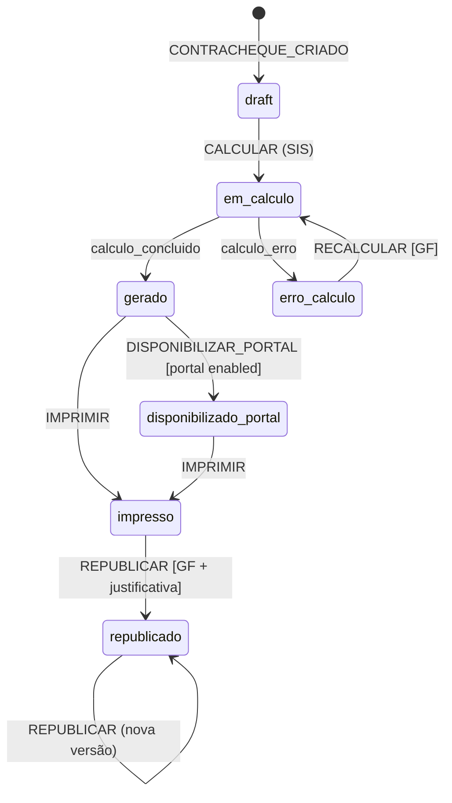
```mermaid
stateDiagram-v2
    [*] --> draft : CONTRACHEQUE_CRIADO
    draft --> em_calculo : CALCULAR (SIS)
    em_calculo --> gerado : calculo_concluido
    em_calculo --> erro_calculo : calculo_erro
    erro_calculo --> em_calculo : RECALCULAR [GF]
    gerado --> disponibilizado_portal : DISPONIBILIZAR_PORTAL [portal enabled]
    gerado --> impresso : IMPRIMIR
    disponibilizado_portal --> impresso : IMPRIMIR
    impresso --> republicado : REPUBLICAR [GF + justificativa]
    republicado --> republicado : REPUBLICAR (nova versão)
```

---

## 4. Lançamento

**Agregado:** `lancamento` (contracheque_id, verba_id)
**Particionado:** junto de contracheque
**Bounded context:** `folha`

### 4.1 Estados

| Enum | Descrição |
|---|---|
| `provisorio` | Lançamento manual ou importado antes de cálculo |
| `validado` | Passou pela checagem de elegibilidade e valor |
| `efetivado` | Integrado ao contracheque calculado |
| `estornado` | Revertido por correção ou reimportação saneadora |

### 4.2 Transições

| # | De | Evento | Guarda | Efeito | Para |
|---|---|---|---|---|---|
| T1 | *(inclusão)* | `INCLUIR_LANCAMENTO` | verba elegível para o vínculo; valor > 0 | cria registro; emite `lancamento.incluido` | `provisorio` |
| T2 | `provisorio` | `VALIDAR` *(SIS: pré-cálculo)* | elegibilidade ok; limites respeitados | — | `validado` |
| T3 | `provisorio` | `REJEITAR_VALIDACAO` *(SIS)* | elegibilidade falhou | emite `lancamento.rejeitado`; bloqueia contracheque | `provisorio` *(não avança)* |
| T4 | `validado` | `EFETIVAR` *(SIS: cálculo concluído)* | — | persiste `valor_calculado`; emite `lancamento.efetivado` | `efetivado` |
| T5 | `efetivado` | `ESTORNAR` | GF; folha `DESBLOQUEADO` OU importação saneadora | inverte valor; emite `lancamento.estornado` | `estornado` |
| T6 | `provisorio` | `REMOVER` | GF; folha `DESBLOQUEADO` | exclui registro | *(fim)* |

### 4.3 Invariantes

- `efetivado` → `valor_calculado != 0`; somente leitura exceto estorno.
- Importação saneadora estorna todos os lançamentos `IMPORTADO` anteriores antes de inserir novos.

### 4.4 Papéis

| Ação | Papéis |
|---|---|
| INCLUIR / REMOVER | GF, AF |
| VALIDAR / EFETIVAR | SIS |
| ESTORNAR | GF |

### 4.5 Diagrama

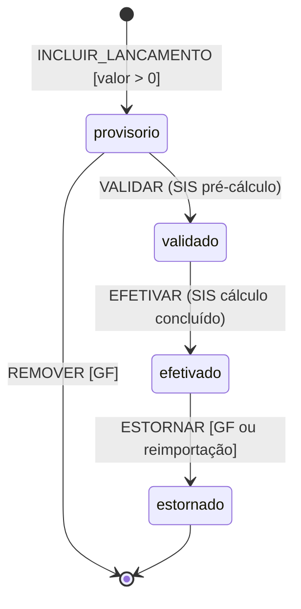
```mermaid
stateDiagram-v2
    [*] --> provisorio : INCLUIR_LANCAMENTO [valor > 0]
    provisorio --> validado : VALIDAR (SIS pré-cálculo)
    provisorio --> [*] : REMOVER [GF]
    validado --> efetivado : EFETIVAR (SIS cálculo concluído)
    efetivado --> estornado : ESTORNAR [GF ou reimportação]
    estornado --> [*]
```

---

## 5. Lote de Importação

**Agregado:** `lote_importacao` (competencia_id, tipo ∈ {LANCAMENTO_MANUAL, VERBA_SERVIDOR, VERBA_PENSIONISTA, CONSIGNADO})
**Bounded context:** `folha`

### 5.1 Estados

| Enum | Descrição |
|---|---|
| `recebido` | Arquivo S3 salvo; ainda não processado |
| `em_validacao` | Worker validando leiaute e regras de negócio |
| `validado_com_erros` | Arquivo parcialmente válido; erros por linha disponíveis |
| `rejeitado` | Erro crítico ou leiaute inválido; nenhum registro importável |
| `aprovado` | Validação ok; aguarda confirmação do operador |
| `em_processamento` | Worker aplicando registros ao domínio |
| `processado` | Todos os registros aplicados |
| `processado_parcialmente` | Alguns registros aplicados; pendências identificadas |
| `arquivado` | Histórico imutável |

### 5.2 Transições

| # | De | Evento | Guarda | Efeito | Para |
|---|---|---|---|---|---|
| T1 | *(upload)* | `UPLOAD_ARQUIVO` | S3 upload ok | persiste `s3_key`; emite `importacao.recebida` | `recebido` |
| T2 | `recebido` | `INICIAR_VALIDACAO` *(SIS)* | — | worker valida leiaute e regras | `em_validacao` |
| T3 | `em_validacao` | `validacao_concluida_ok` *(SIS)* | zero erros | emite `importacao.aprovada` | `aprovado` |
| T4 | `em_validacao` | `validacao_concluida_parcial` *(SIS)* | ≥1 erro por linha | persiste lista de erros | `validado_com_erros` |
| T5 | `em_validacao` | `validacao_falhou` *(SIS)* | leiaute inválido | emite `importacao.rejeitada` | `rejeitado` |
| T6 | `validado_com_erros` | `APROVAR_PARCIAL` | GF; ciente dos erros | — | `aprovado` |
| T7 | `validado_com_erros` | `REJEITAR` | GF | emite `importacao.rejeitada` | `rejeitado` |
| T8 | `aprovado` | `CONFIRMAR_IMPORTACAO` | GF | worker aplica registros; emite `importacao.processamento_iniciado` | `em_processamento` |
| T9 | `em_processamento` | `processamento_concluido` *(SIS)* | 100% ok | emite `importacao.processada` | `processado` |
| T10 | `em_processamento` | `processamento_parcial` *(SIS)* | pendências restantes | emite `importacao.processada_parcialmente` | `processado_parcialmente` |
| T11 | `processado_parcialmente` | `REIMPORTAR_PENDENTES` | GF | reenfileira pendências | `em_processamento` |
| T12 | `processado` OU `rejeitado` | `ARQUIVAR` *(SIS: competência fechada)* | — | imutabiliza | `arquivado` |

### 5.3 Efeitos colaterais

- `importacao.processada` (tipo VERBA_SERVIDOR) → estorna lançamentos importados anteriores (comportamento saneador).
- `importacao.processada` (tipo CONSIGNADO) → cria/atualiza lançamentos de desconto no contracheque.

### 5.4 Diagrama

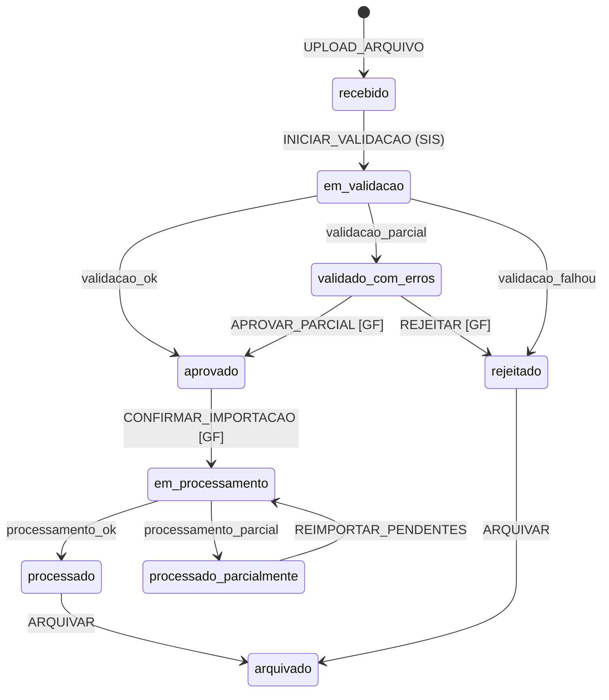
```mermaid
stateDiagram-v2
    [*] --> recebido : UPLOAD_ARQUIVO
    recebido --> em_validacao : INICIAR_VALIDACAO (SIS)
    em_validacao --> aprovado : validacao_ok
    em_validacao --> validado_com_erros : validacao_parcial
    em_validacao --> rejeitado : validacao_falhou
    validado_com_erros --> aprovado : APROVAR_PARCIAL [GF]
    validado_com_erros --> rejeitado : REJEITAR [GF]
    aprovado --> em_processamento : CONFIRMAR_IMPORTACAO [GF]
    em_processamento --> processado : processamento_ok
    em_processamento --> processado_parcialmente : processamento_parcial
    processado_parcialmente --> em_processamento : REIMPORTAR_PENDENTES
    processado --> arquivado : ARQUIVAR
    rejeitado --> arquivado : ARQUIVAR
```

---

## 6. Evento eSocial

**Agregado:** `evento_esocial` (tipo_evento, referencia_id, versao_leiaute = S-1.2)
**Bounded context:** `integracoes` / `sgp-esocial-worker`

### 6.1 Estados

| Enum | Descrição |
|---|---|
| `pendente` | Evento gerado; aguarda envio |
| `em_envio` | Step Function `esocial-envio` em execução |
| `aceito` | Recibo emitido pelo Governo Federal |
| `rejeitado` | Erros de schema ou regra de negócio retornados |
| `substituido` | Versão corrigida enviada e aceita |
| `excluido` | S-3000 enviado e aceito |

### 6.2 Transições

| # | De | Evento | Guarda | Efeito | Para |
|---|---|---|---|---|---|
| T1 | *(geração)* | `GERAR_EVENTO` | `esocial.enabled = true`; dados válidos | persiste XML; emite `esocial.evento.pendente` | `pendente` |
| T2 | `pendente` | `INICIAR_ENVIO` *(SIS)* | — | Step Function inicia; assina XML com certificado A1 | `em_envio` |
| T3 | `em_envio` | `retorno_aceito` *(SIS)* | recibo válido | persiste `numero_recibo`; emite `esocial.aceito` | `aceito` |
| T4 | `em_envio` | `retorno_rejeitado` *(SIS)* | ocorrências de erro | persiste erros; emite `esocial.rejeitado`; retry ≤3 | `rejeitado` |
| T5 | `rejeitado` | `CORRIGIR_E_REENVIAR` | GF; falha corrigida | gera nova versão XML; volta T2 | `pendente` |
| T6 | `aceito` | `SUBSTITUIR` | GF; evento S-1.2 de retificação | gera S-evento com `{indRetif = S}`; volta T2 | `pendente` |
| T7 | `aceito` | `EXCLUIR` | GF; prazo legal | gera S-3000; emite `esocial.exclusao_solicitada` | `em_envio` |
| T8 | `em_envio` *(exclusão)* | `retorno_exclusao_aceita` *(SIS)* | — | emite `esocial.excluido` | `excluido` |

### 6.3 Compensações

- Após 3 rejeições consecutivas do mesmo evento: emite `esocial.falha_critica`; abre alerta no painel de auditoria.
- Timeout na Step Function (> 24h sem resposta do Governo): retorna a `pendente` para reenvio manual.

### 6.4 Diagrama

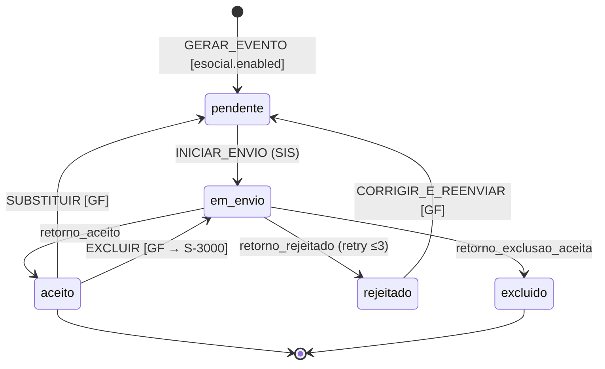
```mermaid
stateDiagram-v2
    [*] --> pendente : GERAR_EVENTO [esocial.enabled]
    pendente --> em_envio : INICIAR_ENVIO (SIS)
    em_envio --> aceito : retorno_aceito
    em_envio --> rejeitado : retorno_rejeitado (retry ≤3)
    rejeitado --> pendente : CORRIGIR_E_REENVIAR [GF]
    aceito --> pendente : SUBSTITUIR [GF]
    aceito --> em_envio : EXCLUIR [GF → S-3000]
    em_envio --> excluido : retorno_exclusao_aceita
    aceito --> [*]
    excluido --> [*]
```

---

## 7. Requisição de Pessoal

**Agregado:** `requisicao_pessoal`
**Bounded context:** `recrutamento`

### 7.1 Estados

| Enum | Descrição |
|---|---|
| `rascunho` | Criada pelo solicitante; editável |
| `aberta` | Encaminhada ao RH; solicitante não pode mais editar |
| `em_aprovacao` | RH em análise (renomeia legado `em_processo`) |
| `aprovada` | RH aprovou; captação liberada |
| `em_captacao` | RH vinculando candidatos e currículos |
| `em_selecao` | Análise curricular formal em andamento |
| `concluida` | Análise encerrada; solicitante notificado |
| `cancelada` | Encerrada sem atendimento |
| `rejeitada` | RH rejeitou a demanda |

### 7.2 Transições

| # | De | Evento | Guarda | Efeito | Para |
|---|---|---|---|---|---|
| T1 | *(criação)* | `CRIAR_REQUISICAO` | SOL autenticado; ≥1 funcao_requisitada | cria rascunho; emite `requisicao.criada` | `rascunho` |
| T2 | `rascunho` | `ENCAMINHAR` | SOL; justificativa + data_limite informados | emite `requisicao.encaminhada`; notifica RH por e-mail | `aberta` |
| T3 | `aberta` | `RECEBER_NO_RH` *(SIS / GRH)* | — | muda para fila GRH | `em_aprovacao` |
| T4 | `em_aprovacao` | `APROVAR` | GRH | emite `requisicao.aprovada`; notifica SOL | `aprovada` |
| T5 | `em_aprovacao` | `REJEITAR` | GRH | emite `requisicao.rejeitada`; notifica SOL | `rejeitada` |
| T6 | `em_aprovacao` | `CANCELAR` | GRH | emite `requisicao.cancelada` | `cancelada` |
| T7 | `aprovada` | `INICIAR_CAPTACAO` | GRH | — | `em_captacao` |
| T8 | `em_captacao` | `VINCULAR_CANDIDATO` | GRH; candidato_requisicao criado | cria `candidato_requisicao` em `inscrito` | `em_captacao` |
| T9 | `em_captacao` | `INICIAR_SELECAO` | GRH; ≥1 candidato vinculado | — | `em_selecao` |
| T10 | `em_selecao` | `CONCLUIR_ANALISE` | GRH; todos candidatos com parecer | emite `requisicao.concluida`; notifica SOL | `concluida` |
| T11 | `rascunho` | `CANCELAR` | SOL | emite `requisicao.cancelada` | `cancelada` |
| T12 | `aberta` | `CANCELAR` | SOL | idem | `cancelada` |

### 7.3 Invariantes

- `rascunho` → só o SOL criador pode editar e excluir.
- `cancelada` / `rejeitada` / `concluida` → terminal; nenhuma transição possível.
- Substituição exige `colaborador_substituido_id` preenchido.

### 7.4 Efeitos colaterais

- `requisicao.encaminhada` → e-mail para RH (módulo `notificacoes`).
- `requisicao.aprovada` / `rejeitada` / `concluida` → e-mail para SOL.
- `requisicao.concluida` → gera relatório de R&S para o processo.

### 7.5 Diagrama

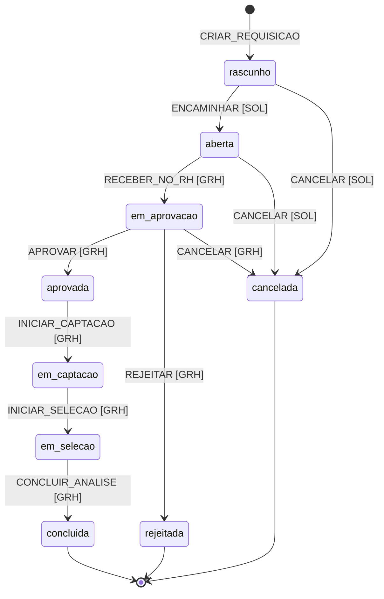
```mermaid
stateDiagram-v2
    [*] --> rascunho : CRIAR_REQUISICAO
    rascunho --> aberta : ENCAMINHAR [SOL]
    rascunho --> cancelada : CANCELAR [SOL]
    aberta --> em_aprovacao : RECEBER_NO_RH [GRH]
    aberta --> cancelada : CANCELAR [SOL]
    em_aprovacao --> aprovada : APROVAR [GRH]
    em_aprovacao --> rejeitada : REJEITAR [GRH]
    em_aprovacao --> cancelada : CANCELAR [GRH]
    aprovada --> em_captacao : INICIAR_CAPTACAO [GRH]
    em_captacao --> em_selecao : INICIAR_SELECAO [GRH]
    em_selecao --> concluida : CONCLUIR_ANALISE [GRH]
    concluida --> [*]
    cancelada --> [*]
    rejeitada --> [*]
```

---

## 8. Candidato na Vaga

**Agregado:** `candidato_requisicao` (requisicao_id, pessoa_id)
**Bounded context:** `recrutamento`

### 8.1 Estados

| Enum | Descrição |
|---|---|
| `inscrito` | Candidato vinculado pelo RH; currículo anexado |
| `triado` | Triagem inicial realizada |
| `aprovado_curricular` | Currículo aprovado na análise formal |
| `convocado` | Candidato notificado para entrevista |
| `em_entrevista` | Entrevista em andamento |
| `classificado` | Aprovado na entrevista; posição no ranking |
| `nomeado` | Admitido / nomeado para o cargo |
| `desistente` | Candidato desistiu do processo |
| `reprovado` | Reprovado em qualquer etapa |

### 8.2 Transições

| # | De | Evento | Guarda | Efeito | Para |
|---|---|---|---|---|---|
| T1 | *(vínculo)* | `VINCULAR` | requisição `em_captacao`; currículo S3 anexado | emite `candidato.inscrito` | `inscrito` |
| T2 | `inscrito` | `TRIAR` | GRH | registra comentário inicial | `triado` |
| T3 | `triado` | `APROVAR_CURRICULO` | GRH; comentário obrigatório | emite `candidato.aprovado_curriculo` | `aprovado_curricular` |
| T4 | `triado` | `REPROVAR` | GRH; comentário obrigatório | emite `candidato.reprovado` | `reprovado` |
| T5 | `aprovado_curricular` | `CONVOCAR` | GRH | emite `candidato.convocado`; notifica candidato | `convocado` |
| T6 | `convocado` | `INICIAR_ENTREVISTA` | GRH | — | `em_entrevista` |
| T7 | `em_entrevista` | `CLASSIFICAR` | GRH; nota/posição informada | emite `candidato.classificado` | `classificado` |
| T8 | `classificado` | `NOMEAR` | GRH; aprovação superior | emite `candidato.nomeado` | `nomeado` |
| T9 | qualquer ativo | `DESISTIR` | candidato ou GRH | emite `candidato.desistente` | `desistente` |
| T10 | `em_entrevista` | `REPROVAR` | GRH | emite `candidato.reprovado` | `reprovado` |
| T11 | `inscrito` | `REMOVER` | GRH; requisição `em_captacao` | remove currículo S3; exclui registro | *(fim)* |

### 8.3 Diagrama

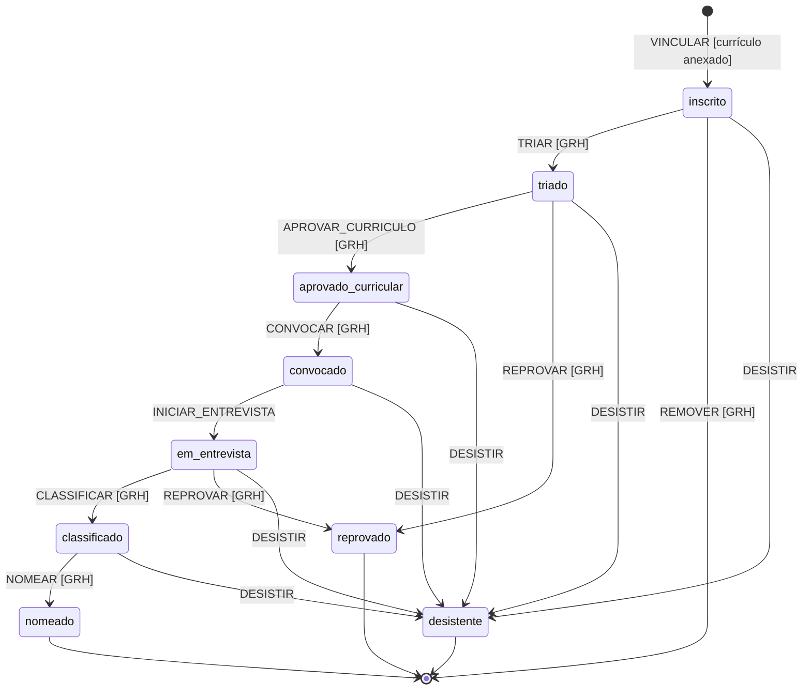
```mermaid
stateDiagram-v2
    [*] --> inscrito : VINCULAR [currículo anexado]
    inscrito --> triado : TRIAR [GRH]
    inscrito --> [*] : REMOVER [GRH]
    triado --> aprovado_curricular : APROVAR_CURRICULO [GRH]
    triado --> reprovado : REPROVAR [GRH]
    aprovado_curricular --> convocado : CONVOCAR [GRH]
    convocado --> em_entrevista : INICIAR_ENTREVISTA
    em_entrevista --> classificado : CLASSIFICAR [GRH]
    em_entrevista --> reprovado : REPROVAR [GRH]
    classificado --> nomeado : NOMEAR [GRH]
    nomeado --> [*]
    reprovado --> [*]
    desistente --> [*]
    inscrito --> desistente : DESISTIR
    triado --> desistente : DESISTIR
    aprovado_curricular --> desistente : DESISTIR
    convocado --> desistente : DESISTIR
    em_entrevista --> desistente : DESISTIR
    classificado --> desistente : DESISTIR
```

---

## 9. Recadastramento (Prova de Vida)

**Agregado:** `beneficiario_recadastramento` + `recadastramento`
**Bounded context:** `previdenciario`

### 9.1 Estados (beneficiário)

| Enum | Descrição |
|---|---|
| `convocado` | Beneficiário na carteira com data de próximo recadastramento futura |
| `perto_vencer` | Menos de 30 dias para o vencimento (`job: daily:prova-vida-proxima-vencer`) |
| `em_atendimento` | Operador abriu o formulário de recadastramento |
| `comprovantes_pendentes` | Atendimento salvo; anexos ainda não enviados |
| `aguardando_validacao` | Dados e comprovantes enviados; aguarda checagem |
| `validado` | Recadastramento concluído e comprovante emitível |
| `rejeitado` | Dados inconsistentes ou comprovante insuficiente |
| `reconvocado` | Recadastramento rejeitado; nova janela aberta |
| `nao_recadastrado` | Prazo ultrapassado sem atendimento |

### 9.2 Transições

| # | De | Evento | Guarda | Efeito | Para |
|---|---|---|---|---|---|
| T1 | *(concessão aposentadoria/pensão)* | `CRIAR_BENEFICIARIO` | beneficiário não existe | `proxima_data = concessao + 6m`; emite `recadastramento.convocado` | `convocado` |
| T2 | `convocado` | `job: daily:prova-vida-proxima-vencer` | `proxima_data - today < 30d` | emite `recadastramento.perto_vencer` | `perto_vencer` |
| T3 | `perto_vencer` OU `convocado` | `job: daily:prova-vida-proxima-vencer` | `today > proxima_data` | emite `recadastramento.nao_recadastrado` | `nao_recadastrado` |
| T4 | qualquer | `INICIAR_ATENDIMENTO` | GR; beneficiário localizado | abre formulário; cria rascunho `recadastramento` | `em_atendimento` |
| T5 | `em_atendimento` | `SALVAR_DADOS` | GR; dados pessoais completos | atualiza cadastro-base; inativa recadastramentos anteriores | `comprovantes_pendentes` |
| T6 | `comprovantes_pendentes` | `ENVIAR_COMPROVANTES` | GR; ≥1 anexo PDF | associa anexos ao `recadastramento` | `aguardando_validacao` |
| T7 | `aguardando_validacao` | `VALIDAR` | GR | emite `recadastramento.validado`; recalcula `proxima_data` | `validado` |
| T8 | `aguardando_validacao` | `REJEITAR` | GR; motivo obrigatório | emite `recadastramento.rejeitado` | `rejeitado` |
| T9 | `rejeitado` | `RECONVOCAR` | GR | abre nova janela; emite `recadastramento.reconvocado` | `reconvocado` |
| T10 | `reconvocado` | `INICIAR_ATENDIMENTO` | GR | idem T4 | `em_atendimento` |
| T11 | `validado` | `job: daily:prova-vida-proxima-vencer` | ciclo seguinte | recalcula próxima data (aposentado: anual; pensionista: semestral) | `convocado` |

### 9.3 Invariantes

- `validado` → comprovante emitível; único estado em que o botão "Comprovante" fica visível.
- Novo `recadastramento` salvo → inativa (`deleted_at`) todos os anteriores do mesmo beneficiário.
- Pensionista universitário: alerta não bloqueante aos 24 anos 11 meses.

### 9.4 Papéis

| Ação | Papéis |
|---|---|
| INICIAR / SALVAR / VALIDAR / REJEITAR / RECONVOCAR | GR |
| CRIAR_BENEFICIARIO | SIS (evento de concessão) |
| Atualizações de status temporais | SIS (`daily:prova-vida-proxima-vencer`) |

### 9.5 Efeitos colaterais

- `recadastramento.validado` → atualiza `pessoa` (nome, endereço, contato, estado civil).
- `recadastramento.nao_recadastrado` → flag potencial de suspensão de pagamento (configurável por tenant; padrão = não bloqueante).
- `recadastramento.validado` → evento disponível para integração pública (`/api/publico/prefeitura/autenticacao`).

### 9.6 Diagrama

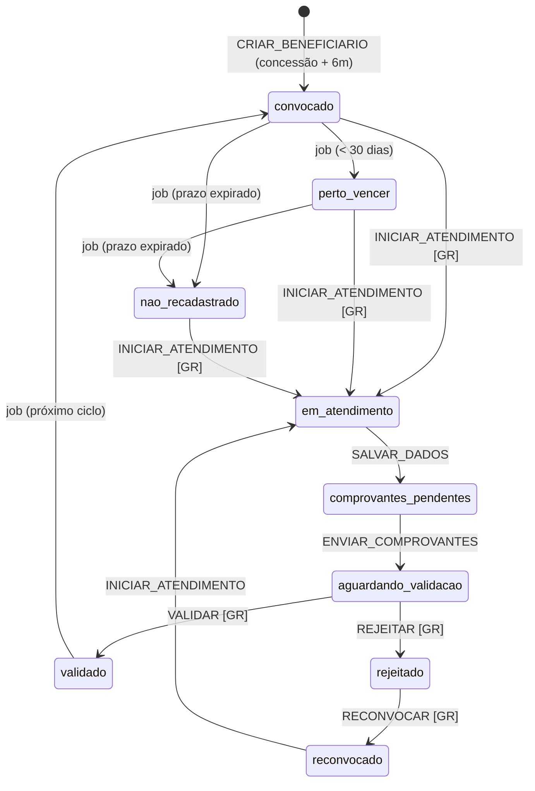
```mermaid
stateDiagram-v2
    [*] --> convocado : CRIAR_BENEFICIARIO (concessão + 6m)
    convocado --> perto_vencer : job (< 30 dias)
    convocado --> nao_recadastrado : job (prazo expirado)
    perto_vencer --> nao_recadastrado : job (prazo expirado)
    convocado --> em_atendimento : INICIAR_ATENDIMENTO [GR]
    perto_vencer --> em_atendimento : INICIAR_ATENDIMENTO [GR]
    nao_recadastrado --> em_atendimento : INICIAR_ATENDIMENTO [GR]
    em_atendimento --> comprovantes_pendentes : SALVAR_DADOS
    comprovantes_pendentes --> aguardando_validacao : ENVIAR_COMPROVANTES
    aguardando_validacao --> validado : VALIDAR [GR]
    aguardando_validacao --> rejeitado : REJEITAR [GR]
    rejeitado --> reconvocado : RECONVOCAR [GR]
    reconvocado --> em_atendimento : INICIAR_ATENDIMENTO
    validado --> convocado : job (próximo ciclo)
```

---

## 10. Agendamento Pericial

**Agregado:** `agendamento_pericia`
**Bounded context:** `saude`

### 10.1 Estados

| Enum | Descrição |
|---|---|
| `agendado` | Vaga reservada; servidor convocado |
| `confirmado` | Servidor confirmou presença |
| `em_atendimento` | Atendimento iniciado no painel diário |
| `concluido` | Atendimento encerrado; licença médica aberta |
| `reagendado` | Nova data definida por decisão clínica ou ausência |
| `faltou` | Servidor não compareceu sem justificativa |
| `cancelado` | Agendamento cancelado administrativamente |

### 10.2 Transições

| # | De | Evento | Guarda | Efeito | Para |
|---|---|---|---|---|---|
| T1 | *(criação)* | `AGENDAR` | servidor `ativo`; janela disponível; especialidade com agenda | reserva `janela_agenda`; emite `agendamento.criado`; notifica servidor | `agendado` |
| T2 | `agendado` | `CONFIRMAR` | servidor ou GM | emite `agendamento.confirmado` | `confirmado` |
| T3 | `agendado` OU `confirmado` | `INICIAR_ATENDIMENTO` | MED ou GM; data = today | — | `em_atendimento` |
| T4 | `em_atendimento` | `CONCLUIR` | MED; licença médica salva | libera janela; emite `agendamento.concluido` | `concluido` |
| T5 | `em_atendimento` | `REGISTRAR_FALTA` | MED ou GM | incrementa contador_faltas do servidor; emite `agendamento.falta_registrada` | `faltou` |
| T6 | `faltou` | `REAGENDAR` | GM; nova janela disponível | cria novo agendamento (T1); emite `agendamento.reagendado` | `reagendado` |
| T7 | `agendado` OU `confirmado` | `CANCELAR` | GM | libera janela; emite `agendamento.cancelado` | `cancelado` |
| T8 | `em_atendimento` | `REAGENDAR` *(por decisão clínica)* | MED; nova especialidade/data | cria novo agendamento; encerra atual | `concluido` *(parcial)* |

### 10.3 Invariantes

- `agendado` → janela reservada (sem outro agendamento no mesmo slot).
- Servidor com status `AGENDADO` não pode receber novo agendamento (verificado em T1).
- `concluido` → comparecimento zera `contador_faltas`.

### 10.4 Papéis

| Ação | Papéis |
|---|---|
| AGENDAR | GM, SIS |
| CONFIRMAR | GM, servidor (portal) |
| INICIAR_ATENDIMENTO / CONCLUIR / REGISTRAR_FALTA | MED, GM |
| REAGENDAR / CANCELAR | GM |

### 10.5 Efeitos colaterais

- `agendamento.concluido` → prontuário `atendimento_medico` aberto automaticamente.
- `agendamento.falta_registrada` → flag do servidor para busca ativa de contato.

### 10.6 Diagrama

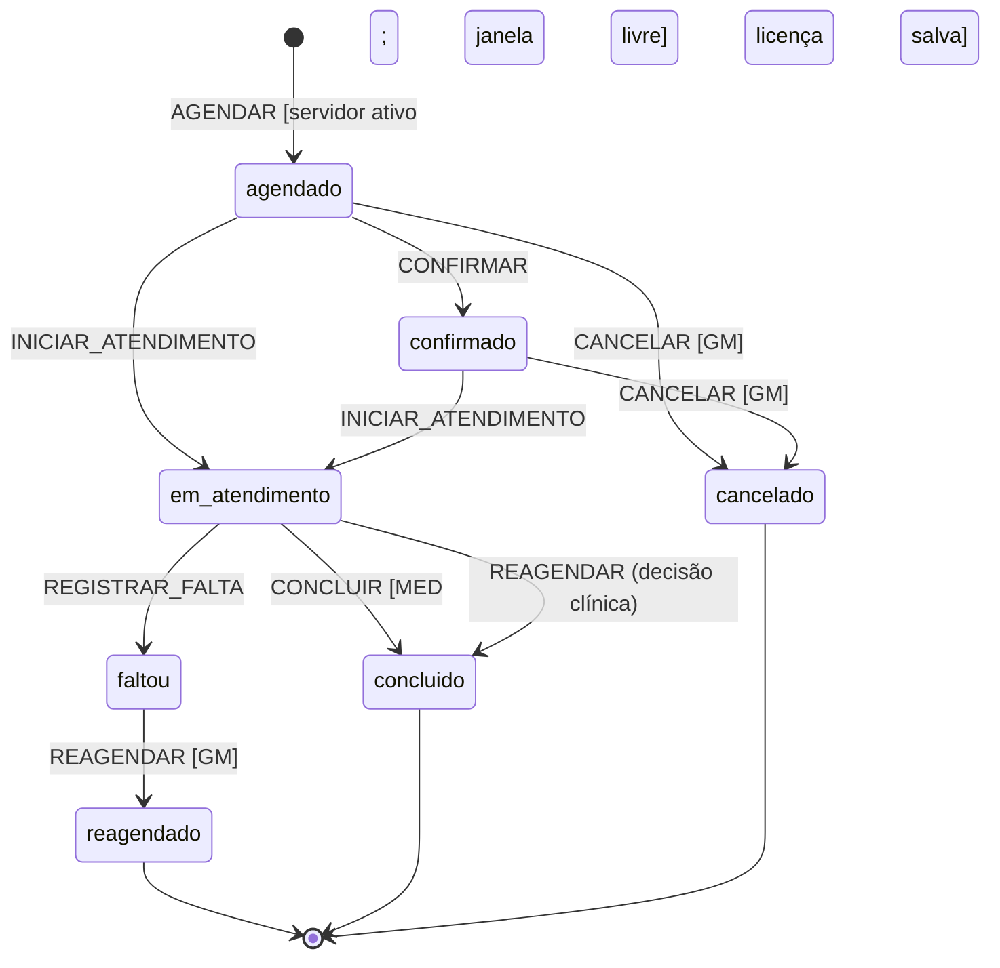
```mermaid
stateDiagram-v2
    [*] --> agendado : AGENDAR [servidor ativo; janela livre]
    agendado --> confirmado : CONFIRMAR
    agendado --> em_atendimento : INICIAR_ATENDIMENTO
    confirmado --> em_atendimento : INICIAR_ATENDIMENTO
    agendado --> cancelado : CANCELAR [GM]
    confirmado --> cancelado : CANCELAR [GM]
    em_atendimento --> concluido : CONCLUIR [MED; licença salva]
    em_atendimento --> faltou : REGISTRAR_FALTA
    em_atendimento --> concluido : REAGENDAR (decisão clínica)
    faltou --> reagendado : REAGENDAR [GM]
    reagendado --> [*]
    concluido --> [*]
    cancelado --> [*]
```

---

## 11. Atendimento Médico / Perícia (Prontuário)

**Agregado:** `prontuario_pericia` (agendamento_id)
**Bounded context:** `saude`

### 11.1 Estados

| Enum | Descrição |
|---|---|
| `aberto` | Prontuário criado; médico iniciou atendimento |
| `em_coleta` | Médico registrando anamnese, CID, exame físico |
| `em_avaliacao` | Diagnóstico e decisão pericial sendo elaborados |
| `laudo_emitido` | Laudo preenchido; enviado ao coordenador (`PENDENTE_VALIDACAO`) |
| `homologado` | Coordenador aprovou (`APROVADO`) |
| `impugnado` | Coordenador rejeitou (`REPROVADO`); devolvido para ajuste |

### 11.2 Transições

| # | De | Evento | Guarda | Efeito | Para |
|---|---|---|---|---|---|
| T1 | *(agendamento concluído)* | `ABRIR_PRONTUARIO` | agendamento `concluido` | cria prontuário; emite `pericia.prontuario_aberto` | `aberto` |
| T2 | `aberto` | `INICIAR_COLETA` | MED | — | `em_coleta` |
| T3 | `em_coleta` | `ELABORAR_PARECER` | MED; CID + motivo afastamento informados | — | `em_avaliacao` |
| T4 | `em_avaliacao` | `EMITIR_LAUDO` | MED; ≥1 profissional saúde na equipe; dias > 0 | situacao_laudo = `PENDENTE_VALIDACAO`; emite `pericia.laudo_emitido` | `laudo_emitido` |
| T5 | `laudo_emitido` | `HOMOLOGAR` | GM (coordenador) | situacao_laudo = `APROVADO`; emite `pericia.homologado`; habilita PDF | `homologado` |
| T6 | `laudo_emitido` | `IMPUGNAR` | GM; motivo obrigatório | situacao_laudo = `REPROVADO`; emite `pericia.impugnado` | `impugnado` |
| T7 | `impugnado` | `REABRIR` | MED | retorna para revisão | `em_avaliacao` |
| T8 | `homologado` | `REPLICAR_MATRICULAS` *(SIS)* | mesmo CPF com outras matrículas | cria licença médica em cada matrícula | `homologado` *(sem mudança de estado)* |

### 11.3 Invariantes

- `em_avaliacao` → `beneficio_previdenciario XOR motivo_afastamento_remunerado` (exclusão mútua, um obrigatório).
- `em_avaliacao` → dias_concedidos acumulados ≤ 720.
- `homologado` → PDF emitível; laudo e laudo de aposentadoria disponíveis.
- Ações de aposentadoria exigem tipo_laudo preenchido.

### 11.4 Papéis

| Ação | Papéis |
|---|---|
| ABRIR_PRONTUARIO / INICIAR_COLETA / ELABORAR / EMITIR_LAUDO | MED |
| HOMOLOGAR / IMPUGNAR | GM (coordenador) |
| REPLICAR_MATRICULAS | SIS |

### 11.5 Efeitos colaterais

- `pericia.homologado` → atualiza `situacao_funcional` do servidor (tipo AFASTAMENTO, motivo_id da licença).
- `pericia.homologado` (ação = APOSENTAR) → cria `processo_aposentadoria` em `protocolado`.
- PDF laudo → S3 `{tenant}/outputs/saude/{ano}/{mes}/{prontuario_id}_laudo.pdf`.

### 11.6 Diagrama

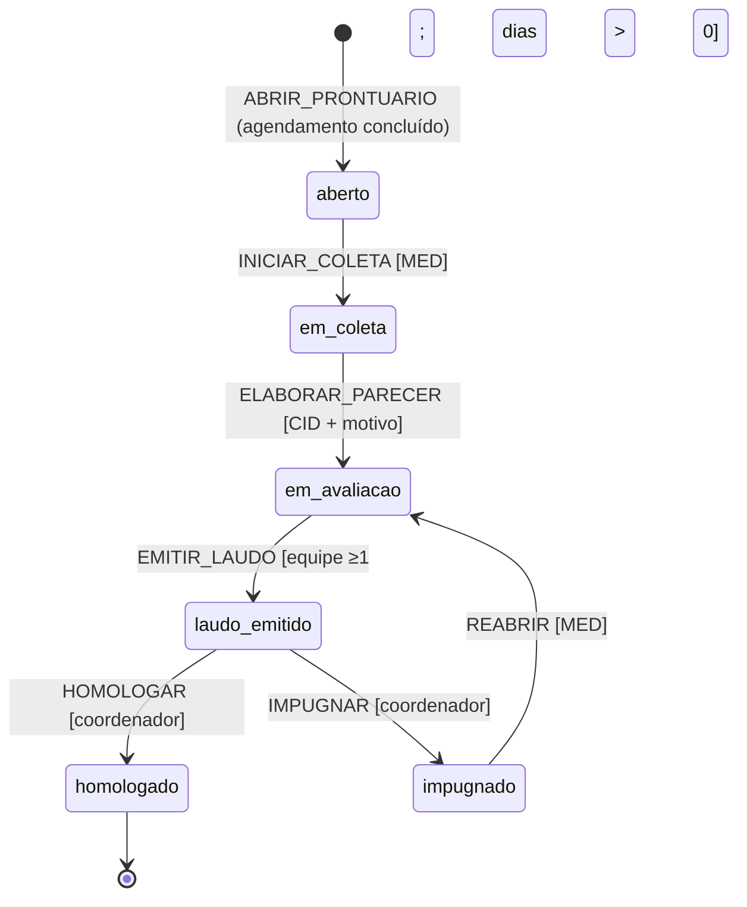
```mermaid
stateDiagram-v2
    [*] --> aberto : ABRIR_PRONTUARIO (agendamento concluído)
    aberto --> em_coleta : INICIAR_COLETA [MED]
    em_coleta --> em_avaliacao : ELABORAR_PARECER [CID + motivo]
    em_avaliacao --> laudo_emitido : EMITIR_LAUDO [equipe ≥1; dias > 0]
    laudo_emitido --> homologado : HOMOLOGAR [coordenador]
    laudo_emitido --> impugnado : IMPUGNAR [coordenador]
    impugnado --> em_avaliacao : REABRIR [MED]
    homologado --> [*]
```

### 11.7 Exemplo concreto — Perícia de Afastamento

| Data | Evento | Estado |
|---|---|---|
| 10/03 08:00 | Agenda: servidor convocado para perícia de clínica geral | agendamento `agendado` |
| 10/03 09:00 | Médico abre o painel diário; inicia atendimento | prontuário `aberto` → `em_coleta` |
| 10/03 09:20 | Médico registra CID J45 (asma), HDA, exame físico | `em_coleta` |
| 10/03 09:40 | Médico elabora parecer: afastamento remunerado 30 dias | `em_avaliacao` |
| 10/03 09:50 | Médico emite laudo; envia ao coordenador | `laudo_emitido` |
| 10/03 14:00 | Coordenador homologa; licença médica criada | `homologado` |
| 10/03 14:01 | SIS: replica licença para segunda matrícula do mesmo CPF | — |
| 10/03 14:02 | SIS: atualiza situação funcional → AFASTAMENTO | — |

---

## 12. Licença Médica

**Agregado:** `licenca_medica` (funcionario_id, prontuario_id)
**Bounded context:** `saude`

### 12.1 Estados

| Enum | Descrição |
|---|---|
| `registrada` | Licença criada a partir do prontuário homologado |
| `em_pericia` | Vigência ativa; servidor em afastamento |
| `deferida` | Licença confirmada com benefício concedido |
| `indeferida` | Licença negada; servidor retorna ao trabalho |
| `prorrogada` | Vigência estendida por nova perícia |
| `encerrada` | Vigência expirada; servidor retornou |

### 12.2 Transições

| # | De | Evento | Guarda | Efeito | Para |
|---|---|---|---|---|---|
| T1 | *(prontuário homologado)* | `REGISTRAR_LICENCA` | prontuário `homologado`; servidor sem licença ativa | cria licença; emite `licenca.registrada`; atualiza `situacao_funcional` | `registrada` |
| T2 | `registrada` | `ATIVAR` *(SIS: data_inicio atingida)* | — | emite `licenca.em_pericia` | `em_pericia` |
| T3 | `em_pericia` | `DEFERIR` | GM; benefício concedido formalmente | emite `licenca.deferida` | `deferida` |
| T4 | `em_pericia` | `INDEFERIR` | GM | emite `licenca.indeferida`; aciona retorno do servidor | `indeferida` |
| T5 | `deferida` | `PRORROGAR` | GM; nova data_fim > atual; total ≤ 720 dias | atualiza `data_fim`; emite `licenca.prorrogada` | `prorrogada` |
| T6 | `prorrogada` | `DEFERIR` | GM | emite `licenca.deferida` | `deferida` |
| T7 | `deferida` OU `prorrogada` | `job: daily:licenca-medica-vencida` | `today > data_fim` | emite `licenca.encerrada`; aciona `situacao_funcional` retorno | `encerrada` |
| T8 | `indeferida` | `ENCERRAR` | SIS | emite `licenca.encerrada` | `encerrada` |

### 12.3 Invariantes

- `em_pericia` → servidor com `situacao_funcional.tipo = AFASTAMENTO`.
- `encerrada` → `daily:situacao-funcional-retorno-afastamento` ativa retorno automático.
- Dias acumulados de afastamento remunerado ≤ 720 (checado em T5).

### 12.4 Diagrama

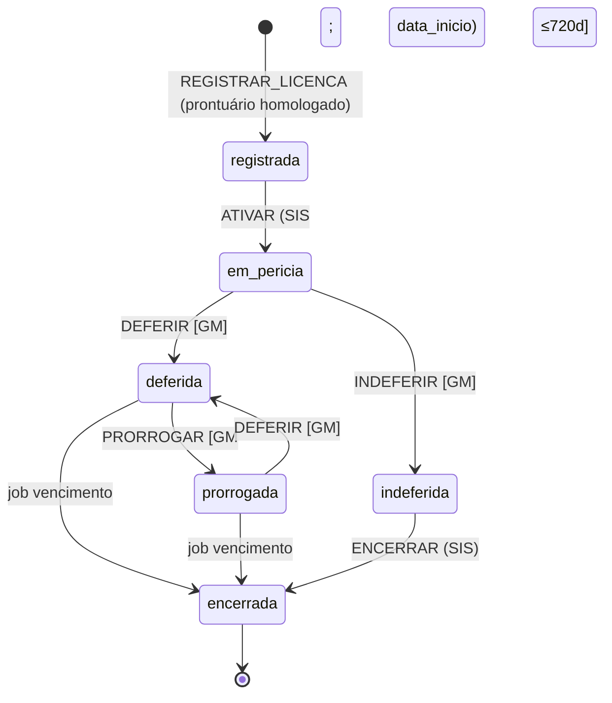
```mermaid
stateDiagram-v2
    [*] --> registrada : REGISTRAR_LICENCA (prontuário homologado)
    registrada --> em_pericia : ATIVAR (SIS; data_inicio)
    em_pericia --> deferida : DEFERIR [GM]
    em_pericia --> indeferida : INDEFERIR [GM]
    deferida --> prorrogada : PRORROGAR [GM; ≤720d]
    prorrogada --> deferida : DEFERIR [GM]
    deferida --> encerrada : job vencimento
    prorrogada --> encerrada : job vencimento
    indeferida --> encerrada : ENCERRAR (SIS)
    encerrada --> [*]
```

---

## 13. Processo de Aposentadoria

**Agregado:** `processo_aposentadoria` (funcionario_id, regra_id)
**Bounded context:** `previdenciario`

### 13.1 Estados

| Enum | Descrição |
|---|---|
| `protocolado` | Protocolo aberto; documentação inicial entregue |
| `em_instrucao` | Analista colhendo documentos e histórico funcional |
| `em_calculo` | Cálculo do benefício em andamento |
| `parecer_tecnico` | Setor técnico elaborando parecer |
| `parecer_juridico` | Assessoria jurídica revisando |
| `deferido` | Aposentadoria aprovada |
| `indeferido` | Aposentadoria negada; fundamentação comunicada |
| `em_efetivacao` | Ato de concessão em emissão |
| `concedido` | Aposentadoria efetivada no sistema; pensão habilitada |
| `suspenso` | Processo suspenso por diligência |
| `arquivado` | Processo encerrado sem concessão ou prescrito |

### 13.2 Transições

| # | De | Evento | Guarda | Efeito | Para |
|---|---|---|---|---|---|
| T1 | *(abertura)* | `PROTOCOLAR` | GP; funcionário com critérios atendidos | cria processo; emite `aposentadoria.protocolada` | `protocolado` |
| T2 | `protocolado` | `INICIAR_INSTRUCAO` | GP | analista responsável atribuído | `em_instrucao` |
| T3 | `em_instrucao` | `ENVIAR_CALCULO` | GP; CTC / tempo de serviço validado | enfileira cálculo previdenciário | `em_calculo` |
| T4 | `em_calculo` | `calculo_concluido` *(SIS)* | — | emite `aposentadoria.calculada` | `parecer_tecnico` |
| T5 | `parecer_tecnico` | `EMITIR_PARECER_TECNICO` | GP; parecer assinado | emite `aposentadoria.parecer_tecnico_emitido` | `parecer_juridico` |
| T6 | `parecer_juridico` | `DEFERIR` | GP; JURIDICO | emite `aposentadoria.deferida` | `deferido` |
| T7 | `parecer_juridico` | `INDEFERIR` | GP; JURIDICO; fundamento obrigatório | emite `aposentadoria.indeferida`; notifica servidor | `indeferido` |
| T8 | `deferido` | `INICIAR_EFETIVACAO` | GP | emite `aposentadoria.efetivacao_iniciada` | `em_efetivacao` |
| T9 | `em_efetivacao` | `CONCEDER` | GP | cria `aposentadoria` em status `CONCEDIDA`; altera `situacao_funcional`; habilita folha de aposentado; emite `aposentadoria.concedida` | `concedido` |
| T10 | qualquer ativo | `SUSPENDER` | GP; motivo diligência | emite `aposentadoria.suspensa` | `suspenso` |
| T11 | `suspenso` | `RETOMAR` | GP | retorna ao estado anterior | *(estado salvo)* |
| T12 | `indeferido` OU `suspenso` | `ARQUIVAR` | GP | imutabiliza | `arquivado` |

### 13.3 Invariantes

- `concedido` → `situacao_funcional.tipo = AFASTAMENTO` (subtipo APOSENTADORIA); vínculo `ativo = false`.
- Apenas um processo ativo por funcionário.

### 13.4 Efeitos colaterais

- `aposentadoria.concedida` → cria `beneficiario_recadastramento` (T1 da MDE 9).
- `aposentadoria.concedida` → emite eSocial evento S-2298 (desligamento por aposentadoria).
- `aposentadoria.concedida` → inativa verbas do servidor; ativa verbas do aposentado.

### 13.5 Diagrama

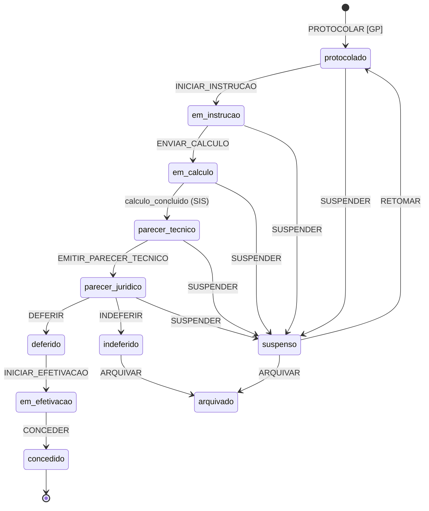
```mermaid
stateDiagram-v2
    [*] --> protocolado : PROTOCOLAR [GP]
    protocolado --> em_instrucao : INICIAR_INSTRUCAO
    em_instrucao --> em_calculo : ENVIAR_CALCULO
    em_calculo --> parecer_tecnico : calculo_concluido (SIS)
    parecer_tecnico --> parecer_juridico : EMITIR_PARECER_TECNICO
    parecer_juridico --> deferido : DEFERIR
    parecer_juridico --> indeferido : INDEFERIR
    deferido --> em_efetivacao : INICIAR_EFETIVACAO
    em_efetivacao --> concedido : CONCEDER
    concedido --> [*]
    indeferido --> arquivado : ARQUIVAR
    protocolado --> suspenso : SUSPENDER
    em_instrucao --> suspenso : SUSPENDER
    em_calculo --> suspenso : SUSPENDER
    parecer_tecnico --> suspenso : SUSPENDER
    parecer_juridico --> suspenso : SUSPENDER
    suspenso --> protocolado : RETOMAR
    suspenso --> arquivado : ARQUIVAR
```

### 13.6 Exemplo concreto

| Data | Evento | Estado |
|---|---|---|
| 01/03 | GP protocola pedido do servidor | `protocolado` |
| 03/03 | Analista abre instrução; coleta CTC | `em_instrucao` |
| 15/03 | Analista envia para cálculo | `em_calculo` |
| 16/03 | SIS conclui cálculo | `parecer_tecnico` |
| 20/03 | Técnico emite parecer | `parecer_juridico` |
| 25/03 | Jurídico defere | `deferido` |
| 26/03 | GP inicia efetivação | `em_efetivacao` |
| 28/03 | GP concede aposentadoria; eSocial S-2298 emitido | `concedido` |

---

## 14. Processo de Pensão

**Agregado:** `processo_pensao` (instituidor_pessoa_id, beneficiario_pessoa_id)
**Bounded context:** `previdenciário`

> Estrutura análoga ao Processo de Aposentadoria (§13), com diferenças listadas abaixo.

### 14.1 Estados (idênticos ao §13 exceto nomenclatura)

`protocolado` → `em_instrucao` → `em_calculo` → `parecer_tecnico` → `parecer_juridico` → `deferido` | `indeferido` → `em_efetivacao` → `concedido` / `suspenso` / `arquivado`

### 14.2 Diferenças em relação à Aposentadoria

| Aspecto | Aposentadoria | Pensão |
|---|---|---|
| Sujeito | Funcionário requerente | Beneficiário (dependente do instituidor) |
| Gatilho | Requerimento voluntário | Óbito ou invalidez do instituidor |
| Cálculo | Tempo de serviço + salário de benefício | Proventos do instituidor × cota-parte |
| eSocial | S-2298 (desligamento) | S-2230 (afastamento por óbito) + benefício |
| Recadastramento | Anual (aniversário) | Semestral |

### 14.3 Transições específicas da pensão

| # | De | Evento | Guarda | Efeito | Para |
|---|---|---|---|---|---|
| T1 | *(óbito/invalidez)* | `PROTOCOLAR_PENSAO` | GP; certidão de óbito ou laudo | cria `processo_pensao` e `pensao` em rascunho | `protocolado` |
| T9 | `em_efetivacao` | `CONCEDER_PENSAO` | GP | cria `pensao` ativa; cria `beneficiario_recadastramento` semestral; emite `pensao.concedida` | `concedido` |

### 14.4 Diagrama

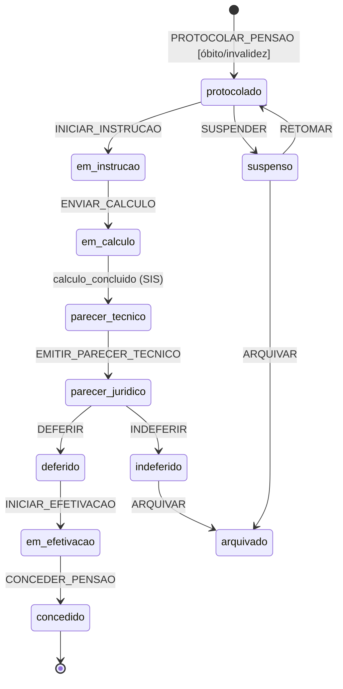
```mermaid
stateDiagram-v2
    [*] --> protocolado : PROTOCOLAR_PENSAO [óbito/invalidez]
    protocolado --> em_instrucao : INICIAR_INSTRUCAO
    em_instrucao --> em_calculo : ENVIAR_CALCULO
    em_calculo --> parecer_tecnico : calculo_concluido (SIS)
    parecer_tecnico --> parecer_juridico : EMITIR_PARECER_TECNICO
    parecer_juridico --> deferido : DEFERIR
    parecer_juridico --> indeferido : INDEFERIR
    deferido --> em_efetivacao : INICIAR_EFETIVACAO
    em_efetivacao --> concedido : CONCEDER_PENSAO
    concedido --> [*]
    indeferido --> arquivado : ARQUIVAR
    protocolado --> suspenso : SUSPENDER
    suspenso --> protocolado : RETOMAR
    suspenso --> arquivado : ARQUIVAR
```

---

## 15. CTC / Compensação Previdenciária

**Agregado:** `compensacao_previdenciaria` (certidao_id)
**Bounded context:** `previdenciario`

### 15.1 Estados

| Enum | Descrição |
|---|---|
| `solicitada` | Pedido registrado; CTC base vinculada |
| `em_analise` | Analista conferindo documentação e valor |
| `emitida` | Certidão de compensação gerada e assinada |
| `entregue` | Documento entregue ao servidor / RPPS de destino |
| `cancelada` | Processo cancelado antes da emissão |

### 15.2 Transições

| # | De | Evento | Guarda | Efeito | Para |
|---|---|---|---|---|---|
| T1 | *(solicitação)* | `SOLICITAR_CTC` | GP; `certidao_tempo_contribuicao` cadastrada | cria compensação; emite `ctc.solicitada` | `solicitada` |
| T2 | `solicitada` | `INICIAR_ANALISE` | GP | analista atribuído | `em_analise` |
| T3 | `em_analise` | `EMITIR` | GP; valor calculado; assinado | gera PDF; emite `ctc.emitida`; S3 key persistida | `emitida` |
| T4 | `emitida` | `ENTREGAR` | GP; comprovante de entrega | emite `ctc.entregue` | `entregue` |
| T5 | `solicitada` OU `em_analise` | `CANCELAR` | GP; motivo | emite `ctc.cancelada` | `cancelada` |

### 15.3 Diagrama

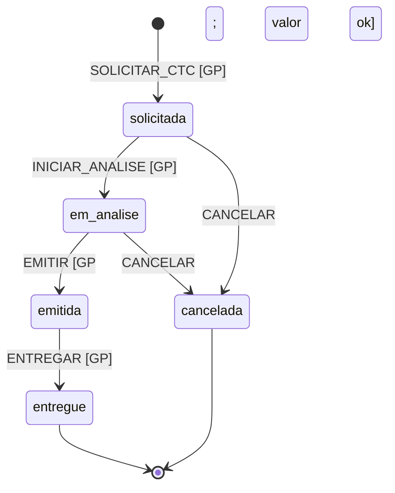
```mermaid
stateDiagram-v2
    [*] --> solicitada : SOLICITAR_CTC [GP]
    solicitada --> em_analise : INICIAR_ANALISE [GP]
    em_analise --> emitida : EMITIR [GP; valor ok]
    emitida --> entregue : ENTREGAR [GP]
    solicitada --> cancelada : CANCELAR
    em_analise --> cancelada : CANCELAR
    entregue --> [*]
    cancelada --> [*]
```

---

## 16. Requisição de Documento / Dossiê

**Agregado:** `requisicao_documento` (funcionario_id, tipo_documento_id)
**Bounded context:** `rh`

### 16.1 Estados

| Enum | Descrição |
|---|---|
| `aberta` | Solicitação registrada |
| `em_producao` | Responsável elaborando o documento |
| `produzida` | Documento gerado; aguarda entrega |
| `entregue` | Documento entregue ao solicitante |
| `cancelada` | Requisição cancelada |

### 16.2 Transições

| # | De | Evento | Guarda | Efeito | Para |
|---|---|---|---|---|---|
| T1 | *(solicitação)* | `ABRIR_REQUISICAO` | servidor ou gestor | cria registro; emite `documento.solicitado` | `aberta` |
| T2 | `aberta` | `INICIAR_PRODUCAO` | GRH | — | `em_producao` |
| T3 | `em_producao` | `FINALIZAR_PRODUCAO` | GRH; arquivo S3 gerado | emite `documento.produzido` | `produzida` |
| T4 | `produzida` | `ENTREGAR` | GRH | emite `documento.entregue` | `entregue` |
| T5 | `aberta` OU `em_producao` | `CANCELAR` | GRH; motivo | emite `documento.cancelado` | `cancelada` |

### 16.3 Diagrama

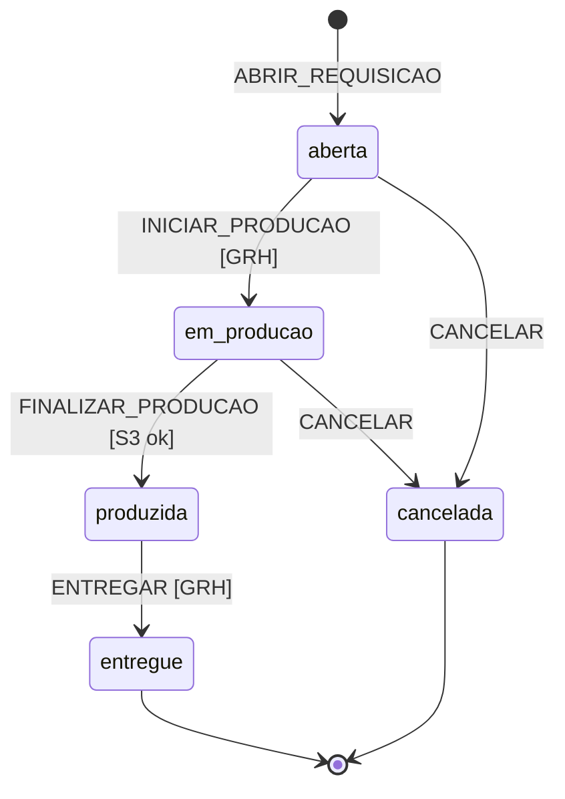
```mermaid
stateDiagram-v2
    [*] --> aberta : ABRIR_REQUISICAO
    aberta --> em_producao : INICIAR_PRODUCAO [GRH]
    em_producao --> produzida : FINALIZAR_PRODUCAO [S3 ok]
    produzida --> entregue : ENTREGAR [GRH]
    aberta --> cancelada : CANCELAR
    em_producao --> cancelada : CANCELAR
    entregue --> [*]
    cancelada --> [*]
```

---

## 17. Consignado / Margem

**Agregado:** `consignado_contrato` (funcionario_id, consignado_id)
**Bounded context:** `convenio`

### 17.1 Estados

| Enum | Descrição |
|---|---|
| `solicitado` | Pedido de averbação recebido |
| `em_analise` | Margem consignável sendo verificada |
| `autorizado` | Margem disponível confirmada |
| `averbado` | Desconto incluído na folha |
| `ativo` | Desconto em curso |
| `suspenso` | Desconto temporariamente interrompido |
| `quitado` | Todas as parcelas liquidadas |
| `rescindido` | Contrato encerrado antecipadamente |

### 17.2 Transições

| # | De | Evento | Guarda | Efeito | Para |
|---|---|---|---|---|---|
| T1 | *(solicitação)* | `SOLICITAR_AVERBACAO` | servidor; `convenio` ativo | cria contrato; emite `consignado.solicitado` | `solicitado` |
| T2 | `solicitado` | `ANALISAR` | GF / convenio | verifica margem disponível = salario_liquido × 35% | `em_analise` |
| T3 | `em_analise` | `AUTORIZAR` | GF; margem ok | emite `consignado.autorizado` | `autorizado` |
| T4 | `em_analise` | `RECUSAR` | GF; margem insuficiente | emite `consignado.recusado` | `solicitado` *(devolve)* |
| T5 | `autorizado` | `AVERBAR` | SIS: importação consignado | cria `lancamento` de desconto; emite `consignado.averbado` | `averbado` |
| T6 | `averbado` | `ATIVAR` *(SIS: 1ª folha calculada com desconto)* | — | emite `consignado.ativo` | `ativo` |
| T7 | `ativo` | `SUSPENDER` | GF; motivo (afastamento etc.) | remove lançamento da próxima competência; emite `consignado.suspenso` | `suspenso` |
| T8 | `suspenso` | `REATIVAR` | GF | recria lançamento | `ativo` |
| T9 | `ativo` | `QUITAR` *(SIS: parcelas_pagas = parcelas_totais)* | — | remove lançamento; emite `consignado.quitado` | `quitado` |
| T10 | `ativo` OU `suspenso` | `RESCINDIR` | GF; motivo | emite `consignado.rescindido` | `rescindido` |

### 17.3 Invariantes

- Margem ≤ 35% do salário líquido (ou valor configurado em `ParametroGlobal`).
- Servidor afastado ou demitido → contrato entra em `suspenso` automático via `daily:situacao-funcional-retorno-afastamento`.

### 17.4 Diagrama

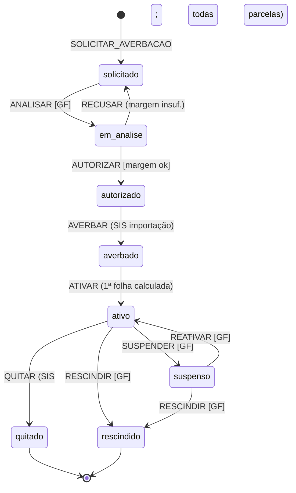
```mermaid
stateDiagram-v2
    [*] --> solicitado : SOLICITAR_AVERBACAO
    solicitado --> em_analise : ANALISAR [GF]
    em_analise --> autorizado : AUTORIZAR [margem ok]
    em_analise --> solicitado : RECUSAR (margem insuf.)
    autorizado --> averbado : AVERBAR (SIS importação)
    averbado --> ativo : ATIVAR (1ª folha calculada)
    ativo --> suspenso : SUSPENDER [GF]
    suspenso --> ativo : REATIVAR [GF]
    ativo --> quitado : QUITAR (SIS; todas parcelas)
    ativo --> rescindido : RESCINDIR [GF]
    suspenso --> rescindido : RESCINDIR [GF]
    quitado --> [*]
    rescindido --> [*]
```

---

## 18. Estágio

**Agregado:** `estagio` (pessoa_id, programa_id)
**Bounded context:** `recrutamento`

### 18.1 Estados

| Enum | Descrição |
|---|---|
| `vaga_publicada` | Programa ativo; vagas divulgadas |
| `inscricao_aberta` | Candidaturas sendo recebidas |
| `selecao` | Triagem e entrevistas em andamento |
| `contrato_assinado` | Documentação e contrato formalizados |
| `em_vigencia` | Estágio ativo com data_inicio ≤ today ≤ data_fim |
| `prorrogado` | Vigência estendida dentro do limite do programa |
| `rescindido` | Encerrado antecipadamente |
| `concluido` | Atingiu data_fim natural; desligamento processado |

### 18.2 Transições

| # | De | Evento | Guarda | Efeito | Para |
|---|---|---|---|---|---|
| T1 | *(programa ativo)* | `PUBLICAR_VAGA` | GRH; `programa_estagio.vigencia_fim > today` | emite `estagio.vaga_publicada` | `vaga_publicada` |
| T2 | `vaga_publicada` | `ABRIR_INSCRICOES` | GRH | emite `estagio.inscricoes_abertas` | `inscricao_aberta` |
| T3 | `inscricao_aberta` | `INICIAR_SELECAO` | GRH; ≥1 candidato | — | `selecao` |
| T4 | `selecao` | `CONTRATAR` | GRH; candidato selecionado; filial/lotação/banco informados | cria `estagiario`; cria vínculo `ESTAGIARIO`; ativa verbas; emite `estagio.contratado` | `contrato_assinado` |
| T5 | `contrato_assinado` | `INICIAR_VIGENCIA` *(SIS: data_inicio atingida)* | — | emite `estagio.iniciado` | `em_vigencia` |
| T6 | `em_vigencia` | `PRORROGAR` | GRH; renovacoes_realizadas < renovacoes_permitidas; total_meses ≤ 24 | atualiza `data_fim`; emite `estagio.prorrogado` | `prorrogado` |
| T7 | `prorrogado` | `INICIAR_VIGENCIA` *(SIS)* | — | emite `estagio.retomado` | `em_vigencia` |
| T8 | `em_vigencia` | `RESCINDIR` | GRH; motivo | inativa verbas; altera `situacao_funcional` → desligamento; emite `estagio.rescindido` | `rescindido` |
| T9 | `em_vigencia` | `job: daily:estagio-desligamento-automatico` | `today >= data_fim` | idem T8 automático | `concluido` |
| T10 | `prorrogado` | `RESCINDIR` | GRH | idem T8 | `rescindido` |

### 18.3 Invariantes

- Vínculo acumulado no mesmo programa ≤ 24 meses.
- `em_vigencia` → `situacao_funcional.tipo = ATIVO`; turno, jornada e verba de bolsa ativos.
- `rescindido` / `concluido` → verbas inativadas; `situacao_funcional.tipo = DESLIGAMENTO`.

### 18.4 Papéis

| Ação | Papéis |
|---|---|
| PUBLICAR_VAGA / ABRIR_INSCRICOES / INICIAR_SELECAO | GRH |
| CONTRATAR / PRORROGAR / RESCINDIR | GRH |
| Desligamento automático | SIS |

### 18.5 Efeitos colaterais

- `estagio.contratado` → emite eSocial S-2200 (admissão).
- `estagio.rescindido` / `concluido` → emite eSocial S-2299 (desligamento).
- `estagio.prorrogado` → emite eSocial S-2206 (alteração contratual).

### 18.6 Diagrama

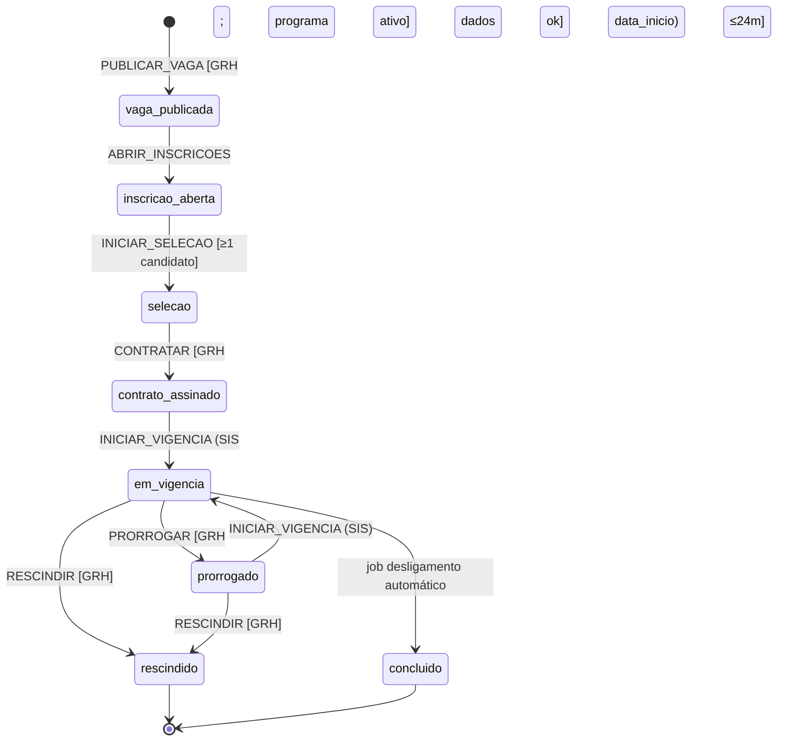
```mermaid
stateDiagram-v2
    [*] --> vaga_publicada : PUBLICAR_VAGA [GRH; programa ativo]
    vaga_publicada --> inscricao_aberta : ABRIR_INSCRICOES
    inscricao_aberta --> selecao : INICIAR_SELECAO [≥1 candidato]
    selecao --> contrato_assinado : CONTRATAR [GRH; dados ok]
    contrato_assinado --> em_vigencia : INICIAR_VIGENCIA (SIS; data_inicio)
    em_vigencia --> prorrogado : PRORROGAR [GRH; ≤24m]
    prorrogado --> em_vigencia : INICIAR_VIGENCIA (SIS)
    em_vigencia --> rescindido : RESCINDIR [GRH]
    em_vigencia --> concluido : job desligamento automático
    prorrogado --> rescindido : RESCINDIR [GRH]
    rescindido --> [*]
    concluido --> [*]
```

---

## Matriz de Máquinas × Papéis × Eventos do Barramento

A tabela abaixo cruza as 18 máquinas de estado com os papéis que disparam transições e os eventos publicados no barramento (EventBridge/SNS — cf. BRIEF §8). Coluna "Fila/Tópico" indica o canal SQS/SNS ou Step Function correspondente.

| Máquina | Transição-chave | Papel | Evento publicado | Fila / Tópico |
|---|---|---|---|---|
| **Competência** | Fechar | GF | `folha.competencia.fechada` | SNS `folha-eventos` |
| **Competência** | Fechamento agendado | SIS | `folha.competencia.fechamento_iniciado` | `daily:competencia-programada-fechamento` |
| **Competência** | Reabertura | GF | `folha.competencia.reaberta` | SNS `folha-eventos` |
| **Folha** | Criar | GF | `folha.criada` | SNS `folha-eventos` |
| **Folha** | Calcular lote | GF | `folha.calculo.solicitada` | SQS `folha-calculo` → `sgp-payroll-engine` |
| **Folha** | Cálculo concluído | SIS | `folha.calculo.concluida` | SQS `folha-calculo-resultado` → `sgp-core-api` |
| **Folha** | Gerar remessa | GF | `folha.remessa_gerada` | SQS `remessa.gerar` → `sgp-integrations-worker` |
| **Folha** | Bloquear | SIS | `folha.bloqueada` | SNS `folha-eventos` |
| **Contracheque** | Calcular | SIS | `contracheque.calculado` | SQS `folha-calculo` |
| **Contracheque** | Gerar PDF | SIS | `contracheque.gerar.pdf` | SQS `contracheque.gerar.pdf` → `sgp-report-service` |
| **Contracheque** | Disponibilizar portal | GF | `contracheque.disponibilizado` | SNS `portal-eventos` → push/e-mail |
| **Lançamento** | Efetivar | SIS | `lancamento.efetivado` | interno EventEmitter2 |
| **Lançamento** | Estornar | GF | `lancamento.estornado` | SNS `audit-eventos` → `audit_log` |
| **Lote Importação** | Aprovar e processar | GF | `importacao.processada` | SQS `importacao.processar` |
| **Lote Importação** | Rejeitar | GF | `importacao.rejeitada` | interno |
| **Evento eSocial** | Gerar | SIS | `esocial.evento.pendente` | SQS `esocial.evento.pendente` → `sgp-esocial-worker` |
| **Evento eSocial** | Aceito | SIS | `esocial.aceito` | SNS `esocial-eventos` |
| **Evento eSocial** | Rejeitado | SIS | `esocial.rejeitado` | SQS `esocial.evento.pendente` (retry ≤3) |
| **Requisição Pessoal** | Encaminhar | SOL | `requisicao.encaminhada` | SNS `recrutamento-eventos` + e-mail |
| **Requisição Pessoal** | Aprovar | GRH | `requisicao.aprovada` | SNS `recrutamento-eventos` + e-mail SOL |
| **Requisição Pessoal** | Concluir análise | GRH | `requisicao.concluida` | SNS `recrutamento-eventos` + e-mail SOL |
| **Candidato na Vaga** | Nomear | GRH | `candidato.nomeado` | SNS `recrutamento-eventos` |
| **Recadastramento** | Validar | GR | `recadastramento.validado` | SNS `previdenciario-eventos` |
| **Recadastramento** | Não recadastrado | SIS | `recadastramento.nao_recadastrado` | `daily:prova-vida-proxima-vencer` |
| **Recadastramento** | Perto vencer | SIS | `recadastramento.perto_vencer` | `daily:prova-vida-proxima-vencer` |
| **Agendamento Pericial** | Criar | GM | `agendamento.criado` | SNS `saude-eventos` + notificação servidor |
| **Agendamento Pericial** | Concluir | MED | `agendamento.concluido` | SNS `saude-eventos` |
| **Agendamento Pericial** | Falta | MED | `agendamento.falta_registrada` | SNS `saude-eventos` |
| **Prontuário Perícia** | Emitir laudo | MED | `pericia.laudo_emitido` | SNS `saude-eventos` |
| **Prontuário Perícia** | Homologar | GM | `pericia.homologado` | SNS `saude-eventos` → atualiza `situacao_funcional` |
| **Prontuário Perícia** | Replicar matrículas | SIS | `pericia.replicada` | interno EventEmitter2 |
| **Licença Médica** | Registrar | SIS | `licenca.registrada` | SNS `saude-eventos` → `situacao_funcional` |
| **Licença Médica** | Encerrar | SIS | `licenca.encerrada` | `daily:licenca-medica-vencida` → `daily:situacao-funcional-retorno-afastamento` |
| **Processo Aposentadoria** | Conceder | GP | `aposentadoria.concedida` | SNS `previdenciario-eventos` + eSocial S-2298 |
| **Processo Pensão** | Conceder | GP | `pensao.concedida` | SNS `previdenciario-eventos` + eSocial S-2298 |
| **CTC** | Emitir | GP | `ctc.emitida` | SNS `previdenciario-eventos` |
| **Requisição Documento** | Entregar | GRH | `documento.entregue` | interno |
| **Consignado** | Averbar | SIS | `consignado.averbado` | SNS `folha-eventos` → lançamento desconto |
| **Consignado** | Quitar | SIS | `consignado.quitado` | SNS `folha-eventos` → remove lançamento |
| **Estágio** | Contratar | GRH | `estagio.contratado` | SNS `recrutamento-eventos` + eSocial S-2200 |
| **Estágio** | Prorrogar | GRH | `estagio.prorrogado` | SNS `recrutamento-eventos` + eSocial S-2206 |
| **Estágio** | Concluir / Rescindir | GRH/SIS | `estagio.concluido` / `estagio.rescindido` | SNS `recrutamento-eventos` + eSocial S-2299 |

---

### Legenda de papéis

| Abreviação | Papel NestJS completo |
|---|---|
| GF | `ROLE_FOLHA_DE_PGT.GESTAO` |
| AF | `ROLE_FOLHA_DE_PGT.ATUALIZAR` |
| GP | `ROLE_MODULO_PREVIDENCIARIO.GESTAO` |
| GR | `ROLE_RECADASTRAMENTO.GESTAO` |
| GM | `ROLE_PERICIA_MEDICA.GESTAO` + `ROLE_AGENDA_MEDICA.GESTAO` |
| GRH | `ROLE_RECRUTAMENTO_SELECAO.GESTAO` |
| SOL | Solicitante — papel `ROLE_RECRUTAMENTO_SELECAO.CADASTRAR` |
| MED | `ROLE_MEDICO.GESTAO` (identificado via CPF do usuário logado) |
| SIS | Sistema / job assíncrono (sem papel — executa em contexto de serviço interno) |

---

## Refinamentos da Evidência Reversa de 2026-04-26

Os mapas finos de funcionário, folha, perícia, recadastramento e recrutamento confirmam as máquinas acima e acrescentam regras canônicas que devem ser preservadas no runtime novo.

### Folha

- A competência é o lock de ciclo: abertura, fechamento, reabertura e refechamento controlam se folhas, lançamentos e contracheques aceitam mutação.
- A folha é sempre recortada por competência, filial e tipo de processamento; inclusão de servidor/pensionista exige elegibilidade funcional/previdenciária na competência.
- Lançamento manual, importação de verbas de servidor, importação de verbas de pensionista e importação de consignado entram como lotes rastreáveis antes da efetivação.
- Reprocessamento total, reprocessamento de pendentes e recálculo individual usam a mesma transição para `em_calculo`, mas mantêm motivo, usuário e escopo do disparo na memória de cálculo.
- Dependências entre verbas formam grafo dirigido; o engine deve recusar ciclos e registrar a ordem efetiva executada.

### Recadastramento

- A carteira da prova de vida é derivada de campanha, tipo de beneficiário, vencimento, histórico de atendimento e último status validado.
- Atendimento de aposentado e pensionista compartilha a máquina de prova de vida, mas pensionista mantém validações próprias de instituidor, cota e condição universitária quando aplicável.
- Ligações, anexos, comprovante individual e histórico formal são eventos ou documentos associados ao ciclo; não substituem o estado canônico do beneficiário.
- Canal público/autoatendimento só participa quando `PROVA_VIDA_PUBLIC_API_ENABLED=true` e deve produzir evidência auditável equivalente ao atendimento interno.

### Perícia Médica

- Agenda/regulação e atendimento clínico são fases separadas: a primeira controla data, médico, especialidade e comparecimento; a segunda controla prontuário, CID, parecer, laudo e licença.
- Homologação de laudo ou concessão de licença publica evento para `rh` atualizar afastamento/situação funcional; o módulo `saude` preserva o prontuário e a decisão médica.
- Falta, reagendamento, pendência de validação e atendimento concluído são estados distintos para evitar perda de rastreabilidade operacional.

### Funcionário e Vínculo

- CPF identifica `pessoa`; matrícula e vínculo identificam a relação funcional com o tenant.
- Posse, lotação, transferência, cedência, desligamento, afastamento e situação funcional são eventos de vínculo, não mutações soltas no cadastro civil.
- Dossiê, documento de amparo e observações permanentes ficam associados ao servidor/vínculo e participam da ficha funcional.

### Recrutamento

- Requisição de pessoal tem camada de demanda: abertura, motivação, função requerida, quantitativo, lotação, aprovação e conclusão.
- Pipeline de seleção tem camada própria: captação, vínculo de currículo, análise curricular, convocação, entrevista, nomeação ou rejeição.
- Banco de talentos e estágio são reutilizáveis pelo contexto, mas não alteram a máquina da requisição sem evento explícito.

---

*Fim do documento. Para refinamentos ou ADRs decorrentes deste artefato, criar `adr/0002-state-machines-refinamentos.md`.*
