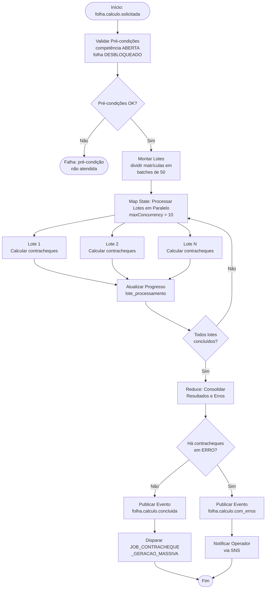
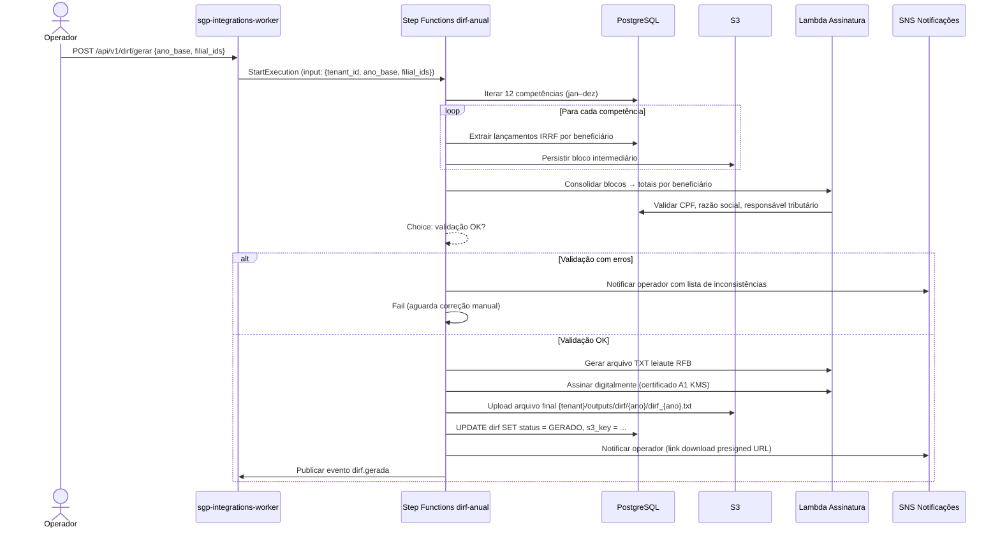
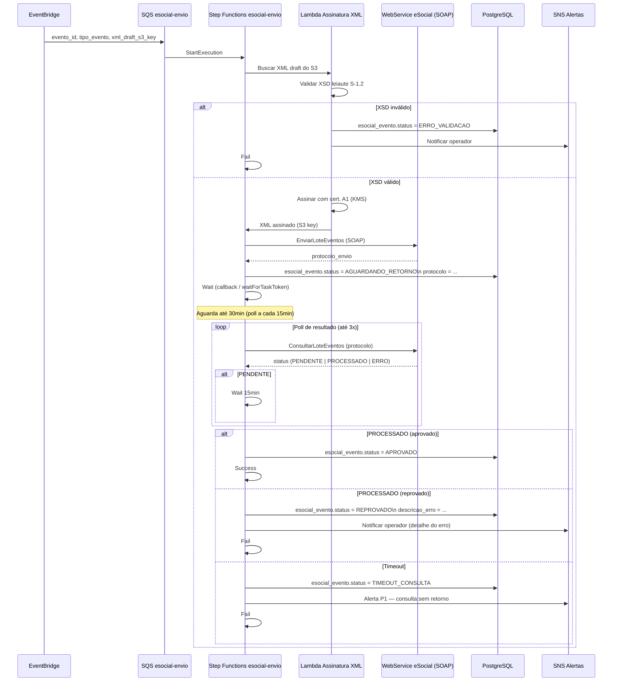
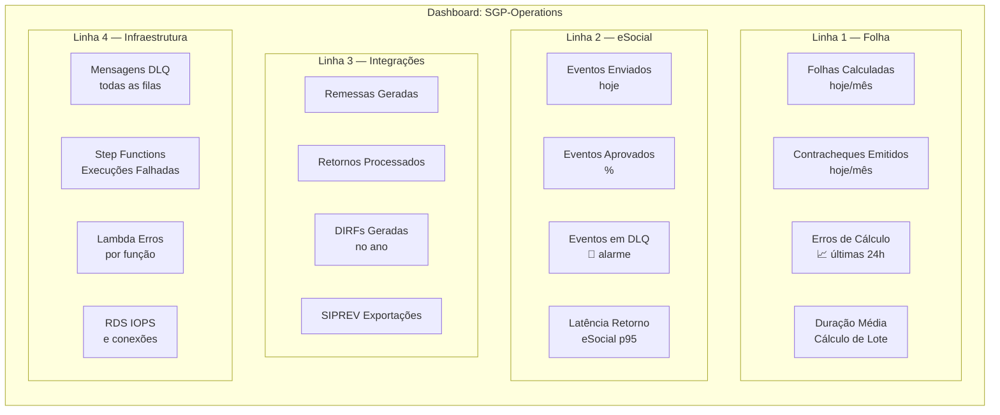
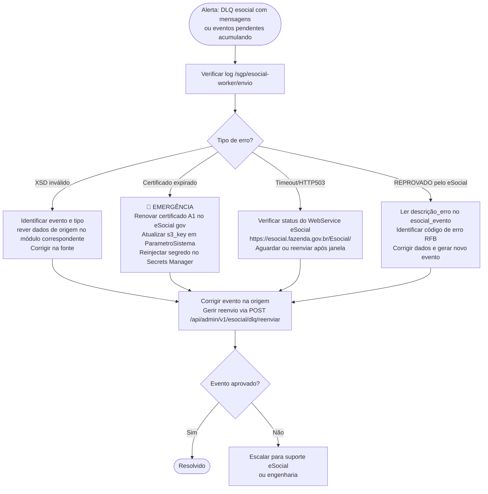
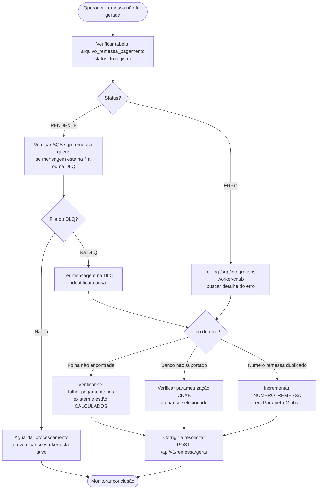
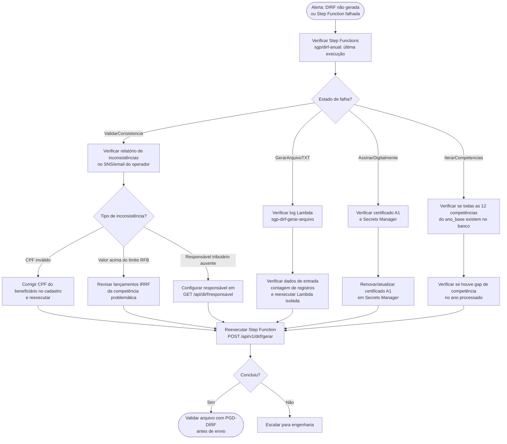
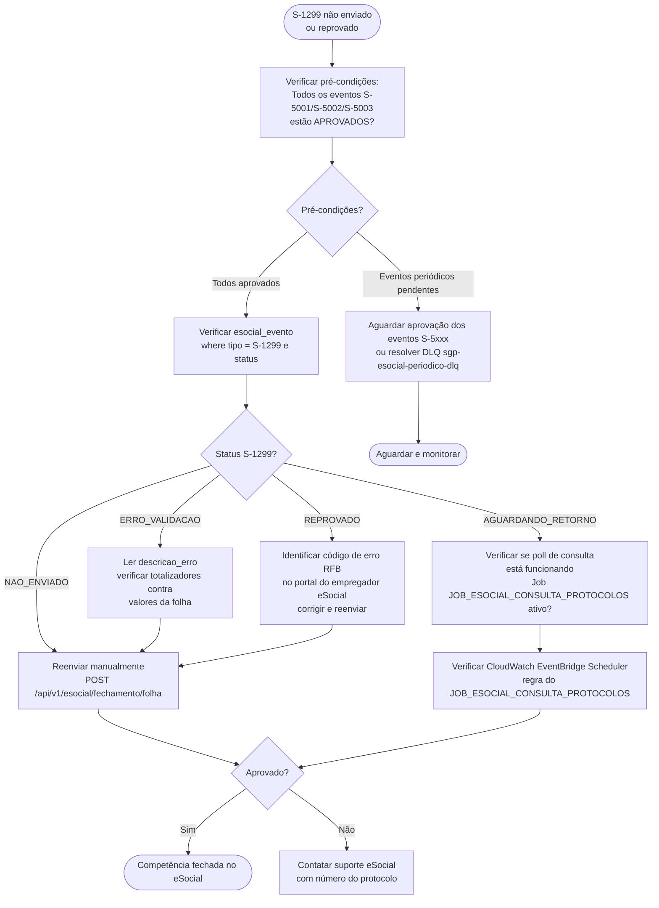

# Jobs e Rotinas Assíncronas — SGP Moderno
**Versão:** 1.0 | **Data:** 2026-04-21 | **Status:** Draft
**Escopo:** todos os serviços (`sgp-core-api`, `sgp-payroll-engine`, `sgp-esocial-worker`, `sgp-integrations-worker`, `sgp-report-service`) | **Depende de:** BRIEF.md, `34-rotinas-operacionais-jobs-e-integracoes.md`, `58-importacoes-exportacoes-e-documentos-estaticos.md`.

---

**Decisão temporária (2026-04-26):** eSocial é tratado como provedor externo stubado/sandbox no pacote atual. Jobs, runbooks e workflows de eSocial neste documento descrevem o alvo de homologação; o aceite corrente valida geração de payload, persistência de estado e adapter sandbox, sem envio real ao ambiente nacional.

## §1 Taxonomia de Jobs e Rotinas Assíncronas

O SGP Moderno adota cinco categorias de processamento fora do ciclo síncrono de requisição HTTP. A tabela abaixo define cada categoria, o serviço AWS responsável pelo disparo e quando usá-la.

| Categoria | Mecanismo de disparo | Serviço AWS | Quando usar |
|---|---|---|---|
| **Cron agendado** | EventBridge Scheduler (cron expression) | EventBridge Scheduler → SQS → ECS Task / Lambda | Manutenções diárias, fechamentos programados, expirações, convocações periódicas |
| **Event-triggered** | EventBridge Event Bus (regra de evento de domínio) | EventBridge → SQS → worker NestJS (consumer) | Reação a mudança de estado de domínio (folha calculada, servidor desligado, laudo aprovado) |
| **Step Functions workflow** | API Gateway / EventBridge / cron | AWS Step Functions (Standard Workflow) | Orquestração multi-etapa com ramificação, paralelismo em fan-out, espera por callbacks externos |
| **Reactive listener (SNS fan-out)** | SNS topic (publicado por producer) | SNS → SQS por assinante | Notificações multi-destino (audit_log, email, portal, transparência) |
| **Background task HTTP** | POST/PUT síncrono que retorna `job_id` imediatamente | SQS FIFO (por tenant) → worker | Ações longas iniciadas pelo usuário via interface (geração de DIRF, relatório pesado, CNAB) |

### Princípios transversais

- **Isolamento por tenant:** toda mensagem SQS/SNS carrega `tenant_id` no atributo de mensagem; workers aplicam RLS PostgreSQL antes de qualquer operação.
- **Idempotência obrigatória:** cada job define uma `idempotency_key` armazenada na tabela `job_execucao`; reentrada duplicada é detectada e rejeitada sem efeito colateral.
- **Observabilidade em três camadas:** log estruturado JSON (CloudWatch Logs), métricas de negócio (CloudWatch Metrics namespace `SGP/Jobs`), rastreamento distribuído (X-Ray).
- **DLQ obrigatória:** toda fila SQS possui DLQ correspondente; após `maxReceiveCount` tentativas a mensagem é movida para DLQ e um alarme CloudWatch é disparado.
- **Runbook linkado:** cada job crítico possui mini-runbook em §6.

---

## §2 Catálogo de Jobs

### 2.1 Folha de Pagamento

---

#### `JOB_FOLHA_FECHAMENTO_MENSAL`

| Campo | Valor |
|---|---|
| **Owner** | `sgp-payroll-engine` |
| **Trigger** | Cron diário `0 1 * * *` (UTC) via EventBridge Scheduler; também acionável via `POST /api/v1/folha/competencia/{id}/agendar-fechamento` (retorna `job_id`) |
| **Input** | `{ tenant_id, competencia_id, programado_para: ISO8601 }` |
| **Output** | Evento `folha.competencia.fechada` → SNS; tabela `competencia` → `status = FECHADA`; tabelas `folha_pagamento` → `status = BLOQUEADO`; log em `job_execucao` |
| **Retry policy** | 3 tentativas; backoff exponencial (1 min, 5 min, 15 min); DLQ `sgp-folha-fechamento-dlq` |
| **Idempotency key** | `{tenant_id}#{competencia_id}#FECHAMENTO` |
| **Timeout** | 30 min |
| **Observabilidade** | Log stream `/sgp/payroll-engine/fechamento`; métrica `FolhasFecharadas` (namespace `SGP/Folha`); trace X-Ray grupo `payroll` |
| **Alertas** | `DLQMessagesVisible > 0` → PagerDuty P1; `Duration > 25 min` → PagerDuty P2 |

**Pré-condições:** todas as folhas da competência devem estar em `situacao = CALCULADO`; nenhuma folha em `EM_CALCULO` ou `ERRO`. Folhas em `ERRO` bloqueiam o fechamento (operador deve resolver antes).

---

#### `JOB_FOLHA_CALCULO_LOTE`

| Campo | Valor |
|---|---|
| **Owner** | `sgp-payroll-engine` |
| **Trigger** | Evento `folha.calculo.solicitada` no EventBridge → SQS `sgp-folha-calculo-queue`; acionável via `POST /api/v1/folha/lote/calcular` |
| **Input** | `{ tenant_id, lote_processamento_id, filial_ids[], competencia_id, tipo_processamento, periodo_inicial, periodo_final }` |
| **Output** | Evento `folha.calculo.concluida`; tabelas `folha_pagamento.situacao = CALCULADO`, `contracheque`, `lancamento`; progresso em `lote_processamento.progresso_pct`; arquivos de memória de cálculo em S3 `{tenant}/outputs/folha/{ano}/{mes}/memoria/` |
| **Retry policy** | 2 tentativas (erros de cálculo geralmente não são transitórios); backoff fixo 2 min; DLQ `sgp-folha-calculo-dlq` |
| **Idempotency key** | `{tenant_id}#{lote_processamento_id}` |
| **Timeout** | 60 min |
| **Observabilidade** | Log stream `/sgp/payroll-engine/calculo-lote`; métricas `ContrachequesCalculados`, `ContrachequesErro`; trace X-Ray |
| **Alertas** | `ContrachequesErro > 0` → SNS notificação operador; `Duration > 50 min` → PagerDuty P2 |

Implementado como Step Functions `payroll-lote` — ver §3.1.

---

#### `JOB_FOLHA_CALCULO_EXTRAORDINARIO`

| Campo | Valor |
|---|---|
| **Owner** | `sgp-payroll-engine` |
| **Trigger** | `POST /api/v1/folha/extraordinaria/calcular` (retorna `job_id`) |
| **Input** | `{ tenant_id, tipo_processamento ∈ {DECIMO_TERCEIRO_ADIANTAMENTO, DECIMO_TERCEIRO_INTEGRACAO, FERIAS, RESCISAO, COMPLEMENTAR, ADIANTAMENTO_SALARIAL}, matriculas[], competencia_id }` |
| **Output** | Contracheques extras no banco; evento `folha.calculo.extra.concluida`; PDFs em S3 |
| **Retry policy** | 3 tentativas; backoff 2/5/10 min; DLQ `sgp-folha-extra-dlq` |
| **Idempotency key** | `{tenant_id}#{competencia_id}#{tipo_processamento}#{hash(matriculas)}` |
| **Timeout** | 30 min |
| **Observabilidade** | Log stream `/sgp/payroll-engine/extra`; métrica `FolhasExtrasGeradas` |
| **Alertas** | DLQ visível > 0 → SNS operador |

---

#### `JOB_FOLHA_REPROCESSAMENTO_RETROATIVO`

| Campo | Valor |
|---|---|
| **Owner** | `sgp-payroll-engine` |
| **Trigger** | `POST /api/v1/folha/reprocessar` (retorna `job_id`); modo: `SELETIVO`, `TOTAL`, `PENDENTES` |
| **Input** | `{ tenant_id, folha_pagamento_id, modo_reprocessamento, contracheque_ids[] (se SELETIVO) }` |
| **Output** | Contracheques reprocessados; `folha_pagamento.situacao` atualizado; evento `folha.reprocessamento.concluido` |
| **Retry policy** | 1 tentativa (operação explicitamente solicitada por operador); DLQ `sgp-folha-reprocessamento-dlq` |
| **Idempotency key** | `{tenant_id}#{folha_pagamento_id}#{timestamp_solicitacao}` |
| **Timeout** | 45 min |
| **Observabilidade** | Log stream `/sgp/payroll-engine/reprocessamento`; métrica `ReprocessamentosExecutados` |
| **Alertas** | DLQ visível > 0 → SNS operador |

---

#### `JOB_CONTRACHEQUE_GERACAO_MASSIVA`

| Campo | Valor |
|---|---|
| **Owner** | `sgp-report-service` |
| **Trigger** | Evento `folha.calculo.concluida` no EventBridge → SQS `sgp-contracheque-pdf-queue`; também via `POST /api/v1/contracheque/gerar-massa` |
| **Input** | `{ tenant_id, folha_pagamento_id, template ∈ {SERVIDOR, PENSIONISTA}, marca_dagua: bool }` |
| **Output** | PDFs individuais em S3 `{tenant}/outputs/contracheque/{ano}/{mes}/{matricula}.pdf`; PDF consolidado `{tenant}/outputs/contracheque/{ano}/{mes}/massa.pdf`; evento `contracheque.pdf.gerado` |
| **Retry policy** | 3 tentativas; backoff 1/3/5 min; DLQ `sgp-contracheque-dlq` |
| **Idempotency key** | `{tenant_id}#{folha_pagamento_id}#PDF` |
| **Timeout** | 20 min |
| **Observabilidade** | Log stream `/sgp/report-service/contracheque`; métrica `ContrachequePDFsGerados` |
| **Alertas** | DLQ visível > 0 → SNS operador |

---

#### `JOB_CNAB_GERACAO_REMESSA`

| Campo | Valor |
|---|---|
| **Owner** | `sgp-integrations-worker` |
| **Trigger** | `POST /api/v1/remessa/gerar` (retorna `job_id`) → SQS `sgp-remessa-queue` |
| **Input** | `{ tenant_id, folha_pagamento_ids[], banco_id, formato ∈ {CNAB240, CNAB400}, numero_remessa }` |
| **Output** | Arquivo CNAB em S3 `{tenant}/outputs/remessa/{ano}/{mes}/remessa_{numero}.txt`; evento `remessa.gerada`; tabela `arquivo_remessa_pagamento` atualizada |
| **Retry policy** | 3 tentativas; backoff 2/5/10 min; DLQ `sgp-remessa-dlq` |
| **Idempotency key** | `{tenant_id}#{numero_remessa}#{banco_id}` |
| **Timeout** | 15 min |
| **Observabilidade** | Log stream `/sgp/integrations-worker/cnab`; métrica `RemessasGeradas` |
| **Alertas** | DLQ visível > 0 → PagerDuty P1 |

---

#### `JOB_CNAB_PROCESSAMENTO_RETORNO`

| Campo | Valor |
|---|---|
| **Owner** | `sgp-integrations-worker` |
| **Trigger** | Upload de arquivo em S3 `{tenant}/inputs/retorno/` → EventBridge (S3 Event) → SQS `sgp-retorno-queue` |
| **Input** | `{ tenant_id, s3_key, banco_id, formato }` |
| **Output** | Tabela `arquivo_retorno_pagamento` atualizada; contracheques com status de pagamento; evento `retorno.processado`; relatório de erros em S3 |
| **Retry policy** | 3 tentativas; backoff 1/3/5 min; DLQ `sgp-retorno-dlq` |
| **Idempotency key** | `{tenant_id}#{s3_key_etag}` |
| **Timeout** | 10 min |
| **Observabilidade** | Log stream `/sgp/integrations-worker/retorno-bancario`; métrica `RetornosBancariosProcessados` |
| **Alertas** | `ErrosRetorno > 0` → SNS operador |

---

#### `JOB_CONSIGNADO_IMPORTACAO`

| Campo | Valor |
|---|---|
| **Owner** | `sgp-integrations-worker` |
| **Trigger** | `POST /api/v1/consignado/importar/confirm` → SQS `sgp-consignado-queue` |
| **Input** | `{ tenant_id, importacao_consignado_id, competencia_id }` |
| **Output** | Lançamentos criados em `lancamento`; `importacao_consignado.status = IMPORTADO`; evento `consignado.importado` |
| **Retry policy** | 3 tentativas; backoff 1/3/5 min; DLQ `sgp-consignado-dlq` |
| **Idempotency key** | `{tenant_id}#{importacao_consignado_id}` |
| **Timeout** | 10 min |
| **Observabilidade** | Log stream `/sgp/integrations-worker/consignado`; métrica `ConsignadosImportados` |
| **Alertas** | DLQ visível > 0 → SNS operador |

---

#### `JOB_GFIP_SEFIP_HISTORICA`

| Campo | Valor |
|---|---|
| **Owner** | `sgp-integrations-worker` |
| **Trigger** | `POST /api/v1/gfip/gerar` (retorna `job_id`) |
| **Input** | `{ tenant_id, competencia_id, filial_id, codigo_recolhimento, modalidade }` |
| **Output** | Arquivo GFIP/SEFIP em S3 `{tenant}/outputs/gfip/{ano}/{mes}/sefip.re`; evento `gfip.gerada` |
| **Retry policy** | 3 tentativas; backoff 2/5/10 min; DLQ `sgp-gfip-dlq` |
| **Idempotency key** | `{tenant_id}#{competencia_id}#{filial_id}` |
| **Timeout** | 15 min |
| **Observabilidade** | Log stream `/sgp/integrations-worker/gfip`; métrica `GFIPsGeradas` |
| **Alertas** | DLQ visível > 0 → SNS operador |

---

#### `JOB_DIRF_GERACAO_ANUAL`

| Campo | Valor |
|---|---|
| **Owner** | `sgp-integrations-worker` |
| **Trigger** | `POST /api/v1/dirf/gerar` (retorna `job_id`) → SQS `sgp-dirf-queue`; geralmente acionado entre janeiro e fevereiro de cada ano |
| **Input** | `{ tenant_id, ano_base, filial_ids[], responsavel_tributario_id }` |
| **Output** | Arquivo TXT leiaute RFB em S3 `{tenant}/outputs/dirf/{ano}/dirf_{ano}.txt`; PDF de conferência; tabela `dirf` atualizada; evento `dirf.gerada` |
| **Retry policy** | 3 tentativas; backoff 5/10/20 min; DLQ `sgp-dirf-dlq` |
| **Idempotency key** | `{tenant_id}#{ano_base}#DIRF` |
| **Timeout** | 45 min |
| **Observabilidade** | Log stream `/sgp/integrations-worker/dirf`; métrica `DIRFsGeradas`; trace X-Ray |
| **Alertas** | DLQ visível > 0 → PagerDuty P1 |

Implementado como Step Functions `dirf-anual` — ver §3.2.

---

### 2.1.1 Recursos Humanos

#### `JOB_RH_ESTAGIO_PROBATORIO_36M`

| Campo | Valor |
|---|---|
| **Owner** | `sgp-core-api` / módulo `avaliacao` |
| **Trigger** | Cron diário via EventBridge Scheduler; endpoint operacional `GET /api/v1/avaliacao/estagio-probatorio/a-vencer` expõe a mesma seleção para conferência |
| **Input** | `{ tenant_id, reference_date }` |
| **Output** | Lista de servidores estatutários cujo `exercise_on + 36 months` ocorre nos próximos 90 dias; notificação operacional para RH/avaliação |
| **Retry policy** | 3 tentativas; backoff exponencial; DLQ `sgp-rh-estagio-probatorio-dlq` |
| **Idempotency key** | `{tenant_id}#ESTAGIO_PROBATORIO_36M#{reference_date}` |
| **Timeout** | 5 min |
| **Observabilidade** | Métrica `ProbationDueEmployees`; log estruturado com tenant e quantidade de servidores sinalizados |

Pré-condições: vínculo `statutory`, contrato ativo e `exercise_on` preenchido. A avaliação final é sempre mutação explícita em `hr.probation_evaluation`, auditada pelo serviço de auditoria.

### 2.2 eSocial

---

#### `JOB_ESOCIAL_ENVIO_EVENTOS_PENDENTES`

| Campo | Valor |
|---|---|
| **Owner** | `sgp-esocial-worker` |
| **Trigger** | Evento de domínio publicado por aspect (ex: posse registrada, folha fechada, desligamento) → EventBridge `sgp.esocial.evento.pendente` → SQS `sgp-esocial-envio-queue`; também cron `*/10 * * * *` para varredura de pendências |
| **Input** | `{ tenant_id, evento_id, tipo_evento (S-1000…S-2399), xml_assinado_s3_key }` |
| **Output** | Protocolo de recibo eSocial gravado em `esocial_evento`; `esocial_evento.status = ENVIADO` ou `ERRO`; evento `esocial.enviado` ou `esocial.erro` |
| **Retry policy** | 3 tentativas; backoff exponencial (2/8/30 min); DLQ `sgp-esocial-dlq` |
| **Idempotency key** | `{tenant_id}#{evento_id}` |
| **Timeout** | 5 min por evento |
| **Observabilidade** | Log stream `/sgp/esocial-worker/envio`; métricas `EventosESocialEnviados`, `EventosESocialErro`; X-Ray trace |
| **Alertas** | DLQ visível > 0 → PagerDuty P1; `EventosESocialErro > 10` → PagerDuty P2 |

Implementado como Step Functions `esocial-envio` — ver §3.3.

---

#### `JOB_ESOCIAL_CONSULTA_PROTOCOLOS`

| Campo | Valor |
|---|---|
| **Owner** | `sgp-esocial-worker` |
| **Trigger** | Cron `*/15 * * * *` via EventBridge Scheduler |
| **Input** | `{ tenant_id }` — busca todos os eventos com `status = AGUARDANDO_RETORNO` |
| **Output** | Tabela `esocial_evento` atualizada com resultado (APROVADO, REPROVADO, PENDENTE); eventos `esocial.aprovado` ou `esocial.reprovado` publicados |
| **Retry policy** | Sem retry individual (próximo ciclo cron resolve); DLQ `sgp-esocial-consulta-dlq` |
| **Idempotency key** | `{tenant_id}#CONSULTA#{timestamp_ciclo}` |
| **Timeout** | 10 min |
| **Observabilidade** | Log stream `/sgp/esocial-worker/consulta`; métrica `ProtocolosConsultados` |
| **Alertas** | `ProtocolosPendentes > 100` → SNS alerta operador |

---

#### `JOB_ESOCIAL_REENVIO_DLQ`

| Campo | Valor |
|---|---|
| **Owner** | `sgp-esocial-worker` |
| **Trigger** | Manual via `POST /api/admin/v1/esocial/dlq/reenviar`; ou cron semanal `0 6 * * 1` |
| **Input** | `{ tenant_id, evento_ids[] (opcional — se vazio, reprocessa toda DLQ) }` |
| **Output** | Mensagens movidas da DLQ de volta para `sgp-esocial-envio-queue`; registro em `job_execucao` |
| **Retry policy** | Único disparo; reentrada controlada por idempotency key |
| **Idempotency key** | `{tenant_id}#DLQ_REENVIO#{timestamp}` |
| **Timeout** | 5 min |
| **Observabilidade** | Log stream `/sgp/esocial-worker/dlq-reenvio`; métrica `DLQMensagensReenviadas` |
| **Alertas** | N/A (operação manual) |

---

#### `JOB_ESOCIAL_S5001_S5002_S5003`

| Campo | Valor |
|---|---|
| **Owner** | `sgp-esocial-worker` |
| **Trigger** | Evento `folha.competencia.fechada` → EventBridge → SQS `sgp-esocial-periodico-queue` |
| **Input** | `{ tenant_id, competencia_id }` |
| **Output** | Geração e envio dos eventos S-5001 (IRRF), S-5002 (INSS/RPPS), S-5003 (FGTS); protocolo gravado; arquivo XML em S3 |
| **Retry policy** | 3 tentativas; backoff 5/15/30 min; DLQ `sgp-esocial-periodico-dlq` |
| **Idempotency key** | `{tenant_id}#{competencia_id}#S5XXX` |
| **Timeout** | 20 min |
| **Observabilidade** | Log stream `/sgp/esocial-worker/periodico`; métrica `EventosPeriodicos` |
| **Alertas** | DLQ visível > 0 → PagerDuty P1 |

---

#### `JOB_ESOCIAL_FECHAMENTO_S1299`

| Campo | Valor |
|---|---|
| **Owner** | `sgp-esocial-worker` |
| **Trigger** | `POST /api/v1/esocial/fechamento/folha` (manual, após validação dos eventos periódicos) |
| **Input** | `{ tenant_id, competencia_id, tipo_fechamento: S-1299 }` |
| **Output** | Evento S-1299 gerado, assinado e enviado; `esocial_competencia.status_folha = FECHADO` |
| **Retry policy** | 3 tentativas; backoff 5/15/30 min; DLQ `sgp-esocial-periodico-dlq` |
| **Idempotency key** | `{tenant_id}#{competencia_id}#S1299` |
| **Timeout** | 15 min |
| **Observabilidade** | Log stream `/sgp/esocial-worker/fechamento`; métrica `FechamentosS1299` |
| **Alertas** | DLQ visível > 0 → PagerDuty P1 |

---

#### `JOB_ESOCIAL_FECHAMENTO_S2299`

| Campo | Valor |
|---|---|
| **Owner** | `sgp-esocial-worker` |
| **Trigger** | Evento `funcionario.desligado` → EventBridge → SQS `sgp-esocial-envio-queue` |
| **Input** | `{ tenant_id, funcionario_id, vinculo_id, competencia_id, tipo_fechamento: S-2299 }` |
| **Output** | Evento S-2299 gerado, assinado e enviado; `esocial_evento.status = ENVIADO` |
| **Retry policy** | 3 tentativas; backoff 2/8/30 min; DLQ `sgp-esocial-dlq` |
| **Idempotency key** | `{tenant_id}#{funcionario_id}#{vinculo_id}#S2299` |
| **Timeout** | 10 min |
| **Observabilidade** | Log stream `/sgp/esocial-worker/s2299`; métrica `EventosS2299` |
| **Alertas** | DLQ visível > 0 → PagerDuty P1 |

---

### 2.3 Previdenciário

---

#### `JOB_PREVIDENCIARIO_CALCULO_APOSENTADORIA_SIMULADA`

| Campo | Valor |
|---|---|
| **Owner** | `sgp-core-api` |
| **Trigger** | `POST /api/v1/previdenciario/simulacao` (retorna `job_id`) → SQS `sgp-previdenciario-queue` |
| **Input** | `{ tenant_id, funcionario_id, regra_aposentadoria_id, data_referencia }` |
| **Output** | `simulacao_aposentadoria` inserida no banco; evento `simulacao.concluida`; PDF em S3 `{tenant}/outputs/previdenciario/simulacao/{id}.pdf` |
| **Retry policy** | 2 tentativas; backoff 1/3 min; DLQ `sgp-previdenciario-dlq` |
| **Idempotency key** | `{tenant_id}#{funcionario_id}#{regra_id}#{data_referencia}` |
| **Timeout** | 5 min |
| **Observabilidade** | Log stream `/sgp/core-api/simulacao-aposentadoria`; métrica `SimulacoesExecutadas` |
| **Alertas** | DLQ visível > 0 → SNS operador |

---

#### `JOB_RECADASTRAMENTO_CONVOCACAO_DIARIA`

| Campo | Valor |
|---|---|
| **Owner** | `sgp-core-api` |
| **Trigger** | Cron diário `0 6 * * *` via EventBridge Scheduler |
| **Input** | `{ tenant_id }` — filtra beneficiários por faixa de aniversário e ciclo de recadastramento |
| **Output** | `beneficiario_recadastramento.status = PERTO_VENCER` para os que vencem em ≤30 dias; emails/notificações enviados via SNS `sgp-notificacoes-topic`; log em `job_execucao` |
| **Retry policy** | 3 tentativas; backoff 5/15/30 min; DLQ `sgp-recadastramento-dlq` |
| **Idempotency key** | `{tenant_id}#CONVOCACAO#{data_hoje}` |
| **Timeout** | 15 min |
| **Observabilidade** | Log stream `/sgp/core-api/recadastramento`; métrica `ConvocacoesEnviadas` |
| **Alertas** | `ConvocacoesFalhas > 0` → SNS operador |

---

#### `JOB_RECADASTRAMENTO_LEMBRETE_PRAZO`

| Campo | Valor |
|---|---|
| **Owner** | `sgp-core-api` |
| **Trigger** | Cron diário `0 7 * * *` via EventBridge Scheduler |
| **Input** | `{ tenant_id }` — beneficiários com prazo ≤7 dias |
| **Output** | Notificações (email + in-app) via SNS; registro em `historico_ligacao` quando operador intervém manualmente |
| **Retry policy** | 3 tentativas; backoff 2/5/10 min; DLQ `sgp-recadastramento-dlq` |
| **Idempotency key** | `{tenant_id}#LEMBRETE#{data_hoje}` |
| **Timeout** | 10 min |
| **Observabilidade** | Log stream `/sgp/core-api/recadastramento-lembrete`; métrica `LembretesEnviados` |
| **Alertas** | N/A |

---

#### `JOB_RECADASTRAMENTO_BLOQUEIO_PAGAMENTO`

| Campo | Valor |
|---|---|
| **Owner** | `sgp-core-api` |
| **Trigger** | Cron diário `0 8 * * *` via EventBridge Scheduler; também disparado ao verificar lista pré-fechamento de competência |
| **Input** | `{ tenant_id }` — beneficiários com recadastramento vencido (status NAO_RECADASTRADO + prazo expirado) |
| **Output** | `beneficiario_recadastramento.status = NAO_RECADASTRADO`; flag `bloqueio_pagamento = true` na matrícula; evento `pagamento.bloqueado` publicado para `sgp-payroll-engine` (exclui da folha); notificação ao operador |
| **Retry policy** | 3 tentativas; backoff 2/5/10 min; DLQ `sgp-recadastramento-dlq` |
| **Idempotency key** | `{tenant_id}#BLOQUEIO#{data_hoje}` |
| **Timeout** | 10 min |
| **Observabilidade** | Log stream `/sgp/core-api/bloqueio-pagamento`; métrica `PagamentosBloqueados` |
| **Alertas** | `PagamentosBloqueados > 0` → SNS notificação gestão |

---

#### `JOB_SIPREV_GERACAO_REMESSA`

| Campo | Valor |
|---|---|
| **Owner** | `sgp-integrations-worker` |
| **Trigger** | `POST /api/v1/siprev/gerar` (retorna `job_id`) → SQS `sgp-siprev-queue` |
| **Input** | `{ tenant_id, competencia_id, filial_id, filtro_situacao_funcional[] }` |
| **Output** | XML SIPREV (leiaute MPS vigente) em S3 `{tenant}/outputs/siprev/{ano}/{mes}/siprev.xml`; tabela `arquivo_exportacao_siprev` atualizada; evento `siprev.gerado` |
| **Retry policy** | 3 tentativas; backoff 2/5/10 min; DLQ `sgp-siprev-dlq` |
| **Idempotency key** | `{tenant_id}#{competencia_id}#{filial_id}` |
| **Timeout** | 20 min |
| **Observabilidade** | Log stream `/sgp/integrations-worker/siprev`; métrica `SIPREVGerados` |
| **Alertas** | DLQ visível > 0 → PagerDuty P2 |

---

#### `JOB_PENSAO_RECALCULO`

| Campo | Valor |
|---|---|
| **Owner** | `sgp-payroll-engine` |
| **Trigger** | Evento `pensao.alterada` (alteração de rateio, beneficiário, forma de reajuste) → EventBridge → SQS `sgp-pensao-queue` |
| **Input** | `{ tenant_id, pensao_id, competencia_id }` |
| **Output** | Lançamentos de pensão recalculados; evento `pensao.recalculada` |
| **Retry policy** | 3 tentativas; backoff 1/3/5 min; DLQ `sgp-pensao-dlq` |
| **Idempotency key** | `{tenant_id}#{pensao_id}#{competencia_id}` |
| **Timeout** | 5 min |
| **Observabilidade** | Log stream `/sgp/payroll-engine/pensao`; métrica `PensoesRecalculadas` |
| **Alertas** | DLQ visível > 0 → SNS operador |

---

#### `JOB_CERTIDAO_EXPIRACAO`

| Campo | Valor |
|---|---|
| **Owner** | `sgp-core-api` |
| **Trigger** | Cron diário `0 5 * * *` via EventBridge Scheduler |
| **Input** | `{ tenant_id }` |
| **Output** | `certidao_tempo_contribuicao` com prazo vencido → flag `expirada = true`; notificação ao servidor e ao RH |
| **Retry policy** | 3 tentativas; backoff 2/5/10 min; DLQ `sgp-certidao-dlq` |
| **Idempotency key** | `{tenant_id}#CERTIDAO_EXP#{data_hoje}` |
| **Timeout** | 5 min |
| **Observabilidade** | Log stream `/sgp/core-api/certidao-expiracao`; métrica `CertidoesExpiradas` |
| **Alertas** | N/A |

---

### 2.4 Saúde e SST

---

#### `JOB_SST_AGENDAMENTO_RETORNO_PERICIAL`

| Campo | Valor |
|---|---|
| **Owner** | `sgp-core-api` |
| **Trigger** | Evento `pericia.laudo.aprovado` com `acao_pericial = RETORNO` → EventBridge → SQS `sgp-saude-queue` |
| **Input** | `{ tenant_id, agendamento_id, data_retorno_prevista }` |
| **Output** | Novo `agendamento_pericia` criado com `status = AGENDADO`; notificação ao servidor |
| **Retry policy** | 3 tentativas; backoff 1/3/5 min; DLQ `sgp-saude-dlq` |
| **Idempotency key** | `{tenant_id}#{agendamento_id}#RETORNO` |
| **Timeout** | 5 min |
| **Observabilidade** | Log stream `/sgp/core-api/saude`; métrica `RetornosPericaisAgendados` |
| **Alertas** | DLQ visível > 0 → SNS operador |

---

#### `JOB_SST_EXPIRACAO_CAT`

| Campo | Valor |
|---|---|
| **Owner** | `sgp-core-api` |
| **Trigger** | Cron diário `0 4 * * *` via EventBridge Scheduler |
| **Input** | `{ tenant_id }` |
| **Output** | `acidente_trabalho` com CAT pendente de envio após 24h → alerta ao operador; notificação via SNS |
| **Retry policy** | 3 tentativas; backoff 2/5/10 min; DLQ `sgp-saude-dlq` |
| **Idempotency key** | `{tenant_id}#CAT_EXP#{data_hoje}` |
| **Timeout** | 5 min |
| **Observabilidade** | Log stream `/sgp/core-api/cat-expiracao`; métrica `CATsAtrasados` |
| **Alertas** | `CATsAtrasados > 0` → SNS operador RH |

---

#### `JOB_SST_ENVIO_S2210_S2220_S2240`

| Campo | Valor |
|---|---|
| **Owner** | `sgp-esocial-worker` |
| **Trigger** | Eventos de domínio: `acidente_trabalho.registrado` → S-2210; `licenca_medica.emitida` → S-2220; `condicao_ambiental.alterada` → S-2240 — via EventBridge → SQS `sgp-esocial-sst-queue` |
| **Input** | `{ tenant_id, entidade_id, tipo_evento, dados_sst }` |
| **Output** | Evento eSocial gerado, assinado e enviado; protocolo gravado |
| **Retry policy** | 3 tentativas; backoff 2/8/30 min; DLQ `sgp-esocial-sst-dlq` |
| **Idempotency key** | `{tenant_id}#{entidade_id}#{tipo_evento}` |
| **Timeout** | 10 min |
| **Observabilidade** | Log stream `/sgp/esocial-worker/sst`; métrica `EventosSSTEnviados` |
| **Alertas** | DLQ visível > 0 → PagerDuty P2 |

---

#### `JOB_SST_GERACAO_LAUDO_PPP`

| Campo | Valor |
|---|---|
| **Owner** | `sgp-report-service` |
| **Trigger** | `POST /api/v1/saude/ppp/gerar` (retorna `job_id`) → SQS `sgp-report-queue` |
| **Input** | `{ tenant_id, funcionario_id, data_referencia }` |
| **Output** | PDF do Perfil Profissiográfico Previdenciário em S3 `{tenant}/outputs/saude/ppp/{matricula}_{ano}.pdf`; evento `ppp.gerado` |
| **Retry policy** | 3 tentativas; backoff 1/3/5 min; DLQ `sgp-report-dlq` |
| **Idempotency key** | `{tenant_id}#{funcionario_id}#{data_referencia}#PPP` |
| **Timeout** | 10 min |
| **Observabilidade** | Log stream `/sgp/report-service/ppp`; métrica `PPPsGerados` |
| **Alertas** | DLQ visível > 0 → SNS operador |

---

### 2.5 Integrações

---

#### `JOB_TRANSPARENCIA_PUBLICACAO`

| Campo | Valor |
|---|---|
| **Owner** | `sgp-integrations-worker` |
| **Trigger** | Cron mensal `0 3 5 * *` (dia 5 de cada mês) via EventBridge Scheduler |
| **Input** | `{ tenant_id, competencia_id }` |
| **Output** | CSV de transparência gerado; upload para portal conforme parametrização; evento `transparencia.publicada` |
| **Retry policy** | 3 tentativas; backoff 10/20/40 min; DLQ `sgp-transparencia-dlq` |
| **Idempotency key** | `{tenant_id}#{competencia_id}#TRANSPARENCIA` |
| **Timeout** | 20 min |
| **Observabilidade** | Log stream `/sgp/integrations-worker/transparencia`; métrica `TransparenciaPublicada` |
| **Alertas** | DLQ visível > 0 → PagerDuty P2 |

---

#### `JOB_PREFEITURA_EXPORTACAO_MENSAL`

| Campo | Valor |
|---|---|
| **Owner** | `sgp-integrations-worker` |
| **Trigger** | Cron mensal `0 4 5 * *` + `POST /api/v1/integracoes/prefeitura/exportar` |
| **Input** | `{ tenant_id, competencia_id, tipo ∈ {DEPENDENTE, ENDERECO, AUTENTICACAO} }` |
| **Output** | Payload JSON enviado à prefeitura via REST `/publico/prefeitura/{endpoint}`; log de resposta; evento `prefeitura.exportacao.concluida` |
| **Retry policy** | 3 tentativas; backoff 5/15/30 min; DLQ `sgp-prefeitura-dlq` |
| **Idempotency key** | `{tenant_id}#{competencia_id}#{tipo}` |
| **Timeout** | 10 min |
| **Observabilidade** | Log stream `/sgp/integrations-worker/prefeitura`; métrica `ExportacoesPrefeitura` |
| **Alertas** | DLQ visível > 0 → SNS operador |

---

#### `JOB_FREQUENCIA_IMPORTACAO_PONTO`

| Campo | Valor |
|---|---|
| **Owner** | `sgp-integrations-worker` |
| **Trigger** | Upload de arquivo em S3 `{tenant}/inputs/frequencia/` → EventBridge → SQS `sgp-frequencia-queue`; ou `POST /api/v1/frequencia/importar` |
| **Input** | `{ tenant_id, s3_key, competencia_id, formato_arquivo }` |
| **Output** | Lançamentos de frequência criados; verbas de horas extras/faltas calculadas; evento `frequencia.importada` |
| **Retry policy** | 3 tentativas; backoff 2/5/10 min; DLQ `sgp-frequencia-dlq` |
| **Idempotency key** | `{tenant_id}#{s3_key_etag}` |
| **Timeout** | 15 min |
| **Observabilidade** | Log stream `/sgp/integrations-worker/frequencia`; métrica `FrequenciasImportadas` |
| **Alertas** | DLQ visível > 0 → SNS operador |

---

### 2.6 Administração

---

#### `JOB_AUDITORIA_PARTICIONAMENTO`

| Campo | Valor |
|---|---|
| **Owner** | `sgp-core-api` |
| **Trigger** | Cron mensal `0 2 1 * *` via EventBridge Scheduler |
| **Input** | `{ tenant_id }` — cria partição do mês seguinte em `audit_log` e `contracheque` e `lancamento` |
| **Output** | Novas partições criadas no PostgreSQL; log em `job_execucao` |
| **Retry policy** | 3 tentativas; backoff 5/10/20 min; DLQ `sgp-admin-dlq` |
| **Idempotency key** | `{tenant_id}#PARTICAO#{ano}#{mes_proximo}` |
| **Timeout** | 10 min |
| **Observabilidade** | Log stream `/sgp/core-api/admin`; métrica `ParticoesCreadas` |
| **Alertas** | `ParticoesCreadas = 0` → PagerDuty P2 |

---

#### `JOB_COGNITO_EXPIRACAO_SESSOES`

| Campo | Valor |
|---|---|
| **Owner** | `sgp-core-api` |
| **Trigger** | Cron diário `0 3 * * *` via EventBridge Scheduler |
| **Input** | `{ tenant_id }` |
| **Output** | Refresh tokens expirados revogados via Cognito Admin API; registro em `audit_log` |
| **Retry policy** | 3 tentativas; backoff 2/5/10 min; DLQ `sgp-admin-dlq` |
| **Idempotency key** | `{tenant_id}#SESSAO_EXP#{data_hoje}` |
| **Timeout** | 5 min |
| **Observabilidade** | Log stream `/sgp/core-api/sessao`; métrica `SessoesExpiradas` |
| **Alertas** | N/A |

---

#### `JOB_KMS_ROTACAO_CHAVES`

| Campo | Valor |
|---|---|
| **Owner** | `sgp-core-api` (Lambda auxiliar) |
| **Trigger** | Cron anual `0 1 1 1 *` via EventBridge Scheduler; suplementado por rotação automática KMS (habilitada na CMK) |
| **Input** | N/A (operação AWS-gerenciada) |
| **Output** | Nova versão de chave KMS ativa; log em CloudTrail; evento `kms.rotacao.concluida` |
| **Retry policy** | Gerenciado pelo KMS |
| **Idempotency key** | Gerenciado pelo KMS |
| **Timeout** | 5 min |
| **Observabilidade** | CloudTrail + CloudWatch Event; métrica `KMSRotacoes` |
| **Alertas** | Falha de rotação → PagerDuty P1 |

---

#### `JOB_S3_CLEANUP`

| Campo | Valor |
|---|---|
| **Owner** | `sgp-core-api` (Lambda auxiliar) |
| **Trigger** | Cron semanal `0 2 * * 0` via EventBridge Scheduler |
| **Input** | `{ tenant_id }` — remove objetos S3 órfãos (referências deletadas no banco) e aplica lifecycle policy de arquivamento para Glacier |
| **Output** | Objetos removidos; relatório de tamanho por tenant; métrica de custo |
| **Retry policy** | 3 tentativas; backoff 5/10/20 min; DLQ `sgp-admin-dlq` |
| **Idempotency key** | `{tenant_id}#S3_CLEANUP#{data_semana}` |
| **Timeout** | 15 min |
| **Observabilidade** | Log stream `/sgp/core-api/s3-cleanup`; métrica `ObjetosS3Removidos`, `StorageUsedGB` |
| **Alertas** | `StorageUsedGB > threshold_tenant` → SNS admin |

---

#### `JOB_AGREGADOS_USO`

| Campo | Valor |
|---|---|
| **Owner** | `sgp-core-api` |
| **Trigger** | Cron diário `0 23 * * *` via EventBridge Scheduler |
| **Input** | `{ tenant_id }` |
| **Output** | Tabela `metricas_uso` atualizada (usuários ativos, folhas calculadas, contracheques emitidos, eventos eSocial); dados exportados para CloudWatch namespace `SGP/Negocio` |
| **Retry policy** | 3 tentativas; backoff 2/5/10 min; DLQ `sgp-admin-dlq` |
| **Idempotency key** | `{tenant_id}#AGREGADOS#{data_hoje}` |
| **Timeout** | 10 min |
| **Observabilidade** | Log stream `/sgp/core-api/agregados`; namespace `SGP/Negocio` |
| **Alertas** | N/A |

---

### 2.7 Situação Funcional e RH

---

#### `JOB_SITUACAO_FUNCIONAL_RETORNO_AFASTAMENTO`

| Campo | Valor |
|---|---|
| **Owner** | `sgp-core-api` |
| **Trigger** | Cron diário `0 0 * * *` via EventBridge Scheduler |
| **Input** | `{ tenant_id }` |
| **Output** | `situacao_funcional` de afastamentos vencidos → `ATIVO`; `licenca_medica` vencidas → inativadas; evento `situacao_funcional.alterada` |
| **Retry policy** | 3 tentativas; backoff 2/5/10 min; DLQ `sgp-rh-dlq` |
| **Idempotency key** | `{tenant_id}#RETORNO_AFASTAMENTO#{data_hoje}` |
| **Timeout** | 10 min |
| **Observabilidade** | Log stream `/sgp/core-api/situacao-funcional`; métrica `AfastamentosEncerrados` |
| **Alertas** | DLQ visível > 0 → SNS operador |

---

#### `JOB_FERIAS_MANUTENCAO_AUTOMATICA`

| Campo | Valor |
|---|---|
| **Owner** | `sgp-core-api` |
| **Trigger** | Cron diário `0 0 * * *` via EventBridge Scheduler |
| **Input** | `{ tenant_id }` |
| **Output** | Programações de férias com data de início atingida → `situacao_funcional = FERIAS`; retornos → `ATIVO`; evento `ferias.iniciada` / `ferias.encerrada` |
| **Retry policy** | 3 tentativas; backoff 2/5/10 min; DLQ `sgp-rh-dlq` |
| **Idempotency key** | `{tenant_id}#FERIAS_MANUT#{data_hoje}` |
| **Timeout** | 10 min |
| **Observabilidade** | Log stream `/sgp/core-api/ferias`; métrica `FeriasIniciadasAutomaticas` |
| **Alertas** | N/A |

---

#### `JOB_ESTAGIO_DESLIGAMENTO_AUTOMATICO`

| Campo | Valor |
|---|---|
| **Owner** | `sgp-core-api` |
| **Trigger** | Cron diário `0 1 * * *` via EventBridge Scheduler |
| **Input** | `{ tenant_id }` |
| **Output** | `estagiario.situacao_funcional = DESLIGADO` para estagiários com `data_fim <= hoje`; verbas inativadas; evento `estagiario.desligado` |
| **Retry policy** | 3 tentativas; backoff 2/5/10 min; DLQ `sgp-rh-dlq` |
| **Idempotency key** | `{tenant_id}#ESTAGIO_DESLIG#{data_hoje}` |
| **Timeout** | 10 min |
| **Observabilidade** | Log stream `/sgp/core-api/estagio`; métrica `EstagiariosDesligados` |
| **Alertas** | DLQ visível > 0 → SNS operador |

---

### 2.8 Relatórios

---

#### `JOB_RELATORIO_ASSINCRONO`

| Campo | Valor |
|---|---|
| **Owner** | `sgp-report-service` |
| **Trigger** | `POST /api/v1/relatorios/solicitar` (retorna `job_id`) → SQS `sgp-report-queue` |
| **Input** | `{ tenant_id, tipo_relatorio, parametros_json, formato ∈ {PDF, XLSX}, notificar_email: bool }` |
| **Output** | Arquivo gerado em S3 `{tenant}/outputs/relatorios/{tipo}/{uuid}.{ext}`; `relatorio_solicitado.status = CONCLUIDO`; URL presigned enviada por email/in-app se `notificar_email = true` |
| **Retry policy** | 2 tentativas; backoff 2/5 min; DLQ `sgp-report-dlq` |
| **Idempotency key** | `{tenant_id}#{tipo_relatorio}#{hash(parametros)}#{data_hoje}` |
| **Timeout** | 20 min |
| **Observabilidade** | Log stream `/sgp/report-service/relatorio`; métrica `RelatoriosGerados`, `RelatoriosDuracao` |
| **Alertas** | `RelatoriosDuracao > 15 min` → SNS operador |

---

## §3 Step Functions Workflows

### 3.1 Workflow `payroll-lote` — Fechamento de Competência com Fan-out

Este workflow orquestra o cálculo de folha em lote por filial/competência, paralelizando o processamento por sub-lotes de matrículas (fan-out) e consolidando o resultado (reduce) ao final.



**ASL (alto nível):**

```json
{
  "Comment": "payroll-lote: cálculo de folha em lote com fan-out por matrícula",
  "StartAt": "ValidarPreCondicoes",
  "States": {
    "ValidarPreCondicoes": {
      "Type": "Task",
      "Resource": "arn:aws:lambda:::function:sgp-payroll-validar-precondicoes",
      "Next": "VerificarPreCondicoes",
      "Retry": [{ "ErrorEquals": ["States.TaskFailed"], "MaxAttempts": 2, "IntervalSeconds": 10 }]
    },
    "VerificarPreCondicoes": {
      "Type": "Choice",
      "Choices": [
        { "Variable": "$.precondicoes_ok", "BooleanEquals": true, "Next": "MontarLotes" }
      ],
      "Default": "FalharPreCondicao"
    },
    "MontarLotes": {
      "Type": "Task",
      "Resource": "arn:aws:lambda:::function:sgp-payroll-montar-lotes",
      "Next": "ProcessarLotesEmParalelo"
    },
    "ProcessarLotesEmParalelo": {
      "Type": "Map",
      "MaxConcurrency": 10,
      "ItemsPath": "$.lotes",
      "Iterator": {
        "StartAt": "CalcularLote",
        "States": {
          "CalcularLote": {
            "Type": "Task",
            "Resource": "arn:aws:states:::sqs:sendMessage.waitForTaskToken",
            "Parameters": {
              "QueueUrl": "${SQSFolhaCalculoUrl}",
              "MessageBody": { "lote.$": "$", "taskToken.$": "$$.Task.Token" }
            },
            "HeartbeatSeconds": 300,
            "End": true
          }
        }
      },
      "Next": "ConsolidarResultados"
    },
    "ConsolidarResultados": {
      "Type": "Task",
      "Resource": "arn:aws:lambda:::function:sgp-payroll-consolidar",
      "Next": "VerificarErros"
    },
    "VerificarErros": {
      "Type": "Choice",
      "Choices": [
        { "Variable": "$.total_erros", "NumericGreaterThan": 0, "Next": "NotificarErros" }
      ],
      "Default": "PublicarConcluida"
    },
    "PublicarConcluida": {
      "Type": "Task",
      "Resource": "arn:aws:states:::events:putEvents",
      "Parameters": { "Entries": [{ "EventBusName": "sgp-bus", "Source": "sgp.payroll", "DetailType": "folha.calculo.concluida", "Detail.$": "$" }] },
      "End": true
    },
    "NotificarErros": {
      "Type": "Task",
      "Resource": "arn:aws:states:::sns:publish",
      "Parameters": { "TopicArn": "${SNSAlertasOperadorArn}", "Message.$": "States.Format('Erros no cálculo: {} contracheques falharam. Competência: {}', $.total_erros, $.competencia_id)" },
      "End": true
    },
    "FalharPreCondicao": {
      "Type": "Fail",
      "Error": "PreCondicaoNaoAtendida",
      "Cause": "Folha não está em estado elegível para cálculo"
    }
  }
}
```

---

### 3.2 Workflow `dirf-anual` — Geração de DIRF Anual

Consolida N competências do ano-base, valida totais, assina digitalmente e entrega o arquivo final.



**Estados principais (ASL):**

| Estado | Tipo | Ação |
|---|---|---|
| `IterarCompetencias` | `Map` (12 iterações) | Extrai dados de IRRF por competência |
| `ConsolidarTotais` | `Task` (Lambda) | Agrega valores por beneficiário/fonte |
| `ValidarConsistencia` | `Task` (Lambda) | Valida CPF, limites RFB, responsável |
| `VerificarValidacao` | `Choice` | Rota para correção ou geração |
| `GerarArquivoTXT` | `Task` (Lambda) | Monta leiaute RFB linha a linha |
| `AssinarDigitalmente` | `Task` (Lambda KMS) | Assina com certificado A1 do tenant |
| `PublicarArquivo` | `Task` (S3 + SNS) | Upload e notificação |

---

### 3.3 Workflow `esocial-envio` — Envio de Evento eSocial Complexo

Orquestra a assinatura, envio, espera por retorno assíncrono e consulta de resultado.



**Timeout total do workflow:** 2 horas (3 polls × 15 min + margem).
**Retry do Step Function:** 0 retries automáticos (reenvio explícito via `JOB_ESOCIAL_REENVIO_DLQ`).

---

## §4 DLQs, Retries e SLAs

### Mapa de filas SQS e DLQs

| Fila principal | DLQ | `maxReceiveCount` | Visibility Timeout | Retenção DLQ | SLA de processamento | Responsável |
|---|---|---|---|---|---|---|
| `sgp-folha-calculo-queue` | `sgp-folha-calculo-dlq` | 3 | 60 min | 14 dias | 60 min | `sgp-payroll-engine` |
| `sgp-folha-fechamento-queue` | `sgp-folha-fechamento-dlq` | 3 | 30 min | 14 dias | 30 min | `sgp-payroll-engine` |
| `sgp-folha-extra-queue` | `sgp-folha-extra-dlq` | 3 | 30 min | 14 dias | 30 min | `sgp-payroll-engine` |
| `sgp-folha-reprocessamento-queue` | `sgp-folha-reprocessamento-dlq` | 1 | 45 min | 14 dias | 45 min | `sgp-payroll-engine` |
| `sgp-contracheque-pdf-queue` | `sgp-contracheque-dlq` | 3 | 20 min | 7 dias | 20 min | `sgp-report-service` |
| `sgp-remessa-queue` | `sgp-remessa-dlq` | 3 | 15 min | 14 dias | 15 min | `sgp-integrations-worker` |
| `sgp-retorno-queue` | `sgp-retorno-dlq` | 3 | 10 min | 14 dias | 10 min | `sgp-integrations-worker` |
| `sgp-consignado-queue` | `sgp-consignado-dlq` | 3 | 10 min | 14 dias | 10 min | `sgp-integrations-worker` |
| `sgp-dirf-queue` | `sgp-dirf-dlq` | 3 | 45 min | 30 dias | 45 min | `sgp-integrations-worker` |
| `sgp-gfip-queue` | `sgp-gfip-dlq` | 3 | 15 min | 14 dias | 15 min | `sgp-integrations-worker` |
| `sgp-siprev-queue` | `sgp-siprev-dlq` | 3 | 20 min | 14 dias | 20 min | `sgp-integrations-worker` |
| `sgp-esocial-envio-queue` | `sgp-esocial-dlq` | 3 | 5 min | 14 dias | 5 min/evento | `sgp-esocial-worker` |
| `sgp-esocial-periodico-queue` | `sgp-esocial-periodico-dlq` | 3 | 20 min | 14 dias | 20 min | `sgp-esocial-worker` |
| `sgp-esocial-sst-queue` | `sgp-esocial-sst-dlq` | 3 | 10 min | 14 dias | 10 min | `sgp-esocial-worker` |
| `sgp-esocial-consulta-queue` | `sgp-esocial-consulta-dlq` | 1 | 10 min | 7 dias | — | `sgp-esocial-worker` |
| `sgp-previdenciario-queue` | `sgp-previdenciario-dlq` | 2 | 5 min | 14 dias | 5 min | `sgp-core-api` |
| `sgp-pensao-queue` | `sgp-pensao-dlq` | 3 | 5 min | 14 dias | 5 min | `sgp-payroll-engine` |
| `sgp-recadastramento-queue` | `sgp-recadastramento-dlq` | 3 | 15 min | 14 dias | 15 min | `sgp-core-api` |
| `sgp-saude-queue` | `sgp-saude-dlq` | 3 | 5 min | 14 dias | 5 min | `sgp-core-api` |
| `sgp-transparencia-queue` | `sgp-transparencia-dlq` | 3 | 20 min | 14 dias | 20 min | `sgp-integrations-worker` |
| `sgp-prefeitura-queue` | `sgp-prefeitura-dlq` | 3 | 10 min | 14 dias | 10 min | `sgp-integrations-worker` |
| `sgp-frequencia-queue` | `sgp-frequencia-dlq` | 3 | 15 min | 14 dias | 15 min | `sgp-integrations-worker` |
| `sgp-report-queue` | `sgp-report-dlq` | 2 | 20 min | 7 dias | 20 min | `sgp-report-service` |
| `sgp-rh-queue` | `sgp-rh-dlq` | 3 | 10 min | 7 dias | 10 min | `sgp-core-api` |
| `sgp-admin-queue` | `sgp-admin-dlq` | 3 | 15 min | 14 dias | 15 min | `sgp-core-api` |
| `sgp-certidao-queue` | `sgp-certidao-dlq` | 3 | 5 min | 7 dias | 5 min | `sgp-core-api` |
| `sgp-audit-queue` | `sgp-audit-dlq` | 5 | 2 min | 14 dias | 2 min | `sgp-core-api` |
| `sgp-notificacoes-queue` | `sgp-notificacoes-dlq` | 3 | 5 min | 7 dias | 5 min | `sgp-core-api` |

### Políticas de retry por categoria

| Categoria | Estratégia de backoff | Erros elegíveis para retry | Erros não retentar |
|---|---|---|---|
| Cálculo de folha | Exponencial (2×): 1 min → 2 min → 4 min | Timeout DB, lock contention, erros transitórios AWS | Erro de fórmula (dados inválidos), competência fechada |
| eSocial envio | Exponencial (4×): 2 min → 8 min → 32 min | Timeout WebService, HTTP 5xx eSocial, conexão recusada | XSD inválido, certificado expirado |
| Geração de arquivo | Linear: 2 min × 3 | Timeout S3, Lambda cold start | Dados insuficientes, CPF inválido |
| Integrações externas | Exponencial (2×) | HTTP 5xx, Timeout | HTTP 4xx (dados incorretos), credenciais inválidas |
| Relatórios | Linear: 2 min × 2 | Timeout S3/report-service | Parâmetros inválidos, template inexistente |

---

## §5 Observabilidade

### 5.1 CloudWatch Dashboard — SGP Operations



### 5.2 Métricas-chave por namespace

**Namespace `SGP/Folha`:**

| Métrica | Unidade | Alarme |
|---|---|---|
| `FolhasCalculadas` | Count | — |
| `FolhasCalculadasErro` | Count | > 0 → P2 |
| `ContrachequesGerados` | Count | — |
| `DuracaoCalculoLote` | Milliseconds | p95 > 50 min → P2 |
| `CompetenciasAbertas` | Count | > 2 → P3 (alerta gestão) |

**Namespace `SGP/ESocial`:**

| Métrica | Unidade | Alarme |
|---|---|---|
| `EventosEnviados` | Count | — |
| `EventosAprovados` | Count | — |
| `EventosReprovados` | Count | > 5 → P2 |
| `EventosDLQ` | Count | > 0 → P1 |
| `LatenciaRetornoP95` | Milliseconds | > 20 min → P2 |
| `CertificadoExpiracaoDias` | Days | < 30 → P1 |

**Namespace `SGP/Integracoes`:**

| Métrica | Unidade | Alarme |
|---|---|---|
| `RemessasGeradas` | Count | — |
| `ErrosRetornoBancario` | Count | > 0 → P2 |
| `DIRFsGeradas` | Count | — |
| `SIPREVExportacoes` | Count | — |

**Namespace `SGP/Negocio`:**

| Métrica | Unidade | Alarme |
|---|---|---|
| `UsuariosAtivos24h` | Count | — |
| `TenantsAtivos` | Count | — |
| `StorageUsadoGB` | Gigabytes | > 80% quota → P3 |
| `PagamentosBloqueados` | Count | > 0 → P3 (alerta gestão) |

**Namespace `SGP/Jobs`:**

| Métrica | Unidade | Alarme |
|---|---|---|
| `JobsExecutados` | Count | — |
| `JobsFalhos` | Count | > 0 → P2 |
| `DLQMensagensVisiveis` | Count | > 0 → P1 (por fila crítica) |
| `JobsDuracaoMaxima` | Milliseconds | por job: ver §2 |

### 5.3 Configuração de alertas

**Severidades e roteamento:**

| Severidade | Canal | Tempo de resposta | Exemplos |
|---|---|---|---|
| **P1** | PagerDuty (plantão 24/7) | 15 min | DLQ folha/eSocial/CNAB com mensagens, certificado eSocial expirando, particionamento falhou |
| **P2** | PagerDuty (horário comercial) + SNS email ops | 4 horas | Erros de cálculo, Step Functions falhadas, LatênciaeSocial alta |
| **P3** | SNS email operadores | 1 dia útil | Bloqueios de pagamento, storage alto, tenant com >2 competências abertas |

**Exemplos de alarmes CloudWatch:**

```
# Alarme P1: DLQ de folha com mensagens
aws cloudwatch put-metric-alarm \
  --alarm-name "SGP-P1-FolhaCalculo-DLQ" \
  --namespace "AWS/SQS" \
  --metric-name "ApproximateNumberOfMessagesVisible" \
  --dimensions Name=QueueName,Value=sgp-folha-calculo-dlq \
  --statistic Sum --period 60 \
  --threshold 1 --comparison-operator GreaterThanOrEqualToThreshold \
  --evaluation-periods 1 \
  --alarm-actions arn:aws:sns:us-east-1:ACCOUNT:sgp-pagerduty-p1

# Alarme P1: Certificado eSocial expirando em < 30 dias
aws cloudwatch put-metric-alarm \
  --alarm-name "SGP-P1-ESocial-CertificadoExpirando" \
  --namespace "SGP/ESocial" \
  --metric-name "CertificadoExpiracaoDias" \
  --statistic Minimum --period 86400 \
  --threshold 30 --comparison-operator LessThanThreshold \
  --evaluation-periods 1 \
  --alarm-actions arn:aws:sns:us-east-1:ACCOUNT:sgp-pagerduty-p1

# Alarme P2: Erros no cálculo de folha
aws cloudwatch put-metric-alarm \
  --alarm-name "SGP-P2-FolhaCalculoErros" \
  --namespace "SGP/Folha" \
  --metric-name "FolhasCalculadasErro" \
  --statistic Sum --period 300 \
  --threshold 1 --comparison-operator GreaterThanOrEqualToThreshold \
  --evaluation-periods 1 \
  --alarm-actions arn:aws:sns:us-east-1:ACCOUNT:sgp-pagerduty-p2
```

### 5.4 X-Ray — grupos de rastreamento

| Grupo | Filtro | Propósito |
|---|---|---|
| `payroll` | `annotation.service = "sgp-payroll-engine"` | Rastrear tempo de cálculo por lote e contracheque |
| `esocial` | `annotation.service = "sgp-esocial-worker"` | Rastrear latência de envio/retorno eSocial |
| `integrations` | `annotation.service = "sgp-integrations-worker"` | Rastrear geração de arquivos (CNAB, DIRF, SIPREV) |
| `http-jobs` | `annotation.job_id EXISTS` | Rastrear jobs background iniciados por HTTP |

---

## §6 Runbook Resumido — 5 Jobs Críticos

### 6.1 Fechamento de Folha (`JOB_FOLHA_FECHAMENTO_MENSAL`)

**Sintomas de falha:** competência permanece em `PROGRAMADA_FECHAR` após horário agendado; operadores reportam que folha não fechou.

```mermaid
flowchart TD
    A([Alerta: competência não fechou]) --> B[Verificar job_execucao\nstatus do job]
    B --> C{Status?}
    C -- ERRO --> D[Ler log /sgp/payroll-engine/fechamento\nbuscar erro e competencia_id]
    C -- SEM_REGISTRO --> E[Verificar EventBridge Scheduler\nse regra está ativa]
    D --> F{Tipo de erro?}
    F -- Folhas em EM_CALCULO --> G[Aguardar conclusão do cálculo\nou cancelar folhas presas]
    F -- Folhas em ERRO --> H[Acessar lista de folhas com ERRO\ncorrigir individualmente\nreagendar cálculo]
    F -- DB timeout/lock --> I[Verificar RDS IOPS e conexões\nverificar queries longas bloqueantes]
    G --> J[Reexecutar job manualmente\nPOST /api/v1/folha/competencia/{id}/agendar-fechamento]
    H --> J
    I --> J
    E --> K[Verificar se competencia.data_programada_fechamento\nestá preenchida]
    K --> J
    J --> L{Fechou?}
    L -- Sim --> M([Resolvido])
    L -- Não --> N[Escalar para P1\nEngenharia + DBA]
```

**Ações rápidas:**
1. `SELECT * FROM job_execucao WHERE job_id = 'JOB_FOLHA_FECHAMENTO_MENSAL' AND tenant_id = '...' ORDER BY created_at DESC LIMIT 5;`
2. `SELECT id, situacao, status FROM folha_pagamento WHERE competencia_id = '...' AND situacao IN ('EM_CALCULO', 'ERRO');`
3. Se DLQ com mensagens: verificar CloudWatch Logs do consumer antes de reenviar.

---

### 6.2 Envio eSocial (`JOB_ESOCIAL_ENVIO_EVENTOS_PENDENTES` + workflow `esocial-envio`)

**Sintomas de falha:** eventos eSocial acumulando em `PENDENTE` ou `AGUARDANDO_RETORNO`; alerta de DLQ.



**Ações rápidas:**
1. `SELECT id, tipo_evento, status, descricao_erro FROM esocial_evento WHERE tenant_id = '...' AND status IN ('ERRO', 'REPROVADO', 'TIMEOUT_CONSULTA') ORDER BY updated_at DESC LIMIT 20;`
2. Verificar validade do certificado: `SELECT valor FROM parametro_sistema WHERE chave = 'esocial_certificado_validade' AND tenant_id = '...';`
3. Reenvio manual da DLQ: `POST /api/admin/v1/esocial/dlq/reenviar { "tenant_id": "...", "evento_ids": ["..."] }`

---

### 6.3 CNAB — Geração de Remessa (`JOB_CNAB_GERACAO_REMESSA`)

**Sintomas de falha:** arquivo CNAB não gerado após solicitação; operador reporta que remessa não aparece.



**Ações rápidas:**
1. `SELECT id, status, numero_remessa, banco_id FROM arquivo_remessa_pagamento WHERE tenant_id = '...' ORDER BY created_at DESC LIMIT 5;`
2. Verificar se worker está rodando: CloudWatch ECS → `sgp-integrations-worker` → tasks ativas.
3. Reenviar mensagem da DLQ: console SQS → `sgp-remessa-dlq` → "Start DLQ Redrive".

---

### 6.4 DIRF Anual (`JOB_DIRF_GERACAO_ANUAL`)

**Sintomas de falha:** processo DIRF não conclui; operador reporta inconsistências ou arquivo inválido.



**Ações rápidas:**
1. Verificar execuções no console Step Functions: `arn:aws:states:REGION:ACCOUNT:stateMachine:sgp-dirf-anual`.
2. `SELECT COUNT(*), mes, ano FROM lancamento l JOIN contracheque c ON c.id = l.contracheque_id WHERE l.verba_id IN (SELECT id FROM verba WHERE tipo = 'DESCONTO' AND incide_irrf = true) AND EXTRACT(YEAR FROM c.referencia_folha) = 2025 AND l.tenant_id = '...' GROUP BY mes, ano ORDER BY mes;`
3. Em caso de reprocessamento parcial: garantir que a idempotency key não bloqueie a nova execução (truncar `job_execucao` do job específico se necessário).

---

### 6.5 Fechamento de Competência eSocial S-1299 (`JOB_ESOCIAL_FECHAMENTO_S1299`)

**Sintomas de falha:** S-1299 não enviado; operador não consegue fechar competência no portal eSocial.



**Ações rápidas:**
1. `SELECT tipo_evento, status, protocolo, descricao_erro FROM esocial_evento WHERE tenant_id = '...' AND competencia_id = '...' AND tipo_evento IN ('S-5001','S-5002','S-5003','S-1299') ORDER BY tipo_evento;`
2. Verificar se o cron de consulta está ativo: console EventBridge → Rules → `sgp-esocial-consulta-cron`.
3. Contato suporte eSocial: https://www.gov.br/esocial/pt-br/canais_atendimento — informar CNPJ do empregador e número do protocolo.

---

*Fim do documento. Próximas revisões devem atualizar os IDs de ARN, thresholds de alarme e formatos de leiaute conforme homologação com os órgãos externos.*

## 7. Workflow de aprovação cadastral HR-07

Atualizações em `/meus-dados/cadastro`, `/meus-dados/endereco`, `/meus-dados/contato`, `/meus-dados/dependentes` e `/meus-dados/documentos` são recebidas de forma síncrona pela API do portal e registradas em `hr.cadastral_change_request` com status `PENDING`, payload anterior, payload solicitado e identificadores do ator autenticado. Não há aplicação direta de PII pelo portal: a fila administrativa `GET /v1/funcionarios/cadastral-changes?status=pending` expõe as pendências para RH, e `POST /v1/funcionarios/cadastral-changes/:id/approve` aplica a alteração ao cadastro do servidor e muda a solicitação para `APPROVED`. Rejeições usam `POST /v1/funcionarios/cadastral-changes/:id/reject` e preservam o payload para rastreabilidade.

Cada criação, aprovação, rejeição ou exclusão de solicitação cadastral emite evento por `sgp_append_audit_event(...)`; a aprovação também atualiza `hr.employee`, gerando trilha separada para a mudança efetiva de cadastro. A rotina operacional é monitorar a fila por idade de pendência e tratar solicitações paradas há mais de dois dias úteis como exceção de atendimento.
