# Árvore de Menus — SGP Admin e Portal do Servidor

**Versão:** 1.0 | **Data:** 2026-04-21 | **Status:** Draft
**Escopo:** sgp-admin (back-office), sgp-portal (Portal do Servidor) | **Depende de:** BRIEF.md, 31-autorizacao-menu-e-capacidades-funcionais.md, 57-autorizacao-estatica-completa.md, 44-inventario-real-menus-rhlinkcon.csv, 46-matriz-real-usuario-papel-menu-rhlinkcon.csv.

---

## 1. Visão Geral

O SGP é composto por duas SPAs Angular independentes:

| Aplicação    | Finalidade                                                              | Menus de 1º nível                                           |
| ------------ | ----------------------------------------------------------------------- | ----------------------------------------------------------- |
| `sgp-admin`  | Back-office administrativo; acesso restrito a operadores internos       | 11 ramos postergados sob `ADMIN_INSTALL_LATER`              |
| `sgp-portal` | Portal do Servidor / Pensionista / Candidato; acesso ao próprio usuário | 1 raiz com 11 seções; itens de identidade/OAuth postergados |

### 1.1 Menus de 1º nível — `sgp-admin`

Arrecadação Previdenciária fica para versão futura e não possui ramo de menu, rota Angular, papel ou seed no v0.0.1. A árvore completa do `sgp-admin` permanece postergada sob `ADMIN_INSTALL_LATER`: rotas Angular, workspaces específicos, rotas backend administrativas, OAuth/Cognito/Gov.br e autorização corporativa serão retomados por decisão posterior. Qualquer código frontend existente para esses caminhos é oportunístico e não conta como gate de aceite do pacote atual.

| #    | Nome exibido                 | Categoria técnica       | Módulo NestJS    | Lib Angular           |
| ---- | ---------------------------- | ----------------------- | ---------------- | --------------------- |
| 3.1  | Gestão                       | `GESTAO`                | `gestao`         | `@sgp/gestao`         |
| 3.2  | Módulo RH                    | `MODULO_RH`             | `rh`             | `@sgp/rh`             |
| 3.3  | Folha de Pgt                 | `FOLHA_PAGAMENTO`       | `folha`          | `@sgp/folha`          |
| 3.4  | Módulo Avaliação             | `MODULO_AVALIACAO`      | `avaliacao`      | `@sgp/avaliacao`      |
| 3.5  | Recrutamento e Seleção       | `RECRUTAMENTO_SELECAO`  | `recrutamento`   | `@sgp/recrutamento`   |
| 3.6  | Consultas Gerenciais         | `CONSULTAS_GERENCIAIS`  | `consultas`      | `@sgp/consultas`      |
| 3.7  | Relatório                    | `RELATORIO`             | `relatorios`     | `@sgp/relatorios`     |
| 3.8  | Módulo Previdenciário        | `MODULO_PREVIDENCIARIO` | `previdenciario` | `@sgp/previdenciario` |
| 3.9  | Auditoria                    | `AUDITORIA`             | `auditoria`      | `@sgp/auditoria`      |
| 3.10 | Área de Saúde / Junta Médica | `JUNTA_MEDICA`          | `saude`          | `@sgp/saude`          |
| 3.11 | Convênio                     | `CONVENIO`              | `convenio`       | `@sgp/convenio`       |

### 1.2 Menu raiz — `sgp-portal`

O Portal do Servidor expõe uma única raiz de navegação com 11 seções (ver seção 4). Itens de identidade, MFA, troca de senha, Cognito UserPool e federação Gov.br ficam sob `IDENTITY_INSTALL_LATER` até integração com o framework corporativo.

---

## 2. Convenções

### 2.1 Formato de rota

```
/<modulo>/<entidade>/gestao
/<modulo>/<entidade>/formulario
/<modulo>/<entidade>/formulario/:id
/<modulo>/<entidade>/detalhes/:id
```

- `gestao` — tela de listagem / pesquisa com ações inline.
- `formulario` — criação de novo registro.
- `formulario/:id` — edição de registro existente.
- `detalhes/:id` — modo somente leitura.

Prefixo de API REST correspondente:

- Back-office: `/api/v1/<recurso>`
- Portal: `/api/portal/v1/<recurso>`
- Externo (OAuth2 client-credentials): `/api/external/v1/<recurso>`

### 2.2 Papel necessário

Notação adotada neste documento: `MODULO.ACAO`

Onde `ACAO` é um dos valores:

- `VISUALIZAR` — somente leitura
- `CADASTRAR` — criação (inclui visualização)
- `ATUALIZAR` — edição (inclui visualização)
- `EXCLUIR` — remoção (inclui edição, criação, visualização)
- `GESTAO` — controle integral do módulo (equivalente a todos os anteriores)

Papel expandido em runtime: `ROLE_<MODULO>_<ACAO>` (ex.: `ROLE_FUNCIONARIO_GESTAO`).

`ROLE_ADMIN` sempre substitui qualquer papel específico.

Módulos cujo único nível prático é `GESTAO` (sem granularidade CRUD):
`RECADASTRAMENTO`, `PERICIA_MEDICA`, `AGENDA_MEDICA`, `ARQUIVO_REMESSA`, `FOLHA_DE_PGT`, `RELATORIO_FOLHA_PAGAMENTO`, `AUDITORIA`, `RELATORIO_VERBAS`, `RELATORIO_APOSENTADO_PENSAO`, `RELATORIO_SERV_PAG_BLOQUEADO`, `ARQUIVO_EXPORTACAO_SIPREV`, `DIRF`, `RELATORIO_BATIMENTO_FOLHA`, `RELATORIO_PROVENTOS_DESCONTOS`, `RELATORIO_REPASSE_FUNDO_RH`, `RELATORIO_GERENCIAL`, `ESPECIALIDADE_MEDICA`, `MEDICO`.

### 2.3 Feature flags

| Flag                                  | Efeito                                                                |
| ------------------------------------- | --------------------------------------------------------------------- |
| `esocial.enabled=false`               | Oculta todos os itens cujo nome, nomeAscii ou URL contenham `esocial` |
| `PORTAL_SERVIDOR_ENABLED=false`       | Desativa o `sgp-portal`; não afeta o `sgp-admin`                      |
| `GOV_BR_SSO_ENABLED=false`            | Remove opção de login via Gov.br no portal                            |
| `PROVA_VIDA_PUBLIC_API_ENABLED=false` | Desativa canal externo de prova de vida                               |
| `AUDIT_FULL_TRACE_ENABLED=false`      | Reduz detalhamento da trilha de auditoria                             |

### 2.4 Terminologia parametrizável

O texto "Funcionário/Servidor" exibido nos menus e telas é interpolado a partir de `ParametroSistema.termo_funcionario` e `ParametroSistema.termo_funcionario_plural`. Neste documento utiliza-se "Servidor" como valor padrão de referência.

---

## 3. Árvore Completa — `sgp-admin`

```
sgp-admin
├── 3.1  Gestão
│   ├── Parametrizações
│   │   ├── Área de Formação
│   │   ├── Atividade
│   │   ├── Banco / Agência
│   │   ├── Categoria Profissional
│   │   ├── CBO
│   │   ├── CNAE
│   │   ├── Centro de Custo
│   │   ├── Consignado
│   │   ├── Conta Contábil
│   │   ├── Convênios (cadastro mestre)
│   │   ├── Curso
│   │   ├── Grau Acadêmico
│   │   ├── Município
│   │   ├── Nacionalidade / País
│   │   ├── Sindicato
│   │   ├── Turno
│   │   ├── UF
│   │   ├── Tipo de Documento
│   │   ├── Modelo de Documento
│   │   ├── Parâmetro Sistema
│   │   ├── Parâmetro Global
│   │   └── Feature Flag
│   ├── Estrutura de Pessoal
│   │   ├── Cargo
│   │   ├── Função
│   │   ├── Faixa Salarial
│   │   ├── Referência Salarial
│   │   ├── Lotação
│   │   ├── Empresa Filial
│   │   ├── Nível Salarial
│   │   ├── Grupo Salarial
│   │   ├── Vínculo
│   │   ├── Tipo de Contrato
│   │   ├── Tipo de Folha
│   │   ├── Tipo de Processamento
│   │   ├── Verba / Rubrica
│   │   ├── Evento
│   │   └── Requisito
│   └── Legais
│       ├── Classificação de Atos
│       ├── Legislação / Motivo
│       ├── Tipo Desligamento
│       ├── Causa de Afastamento
│       ├── Motivo de Afastamento
│       ├── Tipo de Averbação
│       └── Tipo de Aposentadoria
├── 3.2  Módulo RH
│   ├── Cadastro Funcional
│   │   ├── Servidor (Funcionário)
│   │   ├── Dado Complementar
│   │   ├── Dependente
│   │   ├── Dependente Benefício
│   │   ├── Tempo de Serviço
│   │   ├── Experiência Profissional
│   │   ├── Dossiê / Observação Documental
│   │   └── Documento de Amparo
│   ├── Vida Funcional
│   │   ├── Posse — Efetivo
│   │   ├── Posse — Comissionado
│   │   ├── Posse — Contratado
│   │   ├── Histórico de Situação
│   │   ├── Afastamento
│   │   ├── Transferência
│   │   ├── Exoneração / Desligamento
│   │   ├── Rescisão de Contrato
│   │   ├── Falta
│   │   ├── Frequência
│   │   ├── Programação de Férias
│   │   ├── Licença-Prêmio
│   │   └── Progressão Salarial (Histórico Nível)
│   └── Correlatos
│       ├── Pensão Alimentícia
│       ├── Contribuição Sindical
│       ├── Decisão Judicial
│       ├── Categoria Profissional (vínculo)
│       ├── Processo
│       └── Processo-Função
├── 3.3  Folha de Pgt
│   ├── Centrais
│   │   ├── Competência
│   │   ├── Folha de Pagamento
│   │   ├── Contracheque
│   │   └── Detalhamento de Contracheque
│   ├── Verbas e Lançamentos
│   │   ├── Verbas (cadastro)
│   │   ├── Verbas por Servidor
│   │   ├── Verbas por Pensionista
│   │   ├── Lançamento Manual
│   │   ├── Importador de Verbas Servidor
│   │   ├── Importador de Verbas Pensionista
│   │   └── Importação Consignado
│   ├── Fechamentos e Obrigações
│   │   ├── DIRF
│   │   ├── SEFIP
│   │   ├── Remessa Bancária
│   │   ├── Retorno Bancário
│   │   └── Batimento de Folha
│   └── Relatórios de Folha
│       ├── Relatório de Folha
│       ├── Relatório Financeiro
│       ├── Proventos e Descontos
│       ├── Repasse Fundo RH
│       ├── Relatório de Verbas
│       └── Resumo de Folha
├── 3.4  Módulo Avaliação
│   ├── Avaliação de Desempenho
│   ├── Progressão por Mérito
│   ├── Progressão por Titularidade
│   ├── Progressão Judicial
│   ├── Correção Salarial
│   ├── Plano de Cargos e Carreira
│   └── Simulador de Nível Salarial
├── 3.5  Recrutamento e Seleção
│   ├── Demanda
│   │   ├── Requisição de Pessoal
│   │   └── Gestão de Requisições
│   ├── Captação
│   │   ├── Banco de Talentos
│   │   ├── Cadastro de Currículo
│   │   └── Análise Curricular
│   └── Estágio
│       ├── Estagiário
│       ├── Programa de Estágio
│       ├── Prorrogação de Estágio
│       └── Recesso de Estágio
├── 3.6  Consultas Gerenciais
│   ├── Ficha Financeira
│   ├── Ficha Funcional
│   ├── Relatórios por Situação
│   ├── Servidor com Pagamento Bloqueado
│   ├── Histórico Operacional
│   └── Dashboards
├── 3.7  Relatório
│   ├── Relatório Gerencial
│   ├── Relatório de Folha
│   ├── Relatório Financeiro
│   ├── Aposentados e Pensionistas
│   ├── Repasse Fundo RH
│   ├── Proventos e Descontos
│   ├── Relatório de Verbas
│   ├── Relatório de Estágio
├── 3.8  Módulo Previdenciário
│   ├── Concessão
│   │   ├── Regra de Aposentadoria
│   │   ├── Simulador de Aposentadoria
│   │   ├── Pensão
│   │   ├── Compensação Previdenciária
│   │   └── Certidão de Tempo de Contribuição
│   ├── Documentais
│   │   ├── Declaração de Aposentado
│   │   ├── Declaração de Ex-Servidor
│   │   └── Certidão de Compensação
│   └── Operacionais
│       ├── Prova de Vida / Recadastramento
│       ├── Transferência Previdenciária
│       └── Relatórios Previdenciários
├── 3.9  Auditoria
│   ├── Consulta de Trilha
│   ├── Detalhe de Evento
│   ├── Relatório de Auditoria
│   └── Filtros (entidade / usuário / período)
├── 3.10 Área de Saúde / Junta Médica
│   ├── Agenda
│   │   ├── Configurar Agenda Médica
│   │   └── Painel de Agenda
│   ├── Perícia
│   │   ├── Atendimento Agendado
│   │   ├── Atendimento Pendente
│   │   ├── Validação de Laudo
│   │   └── Licença Médica
│   ├── Suporte Clínico
│   │   ├── Médico
│   │   ├── Especialidade Médica
│   │   ├── Exame Ocupacional
│   │   ├── Entidade de Exames
│   │   └── Profissional de Saúde
│   └── SST
│       ├── Acidente de Trabalho
│       ├── CID
│       ├── Categoria de Doenças
│       ├── Subcategoria de Doenças
│       ├── Agente Nocivo
│       ├── EPI
│       └── EPC
├── 3.11 Convênio
│   ├── Convênios
│   ├── Beneficiários
│   └── Descontos em Folha
```

---

### 3.1 Gestão

#### 3.1.1 Subgrupo: Parametrizações

| Item de menu           | Rota                                    | Papel                           | Feature Flag | Módulo NestJS | Comentário                                          |
| ---------------------- | --------------------------------------- | ------------------------------- | ------------ | ------------- | --------------------------------------------------- |
| Área de Formação       | `/gestao/area-formacao/gestao`          | `AREA_FORMACAO.GESTAO`          | —            | `gestao`      | Cadastro mestre                                     |
| Atividade              | `/gestao/atividade/gestao`              | `ATIVIDADE.GESTAO`              | —            | `gestao`      | Cadastro mestre                                     |
| Banco                  | `/gestao/banco/gestao`                  | `BANCO.GESTAO`                  | —            | `gestao`      | Banco e agência                                     |
| Categoria Profissional | `/gestao/categoria-profissional/gestao` | `CATEGORIA_PROFISSIONAL.GESTAO` | —            | `gestao`      | —                                                   |
| CBO                    | `/gestao/cbo/gestao`                    | `CBO.GESTAO`                    | —            | `gestao`      | Classificação Brasileira de Ocupações               |
| CNAE                   | `/gestao/cnae/gestao`                   | `CNAE.GESTAO`                   | —            | `gestao`      | Atividade econômica                                 |
| Centro de Custo        | `/gestao/centro-custo/gestao`           | `CENTRO_CUSTO.GESTAO`           | —            | `gestao`      | —                                                   |
| Consignado             | `/gestao/consignado/gestao`             | `CONSIGNADO.GESTAO`             | —            | `gestao`      | Entidade de desconto consignado                     |
| Conta Contábil         | `/gestao/conta-contabil/gestao`         | `CONTA_CONTABIL.GESTAO`         | —            | `gestao`      | Plano de contas simplificado e completo             |
| Convênio (mestre)      | `/gestao/convenio/gestao`               | `CONVENIO.GESTAO`               | —            | `gestao`      | Somente cadastro mestre; gestão operacional em 3.11 |
| Curso                  | `/gestao/curso/gestao`                  | `CURSO.GESTAO`                  | —            | `gestao`      | Cursos de formação                                  |
| Grau Acadêmico         | `/gestao/grau-academico/gestao`         | `GRAU_ACADEMICO.GESTAO`         | —            | `gestao`      | —                                                   |
| Município              | `/gestao/municipio/gestao`              | `MUNICIPIO.GESTAO`              | —            | `gestao`      | Tabela IBGE                                         |
| Nacionalidade / País   | `/gestao/nacionalidade/gestao`          | `NACIONALIDADE.GESTAO`          | —            | `gestao`      | —                                                   |
| Sindicato              | `/gestao/sindicato/gestao`              | `SINDICATO.GESTAO`              | —            | `gestao`      | —                                                   |
| Turno                  | `/gestao/turno/gestao`                  | `TURNO.GESTAO`                  | —            | `gestao`      | —                                                   |
| UF                     | `/gestao/uf/gestao`                     | `UF.GESTAO`                     | —            | `gestao`      | Unidades Federativas                                |
| Tipo de Documento      | `/gestao/tipo-documento/gestao`         | `TIPO_DOCUMENTO.GESTAO`         | —            | `gestao`      | Tipos de documentos pessoais                        |
| Modelo de Documento    | `/gestao/modelo-documento/gestao`       | `MODELO_DOCUMENTO.GESTAO`       | —            | `gestao`      | Templates para geração de PDF                       |
| Parâmetro Sistema      | `/gestao/parametro-sistema/formulario`  | `PARAMETRO_SISTEMA.GESTAO`      | —            | `parametros`  | Identidade do tenant; formulário único              |
| Parâmetro Global       | `/gestao/parametro-global/gestao`       | `PARAMETRO_GLOBAL.GESTAO`       | —            | `parametros`  | Chaves operacionais (teto, salário mínimo…)         |
| Feature Flag           | `/gestao/feature-flag/gestao`           | `FEATURE_FLAG.GESTAO`           | —            | `parametros`  | Ativação/desativação de funcionalidades             |

#### 3.1.2 Subgrupo: Estrutura de Pessoal

| Item de menu          | Rota                                 | Papel                        | Feature Flag | Módulo NestJS | Comentário                                |
| --------------------- | ------------------------------------ | ---------------------------- | ------------ | ------------- | ----------------------------------------- |
| Cargo                 | `/gestao/cargo/gestao`               | `CARGO.GESTAO`               | —            | `gestao`      | —                                         |
| Função                | `/gestao/funcao/gestao`              | `FUNCAO.GESTAO`              | —            | `gestao`      | Função comissionada ou de confiança       |
| Faixa Salarial        | `/gestao/faixa-salarial/gestao`      | `FAIXA_SALARIAL.GESTAO`      | —            | `gestao`      | —                                         |
| Referência Salarial   | `/gestao/referencia-salarial/gestao` | `REFERENCIA_SALARIAL.GESTAO` | —            | `gestao`      | —                                         |
| Lotação               | `/gestao/lotacao/gestao`             | `LOTACAO.GESTAO`             | —            | `gestao`      | Unidade administrativa                    |
| Empresa Filial        | `/gestao/empresa-filial/gestao`      | `EMPRESA_FILIAL.GESTAO`      | —            | `gestao`      | Filial do tenant                          |
| Nível Salarial        | `/gestao/nivel-salarial/gestao`      | `NIVEL_SALARIAL.GESTAO`      | —            | `gestao`      | —                                         |
| Grupo Salarial        | `/gestao/grupo-salarial/gestao`      | `GRUPO_SALARIAL.GESTAO`      | —            | `gestao`      | —                                         |
| Vínculo               | `/gestao/vinculo/gestao`             | `VINCULO.GESTAO`             | —            | `gestao`      | Tipos de vínculo (efetivo, comissionado…) |
| Tipo de Contrato      | `/gestao/tipo-contrato/gestao`       | `TIPO_CONTRATO.GESTAO`       | —            | `gestao`      | —                                         |
| Tipo de Folha         | `/gestao/tipo-folha/gestao`          | `TIPO_FOLHA.GESTAO`          | —            | `gestao`      | —                                         |
| Tipo de Processamento | `/gestao/tipo-processamento/gestao`  | `TIPO_PROCESSAMENTO.GESTAO`  | —            | `gestao`      | MENSAL, 13º, FÉRIAS…                      |
| Verba / Rubrica       | `/gestao/verba/gestao`               | `VERBA.GESTAO`               | —            | `folha`       | Cadastro de verbas e fórmulas DSL         |
| Evento                | `/gestao/evento/gestao`              | `EVENTO.GESTAO`              | —            | `gestao`      | Eventos de eSocial                        |
| Requisito             | `/gestao/requisito/gestao`           | `REQUISITO.GESTAO`           | —            | `gestao`      | Requisitos de cargos/funções              |

#### 3.1.3 Subgrupo: Legais

| Item de menu          | Rota                                | Papel                       | Feature Flag | Módulo NestJS | Comentário                            |
| --------------------- | ----------------------------------- | --------------------------- | ------------ | ------------- | ------------------------------------- |
| Classificação de Atos | `/gestao/classificacao-ato/gestao`  | `CLASSIFICACAO_ATO.GESTAO`  | —            | `gestao`      | Catálogo consumido por nomeação/posse |
| Legislação / Motivo   | `/gestao/motivo/gestao`             | `MOTIVO.GESTAO`             | —            | `gestao`      | Motivos gerais                        |
| Tipo de Desligamento  | `/gestao/tipo-desligamento/gestao`  | `TIPO_DESLIGAMENTO.GESTAO`  | —            | `gestao`      | —                                     |
| Causa de Afastamento  | `/gestao/causa-afastamento/gestao`  | `CAUSA_AFASTAMENTO.GESTAO`  | —            | `gestao`      | —                                     |
| Motivo de Afastamento | `/gestao/motivo-afastamento/gestao` | `MOTIVO_AFASTAMENTO.GESTAO` | —            | `gestao`      | —                                     |
| Tipo de Averbação     | `/gestao/tipo-averbacao/gestao`     | `TIPO_AVERBACAO.GESTAO`     | —            | `gestao`      | —                                     |
| Tipo de Aposentadoria | `/gestao/tipo-aposentadoria/gestao` | `TIPO_APOSENTADORIA.GESTAO` | —            | `gestao`      | —                                     |

---

### 3.2 Módulo RH

#### 3.2.1 Subgrupo: Cadastro Funcional

| Item de menu                   | Rota                                  | Papel                             | Feature Flag | Módulo NestJS | Comentário                              |
| ------------------------------ | ------------------------------------- | --------------------------------- | ------------ | ------------- | --------------------------------------- |
| Servidor (Funcionário) — lista | `/rh/servidor/gestao`                 | `FUNCIONARIO.VISUALIZAR`          | —            | `rh`          | Usa `termo_funcionario` como label      |
| Servidor — novo                | `/rh/servidor/formulario`             | `FUNCIONARIO.CADASTRAR`           | —            | `rh`          | CPF obrigatório; validação de unicidade |
| Servidor — editar              | `/rh/servidor/formulario/:id`         | `FUNCIONARIO.ATUALIZAR`           | —            | `rh`          | —                                       |
| Servidor — detalhes            | `/rh/servidor/detalhes/:id`           | `FUNCIONARIO.VISUALIZAR`          | —            | `rh`          | —                                       |
| Dado Complementar              | `/rh/dado-complementar/gestao`        | `DADO_COMPLEMENTAR.GESTAO`        | —            | `rh`          | Campos adicionais por tenant            |
| Dependente                     | `/rh/dependente/gestao`               | `DEPENDENTE.GESTAO`               | —            | `rh`          | IR, Salário-Família, Pensão, Saúde      |
| Dependente Benefício           | `/rh/dependente-beneficio/gestao`     | `DEPENDENTE_BENEFICIO.GESTAO`     | —            | `rh`          | Dependentes de plano de saúde/convênio  |
| Tempo de Serviço               | `/rh/tempo-servico/gestao`            | `TEMPO_SERVICO.GESTAO`            | —            | `rh`          | Averbação de tempo anterior             |
| Experiência Profissional       | `/rh/experiencia-profissional/gestao` | `EXPERIENCIA_PROFISSIONAL.GESTAO` | —            | `rh`          | —                                       |
| Dossiê / Observação Documental | `/rh/dossie/gestao`                   | `DOSSIE.GESTAO`                   | —            | `rh`          | Documentos e observações por servidor   |
| Documento de Amparo            | `/rh/documento-amparo/gestao`         | `DOCUMENTO_AMPARO.GESTAO`         | —            | `rh`          | Obrigatório em cedência                 |

#### 3.2.2 Subgrupo: Vida Funcional

| Item de menu                      | Rota                                    | Papel                                 | Feature Flag | Módulo NestJS | Comentário                                |
| --------------------------------- | --------------------------------------- | ------------------------------------- | ------------ | ------------- | ----------------------------------------- |
| Posse — Efetivo                   | `/rh/posse-efetivo/gestao`              | `POSSE_EFETIVO.GESTAO`                | —            | `rh`          | Ingresso efetivo; gera termo de posse PDF |
| Posse — Efetivo (formulário)      | `/rh/posse-efetivo/formulario/:id`      | `POSSE_EFETIVO.GESTAO`                | —            | `rh`          | —                                         |
| Posse — Comissionado              | `/rh/posse-comissionado/gestao`         | `POSSE_COMISSIONADO.GESTAO`           | —            | `rh`          | —                                         |
| Posse — Comissionado (formulário) | `/rh/posse-comissionado/formulario/:id` | `POSSE_COMISSIONADO.GESTAO`           | —            | `rh`          | —                                         |
| Posse — Contratado                | `/rh/posse-contratado/gestao`           | `POSSE_CONTRATADO.GESTAO`             | —            | `rh`          | —                                         |
| Posse — Contratado (formulário)   | `/rh/posse-contratado/formulario/:id`   | `POSSE_CONTRATADO.GESTAO`             | —            | `rh`          | —                                         |
| Histórico de Situação             | `/rh/historico-situacao/gestao`         | `HISTORICO_SITUACAO_FUNCIONAL.GESTAO` | —            | `rh`          | —                                         |
| Afastamento                       | `/rh/afastamento/gestao`                | `AFASTAMENTO.GESTAO`                  | —            | `rh`          | Valida limite anual por motivo            |
| Transferência                     | `/rh/transferencia/gestao`              | `TRANSFERENCIA.GESTAO`                | —            | `rh`          | Com ou sem ônus; designada                |
| Exoneração / Desligamento         | `/rh/desligamento/gestao`               | `DESLIGAMENTO.GESTAO`                 | —            | `rh`          | —                                         |
| Rescisão de Contrato              | `/rh/rescisao/gestao`                   | `RESCISAO.GESTAO`                     | —            | `rh`          | Contratados CLT/temporários               |
| Falta                             | `/rh/falta/gestao`                      | `FALTA.GESTAO`                        | —            | `rh`          | —                                         |
| Frequência                        | `/rh/frequencia/gestao`                 | `FREQUENCIA.GESTAO`                   | —            | `rh`          | Registro de frequência                    |
| Programação de Férias             | `/rh/ferias-programacao/gestao`         | `FERIAS.GESTAO`                       | —            | `rh`          | Agendamento de férias                     |
| Licença-Prêmio                    | `/rh/licenca-premio/gestao`             | `LICENCA_PREMIO.GESTAO`               | —            | `rh`          | —                                         |
| Progressão Salarial               | `/rh/nivel-salarial-historico/gestao`   | `PROGRESSAO_SALARIAL.GESTAO`          | —            | `rh`          | Histórico de nível/referência             |

#### 3.2.3 Subgrupo: Correlatos

| Item de menu                     | Rota                                        | Papel                           | Feature Flag | Módulo NestJS | Comentário                      |
| -------------------------------- | ------------------------------------------- | ------------------------------- | ------------ | ------------- | ------------------------------- |
| Pensão Alimentícia               | `/rh/pensao-alimenticia/gestao`             | `PENSAO_ALIMENTICIA.GESTAO`     | —            | `rh`          | —                               |
| Contribuição Sindical            | `/rh/contribuicao-sindical/gestao`          | `CONTRIBUICAO_SINDICAL.GESTAO`  | —            | `rh`          | —                               |
| Decisão Judicial                 | `/rh/decisao-judicial/gestao`               | `DECISAO_JUDICIAL.GESTAO`       | —            | `rh`          | —                               |
| Categoria Profissional (vínculo) | `/rh/categoria-profissional-vinculo/gestao` | `CATEGORIA_PROFISSIONAL.GESTAO` | —            | `rh`          | Associação servidor × categoria |
| Processo                         | `/rh/processo/gestao`                       | `PROCESSO.GESTAO`               | —            | `rh`          | Processos administrativos       |
| Processo-Função                  | `/rh/processo-funcao/gestao`                | `PROCESSO_FUNCAO.GESTAO`        | —            | `rh`          | Relação processo × função       |

---

### 3.3 Folha de Pgt

#### 3.3.1 Subgrupo: Centrais

| Item de menu            | Rota                               | Papel                 | Feature Flag | Módulo NestJS | Comentário                              |
| ----------------------- | ---------------------------------- | --------------------- | ------------ | ------------- | --------------------------------------- |
| Competência             | `/folha/competencia/gestao`        | `FOLHA_DE_PGT.GESTAO` | —            | `folha`       | Abertura, programação e fechamento      |
| Folha de Pagamento      | `/folha/folha-pagamento/gestao`    | `FOLHA_DE_PGT.GESTAO` | —            | `folha`       | Por filial × tipo_processamento         |
| Contracheque — lista    | `/folha/contracheque/gestao`       | `FOLHA_DE_PGT.GESTAO` | —            | `folha`       | Listagem por competência                |
| Contracheque — detalhes | `/folha/contracheque/detalhes/:id` | `FOLHA_DE_PGT.GESTAO` | —            | `folha`       | Download PDF; marca d'água configurável |

#### 3.3.2 Subgrupo: Verbas e Lançamentos

| Item de menu                  | Rota                                          | Papel                          | Feature Flag | Módulo NestJS | Comentário                     |
| ----------------------------- | --------------------------------------------- | ------------------------------ | ------------ | ------------- | ------------------------------ |
| Verbas (cadastro)             | `/folha/verba/gestao`                         | `VERBA.GESTAO`                 | —            | `folha`       | Fórmulas DSL; compilação SQL   |
| Verbas por Servidor           | `/folha/verbas-servidor/gestao`               | `VERBA_FUNCIONARIO.GESTAO`     | —            | `folha`       | `funcionario_verba`            |
| Verbas por Pensionista        | `/folha/verbas-pensionista/gestao`            | `VERBA_PENSIONISTA.GESTAO`     | —            | `folha`       | —                              |
| Lançamento Manual             | `/folha/lancamento-manual/gestao`             | `LANCAMENTO_MANUAL.GESTAO`     | —            | `folha`       | —                              |
| Importador Verbas Servidor    | `/folha/importacao-verbas-servidor/gestao`    | `IMPORTACAO_VERBAS.GESTAO`     | —            | `folha`       | Arquivo CSV/XLSX; substitutivo |
| Importador Verbas Pensionista | `/folha/importacao-verbas-pensionista/gestao` | `IMPORTACAO_VERBAS.GESTAO`     | —            | `folha`       | —                              |
| Importação Consignado         | `/folha/importacao-consignado/gestao`         | `IMPORTACAO_CONSIGNADO.GESTAO` | —            | `folha`       | Leiaute Neoconsig              |

#### 3.3.3 Subgrupo: Fechamentos e Obrigações

| Item de menu       | Rota                             | Papel                              | Feature Flag      | Módulo NestJS | Comentário                          |
| ------------------ | -------------------------------- | ---------------------------------- | ----------------- | ------------- | ----------------------------------- |
| DIRF               | `/folha/dirf/gestao`             | `DIRF.GESTAO`                      | —                 | `folha`       | Geração arquivo TXT RFB             |
| SEFIP              | `/folha/sefip/gestao`            | `SEFIP.GESTAO`                     | —                 | `folha`       | —                                   |
| Remessa Bancária   | `/folha/remessa-bancaria/gestao` | `ARQUIVO_REMESSA.GESTAO`           | —                 | `folha`       | CNAB 240/400 por banco              |
| Retorno Bancário   | `/folha/retorno-bancario/gestao` | `ARQUIVO_REMESSA.GESTAO`           | —                 | `folha`       | —                                   |
| Batimento de Folha | `/folha/batimento/gestao`        | `RELATORIO_BATIMENTO_FOLHA.GESTAO` | —                 | `folha`       | Conferência de totais               |
| eSocial            | `/folha/esocial/gestao`          | `ESOCIAL.GESTAO`                   | `esocial.enabled` | `folha`       | Leiaute S-1.2; oculto se flag false |

#### 3.3.4 Subgrupo: Relatórios de Folha

| Item de menu          | Rota                                          | Papel                                  | Feature Flag | Módulo NestJS | Comentário                      |
| --------------------- | --------------------------------------------- | -------------------------------------- | ------------ | ------------- | ------------------------------- |
| Relatório de Folha    | `/folha/relatorio-folha/gestao`               | `RELATORIO_FOLHA_PAGAMENTO.GESTAO`     | —            | `folha`       | PDF/XLSX                        |
| Relatório Financeiro  | `/folha/relatorio-financeiro/gestao`          | `RELATORIO_FOLHA_PAGAMENTO.GESTAO`     | —            | `folha`       | Persiste `relatorio_financeiro` |
| Proventos e Descontos | `/folha/relatorio-proventos-descontos/gestao` | `RELATORIO_PROVENTOS_DESCONTOS.GESTAO` | —            | `folha`       | —                               |
| Repasse Fundo RH      | `/folha/relatorio-repasse-fundo/gestao`       | `RELATORIO_REPASSE_FUNDO_RH.GESTAO`    | —            | `folha`       | —                               |
| Relatório de Verbas   | `/folha/relatorio-verbas/gestao`              | `RELATORIO_VERBAS.GESTAO`              | —            | `folha`       | —                               |
| Resumo de Folha       | `/folha/resumo/gestao`                        | `RELATORIO_FOLHA_PAGAMENTO.GESTAO`     | —            | `folha`       | XLSX consolidado                |

---

### 3.4 Módulo Avaliação

| Item de menu                | Rota                                        | Papel                             | Feature Flag | Módulo NestJS | Comentário                                 |
| --------------------------- | ------------------------------------------- | --------------------------------- | ------------ | ------------- | ------------------------------------------ |
| Avaliação de Desempenho     | `/avaliacao/avaliacao-desempenho/gestao`    | `AVALIACAO_DESEMPENHO.GESTAO`     | —            | `avaliacao`   | Ciclos, critérios, notas                   |
| Progressão por Mérito       | `/avaliacao/progressao-merito/gestao`       | `PROGRESSAO_MERITO.GESTAO`        | —            | `avaliacao`   | —                                          |
| Progressão por Titularidade | `/avaliacao/progressao-titularidade/gestao` | `PROGRESSAO_TITULARIDADE.GESTAO`  | —            | `avaliacao`   | —                                          |
| Progressão Judicial         | `/avaliacao/progressao-judicial/gestao`     | `PROGRESSAO_JUDICIAL.GESTAO`      | —            | `avaliacao`   | Decisão judicial forçando progressão       |
| Correção Salarial           | `/avaliacao/correcao-salarial/gestao`       | `CORRECAO_SALARIAL.GESTAO`        | —            | `avaliacao`   | Reajustes coletivos                        |
| Plano de Cargos e Carreira  | `/avaliacao/plano-cargos-carreira/gestao`   | `PLANO_CARGOS_CARREIRA.GESTAO`    | —            | `avaliacao`   | Versões e vigência                         |
| Simulador de Nível Salarial | `/avaliacao/simulador-nivel/gestao`         | `SIMULADOR_NIVEL_SALARIAL.GESTAO` | —            | `avaliacao`   | Cenário hipotético; não persiste alteração |

---

### 3.5 Recrutamento e Seleção

#### 3.5.1 Subgrupo: Demanda

| Item de menu          | Rota                                              | Papel                             | Feature Flag | Módulo NestJS  | Comentário                                     |
| --------------------- | ------------------------------------------------- | --------------------------------- | ------------ | -------------- | ---------------------------------------------- |
| Requisição de Pessoal | `/recrutamento/requisicao-pessoal/gestao`         | `REQUISICAO_DE_PESSOAL.GESTAO`    | —            | `recrutamento` | Abertura e tramitação (RASCUNHO → EM_PROCESSO) |
| Requisição — nova     | `/recrutamento/requisicao-pessoal/formulario`     | `REQUISICAO_DE_PESSOAL.CADASTRAR` | —            | `recrutamento` | Substitui colaborador ou aumento de quadro     |
| Requisição — editar   | `/recrutamento/requisicao-pessoal/formulario/:id` | `REQUISICAO_DE_PESSOAL.ATUALIZAR` | —            | `recrutamento` | Só enquanto RASCUNHO                           |
| Gestão de Requisições | `/recrutamento/gestao-requisicoes/gestao`         | `REQUISICAO_DE_PESSOAL.GESTAO`    | —            | `recrutamento` | Painel RH: APROVADO, REJEITADO, CONCLUIDO      |

#### 3.5.2 Subgrupo: Captação

| Item de menu          | Rota                                      | Papel                          | Feature Flag | Módulo NestJS  | Comentário                    |
| --------------------- | ----------------------------------------- | ------------------------------ | ------------ | -------------- | ----------------------------- |
| Banco de Talentos     | `/recrutamento/banco-talentos/gestao`     | `BANCO_TALENTOS.GESTAO`        | —            | `recrutamento` | Cadastros externos e internos |
| Cadastro de Currículo | `/recrutamento/curriculo/formulario`      | `BANCO_TALENTOS.CADASTRAR`     | —            | `recrutamento` | Upload S3                     |
| Currículo — editar    | `/recrutamento/curriculo/formulario/:id`  | `BANCO_TALENTOS.ATUALIZAR`     | —            | `recrutamento` | —                             |
| Análise Curricular    | `/recrutamento/analise-curricular/gestao` | `REQUISICAO_DE_PESSOAL.GESTAO` | —            | `recrutamento` | Candidatos por requisição     |

#### 3.5.3 Subgrupo: Estágio

| Item de menu           | Rota                                       | Papel                        | Feature Flag | Módulo NestJS  | Comentário                     |
| ---------------------- | ------------------------------------------ | ---------------------------- | ------------ | -------------- | ------------------------------ |
| Estagiário             | `/recrutamento/estagiario/gestao`          | `ESTAGIARIO.GESTAO`          | —            | `recrutamento` | Lifecycle: ativo / encerrado   |
| Estagiário — novo      | `/recrutamento/estagiario/formulario`      | `ESTAGIARIO.CADASTRAR`       | —            | `recrutamento` | Vincula programa e instituição |
| Estagiário — editar    | `/recrutamento/estagiario/formulario/:id`  | `ESTAGIARIO.ATUALIZAR`       | —            | `recrutamento` | —                              |
| Programa de Estágio    | `/recrutamento/programa-estagio/gestao`    | `PROGRAMA_ESTAGIO.GESTAO`    | —            | `recrutamento` | Vigência, bolsa, carga horária |
| Prorrogação de Estágio | `/recrutamento/prorrogacao-estagio/gestao` | `PRORROGACAO_ESTAGIO.GESTAO` | —            | `recrutamento` | —                              |
| Recesso de Estágio     | `/recrutamento/recesso-estagio/gestao`     | `RECESSO_ESTAGIO.GESTAO`     | —            | `recrutamento` | Gera relatório próprio         |

---

### 3.6 Consultas Gerenciais

| Item de menu                     | Rota                                      | Papel                                 | Feature Flag | Módulo NestJS | Comentário                             |
| -------------------------------- | ----------------------------------------- | ------------------------------------- | ------------ | ------------- | -------------------------------------- |
| Ficha Financeira                 | `/consultas/ficha-financeira/gestao`      | `FOLHA_DE_PGT.GESTAO`                 | —            | `consultas`   | Histórico mensal por servidor          |
| Ficha Funcional                  | `/consultas/ficha-funcional/detalhes/:id` | `FUNCIONARIO.VISUALIZAR`              | —            | `consultas`   | View materializada `ficha_funcional`   |
| Relatórios por Situação          | `/consultas/relatorio-situacao/gestao`    | `RELATORIO_GERENCIAL.GESTAO`          | —            | `consultas`   | Filtragem por situação funcional       |
| Servidor com Pagamento Bloqueado | `/consultas/pagamento-bloqueado/gestao`   | `RELATORIO_SERV_PAG_BLOQUEADO.GESTAO` | —            | `consultas`   | Folha BLOQUEADO ou situação SUSTADO    |
| Histórico Operacional            | `/consultas/historico-operacional/gestao` | `FUNCIONARIO.VISUALIZAR`              | —            | `consultas`   | Timeline de eventos do servidor        |
| Dashboard Geral                  | `/consultas/dashboard`                    | `RELATORIO_GERENCIAL.GESTAO`          | —            | `consultas`   | KPIs: efetivos, afastados, folha, etc. |

---

### 3.7 Relatório

| Item de menu               | Rota                                          | Papel                                  | Feature Flag | Módulo NestJS | Comentário                       |
| -------------------------- | --------------------------------------------- | -------------------------------------- | ------------ | ------------- | -------------------------------- |
| Relatório Gerencial        | `/relatorios/gerencial/gestao`                | `RELATORIO_GERENCIAL.GESTAO`           | —            | `relatorios`  | PDF/XLSX por período             |
| Relatório de Folha         | `/relatorios/folha/gestao`                    | `RELATORIO_FOLHA_PAGAMENTO.GESTAO`     | —            | `relatorios`  | —                                |
| Relatório Financeiro       | `/relatorios/financeiro/gestao`               | `RELATORIO_FOLHA_PAGAMENTO.GESTAO`     | —            | `relatorios`  | —                                |
| Aposentados e Pensionistas | `/relatorios/aposentados-pensionistas/gestao` | `RELATORIO_APOSENTADO_PENSAO.GESTAO`   | —            | `relatorios`  | —                                |
| Repasse Fundo RH           | `/relatorios/repasse-fundo/gestao`            | `RELATORIO_REPASSE_FUNDO_RH.GESTAO`    | —            | `relatorios`  | —                                |
| Proventos e Descontos      | `/relatorios/proventos-descontos/gestao`      | `RELATORIO_PROVENTOS_DESCONTOS.GESTAO` | —            | `relatorios`  | —                                |
| Relatório de Verbas        | `/relatorios/verbas/gestao`                   | `RELATORIO_VERBAS.GESTAO`              | —            | `relatorios`  | —                                |
| Relatório de Estágio       | `/relatorios/estagio/gestao`                  | `RELATORIO_ESTAGIO.GESTAO`             | —            | `relatorios`  | PDF/XLSX com limite de registros |
| Recrutamento e Seleção     | `/relatorios/recrutamento/gestao`             | `RELATORIO_GERENCIAL.GESTAO`           | —            | `relatorios`  | Relatório gerencial R&S          |

---

### 3.8 Módulo Previdenciário

#### 3.8.1 Subgrupo: Concessão

| Item de menu                      | Rota                                                 | Papel                                | Feature Flag | Módulo NestJS    | Comentário                      |
| --------------------------------- | ---------------------------------------------------- | ------------------------------------ | ------------ | ---------------- | ------------------------------- |
| Regra de Aposentadoria            | `/previdenciario/regra-aposentadoria/gestao`         | `REGRA_APOSENTADORIA.GESTAO`         | —            | `previdenciario` | Critérios legais por regime     |
| Regra — nova                      | `/previdenciario/regra-aposentadoria/formulario`     | `REGRA_APOSENTADORIA.CADASTRAR`      | —            | `previdenciario` | —                               |
| Regra — editar                    | `/previdenciario/regra-aposentadoria/formulario/:id` | `REGRA_APOSENTADORIA.ATUALIZAR`      | —            | `previdenciario` | —                               |
| Simulador de Aposentadoria        | `/previdenciario/simulador-aposentadoria/gestao`     | `REGRA_APOSENTADORIA.VISUALIZAR`     | —            | `previdenciario` | Não persiste resultado como ato |
| Pensão                            | `/previdenciario/pensao/gestao`                      | `PENSAO.GESTAO`                      | —            | `previdenciario` | Beneficiários, rateio, reajuste |
| Compensação Previdenciária        | `/previdenciario/compensacao/gestao`                 | `COMPENSACAO_PREVIDENCIARIA.GESTAO`  | —            | `previdenciario` | Certidão + regime origem        |
| Certidão de Tempo de Contribuição | `/previdenciario/certidao-tempo/gestao`              | `CERTIDAO_TEMPO_CONTRIBUICAO.GESTAO` | —            | `previdenciario` | PDF gerado via S3               |

#### 3.8.2 Subgrupo: Documentais

| Item de menu              | Rota                                            | Papel                               | Feature Flag | Módulo NestJS    | Comentário                         |
| ------------------------- | ----------------------------------------------- | ----------------------------------- | ------------ | ---------------- | ---------------------------------- |
| Declaração de Aposentado  | `/previdenciario/declaracao-aposentado/gestao`  | `RECADASTRAMENTO.GESTAO`            | —            | `previdenciario` | PDF emitido por campanha ou avulso |
| Declaração de Ex-Servidor | `/previdenciario/declaracao-ex-servidor/gestao` | `RECADASTRAMENTO.GESTAO`            | —            | `previdenciario` | —                                  |
| Certidão de Compensação   | `/previdenciario/certidao-compensacao/gestao`   | `COMPENSACAO_PREVIDENCIARIA.GESTAO` | —            | `previdenciario` | —                                  |

#### 3.8.3 Subgrupo: Operacionais

| Item de menu                    | Rota                                                  | Papel                                | Feature Flag                    | Módulo NestJS    | Comentário                            |
| ------------------------------- | ----------------------------------------------------- | ------------------------------------ | ------------------------------- | ---------------- | ------------------------------------- |
| Prova de Vida / Recadastramento | `/previdenciario/recadastramento/gestao`              | `RECADASTRAMENTO.GESTAO`             | `PROVA_VIDA_PUBLIC_API_ENABLED` | `previdenciario` | Carteira; campanha; histórico ligação |
| Recadastramento — atendimento   | `/previdenciario/recadastramento/formulario/:id`      | `RECADASTRAMENTO.GESTAO`             | —                               | `previdenciario` | Emite comprovante se RECADASTRADO     |
| Transferência Previdenciária    | `/previdenciario/transferencia-previdenciaria/gestao` | `ARQUIVO_EXPORTACAO_SIPREV.GESTAO`   | —                               | `previdenciario` | Exportação SIPREV XML                 |
| Relatórios Previdenciários      | `/previdenciario/relatorios/gestao`                   | `RELATORIO_APOSENTADO_PENSAO.GESTAO` | —                               | `previdenciario` | Carteira, concessões, pensões         |

---

### 3.9 Auditoria

| Item de menu           | Rota                             | Papel              | Feature Flag               | Módulo NestJS | Comentário                             |
| ---------------------- | -------------------------------- | ------------------ | -------------------------- | ------------- | -------------------------------------- |
| Consulta de Trilha     | `/auditoria/trilha/gestao`       | `AUDITORIA.GESTAO` | `AUDIT_FULL_TRACE_ENABLED` | `auditoria`   | Tabela `audit_log`; filtros combinados |
| Detalhe de Evento      | `/auditoria/trilha/detalhes/:id` | `AUDITORIA.GESTAO` | —                          | `auditoria`   | Diff JSONB renderizado                 |
| Relatório de Auditoria | `/auditoria/relatorio/gestao`    | `AUDITORIA.GESTAO` | —                          | `auditoria`   | PDF/XLSX por período                   |
| Filtros por Entidade   | `/auditoria/entidade/gestao`     | `AUDITORIA.GESTAO` | —                          | `auditoria`   | Pesquisa por domínio e entidade_id     |
| Filtros por Usuário    | `/auditoria/usuario/gestao`      | `AUDITORIA.GESTAO` | —                          | `auditoria`   | —                                      |
| Filtros por Período    | `/auditoria/periodo/gestao`      | `AUDITORIA.GESTAO` | —                          | `auditoria`   | Particionamento por ano/mês            |

---

### 3.10 Área de Saúde / Junta Médica

#### 3.10.1 Subgrupo: Agenda

| Item de menu             | Rota                                  | Papel                  | Feature Flag | Módulo NestJS | Comentário                                |
| ------------------------ | ------------------------------------- | ---------------------- | ------------ | ------------- | ----------------------------------------- |
| Configurar Agenda Médica | `/saude/agenda-medica/formulario`     | `AGENDA_MEDICA.GESTAO` | —            | `saude`       | Médico × especialidade × janelas          |
| Configurar — editar      | `/saude/agenda-medica/formulario/:id` | `AGENDA_MEDICA.GESTAO` | —            | `saude`       | —                                         |
| Painel de Agenda         | `/saude/agenda-medica/gestao`         | `AGENDA_MEDICA.GESTAO` | —            | `saude`       | Calendário semanal/mensal; status janelas |

#### 3.10.2 Subgrupo: Perícia

| Item de menu         | Rota                                       | Papel                   | Feature Flag | Módulo NestJS | Comentário                              |
| -------------------- | ------------------------------------------ | ----------------------- | ------------ | ------------- | --------------------------------------- |
| Atendimento Agendado | `/saude/pericia/agendados/gestao`          | `PERICIA_MEDICA.GESTAO` | —            | `saude`       | Servidor deve estar ATIVO/EM_EXERCICIO  |
| Atendimento Pendente | `/saude/pericia/pendentes/gestao`          | `PERICIA_MEDICA.GESTAO` | —            | `saude`       | Status PENDENTE ou NAO_COMPARECEU       |
| Prontuário           | `/saude/pericia/prontuario/formulario/:id` | `PERICIA_MEDICA.GESTAO` | —            | `saude`       | CID, ação pericial, tipo laudo          |
| Validação de Laudo   | `/saude/pericia/validacao-laudo/gestao`    | `PERICIA_MEDICA.GESTAO` | —            | `saude`       | PENDENTE_VALIDACAO → APROVADO/REPROVADO |
| Licença Médica       | `/saude/licenca-medica/gestao`             | `LICENCA_MEDICA.GESTAO` | —            | `saude`       | Máx. 720 dias acumulados                |
| Licença — formulário | `/saude/licenca-medica/formulario/:id`     | `LICENCA_MEDICA.GESTAO` | —            | `saude`       | Equipe, CID, restrições, readaptação    |

#### 3.10.3 Subgrupo: Suporte Clínico

| Item de menu          | Rota                                 | Papel                         | Feature Flag | Módulo NestJS | Comentário                              |
| --------------------- | ------------------------------------ | ----------------------------- | ------------ | ------------- | --------------------------------------- |
| Médico                | `/saude/medico/gestao`               | `MEDICO.GESTAO`               | —            | `saude`       | CRM, UF, especialidades, vínculos       |
| Especialidade Médica  | `/saude/especialidade-medica/gestao` | `ESPECIALIDADE_MEDICA.GESTAO` | —            | `saude`       | —                                       |
| Exame Ocupacional     | `/saude/exame/gestao`                | `EXAME.GESTAO`                | —            | `saude`       | —                                       |
| Entidade de Exames    | `/saude/entidade-exame/gestao`       | `ENTIDADE_EXAME.GESTAO`       | —            | `saude`       | Laboratórios / clínicas credenciadas    |
| Profissional de Saúde | `/saude/profissional-saude/gestao`   | `PROFISSIONAL_SAUDE.GESTAO`   | —            | `saude`       | Outros profissionais da equipe pericial |

#### 3.10.4 Subgrupo: SST

| Item de menu            | Rota                                | Papel                        | Feature Flag | Módulo NestJS | Comentário                         |
| ----------------------- | ----------------------------------- | ---------------------------- | ------------ | ------------- | ---------------------------------- |
| Acidente de Trabalho    | `/saude/acidente-trabalho/gestao`   | `ACIDENTE_TRABALHO.GESTAO`   | —            | `saude`       | CAT; CID; dias afastamento         |
| CID                     | `/saude/cid/gestao`                 | `CID.GESTAO`                 | —            | `saude`       | Tabela CID-10                      |
| Categoria de Doenças    | `/saude/categoria-doenca/gestao`    | `CATEGORIA_DOENCA.GESTAO`    | —            | `saude`       | —                                  |
| Subcategoria de Doenças | `/saude/subcategoria-doenca/gestao` | `SUBCATEGORIA_DOENCA.GESTAO` | —            | `saude`       | —                                  |
| Agente Nocivo           | `/saude/agente-nocivo/gestao`       | `AGENTE_NOCIVO.GESTAO`       | —            | `saude`       | Classificação legal                |
| EPI                     | `/saude/epi/gestao`                 | `EPI.GESTAO`                 | —            | `saude`       | Equipamento de Proteção Individual |
| EPC                     | `/saude/epc/gestao`                 | `EPC.GESTAO`                 | —            | `saude`       | Equipamento de Proteção Coletiva   |

---

### 3.11 Convênio

| Item de menu       | Rota                                | Papel                            | Feature Flag | Módulo NestJS | Comentário                        |
| ------------------ | ----------------------------------- | -------------------------------- | ------------ | ------------- | --------------------------------- |
| Convênios          | `/convenio/convenio/gestao`         | `CONVENIO.GESTAO`                | —            | `convenio`    | Vigência, banco de cobrança       |
| Convênio — novo    | `/convenio/convenio/formulario`     | `CONVENIO.CADASTRAR`             | —            | `convenio`    | —                                 |
| Convênio — editar  | `/convenio/convenio/formulario/:id` | `CONVENIO.ATUALIZAR`             | —            | `convenio`    | —                                 |
| Beneficiários      | `/convenio/beneficiario/gestao`     | `CONVENIO_BENEFICIARIO.GESTAO`   | —            | `convenio`    | Valor mensal, início, fim         |
| Descontos em Folha | `/convenio/desconto-folha/gestao`   | `CONVENIO_DESCONTO_FOLHA.GESTAO` | —            | `convenio`    | Por competência; lançado na folha |

---

## 4. Árvore do `sgp-portal` (Portal do Servidor)

> Controlada pela feature flag `PORTAL_SERVIDOR_ENABLED`. Quando `false`, o deploy do `sgp-portal` não responde.
> Login: Cognito UserPool (code flow); Gov.br ativado por `GOV_BR_SSO_ENABLED`.
> API REST: prefixo `/api/portal/v1/...`

```
sgp-portal
├── Início / Dashboard pessoal
├── Meus Dados
│   ├── Cadastro Pessoal
│   ├── Endereço
│   ├── Contato
│   ├── Documentos
│   └── Dependentes
├── Contracheques
│   ├── Mês Atual
│   ├── Histórico
│   ├── Download (PDF)
│   └── Financeiro Anual
├── Licenças e Afastamentos
│   ├── Solicitações
│   ├── Histórico
│   └── Documentos
├── Perícias
│   ├── Agendadas
│   ├── Histórico
│   └── Anexos
├── Recadastramento / Prova de Vida
│   ├── Iniciar
│   ├── Histórico
│   └── Comprovantes
├── Férias
│   ├── Solicitar
│   ├── Histórico
│   └── Programação
├── Currículo / Banco de Talentos
│   ├── Meu Currículo
│   └── Candidaturas
├── Requisições (Gestor Solicitante)
│   ├── Nova Requisição
│   └── Acompanhamento
├── Documentos Pessoais
│   ├── Ficha Funcional (download)
│   ├── Declarações
│   └── Certidões
├── Avaliação
│   ├── Auto-Avaliação
│   └── Resultados
├── Notificações
└── Configurações
    ├── MFA
    ├── Alterar Senha
    └── Consentimentos LGPD
```

### 4.1 Tabela detalhada — `sgp-portal`

| Seção                   | Item                | Rota Portal                       | Papel / Condição                   | Módulo NestJS    | Comentário                                                    |
| ----------------------- | ------------------- | --------------------------------- | ---------------------------------- | ---------------- | ------------------------------------------------------------- |
| Início                  | Dashboard pessoal   | `/`                               | autenticado                        | `rh`, `folha`    | KPIs pessoais: próximo recadastramento, contracheques, férias |
| Meus Dados              | Cadastro Pessoal    | `/meus-dados/cadastro`            | autenticado                        | `rh`             | Somente visualização; edição via RH                           |
| Meus Dados              | Endereço            | `/meus-dados/endereco`            | autenticado                        | `pessoa`         | Edição permite atualizar recadastramento                      |
| Meus Dados              | Contato             | `/meus-dados/contato`             | autenticado                        | `pessoa`         | E-mail pessoal, telefones                                     |
| Meus Dados              | Documentos          | `/meus-dados/documentos`          | autenticado                        | `pessoa`         | Visualização dos documentos cadastrados                       |
| Meus Dados              | Dependentes         | `/meus-dados/dependentes`         | autenticado                        | `rh`             | Somente leitura; inclusão via RH                              |
| Contracheques           | Mês Atual           | `/contracheques/atual`            | autenticado                        | `folha`          | Contracheque competência corrente                             |
| Contracheques           | Histórico           | `/contracheques/historico`        | autenticado                        | `folha`          | Listagem por ano/mês                                          |
| Contracheques           | Download PDF        | `/contracheques/download/:id`     | autenticado                        | `folha`          | PDF sem marca d'água para o próprio servidor                  |
| Contracheques           | Financeiro Anual    | `/contracheques/financeiro-anual` | autenticado                        | `folha`          | Totais anuais de proventos e descontos                        |
| Licenças e Afastamentos | Solicitações        | `/licencas/solicitacoes`          | autenticado                        | `rh`             | Formulário de solicitação de licença                          |
| Licenças e Afastamentos | Histórico           | `/licencas/historico`             | autenticado                        | `rh`             | Situações passadas                                            |
| Licenças e Afastamentos | Documentos          | `/licencas/documentos`            | autenticado                        | `rh`             | Atestados e laudos do próprio servidor                        |
| Perícias                | Agendadas           | `/pericias/agendadas`             | autenticado                        | `saude`          | Próximas perícias agendadas                                   |
| Perícias                | Histórico           | `/pericias/historico`             | autenticado                        | `saude`          | Perícias concluídas; laudos aprovados                         |
| Perícias                | Anexos              | `/pericias/anexos`                | autenticado                        | `saude`          | Download de laudos próprios (S3 presigned)                    |
| Recadastramento         | Iniciar             | `/recadastramento/iniciar`        | autenticado                        | `previdenciario` | Canal `PORTAL_COLABORADOR`; `PROVA_VIDA_PUBLIC_API_ENABLED`   |
| Recadastramento         | Histórico           | `/recadastramento/historico`      | autenticado                        | `previdenciario` | —                                                             |
| Recadastramento         | Comprovantes        | `/recadastramento/comprovantes`   | autenticado                        | `previdenciario` | Download PDF; apenas se RECADASTRADO                          |
| Férias                  | Solicitar           | `/ferias/solicitar`               | autenticado                        | `rh`             | Gera demanda de aprovação para RH                             |
| Férias                  | Histórico           | `/ferias/historico`               | autenticado                        | `rh`             | Períodos gozados e saldos                                     |
| Férias                  | Programação         | `/ferias/programacao`             | autenticado                        | `rh`             | Meses agendados                                               |
| Currículo               | Meu Currículo       | `/curriculo/meu-curriculo`        | autenticado                        | `recrutamento`   | Edita `banco_talentos`; upload PDF S3                         |
| Currículo               | Candidaturas        | `/curriculo/candidaturas`         | autenticado                        | `recrutamento`   | Acompanha `candidato_requisicao`                              |
| Requisições             | Nova Requisição     | `/requisicoes/nova`               | `REQUISICAO_DE_PESSOAL.CADASTRAR`  | `recrutamento`   | Visível apenas para gestores solicitantes                     |
| Requisições             | Acompanhamento      | `/requisicoes/acompanhamento`     | `REQUISICAO_DE_PESSOAL.VISUALIZAR` | `recrutamento`   | Requisições abertas pelo próprio usuário                      |
| Documentos Pessoais     | Ficha Funcional     | `/documentos/ficha-funcional`     | autenticado                        | `rh`             | PDF da view `ficha_funcional`                                 |
| Documentos Pessoais     | Declarações         | `/documentos/declaracoes`         | autenticado                        | `previdenciario` | Declaração de aposentado / ex-servidor                        |
| Documentos Pessoais     | Certidões           | `/documentos/certidoes`           | autenticado                        | `previdenciario` | CTC, compensação                                              |
| Avaliação               | Auto-Avaliação      | `/avaliacao/auto-avaliacao`       | autenticado                        | `avaliacao`      | Formulário de auto-avaliação de desempenho                    |
| Avaliação               | Resultados          | `/avaliacao/resultados`           | autenticado                        | `avaliacao`      | Ciclos concluídos e notas                                     |
| Notificações            | Inbox               | `/notificacoes`                   | autenticado                        | `notificacoes`   | In-app; e-mail configurável                                   |
| Configurações           | MFA                 | `/configuracoes/mfa`              | autenticado                        | `auth`           | TOTP via Cognito                                              |
| Configurações           | Alterar Senha       | `/configuracoes/senha`            | autenticado                        | `auth`           | Fluxo Cognito change-password                                 |
| Configurações           | Consentimentos LGPD | `/configuracoes/lgpd`             | autenticado                        | `auth`           | Registros de consentimento e revogação                        |

---

## 5. Regras de Exibição de Menu

### 5.1 Regra geral — `sgp-admin`

```
SE usuario.papeis CONTAINS 'ROLE_ADMIN'
  → exibe todos os menus ativos (ativo = true)
SENÃO
  → exibe menus concedidos por usuario_papel
  UNION menus concedidos por usuario_perfil → perfil_papel
  UNION menus ativos sem qualquer papel associado (menus públicos internos)
```

Implementação NestJS:

- Guard chain: `AuthGuard (JWT Cognito)` → `TenantGuard` → `PermissionsGuard`.
- Decorator: `@Permissions('MODULO.ACAO')`.
- Frontend: `AuthzService.can(modulo, acao)` — reproduz mesma lógica client-side para ocultar botões antes de chamada API.

### 5.2 Regra geral — `sgp-portal`

- Todo usuário autenticado vê as seções marcadas como "autenticado" na tabela 4.1.
- Seções com papel explícito (ex.: Requisições) só aparecem se o usuário possui o papel correspondente.
- Portal não expõe menus do `sgp-admin`; são aplicações completamente separadas.

### 5.3 Feature flags sobre menus

| Feature flag                          | Escopo afetado                         | Comportamento                                    |
| ------------------------------------- | -------------------------------------- | ------------------------------------------------ |
| `esocial.enabled=false`               | Item "eSocial" em 3.3.3                | Oculto em admin; não exposto no portal           |
| `PORTAL_SERVIDOR_ENABLED=false`       | Toda a SPA `sgp-portal`                | Deploy não responde; `sgp-admin` não é afetado   |
| `GOV_BR_SSO_ENABLED=false`            | Botão "Entrar com Gov.br" no portal    | Não exibido na tela de login do portal           |
| `PROVA_VIDA_PUBLIC_API_ENABLED=false` | Item "Iniciar Prova de Vida" no portal | Oculto na seção Recadastramento do portal        |
| `AUDIT_FULL_TRACE_ENABLED=false`      | Coluna de diff detalhado em 3.9        | Exibe somente metadados; sem diff JSONB completo |

### 5.4 Terminologia dinâmica

O rótulo exibido em menus, títulos e botões que se referem a "Funcionário/Servidor" é interpolado em runtime a partir de `ParametroSistema.termo_funcionario` (singular) e `ParametroSistema.termo_funcionario_plural` (plural). A chave Angular é `{{ termoFuncionario }}` via `@angular/localize`.

### 5.5 Herança de papéis por perfil

```
usuario
  ├── usuario_papel (papéis diretos)
  └── usuario_perfil
        └── perfil
              └── perfil_papel (papéis herdados)

Runtime: usuario.papeis = UNION(usuario_papel, todos os papéis dos perfis)
```

Ao alterar associação de perfil ou papéis do perfil, o sistema **propaga** os papéis para `usuario.papeis`. A autorização runtime usa apenas `usuario.papeis` — não recalcula perfis em tempo de requisição.

### 5.6 Prioridade da verificação de ação no frontend

`AuthzService.can(modulo, acao)` verifica em sequência:

1. `ROLE_ADMIN` — acesso total.
2. `ROLE_<MODULO>_GESTAO` — acesso total ao módulo.
3. `ROLE_<MODULO>_EXCLUIR` — libera exclusão + edição + criação + visualização.
4. `ROLE_<MODULO>_ATUALIZAR` — libera edição + visualização.
5. `ROLE_<MODULO>_CADASTRAR` — libera criação + visualização.
6. `ROLE_<MODULO>_VISUALIZAR` — somente leitura.
7. Sem papel — redireciona para `/403`.

Resultado: telas abertas em modo "detalhe" (somente leitura) quando o usuário possui `VISUALIZAR` mas não `ATUALIZAR`.

---

## 6. Matriz Resumo Papel × Menu

Perfis operacionais sugeridos e os ramos do `sgp-admin` que cada um visualiza.

| Perfil sugerido           | 3.1 Gestão | 3.2 RH | 3.3 Folha | 3.4 Avaliação | 3.5 R&S | 3.6 Consultas | 3.7 Relatório | 3.8 Previd. | 3.9 Audit. | 3.10 Saúde | 3.11 Conv. |
| ------------------------- | ---------- | ------ | --------- | ------------- | ------- | ------------- | ------------- | ----------- | ---------- | ---------- | ---------- |
| **Admin**                 | GESTAO     | GESTAO | GESTAO    | GESTAO        | GESTAO  | GESTAO        | GESTAO        | GESTAO      | GESTAO     | GESTAO     | GESTAO     |
| **Gestor RH**             | parcial¹   | GESTAO | VIS       | GESTAO        | GESTAO  | GESTAO        | GESTAO        | parcial²    | —          | parcial³   | VIS        |
| **Analista Folha**        | parcial⁴   | VIS    | GESTAO    | —             | —       | FIN⁵          | GESTAO        | —           | —          | —          | VIS        |
| **Analista Verbas**       | parcial⁴   | VIS    | VIS+VER⁶  | —             | —       | FIN⁵          | VER⁶          | —           | —          | —          | —          |
| **Gestor Pericial**       | —          | VIS    | —         | —             | —       | —             | —             | parcial²    | —          | GESTAO     | —          |
| **Médico Perito**         | —          | VIS    | —         | —             | —       | —             | —             | —           | —          | PERICIA⁷   | —          |
| **Agente Previdenciário** | —          | VIS    | VIS       | —             | —       | —             | —             | APOS⁸       | —          | —          | —          |
| **Auditor**               | —          | VIS    | VIS       | —             | VIS     | VIS           | VIS           | VIS         | GESTAO     | —          | —          |
| **Controle Interno**      | —          | VIS    | VIS       | —             | —       | GESTAO        | GESTAO        | VIS         | GESTAO     | —          | VIS        |
| **Servidor** (portal)     | —          | —      | —         | —             | —       | —             | —             | —           | —          | —          | —          |
| **Pensionista** (portal)  | —          | —      | —         | —             | —       | —             | —             | —           | —          | —          | —          |
| **Candidato** (portal)    | —          | —      | —         | —             | R&S⁹    | —             | —             | —           | —          | —          | —          |
| **Sistema Externo**       | —          | VIS¹⁰  | —         | —             | —       | —             | —             | —           | —          | —          | —          |

**Legenda:**

- `GESTAO` = acesso integral ao ramo.
- `VIS` = somente visualização.
- `—` = sem acesso ao ramo.
- `parcial¹` = Parametrizações estruturais (cargo, lotação, filial, turno, tipo-contrato, vínculo); sem acesso a Feature Flag nem Parâmetro Global.
- `parcial²` = Apenas seção Operacionais (recadastramento e relatórios previdenciários).
- `parcial³` = Apenas Agenda Médica e visualização de laudos (sem prontuário).
- `parcial⁴` = Apenas cadastros mestres de Verba, Tipo Folha, Tipo Processamento.
- `FIN⁵` = Apenas Ficha Financeira e Relatório Financeiro.
- `VER⁶` = Apenas relatórios e gerenciamento de verbas.
- `PERICIA⁷` = Apenas Atendimento Agendado, Prontuário e Validação de Laudo.
- `APOS⁸` = Apenas Aposentados e Pensionistas.
- `R&S⁹` = Apenas Banco de Talentos (currículo próprio); via portal, não via admin.
- `VIS¹⁰` = Endpoints externos `/api/external/v1/...` via `ROLE_EXTERNAL_SYSTEM` (OAuth2 client-credentials); não vê menus do admin.

---

## 7. Tabela `menu` no banco — Seed esperado

### 7.1 Estrutura da entidade

```sql
CREATE TABLE menu (
  id              UUID         PRIMARY KEY DEFAULT gen_random_uuid(),
  tenant_id       UUID         REFERENCES tenant(id),   -- NULL = global
  codigo          VARCHAR(80)  NOT NULL UNIQUE,
  nome            VARCHAR(120) NOT NULL,
  nome_ascii      VARCHAR(120) NOT NULL,
  categoria       VARCHAR(60)  NOT NULL,  -- MenuCategoriaEnum
  url             VARCHAR(200) NOT NULL,
  ordem           SMALLINT     NOT NULL DEFAULT 0,
  icone           VARCHAR(80),
  ativo           BOOLEAN      NOT NULL DEFAULT TRUE,
  papel_requerido VARCHAR(120),           -- NULL = menu público interno
  feature_flag    VARCHAR(80),            -- NULL = sempre visível
  created_at      TIMESTAMPTZ  NOT NULL DEFAULT now(),
  updated_at      TIMESTAMPTZ  NOT NULL DEFAULT now()
);
```

> `tenant_id = NULL` indica menu global (válido para todos os tenants). Menus específicos por tenant podem ser criados com `tenant_id` preenchido.

### 7.2 Seed — `sgp-admin` (seleção representativa)

| codigo                    | nome                            | nome_ascii                    | categoria               | url                                          | ordem | icone                 | ativo | papel_requerido                     | feature_flag                    |
| ------------------------- | ------------------------------- | ----------------------------- | ----------------------- | -------------------------------------------- | ----- | --------------------- | ----- | ----------------------------------- | ------------------------------- |
| `GESTAO_AREA_FORMACAO`    | Área de Formação                | Area de Formacao              | `GESTAO`                | `/gestao/area-formacao/gestao`               | 10    | `school`              | true  | `ROLE_AREA_FORMACAO_GESTAO`         | —                               |
| `GESTAO_BANCO`            | Banco                           | Banco                         | `GESTAO`                | `/gestao/banco/gestao`                       | 20    | `account_balance`     | true  | `ROLE_BANCO_GESTAO`                 | —                               |
| `GESTAO_CARGO`            | Cargo                           | Cargo                         | `GESTAO`                | `/gestao/cargo/gestao`                       | 30    | `work`                | true  | `ROLE_CARGO_GESTAO`                 | —                               |
| `GESTAO_CENTRO_CUSTO`     | Centro de Custo                 | Centro de Custo               | `GESTAO`                | `/gestao/centro-custo/gestao`                | 40    | `account_tree`        | true  | `ROLE_CENTRO_CUSTO_GESTAO`          | —                               |
| `GESTAO_VERBA`            | Verba                           | Verba                         | `GESTAO`                | `/gestao/verba/gestao`                       | 200   | `payments`            | true  | `ROLE_VERBA_GESTAO`                 | —                               |
| `GESTAO_FEATURE_FLAG`     | Feature Flag                    | Feature Flag                  | `GESTAO`                | `/gestao/feature-flag/gestao`                | 999   | `flag`                | true  | `ROLE_FEATURE_FLAG_GESTAO`          | —                               |
| `RH_SERVIDOR`             | Servidor                        | Servidor                      | `MODULO_RH`             | `/rh/servidor/gestao`                        | 10    | `person`              | true  | `ROLE_FUNCIONARIO_VISUALIZAR`       | —                               |
| `RH_POSSE_EFETIVO`        | Posse — Efetivo                 | Posse Efetivo                 | `MODULO_RH`             | `/rh/posse-efetivo/gestao`                   | 30    | `how_to_reg`          | true  | `ROLE_POSSE_EFETIVO_GESTAO`         | —                               |
| `RH_POSSE_COMISSIONADO`   | Posse — Comissionado            | Posse Comissionado            | `MODULO_RH`             | `/rh/posse-comissionado/gestao`              | 31    | `how_to_reg`          | true  | `ROLE_POSSE_COMISSIONADO_GESTAO`    | —                               |
| `RH_POSSE_CONTRATADO`     | Posse — Contratado              | Posse Contratado              | `MODULO_RH`             | `/rh/posse-contratado/gestao`                | 32    | `how_to_reg`          | true  | `ROLE_POSSE_CONTRATADO_GESTAO`      | —                               |
| `RH_AFASTAMENTO`          | Afastamento                     | Afastamento                   | `MODULO_RH`             | `/rh/afastamento/gestao`                     | 50    | `event_busy`          | true  | `ROLE_AFASTAMENTO_GESTAO`           | —                               |
| `RH_FERIAS`               | Programação de Férias           | Programacao de Ferias         | `MODULO_RH`             | `/rh/ferias-programacao/gestao`              | 60    | `beach_access`        | true  | `ROLE_FERIAS_GESTAO`                | —                               |
| `RH_PENSAO`               | Pensão Alimentícia              | Pensao Alimenticia            | `MODULO_RH`             | `/rh/pensao-alimenticia/gestao`              | 90    | `family_restroom`     | true  | `ROLE_PENSAO_ALIMENTICIA_GESTAO`    | —                               |
| `FOLHA_COMPETENCIA`       | Competência                     | Competencia                   | `FOLHA_PAGAMENTO`       | `/folha/competencia/gestao`                  | 10    | `calendar_month`      | true  | `ROLE_FOLHA_DE_PGT_GESTAO`          | —                               |
| `FOLHA_FOLHA`             | Folha de Pagamento              | Folha de Pagamento            | `FOLHA_PAGAMENTO`       | `/folha/folha-pagamento/gestao`              | 20    | `receipt_long`        | true  | `ROLE_FOLHA_DE_PGT_GESTAO`          | —                               |
| `FOLHA_CONTRACHEQUE`      | Contracheque                    | Contracheque                  | `FOLHA_PAGAMENTO`       | `/folha/contracheque/gestao`                 | 30    | `receipt`             | true  | `ROLE_FOLHA_DE_PGT_GESTAO`          | —                               |
| `FOLHA_DIRF`              | DIRF                            | DIRF                          | `FOLHA_PAGAMENTO`       | `/folha/dirf/gestao`                         | 60    | `description`         | true  | `ROLE_DIRF_GESTAO`                  | —                               |
| `FOLHA_ESOCIAL`           | eSocial                         | eSocial                       | `FOLHA_PAGAMENTO`       | `/folha/esocial/gestao`                      | 70    | `cloud_sync`          | true  | `ROLE_ESOCIAL_GESTAO`               | `esocial.enabled`               |
| `FOLHA_REMESSA`           | Remessa Bancária                | Remessa Bancaria              | `FOLHA_PAGAMENTO`       | `/folha/remessa-bancaria/gestao`             | 65    | `send`                | true  | `ROLE_ARQUIVO_REMESSA_GESTAO`       | —                               |
| `AVALIACAO_DESEMPENHO`    | Avaliação de Desempenho         | Avaliacao de Desempenho       | `MODULO_AVALIACAO`      | `/avaliacao/avaliacao-desempenho/gestao`     | 10    | `star`                | true  | `ROLE_AVALIACAO_DESEMPENHO_GESTAO`  | —                               |
| `AVALIACAO_PLANO_CARGOS`  | Plano de Cargos e Carreira      | Plano de Cargos e Carreira    | `MODULO_AVALIACAO`      | `/avaliacao/plano-cargos-carreira/gestao`    | 60    | `layers`              | true  | `ROLE_PLANO_CARGOS_CARREIRA_GESTAO` | —                               |
| `RS_REQUISICAO`           | Requisição de Pessoal           | Requisicao de Pessoal         | `RECRUTAMENTO_SELECAO`  | `/recrutamento/requisicao-pessoal/gestao`    | 10    | `person_add`          | true  | `ROLE_REQUISICAO_DE_PESSOAL_GESTAO` | —                               |
| `RS_GESTAO_REQ`           | Gestão de Requisições           | Gestao de Requisicoes         | `RECRUTAMENTO_SELECAO`  | `/recrutamento/gestao-requisicoes/gestao`    | 20    | `manage_accounts`     | true  | `ROLE_REQUISICAO_DE_PESSOAL_GESTAO` | —                               |
| `RS_ESTAGIARIO`           | Estagiário                      | Estagiario                    | `RECRUTAMENTO_SELECAO`  | `/recrutamento/estagiario/gestao`            | 30    | `school`              | true  | `ROLE_ESTAGIARIO_GESTAO`            | —                               |
| `CG_FICHA_FINANCEIRA`     | Ficha Financeira                | Ficha Financeira              | `CONSULTAS_GERENCIAIS`  | `/consultas/ficha-financeira/gestao`         | 10    | `bar_chart`           | true  | `ROLE_FOLHA_DE_PGT_GESTAO`          | —                               |
| `REL_GERENCIAL`           | Relatório Gerencial             | Relatorio Gerencial           | `RELATORIO`             | `/relatorios/gerencial/gestao`               | 10    | `summarize`           | true  | `ROLE_RELATORIO_GERENCIAL_GESTAO`   | —                               |
| `REL_RECRUTAMENTO`        | Recrutamento e Seleção          | Recrutamento e Selecao        | `RELATORIO`             | `/relatorios/recrutamento/gestao`            | 90    | `group_add`           | true  | `ROLE_RELATORIO_GERENCIAL_GESTAO`   | —                               |
| `PREV_REGRA_APOS`         | Regra de Aposentadoria          | Regra de Aposentadoria        | `MODULO_PREVIDENCIARIO` | `/previdenciario/regra-aposentadoria/gestao` | 10    | `gavel`               | true  | `ROLE_REGRA_APOSENTADORIA_GESTAO`   | —                               |
| `PREV_RECADASTRAMENTO`    | Prova de Vida / Recadastramento | Prova de Vida Recadastramento | `MODULO_PREVIDENCIARIO` | `/previdenciario/recadastramento/gestao`     | 50    | `verified_user`       | true  | `ROLE_RECADASTRAMENTO_GESTAO`       | `PROVA_VIDA_PUBLIC_API_ENABLED` |
| `AUD_TRILHA`              | Consulta de Trilha              | Consulta de Trilha            | `AUDITORIA`             | `/auditoria/trilha/gestao`                   | 10    | `manage_search`       | true  | `ROLE_AUDITORIA_GESTAO`             | `AUDIT_FULL_TRACE_ENABLED`      |
| `SAUDE_AGENDA`            | Configurar Agenda Médica        | Configurar Agenda Medica      | `JUNTA_MEDICA`          | `/saude/agenda-medica/formulario`            | 10    | `event`               | true  | `ROLE_AGENDA_MEDICA_GESTAO`         | —                               |
| `SAUDE_PERICIA_AGENDADOS` | Atendimento Agendado            | Atendimento Agendado          | `JUNTA_MEDICA`          | `/saude/pericia/agendados/gestao`            | 20    | `medical_services`    | true  | `ROLE_PERICIA_MEDICA_GESTAO`        | —                               |
| `SAUDE_LICENCA`           | Licença Médica                  | Licenca Medica                | `JUNTA_MEDICA`          | `/saude/licenca-medica/gestao`               | 40    | `sick`                | true  | `ROLE_LICENCA_MEDICA_GESTAO`        | —                               |
| `SAUDE_MEDICO`            | Médico                          | Medico                        | `JUNTA_MEDICA`          | `/saude/medico/gestao`                       | 50    | `local_hospital`      | true  | `ROLE_MEDICO_GESTAO`                | —                               |
| `SAUDE_CID`               | CID                             | CID                           | `JUNTA_MEDICA`          | `/saude/cid/gestao`                          | 80    | `medical_information` | true  | `ROLE_CID_GESTAO`                   | —                               |
| `CONV_CONVENIOS`          | Convênios                       | Convenios                     | `CONVENIO`              | `/convenio/convenio/gestao`                  | 10    | `handshake`           | true  | `ROLE_CONVENIO_GESTAO`              | —                               |

### 7.3 Diagrama Mermaid — estrutura de categorias

```mermaid
flowchart TD
    ROOT([sgp-admin])
    ROOT --> G[3.1 GESTAO]
    ROOT --> RH[3.2 MODULO_RH]
    ROOT --> FP[3.3 FOLHA_PAGAMENTO]
    ROOT --> AV[3.4 MODULO_AVALIACAO]
    ROOT --> RS[3.5 RECRUTAMENTO_SELECAO]
    ROOT --> CG[3.6 CONSULTAS_GERENCIAIS]
    ROOT --> RL[3.7 RELATORIO]
    ROOT --> PR[3.8 MODULO_PREVIDENCIARIO]
    ROOT --> AU[3.9 AUDITORIA]
    ROOT --> SM[3.10 JUNTA_MEDICA]
    ROOT --> CV[3.11 CONVENIO]

    G --> G1[Parametrizações]
    G --> G2[Estrutura de Pessoal]
    G --> G3[Legais]

    RH --> RH1[Cadastro Funcional]
    RH --> RH2[Vida Funcional]
    RH --> RH3[Correlatos]

    FP --> FP1[Centrais]
    FP --> FP2[Verbas e Lançamentos]
    FP --> FP3[Fechamentos e Obrigações]
    FP --> FP4[Relatórios de Folha]

    PR --> PR1[Concessão]
    PR --> PR2[Documentais]
    PR --> PR3[Operacionais]

    SM --> SM1[Agenda]
    SM --> SM2[Perícia]
    SM --> SM3[Suporte Clínico]
    SM --> SM4[SST]

    CL:::flagged

    classDef flagged fill:#ffe0b2,stroke:#e65100
```



---

### 7.4 Sucessão de menus provados no legado em 2026-04-26

A evidência reversa de 2026-04-26 confirma superfícies de navegação e APIs funcionais. A árvore canônica permanece a deste documento; rotas legadas servem apenas para rastrear cobertura.

| Evidência                                        | Menu canônico                                                                | Observação de cobertura                                                                                                                                                    |
| ------------------------------------------------ | ---------------------------------------------------------------------------- | -------------------------------------------------------------------------------------------------------------------------------------------------------------------------- |
| `modules/funcionario/mapa-fino.md`               | `3.2 Módulo RH > Cadastro Funcional > Servidor`                              | A lista, criação, edição, detalhe, ficha, importação, dossiê, observação documental, posse, lotação e transferência ficam sob RH/Gestão conforme §§3.2 e 3.1.              |
| `modules/folha/mapa-fino.md`                     | `3.3 Folha de Pgt`                                                           | Competência, folha, contracheque, lançamentos, importações, reprocessamento, fechamento, remessa/retorno e relatórios já possuem ramos canônicos.                          |
| `modules/pericias/mapa-fino.md`                  | `3.10 Área de Saúde / Junta Médica`                                          | Agenda, atendimento, prontuário, validação de laudo, licença médica e catálogos clínicos ficam nos subgrupos Agenda, Perícia e Suporte Clínico.                            |
| `modules/recadastramento/mapa-fino.md`           | `3.8 Módulo Previdenciário > Operacionais > Prova de Vida / Recadastramento` | Carteira, atendimento, histórico de ligações, anexos, comprovante, relatório e canal público ficam no ramo previdenciário; portal/autoatendimento depende da flag pública. |
| `modules/recrutamento/mapa-fino.md`              | `3.5 Recrutamento e Seleção`                                                 | Demanda, gestão de requisições, banco de talentos, currículo, análise curricular e estágio ficam no ramo de R&S.                                                           |
| `data-archaeology/dumps-superficies-provadas.md` | §§3.1 a 3.11                                                                 | Superfícies provadas pelos dumps validam rastreabilidade, mas não adicionam novos itens obrigatórios ao escopo v0.0.1.                                                     |

Rotas administrativas completas continuam sob `ADMIN_INSTALL_LATER`; esta seção define o alvo de produto, não muda o gate corrente.

---

## Glossário rápido de abreviações

| Sigla / Termo | Significado                                                                |
| ------------- | -------------------------------------------------------------------------- |
| GESTAO        | Papel de gestão integral do módulo (equivale a CRUD completo)              |
| VIS           | Papel VISUALIZAR (somente leitura)                                         |
| RLS           | Row-Level Security (PostgreSQL)                                            |
| RBAC          | Role-Based Access Control                                                  |
| DSL           | Domain Specific Language (fórmulas de verbas)                              |
| CTC           | Certidão de Tempo de Contribuição                                          |
| CAT           | Comunicação de Acidente de Trabalho                                        |
| DIRF          | Declaração do Imposto de Renda Retido na Fonte                             |
| SEFIP         | Sistema Empresa de Recolhimento do FGTS e Informações à Previdência Social |
| SIPREV        | Sistema de Informações dos Regimes de Previdência                          |
| CNAB          | Padrão de arquivo bancário (240 ou 400 posições)                           |
| SST           | Saúde e Segurança do Trabalho                                              |
| EPI           | Equipamento de Proteção Individual                                         |
| EPC           | Equipamento de Proteção Coletiva                                           |
| MFA           | Multi-Factor Authentication                                                |
| LGPD          | Lei Geral de Proteção de Dados                                             |
| R&S           | Recrutamento e Seleção                                                     |
