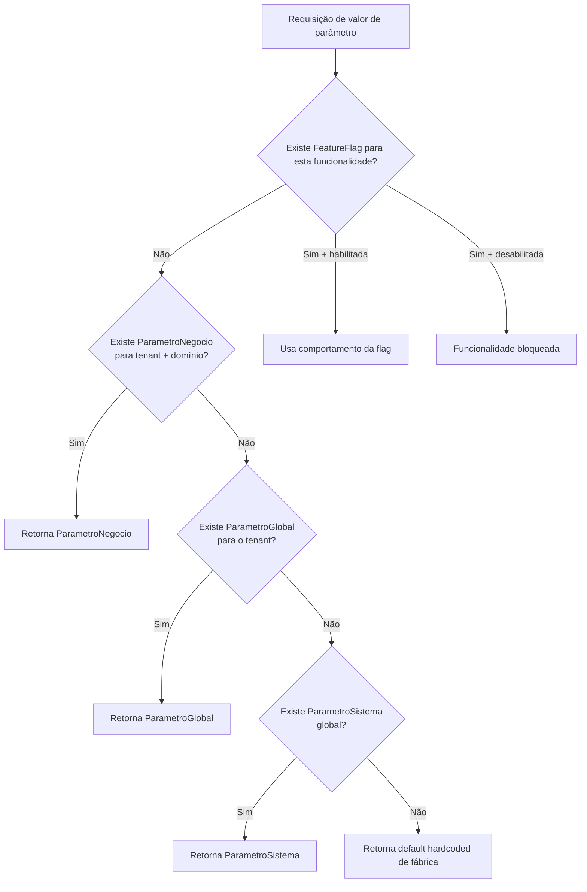
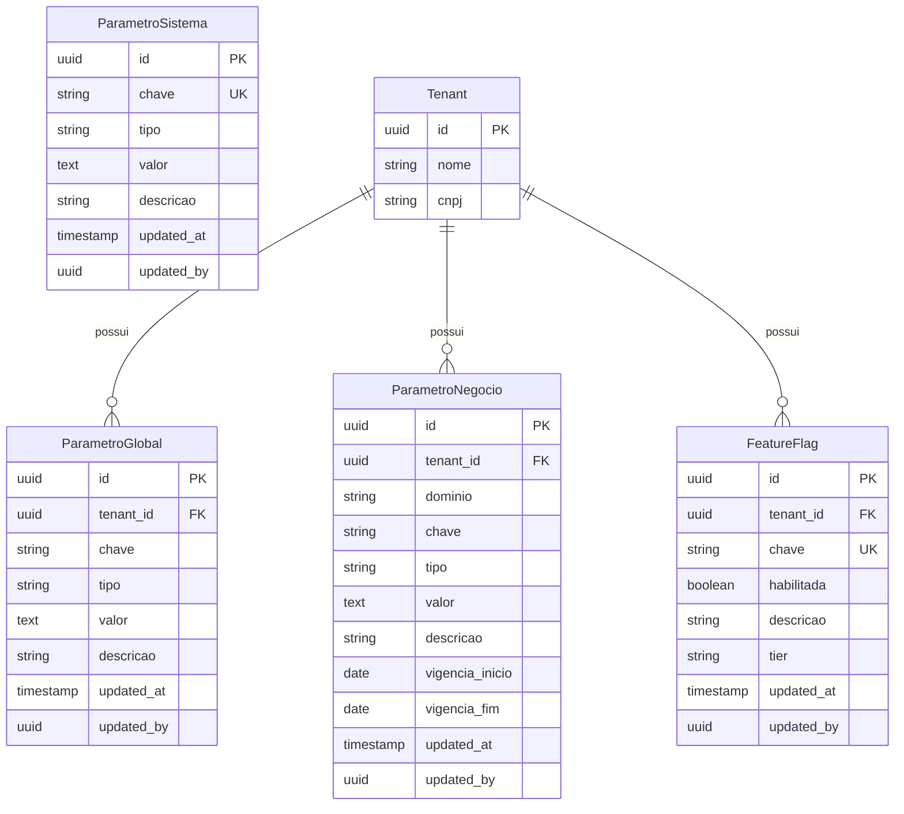
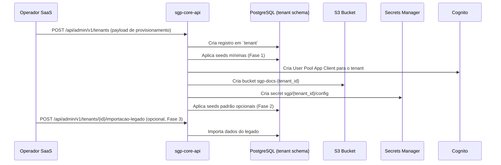

# Guia de Parametrização — SGP Moderno

**Versão:** 1.0 | **Data:** 2026-04-21 | **Status:** Draft
**Escopo:** parametros, gestao, folha, previdenciario, saude, recadastramento, integracoes, auditoria
**Depende de:** BRIEF.md, 32-catalogo-de-parametrizacoes-criticas.md, 61-parametros-defaults-e-seeds-locais.md

---

## Sumário

1. [Arquitetura de parametrização](#1-arquitetura-de-parametrização)
2. [Catálogo por domínio](#2-catálogo-por-domínio)
3. [Catálogos mestres estruturantes](#3-catálogos-mestres-estruturantes)
4. [Feature flags](#4-feature-flags)
5. [Seeds por tenant](#5-seeds-por-tenant)
6. [Ambientes](#6-ambientes)
7. [Migração do legado](#7-migração-do-legado)
8. [Auditoria de parâmetros](#8-auditoria-de-parâmetros)

---

## 1. Arquitetura de parametrização

### 1.1 As quatro camadas

O SGP organiza toda parametrização em quatro camadas hierárquicas. Cada camada tem escopo, ciclo de vida e responsável distintos.

| Camada | Entidade           | Escopo                  | Quem pode criar                         | Descrição                                                                                                                               |
| ------ | ------------------ | ----------------------- | --------------------------------------- | --------------------------------------------------------------------------------------------------------------------------------------- |
| 1      | `ParametroSistema` | Instância SaaS global   | Operador SaaS (superadmin)              | Valores únicos por deployment — versão eSocial, URLs de webservices, chaves de integração de infraestrutura. Não é por tenant.          |
| 2      | `ParametroGlobal`  | Tenant (órgão)          | Administrador do tenant                 | Comportamento do órgão — terminologia, logos, cor do tema, limites fiscais e previdenciários vigentes.                                  |
| 3      | `ParametroNegocio` | Tenant + domínio        | Administrador do domínio                | Regras de negócio específicas — alíquotas INSS locais, enquadramentos, faixas salariais customizadas, limites operacionais por domínio. |
| 4      | `FeatureFlag`      | Tenant + funcionalidade | Administrador do tenant / Operador SaaS | Boolean puro; controla rollout gradual de funcionalidades. Pode ser sobreposto por hierarquia.                                          |

### 1.2 Diagrama de hierarquia e resolução



**Regra de fallback:**
`ParametroNegocio` > `ParametroGlobal` > `ParametroSistema` > `default de código`

Nenhuma camada é obrigada a existir para todas as chaves. Se uma chave não está configurada em determinada camada, o sistema desce automaticamente para a próxima.

### 1.3 Modelo lógico das entidades de parametrização



### 1.4 Resolução em runtime (NestJS)

O módulo `parametros` expõe o serviço `ParametroResolverService` com o método:

```typescript
resolve(chave: string, contexto: ParametroContexto): Promise<string | null>
// ParametroContexto: { tenantId: string; dominio?: string }
```

A resolução percorre as camadas em ordem e retorna o primeiro valor encontrado. O resultado é cacheado em memória (TTL configurável via `ParametroSistema.cache_ttl_segundos`) para evitar consultas repetidas ao banco durante o processamento de folha.

---

## 2. Catálogo por domínio

> **Convenções da tabela:**
>
> - **Tipo:** `string`, `int`, `decimal`, `bool`, `date`, `json`, `enum`
> - **Escopo:** `sistema` (global SaaS), `tenant` (por órgão), `tenant+dominio` (por órgão e área)
> - **Papel alterador:** papel RBAC mínimo necessário para alterar o parâmetro

---

### 2.1 Identidade visual e terminologia

Parâmetros de camada `ParametroGlobal` (escopo: tenant). Controlam a aparência e a linguagem institucional exibidas ao usuário final.

| Chave                               | Tipo    | Escopo | Default                                 | Papel alterador              | Efeito                                                                                                                      | Evento de auditoria       | Validação                                                     |
| ----------------------------------- | ------- | ------ | --------------------------------------- | ---------------------------- | --------------------------------------------------------------------------------------------------------------------------- | ------------------------- | ------------------------------------------------------------- |
| `titulo_institucional`              | string  | tenant | `Sistema de Gestão de Pessoas`          | `GESTAO.PARAMETRO.ATUALIZAR` | Exibido na barra superior e nos PDFs emitidos                                                                               | `PARAMETRO_GLOBAL.UPDATE` | Máx. 120 caracteres; não vazio                                |
| `subtitulo`                         | string  | tenant | `Sistema de Gestão de Recursos Humanos` | `GESTAO.PARAMETRO.ATUALIZAR` | Exibido abaixo do logo na tela de login e no rodapé de relatórios                                                           | `PARAMETRO_GLOBAL.UPDATE` | Máx. 200 caracteres                                           |
| `logo_principal`                    | string  | tenant | `(none)`                                | `GESTAO.PARAMETRO.ATUALIZAR` | S3 key do logo exibido no header claro                                                                                      | `PARAMETRO_GLOBAL.UPDATE` | S3 key existente; MIME: image/png, image/svg+xml; máx. 500 KB |
| `logo_secundario`                   | string  | tenant | `(none)`                                | `GESTAO.PARAMETRO.ATUALIZAR` | S3 key do logo exibido em fundo escuro / portal                                                                             | `PARAMETRO_GLOBAL.UPDATE` | S3 key existente; MIME: image/png, image/svg+xml; máx. 500 KB |
| `logo_relatorio`                    | string  | tenant | `(none)`                                | `GESTAO.PARAMETRO.ATUALIZAR` | S3 key do logo impresso em PDFs e relatórios                                                                                | `PARAMETRO_GLOBAL.UPDATE` | S3 key existente                                              |
| `logo_relatorio_altura_cm`          | decimal | tenant | `2.5`                                   | `GESTAO.PARAMETRO.ATUALIZAR` | Altura em cm da logo nos PDFs                                                                                               | `PARAMETRO_GLOBAL.UPDATE` | 0.5 ≤ valor ≤ 10.0                                            |
| `logo_relatorio_largura_cm`         | decimal | tenant | `6.0`                                   | `GESTAO.PARAMETRO.ATUALIZAR` | Largura em cm da logo nos PDFs                                                                                              | `PARAMETRO_GLOBAL.UPDATE` | 0.5 ≤ valor ≤ 20.0                                            |
| `favicon`                           | string  | tenant | `(none)`                                | `GESTAO.PARAMETRO.ATUALIZAR` | S3 key do favicon .ico ou .png                                                                                              | `PARAMETRO_GLOBAL.UPDATE` | S3 key existente; MIME: image/x-icon, image/png               |
| `cor_primaria`                      | string  | tenant | `#1565C0`                               | `GESTAO.PARAMETRO.ATUALIZAR` | Cor principal do tema Angular Material                                                                                      | `PARAMETRO_GLOBAL.UPDATE` | Formato `#RRGGBB`; contraste mínimo WCAG AA com branco        |
| `cor_secundaria`                    | string  | tenant | `#FF6F00`                               | `GESTAO.PARAMETRO.ATUALIZAR` | Cor de destaque/acento do tema                                                                                              | `PARAMETRO_GLOBAL.UPDATE` | Formato `#RRGGBB`                                             |
| `frase_institucional`               | string  | tenant | `(vazio)`                               | `GESTAO.PARAMETRO.ATUALIZAR` | Frase exibida na tela de login e no portal do servidor                                                                      | `PARAMETRO_GLOBAL.UPDATE` | Máx. 300 caracteres                                           |
| `terminologia_funcionario_servidor` | enum    | tenant | `FUNCIONARIO`                           | `GESTAO.PARAMETRO.ATUALIZAR` | Alterna o termo exibido em toda a interface: `FUNCIONARIO` → "Funcionário/Funcionários"; `SERVIDOR` → "Servidor/Servidores" | `PARAMETRO_GLOBAL.UPDATE` | Valores permitidos: `FUNCIONARIO`, `SERVIDOR`                 |
| `terminologia_funcionario_singular` | string  | tenant | `Funcionário`                           | `GESTAO.PARAMETRO.ATUALIZAR` | Forma singular do termo (sobrescreve o enum para variações específicas)                                                     | `PARAMETRO_GLOBAL.UPDATE` | Máx. 40 caracteres; não vazio                                 |
| `terminologia_funcionario_plural`   | string  | tenant | `Funcionários`                          | `GESTAO.PARAMETRO.ATUALIZAR` | Forma plural do termo                                                                                                       | `PARAMETRO_GLOBAL.UPDATE` | Máx. 40 caracteres; não vazio                                 |
| `terminologia_matricula`            | string  | tenant | `Matrícula`                             | `GESTAO.PARAMETRO.ATUALIZAR` | Rótulo exibido para o campo de matrícula funcional                                                                          | `PARAMETRO_GLOBAL.UPDATE` | Máx. 40 caracteres; não vazio                                 |
| `sigla_sistema`                     | string  | tenant | `SGP`                                   | `GESTAO.PARAMETRO.ATUALIZAR` | Sigla exibida em tags, títulos de browser e documentos                                                                      | `PARAMETRO_GLOBAL.UPDATE` | Máx. 10 caracteres; alfanumérico                              |

---

### 2.2 Folha de Pagamento

Parâmetros de camada `ParametroGlobal` e `ParametroNegocio` (escopo: tenant e tenant+domínio). Controlam limites legais, tabelas fiscais e comportamento do motor de cálculo.

| Chave                                    | Tipo    | Escopo | Default                            | Papel alterador              | Efeito                                                                                                           | Evento de auditoria        | Validação                                                                             |
| ---------------------------------------- | ------- | ------ | ---------------------------------- | ---------------------------- | ---------------------------------------------------------------------------------------------------------------- | -------------------------- | ------------------------------------------------------------------------------------- |
| `inss_teto`                              | decimal | tenant | `7786.02`                          | `FOLHA_DE_PGT.GESTAO`        | Teto do salário de contribuição INSS. Salários acima deste valor são limitados ao teto para cálculo do desconto. | `PARAMETRO_GLOBAL.UPDATE`  | Decimal ≥ 0; até 2 casas decimais; exige competência de vigência                      |
| `inss_faixas`                            | json    | tenant | Ver tabela progressiva RFB vigente | `FOLHA_DE_PGT.GESTAO`        | Array de faixas progressivas INSS `[{faixa_inicial, faixa_final, aliquota_pct}]`. Substitui tabela anual.        | `PARAMETRO_NEGOCIO.UPDATE` | JSON válido; faixas contíguas; última faixa_final = teto; alíquotas entre 0.01 e 0.30 |
| `irrf_faixas`                            | json    | tenant | Ver tabela IRRF RFB vigente        | `FOLHA_DE_PGT.GESTAO`        | Array de faixas IRRF `[{faixa_inicial, faixa_final, aliquota_pct, deducao_valor}]`                               | `PARAMETRO_NEGOCIO.UPDATE` | JSON válido; faixas contíguas; deduções não negativas                                 |
| `inss_patronal_aliquota`                 | decimal | tenant | `0.20`                             | `FOLHA_DE_PGT.GESTAO`        | Alíquota patronal INSS para RGPS (entes que contribuem ao RGPS). Não se aplica ao RPPS puro.                     | `PARAMETRO_NEGOCIO.UPDATE` | 0.0 ≤ valor ≤ 0.40                                                                    |
| `rpps_aliquota_segurado`                 | decimal | tenant | `0.14`                             | `FOLHA_DE_PGT.GESTAO`        | Alíquota de contribuição do segurado ao RPPS                                                                     | `PARAMETRO_NEGOCIO.UPDATE` | 0.0 ≤ valor ≤ 0.35; exige base legal                                                  |
| `rpps_aliquota_patronal`                 | decimal | tenant | `0.22`                             | `FOLHA_DE_PGT.GESTAO`        | Alíquota de contribuição patronal ao RPPS                                                                        | `PARAMETRO_NEGOCIO.UPDATE` | 0.0 ≤ valor ≤ 0.50                                                                    |
| `salario_minimo_vigente`                 | decimal | tenant | `1518.00`                          | `FOLHA_DE_PGT.GESTAO`        | Salário mínimo nacional vigente. Usado em fórmulas que referenciam `salario_minimo`.                             | `PARAMETRO_GLOBAL.UPDATE`  | Decimal > 0; data de vigência obrigatória                                             |
| `teto_prefeitura`                        | decimal | tenant | `27089.54`                         | `FOLHA_DE_PGT.GESTAO`        | Teto remuneratório local do órgão. Usado como limitador de proventos e vencimentos.                              | `PARAMETRO_GLOBAL.UPDATE`  | Decimal > 0                                                                           |
| `valor_dependente_irrf`                  | decimal | tenant | `189.59`                           | `FOLHA_DE_PGT.GESTAO`        | Dedução por dependente na base de cálculo do IRRF                                                                | `PARAMETRO_GLOBAL.UPDATE`  | Decimal ≥ 0                                                                           |
| `salario_familia_faixas`                 | json    | tenant | Ver portaria MPS vigente           | `FOLHA_DE_PGT.GESTAO`        | Array de faixas para salário-família `[{remuneracao_max, valor_cota}]`                                           | `PARAMETRO_NEGOCIO.UPDATE` | JSON válido; faixas crescentes; valores positivos                                     |
| `ferias_dias_padrao`                     | int     | tenant | `30`                               | `FOLHA_DE_PGT.GESTAO`        | Número de dias de férias padrão por período aquisitivo                                                           | `PARAMETRO_GLOBAL.UPDATE`  | 20 ≤ valor ≤ 60                                                                       |
| `13o_antecipacao_percentual`             | decimal | tenant | `0.50`                             | `FOLHA_DE_PGT.GESTAO`        | Percentual do 13º salário pago na antecipação de férias                                                          | `PARAMETRO_GLOBAL.UPDATE`  | 0.0 < valor ≤ 1.0                                                                     |
| `decimo_terceiro_parcela_antecipada_mes` | int     | tenant | `6`                                | `FOLHA_DE_PGT.GESTAO`        | Mês de referência para antecipação da 1ª parcela do 13º                                                          | `PARAMETRO_GLOBAL.UPDATE`  | 1 ≤ valor ≤ 12                                                                        |
| `data_fechamento_mensal_padrao`          | int     | tenant | `25`                               | `FOLHA_DE_PGT.GESTAO`        | Dia do mês em que a competência é programada para fechamento automático                                          | `PARAMETRO_GLOBAL.UPDATE`  | 1 ≤ valor ≤ 28                                                                        |
| `data_pagamento_padrao`                  | int     | tenant | `30`                               | `FOLHA_DE_PGT.GESTAO`        | Dia padrão de pagamento da folha mensal                                                                          | `PARAMETRO_GLOBAL.UPDATE`  | 1 ≤ valor ≤ 31                                                                        |
| `arredondamento_regra`                   | enum    | tenant | `MATEMATICO`                       | `FOLHA_DE_PGT.GESTAO`        | Regra de arredondamento de valores monetários: `MATEMATICO` (padrão), `TRUNCAR`, `TETO`                          | `PARAMETRO_GLOBAL.UPDATE`  | Valores: `MATEMATICO`, `TRUNCAR`, `TETO`                                              |
| `memoria_calculo_retencao_anos`          | int     | tenant | `5`                                | `FOLHA_DE_PGT.GESTAO`        | Anos de retenção do campo `memoria_calculo` JSONB nos contracheques                                              | `PARAMETRO_GLOBAL.UPDATE`  | 2 ≤ valor ≤ 10                                                                        |
| `numero_remessa`                         | int     | tenant | `0`                                | `FOLHA_DE_PGT.GESTAO`        | Contador sequencial de remessas bancárias geradas                                                                | `PARAMETRO_GLOBAL.UPDATE`  | Inteiro ≥ 0; incrementado automaticamente pelo sistema                                |
| `folha_13_salario_codigo`                | int     | tenant | `3`                                | `FOLHA_DE_PGT.GESTAO`        | Código interno de referência ao tipo de processamento do 13º salário                                             | `PARAMETRO_GLOBAL.UPDATE`  | Inteiro > 0; deve existir em `tipo_processamento`                                     |
| `matricula_automatica`                   | bool    | tenant | `true`                             | `GESTAO.PARAMETRO.ATUALIZAR` | Quando verdadeiro, a matrícula é gerada automaticamente pelo sistema no padrão configurado                       | `PARAMETRO_GLOBAL.UPDATE`  | Booleano                                                                              |
| `matricula_formato`                      | string  | tenant | `{PREFIXO}{SEQ:6}{SUFIXO}`         | `GESTAO.PARAMETRO.ATUALIZAR` | Template de geração da matrícula automática                                                                      | `PARAMETRO_GLOBAL.UPDATE`  | Deve conter `{SEQ:N}` quando matricula_automatica = true                              |
| `matricula_prefixo`                      | string  | tenant | `(vazio)`                          | `GESTAO.PARAMETRO.ATUALIZAR` | Prefixo fixo da matrícula                                                                                        | `PARAMETRO_GLOBAL.UPDATE`  | Máx. 10 caracteres; alfanumérico                                                      |
| `matricula_sufixo`                       | string  | tenant | `(vazio)`                          | `GESTAO.PARAMETRO.ATUALIZAR` | Sufixo fixo da matrícula                                                                                         | `PARAMETRO_GLOBAL.UPDATE`  | Máx. 10 caracteres; alfanumérico                                                      |
| `funcionario_etapas`                     | bool    | tenant | `false`                            | `GESTAO.PARAMETRO.ATUALIZAR` | Quando verdadeiro, o cadastro funcional é dividido em etapas sequenciais (compatibilidade com fluxo legado)      | `PARAMETRO_GLOBAL.UPDATE`  | Booleano                                                                              |
| `vinculo_efetivo_id`                     | string  | tenant | `(none)`                           | `GESTAO.PARAMETRO.ATUALIZAR` | UUID do tipo de vínculo considerado "efetivo" para filtros, relatórios e integrações                             | `PARAMETRO_GLOBAL.UPDATE`  | UUID existente em `tipo_vinculo`                                                      |

---

### 2.3 eSocial

Parâmetros de camada `ParametroGlobal` (escopo: tenant). Controlam a comunicação com o webservice eSocial S-1.2.

| Chave                     | Tipo   | Escopo  | Default                                           | Papel alterador                           | Efeito                                                                                                                      | Evento de auditoria        | Validação                                                                                  |
| ------------------------- | ------ | ------- | ------------------------------------------------- | ----------------------------------------- | --------------------------------------------------------------------------------------------------------------------------- | -------------------------- | ------------------------------------------------------------------------------------------ |
| `esocial_ambiente`        | enum   | tenant  | `RESTRITA`                                        | `GESTAO.PARAMETRO.ATUALIZAR`              | Ambiente de envio dos eventos: `RESTRITA` (homologação) ou `PRODUCAO`. Altera a URL do webservice e o receptor dos eventos. | `PARAMETRO_GLOBAL.UPDATE`  | Valores: `RESTRITA`, `PRODUCAO`                                                            |
| `esocial_cert_alias`      | string | tenant  | `(none)`                                          | `GESTAO.PARAMETRO.ATUALIZAR`              | Alias do certificado digital A1 armazenado no Secrets Manager para assinatura dos eventos                                   | `PARAMETRO_GLOBAL.UPDATE`  | Não vazio; alias existente no Secrets Manager                                              |
| `esocial_cnpj_empregador` | string | tenant  | `(none)`                                          | `GESTAO.PARAMETRO.ATUALIZAR`              | CNPJ do empregador cadastrado no eSocial. Usado no campo `empregador` de todos os eventos.                                  | `PARAMETRO_GLOBAL.UPDATE`  | CNPJ válido (14 dígitos sem formatação)                                                    |
| `esocial_modo_envio`      | enum   | tenant  | `LOTE`                                            | `GESTAO.PARAMETRO.ATUALIZAR`              | Estratégia de transmissão: `LOTE` (agrupa até 50 eventos por requisição) ou `INDIVIDUAL` (1 evento por requisição)          | `PARAMETRO_GLOBAL.UPDATE`  | Valores: `LOTE`, `INDIVIDUAL`                                                              |
| `esocial_periodo_padrao`  | string | tenant  | `(mes corrente)`                                  | `GESTAO.PARAMETRO.ATUALIZAR`              | Período de competência padrão para filtragem de eventos pendentes no painel eSocial (formato `YYYY-MM`)                     | `PARAMETRO_GLOBAL.UPDATE`  | Formato `YYYY-MM` ou vazio para mês corrente                                               |
| `esocial_url_webservice`  | string | sistema | `https://webservices.producao.esocial.gov.br/...` | `GESTAO.PARAMETRO.ATUALIZAR` (superadmin) | URL do webservice SOAP do governo. Muda entre ambiente restrita e produção. Mantida em `ParametroSistema`.                  | `PARAMETRO_SISTEMA.UPDATE` | URL válida; HTTPS obrigatório                                                              |
| `esocial_ignorados`       | json   | tenant  | `[]`                                              | `GESTAO.PARAMETRO.ATUALIZAR`              | Lista de códigos de eventos que este tenant não envia (ex.: `["S-1080","S-1070"]`)                                          | `PARAMETRO_GLOBAL.UPDATE`  | JSON array de strings; cada item deve ser código de evento eSocial válido no leiaute S-1.2 |
| `esocial_leiaute_versao`  | string | sistema | `S-1.2`                                           | `GESTAO.PARAMETRO.ATUALIZAR` (superadmin) | Versão do leiaute eSocial em uso por toda a instância                                                                       | `PARAMETRO_SISTEMA.UPDATE` | Não vazio; controlado pelo operador SaaS                                                   |

### 2.4 Folha — reajustes salariais

Parâmetro de camada `ParametroGlobal` (escopo: tenant). Controla o dia/mês padrão de aplicação de reajustes anuais e mantém referência auditável ao último reajuste de tabela aplicado.

| Chave                       | Tipo | Escopo | Default                                              | Papel alterador                  | Efeito                                                                                                                                     | Evento de auditoria                        | Validação                                                                               |
| --------------------------- | ---- | ------ | ---------------------------------------------------- | -------------------------------- | ------------------------------------------------------------------------------------------------------------------------------------------ | ------------------------------------------ | --------------------------------------------------------------------------------------- |
| `reajuste.data_base_padrao` | json | tenant | `{ "month": 1, "day": 1, "lastAdjustmentId": null }` | `avaliacao.salary_history.write` | Define a data-base padrão para reajuste em massa e aponta para o último registro em `hr.salary_level_history` criado pela API de reajuste. | `avaliacao.salary_history.mass_adjustment` | `month` entre 1 e 12; `day` entre 1 e 31; `lastAdjustmentId` nulo ou UUID de histórico. |

---

### 2.5 Previdenciário

Parâmetros de camada `ParametroGlobal` e `ParametroNegocio` (escopo: tenant e tenant+domínio).

| Chave                               | Tipo    | Escopo         | Default                | Papel alterador                | Efeito                                                                                                                                                   | Evento de auditoria        | Validação                                        |
| ----------------------------------- | ------- | -------------- | ---------------------- | ------------------------------ | -------------------------------------------------------------------------------------------------------------------------------------------------------- | -------------------------- | ------------------------------------------------ |
| `regime_previdenciario`             | enum    | tenant         | `RPPS`                 | `GESTAO.PARAMETRO.ATUALIZAR`   | Regime aplicável: `RPPS`, `RGPS` ou `MISTO`. Altera regras de contribuição, cálculo de aposentadoria e simulações.                                       | `PARAMETRO_GLOBAL.UPDATE`  | Valores: `RPPS`, `RGPS`, `MISTO`                 |
| `siprev_url`                        | string  | tenant         | `(none)`               | `GESTAO.PARAMETRO.ATUALIZAR`   | URL do portal SIPREV para upload de exportações                                                                                                          | `PARAMETRO_GLOBAL.UPDATE`  | URL válida; HTTPS obrigatório                    |
| `siprev_layout_versao`              | string  | tenant         | `(versao vigente MPS)` | `GESTAO.PARAMETRO.ATUALIZAR`   | Versão do leiaute SIPREV utilizado nas exportações                                                                                                       | `PARAMETRO_GLOBAL.UPDATE`  | Não vazio                                        |
| `aposentadoria_idade_minima_homem`  | int     | tenant+dominio | `65`                   | `MODULO_PREVIDENCIARIO.GESTAO` | Idade mínima para aposentadoria compulsória/voluntária masculina (EC 103/2019 = 65)                                                                      | `PARAMETRO_NEGOCIO.UPDATE` | 55 ≤ valor ≤ 75                                  |
| `aposentadoria_idade_minima_mulher` | int     | tenant+dominio | `62`                   | `MODULO_PREVIDENCIARIO.GESTAO` | Idade mínima para aposentadoria compulsória/voluntária feminina (EC 103/2019 = 62)                                                                       | `PARAMETRO_NEGOCIO.UPDATE` | 50 ≤ valor ≤ 75                                  |
| `tempo_contribuicao_minimo_homem`   | int     | tenant+dominio | `35`                   | `MODULO_PREVIDENCIARIO.GESTAO` | Tempo mínimo de contribuição em anos para homens                                                                                                         | `PARAMETRO_NEGOCIO.UPDATE` | 20 ≤ valor ≤ 40                                  |
| `tempo_contribuicao_minimo_mulher`  | int     | tenant+dominio | `30`                   | `MODULO_PREVIDENCIARIO.GESTAO` | Tempo mínimo de contribuição em anos para mulheres                                                                                                       | `PARAMETRO_NEGOCIO.UPDATE` | 15 ≤ valor ≤ 40                                  |
| `pensao_percentual_base`            | decimal | tenant+dominio | `0.50`                 | `MODULO_PREVIDENCIARIO.GESTAO` | Percentual mínimo de pensão por morte sobre a base de cálculo                                                                                            | `PARAMETRO_NEGOCIO.UPDATE` | 0.0 < valor ≤ 1.0                                |
| `pensao_rateio_regra`               | enum    | tenant+dominio | `IGUALITARIO`          | `MODULO_PREVIDENCIARIO.GESTAO` | Regra de rateio entre beneficiários: `IGUALITARIO` (cotas iguais), `PROPORCIONAL` (por tempo de dependência), `MANUAL` (cota explícita por beneficiário) | `PARAMETRO_NEGOCIO.UPDATE` | Valores: `IGUALITARIO`, `PROPORCIONAL`, `MANUAL` |
| `abono_permanencia_habilitado`      | bool    | tenant+dominio | `true`                 | `MODULO_PREVIDENCIARIO.GESTAO` | Habilita o registro e processamento de abono de permanência para segurados que preencheram requisitos de aposentadoria                                   | `PARAMETRO_NEGOCIO.UPDATE` | Booleano                                         |

---

### 2.5 Saúde Ocupacional e Perícia

Parâmetros de camada `ParametroNegocio` (escopo: tenant+dominio `saude`).

| Chave                                   | Tipo | Escopo         | Default | Papel alterador                | Efeito                                                                                                            | Evento de auditoria        | Validação                                  |
| --------------------------------------- | ---- | -------------- | ------- | ------------------------------ | ----------------------------------------------------------------------------------------------------------------- | -------------------------- | ------------------------------------------ |
| `pericia_duracao_padrao_minutos`        | int  | tenant+dominio | `30`    | `JUNTA_MEDICA.GESTAO`          | Duração padrão de cada slot de agenda médica em minutos                                                           | `PARAMETRO_NEGOCIO.UPDATE` | 10 ≤ valor ≤ 120                           |
| `junta_medica_composicao_minima`        | int  | tenant+dominio | `1`     | `JUNTA_MEDICA.GESTAO`          | Número mínimo de profissionais de saúde exigido para validar um prontuário de perícia                             | `PARAMETRO_NEGOCIO.UPDATE` | 1 ≤ valor ≤ 5                              |
| `afastamento_dias_sem_pericia`          | int  | tenant+dominio | `15`    | `JUNTA_MEDICA.GESTAO`          | Número máximo de dias de afastamento concedidos sem obrigatoriedade de perícia médica                             | `PARAMETRO_NEGOCIO.UPDATE` | 1 ≤ valor ≤ 60                             |
| `cat_prazo_envio_dias`                  | int  | tenant+dominio | `1`     | `JUNTA_MEDICA.GESTAO`          | Prazo legal (dias corridos) para envio da CAT após o acidente de trabalho                                         | `PARAMETRO_NEGOCIO.UPDATE` | 1 ≤ valor ≤ 30                             |
| `retorno_pericial_intervalo_dias`       | int  | tenant+dominio | `30`    | `JUNTA_MEDICA.GESTAO`          | Intervalo mínimo em dias entre dois agendamentos periciais para o mesmo servidor (evita solicitações repetitivas) | `PARAMETRO_NEGOCIO.UPDATE` | 1 ≤ valor ≤ 180                            |
| `afastamento_remunerado_max_dias`       | int  | tenant+dominio | `720`   | `JUNTA_MEDICA.GESTAO`          | Limite acumulado de dias de afastamento remunerado por licença médica                                             | `PARAMETRO_NEGOCIO.UPDATE` | 30 ≤ valor ≤ 1080                          |
| `pensionista_universitario_alerta_anos` | int  | tenant+dominio | `25`    | `MODULO_PREVIDENCIARIO.GESTAO` | Idade (anos) em que o sistema emite alerta para cessação de pensão de beneficiário universitário                  | `PARAMETRO_NEGOCIO.UPDATE` | 18 ≤ valor ≤ 30; não bloqueante por padrão |

---

### 2.6 Recadastramento

Parâmetros de camada `ParametroNegocio` (escopo: tenant+dominio `recadastramento`).

| Chave                                           | Tipo | Escopo         | Default          | Papel alterador          | Efeito                                                                                                                                                      | Evento de auditoria        | Validação                                                   |
| ----------------------------------------------- | ---- | -------------- | ---------------- | ------------------------ | ----------------------------------------------------------------------------------------------------------------------------------------------------------- | -------------------------- | ----------------------------------------------------------- |
| `recadastramento_periodicidade_meses`           | int  | tenant+dominio | `12`             | `RECADASTRAMENTO.GESTAO` | Periodicidade do ciclo de recadastramento em meses (12 = anual para aposentados; 6 = semestral para pensionistas)                                           | `PARAMETRO_NEGOCIO.UPDATE` | 1 ≤ valor ≤ 24                                              |
| `recadastramento_prazo_comparecimento_dias`     | int  | tenant+dominio | `30`             | `RECADASTRAMENTO.GESTAO` | Janela de dias a partir do aviso para o beneficiário comparecer ou realizar o recadastramento                                                               | `PARAMETRO_NEGOCIO.UPDATE` | 5 ≤ valor ≤ 90                                              |
| `recadastramento_bloqueio_apos_dias`            | int  | tenant+dominio | `60`             | `RECADASTRAMENTO.GESTAO` | Dias após o prazo de comparecimento sem recadastramento para bloqueio automático do pagamento                                                               | `PARAMETRO_NEGOCIO.UPDATE` | 10 ≤ valor ≤ 180                                            |
| `recadastramento_canais_permitidos`             | json | tenant+dominio | `["PRESENCIAL"]` | `RECADASTRAMENTO.GESTAO` | Lista de canais habilitados: `PRESENCIAL`, `POSTAL`, `ONLINE`, `GOVBR`                                                                                      | `PARAMETRO_NEGOCIO.UPDATE` | JSON array; pelo menos 1 canal; valores permitidos listados |
| `recadastramento_faixa_diaria_aniversario`      | bool | tenant+dominio | `true`           | `RECADASTRAMENTO.GESTAO` | Quando verdadeiro, o sistema distribui os vencimentos de recadastramento pelo dia de aniversário do beneficiário dentro do mês, evitando filas concentradas | `PARAMETRO_NEGOCIO.UPDATE` | Booleano                                                    |
| `recadastramento_notificacao_antecedencia_dias` | int  | tenant+dominio | `30`             | `RECADASTRAMENTO.GESTAO` | Dias de antecedência para disparo da notificação de vencimento do ciclo                                                                                     | `PARAMETRO_NEGOCIO.UPDATE` | 5 ≤ valor ≤ 60                                              |

---

### 2.7 Integrações externas

Mistura de camadas `ParametroSistema` (infraestrutura) e `ParametroGlobal` (por tenant).

| Chave                            | Tipo   | Escopo  | Default        | Papel alterador              | Efeito                                                                                | Evento de auditoria        | Validação                                                               |
| -------------------------------- | ------ | ------- | -------------- | ---------------------------- | ------------------------------------------------------------------------------------- | -------------------------- | ----------------------------------------------------------------------- |
| `cognito_user_pool_id`           | string | sistema | `(IaC)`        | Operador SaaS                | ID do Cognito User Pool da instância. Injetado via variável de ambiente pelo ECS.     | `PARAMETRO_SISTEMA.UPDATE` | Formato `<regiao>_<id>`                                                 |
| `cognito_client_id`              | string | tenant  | `(IaC)`        | Operador SaaS                | App Client ID do Cognito associado ao tenant                                          | `PARAMETRO_GLOBAL.UPDATE`  | Não vazio                                                               |
| `govbr_enabled`                  | bool   | tenant  | `false`        | `GESTAO.PARAMETRO.ATUALIZAR` | Habilita federação Gov.br como IdP para login do portal do servidor                   | `PARAMETRO_GLOBAL.UPDATE`  | Booleano; requer feature flag `portal.govbr_oidc = true`                |
| `api_externa_rate_limit`         | int    | tenant  | `100`          | `GESTAO.PARAMETRO.ATUALIZAR` | Limite de requisições por minuto para a API externa (client-credentials) deste tenant | `PARAMETRO_GLOBAL.UPDATE`  | 10 ≤ valor ≤ 10000                                                      |
| `api_externa_escopos_permitidos` | json   | tenant  | `["sgp:read"]` | `GESTAO.PARAMETRO.ATUALIZAR` | Lista de escopos OAuth2 que o tenant pode conceder a sistemas externos                | `PARAMETRO_GLOBAL.UPDATE`  | JSON array de strings; subconjunto dos escopos cadastrados na instância |
| `transparencia_url`              | string | tenant  | `(none)`       | `GESTAO.PARAMETRO.ATUALIZAR` | URL do portal de transparência municipal para upload do CSV de folha                  | `PARAMETRO_GLOBAL.UPDATE`  | URL válida                                                              |
| `transparencia_formato`          | enum   | tenant  | `CSV`          | `GESTAO.PARAMETRO.ATUALIZAR` | Formato do arquivo exportado para transparência: `CSV`, `XML`, `JSON`                 | `PARAMETRO_GLOBAL.UPDATE`  | Valores: `CSV`, `XML`, `JSON`                                           |
| `neoconsig_habilitado`           | bool   | tenant  | `false`        | `GESTAO.PARAMETRO.ATUALIZAR` | Habilita importação de consignados via layout Neoconsig                               | `PARAMETRO_GLOBAL.UPDATE`  | Booleano                                                                |
| `banco_remessa_padrao_id`        | string | tenant  | `(none)`       | `FOLHA_DE_PGT.GESTAO`        | UUID do banco padrão para geração de arquivo de remessa CNAB                          | `PARAMETRO_GLOBAL.UPDATE`  | UUID existente em `banco`                                               |

---

### 2.8 Arquivo e Armazenamento (S3)

Parâmetros de camada `ParametroSistema` e `ParametroGlobal`.

| Chave                            | Tipo   | Escopo | Default                                                       | Papel alterador              | Efeito                                                                                           | Evento de auditoria       | Validação                                 |
| -------------------------------- | ------ | ------ | ------------------------------------------------------------- | ---------------------------- | ------------------------------------------------------------------------------------------------ | ------------------------- | ----------------------------------------- |
| `s3_bucket_documentos`           | string | tenant | `sgp-docs-{tenant_id}`                                        | Operador SaaS                | Nome do bucket S3 onde os documentos do tenant são armazenados                                   | `PARAMETRO_GLOBAL.UPDATE` | Nome de bucket AWS válido; existente      |
| `s3_kms_key_alias`               | string | tenant | `alias/sgp-{tenant_id}`                                       | Operador SaaS                | Alias da chave KMS usada para SSE-KMS dos objetos S3 do tenant                                   | `PARAMETRO_GLOBAL.UPDATE` | Alias KMS existente; prefixo `alias/`     |
| `s3_retencao_anos_por_tipo`      | json   | tenant | `{"contracheque":5,"laudo":10,"prontuario":20,"auditoria":5}` | `GESTAO.PARAMETRO.ATUALIZAR` | Política de retenção por tipo de documento (em anos) para lifecycle rules S3                     | `PARAMETRO_GLOBAL.UPDATE` | JSON objeto; valores inteiros ≥ 1         |
| `cdn_cloudfront_distribution_id` | string | tenant | `(none)`                                                      | Operador SaaS                | Distribution ID do CloudFront para entrega de documentos públicos (ex.: contracheque via portal) | `PARAMETRO_GLOBAL.UPDATE` | ID CloudFront válido ou vazio             |
| `anexo_tamanho_max_mb`           | int    | tenant | `10`                                                          | `GESTAO.PARAMETRO.ATUALIZAR` | Tamanho máximo permitido para upload de anexos pelo usuário (em MB)                              | `PARAMETRO_GLOBAL.UPDATE` | 1 ≤ valor ≤ 50                            |
| `anexo_mime_permitidos`          | json   | tenant | `["application/pdf","image/jpeg","image/png"]`                | `GESTAO.PARAMETRO.ATUALIZAR` | Lista de MIME types aceitos para upload de anexos                                                | `PARAMETRO_GLOBAL.UPDATE` | JSON array de strings; MIME types válidos |

---

### 2.9 Observabilidade

Parâmetros de camada `ParametroSistema` (escopo: instância).

| Chave                          | Tipo    | Escopo  | Default      | Papel alterador              | Efeito                                                                                                               | Evento de auditoria        | Validação                                 |
| ------------------------------ | ------- | ------- | ------------ | ---------------------------- | -------------------------------------------------------------------------------------------------------------------- | -------------------------- | ----------------------------------------- |
| `logs_nivel`                   | enum    | sistema | `INFO`       | Operador SaaS                | Nível mínimo de log para todos os serviços: `DEBUG`, `INFO`, `WARN`, `ERROR`                                         | `PARAMETRO_SISTEMA.UPDATE` | Valores: `DEBUG`, `INFO`, `WARN`, `ERROR` |
| `trace_sampling_rate`          | decimal | sistema | `0.05`       | Operador SaaS                | Taxa de amostragem do X-Ray / OpenTelemetry (0.0 = desabilitado, 1.0 = 100%)                                         | `PARAMETRO_SISTEMA.UPDATE` | 0.0 ≤ valor ≤ 1.0                         |
| `audit_retention_dias`         | int     | tenant  | `1825`       | `GESTAO.PARAMETRO.ATUALIZAR` | Retenção dos registros de auditoria no banco (em dias). Mínimo: 1825 (5 anos).                                       | `PARAMETRO_GLOBAL.UPDATE`  | valor ≥ 1825                              |
| `audit_export_s3_prefix`       | string  | tenant  | `auditoria/` | `GESTAO.PARAMETRO.ATUALIZAR` | Prefixo S3 para exportação dos logs de auditoria em formato NDJSON                                                   | `PARAMETRO_GLOBAL.UPDATE`  | String sem espaços; pode ser vazio        |
| `metricas_negocio_habilitadas` | bool    | sistema | `true`       | Operador SaaS                | Habilita emissão de métricas de negócio customizadas ao CloudWatch (folhas fechadas, contracheques, eventos eSocial) | `PARAMETRO_SISTEMA.UPDATE` | Booleano                                  |

---

### 2.10 Segurança

Parâmetros de camada `ParametroGlobal` (escopo: tenant), com exceção das políticas de senha que podem ser sobrescritas a nível de instância.

| Chave                         | Tipo | Escopo | Default                                                             | Papel alterador              | Efeito                                                                             | Evento de auditoria       | Validação                                            |
| ----------------------------- | ---- | ------ | ------------------------------------------------------------------- | ---------------------------- | ---------------------------------------------------------------------------------- | ------------------------- | ---------------------------------------------------- |
| `senha_tamanho_minimo`        | int  | tenant | `12`                                                                | `GESTAO.PARAMETRO.ATUALIZAR` | Número mínimo de caracteres na senha do usuário                                    | `PARAMETRO_GLOBAL.UPDATE` | 8 ≤ valor ≤ 30                                       |
| `senha_complexidade`          | json | tenant | `{"maiuscula":true,"minuscula":true,"numero":true,"especial":true}` | `GESTAO.PARAMETRO.ATUALIZAR` | Regras de complexidade da senha                                                    | `PARAMETRO_GLOBAL.UPDATE` | JSON objeto; chaves booleanas                        |
| `sessao_timeout_minutos`      | int  | tenant | `30`                                                                | `GESTAO.PARAMETRO.ATUALIZAR` | Tempo de inatividade em minutos até expiração da sessão JWT                        | `PARAMETRO_GLOBAL.UPDATE` | 5 ≤ valor ≤ 480                                      |
| `mfa_obrigatorio_para_papeis` | json | tenant | `["ROLE_ADMIN_TENANT","ROLE_FOLHA_GESTAO"]`                         | `GESTAO.PARAMETRO.ATUALIZAR` | Lista de papéis RBAC para os quais o MFA é obrigatório                             | `PARAMETRO_GLOBAL.UPDATE` | JSON array de strings; papéis existentes no catálogo |
| `ip_whitelist_api_externa`    | json | tenant | `[]`                                                                | `GESTAO.PARAMETRO.ATUALIZAR` | Lista de CIDRs permitidos para acessar a API externa. Vazio = sem restrição de IP. | `PARAMETRO_GLOBAL.UPDATE` | JSON array; CIDRs válidos ou vazio                   |
| `tentativas_login_max`        | int  | tenant | `5`                                                                 | `GESTAO.PARAMETRO.ATUALIZAR` | Número máximo de tentativas de login antes do bloqueio temporário da conta         | `PARAMETRO_GLOBAL.UPDATE` | 3 ≤ valor ≤ 20                                       |
| `bloqueio_login_minutos`      | int  | tenant | `15`                                                                | `GESTAO.PARAMETRO.ATUALIZAR` | Duração do bloqueio temporário após exceder tentativas_login_max                   | `PARAMETRO_GLOBAL.UPDATE` | 5 ≤ valor ≤ 1440                                     |

---

## 3. Catálogos mestres estruturantes

Os catálogos mestres não são "parâmetros" no sentido estrito — são tabelas de dados gerenciados que condicionam o comportamento do sistema. Uma mudança em qualquer deles altera caminhos de cadastro, fórmulas de folha, documentos gerados ou integrações disponíveis.

> **Regra:** toda alteração em catálogo mestre em domínio sensível gera entrada em `audit_log`. Deleção lógica preferível a exclusão física quando há referências históricas.

### 3.1 Estrutura organizacional

| Catálogo                   | Tabela                             | Campos-chave                                         | Impacto                                                          |
| -------------------------- | ---------------------------------- | ---------------------------------------------------- | ---------------------------------------------------------------- |
| Empresa / Filial           | `empresa_matriz`, `empresa_filial` | CNPJ, razão social, uf, município, código FPAS       | eSocial, remessa bancária, lotação, SIPREV, DIRF                 |
| Lotação / Setor            | `lotacao`                          | código, descrição, filial_id, tipo                   | Enquadramento funcional, relatórios gerenciais, filtros de folha |
| Centro de custo            | `centro_custo`                     | código, descrição, lotacao_id                        | Rateio de despesas, relatórios orçamentários                     |
| Unidade administrativa     | `unidade_administrativa`           | código, nome, tipo (secretaria/departamento/divisão) | Hierarquia organizacional, relatórios                            |
| Fonte de recursos          | `fonte_recursos`                   | código, descrição, natureza (própria/transferida)    | Classificação orçamentária, relatórios financeiros               |
| Classificação orçamentária | `classificacao_orcamentaria`       | projeto/atividade, elemento de despesa               | Rateio de folha, relatório financeiro                            |

### 3.2 Vida funcional

| Catálogo                    | Tabela                  | Campos-chave                                               | Impacto                                |
| --------------------------- | ----------------------- | ---------------------------------------------------------- | -------------------------------------- |
| Cargo                       | `cargo`                 | código, denominação, CBO, nível, plano_cargos_id           | Enquadramento, folha, eSocial S-1020   |
| Função / Cargo em comissão  | `funcao`                | código, denominação, tipo (gratificada/comissão), natureza | Gratificação de função, eSocial S-1035 |
| Plano de cargos e carreiras | `plano_cargos_carreira` | nome, versão, data_vigência, niveis_json                   | Progressão salarial, enquadramento     |

### 3.1 Carga inicial HR-06

Antes de liberar cadastro de servidor ou vínculo funcional, o administrador deve carregar e validar:

- `job_position`: código, nome, descrição e vagas (`vacancies_total`, `vacancies_filled`, `vacancies_open`) com consistência aritmética.
- `job_function`: código, nome, descrição e natureza da função quando aplicável.
- `work_location`: hierarquia de pelo menos órgão, secretaria e unidade, com `fpas_code` e `fap_rate` preenchidos.
- `cost_center`: código único por tenant e nome oficial para rateio.
- `job_structure_employment_link`: elegibilidade entre cargo/função e vínculo funcional.
- `work_location_structure_assignment`: cargos e funções permitidos por lotação.

As mutações usam `gestao.master_data.write`, geram `audit_event` e ficam visíveis apenas ao tenant corrente por RLS.
| Referência salarial | `referencia_salarial` | nível, referência, valor, vigência | Cálculo do vencimento base |
| Faixa / Grupo salarial | `faixa_salarial`, `grupo_salarial` | faixa inicial, faixa final, grupo | Validação de salário, salário-família |
| Tipo de vínculo | `tipo_vinculo` | código, descrição, categoria eSocial | Regras de folha, eSocial S-1030, elegibilidade de verbas |
| Tipo de ingresso | `tipo_ingresso` | código, descrição, fundamento legal | Cadastro de posse, eSocial |
| Motivo de afastamento | `motivo_afastamento` | código, descrição, tipo_afastamento eSocial, impacto_folha | Situação funcional, eSocial S-2230, elegibilidade de verbas |
| Causa de desligamento | `causa_desligamento` | código, descrição, código eSocial | eSocial S-2299, cálculo de rescisão |
| Situação funcional | `enum_situacao_funcional` | código, descrição, transições permitidas | Ciclo de vida do vínculo, filtros, elegibilidade |
| Jornada de trabalho | `jornada` | código, descrição, horas_semanais, tipo | Cálculo de faltas e horas extras, eSocial S-1050 |
| Turno | `turno` | código, descrição, horário entrada/saída | Alocação na posse, escalas |
| Feriado | `feriado` | data, descricao, tipo (nacional/estadual/municipal), uf, municipio | Cálculo de dias úteis, agendamento de perícia |

### 3.3 Folha e verbas

| Catálogo              | Tabela                   | Campos-chave                                                                                        | Impacto                                            |
| --------------------- | ------------------------ | --------------------------------------------------------------------------------------------------- | -------------------------------------------------- |
| Verba / Rubrica       | `verba`                  | código, descrição, tipo (PROVENTO/DESCONTO/BASE), natureza_verba_id, incidência INSS/IRRF/FGTS/RPPS | Composição do contracheque, totalizadores, eSocial |
| Natureza de verba     | `natureza_verba`         | código, descrição, código eSocial S-1010                                                            | Classificação fiscal e previdenciária              |
| Tipo de folha         | `tipo_folha`             | código, descrição, verbas vinculadas                                                                | Segmentação da folha (mensal, férias, rescisão)    |
| Tipo de processamento | `tipo_processamento`     | código, descrição, fluxo                                                                            | Abertura e controle de folha                       |
| Consignado / Convênio | `consignado`, `convenio` | descrição, contrato, banco, limite percentual                                                       | Desconto em folha, controle de margem consignável  |
| Banco                 | `banco`                  | código COMPE/ISPB, nome, layout CNAB                                                                | Remessa bancária, dados do servidor                |

### 3.4 eSocial e fiscal

| Catálogo               | Tabela                | Campos-chave                                       | Impacto                                      |
| ---------------------- | --------------------- | -------------------------------------------------- | -------------------------------------------- |
| Categoria eSocial      | `categoria_esocial`   | código, descrição (categoria do trabalhador S-1.2) | Envio dos eventos, classificação do segurado |
| CBO                    | `cbo`                 | código, descrição                                  | eSocial S-1020, ficha funcional              |
| Código de recolhimento | `codigo_recolhimento` | código GPS/GFIP, descrição                         | DIRF, GPS, exportações fiscais               |
| FPAS                   | `fpas`                | código, descrição                                  | eSocial, GFIP                                |

### 3.5 Saúde e perícia

| Catálogo                      | Tabela                         | Campos-chave                                       | Impacto                                 |
| ----------------------------- | ------------------------------ | -------------------------------------------------- | --------------------------------------- |
| Especialidade médica          | `especialidade_medica`         | código, descrição                                  | Agenda médica, prontuário               |
| Médico / Profissional saúde   | `medico`, `profissional_saude` | CRM, nome, especialidades, filiais                 | Agendamento, laudo                      |
| CID-10                        | `cid`                          | código, descrição, grupo                           | Prontuário, licença médica, eSocial     |
| Motivo de afastamento clínico | `motivo_afastamento_clinico`   | código, descrição, tipo_benefício                  | Licença médica, afastamento             |
| Categoria de doença           | `categoria_doenca`             | código, grupo, subcategoria                        | Classificação clínica, estatísticas SST |
| Exame ocupacional             | `exame_ocupacional`            | código, descrição, periodicidade                   | ASO, PCMSO                              |
| Agente nocivo                 | `agente_nocivo`                | código, tipo (físico/químico/biológico/ergonômico) | LTCAT, PPP, eSocial S-2240              |

### 3.6 Previdenciário

| Catálogo               | Tabela                         | Campos-chave                                               | Impacto                        |
| ---------------------- | ------------------------------ | ---------------------------------------------------------- | ------------------------------ |
| Regra de aposentadoria | `regra_aposentadoria`          | nome, fundamento legal, critérios (idade, tempo, carência) | Simulação, concessão           |
| Tipo de aposentadoria  | `tipo_aposentadoria`           | código, descrição, regime                                  | Classificação do benefício     |
| Tipo de pensão         | `tipo_pensao`                  | código, descrição, natureza                                | Concessão de pensão, cota      |
| Enquadramento          | `enquadramento_previdenciario` | código, descrição, regime                                  | SIPREV, classificação segurado |

---

## 4. Feature flags

As feature flags controlam a ativação gradual de funcionalidades por tenant. São armazenadas na tabela `feature_flag` e avaliadas em runtime. O valor default indica o estado de um tenant recém-provisionado.

> **Convenção de nomeação:** `<dominio>.<funcionalidade>` em snake_case.

| Flag                                  | Default | Tier de alteração | Descrição                                                                                                                                                  | Impacto se habilitada                                                    |
| ------------------------------------- | ------- | ----------------- | ---------------------------------------------------------------------------------------------------------------------------------------------------------- | ------------------------------------------------------------------------ |
| `folha.motor_sql_dsl`                 | `true`  | Operador SaaS     | Ativa o novo motor de cálculo baseado em DSL compilada para SQL. Quando `false`, usa o motor legado Java (modo de compatibilidade temporária na migração). | Motor SQL-DSL entra em vigor; fórmulas são transpiladas antes do cálculo |
| `folha.memoria_calculo_detalhada`     | `false` | Admin tenant      | Quando verdadeiro, a memória de cálculo JSONB de cada lançamento é preenchida com o passo a passo da fórmula, não apenas o resultado                       | Contracheque mais detalhado; aumento de storage ~30%                     |
| `folha.reprocessamento_seletivo`      | `true`  | Admin tenant      | Permite reprocessar apenas contracheques marcados (modo seletivo), além dos modos total e pendentes                                                        | Reduz tempo de reprocessamento parcial                                   |
| `portal.govbr_oidc`                   | `false` | Admin tenant      | Habilita botão "Entrar com Gov.br" no portal do servidor, federando Cognito com o IdP do governo federal                                                   | Login via Gov.br disponível no portal do servidor/pensionista            |
| `portal.contracheque_download`        | `true`  | Admin tenant      | Permite que o servidor baixe o contracheque em PDF diretamente pelo portal                                                                                 | Link de download exibido no portal                                       |
| `esocial.enabled`                     | `false` | Admin tenant      | Habilita todo o módulo eSocial: geração de eventos, painel de envio, worker assíncrono                                                                     | Menu eSocial visível; eventos gerados automaticamente                    |
| `esocial.modo_simulacao`              | `false` | Admin tenant      | Quando verdadeiro, os XMLs eSocial são gerados e validados mas não enviados ao webservice                                                                  | Permite testar geração de eventos sem impacto no governo                 |
| `recadastramento.govbr`               | `false` | Admin tenant      | Habilita o canal Gov.br como opção de recadastramento digital (exige `portal.govbr_oidc = true`)                                                           | Canal Gov.br aparece na lista de canais disponíveis                      |
| `recadastramento.online`              | `false` | Admin tenant      | Habilita recadastramento pelo portal do servidor sem intermediação presencial                                                                              | Canal online disponível; formulário exibido no portal                    |
| `autorizacao.rbac_v2`                 | `true`  | Operador SaaS     | Ativa o modelo RBAC v2 com granularidade por ação (VISUALIZAR/CADASTRAR/ATUALIZAR/EXCLUIR/GESTAO). Quando `false`, usa modelo legado por perfil fixo.      | Controle de acesso granular por ação em todos os módulos                 |
| `report.exportacao_async`             | `false` | Admin tenant      | Relatórios pesados (folha em lote, SIPREV, carteira de aposentados) passam a ser gerados assincronamente com notificação ao usuário quando prontos         | UX de relatório muda: progresso exibido em tempo real                    |
| `integracao.api_publica_prefeitura`   | `false` | Admin tenant      | Habilita os endpoints `/api/publico/prefeitura/*` para integração bidirecional com sistemas da prefeitura                                                  | Endpoints de prova de vida e dependentes habilitados para terceiros      |
| `integracao.transparencia_auto`       | `false` | Admin tenant      | Publica automaticamente o CSV de folha no portal de transparência após o fechamento da competência                                                         | Job pós-fechamento ativado; upload automático ao fechar                  |
| `integracao.neoconsig`                | `false` | Admin tenant      | Habilita importação de consignados via layout Neoconsig                                                                                                    | Botão de importação Neoconsig disponível na tela de consignados          |
| `pericia.replica_multi_vinculo`       | `true`  | Admin tenant      | Propaga automaticamente o resultado de uma perícia para todas as matrículas ativas do mesmo CPF                                                            | Eficiência para servidores com múltiplos vínculos                        |
| `pericia.laudo_validacao_obrigatoria` | `true`  | Admin tenant      | Exige validação do laudo por segundo profissional antes de gerar a licença médica                                                                          | Fluxo de dupla validação ativo                                           |
| `auditoria.full_trace_enabled`        | `false` | Operador SaaS     | Registra auditoria em TODOS os domínios, não apenas nos sensíveis definidos no BRIEF §9                                                                    | Volume de `audit_log` aumenta significativamente                         |
| `auditoria.export_automatico`         | `false` | Admin tenant      | Exporta automaticamente os logs de auditoria para S3 no prefixo `audit_export_s3_prefix` ao final de cada mês                                              | Job mensal de exportação ativo                                           |
| `avaliacao.progressao_automatica`     | `false` | Admin tenant      | Dispara automaticamente a criação de progressão por mérito quando critérios parametrizados são atingidos                                                   | Progressões geradas sem intervenção manual                               |
| `recrutamento.banco_talentos_publico` | `false` | Admin tenant      | Habilita formulário público de cadastro no banco de talentos sem autenticação                                                                              | Link público de candidatura disponível                                   |

---

## 5. Seeds por tenant

Ao provisionar um novo tenant, o pipeline de onboarding executa as sementes em três fases obrigatórias:

### 5.1 Visão geral do processo de provisionamento



### 5.2 Fase 1 — Seeds mínimas obrigatórias

Sem estes registros, o tenant não consegue operar. O pipeline falha se qualquer seed obrigatória não for inserida com sucesso.

| Entidade                | Quantidade mínima      | Conteúdo                                                                                                                                                                                                                                                                                                                                                        | Responsável                  |
| ----------------------- | ---------------------- | --------------------------------------------------------------------------------------------------------------------------------------------------------------------------------------------------------------------------------------------------------------------------------------------------------------------------------------------------------------- | ---------------------------- |
| `ParametroGlobal`       | 1 por chave crítica    | Chaves: `titulo_institucional`, `terminologia_funcionario_singular`, `terminologia_funcionario_plural`, `terminologia_matricula`, `salario_minimo_vigente`, `inss_teto`, `arredondamento_regra`, `ferias_dias_padrao`, `memoria_calculo_retencao_anos`, `audit_retention_dias`, `sessao_timeout_minutos`, `mfa_obrigatorio_para_papeis`, `senha_tamanho_minimo` | Pipeline automatizado        |
| `FeatureFlag`           | 1 por flag do catálogo | Todas as flags com valor default                                                                                                                                                                                                                                                                                                                                | Pipeline automatizado        |
| `empresa_matriz`        | 1                      | CNPJ, razão social, UF (fornecidos pelo contratante)                                                                                                                                                                                                                                                                                                            | Operador SaaS                |
| `empresa_filial`        | ≥ 1                    | Ao menos 1 filial marcada como principal                                                                                                                                                                                                                                                                                                                        | Operador SaaS                |
| `tipo_vinculo`          | ≥ 3                    | Ao menos: EFETIVO, COMISSIONADO, CONTRATADO                                                                                                                                                                                                                                                                                                                     | Pipeline (catálogo nacional) |
| `tipo_folha`            | ≥ 1                    | Ao menos: MENSAL                                                                                                                                                                                                                                                                                                                                                | Pipeline                     |
| `tipo_processamento`    | ≥ 4                    | MENSAL, DECIMO_TERCEIRO_ADIANTAMENTO, DECIMO_TERCEIRO_INTEGRACAO, FERIAS                                                                                                                                                                                                                                                                                        | Pipeline                     |
| `banco`                 | Lista nacional         | Tabela COMPE (catálogo nacional; seed compartilhada entre tenants)                                                                                                                                                                                                                                                                                              | Pipeline (catálogo)          |
| `cid`                   | Tabela CID-10 completa | Catálogo CID-10 nacional                                                                                                                                                                                                                                                                                                                                        | Pipeline (catálogo)          |
| `cbo`                   | Tabela CBO completa    | Catálogo CBO nacional                                                                                                                                                                                                                                                                                                                                           | Pipeline (catálogo)          |
| `aliquota` INSS         | Tabela vigente         | Faixas progressivas INSS do ano corrente                                                                                                                                                                                                                                                                                                                        | Pipeline                     |
| `aliquota` IRRF         | Tabela vigente         | Faixas IRRF do ano corrente                                                                                                                                                                                                                                                                                                                                     | Pipeline                     |
| `perfil` administrador  | 1                      | Perfil `ADMIN_TENANT` com todos os papéis de gestão                                                                                                                                                                                                                                                                                                             | Pipeline                     |
| `usuario` admin inicial | 1                      | Usuário do operador responsável pelo tenant                                                                                                                                                                                                                                                                                                                     | Operador SaaS                |

### 5.3 Fase 2 — Seeds padrão opcionais (recomendadas)

Ativam funcionalidades comuns sem exigir configuração manual. O operador pode desmarcar individualmente.

| Entidade                           | Conteúdo padrão                                                                                   | Ativa o quê             |
| ---------------------------------- | ------------------------------------------------------------------------------------------------- | ----------------------- |
| `motivo_afastamento`               | Lista nacional de motivos (doença, maternidade, paternidade, licença-prêmio, etc.)                | Afastamentos funcionais |
| `categoria_esocial`                | Tabela de categorias S-1.2 do governo                                                             | eSocial                 |
| `natureza_verba`                   | Naturezas padrão com código eSocial S-1010                                                        | Fórmulas de verbas      |
| `verba` — conjunto mínimo          | Vencimento base, INSS, IRRF, RPPS segurado, RPPS patronal, 13º, férias                            | Folha básica operável   |
| `feriado`                          | Feriados nacionais do ano corrente                                                                | Agendamento de perícias |
| `jornada`                          | Jornadas padrão (40h, 30h, 20h)                                                                   | Posse e folha           |
| `especialidade_medica`             | Especialidades comuns (Clínica Médica, Ortopedia, Psiquiatria)                                    | Agenda médica           |
| `regra_aposentadoria`              | Regras EC 103/2019 (voluntária, compulsória, especial magistério)                                 | Simulação               |
| `ParametroNegocio` folha           | `rpps_aliquota_segurado = 0.14`, `rpps_aliquota_patronal = 0.22`, `pensao_percentual_base = 0.50` | Folha previdenciária    |
| `ParametroNegocio` saúde           | `pericia_duracao_padrao_minutos = 30`, `afastamento_dias_sem_pericia = 15`                        | Saúde ocupacional       |
| `ParametroNegocio` recadastramento | `recadastramento_periodicidade_meses = 12`, `recadastramento_bloqueio_apos_dias = 60`             | Recadastramento         |

### 5.4 Fase 3 — Importação do legado (opcional)

Executada apenas quando o tenant migra de um sistema legado existente. Depende do checklist do §7.

| Etapa                          | Ferramenta                    | Fonte                                           | Destino                                |
| ------------------------------ | ----------------------------- | ----------------------------------------------- | -------------------------------------- |
| Extração de parâmetros         | Script SQL (SQL Server → CSV) | `parametro_sistema`, `parametro_global` legados | Arquivo CSV mapeado                    |
| Validação de mapeamento        | Job `sgp-migration-validator` | CSV mapeado                                     | Relatório de divergências              |
| Carga de parâmetros            | Job `sgp-migration-loader`    | CSV validado                                    | `ParametroGlobal`, `ParametroNegocio`  |
| Extração de catálogos mestres  | Script SQL                    | Tabelas de catálogo legadas                     | CSV por entidade                       |
| Carga de catálogos             | Job `sgp-migration-loader`    | CSV por entidade                                | Tabelas de catálogo SGP Moderno        |
| Extração de pessoas e vínculos | Script SQL                    | Tabelas funcionais legadas                      | CSV por entidade funcional             |
| Carga de dados funcionais      | Job `sgp-migration-loader`    | CSV por entidade                                | Tabelas do módulo `rh`                 |
| Verificação de integridade     | Job `sgp-migration-integrity` | DB novo                                         | Relatório de orphans e inconsistências |
| Aceite                         | Gestor do órgão               | Relatório de integridade                        | Termo de aceite assinado               |

---

## 6. Ambientes

### 6.1 Matriz de ambiente × categoria × estratégia

| Categoria de parâmetro                               | dev                                 | staging                        | homologação                     | produção                         | Estratégia de gestão                                             |
| ---------------------------------------------------- | ----------------------------------- | ------------------------------ | ------------------------------- | -------------------------------- | ---------------------------------------------------------------- |
| **URLs de webservices (eSocial, SIPREV)**            | Mocks / stubs locais                | URLs de ambiente restrita      | URLs de ambiente restrita       | URLs de produção                 | Fixo no IaC (CDK/Terraform); não editável pelo admin             |
| **Credenciais / Certificados**                       | Certificado de teste                | Certificado de homologação     | Certificado do órgão (restrita) | Certificado do órgão (produção)  | Secret no AWS Secrets Manager; rotação via KMS; nunca no código  |
| **Chaves KMS / S3 bucket**                           | Bucket de dev                       | Bucket de staging              | Bucket de homologação           | Bucket de produção               | Fixo no IaC; 1 bucket por tenant por ambiente                    |
| **Cognito User Pool**                                | Pool dev                            | Pool staging                   | Pool homologação                | Pool produção                    | Fixo no IaC; ID injetado via ECS Task Definition                 |
| **ParametroSistema**                                 | Seed de dev (esocial.enabled=false) | Seed de staging                | Seed de homologação             | Valores reais                    | Mutável por operador SaaS via `/api/admin/v1/parametros-sistema` |
| **ParametroGlobal** (limites fiscais INSS, IRRF)     | Valores de fábrica                  | Valores de fábrica             | Valores reais                   | Valores reais                    | Mutável por admin tenant; atualizado a cada publicação oficial   |
| **ParametroNegocio** (alíquotas RPPS, regras locais) | Valores de fábrica                  | Valores de fábrica             | Valores do órgão                | Valores do órgão                 | Mutável por admin tenant com perfil de domínio                   |
| **FeatureFlag**                                      | Todas habilitadas (dev-mode)        | Habilitadas por feature branch | Configuração igual à produção   | Habilitadas por plano contratado | Mutável por admin tenant; superadmin pode forçar qualquer valor  |
| **Segredos de integração** (bank keys, etc.)         | Fake / sandbox                      | Sandbox real                   | Sandbox do órgão                | Produção do órgão                | Secrets Manager; acesso restrito ao role do ECS Task             |
| **Logs / Trace**                                     | DEBUG, sampling 1.0                 | INFO, sampling 0.20            | INFO, sampling 0.10             | WARN/INFO, sampling 0.05         | ParametroSistema; ajustável sem redeploy                         |
| **Seeds de catálogos nacionais** (CID, CBO, COMPE)   | Subconjunto de dev                  | Completo                       | Completo                        | Completo                         | Versão no repositório; atualizada via migration versionada       |

### 6.2 Variáveis de ambiente obrigatórias (injetadas pelo ECS)

As variáveis abaixo **nunca** devem estar em `ParametroSistema` nem em código-fonte. São injetadas pelo ECS Task Definition via referências ao Secrets Manager.

| Variável                  | Descrição                                             | Fonte                            |
| ------------------------- | ----------------------------------------------------- | -------------------------------- |
| `DATABASE_URL`            | Connection string PostgreSQL com usuário de aplicação | Secrets Manager                  |
| `COGNITO_USER_POOL_ID`    | ID do User Pool Cognito                               | SSM Parameter Store (não-secret) |
| `COGNITO_CLIENT_ID`       | App Client ID Cognito da instância                    | SSM Parameter Store              |
| `KMS_KEY_ARN_MASTER`      | ARN da chave KMS mestre da instância                  | SSM Parameter Store              |
| `S3_BUCKET_DOCS_PREFIX`   | Prefixo padrão dos buckets de documentos              | SSM Parameter Store              |
| `ESOCIAL_CERT_SECRET_ARN` | ARN do secret com o certificado digital eSocial       | Secrets Manager                  |
| `EVENTBRIDGE_BUS_NAME`    | Nome do EventBridge bus de integração                 | SSM Parameter Store              |
| `AWS_REGION`              | Região AWS da instância                               | ECS Task Definition              |

---

## 7. Migração do legado

### 7.1 Mapeamento de entidades legadas → novo modelo

| Entidade legada (SQL Server)                                    | Novo modelo (PostgreSQL)                                               | Observações de mapeamento                                                                |
| --------------------------------------------------------------- | ---------------------------------------------------------------------- | ---------------------------------------------------------------------------------------- |
| `parametro_sistema`                                             | `ParametroGlobal` (por tenant)                                         | Há apenas 1 instância no legado; mapeia para 1 registro de ParametroGlobal por chave     |
| `parametro_global` (tabela chave-valor)                         | `ParametroGlobal`                                                      | Chaves legadas em camelCase → snake_case conforme §2 deste guia                          |
| `application*.properties`                                       | `ParametroSistema` (instância) ou variáveis de ambiente                | URLs e credenciais → variáveis de ambiente; defaults de comportamento → ParametroSistema |
| `feature_flag` (se existir) / `application.properties` booleans | `FeatureFlag`                                                          | Flags de `application.properties` como `esocial.enabled` → FeatureFlag por tenant        |
| `cargo`, `funcao`, `vinculo`, `lotacao`, etc.                   | Catálogos mestres correspondentes                                      | UUIDs novos; código legado preservado em campo `codigo_legado` para rastreabilidade      |
| Tabelas de alíquota (INSS, IRRF)                                | `aliquota` + `ParametroNegocio` com chaves `inss_faixas`/`irrf_faixas` | Normalizar estrutura de faixas para o formato JSON do novo modelo                        |

### 7.2 Checklist de extração do legado

> Cada item deve ser executado antes da homologação. Registrar valor vigente, ambiente, data, responsável e impacto funcional.

#### Bloco A — Parâmetros institucionais

- [ ] Extrair `parametro_sistema.siglaSistema` → `ParametroGlobal.sigla_sistema`
- [ ] Extrair `parametro_sistema.fraseInicialSistema` → `ParametroGlobal.frase_institucional`
- [ ] Extrair `application.properties: sistema.subtitulo` → `ParametroGlobal.subtitulo`
- [ ] Extrair `parametro_sistema.logoSistema` (S3 key ou base64) → bucket do novo tenant
- [ ] Extrair `parametro_sistema.logoBrancoSistema` → bucket do novo tenant
- [ ] Extrair `parametro_sistema.logoRelatorioSistema` → bucket do novo tenant
- [ ] Extrair `application-prod.properties: sistema.termo.funcionario` → `terminologia_funcionario_singular`
- [ ] Extrair `application-prod.properties: sistema.termo.funcionario.plural` → `terminologia_funcionario_plural`
- [ ] Confirmar `terminologia_funcionario_servidor` (enum `FUNCIONARIO` ou `SERVIDOR`)

#### Bloco B — Matrícula e cadastro

- [ ] Extrair `parametro_sistema.matriculaAutomatica` → `ParametroGlobal.matricula_automatica`
- [ ] Extrair `parametro_sistema.matriculaFormato` → `ParametroGlobal.matricula_formato`
- [ ] Extrair `parametro_sistema.matriculaPrefixo` → `ParametroGlobal.matricula_prefixo`
- [ ] Extrair `parametro_sistema.matriculaSufixo` → `ParametroGlobal.matricula_sufixo`
- [ ] Extrair `parametro_sistema.funcionarioEtapas` → `ParametroGlobal.funcionario_etapas`
- [ ] Validar última matrícula gerada e confirmar compatibilidade com o novo formato

#### Bloco C — Parâmetros globais de cálculo

- [ ] Extrair `TETO_PREFEITURA` → `ParametroGlobal.teto_prefeitura`
- [ ] Extrair `TETO_INSS` → `ParametroGlobal.inss_teto`
- [ ] Extrair `VALOR_DEPENDENTE_IRRF` → `ParametroGlobal.valor_dependente_irrf`
- [ ] Extrair `SALARIO_MINIMO` → `ParametroGlobal.salario_minimo_vigente`
- [ ] Extrair `NUMERO_REMESSA` → `ParametroGlobal.numero_remessa`
- [ ] Extrair `FOLHA_13_SALARIO` → `ParametroGlobal.folha_13_salario_codigo`
- [ ] Extrair `VINCULO_EFETIVO` → mapear UUID do tipo_vinculo correspondente no novo modelo
- [ ] Extrair tabela de faixas INSS vigente → `ParametroNegocio.inss_faixas` (JSON)
- [ ] Extrair tabela de faixas IRRF vigente → `ParametroNegocio.irrf_faixas` (JSON)
- [ ] Extrair alíquota RPPS segurado e patronal → `ParametroNegocio.rpps_aliquota_segurado/patronal`

#### Bloco D — eSocial e integrações

- [ ] Extrair `esocial.enabled` (por ambiente) → `FeatureFlag.esocial.enabled`
- [ ] Extrair `confiEsocialUrl` → `ParametroSistema.esocial_url_webservice`
- [ ] Extrair `cnpjEmpregador` → `ParametroGlobal.esocial_cnpj_empregador`
- [ ] Extrair certificado eSocial → Secrets Manager (nunca no banco)
- [ ] Identificar eventos eSocial não utilizados → `ParametroGlobal.esocial_ignorados`

#### Bloco E — Cadastros mestres

- [ ] Exportar tabela `cargo` com códigos e vínculos → validar equivalências no novo modelo
- [ ] Exportar tabela `funcao` → validar
- [ ] Exportar tabela `lotacao` e hierarquia → validar
- [ ] Exportar tabela `tipo_vinculo` e mapear para categorias eSocial
- [ ] Exportar tabela `motivo_afastamento` → confirmar código eSocial S-2230
- [ ] Exportar tabela `verba/rubrica` com naturezas e incidências → validar fórmulas DSL
- [ ] Exportar alíquotas históricas (mínimo 5 anos) → `aliquota` com vigências
- [ ] Exportar feriados cadastrados → `feriado`
- [ ] Exportar médicos e especialidades → `medico`, `especialidade_medica`
- [ ] Exportar regras de aposentadoria → `regra_aposentadoria`

#### Bloco F — Feature flags e menus

- [ ] Mapear menus habilitados/desabilitados por perfil → `FeatureFlag` + `papel`
- [ ] Confirmar estado de `PORTAL_SERVIDOR_ENABLED` → `FeatureFlag.portal.contracheque_download`
- [ ] Confirmar estado de `GOV_BR_SSO_ENABLED` → `FeatureFlag.portal.govbr_oidc`
- [ ] Confirmar estado de `PROVA_VIDA_PUBLIC_API_ENABLED` → `FeatureFlag.integracao.api_publica_prefeitura`
- [ ] Confirmar estado de `AUDIT_FULL_TRACE_ENABLED` → `FeatureFlag.auditoria.full_trace_enabled`

#### Bloco G — Validação pós-carga

- [ ] Executar job `sgp-migration-integrity` e revisar relatório de orphans
- [ ] Calcular 1 contracheque de referência no legado e reproduzir no novo motor → comparar valores
- [ ] Validar que a matrícula mais recente foi preservada corretamente
- [ ] Confirmar que o admin inicial consegue logar e visualizar todos os menus esperados
- [ ] Executar conjunto golden scenarios A1–G3 (§10 do BRIEF) e registrar resultados
- [ ] Obter aceite formal do gestor do órgão

### 7.3 Script-padrão de extração (exemplo SQL Server)

```sql
-- Extração de ParametroSistema legado
SELECT
    'parametro_sistema' AS entidade,
    ps.matriculaAutomatica,
    ps.funcionarioEtapas,
    ps.matriculaFormato,
    ps.matriculaPrefixo,
    ps.matriculaSufixo,
    ps.siglaSistema,
    ps.fraseInicialSistema
FROM dbo.parametro_sistema ps
WHERE ps.id = 1;  -- registro único

-- Extração de ParametroGlobal legado
SELECT
    pg.chave         AS chave_legado,
    pg.valor         AS valor_vigente,
    GETDATE()        AS data_coleta,
    'producao'       AS ambiente
FROM dbo.parametro_global pg
WHERE pg.ativo = 1
ORDER BY pg.chave;
```

O resultado deve ser exportado como CSV e validado pelo job `sgp-migration-validator` antes da carga.

---

## 8. Auditoria de parâmetros

### 8.1 Política de auditoria

Toda alteração em qualquer camada de parâmetro — `ParametroSistema`, `ParametroGlobal`, `ParametroNegocio` ou `FeatureFlag` — **obrigatoriamente** gera um registro em `audit_log`. Não há exceção. Esta é uma exigência de conformidade com a Lei de Responsabilidade Fiscal e as normas de controle interno dos entes públicos.

### 8.2 Estrutura do evento de auditoria de parâmetro

Todo evento de auditoria de parâmetro segue a estrutura padrão do `audit_log` com o campo `dominio = 'PARAMETRO'`:

```jsonc
{
  "id": "uuid-v4",
  "tenant_id": "uuid-tenant",
  "timestamp": "2026-04-21T14:30:00.000Z",
  "usuario_id": "uuid-usuario",
  "dominio": "PARAMETRO",
  "entidade": "ParametroGlobal", // ou ParametroSistema, ParametroNegocio, FeatureFlag
  "entidade_id": "uuid-parametro",
  "acao": "UPDATE", // CREATE | UPDATE | DELETE
  "diff_jsonb": {
    "chave": "inss_teto",
    "valor_anterior": "7786.02",
    "valor_novo": "8157.41",
    "motivo": "Atualização tabela INSS 2027", // campo livre preenchido pelo usuário
    "base_legal": "Portaria MPS nº 1/2027", // opcional
  },
  "ip": "192.168.1.100",
  "user_agent": "Mozilla/5.0 ...",
  "request_id": "uuid-request",
}
```

### 8.3 Campos adicionais para parâmetros de folha e previdenciário

Quando a alteração afeta `inss_faixas`, `irrf_faixas`, `rpps_aliquota_segurado`, `rpps_aliquota_patronal` ou qualquer parâmetro que impacta diretamente o cálculo de folha, o campo `diff_jsonb` deve incluir:

| Campo adicional               | Obrigatório | Descrição                                                                           |
| ----------------------------- | ----------- | ----------------------------------------------------------------------------------- |
| `motivo`                      | Sim         | Justificativa textual da alteração                                                  |
| `base_legal`                  | Sim         | Normativo que fundamenta a mudança (portaria, lei, decreto)                         |
| `competencia_vigencia_inicio` | Sim         | A partir de qual competência (`YYYY-MM`) a mudança é válida                         |
| `aprovado_por`                | Sim         | UUID do usuário que aprovou (pode ser o mesmo que alterou, mas deve ser registrado) |

### 8.4 Retenção e exportação

| Aspecto                      | Regra                                                                                                                                   |
| ---------------------------- | --------------------------------------------------------------------------------------------------------------------------------------- |
| **Retenção mínima no banco** | 5 anos (1825 dias), configurável via `ParametroGlobal.audit_retention_dias` (nunca abaixo de 1825)                                      |
| **Exportação para S3**       | Ao final de cada mês, job `audit-export` grava NDJSON no prefixo `{tenant_id}/{audit_export_s3_prefix}{ano}/{mes}/parametros.ndjson.gz` |
| **Retenção no S3**           | Lifecycle S3: mínimo 10 anos para logs de parâmetro; Glacier após 2 anos                                                                |
| **Consulta**                 | Endpoint `/api/v1/auditoria/parametros?chave=&periodo=&usuario=` com paginação e exportação CSV                                         |
| **Integridade**              | Hash SHA-256 de cada registro gravado no campo `integridade_hash`; verificável pelo job `audit-integrity-check`                         |
| **Acesso**                   | Somente papéis `ROLE_AUDITORIA_VISUALIZAR` e `ROLE_ADMIN_TENANT`; registros de auditoria **não** são editáveis nem excluíveis via API   |

### 8.5 Alertas automáticos

| Condição                                                                    | Canal                                        | Severidade                      |
| --------------------------------------------------------------------------- | -------------------------------------------- | ------------------------------- |
| Alteração de parâmetro de folha em dia de fechamento de competência         | SNS → e-mail do gestor de folha              | Alta                            |
| Alteração de `esocial_ambiente` de `RESTRITA` para `PRODUCAO`               | SNS → e-mail do admin tenant + operador SaaS | Alta                            |
| Alteração de `mfa_obrigatorio_para_papeis` removendo papel administrativo   | SNS → e-mail do admin tenant                 | Média                           |
| Mais de 10 alterações de parâmetro em menos de 5 minutos pelo mesmo usuário | CloudWatch Alarm → SNS                       | Alta (possível comprometimento) |
| Tentativa de acesso à API de parâmetros por usuário sem papel adequado      | CloudWatch Logs Insights                     | Média                           |

### 8.6 Consulta de histórico — exemplo de uso

```http
GET /api/v1/auditoria/parametros?chave=inss_teto&periodo=2025-01_2026-04
Authorization: Bearer <token>
```

Resposta:

```jsonc
{
  "total": 3,
  "pagina": 1,
  "registros": [
    {
      "timestamp": "2026-01-05T09:12:00Z",
      "usuario": "Maria Santos",
      "acao": "UPDATE",
      "chave": "inss_teto",
      "valor_anterior": "7786.02",
      "valor_novo": "8157.41",
      "base_legal": "Portaria MPS nº 1/2026",
      "competencia_vigencia_inicio": "2026-01",
    },
    // ...
  ],
}
```

## 9. Empresa Cidadã

| Parâmetro           | Escopo       | Valor                                     | Efeito                                                                                                                 |
| ------------------- | ------------ | ----------------------------------------- | ---------------------------------------------------------------------------------------------------------------------- |
| `rh:empresa_cidada` | Tenant/órgão | `{"active": true}` ou `{"active": false}` | Quando ativo, `POST /api/v1/licencas` amplia maternidade para 180 dias e paternidade para a modalidade Empresa Cidadã. |

Alterações devem ser feitas pelo módulo de parâmetros com trilha de auditoria. O parâmetro não substitui a validação legal de comprovantes: adoção, cônjuge e paternidade Empresa Cidadã continuam exigindo referência documental na solicitação.

---

_Fim do Guia de Parametrização — SGP Moderno v1.0_
