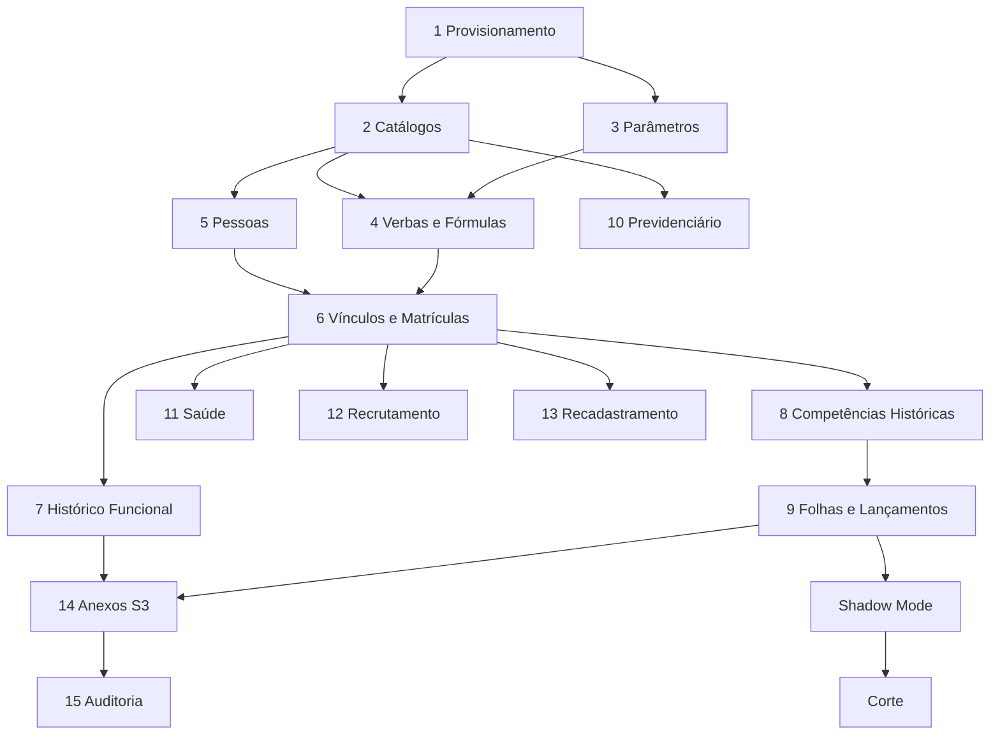

# Guia de Migração do Legado SGP → SGP Moderno

**Versão:** 1.0 | **Data:** 2026-04-21 | **Status:** Draft
**Escopo:** todos os bounded contexts | **Depende de:** BRIEF.md, ../legacy-reverse/data-archaeology/dumps-extracao-operacional.md, ../legacy-reverse/modules/folha/calculo/verbas-formulas-atributos.md, ../legacy-reverse/modules/folha/sintese-trilhas.md, ../legacy-reverse/modules/folha/calculo/formulas-lista-completa.csv, ../legacy-reverse/modules/folha/calculo/formulas-extracao.md

---

## Sumário

1. [Estratégia Geral](#1-estratégia-geral)
2. [Inventário da Origem (SQL Server)](#2-inventário-da-origem-sql-server)
3. [Mapeamento Origem → Destino](#3-mapeamento-origem--destino)
4. [Pipeline de ETL](#4-pipeline-de-etl)
5. [Ordem de Execução](#5-ordem-de-execução)
6. [Reconciliação de Fórmulas de Folha](#6-reconciliação-de-fórmulas-de-folha)
7. [Migração de Anexos](#7-migração-de-anexos)
8. [Migração de Perfis e Menus](#8-migração-de-perfis-e-menus)
9. [Corte (Cutover)](#9-corte-cutover)
10. [Rollback](#10-rollback)
11. [Dados Sensíveis / LGPD](#11-dados-sensíveis--lgpd)
12. [Homologação Pós-Migração](#12-homologação-pós-migração)

---

## 1. Estratégia Geral

### 1.1 Análise das estratégias possíveis

| Estratégia | Descrição | Vantagens | Riscos para o SGP |
|---|---|---|---|
| **Big-bang** | Migração de todos os tenants em janela única | Simplicidade operacional; data de corte única | Risco alto: um erro afeta toda a base de clientes; janela de indisponibilidade inviável para entes públicos em período de folha |
| **Strangler Fig** | Substituição gradual de funcionalidades, ambos os sistemas rodando em paralelo por módulo | Risco distribuído por funcionalidade | Requer roteamento duplo de API; alto custo de manutenção de dois backends durante transição prolongada |
| **Tenant-by-tenant** | Cada ente contratante migrado individualmente, em sequência planejada | Risco isolado por tenant; aprendizado acumulado entre migrações; rollback cirúrgico | Demanda automação de ETL repetível e parametrizável por tenant |

**Decisão aprovada: tenant-by-tenant com paridade via shadow mode.**

A migração é executada ente a ente. Para cada tenant, o SGP Moderno opera em shadow mode — recebendo os mesmos dados de produção do legado em modo somente-leitura — por no mínimo 30 dias antes do corte definitivo. O critério de saída do shadow mode é a paridade de contracheques em todas as competências abertas (tolerância R$ 0,01 por lançamento).

### 1.2 Ordem de execução por tenant

Cada tenant percorre a seguinte macro-sequência:

```
PROVISIONAMENTO → SEED CATÁLOGOS → IMPORTAÇÃO HISTÓRICA
→ ATIVAÇÃO SHADOW MODE → VALIDAÇÃO PARALELA → CORTE → MONITORAMENTO PÓS-CORTE
```

| Fase | Duração típica (tenant 10k matrículas) | Critério de avanço |
|---|---|---|
| Provisionamento do tenant | 1–2 horas | Tenant ativo no RDS; Cognito User Pool configurado; S3 buckets criados |
| Seed de catálogos | 4–8 horas | Contagens batem com legado; chaves FK íntegras |
| Importação histórica (N anos) | 8–48 horas | Zero erros de FK; somas de controle de valores de folha batem |
| Ativação do shadow mode | 30 dias | — |
| Validação de paridade | Contínua | Divergência zero em contracheques dos últimos 12 meses |
| Corte | 4–8 horas | Checklist §12 verde |
| Monitoramento pós-corte | 30 dias | Sem chamados críticos; alertas CloudWatch dentro do SLA |

### 1.3 Janela de congelamento por tenant

Para garantir consistência da extração final, cada tenant passa por um período de congelamento parcial antes do corte:

| D | Ação |
|---|---|
| D-30 | Início do shadow mode; ETL incremental diário ativado |
| D-14 | **Freeze de parametrização**: nenhuma alteração em verbas, fórmulas, catálogos estruturais no legado |
| D-7 | **Freeze de fluxos críticos**: folha da competência em aberto deve estar calculada e conferida; nenhuma nova folha pode ser aberta no legado para este tenant |
| D-1 | Último ETL incremental completo; verificação de paridade final |
| D (hora zero) | Legado colocado em modo somente-leitura para este tenant; corte no DNS/API Gateway |
| D+1 | SGP Moderno é a fonte de verdade; legado mantido em somente-leitura por 30 dias |
| D+31 | Desligamento do ambiente legado deste tenant |

### 1.4 Princípios gerais da migração

- **Idempotência**: todos os scripts de ETL devem poder ser executados múltiplas vezes sem duplicar dados (uso de `INSERT ... ON CONFLICT DO NOTHING` ou `DO UPDATE`).
- **Rastreabilidade**: cada linha importada carrega metadados de origem (`_legado_id`, `_legado_banco`, `_etl_executado_em`).
- **Atomicidade por domínio**: cada etapa da §5 é encapsulada em uma transação; falha em uma etapa não corrompe etapas anteriores.
- **Sem downtime para outros tenants**: a migração de um tenant não afeta a disponibilidade do SGP Moderno para tenants já ativos.

---

## 2. Inventário da Origem (SQL Server)

### 2.1 Bases restauradas identificadas

Conforme evidência dos dumps analisados (doc 42 e 43):

| Arquivo BAK | Banco restaurado | Data do backup | Tabelas | Flyway migrations | Observação |
|---|---|---|---|---|---|
| `20190701.bak` | `rhlinkcon_20190701` | 2019-07-01 | 151 | 381 | Foto mais antiga; junho/2019 com 10 lançamentos |
| `20190718.bak` | `rhlinkcon_motor` | 2019-07-18 | 151 | 383 | Motor de cálculo; julho/2019 com 30 lançamentos |
| `20190723.bak` | `rhlinkcon` | 2019-07-23 | 151 | 385 | Foto mais recente; referência principal |

> **Nota operacional**: os dumps disponíveis são de 2019 e representam massa de desenvolvimento/demonstração. Em produção, o tenant de origem terá base ativa com dados reais. O inventário abaixo reflete a estrutura de 151 tabelas confirmada nos três bancos; a massa de produção de cada cliente pode incluir variações menores de schema dependendo da versão do Flyway instalada.

### 2.2 Tabelas em escopo por domínio

#### 2.2.1 Estruturais — domínios/catálogos

| Tabela legado | Descrição | Dados confirmados no dump | Prioridade ETL |
|---|---|---|---|
| `cargo` | Cargos efetivos e comissionados | Sim (1 registro) | ALTA |
| `funcao` | Funções/gratificações de confiança | Sim (1 registro) | ALTA |
| `lotacao` | Unidades organizacionais / secretarias | Estrutura presente; 0 registros | ALTA |
| `vinculo` | Tipos de vínculo (efetivo, comissionado, etc.) | Sim (1 registro) | ALTA |
| `fonte_recursos` | Fonte de recursos orçamentários | Estrutura presente | MÉDIA |
| `feriado` | Feriados municipais/nacionais | Estrutura presente | MÉDIA |
| `jornada` | Jornadas de trabalho (horários, turnos) | Estrutura presente | MÉDIA |
| `enquadramento` | Enquadramento salarial / plano de cargos | Estrutura presente | ALTA |
| `cbo` | Classificação Brasileira de Ocupações | Estrutura presente | BAIXA |
| `banco` | Tabela de bancos (COMPE) | Estrutura presente | ALTA |
| `municipio` | Municípios do IBGE | Estrutura presente | MÉDIA |
| `tipo_processamento` | Tipos de processamento de folha | Sim | ALTA |
| `tipo_folha` | Tipos de folha (mensal, 13º, férias, etc.) | Estrutura presente | ALTA |

#### 2.2.2 Pessoa

| Tabela legado | Descrição | Dados confirmados no dump | Prioridade ETL |
|---|---|---|---|
| `pessoa` | Dados civis (CPF, nome, nascimento, etc.) | Sim (via `funcionario`) | ALTA |
| `dependente` | Dependentes (IR, salário-família, pensão) | Estrutura; 0 registros | ALTA |
| `documento` | Documentos pessoais (RG, CTPS, PIS, etc.) | Estrutura presente | ALTA |
| `endereco` | Endereço residencial | Estrutura presente | ALTA |
| `beneficio` | Benefícios do servidor | Estrutura presente | MÉDIA |
| `formacao` | Formação acadêmica | Estrutura presente | MÉDIA |

#### 2.2.3 Vínculo funcional

| Tabela legado | Descrição | Dados confirmados no dump | Prioridade ETL |
|---|---|---|---|
| `funcionario` | Matrícula e identidade funcional | Sim (16 registros) | ALTA |
| `matricula` | Matrículas adicionais / secundárias | Estrutura presente | ALTA |
| `posse` | Termo de posse | Estrutura presente | ALTA |
| `lotacao_atual` | Lotação vigente do funcionário | 0 registros | ALTA |
| `situacao_funcional` | Histórico de situações (ativo, afastamento, etc.) | Estrutura presente | ALTA |
| `tempo_servico_anterior` | Tempo de serviço averbado de outros órgãos | Estrutura presente | MÉDIA |
| `movimentacao` | Transferências, cedências, redistribuições | Estrutura presente | MÉDIA |

#### 2.2.4 Folha

| Tabela legado | Descrição | Dados confirmados no dump | Prioridade ETL |
|---|---|---|---|
| `folha_competencia` | Competência mensal | Sim (3 registros) | ALTA |
| `folha_pagamento` | Folha por filial e tipo de processamento | Sim (2 registros) | ALTA |
| `contracheque` / `folha_pagamento_funcionario_verba` | Resultado por matrícula | Sim (10–30 lançamentos) | ALTA |
| `lancamento` | Lançamentos individuais por verba | Incorporado na tabela acima | ALTA |
| `verba` | Catálogo de rubricas | Sim (11 verbas) | ALTA |
| `verba_formula` | Fórmulas textuais por verba | Sim (11 fórmulas) | ALTA |
| `atributo_formula` | Atributos semânticos das fórmulas | Sim (2 atributos) | ALTA |
| `elegibilidade_verba_cargo` / `cargo_verba` | Verbas elegíveis por cargo | Sim (2 registros) | ALTA |
| `elegibilidade_verba_funcao` / `funcao_verba` | Verbas elegíveis por função | 0 registros | ALTA |
| `elegibilidade_verba_vinculo` / `vinculo_verba` | Verbas elegíveis por vínculo | 0 registros | ALTA |
| `funcionario_verba` | Carteira individual de verbas | Sim (16–17 registros) | ALTA |
| `aliquota` | Faixas de alíquota (INSS, IRRF, RPPS) | Sim (4 registros INSS 2019) | ALTA |
| `consignado` | Cadastro de consignatárias | Estrutura presente | ALTA |
| `lote_importacao` / `adiantamento_pagamento` | Lotes de importação de verbas | 0 registros | MÉDIA |
| `tipo_folha_verbas` | Verbas elegíveis por tipo de folha | Sim em rhlinkcon_motor (3 registros) | ALTA |
| `sol_adiantamento` | Solicitações de adiantamento | 0 registros | BAIXA |
| `recisao_contrato` | Rescisões de contrato | 0 registros | MÉDIA |

#### 2.2.5 Previdenciário

| Tabela legado | Descrição | Dados confirmados no dump | Prioridade ETL |
|---|---|---|---|
| `regra_aposentadoria` | Regras de aposentadoria (com fórmulas) | Estrutura presente; 0 registros | ALTA |
| `processo_aposentadoria` | Processos de concessão de aposentadoria | 0 registros | ALTA |
| `processo_pensao` | Processos de concessão de pensão | 0 registros | ALTA |
| `parecer` | Pareceres técnicos previdenciários | Estrutura presente | MÉDIA |
| `ctc` / `certidao_tempo_contribuicao` | Certidões de tempo de contribuição | Estrutura presente | MÉDIA |
| `siprev_lote` | Lotes de envio SIPREV | Estrutura presente | BAIXA |

#### 2.2.6 Saúde

| Tabela legado | Descrição | Dados confirmados no dump | Prioridade ETL |
|---|---|---|---|
| `atendimento_medico` / `prontuario_pericia` | Prontuários de perícia | 0 registros | ALTA |
| `agendamento` | Agendamentos médicos | 0 registros | ALTA |
| `licenca_medica` | Licenças médicas concedidas | 0 registros | ALTA |
| `cat` / `acidente_trabalho` | Comunicações de acidente de trabalho | 0 registros | MÉDIA |
| `agenda_profissional` / `agenda_medica` | Agenda de profissionais de saúde | Estrutura presente | MÉDIA |

#### 2.2.7 Recrutamento

| Tabela legado | Descrição | Dados confirmados no dump | Prioridade ETL |
|---|---|---|---|
| `requisicao_pessoal` | Requisições de pessoal | 0 registros | ALTA |
| `vaga` / `funcao_requisitada` | Vagas por requisição | 0 registros | ALTA |
| `candidato` / `requisicao_pessoal_candidato` | Candidatos vinculados | 0 registros | MÉDIA |
| `inscricao` | Inscrições de candidatos | 0 registros | MÉDIA |
| `etapa_selecao` | Etapas do processo seletivo | Estrutura presente | BAIXA |
| `classificacao` | Classificação final dos candidatos | Estrutura presente | BAIXA |
| `nomeacao` | Nomeações resultantes de seleção | Estrutura presente | MÉDIA |

#### 2.2.8 Recadastramento

| Tabela legado | Descrição | Dados confirmados no dump | Prioridade ETL |
|---|---|---|---|
| `convocacao` / `campanha_recadastramento` | Campanhas de recadastramento | Estrutura presente | ALTA |
| `atendimento_recadastramento` / `recadastramento` | Recadastramentos realizados | Estrutura presente | ALTA |
| `comprovante` | Comprovantes emitidos | Estrutura presente | MÉDIA |

#### 2.2.9 Administrativo

| Tabela legado | Descrição | Dados confirmados no dump | Prioridade ETL |
|---|---|---|---|
| `usuario` | Usuários do sistema | Sim (1 registro) | ALTA |
| `perfil` | Perfis de acesso (ausente neste dump; presente em versões mais recentes) | Estrutura ausente neste dump | ALTA |
| `papel` | Papéis de autorização | Sim (1 registro: ROLE_ADMIN) | ALTA |
| `menu` | Árvore de menus | Sim (99 menus) | ALTA |
| `usuario_perfil` | Associação usuário-perfil | Ausente neste dump | ALTA |
| `perfil_menu` | Associação perfil-menu | Ausente neste dump | ALTA |
| `parametro_sistema` | Parâmetros de identidade do tenant | Ausente neste dump | ALTA |
| `parametro_global` | Parâmetros operacionais globais | Ausente neste dump | ALTA |
| `auditoria` | Log de auditoria | Estrutura presente | BAIXA |

---

## 3. Mapeamento Origem → Destino

> As seções a seguir apresentam o mapeamento coluna a coluna entre as principais tabelas do legado SQL Server e o modelo PostgreSQL 16 do SGP Moderno. Colunas omitidas na origem mas obrigatórias no destino recebem valor padrão ou são derivadas por regra de transformação.
>
> **Legenda de tipos:** `INT` = integer SQL Server | `NVARCHAR(n)` = varchar(n) | `BIT` = boolean | `DATETIME` = timestamp | `DECIMAL(p,s)` = numeric(p,s) | `TEXT` = text.

### 3.1 Tabelas estruturais — catálogos

#### cargo

| coluna_origem | tipo_origem | coluna_destino | tipo_destino | transformação | observação |
|---|---|---|---|---|---|
| `id` | INT | `_legado_id` | INTEGER | manter como referência | PK destino é UUID gerado |
| — | — | `id` | UUID | `gen_random_uuid()` | surrogate key nova |
| — | — | `tenant_id` | UUID | injetar tenant da migração | RLS |
| `descricao` | NVARCHAR(255) | `nome` | VARCHAR(255) | copiar | — |
| `codigo` | NVARCHAR(50) | `codigo` | VARCHAR(50) | copiar | — |
| `cbo_id` | INT | `cbo_id` | UUID | resolver FK via tabela de mapeamento | — |
| `ativo` | BIT | `ativo` | BOOLEAN | cast direto | — |
| `created_at` | DATETIME | `created_at` | TIMESTAMPTZ | converter fuso (assumir BRT → UTC) | — |

#### funcao

| coluna_origem | tipo_origem | coluna_destino | tipo_destino | transformação | observação |
|---|---|---|---|---|---|
| `id` | INT | `_legado_id` | INTEGER | manter como referência | — |
| — | — | `id` | UUID | `gen_random_uuid()` | — |
| — | — | `tenant_id` | UUID | injetar | — |
| `descricao` | NVARCHAR(255) | `nome` | VARCHAR(255) | copiar | — |
| `codigo` | NVARCHAR(50) | `codigo` | VARCHAR(50) | copiar | — |
| `tipo` | NVARCHAR(50) | `tipo` | `funcao_tipo` (enum PG) | mapear string → enum | CARGO_COMISSIONADO, FUNCAO_CONFIANCA, etc. |

#### lotacao

| coluna_origem | tipo_origem | coluna_destino | tipo_destino | transformação | observação |
|---|---|---|---|---|---|
| `id` | INT | `_legado_id` | INTEGER | — | — |
| — | — | `id` | UUID | `gen_random_uuid()` | — |
| — | — | `tenant_id` | UUID | injetar | — |
| `descricao` | NVARCHAR(255) | `nome` | VARCHAR(255) | copiar | — |
| `sigla` | NVARCHAR(20) | `sigla` | VARCHAR(20) | copiar | — |
| `id_filial` | INT | `filial_id` | UUID | resolver FK | empresa_filial |
| `id_lotacao_pai` | INT | `lotacao_pai_id` | UUID | resolver FK recursiva | hierarquia de lotações |

#### vinculo

| coluna_origem | tipo_origem | coluna_destino | tipo_destino | transformação | observação |
|---|---|---|---|---|---|
| `id` | INT | `_legado_id` | INTEGER | — | — |
| — | — | `id` | UUID | `gen_random_uuid()` | — |
| — | — | `tenant_id` | UUID | injetar | — |
| `descricao` | NVARCHAR(255) | `nome` | VARCHAR(255) | copiar | — |
| `tipo` | NVARCHAR(50) | `tipo` | `vinculo_tipo` (enum PG) | mapear → EFETIVO, COMISSIONADO, CONTRATADO, PRESTADOR, CEDIDO, ESTAGIARIO, TEMPORARIO | verificar vocabulário legado |

### 3.2 Tabelas de pessoa

#### funcionario → pessoa + funcionario + matricula

> O legado agrega dados civis e funcionais em `funcionario`. O SGP Moderno separa `pessoa` (dados civis) de `funcionario`/`matricula` (dados do vínculo). A transformação envolve **split de entidade**.

| coluna_origem (`funcionario`) | tipo_origem | tabela_destino | coluna_destino | tipo_destino | transformação |
|---|---|---|---|---|---|
| `id` | INT | `funcionario` | `_legado_id` | INTEGER | referência legado |
| `cpf` | NVARCHAR(11) | `pessoa` | `cpf` | VARCHAR(11) | limpar pontuação; único por tenant |
| `nome` | NVARCHAR(255) | `pessoa` | `nome` | VARCHAR(255) | uppercase → trim |
| `nome_social` | NVARCHAR(255) | `pessoa` | `nome_social` | VARCHAR(255) | nullable |
| `data_nascimento` | DATETIME | `pessoa` | `data_nascimento` | DATE | truncar hora |
| `sexo` | NVARCHAR(1) | `pessoa` | `sexo` | `sexo_tipo` (enum PG) | M/F → MASCULINO/FEMININO |
| `estado_civil` | NVARCHAR(20) | `pessoa` | `estado_civil` | `estado_civil_tipo` (enum PG) | mapear vocabulário |
| `raca_cor` | NVARCHAR(30) | `pessoa` | `raca_cor` | `raca_cor_tipo` (enum PG) | mapear vocabulário IBGE |
| `grau_instrucao` | NVARCHAR(50) | `pessoa` | `grau_instrucao` | `grau_instrucao_tipo` (enum PG) | chave para fórmulas de folha |
| `mae` | NVARCHAR(255) | `pessoa` | `filiacao_mae` | VARCHAR(255) | nullable |
| `pai` | NVARCHAR(255) | `pessoa` | `filiacao_pai` | VARCHAR(255) | nullable |
| `matricula` | NVARCHAR(20) | `funcionario` | `matricula` | VARCHAR(30) | verificar unicidade por tenant |
| `id_cargo` | INT | `funcionario` | `cargo_id` | UUID | resolver FK via mapa de IDs |
| `id_funcao` | INT | `funcionario` | `funcao_id` | UUID | nullable |
| `id_lotacao` | INT | `funcionario` | `lotacao_id` | UUID | resolver FK |
| `id_vinculo` | INT | `funcionario` | `vinculo_tipo` | `vinculo_tipo` (enum PG) | join com `vinculo.tipo` |
| `id_tipo_folha` | INT | `funcionario` | `tipo_folha_id` | UUID | resolver FK |
| `data_posse` | DATETIME | `funcionario` | `data_posse` | DATE | — |
| `data_exercicio` | DATETIME | `funcionario` | `data_exercicio` | DATE | nullable |
| `banco` | INT | `funcionario` | `banco_id` | UUID | resolver FK banco |
| `agencia` | NVARCHAR(10) | `funcionario` | `agencia` | VARCHAR(10) | — |
| `conta` | NVARCHAR(15) | `funcionario` | `conta` | VARCHAR(15) | — |
| `digito` | NVARCHAR(2) | `funcionario` | `digito` | VARCHAR(2) | — |
| `tipo_conta` | NVARCHAR(20) | `funcionario` | `tipo_conta_banco` | `tipo_conta_banco` (enum PG) | CORRENTE/POUPANCA/SALARIO |
| `foto` (VARBINARY / path) | VARBINARY / NVARCHAR | `pessoa` | `foto_s3_key` | VARCHAR(500) | migrar binário → S3; gravar chave |
| `ativo` | BIT | `situacao_funcional` | `tipo` | `situacao_funcional_tipo` | 1 → ATIVO; 0 → derivar de outros campos |
| `created_at` | DATETIME | `funcionario` | `created_at` | TIMESTAMPTZ | BRT → UTC |
| `updated_at` | DATETIME | `funcionario` | `updated_at` | TIMESTAMPTZ | BRT → UTC |

### 3.3 Tabelas de folha

#### verba

| coluna_origem | tipo_origem | coluna_destino | tipo_destino | transformação | observação |
|---|---|---|---|---|---|
| `id` | INT | `_legado_id` | INTEGER | — | — |
| — | — | `id` | UUID | `gen_random_uuid()` | — |
| — | — | `tenant_id` | UUID | injetar | — |
| `codigo` | NVARCHAR(10) | `codigo` | VARCHAR(10) | copiar | ex: 1000, 1101, 124 |
| `descricao` | NVARCHAR(255) | `descricao` | VARCHAR(255) | copiar | — |
| `tipo` | NVARCHAR(20) | `tipo` | `verba_tipo` (enum PG) | mapear → PROVENTO, DESCONTO, BASE, APOIO_CALCULO | verificar vocabulário |
| `recorrencia` | NVARCHAR(20) | `recorrencia` | `recorrencia_tipo` (enum PG) | MENSAL, AVULSA, etc. | — |

#### verba_formula

> Atenção especial: o conteúdo da coluna `formula` (ou `formula_raw_html`) é HTML com a DSL legada. Requer parser para extrair texto limpo e depois transpilador para a DSL nova SQL-based (ver §6).

| coluna_origem | tipo_origem | coluna_destino | tipo_destino | transformação | observação |
|---|---|---|---|---|---|
| `id` | INT | `_legado_id` | INTEGER | — | — |
| — | — | `id` | UUID | `gen_random_uuid()` | — |
| — | — | `tenant_id` | UUID | injetar | — |
| `id_verba` | INT | `verba_id` | UUID | resolver FK | — |
| `descricao` | NVARCHAR(100) | — | — | usar como `formula.descricao` | nome da fórmula (ex: "salario", "vencimento") |
| `formula` (HTML) | TEXT/NVARCHAR(MAX) | `texto_dsl` | TEXT | 1) strip HTML; 2) normalizar `/n` → newline; 3) transpilação DSL (ver §6) | CUIDADO: resultado pode ser multi-linha |
| — | — | `texto_sql_compilado` | TEXT | compilar a partir do `texto_dsl` novo | gerado em tempo de migração |
| — | — | `versao` | INTEGER | 1 | versão inicial |
| — | — | `ativa` | BOOLEAN | TRUE | — |
| — | — | `data_vigencia_inicio` | DATE | inferir da competência mais antiga ou NULL | — |

#### atributo_formula

| coluna_origem | tipo_origem | coluna_destino | tipo_destino | transformação | observação |
|---|---|---|---|---|---|
| `id` | INT | `_legado_id` | INTEGER | — | — |
| — | — | `id` | UUID | `gen_random_uuid()` | — |
| — | — | `tenant_id` | UUID | injetar | — |
| `nome` | NVARCHAR(100) | `chave` | VARCHAR(100) | copiar (ex: "Grau Instrução") | — |
| `path` (ex: `o{grauInstrucao}`) | NVARCHAR(255) | `path_semantico` | VARCHAR(255) | copiar | prefixos: `o{}` = objeto/campo, `r{}` = rubrica, `a{}` = alíquota |
| `tipo` | NVARCHAR(50) | `tipo_valor` | VARCHAR(50) | copiar | STRING, DECIMAL, etc. |

#### folha_competencia → competencia

| coluna_origem | tipo_origem | coluna_destino | tipo_destino | transformação | observação |
|---|---|---|---|---|---|
| `id` | INT | `_legado_id` | INTEGER | — | — |
| — | — | `id` | UUID | `gen_random_uuid()` | — |
| — | — | `tenant_id` | UUID | injetar | — |
| `mes` | INT | `mes` | SMALLINT | copiar | — |
| `ano` | INT | `ano` | SMALLINT | copiar | — |
| `status` | NVARCHAR(20) | `estado` | `competencia_estado` (enum PG) | mapear → ABERTA, FECHADA | — |
| `data_abertura` | DATETIME | `data_abertura` | TIMESTAMPTZ | BRT → UTC | — |
| `data_fechamento` | DATETIME | `data_programada_fechamento` | TIMESTAMPTZ | nullable | — |

#### folha_pagamento

| coluna_origem | tipo_origem | coluna_destino | tipo_destino | transformação | observação |
|---|---|---|---|---|---|
| `id` | INT | `_legado_id` | INTEGER | — | — |
| — | — | `id` | UUID | `gen_random_uuid()` | — |
| — | — | `tenant_id` | UUID | injetar | — |
| `id_folha_competencia` | INT | `competencia_id` | UUID | resolver FK | — |
| `id_empresa_filial` | INT | `filial_id` | UUID | resolver FK | — |
| `id_tipo_processamento` | INT | `tipo_processamento_id` | UUID | resolver FK | — |
| `status` | NVARCHAR(20) | `status` | `folha_status` (enum PG) | DESBLOQUEADO/BLOQUEADO | — |
| `situacao` | NVARCHAR(20) | `situacao` | `folha_situacao` (enum PG) | mapear → PENDENTE, CALCULADO, etc. | — |

#### folha_pagamento_funcionario_verba → contracheque + lancamento

> O legado agrupa resultado e lançamento em uma única tabela desnormalizada. O destino separa `contracheque` (por matrícula/folha) de `lancamento` (por verba).

| coluna_origem | tipo_origem | tabela_destino | coluna_destino | tipo_destino | transformação |
|---|---|---|---|---|---|
| `id` | INT | `lancamento` | `_legado_id` | INTEGER | — |
| — | — | `contracheque` | `id` | UUID | deduplica por (folha_id, funcionario_id); cria 1 contracheque por combinação |
| `id_folha_pagamento` | INT | `contracheque` | `folha_pagamento_id` | UUID | resolver FK |
| `id_funcionario` | INT | `contracheque` | `funcionario_id` | UUID | resolver FK |
| `id_verba` | INT | `lancamento` | `verba_id` | UUID | resolver FK |
| `valor` | DECIMAL(15,2) | `lancamento` | `valor_calculado` | NUMERIC(15,2) | copiar |
| — | — | `lancamento` | `tipo` | `lancamento_tipo` (enum PG) | CALCULADO (default para histórico) |
| — | — | `lancamento` | `origem` | `lancamento_origem` (enum PG) | FORMULA (default para histórico) |

### 3.4 Tabelas de autorização

#### usuario

| coluna_origem | tipo_origem | coluna_destino | tipo_destino | transformação | observação |
|---|---|---|---|---|---|
| `id` | INT | `_legado_id` | INTEGER | — | — |
| — | — | `id` | UUID | `gen_random_uuid()` | — |
| — | — | `tenant_id` | UUID | injetar | — |
| `login` | NVARCHAR(50) | `username` | VARCHAR(100) | copiar | — |
| `email` | NVARCHAR(100) | `email` | VARCHAR(255) | copiar; validar formato | — |
| `senha` (hash) | NVARCHAR(255) | — | — | **não migrar**: criar usuário no Cognito via `AdminCreateUser`; primeiro acesso exige troca de senha | LGPD + arquitetura: senha legada é irrelevante |
| `ativo` | BIT | `ativo` | BOOLEAN | cast | — |
| — | — | `cognito_sub` | UUID | preenchido após provisionamento no Cognito | — |

#### papel / perfil → papel (RBAC v2)

> O legado tem modelo mais simples (`usuario_papel`, sem camada `perfil` neste dump). O destino implementa RBAC de 4 camadas (tenant → perfil → papel → usuário). Ver mapeamento detalhado em §8.

| coluna_origem | tipo_origem | coluna_destino | tipo_destino | transformação | observação |
|---|---|---|---|---|---|
| `papel.nome` | NVARCHAR(100) | `papel.codigo` | VARCHAR(100) | mapear para padrão `ROLE_<MODULO>_<ACAO>` | ex: ROLE_ADMIN → expandir em conjunto de papéis granulares |
| `papel.id_menu` | INT | — | — | não migrar diretamente | permissões derivadas do mapeamento §8 |

### 3.5 Tabelas de parametrização

> As tabelas `parametro_sistema` e `parametro_global` não existem neste dump (ausência confirmada no doc 42). Em produção, cada tenant terá seus parâmetros. O destino organiza em três camadas: `parametro_sistema` (identidade do tenant), `parametro_global` (valores operacionais) e `feature_flag`.

| grupo_origem | chave_origem | tabela_destino | chave_destino | transformação |
|---|---|---|---|---|
| parametro_sistema | nome_ente | `parametro_sistema` | `sigla` / nome do tenant | copiar |
| parametro_sistema | matricula_automatica | `parametro_sistema` | `matricula_automatica` | BOOLEAN |
| parametro_sistema | termo_funcionario | `parametro_sistema` | `termo_funcionario` | copiar; default "Servidor" |
| parametro_global | TETO_INSS | `parametro_global` | `TETO_INSS` | NUMERIC(15,2) |
| parametro_global | SALARIO_MINIMO | `parametro_global` | `SALARIO_MINIMO` | NUMERIC(15,2) |
| parametro_global | VALOR_DEPENDENTE_IRRF | `parametro_global` | `VALOR_DEPENDENTE_IRRF` | NUMERIC(15,2) |
| feature_flags | esocial_habilitado | `feature_flag` | `esocial.enabled` | BOOLEAN; default FALSE |

### 3.6 audit_log legado → audit_log particionado

| coluna_origem | tipo_origem | coluna_destino | tipo_destino | transformação |
|---|---|---|---|---|
| `id` | INT | `_legado_id` | INTEGER | — |
| — | — | `id` | UUID | `gen_random_uuid()` |
| — | — | `tenant_id` | UUID | injetar |
| `data_hora` | DATETIME | `timestamp` | TIMESTAMPTZ | BRT → UTC |
| `usuario_id` | INT | `usuario_id` | UUID | resolver FK |
| `entidade` | NVARCHAR(100) | `entidade` | VARCHAR(100) | copiar |
| `entidade_id` | NVARCHAR(50) | `entidade_id` | VARCHAR(50) | copiar (legado usava INT como string) |
| `acao` | NVARCHAR(50) | `acao` | `audit_acao` (enum PG) | mapear → CREATE, UPDATE, DELETE, LOGIN, EXPORT |
| `detalhe` / `dados` | TEXT | `diff_jsonb` | JSONB | se JSON: parse direto; se texto: `{"legado": "<texto>"}` |
| — | — | `dominio` | VARCHAR(100) | inferir por entidade: ex: `funcionario` → `MODULO_RH` |

> O `audit_log` destino é particionado por ano/mês. A migração do histórico é **opcional e amostral** (ver §5, etapa 15).

---

## 4. Pipeline de ETL

### 4.1 Visão geral da arquitetura

```
┌─────────────────────────────────────────────────────────────────────────┐
│ ORIGEM (SQL Server on-premises / VPN)                                   │
│  ┌────────────────┐   ┌─────────────────┐   ┌───────────────────────┐  │
│  │ rhlinkcon      │   │ rhlinkcon_motor  │   │ rhlinkcon_20190701    │  │
│  └───────┬────────┘   └────────┬────────┘   └──────────┬────────────┘  │
│          │                     │                        │               │
└──────────┼─────────────────────┼────────────────────────┼───────────────┘
           │          EXTRAÇÃO   │                        │
           ▼                     ▼                        ▼
┌──────────────────────────────────────────────────────────────────────────┐
│ LANDING ZONE (S3)                                                        │
│  s3://{bucket-etl}/{tenant_id}/raw/{tabela}/{data_extracao}/part-*.parquet │
└─────────────────────────────┬────────────────────────────────────────────┘
                              │ STAGING
                              ▼
┌──────────────────────────────────────────────────────────────────────────┐
│ STAGING (Amazon Aurora PostgreSQL 16 — schema legacy_staging)            │
│  Tabelas com nome _stg_{tabela_origem}; tipagem permissiva (TEXT)        │
│  Coluna extra: _etl_batch_id, _etl_executado_em, _legado_banco           │
└─────────────────────────────┬────────────────────────────────────────────┘
                              │ TRANSFORMAÇÃO
                              ▼
┌──────────────────────────────────────────────────────────────────────────┐
│ TRANSFORMAÇÃO (dbt + plpgsql)                                            │
│  Modelos dbt: stg_ → int_ → fct_ / dim_                                 │
│  Scripts plpgsql: resolução de FKs, enums, split de entidades            │
│  Validação: asserções de contagem, integridade referencial, somas        │
└─────────────────────────────┬────────────────────────────────────────────┘
                              │ CARGA
                              ▼
┌──────────────────────────────────────────────────────────────────────────┐
│ DESTINO (RDS PostgreSQL 16 Multi-AZ — schema sgp)                       │
│  COPY + INSERT ON CONFLICT; FKs em DEFERRED mode durante carga          │
│  RLS habilitado por tenant; auditoria desligada durante ETL              │
└──────────────────────────────────────────────────────────────────────────┘
```

### 4.2 Extração

**Ferramentas por cenário:**

| Cenário | Ferramenta | Formato saída | Observação |
|---|---|---|---|
| Extração inicial (dump completo) | Python + `pyodbc` + pandas | Parquet (compressão Snappy) | Recomendado para massa grande; paralelizável por tabela |
| Extração incremental (delta diário) | AWS DMS (Change Data Capture via log) | Parquet ou S3 JSON Lines | Requer SQL Server CDC habilitado no lado legado |
| Extração pontual / validação | DBeaver → CSV ou `sqlcmd` | CSV | Útil para tabelas pequenas de catálogo |
| Alternativa sem CDC | SSIS (SQL Server Integration Services) | Flat file → S3 | Viável se ambiente SQL Server permite SSIS |

**Script de extração exemplo (Python):**

```python
# extract_table.py
import pyodbc, pandas as pd, boto3, os
from datetime import datetime

def extract_table(conn_str: str, table: str, tenant_id: str, s3_bucket: str):
    conn = pyodbc.connect(conn_str)
    df = pd.read_sql(f"SELECT * FROM dbo.{table} WITH (NOLOCK)", conn)
    df["_etl_executado_em"] = datetime.utcnow().isoformat()
    df["_legado_banco"] = os.environ["LEGADO_BANCO"]
    df["_tenant_id"] = tenant_id
    s3_key = f"{tenant_id}/raw/{table}/{datetime.utcnow().date()}/part-0.parquet"
    df.to_parquet(f"s3://{s3_bucket}/{s3_key}", index=False)
    print(f"Extraídas {len(df)} linhas de {table} → s3://{s3_bucket}/{s3_key}")
```

### 4.3 Staging

- Aurora PostgreSQL 16 temporária em subnet privada; acessível apenas pelo worker de ETL via IAM role.
- Schema `legacy_staging` criado por Flyway antes de cada tenant.
- Tipagem das colunas de staging: `TEXT` para tudo exceto PKs (INTEGER) e datas (TIMESTAMPTZ). Coerção feita na camada dbt.
- Retenção: 90 dias após corte do tenant; depois drop do schema.

### 4.4 Transformação (dbt)

Estrutura de modelos:

```
models/
  legacy_staging/
    stg_funcionario.sql
    stg_verba.sql
    stg_verba_formula.sql
    stg_folha_competencia.sql
    stg_folha_pagamento.sql
    stg_folha_pagamento_funcionario_verba.sql
    ...
  intermediate/
    int_pessoa_from_funcionario.sql        -- split de entidade
    int_funcionario_enriched.sql
    int_contracheque_from_verba_result.sql -- derivação contracheque
    int_lancamento_from_verba_result.sql
    int_verba_formula_dsl_translated.sql   -- chama plpgsql de tradução
    ...
  marts/
    fct_pessoa.sql
    fct_funcionario.sql
    fct_verba.sql
    fct_formula.sql
    fct_competencia.sql
    fct_contracheque.sql
    fct_lancamento.sql
    ...
```

**Asserções dbt obrigatórias:**

```yaml
# schema.yml (trecho)
models:
  - name: fct_funcionario
    tests:
      - dbt_utils.unique_combination_of_columns:
          combination_of_columns: [tenant_id, matricula]
      - not_null: [id, tenant_id, pessoa_id, cargo_id, matricula]
      - relationships:
          to: ref('fct_pessoa')
          field: pessoa_id

  - name: fct_lancamento
    tests:
      - not_null: [id, contracheque_id, verba_id, valor_calculado]
      - dbt_utils.expression_is_true:
          expression: "valor_calculado > 0"
```

### 4.5 Carga no destino

```sql
-- Exemplo de carga com ON CONFLICT (idempotente)
BEGIN;

-- Desabilitar RLS temporariamente para o usuário de ETL
SET LOCAL row_security = off;

-- Desativar triggers de auditoria durante a carga
SET LOCAL session_replication_role = replica;

INSERT INTO sgp.funcionario (
  id, tenant_id, pessoa_id, matricula, cargo_id, lotacao_id,
  data_posse, _legado_id, created_at, updated_at
)
SELECT
  id, tenant_id, pessoa_id, matricula, cargo_id, lotacao_id,
  data_posse, _legado_id, created_at, NOW()
FROM etl_staging.fct_funcionario
ON CONFLICT (tenant_id, matricula) DO UPDATE SET
  cargo_id = EXCLUDED.cargo_id,
  lotacao_id = EXCLUDED.lotacao_id,
  updated_at = NOW();

COMMIT;
```

**Ordem de carga com FKs DEFERRED:**

```sql
-- No início da sessão de carga
SET CONSTRAINTS ALL DEFERRED;
-- Carregar todas as tabelas
-- ...
-- No commit, o PostgreSQL valida todas as FKs
COMMIT;
```

### 4.6 Validação pós-carga

| Validação | Método | Critério de aprovação |
|---|---|---|
| Contagem de linhas | `SELECT COUNT(*) FROM destino` vs origem | Diferença ≤ 0% (salvo exclusões justificadas) |
| Integridade referencial | `SELECT ... WHERE FK NOT IN (SELECT id FROM pai)` | Zero registros órfãos |
| Soma de valores de folha | `SUM(valor_calculado)` por competência/tenant | Diferença ≤ R$ 0,01 |
| CPFs únicos | `COUNT(DISTINCT cpf) = COUNT(*)` em `pessoa` | TRUE |
| Matrículas únicas | `COUNT(DISTINCT matricula) = COUNT(*)` em `funcionario` | TRUE |
| Fórmulas compiladas | `SELECT COUNT(*) WHERE texto_sql_compilado IS NULL` em `formula` | Zero |
| Enums válidos | `CHECK` constraints do PostgreSQL | Zero violações |
| Timestamps futuros | `WHERE created_at > NOW()` | Zero linhas |

### 4.7 Ferramentas auxiliares

| Ferramenta | Uso |
|---|---|
| AWS DMS | CDC incremental opcional |
| Python 3.12 + pandas + pyarrow | Extração e geração de Parquet |
| dbt Core 1.8+ | Transformações e asserções |
| PostgreSQL `pg_cron` | Agendamento de ETL incremental no staging |
| AWS Step Functions | Orquestração do pipeline completo por tenant |
| AWS Glue (opcional) | Catalogação do Parquet no S3 |
| DataGrip / DBeaver | Inspeção e validação manual |

---

## 5. Ordem de Execução

### 5.1 Sequência detalhada com checkpoints

Cada etapa abaixo assume tenant médio com ~10.000 matrículas ativas e histórico de 5 anos de folha.

---

#### Etapa 1 — Provisionamento do Tenant e Usuário Inicial

**Tempo estimado:** 1–2 horas

| Sub-etapa | Ação |
|---|---|
| 1.1 | Criar registro em `tenant` no RDS com `status = PROVISIONANDO` |
| 1.2 | Criar Cognito User Pool e App Client para o tenant |
| 1.3 | Criar buckets S3: `sgp-{tenant}-documentos`, `sgp-{tenant}-relatorios`, `sgp-{tenant}-etl-staging` |
| 1.4 | Configurar KMS key por tenant |
| 1.5 | Criar usuário administrador inicial no Cognito (`AdminCreateUser`) |
| 1.6 | Provisionar `parametro_sistema` e `parametro_global` com valores defaults |
| 1.7 | Ativar feature flags: `esocial.enabled = false`, demais flags conforme contrato |
| 1.8 | Atualizar `tenant.status = ATIVO` |

**Tabela de validação:**

| Verificação | Query / Critério |
|---|---|
| Tenant ativo | `SELECT status FROM tenant WHERE id = ?` = ATIVO |
| Cognito User Pool criado | `aws cognito-idp describe-user-pool` sem erro |
| S3 buckets existem | `aws s3 ls s3://sgp-{tenant}-documentos` |
| Parâmetros seed | `SELECT COUNT(*) FROM parametro_sistema WHERE tenant_id = ?` > 0 |

**Rollback:** deletar tenant + desprovisionar Cognito + remover S3 buckets (via `aws s3 rb --force`).

---

#### Etapa 2 — Catálogos Estruturais

**Tempo estimado:** 4–8 horas

| Sub-etapa | Tabela destino | Depende de |
|---|---|---|
| 2.1 | `municipio`, `uf` | nada (seed global) |
| 2.2 | `banco` | nada (seed COMPE) |
| 2.3 | `cargo` | tenant, municipio |
| 2.4 | `funcao` | tenant, cargo |
| 2.5 | `empresa_matriz`, `empresa_filial` | tenant |
| 2.6 | `lotacao` | tenant, empresa_filial (hierarquia recursiva — topological sort) |
| 2.7 | `centro_custo` | tenant, lotacao |
| 2.8 | `vinculo` / enum `vinculo_tipo` | seed enum |
| 2.9 | `feriado` | tenant |
| 2.10 | `jornada`, `turno` | tenant |
| 2.11 | `enquadramento`, `plano_cargos_carreira` | tenant, cargo |
| 2.12 | `cbo` | seed global |
| 2.13 | `tipo_folha`, `tipo_processamento` | seed enum |
| 2.14 | `motivo_afastamento`, `causa_afastamento` | seed enum |
| 2.15 | `especialidade_medica`, `medico` | tenant |

**Tabela de validação:**

| Tabela | Verificação |
|---|---|
| `lotacao` | Hierarquia consistente: `SELECT COUNT(*) WHERE lotacao_pai_id NOT IN (SELECT id FROM lotacao)` = 0 |
| `cargo` | `SELECT COUNT(*) FROM cargo WHERE tenant_id = ?` bate com origem |
| `banco` | Códigos COMPE únicos |
| Enums | `SELECT enumlabel FROM pg_enum` cobre todos os valores presentes no legado |

**Rollback:** `DELETE FROM <tabela> WHERE tenant_id = ?` em ordem reversa.

---

#### Etapa 3 — Parâmetros e Feature Flags

**Tempo estimado:** 1–2 horas

| Sub-etapa | Ação |
|---|---|
| 3.1 | Migrar `parametro_sistema` do legado (se tabela existir na base de origem) |
| 3.2 | Migrar `parametro_global` (TETO_INSS, SALARIO_MINIMO, etc.) |
| 3.3 | Revisar e ajustar feature flags para o tenant |
| 3.4 | Configurar `matricula_automatica`, `matricula_formato`, `matricula_prefixo` |
| 3.5 | Upload de logos para S3; preencher `logo_principal_s3_key` |

**Rollback:** `UPDATE parametro_sistema SET ... WHERE tenant_id = ?` restaura defaults.

---

#### Etapa 4 — Verbas e Fórmulas

**Tempo estimado:** 4–12 horas (inclui compilação e validação de DSL)

| Sub-etapa | Ação |
|---|---|
| 4.1 | Migrar catálogo `verba` |
| 4.2 | Migrar `atributo_formula` |
| 4.3 | Extrair fórmulas de `verba_formula` (strip HTML, normalizar) |
| 4.4 | Traduzir DSL legada → DSL nova (ver §6) |
| 4.5 | Compilar DSL nova → SQL parametrizado |
| 4.6 | Migrar elegibilidades: `cargo_verba`, `funcao_verba`, `vinculo_verba`, `tipo_folha_verbas` |
| 4.7 | Migrar `aliquota` (INSS, IRRF, RPPS por faixa e ano) |
| 4.8 | Migrar `consignado` (cadastro de consignatárias) |

**Tabela de validação:**

| Verificação | Critério |
|---|---|
| `SELECT COUNT(*) FROM formula WHERE texto_sql_compilado IS NULL AND tenant_id = ?` | = 0 |
| Execução de cada fórmula contra valores de teste | Sem exceção SQL; resultado NUMERIC não nulo |
| `SELECT COUNT(*) FROM verba WHERE tenant_id = ?` bate com origem | TRUE |
| Elegibilidades sem FK órfã | Zero |

**Rollback:** `DELETE FROM formula WHERE tenant_id = ?`; depois `DELETE FROM verba WHERE tenant_id = ?`.

---

#### Etapa 5 — Pessoas e Dependentes

**Tempo estimado:** 2–6 horas

| Sub-etapa | Ação |
|---|---|
| 5.1 | Migrar `pessoa` (split de `funcionario` + `aposentado` + `pensionista`) |
| 5.2 | Migrar `documento_pessoa` (RG, CTPS, PIS, etc.) |
| 5.3 | Migrar `endereco` |
| 5.4 | Migrar `contato` |
| 5.5 | Migrar `dependente` |
| 5.6 | Migrar `formacao` |

**Tabela de validação:**

| Verificação | Critério |
|---|---|
| CPFs únicos por tenant | `SELECT COUNT(*) FROM pessoa WHERE tenant_id = ?` = `SELECT COUNT(DISTINCT cpf)` |
| Dependentes com `pessoa_id` válido | Zero órfãos |
| PIS/PASEP formato válido | `CHECK(LENGTH(pis_pasep) = 11 AND pis_pasep ~ '^[0-9]+$')` |

**Rollback:** `DELETE FROM dependente WHERE tenant_id = ?`; depois `DELETE FROM pessoa WHERE tenant_id = ?`.

---

#### Etapa 6 — Vínculos, Matrículas, Posse e Situação Atual

**Tempo estimado:** 4–8 horas

| Sub-etapa | Ação |
|---|---|
| 6.1 | Migrar `funcionario` (FK para `pessoa`, `cargo`, `lotacao`, etc.) |
| 6.2 | Migrar `matricula` (matrículas secundárias / históricas) |
| 6.3 | Migrar `posse` (termos de posse; anexos via §7) |
| 6.4 | Migrar `lotacao_atual` (posição corrente de cada funcionário) |
| 6.5 | Migrar `situacao_funcional` (situação corrente: ATIVO, AFASTADO, etc.) |
| 6.6 | Migrar `funcionario_verba` (carteira individual de verbas) |

**Tabela de validação:**

| Verificação | Critério |
|---|---|
| Matrículas únicas por tenant | Zero duplicatas |
| `funcionario.pessoa_id` resolvido | Zero NULL não-nullable |
| `funcionario_verba` sem FK órfã | Zero |
| `situacao_funcional` com tipo válido | CHECK constraint satisfeito |

**Rollback:** deletar em ordem reversa: `funcionario_verba` → `situacao_funcional` → `funcionario`.

---

#### Etapa 7 — Histórico Funcional

**Tempo estimado:** 4–12 horas

| Sub-etapa | Tabela |
|---|---|
| 7.1 | `movimentacao` (transferências, cedências) |
| 7.2 | `cedido_detalhe` |
| 7.3 | `transferencia` |
| 7.4 | `observacao_funcional` |
| 7.5 | `tempo_servico_anterior` |
| 7.6 | `anexo_funcionario` / `dossie` (estrutura; arquivos via §7) |
| 7.7 | `licenca_medica` histórica (sem afastamento ativo) |
| 7.8 | `restricao_ocupacional` |

**Rollback:** `DELETE FROM movimentacao WHERE tenant_id = ?` e demais tabelas desta etapa.

---

#### Etapa 8 — Competências Históricas

**Tempo estimado:** 1–4 horas

Janela histórica configurável por tenant (padrão: 5 anos retroativos).

| Sub-etapa | Ação |
|---|---|
| 8.1 | Migrar `competencia` (status = FECHADA para todas as históricas) |
| 8.2 | Migrar `folha_pagamento` históricas (status = BLOQUEADO) |

**Tabela de validação:**

| Verificação | Critério |
|---|---|
| Contagem de competências por tenant | Bate com contagem no legado (janela configurada) |
| Todas históricas com status FECHADA | `SELECT COUNT(*) WHERE estado != 'FECHADA' AND ano < YEAR(NOW())` = 0 |

---

#### Etapa 9 — Folhas Históricas, Contracheques e Lançamentos

**Tempo estimado:** 12–48 horas (maior volume — particionar por ano)

| Sub-etapa | Ação |
|---|---|
| 9.1 | Migrar `contracheque` (um por matrícula × folha; deduplica a partir de `folha_pagamento_funcionario_verba`) |
| 9.2 | Migrar `lancamento` (um por verba × contracheque) |
| 9.3 | Migrar `importacao_consignado` histórica |
| 9.4 | Migrar `relatorio_financeiro` histórico (se persistido) |

> As tabelas `contracheque` e `lancamento` são particionadas por ano/mês no PostgreSQL. A carga deve usar `COPY` direto na partição correta para evitar overhead de roteamento.

**Tabela de validação — crítica:**

| Verificação | Critério |
|---|---|
| `SUM(valor_calculado)` por competência e tipo PROVENTO | Diferença ≤ R$ 0,01 em relação ao legado |
| `SUM(valor_calculado)` por competência e tipo DESCONTO | Diferença ≤ R$ 0,01 |
| Contagem de contracheques por folha | Bate exatamente com legado |
| Contagem de lançamentos por contracheque | Bate com legado (tolerância: verbas zeradas podem ter sido omitidas no legado) |
| Partição correta | `SELECT tableoid::regclass, count(*) FROM lancamento WHERE tenant_id = ?` mostra partições do ano esperado |

**Rollback:** truncar partições do tenant (`DELETE FROM lancamento WHERE tenant_id = ?` ativa RLS para garantir escopo).

---

#### Etapa 10 — Processos Previdenciários

**Tempo estimado:** 4–8 horas

| Sub-etapa | Tabela |
|---|---|
| 10.1 | `regra_aposentadoria` (inclui fórmulas previdenciárias — ver tradução similar ao §6) |
| 10.2 | `simulacao_aposentadoria` |
| 10.3 | `aposentadoria` |
| 10.4 | `pensao` |
| 10.5 | `certidao_tempo_contribuicao` |
| 10.6 | `compensacao_previdenciaria` |
| 10.7 | `declaracao_aposentadoria` / `declaracao_ex_servidor` |
| 10.8 | `campanha_recadastramento` |
| 10.9 | `beneficiario_recadastramento` |
| 10.10 | `recadastramento` |
| 10.11 | `historico_ligacao` |
| 10.12 | `siprev_lote` (histórico de envios) |

**Rollback:** deletar em ordem reversa por tenant.

---

#### Etapa 11 — Processos de Saúde

**Tempo estimado:** 4–8 horas

| Sub-etapa | Tabela |
|---|---|
| 11.1 | `agenda_medica` |
| 11.2 | `janela_agenda` |
| 11.3 | `agendamento_pericia` |
| 11.4 | `prontuario_pericia` |
| 11.5 | `licenca_medica` ativa e histórica |
| 11.6 | `acidente_trabalho` / `cat` |
| 11.7 | `restricao_ocupacional` |
| 11.8 | `readaptacao` |
| 11.9 | `invalidez_pericia` |
| 11.10 | `exame_ocupacional` |

**Rollback:** deletar por tenant em ordem reversa.

---

#### Etapa 12 — Recrutamento em Aberto

**Tempo estimado:** 1–4 horas (apenas processos não concluídos)

| Sub-etapa | Tabela | Filtro |
|---|---|---|
| 12.1 | `requisicao_pessoal` | `situacao NOT IN ('CONCLUIDO', 'CANCELADA')` |
| 12.2 | `funcao_requisitada` | vinculadas às acima |
| 12.3 | `candidato_requisicao` | vinculadas às acima |
| 12.4 | `banco_talentos` | todos (catálogo permanente) |
| 12.5 | `programa_estagio` | vigentes |
| 12.6 | `estagiario` | `situacao_funcional != 'DESLIGADO'` |
| 12.7 | `prorrogacao_estagio` | vinculadas |

**Rollback:** deletar por tenant.

---

#### Etapa 13 — Convocações de Recadastramento em Aberto

**Tempo estimado:** 1–2 horas

| Sub-etapa | Tabela | Filtro |
|---|---|---|
| 13.1 | `campanha_recadastramento` | ativas |
| 13.2 | `beneficiario_recadastramento` | `status != 'RECADASTRADO'` |

---

#### Etapa 14 — Anexos S3

**Tempo estimado:** variável (depende do volume de arquivos — pode ser paralela a outras etapas)

Ver §7 para procedimento detalhado.

---

#### Etapa 15 — Auditoria (Opcional, Amostral)

**Tempo estimado:** 2–8 horas

- Migrar somente os últimos 12 meses de `auditoria` do legado.
- Amostral: até 10.000 registros por domínio.
- Mapear para `audit_log` particionado (ver §3.6).
- Esta etapa é **opcional**: ausência não bloqueia o corte.

---

### 5.2 Diagrama de dependências entre etapas



---

## 6. Reconciliação de Fórmulas de Folha

### 6.1 Gramática da DSL legada

Com base na extração dos dumps (doc 64 e CSV 63), a DSL legada usa a seguinte sintaxe:

| Construto legado | Exemplo | Semântica |
|---|---|---|
| Referência a rubrica | `r{vencimento}` | Valor calculado de outra verba na mesma folha |
| Referência a atributo do objeto | `o{referenciaSalarialCargo.valor}` | Campo do funcionário/cargo/referência |
| Referência a alíquota | `a{inss}` | Valor calculado pela tabela de alíquota |
| Alíquota com base | `a{inss(r{vencimento}+r{gratificacao_regencia_classe})}` | Alíquota aplicada sobre base explícita |
| Condicional | `SE (...) ENTAO ... SENAO_SE ... FIM_SE` | Condicional multilinhas |
| Atribuição | `variavel = expr` | Variável local de fórmula |
| Expressão final | Última linha sem `;` | Valor retornado pela fórmula |
| Quebra de linha | `/n` (dentro do HTML) | Separador de instruções |

### 6.2 Mapeamento DSL legada → DSL nova (SQL-based)

| Construto legado | Construto DSL novo | SQL compilado equivalente |
|---|---|---|
| `r{vencimento}` | `rubrica('vencimento')` | `(SELECT valor_calculado FROM lancamento WHERE contracheque_id = :cid AND verba_codigo = '1101')` |
| `o{referenciaSalarialCargo.valor}` | `atributo('referencia_salarial_cargo.valor')` | `(SELECT rs.valor FROM referencia_salarial rs JOIN funcionario f ON f.referencia_salarial_id = rs.id WHERE f.id = :fid)` |
| `o{grauInstrucao}` | `atributo('grau_instrucao')` | `(SELECT grau_instrucao FROM pessoa p JOIN funcionario f ON f.pessoa_id = p.id WHERE f.id = :fid)` |
| `a{inss}` | `aliquota('INSS', rubrica('vencimento'))` | subconsulta na tabela `aliquota` com faixa |
| `a{inss(r{vencimento}+r{gratificacao_regencia_classe})}` | `aliquota('INSS', rubrica('vencimento') + rubrica('gratificacao_regencia_classe'))` | subconsulta com base composta |
| `SE (cond) ENTAO x SENAO_SE (cond2) ENTAO y FIM_SE` | `CASE WHEN cond THEN x WHEN cond2 THEN y END` | SQL CASE nativo |
| `variavel = expr` | variável local não existe em SQL | desmembrar em CTE ou subexpressão | reescrever manualmente se complexo |
| `r{vencimento} * 0.06` | `rubrica('vencimento') * 0.06` | expressão numérica direta |

### 6.3 Catálogo completo de fórmulas a traduzir

As 11 fórmulas identificadas nos dumps são as seguintes (presentes identicamente em `rhlinkcon` e `rhlinkcon_20190701`; `rhlinkcon_motor` difere apenas em `INSS`):

| verba_codigo | verba_descricao | formula_normalizada (legado) | status tradução |
|---|---|---|---|
| 1000 | Salário | `salario = r{vencimento} + r{titulacao_aperfeicoamento}` `salario = salario - r{vale_transporte}` `salario*1` | Requer desmembrar variável `salario` em CTE |
| 1101 | Vencimento | `o{referenciaSalarialCargo.valor}` | Direta |
| 1107 | Adicional de Titulação e Aperfeiçoamento | `SE (o{grauInstrucao}=="SUPERIOR_COMPLETO") ENTAO percent=0.07 ... r{vencimento}*percent` | Requer desmembrar `percent` em CASE |
| 1112 | Gratificação por Regência de Classe | `214.00 * 1` | Constante direta |
| 1158 | Gratificação por Maturação Profissional | `o{referenciaSalarialCargo.valor} * 0.2` | Direta |
| 1229 | Adicional de Incentivo Funcional (Motorista) | `o{referenciaSalarialCargo.valor} * 0.3` | Direta |
| 1236 | Adicional por Regime Especial de Trabalho Policial | `o{referenciaSalarialCargo.valor} * 1.0` | Direta |
| 1237 | Adicional Desempenho Profissional | `o{referenciaSalarialCargo.valor} * 0.2` | Direta |
| 1238 | Adicional de Responsabilidade Técnica (Engenheiro) | `o{referenciaSalarialCargo.valor} * 1.0` | Direta |
| 124 | INSS (rhlinkcon) | `a{inss}` | Direta |
| 124 | INSS (rhlinkcon_motor) | `a{inss(r{vencimento}+r{gratificacao_regencia_classe})}` | Direta com base composta |
| 4963 | Vale Transporte | `r{vencimento} * 0.06` | Direta |

> Em produção, cada tenant pode ter dezenas ou centenas de verbas adicionais. O processo abaixo se aplica a todas.

### 6.4 Processo de reconciliação

**Passo 1 — Extração**

```sql
-- No SQL Server (staging)
SELECT
  vf.id           AS formula_id,
  v.codigo        AS verba_codigo,
  v.descricao     AS verba_descricao,
  vf.descricao    AS formula_descricao,
  vf.formula      AS formula_raw
FROM dbo.verba_formula vf
JOIN dbo.verba v ON v.id = vf.id_verba
ORDER BY v.codigo;
```

**Passo 2 — Normalização (Python)**

```python
import re
from bs4 import BeautifulSoup

def normalizar_formula(html: str) -> str:
    soup = BeautifulSoup(html, "html.parser")
    texto = soup.get_text(separator="\n")
    texto = re.sub(r'\s*/n\s*', '\n', texto)
    texto = re.sub(r'\n{3,}', '\n\n', texto)
    return texto.strip()
```

**Passo 3 — Tradução DSL (Python + parser)**

Implementar um transpilador recursivo que:
1. Identifica os prefixos `r{}`, `o{}`, `a{}`.
2. Converte condicionais `SE/ENTAO/SENAO_SE/FIM_SE` em SQL `CASE WHEN`.
3. Expande variáveis locais (ex: `percent = ...`) em expressões CTE ou subexpressões.
4. Gera SQL parametrizado com `:funcionario_id`, `:competencia_id`, `:contracheque_id`.

**Passo 4 — Compilação e teste unitário**

```sql
-- Teste da fórmula compilada para Vencimento
SELECT calcular_formula(
  p_formula_id   => 'uuid-da-formula-vencimento',
  p_funcionario_id => 'uuid-do-funcionario-teste',
  p_competencia_id => 'uuid-da-competencia-teste'
) AS resultado_calculado;
-- Esperado: valor da referência salarial do cargo
```

**Passo 5 — Execução contra 12 competências recentes**

Para cada verba de cada funcionário, comparar:
- **Valor legado**: `folha_pagamento_funcionario_verba.valor` para as 12 competências mais recentes.
- **Valor novo**: `calcular_formula(...)` executado no SGP Moderno com os mesmos atributos.

**Passo 6 — Relatório de divergências**

```
RELATÓRIO DE RECONCILIAÇÃO DE FÓRMULAS
Tenant: Prefeitura de Exemplo | Gerado em: 2026-04-21 10:00:00

────────────────────────────────────────────────────────────────────────────────
Verba 1107 - Adicional de Titulação e Aperfeiçoamento
────────────────────────────────────────────────────────────────────────────────
Matrícula   Competência  Valor Legado  Valor Novo    Diferença  Status
12345       2025-12      R$ 350,00     R$ 350,00     R$ 0,00    OK
12346       2025-12      R$ 500,00     R$ 500,01     R$ 0,01    DENTRO DA TOLERÂNCIA
12347       2025-12      R$ 420,00     R$ 280,00     R$ 140,00  DIVERGÊNCIA ← revisar grauInstrucao

Total de lançamentos verificados: 15.234
Dentro da tolerância (≤ R$ 0,01): 15.230 (99,97%)
Divergências (> R$ 0,01): 4 (0,03%)
```

**Critério de aceite:** ≥ 99,99% dos lançamentos dentro da tolerância de R$ 0,01. Divergências residuais devem ser revisadas manualmente antes do corte.

### 6.5 Fórmulas de regras de aposentadoria

A tabela `regra_aposentadoria` também contém fórmulas (campo `formula` ou similar), pertencentes ao domínio previdenciário. O processo de tradução é análogo, mas usa atributos do contexto previdenciário (`tempo_contribuicao_anos`, `idade_anos`, `data_ingresso_regime`). Tratar na etapa 10.

---

## 7. Migração de Anexos

### 7.1 Estratégia geral

Todos os arquivos binários do legado (documentos, laudos, comprovantes, contracheques, fotos) são migrados para o AWS S3, respeitando a estratégia de bucketização por tenant definida na decisão de arquitetura #6 do BRIEF.

### 7.2 Estrutura de chaves S3

```
s3://sgp-{tenant_id}-documentos/
  funcionario/{funcionario_id}/foto.jpg
  funcionario/{funcionario_id}/documentos/{documento_id}/{filename}
  funcionario/{funcionario_id}/dossie/{tipo}/{data}/{filename}
  posse/{posse_id}/termo-de-posse.pdf
  prontuario/{prontuario_id}/laudo.pdf
  licenca-medica/{licenca_id}/atestado.pdf
  cat/{cat_id}/cat-{numero}.pdf
  recadastramento/{recadastramento_id}/comprovante.pdf
  aposentadoria/{aposentadoria_id}/ato.pdf
  ctc/{ctc_id}/certidao.pdf
  requisicao/{requisicao_id}/candidato/{candidato_id}/curriculo.pdf
  estagio/{estagiario_id}/normativo.pdf

s3://sgp-{tenant_id}-relatorios/
  folha/{ano}/{mes}/{folha_id}/contracheque-{funcionario_id}.pdf
  folha/{ano}/{mes}/{folha_id}/resumo-folha.xlsx
  siprev/{ano}/{mes}/siprev-{lote_id}.xml
  dirf/{ano}/dirf.txt
```

### 7.3 Procedimento de migração de arquivos

**Método 1 — Arquivos no sistema de arquivos legado:**

```bash
#!/bin/bash
# migrate_attachments.sh
TENANT_ID=$1
LEGADO_PATH=$2
S3_BUCKET="sgp-${TENANT_ID}-documentos"

aws s3 sync "$LEGADO_PATH" "s3://$S3_BUCKET/" \
  --storage-class STANDARD_IA \
  --sse aws:kms \
  --sse-kms-key-id "alias/sgp-${TENANT_ID}" \
  --metadata "legado_origem=true,legado_path=${LEGADO_PATH}" \
  --exact-timestamps \
  2>&1 | tee /var/log/sgp-migration/s3-sync-${TENANT_ID}.log
```

**Método 2 — Arquivos em coluna VARBINARY no SQL Server:**

```python
# extract_blobs_to_s3.py
import pyodbc, boto3, hashlib
from pathlib import PurePosixPath

def migrate_blob(conn, s3_client, tenant_id: str, table: str,
                 id_col: str, blob_col: str, s3_prefix: str):
    kms_key = f"alias/sgp-{tenant_id}"
    rows = conn.execute(f"SELECT {id_col}, {blob_col} FROM dbo.{table} WHERE {blob_col} IS NOT NULL")
    for row in rows:
        record_id, blob = row
        if not blob:
            continue
        etag_legado = hashlib.md5(blob).hexdigest()
        s3_key = f"{s3_prefix}/{record_id}/arquivo"
        s3_client.put_object(
            Bucket=f"sgp-{tenant_id}-documentos",
            Key=s3_key,
            Body=blob,
            ServerSideEncryption="aws:kms",
            SSEKMSKeyId=kms_key,
            Metadata={"legado_etag": etag_legado, "legado_table": table, "legado_id": str(record_id)}
        )
        # Atualizar referência no staging
        conn.execute(
            f"UPDATE etl_staging.{table} SET s3_key = ? WHERE {id_col} = ?",
            (s3_key, record_id)
        )
```

### 7.4 Metadados obrigatórios em cada objeto S3

| Metadado | Valor | Finalidade |
|---|---|---|
| `legado_etag` | MD5 do binário original | Verificação de integridade; reprodutibilidade |
| `legado_table` | Nome da tabela de origem | Rastreabilidade |
| `legado_id` | ID numérico original | Rastreabilidade |
| `legado_path` | Caminho no filesystem legado (se aplicável) | Rastreabilidade |
| `tenant_id` | UUID do tenant | Governança |
| `migrado_em` | ISO 8601 UTC | Auditoria de migração |

### 7.5 Preservação do mtime

O `Last-Modified` do legado deve ser preservado no metadado `legado_mtime`. O S3 não permite definir o `Last-Modified` diretamente (é gerenciado pelo serviço), mas o valor original é armazenado como metadado customizado.

### 7.6 Validação de anexos

| Verificação | Critério |
|---|---|
| Contagem de objetos S3 bate com contagem de registros com blob/path não nulo no legado | Diferença = 0 |
| `etag_legado` confere com MD5 do objeto no S3 | `aws s3api head-object` por amostra (5%) |
| Referências `s3_key` atualizadas nas tabelas destino | Zero NULL em colunas `*_s3_key` onde o legado tinha arquivo |

### 7.7 Lifecycle policy S3

```json
{
  "Rules": [{
    "ID": "sgp-documentos-lifecycle",
    "Status": "Enabled",
    "Transitions": [
      { "Days": 90,  "StorageClass": "STANDARD_IA" },
      { "Days": 365, "StorageClass": "GLACIER_IR" }
    ],
    "NoncurrentVersionTransitions": [
      { "NoncurrentDays": 30, "StorageClass": "GLACIER_IR" }
    ]
  }]
}
```

---

## 8. Migração de Perfis e Menus

### 8.1 Situação no legado

Conforme evidência do dump (doc 42):
- O dump analisado **não contém** a tabela `perfil` (versão antiga do legado).
- Versões mais recentes do sistema legado implementam a camada `perfil` → `papel` → `menu`.
- Em produção, cada tenant terá sua própria configuração de perfis e menus ativos.
- A árvore completa de 99 menus foi confirmada nos três dumps.

### 8.2 Modelo de autorização destino (RBAC v2)

O SGP Moderno usa 4 camadas:

```
Tenant → Perfil → Papel (ROLE_<MODULO>_<ACAO>) → Usuário
```

Ações padrão: `VISUALIZAR`, `CADASTRAR`, `ATUALIZAR`, `EXCLUIR`, `GESTAO`.

### 8.3 Mapeamento de perfis legados para papéis RBAC v2

| perfil_legado | papel_novo (RBAC v2) | escopo | observação |
|---|---|---|---|
| `ROLE_ADMIN` | `ROLE_GESTAO_GESTAO` + todos os `ROLE_*_GESTAO` | tenant inteiro | Administrador total |
| `ROLE_RH` | `ROLE_MODULO_RH_GESTAO`, `ROLE_FOLHA_DE_PGT_GESTAO`, `ROLE_RECADASTRAMENTO_GESTAO` | — | Operador de RH |
| `ROLE_FOLHA` | `ROLE_FOLHA_DE_PGT_GESTAO`, `ROLE_RELATORIO_FOLHA_PAGAMENTO_GESTAO` | — | Operador de folha |
| `ROLE_SAUDE` | `ROLE_JUNTA_MEDICA_GESTAO`, `ROLE_PERICIA_MEDICA_GESTAO` | — | Operador saúde |
| `ROLE_RECRUTAMENTO` | `ROLE_RECRUTAMENTO_SELECAO_GESTAO` | — | Operador recrutamento |
| `ROLE_AUDITOR` | `ROLE_AUDITORIA_GESTAO` | — | Somente auditoria |
| `ROLE_CONSULTAS` | `ROLE_CONSULTAS_GERENCIAIS_VISUALIZAR`, `ROLE_RELATORIO_VISUALIZAR` | — | Somente consultas |
| `ROLE_PORTAL_SERVIDOR` | `ROLE_PORTAL_SERVIDOR_VISUALIZAR` | — | Portal do servidor |
| `ROLE_EXTERNAL_SYSTEM` (legado: `SGP-API-KEY`) | `ROLE_EXTERNAL_SYSTEM` | client-credentials Cognito | Integração API externa |

> Este mapeamento é um ponto de partida. Cada tenant deve revisar e ajustar antes do corte, pois perfis customizados criados no legado precisam ser analisados caso a caso.

### 8.4 Mapeamento de menus legados para módulos/papéis novos

| menu_legado (categoria) | menu_legado (item) | modulo_novo | papel_minimo_requerido |
|---|---|---|---|
| GESTAO | Empresas/Filiais | `organizacao` | `ROLE_GESTAO_VISUALIZAR` |
| GESTAO | Cargos/Funções | `gestao` | `ROLE_GESTAO_VISUALIZAR` |
| GESTAO | Lotações | `organizacao` | `ROLE_GESTAO_VISUALIZAR` |
| GESTAO | Parâmetros | `parametros` | `ROLE_GESTAO_GESTAO` |
| MODULO_RH | Funcionários | `rh` | `ROLE_MODULO_RH_VISUALIZAR` |
| MODULO_RH | Dependentes | `rh` | `ROLE_MODULO_RH_VISUALIZAR` |
| MODULO_RH | Afastamentos | `rh` | `ROLE_MODULO_RH_VISUALIZAR` |
| FOLHA_PAGAMENTO | Folha de Pgt | `folha` | `ROLE_FOLHA_DE_PGT_GESTAO` |
| FOLHA_PAGAMENTO | Verbas do Funcionário | `folha` | `ROLE_FOLHA_DE_PGT_GESTAO` |
| FOLHA_PAGAMENTO | Alíquotas | `folha` | `ROLE_FOLHA_DE_PGT_GESTAO` |
| FOLHA_PAGAMENTO | Ficha Financeira | `folha` | `ROLE_FOLHA_DE_PGT_VISUALIZAR` |
| FOLHA_PAGAMENTO | Adiantamento Salarial | `folha` | `ROLE_FOLHA_DE_PGT_GESTAO` |
| FOLHA_PAGAMENTO | Rescisão contrato | `folha` | `ROLE_FOLHA_DE_PGT_GESTAO` |
| MODULO_PREVIDENCIARIO | Aposentadorias | `previdenciario` | `ROLE_MODULO_PREVIDENCIARIO_GESTAO` |
| MODULO_PREVIDENCIARIO | Pensões | `previdenciario` | `ROLE_MODULO_PREVIDENCIARIO_GESTAO` |
| MODULO_PREVIDENCIARIO | Recadastramento | `previdenciario` | `ROLE_RECADASTRAMENTO_GESTAO` |
| AUDITORIA | Log de Auditoria | `auditoria` | `ROLE_AUDITORIA_GESTAO` |
| JUNTA_MEDICA | Agendamentos | `saude` | `ROLE_AGENDA_MEDICA_GESTAO` |
| JUNTA_MEDICA | Laudos | `saude` | `ROLE_PERICIA_MEDICA_GESTAO` |
| RECRUTAMENTO_SELECAO | Requisições | `recrutamento` | `ROLE_RECRUTAMENTO_SELECAO_GESTAO` |
| RECRUTAMENTO_SELECAO | Banco de Talentos | `recrutamento` | `ROLE_RECRUTAMENTO_SELECAO_VISUALIZAR` |
| CONSULTAS_GERENCIAIS | Relatórios gerenciais | `consultas` | `ROLE_CONSULTAS_GERENCIAIS_VISUALIZAR` |

### 8.5 Script de migração de perfis

```sql
-- Para cada usuário migrado, associar ao perfil correspondente
INSERT INTO usuario_perfil (id, tenant_id, usuario_id, perfil_id, created_at)
SELECT
  gen_random_uuid(),
  :tenant_id,
  u.id,
  p.id,
  NOW()
FROM usuario u
JOIN _migracao_usuario_papel_legado mul ON mul.usuario_legado_id = u._legado_id
JOIN _migracao_papel_para_perfil_novo mppn ON mppn.papel_legado_nome = mul.papel_legado_nome
JOIN perfil p ON p.codigo = mppn.perfil_novo_codigo AND p.tenant_id = :tenant_id
ON CONFLICT (tenant_id, usuario_id, perfil_id) DO NOTHING;
```

---

## 9. Corte (Cutover)

### 9.1 Runbook do dia D

#### D-30: Início do shadow mode

- [ ] Ativar ETL incremental diário via `pg_cron` + Step Functions.
- [ ] Configurar `feature_flag.shadow_mode = true` para o tenant.
- [ ] Iniciar monitoramento de paridade (dashboard CloudWatch).
- [ ] Comunicar equipe do tenant sobre o período de shadow mode.
- [ ] Confirmar que legado permanece operacional e writable para o tenant.

#### D-14: Freeze de parametrização

- [ ] **Congelar no legado**: nenhuma alteração em verbas, fórmulas, catálogos, parâmetros do tenant.
- [ ] Executar ETL completo (não apenas incremental) para garantir consistência pós-freeze.
- [ ] Rodar reconciliação completa de fórmulas (§6.4, passo 5).
- [ ] Relatório de divergências entregue ao responsável técnico do tenant. Divergências > R$ 0,01 devem ser resolvidas antes do D-7.

#### D-7: Freeze de fluxos críticos

- [ ] **Folha da competência em aberto** deve estar calculada, conferida e fechada no legado.
- [ ] Nenhuma nova folha pode ser aberta no legado para este tenant.
- [ ] Nenhum novo recadastramento ativo no legado (concluir ou suspender pendentes).
- [ ] Confirmar backup completo do legado para este tenant (`.bak` ou dump lógico).
- [ ] Executar checklist de homologação §12 completo contra os dados do SGP Moderno.

#### D-1: Último ETL incremental

- [ ] Executar ETL incremental final (delta desde D-7).
- [ ] Verificação de paridade: `SUM(valor)` de todos os contracheques das últimas 3 competências.
- [ ] Confirmar que todos os anexos S3 foram migrados e validados.
- [ ] Confirmar que todos os usuários foram provisionados no Cognito.
- [ ] Comunicação formal ao tenant: "Corte será realizado amanhã às [hora]".
- [ ] Reserva de janela de manutenção: 4 horas (00:00–04:00 horário de Brasília, preferencialmente).

#### D (hora zero): Corte

| Horário | Ação | Responsável |
|---|---|---|
| 00:00 | Notificar usuários: sistema em manutenção | DevOps |
| 00:05 | Colocar legado em **modo somente-leitura** para este tenant (desabilitar endpoints de escrita) | DevOps legado |
| 00:10 | Executar ETL final incremental (delta das últimas horas) | ETL |
| 00:40 | Verificar paridade final: counts e somas de controle | QA |
| 01:00 | Atualizar DNS / API Gateway: redirecionar tráfego do tenant para SGP Moderno | DevOps |
| 01:05 | Verificar health check do SGP Moderno para o tenant | DevOps |
| 01:10 | Desabilitar `feature_flag.shadow_mode` | DevOps |
| 01:15 | Testar login de 3 usuários reais do tenant no novo sistema | QA + usuário-chave |
| 01:30 | Confirmar emissão de contracheque de teste no SGP Moderno | QA |
| 02:00 | Declarar corte concluído; início do monitoramento pós-corte D+1 | PO + DevOps |
| 04:00 | Fim da janela de manutenção; sistema disponível para todos | — |

#### D+1 a D+30: Monitoramento pós-corte

- [ ] Dashboard CloudWatch com alertas para: erros 5xx > 0,1%, latência p99 > 2s, filas SQS com dead-letter.
- [ ] Relatório diário de paridade (contracheques emitidos × esperados).
- [ ] Canal dedicado (Slack/Teams) para o tenant reportar anomalias.
- [ ] Plantão de suporte 24/7 nos primeiros 7 dias.
- [ ] Legado mantido em somente-leitura até D+30 (rollback ainda possível, ver §10).

#### D+31: Descomissionamento do legado

- [ ] Confirmar com tenant que não há necessidade de rollback.
- [ ] Arquivar dump final do legado em S3 Glacier (retenção 7 anos por LGPD + legislação pública).
- [ ] Desligar instância SQL Server do tenant.
- [ ] Remover schema `legacy_staging` da Aurora de staging.
- [ ] Fechar tickets de monitoramento pós-corte.

---

## 10. Rollback

### 10.1 Critérios de acionamento

| Critério | Descrição | Prazo máximo |
|---|---|---|
| **CRÍTICO — rollback imediato** | Paridade de folha com divergência > R$ 1,00 em > 0,1% dos contracheques | Até D+7 |
| **CRÍTICO — rollback imediato** | Impossibilidade de acessar o sistema para > 10% dos usuários do tenant por > 30 minutos | Qualquer momento até D+30 |
| **GRAVE — rollback em 24h** | Erro de integridade referencial descoberto pós-corte afetando dados de folha ou vínculo | Até D+14 |
| **MODERADO — rollback em 48h** | Funcionalidade crítica (folha, recadastramento, perícia) com bug confirmado sem ETA de correção < 48h | Até D+21 |
| **NÃO ACIONAR rollback** | Funcionalidades periféricas (relatórios secundários, exportações opcionais) com bug com ETA de correção | Qualquer momento |

### 10.2 Janela de rollback

- **Rollback disponível:** até D+30 (legado em somente-leitura, dados íntegros).
- **Após D+30:** rollback não é possível sem restauração manual do dump arquivado (processo longo; evitar).

### 10.3 Procedimento de rollback

```
1. DECISÃO FORMAL
   - PO + responsável técnico do cliente autorizam por escrito.

2. COMUNICAÇÃO
   - Notificar usuários do tenant: "Sistema em manutenção — retornando ao sistema anterior".

3. REATIVAÇÃO DO LEGADO
   - Remover flag somente-leitura do legado para o tenant.
   - Redirecionar DNS/API Gateway de volta ao legado.

4. ISOLAMENTO DO SGP MODERNO
   - Colocar tenant em status ROLLBACK_EM_ANDAMENTO no SGP Moderno.
   - Desabilitar logins do tenant no Cognito.
   - Preservar dados (não deletar — podem ser aproveitados em nova tentativa).

5. ANÁLISE PÓS-ROLLBACK
   - Identificar causa raiz em até 48h.
   - Plano de correção com data estimada.
   - Nova janela de migração agendada com tenant.

6. DADOS CRIADOS NO SGP MODERNO APÓS O CORTE
   - Identificar registros criados entre D e o rollback.
   - Migrar manualmente de volta ao legado (processo manual; tempo: 4–16h).
   - Esta é a maior dificuldade do rollback pós-corte: minimizar criando dados no legado como fallback durante a fase de transição.
```

### 10.4 Matriz de decisão de rollback

```
Severidade do problema × Tempo decorrido desde o corte
                     │ D a D+7  │ D+7 a D+14 │ D+14 a D+30 │ após D+30
─────────────────────┼──────────┼────────────┼─────────────┼──────────
CRÍTICO (folha/dado) │ ROLLBACK │ ROLLBACK   │ Avaliar     │ Correção
GRAVE (integridade)  │ ROLLBACK │ Avaliar    │ Correção    │ Correção
MODERADO (bug)       │ Avaliar  │ Correção   │ Correção    │ Correção
BAIXO (cosmético)    │ Correção │ Correção   │ Correção    │ Correção
```

---

## 11. Dados Sensíveis / LGPD

### 11.1 Classificação de dados sensíveis

| Categoria | Campos | Base legal (LGPD) | Observação |
|---|---|---|---|
| Dados pessoais identificáveis | `pessoa.cpf`, `pessoa.nome`, `pessoa.data_nascimento`, `pessoa.email` | Art. 7º, I (execução de contrato com o titular) | Obrigatórios para o serviço |
| Dados pessoais sensíveis | `pessoa.raca_cor`, `pessoa.tipo_sanguineo`, `licenca_medica.cid_id`, `prontuario_pericia.*`, `invalidez_pericia.*` | Art. 11, II, a (obrigação legal do ente público) | Acesso restrito a módulo saúde |
| Dados financeiros | `lancamento.valor_calculado`, `funcionario.conta`, `funcionario.agencia` | Art. 7º, II (execução de contrato) | Criptografia em trânsito e em repouso |
| Dados de autenticação | Senhas (hashes legados — **não migrar**) | — | Senhas nunca transitam; recriadas no Cognito |
| Dados de menores | `dependente.*` quando dependente com `data_nascimento` < 18 anos | Art. 14 (crianças e adolescentes) | Sem tratamento diferenciado técnico além dos padrões; proteção contratual |

### 11.2 Anonimização em ambientes não-produtivos

Ambientes de desenvolvimento, staging e homologação **nunca** recebem dados reais. A pipeline de ETL inclui uma etapa de anonimização antes de popular staging:

| Campo | Técnica de anonimização |
|---|---|
| `pessoa.cpf` | CPF sintético válido gerado por `faker_br` |
| `pessoa.nome` | Nome aleatório da biblioteca Faker pt-BR |
| `pessoa.email` | `{uuid}@sgp-test.invalid` |
| `pessoa.data_nascimento` | Manter faixa etária (preservar ano; randomizar dia/mês) |
| `funcionario.conta` / `agencia` | Randomizar dígitos |
| `licenca_medica.cid_id` | Manter CID (código não identifica pessoa); substituir observações livres |
| `prontuario_pericia.*` textos livres | Substituir por `[ANONIMIZADO]` |
| `foto_s3_key` | Substituir por imagem placeholder |
| `documento_pessoa.numero` | Randomizar mantendo formato (RG: X digitos, CTPS: Y dígitos) |

Script de anonimização executa **antes** de qualquer carga em ambientes não-produtivos:

```python
# anonymize.py — executar sobre dataframes no staging
from faker import Faker
from validate_docbr import CPF
import secrets

fake = Faker("pt_BR")
cpf_gen = CPF()

def anonymize_df(df, table_name: str) -> pd.DataFrame:
    df = df.copy()
    if "cpf" in df.columns:
        df["cpf"] = [cpf_gen.generate(mask=False) for _ in range(len(df))]
    if "nome" in df.columns:
        df["nome"] = [fake.name().upper() for _ in range(len(df))]
    if "email" in df.columns:
        df["email"] = [f"{secrets.token_hex(8)}@sgp-test.invalid" for _ in range(len(df))]
    # ... demais campos
    return df
```

### 11.3 DPIA resumido (Data Protection Impact Assessment)

| Item | Descrição |
|---|---|
| **Controlador** | Ente público contratante (prefeitura / autarquia / RPPS) |
| **Operador** | Fornecedor do SGP Moderno (empresa desenvolvedora / integradora) |
| **Finalidade do tratamento** | Gestão de pessoas e folha de pagamento de servidores públicos |
| **Base legal** | Art. 7º, II (execução de contrato ou de procedimentos preliminares) + Art. 7º, III (obrigação legal) |
| **Dados tratados** | Dados pessoais comuns e sensíveis conforme §11.1 |
| **Riscos identificados** | (1) Exposição de dados durante a migração (ETL em trânsito); (2) dados reais em ambientes não-prod; (3) acesso indevido durante o shadow mode |
| **Medidas mitigadoras** | (1) TLS 1.3 em todos os canais; KMS para dados em repouso; VPN para extração do legado; (2) pipeline de anonimização obrigatória antes de staging; (3) RLS PostgreSQL + IAM roles com menor privilégio |
| **Avaliação de risco residual** | Baixo após aplicação das medidas |
| **DPO notificado** | Sim — antes do início da migração de cada tenant |

### 11.4 Retenção de dados (data retention)

| Categoria | Período de retenção no SGP Moderno | Base |
|---|---|---|
| Dados funcionais (ficha funcional, folha) | 20 anos após desligamento | Lei nº 8.159/1991 (arquivos públicos) |
| Dados de saúde / laudos | 20 anos (prontuário) | CFM + legislação trabalhista |
| Dados de auditoria (`audit_log`) | 5 anos | Best practice + TCE estadual |
| Dumps legados arquivados no S3 Glacier | 7 anos após o corte | Prudência + legislação pública |
| Dados de staging anonimizados | 90 dias após corte do tenant | Necessidade operacional |
| Logs de ETL | 1 ano | Rastreabilidade |

### 11.5 Direitos dos titulares durante a migração

Durante o período de shadow mode e até o corte, os direitos de acesso, retificação e exclusão dos titulares continuam sendo atendidos **pelo sistema legado** (fonte de verdade). Após o corte, os direitos são atendidos pelo SGP Moderno. Procedimento de portabilidade entre sistemas deve ser documentado pelo controlador (ente público).

---

## 12. Homologação Pós-Migração

### 12.1 Critério geral de aceite

> Cada saída oficial (documento, relatório, arquivo de integração) produzida pelo SGP Moderno para as últimas 12 competências fechadas deve ser **idêntica ou equivalente** à produzida pelo legado, com tolerância máxima de R$ 0,01 por lançamento em valores financeiros e zero diferença em dados cadastrais e identificadores.

### 12.2 Checklist por tenant

O checklist abaixo deve ser executado pelo responsável técnico do tenant (equipe do fornecedor + representante do ente) antes da autorização do corte.

#### Grupo A — Cadastro e Estrutura

| # | Item | Verificação | Critério de aceite |
|---|---|---|---|
| A1 | Catálogo de cargos | Contar cargos no legado vs. SGP Moderno | Counts iguais |
| A2 | Catálogo de funções | Contar funções | Counts iguais |
| A3 | Lotações | Verificar hierarquia e contagem | Counts iguais; hierarquia preservada |
| A4 | Total de funcionários ativos | `SELECT COUNT(*) FROM funcionario WHERE ativo = true` | Counts iguais |
| A5 | Total de matrículas | Contagem incluindo históricas | Counts iguais |
| A6 | Dependentes | Contagem por tipo (IR, salário-família) | Counts iguais |
| A7 | Catálogo de verbas | Contar e listar códigos | Codes e descriptions idênticos |
| A8 | Fórmulas compiladas | Todas as fórmulas com `texto_sql_compilado IS NOT NULL` | 100% compiladas |
| A9 | Parâmetros de sistema | Verificar chaves críticas | Valores corretos |
| A10 | Usuários provisionados no Cognito | `aws cognito-idp list-users` | Todos os usuários ativos do legado presentes |

#### Grupo B — Folha de Pagamento

| # | Item | Verificação | Critério de aceite |
|---|---|---|---|
| B1 | Competências históricas | Contar competências por ano | Counts iguais na janela histórica definida |
| B2 | Folhas históricas | Contar folhas por competência | Counts iguais |
| B3 | Contracheques — contagem | `COUNT(*)` por competência nos últimos 12 meses | Counts iguais |
| B4 | Contracheques — soma proventos | `SUM(valor_calculado) WHERE verba.tipo = 'PROVENTO'` por competência | Diferença ≤ R$ 0,01 |
| B5 | Contracheques — soma descontos | `SUM(valor_calculado) WHERE verba.tipo = 'DESCONTO'` por competência | Diferença ≤ R$ 0,01 |
| B6 | Contracheque individual (amostra 10%) | Emitir PDF do contracheque de 10% das matrículas para última competência | Layout correto; valores idênticos aos do legado |
| B7 | Ficha financeira | Emitir ficha financeira para 3 matrículas distintas | Histórico de lançamentos completo e correto |
| B8 | Relatório de folha | Emitir relatório da última competência fechada | Totais por verba idênticos ao legado |
| B9 | Alíquotas INSS vigentes | Verificar faixas e percentuais do ano corrente | Idênticos à tabela vigente |
| B10 | Verbas individuais | Verificar carteira de 5 funcionários | Verbas, valores e vigências idênticos |

#### Grupo C — Previdenciário e Recadastramento

| # | Item | Verificação | Critério de aceite |
|---|---|---|---|
| C1 | Aposentadorias ativas | Contar beneficiários aposentados | Count igual ao legado |
| C2 | Pensões ativas | Contar beneficiários pensionistas | Count igual |
| C3 | Recadastramentos do último ciclo | Contar status: RECADASTRADO / PERTO_VENCER / NAO_RECADASTRADO | Distribuição de status igual |
| C4 | Comprovante de recadastramento (amostra) | Emitir comprovante para 3 beneficiários | PDF gerado; dados corretos |

#### Grupo D — Saúde e Perícia

| # | Item | Verificação | Critério de aceite |
|---|---|---|---|
| D1 | Agendamentos ativos | Count de agendamentos com status PENDENTE ou AGENDADO | Count igual ao legado |
| D2 | Licenças médicas ativas | Count de licenças vigentes | Count igual |
| D3 | Laudos emitidos (amostra) | Emitir laudo de 2 prontuários recentes | PDF gerado; dados corretos |

#### Grupo E — Recrutamento

| # | Item | Verificação | Critério de aceite |
|---|---|---|---|
| E1 | Requisições abertas | Count de requisições em EM_PROCESSO | Count igual ao legado |
| E2 | Candidatos vinculados | Count de candidatos por requisição aberta | Count igual |
| E3 | Estagiários ativos | Count de estagiários com data_fim > hoje | Count igual |

#### Grupo F — Integrações e Autorizações

| # | Item | Verificação | Critério de aceite |
|---|---|---|---|
| F1 | Login de usuário admin | Autenticar com usuário admin provisionado | Login bem-sucedido; menus visíveis |
| F2 | Login de usuário com perfil restrito | Testar usuário sem acesso a folha | Menus de folha ocultos |
| F3 | Emissão de remessa bancária | Executar geração de remessa CNAB para última folha | Arquivo gerado; layout CNAB correto |
| F4 | Acesso ao Portal do Servidor | Autenticar como servidor e visualizar contracheque | PDF disponível; dados corretos |
| F5 | API externa (se habilitada) | Autenticar com client-credentials e consultar `/api/external/v1/dados` | HTTP 200; resposta correta |

#### Grupo G — Performance e Disponibilidade

| # | Item | Verificação | Critério de aceite |
|---|---|---|---|
| G1 | Tempo de login | Medir p95 de tempo de resposta do login | < 2 segundos |
| G2 | Emissão de contracheque individual | Medir p95 de geração de PDF | < 5 segundos |
| G3 | Cálculo de folha (lote de 100 matrículas) | Medir tempo de `CALCULAR_LOTE` | < 60 segundos |
| G4 | Listagem de funcionários | Busca por nome com pg_trgm | < 500ms |
| G5 | Disponibilidade | Uptime nos últimos 7 dias de homologação | ≥ 99,5% |

### 12.3 Assinatura de aceite

O corte só é autorizado após assinatura formal (e-mail ou sistema de tickets) de:

1. **Responsável técnico do fornecedor**: confirma que todos os itens do checklist foram verificados e estão dentro dos critérios de aceite.
2. **Representante do ente público (tenant)**: confirma que os testes funcionais foram realizados e aprovados.
3. **DPO ou responsável pela LGPD**: confirma que as medidas de proteção de dados foram implementadas.

### 12.4 Evidências a arquivar

Para cada tenant migrado, arquivar em S3 (`sgp-{tenant}-relatorios/migracao/`):

- [ ] Relatório de reconciliação de fórmulas (§6.4, passo 6)
- [ ] Checklist de homologação preenchido e assinado
- [ ] Logs do ETL (extração, transformação, carga)
- [ ] Relatório de validação de integridade referencial
- [ ] Evidências de paridade de contracheques (comparativo PDF ou planilha)
- [ ] Dump final do legado antes do corte (S3 Glacier)
- [ ] Ata de autorização do corte

---

## 13. Sucessão dos Achados Reversos de 2026-04-26

Os achados em `docs/legacy-reverse` viram critérios de migração quando apontam dado, documento, regra ou jornada que deve reconciliar com o SGP Moderno. Eles não são fonte de verdade runtime.

### 13.1 Dados e dumps

- Os bancos restaurados, superfícies provadas e achados operacionais são usados para montar inventário de extração, plano de staging e amostras de homologação.
- Tabelas documentais genéricas (`modelo_documento`, `anexo`, `funcionario_anexo`, `anexo_processo`) alimentam migração de anexos e templates; só viram saída oficial quando mapeadas em `60-catalogo-saidas-oficiais.md`.
- Qualquer ausência relevante detectada nos dumps deve ser tratada como limitação de evidência, não como dispensa de requisito já especificado em `docs/eng`.

### 13.2 Funcionário

- Separar pessoa civil, vínculo/matrícula e eventos de vida funcional antes da carga final.
- Migrar posse, lotação, transferência, situação funcional, afastamentos, dossiê, observações e documentos de amparo com `_legado_id` rastreável.
- Reaproveitar pessoa por CPF quando houver múltiplos vínculos; conflitos de CPF/documento exigem fila de saneamento.
- Homologar ficha funcional por amostra com dados civis, vínculo, cargos/funções, lotações, situações e anexos.

### 13.3 Folha

- Migrar competência, folha, população pagável, contracheque, lançamentos, verbas de servidor/pensionista, importações e consignados como cadeia transacional.
- A ordem de cálculo e dependências de fórmulas devem ser reconciliadas pelo `sgp-payroll-engine`; divergências acima da tolerância entram no relatório de reconciliação.
- Fórmulas brutas permanecem evidência; o contrato canônico é o comportamento folia-first descrito em `71-folia-engine-reconciliation.md`.
- Relatórios, remessas e retornos devem reconciliar totais, layout e rastreabilidade com o catálogo de saídas.

### 13.4 Perícia, recadastramento e recrutamento

- Perícia migra agenda, atendimento, prontuário, laudo, licença, CID, médico/especialidade e anexos clínicos; a atualização de situação funcional ocorre por evento para RH.
- Recadastramento migra campanha/carteira, beneficiário, atendimento, histórico de ligações, anexos, comprovante e canal público quando habilitado.
- Recrutamento migra requisição, função requerida, tramitação, candidatos, banco de talentos, análise curricular e estágio preservando responsável e status.
- Cada domínio deve ter contagens, amostras documentais e trilha de auditoria arquivadas junto ao pacote de homologação.

---

## Apêndice A — Tabela de Prefixos da DSL Legada

| Prefixo | Descrição | Exemplo | Resolução no destino |
|---|---|---|---|
| `r{chave}` | Resultado de outra rubrica na mesma competência/contracheque | `r{vencimento}` | Subconsulta em `lancamento` por `verba.descricao_formula = 'chave'` |
| `o{path}` | Atributo do objeto funcionário (ou cargo, lotação) | `o{referenciaSalarialCargo.valor}` | JOIN via `atributo_formula.path_semantico` |
| `a{tributo}` | Cálculo de alíquota pelo tributo | `a{inss}` | Subconsulta em `aliquota` com faixa |
| `a{tributo(base)}` | Alíquota com base de cálculo explícita | `a{inss(r{vencimento}+r{gratificacao})}` | Subconsulta com base calculada |

---

## Apêndice B — Variáveis de Ambiente do Pipeline ETL

| Variável | Descrição | Exemplo |
|---|---|---|
| `LEGADO_CONN_STR` | Connection string do SQL Server legado | `Driver={ODBC Driver 18};Server=...` |
| `LEGADO_BANCO` | Nome do banco de origem | `rhlinkcon` |
| `TENANT_ID` | UUID do tenant sendo migrado | `550e8400-e29b-41d4-a716-446655440000` |
| `S3_BUCKET_ETL` | Bucket de staging ETL | `sgp-etl-staging-prod` |
| `RDS_HOST` | Host do RDS PostgreSQL destino | `sgp.cluster-xyz.rds.amazonaws.com` |
| `RDS_STAGING_HOST` | Host da Aurora de staging | `sgp-staging.cluster-abc.rds.amazonaws.com` |
| `KMS_KEY_ALIAS` | Alias da chave KMS do tenant | `alias/sgp-{tenant_id}` |
| `DBT_PROFILES_DIR` | Diretório do profiles.yml do dbt | `/app/dbt` |
| `ETL_JANELA_ANOS` | Anos de histórico de folha a migrar | `5` |
| `ETL_DRY_RUN` | Se TRUE, não executa carga no destino | `false` |

---

## Apêndice C — Checklist de Pré-requisitos do Ambiente

Antes de iniciar a migração de qualquer tenant, verificar:

- [ ] VPN ou Direct Connect estabelecido com o ambiente legado do tenant.
- [ ] Instância SQL Server legada acessível via ODBC do worker de ETL.
- [ ] Permissões de leitura confirmadas em todas as tabelas do legado (`SELECT` em `dbo.*`).
- [ ] SQL Server CDC habilitado (se for usar AWS DMS para incremental).
- [ ] Buckets S3 para o tenant criados e com KMS key configurada.
- [ ] Aurora de staging provisionada e schema `legacy_staging` inicializado.
- [ ] RDS destino com schema `sgp` e todas as migrations Flyway aplicadas.
- [ ] IAM role do worker de ETL com permissões: `s3:PutObject`, `s3:GetObject`, `rds:connect`, `kms:GenerateDataKey`.
- [ ] Cognito User Pool criado para o tenant.
- [ ] Variáveis de ambiente do pipeline configuradas (Apêndice B).
- [ ] dbt instalado e `profiles.yml` apontando para Aurora de staging.
- [ ] Python 3.12+ com dependências: `pyodbc`, `pandas`, `pyarrow`, `boto3`, `faker`, `validate_docbr`, `beautifulsoup4`.
- [ ] Acesso ao Step Functions para orquestração do pipeline.
- [ ] CloudWatch dashboard de monitoramento de paridade configurado.
- [ ] Canal de comunicação com a equipe do tenant ativo.

---

*Fim do documento. Versão 1.0 — 2026-04-21.*
