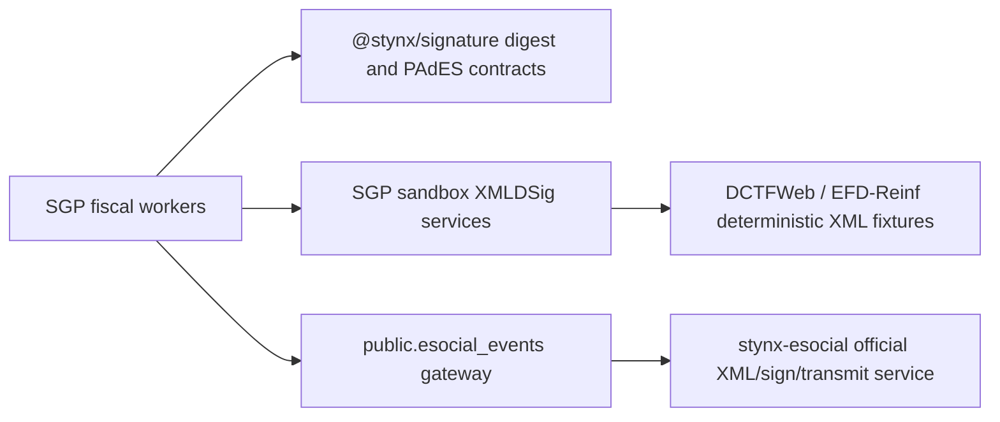

# Signature Architecture

Date: 2026-05-24

## Decision

SGP adopts `@stynx/signature` for shared digest and PAdES-facing contracts, but
retains local sandbox XMLDSig signing for fiscal integrations that still need
SGP-owned deterministic fixtures.

The retained local boundary is intentionally narrow:

- `backend/src/external/signature/icp-signer.service.ts` owns tenant fiscal
  certificate lookup and sandbox XML signature material used by DCTFWeb and
  EFD-Reinf flows.
- `backend/src/external/signature/pades.adapter.ts` adapts the shared
  `@stynx/signature` PAdES facade for signed PDF evidence.
- `backend/src/integrations/stynx-esocial/sgp-esocial-transmission.service.ts`
  signs SGP sandbox eSocial spool envelopes only for local transmission tests.

Production eSocial XML construction, schema validation, certificate custody, and
official transmission remain outside SGP in `stynx-esocial`.

## Boundary

## Rationale

The local XMLDSig code stays because current SGP tests assert byte-sensitive
golden XML and sandbox signatures. Moving that code to `@stynx/signature`
requires the shared package to expose an XMLDSig adapter with deterministic
canonicalization, fixture-stable certificate metadata, and test helpers for the
DCTFWeb and EFD-Reinf payload shapes SGP already covers.

Until that lands, SGP must not replace the local signer with a compatibility
shim or a weaker digest-only proof. The local code remains sandbox-only and
must not acquire production certificate custody.

## Retirement Criteria

Retire the SGP XMLDSig copy only after `@stynx/signature` provides:

- XML canonicalization and SHA-256/RSA signing interfaces for fiscal XML.
- Deterministic sandbox adapters suitable for byte-sensitive goldens.
- Clear production certificate ownership boundaries.
- Passing SGP DCTFWeb, EFD-Reinf, and eSocial spool tests without fixture drift.
