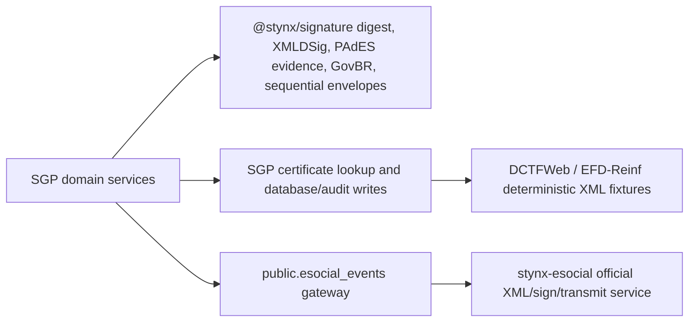

# Signature Architecture

Date: 2026-05-24

## Decision

SGP adopts `@stynx/signature` for shared digest helpers, PAdES evidence blocks,
XMLDSig signing/verification, GovBR sandbox evidence, and ordered sequential
document-signing envelopes.

The retained SGP boundary is intentionally narrow:

- `backend/src/external/signature/icp-signer.service.ts` owns tenant fiscal
  certificate lookup and PKCS#12 parsing, then delegates XMLDSig signing and
  verification to `@stynx/signature/xmldsig`.
- `@stynx/pdf/evidence` adapts PDF verification hints and delegates the
  `%%STYNX-PADES-SIGNATURE` evidence block to `@stynx/signature`.
- `backend/src/auth/govbr/govbr-signature-sandbox.adapter.ts` preserves the SGP
  API shape while delegating tamper-evident GovBR sandbox signatures to
  `@stynx/signature`.
- `backend/src/recrutamento/banca/document-signing.service.ts` preserves SGP
  database writes and RBAC/audit flow while delegating ordered sequential
  envelope verification to `@stynx/signature`.
- `backend/src/integrations/stynx-esocial/sgp-esocial-transmission.service.ts`
  signs SGP sandbox eSocial spool envelopes only for local transmission tests.

Production eSocial XML construction, schema validation, certificate custody, and
official transmission remain outside SGP in `stynx-esocial`.

## Boundary

## Rationale

STYNX now owns the reusable cryptographic helper surfaces SGP needed to retire
duplicated local implementations. SGP still owns domain orchestration, tenant
certificate lookup, RLS-protected persistence, audit marking, and regulatory
workflow status transitions.

SGP must not move production certificate custody into this repository. Official
eSocial XML construction, schema validation, certificate custody, and
transmission remain delegated to `stynx-esocial`.

## Remaining Boundary

`@stynx/signature` provides package-owned PAdES evidence and provider contracts,
and `@stynx/pdf/evidence` owns the PDF verification-hint append step. SGP uses
the deterministic provider-free STYNX evidence appender for local PDF fixtures.
Legal CMS/PKCS#7/PAdES provider signing remains a release-gated integration
decision, not a local test shortcut.
