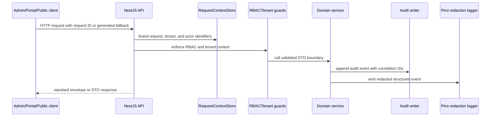
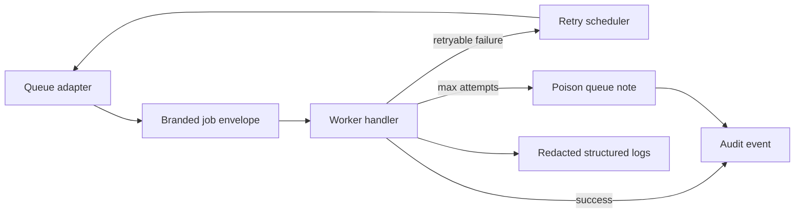
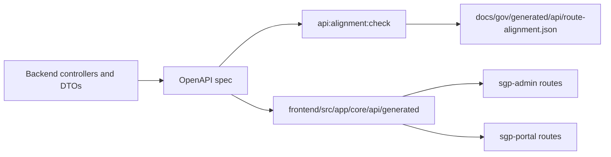
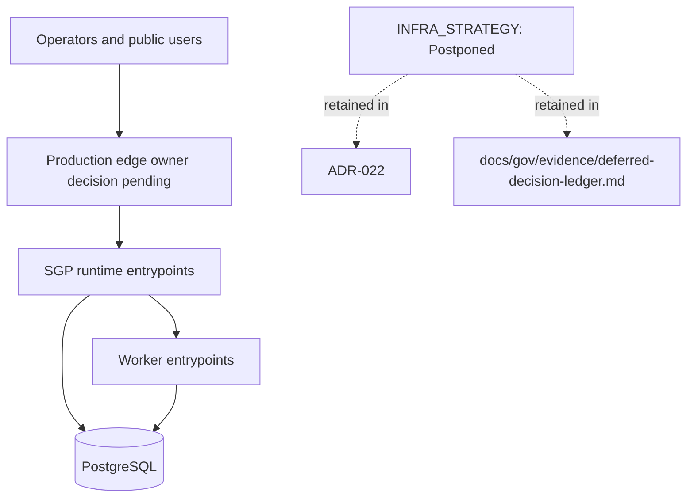

# SGP Architecture and Layout Map

Status: current architecture map for v0.0.1
Last updated: 2026-05-09

This map records the live SGP implementation shape used by governance and QA
scorecard evidence. It complements `docs/gov/generated/runtime-topology.json`;
the generated topology remains the machine-readable runtime source.

## Repository Layout

| Root         | Role                                                                                  | Acceptance posture                                                                   |
| ------------ | ------------------------------------------------------------------------------------- | ------------------------------------------------------------------------------------ |
| `backend/`   | NestJS APIs, services, workers, DTOs, guards, filters, and backend tests.             | Current SGP runtime authority.                                                       |
| `frontend/`  | Angular `sgp-admin` and `sgp-portal` workspaces plus generated API client.            | Portal is current scope; broad admin parity is deferred under `ADMIN_INSTALL_LATER`. |
| `database/`  | Canonical PostgreSQL schemas, RLS, grants, seeds, and alignment packs.                | Current database authority.                                                          |
| `scripts/`   | Root dispatcher and governance/audit/alignment checks.                                | Current tooling authority.                                                           |
| `tests/`     | Cross-workspace e2e, RLS, Playwright, and script tests.                               | Current gate evidence.                                                               |
| `docs/eng/`  | Product, architecture, ADRs, domain specs, and accepted behavior.                     | Highest documentation authority.                                                     |
| `docs/gov/`  | Governance controls, generated surfaces, audit state, evidence, and reusable prompts. | Governance and retained evidence authority.                                          |
| `docs/work/` | Ignored scratch for round and QA work.                                                | Not acceptance authority.                                                            |

## Layout Waivers

- `SGP-LAYOUT-WAIVER:ROOT-SRC`: SGP is not a library package and has no active
  root `src/`. Shared runtime code lives in `backend/src/common`, and generated
  frontend contracts live in `frontend/src/app/core/api/generated`.
- `SGP-LAYOUT-WAIVER:ROOT-TOOLS`: repo-local automation is intentionally under
  `scripts/`, with root commands routed through `scripts/run.mjs`; no separate
  root `tools/` boundary is required for v0.0.1.

## Runtime Entrypoints

| Runtime                   | Entrypoint                                | Module                            | Observability                                                                     |
| ------------------------- | ----------------------------------------- | --------------------------------- | --------------------------------------------------------------------------------- |
| `sgp-core-api`            | `backend/src/main.ts`                     | `AppModule`                       | Pino redaction, request IDs, OpenTelemetry, Prometheus, helmet, rate limit, CORS. |
| `sgp-portal-api`          | `backend/src/main-portal.ts`              | `AppPortalModule`                 | Pino redaction, request IDs, OpenTelemetry, Prometheus, helmet, rate limit, CORS. |
| `sgp-payroll-engine`      | `backend/src/main-payroll-engine.ts`      | `PayrollEngineModule`             | Pino redaction, OpenTelemetry, Prometheus, helmet, rate limit, CORS.              |
| `sgp-integrations-worker` | `backend/src/main-integrations-worker.ts` | `IntegrationsWorkerRuntimeModule` | Pino redaction, worker scheduler, readiness probe, graceful shutdown.             |
| `sgp-report-service`      | `backend/src/main-report-service.ts`      | `ReportServiceModule`             | Pino redaction, OpenTelemetry, Prometheus, helmet, rate limit, CORS.              |
| `sgp-report-worker`       | `backend/src/main-report-worker.ts`       | `ReportWorkerRuntimeModule`       | Pino redaction, worker scheduler, readiness probe, graceful shutdown.             |

### Trace ↔ log correlation

The OpenTelemetry tracing middleware (`backend/src/common/observability/otel.tracing.ts`) extracts the W3C trace-id from the incoming `traceparent` header at request entry and writes it onto `request.traceId` (declared on `RequestWithContext`). The Pino logger configured in `backend/src/common/logging/logging.config.ts` emits that same trace-id on every request log line via its `customProps` callback, and the exported OTel span carries it twice — once as the canonical W3C `traceId` field and once as the explicit `sgp.trace_id` attribute. Operators pivoting between log entries and the OTel collector reach the same identifier from either signal. The contract is exercised end-to-end by `tests/backend/observability/trace-id-end-to-end.spec.ts`.

## Boundary Rules

- `ADMIN_INSTALL_LATER` remains owner-accepted scope reduction: full admin menu
  parity, admin identity management, broad administrative coverage, and generic
  admin backend/db/frontend surfaces are delegated to the `../stynx` framework
  and are not SGP v0.0.1 acceptance blockers unless a future owner decision
  reopens a concrete product-domain route or surface in `docs/eng`.
- eSocial implementation is outside SGP runtime ownership. SGP owns source-data
  mappings, producer DTO/projection contracts, `public.esocial_events` gateway
  state, local status/audit consumers, and operator display; XML/XSD builders,
  signing, SOAP transmission, returns, totalizers, retry/DLQ, and official
  homologation belong to `../stynx-esocial`.
- DET implementation is outside SGP runtime ownership. SGP owns local DET inbox
  projection, annotations, typed request/status envelopes, and acknowledgement
  request status; government polling, certificates, acknowledgement protocol,
  normalization, retry/DLQ, and external audit publication belong to an external
  DET service boundary rather than this repository.
- SGP may call Stynx-owned integrations through explicit package or adapter
  boundaries, but backend code must not import from `frontend/`, frontend code
  must not import from `backend/`, and generated/client artifacts must remain
  produced by the accepted API alignment flow.
- eSocial, TCE, banking, Gov.br, and other official external homologation paths
  stay behind accepted mock/sandbox/downstream boundaries recorded in
  `docs/gov/evidence/deferred-decision-ledger.md`.

## Contract Flows

### API Request, Audit, And Logging

### Worker Job, Retry, Poison, And Audit

### OpenAPI Client Flow

### Postponed Infrastructure Topology

