# Experience Authority

Authored experience authority: menus, operator workflows, manual flows, and official outputs.

## Merged Artifact Index

- Árvore de Menus — SGP Admin e Portal do Servidor
- Manual do Usuário — SGP Sistema de Gestão de Pessoas
- Catálogo de Saídas Oficiais — SGP Moderno

## Árvore de Menus — SGP Admin e Portal do Servidor

## Árvore de Menus — SGP Admin e Portal do Servidor

**Versão:** 1.0 | **Data:** 2026-04-21 | **Status:** Draft
**Escopo:** sgp-admin (back-office), sgp-portal (Portal do Servidor) | **Depende de:** BRIEF.md, 31-autorizacao-menu-e-capacidades-funcionais.md, 57-autorizacao-estatica-completa.md, 44-inventario-real-menus-rhlinkcon.csv, 46-matriz-real-usuario-papel-menu-rhlinkcon.csv.

---

### 1. Visão Geral

O SGP é composto por duas SPAs Angular independentes:

| Aplicação    | Finalidade                                                              | Menus de 1º nível                                           |
| ------------ | ----------------------------------------------------------------------- | ----------------------------------------------------------- |
| `sgp-admin`  | Back-office administrativo; acesso restrito a operadores internos       | 11 ramos postergados sob `ADMIN_INSTALL_LATER`              |
| `sgp-portal` | Portal do Servidor / Pensionista / Candidato; acesso ao próprio usuário | 1 raiz com 11 seções; itens de identidade/OAuth postergados |

#### 1.1 Menus de 1º nível — `sgp-admin`

Arrecadação Previdenciária fica para versão futura e não possui ramo de menu, rota Angular, papel ou seed no v0.0.1. A árvore completa do `sgp-admin` permanece postergada sob `ADMIN_INSTALL_LATER`: rotas Angular, workspaces específicos, rotas backend administrativas, OAuth/Cognito/Gov.br e autorização corporativa serão retomados por decisão posterior. Qualquer código frontend existente para esses caminhos é oportunístico e não conta como gate de aceite do pacote atual.

| #    | Nome exibido                 | Categoria técnica       | Módulo NestJS    | Lib Angular           |
| ---- | ---------------------------- | ----------------------- | ---------------- | --------------------- |
| 3.1  | Gestão                       | `GESTAO`                | `gestao`         | `@sgp/gestao`         |
| 3.2  | Módulo RH                    | `MODULO_RH`             | `rh`             | `@sgp/rh`             |
| 3.3  | Folha de Pgt                 | `FOLHA_PAGAMENTO`       | `folha`          | `@sgp/folha`          |
| 3.4  | Módulo Avaliação             | `MODULO_AVALIACAO`      | `avaliacao`      | `@sgp/avaliacao`      |
| 3.5  | Recrutamento e Seleção       | `RECRUTAMENTO_SELECAO`  | `recrutamento`   | `@sgp/recrutamento`   |
| 3.6  | Consultas Gerenciais         | `CONSULTAS_GERENCIAIS`  | `consultas`      | `@sgp/consultas`      |
| 3.7  | Relatório                    | `RELATORIO`             | `relatorios`     | `@sgp/relatorios`     |
| 3.8  | Módulo Previdenciário        | `MODULO_PREVIDENCIARIO` | `previdenciario` | `@sgp/previdenciario` |
| 3.9  | Auditoria                    | `AUDITORIA`             | `auditoria`      | `@sgp/auditoria`      |
| 3.10 | Área de Saúde / Junta Médica | `JUNTA_MEDICA`          | `saude`          | `@sgp/saude`          |
| 3.11 | Convênio                     | `CONVENIO`              | `convenio`       | `@sgp/convenio`       |

#### 1.2 Menu raiz — `sgp-portal`

O Portal do Servidor expõe uma única raiz de navegação com 11 seções (ver seção 4). Itens de identidade, MFA, troca de senha, Cognito UserPool e federação Gov.br ficam sob `IDENTITY_INSTALL_LATER` até integração com o framework corporativo.

---

### 2. Convenções

#### 2.1 Formato de rota

```
/<modulo>/<entidade>/gestao
/<modulo>/<entidade>/formulario
/<modulo>/<entidade>/formulario/:id
/<modulo>/<entidade>/detalhes/:id
```

- `gestao` — tela de listagem / pesquisa com ações inline.
- `formulario` — criação de novo registro.
- `formulario/:id` — edição de registro existente.
- `detalhes/:id` — modo somente leitura.

Prefixo de API REST correspondente:

- Back-office: `/api/v1/<recurso>`
- Portal: `/api/portal/v1/<recurso>`
- Externo (OAuth2 client-credentials): `/api/external/v1/<recurso>`

#### 2.2 Papel necessário

Notação adotada neste documento: `MODULO.ACAO`

Onde `ACAO` é um dos valores:

- `VISUALIZAR` — somente leitura
- `CADASTRAR` — criação (inclui visualização)
- `ATUALIZAR` — edição (inclui visualização)
- `EXCLUIR` — remoção (inclui edição, criação, visualização)
- `GESTAO` — controle integral do módulo (equivalente a todos os anteriores)

Papel expandido em runtime: `ROLE_<MODULO>_<ACAO>` (ex.: `ROLE_FUNCIONARIO_GESTAO`).

`ROLE_ADMIN` sempre substitui qualquer papel específico.

Módulos cujo único nível prático é `GESTAO` (sem granularidade CRUD):
`RECADASTRAMENTO`, `PERICIA_MEDICA`, `AGENDA_MEDICA`, `ARQUIVO_REMESSA`, `FOLHA_DE_PGT`, `RELATORIO_FOLHA_PAGAMENTO`, `AUDITORIA`, `RELATORIO_VERBAS`, `RELATORIO_APOSENTADO_PENSAO`, `RELATORIO_SERV_PAG_BLOQUEADO`, `ARQUIVO_EXPORTACAO_SIPREV`, `DIRF`, `RELATORIO_BATIMENTO_FOLHA`, `RELATORIO_PROVENTOS_DESCONTOS`, `RELATORIO_REPASSE_FUNDO_RH`, `RELATORIO_GERENCIAL`, `ESPECIALIDADE_MEDICA`, `MEDICO`.

#### 2.3 Feature flags

| Flag                                  | Efeito                                                                |
| ------------------------------------- | --------------------------------------------------------------------- |
| `esocial.enabled=false`               | Oculta todos os itens cujo nome, nomeAscii ou URL contenham `esocial` |
| `PORTAL_SERVIDOR_ENABLED=false`       | Desativa o `sgp-portal`; não afeta o `sgp-admin`                      |
| `GOV_BR_SSO_ENABLED=false`            | Remove opção de login via Gov.br no portal                            |
| `PROVA_VIDA_PUBLIC_API_ENABLED=false` | Desativa canal externo de prova de vida                               |
| `AUDIT_FULL_TRACE_ENABLED=false`      | Reduz detalhamento da trilha de auditoria                             |

#### 2.4 Terminologia parametrizável

O texto "Funcionário/Servidor" exibido nos menus e telas é interpolado a partir de `ParametroSistema.termo_funcionario` e `ParametroSistema.termo_funcionario_plural`. Neste documento utiliza-se "Servidor" como valor padrão de referência.

---

### 3. Árvore Completa — `sgp-admin`

```
sgp-admin
├── 3.1  Gestão
│   ├── Parametrizações
│   │   ├── Área de Formação
│   │   ├── Atividade
│   │   ├── Banco / Agência
│   │   ├── Categoria Profissional
│   │   ├── CBO
│   │   ├── CNAE
│   │   ├── Centro de Custo
│   │   ├── Consignado
│   │   ├── Conta Contábil
│   │   ├── Convênios (cadastro mestre)
│   │   ├── Curso
│   │   ├── Grau Acadêmico
│   │   ├── Município
│   │   ├── Nacionalidade / País
│   │   ├── Sindicato
│   │   ├── Turno
│   │   ├── UF
│   │   ├── Tipo de Documento
│   │   ├── Modelo de Documento
│   │   ├── Parâmetro Sistema
│   │   ├── Parâmetro Global
│   │   └── Feature Flag
│   ├── Estrutura de Pessoal
│   │   ├── Cargo
│   │   ├── Função
│   │   ├── Faixa Salarial
│   │   ├── Referência Salarial
│   │   ├── Lotação
│   │   ├── Empresa Filial
│   │   ├── Nível Salarial
│   │   ├── Grupo Salarial
│   │   ├── Vínculo
│   │   ├── Tipo de Contrato
│   │   ├── Tipo de Folha
│   │   ├── Tipo de Processamento
│   │   ├── Verba / Rubrica
│   │   ├── Evento
│   │   └── Requisito
│   └── Legais
│       ├── Classificação de Atos
│       ├── Legislação / Motivo
│       ├── Tipo Desligamento
│       ├── Causa de Afastamento
│       ├── Motivo de Afastamento
│       ├── Tipo de Averbação
│       └── Tipo de Aposentadoria
├── 3.2  Módulo RH
│   ├── Cadastro Funcional
│   │   ├── Servidor (Funcionário)
│   │   ├── Dado Complementar
│   │   ├── Dependente
│   │   ├── Dependente Benefício
│   │   ├── Tempo de Serviço
│   │   ├── Experiência Profissional
│   │   ├── Dossiê / Observação Documental
│   │   └── Documento de Amparo
│   ├── Vida Funcional
│   │   ├── Posse — Efetivo
│   │   ├── Posse — Comissionado
│   │   ├── Posse — Contratado
│   │   ├── Histórico de Situação
│   │   ├── Afastamento
│   │   ├── Transferência
│   │   ├── Exoneração / Desligamento
│   │   ├── Rescisão de Contrato
│   │   ├── Falta
│   │   ├── Frequência
│   │   ├── Programação de Férias
│   │   ├── Licença-Prêmio
│   │   └── Progressão Salarial (Histórico Nível)
│   └── Correlatos
│       ├── Pensão Alimentícia
│       ├── Contribuição Sindical
│       ├── Decisão Judicial
│       ├── Categoria Profissional (vínculo)
│       ├── Processo
│       └── Processo-Função
├── 3.3  Folha de Pgt
│   ├── Centrais
│   │   ├── Competência
│   │   ├── Folha de Pagamento
│   │   ├── Contracheque
│   │   └── Detalhamento de Contracheque
│   ├── Verbas e Lançamentos
│   │   ├── Verbas (cadastro)
│   │   ├── Verbas por Servidor
│   │   ├── Verbas por Pensionista
│   │   ├── Lançamento Manual
│   │   ├── Importador de Verbas Servidor
│   │   ├── Importador de Verbas Pensionista
│   │   └── Importação Consignado
│   ├── Fechamentos e Obrigações
│   │   ├── DIRF
│   │   ├── SEFIP
│   │   ├── Remessa Bancária
│   │   ├── Retorno Bancário
│   │   └── Batimento de Folha
│   └── Relatórios de Folha
│       ├── Relatório de Folha
│       ├── Relatório Financeiro
│       ├── Proventos e Descontos
│       ├── Repasse Fundo RH
│       ├── Relatório de Verbas
│       └── Resumo de Folha
├── 3.4  Módulo Avaliação
│   ├── Avaliação de Desempenho
│   ├── Progressão por Mérito
│   ├── Progressão por Titularidade
│   ├── Progressão Judicial
│   ├── Correção Salarial
│   ├── Plano de Cargos e Carreira
│   └── Simulador de Nível Salarial
├── 3.5  Recrutamento e Seleção
│   ├── Demanda
│   │   ├── Requisição de Pessoal
│   │   └── Gestão de Requisições
│   ├── Captação
│   │   ├── Banco de Talentos
│   │   ├── Cadastro de Currículo
│   │   └── Análise Curricular
│   └── Estágio
│       ├── Estagiário
│       ├── Programa de Estágio
│       ├── Prorrogação de Estágio
│       └── Recesso de Estágio
├── 3.6  Consultas Gerenciais
│   ├── Ficha Financeira
│   ├── Ficha Funcional
│   ├── Relatórios por Situação
│   ├── Servidor com Pagamento Bloqueado
│   ├── Histórico Operacional
│   └── Dashboards
├── 3.7  Relatório
│   ├── Relatório Gerencial
│   ├── Relatório de Folha
│   ├── Relatório Financeiro
│   ├── Aposentados e Pensionistas
│   ├── Repasse Fundo RH
│   ├── Proventos e Descontos
│   ├── Relatório de Verbas
│   ├── Relatório de Estágio
├── 3.8  Módulo Previdenciário
│   ├── Concessão
│   │   ├── Regra de Aposentadoria
│   │   ├── Simulador de Aposentadoria
│   │   ├── Pensão
│   │   ├── Compensação Previdenciária
│   │   └── Certidão de Tempo de Contribuição
│   ├── Documentais
│   │   ├── Declaração de Aposentado
│   │   ├── Declaração de Ex-Servidor
│   │   └── Certidão de Compensação
│   └── Operacionais
│       ├── Prova de Vida / Recadastramento
│       ├── Transferência Previdenciária
│       └── Relatórios Previdenciários
├── 3.9  Auditoria
│   ├── Consulta de Trilha
│   ├── Detalhe de Evento
│   ├── Relatório de Auditoria
│   └── Filtros (entidade / usuário / período)
├── 3.10 Área de Saúde / Junta Médica
│   ├── Agenda
│   │   ├── Configurar Agenda Médica
│   │   └── Painel de Agenda
│   ├── Perícia
│   │   ├── Atendimento Agendado
│   │   ├── Atendimento Pendente
│   │   ├── Validação de Laudo
│   │   └── Licença Médica
│   ├── Suporte Clínico
│   │   ├── Médico
│   │   ├── Especialidade Médica
│   │   ├── Exame Ocupacional
│   │   ├── Entidade de Exames
│   │   └── Profissional de Saúde
│   └── SST
│       ├── Acidente de Trabalho
│       ├── CID
│       ├── Categoria de Doenças
│       ├── Subcategoria de Doenças
│       ├── Agente Nocivo
│       ├── EPI
│       └── EPC
├── 3.11 Convênio
│   ├── Convênios
│   ├── Beneficiários
│   └── Descontos em Folha
```

---

#### 3.1 Gestão

##### 3.1.1 Subgrupo: Parametrizações

| Item de menu           | Rota                                    | Papel                           | Feature Flag | Módulo NestJS | Comentário                                          |
| ---------------------- | --------------------------------------- | ------------------------------- | ------------ | ------------- | --------------------------------------------------- |
| Área de Formação       | `/gestao/area-formacao/gestao`          | `AREA_FORMACAO.GESTAO`          | —            | `gestao`      | Cadastro mestre                                     |
| Atividade              | `/gestao/atividade/gestao`              | `ATIVIDADE.GESTAO`              | —            | `gestao`      | Cadastro mestre                                     |
| Banco                  | `/gestao/banco/gestao`                  | `BANCO.GESTAO`                  | —            | `gestao`      | Banco e agência                                     |
| Categoria Profissional | `/gestao/categoria-profissional/gestao` | `CATEGORIA_PROFISSIONAL.GESTAO` | —            | `gestao`      | —                                                   |
| CBO                    | `/gestao/cbo/gestao`                    | `CBO.GESTAO`                    | —            | `gestao`      | Classificação Brasileira de Ocupações               |
| CNAE                   | `/gestao/cnae/gestao`                   | `CNAE.GESTAO`                   | —            | `gestao`      | Atividade econômica                                 |
| Centro de Custo        | `/gestao/centro-custo/gestao`           | `CENTRO_CUSTO.GESTAO`           | —            | `gestao`      | —                                                   |
| Consignado             | `/gestao/consignado/gestao`             | `CONSIGNADO.GESTAO`             | —            | `gestao`      | Entidade de desconto consignado                     |
| Conta Contábil         | `/gestao/conta-contabil/gestao`         | `CONTA_CONTABIL.GESTAO`         | —            | `gestao`      | Plano de contas simplificado e completo             |
| Convênio (mestre)      | `/gestao/convenio/gestao`               | `CONVENIO.GESTAO`               | —            | `gestao`      | Somente cadastro mestre; gestão operacional em 3.11 |
| Curso                  | `/gestao/curso/gestao`                  | `CURSO.GESTAO`                  | —            | `gestao`      | Cursos de formação                                  |
| Grau Acadêmico         | `/gestao/grau-academico/gestao`         | `GRAU_ACADEMICO.GESTAO`         | —            | `gestao`      | —                                                   |
| Município              | `/gestao/municipio/gestao`              | `MUNICIPIO.GESTAO`              | —            | `gestao`      | Tabela IBGE                                         |
| Nacionalidade / País   | `/gestao/nacionalidade/gestao`          | `NACIONALIDADE.GESTAO`          | —            | `gestao`      | —                                                   |
| Sindicato              | `/gestao/sindicato/gestao`              | `SINDICATO.GESTAO`              | —            | `gestao`      | —                                                   |
| Turno                  | `/gestao/turno/gestao`                  | `TURNO.GESTAO`                  | —            | `gestao`      | —                                                   |
| UF                     | `/gestao/uf/gestao`                     | `UF.GESTAO`                     | —            | `gestao`      | Unidades Federativas                                |
| Tipo de Documento      | `/gestao/tipo-documento/gestao`         | `TIPO_DOCUMENTO.GESTAO`         | —            | `gestao`      | Tipos de documentos pessoais                        |
| Modelo de Documento    | `/gestao/modelo-documento/gestao`       | `MODELO_DOCUMENTO.GESTAO`       | —            | `gestao`      | Templates para geração de PDF                       |
| Parâmetro Sistema      | `/gestao/parametro-sistema/formulario`  | `PARAMETRO_SISTEMA.GESTAO`      | —            | `parametros`  | Identidade do tenant; formulário único              |
| Parâmetro Global       | `/gestao/parametro-global/gestao`       | `PARAMETRO_GLOBAL.GESTAO`       | —            | `parametros`  | Chaves operacionais (teto, salário mínimo…)         |
| Feature Flag           | `/gestao/feature-flag/gestao`           | `FEATURE_FLAG.GESTAO`           | —            | `parametros`  | Ativação/desativação de funcionalidades             |

##### 3.1.2 Subgrupo: Estrutura de Pessoal

| Item de menu          | Rota                                 | Papel                        | Feature Flag | Módulo NestJS | Comentário                                |
| --------------------- | ------------------------------------ | ---------------------------- | ------------ | ------------- | ----------------------------------------- |
| Cargo                 | `/gestao/cargo/gestao`               | `CARGO.GESTAO`               | —            | `gestao`      | —                                         |
| Função                | `/gestao/funcao/gestao`              | `FUNCAO.GESTAO`              | —            | `gestao`      | Função comissionada ou de confiança       |
| Faixa Salarial        | `/gestao/faixa-salarial/gestao`      | `FAIXA_SALARIAL.GESTAO`      | —            | `gestao`      | —                                         |
| Referência Salarial   | `/gestao/referencia-salarial/gestao` | `REFERENCIA_SALARIAL.GESTAO` | —            | `gestao`      | —                                         |
| Lotação               | `/gestao/lotacao/gestao`             | `LOTACAO.GESTAO`             | —            | `gestao`      | Unidade administrativa                    |
| Empresa Filial        | `/gestao/empresa-filial/gestao`      | `EMPRESA_FILIAL.GESTAO`      | —            | `gestao`      | Filial do tenant                          |
| Nível Salarial        | `/gestao/nivel-salarial/gestao`      | `NIVEL_SALARIAL.GESTAO`      | —            | `gestao`      | —                                         |
| Grupo Salarial        | `/gestao/grupo-salarial/gestao`      | `GRUPO_SALARIAL.GESTAO`      | —            | `gestao`      | —                                         |
| Vínculo               | `/gestao/vinculo/gestao`             | `VINCULO.GESTAO`             | —            | `gestao`      | Tipos de vínculo (efetivo, comissionado…) |
| Tipo de Contrato      | `/gestao/tipo-contrato/gestao`       | `TIPO_CONTRATO.GESTAO`       | —            | `gestao`      | —                                         |
| Tipo de Folha         | `/gestao/tipo-folha/gestao`          | `TIPO_FOLHA.GESTAO`          | —            | `gestao`      | —                                         |
| Tipo de Processamento | `/gestao/tipo-processamento/gestao`  | `TIPO_PROCESSAMENTO.GESTAO`  | —            | `gestao`      | MENSAL, 13º, FÉRIAS…                      |
| Verba / Rubrica       | `/gestao/verba/gestao`               | `VERBA.GESTAO`               | —            | `folha`       | Cadastro de verbas e fórmulas DSL         |
| Evento                | `/gestao/evento/gestao`              | `EVENTO.GESTAO`              | —            | `gestao`      | Eventos de eSocial                        |
| Requisito             | `/gestao/requisito/gestao`           | `REQUISITO.GESTAO`           | —            | `gestao`      | Requisitos de cargos/funções              |

##### 3.1.3 Subgrupo: Legais

| Item de menu          | Rota                                | Papel                       | Feature Flag | Módulo NestJS | Comentário                            |
| --------------------- | ----------------------------------- | --------------------------- | ------------ | ------------- | ------------------------------------- |
| Classificação de Atos | `/gestao/classificacao-ato/gestao`  | `CLASSIFICACAO_ATO.GESTAO`  | —            | `gestao`      | Catálogo consumido por nomeação/posse |
| Legislação / Motivo   | `/gestao/motivo/gestao`             | `MOTIVO.GESTAO`             | —            | `gestao`      | Motivos gerais                        |
| Tipo de Desligamento  | `/gestao/tipo-desligamento/gestao`  | `TIPO_DESLIGAMENTO.GESTAO`  | —            | `gestao`      | —                                     |
| Causa de Afastamento  | `/gestao/causa-afastamento/gestao`  | `CAUSA_AFASTAMENTO.GESTAO`  | —            | `gestao`      | —                                     |
| Motivo de Afastamento | `/gestao/motivo-afastamento/gestao` | `MOTIVO_AFASTAMENTO.GESTAO` | —            | `gestao`      | —                                     |
| Tipo de Averbação     | `/gestao/tipo-averbacao/gestao`     | `TIPO_AVERBACAO.GESTAO`     | —            | `gestao`      | —                                     |
| Tipo de Aposentadoria | `/gestao/tipo-aposentadoria/gestao` | `TIPO_APOSENTADORIA.GESTAO` | —            | `gestao`      | —                                     |

---

#### 3.2 Módulo RH

##### 3.2.1 Subgrupo: Cadastro Funcional

| Item de menu                   | Rota                                  | Papel                             | Feature Flag | Módulo NestJS | Comentário                              |
| ------------------------------ | ------------------------------------- | --------------------------------- | ------------ | ------------- | --------------------------------------- |
| Servidor (Funcionário) — lista | `/rh/servidor/gestao`                 | `FUNCIONARIO.VISUALIZAR`          | —            | `rh`          | Usa `termo_funcionario` como label      |
| Servidor — novo                | `/rh/servidor/formulario`             | `FUNCIONARIO.CADASTRAR`           | —            | `rh`          | CPF obrigatório; validação de unicidade |
| Servidor — editar              | `/rh/servidor/formulario/:id`         | `FUNCIONARIO.ATUALIZAR`           | —            | `rh`          | —                                       |
| Servidor — detalhes            | `/rh/servidor/detalhes/:id`           | `FUNCIONARIO.VISUALIZAR`          | —            | `rh`          | —                                       |
| Dado Complementar              | `/rh/dado-complementar/gestao`        | `DADO_COMPLEMENTAR.GESTAO`        | —            | `rh`          | Campos adicionais por tenant            |
| Dependente                     | `/rh/dependente/gestao`               | `DEPENDENTE.GESTAO`               | —            | `rh`          | IR, Salário-Família, Pensão, Saúde      |
| Dependente Benefício           | `/rh/dependente-beneficio/gestao`     | `DEPENDENTE_BENEFICIO.GESTAO`     | —            | `rh`          | Dependentes de plano de saúde/convênio  |
| Tempo de Serviço               | `/rh/tempo-servico/gestao`            | `TEMPO_SERVICO.GESTAO`            | —            | `rh`          | Averbação de tempo anterior             |
| Experiência Profissional       | `/rh/experiencia-profissional/gestao` | `EXPERIENCIA_PROFISSIONAL.GESTAO` | —            | `rh`          | —                                       |
| Dossiê / Observação Documental | `/rh/dossie/gestao`                   | `DOSSIE.GESTAO`                   | —            | `rh`          | Documentos e observações por servidor   |
| Documento de Amparo            | `/rh/documento-amparo/gestao`         | `DOCUMENTO_AMPARO.GESTAO`         | —            | `rh`          | Obrigatório em cedência                 |

##### 3.2.2 Subgrupo: Vida Funcional

| Item de menu                      | Rota                                    | Papel                                 | Feature Flag | Módulo NestJS | Comentário                                |
| --------------------------------- | --------------------------------------- | ------------------------------------- | ------------ | ------------- | ----------------------------------------- |
| Posse — Efetivo                   | `/rh/posse-efetivo/gestao`              | `POSSE_EFETIVO.GESTAO`                | —            | `rh`          | Ingresso efetivo; gera termo de posse PDF |
| Posse — Efetivo (formulário)      | `/rh/posse-efetivo/formulario/:id`      | `POSSE_EFETIVO.GESTAO`                | —            | `rh`          | —                                         |
| Posse — Comissionado              | `/rh/posse-comissionado/gestao`         | `POSSE_COMISSIONADO.GESTAO`           | —            | `rh`          | —                                         |
| Posse — Comissionado (formulário) | `/rh/posse-comissionado/formulario/:id` | `POSSE_COMISSIONADO.GESTAO`           | —            | `rh`          | —                                         |
| Posse — Contratado                | `/rh/posse-contratado/gestao`           | `POSSE_CONTRATADO.GESTAO`             | —            | `rh`          | —                                         |
| Posse — Contratado (formulário)   | `/rh/posse-contratado/formulario/:id`   | `POSSE_CONTRATADO.GESTAO`             | —            | `rh`          | —                                         |
| Histórico de Situação             | `/rh/historico-situacao/gestao`         | `HISTORICO_SITUACAO_FUNCIONAL.GESTAO` | —            | `rh`          | —                                         |
| Afastamento                       | `/rh/afastamento/gestao`                | `AFASTAMENTO.GESTAO`                  | —            | `rh`          | Valida limite anual por motivo            |
| Transferência                     | `/rh/transferencia/gestao`              | `TRANSFERENCIA.GESTAO`                | —            | `rh`          | Com ou sem ônus; designada                |
| Exoneração / Desligamento         | `/rh/desligamento/gestao`               | `DESLIGAMENTO.GESTAO`                 | —            | `rh`          | —                                         |
| Rescisão de Contrato              | `/rh/rescisao/gestao`                   | `RESCISAO.GESTAO`                     | —            | `rh`          | Contratados CLT/temporários               |
| Falta                             | `/rh/falta/gestao`                      | `FALTA.GESTAO`                        | —            | `rh`          | —                                         |
| Frequência                        | `/rh/frequencia/gestao`                 | `FREQUENCIA.GESTAO`                   | —            | `rh`          | Registro de frequência                    |
| Programação de Férias             | `/rh/ferias-programacao/gestao`         | `FERIAS.GESTAO`                       | —            | `rh`          | Agendamento de férias                     |
| Licença-Prêmio                    | `/rh/licenca-premio/gestao`             | `LICENCA_PREMIO.GESTAO`               | —            | `rh`          | —                                         |
| Progressão Salarial               | `/rh/nivel-salarial-historico/gestao`   | `PROGRESSAO_SALARIAL.GESTAO`          | —            | `rh`          | Histórico de nível/referência             |

##### 3.2.3 Subgrupo: Correlatos

| Item de menu                     | Rota                                        | Papel                           | Feature Flag | Módulo NestJS | Comentário                      |
| -------------------------------- | ------------------------------------------- | ------------------------------- | ------------ | ------------- | ------------------------------- |
| Pensão Alimentícia               | `/rh/pensao-alimenticia/gestao`             | `PENSAO_ALIMENTICIA.GESTAO`     | —            | `rh`          | —                               |
| Contribuição Sindical            | `/rh/contribuicao-sindical/gestao`          | `CONTRIBUICAO_SINDICAL.GESTAO`  | —            | `rh`          | —                               |
| Decisão Judicial                 | `/rh/decisao-judicial/gestao`               | `DECISAO_JUDICIAL.GESTAO`       | —            | `rh`          | —                               |
| Categoria Profissional (vínculo) | `/rh/categoria-profissional-vinculo/gestao` | `CATEGORIA_PROFISSIONAL.GESTAO` | —            | `rh`          | Associação servidor × categoria |
| Processo                         | `/rh/processo/gestao`                       | `PROCESSO.GESTAO`               | —            | `rh`          | Processos administrativos       |
| Processo-Função                  | `/rh/processo-funcao/gestao`                | `PROCESSO_FUNCAO.GESTAO`        | —            | `rh`          | Relação processo × função       |

---

#### 3.3 Folha de Pgt

##### 3.3.1 Subgrupo: Centrais

| Item de menu            | Rota                               | Papel                 | Feature Flag | Módulo NestJS | Comentário                              |
| ----------------------- | ---------------------------------- | --------------------- | ------------ | ------------- | --------------------------------------- |
| Competência             | `/folha/competencia/gestao`        | `FOLHA_DE_PGT.GESTAO` | —            | `folha`       | Abertura, programação e fechamento      |
| Folha de Pagamento      | `/folha/folha-pagamento/gestao`    | `FOLHA_DE_PGT.GESTAO` | —            | `folha`       | Por filial × tipo_processamento         |
| Contracheque — lista    | `/folha/contracheque/gestao`       | `FOLHA_DE_PGT.GESTAO` | —            | `folha`       | Listagem por competência                |
| Contracheque — detalhes | `/folha/contracheque/detalhes/:id` | `FOLHA_DE_PGT.GESTAO` | —            | `folha`       | Download PDF; marca d'água configurável |

##### 3.3.2 Subgrupo: Verbas e Lançamentos

| Item de menu                  | Rota                                          | Papel                          | Feature Flag | Módulo NestJS | Comentário                     |
| ----------------------------- | --------------------------------------------- | ------------------------------ | ------------ | ------------- | ------------------------------ |
| Verbas (cadastro)             | `/folha/verba/gestao`                         | `VERBA.GESTAO`                 | —            | `folha`       | Fórmulas DSL; compilação SQL   |
| Verbas por Servidor           | `/folha/verbas-servidor/gestao`               | `VERBA_FUNCIONARIO.GESTAO`     | —            | `folha`       | `funcionario_verba`            |
| Verbas por Pensionista        | `/folha/verbas-pensionista/gestao`            | `VERBA_PENSIONISTA.GESTAO`     | —            | `folha`       | —                              |
| Lançamento Manual             | `/folha/lancamento-manual/gestao`             | `LANCAMENTO_MANUAL.GESTAO`     | —            | `folha`       | —                              |
| Importador Verbas Servidor    | `/folha/importacao-verbas-servidor/gestao`    | `IMPORTACAO_VERBAS.GESTAO`     | —            | `folha`       | Arquivo CSV/XLSX; substitutivo |
| Importador Verbas Pensionista | `/folha/importacao-verbas-pensionista/gestao` | `IMPORTACAO_VERBAS.GESTAO`     | —            | `folha`       | —                              |
| Importação Consignado         | `/folha/importacao-consignado/gestao`         | `IMPORTACAO_CONSIGNADO.GESTAO` | —            | `folha`       | Leiaute Neoconsig              |

##### 3.3.3 Subgrupo: Fechamentos e Obrigações

| Item de menu       | Rota                             | Papel                              | Feature Flag      | Módulo NestJS | Comentário                          |
| ------------------ | -------------------------------- | ---------------------------------- | ----------------- | ------------- | ----------------------------------- |
| DIRF               | `/folha/dirf/gestao`             | `DIRF.GESTAO`                      | —                 | `folha`       | Geração arquivo TXT RFB             |
| SEFIP              | `/folha/sefip/gestao`            | `SEFIP.GESTAO`                     | —                 | `folha`       | —                                   |
| Remessa Bancária   | `/folha/remessa-bancaria/gestao` | `ARQUIVO_REMESSA.GESTAO`           | —                 | `folha`       | CNAB 240/400 por banco              |
| Retorno Bancário   | `/folha/retorno-bancario/gestao` | `ARQUIVO_REMESSA.GESTAO`           | —                 | `folha`       | —                                   |
| Batimento de Folha | `/folha/batimento/gestao`        | `RELATORIO_BATIMENTO_FOLHA.GESTAO` | —                 | `folha`       | Conferência de totais               |
| eSocial            | `/folha/esocial/gestao`          | `ESOCIAL.GESTAO`                   | `esocial.enabled` | `folha`       | Leiaute S-1.2; oculto se flag false |

##### 3.3.4 Subgrupo: Relatórios de Folha

| Item de menu          | Rota                                          | Papel                                  | Feature Flag | Módulo NestJS | Comentário                      |
| --------------------- | --------------------------------------------- | -------------------------------------- | ------------ | ------------- | ------------------------------- |
| Relatório de Folha    | `/folha/relatorio-folha/gestao`               | `RELATORIO_FOLHA_PAGAMENTO.GESTAO`     | —            | `folha`       | PDF/XLSX                        |
| Relatório Financeiro  | `/folha/relatorio-financeiro/gestao`          | `RELATORIO_FOLHA_PAGAMENTO.GESTAO`     | —            | `folha`       | Persiste `relatorio_financeiro` |
| Proventos e Descontos | `/folha/relatorio-proventos-descontos/gestao` | `RELATORIO_PROVENTOS_DESCONTOS.GESTAO` | —            | `folha`       | —                               |
| Repasse Fundo RH      | `/folha/relatorio-repasse-fundo/gestao`       | `RELATORIO_REPASSE_FUNDO_RH.GESTAO`    | —            | `folha`       | —                               |
| Relatório de Verbas   | `/folha/relatorio-verbas/gestao`              | `RELATORIO_VERBAS.GESTAO`              | —            | `folha`       | —                               |
| Resumo de Folha       | `/folha/resumo/gestao`                        | `RELATORIO_FOLHA_PAGAMENTO.GESTAO`     | —            | `folha`       | XLSX consolidado                |

---

#### 3.4 Módulo Avaliação

| Item de menu                | Rota                                        | Papel                             | Feature Flag | Módulo NestJS | Comentário                                 |
| --------------------------- | ------------------------------------------- | --------------------------------- | ------------ | ------------- | ------------------------------------------ |
| Avaliação de Desempenho     | `/avaliacao/avaliacao-desempenho/gestao`    | `AVALIACAO_DESEMPENHO.GESTAO`     | —            | `avaliacao`   | Ciclos, critérios, notas                   |
| Progressão por Mérito       | `/avaliacao/progressao-merito/gestao`       | `PROGRESSAO_MERITO.GESTAO`        | —            | `avaliacao`   | —                                          |
| Progressão por Titularidade | `/avaliacao/progressao-titularidade/gestao` | `PROGRESSAO_TITULARIDADE.GESTAO`  | —            | `avaliacao`   | —                                          |
| Progressão Judicial         | `/avaliacao/progressao-judicial/gestao`     | `PROGRESSAO_JUDICIAL.GESTAO`      | —            | `avaliacao`   | Decisão judicial forçando progressão       |
| Correção Salarial           | `/avaliacao/correcao-salarial/gestao`       | `CORRECAO_SALARIAL.GESTAO`        | —            | `avaliacao`   | Reajustes coletivos                        |
| Plano de Cargos e Carreira  | `/avaliacao/plano-cargos-carreira/gestao`   | `PLANO_CARGOS_CARREIRA.GESTAO`    | —            | `avaliacao`   | Versões e vigência                         |
| Simulador de Nível Salarial | `/avaliacao/simulador-nivel/gestao`         | `SIMULADOR_NIVEL_SALARIAL.GESTAO` | —            | `avaliacao`   | Cenário hipotético; não persiste alteração |

---

#### 3.5 Recrutamento e Seleção

##### 3.5.1 Subgrupo: Demanda

| Item de menu          | Rota                                              | Papel                             | Feature Flag | Módulo NestJS  | Comentário                                     |
| --------------------- | ------------------------------------------------- | --------------------------------- | ------------ | -------------- | ---------------------------------------------- |
| Requisição de Pessoal | `/recrutamento/requisicao-pessoal/gestao`         | `REQUISICAO_DE_PESSOAL.GESTAO`    | —            | `recrutamento` | Abertura e tramitação (RASCUNHO → EM_PROCESSO) |
| Requisição — nova     | `/recrutamento/requisicao-pessoal/formulario`     | `REQUISICAO_DE_PESSOAL.CADASTRAR` | —            | `recrutamento` | Substitui colaborador ou aumento de quadro     |
| Requisição — editar   | `/recrutamento/requisicao-pessoal/formulario/:id` | `REQUISICAO_DE_PESSOAL.ATUALIZAR` | —            | `recrutamento` | Só enquanto RASCUNHO                           |
| Gestão de Requisições | `/recrutamento/gestao-requisicoes/gestao`         | `REQUISICAO_DE_PESSOAL.GESTAO`    | —            | `recrutamento` | Painel RH: APROVADO, REJEITADO, CONCLUIDO      |

##### 3.5.2 Subgrupo: Captação

| Item de menu          | Rota                                      | Papel                          | Feature Flag | Módulo NestJS  | Comentário                    |
| --------------------- | ----------------------------------------- | ------------------------------ | ------------ | -------------- | ----------------------------- |
| Banco de Talentos     | `/recrutamento/banco-talentos/gestao`     | `BANCO_TALENTOS.GESTAO`        | —            | `recrutamento` | Cadastros externos e internos |
| Cadastro de Currículo | `/recrutamento/curriculo/formulario`      | `BANCO_TALENTOS.CADASTRAR`     | —            | `recrutamento` | Upload S3                     |
| Currículo — editar    | `/recrutamento/curriculo/formulario/:id`  | `BANCO_TALENTOS.ATUALIZAR`     | —            | `recrutamento` | —                             |
| Análise Curricular    | `/recrutamento/analise-curricular/gestao` | `REQUISICAO_DE_PESSOAL.GESTAO` | —            | `recrutamento` | Candidatos por requisição     |

##### 3.5.3 Subgrupo: Estágio

| Item de menu           | Rota                                       | Papel                        | Feature Flag | Módulo NestJS  | Comentário                     |
| ---------------------- | ------------------------------------------ | ---------------------------- | ------------ | -------------- | ------------------------------ |
| Estagiário             | `/recrutamento/estagiario/gestao`          | `ESTAGIARIO.GESTAO`          | —            | `recrutamento` | Lifecycle: ativo / encerrado   |
| Estagiário — novo      | `/recrutamento/estagiario/formulario`      | `ESTAGIARIO.CADASTRAR`       | —            | `recrutamento` | Vincula programa e instituição |
| Estagiário — editar    | `/recrutamento/estagiario/formulario/:id`  | `ESTAGIARIO.ATUALIZAR`       | —            | `recrutamento` | —                              |
| Programa de Estágio    | `/recrutamento/programa-estagio/gestao`    | `PROGRAMA_ESTAGIO.GESTAO`    | —            | `recrutamento` | Vigência, bolsa, carga horária |
| Prorrogação de Estágio | `/recrutamento/prorrogacao-estagio/gestao` | `PRORROGACAO_ESTAGIO.GESTAO` | —            | `recrutamento` | —                              |
| Recesso de Estágio     | `/recrutamento/recesso-estagio/gestao`     | `RECESSO_ESTAGIO.GESTAO`     | —            | `recrutamento` | Gera relatório próprio         |

---

#### 3.6 Consultas Gerenciais

| Item de menu                     | Rota                                      | Papel                                 | Feature Flag | Módulo NestJS | Comentário                             |
| -------------------------------- | ----------------------------------------- | ------------------------------------- | ------------ | ------------- | -------------------------------------- |
| Ficha Financeira                 | `/consultas/ficha-financeira/gestao`      | `FOLHA_DE_PGT.GESTAO`                 | —            | `consultas`   | Histórico mensal por servidor          |
| Ficha Funcional                  | `/consultas/ficha-funcional/detalhes/:id` | `FUNCIONARIO.VISUALIZAR`              | —            | `consultas`   | View materializada `ficha_funcional`   |
| Relatórios por Situação          | `/consultas/relatorio-situacao/gestao`    | `RELATORIO_GERENCIAL.GESTAO`          | —            | `consultas`   | Filtragem por situação funcional       |
| Servidor com Pagamento Bloqueado | `/consultas/pagamento-bloqueado/gestao`   | `RELATORIO_SERV_PAG_BLOQUEADO.GESTAO` | —            | `consultas`   | Folha BLOQUEADO ou situação SUSTADO    |
| Histórico Operacional            | `/consultas/historico-operacional/gestao` | `FUNCIONARIO.VISUALIZAR`              | —            | `consultas`   | Timeline de eventos do servidor        |
| Dashboard Geral                  | `/consultas/dashboard`                    | `RELATORIO_GERENCIAL.GESTAO`          | —            | `consultas`   | KPIs: efetivos, afastados, folha, etc. |

---

#### 3.7 Relatório

| Item de menu               | Rota                                          | Papel                                  | Feature Flag | Módulo NestJS | Comentário                       |
| -------------------------- | --------------------------------------------- | -------------------------------------- | ------------ | ------------- | -------------------------------- |
| Relatório Gerencial        | `/relatorios/gerencial/gestao`                | `RELATORIO_GERENCIAL.GESTAO`           | —            | `relatorios`  | PDF/XLSX por período             |
| Relatório de Folha         | `/relatorios/folha/gestao`                    | `RELATORIO_FOLHA_PAGAMENTO.GESTAO`     | —            | `relatorios`  | —                                |
| Relatório Financeiro       | `/relatorios/financeiro/gestao`               | `RELATORIO_FOLHA_PAGAMENTO.GESTAO`     | —            | `relatorios`  | —                                |
| Aposentados e Pensionistas | `/relatorios/aposentados-pensionistas/gestao` | `RELATORIO_APOSENTADO_PENSAO.GESTAO`   | —            | `relatorios`  | —                                |
| Repasse Fundo RH           | `/relatorios/repasse-fundo/gestao`            | `RELATORIO_REPASSE_FUNDO_RH.GESTAO`    | —            | `relatorios`  | —                                |
| Proventos e Descontos      | `/relatorios/proventos-descontos/gestao`      | `RELATORIO_PROVENTOS_DESCONTOS.GESTAO` | —            | `relatorios`  | —                                |
| Relatório de Verbas        | `/relatorios/verbas/gestao`                   | `RELATORIO_VERBAS.GESTAO`              | —            | `relatorios`  | —                                |
| Relatório de Estágio       | `/relatorios/estagio/gestao`                  | `RELATORIO_ESTAGIO.GESTAO`             | —            | `relatorios`  | PDF/XLSX com limite de registros |
| Recrutamento e Seleção     | `/relatorios/recrutamento/gestao`             | `RELATORIO_GERENCIAL.GESTAO`           | —            | `relatorios`  | Relatório gerencial R&S          |

---

#### 3.8 Módulo Previdenciário

##### 3.8.1 Subgrupo: Concessão

| Item de menu                      | Rota                                                 | Papel                                | Feature Flag | Módulo NestJS    | Comentário                      |
| --------------------------------- | ---------------------------------------------------- | ------------------------------------ | ------------ | ---------------- | ------------------------------- |
| Regra de Aposentadoria            | `/previdenciario/regra-aposentadoria/gestao`         | `REGRA_APOSENTADORIA.GESTAO`         | —            | `previdenciario` | Critérios legais por regime     |
| Regra — nova                      | `/previdenciario/regra-aposentadoria/formulario`     | `REGRA_APOSENTADORIA.CADASTRAR`      | —            | `previdenciario` | —                               |
| Regra — editar                    | `/previdenciario/regra-aposentadoria/formulario/:id` | `REGRA_APOSENTADORIA.ATUALIZAR`      | —            | `previdenciario` | —                               |
| Simulador de Aposentadoria        | `/previdenciario/simulador-aposentadoria/gestao`     | `REGRA_APOSENTADORIA.VISUALIZAR`     | —            | `previdenciario` | Não persiste resultado como ato |
| Pensão                            | `/previdenciario/pensao/gestao`                      | `PENSAO.GESTAO`                      | —            | `previdenciario` | Beneficiários, rateio, reajuste |
| Compensação Previdenciária        | `/previdenciario/compensacao/gestao`                 | `COMPENSACAO_PREVIDENCIARIA.GESTAO`  | —            | `previdenciario` | Certidão + regime origem        |
| Certidão de Tempo de Contribuição | `/previdenciario/certidao-tempo/gestao`              | `CERTIDAO_TEMPO_CONTRIBUICAO.GESTAO` | —            | `previdenciario` | PDF gerado via S3               |

##### 3.8.2 Subgrupo: Documentais

| Item de menu              | Rota                                            | Papel                               | Feature Flag | Módulo NestJS    | Comentário                         |
| ------------------------- | ----------------------------------------------- | ----------------------------------- | ------------ | ---------------- | ---------------------------------- |
| Declaração de Aposentado  | `/previdenciario/declaracao-aposentado/gestao`  | `RECADASTRAMENTO.GESTAO`            | —            | `previdenciario` | PDF emitido por campanha ou avulso |
| Declaração de Ex-Servidor | `/previdenciario/declaracao-ex-servidor/gestao` | `RECADASTRAMENTO.GESTAO`            | —            | `previdenciario` | —                                  |
| Certidão de Compensação   | `/previdenciario/certidao-compensacao/gestao`   | `COMPENSACAO_PREVIDENCIARIA.GESTAO` | —            | `previdenciario` | —                                  |

##### 3.8.3 Subgrupo: Operacionais

| Item de menu                    | Rota                                                  | Papel                                | Feature Flag                    | Módulo NestJS    | Comentário                            |
| ------------------------------- | ----------------------------------------------------- | ------------------------------------ | ------------------------------- | ---------------- | ------------------------------------- |
| Prova de Vida / Recadastramento | `/previdenciario/recadastramento/gestao`              | `RECADASTRAMENTO.GESTAO`             | `PROVA_VIDA_PUBLIC_API_ENABLED` | `previdenciario` | Carteira; campanha; histórico ligação |
| Recadastramento — atendimento   | `/previdenciario/recadastramento/formulario/:id`      | `RECADASTRAMENTO.GESTAO`             | —                               | `previdenciario` | Emite comprovante se RECADASTRADO     |
| Transferência Previdenciária    | `/previdenciario/transferencia-previdenciaria/gestao` | `ARQUIVO_EXPORTACAO_SIPREV.GESTAO`   | —                               | `previdenciario` | Exportação SIPREV XML                 |
| Relatórios Previdenciários      | `/previdenciario/relatorios/gestao`                   | `RELATORIO_APOSENTADO_PENSAO.GESTAO` | —                               | `previdenciario` | Carteira, concessões, pensões         |

---

#### 3.9 Auditoria

| Item de menu           | Rota                             | Papel              | Feature Flag               | Módulo NestJS | Comentário                             |
| ---------------------- | -------------------------------- | ------------------ | -------------------------- | ------------- | -------------------------------------- |
| Consulta de Trilha     | `/auditoria/trilha/gestao`       | `AUDITORIA.GESTAO` | `AUDIT_FULL_TRACE_ENABLED` | `auditoria`   | Tabela `audit_log`; filtros combinados |
| Detalhe de Evento      | `/auditoria/trilha/detalhes/:id` | `AUDITORIA.GESTAO` | —                          | `auditoria`   | Diff JSONB renderizado                 |
| Relatório de Auditoria | `/auditoria/relatorio/gestao`    | `AUDITORIA.GESTAO` | —                          | `auditoria`   | PDF/XLSX por período                   |
| Filtros por Entidade   | `/auditoria/entidade/gestao`     | `AUDITORIA.GESTAO` | —                          | `auditoria`   | Pesquisa por domínio e entidade_id     |
| Filtros por Usuário    | `/auditoria/usuario/gestao`      | `AUDITORIA.GESTAO` | —                          | `auditoria`   | —                                      |
| Filtros por Período    | `/auditoria/periodo/gestao`      | `AUDITORIA.GESTAO` | —                          | `auditoria`   | Particionamento por ano/mês            |

---

#### 3.10 Área de Saúde / Junta Médica

##### 3.10.1 Subgrupo: Agenda

| Item de menu             | Rota                                  | Papel                  | Feature Flag | Módulo NestJS | Comentário                                |
| ------------------------ | ------------------------------------- | ---------------------- | ------------ | ------------- | ----------------------------------------- |
| Configurar Agenda Médica | `/saude/agenda-medica/formulario`     | `AGENDA_MEDICA.GESTAO` | —            | `saude`       | Médico × especialidade × janelas          |
| Configurar — editar      | `/saude/agenda-medica/formulario/:id` | `AGENDA_MEDICA.GESTAO` | —            | `saude`       | —                                         |
| Painel de Agenda         | `/saude/agenda-medica/gestao`         | `AGENDA_MEDICA.GESTAO` | —            | `saude`       | Calendário semanal/mensal; status janelas |

##### 3.10.2 Subgrupo: Perícia

| Item de menu         | Rota                                       | Papel                   | Feature Flag | Módulo NestJS | Comentário                              |
| -------------------- | ------------------------------------------ | ----------------------- | ------------ | ------------- | --------------------------------------- |
| Atendimento Agendado | `/saude/pericia/agendados/gestao`          | `PERICIA_MEDICA.GESTAO` | —            | `saude`       | Servidor deve estar ATIVO/EM_EXERCICIO  |
| Atendimento Pendente | `/saude/pericia/pendentes/gestao`          | `PERICIA_MEDICA.GESTAO` | —            | `saude`       | Status PENDENTE ou NAO_COMPARECEU       |
| Prontuário           | `/saude/pericia/prontuario/formulario/:id` | `PERICIA_MEDICA.GESTAO` | —            | `saude`       | CID, ação pericial, tipo laudo          |
| Validação de Laudo   | `/saude/pericia/validacao-laudo/gestao`    | `PERICIA_MEDICA.GESTAO` | —            | `saude`       | PENDENTE_VALIDACAO → APROVADO/REPROVADO |
| Licença Médica       | `/saude/licenca-medica/gestao`             | `LICENCA_MEDICA.GESTAO` | —            | `saude`       | Máx. 720 dias acumulados                |
| Licença — formulário | `/saude/licenca-medica/formulario/:id`     | `LICENCA_MEDICA.GESTAO` | —            | `saude`       | Equipe, CID, restrições, readaptação    |

##### 3.10.3 Subgrupo: Suporte Clínico

| Item de menu          | Rota                                 | Papel                         | Feature Flag | Módulo NestJS | Comentário                              |
| --------------------- | ------------------------------------ | ----------------------------- | ------------ | ------------- | --------------------------------------- |
| Médico                | `/saude/medico/gestao`               | `MEDICO.GESTAO`               | —            | `saude`       | CRM, UF, especialidades, vínculos       |
| Especialidade Médica  | `/saude/especialidade-medica/gestao` | `ESPECIALIDADE_MEDICA.GESTAO` | —            | `saude`       | —                                       |
| Exame Ocupacional     | `/saude/exame/gestao`                | `EXAME.GESTAO`                | —            | `saude`       | —                                       |
| Entidade de Exames    | `/saude/entidade-exame/gestao`       | `ENTIDADE_EXAME.GESTAO`       | —            | `saude`       | Laboratórios / clínicas credenciadas    |
| Profissional de Saúde | `/saude/profissional-saude/gestao`   | `PROFISSIONAL_SAUDE.GESTAO`   | —            | `saude`       | Outros profissionais da equipe pericial |

##### 3.10.4 Subgrupo: SST

| Item de menu            | Rota                                | Papel                        | Feature Flag | Módulo NestJS | Comentário                         |
| ----------------------- | ----------------------------------- | ---------------------------- | ------------ | ------------- | ---------------------------------- |
| Acidente de Trabalho    | `/saude/acidente-trabalho/gestao`   | `ACIDENTE_TRABALHO.GESTAO`   | —            | `saude`       | CAT; CID; dias afastamento         |
| CID                     | `/saude/cid/gestao`                 | `CID.GESTAO`                 | —            | `saude`       | Tabela CID-10                      |
| Categoria de Doenças    | `/saude/categoria-doenca/gestao`    | `CATEGORIA_DOENCA.GESTAO`    | —            | `saude`       | —                                  |
| Subcategoria de Doenças | `/saude/subcategoria-doenca/gestao` | `SUBCATEGORIA_DOENCA.GESTAO` | —            | `saude`       | —                                  |
| Agente Nocivo           | `/saude/agente-nocivo/gestao`       | `AGENTE_NOCIVO.GESTAO`       | —            | `saude`       | Classificação legal                |
| EPI                     | `/saude/epi/gestao`                 | `EPI.GESTAO`                 | —            | `saude`       | Equipamento de Proteção Individual |
| EPC                     | `/saude/epc/gestao`                 | `EPC.GESTAO`                 | —            | `saude`       | Equipamento de Proteção Coletiva   |

---

#### 3.11 Convênio

| Item de menu       | Rota                                | Papel                            | Feature Flag | Módulo NestJS | Comentário                        |
| ------------------ | ----------------------------------- | -------------------------------- | ------------ | ------------- | --------------------------------- |
| Convênios          | `/convenio/convenio/gestao`         | `CONVENIO.GESTAO`                | —            | `convenio`    | Vigência, banco de cobrança       |
| Convênio — novo    | `/convenio/convenio/formulario`     | `CONVENIO.CADASTRAR`             | —            | `convenio`    | —                                 |
| Convênio — editar  | `/convenio/convenio/formulario/:id` | `CONVENIO.ATUALIZAR`             | —            | `convenio`    | —                                 |
| Beneficiários      | `/convenio/beneficiario/gestao`     | `CONVENIO_BENEFICIARIO.GESTAO`   | —            | `convenio`    | Valor mensal, início, fim         |
| Descontos em Folha | `/convenio/desconto-folha/gestao`   | `CONVENIO_DESCONTO_FOLHA.GESTAO` | —            | `convenio`    | Por competência; lançado na folha |

---

### 4. Árvore do `sgp-portal` (Portal do Servidor)

> Controlada pela feature flag `PORTAL_SERVIDOR_ENABLED`. Quando `false`, o deploy do `sgp-portal` não responde.
> Login: Cognito UserPool (code flow); Gov.br ativado por `GOV_BR_SSO_ENABLED`.
> API REST: prefixo `/api/portal/v1/...`

```
sgp-portal
├── Início / Dashboard pessoal
├── Meus Dados
│   ├── Cadastro Pessoal
│   ├── Endereço
│   ├── Contato
│   ├── Documentos
│   └── Dependentes
├── Contracheques
│   ├── Mês Atual
│   ├── Histórico
│   ├── Download (PDF)
│   └── Financeiro Anual
├── Licenças e Afastamentos
│   ├── Solicitações
│   ├── Histórico
│   └── Documentos
├── Perícias
│   ├── Agendadas
│   ├── Histórico
│   └── Anexos
├── Recadastramento / Prova de Vida
│   ├── Iniciar
│   ├── Histórico
│   └── Comprovantes
├── Férias
│   ├── Solicitar
│   ├── Histórico
│   └── Programação
├── Currículo / Banco de Talentos
│   ├── Meu Currículo
│   └── Candidaturas
├── Requisições (Gestor Solicitante)
│   ├── Nova Requisição
│   └── Acompanhamento
├── Documentos Pessoais
│   ├── Ficha Funcional (download)
│   ├── Declarações
│   └── Certidões
├── Avaliação
│   ├── Auto-Avaliação
│   └── Resultados
├── Notificações
└── Configurações
    ├── MFA
    ├── Alterar Senha
    └── Consentimentos LGPD
```

#### 4.1 Tabela detalhada — `sgp-portal`

| Seção                   | Item                | Rota Portal                       | Papel / Condição                   | Módulo NestJS    | Comentário                                                    |
| ----------------------- | ------------------- | --------------------------------- | ---------------------------------- | ---------------- | ------------------------------------------------------------- |
| Início                  | Dashboard pessoal   | `/`                               | autenticado                        | `rh`, `folha`    | KPIs pessoais: próximo recadastramento, contracheques, férias |
| Meus Dados              | Cadastro Pessoal    | `/meus-dados/cadastro`            | autenticado                        | `rh`             | Somente visualização; edição via RH                           |
| Meus Dados              | Endereço            | `/meus-dados/endereco`            | autenticado                        | `pessoa`         | Edição permite atualizar recadastramento                      |
| Meus Dados              | Contato             | `/meus-dados/contato`             | autenticado                        | `pessoa`         | E-mail pessoal, telefones                                     |
| Meus Dados              | Documentos          | `/meus-dados/documentos`          | autenticado                        | `pessoa`         | Visualização dos documentos cadastrados                       |
| Meus Dados              | Dependentes         | `/meus-dados/dependentes`         | autenticado                        | `rh`             | Somente leitura; inclusão via RH                              |
| Contracheques           | Mês Atual           | `/contracheques/atual`            | autenticado                        | `folha`          | Contracheque competência corrente                             |
| Contracheques           | Histórico           | `/contracheques/historico`        | autenticado                        | `folha`          | Listagem por ano/mês                                          |
| Contracheques           | Download PDF        | `/contracheques/download/:id`     | autenticado                        | `folha`          | PDF sem marca d'água para o próprio servidor                  |
| Contracheques           | Financeiro Anual    | `/contracheques/financeiro-anual` | autenticado                        | `folha`          | Totais anuais de proventos e descontos                        |
| Licenças e Afastamentos | Solicitações        | `/licencas/solicitacoes`          | autenticado                        | `rh`             | Formulário de solicitação de licença                          |
| Licenças e Afastamentos | Histórico           | `/licencas/historico`             | autenticado                        | `rh`             | Situações passadas                                            |
| Licenças e Afastamentos | Documentos          | `/licencas/documentos`            | autenticado                        | `rh`             | Atestados e laudos do próprio servidor                        |
| Perícias                | Agendadas           | `/pericias/agendadas`             | autenticado                        | `saude`          | Próximas perícias agendadas                                   |
| Perícias                | Histórico           | `/pericias/historico`             | autenticado                        | `saude`          | Perícias concluídas; laudos aprovados                         |
| Perícias                | Anexos              | `/pericias/anexos`                | autenticado                        | `saude`          | Download de laudos próprios (S3 presigned)                    |
| Recadastramento         | Iniciar             | `/recadastramento/iniciar`        | autenticado                        | `previdenciario` | Canal `PORTAL_COLABORADOR`; `PROVA_VIDA_PUBLIC_API_ENABLED`   |
| Recadastramento         | Histórico           | `/recadastramento/historico`      | autenticado                        | `previdenciario` | —                                                             |
| Recadastramento         | Comprovantes        | `/recadastramento/comprovantes`   | autenticado                        | `previdenciario` | Download PDF; apenas se RECADASTRADO                          |
| Férias                  | Solicitar           | `/ferias/solicitar`               | autenticado                        | `rh`             | Gera demanda de aprovação para RH                             |
| Férias                  | Histórico           | `/ferias/historico`               | autenticado                        | `rh`             | Períodos gozados e saldos                                     |
| Férias                  | Programação         | `/ferias/programacao`             | autenticado                        | `rh`             | Meses agendados                                               |
| Currículo               | Meu Currículo       | `/curriculo/meu-curriculo`        | autenticado                        | `recrutamento`   | Edita `banco_talentos`; upload PDF S3                         |
| Currículo               | Candidaturas        | `/curriculo/candidaturas`         | autenticado                        | `recrutamento`   | Acompanha `candidato_requisicao`                              |
| Requisições             | Nova Requisição     | `/requisicoes/nova`               | `REQUISICAO_DE_PESSOAL.CADASTRAR`  | `recrutamento`   | Visível apenas para gestores solicitantes                     |
| Requisições             | Acompanhamento      | `/requisicoes/acompanhamento`     | `REQUISICAO_DE_PESSOAL.VISUALIZAR` | `recrutamento`   | Requisições abertas pelo próprio usuário                      |
| Documentos Pessoais     | Ficha Funcional     | `/documentos/ficha-funcional`     | autenticado                        | `rh`             | PDF da view `ficha_funcional`                                 |
| Documentos Pessoais     | Declarações         | `/documentos/declaracoes`         | autenticado                        | `previdenciario` | Declaração de aposentado / ex-servidor                        |
| Documentos Pessoais     | Certidões           | `/documentos/certidoes`           | autenticado                        | `previdenciario` | CTC, compensação                                              |
| Avaliação               | Auto-Avaliação      | `/avaliacao/auto-avaliacao`       | autenticado                        | `avaliacao`      | Formulário de auto-avaliação de desempenho                    |
| Avaliação               | Resultados          | `/avaliacao/resultados`           | autenticado                        | `avaliacao`      | Ciclos concluídos e notas                                     |
| Notificações            | Inbox               | `/notificacoes`                   | autenticado                        | `notificacoes`   | In-app; e-mail configurável                                   |
| Configurações           | MFA                 | `/configuracoes/mfa`              | autenticado                        | `auth`           | TOTP via Cognito                                              |
| Configurações           | Alterar Senha       | `/configuracoes/senha`            | autenticado                        | `auth`           | Fluxo Cognito change-password                                 |
| Configurações           | Consentimentos LGPD | `/configuracoes/lgpd`             | autenticado                        | `auth`           | Registros de consentimento e revogação                        |

---

### 5. Regras de Exibição de Menu

#### 5.1 Regra geral — `sgp-admin`

```
SE usuario.papeis CONTAINS 'ROLE_ADMIN'
  → exibe todos os menus ativos (ativo = true)
SENÃO
  → exibe menus concedidos por usuario_papel
  UNION menus concedidos por usuario_perfil → perfil_papel
  UNION menus ativos sem qualquer papel associado (menus públicos internos)
```

Implementação NestJS:

- Guard chain: `AuthGuard (JWT Cognito)` → `TenantGuard` → `PermissionsGuard`.
- Decorator: `@Permissions('MODULO.ACAO')`.
- Frontend: `AuthzService.can(modulo, acao)` — reproduz mesma lógica client-side para ocultar botões antes de chamada API.

#### 5.2 Regra geral — `sgp-portal`

- Todo usuário autenticado vê as seções marcadas como "autenticado" na tabela 4.1.
- Seções com papel explícito (ex.: Requisições) só aparecem se o usuário possui o papel correspondente.
- Portal não expõe menus do `sgp-admin`; são aplicações completamente separadas.

#### 5.3 Feature flags sobre menus

| Feature flag                          | Escopo afetado                         | Comportamento                                    |
| ------------------------------------- | -------------------------------------- | ------------------------------------------------ |
| `esocial.enabled=false`               | Item "eSocial" em 3.3.3                | Oculto em admin; não exposto no portal           |
| `PORTAL_SERVIDOR_ENABLED=false`       | Toda a SPA `sgp-portal`                | Deploy não responde; `sgp-admin` não é afetado   |
| `GOV_BR_SSO_ENABLED=false`            | Botão "Entrar com Gov.br" no portal    | Não exibido na tela de login do portal           |
| `PROVA_VIDA_PUBLIC_API_ENABLED=false` | Item "Iniciar Prova de Vida" no portal | Oculto na seção Recadastramento do portal        |
| `AUDIT_FULL_TRACE_ENABLED=false`      | Coluna de diff detalhado em 3.9        | Exibe somente metadados; sem diff JSONB completo |

#### 5.4 Terminologia dinâmica

O rótulo exibido em menus, títulos e botões que se referem a "Funcionário/Servidor" é interpolado em runtime a partir de `ParametroSistema.termo_funcionario` (singular) e `ParametroSistema.termo_funcionario_plural` (plural). A chave Angular é `{{ termoFuncionario }}` via `@angular/localize`.

#### 5.5 Herança de papéis por perfil

```
usuario
  ├── usuario_papel (papéis diretos)
  └── usuario_perfil
        └── perfil
              └── perfil_papel (papéis herdados)

Runtime: usuario.papeis = UNION(usuario_papel, todos os papéis dos perfis)
```

Ao alterar associação de perfil ou papéis do perfil, o sistema **propaga** os papéis para `usuario.papeis`. A autorização runtime usa apenas `usuario.papeis` — não recalcula perfis em tempo de requisição.

#### 5.6 Prioridade da verificação de ação no frontend

`AuthzService.can(modulo, acao)` verifica em sequência:

1. `ROLE_ADMIN` — acesso total.
2. `ROLE_<MODULO>_GESTAO` — acesso total ao módulo.
3. `ROLE_<MODULO>_EXCLUIR` — libera exclusão + edição + criação + visualização.
4. `ROLE_<MODULO>_ATUALIZAR` — libera edição + visualização.
5. `ROLE_<MODULO>_CADASTRAR` — libera criação + visualização.
6. `ROLE_<MODULO>_VISUALIZAR` — somente leitura.
7. Sem papel — redireciona para `/403`.

Resultado: telas abertas em modo "detalhe" (somente leitura) quando o usuário possui `VISUALIZAR` mas não `ATUALIZAR`.

---

### 6. Matriz Resumo Papel × Menu

Perfis operacionais sugeridos e os ramos do `sgp-admin` que cada um visualiza.

| Perfil sugerido           | 3.1 Gestão | 3.2 RH | 3.3 Folha | 3.4 Avaliação | 3.5 R&S | 3.6 Consultas | 3.7 Relatório | 3.8 Previd. | 3.9 Audit. | 3.10 Saúde | 3.11 Conv. |
| ------------------------- | ---------- | ------ | --------- | ------------- | ------- | ------------- | ------------- | ----------- | ---------- | ---------- | ---------- |
| **Admin**                 | GESTAO     | GESTAO | GESTAO    | GESTAO        | GESTAO  | GESTAO        | GESTAO        | GESTAO      | GESTAO     | GESTAO     | GESTAO     |
| **Gestor RH**             | parcial¹   | GESTAO | VIS       | GESTAO        | GESTAO  | GESTAO        | GESTAO        | parcial²    | —          | parcial³   | VIS        |
| **Analista Folha**        | parcial⁴   | VIS    | GESTAO    | —             | —       | FIN⁵          | GESTAO        | —           | —          | —          | VIS        |
| **Analista Verbas**       | parcial⁴   | VIS    | VIS+VER⁶  | —             | —       | FIN⁵          | VER⁶          | —           | —          | —          | —          |
| **Gestor Pericial**       | —          | VIS    | —         | —             | —       | —             | —             | parcial²    | —          | GESTAO     | —          |
| **Médico Perito**         | —          | VIS    | —         | —             | —       | —             | —             | —           | —          | PERICIA⁷   | —          |
| **Agente Previdenciário** | —          | VIS    | VIS       | —             | —       | —             | —             | APOS⁸       | —          | —          | —          |
| **Auditor**               | —          | VIS    | VIS       | —             | VIS     | VIS           | VIS           | VIS         | GESTAO     | —          | —          |
| **Controle Interno**      | —          | VIS    | VIS       | —             | —       | GESTAO        | GESTAO        | VIS         | GESTAO     | —          | VIS        |
| **Servidor** (portal)     | —          | —      | —         | —             | —       | —             | —             | —           | —          | —          | —          |
| **Pensionista** (portal)  | —          | —      | —         | —             | —       | —             | —             | —           | —          | —          | —          |
| **Candidato** (portal)    | —          | —      | —         | —             | R&S⁹    | —             | —             | —           | —          | —          | —          |
| **Sistema Externo**       | —          | VIS¹⁰  | —         | —             | —       | —             | —             | —           | —          | —          | —          |

**Legenda:**

- `GESTAO` = acesso integral ao ramo.
- `VIS` = somente visualização.
- `—` = sem acesso ao ramo.
- `parcial¹` = Parametrizações estruturais (cargo, lotação, filial, turno, tipo-contrato, vínculo); sem acesso a Feature Flag nem Parâmetro Global.
- `parcial²` = Apenas seção Operacionais (recadastramento e relatórios previdenciários).
- `parcial³` = Apenas Agenda Médica e visualização de laudos (sem prontuário).
- `parcial⁴` = Apenas cadastros mestres de Verba, Tipo Folha, Tipo Processamento.
- `FIN⁵` = Apenas Ficha Financeira e Relatório Financeiro.
- `VER⁶` = Apenas relatórios e gerenciamento de verbas.
- `PERICIA⁷` = Apenas Atendimento Agendado, Prontuário e Validação de Laudo.
- `APOS⁸` = Apenas Aposentados e Pensionistas.
- `R&S⁹` = Apenas Banco de Talentos (currículo próprio); via portal, não via admin.
- `VIS¹⁰` = Endpoints externos `/api/external/v1/...` via `ROLE_EXTERNAL_SYSTEM` (OAuth2 client-credentials); não vê menus do admin.

---

### 7. Tabela `menu` no banco — Seed esperado

#### 7.1 Estrutura da entidade

```sql
CREATE TABLE menu (
  id              UUID         PRIMARY KEY DEFAULT gen_random_uuid(),
  tenant_id       UUID         REFERENCES tenant(id),   -- NULL = global
  codigo          VARCHAR(80)  NOT NULL UNIQUE,
  nome            VARCHAR(120) NOT NULL,
  nome_ascii      VARCHAR(120) NOT NULL,
  categoria       VARCHAR(60)  NOT NULL,  -- MenuCategoriaEnum
  url             VARCHAR(200) NOT NULL,
  ordem           SMALLINT     NOT NULL DEFAULT 0,
  icone           VARCHAR(80),
  ativo           BOOLEAN      NOT NULL DEFAULT TRUE,
  papel_requerido VARCHAR(120),           -- NULL = menu público interno
  feature_flag    VARCHAR(80),            -- NULL = sempre visível
  created_at      TIMESTAMPTZ  NOT NULL DEFAULT now(),
  updated_at      TIMESTAMPTZ  NOT NULL DEFAULT now()
);
```

> `tenant_id = NULL` indica menu global (válido para todos os tenants). Menus específicos por tenant podem ser criados com `tenant_id` preenchido.

#### 7.2 Seed — `sgp-admin` (seleção representativa)

| codigo                    | nome                            | nome_ascii                    | categoria               | url                                          | ordem | icone                 | ativo | papel_requerido                     | feature_flag                    |
| ------------------------- | ------------------------------- | ----------------------------- | ----------------------- | -------------------------------------------- | ----- | --------------------- | ----- | ----------------------------------- | ------------------------------- |
| `GESTAO_AREA_FORMACAO`    | Área de Formação                | Area de Formacao              | `GESTAO`                | `/gestao/area-formacao/gestao`               | 10    | `school`              | true  | `ROLE_AREA_FORMACAO_GESTAO`         | —                               |
| `GESTAO_BANCO`            | Banco                           | Banco                         | `GESTAO`                | `/gestao/banco/gestao`                       | 20    | `account_balance`     | true  | `ROLE_BANCO_GESTAO`                 | —                               |
| `GESTAO_CARGO`            | Cargo                           | Cargo                         | `GESTAO`                | `/gestao/cargo/gestao`                       | 30    | `work`                | true  | `ROLE_CARGO_GESTAO`                 | —                               |
| `GESTAO_CENTRO_CUSTO`     | Centro de Custo                 | Centro de Custo               | `GESTAO`                | `/gestao/centro-custo/gestao`                | 40    | `account_tree`        | true  | `ROLE_CENTRO_CUSTO_GESTAO`          | —                               |
| `GESTAO_VERBA`            | Verba                           | Verba                         | `GESTAO`                | `/gestao/verba/gestao`                       | 200   | `payments`            | true  | `ROLE_VERBA_GESTAO`                 | —                               |
| `GESTAO_FEATURE_FLAG`     | Feature Flag                    | Feature Flag                  | `GESTAO`                | `/gestao/feature-flag/gestao`                | 999   | `flag`                | true  | `ROLE_FEATURE_FLAG_GESTAO`          | —                               |
| `RH_SERVIDOR`             | Servidor                        | Servidor                      | `MODULO_RH`             | `/rh/servidor/gestao`                        | 10    | `person`              | true  | `ROLE_FUNCIONARIO_VISUALIZAR`       | —                               |
| `RH_POSSE_EFETIVO`        | Posse — Efetivo                 | Posse Efetivo                 | `MODULO_RH`             | `/rh/posse-efetivo/gestao`                   | 30    | `how_to_reg`          | true  | `ROLE_POSSE_EFETIVO_GESTAO`         | —                               |
| `RH_POSSE_COMISSIONADO`   | Posse — Comissionado            | Posse Comissionado            | `MODULO_RH`             | `/rh/posse-comissionado/gestao`              | 31    | `how_to_reg`          | true  | `ROLE_POSSE_COMISSIONADO_GESTAO`    | —                               |
| `RH_POSSE_CONTRATADO`     | Posse — Contratado              | Posse Contratado              | `MODULO_RH`             | `/rh/posse-contratado/gestao`                | 32    | `how_to_reg`          | true  | `ROLE_POSSE_CONTRATADO_GESTAO`      | —                               |
| `RH_AFASTAMENTO`          | Afastamento                     | Afastamento                   | `MODULO_RH`             | `/rh/afastamento/gestao`                     | 50    | `event_busy`          | true  | `ROLE_AFASTAMENTO_GESTAO`           | —                               |
| `RH_FERIAS`               | Programação de Férias           | Programacao de Ferias         | `MODULO_RH`             | `/rh/ferias-programacao/gestao`              | 60    | `beach_access`        | true  | `ROLE_FERIAS_GESTAO`                | —                               |
| `RH_PENSAO`               | Pensão Alimentícia              | Pensao Alimenticia            | `MODULO_RH`             | `/rh/pensao-alimenticia/gestao`              | 90    | `family_restroom`     | true  | `ROLE_PENSAO_ALIMENTICIA_GESTAO`    | —                               |
| `FOLHA_COMPETENCIA`       | Competência                     | Competencia                   | `FOLHA_PAGAMENTO`       | `/folha/competencia/gestao`                  | 10    | `calendar_month`      | true  | `ROLE_FOLHA_DE_PGT_GESTAO`          | —                               |
| `FOLHA_FOLHA`             | Folha de Pagamento              | Folha de Pagamento            | `FOLHA_PAGAMENTO`       | `/folha/folha-pagamento/gestao`              | 20    | `receipt_long`        | true  | `ROLE_FOLHA_DE_PGT_GESTAO`          | —                               |
| `FOLHA_CONTRACHEQUE`      | Contracheque                    | Contracheque                  | `FOLHA_PAGAMENTO`       | `/folha/contracheque/gestao`                 | 30    | `receipt`             | true  | `ROLE_FOLHA_DE_PGT_GESTAO`          | —                               |
| `FOLHA_DIRF`              | DIRF                            | DIRF                          | `FOLHA_PAGAMENTO`       | `/folha/dirf/gestao`                         | 60    | `description`         | true  | `ROLE_DIRF_GESTAO`                  | —                               |
| `FOLHA_ESOCIAL`           | eSocial                         | eSocial                       | `FOLHA_PAGAMENTO`       | `/folha/esocial/gestao`                      | 70    | `cloud_sync`          | true  | `ROLE_ESOCIAL_GESTAO`               | `esocial.enabled`               |
| `FOLHA_REMESSA`           | Remessa Bancária                | Remessa Bancaria              | `FOLHA_PAGAMENTO`       | `/folha/remessa-bancaria/gestao`             | 65    | `send`                | true  | `ROLE_ARQUIVO_REMESSA_GESTAO`       | —                               |
| `AVALIACAO_DESEMPENHO`    | Avaliação de Desempenho         | Avaliacao de Desempenho       | `MODULO_AVALIACAO`      | `/avaliacao/avaliacao-desempenho/gestao`     | 10    | `star`                | true  | `ROLE_AVALIACAO_DESEMPENHO_GESTAO`  | —                               |
| `AVALIACAO_PLANO_CARGOS`  | Plano de Cargos e Carreira      | Plano de Cargos e Carreira    | `MODULO_AVALIACAO`      | `/avaliacao/plano-cargos-carreira/gestao`    | 60    | `layers`              | true  | `ROLE_PLANO_CARGOS_CARREIRA_GESTAO` | —                               |
| `RS_REQUISICAO`           | Requisição de Pessoal           | Requisicao de Pessoal         | `RECRUTAMENTO_SELECAO`  | `/recrutamento/requisicao-pessoal/gestao`    | 10    | `person_add`          | true  | `ROLE_REQUISICAO_DE_PESSOAL_GESTAO` | —                               |
| `RS_GESTAO_REQ`           | Gestão de Requisições           | Gestao de Requisicoes         | `RECRUTAMENTO_SELECAO`  | `/recrutamento/gestao-requisicoes/gestao`    | 20    | `manage_accounts`     | true  | `ROLE_REQUISICAO_DE_PESSOAL_GESTAO` | —                               |
| `RS_ESTAGIARIO`           | Estagiário                      | Estagiario                    | `RECRUTAMENTO_SELECAO`  | `/recrutamento/estagiario/gestao`            | 30    | `school`              | true  | `ROLE_ESTAGIARIO_GESTAO`            | —                               |
| `CG_FICHA_FINANCEIRA`     | Ficha Financeira                | Ficha Financeira              | `CONSULTAS_GERENCIAIS`  | `/consultas/ficha-financeira/gestao`         | 10    | `bar_chart`           | true  | `ROLE_FOLHA_DE_PGT_GESTAO`          | —                               |
| `REL_GERENCIAL`           | Relatório Gerencial             | Relatorio Gerencial           | `RELATORIO`             | `/relatorios/gerencial/gestao`               | 10    | `summarize`           | true  | `ROLE_RELATORIO_GERENCIAL_GESTAO`   | —                               |
| `REL_RECRUTAMENTO`        | Recrutamento e Seleção          | Recrutamento e Selecao        | `RELATORIO`             | `/relatorios/recrutamento/gestao`            | 90    | `group_add`           | true  | `ROLE_RELATORIO_GERENCIAL_GESTAO`   | —                               |
| `PREV_REGRA_APOS`         | Regra de Aposentadoria          | Regra de Aposentadoria        | `MODULO_PREVIDENCIARIO` | `/previdenciario/regra-aposentadoria/gestao` | 10    | `gavel`               | true  | `ROLE_REGRA_APOSENTADORIA_GESTAO`   | —                               |
| `PREV_RECADASTRAMENTO`    | Prova de Vida / Recadastramento | Prova de Vida Recadastramento | `MODULO_PREVIDENCIARIO` | `/previdenciario/recadastramento/gestao`     | 50    | `verified_user`       | true  | `ROLE_RECADASTRAMENTO_GESTAO`       | `PROVA_VIDA_PUBLIC_API_ENABLED` |
| `AUD_TRILHA`              | Consulta de Trilha              | Consulta de Trilha            | `AUDITORIA`             | `/auditoria/trilha/gestao`                   | 10    | `manage_search`       | true  | `ROLE_AUDITORIA_GESTAO`             | `AUDIT_FULL_TRACE_ENABLED`      |
| `SAUDE_AGENDA`            | Configurar Agenda Médica        | Configurar Agenda Medica      | `JUNTA_MEDICA`          | `/saude/agenda-medica/formulario`            | 10    | `event`               | true  | `ROLE_AGENDA_MEDICA_GESTAO`         | —                               |
| `SAUDE_PERICIA_AGENDADOS` | Atendimento Agendado            | Atendimento Agendado          | `JUNTA_MEDICA`          | `/saude/pericia/agendados/gestao`            | 20    | `medical_services`    | true  | `ROLE_PERICIA_MEDICA_GESTAO`        | —                               |
| `SAUDE_LICENCA`           | Licença Médica                  | Licenca Medica                | `JUNTA_MEDICA`          | `/saude/licenca-medica/gestao`               | 40    | `sick`                | true  | `ROLE_LICENCA_MEDICA_GESTAO`        | —                               |
| `SAUDE_MEDICO`            | Médico                          | Medico                        | `JUNTA_MEDICA`          | `/saude/medico/gestao`                       | 50    | `local_hospital`      | true  | `ROLE_MEDICO_GESTAO`                | —                               |
| `SAUDE_CID`               | CID                             | CID                           | `JUNTA_MEDICA`          | `/saude/cid/gestao`                          | 80    | `medical_information` | true  | `ROLE_CID_GESTAO`                   | —                               |
| `CONV_CONVENIOS`          | Convênios                       | Convenios                     | `CONVENIO`              | `/convenio/convenio/gestao`                  | 10    | `handshake`           | true  | `ROLE_CONVENIO_GESTAO`              | —                               |

#### 7.3 Diagrama Mermaid — estrutura de categorias

```mermaid
flowchart TD
    ROOT([sgp-admin])
    ROOT --> G[3.1 GESTAO]
    ROOT --> RH[3.2 MODULO_RH]
    ROOT --> FP[3.3 FOLHA_PAGAMENTO]
    ROOT --> AV[3.4 MODULO_AVALIACAO]
    ROOT --> RS[3.5 RECRUTAMENTO_SELECAO]
    ROOT --> CG[3.6 CONSULTAS_GERENCIAIS]
    ROOT --> RL[3.7 RELATORIO]
    ROOT --> PR[3.8 MODULO_PREVIDENCIARIO]
    ROOT --> AU[3.9 AUDITORIA]
    ROOT --> SM[3.10 JUNTA_MEDICA]
    ROOT --> CV[3.11 CONVENIO]

    G --> G1[Parametrizações]
    G --> G2[Estrutura de Pessoal]
    G --> G3[Legais]

    RH --> RH1[Cadastro Funcional]
    RH --> RH2[Vida Funcional]
    RH --> RH3[Correlatos]

    FP --> FP1[Centrais]
    FP --> FP2[Verbas e Lançamentos]
    FP --> FP3[Fechamentos e Obrigações]
    FP --> FP4[Relatórios de Folha]

    PR --> PR1[Concessão]
    PR --> PR2[Documentais]
    PR --> PR3[Operacionais]

    SM --> SM1[Agenda]
    SM --> SM2[Perícia]
    SM --> SM3[Suporte Clínico]
    SM --> SM4[SST]

    CL:::flagged

    classDef flagged fill:#ffe0b2,stroke:#e65100
```



---

#### 7.4 Sucessão de menus provados no legado em 2026-04-26

A evidência reversa de 2026-04-26 confirma superfícies de navegação e APIs funcionais. A árvore canônica permanece a deste documento; rotas legadas servem apenas para rastrear cobertura.

| Evidência                                        | Menu canônico                                                                | Observação de cobertura                                                                                                                                                    |
| ------------------------------------------------ | ---------------------------------------------------------------------------- | -------------------------------------------------------------------------------------------------------------------------------------------------------------------------- |
| `modules/funcionario/mapa-fino.md`               | `3.2 Módulo RH > Cadastro Funcional > Servidor`                              | A lista, criação, edição, detalhe, ficha, importação, dossiê, observação documental, posse, lotação e transferência ficam sob RH/Gestão conforme §§3.2 e 3.1.              |
| `modules/folha/mapa-fino.md`                     | `3.3 Folha de Pgt`                                                           | Competência, folha, contracheque, lançamentos, importações, reprocessamento, fechamento, remessa/retorno e relatórios já possuem ramos canônicos.                          |
| `modules/pericias/mapa-fino.md`                  | `3.10 Área de Saúde / Junta Médica`                                          | Agenda, atendimento, prontuário, validação de laudo, licença médica e catálogos clínicos ficam nos subgrupos Agenda, Perícia e Suporte Clínico.                            |
| `modules/recadastramento/mapa-fino.md`           | `3.8 Módulo Previdenciário > Operacionais > Prova de Vida / Recadastramento` | Carteira, atendimento, histórico de ligações, anexos, comprovante, relatório e canal público ficam no ramo previdenciário; portal/autoatendimento depende da flag pública. |
| `modules/recrutamento/mapa-fino.md`              | `3.5 Recrutamento e Seleção`                                                 | Demanda, gestão de requisições, banco de talentos, currículo, análise curricular e estágio ficam no ramo de R&S.                                                           |
| `data-archaeology/dumps-superficies-provadas.md` | §§3.1 a 3.11                                                                 | Superfícies provadas pelos dumps validam rastreabilidade, mas não adicionam novos itens obrigatórios ao escopo v0.0.1.                                                     |

Rotas administrativas completas continuam sob `ADMIN_INSTALL_LATER`; esta seção define o alvo de produto, não muda o gate corrente.

---

### Glossário rápido de abreviações

| Sigla / Termo | Significado                                                                |
| ------------- | -------------------------------------------------------------------------- |
| GESTAO        | Papel de gestão integral do módulo (equivale a CRUD completo)              |
| VIS           | Papel VISUALIZAR (somente leitura)                                         |
| RLS           | Row-Level Security (PostgreSQL)                                            |
| RBAC          | Role-Based Access Control                                                  |
| DSL           | Domain Specific Language (fórmulas de verbas)                              |
| CTC           | Certidão de Tempo de Contribuição                                          |
| CAT           | Comunicação de Acidente de Trabalho                                        |
| DIRF          | Declaração do Imposto de Renda Retido na Fonte                             |
| SEFIP         | Sistema Empresa de Recolhimento do FGTS e Informações à Previdência Social |
| SIPREV        | Sistema de Informações dos Regimes de Previdência                          |
| CNAB          | Padrão de arquivo bancário (240 ou 400 posições)                           |
| SST           | Saúde e Segurança do Trabalho                                              |
| EPI           | Equipamento de Proteção Individual                                         |
| EPC           | Equipamento de Proteção Coletiva                                           |
| MFA           | Multi-Factor Authentication                                                |
| LGPD          | Lei Geral de Proteção de Dados                                             |
| R&S           | Recrutamento e Seleção                                                     |

## Manual do Usuário — SGP Sistema de Gestão de Pessoas

## Manual do Usuário — SGP Sistema de Gestão de Pessoas

**Versão:** 1.0 | **Data:** 2026-04-21 | **Status:** Draft
**Escopo:** Todos os módulos | **Depende de:** BRIEF.md, 50-arvore-menus.md, 00-glossario.md

---

### Histórico Funcional

O histórico funcional do servidor fica disponível em **RH > Funcionários > Histórico funcional**. A tela apresenta uma linha do tempo somente leitura com eventos de situação funcional, férias, licenças, licenças médicas e averbações de tempo de serviço. Os filtros por período e tipo de evento refinam a consulta sem alterar os registros.

O histórico é imutável: correções não editam nem removem eventos anteriores. Quando houver mudança funcional válida, o sistema cria novo evento na linha do tempo e preserva a trilha anterior para auditoria.

### Estágio Probatório

O estágio probatório é acompanhado em **Avaliação > Estágio probatório** para servidores estatutários. A lista operacional mostra servidores próximos de completar 36 meses de exercício e permite registrar avaliações parciais de 12, 24 e 36 meses com nota, decisão, avaliador e observação.

Somente usuários com permissão de avaliação podem registrar decisões. A aprovação final encerra o ciclo administrativo do estágio; reprovação ou prorrogação deve ser acompanhada pelo procedimento formal aplicável.

### Férias

As férias são solicitadas pelo **Portal do Servidor > Férias > Solicitar** e aprovadas na aplicação administrativa em **Módulo RH > Férias**. O servidor informa o período aquisitivo, até três parcelas de gozo e, quando aplicável, o abono pecuniário limitado a 10 dias. O sistema consulta o saldo por período aquisitivo, bloqueia solicitações com mais de três parcelas e exige que servidores celetistas tenham uma das parcelas com pelo menos 14 dias contínuos.

A chefia ou RH aprova ou cancela a programação antes do gozo. Cada alteração grava evento de auditoria imutável em `audit_event`, e o histórico funcional passa a exibir as férias aprovadas, pagas ou gozadas. O valor de férias, terço constitucional e reflexos em folha é tratado no processamento de folha de férias.

#### Folha de férias

Quando uma programação aprovada chega à janela de adiantamento de 30 dias antes do início do gozo, a equipe de folha acessa **Folha de Pgt > Processamentos de folha**, informa a programação de férias e aciona **Calcular folha de ferias**. A revisão confirma a ação antes de gravar a `payroll_run` do tipo `FERIAS`, gerar as rubricas de salário do período, terço constitucional, abono pecuniário quando houver, RPPS aplicável e IRRF exclusivo.

Ao concluir, o sistema vincula `vacation_record.payroll_run_id` e muda a programação para `paid`. Reprocessar a mesma programação reaproveita a mesma folha vinculada e substitui os itens calculados daquela programação, sem duplicar lançamentos. No Portal do Servidor, a seção **Contracheques de ferias** exibe a folha de férias gerada depois da aprovação do processamento.

#### Folha mensal

A folha mensal é processada em **Folha de Pagamento > Competência > Folha mensal**. O operador informa ano e mês, abre a competência, aciona o cálculo, revisa a tabela por servidor e só então aprova e gera os contracheques. A revisão mostra proventos, descontos e líquido por matrícula; o sistema bloqueia a aprovação quando algum líquido fica negativo sem autorização do parâmetro `ALLOW_NEGATIVE_NET` ou quando a soma dos líquidos não fecha com o total da folha.

Depois da ação **Gerar**, a competência passa para `GENERATED` e o Portal do Servidor libera **Contracheques** para a competência publicada. Antes desse estado, o servidor não visualiza o contracheque mensal, mesmo que o cálculo já tenha sido concluído internamente. Ao fechar a competência, a folha fica em `CLOSED` e os contracheques continuam disponíveis somente para o próprio servidor autenticado no tenant correto.

#### Folha de rescisão

A folha de rescisão é processada em **Folha de Pagamento > Processamentos > Rescisão** depois do desligamento administrativo do servidor. O operador informa o vínculo, a data de desligamento e a causa, revisa a composição calculada e confirma a execução. A rotina grava uma `payroll_run` do tipo `RESCISAO`, calcula saldo de salário, 13º proporcional, férias proporcionais com 1/3, férias vencidas com 1/3, descontos legais e, para celetistas sem justa causa, aviso prévio indenizado e multa de 40% do FGTS.

O vínculo recebe `end_date` e referência à folha rescisória gerada. Reprocessar a mesma rescisão reaproveita a folha da competência e substitui apenas as linhas calculadas daquele servidor, preservando as linhas antigas com exclusão lógica para auditoria. No Portal do Servidor, a seção **Termos de rescisão** fica disponível somente após a folha rescisória atingir `GENERATED`; o envio do eSocial S-2299 permanece no fluxo próprio de eSocial.

### Licença Saúde / Perícia

A licença para tratamento de saúde inicia no **Portal do Servidor > Licença Saúde > Solicitar**, onde o servidor informa a janela desejada para a perícia oficial. A equipe de saúde acompanha a agenda em **Saúde > Licença de saúde e perícia**, registra o comparecimento e lança o parecer médico com decisão, CID-10, período e dias concedidos.

Quando o parecer é concedido, o sistema cria automaticamente a licença médica e o afastamento funcional do servidor, sem edição manual paralela. A consulta por servidor mostra somente as licenças visíveis ao tenant atual e o histórico funcional passa a exibir o afastamento correspondente. Indeferimentos ficam preservados no prontuário pericial sem gerar afastamento.

### Abono Permanência e Adicionais por Tempo de Serviço

O abono permanência é administrado em **RH > Funcionários > Abono permanência** a partir do cadastro do servidor. O usuário habilita ou desabilita o benefício, informa a data de início e registra o fundamento legal. Cada ativação ou desativação grava evento de auditoria imutável, e o cálculo da folha gera a rubrica `ABONO_PERMANENCIA` com valor equivalente à contribuição RPPS calculada para a competência quando o benefício estiver ativo.

Os adicionais por tempo de serviço são parametrizados em **Gestão > Parametrizações > ATS e sexta-parte**. O tenant define o percentual anual do ATS, os percentuais por triênio e quinquênio, a quantidade de anos exigida para sexta-parte e a fração aplicada sobre o vencimento. A folha usa a contagem consolidada de tempo de serviço do histórico funcional para gerar as rubricas `ATS`, `TRIENIO`, `QUINQUENIO` e `SEXTA_PARTE`.

### Sumário

1. [Introdução](#1-introdução)
2. [Navegação Geral](#2-navegação-geral)
3. [Manual por Perfil](#3-manual-por-perfil)
   - 3.1 Administrador do Tenant
   - 3.2 Gestor de Recursos Humanos
   - 3.3 Analista de RH
   - 3.4 Gestor de Folha
   - 3.5 Analista de Folha
   - 3.6 Analista de Verbas
   - 3.7 Analista de Consignado
   - 3.8 Gestor Pericial
   - 3.9 Médico Perito
   - 3.10 Coordenador Pericial
   - 3.11 Agente Previdenciário
   - 3.12 Operador de Recadastramento
   - 3.13 Analista de Recrutamento
   - 3.14 Gestor de Requisição
   - 3.15 Avaliador Curricular
   - 3.16 Gestor de Estágio
   - 3.17 Avaliador de Desempenho
   - 3.18 Auditor / Controle Interno
4. [Portal do Servidor](#4-portal-do-servidor)
   - 4.1 Servidor Ativo
   - 4.2 Aposentado / Pensionista
   - 4.3 Candidato
5. [Operações Transversais](#5-operações-transversais)
6. [Glossário Rápido](#6-glossário-rápido)
7. [FAQ Consolidado](#7-faq-consolidado)

---

### 1. Introdução

#### 1.1 O que é o SGP

O **SGP — Sistema de Gestão de Pessoas** é um ERP de Recursos Humanos e Folha de Pagamento desenvolvido para entes públicos: prefeituras, autarquias, fundos e institutos de previdência (RPPS) e demais órgãos da administração pública direta e indireta. Ele cobre, em um único ambiente integrado, os domínios de:

- Cadastro de pessoas e vínculos funcionais
- Vida funcional (afastamentos, transferências, progressões)
- Folha de pagamento (mensal, 13º, férias, rescisão, complementar)
- Benefícios previdenciários (aposentadoria, pensão, recadastramento)
- Saúde ocupacional e perícia médica
- Recrutamento, seleção e gestão de estágio
- Integrações fiscais e oficiais (eSocial, SIPREV, DIRF, remessa bancária)
- Transparência e auditoria

O SGP opera em modelo **multi-tenant SaaS**: cada ente contratante (tenant) tem seus dados completamente isolados. A terminologia interna é parametrizável — o sistema pode exibir "Servidor" ou "Funcionário" conforme a configuração do tenant.

#### 1.2 Onde acessar

| Ambiente                     | URL                               | Público-alvo                                                       |
| ---------------------------- | --------------------------------- | ------------------------------------------------------------------ |
| **Aplicação Administrativa** | `https://sgp.seu-ente.gov.br/`    | Servidores de RH, Folha, Previdência, Perícia, Auditoria, Gestores |
| **Portal do Servidor**       | `https://portal.seu-ente.gov.br/` | Servidores ativos, aposentados, pensionistas, candidatos           |

> As URLs exatas são definidas pelo administrador de infraestrutura de cada ente. Consulte o responsável técnico local caso as URLs acima não funcionem.

📷 [inserir screenshot: tela inicial da aplicação administrativa com logotipo do tenant]

#### 1.3 Como entrar (autenticação)

O SGP utiliza autenticação **OAuth2/OIDC via AWS Cognito**. Dependendo da configuração do seu ente, o login pode ocorrer de duas formas:

##### Opção A — Login direto pelo Cognito (padrão)

1. Acesse a URL da aplicação.
2. A tela de login do Cognito será exibida.
3. Informe seu **e-mail corporativo** e **senha**.
4. Se o MFA estiver habilitado para sua conta, informe o código de seis dígitos gerado pelo aplicativo autenticador (Google Authenticator, Microsoft Authenticator ou similar).
5. Clique em **Entrar**.

##### Opção B — Login via Gov.br (quando habilitado pelo tenant)

1. Acesse a URL da aplicação.
2. Clique em **Entrar com Gov.br**.
3. Você será redirecionado ao portal Gov.br.
4. Autentique-se com seu CPF e senha Gov.br.
5. Autorize o acesso ao SGP quando solicitado.
6. Você será redirecionado de volta ao SGP já autenticado.

> A opção Gov.br depende da feature flag `GOV_BR_SSO_ENABLED`. Se o botão não aparecer, seu ente ainda não habilitou essa integração.

📷 [inserir screenshot: tela de login com campo de e-mail, senha e botão Gov.br]

##### Primeiro acesso

1. Clique em **Esqueci minha senha** na tela de login.
2. Informe seu e-mail cadastrado.
3. Verifique sua caixa de entrada — você receberá um link de redefinição com validade de 24 horas.
4. Clique no link, defina uma nova senha seguindo os requisitos exibidos na tela (mínimo 8 caracteres, letras maiúsculas, minúsculas, números e caractere especial).
5. Após redefinir, faça login normalmente.

#### 1.4 Organização deste manual

Este manual está dividido em seções por **perfil de usuário**. Localize seu perfil no Sumário e vá diretamente à seção correspondente. As seções de Navegação Geral (seção 2) e Operações Transversais (seção 5) são comuns a todos os perfis.

| Seção    | Conteúdo                                                               |
| -------- | ---------------------------------------------------------------------- |
| 2        | Navegação da interface — menus, header, busca, notificações            |
| 3.1–3.18 | Manual específico por perfil administrativo                            |
| 4.1–4.3  | Portal do Servidor — servidor ativo, aposentado/pensionista, candidato |
| 5        | Operações comuns a todos (upload, MFA, suporte)                        |
| 6        | Glossário rápido                                                       |
| 7        | FAQ consolidado                                                        |

---

### 2. Navegação Geral

#### 2.1 Header

O header é a barra horizontal no topo da tela. Ele contém:

| Elemento                  | Descrição                                                                                  |
| ------------------------- | ------------------------------------------------------------------------------------------ |
| **Logo do tenant**        | Logotipo do ente configurado pelo Administrador. Clique para voltar ao Dashboard.          |
| **Nome do tenant**        | Exibido ao lado do logo (sigla e nome completo).                                           |
| **Campo de busca global** | Lupa ou caixa de texto — pesquisa pessoas, matrículas e funcionalidades. Atalho: `Ctrl+K`. |
| **Ícone de notificações** | Sino com contador de alertas não lidos. Clique para abrir o painel lateral.                |
| **Menu do usuário**       | Avatar com nome e papel atual. Clique para acessar Meu Perfil, Configurar MFA e Sair.      |

📷 [inserir screenshot: header completo com logo, busca, notificações e menu do usuário]

#### 2.2 Sidebar dinâmica

A barra lateral esquerda exibe apenas os menus aos quais seu perfil tem acesso (RBAC). Os menus de primeiro nível são:

1. **Gestão** — estrutura organizacional e parametrizações
2. **Módulo RH** — cadastro funcional e vida laboral
3. **Folha de Pagamento** — folha, verbas, consignado
4. **Módulo Avaliação** — avaliação de desempenho e progressão
5. **Recrutamento e Seleção** — requisições, candidatos, estágio
6. **Consultas Gerenciais** — painéis e BI
7. **Relatório** — emissão de relatórios
8. **Módulo Previdenciário** — aposentadoria, pensão, recadastramento
9. **Auditoria** — trilha de auditoria
10. **Área de Saúde** — junta médica e SST
11. **Convênio** — convênios e descontos em folha

Clique em qualquer item de primeiro nível para expandir os submenus. O item ativo fica destacado com cor de destaque do tenant.

**Recolher/expandir sidebar:** clique no ícone de hambúrguer (`☰`) no topo da sidebar ou use o atalho `Ctrl+B`.

📷 [inserir screenshot: sidebar expandida mostrando menus de primeiro e segundo nível]

#### 2.3 Busca global

A busca global (`Ctrl+K`) permite encontrar rapidamente:

- **Pessoas/servidores** — por nome, CPF ou matrícula.
- **Funcionalidades** — pelo nome da tela (ex.: "Folha de Pagamento", "Recadastramento").
- **Registros recentes** — os últimos itens acessados aparecem automaticamente.

**Como usar:**

1. Pressione `Ctrl+K` ou clique na lupa no header.
2. Digite o termo desejado (mínimo 3 caracteres para busca de pessoas).
3. Use as setas `↑` e `↓` para navegar nos resultados.
4. Pressione `Enter` para abrir o registro selecionado, ou `Esc` para fechar.

📷 [inserir screenshot: modal de busca global com resultados de pessoa e funcionalidades]

#### 2.4 Breadcrumb e estado de sessão

O **breadcrumb** aparece abaixo do header e mostra a localização atual dentro da hierarquia de menus. Clique em qualquer nível para voltar àquela tela.

Exemplo: `Módulo RH > Funcionário > Cadastro > João da Silva`

O SGP mantém a **sessão ativa** enquanto houver interação. Após **30 minutos de inatividade**, a sessão expira automaticamente e você é redirecionado à tela de login. Salve seus trabalhos em andamento periodicamente com `Ctrl+S`.

#### 2.5 Notificações in-app

O painel de notificações exibe alertas gerados pelo sistema, como:

- Conclusão de cálculo de folha em lote.
- Laudo pericial aguardando validação.
- Requisição de pessoal encaminhada para aprovação.
- Recadastramento próximo do vencimento.
- Erros em importações de arquivos.

**Como gerenciar notificações:**

1. Clique no ícone de sino no header.
2. O painel lateral se abre com a lista de notificações.
3. Clique em uma notificação para ir diretamente ao registro relacionado.
4. Clique em **Marcar todas como lidas** para limpar o contador.
5. Use o filtro por tipo para visualizar apenas notificações relevantes.

#### 2.6 Acessibilidade

O SGP foi desenvolvido com suporte a acessibilidade:

| Recurso                   | Detalhe                                                                                                    |
| ------------------------- | ---------------------------------------------------------------------------------------------------------- |
| **Leitor de tela**        | Compatível com NVDA (Windows) e VoiceOver (macOS/iOS). Todos os campos e botões possuem `aria-label`.      |
| **Navegação por teclado** | Use `Tab` para mover entre campos e `Shift+Tab` para retroceder.                                           |
| **Atalhos globais**       | `Ctrl+K` (busca), `Ctrl+B` (sidebar), `Ctrl+S` (salvar), `Ctrl+Z` (desfazer), `Esc` (fechar modal/painel). |
| **Contraste**             | Interface em conformidade com WCAG 2.1 nível AA.                                                           |
| **Zoom**                  | Use o zoom do navegador (`Ctrl++` / `Ctrl+-`) sem perda de funcionalidade até 200%.                        |

---

### 3. Manual por Perfil

---

### 3.1 Administrador do Tenant

#### Responsabilidades

O Administrador do Tenant é responsável pela configuração inicial e manutenção do ambiente do ente no SGP. Suas atribuições incluem:

- Configurar a identidade visual e os parâmetros do sistema.
- Provisionar e gerenciar usuários e seus perfis de acesso.
- Habilitar ou desabilitar funcionalidades (feature flags).
- Monitorar a trilha de auditoria do tenant.

#### Telas acessíveis

Consulte o documento `50-arvore-menus.md`, seção **Gestão**, para a lista completa. As principais telas são:

- Gestão > Parâmetros do Sistema
- Gestão > Usuários
- Gestão > Perfis e Papéis
- Gestão > Feature Flags
- Auditoria > Trilha de Auditoria

#### 3.1.1 Configurar Parâmetros do Sistema

Os parâmetros do sistema (`ParametroSistema`) controlam a identidade do tenant e comportamentos globais.

**Jornada: Configurar identidade visual e terminologia**

1. Acesse **Gestão > Parâmetros do Sistema**.
2. A tela exibe os parâmetros organizados em abas: **Identidade**, **Matrícula**, **eSocial**, **Cognito**.
3. Na aba **Identidade**:
   a. Clique em **Alterar Logo Principal** e selecione o arquivo de imagem (PNG ou SVG, máximo 2 MB).
   b. O sistema fará upload para o S3 e exibirá a prévia.
   c. Repita o processo para o **Logo Secundário**, se aplicável.
   d. Preencha o campo **Sigla** com a sigla oficial do ente (ex.: `PMX` para Prefeitura Municipal de X).
   e. Preencha **Frase Inicial** — texto exibido na tela de boas-vindas do Dashboard.
   f. Em **Terminologia**, selecione entre **Servidor** ou **Funcionário** (afeta toda a interface).
4. Clique em **Salvar** (`Ctrl+S`).
5. Uma mensagem de sucesso confirma. Recarregue a página para ver as alterações.

📷 [inserir screenshot: tela de Parâmetros do Sistema, aba Identidade]

**Jornada: Configurar formato de matrícula**

1. Acesse **Gestão > Parâmetros do Sistema**, aba **Matrícula**.
2. Ative a opção **Matrícula Automática** se desejar que o sistema gere automaticamente.
3. Defina o **Formato** (ex.: `{PREFIXO}{SEQUENCIAL}{SUFIXO}`).
4. Informe o **Prefixo** (ex.: `PM`) e/ou **Sufixo** (ex.: `/2026`), se aplicável.
5. Se preferir matrícula manual, deixe a opção desativada.
6. Clique em **Salvar**.

> **Atenção:** A matrícula é travada após a criação do vínculo e não pode ser alterada. Defina o formato antes de iniciar admissões.

#### 3.1.2 Provisionar usuários em massa

**Jornada: Importar usuários via planilha**

1. Acesse **Gestão > Usuários > Importar**.
2. Baixe o modelo de planilha clicando em **Baixar Modelo XLSX**.
3. Preencha a planilha com os campos: `nome`, `email`, `cpf`, `perfil` (nome exato do perfil cadastrado), `filial` (opcional).
4. Salve a planilha e retorne ao SGP.
5. Clique em **Selecionar Arquivo** e escolha a planilha preenchida.
6. O sistema exibirá uma prévia com validações. Erros são destacados em vermelho com descrição.
7. Corrija os erros na planilha, reimporte ou ignore linhas com erros clicando em **Ignorar inválidos**.
8. Clique em **Confirmar Importação**.
9. O sistema envia e-mail de boas-vindas com link de ativação para cada usuário importado.

📷 [inserir screenshot: tela de importação de usuários com prévia de validação]

**Jornada: Criar usuário individualmente**

1. Acesse **Gestão > Usuários > Novo Usuário**.
2. Preencha: **Nome completo**, **E-mail corporativo**, **CPF**.
3. Selecione o **Perfil** de acesso (ex.: Analista de RH).
4. Associe a **Filial** se necessário para restringir o acesso.
5. Clique em **Salvar**.
6. O usuário receberá e-mail com link de ativação e instruções para definir senha.

#### 3.1.3 Configurar feature flags

**Jornada: Habilitar/desabilitar funcionalidades**

1. Acesse **Gestão > Feature Flags**.
2. A tela lista todas as flags disponíveis com seu estado atual (ativo/inativo).
3. Para habilitar, clique no toggle ao lado da flag desejada. Para desabilitar, clique novamente.
4. Confirme a ação na caixa de diálogo exibida (algumas flags requerem confirmação explícita pois afetam integrações).
5. A alteração é aplicada imediatamente para todos os usuários do tenant.

**Flags principais:**

| Flag                            | Efeito ao habilitar                      |
| ------------------------------- | ---------------------------------------- |
| `esocial.enabled`               | Ativa o menu e os envios eSocial S-1.2   |
| `PORTAL_SERVIDOR_ENABLED`       | Habilita o Portal do Servidor para login |
| `GOV_BR_SSO_ENABLED`            | Exibe o botão "Entrar com Gov.br"        |
| `PROVA_VIDA_PUBLIC_API_ENABLED` | Habilita prova de vida via API pública   |
| `AUDIT_FULL_TRACE_ENABLED`      | Registra auditoria em todos os domínios  |

#### 3.1.4 Monitorar trilha de auditoria

1. Acesse **Auditoria > Trilha de Auditoria**.
2. Use os filtros disponíveis:
   - **Período:** datas inicial e final.
   - **Usuário:** busque pelo nome ou e-mail do usuário.
   - **Domínio:** selecione o módulo (ex.: `FOLHA`, `VIDA_FUNCIONAL`).
   - **Ação:** filtre por `CREATE`, `UPDATE`, `DELETE`, `LOGIN`, `EXPORT`, `PRINT`.
3. Clique em **Buscar**.
4. A lista exibe: data/hora, usuário, IP, domínio, entidade, ação.
5. Clique em qualquer registro para ver o **diff JSONB** — as alterações antes e depois, campo a campo.
6. Para exportar, clique em **Exportar CSV** ou **Exportar XLSX**.

📷 [inserir screenshot: tela de trilha de auditoria com filtros e detalhe de diff]

#### FAQ — Administrador do Tenant

**P: Posso ter mais de um Administrador do Tenant?**
R: Sim. Atribua o perfil de Administrador do Tenant a múltiplos usuários. Recomenda-se pelo menos dois para redundância.

**P: Ao alterar a terminologia de "Funcionário" para "Servidor", os dados históricos são afetados?**
R: Não. A terminologia é apenas um rótulo de interface. Os dados permanecem inalterados.

**P: A importação de usuários em massa cria as contas no Cognito automaticamente?**
R: Sim. O sistema provisiona o usuário no Cognito UserPool do tenant e dispara o e-mail de boas-vindas.

**Erros comuns:**

| Erro                    | Causa                                    | Solução                                                        |
| ----------------------- | ---------------------------------------- | -------------------------------------------------------------- |
| "E-mail já cadastrado"  | O e-mail já existe no tenant             | Verifique em Gestão > Usuários se o usuário já está cadastrado |
| "Perfil não encontrado" | Nome do perfil na planilha não coincide  | Use exatamente o nome do perfil como aparece na tela de Perfis |
| "Upload de logo falhou" | Arquivo muito grande ou formato inválido | Use PNG ou SVG com menos de 2 MB                               |

---

### 3.2 Gestor de Recursos Humanos

#### Responsabilidades

O Gestor de RH supervisiona a gestão do quadro de pessoal. Aprova ou rejeita solicitações de admissão, valida transferências, afastamentos e acompanha progressões salariais. Não realiza cadastros diretamente — essa é responsabilidade do Analista de RH.

#### Telas acessíveis

- Módulo RH > Quadro de Pessoal (consulta)
- Módulo RH > Requisições de Pessoal (aprovação)
- Módulo RH > Transferências (validação)
- Módulo RH > Afastamentos (validação)
- Módulo RH > Progressões (acompanhamento)
- Consultas Gerenciais > Relatório Gerencial

#### 3.2.1 Consultar situação do quadro

1. Acesse **Módulo RH > Quadro de Pessoal**.
2. Utilize os filtros: **Filial**, **Lotação**, **Tipo de Vínculo**, **Situação Funcional**.
3. Clique em **Buscar**.
4. A grade exibe: matrícula, nome, cargo, lotação, situação, data de ingresso.
5. Clique em qualquer servidor para abrir o **Resumo Funcional** com dados consolidados.
6. Para exportar o quadro, clique em **Exportar XLSX** ou **Gerar Relatório PDF**.

📷 [inserir screenshot: tela de quadro de pessoal com grade e filtros]

#### 3.2.2 Aprovar requisições de pessoal

1. Acesse **Recrutamento e Seleção > Requisições de Pessoal**.
2. Filtre por **Situação: EM_PROCESSO** para ver as pendentes de aprovação.
3. Clique na requisição para abrir o detalhe.
4. Revise: justificativa, filial, lotação, vagas, tipo de contratação, requisitos.
5. Para aprovar, clique em **Aprovar**. Confirme na caixa de diálogo.
6. Para rejeitar, clique em **Rejeitar**, informe o **motivo** obrigatoriamente, e confirme.
7. O solicitante é notificado por e-mail e notificação in-app.

📷 [inserir screenshot: detalhe de requisição com botões Aprovar e Rejeitar]

#### 3.2.3 Validar transferências

1. Acesse **Módulo RH > Transferências > Pendentes de Validação**.
2. Clique na transferência para ver o detalhe: servidor, filial origem, filial destino, lotação, data, com ou sem ônus.
3. Verifique a conformidade com a política interna do ente.
4. Clique em **Validar** para confirmar ou **Devolver** informando justificativa.

#### 3.2.4 Validar afastamentos

1. Acesse **Módulo RH > Afastamentos > Pendentes de Validação**.
2. Revise o afastamento: tipo, motivo, período, documentação anexada.
3. Verifique se o limite anual do motivo não foi excedido (o sistema alerta automaticamente).
4. Clique em **Validar** ou **Devolver com justificativa**.

#### 3.2.5 Acompanhar progressões

1. Acesse **Módulo Avaliação > Progressões**.
2. Filtre por período, tipo (Mérito, Titularidade, Judicial, Correção Salarial) e filial.
3. Clique em um servidor para ver o histórico de progressões e a progressão pendente, se houver.
4. Para progressões aprovadas por avaliação de desempenho, o sistema exibe a nota e o indicativo de mérito.

#### FAQ — Gestor de Recursos Humanos

**P: Posso aprovar uma requisição parcialmente (apenas algumas vagas)?**
R: Não diretamente. Devolva a requisição com orientação para o solicitante ajustar a quantidade de vagas e reenviar.

**P: O sistema bloqueia afastamento que excede o limite anual?**
R: Sim. O sistema rejeita automaticamente o registro e exibe a mensagem de limite excedido. O Analista de RH deve consultar o Gestor para tratamento excepcional.

---

### 3.3 Analista de RH

#### Responsabilidades

O Analista de RH executa o ciclo completo de vida do servidor: admissão, formalização de posse, registros de transferência, afastamentos, desligamentos e manutenção do dossiê documental.

#### Telas acessíveis

- Módulo RH > Funcionário (CRUD completo)
- Módulo RH > Posse (Efetivo, Comissionado, Contratado)
- Módulo RH > Afastamentos
- Módulo RH > Transferências
- Módulo RH > Desligamentos
- Módulo RH > Dossiê / Anexos
- Módulo RH > Ficha Funcional

#### 3.3.1 Admitir servidor — Jornada A1 a A4

A admissão de um novo servidor segue quatro etapas (cenários A1–A4 do golden scenario).

##### Etapa A1 — Cadastro da pessoa e vínculo (matrícula automática)

1. Acesse **Módulo RH > Funcionário > Novo**.
2. O sistema verifica se já existe pessoa com o CPF informado:
   - Se **CPF já cadastrado**: o sistema exibe os dados existentes e pergunta se deseja reutilizar. Clique em **Reutilizar Dados** para aproveitar os dados pessoais e documentais.
   - Se **CPF novo**: preencha todos os campos do formulário.
3. Preencha os **Dados Pessoais**:
   - Nome completo, nome social (opcional), sexo, data de nascimento, estado civil.
   - Filiação (mãe obrigatória).
   - Raça/cor, grau de instrução, tipo sanguíneo.
   - Nacionalidade; se naturalizado, informe data de chegada ao país.
4. Preencha os **Dados de Endereço**:
   - Informe o CEP e clique em **Buscar CEP** para preenchimento automático.
   - Complete número, complemento e bairro.
5. Preencha os **Dados de Contato**:
   - E-mail pessoal (obrigatório), e-mail corporativo (opcional), telefone principal.
6. Na aba **Documentos**, cadastre ao menos o **RG** e o **PIS/PASEP**:
   - Clique em **Adicionar Documento**, selecione o tipo, preencha número, órgão emissor, data de emissão e UF.
7. Clique em **Próximo** para avançar para os Dados Funcionais.
8. Preencha os **Dados do Vínculo**:
   - **Filial** (obrigatório) → o campo **Lotação** é carregado automaticamente conforme a filial.
   - **Lotação** → o campo **Centro de Custo** é carregado automaticamente.
   - **Tipo de Vínculo**: Efetivo, Comissionado, Contratado, Cedido, Prestador, Temporário.
   - **Tipo de Ingresso**, **Cargo**, **Função**, **Nível Salarial**, **Referência Salarial**.
   - **Jornada**, **Carga Horária**, **Turno**, **Tipo de Folha**.
9. Se `matricula_automatica = true`, a matrícula é gerada automaticamente (exibida no topo do formulário). Caso contrário, informe a matrícula manualmente.
10. Clique em **Salvar Rascunho** para salvar sem finalizar, ou **Salvar e Avançar** para ir à etapa de posse.

📷 [inserir screenshot: formulário de cadastro de funcionário, aba Dados Pessoais]

##### Etapa A2 — Cadastro com matrícula manual

Quando `matricula_automatica = false`:

1. Siga os mesmos passos da etapa A1.
2. No campo **Matrícula**, informe o número manualmente.
3. O sistema valida unicidade da matrícula dentro do tenant.
4. Clique em **Salvar**.

> **Atenção:** A matrícula não pode ser alterada após o salvamento.

##### Etapa A3 — Formalizar posse

A posse formaliza o ingresso do servidor. O tipo de posse varia conforme o vínculo: **Efetivo**, **Comissionado** ou **Contratado**.

1. Acesse **Módulo RH > Funcionário**, localize o servidor (situação `CADASTRO_BASE`).
2. Clique em **Registrar Posse**.
3. Selecione o **Tipo de Posse** conforme o vínculo.
4. Preencha:
   - **Data da Posse** (obrigatório).
   - **Data de Fim de Contrato** (obrigatório para Contratado e Comissionado).
   - **Opção de Remuneração** e **Bens Declarados** (se exigido pelo ente).
   - Dados bancários: **Banco**, **Agência**, **Conta**, **Dígito**, **Operação**, **Tipo de Conta**.
5. Clique em **Gerar Termo de Posse** para gerar o PDF — o arquivo é salvo automaticamente no S3 e vinculado ao registro.
6. Após assinatura física ou digital, clique em **Confirmar Posse**.
7. O vínculo muda para situação **ATIVO**.

📷 [inserir screenshot: tela de registro de posse com campos de data e dados bancários]

##### Etapa A4 — Associar verba individual ao servidor

1. Com o servidor em situação **ATIVO**, acesse **Módulo RH > Funcionário > [Nome do Servidor] > Verbas Individuais**.
2. Clique em **Adicionar Verba**.
3. Selecione a **Verba** (lista filtrada pelas elegibilidades do cargo/vínculo do servidor).
4. Defina:
   - **Tipo de Valor**: fixo ou percentual.
   - **Valor** ou **Percentual**.
   - **Recorrência**: mensal, eventual, parcelas.
   - **Parcelas Totais** (se parcelado).
   - **Tipo de Folha** (mensal, 13º, etc.).
   - **Competência Inicial** (mês/ano a partir do qual a verba entra no cálculo).
   - **Observação** (opcional).
5. Clique em **Salvar**.

📷 [inserir screenshot: tela de verbas individuais do servidor com lista e formulário de adição]

#### 3.3.2 Registrar transferência

1. Acesse **Módulo RH > Funcionário > [Nome do Servidor] > Transferências**.
2. Clique em **Nova Transferência**.
3. Preencha:
   - **Filial Destino**, **Lotação Destino**, **Centro de Custo Destino**.
   - **Data da Transferência**.
   - **Designado**: marque se o servidor foi designado para função na nova lotação.
   - **Com Ônus**: marque se a origem mantém os custos.
   - **Justificativa** (obrigatório).
4. Clique em **Salvar e Encaminhar para Validação**.
5. O Gestor de RH recebe notificação para validar a transferência.

#### 3.3.3 Registrar afastamento

1. Acesse **Módulo RH > Funcionário > [Nome do Servidor] > Situação Funcional**.
2. Clique em **Registrar Afastamento**.
3. Selecione o **Motivo de Afastamento** (lista parametrizada).
4. Informe **Data de Início** e **Data Prevista de Retorno**.
5. Adicione **Justificativa** e eventuais **Documentos** de suporte (upload S3).
6. Clique em **Salvar**.
7. O sistema valida o limite anual para o motivo escolhido. Se excedido, exibe erro.
8. O Gestor de RH recebe notificação para validar.

> **Regra automática:** Se não houver retorno registrado ao fim do período, o sistema aciona o job diário que sugere a **sustação automática** do vínculo.

#### 3.3.4 Gerenciar dossiê

O dossiê é o repositório documental do servidor.

1. Acesse **Módulo RH > Funcionário > [Nome do Servidor] > Dossiê**.
2. Clique em **Adicionar Documento**.
3. Selecione o **Tipo de Documento** (parametrizado).
4. Preencha: **Número do Documento**, **Data de Emissão**, **Publicação** (número, data, página, meio).
5. Clique em **Selecionar Arquivo** e faça upload do documento (PDF, até 20 MB).
6. Adicione **Observações** se necessário.
7. Clique em **Salvar**.
8. O arquivo é salvo no S3 com chave determinística `{tenant}/dossie/{funcionario_id}/{uuid}.pdf`.

Para **baixar** um documento do dossiê: clique no ícone de download ao lado do documento. O sistema gera uma URL pré-assinada válida por 15 minutos.

Para **excluir**: clique no ícone de lixeira, confirme. O arquivo é removido do S3.

📷 [inserir screenshot: tela de dossiê com lista de documentos e botões de ação]

#### FAQ — Analista de RH

**P: O que acontece se eu tentar cadastrar um CPF que já existe em outro vínculo?**
R: O sistema detecta o CPF e oferece reutilização dos dados pessoais. Aceite para evitar duplicidades.

**P: Posso corrigir dados pessoais após a posse?**
R: Sim, exceto a matrícula. Acesse o cadastro do servidor e edite os campos desejados.

**P: Como registrar um servidor cedido de outro órgão?**
R: Selecione o tipo de vínculo **Cedido** e preencha a aba **Detalhe de Cedência** com: órgão de origem, cargo de origem, documento de amparo (número, data, tipo) e publicação. O anexo digitalizado é obrigatório.

**Erros comuns:**

| Erro                        | Causa                                      | Solução                                     |
| --------------------------- | ------------------------------------------ | ------------------------------------------- |
| "CPF inválido"              | Dígito verificador incorreto               | Verifique o CPF no documento físico         |
| "Idade mínima não atingida" | Data de nascimento indica menos de 14 anos | Confirme a data informada                   |
| "PIS/PASEP já cadastrado"   | Duplicidade inter-tenant                   | Entre em contato com o suporte para análise |
| "Matrícula já existe"       | Matrícula manual já utilizada              | Consulte o cadastro ou use outra numeração  |

---

### 3.4 Gestor de Folha

#### Responsabilidades

O Gestor de Folha controla o ciclo mensal de processamento: abertura da competência, criação de folhas, agendamento de fechamento e reaberturas excepcionais.

#### Telas acessíveis

- Folha de Pagamento > Competências
- Folha de Pagamento > Folhas por Filial
- Folha de Pagamento > Lote de Processamento
- Folha de Pagamento > Fechamento Programado
- Relatório > Relatório de Folha

#### 3.4.1 Abrir competência

1. Acesse **Folha de Pagamento > Competências**.
2. Verifique se existe competência aberta. Só pode haver uma competência com status `ABERTA` por tenant.
3. Clique em **Nova Competência**.
4. Informe **Mês** e **Ano**.
5. Clique em **Abrir Competência**.
6. A competência é criada com status `ABERTA` e a data de abertura é registrada automaticamente.

📷 [inserir screenshot: tela de competências com lista e botão Nova Competência]

#### 3.4.2 Criar folhas por filial

Com a competência aberta, crie as folhas de pagamento para cada combinação de filial × tipo de processamento.

1. Acesse **Folha de Pagamento > Folhas por Filial**.
2. Selecione a **Competência** ativa.
3. Clique em **Criar Folha**.
4. Selecione:
   - **Empresa Matriz**.
   - **Filial**.
   - **Tipo de Processamento**: Mensal, 13º Adiantamento, 13º Integração, Férias, Rescisão, Complementar, Adiantamento Salarial.
   - **Período Inicial** e **Período Final** (datas de referência para o cálculo).
5. Clique em **Criar**.
6. A folha é criada com status `DESBLOQUEADO` e situação `PENDENTE`.
7. Repita para cada filial e tipo de processamento necessário.

> **Dica:** Para criar folhas em múltiplas filiais de uma vez, use **Criar Folhas em Lote** e selecione as filiais desejadas na lista.

📷 [inserir screenshot: tela de criação de folha com campos de filial e tipo de processamento]

#### 3.4.3 Agendar fechamento programado

O fechamento programado permite definir uma data e hora para que o sistema feche automaticamente a competência.

1. Acesse **Folha de Pagamento > Fechamento Programado**.
2. Selecione a **Competência**.
3. Informe a **Data e Hora de Fechamento** programado.
4. Clique em **Agendar**.
5. O status da competência muda para `PROGRAMADA_FECHAR`.
6. No horário definido, o job `daily:competencia-programada-fechamento` executa o fechamento automaticamente.

> Para cancelar o agendamento, clique em **Cancelar Agendamento**. A competência volta ao status `ABERTA`.

#### 3.4.4 Gerar 13º salário

O 13º salário é processado em duas rotinas anuais. A 1ª parcela usa a base de novembro e gera 50% do valor proporcional aos avos do ano; o fechamento usa a base total do 13º, desconta a 1ª parcela já paga e calcula o IRRF exclusivo do 13º.

1. Acesse **Folha de Pagamento > Processamentos de folha**.
2. Informe o **Ano** de referência.
3. Para a primeira etapa, clique em **Gerar 1a parcela 13o**.
4. Revise a ação exibida na tela e clique em **Aprovar**.
5. Para a segunda etapa, depois da conferência do adiantamento, clique em **Fechar 13o**.
6. Revise a ação e clique em **Aprovar**. O sistema gera a folha de dezembro com o saldo do 13º e o desconto de IRRF exclusivo.

O sistema conta como avo cada mês em que o servidor teve pelo menos 15 dias em situação funcional que entra em folha. Reprocessar o fechamento recalcula o saldo e mantém o desconto da 1ª parcela a partir dos lançamentos já pagos, sem duplicar rubricas calculadas.

#### 3.4.5 Executar lote de cálculo

1. Acesse **Folha de Pagamento > Lote de Processamento**.
2. Clique em **Novo Lote**.
3. Configure:
   - **Competência**.
   - **Tipo de Processamento**.
   - **Filiais** (selecione uma ou mais).
   - **Período Inicial** e **Período Final**.
4. Clique em **Iniciar Lote**.
5. O sistema enfileira o processamento. A tela exibe barras de progresso:
   - **Progresso das folhas** (%).
   - **Progresso dos contracheques** (%).
6. Aguarde a conclusão. Você receberá notificação in-app ao terminar.
7. Verifique o status: `CALCULADO` indica sucesso; `ERRO` indica falha em algum contracheque.

📷 [inserir screenshot: tela de lote de processamento com barras de progresso]

#### 3.4.6 Reabrir competência anterior

Use com cautela — reabrir uma competência fechada permite reprocessamento de folhas já bloqueadas.

1. Acesse **Folha de Pagamento > Competências**.
2. Localize a competência com status `FECHADA`.
3. Clique em **Reabrir**.
4. O sistema exibe aviso: "Esta ação desbloqueará as folhas da competência. Confirme se deseja prosseguir."
5. Informe a **Justificativa** (obrigatório — registrada na trilha de auditoria).
6. Clique em **Confirmar Reabertura**.
7. A competência volta ao status `ABERTA` e as folhas voltam ao status `DESBLOQUEADO`.

#### FAQ — Gestor de Folha

**P: Posso ter duas competências abertas ao mesmo tempo?**
R: Não. O sistema permite apenas uma competência `ABERTA` por tenant por vez.

**P: O lote de cálculo pode ser interrompido?**
R: Sim. Clique em **Cancelar Lote** na tela de acompanhamento. Os contracheques já calculados permanecem; os pendentes voltam ao status `PENDENTE`.

**P: O fechamento automático falha se houver folhas com erro?**
R: Sim. O sistema só executa o fechamento automático se todas as folhas estiverem com situação `CALCULADO`. Resolva os erros antes da data agendada.

---

### 3.5 Analista de Folha

#### Responsabilidades

O Analista de Folha opera o dia a dia do processamento: lançamentos manuais, importações, reprocessamentos seletivos e emissão de contracheques.

#### Telas acessíveis

- Folha de Pagamento > Lançamentos
- Folha de Pagamento > Importar Planilha
- Folha de Pagamento > Reprocessamento Seletivo
- Folha de Pagamento > Contracheques
- Relatório > Relatório Financeiro

#### 3.5.1 Lançamento manual

1. Acesse **Folha de Pagamento > Lançamentos**.
2. Selecione a **Competência** e a **Folha** (filial + tipo de processamento).
3. Clique em **Novo Lançamento**.
4. Busque o **Servidor** por nome, CPF ou matrícula.
5. Selecione a **Verba** (apenas verbas com elegibilidade compatível são exibidas).
6. Informe o **Valor** (deve ser maior que zero).
7. Selecione o **Tipo**: Manual.
8. Clique em **Salvar**.

> **Atenção:** Lançamentos só são possíveis em folhas com status `DESBLOQUEADO`.

📷 [inserir screenshot: formulário de lançamento manual com busca de servidor e verba]

#### 3.5.2 Importação de planilha de lançamentos

1. Acesse **Folha de Pagamento > Importar Planilha**.
2. Selecione a **Competência** e a **Folha**.
3. Baixe o **Modelo de Planilha** clicando no link correspondente.
4. Preencha a planilha com: matrícula, código da verba, valor.
5. Retorne ao SGP e clique em **Selecionar Arquivo**.
6. O sistema valida e exibe um relatório de erros, se houver.
7. Corrija os erros ou clique em **Importar Somente Válidos**.
8. Clique em **Confirmar Importação**.

> **Importante:** A importação é **saneadora** — substitui lançamentos existentes das mesmas verbas para os mesmos servidores. Use com atenção.

#### 3.5.3 Reprocessamento seletivo

1. Acesse **Folha de Pagamento > Reprocessamento Seletivo**.
2. Selecione a **Competência** e a **Folha**.
3. Escolha o **Modo**:
   - **Seletivo**: marque individualmente os contracheques a reprocessar.
   - **Total**: reprocessa toda a folha.
   - **Pendentes apenas**: reprocessa apenas contracheques com situação `PENDENTE` ou `ERRO`.
4. Para o modo seletivo, use a busca e marque os servidores.
5. Clique em **Reprocessar**.
6. Acompanhe o progresso na barra exibida e consulte a aba **Historico de execucoes** para ver cada cálculo ou recálculo, com data, status, quantidade de servidores e total líquido.

Ao reprocessar, o sistema preserva os lançamentos calculados anteriores como histórico técnico: eles deixam de aparecer nas consultas operacionais porque recebem marcação de exclusão lógica, mas continuam disponíveis para auditoria. A nova execução deve convergir para a mesma quantidade de linhas ativas e os mesmos totais quando não houver mudança cadastral, de fórmula ou de parâmetro entre as execuções. Se outra execução da mesma folha estiver em andamento, a segunda tentativa é recusada para evitar duplicidade.

#### 3.5.4 Emissão de contracheques

**Emitir contracheque individual:**

1. Acesse **Folha de Pagamento > Contracheques**.
2. Selecione a **Competência** e busque o servidor.
3. Clique no contracheque desejado.
4. Clique em **Visualizar PDF** para abrir o documento no navegador.
5. Clique em **Baixar PDF** para salvar.

> O contracheque é gerado pelo `sgp-report-service` com o template SERVIDOR ou PENSIONISTA conforme o tipo.

**Emitir contracheques em massa:**

1. Na tela de contracheques, aplique os filtros desejados (filial, tipo de processamento, etc.).
2. Clique em **Emitir em Massa**.
3. Confirme — o sistema enfileira a geração dos PDFs.
4. Quando concluído, você receberá notificação in-app com link para baixar o ZIP consolidado.

📷 [inserir screenshot: tela de contracheques com opção de emissão em massa]

#### 3.5.5 Relatório financeiro

1. Acesse **Relatório > Relatório Financeiro**.
2. Selecione a **Competência**.
3. Clique em **Gerar Relatório**.
4. O sistema calcula os totais e exibe o relatório na tela.
5. Para persistir o relatório, clique em **Salvar Relatório** — o status muda de `NAO_SALVO` para `SALVO`.
6. Clique em **Exportar PDF** ou **Exportar XLSX** para download.

#### FAQ — Analista de Folha

**P: Como corrigir um lançamento já importado?**
R: Exclua o lançamento incorreto em Lançamentos > localizar o servidor > excluir a linha, e insira o valor correto manualmente ou reimporte a planilha.

**P: É possível importar lançamentos para múltiplas folhas de uma vez?**
R: Não. A importação é feita folha a folha.

**Erros comuns:**

| Erro                            | Causa                                  | Solução                                                                  |
| ------------------------------- | -------------------------------------- | ------------------------------------------------------------------------ |
| "Folha bloqueada"               | A folha está com status BLOQUEADO      | Solicite ao Gestor de Folha o desbloqueio ou a reabertura da competência |
| "Verba sem elegibilidade"       | A verba não é elegível para o servidor | Verifique elegibilidades no cadastro da verba                            |
| "Valor deve ser maior que zero" | Valor zero foi informado               | Informe um valor positivo                                                |

---

### 3.6 Analista de Verbas

#### Responsabilidades

O Analista de Verbas gerencia o catálogo de verbas (rubricas), suas fórmulas de cálculo em DSL e as regras de elegibilidade.

#### Telas acessíveis

- Folha de Pagamento > Verbas
- Folha de Pagamento > Fórmulas
- Folha de Pagamento > Elegibilidade
- Folha de Pagamento > Importar Verbas (Servidor / Pensionista)

#### 3.6.1 Cadastro de verba

1. Acesse **Folha de Pagamento > Verbas > Nova Verba**.
2. Preencha:
   - **Código** (único no tenant).
   - **Descrição**.
   - **Tipo**: Provento, Desconto, Base, Apoio ao Cálculo.
   - **Recorrência**: mensal, eventual, parcelada.
   - **Parcelas Padrão** (se recorrência parcelada).
3. Clique em **Salvar**.

📷 [inserir screenshot: formulário de cadastro de verba]

#### 3.6.2 Edição de fórmula DSL

1. Acesse **Folha de Pagamento > Verbas > [Código da Verba] > Fórmulas**.
2. Clique em **Nova Fórmula** (ou edite a vigente).
3. No campo **Texto DSL**, escreva a expressão usando os atributos disponíveis.
4. Use o painel lateral **Atributos Disponíveis** para consultar as chaves semânticas (ex.: `salario_base`, `carga_horaria`, `dias_trabalhados`).
5. Clique em **Validar Fórmula** — o sistema compila para SQL e reporta erros de sintaxe.
6. Se válida, defina:
   - **Data de Vigência Início** e **Data de Vigência Fim** (opcional).
7. Marque **Ativa**.
8. Clique em **Salvar**.

> **Importante:** A fórmula é compilada para SQL parametrizado no momento do cálculo. Nunca use valores fixos sensíveis diretamente na expressão — use atributos de fórmula.

📷 [inserir screenshot: editor de fórmula DSL com painel de atributos]

#### 3.6.3 Gestão de elegibilidade

A elegibilidade define quais servidores são afetados por uma verba no cálculo.

1. Acesse **Folha de Pagamento > Verbas > [Código] > Elegibilidade**.
2. Clique em **Adicionar Regra de Elegibilidade**.
3. Selecione o **Critério**:
   - **Por Servidor** (individual — use apenas para exceções).
   - **Por Cargo**.
   - **Por Função**.
   - **Por Tipo de Vínculo**.
   - **Por Categoria Profissional**.
   - **Por Tipo de Folha**.
4. Selecione o valor correspondente ao critério.
5. Clique em **Salvar**.

#### 3.6.4 Importação de verbas (servidor e pensionista)

A importação de verbas é saneadora: substitui os valores existentes das verbas importadas para os servidores constantes no arquivo.

1. Acesse **Folha de Pagamento > Importar Verbas > [Servidor ou Pensionista]**.
2. Selecione a **Competência**.
3. Baixe o **Modelo de Planilha**.
4. Preencha com: matrícula (ou CPF para pensionista), código da verba, valor, recorrência, parcelas.
5. Faça upload do arquivo preenchido.
6. Revise a prévia de validação.
7. Clique em **Confirmar Importação**.

#### FAQ — Analista de Verbas

**P: Como testar uma fórmula antes de colocar em produção?**
R: Use o botão **Simular** na tela de fórmula para executar o cálculo com dados de um servidor de teste.

**P: Posso ter duas fórmulas ativas para a mesma verba?**
R: Não. Apenas uma fórmula pode estar ativa por verba em determinada competência. As datas de vigência controlam qual fórmula se aplica.

---

### 3.7 Analista de Consignado

#### Responsabilidades

O Analista de Consignado gerencia convênios de desconto em folha, valida cadastros de bancos e processa as importações mensais de movimentos consignados.

#### Telas acessíveis

- Convênio > Convênios
- Convênio > Bancos e Agências
- Folha de Pagamento > Importar Consignado

#### 3.7.1 Cadastro de convênio

1. Acesse **Convênio > Convênios > Novo Convênio**.
2. Preencha:
   - **Nome** do convênio.
   - **Tipo** (consignado, benefício, outros).
   - **Número do Contrato**.
   - **Vigência** (início e fim).
   - **Banco de Cobrança** (vinculado ao banco cadastrado e validado).
3. Clique em **Salvar**.

#### 3.7.2 Validação de banco/agência

1. Acesse **Convênio > Bancos e Agências**.
2. Localize o banco pelo código ou nome.
3. Clique em **Validar** para confirmar que o banco está homologado para operação de consignado.
4. Para adicionar uma agência, clique em **Adicionar Agência**, informe o código e o nome da praça.
5. Clique em **Salvar**.

#### 3.7.3 Importação mensal de movimentos

1. Acesse **Folha de Pagamento > Importar Consignado**.
2. Selecione a **Competência**.
3. Selecione o **Convênio** (Neoconsig ou outro layout).
4. Clique em **Selecionar Arquivo** e escolha o CSV de movimentos fornecido pela financeira.
5. O sistema valida o leiaute e exibe resumo: total de registros, registros válidos, inválidos.
6. Clique em **Importar**.
7. O status do arquivo muda para `IMPORTADO` ou `IMPORTADO_PARCIALMENTE` se houver registros rejeitados.

📷 [inserir screenshot: tela de importação de consignado com resumo de validação]

#### 3.7.4 Tratamento de parcelas pendentes

1. Acesse **Folha de Pagamento > Importar Consignado > Pendências**.
2. Filtre por convênio e competência.
3. A lista exibe as parcelas com status pendente ou rejeitadas.
4. Para cada parcela, é possível:
   - **Corrigir**: ajustar manualmente o valor ou matrícula e reprocessar.
   - **Ignorar**: registrar observação e excluir da fila.
5. Após tratar todas as pendências, clique em **Finalizar Importação**.

---

### 3.8 Gestor Pericial

#### Responsabilidades

O Gestor Pericial estrutura as agendas médicas, aloca médicos peritos às especialidades e monitora a fila de laudos aguardando validação.

#### Telas acessíveis

- Área de Saúde > Agendas Médicas
- Área de Saúde > Médicos
- Área de Saúde > Especialidades
- Área de Saúde > Laudos Pendentes

#### 3.8.1 Estruturar agendas médicas

1. Acesse **Área de Saúde > Agendas Médicas > Nova Agenda**.
2. Selecione o **Médico**.
3. Selecione as **Especialidades** atendidas (múltipla seleção).
4. Defina:
   - **Data Inicial** e **Data Final** de vigência da agenda.
   - **Hora Inicial** e **Hora Final** de cada dia.
   - **Intervalo entre consultas** (em minutos).
   - **Periodicidade**: diária, semanal (selecione os dias da semana).
5. Clique em **Gerar Janelas** — o sistema cria automaticamente as `janela_agenda` para todo o período.
6. Clique em **Salvar Agenda**.

📷 [inserir screenshot: formulário de criação de agenda médica com calendário de janelas geradas]

#### 3.8.2 Alocar médicos

1. Acesse **Área de Saúde > Médicos > Novo Médico** (se ainda não cadastrado).
2. Preencha: **Nome**, **CRM**, **UF do CRM**, **Especialidades** (seleção múltipla), **Filiais** atendidas.
3. Clique em **Salvar**.
4. Para vincular o médico a uma agenda existente, acesse **Agendas Médicas**, edite a agenda e altere o médico.

#### 3.8.3 Monitorar fila de validação

1. Acesse **Área de Saúde > Laudos Pendentes**.
2. A tela exibe todos os prontuários com `situacao_laudo = PENDENTE_VALIDACAO`.
3. Clique em qualquer laudo para ver o resumo: servidor, data do atendimento, médico, ação pericial, CID.
4. Encaminhe para o Coordenador Pericial por meio do botão **Encaminhar para Validação** (se necessário redirecionar para outro coordenador).

---

### 3.9 Médico Perito

#### Responsabilidades

O Médico Perito realiza o atendimento pericial: preenche o prontuário, registra a ação pericial, solicita licença quando aplicável e envia o laudo para validação.

#### Telas acessíveis

- Área de Saúde > Minha Agenda
- Área de Saúde > Atendimentos
- Área de Saúde > Prontuário Pericial

#### 3.9.1 Abrir atendimento

1. Acesse **Área de Saúde > Minha Agenda**.
2. A tela exibe a agenda do dia com os agendamentos no horário atual.
3. Clique no agendamento do servidor.
4. Clique em **Iniciar Atendimento**.
5. O status do agendamento muda para `COMPARECEU`.

> Se o servidor não comparecer, clique em **Registrar Não Comparecimento**. O status muda para `NAO_COMPARECEU`.

📷 [inserir screenshot: tela de agenda do médico com botão Iniciar Atendimento]

#### 3.9.2 Preencher prontuário

1. Com o atendimento aberto, clique em **Preencher Prontuário**.
2. Preencha obrigatoriamente:
   - **Motivo** da perícia.
   - **HDA** — História da Doença Atual.
   - **Exame Físico**.
   - **Diagnóstico**.
   - **CID Principal** (busque pelo código ou descrição).
   - **CIDs Secundários** (opcional, múltiplos).
   - **Ação Pericial**: Aposentar, Não Aposentar, Desaposentar, Remarcar, Retorno, Encaminhar Especialista.
3. Se a ação gerar licença médica, preencha a seção **Licença Médica**:
   - **Tipo de Avaliação**.
   - **Benefício Previdenciário** OU **Motivo de Afastamento Remunerado** (exclusão mútua — preencha apenas um).
   - **Dias Concedidos** (máximo acumulado de 720 dias).
   - **Data de Início** e **Data de Fim**.
   - Se licença de tratamento de familiar, selecione o **Dependente**.
4. Adicione **Equipe Multiprofissional** (ao menos um profissional de saúde obrigatório para emissão de parecer).
5. Preencha **Observações** adicionais.
6. Clique em **Salvar Prontuário**.

📷 [inserir screenshot: prontuário pericial com campos de CID e ação pericial]

#### 3.9.3 Enviar laudo

1. Após preencher o prontuário, clique em **Enviar para Validação**.
2. O sistema verifica:
   - Equipe multiprofissional preenchida.
   - CID informado.
   - Ação pericial selecionada.
   - Benefício previdenciário ou motivo de afastamento informado (para licenças).
3. Se todas as validações passarem, o status do laudo muda para `PENDENTE_VALIDACAO`.
4. O Coordenador Pericial recebe notificação.

> **Réplica multi-vínculo:** Se o servidor possuir mais de uma matrícula (mesmo CPF), o sistema pergunta se deseja replicar a licença para todas as matrículas. Confirme para replicar automaticamente.

---

### 3.10 Coordenador Pericial

#### Responsabilidades

O Coordenador Pericial valida ou reprova os laudos enviados pelos Médicos Peritos, emitindo observações quando necessário.

#### Telas acessíveis

- Área de Saúde > Laudos para Validação

#### 3.10.1 Validar laudo

1. Acesse **Área de Saúde > Laudos para Validação**.
2. Filtre por status `PENDENTE_VALIDACAO` e/ou por médico, data, especialidade.
3. Clique no laudo para abrir o detalhe completo do prontuário.
4. Revise todos os campos: CID, ação pericial, dias de licença, equipe multiprofissional.
5. Para **aprovar**, clique em **Validar Laudo**. O status muda para `APROVADO`.
   - A licença médica (se existente) é ativada e o sistema dispara o efeito na situação funcional do servidor.
6. Para **reprovar**, clique em **Reprovar Laudo**.
   - Informe obrigatoriamente as **Observações** de reprovação.
   - O status muda para `REPROVADO`.
   - O Médico Perito recebe notificação com as observações.

📷 [inserir screenshot: tela de validação de laudo com botões Validar e Reprovar]

#### 3.10.2 Emitir observações

Mesmo ao aprovar, o Coordenador pode registrar observações:

1. Antes de clicar em **Validar Laudo**, preencha o campo **Observações do Coordenador**.
2. As observações são registradas no prontuário e ficam visíveis para o Médico Perito no histórico.

#### FAQ — Coordenador Pericial

**P: Posso delegar a validação de um laudo para outro coordenador?**
R: Não há delegação automática no sistema. O laudo permanece em fila até ser validado por qualquer usuário com o papel de Coordenador Pericial.

**P: O que acontece com a situação funcional do servidor após aprovação do laudo?**
R: O sistema automaticamente registra o afastamento conforme os dias concedidos e atualiza a situação funcional para `AFASTAMENTO`.

---

### 3.11 Agente Previdenciário

#### Responsabilidades

O Agente Previdenciário gerencia benefícios previdenciários: aposentadorias, pensões, recadastramentos e certidões.

#### Telas acessíveis

- Módulo Previdenciário > Aposentadoria
- Módulo Previdenciário > Pensão
- Módulo Previdenciário > Recadastramento > Campanhas
- Módulo Previdenciário > Certidões
- Módulo Previdenciário > Declarações

#### 3.11.1 Criar campanha de recadastramento

1. Acesse **Módulo Previdenciário > Recadastramento > Campanhas > Nova Campanha**.
2. Defina:
   - **Tipo**: Aposentado, Pensionista ou Pensionista Universitário.
   - **Ciclo Início** e **Ciclo Fim** (datas do período de recadastramento).
   - **Filtros** (opcional): filial, faixa de concessão, lotação origem.
3. Clique em **Criar Campanha**.
4. O sistema popula automaticamente a carteira de beneficiários conforme os filtros.
5. Os beneficiários com status `NAO_RECADASTRADO` são destacados.

📷 [inserir screenshot: tela de criação de campanha de recadastramento]

#### 3.11.2 Gerenciar carteira

1. Acesse **Módulo Previdenciário > Recadastramento > Carteira**.
2. Filtre por campanha, status (`RECADASTRADO`, `PERTO_VENCER`, `NAO_RECADASTRADO`) e tipo de beneficiário.
3. Para exportar a carteira, clique em **Exportar XLSX**.
4. Clique em um beneficiário para ver o histórico de recadastramentos e ligações.

#### 3.11.3 Conceder aposentadoria

1. Acesse **Módulo Previdenciário > Aposentadoria > Nova Aposentadoria**.
2. Busque o **Servidor** por CPF ou matrícula.
3. Clique em **Simular** para ver o resultado da simulação por regra de aposentadoria (o sistema calcula automaticamente critérios de idade, tempo de contribuição e carência).
4. Selecione a **Regra de Aposentadoria** aplicável.
5. Preencha:
   - **Data de Concessão**.
   - **Fundamento Legal**.
   - **Ato de Nomeação** (número do ato, data de publicação).
6. Clique em **Conceder Aposentadoria**.
7. O sistema muda a situação funcional para `DESLIGAMENTO` (motivo: aposentadoria) e cria o registro de aposentadoria com status `CONCEDIDA`.

📷 [inserir screenshot: tela de concessão de aposentadoria com simulação de regras]

#### 3.11.4 Conceder pensão

1. Acesse **Módulo Previdenciário > Pensão > Nova Pensão**.
2. Busque o **Instituidor** (servidor falecido ou aposentado) por CPF.
3. Busque o **Beneficiário** (dependente) por CPF.
4. Preencha:
   - **Tipo de Benefício**.
   - **Tipo de Rateio** e **Cota-Parte** (se múltiplos beneficiários).
   - **Forma de Reajuste**.
   - **Natureza** da pensão.
   - **Data de Concessão**.
5. Clique em **Conceder Pensão**.
6. O pensionista é criado no sistema e associado à folha de pagamento (template PENSIONISTA).

#### 3.11.5 Emitir certidões

1. Acesse **Módulo Previdenciário > Certidões**.
2. Selecione o **Tipo de Certidão**:
   - Certidão de Tempo de Contribuição.
   - Certidão de Ex-Segurado.
   - Declaração de Aposentado.
   - Declaração de Ex-Servidor.
3. Busque a pessoa por CPF.
4. Preencha os campos específicos do tipo de certidão.
5. Clique em **Emitir Certidão**.
6. O PDF é gerado e salvo no S3. Clique em **Baixar PDF**.

---

### 3.12 Operador de Recadastramento

#### Responsabilidades

O Operador de Recadastramento realiza o atendimento presencial ou remoto dos beneficiários, atualiza os dados cadastrais, emite comprovantes e registra ligações.

#### Telas acessíveis

- Módulo Previdenciário > Recadastramento > Atendimento
- Módulo Previdenciário > Recadastramento > Carteira

#### 3.12.1 Realizar atendimento presencial

1. Acesse **Módulo Previdenciário > Recadastramento > Atendimento**.
2. Busque o beneficiário por CPF ou nome.
3. O sistema exibe o status atual: `RECADASTRADO`, `PERTO_VENCER` ou `NAO_RECADASTRADO`.
4. Verifique a identidade do beneficiário conforme os documentos apresentados.
5. Clique em **Iniciar Recadastramento**.

#### 3.12.2 Atualizar snapshot

O snapshot captura os dados cadastrais no momento do recadastramento.

1. Revise e atualize os campos na tela de recadastramento:
   - **Endereço** (CEP, logradouro, número, complemento, bairro, UF, município).
   - **Contato** (telefone principal, telefone opcional, e-mail).
   - **Estado Civil**.
2. Os dados atualizados são salvos no `recadastramento.dados_snapshot_json` e retroalimentam o cadastro base da pessoa.
3. Clique em **Concluir Recadastramento**.
4. O status do beneficiário muda para `RECADASTRADO`.

📷 [inserir screenshot: tela de recadastramento com campos de endereço e contato]

#### 3.12.3 Emitir comprovante

1. Após concluir o recadastramento (status `RECADASTRADO`), o botão **Emitir Comprovante** fica disponível.
2. Clique em **Emitir Comprovante**.
3. O PDF é gerado e salvo no S3 vinculado ao registro.
4. Imprima ou envie ao beneficiário.

> **Atenção:** O comprovante só pode ser emitido se o status for `RECADASTRADO`. Beneficiários em outros status não permitem emissão.

#### 3.12.4 Registrar ligação

Para registrar tentativas de contato por telefone:

1. Acesse **Módulo Previdenciário > Recadastramento > Carteira**, localize o beneficiário.
2. Clique em **Registrar Ligação**.
3. Informe a **Data/Hora** da ligação.
4. Preencha a **Observação** (obrigatório — descreva o resultado: atendeu, não atendeu, número inválido, etc.).
5. Clique em **Salvar**.

---

### 3.13 Analista de Recrutamento

#### Responsabilidades

O Analista de Recrutamento apoia o processo seletivo: revisa requisições encaminhadas, capta candidatos e importa currículos do banco de talentos.

#### Telas acessíveis

- Recrutamento e Seleção > Requisições
- Recrutamento e Seleção > Candidatos
- Recrutamento e Seleção > Banco de Talentos

#### 3.13.1 Revisar requisições

1. Acesse **Recrutamento e Seleção > Requisições**.
2. Filtre por **Situação: EM_PROCESSO**.
3. Clique na requisição para abrir o detalhe.
4. Revise: filial, lotação, funções requisitadas, vagas, requisitos, tipo de contratação, prazo.
5. Se necessário, entre em contato com o solicitante usando as observações internas.

#### 3.13.2 Captar candidatos

1. Com a requisição aberta, acesse a aba **Candidatos**.
2. Clique em **Adicionar Candidato**.
3. Busque a pessoa pelo CPF ou nome (busca no cadastro de pessoas do tenant).
4. Preencha o **Comentário Inicial**.
5. Faça upload do **Currículo** (PDF, máximo 10 MB).
6. Clique em **Salvar**. O candidato é cadastrado com situação `PENDENTE`.

#### 3.13.3 Importar do banco de talentos

1. Ainda na aba **Candidatos**, clique em **Importar do Banco de Talentos**.
2. Use os filtros: cargo/função, habilidades, formação, localidade.
3. O sistema exibe os candidatos do banco que atendem os critérios.
4. Selecione os candidatos desejados e clique em **Importar Selecionados**.
5. Os candidatos são adicionados à requisição com situação `PENDENTE`.

---

### 3.14 Gestor de Requisição (Solicitante)

#### Responsabilidades

O Gestor de Requisição (solicitante) abre e gerencia requisições de pessoal em nome da sua área, acompanha o pipeline de aprovação e seleção.

#### Telas acessíveis

- Recrutamento e Seleção > Minhas Requisições

#### 3.14.1 Abrir requisição

1. Acesse **Recrutamento e Seleção > Minhas Requisições > Nova Requisição**.
2. Preencha:
   - **Filial** e **Lotação** solicitante.
   - **Motivo**: Aumento de Quadro ou Substituição.
   - Se **Substituição**: selecione o **Colaborador Substituído**.
   - **Justificativa** detalhada.
   - **Data Limite** para atendimento.
   - **Data Prevista de Admissão**.
3. Clique em **Salvar como Rascunho**.

#### 3.14.2 Compor vagas

1. Na requisição em rascunho, clique em **Adicionar Função Requisitada**.
2. Preencha:
   - **Função** e **Tipo de Contratação**.
   - **Quantidade de Vagas** e **Custo por Vaga**.
   - **Turno**.
   - **Requisitos**, **Cursos**, **Habilidades**, **Atividades** esperadas.
3. Clique em **Salvar**.
4. Repita para cada função diferente necessária.

#### 3.14.3 Encaminhar para aprovação

1. Com as vagas compostas, clique em **Encaminhar para Aprovação**.
2. O status muda de `RASCUNHO` para `EM_PROCESSO`.
3. O RH e o Gestor de RH recebem notificação por e-mail.

#### 3.14.4 Acompanhar pipeline

1. Acesse **Recrutamento e Seleção > Minhas Requisições**.
2. O painel exibe o status de cada requisição e o progresso dos candidatos.
3. Ao ser concluída a análise, você recebe notificação e a requisição muda para `CONCLUIDO`.

---

### 3.15 Avaliador Curricular

#### Responsabilidades

O Avaliador Curricular analisa os currículos dos candidatos em uma requisição, aprovando ou reprovando cada um.

#### Telas acessíveis

- Recrutamento e Seleção > Requisições > [Requisição] > Candidatos

#### 3.15.1 Listar candidatos

1. Acesse **Recrutamento e Seleção > Requisições**.
2. Abra a requisição em andamento.
3. Clique na aba **Candidatos**.
4. A lista exibe: nome, situação (PENDENTE, APROVADO, REPROVADO), data de inclusão.

#### 3.15.2 Aprovar ou reprovar candidato

1. Clique no candidato para abrir o detalhe.
2. Clique em **Visualizar Currículo** para abrir o PDF.
3. Preencha o **Comentário de Análise**.
4. Clique em **Aprovar** ou **Reprovar**.
5. A situação do candidato é atualizada imediatamente.

> Ao reprovar, o currículo permanece no S3 mas o candidato fica inativo para esta requisição. A exclusão remove definitivamente o currículo do S3.

#### 3.15.3 Concluir análise

1. Após avaliar todos os candidatos, clique em **Concluir Análise**.
2. O sistema valida que todos os candidatos têm situação definida (APROVADO ou REPROVADO).
3. A requisição muda para `CONCLUIDO`.
4. O solicitante recebe notificação.

---

### 3.16 Gestor de Estágio

#### Responsabilidades

O Gestor de Estágio cria e gerencia programas de estágio, contrata estagiários, autoriza prorrogações e registra recessos.

#### Telas acessíveis

- Recrutamento e Seleção > Estágio > Programas
- Recrutamento e Seleção > Estágio > Estagiários
- Recrutamento e Seleção > Estágio > Prorrogações
- Recrutamento e Seleção > Estágio > Recessos

#### 3.16.1 Criar programa de estágio

1. Acesse **Recrutamento e Seleção > Estágio > Programas > Novo Programa**.
2. Preencha:
   - **Nome** do programa.
   - **Vigência** (início e fim).
   - **Período Máximo** em meses.
   - **Renovações Permitidas**.
   - **Candidatos por Vaga**.
   - **Idade Mínima**.
   - **Valor da Bolsa** e **Carga Horária**.
   - **Relação de Trabalho**.
3. Faça upload do **Normativo** (portaria, resolução) — obrigatório.
4. Clique em **Salvar**.

📷 [inserir screenshot: formulário de criação de programa de estágio]

#### 3.16.2 Contratar estagiário

1. Acesse **Recrutamento e Seleção > Estágio > Estagiários > Novo Estagiário**.
2. Busque a pessoa por CPF.
3. Selecione o **Programa**.
4. Preencha:
   - **Filial**, **Lotação**, **Centro de Custo**, **Turno**.
   - **Instituição de Ensino** e **Curso**.
   - **PNE** (Portador de Necessidades Especiais): marque se aplicável.
   - **Data de Início** e **Data de Fim** (limitada pelo período máximo do programa).
   - Dados bancários: Banco, Agência, Conta.
5. Clique em **Contratar Estagiário**.
6. O sistema cria o vínculo com tipo `ESTAGIARIO` e ativa as verbas do programa.

#### 3.16.3 Autorizar prorrogação

1. Acesse **Recrutamento e Seleção > Estágio > Prorrogações**.
2. A lista exibe os pedidos pendentes de autorização.
3. Clique em um pedido para ver: estagiário, programa, data atual de fim, duração adicional solicitada.
4. Verifique se o acumulado (vigência atual + prorrogação) não ultrapassa 2 anos no programa.
5. Clique em **Autorizar** ou **Negar**.
6. Se autorizado, a `data_fim` do estagiário é atualizada.

#### 3.16.4 Registrar recesso

1. Acesse **Recrutamento e Seleção > Estágio > Recessos > Novo Recesso**.
2. Busque o **Estagiário**.
3. Informe **Data de Início** e **Duração em Dias**.
4. Clique em **Salvar**.

---

### 3.17 Avaliador de Desempenho

#### Responsabilidades

O Avaliador de Desempenho aplica avaliações aos servidores, consolida notas e indica progressões por mérito.

#### Telas acessíveis

- Módulo Avaliação > Avaliações
- Módulo Avaliação > Progressões
- Módulo Avaliação > Plano de Cargos

#### 3.17.1 Aplicar avaliação

1. Acesse **Módulo Avaliação > Avaliações > Nova Avaliação**.
2. Busque o **Servidor**.
3. Selecione o **Período** de avaliação.
4. Preencha os **Critérios** conforme o formulário configurado pelo tenant (critérios_json).
5. O sistema calcula automaticamente a **Nota Final** com base nos pesos definidos.
6. Clique em **Salvar Avaliação**.

📷 [inserir screenshot: formulário de avaliação de desempenho com critérios e nota calculada]

#### 3.17.2 Consolidar notas

1. Acesse **Módulo Avaliação > Avaliações**.
2. Filtre por período e filial.
3. Clique em **Consolidar Período**.
4. O sistema calcula as médias e classifica os servidores por nota.
5. O resultado consolidado fica disponível para consulta e exportação.

#### 3.17.3 Indicar progressão por mérito

1. Acesse **Módulo Avaliação > Progressões > Nova Progressão**.
2. Selecione o **Servidor** com avaliação consolidada.
3. O sistema exibe o nível atual e os critérios de elegibilidade para progressão.
4. Selecione o **Nível Destino** e o **Tipo de Progressão**: Mérito, Titularidade, Judicial ou Correção Salarial.
5. Informe o **Ato de Nomeação** e a **Data de Vigência**.
6. Clique em **Registrar Progressão**.
7. O nível salarial do servidor é atualizado e refletido na próxima folha.

---

### 3.18 Auditor / Controle Interno

#### Responsabilidades

O Auditor ou Analista de Controle Interno consulta a trilha de auditoria, exporta evidências e solicita esclarecimentos sobre alterações.

#### Telas acessíveis

- Auditoria > Trilha de Auditoria
- Relatório > Relatórios de Auditoria

#### 3.18.1 Consultar trilha

1. Acesse **Auditoria > Trilha de Auditoria**.
2. Aplique os filtros:
   - **Período** (data/hora inicial e final).
   - **Usuário** (nome ou e-mail).
   - **Domínio**: FOLHA, VIDA_FUNCIONAL, PREVIDENCIARIO, PERICIA, USUARIOS_PAPEIS, VERBAS.
   - **Entidade** (ex.: `contracheque`, `funcionario`).
   - **Ação**: CREATE, UPDATE, DELETE, LOGIN, EXPORT, PRINT.
3. Clique em **Buscar**.
4. Para ver o detalhe de uma alteração, clique no registro:
   - A tela exibe o **diff JSONB**: campos alterados com valor anterior (vermelho) e novo (verde).
   - Informações de IP, user-agent e ID da requisição HTTP são exibidos.

📷 [inserir screenshot: detalhe de registro de auditoria com diff JSONB destacado]

#### 3.18.2 Exportar relatórios

1. Na tela de Trilha de Auditoria, aplique os filtros desejados.
2. Clique em **Exportar CSV** para exportação simples.
3. Clique em **Exportar XLSX** para planilha formatada.
4. Para relatórios específicos por domínio, acesse **Relatório > Relatórios de Auditoria** e selecione o template.

#### 3.18.3 Solicitar esclarecimentos

O SGP não possui fluxo interno de esclarecimentos diretamente na trilha. Para solicitar esclarecimentos:

1. Identifique o registro de auditoria com o `id` e o nome do usuário responsável.
2. Use o módulo de **Suporte** (ver seção 5.4) para abrir um chamado com as referências do registro.

#### FAQ — Auditor

**P: Todos os domínios são auditados?**
R: Por padrão, apenas domínios sensíveis: folha, verbas, vida funcional, previdenciário, perícia e usuários/papéis. Se a flag `AUDIT_FULL_TRACE_ENABLED` estiver ativa, todos os domínios são auditados.

**P: Quanto tempo os registros de auditoria são mantidos?**
R: A retenção é configurável por tenant. Consulte o Administrador do Tenant para verificar a política vigente.

---

### 4. Portal do Servidor

O Portal do Servidor é uma SPA Angular separada (`sgp-portal`) acessível em `https://portal.seu-ente.gov.br/`. O login utiliza os mesmos mecanismos do sistema administrativo (Cognito e/ou Gov.br), mas com escopo reduzido de menus.

> O portal só está disponível se a feature flag `PORTAL_SERVIDOR_ENABLED` estiver ativa.

---

### 4.1 Servidor Ativo

#### 4.1.1 Login no Portal

1. Acesse `https://portal.seu-ente.gov.br/`.
2. Clique em **Entrar com CPF e Senha** ou **Entrar com Gov.br** (se disponível).
3. Informe suas credenciais.
4. Se for o primeiro acesso, defina uma senha seguindo as instruções recebidas por e-mail.
5. O Dashboard exibe: nome, matrícula, cargo, lotação e situação funcional atual.

📷 [inserir screenshot: tela inicial do Portal do Servidor logado com resumo funcional]

#### 4.1.2 Consultar contracheque

1. No menu lateral, acesse **Meu Contracheque**.
2. Selecione o **Mês** e **Ano** desejados.
3. O contracheque é carregado na tela com todos os proventos e descontos.
4. Clique em **Baixar PDF** para salvar o documento.

📷 [inserir screenshot: contracheque exibido no portal com detalhamento de verbas]

#### 4.1.3 Baixar ficha financeira

1. Acesse **Ficha Financeira**.
2. Selecione o **Período** (ano ou intervalo de meses).
3. Clique em **Gerar Ficha Financeira**.
4. Clique em **Baixar PDF** ou **Baixar XLSX**.

#### 4.1.4 Atualizar endereço e contato

1. Acesse **Meus Dados > Endereço e Contato**.
2. Clique em **Editar**.
3. Atualize os campos desejados (CEP, logradouro, número, complemento, bairro, telefone, e-mail pessoal).
4. Clique em **Salvar Alterações**.
5. As alterações retroalimentam o cadastro base no sistema administrativo.

#### 4.1.5 Solicitar licenças

1. Acesse **Minhas Solicitações > Nova Solicitação de Licença**.
2. Selecione o **Tipo de Licença**.
3. Informe o **Período** solicitado e a **Justificativa**.
4. Faça upload de documentos comprobatórios, se necessário.
5. Clique em **Enviar Solicitação**.
6. A solicitação segue para o RH para avaliação.
7. Você receberá notificação quando a solicitação for analisada.

#### 4.1.6 Ver agenda de perícia

1. Acesse **Saúde > Minha Agenda de Perícia**.
2. A tela exibe os agendamentos futuros: data, hora, especialidade, médico, local.
3. Clique em um agendamento para ver as instruções de preparo, se houver.

---

### 4.2 Aposentado / Pensionista

#### 4.2.1 Realizar prova de vida

A prova de vida pode ser realizada pelo portal (quando `PROVA_VIDA_PUBLIC_API_ENABLED = true`).

1. Acesse `https://portal.seu-ente.gov.br/` e faça login com CPF e senha ou Gov.br.
2. O sistema verifica se há prova de vida pendente ou próxima do vencimento.
3. Se pendente, clique em **Realizar Prova de Vida**.
4. Siga as instruções na tela (pode incluir reconhecimento facial via câmera ou confirmação de dados).
5. Ao concluir, o status muda para `RECADASTRADO` e a data do próximo ciclo é recalculada.
6. Um comprovante digital fica disponível para download.

📷 [inserir screenshot: tela de prova de vida no portal com instruções]

#### 4.2.2 Baixar contracheque (aposentado/pensionista)

1. Acesse **Meu Contracheque**.
2. Selecione o mês e ano.
3. O contracheque exibe o template PENSIONISTA com os proventos e descontos correspondentes.
4. Clique em **Baixar PDF**.

#### 4.2.3 Consultar certidões

1. Acesse **Minhas Certidões**.
2. A tela lista as certidões emitidas pelo Agente Previdenciário: tipo, data de emissão, status.
3. Clique em **Baixar PDF** para cada certidão disponível.

---

### 4.3 Candidato

O acesso do candidato ao portal requer que haja uma requisição de pessoal ativa com candidatura aberta.

#### 4.3.1 Criar currículo

1. Acesse o Portal do Servidor e crie uma conta informando CPF e e-mail.
2. Acesse **Meu Currículo > Editar**.
3. Preencha as seções:
   - **Dados Pessoais**: já preenchidos com base no cadastro.
   - **Histórico Profissional**: adicione experiências com empresa, cargo, período, descrição.
   - **Formação Acadêmica**: curso, instituição, nível, ano de conclusão.
   - **Habilidades** e **Idiomas**.
   - **Certificados** e **Cursos Complementares**.
   - **Links** (LinkedIn, portfólio).
4. Faça upload do **Currículo em PDF** (opcional, para complementar os dados estruturados).
5. Clique em **Salvar Currículo**.

#### 4.3.2 Candidatar-se a uma vaga

1. Acesse **Vagas Disponíveis**.
2. A lista exibe as requisições abertas para candidatura externa.
3. Clique em uma vaga para ver os requisitos, turno, tipo de contratação e prazo.
4. Clique em **Candidatar-se**.
5. Confirme o uso do seu currículo cadastrado.
6. Você recebe confirmação por e-mail e notificação no portal.

#### 4.3.3 Acompanhar status da candidatura

1. Acesse **Minhas Candidaturas**.
2. A lista exibe todas as candidaturas com o status atual: `PENDENTE`, `APROVADO`, `REPROVADO`.
3. Clique em uma candidatura para ver eventuais comentários do Avaliador Curricular.

---

### 5. Operações Transversais

#### 5.1 Como fazer upload de arquivo (presigned URL)

O SGP usa AWS S3 para armazenamento de todos os arquivos. O processo de upload utiliza **URL pré-assinada** para segurança e desempenho.

1. Em qualquer tela com campo de upload, clique em **Selecionar Arquivo**.
2. O sistema solicita ao backend uma URL pré-assinada para upload direto ao S3.
3. O arquivo é transferido diretamente do seu navegador para o S3 (sem passar pelo servidor da aplicação).
4. Ao concluir, o sistema salva a chave S3 no registro correspondente.
5. Uma barra de progresso indica o andamento. Aguarde a mensagem de confirmação.

**Formatos e tamanhos suportados:**

| Tipo de arquivo      | Formatos aceitos | Tamanho máximo |
| -------------------- | ---------------- | -------------- |
| Documentos           | PDF              | 20 MB          |
| Imagens (foto, logo) | PNG, JPG, SVG    | 2 MB           |
| Planilhas            | XLSX, CSV        | 10 MB          |
| Arquivos de remessa  | TXT, XML, CSV    | 50 MB          |

#### 5.2 Como baixar relatório

1. Em qualquer tela de relatório, configure os filtros desejados.
2. Clique em **Gerar Relatório** (PDF) ou **Exportar XLSX**.
3. O sistema enfileira a geração assíncrona para relatórios grandes (> 1.000 registros).
4. Você receberá notificação in-app com o link para download quando pronto.
5. Para relatórios pequenos, o download começa imediatamente.
6. Os arquivos gerados ficam disponíveis no S3 por 7 dias. Após esse prazo, é necessário regerar.

#### 5.3 Como configurar MFA

O MFA (Multi-Factor Authentication) adiciona uma segunda camada de segurança à sua conta.

**Ativar MFA:**

1. Clique no seu **Avatar** no header e selecione **Meu Perfil**.
2. Clique na aba **Segurança**.
3. Clique em **Ativar MFA**.
4. Abra o aplicativo autenticador no seu celular (Google Authenticator, Microsoft Authenticator ou Authy).
5. Escaneie o **QR Code** exibido na tela.
6. Digite o **código de 6 dígitos** gerado pelo aplicativo para confirmar a ativação.
7. Anote os **códigos de recuperação** exibidos — guarde-os em local seguro. Eles são usados caso perca acesso ao autenticador.
8. Clique em **Confirmar Ativação**.

**Desativar MFA** (requer aprovação do Administrador do Tenant):

1. Acesse **Meu Perfil > Segurança > Desativar MFA**.
2. Informe um código do autenticador para confirmar.
3. A desativação é registrada na trilha de auditoria.

📷 [inserir screenshot: tela de configuração de MFA com QR Code]

#### 5.4 Como solicitar suporte (abrir chamado)

Para reportar problemas ou solicitar auxílio:

1. Clique no ícone de **?** (ajuda) no header.
2. Selecione **Abrir Chamado de Suporte**.
3. Preencha:
   - **Tipo**: Bug, Dúvida, Solicitação de Melhoria.
   - **Módulo** afetado.
   - **Descrição detalhada** do problema.
   - **Passos para reproduzir** (para bugs).
4. Faça upload de **screenshots** ou arquivos relevantes.
5. Clique em **Enviar Chamado**.
6. Você receberá um número de protocolo por e-mail.

#### 5.5 Como imprimir em massa

**Contracheques em massa:**
Veja seção 3.5.4 — Emissão de contracheques em massa.

**Outros relatórios em massa:**

1. Em qualquer listagem (ex.: fichas funcionais, certidões), marque os registros com o checkbox.
2. Clique em **Ações em Massa > Imprimir Selecionados**.
3. O sistema enfileira a geração de um PDF consolidado.
4. Aguarde a notificação in-app com o link de download do ZIP.

**Atalho de impressão:** `Ctrl+P` abre a caixa de diálogo de impressão do navegador para a tela atual.

---

### 6. Glossário Rápido

> Para o glossário completo, consulte o documento `00-glossario.md`.

| Termo                  | Definição                                                                           |
| ---------------------- | ----------------------------------------------------------------------------------- |
| **Competência**        | Mês e ano de referência de uma folha de pagamento.                                  |
| **Contracheque**       | Documento que detalha os proventos e descontos de um servidor em uma competência.   |
| **DSL de fórmula**     | Linguagem declarativa usada para escrever fórmulas de verbas, compilada para SQL.   |
| **Feature flag**       | Chave de configuração que ativa ou desativa funcionalidades do sistema.             |
| **Filial**             | Unidade administrativa do ente (secretaria, departamento, autarquia).               |
| **Folha de pagamento** | Processamento financeiro de um conjunto de servidores em uma competência.           |
| **Jornada A1–A4**      | Sequência de etapas do golden scenario de admissão de servidor.                     |
| **Laudo pericial**     | Documento médico emitido após atendimento pericial, com ação e CID.                 |
| **Lotação**            | Setor ou unidade onde o servidor está alocado, dentro de uma filial.                |
| **MFA**                | Multi-Factor Authentication — autenticação com segundo fator (código 6 dígitos).    |
| **Papel (role)**       | Capacidade autorizada no sistema (`ROLE_MODULO_ACAO`).                              |
| **Pensionista**        | Beneficiário de pensão previdenciária decorrente de vínculo com servidor.           |
| **Perfil**             | Agrupador de papéis atribuído a um usuário.                                         |
| **Posse**              | Ato formal de ingresso do servidor no serviço público.                              |
| **Provento**           | Verba de crédito (salário, gratificações, adicionais).                              |
| **Recadastramento**    | Procedimento periódico de atualização cadastral de aposentados e pensionistas.      |
| **RLS**                | Row-Level Security — mecanismo do PostgreSQL para isolamento multi-tenant.          |
| **RPPS**               | Regime Próprio de Previdência Social — previdência do ente público.                 |
| **Rubrica**            | Sinônimo de verba — item da folha de pagamento.                                     |
| **Situação funcional** | Estado atual do vínculo do servidor: ativo, afastado, desligado, etc.               |
| **SST**                | Saúde e Segurança do Trabalho.                                                      |
| **Tenant**             | Ente contratante do SGP (prefeitura, autarquia, instituto, etc.).                   |
| **Verba**              | Item de cálculo da folha (provento, desconto, base, apoio).                         |
| **Vínculo**            | Relação jurídica entre a pessoa e o ente (efetivo, comissionado, contratado, etc.). |

---

### 7. FAQ Consolidado

#### Acesso e autenticação

**P: Esqueci minha senha. O que faço?**
R: Na tela de login, clique em **Esqueci minha senha**, informe seu e-mail e siga as instruções enviadas para a caixa de entrada. O link expira em 24 horas.

**P: Minha sessão expira muito rápido. Posso alterar o tempo?**
R: O tempo de sessão (30 minutos de inatividade) é configurado no Cognito. Solicite ao Administrador do Tenant caso precise de ajuste.

**P: Não vejo o menu que preciso. O que pode ser?**
R: O menu é exibido conforme os papéis atribuídos ao seu perfil. Contate o Administrador do Tenant para verificar suas permissões.

**P: O botão Gov.br não aparece na tela de login.**
R: A integração Gov.br depende da flag `GOV_BR_SSO_ENABLED`. Contate o Administrador do Tenant.

#### Folha de pagamento

**P: Tentei criar uma folha mas o botão está desabilitado.**
R: Verifique se a competência está com status `ABERTA`. Sem competência aberta, não é possível criar folhas.

**P: O cálculo de um contracheque deu erro. Como identificar a causa?**
R: Acesse o contracheque com status `ERRO`, clique em **Ver Detalhes do Erro**. O sistema exibe a verba e a mensagem de erro da fórmula.

**P: Posso calcular a folha de apenas um servidor sem recalcular todos?**
R: Sim. Use o **Reprocessamento Seletivo** (modo seletivo) e marque apenas o servidor desejado.

**P: Como emitir o contracheque com marca d'água "Não Oficial"?**
R: Acesse o contracheque antes do fechamento da competência. O sistema aplica automaticamente a marca d'água enquanto a competência estiver aberta.

#### Módulo RH

**P: Como admitir um servidor?**
R: Acesse **Módulo RH > Cadastro do servidor**. Preencha matrícula, nome, CPF, data de admissão e, quando aplicável, datas de nomeação, posse e exercício. Ao salvar, o sistema cria o vínculo funcional ativo, registra o contrato e grava a primeira linha do histórico de situação.

**P: Onde consulto o dossiê do servidor?**
R: Na mesma tela, selecione o servidor na lista. O painel de dossiê exibe os dados principais e usa o endpoint protegido por `rh.employee.read`.

**P: Cadastrei um servidor mas não consigo registrar a posse.**
R: Verifique se o servidor está na situação `CADASTRO_BASE`. Caso esteja em outra situação, contate o Analista de RH responsável.

**P: Como desligar um servidor?**
R: Acesse **Módulo RH > Cadastro do servidor**, selecione o servidor e preencha data, motivo e justificativa no bloco **Desligamento**. A situação muda para `DESLIGAMENTO`, o contrato ativo recebe data final e a operação é auditada.

**P: Como faço uma alteração de regime jurídico?**
R: Acesse **Módulo RH > Cadastro do servidor > Vínculos**, selecione o servidor e use **Alterar Regime**. Informe o regime, a data de vigência e os campos obrigatórios do tipo escolhido: fundamento legal para estatutário, cargo para comissionado ou data final para temporário. Marque a confirmação e digite `ALTERAR REGIME` para concluir. A operação fecha o contrato ativo, abre novo vínculo/contrato, registra a linha do tempo e grava auditoria.

**P: O sistema permitiu cadastrar dois servidores com o mesmo CPF?**
R: Não é possível. O CPF é único por tenant. Se houver dois registros, um deles pode ser de tenant diferente — contate o suporte.

#### Gestão — Estrutura organizacional

**P: Onde cadastro cargos, funções, lotações e centros de custo?**
R: Acesse **Gestão > Estrutura organizacional**. A tela exibe a árvore de lotações, listas de cargos com vagas, funções, centros de custo e vínculos entre cargo/função e vínculo funcional.

**P: Posso criar vínculo funcional antes de cadastrar a estrutura?**
R: Não. O cadastro de vínculo funcional depende de cargos, funções, lotações e vínculos de estrutura previamente ativos.

**P: Como confiro a disponibilidade de vagas de um cargo?**
R: Na lista de cargos, confira o total de vagas e as vagas providas. O sistema exige que o total seja igual à soma de vagas providas e vagas abertas.

#### Gestão — Parâmetros de IRRF

**P: Como atualizo a tabela progressiva mensal de IRRF?**
R: Acesse **Gestão > Parâmetros > Tabela IRRF**, informe a vigência inicial, a vigência final quando existir e importe o CSV com cinco linhas no formato `mínimo;máximo;alíquota;dedução;dedução_dependente`. A última faixa deve ficar sem valor máximo. Ao salvar, o sistema valida a continuidade centavo a centavo das faixas, grava a nova tabela em `public.tax_rate`, registra auditoria e passa a usar a vigência informada no cálculo da rubrica `IRRF`.

#### Gestão — Parâmetros de RPPS

**P: Como atualizo a tabela progressiva de contribuição RPPS?**
R: Acesse **Gestão > Parâmetros > Tabela RPPS**, informe a vigência inicial, a vigência final quando existir, o teto da base RPPS e importe o CSV no formato `mínimo;máximo;alíquota`. A última faixa deve ficar sem valor máximo. Ao salvar, o sistema valida a continuidade centavo a centavo das faixas, grava a tabela por tenant em `public.tax_rate`, atualiza o parâmetro `TETO_RPPS`, registra auditoria e passa a usar a vigência informada no cálculo da rubrica `RPPS`. Vínculos celetistas não sofrem desconto RPPS; o cálculo retorna zero e registra evento de bypass para auditoria.

#### Gestão — Teto remuneratório

**P: Como mantenho os subtetos por poder/cargo?**
R: Acesse **Gestão > Parâmetros > Teto Remuneratório** e cadastre os valores de `TETO_PREFEITURA`, `TETO_VICE`, `TETO_VEREADOR` e `TETO_SECRETARIO` para o tenant. O cálculo da folha usa a rubrica `DESCONTO_TETO` para gerar o redutor quando a soma das parcelas sujeitas ao teto supera o subteto aplicável. Parcelas indenizatórias ficam imunes quando a rubrica está marcada com `subject_to_ceiling = false`; valores de teto não cadastrados fazem o cálculo falhar com erro explícito, sem redutor silencioso.

#### Folha — Simulação

**P: Como simulo o impacto líquido antes de alterar uma folha?**
R: Acesse **Folha de Pgt > Simulação**, informe o tenant, o vínculo ou servidor, a competência e os ajustes desejados de salário base, dependentes de IRRF ou rubrica adicional. A simulação usa o mesmo motor `payroll_calc` da folha real, executa em transação com rollback obrigatório e exibe o líquido atual, o líquido simulado e o impacto por rubrica. O processo não grava `payroll_run`, não grava linhas de folha e não dispara eSocial.

#### Previdenciário e recadastramento

**P: O beneficiário fez a prova de vida, mas o status ainda aparece como "Perto do Vencimento".**
R: O job de atualização de status roda diariamente. Aguarde até o dia seguinte. Se o problema persistir, contate o Agente Previdenciário para verificação manual.

**P: Posso emitir comprovante de recadastramento para beneficiário com status "Não Recadastrado"?**
R: Não. O comprovante só é emitido após a confirmação do recadastramento (status `RECADASTRADO`).

#### Perícia médica

**P: O médico não consegue enviar o laudo. Qual pode ser o problema?**
R: Verifique se todos os campos obrigatórios estão preenchidos: equipe multiprofissional (ao menos 1 profissional), CID principal, ação pericial, e benefício previdenciário ou motivo de afastamento.

**P: O laudo foi reprovado pelo coordenador. O que o médico deve fazer?**
R: O médico recebe notificação com as observações de reprovação. Acesse o prontuário, corrija os pontos indicados e reenvie para validação.

#### Licenças

**P: Como solicitar licença maternidade, paternidade, adotante, capacitação, prêmio, interesse particular ou cônjuge?**
R: Acesse **Portal do Servidor > Licenças > Solicitações**, informe servidor, motivo, data de início, dias e comprovante quando exigido. O sistema calcula o período, valida regras legais e registra a solicitação em `hr.leave_record`.

**P: Quando a licença fica sem remuneração?**
R: Licença para tratar de interesse particular é registrada automaticamente com `paid=false`. As demais licenças continuam remuneradas no cadastro funcional; reflexos de cálculo ficam no escopo da folha.

**P: Como o RH aprova uma licença?**
R: Acesse **Módulo RH > Licenças**, selecione o servidor, filtre por motivo se necessário e aprove ou cancele a solicitação. A aprovação grava auditoria e inclui a linha correspondente no histórico funcional do servidor.

#### Portal do Servidor

**P: Não consigo acessar o portal.**
R: Verifique se o portal está habilitado (`PORTAL_SERVIDOR_ENABLED`). Caso esteja, confirme seu e-mail e senha com o setor de RH.

**P: Meu contracheque não aparece no portal para determinado mês.**
R: O contracheque mensal só fica disponível no portal depois que a folha da competência é gerada pela equipe de folha. Competências em abertura, cálculo, revisão ou aprovação ainda não publicam contracheques; depois do fechamento, o documento continua disponível como histórico.

**P: Atualizei meu endereço no portal, mas o RH não viu a alteração.**
R: As alterações feitas em **Portal do Servidor > Meus Dados** geram uma solicitação de alteração cadastral com comparação entre dados atuais e dados propostos. O cadastro base só é atualizado depois da aprovação do RH em **Recursos Humanos > Atualizações cadastrais**; se a solicitação não aparecer, o Administrador do Tenant deve verificar a fila `hr.cadastral_change_request` e os eventos de auditoria.

#### Integração e arquivos

**P: O upload de arquivo falhou.**
R: Verifique: (1) o formato do arquivo está correto para aquela tela; (2) o tamanho não excede o limite; (3) sua conexão de internet está estável. Se o problema persistir, tente um navegador diferente.

**P: O retorno bancário não baixou os pagamentos corretos. O que fazer?**
R: Acesse **Folha de Pagamento > Remessa/Retorno**, localize o arquivo de retorno e clique em **Processar Retorno**. Verifique as inconsistências reportadas. Se houver divergências, contate o banco.

---

_Fim do Manual do Usuário — SGP Sistema de Gestão de Pessoas._
_Para dúvidas não cobertas neste manual, abra um chamado de suporte conforme a seção 5.4 ou consulte o Administrador do Tenant._

## Catálogo de Saídas Oficiais — SGP Moderno

## Catálogo de Saídas Oficiais — SGP Moderno

**Versão:** 1.0 | **Data:** 2026-04-21 | **Status:** Draft
**Escopo:** folha, previdenciário, pessoal/vida funcional, saúde/SST, recrutamento, recadastramento, avaliação, convênio, governo federal, transparência, gerencial
**Depende de:** BRIEF.md, 33-catalogo-de-saidas-oficiais-e-arquivos.md, 39-pacote-de-evidencias-para-saidas-oficiais.md, 58-importacoes-exportacoes-e-documentos-estaticos.md

**Truth banner:** Outputs that mention PAdES currently use the internal
`PadesAdapter` evidence block, not a real CMS/PKCS#7/PAdES signer. eSocial,
TCE, Siconfi, SIOPE, and SIOPS entries describe internal builders/adapters
unless their owning spec explicitly records external homologation. Deferred
external decisions are tracked in `103-deferred-decision-ledger.md`.

---

### Visão Geral

Este catálogo registra todas as saídas oficiais produzidas pelo SGP Moderno (documentos, relatórios, arquivos de remessa e exportações). Para cada saída são especificados: formato, gatilho, dados de entrada, template/engine, base legal, assinatura digital, armazenamento S3 e critérios de paridade com o legado.

**Convenções:**

| Símbolo | Significado                                      |
| ------- | ------------------------------------------------ |
| `[M]`   | Gatilho manual (operador inicia na UI)           |
| `[R]`   | Gatilho por rotina/cron                          |
| `[A]`   | Gatilho por API externa (client-credentials)     |
| `[E]`   | Gatilho por evento de domínio (SNS/SQS)          |
| ICP     | Requer certificado ICP-Brasil A1/A3              |
| SS      | Self-signed (hash + metadados internos, sem ICP) |
| —       | Sem assinatura digital obrigatória               |

**Engine de geração de PDFs:** `sgp-report-service` usando **Carbone** (templates DOCX/ODS compilados para PDF via LibreOffice headless) ou biblioteca PDF dedicada para layouts programáticos de baixa complexidade. Contracheque oficial usa `pdf-lib` em `backend/src/report-service/payslip/` com metadados PDF/A-1b, hash SHA-256 e retenção registrada em `public.generated_report_file`. Arquivos TXT/XML gerados por builders TypeScript tipados em `sgp-integrations-worker`.

**Chave S3 padrão:**

```
s3://<bucket-tenant>/{dominio}/{ano}/{mes}/{tipo}/{uuid}.{ext}
```

- Bucket: `sgp-outputs-{tenant_id}-{ambiente}`
- Cifragem: SSE-KMS (chave por tenant)
- Versionamento: habilitado
- Object Lock (WORM): aplicado em documentos com valor legal (contracheques fechados, portarias, certidões)

---

### §1 Folha e Financeiro

#### 1.1 Contracheque — Servidor (Mensal / 13.º / Férias / Rescisão)

| Campo                     | Detalhe                                                                                                                                                                                                                                                                                                                                                                    |
| ------------------------- | -------------------------------------------------------------------------------------------------------------------------------------------------------------------------------------------------------------------------------------------------------------------------------------------------------------------------------------------------------------------------- |
| **Nome oficial**          | Demonstrativo de Pagamento                                                                                                                                                                                                                                                                                                                                                 |
| **Nome informal**         | Contracheque do servidor                                                                                                                                                                                                                                                                                                                                                   |
| **Formato**               | PDF/A-1b                                                                                                                                                                                                                                                                                                                                                                   |
| **Gatilho**               | `[M]` individual ou `[E]` geração em massa pós-cálculo lote                                                                                                                                                                                                                                                                                                                |
| **Dados de entrada**      | `payroll_run_id`, `employee_id`, competência (`DATE`), itens ativos de `payroll.v_payroll_run_line_active` e totais de `payroll.payroll_financial_record`                                                                                                                                                                                                                  |
| **Template**              | `backend/src/report-service/payslip/payslip-template.ts`; engine **pdf-lib** conforme ADR `92-payslip-pdf-decision.md`                                                                                                                                                                                                                                                     |
| **Variáveis expostas**    | `servidor.*`, `vinculo`, `competencia`, `rubricas[]` (codigo, descricao, referencia, proventos, descontos), `totaisProventos`, `totaisDescontos`, `liquido`, bases IRRF/INSS, FGTS depósito, banco/agencia/conta, fundamento legal                                                                                                                                         |
| **Base legal**            | Lei n.º 8.112/1990 art. 45; legislação municipal/estadual vigente; IN RFB para IRRF                                                                                                                                                                                                                                                                                        |
| **Assinatura digital**    | PDF/A emitido com bloco interno de evidência pelo `PadesAdapter`; `public.generated_report_file.signature_kind` e `signed_at` gravados na persistência oficial. PAdES legal real permanece decisão pendente.                                                                                                                                                               |
| **Armazenamento S3**      | `{tenant}/outputs/payslip/{ano}/{mes}/{employee_id}.pdf`; retenção 10 anos; `public.generated_report_file.file_hash` SHA-256; Object Lock quando storage S3 estiver ativo                                                                                                                                                                                                  |
| **Evidência de paridade** | Arquivo binário inicia com `%PDF-`, metadados PDF/A-1b e bloco `%%SGP-PADES-SIGNATURE` presentes, golden PDF byte-estável em `tests/backend/golden/payslip-pdf-a-v01/`, `file_hash` SHA-256 persistido, comparação de matrícula, competência, códigos de verba, valores brutos, descontos, líquido, total de proventos e total de descontos com tolerância zero em valores |

---

#### 1.1.1 Comprovante de Rendimentos — Servidor (Anual)

| Campo                     | Detalhe                                                                                                                                                                                                                          |
| ------------------------- | -------------------------------------------------------------------------------------------------------------------------------------------------------------------------------------------------------------------------------- |
| **Nome oficial**          | Comprovante de Rendimentos Pagos e de Imposto sobre a Renda Retido na Fonte                                                                                                                                                      |
| **Nome informal**         | Comprovante anual de rendimentos                                                                                                                                                                                                 |
| **Formato**               | PDF/A-1b                                                                                                                                                                                                                         |
| **Gatilho**               | `[M]` geração em lote no admin por ano-base; download self-service no Portal do Servidor                                                                                                                                         |
| **Dados de entrada**      | `fiscal.yearly_income_aggregate`, recomputado por `fiscal.recompute_yearly_income(tenant_id, employee_id, year_base)` a partir de `payroll_run` fechados e itens ativos de folha mensal, 13.º, férias e rescisão                 |
| **Template**              | `backend/src/report-service/yearly-income/yearly-income-template.ts`; engine **pdf-lib** via `PdfABuilderService`                                                                                                                |
| **Variáveis expostas**    | Fonte pagadora, CNPJ, servidor, CPF, matrícula, vínculo, ano-calendário, rendimentos tributáveis, 13.º, férias, verbas rescisórias, rendimentos isentos, previdência oficial/RPPS, IRRF retido e dependentes                     |
| **Base legal**            | IN RFB n.º 2.060/2021 art. 16 e Anexo I; Lei n.º 9.250/1995 art. 7.º                                                                                                                                                             |
| **Assinatura digital**    | PDF/A emitido com bloco interno de evidência pelo `PadesAdapter`; hash SHA-256 e `signature_kind` persistidos em `public.generated_report_file`                                                                                  |
| **Armazenamento S3**      | `{tenant}/outputs/yearly-income/{ano_base}/{employee_id}.pdf`; retenção 10 anos; `public.generated_report_file.file_hash` SHA-256                                                                                                |
| **Evidência de paridade** | PDF inicia com `%PDF-`, metadados PDF/A-1b e bloco `%%SGP-PADES-SIGNATURE` presentes, hash persistido, empregado autenticado só baixa o próprio comprovante, `taxable_total + exempt_total` e IRRF reconciliam com totais S-1210 |

---

#### 1.2 Contracheque — Pensionista

| Campo                     | Detalhe                                                                                                |
| ------------------------- | ------------------------------------------------------------------------------------------------------ |
| **Nome oficial**          | Demonstrativo de Benefício — Pensão                                                                    |
| **Nome informal**         | Contracheque do pensionista                                                                            |
| **Formato**               | PDF/A-1b                                                                                               |
| **Gatilho**               | `[M]` individual ou `[E]` em massa                                                                     |
| **Dados de entrada**      | `competencia_id`, `pensionista_id`, `tipo_processamento`                                               |
| **Template**              | `contracheque-pensionista.carbone.docx`; engine **Carbone v3**                                         |
| **Variáveis expostas**    | `pensionista.*`, `instituidor.*`, `lancamentos[]`, `totais.*`, `competencia.*`, `logoUrl`              |
| **Base legal**            | Lei n.º 8.112/1990 art. 215–225; legislação municipal do RPPS                                          |
| **Assinatura digital**    | SS; ICP opcional                                                                                       |
| **Armazenamento S3**      | `folha/{ano}/{mes}/contracheque/pensionista/{uuid}.pdf`; retenção 10 anos; Object Lock                 |
| **Evidência de paridade** | Mesmos campos do contracheque servidor; verificar cota de rateio quando houver múltiplos beneficiários |

---

#### 1.3 Contracheque Retroativo (Republicado)

| Campo                     | Detalhe                                                                                                               |
| ------------------------- | --------------------------------------------------------------------------------------------------------------------- |
| **Nome oficial**          | Demonstrativo de Pagamento — Reemissão                                                                                |
| **Nome informal**         | Contracheque retroativo / republicado                                                                                 |
| **Formato**               | PDF/A-1b com marca d'água "REEMISSÃO"                                                                                 |
| **Gatilho**               | `[M]` via tela de reprocessamento; `competencia_id` anterior                                                          |
| **Dados de entrada**      | `contracheque_id` original, motivo da reemissão                                                                       |
| **Template**              | `contracheque-servidor.carbone.docx` com flag `marcaDaguaFlag=REEMISSAO`                                              |
| **Variáveis expostas**    | Idem 1.1 + `dataReemissao`, `usuarioReemissao`, `motivoReemissao`                                                     |
| **Base legal**            | Mesma do contracheque original                                                                                        |
| **Assinatura digital**    | SS                                                                                                                    |
| **Armazenamento S3**      | `folha/{ano}/{mes}/contracheque/reemissao/{uuid}.pdf`; original preservado (versão S3)                                |
| **Evidência de paridade** | Verificar que o conteúdo financeiro é idêntico ao original; marca d'água presente; data/usuário de reemissão corretos |

---

#### 1.4 Relatório de Folha Resumo

| Campo                     | Detalhe                                                                                                                            |
| ------------------------- | ---------------------------------------------------------------------------------------------------------------------------------- |
| **Nome oficial**          | Resumo de Folha de Pagamento                                                                                                       |
| **Nome informal**         | Resumo da folha                                                                                                                    |
| **Formato**               | PDF e XLSX                                                                                                                         |
| **Gatilho**               | `[M]`                                                                                                                              |
| **Dados de entrada**      | `competencia_id`, `filial_id` (opcional), `tipo_processamento`                                                                     |
| **Template**              | `resumo-folha.carbone.docx` (PDF); **ExcelJS** dinâmico (XLSX)                                                                     |
| **Variáveis expostas**    | `competencia.*`, `filiais[]`, `totaisProvento`, `totaisDesconto`, `totalLiquido`, `quantidadeServidores`, `quantidadePensionistas` |
| **Base legal**            | Normas internas de controle financeiro municipal                                                                                   |
| **Assinatura digital**    | —                                                                                                                                  |
| **Armazenamento S3**      | `folha/{ano}/{mes}/relatorio/resumo/{uuid}.{ext}`; retenção 5 anos                                                                 |
| **Evidência de paridade** | Comparar totalizadores por filial e por tipo de processamento; tolerância ≤ R$ 0,01 em arredondamentos                             |

**Implementação v0.0.1:** o worker `backend/src/main-report-worker.ts` processa `public.report_request` para os relatórios de folha. F-FOL-013 gera PDF e XLSX pareados para a mesma solicitação, com cabeçalho `Descricao/Servidores/Proventos/Descontos/Liquido` e linha `Total geral`; F-FOL-016 gera PDF e XLSX com assertivas de batimento entre `payroll.payroll_run`, `payroll.payroll_financial_record`, rubricas INSS/RPPS/IRRF e totalizadores eSocial S-5011/S-5012/S-5002; F-FOL-014/015/017 geram PDF. A extensão de novos relatórios deve reaproveitar `backend/src/report-service/report-worker.service.ts` e `backend/src/report-service/report-artifact.builder.ts`, mantendo persistência em `public.document_attachment` e `public.generated_report_file`.

---

#### 1.5 Relatório de Folha Detalhado por Lotação

| Campo                     | Detalhe                                                                                    |
| ------------------------- | ------------------------------------------------------------------------------------------ |
| **Nome oficial**          | Relatório Analítico de Folha por Lotação                                                   |
| **Nome informal**         | Folha por lotação / folha detalhada                                                        |
| **Formato**               | PDF e XLSX                                                                                 |
| **Gatilho**               | `[M]`                                                                                      |
| **Dados de entrada**      | `competencia_id`, `lotacao_id[]`, `tipo_processamento`, `ordenacao` (matrícula \| nome)    |
| **Template**              | `folha-detalhe-lotacao.carbone.docx` (PDF); **ExcelJS** (XLSX)                             |
| **Variáveis expostas**    | `lotacao.*`, `servidores[]`, `lancamentos[]`, `subtotais.*`, `totalGeral.*`                |
| **Base legal**            | Normas internas de prestação de contas                                                     |
| **Assinatura digital**    | —                                                                                          |
| **Armazenamento S3**      | `folha/{ano}/{mes}/relatorio/detalhe-lotacao/{uuid}.{ext}`; retenção 5 anos                |
| **Evidência de paridade** | Comparar contagem de servidores por lotação, subtotais de proventos/descontos, total geral |

---

#### 1.6 Relatório de Folha por Verba

| Campo                     | Detalhe                                                                                                 |
| ------------------------- | ------------------------------------------------------------------------------------------------------- |
| **Nome oficial**          | Relatório de Proventos e Descontos por Verba                                                            |
| **Nome informal**         | Folha por verba / relatório de verbas                                                                   |
| **Formato**               | PDF e XLSX                                                                                              |
| **Gatilho**               | `[M]`                                                                                                   |
| **Dados de entrada**      | `competencia_id`, `verba_id[]` (opcional), `tipo_processamento`, `filial_id`                            |
| **Template**              | `folha-por-verba.carbone.docx` (PDF); **ExcelJS** (XLSX)                                                |
| **Variáveis expostas**    | `competencia.*`, `verbas[]` (codigo, descricao, tipo, totalValor, quantidadeServidos)                   |
| **Base legal**            | Controle interno; TCE estadual                                                                          |
| **Assinatura digital**    | —                                                                                                       |
| **Armazenamento S3**      | `folha/{ano}/{mes}/relatorio/por-verba/{uuid}.{ext}`; retenção 5 anos                                   |
| **Evidência de paridade** | Comparar por código de verba: valor total e quantidade de servidores contemplados; tolerância ≤ R$ 0,01 |

---

#### 1.7 Relatório de Folha por Fonte de Recursos

| Campo                     | Detalhe                                                                        |
| ------------------------- | ------------------------------------------------------------------------------ |
| **Nome oficial**          | Relatório de Folha por Fonte de Recursos                                       |
| **Nome informal**         | Folha por fonte                                                                |
| **Formato**               | PDF e XLSX                                                                     |
| **Gatilho**               | `[M]`                                                                          |
| **Dados de entrada**      | `competencia_id`, `fonte_recurso_id[]`, `filial_id`                            |
| **Template**              | `folha-por-fonte.carbone.docx` / **ExcelJS**                                   |
| **Variáveis expostas**    | `fontes[]` (codigo, descricao, totalProventos, totalDescontos, totalLiquido)   |
| **Base legal**            | Lei n.º 4.320/1964; normas da STN                                              |
| **Assinatura digital**    | —                                                                              |
| **Armazenamento S3**      | `folha/{ano}/{mes}/relatorio/por-fonte/{uuid}.{ext}`; retenção 5 anos          |
| **Evidência de paridade** | Comparar totais por fonte; verificar consistência com arquivo de contabilidade |

---

#### 1.8 Ficha Financeira Anual

| Campo                     | Detalhe                                                                                           |
| ------------------------- | ------------------------------------------------------------------------------------------------- |
| **Nome oficial**          | Ficha Financeira Anual do Servidor                                                                |
| **Nome informal**         | Ficha financeira                                                                                  |
| **Formato**               | PDF e XLSX                                                                                        |
| **Gatilho**               | `[M]`                                                                                             |
| **Dados de entrada**      | `funcionario_id`, `ano`                                                                           |
| **Template**              | `ficha-financeira.carbone.docx` / **ExcelJS**                                                     |
| **Variáveis expostas**    | `servidor.*`, `meses[]` (jan–dez, cada um com lancamentos[]), `totaisAnuais.*`                    |
| **Base legal**            | Lei n.º 8.112/1990; IN RFB (IRRF anual)                                                           |
| **Assinatura digital**    | SS                                                                                                |
| **Armazenamento S3**      | `folha/{ano}/ficha-financeira/{uuid}.{ext}`; retenção 10 anos                                     |
| **Evidência de paridade** | Comparar somatório anual por verba; conferir base de cálculo IRRF acumulada; tolerância ≤ R$ 0,01 |

---

#### 1.9 Relatório de Consignados

| Campo                     | Detalhe                                                                                      |
| ------------------------- | -------------------------------------------------------------------------------------------- |
| **Nome oficial**          | Relatório de Consignações em Folha                                                           |
| **Nome informal**         | Relatório de consignados                                                                     |
| **Formato**               | PDF e XLSX                                                                                   |
| **Gatilho**               | `[M]`                                                                                        |
| **Dados de entrada**      | `competencia_id`, `consignado_id[]`, `filial_id`                                             |
| **Template**              | `relatorio-consignados.carbone.docx` / **ExcelJS**                                           |
| **Variáveis expostas**    | `competencia.*`, `consignados[]` (descricao, banco, contrato, valorTotal, quantidadePessoas) |
| **Base legal**            | Lei n.º 8.112/1990 art. 45; Dec. n.º 6.386/2008                                              |
| **Assinatura digital**    | —                                                                                            |
| **Armazenamento S3**      | `folha/{ano}/{mes}/relatorio/consignados/{uuid}.{ext}`; retenção 5 anos                      |
| **Evidência de paridade** | Comparar por operadora: total descontado, quantidade de beneficiários                        |

---

#### 1.10 Demonstrativo de Diferenças (Recálculo Retroativo)

| Campo                     | Detalhe                                                                                                                        |
| ------------------------- | ------------------------------------------------------------------------------------------------------------------------------ |
| **Nome oficial**          | Demonstrativo de Diferenças de Recálculo                                                                                       |
| **Nome informal**         | Demonstrativo de diferenças / retroativo                                                                                       |
| **Formato**               | PDF e XLSX                                                                                                                     |
| **Gatilho**               | `[M]` após processamento complementar                                                                                          |
| **Dados de entrada**      | `competencia_referencia_id`, `competencia_calculo_id`, `funcionario_id[]`                                                      |
| **Template**              | `demonstrativo-diferencas.carbone.docx` / **ExcelJS**                                                                          |
| **Variáveis expostas**    | `servidor.*`, `verbas[]` (codigo, valorOriginal, valorNovo, diferenca), `totalDiferenca`                                       |
| **Base legal**            | Legislação municipal; controle interno                                                                                         |
| **Assinatura digital**    | SS                                                                                                                             |
| **Armazenamento S3**      | `folha/{ano}/{mes}/relatorio/diferencas/{uuid}.{ext}`; retenção 10 anos                                                        |
| **Evidência de paridade** | Verificar que diferença = valor novo − valor original para cada verba; somar diferenças e conferir com valor efetivamente pago |

---

#### 1.11 CNAB 240 / 400 — Remessa

| Campo                     | Detalhe                                                                                                              |
| ------------------------- | -------------------------------------------------------------------------------------------------------------------- |
| **Nome oficial**          | Arquivo de Remessa Bancária                                                                                          |
| **Nome informal**         | CNAB remessa / arquivo de pagamento                                                                                  |
| **Formato**               | Binário posicional CNAB 240, registros de 240 bytes sem quebra de linha                                              |
| **Gatilho**               | `[M]` após aprovação/fechamento de folha                                                                             |
| **Dados de entrada**      | `payroll_run_id`, `bank_id`/código bancário, `payment_date`, `numero_remessa`                                        |
| **Template**              | `Cnab240BuilderService` em `backend/src/integrations-worker/cnab240/`; estratégias por banco em `cnab240/banks/`     |
| **Variáveis expostas**    | Header de arquivo, header de lote, segmentos A/B por servidor, trailer de lote com soma/contagem, trailer de arquivo |
| **Base legal**            | Padrão FEBRABAN CNAB 240/400; convênio banco–órgão                                                                   |
| **Assinatura digital**    | — (autenticação via credencial SFTP/portal banco)                                                                    |
| **Armazenamento S3**      | `{tenant}/outputs/remessa/{ano}/{mes}/remessa_{banco}_{sequencial}.rem`; retenção 10 anos; Object Lock               |
| **Evidência de paridade** | `record_count`, `total_amount`, `file_hash` SHA-256 e linhas por servidor em `payroll.payment_remittance_detail`     |

---

#### 1.12 CNAB Retorno — Conciliação

| Campo                     | Detalhe                                                                                                           |
| ------------------------- | ----------------------------------------------------------------------------------------------------------------- |
| **Nome oficial**          | Arquivo de Retorno Bancário                                                                                       |
| **Nome informal**         | CNAB retorno / arquivo de conciliação                                                                             |
| **Formato**               | TXT (CNAB 240/400 — entrada) → relatório de conciliação PDF/XLSX (saída)                                          |
| **Gatilho**               | `[M]` upload do arquivo retorno; `[E]` processamento automático em fila                                           |
| **Dados de entrada**      | Arquivo TXT retorno do banco, `remessa_id` correspondente                                                         |
| **Template**              | `relatorio-retorno-bancario.carbone.docx` / **ExcelJS**                                                           |
| **Variáveis expostas**    | `remessa.*`, `registros[]` (ocorrencia, descricao, status, valorPago), `totais.*`                                 |
| **Base legal**            | Padrão FEBRABAN; convênio banco                                                                                   |
| **Assinatura digital**    | —                                                                                                                 |
| **Armazenamento S3**      | `bancario/{ano}/{mes}/retorno/{uuid}.txt` (arquivo bruto) + `bancario/{ano}/{mes}/retorno/relatorio/{uuid}.{ext}` |
| **Evidência de paridade** | Comparar: registros com ocorrência de erro, total de créditos efetivados, impacto em `contracheque.status`        |

---

#### 1.13 Arquivo de Contabilidade (Empenho / Liquidação / Pagamento)

| Campo                     | Detalhe                                                                                                                     |
| ------------------------- | --------------------------------------------------------------------------------------------------------------------------- |
| **Nome oficial**          | Arquivo de Integração Contábil                                                                                              |
| **Nome informal**         | Arquivo contábil / empenho folha                                                                                            |
| **Formato**               | TXT ou CSV (leiaute definido pelo sistema contábil do município)                                                            |
| **Gatilho**               | `[M]` pós-fechamento de folha                                                                                               |
| **Dados de entrada**      | `competencia_id`, `tipo_processamento`, `fase_contabil` (EMPENHO \| LIQUIDACAO \| PAGAMENTO)                                |
| **Template**              | Builder TypeScript `ContabilidadeExportBuilder`; layout configurável por tenant em `parametro_sistema.contabilidade_layout` |
| **Variáveis expostas**    | Código de empenho, natureza da despesa, centro de custo, valor bruto, valor de encargos, valor líquido                      |
| **Base legal**            | Lei n.º 4.320/1964; Portaria STN n.º 448/2002; PCASP                                                                        |
| **Assinatura digital**    | —                                                                                                                           |
| **Armazenamento S3**      | `contabilidade/{ano}/{mes}/{fase}/{uuid}.{ext}`; retenção 10 anos                                                           |
| **Evidência de paridade** | Comparar totais por natureza de despesa; consistência com resumo de folha (R$ 0,01 tolerância)                              |

---

### §2 Previdenciário

#### 2.1 CTC — Certidão de Tempo de Contribuição

| Campo                     | Detalhe                                                                                                                 |
| ------------------------- | ----------------------------------------------------------------------------------------------------------------------- |
| **Nome oficial**          | Certidão de Tempo de Contribuição                                                                                       |
| **Nome informal**         | CTC                                                                                                                     |
| **Formato**               | PDF/A-1b                                                                                                                |
| **Gatilho**               | `[M]`                                                                                                                   |
| **Dados de entrada**      | `pessoa_id`, `periodo_inicio`, `periodo_fim`, `orgao_emitente`, `ato_emissao`                                           |
| **Template**              | `ctc.carbone.docx`; engine **Carbone v3**                                                                               |
| **Variáveis expostas**    | `pessoa.*`, `periodos[]`, `totalDias`, `totalAnos`, `orgaoEmitente.*`, `dataEmissao`, `assinanteNome`, `assinanteCargo` |
| **Base legal**            | Lei n.º 9.796/1999 (COMPREV); Portaria MPS n.º 154/2008; IN MPS n.º 11/2006                                             |
| **Assinatura digital**    | ICP-Brasil A1 obrigatório (e-CPF do gestor ou e-CNPJ do ente)                                                           |
| **Armazenamento S3**      | `previdenciario/ctc/{uuid}.pdf`; retenção permanente; Object Lock                                                       |
| **Evidência de paridade** | Comparar: períodos (data início/fim), total de dias/anos, conteúdo do ato de emissão, campos de identificação da pessoa |

---

#### 2.2 Simulação de Aposentadoria (PDF + XLSX)

| Campo                     | Detalhe                                                                                                                                                                                                                                                                                                                                                                                                                                                                                                                                                                                                                                                                                                                                                                   |
| ------------------------- | ------------------------------------------------------------------------------------------------------------------------------------------------------------------------------------------------------------------------------------------------------------------------------------------------------------------------------------------------------------------------------------------------------------------------------------------------------------------------------------------------------------------------------------------------------------------------------------------------------------------------------------------------------------------------------------------------------------------------------------------------------------------------- |
| **Nome oficial**          | Simulação de Benefício Previdenciário                                                                                                                                                                                                                                                                                                                                                                                                                                                                                                                                                                                                                                                                                                                                     |
| **Nome informal**         | Simulação de aposentadoria                                                                                                                                                                                                                                                                                                                                                                                                                                                                                                                                                                                                                                                                                                                                                |
| **Formato**               | PDF e XLSX                                                                                                                                                                                                                                                                                                                                                                                                                                                                                                                                                                                                                                                                                                                                                                |
| **Gatilho**               | `[M]`                                                                                                                                                                                                                                                                                                                                                                                                                                                                                                                                                                                                                                                                                                                                                                     |
| **Dados de entrada**      | `funcionario_id`, `regra_aposentadoria_id`, `data_base_simulacao`; para regras EC 103 implementadas, informar sexo e datas de referência/contribuição. `EC103_PEDAGIO_100` exige nascimento, serviço público, cargo atual e tempo de contribuição em 13/11/2019 quando disponível; `EC103_PEDAGIO_50` usa tempo de contribuição em 13/11/2019 e, opcionalmente, na data de referência; `EC103_PONTOS` exige nascimento, serviço público, cargo atual e indicador de professor quando aplicável; `EC103_IDADE_PROGRESSIVA` exige nascimento, contribuição e indicador de professor quando aplicável; `EC103_ATIVIDADE_RISCO_PROFESSOR` exige população (`RISK_ACTIVITY` ou `TEACHER`), datas de carreira/magistério e sobreposições de tempo na reforma quando disponíveis |
| **Template**              | `simulacao-aposentadoria.carbone.docx` / **ExcelJS**                                                                                                                                                                                                                                                                                                                                                                                                                                                                                                                                                                                                                                                                                                                      |
| **Variáveis expostas**    | `servidor.*`, `regra.*`, `resultado.*` (idadeAtual, tempoContribuicao, idadeFaltante, tempoFaltante, salarioBeneficio, cenarios[]), `detalhe.ec103` para regras EC 103 implementadas                                                                                                                                                                                                                                                                                                                                                                                                                                                                                                                                                                                      |
| **Base legal**            | EC n.º 103/2019; Lei n.º 9.717/1998; regras do RPPS local                                                                                                                                                                                                                                                                                                                                                                                                                                                                                                                                                                                                                                                                                                                 |
| **Assinatura digital**    | SS (documento informativo, não ato oficial)                                                                                                                                                                                                                                                                                                                                                                                                                                                                                                                                                                                                                                                                                                                               |
| **Armazenamento S3**      | `previdenciario/simulacao/{uuid}.{ext}`; retenção 5 anos                                                                                                                                                                                                                                                                                                                                                                                                                                                                                                                                                                                                                                                                                                                  |
| **Evidência de paridade** | Comparar: tempo de contribuição calculado, salário de benefício, regras aplicadas (por nome de regra), datas de carência                                                                                                                                                                                                                                                                                                                                                                                                                                                                                                                                                                                                                                                  |

---

#### 2.3 Parecer Técnico de Aposentadoria

| Campo                     | Detalhe                                                                                                                            |
| ------------------------- | ---------------------------------------------------------------------------------------------------------------------------------- |
| **Nome oficial**          | Parecer Técnico — Concessão de Aposentadoria                                                                                       |
| **Nome informal**         | Parecer técnico                                                                                                                    |
| **Formato**               | PDF/A-1b                                                                                                                           |
| **Gatilho**               | `[M]`                                                                                                                              |
| **Dados de entrada**      | `aposentadoria_id`, `funcionario_id`, `regra_id`, dados do processo                                                                |
| **Template**              | `parecer-tecnico-aposentadoria.carbone.docx`                                                                                       |
| **Variáveis expostas**    | `processo.*`, `servidor.*`, `regra.*`, `fundamentoLegal`, `conclusao`, `pareceristaNome`, `pareceristaMatricula`, `data`           |
| **Base legal**            | EC n.º 103/2019; legislação municipal; regimento interno do RPPS                                                                   |
| **Assinatura digital**    | ICP-Brasil A1 do parecerista ou SS com carimbo de aprovação em workflow                                                            |
| **Armazenamento S3**      | `previdenciario/parecer-tecnico/{uuid}.pdf`; retenção permanente; Object Lock                                                      |
| **Evidência de paridade** | Verificar presença obrigatória de: fundamentação legal, tempo de contribuição apurado, salário de benefício, conclusão, assinatura |

---

#### 2.4 Parecer Jurídico

| Campo                     | Detalhe                                                                                                 |
| ------------------------- | ------------------------------------------------------------------------------------------------------- |
| **Nome oficial**          | Parecer Jurídico — Benefício Previdenciário                                                             |
| **Nome informal**         | Parecer jurídico                                                                                        |
| **Formato**               | PDF/A-1b                                                                                                |
| **Gatilho**               | `[M]` (upload de documento externo ou gerado no módulo)                                                 |
| **Dados de entrada**      | `aposentadoria_id`, conteúdo do parecer, parecerista jurídico                                           |
| **Template**              | `parecer-juridico.carbone.docx`                                                                         |
| **Variáveis expostas**    | `processo.*`, `servidor.*`, `ementa`, `fundamentacao`, `conclusao`, `juristaOAB`, `juristaNome`, `data` |
| **Base legal**            | Regimento interno da PGM/PGE; Estatuto do RPPS                                                          |
| **Assinatura digital**    | ICP-Brasil A1 do advogado (OAB) ou SS                                                                   |
| **Armazenamento S3**      | `previdenciario/parecer-juridico/{uuid}.pdf`; retenção permanente; Object Lock                          |
| **Evidência de paridade** | Verificar campos obrigatórios: processo, ementa, fundamentação, conclusão, assinante com registro OAB   |

---

#### 2.5 Portaria de Concessão de Aposentadoria / Pensão

| Campo                     | Detalhe                                                                                                                                    |
| ------------------------- | ------------------------------------------------------------------------------------------------------------------------------------------ |
| **Nome oficial**          | Portaria de Concessão de Aposentadoria / Portaria de Concessão de Pensão                                                                   |
| **Nome informal**         | Portaria de aposentadoria / portaria de pensão                                                                                             |
| **Formato**               | PDF/A-1b                                                                                                                                   |
| **Gatilho**               | `[M]` após aprovação do parecer técnico e jurídico                                                                                         |
| **Dados de entrada**      | `aposentadoria_id` ou `pensao_id`, número e ano da portaria, autoridade competente                                                         |
| **Template**              | `portaria-concessao-aposentadoria.carbone.docx` / `portaria-concessao-pensao.carbone.docx`                                                 |
| **Variáveis expostas**    | `numero`, `ano`, `autoridade.*`, `servidor.*` ou `pensionista.*`, `fundamentoLegal`, `proventos`, `dataEfeito`, `dataPublicacao`, `diario` |
| **Base legal**            | Lei n.º 8.112/1990; EC n.º 103/2019; legislação municipal                                                                                  |
| **Assinatura digital**    | ICP-Brasil A1 da autoridade competente                                                                                                     |
| **Armazenamento S3**      | `previdenciario/portaria/{uuid}.pdf`; retenção permanente; Object Lock                                                                     |
| **Evidência de paridade** | Verificar número da portaria, fundamento legal, valor dos proventos, data de efeito, publicação no diário oficial                          |

---

#### 2.6 Ficha de Pensão

| Campo                     | Detalhe                                                                                                                             |
| ------------------------- | ----------------------------------------------------------------------------------------------------------------------------------- |
| **Nome oficial**          | Ficha de Cadastro de Pensão                                                                                                         |
| **Nome informal**         | Ficha de pensão                                                                                                                     |
| **Formato**               | PDF                                                                                                                                 |
| **Gatilho**               | `[M]`                                                                                                                               |
| **Dados de entrada**      | `pensao_id`                                                                                                                         |
| **Template**              | `ficha-pensao.carbone.docx`                                                                                                         |
| **Variáveis expostas**    | `instituidor.*`, `beneficiarios[]` (nome, CPF, parentesco, cotaParte, dataInicio, dataFim), `tipo.*`, `valorTotal`, `formaReajuste` |
| **Base legal**            | Lei n.º 8.112/1990 art. 215–225; Estatuto RPPS local                                                                                |
| **Assinatura digital**    | SS                                                                                                                                  |
| **Armazenamento S3**      | `previdenciario/ficha-pensao/{uuid}.pdf`; retenção permanente                                                                       |
| **Evidência de paridade** | Comparar: dados do instituidor, cotas de cada beneficiário, tipo de benefício, valor                                                |

---

#### 2.7 Extrato SIPREV

| Campo                     | Detalhe                                                                                       |
| ------------------------- | --------------------------------------------------------------------------------------------- |
| **Nome oficial**          | Extrato de Dados SIPREV                                                                       |
| **Nome informal**         | Extrato SIPREV                                                                                |
| **Formato**               | PDF e XLSX                                                                                    |
| **Gatilho**               | `[M]`                                                                                         |
| **Dados de entrada**      | `pessoa_id`, período de referência                                                            |
| **Template**              | `extrato-siprev.carbone.docx` / **ExcelJS**                                                   |
| **Variáveis expostas**    | `pessoa.*`, `vinculos[]`, `contribuicoes[]`, `beneficios[]`                                   |
| **Base legal**            | Portaria MPS n.º 204/2008; Instrução MPS/SPS                                                  |
| **Assinatura digital**    | SS                                                                                            |
| **Armazenamento S3**      | `previdenciario/extrato-siprev/{uuid}.{ext}`; retenção 5 anos                                 |
| **Evidência de paridade** | Comparar com extrato gerado no portal SIPREV: períodos de contribuição, alíquotas, benefícios |

---

#### 2.8 Remessa SIPREV/Gestão Mensal

| Campo                     | Detalhe                                                                                              |
| ------------------------- | ---------------------------------------------------------------------------------------------------- |
| **Nome oficial**          | Arquivo de Remessa SIPREV/Gestão                                                                     |
| **Nome informal**         | Remessa SIPREV                                                                                       |
| **Formato**               | XML (leiaute MPS/SIPREV vigente)                                                                     |
| **Gatilho**               | `[M]` pós-fechamento da competência                                                                  |
| **Dados de entrada**      | `competencia_id`, `filial_id[]`                                                                      |
| **Template**              | Builder TypeScript `SiprevXmlBuilder` em `sgp-integrations-worker`                                   |
| **Variáveis expostas**    | Conforme leiaute MPS: `<Cadastro>`, `<Contribuicao>`, `<Beneficio>`, `<Vinculo>`                     |
| **Base legal**            | Portaria MPS n.º 204/2008; Instrução MPS/SPS                                                         |
| **Assinatura digital**    | ICP-Brasil A1 (e-CNPJ do RPPS) para envio no portal SIPREV                                           |
| **Armazenamento S3**      | `previdenciario/siprev/{ano}/{mes}/{uuid}.xml`; retenção 10 anos; Object Lock                        |
| **Evidência de paridade** | Comparar com XML legado: contagem de registros por tag, somatórios de contribuições, validar XSD MPS |

---

#### 2.9 Compensação Previdenciária (COMPREV)

| Campo                     | Detalhe                                                                                   |
| ------------------------- | ----------------------------------------------------------------------------------------- |
| **Nome oficial**          | Certidão de Compensação Previdenciária                                                    |
| **Nome informal**         | COMPREV / Certidão COMPREV                                                                |
| **Formato**               | PDF e XLSX                                                                                |
| **Gatilho**               | `[M]`                                                                                     |
| **Dados de entrada**      | `certidao_tempo_contribuicao_id`, `regime_origem`, dados do cálculo de compensação        |
| **Template**              | `certidao-comprev.carbone.docx` / **ExcelJS**                                             |
| **Variáveis expostas**    | `pessoa.*`, `periodoContribuicao.*`, `regimeOrigem`, `valor`, `fundamentoLegal`, `status` |
| **Base legal**            | Lei n.º 9.796/1999; Portaria MPS n.º 154/2008                                             |
| **Assinatura digital**    | ICP-Brasil A1 do gestor do RPPS                                                           |
| **Armazenamento S3**      | `previdenciario/comprev/{uuid}.{ext}`; retenção permanente; Object Lock                   |
| **Evidência de paridade** | Comparar: períodos compensados, valor calculado, regime de origem, fundamentação          |

---

### §3 Pessoal e Vida Funcional

#### 3.1 Ficha Funcional Completa (Dossiê)

| Campo                     | Detalhe                                                                                                                                            |
| ------------------------- | -------------------------------------------------------------------------------------------------------------------------------------------------- |
| **Nome oficial**          | Ficha Funcional do Servidor                                                                                                                        |
| **Nome informal**         | Ficha funcional / dossiê                                                                                                                           |
| **Formato**               | PDF (ficha consolidada) + ZIP (dossiê com anexos)                                                                                                  |
| **Gatilho**               | `[M]`                                                                                                                                              |
| **Dados de entrada**      | `funcionario_id`, seções a incluir (checkboxes: férias, licenças, transferências, vencimentos, afastamentos, observações)                          |
| **Template**              | `ficha-funcional.carbone.docx`                                                                                                                     |
| **Variáveis expostas**    | `servidor.*`, `cargo.*`, `lotacao.*`, `ferias[]`, `licencas[]`, `afastamentos[]`, `transferencias[]`, `vencimentos[]`, `observacoes[]`, `anexos[]` |
| **Base legal**            | Lei n.º 8.112/1990; legislação municipal                                                                                                           |
| **Assinatura digital**    | SS                                                                                                                                                 |
| **Armazenamento S3**      | `pessoal/ficha-funcional/{uuid}.pdf`; `pessoal/dossie/{uuid}.zip`; retenção 30 anos (após desligamento)                                            |
| **Evidência de paridade** | Comparar seção a seção: dados pessoais, histórico de cargo, licenças/afastamentos com datas e motivos, observações permanentes                     |

---

#### 3.2 Ficha de Posse

| Campo                     | Detalhe                                                                                                                                  |
| ------------------------- | ---------------------------------------------------------------------------------------------------------------------------------------- |
| **Nome oficial**          | Termo de Posse                                                                                                                           |
| **Nome informal**         | Ficha de posse                                                                                                                           |
| **Formato**               | PDF/A-1b                                                                                                                                 |
| **Gatilho**               | `[M]` no ato da posse (`vinculo.data_posse` preenchida)                                                                                  |
| **Dados de entrada**      | `posse_id`                                                                                                                               |
| **Template**              | `termo-posse.carbone.docx`                                                                                                               |
| **Variáveis expostas**    | `servidor.*`, `cargo.*`, `filial.*`, `lotacao.*`, `dataPosse`, `bensDeclarados`, `opcaoRemuneracao`, `autoridadeNome`, `autoridadeCargo` |
| **Base legal**            | Lei n.º 8.112/1990 art. 13; legislação municipal                                                                                         |
| **Assinatura digital**    | SS; campo de assinatura física do servidor e da autoridade                                                                               |
| **Armazenamento S3**      | `pessoal/posse/{uuid}.pdf`; retenção permanente; Object Lock                                                                             |
| **Evidência de paridade** | Verificar: todos os dados do cargo, lotação, data de posse, campo de opção de remuneração, espaço de assinatura                          |

---

#### 3.3 Declaração de Vínculo

| Campo                     | Detalhe                                                                                                          |
| ------------------------- | ---------------------------------------------------------------------------------------------------------------- |
| **Nome oficial**          | Declaração de Vínculo Funcional                                                                                  |
| **Nome informal**         | Declaração de vínculo                                                                                            |
| **Formato**               | PDF                                                                                                              |
| **Gatilho**               | `[M]`                                                                                                            |
| **Dados de entrada**      | `funcionario_id`, finalidade (declaração solicitada por)                                                         |
| **Template**              | `declaracao-vinculo.carbone.docx`                                                                                |
| **Variáveis expostas**    | `servidor.*`, `cargo.*`, `lotacao.*`, `tipoVinculo`, `dataIngresso`, `dataEmissao`, `declarante.*`, `finalidade` |
| **Base legal**            | Lei n.º 8.112/1990; legislação municipal                                                                         |
| **Assinatura digital**    | SS                                                                                                               |
| **Armazenamento S3**      | `pessoal/declaracoes/{uuid}.pdf`; retenção 5 anos                                                                |
| **Evidência de paridade** | Verificar campos obrigatórios: identificação completa, cargo, tipo de vínculo, data de ingresso                  |

---

#### 3.4 Declaração de Tempo de Serviço

| Campo                     | Detalhe                                                                                           |
| ------------------------- | ------------------------------------------------------------------------------------------------- |
| **Nome oficial**          | Declaração de Tempo de Serviço                                                                    |
| **Nome informal**         | Declaração de tempo de serviço / ex-servidor                                                      |
| **Formato**               | PDF                                                                                               |
| **Gatilho**               | `[M]`                                                                                             |
| **Dados de entrada**      | `funcionario_id`, `periodo_inicio`, `periodo_fim`                                                 |
| **Template**              | `declaracao-tempo-servico.carbone.docx`                                                           |
| **Variáveis expostas**    | `servidor.*`, `periodos[]`, `totalAnos`, `totalMeses`, `totalDias`, `dataEmissao`, `declarante.*` |
| **Base legal**            | Lei n.º 8.112/1990; Lei n.º 9.796/1999                                                            |
| **Assinatura digital**    | SS; ICP-Brasil opcional                                                                           |
| **Armazenamento S3**      | `pessoal/declaracoes/{uuid}.pdf`; retenção 10 anos                                                |
| **Evidência de paridade** | Comparar: períodos, total de dias, cargo ocupado em cada período                                  |

---

#### 3.5 Certidão Negativa

| Campo                     | Detalhe                                                                                         |
| ------------------------- | ----------------------------------------------------------------------------------------------- |
| **Nome oficial**          | Certidão Negativa de Débitos Funcionais                                                         |
| **Nome informal**         | Certidão negativa                                                                               |
| **Formato**               | PDF                                                                                             |
| **Gatilho**               | `[M]`                                                                                           |
| **Dados de entrada**      | `funcionario_id`, tipo da certidão (financeiro \| disciplinar \| geral)                         |
| **Template**              | `certidao-negativa.carbone.docx`                                                                |
| **Variáveis expostas**    | `servidor.*`, `tipoCertidao`, `dataEmissao`, `validadeAte`, `codigoVerificacao`, `declarante.*` |
| **Base legal**            | Legislação municipal; estatuto do servidor                                                      |
| **Assinatura digital**    | SS com código de verificação impresso; ICP-Brasil opcional                                      |
| **Armazenamento S3**      | `pessoal/certidoes/{uuid}.pdf`; retenção 5 anos                                                 |
| **Evidência de paridade** | Verificar: código de verificação único, validade da certidão, tipo correto declarado            |

---

#### 3.6 Atestado de Frequência

| Campo                     | Detalhe                                                                                                                              |
| ------------------------- | ------------------------------------------------------------------------------------------------------------------------------------ |
| **Nome oficial**          | Atestado de Frequência                                                                                                               |
| **Nome informal**         | Atestado de frequência                                                                                                               |
| **Formato**               | PDF                                                                                                                                  |
| **Gatilho**               | `[M]`                                                                                                                                |
| **Dados de entrada**      | `funcionario_id`, `competencia_id` ou período                                                                                        |
| **Template**              | `atestado-frequencia.carbone.docx`                                                                                                   |
| **Variáveis expostas**    | `servidor.*`, `lotacao.*`, `periodo.*`, `diasUteis`, `diasPresenca`, `faltasJustificadas`, `faltasInjustificadas`, `chefeImediato.*` |
| **Base legal**            | Legislação municipal; normas de frequência do órgão                                                                                  |
| **Assinatura digital**    | SS                                                                                                                                   |
| **Armazenamento S3**      | `pessoal/atestado-frequencia/{uuid}.pdf`; retenção 5 anos                                                                            |
| **Evidência de paridade** | Comparar: período, dias de presença e faltas; assinatura do chefe imediato presente                                                  |

---

#### 3.7 Carteira Funcional (Crachá)

| Campo                     | Detalhe                                                                                                                        |
| ------------------------- | ------------------------------------------------------------------------------------------------------------------------------ |
| **Nome oficial**          | Carteira Funcional                                                                                                             |
| **Nome informal**         | Crachá / carteirinha funcional                                                                                                 |
| **Formato**               | PDF (frente e verso, formato cartão)                                                                                           |
| **Gatilho**               | `[M]`                                                                                                                          |
| **Dados de entrada**      | `funcionario_id`                                                                                                               |
| **Template**              | `carteira-funcional.carbone.docx` (layout A6 cartão)                                                                           |
| **Variáveis expostas**    | `servidor.nome`, `servidor.foto_s3_key`, `servidor.matricula`, `cargo.*`, `orgao.*`, `logoUrl`, `dataValidade`, `codigoBarras` |
| **Base legal**            | Regulamento interno do órgão                                                                                                   |
| **Assinatura digital**    | SS                                                                                                                             |
| **Armazenamento S3**      | `pessoal/carteira-funcional/{uuid}.pdf`; retenção 5 anos                                                                       |
| **Evidência de paridade** | Verificar: foto, matrícula, cargo, órgão, logotipo, código de barras ou QR code                                                |

---

#### 3.8 Portaria de Admissão / Exoneração / Licença / Progressão

| Campo                     | Detalhe                                                                                                                                          |
| ------------------------- | ------------------------------------------------------------------------------------------------------------------------------------------------ |
| **Nome oficial**          | Portaria de [Admissão \| Exoneração \| Licença \| Progressão Funcional]                                                                          |
| **Nome informal**         | Portaria de admissão / exoneração / licença / progressão                                                                                         |
| **Formato**               | PDF/A-1b                                                                                                                                         |
| **Gatilho**               | `[M]`                                                                                                                                            |
| **Dados de entrada**      | `funcionario_id`, `tipo_portaria`, número e ano, autoridade, fundamentação                                                                       |
| **Template**              | `portaria-ato-funcional.carbone.docx` (variável por tipo via `tipo_portaria`)                                                                    |
| **Variáveis expostas**    | `numero`, `ano`, `tipo`, `servidor.*`, `cargo.*`, `fundamentoLegal`, `considerandos`, `artigo`, `autoridade.*`, `dataAssinatura`, `publicacao.*` |
| **Base legal**            | Lei n.º 8.112/1990; legislação municipal específica por ato                                                                                      |
| **Assinatura digital**    | ICP-Brasil A1 da autoridade emissora; ou SS com publicação em diário oficial                                                                     |
| **Armazenamento S3**      | `pessoal/portarias/{tipo}/{uuid}.pdf`; retenção permanente; Object Lock                                                                          |
| **Evidência de paridade** | Verificar: número da portaria, tipo correto, fundamentação legal, dados do servidor, autoridade                                                  |

---

#### 3.9 Termo de Compromisso

| Campo                     | Detalhe                                                                                          |
| ------------------------- | ------------------------------------------------------------------------------------------------ |
| **Nome oficial**          | Termo de Compromisso                                                                             |
| **Nome informal**         | Termo de compromisso                                                                             |
| **Formato**               | PDF                                                                                              |
| **Gatilho**               | `[M]`                                                                                            |
| **Dados de entrada**      | `funcionario_id`, tipo do compromisso, cláusulas                                                 |
| **Template**              | `termo-compromisso.carbone.docx`                                                                 |
| **Variáveis expostas**    | `servidor.*`, `tipCompromisso`, `clausulas[]`, `dataAssinatura`, `testemunhas[]`, `autoridade.*` |
| **Base legal**            | Legislação municipal; estatuto do servidor                                                       |
| **Assinatura digital**    | SS                                                                                               |
| **Armazenamento S3**      | `pessoal/termos/{uuid}.pdf`; retenção 10 anos                                                    |
| **Evidência de paridade** | Verificar cláusulas obrigatórias por tipo de compromisso; assinaturas presentes                  |

---

#### 3.10 Memorando Interno

| Campo                     | Detalhe                                                                                  |
| ------------------------- | ---------------------------------------------------------------------------------------- |
| **Nome oficial**          | Memorando Interno                                                                        |
| **Nome informal**         | Memorando                                                                                |
| **Formato**               | PDF                                                                                      |
| **Gatilho**               | `[M]`                                                                                    |
| **Dados de entrada**      | Remetente, destinatário, assunto, corpo do texto, `funcionario_id` referenciado          |
| **Template**              | `memorando-interno.carbone.docx`                                                         |
| **Variáveis expostas**    | `numero`, `ano`, `remetente.*`, `destinatario.*`, `assunto`, `corpo`, `data`, `anexos[]` |
| **Base legal**            | Manual de redação oficial municipal                                                      |
| **Assinatura digital**    | SS                                                                                       |
| **Armazenamento S3**      | `pessoal/memorandos/{uuid}.pdf`; retenção 5 anos                                         |
| **Evidência de paridade** | Verificar: numeração sequencial por ano, formatação padrão ABNT/manual redação oficial   |

---

### §4 Saúde / SST / Perícia

#### 4.1 Laudo Pericial (PDF)

| Campo                     | Detalhe                                                                                                                                                                                                                                |
| ------------------------- | -------------------------------------------------------------------------------------------------------------------------------------------------------------------------------------------------------------------------------------- |
| **Nome oficial**          | Laudo Pericial Médico                                                                                                                                                                                                                  |
| **Nome informal**         | Laudo pericial / laudo médico                                                                                                                                                                                                          |
| **Formato**               | PDF/A-1b                                                                                                                                                                                                                               |
| **Gatilho**               | `[M]` pelo médico perito após atendimento                                                                                                                                                                                              |
| **Dados de entrada**      | `prontuario_pericia_id`                                                                                                                                                                                                                |
| **Template**              | `laudo-pericial.carbone.docx` (tipo padrão) / `laudo-pericial-aposentadoria.carbone.docx` (tipo aposentadoria)                                                                                                                         |
| **Variáveis expostas**    | `servidor.*`, `medico.*`, `especialidade.*`, `motivo`, `hda`, `exameFisico`, `diagnostico`, `cidPrincipal.*`, `cidSecundarios[]`, `acaoPericial`, `tipoLaudo`, `diasConcedidos`, `dataInicio`, `dataFim`, `restricoes[]`, `observacao` |
| **Base legal**            | Lei n.º 8.112/1990 art. 203; Resolução CFM n.º 2.056/2013; Lei n.º 605/1949                                                                                                                                                            |
| **Assinatura digital**    | ICP-Brasil A1 do médico (e-CPF + CRM)                                                                                                                                                                                                  |
| **Armazenamento S3**      | `saude/laudos/{uuid}.pdf`; retenção permanente; Object Lock                                                                                                                                                                            |
| **Evidência de paridade** | Comparar: CID principal, dias concedidos, ação pericial, médico responsável (CRM), data do exame                                                                                                                                       |

---

#### 4.2 Atestado Médico — Recibo

| Campo                     | Detalhe                                                                                           |
| ------------------------- | ------------------------------------------------------------------------------------------------- |
| **Nome oficial**          | Recibo de Atestado Médico                                                                         |
| **Nome informal**         | Recibo de atestado                                                                                |
| **Formato**               | PDF                                                                                               |
| **Gatilho**               | `[M]` no ato de recebimento do atestado externo                                                   |
| **Dados de entrada**      | `agendamento_pericia_id`, dados do atestado externo recebido                                      |
| **Template**              | `recibo-atestado.carbone.docx`                                                                    |
| **Variáveis expostas**    | `servidor.*`, `dataRecebimento`, `diasConcedidos`, `cid`, `medicoExterno.*`, `operadorRecepcao.*` |
| **Base legal**            | Lei n.º 8.112/1990; norma interna de junta médica                                                 |
| **Assinatura digital**    | SS                                                                                                |
| **Armazenamento S3**      | `saude/recibos-atestado/{uuid}.pdf`; retenção 10 anos                                             |
| **Evidência de paridade** | Verificar: data de recebimento, dias, CID, médico externo identificado                            |

---

#### 4.3 CAT — Comunicação de Acidente de Trabalho (PDF e XML S-2210)

| Campo                     | Detalhe                                                                                                                               |
| ------------------------- | ------------------------------------------------------------------------------------------------------------------------------------- |
| **Nome oficial**          | Comunicação de Acidente de Trabalho — CAT                                                                                             |
| **Nome informal**         | CAT                                                                                                                                   |
| **Formato**               | PDF (impresso) + XML eSocial S-2210                                                                                                   |
| **Gatilho**               | `[M]`; `[E]` geração do evento eSocial S-2210                                                                                         |
| **Dados de entrada**      | `acidente_trabalho_id`                                                                                                                |
| **Template**              | `cat.carbone.docx` (PDF); `S2210XmlBuilder` TypeScript (XML)                                                                          |
| **Variáveis expostas**    | `servidor.*`, `dataAcidente`, `localAcidente`, `descricaoAcidente`, `cid.*`, `diasAfastamento`, `testemunhas[]`, `medicoAssistente.*` |
| **Base legal**            | Lei n.º 8.213/1991 art. 22; Portaria MPS n.º 1.259/2010; eSocial S-1.2 leiaute S-2210                                                 |
| **Assinatura digital**    | ICP-Brasil A1 (e-CNPJ) para envio eSocial                                                                                             |
| **Armazenamento S3**      | `saude/cat/{uuid}.pdf`; `esocial/s2210/{uuid}.xml`; retenção permanente; Object Lock                                                  |
| **Evidência de paridade** | Comparar PDF com XML: campos comuns devem ser idênticos; validar XSD S-2210; número CAT consistente                                   |

---

#### 4.4 PPP — Perfil Profissiográfico Previdenciário

| Campo                     | Detalhe                                                                                                                                   |
| ------------------------- | ----------------------------------------------------------------------------------------------------------------------------------------- |
| **Nome oficial**          | Perfil Profissiográfico Previdenciário — PPP                                                                                              |
| **Nome informal**         | PPP                                                                                                                                       |
| **Formato**               | PDF (formulário padrão MPS)                                                                                                               |
| **Gatilho**               | `[M]` no desligamento ou solicitação do servidor                                                                                          |
| **Dados de entrada**      | `funcionario_id`, período de exposição a agentes nocivos                                                                                  |
| **Template**              | `ppp.carbone.docx` (leiaute formulário IN MPS)                                                                                            |
| **Variáveis expostas**    | `servidor.*`, `empresa.*`, `setor.*`, `agentesNocivos[]`, `epi[]`, `epc[]`, `examesOcupacionais[]`, `responsavelTecnico.*`, `dataEmissao` |
| **Base legal**            | IN MPS/SPS n.º 45/2010; Portaria MTE n.º 1.286/2017; eSocial S-2240                                                                       |
| **Assinatura digital**    | ICP-Brasil A1 do responsável técnico (engenheiro SST ou médico do trabalho)                                                               |
| **Armazenamento S3**      | `saude/ppp/{uuid}.pdf`; retenção permanente; Object Lock                                                                                  |
| **Evidência de paridade** | Comparar: agentes nocivos listados (código e período), EPI/EPC informados, assinatura do RT                                               |

---

#### 4.5 Encaminhamento Pericial

| Campo                     | Detalhe                                                                                                             |
| ------------------------- | ------------------------------------------------------------------------------------------------------------------- |
| **Nome oficial**          | Encaminhamento para Perícia Especializada                                                                           |
| **Nome informal**         | Encaminhamento pericial                                                                                             |
| **Formato**               | PDF                                                                                                                 |
| **Gatilho**               | `[M]` quando `acao_pericial = ENCAMINHAR_ESPECIALISTA`                                                              |
| **Dados de entrada**      | `prontuario_pericia_id`, especialidade de destino                                                                   |
| **Template**              | `encaminhamento-pericial.carbone.docx`                                                                              |
| **Variáveis expostas**    | `servidor.*`, `medicoEncaminhante.*`, `especialidadeDestino.*`, `motivoEncaminhamento`, `hda`, `dataEncaminhamento` |
| **Base legal**            | Lei n.º 8.112/1990; norma interna da junta médica                                                                   |
| **Assinatura digital**    | SS; campo físico do médico encaminhante                                                                             |
| **Armazenamento S3**      | `saude/encaminhamentos/{uuid}.pdf`; retenção 10 anos                                                                |
| **Evidência de paridade** | Verificar: médico encaminhante, especialidade, motivo, data                                                         |

---

#### 4.6 Agenda Médica — PDF Diária

| Campo                     | Detalhe                                                                                        |
| ------------------------- | ---------------------------------------------------------------------------------------------- |
| **Nome oficial**          | Agenda de Atendimentos Periciais                                                               |
| **Nome informal**         | Agenda médica diária                                                                           |
| **Formato**               | PDF                                                                                            |
| **Gatilho**               | `[M]` ou `[R]` (gerado automaticamente no início do dia)                                       |
| **Dados de entrada**      | `medico_id`, `data`                                                                            |
| **Template**              | `agenda-medica-diaria.carbone.docx`                                                            |
| **Variáveis expostas**    | `medico.*`, `data`, `especialidades[]`, `agendamentos[]` (hora, servidor, tipoPericia, status) |
| **Base legal**            | Norma interna da junta médica                                                                  |
| **Assinatura digital**    | —                                                                                              |
| **Armazenamento S3**      | `saude/agenda/{ano}/{mes}/{uuid}.pdf`; retenção 2 anos                                         |
| **Evidência de paridade** | Comparar: total de agendamentos, horários, status de cada atendimento                          |

---

### §5 Recrutamento e Seleção

#### 5.1 Edital de Requisição de Pessoal

| Campo                     | Detalhe                                                                                     |
| ------------------------- | ------------------------------------------------------------------------------------------- |
| **Nome oficial**          | Edital Interno de Requisição de Pessoal                                                     |
| **Nome informal**         | Edital de requisição                                                                        |
| **Formato**               | PDF                                                                                         |
| **Gatilho**               | `[M]` quando `requisicao.situacao = EM_PROCESSO` (aprovada pelo RH)                         |
| **Dados de entrada**      | `requisicao_pessoal_id`                                                                     |
| **Template**              | `edital-requisicao-pessoal.carbone.docx`                                                    |
| **Variáveis expostas**    | `requisicao.*`, `funcoes_requisitadas[]`, `requisitos`, `prazoInscricao`, `responsavelRH.*` |
| **Base legal**            | Legislação municipal; norma interna de R&S                                                  |
| **Assinatura digital**    | SS                                                                                          |
| **Armazenamento S3**      | `recrutamento/editais/{uuid}.pdf`; retenção 5 anos                                          |
| **Evidência de paridade** | Verificar: funções listadas, requisitos, prazos, setor solicitante                          |

---

#### 5.2 Lista de Inscritos

| Campo                     | Detalhe                                                                               |
| ------------------------- | ------------------------------------------------------------------------------------- |
| **Nome oficial**          | Relação de Candidatos Inscritos                                                       |
| **Nome informal**         | Lista de inscritos                                                                    |
| **Formato**               | PDF e XLSX                                                                            |
| **Gatilho**               | `[M]`                                                                                 |
| **Dados de entrada**      | `requisicao_pessoal_id`, filtro de situação do candidato                              |
| **Template**              | `lista-inscritos.carbone.docx` / **ExcelJS**                                          |
| **Variáveis expostas**    | `requisicao.*`, `candidatos[]` (nome, CPF, dataInscricao, situacao), `totalInscritos` |
| **Base legal**            | Norma interna de R&S                                                                  |
| **Assinatura digital**    | —                                                                                     |
| **Armazenamento S3**      | `recrutamento/listas/{uuid}.{ext}`; retenção 5 anos                                   |
| **Evidência de paridade** | Comparar: total de inscritos, situação de cada candidato                              |

---

#### 5.3 Convocação para Prova / Entrevista

| Campo                     | Detalhe                                                                       |
| ------------------------- | ----------------------------------------------------------------------------- |
| **Nome oficial**          | Convocação para [Prova \| Entrevista]                                         |
| **Nome informal**         | Convocação para prova                                                         |
| **Formato**               | PDF (individual) ou XLSX (lote)                                               |
| **Gatilho**               | `[M]`                                                                         |
| **Dados de entrada**      | `candidato_requisicao_id[]`, data, local, horário                             |
| **Template**              | `convocacao-prova.carbone.docx`                                               |
| **Variáveis expostas**    | `candidato.*`, `requisicao.*`, `dataProva`, `local`, `horario`, `orientacoes` |
| **Base legal**            | Norma interna de R&S                                                          |
| **Assinatura digital**    | SS                                                                            |
| **Armazenamento S3**      | `recrutamento/convocacoes/{uuid}.{ext}`; retenção 5 anos                      |
| **Evidência de paridade** | Verificar: dados do candidato, data/local/horário, requisição referenciada    |

---

#### 5.4 Ata de Classificação

| Campo                     | Detalhe                                                                                                   |
| ------------------------- | --------------------------------------------------------------------------------------------------------- |
| **Nome oficial**          | Ata de Classificação Final                                                                                |
| **Nome informal**         | Ata de classificação                                                                                      |
| **Formato**               | PDF                                                                                                       |
| **Gatilho**               | `[M]` após conclusão da análise                                                                           |
| **Dados de entrada**      | `requisicao_pessoal_id`                                                                                   |
| **Template**              | `ata-classificacao.carbone.docx`                                                                          |
| **Variáveis expostas**    | `requisicao.*`, `candidatos[]` (posicaoClassificacao, nome, pontuacao, situacao), `dataAta`, `comissao[]` |
| **Base legal**            | Norma interna; legislação municipal de concursos                                                          |
| **Assinatura digital**    | SS (assinatura física dos membros da comissão)                                                            |
| **Armazenamento S3**      | `recrutamento/atas/{uuid}.pdf`; retenção 10 anos                                                          |
| **Evidência de paridade** | Verificar: ordem de classificação, pontuações, membros da comissão                                        |

---

#### 5.5 Termo de Nomeação

| Campo                     | Detalhe                                                                             |
| ------------------------- | ----------------------------------------------------------------------------------- |
| **Nome oficial**          | Termo de Nomeação                                                                   |
| **Nome informal**         | Termo de nomeação                                                                   |
| **Formato**               | PDF                                                                                 |
| **Gatilho**               | `[M]`                                                                               |
| **Dados de entrada**      | `candidato_requisicao_id`, dados da nomeação                                        |
| **Template**              | `termo-nomeacao.carbone.docx`                                                       |
| **Variáveis expostas**    | `candidato.*`, `cargo.*`, `lotacao.*`, `dataNomeacao`, `prazoPosse`, `autoridade.*` |
| **Base legal**            | Lei n.º 8.112/1990 art. 9; legislação municipal                                     |
| **Assinatura digital**    | ICP-Brasil A1 da autoridade ou SS                                                   |
| **Armazenamento S3**      | `recrutamento/nomeacoes/{uuid}.pdf`; retenção permanente                            |
| **Evidência de paridade** | Verificar: cargo, prazo para posse, autoridade competente                           |

---

#### 5.6 Contrato de Estágio

| Campo                     | Detalhe                                                                                                                                                                            |
| ------------------------- | ---------------------------------------------------------------------------------------------------------------------------------------------------------------------------------- |
| **Nome oficial**          | Termo de Compromisso de Estágio                                                                                                                                                    |
| **Nome informal**         | Contrato de estágio                                                                                                                                                                |
| **Formato**               | PDF                                                                                                                                                                                |
| **Gatilho**               | `[M]` na criação do `estagiario`                                                                                                                                                   |
| **Dados de entrada**      | `estagiario_id`                                                                                                                                                                    |
| **Template**              | `contrato-estagio.carbone.docx`                                                                                                                                                    |
| **Variáveis expostas**    | `estagiario.*`, `programa.*`, `filial.*`, `lotacao.*`, `instituicaoEnsino.*`, `curso.*`, `bolsaValor`, `cargaHoraria`, `dataInicio`, `dataFim`, `supervisorNome`, `orientadorNome` |
| **Base legal**            | Lei n.º 9.788/2008 (Lei do Estágio)                                                                                                                                                |
| **Assinatura digital**    | SS; assinaturas físicas do estagiário, supervisor, representante da IES                                                                                                            |
| **Armazenamento S3**      | `recrutamento/estagios/contratos/{uuid}.pdf`; retenção 5 anos após encerramento                                                                                                    |
| **Evidência de paridade** | Comparar: dados do estagiário, programa, IES, período, valor da bolsa, carga horária                                                                                               |

---

#### 5.7 Termo de Rescisão de Estágio

| Campo                     | Detalhe                                                                                            |
| ------------------------- | -------------------------------------------------------------------------------------------------- |
| **Nome oficial**          | Termo de Rescisão de Estágio                                                                       |
| **Nome informal**         | Rescisão de estágio                                                                                |
| **Formato**               | PDF                                                                                                |
| **Gatilho**               | `[M]` no desligamento do estagiário                                                                |
| **Dados de entrada**      | `estagiario_id`, motivo da rescisão, data                                                          |
| **Template**              | `rescisao-estagio.carbone.docx`                                                                    |
| **Variáveis expostas**    | `estagiario.*`, `motivoRescisao`, `dataRescisao`, `saldoRecesso`, `supervisorNome`, `autoridade.*` |
| **Base legal**            | Lei n.º 9.788/2008 art. 11                                                                         |
| **Assinatura digital**    | SS                                                                                                 |
| **Armazenamento S3**      | `recrutamento/estagios/rescisoes/{uuid}.pdf`; retenção 5 anos                                      |
| **Evidência de paridade** | Verificar: motivo de rescisão, data, saldo de recesso calculado                                    |

---

### §6 Recadastramento

#### 6.1 Comprovante de Recadastramento

| Campo                     | Detalhe                                                                                                          |
| ------------------------- | ---------------------------------------------------------------------------------------------------------------- |
| **Nome oficial**          | Comprovante de Recadastramento                                                                                   |
| **Nome informal**         | Comprovante de recadastramento / prova de vida                                                                   |
| **Formato**               | PDF                                                                                                              |
| **Gatilho**               | `[M]` apenas quando `beneficiario_recadastramento.status = RECADASTRADO`                                         |
| **Dados de entrada**      | `recadastramento_id`                                                                                             |
| **Template**              | `comprovante-recadastramento.carbone.docx`                                                                       |
| **Variáveis expostas**    | `beneficiario.*`, `tipo`, `dataRecadastramento`, `operador.*`, `numeroProtocolo`, `proximoVencimento`, `logoUrl` |
| **Base legal**            | Art. 69 da Lei n.º 8.212/1991; Resolução MPS/CGPC n.º 8/2004                                                     |
| **Assinatura digital**    | SS                                                                                                               |
| **Armazenamento S3**      | `previdenciario/recadastramento/{uuid}.pdf`; retenção 5 anos                                                     |
| **Evidência de paridade** | Comparar: número de protocolo, data, beneficiário, próximo vencimento, operador                                  |

---

#### 6.2 Convocação Postal / E-mail

| Campo                     | Detalhe                                                                                                 |
| ------------------------- | ------------------------------------------------------------------------------------------------------- |
| **Nome oficial**          | Notificação de Recadastramento                                                                          |
| **Nome informal**         | Convocação para recadastramento                                                                         |
| **Formato**               | PDF (carta postal) + e-mail HTML                                                                        |
| **Gatilho**               | `[R]` (rotina `daily:prova-vida-proxima-vencer`) ou `[M]` em lote                                       |
| **Dados de entrada**      | `campanha_recadastramento_id`, filtro de status (`PERTO_VENCER` \| `NAO_RECADASTRADO`)                  |
| **Template**              | `convocacao-recadastramento.carbone.docx` (postal); `convocacao-recadastramento.html.hbs` (e-mail)      |
| **Variáveis expostas**    | `beneficiario.*`, `prazoLimite`, `canaisAtendimento[]`, `telefoneContato`, `enderecoUnidade`, `logoUrl` |
| **Base legal**            | Art. 69 da Lei n.º 8.212/1991                                                                           |
| **Assinatura digital**    | —                                                                                                       |
| **Armazenamento S3**      | `previdenciario/recadastramento/convocacoes/{uuid}.pdf`; retenção 2 anos                                |
| **Evidência de paridade** | Verificar: prazo limite, canais de atendimento, identificação correta do beneficiário                   |

---

#### 6.3 Relatório de Pendências de Recadastramento

| Campo                     | Detalhe                                                                                                                  |
| ------------------------- | ------------------------------------------------------------------------------------------------------------------------ |
| **Nome oficial**          | Relatório de Pendências de Recadastramento                                                                               |
| **Nome informal**         | Relatório de pendências / carteira de recadastramento                                                                    |
| **Formato**               | PDF e XLSX                                                                                                               |
| **Gatilho**               | `[M]`                                                                                                                    |
| **Dados de entrada**      | `campanha_recadastramento_id`, filtro de status                                                                          |
| **Template**              | `relatorio-pendencias-recadastramento.carbone.docx` / **ExcelJS**                                                        |
| **Variáveis expostas**    | `campanha.*`, `beneficiarios[]` (nome, CPF, tipo, status, ultimoRecadastramento, proximoVencimento), `totaisPorStatus.*` |
| **Base legal**            | Art. 69 da Lei n.º 8.212/1991; Resolução CGPC n.º 8/2004                                                                 |
| **Assinatura digital**    | —                                                                                                                        |
| **Armazenamento S3**      | `previdenciario/recadastramento/relatorios/{uuid}.{ext}`; retenção 3 anos                                                |
| **Evidência de paridade** | Comparar totais por status (RECADASTRADO / PERTO_VENCER / NAO_RECADASTRADO); contagem de beneficiários                   |

---

### §7 Avaliação de Desempenho

#### 7.1 Ficha de Avaliação Preenchida

| Campo                     | Detalhe                                                                                                                  |
| ------------------------- | ------------------------------------------------------------------------------------------------------------------------ |
| **Nome oficial**          | Ficha de Avaliação de Desempenho                                                                                         |
| **Nome informal**         | Ficha de avaliação                                                                                                       |
| **Formato**               | PDF                                                                                                                      |
| **Gatilho**               | `[M]` após finalização da avaliação                                                                                      |
| **Dados de entrada**      | `avaliacao_desempenho_id`                                                                                                |
| **Template**              | `ficha-avaliacao-desempenho.carbone.docx`                                                                                |
| **Variáveis expostas**    | `servidor.*`, `avaliador.*`, `periodo.*`, `criterios[]` (descricao, nota, peso), `notaFinal`, `parecer`, `dataAvaliacao` |
| **Base legal**            | Estatuto do servidor; Plano de Cargos Carreiras e Remuneração (PCCR) local                                               |
| **Assinatura digital**    | SS; assinaturas físicas do avaliado e avaliador                                                                          |
| **Armazenamento S3**      | `avaliacao/fichas/{uuid}.pdf`; retenção 10 anos                                                                          |
| **Evidência de paridade** | Comparar: critérios avaliados, notas, nota final, avaliador, data                                                        |

---

#### 7.2 Relatório Consolidado por Ciclo

| Campo                     | Detalhe                                                                                                            |
| ------------------------- | ------------------------------------------------------------------------------------------------------------------ |
| **Nome oficial**          | Relatório Consolidado de Avaliação de Desempenho                                                                   |
| **Nome informal**         | Relatório de avaliação por ciclo                                                                                   |
| **Formato**               | PDF e XLSX                                                                                                         |
| **Gatilho**               | `[M]` ao encerrar ciclo                                                                                            |
| **Dados de entrada**      | `ciclo_id`, `lotacao_id[]`, `cargo_id[]` (opcional)                                                                |
| **Template**              | `relatorio-avaliacao-ciclo.carbone.docx` / **ExcelJS**                                                             |
| **Variáveis expostas**    | `ciclo.*`, `lotacoes[]`, `servidores[]` (notaFinal, resultado, apto_progressao), `distribuicaoNotas`, `mediaGeral` |
| **Base legal**            | PCCR local; estatuto do servidor                                                                                   |
| **Assinatura digital**    | —                                                                                                                  |
| **Armazenamento S3**      | `avaliacao/relatorios-ciclo/{uuid}.{ext}`; retenção 10 anos                                                        |
| **Evidência de paridade** | Comparar: média geral, distribuição de notas, número de aptos para progressão                                      |

---

### §8 Convênio

#### 8.1 Demonstrativo de Consumo de Convênio

| Campo                     | Detalhe                                                                                                      |
| ------------------------- | ------------------------------------------------------------------------------------------------------------ |
| **Nome oficial**          | Demonstrativo de Consumo — Convênio                                                                          |
| **Nome informal**         | Demonstrativo de convênio                                                                                    |
| **Formato**               | PDF e XLSX                                                                                                   |
| **Gatilho**               | `[M]`                                                                                                        |
| **Dados de entrada**      | `convenio_id`, `competencia_id`                                                                              |
| **Template**              | `demonstrativo-convenio.carbone.docx` / **ExcelJS**                                                          |
| **Variáveis expostas**    | `convenio.*`, `competencia.*`, `beneficiarios[]` (nome, matricula, valor), `totalConsumo`, `saldoDisponivel` |
| **Base legal**            | Contrato do convênio; normas internas                                                                        |
| **Assinatura digital**    | —                                                                                                            |
| **Armazenamento S3**      | `convenio/{uuid}.{ext}`; retenção 5 anos                                                                     |
| **Evidência de paridade** | Comparar: total de beneficiários, valor total consumido por competência                                      |

---

#### 8.2 Autorização Prévia de Convênio

| Campo                     | Detalhe                                                                                                               |
| ------------------------- | --------------------------------------------------------------------------------------------------------------------- |
| **Nome oficial**          | Autorização Prévia de Uso de Convênio                                                                                 |
| **Nome informal**         | Autorização de convênio                                                                                               |
| **Formato**               | PDF                                                                                                                   |
| **Gatilho**               | `[M]`                                                                                                                 |
| **Dados de entrada**      | `convenio_beneficiario_id`, período de autorização, limite aprovado                                                   |
| **Template**              | `autorizacao-convenio.carbone.docx`                                                                                   |
| **Variáveis expostas**    | `beneficiario.*`, `convenio.*`, `periodoAutorizacao.*`, `limiteAprovado`, `responsavelAprovacao.*`, `dataAutorizacao` |
| **Base legal**            | Contrato do convênio                                                                                                  |
| **Assinatura digital**    | SS                                                                                                                    |
| **Armazenamento S3**      | `convenio/autorizacoes/{uuid}.pdf`; retenção 5 anos                                                                   |
| **Evidência de paridade** | Verificar: beneficiário, convenio, período, limite aprovado, responsável pela aprovação                               |

---

### §9 Governo Federal

#### 9.1 DIRF — Declaração do Imposto de Renda Retido na Fonte

| Campo                     | Detalhe                                                                                                                             |
| ------------------------- | ----------------------------------------------------------------------------------------------------------------------------------- |
| **Nome oficial**          | DIRF — Declaração do Imposto de Renda Retido na Fonte                                                                               |
| **Nome informal**         | DIRF                                                                                                                                |
| **Formato**               | TXT (leiaute RFB ano corrente) + PDF (relatório auxiliar)                                                                           |
| **Gatilho**               | `[M]` anual (jan–fev do ano seguinte)                                                                                               |
| **Dados de entrada**      | `ano_base`, `filial_id[]`, dados do declarante (CNPJ, nome, responsável)                                                            |
| **Template**              | Builder TypeScript `DirfTxtBuilder`; leiaute RFB vigente em `src/layouts/dirf/{ano}/`; `dirf-relatorio.carbone.docx` (PDF auxiliar) |
| **Variáveis expostas**    | Registros: `DIRF`, `IDREC`, `INFDI`, `BPFDEC`, `RTRT`, `RTPR`, `RTIRF`, `RTIOG`, totalizadores                                      |
| **Base legal**            | IN RFB n.º 1.990/2020 e atualizações anuais; Lei n.º 9.250/1995                                                                     |
| **Assinatura digital**    | — (assinatura digital aplicada no PGD-DIRF pelo declarante)                                                                         |
| **Armazenamento S3**      | `fiscal/dirf/{ano}/{uuid}.txt`; `fiscal/dirf/{ano}/{uuid}.pdf`; retenção 10 anos; Object Lock                                       |
| **Evidência de paridade** | Comparar TXT campo a campo com arquivo legado: total de beneficiários, base de cálculo IRRF, total retido, deduções de dependentes  |

---

#### 9.2 RAIS — Relação Anual de Informações Sociais

| Campo                     | Detalhe                                                                                          |
| ------------------------- | ------------------------------------------------------------------------------------------------ |
| **Nome oficial**          | RAIS — Relação Anual de Informações Sociais                                                      |
| **Nome informal**         | RAIS                                                                                             |
| **Formato**               | TXT (leiaute histórico MTE)                                                                      |
| **Gatilho**               | `[M]` anual                                                                                      |
| **Dados de entrada**      | `ano_base`, `filial_id[]`                                                                        |
| **Template**              | Builder TypeScript `RaisTxtBuilder`; leiaute MTE vigente                                         |
| **Variáveis expostas**    | Registros de estabelecimento, vínculos, remunerações mensais, motivo de desligamento             |
| **Base legal**            | Decreto n.º 76.900/1975; Portaria MTE anual                                                      |
| **Assinatura digital**    | — (transmissão via GDRAIS)                                                                       |
| **Armazenamento S3**      | `fiscal/rais/{ano}/{uuid}.txt`; retenção 10 anos                                                 |
| **Evidência de paridade** | Comparar: total de vínculos declarados, remunerações mensais acumuladas, motivos de desligamento |

---

#### 9.3 eSocial — Eventos (Referência Cruzada)

| Campo                     | Detalhe                                                                                                                                                                                                                                                |
| ------------------------- | ------------------------------------------------------------------------------------------------------------------------------------------------------------------------------------------------------------------------------------------------------ |
| **Nome oficial**          | Eventos eSocial S-1.2                                                                                                                                                                                                                                  |
| **Nome informal**         | eSocial                                                                                                                                                                                                                                                |
| **Formato**               | XML (leiautes S-1000, S-1005, S-1010, S-1020, S-1030, S-1035, S-1040, S-1050, S-1060, S-1070, S-1080, S-2200, S-2205, S-2206, S-2210, S-2220, S-2230, S-2240, S-2299, S-2300, S-2399, S-1200, S-1202, S-1210, S-1299, S-2501, S-5001 a S-5013, S-3000) |
| **Gatilho**               | `[E]` (evento de domínio interno) ou `[M]` (reenvio manual)                                                                                                                                                                                            |
| **Dados de entrada**      | Entidade de origem (funcionario, folha, acidente, etc.), `competencia_id`                                                                                                                                                                              |
| **Template**              | `SocialEventXmlBuilder` em `sgp-esocial-worker`                                                                                                                                                                                                        |
| **Variáveis expostas**    | Conforme XSD eSocial S-1.2                                                                                                                                                                                                                             |
| **Base legal**            | Resolução CG-eSocial n.º 19/2022; IN RFB n.º 2.043/2021; leiautes S-1.2                                                                                                                                                                                |
| **Assinatura digital**    | ICP-Brasil A1 (e-CNPJ) — obrigatório para transmissão                                                                                                                                                                                                  |
| **Armazenamento S3**      | `esocial/{tipo_evento}/{ano}/{mes}/{uuid}.xml`; retenção 10 anos; Object Lock                                                                                                                                                                          |
| **Referência cruzada**    | Ver documento `42-esocial-eventos.md` para mapeamento completo evento × entidade × trigger                                                                                                                                                             |
| **Evidência de paridade** | Validar XSD; comparar com XML gerado pelo legado: totais de trabalhadores por evento, valores de remuneração S-1200                                                                                                                                    |

---

#### 9.4 PIS / PASEP

| Campo                     | Detalhe                                                                                    |
| ------------------------- | ------------------------------------------------------------------------------------------ |
| **Nome oficial**          | Declaração de PIS/PASEP                                                                    |
| **Nome informal**         | PIS / PASEP                                                                                |
| **Formato**               | TXT ou XLSX (conforme sistema receptor)                                                    |
| **Gatilho**               | `[M]`                                                                                      |
| **Dados de entrada**      | `competencia_id`, `filial_id[]`                                                            |
| **Template**              | Builder TypeScript `PisPasepBuilder`                                                       |
| **Variáveis expostas**    | NIT/PIS/PASEP, nome, salário de contribuição, competência, banco pagador                   |
| **Base legal**            | Lei Complementar n.º 7/1970 (PIS); Lei Complementar n.º 8/1970 (PASEP); Lei n.º 7.998/1990 |
| **Assinatura digital**    | —                                                                                          |
| **Armazenamento S3**      | `fiscal/pis-pasep/{ano}/{mes}/{uuid}.{ext}`; retenção 5 anos                               |
| **Evidência de paridade** | Comparar: total de trabalhadores, base de salário declarada                                |

---

### §10 Transparência

#### 10.1 Publicação Mensal de Folha Pública (JSON / CSV)

| Campo                     | Detalhe                                                                                                         |
| ------------------------- | --------------------------------------------------------------------------------------------------------------- |
| **Nome oficial**          | Dados Abertos — Folha de Pagamento                                                                              |
| **Nome informal**         | Folha pública / portal transparência                                                                            |
| **Formato**               | CSV e JSON                                                                                                      |
| **Gatilho**               | `[R]` pós-fechamento de folha (rotina mensal) ou `[M]`                                                          |
| **Dados de entrada**      | `competencia_id`, regras de anonimização/exposição por tenant                                                   |
| **Template**              | Builder TypeScript `TransparenciaFolhaBuilder`; campos conforme LAI e portaria CGU                              |
| **Variáveis expostas**    | nome, cargo, lotacao, vinculo_tipo, remuneração_bruta, descontos_totais, liquido (sem CPF, sem dados bancários) |
| **Base legal**            | Lei n.º 9.527/2011 (LAI); Portaria CGU n.º 1.547/2021; Decreto n.º 7.724/2012                                   |
| **Assinatura digital**    | —                                                                                                               |
| **Armazenamento S3**      | `transparencia/{ano}/{mes}/{uuid}.{ext}`; bucket público (read-only); retenção permanente                       |
| **Evidência de paridade** | Comparar com arquivo legado: total de registros, colunas presentes, ausência de CPF e dados bancários           |

---

#### 10.2 API Pública de Consulta

| Campo                     | Detalhe                                                                                                |
| ------------------------- | ------------------------------------------------------------------------------------------------------ |
| **Nome oficial**          | API Pública de Transparência do SGP                                                                    |
| **Nome informal**         | API de transparência / portal transparência API                                                        |
| **Formato**               | JSON (REST)                                                                                            |
| **Gatilho**               | `[A]` (chamada HTTP pública)                                                                           |
| **Dados de entrada**      | `tenant_slug`, `competencia`, `nome` (filtro opcional), paginação                                      |
| **Endpoint**              | `GET /api/publico/v1/{tenant}/transparencia/folha`                                                     |
| **Variáveis expostas**    | Mesmas do item 9.1; resposta paginada com metadados                                                    |
| **Base legal**            | Lei n.º 9.527/2011 (LAI); Decreto n.º 7.724/2012                                                       |
| **Autenticação**          | Pública (sem autenticação); rate limiting via API Gateway                                              |
| **Assinatura digital**    | —                                                                                                      |
| **Armazenamento S3**      | Cache CloudFront; dados servidos do bucket público 9.1                                                 |
| **Evidência de paridade** | Verificar: dados retornados equivalentes ao CSV; paginação funcional; campos de anonimização aplicados |

---

### §11 Gerenciais

#### 11.1 Headcount por Lotação

| Campo                     | Detalhe                                                                                                                |
| ------------------------- | ---------------------------------------------------------------------------------------------------------------------- |
| **Nome oficial**          | Relatório de Headcount por Lotação                                                                                     |
| **Nome informal**         | Headcount / quadro de pessoal                                                                                          |
| **Formato**               | PDF e XLSX                                                                                                             |
| **Gatilho**               | `[M]`                                                                                                                  |
| **Dados de entrada**      | `data_referencia`, `filial_id[]`, `vinculo_tipo[]` (opcional)                                                          |
| **Template**              | `headcount-lotacao.carbone.docx` / **ExcelJS**                                                                         |
| **Variáveis expostas**    | `dataReferencia`, `lotacoes[]` (nome, totalAtivos, totalAfastados, totalDesligados, composicaoVinculo[]), `totalGeral` |
| **Base legal**            | Controle interno; LRF (Lei n.º 101/2000) para limites de pessoal                                                       |
| **Assinatura digital**    | —                                                                                                                      |
| **Armazenamento S3**      | `gerencial/headcount/{uuid}.{ext}`; retenção 3 anos                                                                    |
| **Evidência de paridade** | Comparar: total de servidores ativos por lotação, distribuição por tipo de vínculo                                     |

---

#### 11.2 Folha por Fonte de Recursos (Gerencial)

| Campo                     | Detalhe                                                                                                |
| ------------------------- | ------------------------------------------------------------------------------------------------------ |
| **Nome oficial**          | Relatório Gerencial de Folha por Fonte de Recursos                                                     |
| **Nome informal**         | Folha por fonte (gerencial)                                                                            |
| **Formato**               | PDF e XLSX                                                                                             |
| **Gatilho**               | `[M]`                                                                                                  |
| **Dados de entrada**      | `competencia_id`, `filial_id[]`                                                                        |
| **Template**              | `gerencial-folha-por-fonte.carbone.docx` / **ExcelJS**                                                 |
| **Variáveis expostas**    | `fontes[]` (codigo, descricao, totalBruto, totalDesconto, totalLiquido, percentualTotal), `totalGeral` |
| **Base legal**            | Lei n.º 4.320/1964; LRF                                                                                |
| **Assinatura digital**    | —                                                                                                      |
| **Armazenamento S3**      | `gerencial/folha-por-fonte/{uuid}.{ext}`; retenção 5 anos                                              |
| **Evidência de paridade** | Comparar totais por fonte; percentuais de distribuição                                                 |

---

#### 11.3 Demonstrativo para Prefeito / Secretário

| Campo                     | Detalhe                                                                                                                                                   |
| ------------------------- | --------------------------------------------------------------------------------------------------------------------------------------------------------- |
| **Nome oficial**          | Demonstrativo Executivo de Pessoal e Folha                                                                                                                |
| **Nome informal**         | Demonstrativo para prefeito / relatório executivo                                                                                                         |
| **Formato**               | PDF (layout executivo com gráficos)                                                                                                                       |
| **Gatilho**               | `[M]`                                                                                                                                                     |
| **Dados de entrada**      | `competencia_id`, `filial_id[]`                                                                                                                           |
| **Template**              | `demonstrativo-executivo.carbone.docx`                                                                                                                    |
| **Variáveis expostas**    | `competencia.*`, `totalFolha`, `evolucaoMensal[]`, `headcount.*`, `topVerbas[]`, `custoPorLotacao[]`, `graficos[]` (gerados server-side via Chart.js/SVG) |
| **Base legal**            | Controle interno; LRF                                                                                                                                     |
| **Assinatura digital**    | —                                                                                                                                                         |
| **Armazenamento S3**      | `gerencial/executivo/{uuid}.pdf`; retenção 3 anos                                                                                                         |
| **Evidência de paridade** | Verificar: totais consistentes com resumo de folha; gráficos com dados corretos                                                                           |

---

#### 11.4 Indicadores de RH

| Campo                     | Detalhe                                                                                                                                |
| ------------------------- | -------------------------------------------------------------------------------------------------------------------------------------- |
| **Nome oficial**          | Painel de Indicadores de RH                                                                                                            |
| **Nome informal**         | Indicadores de RH                                                                                                                      |
| **Formato**               | PDF e XLSX                                                                                                                             |
| **Gatilho**               | `[M]` ou `[R]` mensal                                                                                                                  |
| **Dados de entrada**      | `periodo_inicio`, `periodo_fim`, `filial_id[]`                                                                                         |
| **Template**              | `indicadores-rh.carbone.docx` / **ExcelJS**                                                                                            |
| **Variáveis expostas**    | `turnover`, `absenteismo`, `evolucaoHeadcount[]`, `distribuicaoVinculo[]`, `custoMedioServidor`, `quantidadeAfastamentos`, `topCids[]` |
| **Base legal**            | Controle interno                                                                                                                       |
| **Assinatura digital**    | —                                                                                                                                      |
| **Armazenamento S3**      | `gerencial/indicadores-rh/{uuid}.{ext}`; retenção 3 anos                                                                               |
| **Evidência de paridade** | Comparar: turnover, absenteísmo e headcount calculados com mesma metodologia do legado                                                 |

---

### §12 Controle de Versão de Templates

#### 12.1 Repositório e Estrutura

Todos os templates de relatório residem no repositório `sgp-templates`, sub-repositório do monorepo, em:

```
sgp-templates/
  templates/
    {dominio}/
      {slug-do-template}/
        v{N}/
          {slug-do-template}.carbone.docx   ← template Carbone
          {slug-do-template}.schema.json    ← JSON Schema dos dados de entrada
          {slug-do-template}.sample.json    ← amostra de dados para preview
          CHANGELOG.md                      ← histórico de alterações
  layouts/
    cnab/{banco_id}/cnab240.layout.ts
    dirf/{ano}/dirf.layout.ts
    siprev/siprev.layout.ts
```

#### 12.2 Ciclo de Vida de um Template

```mermaid
flowchart LR
  A[Rascunho\n(branch feature/template-*)] --> B[Preview automatizado\nvs. amostra JSON]
  B --> C[Revisão técnica\n(PR review)]
  C --> D[Homologação\nvs. saída legada]
  D --> E{Aprovado?}
  E -- Sim --> F[Merge em main\ntag v{N}]
  E -- Não --> A
  F --> G[Deploy staging\nsmoke test]
  G --> H[Deploy produção\nflag ativa por tenant]
```

#### 12.3 Versionamento Semântico de Templates

| Tipo de mudança                                    | Incremento     |
| -------------------------------------------------- | -------------- |
| Correção de layout sem impacto nos campos          | PATCH (v1.0.1) |
| Adição de campo opcional ou seção nova             | MINOR (v1.1.0) |
| Remoção de campo obrigatório ou mudança estrutural | MAJOR (v2.0.0) |

- A versão do template é gravada no metadado S3 do arquivo gerado (`x-amz-meta-template-version`).
- Templates com versão MAJOR requerem aprovação da equipe de produto e do responsável jurídico/contábil do tenant.

#### 12.4 Quem Aprova

| Tipo de template                           | Aprovador técnico            | Aprovador de negócio               |
| ------------------------------------------ | ---------------------------- | ---------------------------------- |
| Contracheques e folha                      | Engenheiro sênior de folha   | Coordenador de RH/Folha do cliente |
| Certidões e portarias previdenciárias      | Engenheiro sênior + advogado | Diretor do RPPS                    |
| Laudos e documentos de saúde               | Engenheiro sênior            | Médico coordenador da junta        |
| Obrigações acessórias (DIRF, RAIS, SIPREV) | Engenheiro + contador        | Contador responsável               |
| Relatórios gerenciais                      | Engenheiro                   | Gestor de RH                       |

#### 12.5 Processo de Homologação contra o Legado

1. **Captura legado:** gerar o documento equivalente no sistema legado com os mesmos dados de entrada (matrícula, competência, filtros).
2. **Geração novo:** acionar o endpoint correspondente no ambiente de homologação com os mesmos parâmetros.
3. **Comparação automatizada:**
   - Para PDFs: usar `pdf-compare` (diff visual pixel-a-pixel) + extração de texto (`pdftotext`) e diff de campos.
   - Para TXT/CSV/XLSX: diff linha a linha com tolerância declarada por campo.
   - Para XML: validar XSD + diff de nós com tolerância numérica.
4. **Registro de evidências:** preencher planilha de evidências (`39-pacote-de-evidencias-para-saidas-oficiais.md`).
5. **Aprovação:** responsável de negócio assina a planilha (digital ou física).
6. **Arquivamento:** evidências armazenadas em S3 `homologacao/evidencias/{slug}/{version}/{uuid}.*`.

#### 12.6 Arquivamento Histórico de Templates

- Versões anteriores de templates **nunca são deletadas** do repositório (git history).
- No S3 de outputs, cada arquivo gerado carrega a versão do template em metadado.
- Para reemissão de documentos históricos, a versão do template vigente na data de emissão original deve ser usada (rastreável pelo metadado S3).
- Templates obsoletos (substituídos por MAJOR) são marcados como `deprecated` mas mantidos por 10 anos para fins de reemissão.

---

### §13 Matriz Saída × Papel Autorizado × Evento de Auditoria

#### 13.1 Legenda de Papéis

| Papel (ROLE\_\*)                                  | Descrição                                    |
| ------------------------------------------------- | -------------------------------------------- |
| `RELATORIO_FOLHA_PAGAMENTO.GESTAO`                | Gestão total de relatórios de folha          |
| `FOLHA_DE_PGT.GESTAO`                             | Gestão total da folha de pagamento           |
| `RELATORIO_VERBAS.GESTAO`                         | Gestão de relatórios de verbas               |
| `RELATORIO_BATIMENTO_FOLHA.GESTAO`                | Batimento de folha                           |
| `RELATORIO_PROVENTOS_DESCONTOS.GESTAO`            | Proventos e descontos                        |
| `RELATORIO_REPASSE_FUNDO_RH.GESTAO`               | Repasse fundo RH                             |
| `RELATORIO_GERENCIAL.GESTAO`                      | Relatórios gerenciais                        |
| `ARQUIVO_REMESSA.GESTAO`                          | Arquivos de remessa bancária                 |
| `ARQUIVO_EXPORTACAO_SIPREV.GESTAO`                | Exportação SIPREV                            |
| `DIRF.GESTAO`                                     | DIRF                                         |
| `RELATORIO_APOSENTADO_PENSAO.GESTAO`              | Relatórios previdenciários                   |
| `RELATORIO_SERV_PAG_BLOQUEADO.GESTAO`             | Servidores com bloqueio                      |
| `RECADASTRAMENTO.GESTAO`                          | Recadastramento                              |
| `PERICIA_MEDICA.GESTAO`                           | Perícia médica                               |
| `AGENDA_MEDICA.GESTAO`                            | Agenda médica                                |
| `ROLE_EXTERNAL_SYSTEM`                            | Sistema externo (API client-credentials)     |
| `AUDITORIA.GESTAO`                                | Acesso à trilha de auditoria                 |
| Qualquer usuário autenticado com acesso ao módulo | `[SELF]` — servidor consultando próprio dado |

Nota de escopo atual: `RELATORIO_REPASSE_FUNDO_RH.GESTAO` permanece como
entrada de menu/papel e não como gerador runtime aceito. A emissão do relatório
depende da decisão `REPASSE_FUNDO_RH_POLICY` em
`103-deferred-decision-ledger.md`, porque a base de cálculo do fundo, vínculos
com rubricas/fontes contábeis, alocação e conciliação ainda não estão
especificados.

#### 13.2 Matriz Completa

| §    | Saída                                               | Papel(éis) autorizado(s)                                  | Evento de auditoria gravado                  |
| ---- | --------------------------------------------------- | --------------------------------------------------------- | -------------------------------------------- |
| 1.1  | Contracheque servidor (mensal/13.º/férias/rescisão) | `FOLHA_DE_PGT.GESTAO`, `[SELF]` (portal)                  | `PRINT` em `audit_log` (domínio: folha)      |
| 1.2  | Contracheque pensionista                            | `FOLHA_DE_PGT.GESTAO`, `[SELF]` (portal)                  | `PRINT`                                      |
| 1.3  | Contracheque retroativo (republicado)               | `FOLHA_DE_PGT.GESTAO`                                     | `PRINT` + nota de reemissão                  |
| 1.4  | Relatório de folha resumo                           | `RELATORIO_FOLHA_PAGAMENTO.GESTAO`                        | `EXPORT`                                     |
| 1.5  | Relatório de folha por lotação                      | `RELATORIO_FOLHA_PAGAMENTO.GESTAO`                        | `EXPORT`                                     |
| 1.6  | Relatório de folha por verba                        | `RELATORIO_VERBAS.GESTAO`                                 | `EXPORT`                                     |
| 1.7  | Relatório de folha por fonte de recursos            | `RELATORIO_REPASSE_FUNDO_RH.GESTAO`                       | `EXPORT`                                     |
| 1.8  | Ficha financeira anual                              | `RELATORIO_FOLHA_PAGAMENTO.GESTAO`, `[SELF]`              | `EXPORT`                                     |
| 1.9  | Relatório de consignados                            | `RELATORIO_PROVENTOS_DESCONTOS.GESTAO`                    | `EXPORT`                                     |
| 1.10 | Demonstrativo de diferenças (retroativo)            | `FOLHA_DE_PGT.GESTAO`                                     | `EXPORT`                                     |
| 1.11 | CNAB 240/400 remessa                                | `ARQUIVO_REMESSA.GESTAO`                                  | `EXPORT` (domínio: bancario)                 |
| 1.12 | CNAB retorno (conciliação)                          | `ARQUIVO_REMESSA.GESTAO`                                  | `EXPORT`                                     |
| 1.13 | Arquivo de contabilidade                            | `FOLHA_DE_PGT.GESTAO`                                     | `EXPORT`                                     |
| 2.1  | CTC — Certidão de Tempo de Contribuição             | `RELATORIO_APOSENTADO_PENSAO.GESTAO`                      | `EXPORT` + `PRINT` (domínio: previdenciário) |
| 2.2  | Simulação de aposentadoria                          | `RELATORIO_APOSENTADO_PENSAO.GESTAO`, `[SELF]`            | `PRINT`                                      |
| 2.3  | Parecer técnico de aposentadoria                    | `RELATORIO_APOSENTADO_PENSAO.GESTAO`                      | `CREATE` + `PRINT`                           |
| 2.4  | Parecer jurídico                                    | `RELATORIO_APOSENTADO_PENSAO.GESTAO`                      | `CREATE` + `PRINT`                           |
| 2.5  | Portaria de concessão (aposentadoria/pensão)        | `RELATORIO_APOSENTADO_PENSAO.GESTAO`                      | `CREATE` + `PRINT`                           |
| 2.6  | Ficha de pensão                                     | `RELATORIO_APOSENTADO_PENSAO.GESTAO`                      | `PRINT`                                      |
| 2.7  | Extrato SIPREV                                      | `ARQUIVO_EXPORTACAO_SIPREV.GESTAO`                        | `EXPORT`                                     |
| 2.8  | Remessa SIPREV mensal                               | `ARQUIVO_EXPORTACAO_SIPREV.GESTAO`                        | `EXPORT`                                     |
| 2.9  | Compensação previdenciária (COMPREV)                | `RELATORIO_APOSENTADO_PENSAO.GESTAO`                      | `EXPORT` + `PRINT`                           |
| 3.1  | Ficha funcional completa (dossiê)                   | `MODULO_RH.VISUALIZAR`, `MODULO_RH.GESTAO`                | `EXPORT` (domínio: rh)                       |
| 3.2  | Ficha de posse (Termo de posse)                     | `POSSE_EFETIVO`, `POSSE_COMISSIONADO`, `POSSE_CONTRATADO` | `PRINT`                                      |
| 3.3  | Declaração de vínculo                               | `MODULO_RH.VISUALIZAR`, `[SELF]`                          | `PRINT`                                      |
| 3.4  | Declaração de tempo de serviço                      | `MODULO_RH.GESTAO`                                        | `PRINT`                                      |
| 3.5  | Certidão negativa                                   | `MODULO_RH.GESTAO`                                        | `PRINT`                                      |
| 3.6  | Atestado de frequência                              | `MODULO_RH.VISUALIZAR`                                    | `PRINT`                                      |
| 3.7  | Carteira funcional (crachá)                         | `MODULO_RH.GESTAO`                                        | `PRINT`                                      |
| 3.8  | Portaria (admissão/exoneração/licença/progressão)   | `MODULO_RH.GESTAO`                                        | `CREATE` + `PRINT`                           |
| 3.9  | Termo de compromisso                                | `MODULO_RH.GESTAO`                                        | `CREATE` + `PRINT`                           |
| 3.10 | Memorando interno                                   | `MODULO_RH.CADASTRAR`                                     | `CREATE`                                     |
| 4.1  | Laudo pericial                                      | `PERICIA_MEDICA.GESTAO`                                   | `CREATE` + `PRINT` (domínio: saude)          |
| 4.2  | Atestado médico — recibo                            | `PERICIA_MEDICA.GESTAO`                                   | `CREATE`                                     |
| 4.3  | CAT (PDF + XML S-2210)                              | `PERICIA_MEDICA.GESTAO`                                   | `CREATE` + `EXPORT`                          |
| 4.4  | PPP                                                 | `PERICIA_MEDICA.GESTAO`                                   | `PRINT`                                      |
| 4.5  | Encaminhamento pericial                             | `PERICIA_MEDICA.GESTAO`                                   | `CREATE`                                     |
| 4.6  | Agenda médica PDF diária                            | `AGENDA_MEDICA.GESTAO`                                    | `PRINT`                                      |
| 5.1  | Edital de requisição de pessoal                     | `RECRUTAMENTO_SELECAO.GESTAO`                             | `PRINT` (domínio: recrutamento)              |
| 5.2  | Lista de inscritos                                  | `RECRUTAMENTO_SELECAO.GESTAO`                             | `EXPORT`                                     |
| 5.3  | Convocação para prova                               | `RECRUTAMENTO_SELECAO.GESTAO`                             | `EXPORT`                                     |
| 5.4  | Ata de classificação                                | `RECRUTAMENTO_SELECAO.GESTAO`                             | `CREATE` + `PRINT`                           |
| 5.5  | Termo de nomeação                                   | `RECRUTAMENTO_SELECAO.GESTAO`                             | `CREATE` + `PRINT`                           |
| 5.6  | Contrato de estágio                                 | `RECRUTAMENTO_SELECAO.GESTAO`                             | `CREATE` + `PRINT`                           |
| 5.7  | Termo de rescisão de estágio                        | `RECRUTAMENTO_SELECAO.GESTAO`                             | `CREATE` + `PRINT`                           |
| 6.1  | Comprovante de recadastramento                      | `RECADASTRAMENTO.GESTAO`, `[SELF]`                        | `PRINT` (domínio: previdenciário)            |
| 6.2  | Convocação postal/e-mail                            | `RECADASTRAMENTO.GESTAO`                                  | `EXPORT`                                     |
| 6.3  | Relatório de pendências                             | `RECADASTRAMENTO.GESTAO`                                  | `EXPORT`                                     |
| 7.1  | Ficha de avaliação preenchida                       | `MODULO_AVALIACAO.GESTAO`                                 | `PRINT` (domínio: avaliacao)                 |
| 7.2  | Relatório consolidado por ciclo                     | `MODULO_AVALIACAO.GESTAO`                                 | `EXPORT`                                     |
| 8.1  | Demonstrativo de consumo de convênio                | `CONVENIO.GESTAO`                                         | `EXPORT` (domínio: convenio)                 |
| 8.2  | Autorização prévia de convênio                      | `CONVENIO.GESTAO`                                         | `CREATE`                                     |
| 9.1  | DIRF (TXT + PDF)                                    | `DIRF.GESTAO`                                             | `EXPORT` (domínio: fiscal)                   |
| 9.2  | RAIS (TXT)                                          | `DIRF.GESTAO`                                             | `EXPORT`                                     |
| 9.3  | eSocial eventos (XML)                               | `ROLE_EXTERNAL_SYSTEM`, `FOLHA_DE_PGT.GESTAO`             | `EXPORT` (domínio: esocial)                  |
| 9.4  | PIS/PASEP                                           | `DIRF.GESTAO`                                             | `EXPORT`                                     |
| 10.1 | Publicação folha pública (JSON/CSV)                 | `FOLHA_DE_PGT.GESTAO` (geração); público (leitura)        | `EXPORT`                                     |
| 10.2 | API pública de consulta                             | Pública (sem autenticação)                                | — (acesso público não auditado)              |
| 10.3 | Pedido LAI de acesso a informacao                   | Pública (sem autenticação; chave de acompanhamento)       | `CREATE` em `public_data.lai_request`        |
| 11.1 | Headcount por lotação                               | `RELATORIO_GERENCIAL.GESTAO`                              | `EXPORT`                                     |
| 11.2 | Folha por fonte de recursos (gerencial)             | `RELATORIO_GERENCIAL.GESTAO`                              | `EXPORT`                                     |
| 11.3 | Demonstrativo para prefeito/secretário              | `RELATORIO_GERENCIAL.GESTAO`                              | `EXPORT`                                     |
| 11.4 | Indicadores de RH                                   | `RELATORIO_GERENCIAL.GESTAO`                              | `EXPORT`                                     |

#### 13.3 Estrutura do Registro de Auditoria para Saídas

Cada evento de `EXPORT` ou `PRINT` grava em `audit_log`:

```jsonc
{
  "tenant_id": "<uuid>",
  "timestamp": "2026-04-21T10:30:00Z",
  "usuario_id": "<uuid>",
  "dominio": "folha", // domínio do bounded context
  "entidade": "contracheque", // entidade principal
  "entidade_id": "<uuid>", // ID do objeto emitido
  "acao": "PRINT", // CREATE | UPDATE | DELETE | EXPORT | PRINT
  "diff_jsonb": {
    // parâmetros de entrada usados na geração
    "competencia_id": "<uuid>",
    "funcionario_id": "<uuid>",
    "tipo_processamento": "MENSAL",
    "template_version": "1.2.3",
    "s3_key": "folha/2026/04/contracheque/servidor/<uuid>.pdf",
  },
  "ip": "192.168.1.1",
  "user_agent": "Mozilla/5.0...",
  "request_id": "<uuid>",
}
```

---

### §14 Sucessão de Saídas Provadas em 2026-04-26

Os novos artefatos reversos confirmam saídas documentais e operacionais que já têm destino canônico neste catálogo. A tabela abaixo é o registro de sucessão; documentos não listados continuam como evidência até nova decisão de owner.

| Evidência reversa                                          | Saída canônica                                                                                                                           | Critério de paridade                                                                                                                                                    |
| ---------------------------------------------------------- | ---------------------------------------------------------------------------------------------------------------------------------------- | ----------------------------------------------------------------------------------------------------------------------------------------------------------------------- |
| `modules/funcionario/mapa-fino.md` e `pessoa-x-vinculo.md` | Ficha funcional, dossiê do servidor, documento de amparo e histórico operacional (§3)                                                    | CPF/pessoa, matrícula/vínculo, lotação, cargo/função, situação funcional, documentos e eventos da vida funcional devem reconciliar com o legado por servidor amostrado. |
| `modules/folha/mapa-fino.md`                               | Contracheque servidor/pensionista, resumo de folha, folha por lotação/verba/fonte, ficha financeira, CNAB, DIRF/SIPREV/eSocial (§1 e §9) | Totais por verba, líquido, contagens por folha, layout de remessa e PDFs devem respeitar as tolerâncias de §1 e do guia de migração.                                    |
| `modules/folha/calculo/*`                                  | Relatório de reconciliação de fórmulas e memória de cálculo (§1, §11.3 de `62-estrategia-testes.md`, §6 de `63-guia-migracao-legado.md`) | A ordem de cálculo, dependências, atributos e divergências devem ser arquivados com a competência e o contracheque usados no shadow mode.                               |
| `modules/pericias/*`                                       | Laudo pericial, licença médica, encaminhamento especializado, documentos de SST (§4)                                                     | CID, tipo de laudo, dias concedidos, restrições, decisão homologada e anexos clínicos devem ser íntegros e auditáveis.                                                  |
| `modules/recadastramento/*`                                | Comprovante, notificação e relatório de pendências de recadastramento (§6)                                                               | Status por beneficiário, protocolo, próximo vencimento, comprovante e histórico de ligações devem bater com a campanha de origem.                                       |
| `modules/recrutamento/*`                                   | Edital/relatório de requisição, resultado de análise, termo de nomeação, contrato/prorrogação/rescisão de estágio (§5)                   | Demanda aprovada, candidatos vinculados, decisão curricular e eventos de estágio devem preservar histórico e responsável.                                               |
| `data-archaeology/dumps-eixo-folha-tabelas.md`             | Anexos, modelos de documento e evidências de saída                                                                                       | Tabelas documentais genéricas são insumo de migração; saída oficial só nasce quando mapeada neste catálogo ou em ADR posterior.                                         |

---

### Apêndice A — Engines e Dependências de Geração

| Engine                     | Uso                                                   | Pacote npm            |
| -------------------------- | ----------------------------------------------------- | --------------------- |
| **Carbone v3**             | PDFs via template DOCX/ODS → LibreOffice headless     | `carbone`             |
| **ExcelJS**                | XLSX programático                                     | `exceljs`             |
| **PDFKit**                 | PDFs programáticos simples (crachá, recibos pequenos) | `pdfkit`              |
| **Chart.js** (server-side) | Gráficos SVG para relatórios executivos               | `chartjs-node-canvas` |
| **xmlbuilder2**            | XML eSocial, SIPREV, CAT                              | `xmlbuilder2`         |
| **fast-xml-parser**        | Parse de retorno eSocial                              | `fast-xml-parser`     |
| **Handlebars**             | Templates de e-mail HTML (convocações, notificações)  | `handlebars`          |

---

### Apêndice B — Retenção e Imutabilidade S3

| Categoria de saída                       | Retenção mínima | Object Lock (WORM)   | Justificativa                         |
| ---------------------------------------- | --------------- | -------------------- | ------------------------------------- |
| Contracheques (servidor e pensionista)   | 10 anos         | Sim                  | Prescrição trabalhista/previdenciária |
| Certidões previdenciárias (CTC, COMPREV) | Permanente      | Sim                  | Valor legal permanente                |
| Portarias (todos os tipos)               | Permanente      | Sim                  | Ato administrativo oficial            |
| Laudos periciais                         | Permanente      | Sim                  | Responsabilidade médico-legal         |
| PPP                                      | Permanente      | Sim                  | Obrigação INSS/eSocial                |
| CAT (PDF + XML)                          | Permanente      | Sim                  | Obrigação legal Lei 8.213/91          |
| DIRF (TXT + PDF)                         | 10 anos         | Sim                  | Prescrição tributária                 |
| SIPREV (XML)                             | 10 anos         | Sim                  | Fiscalização MPS                      |
| CNAB remessa                             | 10 anos         | Sim                  | Controle financeiro                   |
| eSocial eventos (XML)                    | 10 anos         | Sim                  | Obrigação legal RFB                   |
| Relatórios gerenciais                    | 3–5 anos        | Não                  | Controle interno                      |
| Simulações de aposentadoria              | 5 anos          | Não                  | Informativo                           |
| Agendas médicas                          | 2 anos          | Não                  | Controle operacional                  |
| Folha pública (transparência)            | Permanente      | Não (bucket público) | LAI                                   |

---

### Apêndice C — Glossário de Termos Técnicos

| Termo                  | Definição                                                                                                        |
| ---------------------- | ---------------------------------------------------------------------------------------------------------------- |
| **Carbone**            | Engine de relatórios que compila templates DOCX/ODS com marcadores `{d.campo}` para PDF via LibreOffice headless |
| **CNAB**               | Padrão de troca de arquivos da FEBRABAN para remessa e retorno bancário (240 ou 400 posições)                    |
| **COMPREV**            | Compensação financeira entre regimes previdenciários (RGPS ↔ RPPS)                                               |
| **CTC**                | Certidão de Tempo de Contribuição — prova período de filiação a regime previdenciário                            |
| **ICP-Brasil**         | Infraestrutura de Chaves Públicas Brasileira — autoridade raiz de certificados digitais A1/A3                    |
| **Object Lock (WORM)** | Recurso S3 que impede exclusão ou sobrescrita de objetos por período definido                                    |
| **PDF/A-1b**           | Subconjunto ISO do PDF para arquivamento de longo prazo                                                          |
| **PPP**                | Perfil Profissiográfico Previdenciário — documento que comprova exposição a agentes nocivos                      |
| **RPPS**               | Regime Próprio de Previdência Social — regime previdenciário dos servidores públicos                             |
| **SS**                 | Self-signed — hash SHA-256 dos dados gravados internamente sem ICP-Brasil                                        |
| **SSE-KMS**            | Server-Side Encryption com AWS Key Management Service                                                            |
| **WORM**               | Write Once Read Many — imutabilidade de armazenamento                                                            |
