# Platform Authority

Authored platform authority: architecture, modularity, integrations, auth, async processing, parameters, ADRs, and money policy.

## Merged Artifact Index

- Use Cases — Administração & Segurança (UC-ADM)
- Diagramas de Entidade-Relacionamento — SGP
- Divisão Modular — SGP
- Arquitetura do Sistema — SGP
- Contratos de Integração — SGP Moderno
- Máquinas de Estado — SGP Moderno
- Jobs e Rotinas Assíncronas — SGP Moderno
- Modelo de Autenticação e Autorização
- Guia de Parametrização — SGP Moderno
- ADRs — SGP Moderno: Decisões de Arquitetura
- Política de decimais monetários e arredondamento

## Use Cases — Administração & Segurança (UC-ADM)

## Use Cases — Administração & Segurança (UC-ADM)

**Versão:** 1.0 | **Data:** 2026-04-21 | **Status:** Draft
**Escopo:** Bounded context Auth, RBAC, Usuários/Perfis/Papéis, Menus, Parametrização, Auditoria, Tenancy, Arquivos S3, Notificações, Integrações horizontais.
**Depende de:** BRIEF.md, 01-escopo-e-decisoes.md, 40-divisao-modular.md.

---

### 1. Visão Geral do Contexto

O bounded context de **Administração & Segurança** é transversal a todos os demais contextos do SGP. Ele provê os alicerces de identidade, autorização, rastreabilidade e parametrização sobre os quais todo o sistema opera.

#### Responsabilidades principais

| Subdomain              | Responsabilidade                                                                                                              |
| ---------------------- | ----------------------------------------------------------------------------------------------------------------------------- |
| **Autenticação**       | Fluxos OAuth2/OIDC com AWS Cognito (authorization code + PKCE, client-credentials, refresh, revogação, MFA, Gov.br federado). |
| **Autorização (RBAC)** | Modelo de 4 camadas: Tenant → Perfil → Papel → Usuário. Guards NestJS validam cada requisição.                                |
| **Gestão de usuários** | CRUD de usuários, convite por e-mail, desativação, associação de perfis e papéis.                                             |
| **Menus dinâmicos**    | Sidebar carregada por conjunto de papéis do usuário; cadastro de itens e feature flags.                                       |
| **Parametrização**     | `ParametroSistema` (identidade do tenant) e `ParametroGlobal` (tetos, índices), feature flags.                                |
| **Auditoria**          | Tabela `audit_log` com diff JSONB em domínios sensíveis; consulta e exportação.                                               |
| **Tenancy**            | Provisionamento, seeds e ciclo de vida de tenants.                                                                            |
| **Arquivos (S3)**      | Presigned URLs, metadados de anexos, exclusão lógica.                                                                         |
| **Notificações**       | E-mail transacional (SES), notificações in-app, preferências.                                                                 |

#### Princípios arquiteturais aplicados

- **Row-Level Security** em PostgreSQL: todas as queries filtram `tenant_id` via `TenantGuard` NestJS que injeta o contexto antes da execução.
- **JWT Cognito** como token de acesso; claims `tenant_id`, `usuario_id`, `papeis[]` incluídos via Lambda trigger `pre-token-generation`.
- **Proteção dos SPAs**: `sgp-admin` e `sgp-portal` registram guardas de autenticação nas rotas privadas e enviam o JWT Cognito no cabeçalho `Authorization: Bearer` das chamadas HTTP autenticadas.
- **Sem segredo no front-end**: o PKCE elimina `client_secret` no SPA Angular; o `client_secret` existe apenas nos workers server-side (client-credentials).
- **Imutabilidade de papéis de sistema**: papéis `ROLE_*` são gerados por seed e versionados; o Admin do Tenant opera sobre associações, nunca sobre a definição dos papéis.
- **Presigned URLs efêmeras**: upload e download de S3 via URL com TTL ≤ 15 min; nenhum arquivo trafega pelo backend.

---

### 2. Atores

| Ator                  | Tipo            | Descrição                                                                                                                                                                  |
| --------------------- | --------------- | -------------------------------------------------------------------------------------------------------------------------------------------------------------------------- |
| **Admin do Tenant**   | Humano interno  | Usuário com perfil administrativo pleno dentro de um tenant. Gerencia usuários, perfis, papéis, parâmetros e feature flags do próprio tenant.                              |
| **Auditor**           | Humano interno  | Usuário com papel `ROLE_AUDITORIA_GESTAO`. Acesso somente-leitura à trilha de auditoria e exportação de relatórios.                                                        |
| **Usuário Final**     | Humano interno  | Qualquer colaborador autenticado com papel funcional (RH, Folha, Previdenciário etc.). Realiza autenticação, troca de senha, logout, upload/download de arquivos próprios. |
| **Servidor (Portal)** | Humano externo  | Servidor/pensionista/candidato que acessa o `sgp-portal`. Autenticação via Cognito ou Gov.br (fase 2).                                                                     |
| **Sistema Externo**   | Sistema         | Aplicações externas (prefeitura, BI, integrações) que consomem a API via OAuth2 client-credentials. Representa o legado `SGP-API-KEY`.                                     |
| **Gov.br IdP**        | Sistema externo | Provedor de identidade federado ao Cognito User Pool via OIDC. Autentica cidadãos com credenciais Gov.br.                                                                  |
| **AWS Cognito**       | Sistema AWS     | User Pool que centraliza identidade, emissão de tokens JWT, MFA, e federation.                                                                                             |
| **AWS S3**            | Sistema AWS     | Armazenamento objeto para anexos, logos, relatórios e arquivos de integração.                                                                                              |

---

### 3. Diagrama de Use Cases


```mermaid
flowchart TD
    subgraph Atores
        ADM([Admin do Tenant])
        AUD([Auditor])
        USR([Usuário Final])
        SRV([Servidor - Portal])
        EXT([Sistema Externo])
        GOVBR([Gov.br IdP])
        COG([AWS Cognito])
        S3([AWS S3])
    end

    subgraph AUTH[Autenticação]
        UC001[UC-ADM-001\nAutenticar via Cognito PKCE]
        UC002[UC-ADM-002\nAutenticar via Gov.br]
        UC003[UC-ADM-003\nAutenticar Sistema Externo]
        UC004[UC-ADM-004\nRefresh Token]
        UC005[UC-ADM-005\nLogout / Revogar]
        UC006[UC-ADM-006\nMFA TOTP/SMS]
        UC007[UC-ADM-007\nRecuperar Senha]
        UC008[UC-ADM-008\nAlterar Senha]
    end

    subgraph USERS[Usuários e Perfis]
        UC010[UC-ADM-010\nCriar Usuário]
        UC011[UC-ADM-011\nConvidar por E-mail]
        UC012[UC-ADM-012\nDesativar Usuário]
        UC013[UC-ADM-013\nCriar/Editar Perfil]
        UC014[UC-ADM-014\nAssociar Papéis a Perfil]
        UC015[UC-ADM-015\nAssociar Perfis a Usuário]
        UC016[UC-ADM-016\nAtribuir Papel Direto]
        UC017[UC-ADM-017\nListar Usuários por Filial/Perfil]
    end

    subgraph MENUS[Menus e Autorização]
        UC020[UC-ADM-020\nCarregar Sidebar Dinâmica]
        UC021[UC-ADM-021\nVerificar Permissão em Endpoint]
        UC022[UC-ADM-022\nCadastrar Novo Menu]
        UC023[UC-ADM-023\nAtivar/Desativar Menu por Feature Flag]
    end

    subgraph PARAMS[Parametrização]
        UC030[UC-ADM-030\nEditar ParametroSistema]
        UC031[UC-ADM-031\nEditar ParametroGlobal]
        UC032[UC-ADM-032\nAtivar/Desativar Feature Flag]
        UC033[UC-ADM-033\nConfigurar Terminologia]
    end

    subgraph AUDIT[Auditoria]
        UC040[UC-ADM-040\nConsultar Trilha por Entidade]
        UC041[UC-ADM-041\nConsultar Alterações por Usuário]
        UC042[UC-ADM-042\nExportar Relatório de Auditoria]
        UC043[UC-ADM-043\nVisualizar Diff JSONB]
    end

    subgraph TENANT[Tenancy]
        UC050[UC-ADM-050\nProvisionar Novo Tenant]
        UC051[UC-ADM-051\nImportar Dados Iniciais]
        UC052[UC-ADM-052\nDesativar Tenant]
    end

    subgraph FILES[Arquivos S3]
        UC060[UC-ADM-060\nPresigned URL Upload]
        UC061[UC-ADM-061\nPresigned URL Download]
        UC062[UC-ADM-062\nListar Anexos por Entidade]
        UC063[UC-ADM-063\nExcluir Anexo]
    end

    subgraph NOTIF[Notificações]
        UC070[UC-ADM-070\nEnviar E-mail Transacional]
        UC071[UC-ADM-071\nNotificação In-App]
        UC072[UC-ADM-072\nConfigurar Preferências]
    end

    USR --> UC001
    SRV --> UC002
    EXT --> UC003
    USR --> UC004
    USR --> UC005
    USR --> UC006
    USR --> UC007
    USR --> UC008

    ADM --> UC010
    ADM --> UC011
    ADM --> UC012
    ADM --> UC013
    ADM --> UC014
    ADM --> UC015
    ADM --> UC016
    ADM --> UC017

    USR --> UC020
    UC021 -.->|guard| UC001
    ADM --> UC022
    ADM --> UC023

    ADM --> UC030
    ADM --> UC031
    ADM --> UC032
    ADM --> UC033

    AUD --> UC040
    AUD --> UC041
    AUD --> UC042
    AUD --> UC043

    ADM --> UC050
    ADM --> UC051
    ADM --> UC052

    USR --> UC060
    USR --> UC061
    USR --> UC062
    USR --> UC063

    UC070 -.->|disparado por| UC011
    UC071 -.->|disparado por| UC070
    USR --> UC072

    UC001 --> COG
    UC002 --> GOVBR
    UC002 --> COG
    UC003 --> COG
    UC060 --> S3
    UC061 --> S3
```

---

### 4. Catálogo de Use Cases

| Código     | Nome                                               | Ator Principal           | Prioridade |
| ---------- | -------------------------------------------------- | ------------------------ | ---------- |
| UC-ADM-001 | Autenticar via Cognito (authorization code + PKCE) | Usuário Final / Servidor | Alta       |
| UC-ADM-002 | Autenticar via Gov.br (federado Cognito)           | Servidor (Portal)        | Alta       |
| UC-ADM-003 | Autenticar Sistema Externo (client-credentials)    | Sistema Externo          | Alta       |
| UC-ADM-004 | Refresh Token                                      | Usuário Final            | Alta       |
| UC-ADM-005 | Logout (revogar tokens)                            | Usuário Final            | Alta       |
| UC-ADM-006 | MFA (TOTP ou SMS)                                  | Usuário Final            | Alta       |
| UC-ADM-007 | Recuperar senha                                    | Usuário Final            | Alta       |
| UC-ADM-008 | Alterar senha                                      | Usuário Final            | Alta       |
| UC-ADM-010 | Criar usuário                                      | Admin do Tenant          | Alta       |
| UC-ADM-011 | Convidar usuário por e-mail                        | Admin do Tenant          | Alta       |
| UC-ADM-012 | Desativar usuário                                  | Admin do Tenant          | Alta       |
| UC-ADM-013 | Criar/editar perfil                                | Admin do Tenant          | Alta       |
| UC-ADM-014 | Associar papéis a perfil                           | Admin do Tenant          | Alta       |
| UC-ADM-015 | Associar perfis a usuário                          | Admin do Tenant          | Alta       |
| UC-ADM-016 | Atribuir papel direto a usuário                    | Admin do Tenant          | Média      |
| UC-ADM-017 | Listar usuários por filial/perfil                  | Admin do Tenant          | Média      |
| UC-ADM-020 | Carregar sidebar dinamicamente                     | Usuário Final            | Alta       |
| UC-ADM-021 | Verificar permissão em endpoint (guard)            | Sistema (automático)     | Alta       |
| UC-ADM-022 | Cadastrar novo item de menu                        | Admin do Tenant          | Média      |
| UC-ADM-023 | Ativar/desativar menu por feature flag             | Admin do Tenant          | Média      |
| UC-ADM-030 | Editar ParametroSistema do tenant                  | Admin do Tenant          | Alta       |
| UC-ADM-031 | Editar ParametroGlobal                             | Admin do Tenant          | Alta       |
| UC-ADM-032 | Ativar/desativar feature flag                      | Admin do Tenant          | Alta       |
| UC-ADM-033 | Configurar terminologia Funcionário/Servidor       | Admin do Tenant          | Média      |
| UC-ADM-040 | Consultar trilha de auditoria por entidade         | Auditor                  | Alta       |
| UC-ADM-041 | Consultar alterações por usuário                   | Auditor                  | Alta       |
| UC-ADM-042 | Exportar relatório de auditoria (período)          | Auditor                  | Alta       |
| UC-ADM-043 | Visualizar diff de alteração (JSONB)               | Auditor                  | Alta       |
| UC-ADM-050 | Provisionar novo tenant                            | Admin do Tenant          | Alta       |
| UC-ADM-051 | Importar dados iniciais de tenant (seeds + legado) | Admin do Tenant          | Alta       |
| UC-ADM-052 | Desativar tenant                                   | Admin do Tenant          | Baixa      |
| UC-ADM-060 | Gerar presigned URL de upload                      | Usuário Final            | Alta       |
| UC-ADM-061 | Gerar presigned URL de download                    | Usuário Final            | Alta       |
| UC-ADM-062 | Listar anexos por entidade                         | Usuário Final            | Alta       |
| UC-ADM-063 | Excluir anexo                                      | Usuário Final            | Média      |
| UC-ADM-070 | Enviar e-mail de transação (requisição, folha)     | Sistema (automático)     | Alta       |
| UC-ADM-071 | Notificação in-app                                 | Sistema (automático)     | Média      |
| UC-ADM-072 | Configurar preferências de notificação             | Usuário Final            | Baixa      |

---

### 5. Use Cases Detalhados

---

#### UC-ADM-001 — Autenticar via Cognito (Authorization Code + PKCE)

**Ator principal:** Usuário Final (sgp-admin) / Servidor (sgp-portal)
**Atores secundários:** AWS Cognito

**Pré-condições:**

- Usuário possui cadastro ativo no Cognito User Pool do tenant.
- App Client Cognito configurado com `ALLOW_USER_SRP_AUTH` e `ALLOW_REFRESH_TOKEN_AUTH`.
- SPA Angular inicializada com `cognitoUserPoolId` e `cognitoAppClientId` obtidos de `ParametroSistema`.

**Fluxo principal:**

1. Usuário acessa a URL raiz do SPA (`/` ou rota protegida).
2. `AuthGuard` Angular detecta ausência de token válido e redireciona para `/login`.
3. SPA gera `code_verifier` (aleatório 128 bytes) e `code_challenge` (SHA-256 Base64URL).
4. SPA redireciona o browser para o Cognito Hosted UI com parâmetros: `response_type=code`, `client_id`, `redirect_uri`, `scope=openid profile email`, `code_challenge`, `code_challenge_method=S256`, `state` (CSRF token).
5. Cognito exibe tela de login; usuário informa e-mail e senha.
6. Se MFA habilitado, Cognito solicita código (ver UC-ADM-006).
7. Cognito redireciona para `redirect_uri` com `code` e `state`.
8. SPA valida `state`; troca `code` por tokens via `POST /oauth2/token` Cognito com `grant_type=authorization_code`, `code`, `redirect_uri`, `code_verifier`.
9. Cognito retorna `access_token` (JWT), `id_token`, `refresh_token`.
10. SPA armazena tokens em memória (access/id) e `sessionStorage` (refresh); configura interceptor HTTP com `Authorization: Bearer <access_token>`.
11. SPA chama `GET /api/v1/auth/me` para obter perfil completo do usuário (papéis, filiais, preferências).
12. `AuthzService` carrega permissões; SPA redireciona para rota inicial configurada.

**Fluxos alternativos / exceções:**

- **FA-1 — Credenciais inválidas:** Cognito retorna `NotAuthorizedException`; SPA exibe mensagem "Credenciais inválidas".
- **FA-2 — Usuário bloqueado:** Cognito retorna `UserNotConfirmedException` ou `UserDisabledException`; SPA exibe mensagem e orienta contato com o administrador.
- **FA-3 — State CSRF inválido:** SPA descarta resposta e reinicia fluxo.
- **FA-4 — Token Cognito com `tenant_id` ausente:** backend retorna `401`; SPA redireciona para `/login`.

**Pós-condições:**

- Usuário autenticado com tokens válidos em memória.
- `audit_log` registra evento `LOGIN` com `usuario_id`, `ip`, `user_agent`, `timestamp`.
- Sidebar carregada dinamicamente (aciona UC-ADM-020).

**Regras de negócio:**

- RN-ADM-001: `code_verifier` nunca trafega pela URL; apenas `code_challenge` vai ao Cognito.
- RN-ADM-002: `refresh_token` não é armazenado em `localStorage` (risco XSS).
- RN-ADM-003: `access_token` expira em 1h; `refresh_token` expira em 30 dias.
- RN-ADM-004: Lambda trigger `pre-token-generation` adiciona claims customizadas: `tenant_id`, `usuario_id`, `papeis`.

**Requisitos não-funcionais:**

- Tempo de resposta do fluxo de troca de código < 2s (p95).
- HTTPS obrigatório; HSTS habilitado no CloudFront.

**Dados de entrada:** `email`, `senha` (inseridos no Cognito Hosted UI).
**Dados de saída:** `access_token`, `id_token`, `refresh_token`; perfil de usuário (papéis, filiais).

**Telas:** `/login` (Hosted UI Cognito, personalizável com logo do tenant via `ParametroSistema.logo_principal_s3_key`).

**Endpoints REST:**

- `GET /api/v1/auth/me` — retorna perfil do usuário autenticado.
- `POST /oauth2/token` (Cognito) — troca de código por tokens.

---

#### UC-ADM-002 — Autenticar via Gov.br (Federado Cognito)

**Ator principal:** Servidor (Portal sgp-portal)
**Atores secundários:** Gov.br IdP, AWS Cognito

**Pré-condições:**

- Feature flag `GOV_BR_SSO_ENABLED = true` para o tenant.
- Cognito User Pool configurado com Identity Provider Gov.br (OIDC).
- Usuário possui CPF vinculado a uma conta Gov.br ativa.
- No SGP, existe registro `usuario` com `cpf` correspondente e `vinculo_govbr = true`.

**Fluxo principal:**

1. Servidor acessa sgp-portal e clica em "Entrar com Gov.br".
2. SPA inicia fluxo PKCE idêntico ao UC-ADM-001, porém com parâmetro `identity_provider=GOVBR` na URL do Hosted UI Cognito.
3. Cognito redireciona o browser para o endpoint OIDC do Gov.br.
4. Servidor autentica-se no Gov.br (CPF + senha ou certificado digital Nível Prata/Ouro).
5. Gov.br retorna `code` ao Cognito.
6. Cognito mapeia os atributos Gov.br → User Pool (CPF → `username`, nome, e-mail).
7. Lambda trigger `pre-token-generation` enriquece token com `tenant_id` (derivado do CPF, pesquisa em `usuario.cpf`).
8. Fluxo continua idêntico a UC-ADM-001 a partir do passo 9.

**Fluxos alternativos / exceções:**

- **FA-1 — CPF não cadastrado no SGP:** Lambda trigger retorna erro customizado; Cognito redireciona com `error_description=CPF_NAO_ENCONTRADO`; sgp-portal exibe mensagem "CPF não encontrado. Contate seu departamento de RH.".
- **FA-2 — Feature flag desabilitada:** botão "Entrar com Gov.br" não é renderizado; rota `/auth/govbr` retorna `403`.
- **FA-3 — Usuário Gov.br sem nível prata:** Gov.br rejeita a autenticação; Hosted UI exibe erro nativo Gov.br.
- **FA-4 — Timeout Gov.br > 10s:** SPA exibe "Serviço Gov.br indisponível. Tente novamente mais tarde."

**Pós-condições:**

- Servidor autenticado com escopo restrito ao Portal.
- `audit_log` registra `LOGIN` com `canal=GOVBR`.

**Regras de negócio:**

- RN-ADM-005: Conta Gov.br Nível Bronze não é aceita para operações que alteram dados (ex: prova de vida).
- RN-ADM-006: A associação CPF → `tenant_id` é feita pelo Lambda; se o CPF existir em múltiplos tenants, o Lambda retorna o tenant com vínculo `ATIVO` mais recente.

**Requisitos não-funcionais:**

- SLA Gov.br é externo; o SGP deve exibir fallback em até 10s.
- Auditoria com canal Gov.br deve ser distinguível nas consultas.

**Dados de entrada:** CPF e credenciais Gov.br (inseridos no IdP Gov.br).
**Dados de saída:** tokens Cognito com claims SGP enriquecidas.

**Telas:** Portal `/login` com botão Gov.br visível apenas se `GOV_BR_SSO_ENABLED`.

**Endpoints REST:**

- `GET /api/portal/v1/auth/me`
- `GET /api/portal/v1/auth/govbr/status` — verifica se o tenant tem Gov.br ativo.
- `POST /api/portal/v1/auth/govbr/sign` — inicia assinatura avancada Gov.br local/sandbox para fluxos de autosservico.
- `GET /api/portal/v1/auth/govbr/sign/callback` — aplica a decisao local/sandbox e retorna ao callback do portal.

---

#### UC-ADM-003 — Autenticar Sistema Externo (Client-Credentials)

**Ator principal:** Sistema Externo
**Atores secundários:** AWS Cognito

**Pré-condições:**

- App Client Cognito do tipo "Machine-to-Machine" provisionado para o sistema externo.
- `client_id` e `client_secret` entregues com segurança ao sistema externo.
- Sistema externo possui papel `ROLE_EXTERNAL_SYSTEM` no tenant.

**Fluxo principal:**

1. Sistema externo envia `POST /oauth2/token` ao Cognito com `grant_type=client_credentials`, `client_id`, `client_secret`, `scope=sgp/external.read sgp/external.write`.
2. Cognito valida credenciais e retorna `access_token` (JWT sem `refresh_token`).
3. Sistema externo inclui `Authorization: Bearer <access_token>` em cada requisição ao SGP.
4. `AuthGuard` NestJS valida assinatura JWT via JWKS Cognito (cache local 5min).
5. `TenantGuard` extrai `tenant_id` do claim customizado; injeta no contexto da requisição.
6. `PermissionsGuard` verifica `ROLE_EXTERNAL_SYSTEM` e o escopo do endpoint acessado.
7. Requisição processada normalmente.

**Fluxos alternativos / exceções:**

- **FA-1 — `client_secret` inválido:** Cognito retorna `invalid_client`; sistema externo deve renovar credenciais via processo administrativo.
- **FA-2 — Token expirado (1h):** sistema externo repete passo 1 automaticamente.
- **FA-3 — Papel insuficiente:** `PermissionsGuard` retorna `403 Forbidden` com body RFC 7807.
- **FA-4 — Rate limit:** API Gateway retorna `429 Too Many Requests`; sistema externo implementa backoff.

**Pós-condições:**

- `audit_log` registra requisições com `usuario_id = <client_id>`, `dominio = EXTERNAL_API`.

**Regras de negócio:**

- RN-ADM-007: Client-credentials não geram `refresh_token`; o `access_token` tem TTL de 1h.
- RN-ADM-008: `ROLE_EXTERNAL_SYSTEM` é obrigatório; papéis funcionais adicionais podem ser concedidos seletivamente.
- RN-ADM-009: Endpoints `/api/external/v1/...` aceitam exclusivamente tokens de client-credentials.

**Dados de entrada:** `client_id`, `client_secret`, `scope`.
**Dados de saída:** `access_token`, `token_type=Bearer`, `expires_in=3600`.

**Telas:** Nenhuma (fluxo machine-to-machine).

**Endpoints REST:**

- `POST /oauth2/token` (Cognito)
- `GET /api/external/v1/dados` — exemplo de endpoint externo protegido.
- `GET /api/external/v1/dicionario/entidades`

---

#### UC-ADM-004 — Refresh Token

**Ator principal:** Usuário Final (processo automático no SPA)
**Atores secundários:** AWS Cognito

**Pré-condições:**

- `refresh_token` válido armazenado em `sessionStorage`.
- `access_token` expirado ou prestes a expirar (janela de 60s antes do vencimento).

**Fluxo principal:**

1. Interceptor HTTP Angular detecta `401 Unauthorized` ou timer de pré-expiração.
2. SPA envia `POST /oauth2/token` com `grant_type=refresh_token`, `refresh_token`, `client_id`.
3. Cognito valida o refresh_token e retorna novos `access_token` e `id_token`.
4. SPA atualiza tokens em memória; reexecuta a requisição original pendente.
5. Caso haja múltiplas requisições paralelas aguardando, o SPA serializa a renovação (mutex) e libera todas após renovação.

**Fluxos alternativos / exceções:**

- **FA-1 — `refresh_token` expirado:** Cognito retorna `NotAuthorizedException`; SPA remove tokens, emite evento `sessionExpired`, redireciona para `/login`.
- **FA-2 — Usuário desativado entre renovações:** Lambda trigger bloqueia emissão de novo token; SPA exibe "Sessão encerrada pelo administrador".

**Pós-condições:** `access_token` atualizado; sessão prolongada sem novo login.

**Regras de negócio:**

- RN-ADM-010: Apenas um refresh simultâneo por sessão (fila de espera no interceptor).
- RN-ADM-011: `refresh_token` Cognito tem rotação habilitada; token antigo é invalidado após uso.

**Endpoints REST:** `POST /oauth2/token` (Cognito).

---

#### UC-ADM-005 — Logout (Revogar Tokens)

**Ator principal:** Usuário Final
**Atores secundários:** AWS Cognito

**Pré-condições:** Sessão ativa com tokens válidos.

**Fluxo principal:**

1. Usuário clica em "Sair" no menu de perfil.
2. SPA chama `POST /api/v1/auth/logout` enviando `refresh_token` no body.
3. Backend revoga o `refresh_token` via Cognito `RevokeToken` API.
4. Backend retorna `204 No Content`.
5. SPA limpa tokens de memória e `sessionStorage`.
6. SPA redireciona para Cognito logout endpoint (`/logout?client_id=...&logout_uri=...`) para invalidar a sessão SSO do Hosted UI.
7. Cognito redireciona para `logout_uri` (página pública do SGP).
8. `audit_log` registra evento `LOGOUT`.

**Fluxos alternativos / exceções:**

- **FA-1 — Backend indisponível:** SPA limpa tokens localmente mesmo assim; usuário redirecionado para login.
- **FA-2 — Logout por inatividade:** Timer de 30min (configurável em `ParametroSistema`) dispara logout automático com aviso de 2min.

**Pós-condições:** Todos os tokens revogados; sessão SSO encerrada.

**Endpoints REST:** `POST /api/v1/auth/logout`.

---

#### UC-ADM-006 — MFA (TOTP ou SMS)

**Ator principal:** Usuário Final
**Atores secundários:** AWS Cognito

**Pré-condições:**

- MFA configurado no Cognito User Pool (obrigatório ou opcional, por `ParametroSistema.mfa_obrigatorio`).
- Usuário completou etapa de senha no Hosted UI.

**Fluxo principal (TOTP):**

1. Após senha válida, Cognito retorna desafio `SOFTWARE_TOKEN_MFA`.
2. Hosted UI exibe campo para código TOTP.
3. Usuário abre aplicativo autenticador (Google Authenticator, Authy) e digita código de 6 dígitos.
4. SPA envia código ao Cognito via `RespondToAuthChallenge`.
5. Cognito valida código (janela de 30s ± 1 período de tolerância).
6. Cognito emite tokens; fluxo continua no passo 9 de UC-ADM-001.

**Fluxo alternativo — SMS:**

1. Cognito retorna desafio `SMS_MFA`.
2. Cognito envia SMS com código de 6 dígitos para telefone cadastrado.
3. Usuário digita código no Hosted UI.
4. Cognito valida; fluxo continua.

**Fluxos alternativos / exceções:**

- **FA-1 — Código TOTP inválido:** Cognito retorna `CodeMismatchException`; usuário tem até 3 tentativas antes de bloqueio temporário (15min).
- **FA-2 — SMS não recebido:** Opção "Reenviar código" disponível; re-envio limitado a 3 por sessão.
- **FA-3 — Primeiro acesso (setup TOTP):** Cognito retorna desafio `MFA_SETUP`; Hosted UI exibe QR Code para cadastro do autenticador.

**Pós-condições:** Segundo fator validado; tokens emitidos.

**Regras de negócio:**

- RN-ADM-012: Administrador pode exigir MFA para todos os usuários via `ParametroSistema.mfa_obrigatorio`.
- RN-ADM-013: TOTP é o método preferido; SMS é fallback.

**Endpoints REST:** Gerenciados internamente pelo Cognito Hosted UI; nenhum endpoint SGP direto.

---

#### UC-ADM-007 — Recuperar Senha

**Ator principal:** Usuário Final

**Pré-condições:**

- Usuário possui e-mail cadastrado no Cognito User Pool.
- Conta não está desativada (`UserDisabledException`).

**Fluxo principal:**

1. Usuário clica em "Esqueci minha senha" na tela de login.
2. SPA exibe formulário com campo e-mail.
3. Usuário informa e-mail e confirma.
4. SPA envia `POST /api/v1/auth/recuperar-senha` com `{ "email": "..." }`.
5. Backend chama `ForgotPassword` na API Cognito.
6. Cognito envia e-mail com código de confirmação (OTP 6 dígitos, TTL 1h).
7. Backend retorna `202 Accepted` com mensagem genérica ("Se o e-mail existir, você receberá as instruções").
8. Usuário acessa e-mail, copia código.
9. SPA exibe formulário: código de confirmação + nova senha + confirmação.
10. SPA envia `POST /api/v1/auth/confirmar-nova-senha` com `{ "email", "codigo", "nova_senha" }`.
11. Backend chama `ConfirmForgotPassword` no Cognito.
12. Cognito valida código e atualiza a senha.
13. Backend retorna `200 OK`; SPA redireciona para `/login` com mensagem de sucesso.

**Fluxos alternativos / exceções:**

- **FA-1 — E-mail não encontrado:** backend retorna `202` de qualquer forma (anti-enumeração).
- **FA-2 — Código expirado:** Cognito retorna `ExpiredCodeException`; SPA orienta solicitar novo código.
- **FA-3 — Senha não atende critérios:** Cognito retorna `InvalidPasswordException`; SPA exibe requisitos de força.

**Pós-condições:** Senha atualizada no Cognito; `audit_log` registra `UPDATE` em `usuario`.

**Regras de negócio:**

- RN-ADM-014: Senha deve ter no mínimo 8 caracteres, 1 maiúscula, 1 minúscula, 1 número, 1 caractere especial.
- RN-ADM-015: Limite de 3 solicitações de recuperação por hora por e-mail.

**Endpoints REST:**

- `POST /api/v1/auth/recuperar-senha`
- `POST /api/v1/auth/confirmar-nova-senha`

---

#### UC-ADM-008 — Alterar Senha

**Ator principal:** Usuário Final autenticado

**Pré-condições:** Sessão ativa com `access_token` válido.

**Fluxo principal:**

1. Usuário acessa "Meu Perfil" → "Alterar Senha".
2. SPA exibe formulário: senha atual, nova senha, confirmação.
3. Usuário preenche e submete.
4. SPA envia `PUT /api/v1/auth/alterar-senha` com `{ "senha_atual", "nova_senha" }` e header `Authorization`.
5. Backend chama `ChangePassword` no Cognito com `AccessToken` + `PreviousPassword` + `ProposedPassword`.
6. Cognito valida senha atual e aplica nova senha.
7. Backend retorna `200 OK`; SPA exibe mensagem de sucesso.
8. `audit_log` registra `UPDATE` em `usuario` com campo `senha_alterada=true`.

**Fluxos alternativos / exceções:**

- **FA-1 — Senha atual incorreta:** Cognito retorna `NotAuthorizedException`; SPA exibe "Senha atual incorreta".
- **FA-2 — Nova senha igual à atual:** Cognito retorna `InvalidPasswordException`; SPA exibe "A nova senha deve ser diferente da atual".

**Pós-condições:** Senha atualizada; sessão corrente mantida (Cognito não invalida tokens ao trocar senha via `ChangePassword`).

**Endpoints REST:** `PUT /api/v1/auth/alterar-senha`.

---

#### UC-ADM-010 — Criar Usuário

**Ator principal:** Admin do Tenant

**Pré-condições:**

- Admin autenticado com papel `ROLE_GESTAO_USUARIOS_CADASTRAR`.
- Tenant ativo.
- E-mail do novo usuário não existe no Cognito User Pool do tenant.

**Fluxo principal:**

1. Admin acessa "Administração" → "Usuários" → "Novo Usuário".
2. SPA exibe formulário: nome completo, CPF, e-mail, filial padrão, perfis iniciais.
3. Admin preenche e submete.
4. SPA envia `POST /api/v1/admin/usuarios` com payload JSON.
5. Backend valida CPF (formato, unicidade no tenant), e-mail (formato, unicidade Cognito).
6. Backend cria registro em `usuario` (tabela SGP) com `status = ATIVO`.
7. Backend chama `AdminCreateUser` no Cognito com `email` + atributos customizados (`tenant_id`, `usuario_id`); Cognito envia e-mail de boas-vindas com senha temporária.
8. Backend associa perfis iniciais ao usuário (ver UC-ADM-015).
9. Backend publica evento `usuario.criado` no EventBridge.
10. Backend retorna `201 Created` com o recurso criado.
11. `audit_log` registra `CREATE` em `usuario`.

**Fluxos alternativos / exceções:**

- **FA-1 — E-mail duplicado no Cognito:** backend retorna `409 Conflict`.
- **FA-2 — CPF duplicado no tenant:** backend retorna `422 Unprocessable Entity` com detalhe.
- **FA-3 — Filial inexistente:** validação falha com `400 Bad Request`.

**Pós-condições:** Usuário criado e ativo; senha temporária enviada por e-mail; no primeiro login, usuário será forçado a trocar a senha (Cognito `FORCE_CHANGE_PASSWORD`).

**Regras de negócio:**

- RN-ADM-016: CPF é único por tenant; e-mail é único no Cognito User Pool (que é por tenant).
- RN-ADM-017: Ao criar usuário, sempre associar ao menos um perfil ou papel direto.

**Dados de entrada:** `nome`, `cpf`, `email`, `filial_id`, `perfis[]`.
**Dados de saída:** `usuario_id` (UUID), `status`, `created_at`.

**Telas:** `sgp-admin` → `/administracao/usuarios/novo`.

**Endpoints REST:** `POST /api/v1/admin/usuarios`.

---

#### UC-ADM-011 — Convidar Usuário por E-mail

**Ator principal:** Admin do Tenant

**Pré-condições:** Mesmo que UC-ADM-010.

**Fluxo principal:**

1. Admin acessa "Usuários" → "Convidar".
2. Admin informa e-mail e perfis iniciais (CPF pode ser preenchido depois pelo próprio usuário).
3. SPA envia `POST /api/v1/admin/usuarios/convite`.
4. Backend cria registro em `convite_usuario` com `status=PENDENTE`, `token` (UUID v4), `expira_em` (+48h).
5. Backend dispara UC-ADM-070 (e-mail de convite com link `sgp-portal/aceitar-convite?token=...`).
6. Backend retorna `202 Accepted`.
7. Usuário convidado recebe e-mail, clica no link.
8. sgp-portal exibe formulário de conclusão de cadastro: nome, CPF, senha.
9. SPA envia `POST /api/v1/convites/:token/aceitar` com os dados.
10. Backend valida token (existência, prazo, `status=PENDENTE`).
11. Backend cria usuário no Cognito com a senha informada (sem `FORCE_CHANGE_PASSWORD`).
12. Backend atualiza `convite_usuario.status = ACEITO`.
13. Redireciona para `/login`.

**Fluxos alternativos / exceções:**

- **FA-1 — Token expirado:** backend retorna `410 Gone`; orientar novo convite.
- **FA-2 — E-mail já cadastrado:** backend retorna `409 Conflict`.
- **FA-3 — Admin cancela convite pendente:** `DELETE /api/v1/admin/convites/:id` → `status=CANCELADO`.

**Pós-condições:** Usuário ativo; `audit_log` `CREATE` em `usuario`.

**Endpoints REST:**

- `POST /api/v1/admin/usuarios/convite`
- `POST /api/v1/convites/:token/aceitar`
- `DELETE /api/v1/admin/convites/:id`

---

#### UC-ADM-012 — Desativar Usuário

**Ator principal:** Admin do Tenant

**Pré-condições:**

- Admin com papel `ROLE_GESTAO_USUARIOS_ATUALIZAR`.
- Usuário alvo está ativo e pertence ao mesmo tenant.
- Usuário alvo não é o único Admin do tenant.

**Fluxo principal:**

1. Admin acessa lista de usuários, seleciona usuário, clica em "Desativar".
2. SPA exibe modal de confirmação com motivo (campo livre obrigatório).
3. Admin confirma.
4. SPA envia `PATCH /api/v1/admin/usuarios/:id` com `{ "status": "INATIVO", "motivo_desativacao": "..." }`.
5. Backend atualiza `usuario.status = INATIVO` e `deleted_at = now()` (soft delete).
6. Backend chama `AdminDisableUser` no Cognito.
7. Backend revoga todos os refresh_tokens do usuário via `AdminUserGlobalSignOut`.
8. Backend retorna `200 OK`.
9. `audit_log` registra `UPDATE` em `usuario` com diff.

**Fluxos alternativos / exceções:**

- **FA-1 — Usuário é o único Admin:** backend retorna `422` com detalhe "Não é possível desativar o único administrador do tenant".
- **FA-2 — Usuário já inativo:** backend retorna `409`.

**Pós-condições:** Usuário não consegue mais autenticar; sessões ativas encerradas.

**Regras de negócio:**

- RN-ADM-018: Desativação é soft-delete; o registro `usuario` é preservado para auditoria histórica.
- RN-ADM-019: Reativação segue processo inverso via `PATCH ... { "status": "ATIVO" }` + `AdminEnableUser`.

**Endpoints REST:** `PATCH /api/v1/admin/usuarios/:id`.

---

#### UC-ADM-013 — Criar/Editar Perfil

**Ator principal:** Admin do Tenant

**Pré-condições:**

- Admin com papel `ROLE_GESTAO_PERFIS_CADASTRAR` ou `ROLE_GESTAO_PERFIS_ATUALIZAR`.

**Fluxo principal (Criar):**

1. Admin acessa "Administração" → "Perfis" → "Novo Perfil".
2. SPA exibe formulário: nome do perfil, descrição, papéis iniciais (multi-select com busca).
3. Admin preenche e submete.
4. SPA envia `POST /api/v1/admin/perfis`.
5. Backend valida nome único no tenant; cria `perfil` com `tenant_id`.
6. Backend associa papéis (ver UC-ADM-014).
7. Backend retorna `201 Created`.
8. `audit_log` `CREATE` em `perfil`.

**Fluxo principal (Editar):**

1. Admin acessa perfil existente, clica em "Editar".
2. SPA carrega dados atuais.
3. Admin altera nome, descrição e/ou papéis.
4. SPA envia `PUT /api/v1/admin/perfis/:id`.
5. Backend aplica alterações; atualiza associação de papéis (delta: insere novos, remove removidos).
6. Backend invalida cache de permissões dos usuários associados (evento `perfil.atualizado`).
7. `audit_log` `UPDATE` com diff JSONB.

**Fluxos alternativos / exceções:**

- **FA-1 — Nome duplicado:** `422 Unprocessable Entity`.
- **FA-2 — Perfil em uso (tem usuários):** edição permitida; remoção bloqueada (ver regra RN-ADM-020).

**Pós-condições:** Perfil criado/atualizado; permissões dos usuários refletidas na próxima requisição.

**Regras de negócio:**

- RN-ADM-020: Perfil com usuários associados não pode ser excluído; apenas desativado.
- RN-ADM-021: Perfis são de escopo tenant; nunca compartilhados entre tenants.

**Dados de entrada:** `nome`, `descricao`, `papeis[]`.
**Dados de saída:** `perfil_id`, `nome`, `papeis[]`, `created_at`.

**Telas:** `sgp-admin` → `/administracao/perfis`.

**Endpoints REST:**

- `POST /api/v1/admin/perfis`
- `PUT /api/v1/admin/perfis/:id`
- `GET /api/v1/admin/perfis`
- `GET /api/v1/admin/perfis/:id`
- `DELETE /api/v1/admin/perfis/:id`

---

#### UC-ADM-014 — Associar Papéis a Perfil

**Ator principal:** Admin do Tenant

**Pré-condições:**

- Perfil existente no tenant.
- Papéis são imutáveis (definidos por seed); Admin apenas associa/desassocia.

**Fluxo principal:**

1. Admin acessa perfil → aba "Papéis".
2. SPA exibe lista de papéis disponíveis (agrupados por módulo) com checkboxes.
3. Admin marca/desmarca papéis desejados.
4. SPA envia `PUT /api/v1/admin/perfis/:id/papeis` com `{ "papeis": ["ROLE_RH_VISUALIZAR", "ROLE_FOLHA_GESTAO", ...] }`.
5. Backend substitui integralmente a lista de papéis do perfil (upsert com deleção dos removidos).
6. Backend publica evento `perfil.papeis.atualizados` → consumidores invalidam cache de papéis dos usuários do perfil.
7. `audit_log` `UPDATE` com diff (papéis adicionados/removidos).

**Fluxos alternativos / exceções:**

- **FA-1 — Papel inexistente na lista de seeds:** `422` com detalhe.
- **FA-2 — Tentativa de associar papel de outro tenant:** `403 Forbidden`.

**Pós-condições:** Papéis atualizados; usuários do perfil terão permissões recalculadas.

**Regras de negócio:**

- RN-ADM-022: `ROLE_EXTERNAL_SYSTEM` não pode ser associado a perfis de usuários humanos.
- RN-ADM-023: A operação de substituição completa é atômica (transação).

**Endpoints REST:** `PUT /api/v1/admin/perfis/:id/papeis`.

---

#### UC-ADM-015 — Associar Perfis a Usuário

**Ator principal:** Admin do Tenant

**Pré-condições:** Usuário e perfis pertencem ao mesmo tenant.

**Fluxo principal:**

1. Admin acessa usuário → aba "Perfis".
2. SPA exibe perfis disponíveis com checkboxes; perfis já associados aparecem marcados.
3. Admin altera seleção e confirma.
4. SPA envia `PUT /api/v1/admin/usuarios/:id/perfis` com `{ "perfis": ["perfil_id_1", ...] }`.
5. Backend substitui lista de perfis do usuário atomicamente.
6. Backend atualiza claims do usuário no Cognito via `AdminUpdateUserAttributes` (array de papéis derivados).
7. `audit_log` `UPDATE` em `usuario_perfil`.

**Fluxos alternativos / exceções:**

- **FA-1 — Perfil de outro tenant:** `403`.
- **FA-2 — Remoção de todos os perfis:** permitido se o usuário tiver pelo menos um papel direto (UC-ADM-016); caso contrário, `422`.

**Pós-condições:** Permissões do usuário refletidas imediatamente nas próximas requisições (tokens novos conterão os papéis atualizados após próximo refresh).

**Endpoints REST:** `PUT /api/v1/admin/usuarios/:id/perfis`.

---

#### UC-ADM-016 — Atribuir Papel Direto a Usuário

**Ator principal:** Admin do Tenant

**Pré-condições:** Mesmo que UC-ADM-015.

**Fluxo principal:**

1. Admin acessa usuário → aba "Papéis Diretos".
2. SPA exibe lista de papéis disponíveis não herdados por perfil.
3. Admin marca papéis adicionais e salva.
4. SPA envia `PUT /api/v1/admin/usuarios/:id/papeis-diretos` com `{ "papeis": [...] }`.
5. Backend persiste em `usuario_papel` (papel direto, sem intermediação de perfil).
6. Backend atualiza claims Cognito.
7. `audit_log` `UPDATE`.

**Regras de negócio:**

- RN-ADM-024: Papéis diretos somam-se aos herdados por perfil (union).
- RN-ADM-025: Papéis diretos são auditados separadamente para rastreabilidade de concessões pontuais.

**Endpoints REST:** `PUT /api/v1/admin/usuarios/:id/papeis-diretos`.

---

#### UC-ADM-017 — Listar Usuários por Filial/Perfil

**Ator principal:** Admin do Tenant

**Pré-condições:** Admin autenticado com papel `ROLE_GESTAO_USUARIOS_VISUALIZAR`.

**Fluxo principal:**

1. Admin acessa "Administração" → "Usuários".
2. SPA exibe filtros: filial, perfil, status, busca por nome/CPF/e-mail.
3. Admin define filtros e aciona busca.
4. SPA envia `GET /api/v1/admin/usuarios?filial_id=...&perfil_id=...&status=ATIVO&q=...&page=1&limit=20`.
5. Backend aplica filtros com RLS + joins em `usuario`, `usuario_perfil`, `perfil`, `usuario_filial`.
6. Backend retorna lista paginada com `{ data[], total, page, limit }`.
7. SPA renderiza tabela com colunas: nome, CPF (mascarado), e-mail, filial, perfis, status, último acesso.

**Fluxos alternativos / exceções:**

- **FA-1 — Nenhum resultado:** SPA exibe estado vazio com orientação de ajustar filtros.

**Dados de saída:** Lista paginada de usuários com metadados de perfil e filial.

**Telas:** `sgp-admin` → `/administracao/usuarios`.

**Endpoints REST:** `GET /api/v1/admin/usuarios`.

---

#### UC-ADM-020 — Carregar Sidebar Dinamicamente

**Ator principal:** Usuário Final (automaticamente após login)

**Pré-condições:**

- Usuário autenticado com `access_token` válido.
- Claims `papeis[]` presentes no token.

**Fluxo principal:**

1. Após autenticação bem-sucedida, SPA chama `GET /api/v1/auth/menus`.
2. Backend lê `papeis[]` do JWT (sem consulta ao banco; performance).
3. Backend carrega árvore de menus do cache Redis (chave `menus:{tenant_id}`, TTL 5min).
4. Backend filtra itens de menu onde `menu_item.papeis_requeridos` intersecta com os papéis do usuário.
5. Backend verifica feature flags do tenant (`feature_flag` table); oculta itens com flag desabilitada.
6. Backend retorna árvore JSON filtrada: `{ items: [{ id, label, rota, icone, filhos[], ordem }] }`.
7. SPA renderiza sidebar com itens autorizados; itens ocultos não são enviados (segurança: não apenas `hidden`).

**Fluxos alternativos / exceções:**

- **FA-1 — Cache Redis indisponível:** backend cai para consulta direta no banco com aviso de latência.
- **FA-2 — Nenhum menu autorizado:** SPA exibe tela de "Sem permissões atribuídas. Contate o administrador."
- **FA-3 — Feature flag desabilitada:** itens associados à flag não retornam no response.

**Pós-condições:** Sidebar renderizada com exatamente os itens que o usuário pode acessar.

**Regras de negócio:**

- RN-ADM-026: A filtragem de menus ocorre no servidor; o front-end não implementa lógica de ocultação própria.
- RN-ADM-027: Alteração de papéis/perfis invalida cache de menus do tenant (`menus:{tenant_id}`).

**Requisitos não-funcionais:** Resposta < 300ms (p95) para carga de menus (cache Redis).

**Endpoints REST:** `GET /api/v1/auth/menus`.

---

#### UC-ADM-021 — Verificar Permissão em Endpoint (Guard)

**Ator principal:** Sistema (automático — NestJS Guards)
**Atores secundários:** Usuário Final (indiretamente)

**Pré-condições:** Requisição HTTP chegando a qualquer endpoint protegido do sgp-core-api.

**Fluxo principal:**

1. Requisição chega ao API Gateway; passa pelo WAF e rate limiting.
2. `AuthGuard` (NestJS) valida assinatura JWT usando JWKS Cognito (cache local 5min); extrai `tenant_id`, `usuario_id`, `papeis[]`.
3. `TenantGuard` injeta `tenant_id` no `RequestContext`; configura `SET LOCAL app.tenant_id = '...'` para ativar RLS no Postgres da requisição.
4. `PermissionsGuard` lê decorator `@RequirePermissions('MODULO.ACAO')` ou `@Permissions('ROLE_X')` do handler; verifica se `papeis[]` do token satisfaz a exigência.
5. Se aprovado: handler executa normalmente.
6. Resposta retornada ao cliente.

**Fluxos alternativos / exceções:**

- **FA-1 — JWT inválido/expirado:** `AuthGuard` retorna `401 Unauthorized` (RFC 7807: `type: /erros/nao-autenticado`).
- **FA-2 — `tenant_id` ausente ou incompatível:** `TenantGuard` retorna `403 Forbidden`.
- **FA-3 — Papel insuficiente:** `PermissionsGuard` retorna `403 Forbidden` (RFC 7807: `type: /erros/sem-permissao`, detalhe: módulo e ação exigidos).
- **FA-4 — Rate limit excedido:** API Gateway retorna `429 Too Many Requests`.

**Pós-condições:** Acesso concedido ou negado; falhas de autorização registradas no `audit_log` com `acao=ACCESS_DENIED`.

**Regras de negócio:**

- RN-ADM-028: RLS é a defesa de profundidade no banco; o guard é a defesa de aplicação. Ambas são obrigatórias.
- RN-ADM-029: Endpoints públicos (`/api/v1/auth/recuperar-senha`, `/api/v1/convites/:token/aceitar`) são decorados com `@Public()` e ignorados pelo `AuthGuard`.

**Requisitos não-funcionais:** Overhead total dos guards < 10ms por requisição.

#### Production gate — route classes for `@stynx/ratelimit`

The generic API Gateway rate limit is not enough for production. Before any SGP
HTTP route can be promoted to production, the route alignment surface must carry
one SGP route class that maps to `@stynx/ratelimit` metadata after the stynx
adoption wave. This is a production-gating acceptance criterion for R2-03.

SGP must publish the classification as route metadata rather than leaving it in
operator notes. The future stynx adapter consumes the class as the default
`scope`, resolves the concrete `bucket`, `cost`, `limit`, and `windowSeconds`,
and still allows tenant-specific overrides through the stynx policy resolver.
The effective limiter remains four-dimensional as specified by stynx: IP,
tenant, user, and route-tenant scopes with Redis sliding-window enforcement.

| SGP route class    | Examples                                                                                 | Default stynx bucket/scope       | Default policy                               | Production acceptance                                                                                                          |
| ------------------ | ---------------------------------------------------------------------------------------- | -------------------------------- | -------------------------------------------- | ------------------------------------------------------------------------------------------------------------------------------ |
| `read-public`      | Transparency, LAI status, public DPO contact, public recruitment catalog                 | `ip` / `read-public`             | cost 1, 300 requests / 60 s                  | Route is `@Public()`, response is data-minimized, pagination has an upper bound, and no direct tenant PII is returned.         |
| `read-tenant`      | Admin/portal lists, detail reads, dashboards, generated-file metadata                    | `user` / `read-tenant`           | cost 1, 120 requests / 60 s                  | Route requires tenant context, RBAC, RLS posture, and a bounded page/window.                                                   |
| `mutation-tenant`  | Employee self-service updates, point justifications, ordinary tenant-scoped admin writes | `user` / `mutation-tenant`       | cost 5, 30 requests / 60 s                   | Route requires RBAC, tenant context, audit on state change, and idempotency where retry can duplicate side effects.            |
| `mutation-admin`   | Payroll approval, parameter changes, ROPA edits, fiscal/regulatory dispatch commands     | `user` / `mutation-admin`        | cost 10, 10 requests / 60 s                  | Route requires privileged permission, mutation audit, explicit business preconditions, and operator-visible failure semantics. |
| `export-report`    | Payslip batch, annual income, reconciliation, transparency CSV, report-service downloads | `route` / `export-report`        | cost 20, 5 requests / 300 s                  | Route requires async job or streaming guardrails, generated artifact retention, and PII/legal-basis classification where used. |
| `auth-session`     | Login callback, refresh, logout, password recovery, invite acceptance                    | `ip` / `auth-session`            | cost 5, 20 requests / 300 s                  | Route must not reveal account enumeration hints and must emit authentication/security audit where applicable.                  |
| `webhook-external` | stynx-esocial callbacks, bank return callbacks, GovBR/Cognito callbacks, TCE adapters    | `route` / `webhook-external`     | cost 10, 60 requests / 60 s                  | Route requires signature or system-token verification, replay protection, source allowlist where feasible, and audit linkage.  |
| `external-api`     | `/api/external/v1/*` client-credentials APIs                                             | `tenant` / `external-api`        | cost 1, tenant override default applies      | Route must bind to OAuth client scope, tenant throttling, and the tenant's configured external API limit.                      |
| `health-metadata`  | `/healthz`, `/readyz`, `/metrics`, `/info`                                               | none or `ip` / `health-metadata` | excluded for local health; 60 / 60 s at edge | Route returns no tenant data or secrets and is covered by edge/WAF controls when internet-facing.                              |

Acceptance rules:

- Every controller route must have exactly one class, including public,
  external, portal, callback, and health routes. Unclassified routes fail the
  production gate.
- The class must map to a stynx-compatible metadata object with `bucket`,
  `scope`, optional `cost`, and explicit default limits. Route-local overrides
  can tighten but cannot relax the class default without a retained owner
  decision.
- `read-public`, `auth-session`, and `webhook-external` routes require
  IP-scoped protection even when no tenant or user is present.
- `read-tenant`, `mutation-tenant`, and `mutation-admin` routes require tenant
  and user context before rate-limit keys are evaluated; missing tenant context
  is a request failure, not a shared anonymous bucket.
- `export-report` and other high-cost routes must have at least one focused
  rate-limit test before production. The test can use the stynx test harness or
  an SGP adapter fixture, but it must assert a 429 path and exported
  `X-RateLimit-*` headers.
- Tenant overrides are allowed only for scopes that remain at least as strict as
  the platform minimum for public/auth/webhook classes. Operator-configurable
  external API limits continue to apply through `api_externa_rate_limit`.

---

#### UC-ADM-022 — Cadastrar Novo Item de Menu

**Ator principal:** Admin do Tenant

**Pré-condições:**

- Admin com papel `ROLE_GESTAO_MENUS_CADASTRAR`.
- Rota Angular destino já existe no SPA.

**Fluxo principal:**

1. Admin acessa "Administração" → "Menus" → "Novo Item".
2. SPA exibe formulário: label, ícone (Material Icons), rota Angular, menu pai (opcional), papéis requeridos (multi-select), ordem, feature flag associada (opcional).
3. Admin preenche e submete.
4. SPA envia `POST /api/v1/admin/menus`.
5. Backend valida unicidade de rota + tenant; persiste `menu_item` com `tenant_id`.
6. Backend invalida cache `menus:{tenant_id}` no Redis.
7. Backend retorna `201 Created`.
8. `audit_log` `CREATE` em `menu_item`.

**Fluxos alternativos / exceções:**

- **FA-1 — Rota duplicada:** `409 Conflict`.
- **FA-2 — Menu pai inexistente:** `400 Bad Request`.

**Dados de entrada:** `label`, `icone`, `rota`, `pai_id`, `papeis_requeridos[]`, `ordem`, `feature_flag_chave`.
**Dados de saída:** `menu_item_id`, `label`, `rota`.

**Endpoints REST:**

- `POST /api/v1/admin/menus`
- `GET /api/v1/admin/menus`
- `PUT /api/v1/admin/menus/:id`
- `DELETE /api/v1/admin/menus/:id`

---

#### UC-ADM-023 — Ativar/Desativar Menu por Feature Flag

**Ator principal:** Admin do Tenant

**Pré-condições:**

- Menu cadastrado com `feature_flag_chave` associada.
- Admin com papel `ROLE_GESTAO_FEATURE_FLAGS_ATUALIZAR`.

**Fluxo principal:**

1. Admin acessa "Administração" → "Feature Flags".
2. SPA exibe lista de flags com toggle (ativo/inativo) e descrição.
3. Admin alterna a flag (ex: `PORTAL_SERVIDOR_ENABLED = false → true`).
4. SPA envia `PATCH /api/v1/admin/feature-flags/:chave` com `{ "ativo": true }`.
5. Backend atualiza `feature_flag.ativo` para o tenant.
6. Backend invalida cache `menus:{tenant_id}`.
7. Backend retorna `200 OK`.
8. Na próxima chamada a `GET /api/v1/auth/menus`, o item aparece ou desaparece conforme o novo estado.
9. `audit_log` `UPDATE` em `feature_flag`.

**Fluxos alternativos / exceções:**

- **FA-1 — Flag de sistema (imutável por tenant):** algumas flags são globais (ex: `AUDIT_FULL_TRACE_ENABLED`); backend retorna `403` se tenant tentar alterá-las.

**Regras de negócio:**

- RN-ADM-030: Flags de menu, como `PORTAL_SERVIDOR_ENABLED`, são por tenant.
- RN-ADM-031: Alteração de feature flag é auditada com diff `{ "antes": false, "depois": true }`.

**Endpoints REST:** `PATCH /api/v1/admin/feature-flags/:chave`.

---

#### UC-ADM-030 — Editar ParametroSistema do Tenant

**Ator principal:** Admin do Tenant

**Pré-condições:**

- Admin com papel `ROLE_GESTAO_PARAMETROS_ATUALIZAR`.
- Tenant ativo.

**Fluxo principal:**

1. Admin acessa "Administração" → "Parâmetros do Sistema".
2. SPA carrega `GET /api/v1/admin/parametros/sistema` e exibe formulário estruturado em abas: Identidade, Matrícula, eSocial, Cognito.
3. Admin altera campos desejados (ex: upload de novo logo, alteração de sigla).
4. Para campos de arquivo (logo): SPA solicita presigned URL (UC-ADM-060), faz upload direto no S3, obtém `s3_key` e inclui no payload.
5. SPA envia `PUT /api/v1/admin/parametros/sistema` com payload completo.
6. Backend valida campos obrigatórios e formatos; persiste alterações em `parametro_sistema`.
7. Backend invalida cache `params:{tenant_id}` no Redis.
8. Backend retorna `200 OK` com o recurso atualizado.
9. `audit_log` `UPDATE` com diff JSONB.

**Fluxos alternativos / exceções:**

- **FA-1 — Formato de logo inválido:** apenas PNG/JPG, máx. 2 MB; SPA valida antes de solicitar presigned URL.
- **FA-2 — `matricula_formato` inválido:** backend valida regex; `422` se inválido.

**Dados de entrada:** qualquer campo de `ParametroSistema` (ver seção 9 do BRIEF).
**Dados de saída:** `parametro_sistema` completo atualizado.

**Telas:** `sgp-admin` → `/administracao/parametros/sistema`.

**Endpoints REST:**

- `GET /api/v1/admin/parametros/sistema`
- `PUT /api/v1/admin/parametros/sistema`

---

#### UC-ADM-031 — Editar ParametroGlobal

**Ator principal:** Admin do Tenant

**Pré-condições:**

- Admin com papel `ROLE_GESTAO_PARAMETROS_ATUALIZAR`.

**Fluxo principal:**

1. Admin acessa "Administração" → "Parâmetros Globais".
2. SPA exibe tabela com chave, valor atual, descrição, data de vigência.
3. Admin clica em uma chave (ex: `SALARIO_MINIMO`) e edita o valor + data de vigência.
4. SPA envia `PUT /api/v1/admin/parametros/globais/:chave` com `{ "value": "1518.00" }`; o campo JSON canônico do contrato v0.0.1 é `value`.
5. Backend valida tipo do valor (numérico para tetos, etc.); persiste em `parametro_global`.
6. Backend invalida cache relevante; retorna `200 OK`.
7. `audit_log` `UPDATE`.

**Regras de negócio:**

- RN-ADM-032: Alteração de `SALARIO_MINIMO` ou `TETO_INSS` com `vigencia_inicio` futura não afeta cálculos da competência corrente até que a data seja atingida.
- RN-ADM-033: `ParametroGlobal` é compartilhado por tenant; não existe valor global inter-tenant.

**Endpoints REST:**

- `GET /api/v1/admin/parametros/globais`
- `PUT /api/v1/admin/parametros/globais/:chave`

---

#### UC-ADM-032 — Ativar/Desativar Feature Flag

**Ator principal:** Admin do Tenant

**Pré-condições:** Admin com papel `ROLE_GESTAO_FEATURE_FLAGS_ATUALIZAR`.

**Fluxo principal:**

1. Admin acessa "Administração" → "Feature Flags".
2. SPA exibe lista com chave, descrição, estado atual (toggle).
3. Admin alterna flag desejada.
4. SPA envia `PATCH /api/v1/admin/feature-flags/:chave` com `{ "ativo": true/false }`.
5. Backend atualiza `feature_flag` para o tenant.
6. Backend dispara evento `feature_flag.alterada` → consumidores invalidam caches dependentes.
7. Retorna `200 OK`.
8. `audit_log` `UPDATE`.

**Regras de negócio:**

- RN-ADM-034: `esocial.enabled` só pode ser ativado se `esocial_cnpj_empregador` e `esocial_certificado_s3_key` estiverem preenchidos em `ParametroSistema`.
- RN-ADM-035: `GOV_BR_SSO_ENABLED` só pode ser ativado se o Cognito User Pool do tenant tiver o IdP Gov.br configurado.

**Endpoints REST:** `PATCH /api/v1/admin/feature-flags/:chave`.

---

#### UC-ADM-033 — Configurar Terminologia Funcionário/Servidor

**Ator principal:** Admin do Tenant

**Pré-condições:** Admin com papel `ROLE_GESTAO_PARAMETROS_ATUALIZAR`.

**Fluxo principal:**

1. Admin acessa "Administração" → "Terminologia".
2. SPA exibe formulário com dois campos: "Termo singular" e "Termo plural" (ex: "Servidor" / "Servidores").
3. Admin altera e salva.
4. SPA envia `PUT /api/v1/admin/parametros/sistema` com `{ "termo_funcionario": "Servidor", "termo_funcionario_plural": "Servidores" }`.
5. Backend persiste; invalida cache de `ParametroSistema`.
6. Frontend recarrega chaves i18n (`@angular/localize`); placeholder `{{ termoFuncionario }}` é atualizado em runtime.
7. `audit_log` `UPDATE`.

**Regras de negócio:**

- RN-ADM-036: Os termos substituem globalmente rótulos de campos, labels de tela e mensagens de validação via sistema i18n do Angular.
- RN-ADM-037: Apenas pt-BR é suportado no MVP; a terminologia é a única "localização" permitida.

**Endpoints REST:** `PUT /api/v1/admin/parametros/sistema`.

---

#### UC-ADM-040 — Consultar Trilha de Auditoria por Entidade

**Ator principal:** Auditor

**Pré-condições:**

- Auditor autenticado com papel `ROLE_AUDITORIA_GESTAO`.
- Entidade alvo pertence a domínio auditado (ver decisão #9 do BRIEF).

**Fluxo principal:**

1. Auditor acessa "Auditoria" → "Trilha por Entidade".
2. SPA exibe formulário de filtro: domínio (dropdown), entidade (ex: `usuario`, `funcionario`), `entidade_id` (UUID), período (data_inicio / data_fim).
3. Auditor define filtros e aciona pesquisa.
4. SPA envia `GET /api/v1/auditoria/logs?dominio=USUARIOS&entidade=usuario&entidade_id=uuid&data_inicio=...&data_fim=...&page=1&limit=50`.
5. Backend consulta `audit_log` com RLS + filtros; retorna lista paginada.
6. SPA renderiza tabela: timestamp, usuário autor, ação, domínio, IP, resumo da alteração.
7. Auditor pode clicar em uma entrada para ver o diff completo (UC-ADM-043).

**Fluxos alternativos / exceções:**

- **FA-1 — Entidade não auditada (domínio fora da política):** backend retorna `[]` com aviso `"Domínio não registra auditoria"`.
- **FA-2 — Período maior que 1 ano:** `400 Bad Request` com orientação de exportação (UC-ADM-042).

**Dados de saída:** Lista paginada de `audit_log` com `{ id, timestamp, usuario_nome, acao, entidade_id, ip, resumo_diff }`.

**Telas:** `sgp-admin` → `/auditoria/entidade`.

**Endpoints REST:** `GET /api/v1/auditoria/logs`.

---

#### UC-ADM-041 — Consultar Alterações por Usuário

**Ator principal:** Auditor

**Pré-condições:** Mesmo que UC-ADM-040.

**Fluxo principal:**

1. Auditor acessa "Auditoria" → "Alterações por Usuário".
2. SPA exibe campo de busca de usuário (nome/CPF/e-mail) e período.
3. Auditor seleciona usuário e período.
4. SPA envia `GET /api/v1/auditoria/logs?usuario_id=uuid&data_inicio=...&data_fim=...`.
5. Backend retorna todos os eventos daquele usuário no período, agrupáveis por domínio.
6. SPA exibe linha do tempo visual com ações: `LOGIN`, `CREATE`, `UPDATE`, `DELETE`, `EXPORT`, `PRINT`.

**Fluxos alternativos / exceções:**

- **FA-1 — Usuário sem registros no período:** estado vazio com orientação.

**Endpoints REST:** `GET /api/v1/auditoria/logs` (mesmo endpoint, filtro por `usuario_id`).

---

#### UC-ADM-042 — Exportar Relatório de Auditoria (Período)

**Ator principal:** Auditor

**Pré-condições:** Auditor autenticado; período ≤ 12 meses por exportação.

**Fluxo principal:**

1. Auditor acessa "Auditoria" → "Exportar Relatório".
2. SPA exibe formulário: período, domínio(s), formato (CSV ou XLSX), e-mail de destino.
3. Auditor preenche e submete.
4. SPA envia `POST /api/v1/auditoria/exportacoes` com `{ "data_inicio", "data_fim", "dominios[]", "formato", "email_destino" }`.
5. Backend valida período; enfileira job assíncrono na fila SQS `auditoria.exportacao.solicitada`.
6. Backend retorna `202 Accepted` com `{ "job_id": "uuid", "status": "ENFILEIRADO" }`.
7. SPA exibe notificação "Seu relatório está sendo gerado. Você receberá um e-mail quando estiver pronto."
8. Worker processa o job: consulta `audit_log` em batches, gera CSV/XLSX, persiste no S3 (`{tenant}/auditoria/{ano}/{mes}/{job_id}.xlsx`), gera presigned URL de download.
9. Worker dispara UC-ADM-070 com link de download para o e-mail informado.
10. `audit_log` registra `EXPORT` pelo Auditor.

**Fluxos alternativos / exceções:**

- **FA-1 — Período > 12 meses:** `400 Bad Request`.
- **FA-2 — Falha no worker:** job marcado como `ERRO`; auditor notificado por e-mail; possibilidade de retentar.

7. Auditor pode verificar status em `GET /api/v1/auditoria/exportacoes/:job_id`.

**Dados de saída:** Arquivo XLSX/CSV em S3 com colunas: timestamp, usuario, acao, dominio, entidade, entidade_id, ip, user_agent, diff_resumo.

**Endpoints REST:**

- `POST /api/v1/auditoria/exportacoes`
- `GET /api/v1/auditoria/exportacoes/:job_id`

---

#### UC-ADM-043 — Visualizar Diff de Alteração (JSONB)

**Ator principal:** Auditor

**Pré-condições:** Auditor autenticado; entrada de `audit_log` com `diff_jsonb` preenchido.

**Fluxo principal:**

1. Auditor clica em uma entrada da trilha de auditoria (UC-ADM-040 ou UC-ADM-041).
2. SPA envia `GET /api/v1/auditoria/logs/:id`.
3. Backend retorna o registro completo incluindo `diff_jsonb` (estrutura `{ "antes": {...}, "depois": {...} }`).
4. SPA renderiza comparação visual lado-a-lado (before/after): campos alterados destacados em vermelho (removido) e verde (adicionado); campos inalterados em cinza.
5. Campos sensíveis (CPF, conta bancária) são mascarados na exibição (`***`), mesmo para Auditores (proteção de dados).

**Fluxos alternativos / exceções:**

- **FA-1 — Ação `CREATE` sem `antes`:** apenas coluna "depois" renderizada.
- **FA-2 — Ação `DELETE` sem `depois`:** apenas coluna "antes" renderizada.
- **FA-3 — `diff_jsonb` muito grande (> 500KB):** exibição truncada com link de download.

**Regras de negócio:**

- RN-ADM-038: CPF e dados de conta bancária sempre mascarados na exibição do diff, mesmo para admins.
- RN-ADM-039: O `diff_jsonb` e o registro físico em `public.audit_event` são imutáveis após gravação; `UPDATE` e `DELETE` disparam a função `sgp_audit_event_immutable()` e falham com `audit_event is immutable`.
- RN-ADM-039A: Toda rota mutante (`POST`, `PUT`, `PATCH`, `DELETE`) deve registrar auditoria por `sgp_append_audit_event(...)` na mesma unidade de trabalho lógica. Em todos os ambientes, incluindo produção, o interceptor global `AuditRequiredInterceptor` falha a requisição com `500` se uma rota mutante termina sem chamada de auditoria ou sem declaração explícita `@AuditMutation(...)` para fallback controlado.
- RN-ADM-039B: O papel aplicacional `sgp_app_role` possui apenas `INSERT` e `SELECT` em `public.audit_event`; `UPDATE` e `DELETE` ficam revogados. Janelas de retenção de pelo menos 6 meses dependem de papel administrativo dedicado e não são feitas pela aplicação.
- RN-ADM-039C: Mutações sensíveis podem informar `reason` no evento de auditoria. Quando um handler for marcado com `reasonRequired`, o interceptor rejeita a mutação em todos os ambientes se a justificativa não vier no payload.

**Endpoints REST:** `GET /api/v1/auditoria/logs/:id`.

---

#### UC-ADM-050 — Provisionar Novo Tenant

**Ator principal:** Admin do Tenant (operador da plataforma SGP)
**Atores secundários:** AWS Cognito, AWS S3, PostgreSQL

**Pré-condições:**

- Operador com papel `ROLE_PLATFORM_ADMIN` (papel reservado ao operador da plataforma, não exposto a tenants individuais).
- Dados do contratante disponíveis: razão social, CNPJ, e-mail do admin inicial, slug do tenant.

**Fluxo principal:**

1. Operador acessa painel de plataforma `/platform/admin/tenants/novo`.
2. Preenche formulário: `slug`, `razao_social`, `cnpj`, `email_admin`, `plano`.
3. SPA envia `POST /api/admin/v1/tenants`.
4. Backend executa transação de provisionamento:
   a. Cria registro `tenant` com `id` (UUID), `slug`, `status=ATIVO`.
   b. Cria User Pool Cognito (ou App Client dedicado em pool compartilhado, dependendo do plano).
   c. Cria bucket S3 `sgp-{tenant_slug}-{ambiente}` com SSE-KMS, versionamento, lifecycle.
   d. Executa migrations do schema de banco para o tenant (RLS policies).
   e. Insere seeds obrigatórios: papéis do sistema, feature flags defaults, parâmetros globais defaults.
   f. Cria usuário Admin inicial no Cognito + registro `usuario` com papel `ROLE_GESTAO_USUARIOS_CADASTRAR` et al.
   g. Envia e-mail de boas-vindas com credenciais iniciais.
5. Backend retorna `201 Created` com `{ "tenant_id", "slug", "admin_email" }`.
6. `audit_log` plataforma registra `CREATE` em `tenant`.

**Fluxos alternativos / exceções:**

- **FA-1 — `slug` duplicado:** `409 Conflict`.
- **FA-2 — CNPJ inválido:** `422`.
- **FA-3 — Falha em etapa intermediária:** transação revertida; bucket S3 e User Pool criados são marcados para limpeza assíncrona (Step Function `tenant-rollback`).
- **FA-4 — Cognito quota excedida:** operador notificado; provisionamento pausado.

**Pós-condições:** Tenant provisionado e operacional; admin inicial pode fazer primeiro login.

**Regras de negócio:**

- RN-ADM-040: Cada tenant tem exatamente um bucket S3 por ambiente.
- RN-ADM-041: Seeds de papéis e feature flags são versionados; nova versão de seeds pode ser reaplicada via UC-ADM-051.

**Endpoints REST:** `POST /api/admin/v1/tenants`.

---

#### UC-ADM-051 — Importar Dados Iniciais de Tenant (Seeds + Migração Legado)

**Ator principal:** Admin do Tenant (com assistência do operador da plataforma)

**Pré-condições:**

- Tenant provisionado (UC-ADM-050).
- Dump do banco legado (SQL Server) disponível e convertido para formato de importação SGP (CSV + JSON normalizado).

**Fluxo principal:**

1. Operador acessa "Platform Admin" → "Importação de Legado".
2. Faz upload do arquivo de importação (zip com CSVs de cada domínio) via presigned URL (UC-ADM-060).
3. Envia `POST /api/admin/v1/tenants/:id/importacao` com `{ "arquivo_s3_key": "...", "modo": "SEED" | "LEGADO" }`.
4. Backend valida estrutura do arquivo zip.
5. Backend enfileira job `tenant.importacao.solicitada` na fila SQS.
6. Worker processa em ordem:
   a. Cadastros mestres (banco, cargo, função, lotação, etc.)
   b. Pessoas e vínculos
   c. Histórico funcional
   d. Usuários e permissões
7. Worker reporta progresso via SSE `GET /api/admin/v1/tenants/:id/importacao/:job_id/progresso`.
8. Ao concluir, envia e-mail de resultado com relatório de inconsistências.

**Fluxos alternativos / exceções:**

- **FA-1 — Arquivo corrompido:** `400 Bad Request` com detalhe de validação de estrutura.
- **FA-2 — Erros em registros individuais:** worker continua, acumula erros em relatório; importação parcial.
- **FA-3 — Reexecução:** modo `SEED` é idempotente (upsert); modo `LEGADO` exige tenant vazio ou confirmação de sobrescrita.

**Pós-condições:** Dados históricos disponíveis no SGP; usuários legados podem fazer login.

**Endpoints REST:**

- `POST /api/admin/v1/tenants/:id/importacao`
- `GET /api/admin/v1/tenants/:id/importacao/:job_id/progresso`

---

#### UC-ADM-052 — Desativar Tenant

**Ator principal:** Admin do Tenant (operador da plataforma)

**Pré-condições:**

- Operador com `ROLE_PLATFORM_ADMIN`.
- Tenant sem folhas abertas (`competencia.status != ABERTA`).
- Confirmação escrita do representante legal do contratante.

**Fluxo principal:**

1. Operador acessa painel de plataforma → tenant → "Desativar".
2. SPA exibe modal de confirmação com campo de texto livre para motivo + checkbox de confirmação.
3. Operador confirma.
4. SPA envia `PATCH /api/admin/v1/tenants/:id` com `{ "status": "INATIVO", "motivo": "..." }`.
5. Backend:
   a. Verifica inexistência de competências abertas.
   b. Atualiza `tenant.status = INATIVO`.
   c. Chama `AdminDisableUser` para todos os usuários do tenant no Cognito.
   d. Agenda exclusão do bucket S3 para 90 dias (lifecycle rule).
   e. Registra data de desativação e motivo.
6. `audit_log` plataforma `UPDATE` em `tenant`.
7. Backend retorna `200 OK`.

**Fluxos alternativos / exceções:**

- **FA-1 — Competências abertas:** `422 Unprocessable Entity` com lista de competências pendentes.
- **FA-2 — Reativação:** `PATCH ... { "status": "ATIVO" }` recria acessos Cognito e cancela lifecycle S3.

**Regras de negócio:**

- RN-ADM-042: Dados do tenant são retidos por 90 dias após desativação (LGPD, prazo de contestação).
- RN-ADM-043: Desativação não é exclusão; é soft-disable com auditoria completa.

**Endpoints REST:** `PATCH /api/admin/v1/tenants/:id`.

---

#### UC-ADM-060 — Gerar Presigned URL de Upload

**Ator principal:** Usuário Final

**Pré-condições:**

- Usuário autenticado com papel que permite upload no contexto (ex: `ROLE_RH_CADASTRAR` para anexos de funcionário).
- Entidade alvo (`funcionario_id`, `agendamento_id`, etc.) existe no tenant.

**Fluxo principal:**

1. Frontend prepara upload: valida tipo MIME e tamanho do arquivo localmente.
2. SPA envia `POST /api/v1/arquivos/presigned-upload` com `{ "entidade": "funcionario", "entidade_id": "uuid", "nome_arquivo": "ctps.pdf", "mime_type": "application/pdf", "tamanho_bytes": 204800 }`.
3. Backend valida: autenticação, permissão no contexto da entidade, tipo MIME permitido, tamanho máximo (10MB default, 50MB para documentos legais).
4. Backend gera chave S3 determinística: `{tenant_id}/{entidade}/{entidade_id}/{timestamp}-{uuid}.pdf`.
5. Backend chama AWS SDK `createPresignedPost` ou `getSignedUrl(PutObject)` com TTL de 15 minutos, condições Content-Type e tamanho máximo.
6. Backend cria registro pendente em `anexo` com `status=PENDENTE`, `s3_key`, metadados.
7. Backend retorna `{ "url": "https://s3...", "fields": {...}, "anexo_id": "uuid", "expira_em": "..." }`.
8. SPA realiza upload direto ao S3 usando a presigned URL (multipart form ou PUT).
9. S3 retorna `204 No Content` (sucesso) ou erro HTTP.
10. SPA envia `PATCH /api/v1/arquivos/:anexo_id/confirmar` para confirmar o upload.
11. Backend atualiza `anexo.status = ATIVO`.

**Fluxos alternativos / exceções:**

- **FA-1 — MIME não permitido:** `422 Unprocessable Entity` (lista de tipos permitidos por contexto em config).
- **FA-2 — Tamanho excede limite:** `422`.
- **FA-3 — Upload não confirmado em 30min:** job `cleanup:anexos-pendentes` exclui registro e marca S3 key para deleção.
- **FA-4 — S3 retorna erro:** SPA exibe mensagem de erro; usuário pode tentar novamente (nova presigned URL).

**Pós-condições:** Arquivo disponível no S3 com metadados registrados; `anexo_id` disponível para associação à entidade.

**Regras de negócio:**

- RN-ADM-044: Nenhum arquivo trafega pelo backend; apenas metadados e a URL assinada.
- RN-ADM-045: A chave S3 é determinística e inclui `tenant_id` como prefixo obrigatório (bucket policy exige).
- RN-ADM-046: Buckets com SSE-KMS (`aws:kms`); chave KMS por tenant.

**Endpoints REST:**

- `POST /api/v1/arquivos/presigned-upload`
- `PATCH /api/v1/arquivos/:id/confirmar`

---

#### UC-ADM-061 — Gerar Presigned URL de Download

**Ator principal:** Usuário Final

**Pré-condições:**

- Usuário autenticado com permissão de visualização na entidade dona do anexo.
- `anexo_id` com `status = ATIVO` no tenant.

**Fluxo principal:**

1. SPA exibe lista de anexos de uma entidade (UC-ADM-062) e usuário clica em "Baixar".
2. SPA envia `GET /api/v1/arquivos/:id/download`.
3. Backend valida: autenticação, propriedade do tenant, permissão funcional, `status = ATIVO`.
4. Backend chama `getSignedUrl(GetObject)` com TTL de 15 minutos e `ResponseContentDisposition: attachment; filename="..."`.
5. Backend registra acesso em `audit_log` (`acao=DOWNLOAD`, `entidade=anexo`).
6. Backend retorna `{ "url": "https://s3...", "expira_em": "..." }`.
7. SPA abre URL em nova aba ou dispara download automático (`<a href download>`).

**Fluxos alternativos / exceções:**

- **FA-1 — Arquivo não encontrado no S3 (inconsistência):** `404 Not Found` com detalhe `ARQUIVO_NAO_ENCONTRADO_S3`.
- **FA-2 — URL expirada (usuário demora a clicar):** S3 retorna `403`; SPA detecta e solicita nova URL automaticamente.
- **FA-3 — Arquivo marcado como excluído (`status=EXCLUIDO`):** backend retorna `410 Gone`.

**Regras de negócio:**

- RN-ADM-047: Download de documentos sensíveis (laudo pericial, contracheque, certidão) é registrado em auditoria.
- RN-ADM-048: Presigned URL de download é pessoal; o compartilhamento da URL com terceiros não é prevenido tecnicamente, mas é auditado.

**Endpoints REST:** `GET /api/v1/arquivos/:id/download`.

---

#### UC-ADM-062 — Listar Anexos por Entidade

**Ator principal:** Usuário Final

**Pré-condições:** Usuário autenticado com permissão de visualização na entidade.

**Fluxo principal:**

1. SPA (ex: tela de dossiê do funcionário) carrega lista de anexos ao abrir a seção de documentos.
2. SPA envia `GET /api/v1/arquivos?entidade=funcionario&entidade_id=uuid&page=1&limit=20`.
3. Backend consulta `anexo` com RLS, filtra `status != EXCLUIDO`, ordena por `created_at DESC`.
4. Backend retorna lista paginada: `{ data: [{ id, nome_arquivo, mime_type, tamanho_bytes, tipo_documento, data_emissao, created_at, usuario_upload_nome }], total }`.
5. SPA renderiza tabela com ações: baixar (UC-ADM-061), excluir (UC-ADM-063).

**Fluxos alternativos / exceções:**

- **FA-1 — Entidade sem anexos:** retorna `{ data: [], total: 0 }`.

**Dados de saída:** Lista de anexos com metadados (sem URL de acesso; URL gerada sob demanda).

**Endpoints REST:** `GET /api/v1/arquivos`.

---

#### UC-ADM-063 — Excluir Anexo

**Ator principal:** Usuário Final (com permissão de exclusão) ou Admin do Tenant

**Pré-condições:**

- Usuário com papel que permite exclusão no contexto (ex: `ROLE_RH_EXCLUIR`).
- Anexo `status = ATIVO`, pertence ao tenant.

**Fluxo principal:**

1. Usuário clica em "Excluir" na lista de anexos; SPA exibe confirmação.
2. Usuário confirma.
3. SPA envia `DELETE /api/v1/arquivos/:id`.
4. Backend realiza exclusão lógica: `anexo.status = EXCLUIDO`, `deleted_at = now()`.
5. Backend **não** remove o objeto do S3 imediatamente (retenção por 30 dias via lifecycle).
6. Backend registra `audit_log` `DELETE` com metadados do anexo.
7. Backend retorna `204 No Content`.

**Fluxos alternativos / exceções:**

- **FA-1 — Anexo referenciado por documento oficial (ex: laudo aprovado):** backend retorna `422 Unprocessable Entity` com `"Arquivo vinculado a laudo aprovado não pode ser excluído"`.
- **FA-2 — Anexo já excluído:** `404 Not Found`.

**Regras de negócio:**

- RN-ADM-049: Exclusão é lógica; o objeto S3 é retido por 30 dias e removido pelo lifecycle S3.
- RN-ADM-050: Anexos de laudos aprovados, contracheques oficiais e certidões são imutáveis.

**Endpoints REST:** `DELETE /api/v1/arquivos/:id`.

---

#### UC-ADM-070 — Enviar E-mail de Transação

**Ator principal:** Sistema (disparado por eventos de negócio)
**Atores secundários:** AWS SES, Usuário Final (destinatário)

**Pré-condições:**

- Evento de negócio publicado (ex: `usuario.convidado`, `requisicao.encaminhada`, `folha.calculada`).
- E-mail do destinatário disponível e verificado no SES (para tenants em modo sandbox: whitelist).
- Template de e-mail cadastrado no SES para o evento.

**Fluxo principal:**

1. Evento `notificacao.email.solicitada` chega à fila SQS `notificacoes-email`.
2. Worker `sgp-notifications-worker` consome o evento.
3. Worker valida preferências do destinatário (UC-ADM-072): se `email_habilitado = false`, descarta.
4. Worker carrega template do SES correspondente ao `tipo_evento` (ex: `CONVITE_USUARIO`, `REQUISICAO_ENCAMINHADA`).
5. Worker preenche variáveis do template com dados do evento (`{ nome_destinatario, link_acao, tenant_sigla, ... }`).
6. Worker chama AWS SES `SendTemplatedEmail` com `Source: noreply@{tenant_dominio}`, `Destination`, `Template`, `TemplateData`.
7. SES entrega o e-mail; retorna `MessageId`.
8. Worker persiste log em `notificacao_log` com `status=ENTREGUE`.

**Fluxos alternativos / exceções:**

- **FA-1 — SES bounce (e-mail inválido):** worker registra `status=BOUNCE`; dispara alerta para Admin do Tenant.
- **FA-2 — SES complaint (spam):** worker desabilita e-mail do destinatário automaticamente (`usuario.email_habilitado = false`).
- **FA-3 — Falha no SES:** retentativa com backoff exponencial (3 tentativas); após falha final, `status=ERRO`.
- **FA-4 — Template não encontrado:** worker registra erro; alerta operacional via CloudWatch.

**Pós-condições:** E-mail entregue ou falha registrada; rastreabilidade via `notificacao_log`.

**Regras de negócio:**

- RN-ADM-051: Todos os e-mails transacionais incluem rodapé com identidade do tenant (`sigla`, logo) e link de opt-out para notificações não-críticas.
- RN-ADM-052: E-mails de segurança (recuperação de senha, convite) não possuem opt-out.

**Dados de entrada (evento):** `tipo_evento`, `destinatario_usuario_id`, `dados_contexto{}`.
**Dados de saída:** `notificacao_log_id`, `ses_message_id`, `status`.

**Endpoints REST:** Nenhum direto; disparado internamente via fila SQS.

---

#### UC-ADM-071 — Notificação In-App

**Ator principal:** Sistema (disparado por eventos)
**Atores secundários:** Usuário Final (destinatário)

**Pré-condições:**

- Usuário destinatário autenticado ou com sessão recente.
- Evento de negócio com flag `notificacao_inapp = true`.

**Fluxo principal:**

1. Evento `notificacao.inapp.solicitada` chega à fila SQS.
2. Worker persiste em `notificacao_inapp` com `{ usuario_id, tipo, titulo, mensagem, link_acao, lida=false, created_at }`.
3. SPA Angular mantém conexão SSE (`EventSource`) com `GET /api/v1/notificacoes/stream` (Server-Sent Events).
4. Backend emite evento SSE com `{ tipo: "NOVA_NOTIFICACAO", count_nao_lidas: N }` ao detectar novo registro.
5. SPA atualiza badge no sino de notificações com contagem.
6. Usuário clica no sino; SPA chama `GET /api/v1/notificacoes?lida=false&page=1&limit=10`.
7. Backend retorna lista de notificações não lidas.
8. Usuário clica em uma notificação.
9. SPA navega para `link_acao`; chama `PATCH /api/v1/notificacoes/:id` com `{ "lida": true }`.

**Fluxos alternativos / exceções:**

- **FA-1 — SSE desconectado (rede):** SPA reconecta com backoff; ao reconectar, recarrega contagem.
- **FA-2 — Usuário não preferir in-app:** worker verifica `usuario.notificacao_inapp_habilitada`; se false, não persiste.

**Pós-condições:** Notificação lida marcada; contagem atualizada.

**Regras de negócio:**

- RN-ADM-053: Notificações não lidas são retidas por 90 dias; lidas por 30 dias.
- RN-ADM-054: Contagem máxima exibida no badge: 99+.

**Endpoints REST:**

- `GET /api/v1/notificacoes/stream` (SSE)
- `GET /api/v1/notificacoes`
- `PATCH /api/v1/notificacoes/:id`
- `PATCH /api/v1/notificacoes/marcar-todas-lidas`

---

#### UC-ADM-072 — Configurar Preferências de Notificação

**Ator principal:** Usuário Final

**Pré-condições:** Usuário autenticado.

**Fluxo principal:**

1. Usuário acessa "Meu Perfil" → "Preferências de Notificação".
2. SPA carrega `GET /api/v1/usuarios/me/preferencias-notificacao`.
3. SPA exibe tabela: tipo de evento (linha) × canal (coluna: email, in-app) com checkboxes.
4. Usuário ajusta preferências e salva.
5. SPA envia `PUT /api/v1/usuarios/me/preferencias-notificacao` com payload de preferências.
6. Backend persiste em `usuario_preferencia_notificacao` (upsert por `usuario_id + tipo_evento + canal`).
7. Backend retorna `200 OK`.

**Fluxos alternativos / exceções:**

- **FA-1 — Tipo de notificação crítico (ex: `CONVITE_USUARIO`):** checkbox desabilitado; tooltip explica que não pode ser desativado.

**Regras de negócio:**

- RN-ADM-055: Notificações de segurança (`CONVITE`, `RECUPERACAO_SENHA`, `LOGOUT_FORCADO`) são obrigatórias e não podem ser desabilitadas.
- RN-ADM-056: Preferências de e-mail são verificadas no worker antes de cada envio (UC-ADM-070 passo 3).

**Dados de entrada:** `{ preferencias: [{ tipo_evento, canal, habilitado }] }`.

**Endpoints REST:**

- `GET /api/v1/usuarios/me/preferencias-notificacao`
- `PUT /api/v1/usuarios/me/preferencias-notificacao`

---

### 6. Resumo de Regras de Negócio

| Código     | Descrição resumida                                                                |
| ---------- | --------------------------------------------------------------------------------- |
| RN-ADM-001 | `code_verifier` PKCE nunca trafega pela URL.                                      |
| RN-ADM-002 | `refresh_token` não armazenado em `localStorage`.                                 |
| RN-ADM-003 | `access_token` expira em 1h; `refresh_token` em 30 dias.                          |
| RN-ADM-004 | Lambda Cognito enriquece token com `tenant_id`, `usuario_id`, `papeis[]`.         |
| RN-ADM-005 | Gov.br Nível Bronze não aceito para operações que alteram dados.                  |
| RN-ADM-006 | CPF em múltiplos tenants: Lambda seleciona tenant com vínculo ATIVO mais recente. |
| RN-ADM-007 | Client-credentials não gera `refresh_token`; TTL de 1h.                           |
| RN-ADM-008 | `ROLE_EXTERNAL_SYSTEM` obrigatório para APIs externas.                            |
| RN-ADM-009 | Endpoints `/api/external/v1/...` aceitam apenas tokens client-credentials.        |
| RN-ADM-010 | Apenas um refresh simultâneo por sessão (mutex no interceptor).                   |
| RN-ADM-011 | Cognito rotate refresh tokens; token antigo invalidado após uso.                  |
| RN-ADM-012 | MFA obrigatório configurável via `ParametroSistema.mfa_obrigatorio`.              |
| RN-ADM-013 | TOTP é método preferido; SMS é fallback.                                          |
| RN-ADM-014 | Senha: mínimo 8 chars, 1 maiúscula, 1 minúscula, 1 número, 1 especial.            |
| RN-ADM-015 | Máximo 3 solicitações de recuperação por hora por e-mail.                         |
| RN-ADM-016 | CPF único por tenant; e-mail único no Cognito User Pool.                          |
| RN-ADM-017 | Usuário criado deve ter ao menos um perfil ou papel direto.                       |
| RN-ADM-018 | Desativação de usuário é soft-delete.                                             |
| RN-ADM-019 | Reativação segue processo inverso com `AdminEnableUser`.                          |
| RN-ADM-020 | Perfil com usuários não pode ser excluído; apenas desativado.                     |
| RN-ADM-021 | Perfis são de escopo tenant; nunca compartilhados.                                |
| RN-ADM-022 | `ROLE_EXTERNAL_SYSTEM` não pode ser associado a perfis humanos.                   |
| RN-ADM-023 | Substituição de papéis de perfil é atômica.                                       |
| RN-ADM-024 | Papéis diretos somam-se aos herdados por perfil (union).                          |
| RN-ADM-025 | Papéis diretos auditados separadamente.                                           |
| RN-ADM-026 | Filtragem de menus ocorre no servidor.                                            |
| RN-ADM-027 | Alteração de papéis/perfis invalida cache de menus do tenant.                     |
| RN-ADM-028 | RLS no banco + PermissionsGuard na aplicação são ambos obrigatórios.              |
| RN-ADM-029 | Endpoints públicos decorados com `@Public()` ignoram `AuthGuard`.                 |
| RN-ADM-030 | Flags de menu são por tenant; algumas flags globais são imutáveis por tenant.     |
| RN-ADM-031 | Alteração de feature flag auditada com diff.                                      |
| RN-ADM-032 | Parâmetros com `vigencia_inicio` futura não afetam competência corrente.          |
| RN-ADM-033 | `ParametroGlobal` é por tenant (não inter-tenant).                                |
| RN-ADM-034 | `esocial.enabled` exige `esocial_cnpj_empregador` e certificado preenchidos.      |
| RN-ADM-035 | `GOV_BR_SSO_ENABLED` exige IdP Gov.br configurado no Cognito.                     |
| RN-ADM-036 | Terminologia substitui globalmente via i18n Angular.                              |
| RN-ADM-037 | Apenas pt-BR suportado no MVP.                                                    |
| RN-ADM-038 | CPF e conta bancária mascarados no diff de auditoria.                             |
| RN-ADM-039 | `diff_jsonb` é imutável após gravação.                                            |
| RN-ADM-040 | Cada tenant tem exatamente um bucket S3 por ambiente.                             |
| RN-ADM-041 | Seeds são versionados e reaplicáveis de forma idempotente.                        |
| RN-ADM-042 | Dados retidos 90 dias após desativação do tenant (LGPD).                          |
| RN-ADM-043 | Desativação de tenant é soft-disable, não exclusão.                               |
| RN-ADM-044 | Nenhum arquivo trafega pelo backend (apenas metadados e presigned URL).           |
| RN-ADM-045 | Chave S3 inclui `tenant_id` como prefixo obrigatório.                             |
| RN-ADM-046 | Buckets com SSE-KMS; chave KMS por tenant.                                        |
| RN-ADM-047 | Download de documentos sensíveis é registrado em auditoria.                       |
| RN-ADM-048 | Presigned URL de download é pessoal e auditada.                                   |
| RN-ADM-049 | Exclusão de anexo é lógica; objeto S3 retido 30 dias.                             |
| RN-ADM-050 | Anexos de laudos aprovados, contracheques e certidões são imutáveis.              |
| RN-ADM-051 | E-mails transacionais incluem identidade do tenant e link de opt-out.             |
| RN-ADM-052 | E-mails de segurança não possuem opt-out.                                         |
| RN-ADM-053 | Notificações não lidas retidas 90 dias; lidas 30 dias.                            |
| RN-ADM-054 | Badge de notificações exibe máximo 99+.                                           |
| RN-ADM-055 | Notificações de segurança são obrigatórias e não desativáveis.                    |
| RN-ADM-056 | Preferências de e-mail verificadas no worker antes de cada envio.                 |

---

### 7. Mapa de Endpoints REST

| Método   | Endpoint                                                 | UC relacionado                     |
| -------- | -------------------------------------------------------- | ---------------------------------- |
| `POST`   | `/oauth2/token` (Cognito)                                | UC-ADM-001, UC-ADM-003, UC-ADM-004 |
| `GET`    | `/api/v1/auth/me`                                        | UC-ADM-001, UC-ADM-002             |
| `POST`   | `/api/v1/auth/logout`                                    | UC-ADM-005                         |
| `POST`   | `/api/v1/auth/recuperar-senha`                           | UC-ADM-007                         |
| `POST`   | `/api/v1/auth/confirmar-nova-senha`                      | UC-ADM-007                         |
| `PUT`    | `/api/v1/auth/alterar-senha`                             | UC-ADM-008                         |
| `GET`    | `/api/v1/auth/menus`                                     | UC-ADM-020                         |
| `GET`    | `/api/portal/v1/auth/me`                                 | UC-ADM-002                         |
| `GET`    | `/api/portal/v1/auth/govbr/status`                       | UC-ADM-002                         |
| `GET`    | `/api/external/v1/dados`                                 | UC-ADM-003                         |
| `GET`    | `/api/external/v1/dicionario/entidades`                  | UC-ADM-003                         |
| `POST`   | `/api/v1/admin/usuarios`                                 | UC-ADM-010                         |
| `POST`   | `/api/v1/admin/usuarios/convite`                         | UC-ADM-011                         |
| `POST`   | `/api/v1/convites/:token/aceitar`                        | UC-ADM-011                         |
| `DELETE` | `/api/v1/admin/convites/:id`                             | UC-ADM-011                         |
| `PATCH`  | `/api/v1/admin/usuarios/:id`                             | UC-ADM-012                         |
| `GET`    | `/api/v1/admin/usuarios`                                 | UC-ADM-017                         |
| `POST`   | `/api/v1/admin/perfis`                                   | UC-ADM-013                         |
| `PUT`    | `/api/v1/admin/perfis/:id`                               | UC-ADM-013                         |
| `GET`    | `/api/v1/admin/perfis`                                   | UC-ADM-013                         |
| `GET`    | `/api/v1/admin/perfis/:id`                               | UC-ADM-013                         |
| `DELETE` | `/api/v1/admin/perfis/:id`                               | UC-ADM-013                         |
| `PUT`    | `/api/v1/admin/perfis/:id/papeis`                        | UC-ADM-014                         |
| `PUT`    | `/api/v1/admin/usuarios/:id/perfis`                      | UC-ADM-015                         |
| `PUT`    | `/api/v1/admin/usuarios/:id/papeis-diretos`              | UC-ADM-016                         |
| `POST`   | `/api/v1/admin/menus`                                    | UC-ADM-022                         |
| `GET`    | `/api/v1/admin/menus`                                    | UC-ADM-022                         |
| `PUT`    | `/api/v1/admin/menus/:id`                                | UC-ADM-022                         |
| `DELETE` | `/api/v1/admin/menus/:id`                                | UC-ADM-022                         |
| `PATCH`  | `/api/v1/admin/feature-flags/:chave`                     | UC-ADM-023, UC-ADM-032             |
| `GET`    | `/api/v1/admin/parametros/sistema`                       | UC-ADM-030                         |
| `PUT`    | `/api/v1/admin/parametros/sistema`                       | UC-ADM-030, UC-ADM-033             |
| `GET`    | `/api/v1/admin/parametros/globais`                       | UC-ADM-031                         |
| `PUT`    | `/api/v1/admin/parametros/globais/:chave`                | UC-ADM-031                         |
| `GET`    | `/api/v1/auditoria/logs`                                 | UC-ADM-040, UC-ADM-041             |
| `GET`    | `/api/v1/auditoria/logs/:id`                             | UC-ADM-043                         |
| `POST`   | `/api/v1/auditoria/exportacoes`                          | UC-ADM-042                         |
| `GET`    | `/api/v1/auditoria/exportacoes/:job_id`                  | UC-ADM-042                         |
| `POST`   | `/api/admin/v1/tenants`                                  | UC-ADM-050                         |
| `POST`   | `/api/admin/v1/tenants/:id/importacao`                   | UC-ADM-051                         |
| `GET`    | `/api/admin/v1/tenants/:id/importacao/:job_id/progresso` | UC-ADM-051                         |
| `PATCH`  | `/api/admin/v1/tenants/:id`                              | UC-ADM-052                         |
| `POST`   | `/api/v1/arquivos/presigned-upload`                      | UC-ADM-060                         |
| `PATCH`  | `/api/v1/arquivos/:id/confirmar`                         | UC-ADM-060                         |
| `GET`    | `/api/v1/arquivos/:id/download`                          | UC-ADM-061                         |
| `GET`    | `/api/v1/arquivos`                                       | UC-ADM-062                         |
| `DELETE` | `/api/v1/arquivos/:id`                                   | UC-ADM-063                         |
| `GET`    | `/api/v1/notificacoes/stream` (SSE)                      | UC-ADM-071                         |
| `GET`    | `/api/v1/notificacoes`                                   | UC-ADM-071                         |
| `PATCH`  | `/api/v1/notificacoes/:id`                               | UC-ADM-071                         |
| `PATCH`  | `/api/v1/notificacoes/marcar-todas-lidas`                | UC-ADM-071                         |
| `GET`    | `/api/v1/usuarios/me/preferencias-notificacao`           | UC-ADM-072                         |
| `PUT`    | `/api/v1/usuarios/me/preferencias-notificacao`           | UC-ADM-072                         |

---

### 8. Mapa de Telas Angular

| Rota Angular                             | Aplicação              | UC(s) relacionado(s)                           |
| ---------------------------------------- | ---------------------- | ---------------------------------------------- |
| `/login`                                 | sgp-admin / sgp-portal | UC-ADM-001, UC-ADM-002, UC-ADM-007             |
| `/login/mfa`                             | sgp-admin / sgp-portal | UC-ADM-006                                     |
| `/login/recuperar-senha`                 | sgp-admin / sgp-portal | UC-ADM-007                                     |
| `/aceitar-convite`                       | sgp-portal             | UC-ADM-011                                     |
| `/meu-perfil`                            | sgp-admin / sgp-portal | UC-ADM-008                                     |
| `/meu-perfil/notificacoes`               | sgp-admin / sgp-portal | UC-ADM-072                                     |
| `/administracao/usuarios`                | sgp-admin              | UC-ADM-010, UC-ADM-011, UC-ADM-012, UC-ADM-017 |
| `/administracao/usuarios/novo`           | sgp-admin              | UC-ADM-010                                     |
| `/administracao/usuarios/:id`            | sgp-admin              | UC-ADM-012, UC-ADM-015, UC-ADM-016             |
| `/administracao/perfis`                  | sgp-admin              | UC-ADM-013, UC-ADM-014                         |
| `/administracao/perfis/novo`             | sgp-admin              | UC-ADM-013                                     |
| `/administracao/perfis/:id`              | sgp-admin              | UC-ADM-013, UC-ADM-014                         |
| `/administracao/menus`                   | sgp-admin              | UC-ADM-022                                     |
| `/administracao/feature-flags`           | sgp-admin              | UC-ADM-023, UC-ADM-032                         |
| `/administracao/parametros/sistema`      | sgp-admin              | UC-ADM-030, UC-ADM-033                         |
| `/administracao/parametros/globais`      | sgp-admin              | UC-ADM-031                                     |
| `/auditoria/entidade`                    | sgp-admin              | UC-ADM-040, UC-ADM-043                         |
| `/auditoria/usuario`                     | sgp-admin              | UC-ADM-041                                     |
| `/auditoria/exportar`                    | sgp-admin              | UC-ADM-042                                     |
| `/platform/admin/tenants`                | sgp-admin (platform)   | UC-ADM-050, UC-ADM-052                         |
| `/platform/admin/tenants/novo`           | sgp-admin (platform)   | UC-ADM-050                                     |
| `/platform/admin/tenants/:id/importacao` | sgp-admin (platform)   | UC-ADM-051                                     |

---

_Fim do documento UC-ADM — Administração & Segurança._

## Diagramas de Entidade-Relacionamento — SGP

## Diagramas de Entidade-Relacionamento — SGP

**Versão:** 1.0 | **Data:** 2026-04-21 | **Status:** Draft
**Escopo:** Todos os bounded contexts (13 módulos + transversais) | **Depende de:** BRIEF.md.

---

### 1. Introdução e Convenções

#### 1.1 Notação Mermaid `erDiagram`

Todos os diagramas por contexto utilizam a sintaxe `erDiagram` do Mermaid. O diagrama macro de contextos utiliza `flowchart LR`.

#### 1.2 Cardinalidades

| Notação  | Significado                                   |
| -------- | --------------------------------------------- | ---------------------- | --------------------------------------------------------------- | ------------------------------------------ | ----------------------------------------- |
| `        |                                               | --                     |                                                                 | `                                          | Um-para-um (exatamente um dos dois lados) |
| `        |                                               | --o{`                  | Um-para-muitos (obrigatório à esquerda, zero ou mais à direita) |
| `}o--o{` | Muitos-para-muitos (via tabela de associação) |
| `        |                                               | --o                    | `                                                               | Um-para-um opcional (zero ou um à direita) |
| `o       | --o{`                                         | Zero-ou-um para muitos |

#### 1.3 Convenção de Atributos

- **PK** sempre listado primeiro (`id UUID PK`).
- **FKs** listadas em seguida (`funcionario_id UUID FK`).
- **Atributos de negócio** críticos na sequência (5–10 por entidade).
- Tipos de dados: `UUID`, `VARCHAR`, `TEXT`, `INTEGER`, `DECIMAL`, `BOOLEAN`, `TIMESTAMP`, `DATE`, `JSONB`, `ENUM`.
- Comentários e rótulos de relacionamento em **pt-BR**.

#### 1.4 Convenções do Banco

- PKs: `id UUID` gerado por `gen_random_uuid()`.
- Toda tabela de negócio contém `tenant_id UUID FK` para Row-Level Security.
- Timestamps padrão: `created_at TIMESTAMP`, `updated_at TIMESTAMP`, `deleted_at TIMESTAMP` (soft delete).
- Enums fechados: definidos como `ENUM` Postgres ou `VARCHAR` com `CHECK`.
- Particionamento por competência (mês/ano) em: `contracheque`, `lancamento`, `audit_log`.

---

### 2. Diagrama Macro de Contextos

Visão panorâmica dos 13 bounded contexts e suas dependências principais.

```flowchart
flowchart LR
    subgraph CORE["Core (Transversais)"]
        TENANT["Tenant"]
        PESSOA["Pessoa +\nDocumentos"]
        ORG["Organização\n(Empresa/Filial/\nLotação/CC)"]
        AUTH["Autenticação\n(Usuário/Perfil/\nPapel/Menu)"]
        ARQ["Arquivos S3"]
        PARAM["Parametrização"]
        AUDIT["Auditoria\naudit_log"]
    end

    subgraph RH["Módulo RH"]
        FUNC["Funcionário +\nVínculo +\nSituação Funcional"]
        DOSSIE["Dossiê /\nAnexos"]
    end

    subgraph FOLHA["Folha de Pagamento"]
        COMP["Competência"]
        FPAG["Folha +\nControleque +\nLançamento"]
        VERBA["Verba +\nFórmula +\nElegibilidade"]
        CONSIG["Consignado /\nImportações"]
    end

    subgraph AVAL["Avaliação"]
        AVAL_D["Avaliação\nDesempenho"]
        PROG["Progressão /\nPCC"]
    end

    subgraph RECRUT["Recrutamento"]
        REQ["Requisição +\nCandidato"]
        ESTAGIO["Estágio +\nPrograma"]
    end

    subgraph PREV["Previdenciário"]
        APOSEN["Aposentadoria +\nPensão"]
        RECAD["Recadastramento\n(Campanha +\nBeneficiário)"]
    end

    subgraph SAUDE["Saúde / Junta Médica"]
        PERICIA["Perícia +\nAgenda +\nProntuário"]
        LICENCA["Licença Médica"]
        SST["SST (Acidente,\nEPI, Agente Nocivo)"]
    end

    subgraph CONV["Convênio"]
        CONVENIO["Convênio +\nBeneficiário"]
    end


    subgraph ESOC["eSocial"]
        ESOCIAL["Evento +\nLote +\nTransmissão"]
    end

    TENANT --> ORG
    TENANT --> AUTH
    PESSOA --> FUNC
    ORG --> FUNC
    AUTH --> FUNC
    FUNC --> FPAG
    FUNC --> PERICIA
    FUNC --> RECRUT
    FUNC --> PREV
    FUNC --> CONV
    FUNC --> AVAL
    VERBA --> FPAG
    COMP --> FPAG
    FPAG --> ESOCIAL
    PERICIA --> LICENCA
    LICENCA --> FUNC
    REQ --> FUNC
    APOSEN --> FPAG
    ARQ -.->|"armazena anexos"| DOSSIE
    ARQ -.->|"armazena anexos"| PERICIA
    AUDIT -.->|"registra eventos"| FPAG
    AUDIT -.->|"registra eventos"| FUNC
    AUDIT -.->|"registra eventos"| PREV
```

---

### 3. ER por Contexto

---

#### 3.1 Contexto: Tenant (Multi-tenancy)

O `tenant` é o ente contratante (prefeitura, autarquia, fundo previdenciário). Todo registro de negócio carrega `tenant_id`, isolado por PostgreSQL Row-Level Security. O `parametro_sistema` armazena as configurações de identidade visual e comportamentos do tenant.

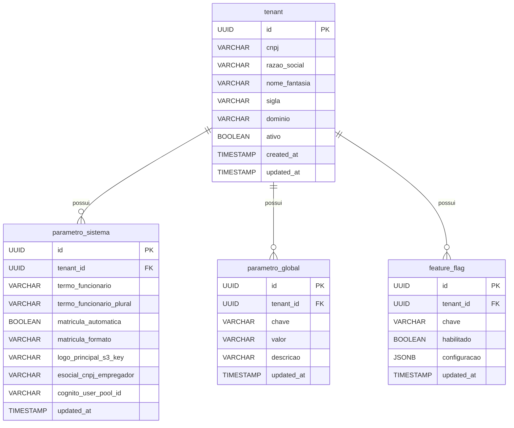
```mermaid
erDiagram
    tenant {
        UUID id PK
        VARCHAR cnpj
        VARCHAR razao_social
        VARCHAR nome_fantasia
        VARCHAR sigla
        VARCHAR dominio
        BOOLEAN ativo
        TIMESTAMP created_at
        TIMESTAMP updated_at
    }

    parametro_sistema {
        UUID id PK
        UUID tenant_id FK
        VARCHAR termo_funcionario
        VARCHAR termo_funcionario_plural
        BOOLEAN matricula_automatica
        VARCHAR matricula_formato
        VARCHAR logo_principal_s3_key
        VARCHAR esocial_cnpj_empregador
        VARCHAR cognito_user_pool_id
        TIMESTAMP updated_at
    }

    parametro_global {
        UUID id PK
        UUID tenant_id FK
        VARCHAR chave
        VARCHAR valor
        VARCHAR descricao
        TIMESTAMP updated_at
    }

    feature_flag {
        UUID id PK
        UUID tenant_id FK
        VARCHAR chave
        BOOLEAN habilitado
        JSONB configuracao
        TIMESTAMP updated_at
    }

    tenant ||--o{ parametro_sistema : "possui"
    tenant ||--o{ parametro_global : "possui"
    tenant ||--o{ feature_flag : "possui"
```

---

#### 3.2 Contexto: Pessoa + Documentos + Endereço + Contato

Núcleo civil compartilhado. `pessoa` é a entidade raiz de qualquer sujeito no sistema (funcionário, pensionista, candidato, beneficiário). `documento_pessoa` é polimórfico por tipo. Endereço e contato são entidades separadas com FK para `pessoa`.

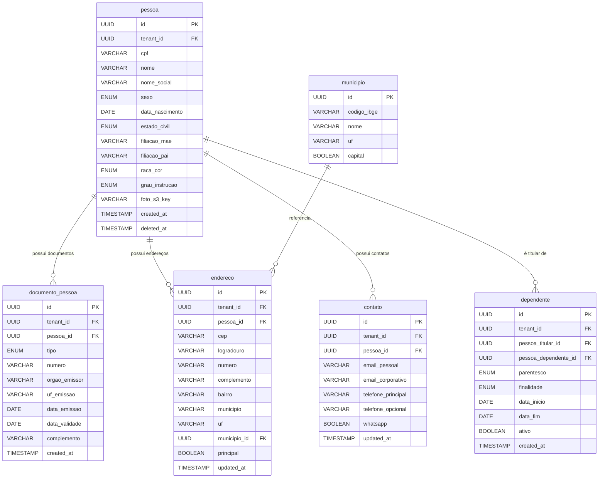
```mermaid
erDiagram
    pessoa {
        UUID id PK
        UUID tenant_id FK
        VARCHAR cpf
        VARCHAR nome
        VARCHAR nome_social
        ENUM sexo
        DATE data_nascimento
        ENUM estado_civil
        VARCHAR filiacao_mae
        VARCHAR filiacao_pai
        ENUM raca_cor
        ENUM grau_instrucao
        VARCHAR foto_s3_key
        TIMESTAMP created_at
        TIMESTAMP deleted_at
    }

    documento_pessoa {
        UUID id PK
        UUID tenant_id FK
        UUID pessoa_id FK
        ENUM tipo
        VARCHAR numero
        VARCHAR orgao_emissor
        VARCHAR uf_emissao
        DATE data_emissao
        DATE data_validade
        VARCHAR complemento
        TIMESTAMP created_at
    }

    endereco {
        UUID id PK
        UUID tenant_id FK
        UUID pessoa_id FK
        VARCHAR cep
        VARCHAR logradouro
        VARCHAR numero
        VARCHAR complemento
        VARCHAR bairro
        VARCHAR municipio
        VARCHAR uf
        UUID municipio_id FK
        BOOLEAN principal
        TIMESTAMP updated_at
    }

    contato {
        UUID id PK
        UUID tenant_id FK
        UUID pessoa_id FK
        VARCHAR email_pessoal
        VARCHAR email_corporativo
        VARCHAR telefone_principal
        VARCHAR telefone_opcional
        BOOLEAN whatsapp
        TIMESTAMP updated_at
    }

    dependente {
        UUID id PK
        UUID tenant_id FK
        UUID pessoa_titular_id FK
        UUID pessoa_dependente_id FK
        ENUM parentesco
        ENUM finalidade
        DATE data_inicio
        DATE data_fim
        BOOLEAN ativo
        TIMESTAMP created_at
    }

    municipio {
        UUID id PK
        VARCHAR codigo_ibge
        VARCHAR nome
        VARCHAR uf
        BOOLEAN capital
    }

    pessoa ||--o{ documento_pessoa : "possui documentos"
    pessoa ||--o{ endereco : "possui endereços"
    pessoa ||--o{ contato : "possui contatos"
    pessoa ||--o{ dependente : "é titular de"
    municipio ||--o{ endereco : "referencia"
```

---

#### 3.3 Contexto: Organização (EmpresaMatriz / Filial / Lotação / CentroCusto)

Define a estrutura hierárquica do ente. `empresa_matriz` agrupa `filial` (unidade administrativa). `lotacao` é a unidade de lotação funcional dentro da filial. `centro_custo` é a unidade orçamentária. Cargo e função são cadastros mestres ligados à estrutura organizacional.

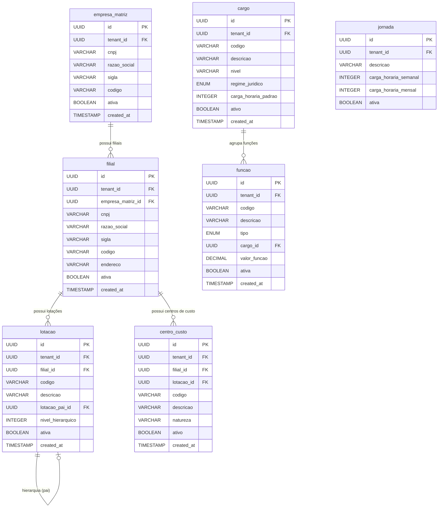
```mermaid
erDiagram
    empresa_matriz {
        UUID id PK
        UUID tenant_id FK
        VARCHAR cnpj
        VARCHAR razao_social
        VARCHAR sigla
        VARCHAR codigo
        BOOLEAN ativa
        TIMESTAMP created_at
    }

    filial {
        UUID id PK
        UUID tenant_id FK
        UUID empresa_matriz_id FK
        VARCHAR cnpj
        VARCHAR razao_social
        VARCHAR sigla
        VARCHAR codigo
        VARCHAR endereco
        BOOLEAN ativa
        TIMESTAMP created_at
    }

    lotacao {
        UUID id PK
        UUID tenant_id FK
        UUID filial_id FK
        VARCHAR codigo
        VARCHAR descricao
        UUID lotacao_pai_id FK
        INTEGER nivel_hierarquico
        BOOLEAN ativa
        TIMESTAMP created_at
    }

    centro_custo {
        UUID id PK
        UUID tenant_id FK
        UUID filial_id FK
        UUID lotacao_id FK
        VARCHAR codigo
        VARCHAR descricao
        VARCHAR natureza
        BOOLEAN ativo
        TIMESTAMP created_at
    }

    cargo {
        UUID id PK
        UUID tenant_id FK
        VARCHAR codigo
        VARCHAR descricao
        VARCHAR nivel
        ENUM regime_juridico
        INTEGER carga_horaria_padrao
        BOOLEAN ativo
        TIMESTAMP created_at
    }

    funcao {
        UUID id PK
        UUID tenant_id FK
        VARCHAR codigo
        VARCHAR descricao
        ENUM tipo
        UUID cargo_id FK
        DECIMAL valor_funcao
        BOOLEAN ativa
        TIMESTAMP created_at
    }

    jornada {
        UUID id PK
        UUID tenant_id FK
        VARCHAR descricao
        INTEGER carga_horaria_semanal
        INTEGER carga_horaria_mensal
        BOOLEAN ativa
    }

    empresa_matriz ||--o{ filial : "possui filiais"
    filial ||--o{ lotacao : "possui lotações"
    filial ||--o{ centro_custo : "possui centros de custo"
    lotacao ||--o| lotacao : "hierarquia (pai)"
    cargo ||--o{ funcao : "agrupa funções"
```

---

#### 3.4 Contexto: Autenticação (Usuário / Perfil / Papel / Menu)

Implementa o RBAC em 4 camadas: Tenant → Perfil → Papel → Usuário. Papéis seguem o padrão `ROLE_<MODULO>_<ACAO>`. Usuários herdam papéis via perfis. O menu é controlado por papel e feature flag.

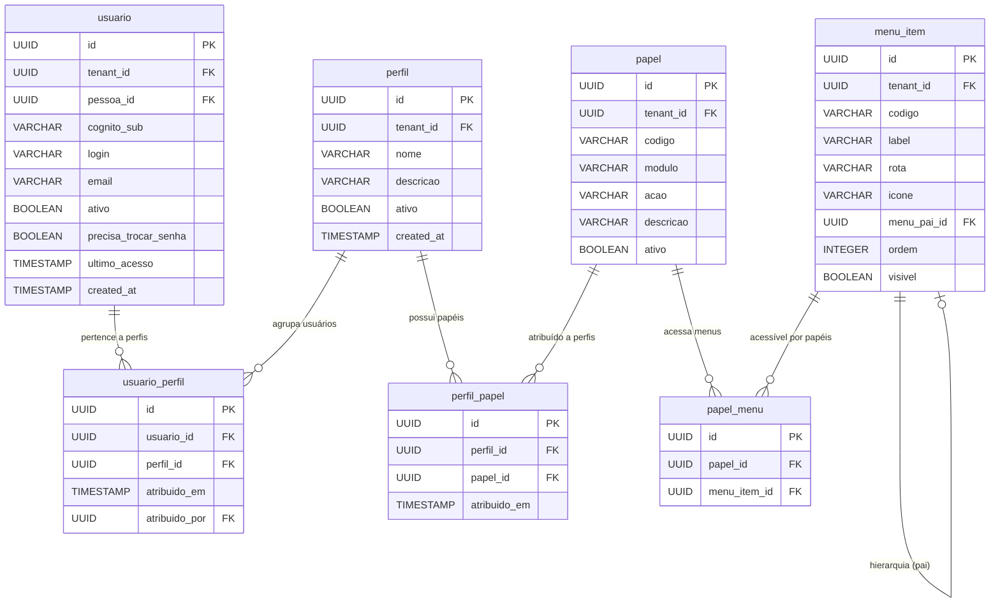
```mermaid
erDiagram
    usuario {
        UUID id PK
        UUID tenant_id FK
        UUID pessoa_id FK
        VARCHAR cognito_sub
        VARCHAR login
        VARCHAR email
        BOOLEAN ativo
        BOOLEAN precisa_trocar_senha
        TIMESTAMP ultimo_acesso
        TIMESTAMP created_at
    }

    perfil {
        UUID id PK
        UUID tenant_id FK
        VARCHAR nome
        VARCHAR descricao
        BOOLEAN ativo
        TIMESTAMP created_at
    }

    papel {
        UUID id PK
        UUID tenant_id FK
        VARCHAR codigo
        VARCHAR modulo
        VARCHAR acao
        VARCHAR descricao
        BOOLEAN ativo
    }

    usuario_perfil {
        UUID id PK
        UUID usuario_id FK
        UUID perfil_id FK
        TIMESTAMP atribuido_em
        UUID atribuido_por FK
    }

    perfil_papel {
        UUID id PK
        UUID perfil_id FK
        UUID papel_id FK
        TIMESTAMP atribuido_em
    }

    menu_item {
        UUID id PK
        UUID tenant_id FK
        VARCHAR codigo
        VARCHAR label
        VARCHAR rota
        VARCHAR icone
        UUID menu_pai_id FK
        INTEGER ordem
        BOOLEAN visivel
    }

    papel_menu {
        UUID id PK
        UUID papel_id FK
        UUID menu_item_id FK
    }

    usuario ||--o{ usuario_perfil : "pertence a perfis"
    perfil ||--o{ usuario_perfil : "agrupa usuários"
    perfil ||--o{ perfil_papel : "possui papéis"
    papel ||--o{ perfil_papel : "atribuído a perfis"
    papel ||--o{ papel_menu : "acessa menus"
    menu_item ||--o{ papel_menu : "acessível por papéis"
    menu_item ||--o| menu_item : "hierarquia (pai)"
```

---

#### 3.5 Contexto: Arquivos S3

Abstração sobre AWS S3. Cada registro de arquivo armazena metadados do objeto S3. O relacionamento com entidades de negócio é polimórfico: `entidade_tipo` + `entidade_id` referenciam qualquer tabela que possua anexos.

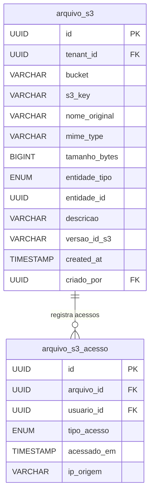
```mermaid
erDiagram
    arquivo_s3 {
        UUID id PK
        UUID tenant_id FK
        VARCHAR bucket
        VARCHAR s3_key
        VARCHAR nome_original
        VARCHAR mime_type
        BIGINT tamanho_bytes
        ENUM entidade_tipo
        UUID entidade_id
        VARCHAR descricao
        VARCHAR versao_id_s3
        TIMESTAMP created_at
        UUID criado_por FK
    }

    arquivo_s3_acesso {
        UUID id PK
        UUID arquivo_id FK
        UUID usuario_id FK
        ENUM tipo_acesso
        TIMESTAMP acessado_em
        VARCHAR ip_origem
    }

    arquivo_s3 ||--o{ arquivo_s3_acesso : "registra acessos"
```

---

#### 3.6 Contexto: Parametrização

Catálogos de enumerações parametrizáveis e cadastros mestres estruturantes que alimentam selects, regras e cálculos em toda a aplicação.

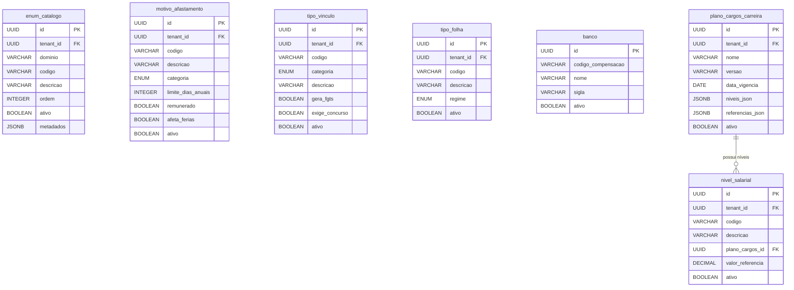
```mermaid
erDiagram
    enum_catalogo {
        UUID id PK
        UUID tenant_id FK
        VARCHAR dominio
        VARCHAR codigo
        VARCHAR descricao
        INTEGER ordem
        BOOLEAN ativo
        JSONB metadados
    }

    motivo_afastamento {
        UUID id PK
        UUID tenant_id FK
        VARCHAR codigo
        VARCHAR descricao
        ENUM categoria
        INTEGER limite_dias_anuais
        BOOLEAN remunerado
        BOOLEAN afeta_ferias
        BOOLEAN ativo
    }

    tipo_vinculo {
        UUID id PK
        UUID tenant_id FK
        VARCHAR codigo
        ENUM categoria
        VARCHAR descricao
        BOOLEAN gera_fgts
        BOOLEAN exige_concurso
        BOOLEAN ativo
    }

    tipo_folha {
        UUID id PK
        UUID tenant_id FK
        VARCHAR codigo
        VARCHAR descricao
        ENUM regime
        BOOLEAN ativo
    }

    banco {
        UUID id PK
        VARCHAR codigo_compensacao
        VARCHAR nome
        VARCHAR sigla
        BOOLEAN ativo
    }

    nivel_salarial {
        UUID id PK
        UUID tenant_id FK
        VARCHAR codigo
        VARCHAR descricao
        UUID plano_cargos_id FK
        DECIMAL valor_referencia
        BOOLEAN ativo
    }

    plano_cargos_carreira {
        UUID id PK
        UUID tenant_id FK
        VARCHAR nome
        VARCHAR versao
        DATE data_vigencia
        JSONB niveis_json
        JSONB referencias_json
        BOOLEAN ativo
    }

    plano_cargos_carreira ||--o{ nivel_salarial : "possui níveis"
```

---

#### 3.7 Contexto: Auditoria

Tabela única `audit_log` recebe eventos de todos os domínios sensíveis via fila SQS. O relacionamento com entidades é lógico (polimórfico por `entidade` + `entidade_id`), sem FK física. Particionada por ano/mês.

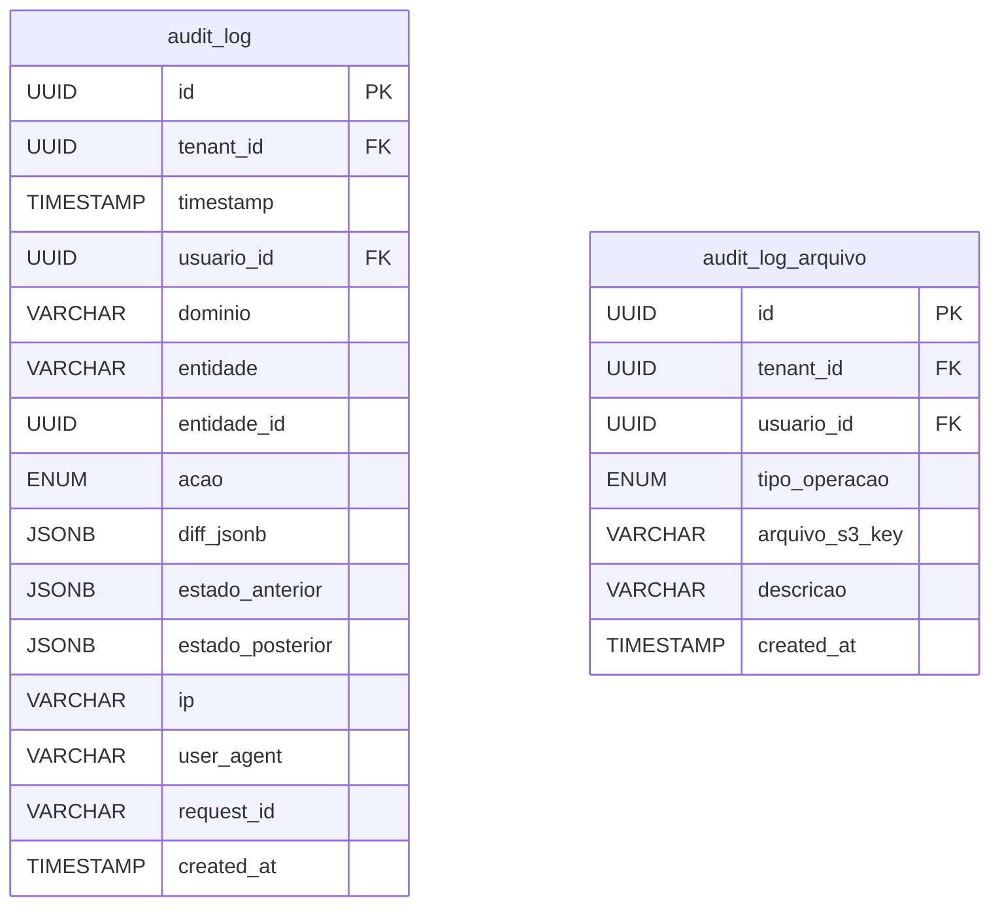
```mermaid
erDiagram
    audit_log {
        UUID id PK
        UUID tenant_id FK
        TIMESTAMP timestamp
        UUID usuario_id FK
        VARCHAR dominio
        VARCHAR entidade
        UUID entidade_id
        ENUM acao
        JSONB diff_jsonb
        JSONB estado_anterior
        JSONB estado_posterior
        VARCHAR ip
        VARCHAR user_agent
        VARCHAR request_id
        TIMESTAMP created_at
    }

    audit_log_arquivo {
        UUID id PK
        UUID tenant_id FK
        UUID usuario_id FK
        ENUM tipo_operacao
        VARCHAR arquivo_s3_key
        VARCHAR descricao
        TIMESTAMP created_at
    }
```

---

#### 3.8 Contexto: Módulo RH — Funcionário e Vida Funcional

Núcleo funcional do SGP. `funcionario` agrega vínculo, situação funcional e dados de pagamento. O lifecycle vai de CADASTRO_BASE até DESLIGAMENTO, passando por POSSE, ATIVO, AFASTAMENTOS e TRANSFERÊNCIAS. `situacao_funcional` mantém histórico imutável de cada mudança de estado.

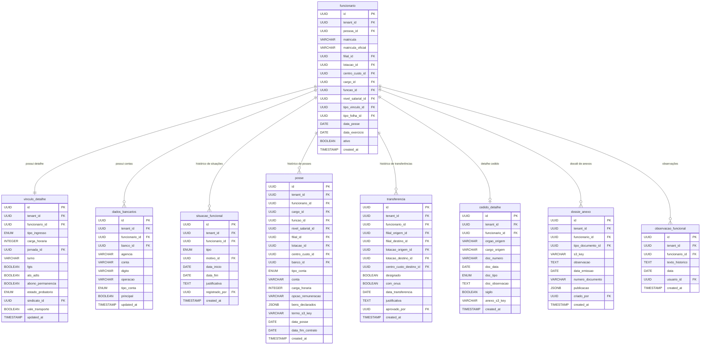
```mermaid
erDiagram
    funcionario {
        UUID id PK
        UUID tenant_id FK
        UUID pessoa_id FK
        VARCHAR matricula
        VARCHAR matricula_oficial
        UUID filial_id FK
        UUID lotacao_id FK
        UUID centro_custo_id FK
        UUID cargo_id FK
        UUID funcao_id FK
        UUID nivel_salarial_id FK
        UUID tipo_vinculo_id FK
        UUID tipo_folha_id FK
        DATE data_posse
        DATE data_exercicio
        BOOLEAN ativo
        TIMESTAMP created_at
    }

    vinculo_detalhe {
        UUID id PK
        UUID tenant_id FK
        UUID funcionario_id FK
        ENUM tipo_ingresso
        INTEGER carga_horaria
        UUID jornada_id FK
        VARCHAR turno
        BOOLEAN fgts
        BOOLEAN ats_adts
        BOOLEAN abono_permanencia
        ENUM estado_probatorio
        UUID sindicato_id FK
        BOOLEAN vale_transporte
        TIMESTAMP updated_at
    }

    dados_bancarios {
        UUID id PK
        UUID tenant_id FK
        UUID funcionario_id FK
        UUID banco_id FK
        VARCHAR agencia
        VARCHAR conta
        VARCHAR digito
        VARCHAR operacao
        ENUM tipo_conta
        BOOLEAN principal
        TIMESTAMP updated_at
    }

    situacao_funcional {
        UUID id PK
        UUID tenant_id FK
        UUID funcionario_id FK
        ENUM tipo
        UUID motivo_id FK
        DATE data_inicio
        DATE data_fim
        TEXT justificativa
        UUID registrado_por FK
        TIMESTAMP created_at
    }

    posse {
        UUID id PK
        UUID tenant_id FK
        UUID funcionario_id FK
        UUID cargo_id FK
        UUID funcao_id FK
        UUID nivel_salarial_id FK
        UUID filial_id FK
        UUID lotacao_id FK
        UUID centro_custo_id FK
        UUID banco_id FK
        ENUM tipo_conta
        VARCHAR conta
        INTEGER carga_horaria
        VARCHAR opcao_remuneracao
        JSONB bens_declarados
        VARCHAR termo_s3_key
        DATE data_posse
        DATE data_fim_contrato
        TIMESTAMP created_at
    }

    transferencia {
        UUID id PK
        UUID tenant_id FK
        UUID funcionario_id FK
        UUID filial_origem_id FK
        UUID filial_destino_id FK
        UUID lotacao_origem_id FK
        UUID lotacao_destino_id FK
        UUID centro_custo_destino_id FK
        BOOLEAN designado
        BOOLEAN com_onus
        DATE data_transferencia
        TEXT justificativa
        UUID aprovado_por FK
        TIMESTAMP created_at
    }

    cedido_detalhe {
        UUID id PK
        UUID tenant_id FK
        UUID funcionario_id FK
        VARCHAR orgao_origem
        VARCHAR cargo_origem
        VARCHAR doc_numero
        DATE doc_data
        ENUM doc_tipo
        TEXT doc_observacao
        BOOLEAN sigilo
        VARCHAR anexo_s3_key
        TIMESTAMP created_at
    }

    dossie_anexo {
        UUID id PK
        UUID tenant_id FK
        UUID funcionario_id FK
        UUID tipo_documento_id FK
        VARCHAR s3_key
        TEXT observacao
        DATE data_emissao
        VARCHAR numero_documento
        JSONB publicacao
        UUID criado_por FK
        TIMESTAMP created_at
    }

    observacao_funcional {
        UUID id PK
        UUID tenant_id FK
        UUID funcionario_id FK
        TEXT texto_historico
        DATE data
        UUID usuario_id FK
        TIMESTAMP created_at
    }

    funcionario ||--|| vinculo_detalhe : "possui detalhe"
    funcionario ||--o{ dados_bancarios : "possui contas"
    funcionario ||--o{ situacao_funcional : "histórico de situações"
    funcionario ||--o{ posse : "histórico de posses"
    funcionario ||--o{ transferencia : "histórico de transferências"
    funcionario ||--o| cedido_detalhe : "detalhe cedido"
    funcionario ||--o{ dossie_anexo : "dossiê de anexos"
    funcionario ||--o{ observacao_funcional : "observações"
```

---

#### 3.9 Contexto: Folha de Pagamento

Motor central do SGP. `competencia` é o período mensal de referência. `folha_pagamento` é criada por filial × tipo_processamento dentro de uma competência. `contracheque` agrega os `lancamento` de cada `verba`. As fórmulas são compiladas para SQL. A elegibilidade associa verbas a funcionários, cargos, funções, vínculos ou categorias (N:N).

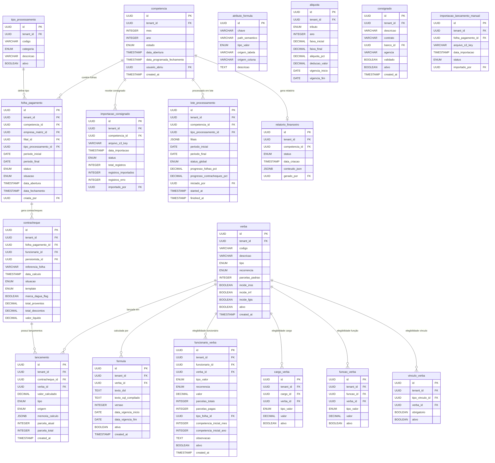
```mermaid
erDiagram
    competencia {
        UUID id PK
        UUID tenant_id FK
        INTEGER mes
        INTEGER ano
        ENUM estado
        TIMESTAMP data_abertura
        TIMESTAMP data_programada_fechamento
        UUID usuario_abriu FK
        TIMESTAMP created_at
    }

    folha_pagamento {
        UUID id PK
        UUID tenant_id FK
        UUID competencia_id FK
        UUID empresa_matriz_id FK
        UUID filial_id FK
        UUID tipo_processamento_id FK
        DATE periodo_inicial
        DATE periodo_final
        ENUM status
        ENUM situacao
        TIMESTAMP data_abertura
        TIMESTAMP data_fechamento
        UUID criada_por FK
    }

    tipo_processamento {
        UUID id PK
        UUID tenant_id FK
        VARCHAR codigo
        ENUM categoria
        VARCHAR descricao
        BOOLEAN ativo
    }

    contracheque {
        UUID id PK
        UUID tenant_id FK
        UUID folha_pagamento_id FK
        UUID funcionario_id FK
        UUID pensionista_id FK
        VARCHAR referencia_folha
        TIMESTAMP data_calculo
        ENUM situacao
        ENUM template
        BOOLEAN marca_dagua_flag
        DECIMAL total_proventos
        DECIMAL total_descontos
        DECIMAL valor_liquido
    }

    lancamento {
        UUID id PK
        UUID tenant_id FK
        UUID contracheque_id FK
        UUID verba_id FK
        DECIMAL valor_calculado
        ENUM tipo
        ENUM origem
        JSONB memoria_calculo
        INTEGER parcela_atual
        INTEGER parcela_total
        TIMESTAMP created_at
    }

    verba {
        UUID id PK
        UUID tenant_id FK
        VARCHAR codigo
        VARCHAR descricao
        ENUM tipo
        ENUM recorrencia
        INTEGER parcelas_padrao
        BOOLEAN incide_inss
        BOOLEAN incide_irrf
        BOOLEAN incide_fgts
        BOOLEAN ativo
        TIMESTAMP created_at
    }

    formula {
        UUID id PK
        UUID tenant_id FK
        UUID verba_id FK
        TEXT texto_dsl
        TEXT texto_sql_compilado
        INTEGER versao
        DATE data_vigencia_inicio
        DATE data_vigencia_fim
        BOOLEAN ativa
        TIMESTAMP created_at
    }

    atributo_formula {
        UUID id PK
        VARCHAR chave
        VARCHAR path_semantico
        ENUM tipo_valor
        VARCHAR origem_tabela
        VARCHAR origem_coluna
        TEXT descricao
    }

    aliquota {
        UUID id PK
        UUID tenant_id FK
        ENUM tributo
        INTEGER ano
        DECIMAL faixa_inicial
        DECIMAL faixa_final
        DECIMAL aliquota_pct
        DECIMAL deducao_valor
        DATE vigencia_inicio
        DATE vigencia_fim
    }

    funcionario_verba {
        UUID id PK
        UUID tenant_id FK
        UUID funcionario_id FK
        UUID verba_id FK
        ENUM tipo_valor
        ENUM recorrencia
        DECIMAL valor
        INTEGER parcelas_totais
        INTEGER parcelas_pagas
        UUID tipo_folha_id FK
        INTEGER competencia_inicial_mes
        INTEGER competencia_inicial_ano
        TEXT observacao
        BOOLEAN ativo
        TIMESTAMP created_at
    }

    cargo_verba {
        UUID id PK
        UUID tenant_id FK
        UUID cargo_id FK
        UUID verba_id FK
        ENUM tipo_valor
        DECIMAL valor
        BOOLEAN ativo
    }

    funcao_verba {
        UUID id PK
        UUID tenant_id FK
        UUID funcao_id FK
        UUID verba_id FK
        ENUM tipo_valor
        DECIMAL valor
        BOOLEAN ativo
    }

    vinculo_verba {
        UUID id PK
        UUID tenant_id FK
        UUID tipo_vinculo_id FK
        UUID verba_id FK
        BOOLEAN obrigatorio
        BOOLEAN ativo
    }

    consignado {
        UUID id PK
        UUID tenant_id FK
        VARCHAR descricao
        VARCHAR contrato
        UUID banco_id FK
        VARCHAR agencia
        BOOLEAN validado
        BOOLEAN ativo
        TIMESTAMP created_at
    }

    importacao_consignado {
        UUID id PK
        UUID tenant_id FK
        UUID competencia_id FK
        VARCHAR arquivo_s3_key
        TIMESTAMP data_importacao
        ENUM status
        INTEGER total_registros
        INTEGER registros_importados
        INTEGER registros_erro
        UUID importado_por FK
    }

    importacao_lancamento_manual {
        UUID id PK
        UUID tenant_id FK
        UUID folha_pagamento_id FK
        VARCHAR arquivo_s3_key
        TIMESTAMP data_importacao
        ENUM status
        UUID importado_por FK
    }

    lote_processamento {
        UUID id PK
        UUID tenant_id FK
        UUID competencia_id FK
        UUID tipo_processamento_id FK
        JSONB filiais
        DATE periodo_inicial
        DATE periodo_final
        ENUM status_global
        DECIMAL progresso_folhas_pct
        DECIMAL progresso_contracheques_pct
        UUID iniciado_por FK
        TIMESTAMP started_at
        TIMESTAMP finished_at
    }

    relatorio_financeiro {
        UUID id PK
        UUID tenant_id FK
        UUID competencia_id FK
        ENUM status
        TIMESTAMP data_criacao
        JSONB conteudo_json
        UUID gerado_por FK
    }

    competencia ||--o{ folha_pagamento : "contém folhas"
    folha_pagamento ||--o{ contracheque : "gera contracheques"
    contracheque ||--o{ lancamento : "possui lançamentos"
    verba ||--o{ lancamento : "lançada em"
    verba ||--o{ formula : "calculada por"
    verba ||--o{ funcionario_verba : "elegibilidade funcionário"
    verba ||--o{ cargo_verba : "elegibilidade cargo"
    verba ||--o{ funcao_verba : "elegibilidade função"
    verba ||--o{ vinculo_verba : "elegibilidade vínculo"
    competencia ||--o{ importacao_consignado : "recebe consignado"
    competencia ||--o{ lote_processamento : "processado em lote"
    competencia ||--o| relatorio_financeiro : "gera relatório"
    tipo_processamento ||--o{ folha_pagamento : "define tipo"
```

---

#### 3.10 Contexto: Avaliação e Progressão

Gerencia a avaliação de desempenho periódica e as progressões de carreira (mérito, titularidade, judicial, correção salarial). O `simulador_nivel_salarial` permite cenários hipotéticos sem alterar dados reais.

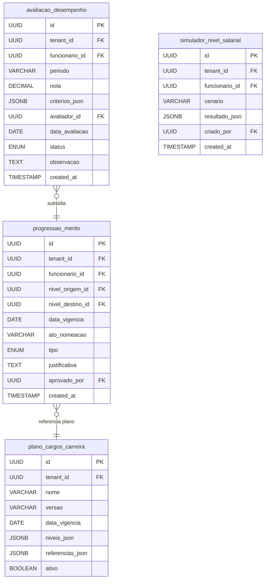
```mermaid
erDiagram
    avaliacao_desempenho {
        UUID id PK
        UUID tenant_id FK
        UUID funcionario_id FK
        VARCHAR periodo
        DECIMAL nota
        JSONB criterios_json
        UUID avaliador_id FK
        DATE data_avaliacao
        ENUM status
        TEXT observacao
        TIMESTAMP created_at
    }

    progressao_merito {
        UUID id PK
        UUID tenant_id FK
        UUID funcionario_id FK
        UUID nivel_origem_id FK
        UUID nivel_destino_id FK
        DATE data_vigencia
        VARCHAR ato_nomeacao
        ENUM tipo
        TEXT justificativa
        UUID aprovado_por FK
        TIMESTAMP created_at
    }

    plano_cargos_carreira {
        UUID id PK
        UUID tenant_id FK
        VARCHAR nome
        VARCHAR versao
        DATE data_vigencia
        JSONB niveis_json
        JSONB referencias_json
        BOOLEAN ativo
    }

    simulador_nivel_salarial {
        UUID id PK
        UUID tenant_id FK
        UUID funcionario_id FK
        VARCHAR cenario
        JSONB resultado_json
        UUID criado_por FK
        TIMESTAMP created_at
    }

    avaliacao_desempenho }o--|| progressao_merito : "subsidia"
    progressao_merito }o--|| plano_cargos_carreira : "referencia plano"
```

---

#### 3.11 Contexto: Recrutamento, Seleção e Estágio

Gerencia o ciclo completo desde a abertura de requisição de pessoal até a admissão. O `banco_talentos` armazena candidatos espontâneos. O módulo de estágio controla programas, prorrogações e recessos.

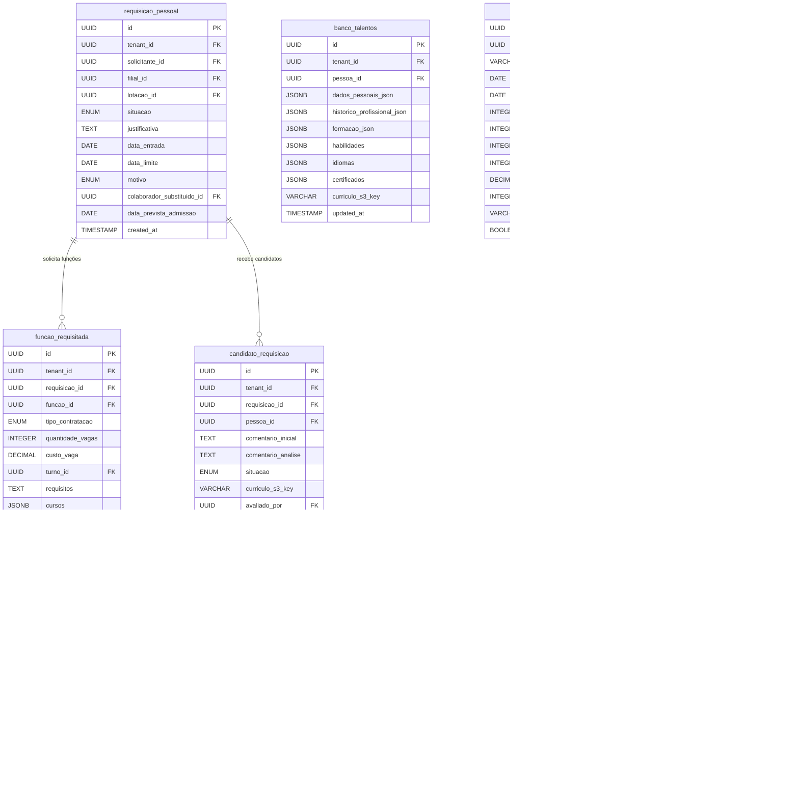
```mermaid
erDiagram
    requisicao_pessoal {
        UUID id PK
        UUID tenant_id FK
        UUID solicitante_id FK
        UUID filial_id FK
        UUID lotacao_id FK
        ENUM situacao
        TEXT justificativa
        DATE data_entrada
        DATE data_limite
        ENUM motivo
        UUID colaborador_substituido_id FK
        DATE data_prevista_admissao
        TIMESTAMP created_at
    }

    funcao_requisitada {
        UUID id PK
        UUID tenant_id FK
        UUID requisicao_id FK
        UUID funcao_id FK
        ENUM tipo_contratacao
        INTEGER quantidade_vagas
        DECIMAL custo_vaga
        UUID turno_id FK
        TEXT requisitos
        JSONB cursos
        JSONB habilidades
        JSONB atividades
    }

    candidato_requisicao {
        UUID id PK
        UUID tenant_id FK
        UUID requisicao_id FK
        UUID pessoa_id FK
        TEXT comentario_inicial
        TEXT comentario_analise
        ENUM situacao
        VARCHAR curriculo_s3_key
        UUID avaliado_por FK
        TIMESTAMP created_at
    }

    banco_talentos {
        UUID id PK
        UUID tenant_id FK
        UUID pessoa_id FK
        JSONB dados_pessoais_json
        JSONB historico_profissional_json
        JSONB formacao_json
        JSONB habilidades
        JSONB idiomas
        JSONB certificados
        VARCHAR curriculo_s3_key
        TIMESTAMP updated_at
    }

    programa_estagio {
        UUID id PK
        UUID tenant_id FK
        VARCHAR nome
        DATE vigencia_inicio
        DATE vigencia_fim
        INTEGER periodo_maximo_meses
        INTEGER renovacoes_permitidas
        INTEGER candidatos_por_vaga
        INTEGER idade_minima
        DECIMAL bolsa_valor
        INTEGER carga_horaria
        VARCHAR normativo_s3_key
        BOOLEAN ativo
    }

    estagiario {
        UUID id PK
        UUID tenant_id FK
        UUID pessoa_id FK
        UUID programa_id FK
        UUID filial_id FK
        UUID lotacao_id FK
        UUID instituicao_ensino_id FK
        UUID curso_id FK
        UUID turno_id FK
        UUID centro_custo_id FK
        UUID banco_id FK
        VARCHAR agencia
        VARCHAR conta
        BOOLEAN pne_flag
        ENUM situacao_funcional
        DATE data_inicio
        DATE data_fim
        TIMESTAMP created_at
    }

    prorrogacao_estagio {
        UUID id PK
        UUID tenant_id FK
        UUID estagiario_id FK
        DATE data_solicitacao
        INTEGER duracao_adicional_meses
        UUID aprovado_por FK
        TIMESTAMP created_at
    }

    recesso_estagio {
        UUID id PK
        UUID tenant_id FK
        UUID estagiario_id FK
        DATE data_inicio
        INTEGER duracao_dias
        TEXT observacao
        TIMESTAMP created_at
    }

    instituicao_ensino {
        UUID id PK
        UUID tenant_id FK
        VARCHAR nome
        VARCHAR cnpj
        BOOLEAN ativa
    }

    requisicao_pessoal ||--o{ funcao_requisitada : "solicita funções"
    requisicao_pessoal ||--o{ candidato_requisicao : "recebe candidatos"
    programa_estagio ||--o{ estagiario : "admite estagiários"
    estagiario ||--o{ prorrogacao_estagio : "possui prorrogações"
    estagiario ||--o{ recesso_estagio : "possui recessos"
    instituicao_ensino ||--o{ estagiario : "vincula estagiários"
```

---

#### 3.12 Contexto: Previdenciário (Aposentadoria + Pensão + Recadastramento)

Módulo de benefícios. `aposentadoria` e `pensao` são os benefícios concedidos. O recadastramento periódico valida a existência do beneficiário: `campanha_recadastramento` dispara o ciclo, `beneficiario_recadastramento` acompanha cada beneficiário, e `recadastramento` registra cada ato de recadastro com snapshot dos dados.

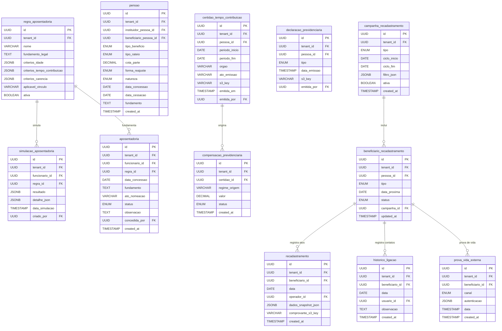
```mermaid
erDiagram
    regra_aposentadoria {
        UUID id PK
        UUID tenant_id FK
        VARCHAR nome
        TEXT fundamento_legal
        JSONB criterios_idade
        JSONB criterios_tempo_contribuicao
        JSONB criterios_carencia
        VARCHAR aplicavel_vinculo
        BOOLEAN ativa
    }

    simulacao_aposentadoria {
        UUID id PK
        UUID tenant_id FK
        UUID funcionario_id FK
        UUID regra_id FK
        JSONB resultado
        JSONB detalhe_json
        TIMESTAMP data_simulacao
        UUID criado_por FK
    }

    aposentadoria {
        UUID id PK
        UUID tenant_id FK
        UUID funcionario_id FK
        UUID regra_id FK
        DATE data_concessao
        TEXT fundamento
        VARCHAR ato_nomeacao
        ENUM status
        TEXT observacao
        UUID concedida_por FK
        TIMESTAMP created_at
    }

    pensao {
        UUID id PK
        UUID tenant_id FK
        UUID instituidor_pessoa_id FK
        UUID beneficiario_pessoa_id FK
        ENUM tipo_beneficio
        ENUM tipo_rateio
        DECIMAL cota_parte
        ENUM forma_reajuste
        ENUM natureza
        DATE data_concessao
        DATE data_cessacao
        TEXT fundamento
        TIMESTAMP created_at
    }

    certidao_tempo_contribuicao {
        UUID id PK
        UUID tenant_id FK
        UUID pessoa_id FK
        DATE periodo_inicio
        DATE periodo_fim
        VARCHAR orgao
        VARCHAR ato_emissao
        VARCHAR s3_key
        TIMESTAMP emitida_em
        UUID emitida_por FK
    }

    compensacao_previdenciaria {
        UUID id PK
        UUID tenant_id FK
        UUID certidao_id FK
        VARCHAR regime_origem
        DECIMAL valor
        ENUM status
        TIMESTAMP created_at
    }

    declaracao_previdenciaria {
        UUID id PK
        UUID tenant_id FK
        UUID pessoa_id FK
        ENUM tipo
        TIMESTAMP data_emissao
        VARCHAR s3_key
        UUID emitida_por FK
    }

    campanha_recadastramento {
        UUID id PK
        UUID tenant_id FK
        ENUM tipo
        DATE ciclo_inicio
        DATE ciclo_fim
        JSONB filtro_json
        BOOLEAN ativa
        TIMESTAMP created_at
    }

    beneficiario_recadastramento {
        UUID id PK
        UUID tenant_id FK
        UUID pessoa_id FK
        ENUM tipo
        DATE data_proxima
        ENUM status
        UUID campanha_id FK
        TIMESTAMP updated_at
    }

    recadastramento {
        UUID id PK
        UUID tenant_id FK
        UUID beneficiario_id FK
        DATE data
        UUID operador_id FK
        JSONB dados_snapshot_json
        VARCHAR comprovante_s3_key
        TIMESTAMP created_at
    }

    historico_ligacao {
        UUID id PK
        UUID tenant_id FK
        UUID beneficiario_id FK
        DATE data
        UUID usuario_id FK
        TEXT observacao
        TIMESTAMP created_at
    }

    prova_vida_externa {
        UUID id PK
        UUID tenant_id FK
        UUID beneficiario_id FK
        ENUM canal
        JSONB autenticacao
        TIMESTAMP data
        TIMESTAMP created_at
    }

    regra_aposentadoria ||--o{ simulacao_aposentadoria : "simula"
    regra_aposentadoria ||--o{ aposentadoria : "fundamenta"
    certidao_tempo_contribuicao ||--o{ compensacao_previdenciaria : "origina"
    campanha_recadastramento ||--o{ beneficiario_recadastramento : "inclui"
    beneficiario_recadastramento ||--o{ recadastramento : "registra atos"
    beneficiario_recadastramento ||--o{ historico_ligacao : "registra contatos"
    beneficiario_recadastramento ||--o{ prova_vida_externa : "prova de vida"
```

---

#### 3.13 Contexto: Saúde Ocupacional e Perícia (Junta Médica + SST)

Gestão da saúde funcional. O fluxo principal: `agenda_medica` → `janela_agenda` → `agendamento_pericia` → `prontuario_pericia` → `licenca_medica` (que retroalimenta `situacao_funcional`). SST complementa com acidentes, EPIs, EPCs e agentes nocivos.

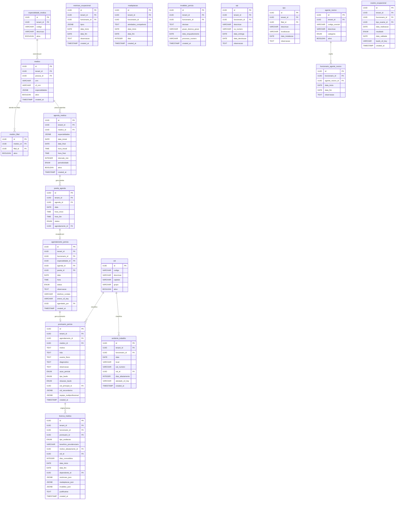
```mermaid
erDiagram
    especialidade_medica {
        UUID id PK
        UUID tenant_id FK
        VARCHAR codigo
        VARCHAR descricao
        BOOLEAN ativa
    }

    medico {
        UUID id PK
        UUID tenant_id FK
        UUID pessoa_id FK
        VARCHAR crm
        VARCHAR uf_crm
        JSONB especialidades
        BOOLEAN ativo
        TIMESTAMP created_at
    }

    medico_filial {
        UUID id PK
        UUID medico_id FK
        UUID filial_id FK
        BOOLEAN ativo
    }

    agenda_medica {
        UUID id PK
        UUID tenant_id FK
        UUID medico_id FK
        JSONB especialidades
        DATE data_inicial
        DATE data_final
        TIME hora_inicial
        TIME hora_final
        INTEGER intervalo_min
        ENUM periodicidade
        BOOLEAN ativa
        TIMESTAMP created_at
    }

    janela_agenda {
        UUID id PK
        UUID tenant_id FK
        UUID agenda_id FK
        DATE data
        TIME hora_inicio
        TIME hora_fim
        ENUM status
        UUID agendamento_id FK
    }

    agendamento_pericia {
        UUID id PK
        UUID tenant_id FK
        UUID funcionario_id FK
        UUID especialidade_id FK
        UUID agenda_id FK
        UUID janela_id FK
        DATE data
        TIME hora
        ENUM status
        TEXT observacao
        VARCHAR telefone_contato
        VARCHAR anexo_s3_key
        UUID agendado_por FK
        TIMESTAMP created_at
    }

    prontuario_pericia {
        UUID id PK
        UUID tenant_id FK
        UUID agendamento_id FK
        UUID medico_id FK
        TEXT motivo
        TEXT hda
        TEXT exame_fisico
        TEXT diagnostico
        TEXT observacao
        ENUM acao_pericial
        ENUM tipo_laudo
        ENUM situacao_laudo
        UUID cid_principal_id FK
        JSONB cid_secundarios
        JSONB equipe_multiprofissional
        TIMESTAMP created_at
    }

    licenca_medica {
        UUID id PK
        UUID tenant_id FK
        UUID funcionario_id FK
        UUID prontuario_id FK
        ENUM tipo_avaliacao
        VARCHAR beneficio_previdenciario
        UUID motivo_afastamento_id FK
        UUID cid_id FK
        INTEGER dias_concedidos
        DATE data_inicio
        DATE data_fim
        UUID dependente_id FK
        JSONB restricoes_json
        JSONB readaptacao_json
        JSONB invalidez_json
        TEXT justificativa
        TIMESTAMP created_at
    }

    cid {
        UUID id PK
        VARCHAR codigo
        VARCHAR descricao
        VARCHAR capitulo
        VARCHAR grupo
        BOOLEAN ativo
    }

    restricao_ocupacional {
        UUID id PK
        UUID tenant_id FK
        UUID funcionario_id FK
        JSONB tipos
        DATE data_inicio
        DATE data_fim
        TEXT observacao
        TIMESTAMP created_at
    }

    readaptacao {
        UUID id PK
        UUID tenant_id FK
        UUID funcionario_id FK
        TEXT atividades_compativeis
        DATE data_inicio
        DATE data_fim
        INTEGER dias
        TIMESTAMP created_at
    }

    invalidez_pericia {
        UUID id PK
        UUID tenant_id FK
        UUID funcionario_id FK
        TEXT decisao
        VARCHAR grupo_doenca_grave
        DATE data_enquadramento
        VARCHAR processo_numero
        TIMESTAMP created_at
    }

    acidente_trabalho {
        UUID id PK
        UUID tenant_id FK
        UUID funcionario_id FK
        DATE data
        VARCHAR local
        VARCHAR cat_numero
        UUID cid_id FK
        INTEGER dias_afastamento
        VARCHAR atestado_s3_key
        TIMESTAMP created_at
    }

    epi {
        UUID id PK
        UUID tenant_id FK
        UUID funcionario_id FK
        VARCHAR descricao
        VARCHAR ca_numero
        DATE data_entrega
        DATE data_devolucao
        TEXT observacao
    }

    epc {
        UUID id PK
        UUID tenant_id FK
        UUID filial_id FK
        VARCHAR descricao
        VARCHAR localizacao
        DATE data_instalacao
        TEXT observacao
    }

    agente_nocivo {
        UUID id PK
        UUID tenant_id FK
        VARCHAR codigo_esocial
        VARCHAR descricao
        ENUM categoria
        BOOLEAN ativo
    }

    funcionario_agente_nocivo {
        UUID id PK
        UUID funcionario_id FK
        UUID agente_nocivo_id FK
        DATE data_inicio
        DATE data_fim
        TEXT observacao
    }

    exame_ocupacional {
        UUID id PK
        UUID tenant_id FK
        UUID funcionario_id FK
        UUID tipo_exame_id FK
        DATE data_realizacao
        ENUM resultado
        DATE data_validade
        VARCHAR laudo_s3_key
        TIMESTAMP created_at
    }

    especialidade_medica ||--o{ medico : "exercida por"
    medico ||--o{ medico_filial : "atende em filiais"
    medico ||--o{ agenda_medica : "possui agendas"
    agenda_medica ||--o{ janela_agenda : "gera janelas"
    janela_agenda ||--o| agendamento_pericia : "ocupada por"
    agendamento_pericia ||--o| prontuario_pericia : "gera prontuário"
    prontuario_pericia ||--o{ licenca_medica : "origina licença"
    cid ||--o{ prontuario_pericia : "classifica"
    cid ||--o{ acidente_trabalho : "classifica"
    agente_nocivo ||--o{ funcionario_agente_nocivo : "expõe"
```

---

#### 3.14 Contexto: Convênio

Gerencia convênios de desconto em folha (planos de saúde, associações, outros). `convenio_beneficiario` vincula o servidor ao convênio com valor e período. `convenio_desconto_folha` materializa o desconto a ser lançado em cada competência.

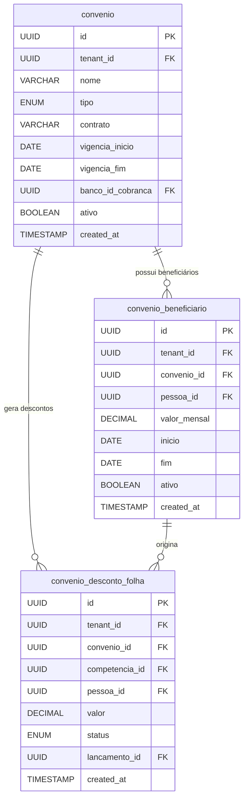
```mermaid
erDiagram
    convenio {
        UUID id PK
        UUID tenant_id FK
        VARCHAR nome
        ENUM tipo
        VARCHAR contrato
        DATE vigencia_inicio
        DATE vigencia_fim
        UUID banco_id_cobranca FK
        BOOLEAN ativo
        TIMESTAMP created_at
    }

    convenio_beneficiario {
        UUID id PK
        UUID tenant_id FK
        UUID convenio_id FK
        UUID pessoa_id FK
        DECIMAL valor_mensal
        DATE inicio
        DATE fim
        BOOLEAN ativo
        TIMESTAMP created_at
    }

    convenio_desconto_folha {
        UUID id PK
        UUID tenant_id FK
        UUID convenio_id FK
        UUID competencia_id FK
        UUID pessoa_id FK
        DECIMAL valor
        ENUM status
        UUID lancamento_id FK
        TIMESTAMP created_at
    }

    convenio ||--o{ convenio_beneficiario : "possui beneficiários"
    convenio ||--o{ convenio_desconto_folha : "gera descontos"
    convenio_beneficiario ||--o{ convenio_desconto_folha : "origina"
```

---

#### 3.15 Contexto: eSocial

Gerencia o ciclo de vida dos eventos eSocial S-1.2: geração do XML, envio assíncrono via Lambda/Step Functions, recebimento de recibo. `esocial_lote` agrupa eventos para transmissão em lote.

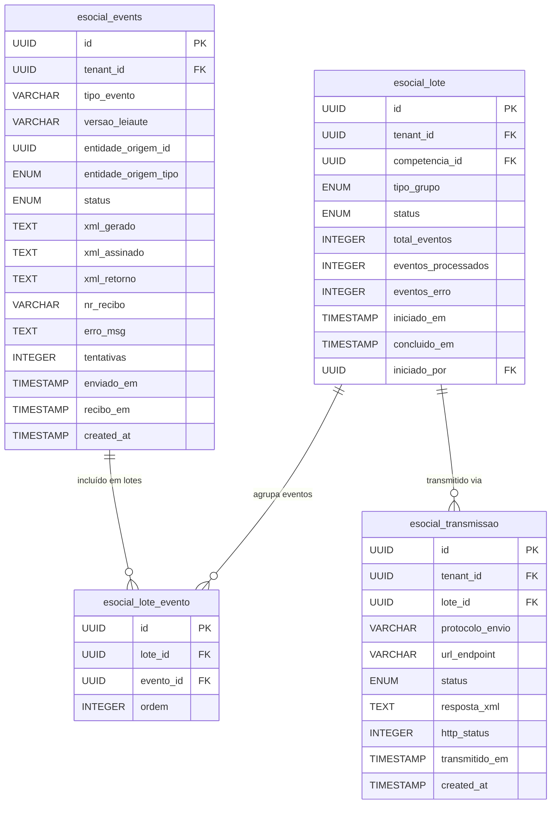
```mermaid
erDiagram
    esocial_events {
        UUID id PK
        UUID tenant_id FK
        VARCHAR tipo_evento
        VARCHAR versao_leiaute
        UUID entidade_origem_id
        ENUM entidade_origem_tipo
        ENUM status
        TEXT xml_gerado
        TEXT xml_assinado
        TEXT xml_retorno
        VARCHAR nr_recibo
        TEXT erro_msg
        INTEGER tentativas
        TIMESTAMP enviado_em
        TIMESTAMP recibo_em
        TIMESTAMP created_at
    }

    esocial_lote {
        UUID id PK
        UUID tenant_id FK
        UUID competencia_id FK
        ENUM tipo_grupo
        ENUM status
        INTEGER total_eventos
        INTEGER eventos_processados
        INTEGER eventos_erro
        TIMESTAMP iniciado_em
        TIMESTAMP concluido_em
        UUID iniciado_por FK
    }

    esocial_lote_evento {
        UUID id PK
        UUID lote_id FK
        UUID evento_id FK
        INTEGER ordem
    }

    esocial_transmissao {
        UUID id PK
        UUID tenant_id FK
        UUID lote_id FK
        VARCHAR protocolo_envio
        VARCHAR url_endpoint
        ENUM status
        TEXT resposta_xml
        INTEGER http_status
        TIMESTAMP transmitido_em
        TIMESTAMP created_at
    }

    esocial_lote ||--o{ esocial_lote_evento : "agrupa eventos"
    esocial_events ||--o{ esocial_lote_evento : "incluído em lotes"
    esocial_lote ||--o{ esocial_transmissao : "transmitido via"
```

---

### 4. Diagrama Cross-Context Crítico 1 — Encadeamento Funcional Folha

Fluxo completo desde o funcionário elegível a uma verba até o evento eSocial gerado, passando pelo cálculo da folha.

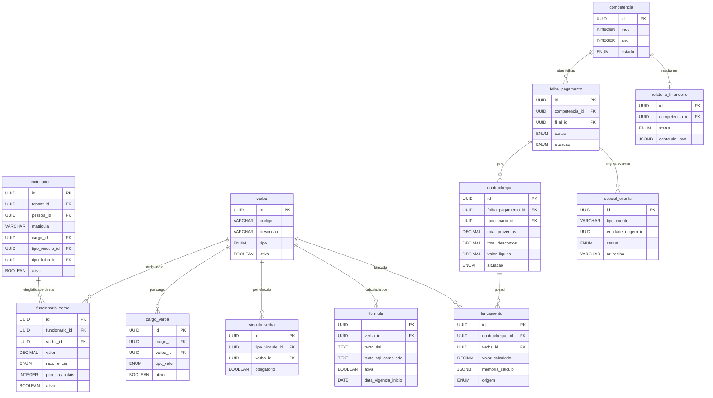
```mermaid
erDiagram
    funcionario {
        UUID id PK
        UUID tenant_id FK
        UUID pessoa_id FK
        VARCHAR matricula
        UUID cargo_id FK
        UUID tipo_vinculo_id FK
        UUID tipo_folha_id FK
        BOOLEAN ativo
    }

    verba {
        UUID id PK
        VARCHAR codigo
        VARCHAR descricao
        ENUM tipo
        BOOLEAN ativo
    }

    funcionario_verba {
        UUID id PK
        UUID funcionario_id FK
        UUID verba_id FK
        DECIMAL valor
        ENUM recorrencia
        INTEGER parcelas_totais
        BOOLEAN ativo
    }

    cargo_verba {
        UUID id PK
        UUID cargo_id FK
        UUID verba_id FK
        ENUM tipo_valor
        BOOLEAN ativo
    }

    vinculo_verba {
        UUID id PK
        UUID tipo_vinculo_id FK
        UUID verba_id FK
        BOOLEAN obrigatorio
    }

    formula {
        UUID id PK
        UUID verba_id FK
        TEXT texto_dsl
        TEXT texto_sql_compilado
        BOOLEAN ativa
        DATE data_vigencia_inicio
    }

    competencia {
        UUID id PK
        INTEGER mes
        INTEGER ano
        ENUM estado
    }

    folha_pagamento {
        UUID id PK
        UUID competencia_id FK
        UUID filial_id FK
        ENUM status
        ENUM situacao
    }

    contracheque {
        UUID id PK
        UUID folha_pagamento_id FK
        UUID funcionario_id FK
        DECIMAL total_proventos
        DECIMAL total_descontos
        DECIMAL valor_liquido
        ENUM situacao
    }

    lancamento {
        UUID id PK
        UUID contracheque_id FK
        UUID verba_id FK
        DECIMAL valor_calculado
        JSONB memoria_calculo
        ENUM origem
    }

    relatorio_financeiro {
        UUID id PK
        UUID competencia_id FK
        ENUM status
        JSONB conteudo_json
    }

    esocial_events {
        UUID id PK
        VARCHAR tipo_evento
        UUID entidade_origem_id
        ENUM status
        VARCHAR nr_recibo
    }

    funcionario ||--o{ funcionario_verba : "elegibilidade direta"
    verba ||--o{ funcionario_verba : "atribuída a"
    verba ||--o{ cargo_verba : "por cargo"
    verba ||--o{ vinculo_verba : "por vínculo"
    verba ||--o{ formula : "calculada por"
    competencia ||--o{ folha_pagamento : "abre folhas"
    folha_pagamento ||--o{ contracheque : "gera"
    contracheque ||--o{ lancamento : "possui"
    verba ||--o{ lancamento : "lançada"
    competencia ||--o| relatorio_financeiro : "resulta em"
    folha_pagamento ||--o{ esocial_events : "origina eventos"
```

---

### 5. Diagrama Cross-Context Crítico 2 — Fluxo Perícia → Licença → Situação Funcional

Fluxo que conecta o agendamento de perícia ao efeito funcional no vínculo do servidor, passando pelo prontuário e pela licença médica.

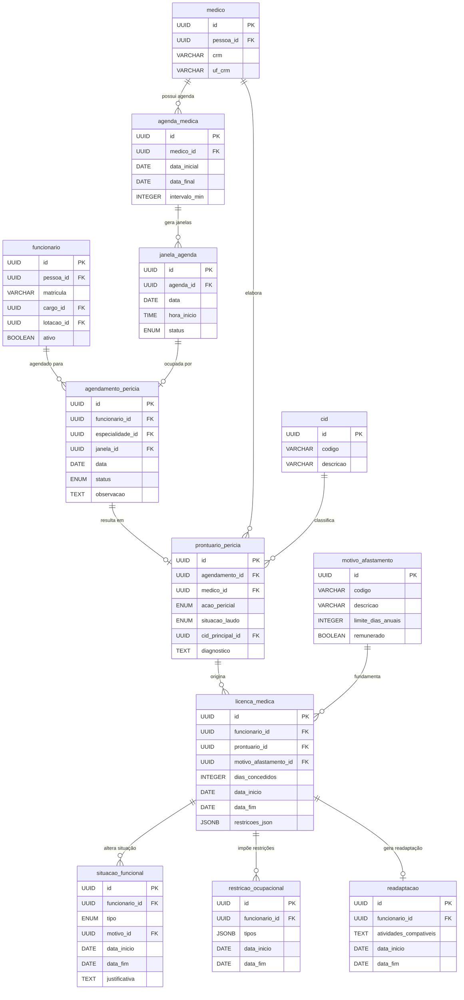
```mermaid
erDiagram
    funcionario {
        UUID id PK
        UUID pessoa_id FK
        VARCHAR matricula
        UUID cargo_id FK
        UUID lotacao_id FK
        BOOLEAN ativo
    }

    agendamento_pericia {
        UUID id PK
        UUID funcionario_id FK
        UUID especialidade_id FK
        UUID janela_id FK
        DATE data
        ENUM status
        TEXT observacao
    }

    janela_agenda {
        UUID id PK
        UUID agenda_id FK
        DATE data
        TIME hora_inicio
        ENUM status
    }

    agenda_medica {
        UUID id PK
        UUID medico_id FK
        DATE data_inicial
        DATE data_final
        INTEGER intervalo_min
    }

    medico {
        UUID id PK
        UUID pessoa_id FK
        VARCHAR crm
        VARCHAR uf_crm
    }

    prontuario_pericia {
        UUID id PK
        UUID agendamento_id FK
        UUID medico_id FK
        ENUM acao_pericial
        ENUM situacao_laudo
        UUID cid_principal_id FK
        TEXT diagnostico
    }

    cid {
        UUID id PK
        VARCHAR codigo
        VARCHAR descricao
    }

    licenca_medica {
        UUID id PK
        UUID funcionario_id FK
        UUID prontuario_id FK
        UUID motivo_afastamento_id FK
        INTEGER dias_concedidos
        DATE data_inicio
        DATE data_fim
        JSONB restricoes_json
    }

    motivo_afastamento {
        UUID id PK
        VARCHAR codigo
        VARCHAR descricao
        INTEGER limite_dias_anuais
        BOOLEAN remunerado
    }

    situacao_funcional {
        UUID id PK
        UUID funcionario_id FK
        ENUM tipo
        UUID motivo_id FK
        DATE data_inicio
        DATE data_fim
        TEXT justificativa
    }

    restricao_ocupacional {
        UUID id PK
        UUID funcionario_id FK
        JSONB tipos
        DATE data_inicio
        DATE data_fim
    }

    readaptacao {
        UUID id PK
        UUID funcionario_id FK
        TEXT atividades_compativeis
        DATE data_inicio
        DATE data_fim
    }

    funcionario ||--o{ agendamento_pericia : "agendado para"
    agenda_medica ||--o{ janela_agenda : "gera janelas"
    janela_agenda ||--o| agendamento_pericia : "ocupada por"
    medico ||--o{ agenda_medica : "possui agenda"
    agendamento_pericia ||--o| prontuario_pericia : "resulta em"
    medico ||--o{ prontuario_pericia : "elabora"
    cid ||--o{ prontuario_pericia : "classifica"
    prontuario_pericia ||--o{ licenca_medica : "origina"
    motivo_afastamento ||--o{ licenca_medica : "fundamenta"
    licenca_medica ||--o{ situacao_funcional : "altera situação"
    licenca_medica ||--o{ restricao_ocupacional : "impõe restrições"
    licenca_medica ||--o| readaptacao : "gera readaptação"
```

---

### 6. Diagrama Cross-Context Crítico 3 — Requisição → Admissão / Estagiário → Vínculo

Fluxo que conecta a abertura de uma vaga (requisição de pessoal ou programa de estágio) até a criação do vínculo funcional do servidor ou estagiário admitido.

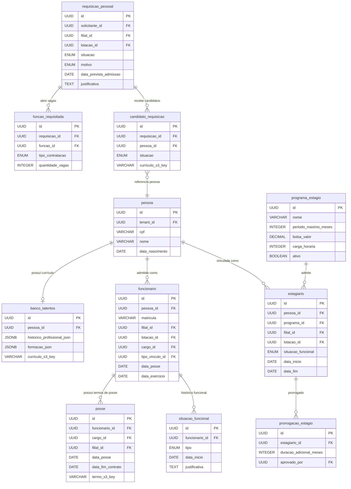
```mermaid
erDiagram
    requisicao_pessoal {
        UUID id PK
        UUID solicitante_id FK
        UUID filial_id FK
        UUID lotacao_id FK
        ENUM situacao
        ENUM motivo
        DATE data_prevista_admissao
        TEXT justificativa
    }

    funcao_requisitada {
        UUID id PK
        UUID requisicao_id FK
        UUID funcao_id FK
        ENUM tipo_contratacao
        INTEGER quantidade_vagas
    }

    candidato_requisicao {
        UUID id PK
        UUID requisicao_id FK
        UUID pessoa_id FK
        ENUM situacao
        VARCHAR curriculo_s3_key
    }

    banco_talentos {
        UUID id PK
        UUID pessoa_id FK
        JSONB historico_profissional_json
        JSONB formacao_json
        VARCHAR curriculo_s3_key
    }

    pessoa {
        UUID id PK
        UUID tenant_id FK
        VARCHAR cpf
        VARCHAR nome
        DATE data_nascimento
    }

    funcionario {
        UUID id PK
        UUID pessoa_id FK
        VARCHAR matricula
        UUID filial_id FK
        UUID lotacao_id FK
        UUID cargo_id FK
        UUID tipo_vinculo_id FK
        DATE data_posse
        DATE data_exercicio
    }

    posse {
        UUID id PK
        UUID funcionario_id FK
        UUID cargo_id FK
        UUID filial_id FK
        DATE data_posse
        DATE data_fim_contrato
        VARCHAR termo_s3_key
    }

    situacao_funcional {
        UUID id PK
        UUID funcionario_id FK
        ENUM tipo
        DATE data_inicio
        TEXT justificativa
    }

    programa_estagio {
        UUID id PK
        VARCHAR nome
        INTEGER periodo_maximo_meses
        DECIMAL bolsa_valor
        INTEGER carga_horaria
        BOOLEAN ativo
    }

    estagiario {
        UUID id PK
        UUID pessoa_id FK
        UUID programa_id FK
        UUID filial_id FK
        UUID lotacao_id FK
        ENUM situacao_funcional
        DATE data_inicio
        DATE data_fim
    }

    prorrogacao_estagio {
        UUID id PK
        UUID estagiario_id FK
        INTEGER duracao_adicional_meses
        UUID aprovado_por FK
    }

    requisicao_pessoal ||--o{ funcao_requisitada : "abre vagas"
    requisicao_pessoal ||--o{ candidato_requisicao : "recebe candidatos"
    candidato_requisicao }o--|| pessoa : "referencia pessoa"
    pessoa ||--o| banco_talentos : "possui currículo"
    pessoa ||--o{ funcionario : "admitido como"
    funcionario ||--o{ posse : "possui termos de posse"
    funcionario ||--o{ situacao_funcional : "histórico funcional"
    programa_estagio ||--o{ estagiario : "admite"
    pessoa ||--o{ estagiario : "vinculada como"
    estagiario ||--o{ prorrogacao_estagio : "prorrogado"
```

---

_Fim do documento — 32-diagramas-er.md_

### Apêndice HR-06 — Estrutura Organizacional Runtime

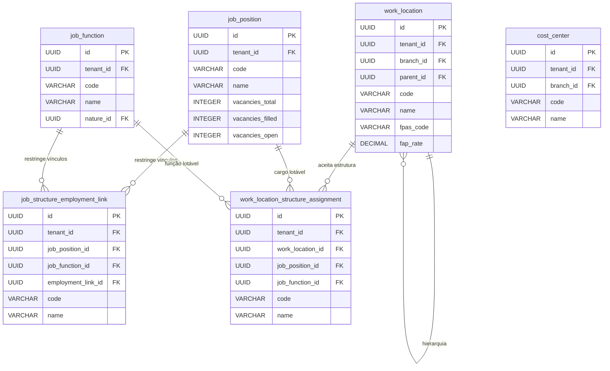
```mermaid
erDiagram
    job_position {
        UUID id PK
        UUID tenant_id FK
        VARCHAR code
        VARCHAR name
        INTEGER vacancies_total
        INTEGER vacancies_filled
        INTEGER vacancies_open
    }

    job_function {
        UUID id PK
        UUID tenant_id FK
        VARCHAR code
        VARCHAR name
        UUID nature_id FK
    }

    work_location {
        UUID id PK
        UUID tenant_id FK
        UUID branch_id FK
        UUID parent_id FK
        VARCHAR code
        VARCHAR name
        VARCHAR fpas_code
        DECIMAL fap_rate
    }

    cost_center {
        UUID id PK
        UUID tenant_id FK
        UUID branch_id FK
        VARCHAR code
        VARCHAR name
    }

    job_structure_employment_link {
        UUID id PK
        UUID tenant_id FK
        UUID job_position_id FK
        UUID job_function_id FK
        UUID employment_link_id FK
        VARCHAR code
        VARCHAR name
    }

    work_location_structure_assignment {
        UUID id PK
        UUID tenant_id FK
        UUID work_location_id FK
        UUID job_position_id FK
        UUID job_function_id FK
        VARCHAR code
        VARCHAR name
    }

    work_location ||--o{ work_location : "hierarquia"
    job_position ||--o{ job_structure_employment_link : "restringe vínculos"
    job_function ||--o{ job_structure_employment_link : "restringe vínculos"
    work_location ||--o{ work_location_structure_assignment : "aceita estrutura"
    job_position ||--o{ work_location_structure_assignment : "cargo lotável"
    job_function ||--o{ work_location_structure_assignment : "função lotável"
```

Regra de vagas: `job_position.vacancies_total = vacancies_filled + vacancies_open`. Todas as entidades são tenant-scoped, protegidas por RLS e auditadas por `sgp_append_audit_event(...)`.

## Divisão Modular — SGP

## Divisão Modular — SGP

**Versão:** 1.1 | **Data:** 2026-05-02 | **Status:** Current
**Escopo:** Todos os bounded contexts | **Depende de:** BRIEF.md

---

### Sumário

1. [Princípios de Divisão Modular](#1-princípios-de-divisão-modular)
2. [Layout do Monorepo](#2-layout-do-monorepo)
3. [Backend Modular — NestJS](#3-backend-modular--nestjs)
4. [Microsserviço de Folha — sgp-payroll-engine](#4-microsserviço-de-folha--sgp-payroll-engine)
5. [Workers Assíncronos](#5-workers-assíncronos)
6. [Frontend Modular — Angular](#6-frontend-modular--angular)
7. [Dependências Cross-Context](#7-dependências-cross-context)
8. [Políticas de Compartilhamento](#8-políticas-de-compartilhamento)
9. [Estratégia de Deploy por Módulo](#9-estratégia-de-deploy-por-módulo)
10. [Boundaries de Equipe](#10-boundaries-de-equipe)

---

### 1. Princípios de Divisão Modular

#### 1.1 Domain-Driven Design e Bounded Contexts

O SGP adota **Domain-Driven Design (DDD)** como filosofia central de divisão. Cada área funcional do sistema é mapeada para um **bounded context** (contexto delimitado) com:

- **Linguagem ubíqua própria:** termos como `matricula`, `competencia`, `contracheque`, `beneficiario` têm significados precisos dentro de cada contexto e podem diferir entre contextos vizinhos.
- **Modelo de domínio privado:** entidades, agregados e value objects são internos ao contexto; nunca expostos diretamente a outros contextos.
- **Fronteiras explícitas:** a borda entre contextos é demarcada por contratos tipados (DTOs em `shared-kernel`) ou por eventos de domínio.

Os bounded contexts identificados são:

| Bounded Context             | Código                  | Módulo NestJS principal                                    |
| --------------------------- | ----------------------- | ---------------------------------------------------------- |
| Identidade e Acesso         | `CORE_AUTH`             | `auth`                                                     |
| Multi-tenancy               | `CORE_TENANT`           | `tenant`                                                   |
| Pessoa Civil                | `CORE_PESSOA`           | `pessoa`                                                   |
| Estrutura Organizacional    | `CORE_ORGANIZACAO`      | `organizacao`                                              |
| Parametrizações e Estrutura | `GESTAO`                | `gestao`                                                   |
| Vida Funcional (RH)         | `MODULO_RH`             | `rh`                                                       |
| Folha de Pagamento          | `FOLHA_PAGAMENTO`       | `folha` (cliente) + `sgp-payroll-engine`                   |
| FGTS CLT                    | `FOLHA_PAGAMENTO`       | `folha-pagamento/fgts`; `folha-pagamento/operations/sifge` |
| Avaliação e Progressão      | `MODULO_AVALIACAO`      | `avaliacao`                                                |
| Recrutamento e Seleção      | `RECRUTAMENTO_SELECAO`  | `recrutamento`                                             |
| Prova Online com Proctoring | `RECRUTAMENTO_SELECAO`  | `recrutamento/prova-online`                                |
| Certificação da Banca       | `RECRUTAMENTO_SELECAO`  | `recrutamento/banca`                                       |
| Consultas Gerenciais        | `CONSULTAS_GERENCIAIS`  | `consultas`                                                |
| Relatórios                  | `RELATORIO`             | `relatorios`                                               |
| Previdenciário              | `MODULO_PREVIDENCIARIO` | `previdenciario`                                           |
| Auditoria                   | `AUDITORIA`             | `auditoria`                                                |
| Saúde Ocupacional           | `JUNTA_MEDICA`          | `saude`                                                    |
| Ponto Eletrônico            | `PONTO_ELETRONICO`      | `ponto`                                                    |
| Convênios                   | `CONVENIO`              | `convenio`                                                 |
| Notificações                | `NOTIFICACOES`          | `notificacoes`                                             |
| Arquivos                    | `ARQUIVOS`              | `arquivos`                                                 |
| Parâmetros e Feature Flags  | `PARAMETROS`            | `parametros`                                               |
| Integrações Externas        | `INTEGRACOES`           | `integracoes`                                              |
| Tribunais de Contas         | `COMPLIANCE_TCE`        | `tce`                                                      |
| Portal Publico              | `PUBLICO`               | `publico/transparency`, `publico/lai`                      |

#### 1.2 Módulos NestJS por Contexto

Cada bounded context é implementado como um **NestJS Module** (`@Module()`). A convenção é:

```
backend/src/<contexto>/
├── <contexto>.module.ts
├── <recurso>.controller.ts
├── <recurso>.service.ts
├── <contexto>.dto.ts
└── <subdominio>/
    ├── <subdominio>.controller.ts
    ├── <subdominio>.service.ts
    └── <subdominio>.dto.ts
```

Os módulos NestJS **não importam diretamente** módulos de outros contextos de negócio. A comunicação ocorre:

- Via serviços de aplicação explicitamente injetados quando o contrato pertence
  ao mesmo runtime.
- Via tabelas de fila/outbox e workers quando o contrato cruza fronteiras
  assíncronas ou de deployment.
- Via HTTP interno ou comandos de worker quando o contrato cruza runtimes como
  `sgp-core-api`, `sgp-portal-api`, `sgp-payroll-engine`,
  `stynx-esocial`, `sgp-integrations-worker` e `sgp-report-service`.

#### 1.3 Monorepo npm Workspace

O repositório usa npm workspaces no root, com `frontend` e `backend` como
workspaces ativos. As decisões estruturais atuais são:

- O root `package.json` expõe somente comandos canônicos.
- `scripts/run.mjs` é o ponto único de orquestração para build, start, lint,
  format, typecheck, testes, banco, evidence, governance, health e deploy.
- `scripts/lib/workspace-commands.mjs` mantém descrições, alvos de formatação,
  sequência de evidence, variáveis obrigatórias e comandos hard-fail.
- `tests/backend/jest-unit.json`, `tests/backend/jest-e2e.json` e
  `tests/backend/jest-coverage.json` são os contratos Jest do backend; o
  `backend/package.json` apenas referencia esses arquivos.
- `docs/gov/generated/runtime-topology.json` é o inventário canônico dos runtimes
  implementados.

#### 1.4 Código Compartilhado

O SGP v0.0.1 não possui uma biblioteca Nx `shared-kernel`. O código
compartilhado vive em superfícies explícitas:

- `backend/src/common`: erros, paginação, dinheiro, request context e
  utilitários transversais do backend.
- `frontend/src/app/shared` e `frontend/src/app/shared-platform`: componentes e
  helpers de UI reutilizáveis.
- `frontend/src/app/core/api/generated/openapi-client.ts`: cliente gerado a
  partir do OpenAPI runtime.
- `database/sql` e `database/seed`: contrato de bootstrap PostgreSQL
  compartilhado entre runtime, smoke DB e gates.

**Proibições explícitas para código compartilhado:**

- Entidades Prisma ou DDL de schema dentro de helpers genéricos.
- Serviços com lógica de negócio.
- Imports cíclicos entre domínios de negócio.
- Convenções paralelas às registradas em `scripts/run.mjs`,
  `scripts/lib/workspace-commands.mjs`, `docs/gov/generated/runtime-topology.json` e
  `database/sql`.

#### 1.5 Comunicação Inter-Contexto

```mermaid
graph LR
    subgraph sync["Síncrono"]
        A[Controller REST] -->|HTTP/REST interno| B[Outro microservice]
        A -->|NestJS Module Import| SK[shared-kernel]
    end
    subgraph async["Assíncrono"]
        C[Serviço Domínio] -->|EventEmitter2| D[Handler local]
        C -->|SNS/EventBridge| E[SQS Worker remoto]
    end
    subgraph contracts["Contratos"]
        SK -.->|DTOs tipados| F[Consumidor]
        SK -.->|Interfaces de evento| G[Publisher]
    end
```

**Regras de comunicação:**

| Cenário                              | Mecanismo                                 | Quando usar                                                 |
| ------------------------------------ | ----------------------------------------- | ----------------------------------------------------------- |
| Mesma app, mesmo processo            | `EventEmitter2` (in-process)              | Eventos de domínio dentro do `sgp-core-api`                 |
| Mesma app, lógica cross-module       | Injeção de DTO via contrato shared-kernel | Consulta de dados de outro módulo sem acoplamento           |
| Microservice para microservice       | HTTP REST (API Gateway interna)           | `sgp-core-api` ↔ `sgp-payroll-engine` (consultas síncronas) |
| Notificação assíncrona cross-service | SNS → SQS                                 | Folha calculo solicitada, eSocial evento pendente           |
| Orquestração complexa                | Step Functions                            | Cálculo de lote, envio eSocial                              |

#### 1.6 Testes de Contrato

Os contratos entre contextos são validados via **Pact** (consumer-driven contract testing):

- O consumidor define o contrato esperado (ex.: `sgp-payroll-engine` espera receber `PessoaContrato` com campos obrigatórios).
- O provedor (`sgp-core-api`) publica a verificação do contrato no Pact Broker.
- O pipeline de CI bloqueia deploy do provedor se algum contrato de consumidor for quebrado.
- Contratos versionados junto com o código; change log em `libs/shared-kernel/CHANGELOG.md`.

---

### 2. Layout do Monorepo

```
sgp/
├── apps/
│   ├── sgp-core-api/                    (NestJS — API principal)
│   │   ├── src/
│   │   │   ├── main.ts
│   │   │   ├── app.module.ts
│   │   │   └── modules/
│   │   │       ├── auth/
│   │   │       ├── tenant/
│   │   │       ├── pessoa/
│   │   │       ├── organizacao/
│   │   │       ├── gestao/
│   │   │       ├── rh/
│   │   │       ├── folha/
│   │   │       ├── avaliacao/
│   │   │       ├── recrutamento/
│   │   │       ├── consultas/
│   │   │       ├── relatorios/
│   │   │       ├── previdenciario/
│   │   │       ├── auditoria/
│   │   │       ├── saude/
│   │   │       ├── convenio/
│   │   │       ├── notificacoes/
│   │   │       ├── arquivos/
│   │   │       ├── parametros/
│   │   │       └── integracoes/
│   │   ├── project.json
│   │   └── Dockerfile
│   │
│   ├── sgp-payroll-engine/              (NestJS microservice — cálculo de folha)
│   │   ├── src/
│   │   │   ├── main.ts
│   │   │   ├── app.module.ts
│   │   │   └── modules/
│   │   │       ├── calculo/
│   │   │       ├── formula-compiler/
│   │   │       ├── plano-calculo/
│   │   │       ├── lote/
│   │   │       └── replica-read/
│   │   ├── project.json
│   │   └── Dockerfile
│   │
│   ├── stynx-esocial/              (NestJS worker — eSocial S-1.2)
│   │   ├── src/
│   │   │   ├── main.ts
│   │   │   ├── app.module.ts
│   │   │   └── modules/
│   │   │       ├── evento-consumer/
│   │   │       ├── xml-builder/
│   │   │       ├── assinatura/
│   │   │       ├── envio/
│   │   │       └── recibo/
│   │   ├── project.json
│   │   └── Dockerfile
│   │
│   ├── sgp-integrations-worker/         (NestJS worker — CNAB, SIPREV, DIRF)
│   │   ├── src/
│   │   │   ├── main.ts
│   │   │   ├── app.module.ts
│   │   │   └── modules/
│   │   │       ├── cnab-remessa/
│   │   │       ├── cnab-retorno/
│   │   │       ├── siprev/
│   │   │       └── dirf/
│   │   ├── project.json
│   │   └── Dockerfile
│   │
│   ├── sgp-report-service/              (NestJS — geração PDF/XLSX/XML)
│   │   ├── src/
│   │   │   ├── main.ts
│   │   │   ├── app.module.ts
│   │   │   └── modules/
│   │   │       ├── report-consumer/
│   │   │       ├── pdf-renderer/
│   │   │       ├── xlsx-renderer/
│   │   │       ├── xml-builder/
│   │   │       └── storage/
│   │   ├── project.json
│   │   └── Dockerfile
│   │
│   ├── sgp-admin/                       (Angular SPA — back-office)
│   │   ├── src/
│   │   │   ├── main.ts
│   │   │   ├── app/
│   │   │   │   ├── app.component.ts
│   │   │   │   ├── app.routes.ts
│   │   │   │   └── shell/
│   │   │   └── environments/
│   │   ├── project.json
│   │   └── nginx.conf
│   │
│   └── sgp-portal/                      (Angular SPA — servidor/pensionista/candidato)
│       ├── src/
│       │   ├── main.ts
│       │   ├── app/
│       │   │   ├── app.component.ts
│       │   │   ├── app.routes.ts
│       │   │   └── shell/
│       │   └── environments/
│       ├── project.json
│       └── nginx.conf
│
├── libs/
│   ├── shared-kernel/                   (tipos, enums, erros, utils)
│   │   ├── src/
│   │   │   ├── index.ts
│   │   │   ├── enums/
│   │   │   │   ├── vinculo-tipo.enum.ts
│   │   │   │   ├── situacao-funcional.enum.ts
│   │   │   │   ├── tipo-processamento.enum.ts
│   │   │   │   ├── status-folha.enum.ts
│   │   │   │   └── ...
│   │   │   ├── types/
│   │   │   │   ├── domain-event.type.ts
│   │   │   │   ├── paginated-result.type.ts
│   │   │   │   └── tenant-context.type.ts
│   │   │   ├── errors/
│   │   │   │   ├── sgp.error.ts
│   │   │   │   ├── sgp-validation.error.ts
│   │   │   │   └── sgp-not-found.error.ts
│   │   │   └── utils/
│   │   │       ├── cpf.util.ts
│   │   │       ├── cnpj.util.ts
│   │   │       ├── date.util.ts
│   │   │       └── currency.util.ts
│   │   └── project.json
│   │
│   ├── domain/
│   │   ├── core-auth/
│   │   ├── core-tenant/
│   │   ├── core-pessoa/
│   │   ├── core-organizacao/
│   │   ├── gestao/
│   │   ├── rh/
│   │   ├── folha/
│   │   ├── avaliacao/
│   │   ├── recrutamento/
│   │   ├── consultas/
│   │   ├── relatorios/
│   │   ├── previdenciario/
│   │   ├── auditoria/
│   │   ├── saude/
│   │   ├── convenio/
│   │
│   ├── integrations/
│   │   ├── esocial-s12/                 (builders de XML S-1.2, S-2xxx, S-3xxx)
│   │   ├── siprev/                      (builder XML SIPREV)
│   │   ├── dirf/                        (builder TXT DIRF)
│   │   ├── prefeitura-publica/          (cliente REST prefeitura pública)
│   │   ├── gov-br/                      (cliente OIDC Gov.br)
│   │   ├── cognito/                     (wrapper AWS Cognito SDK)
│   │   ├── banco-cnab/                  (parsers/builders CNAB 240/400)
│   │   └── neoconsig/                   (parser CSV Neoconsig)
│   │
│   ├── ui-admin/                        (Angular libs para sgp-admin)
│   │   ├── gestao/
│   │   ├── rh/
│   │   ├── folha/
│   │   ├── avaliacao/
│   │   ├── recrutamento/
│   │   ├── consultas/
│   │   ├── relatorios/
│   │   ├── previdenciario/
│   │   ├── auditoria/
│   │   ├── saude/
│   │   ├── convenio/
│   │
│   ├── ui-portal/                       (Angular libs para sgp-portal)
│   │   ├── contracheque/
│   │   ├── recadastramento/
│   │   ├── solicitacoes/
│   │   ├── pericia-agendada/
│   │   ├── curriculo/
│   │   └── termos/
│   │
│   └── testing/                         (Jest factories, Playwright fixtures)
│       ├── src/
│       │   ├── factories/
│       │   │   ├── pessoa.factory.ts
│       │   │   ├── funcionario.factory.ts
│       │   │   ├── folha.factory.ts
│       │   │   └── ...
│       │   ├── fixtures/
│       │   │   └── playwright/
│       │   └── mocks/
│       └── project.json
│
└── tools/
    ├── db-migrations/                   (Flyway / Prisma Migrate scripts)
    │   ├── V001__schema_base.sql
    │   ├── V002__rls_policies.sql
    │   └── ...
    ├── seeds/                           (dados de referência e desenvolvimento)
    │   ├── enums.seed.ts
    │   ├── tenant-demo.seed.ts
    │   └── ...
    └── openapi-gen/                     (geração de clientes TypeScript a partir do OpenAPI)
        ├── generate.ts
        └── templates/
```

---

### 3. Backend Modular — NestJS

Arrecadação Previdenciária é versão futura. O layout atual não declara biblioteca, módulo NestJS, rota, evento, dependência cross-context ou lib Angular para esse domínio.

#### 3.1 Módulos de Infraestrutura Transversal

##### `auth` — Identidade e Acesso

**Responsabilidades:** autenticação JWT via AWS Cognito; validação de tokens; RBAC multi-camada (Tenant → Perfil → Papel → Usuário); guards globais; refresh de tokens; logout; gestão de usuários e perfis; feature flags por tenant.

**Entidades:** `usuario` (cognito_sub, email, tenant_id, perfis[], ativo), `perfil`, `papel`, `usuario_papel`, `feature_flag`.

**Serviços:** `AuthService`, `TokenValidationService`, `RbacService`, `FeatureFlagService`, `UserManagementService`.

**Controladores:** `POST /api/v1/auth/refresh`, `POST /api/v1/auth/logout`, `GET /api/v1/auth/me`, `GET /api/admin/v1/usuarios`, `POST /api/admin/v1/usuarios`, `PUT /api/admin/v1/usuarios/:id/perfis`, `GET /api/admin/v1/perfis`, `POST /api/admin/v1/perfis`, `GET /api/admin/v1/papeis`.

**Eventos publicados:** `auth.usuario.criado`, `auth.usuario.bloqueado`, `auth.login.realizado`.

**Eventos consumidos:** nenhum (é produtor primário).

**Dependências cross-module:** `tenant` (para carregar contexto de tenant no guard), `parametros` (para feature flags).

---

##### `tenant` — Multi-tenancy

**Responsabilidades:** gestão do ciclo de vida de tenants (entes contratantes); parametrização por tenant; isolamento row-level (RLS); provisionamento inicial de tenant (schema, seed de enums, usuário admin).

**Entidades:** `tenant` (id, nome, cnpj, sigla, plano, ativo, criado_em), `parametro_sistema` (chave-valor por tenant), `parametro_global`.

**Serviços:** `TenantService`, `TenantProvisioningService`, `ParametroSistemaService`.

**Controladores:** `GET /api/admin/v1/tenants`, `POST /api/admin/v1/tenants`, `GET /api/admin/v1/tenants/:id/parametros`, `PUT /api/admin/v1/tenants/:id/parametros`.

**Eventos publicados:** `tenant.provisionado`, `tenant.desativado`.

**Eventos consumidos:** nenhum.

**Dependências cross-module:** nenhuma (módulo raiz).

---

##### `pessoa` — Núcleo Civil

**Responsabilidades:** cadastro e manutenção da pessoa física (dados pessoais, documentos, endereço, contato, dependentes); reaproveitamento de CPF entre vínculos; busca textual por nome/CPF.

**Entidades:** `pessoa`, `documento_pessoa`, `endereco`, `contato`, `dependente`.

**Serviços:** `PessoaService`, `DocumentoService`, `EnderecoService`, `ContatoService`, `DependenteService`.

**Controladores:** `GET /api/v1/pessoas`, `POST /api/v1/pessoas`, `GET /api/v1/pessoas/:id`, `PUT /api/v1/pessoas/:id`, `GET /api/v1/pessoas/:id/documentos`, `POST /api/v1/pessoas/:id/documentos`, `GET /api/v1/pessoas/:id/dependentes`, `POST /api/v1/pessoas/:id/dependentes`, `GET /api/v1/pessoas/:id/enderecos`, `PUT /api/v1/pessoas/:id/contato`.

**Eventos publicados:** `pessoa.criada`, `pessoa.atualizada`, `pessoa.endereco.atualizado`, `pessoa.contato.atualizado`.

**Eventos consumidos:** `recadastramento.concluido` (para retroalimentar endereço/contato/estado civil).

**Dependências cross-module:** nenhuma (é provedor primário).

---

##### `organizacao` — Estrutura Organizacional

**Responsabilidades:** gestão de empresa matriz, filiais, lotações, centros de custo, hierarquia organizacional; cadastros mestres (banco, agência, município, UF, cargo, função, jornada, turno, tipo de folha, tipo de contratação).

**Entidades:** `empresa_matriz`, `filial`, `lotacao`, `centro_custo`, `banco`, `agencia`, `municipio`, `uf`, `cargo`, `funcao`, `jornada`, `turno`, `tipo_folha`, `tipo_contratacao`.

**Serviços:** `EmpresaMatrizService`, `FilialService`, `LotacaoService`, `CentroCustoService`, `CargoService`, `FuncaoService`, `BancoService`, `MunicipioService`.

**Controladores:** `GET /api/v1/organizacao/filiais`, `POST /api/v1/organizacao/filiais`, `GET /api/v1/organizacao/filiais/:id/lotacoes`, `GET /api/v1/organizacao/cargos`, `POST /api/v1/organizacao/cargos`, `GET /api/v1/organizacao/funcoes`, `GET /api/v1/organizacao/bancos`, `GET /api/v1/organizacao/municipios`.

**Eventos publicados:** `organizacao.lotacao.criada`, `organizacao.cargo.atualizado`, `organizacao.filial.desativada`.

**Eventos consumidos:** nenhum.

**Dependências cross-module:** `pessoa` (para validações de endereço via município).

---

#### 3.2 Módulos de Negócio

##### `gestao` — Parametrizações e Estrutura

**Responsabilidades:** cadastros estruturantes do sistema (plano de cargos e carreira, referências salariais, faixas salariais, grupos salariais, motivos de afastamento, causas de afastamento, naturezas de função, tipos de vínculo de ingresso, tipos de estabilidade, enums parametrizáveis, programação de competências).

**Entidades:** `plano_cargos_carreira`, `referencia_salarial`, `faixa_salarial`, `grupo_salarial`, `motivo_afastamento`, `causa_afastamento`, `tipo_vinculo_ingresso`, `tipo_estabilidade`, `enum_catalogo`, `enum_item`.

**Serviços:** `PlanoCargosService`, `ReferenciaSalarialService`, `EnumCatalogoService`, `MotivoAfastamentoService`.

**Controladores:** `GET /api/v1/gestao/planos-cargos`, `POST /api/v1/gestao/planos-cargos`, `GET /api/v1/gestao/referencias-salariais`, `GET /api/v1/gestao/enums/:catalogo`, `POST /api/v1/gestao/enums/:catalogo/itens`, `GET /api/v1/gestao/motivos-afastamento`.

**Eventos publicados:** `gestao.plano-cargos.atualizado`, `gestao.referencia-salarial.atualizada`.

**Eventos consumidos:** nenhum.

**Dependências cross-module:** `organizacao` (faixas salariais ligadas a cargos).

###### `gestao.master-data` — Estrutura organizacional

**Responsabilidades:** CRUD administrativo de cargos, funções, lotações hierárquicas, centros de custo, vínculos entre cargo/função e vínculo funcional, tipos de férias e legislação local. Essa base é pré-requisito para o vínculo funcional (`rh`), para o cadastro do servidor e para parametrizações funcionais que dependem de normas do ente.

**Entidades físicas:** `hr.job_position`, `hr.job_function`, `hr.work_location`, `hr.cost_center`, `hr.job_structure_employment_link`, `hr.work_location_structure_assignment`, `hr.vacation_type`, `hr.legislation`.

**Controladores:** `GET/POST/PATCH/DELETE /api/v1/master-data/{resource}` para `cargo`, `funcao`, `lotacao`, `centroCusto`, `cargoVinculo`, `funcaoVinculo`, `tipoFerias` e `legislacao`; `POST /api/v1/cargos` é a rota operacional de cargo exigida pelo contrato HR-06.

**Permissões:** leitura exige `gestao.master_data.read`; mutações exigem `gestao.master_data.write`. As tabelas tenant-scoped têm RLS por `tenant_id` e registram mutações por `sgp_append_audit_event(...)`.

---

##### `rh` — Vida Funcional

**Responsabilidades:** gestão completa do funcionário/servidor desde a posse até o desligamento; controle de matrículas; situação funcional e histórico; transferências; dossiê digital; ficha funcional; observações funcionais; afastamentos; cedência.

**Entidades:** `hr.employee`, `hr.employment_link`, `hr.employment_contract`, `hr.employee_status_history`, `posse`, `transferencia`, `cedido_detalhe`, `anexo_funcionario`, `dossie`, `observacao_funcional`, `controle_anual_afastamento`.

**Lifecycle:**

```mermaid
stateDiagram-v2
    [*] --> CADASTRO_BASE: Criar pessoa + dados básicos
    CADASTRO_BASE --> POSSE: Registrar posse
    POSSE --> ATIVO: Data de exercício
    ATIVO --> AFASTAMENTO: Registrar afastamento
    AFASTAMENTO --> ATIVO: Retorno
    ATIVO --> TRANSFERENCIA: Transferir
    TRANSFERENCIA --> ATIVO: Confirmação destino
    ATIVO --> DESLIGAMENTO: Desligar
    AFASTAMENTO --> SUSTADO: Exceder limite sem retorno
    SUSTADO --> ATIVO: Regularização
    ATIVO --> A_DISPOSICAO: Ceder para outro órgão
    A_DISPOSICAO --> ATIVO: Retorno da cessão
    DESLIGAMENTO --> [*]
```

**Serviços:** `EmployeesService` (`rh.employees`), `VacationService` (`rh.vacation`), `VinculoService`, `SituacaoFuncionalService`, `PosseService`, `TransferenciaService`, `CedidoService`, `DossieService`, `ObservacaoFuncionalService`, `MatriculaService`, `AfastamentoService`, `FichaFuncionalService`.

**Controladores:**

- `GET /api/v1/funcionarios` — listagem paginada com filtros
- `POST /api/v1/funcionarios` — admissão HR-01; cria `employee`, contrato ativo, linha imutável em `employee_status_history` e evento em `audit_event`
- `GET /api/v1/rh/funcionarios/:id` — perfil completo
- `PUT /api/v1/rh/funcionarios/:id` — atualização
- `POST /api/v1/rh/funcionarios/:id/posse` — registrar posse
- `POST /api/v1/rh/funcionarios/:id/situacoes` — alterar situação funcional
- `GET /api/v1/rh/funcionarios/:id/situacoes` — histórico de situações
- `POST /api/v1/rh/funcionarios/:id/transferencias` — transferir
- `POST /api/v1/funcionarios/:id/desligamento` — desligar; altera situação funcional, encerra contrato ativo e audita a mutação
- `GET /api/v1/ferias/saldo/:employee_id` — saldo de férias por período aquisitivo
- `POST /api/v1/ferias/programacao` — programação de férias com até três parcelas e abono pecuniário limitado
- `POST /api/v1/ferias/programacao/:id/aprovar` — aprovação de chefia/RH
- `POST /api/v1/ferias/programacao/:id/cancelar` — cancelamento administrativo
- `GET /api/v1/rh/funcionarios/:id/ficha-funcional` — ficha funcional consolidada
- `GET /api/v1/rh/funcionarios/:id/dossie` — listar anexos
- `POST /api/v1/rh/funcionarios/:id/dossie` — anexar documento
- `POST /api/v1/rh/funcionarios/:id/observacoes` — registrar observação
- `GET /api/v1/rh/funcionarios/:id/afastamentos` — histórico de afastamentos

**Eventos publicados:** `rh.funcionario.criado`, `rh.funcionario.posse.registrada`, `rh.funcionario.situacao.alterada`, `rh.funcionario.transferido`, `rh.funcionario.desligado`, `rh.afastamento.iniciado`, `rh.afastamento.encerrado`.

**Eventos consumidos:** `saude.licenca.concedida` (cria afastamento automático), `previdenciario.aposentadoria.concedida` (desligamento por aposentadoria), `recrutamento.estagiario.desligado`.

**Dependências cross-module:** `pessoa` (dados pessoais), `organizacao` (cargo, lotação, filial), `gestao` (referências salariais, motivos de afastamento), `folha` (inativa verbas ativas no desligamento via evento).

---

##### `folha` — Cliente do Microsserviço de Folha

**Responsabilidades:** orquestração do ciclo de folha no `sgp-core-api`; gestão de competências; criação e configuração de folhas de pagamento; lançamentos manuais e importados; consignados; disparo de cálculo para o `sgp-payroll-engine`; acompanhamento de progresso; exposição de resultados (contracheques, resumos, relatórios financeiros).

**Entidades (no sgp-core-api):** `competencia`, `folha_pagamento`, `tipo_processamento`, `lote_processamento`, `lancamento` (lançamentos manuais pré-cálculo), `consignado`, `importacao_consignado`, `importacao_lancamento_manual`, `relatorio_financeiro`.

**Serviços:** `CompetenciaService`, `FolhaPagamentoService`, `LancamentoService`, `ConsignadoService`, `ImportacaoService`, `CalculoOrquestradorService` (dispara para payroll-engine), `ContrachequeViewService`, `RelatorioFinanceiroService`, `folha-pagamento/operations/bank-account` para validação BANK-03 de dados bancários antes da elegibilidade CNAB, `folha-pagamento/operations/alimony` para BANK-04: cadastro de ordens judiciais de pensão alimentícia, retenção prioritária em folha e repasse CNAB à conta judicial do beneficiário, `folha-pagamento/operations/consignment` para CONS-01: cadastro de consignantes, averbações, cálculo de margem geral/cartão de crédito/cartão benefício e emissão de descontos consignados na cadeia CALC-11, e `folha-pagamento/operations/sifge` para BANK-05: geração de GRF mensal, GRRF rescisória, DAE e arquivo SIFGE 4.0 por adapter Caixa pluggável.

**Controladores:**

- `POST /api/v1/folha/competencias` — abrir competência
- `GET /api/v1/folha/competencias` — listar
- `PUT /api/v1/folha/competencias/:id/fechar` — fechar (imediato ou agendar)
- `POST /api/v1/folha/competencias/:id/folhas` — criar folha por filial/tipo
- `GET /api/v1/folha/competencias/:id/folhas` — listar folhas da competência
- `POST /api/v1/folha/folhas/:id/lancamentos` — incluir lançamento manual
- `POST /api/v1/folha/folhas/:id/calcular` — disparar cálculo (síncrono pontual ou lote)
- `GET /api/v1/folha/folhas/:id/contracheques` — listar contracheques
- `GET /api/v1/folha/contracheques/:id` — contracheque individual
- `GET /api/v1/folha/contracheques/:id/pdf` — PDF do contracheque
- `POST /api/v1/folha/importacoes/consignados` — importar arquivo consignado
- `GET /api/v1/employees/:id/consignment-margin?competence=YYYY-MM` — consultar margem consignável geral/cartão de crédito/cartão benefício
- `GET /api/v1/employees/:id/consignment-loans` — listar averbações de consignado do servidor
- `POST /api/v1/employees/:id/consignment-loans` — averbar contrato respeitando margem disponível
- `GET /api/v1/employees/:id/alimonies?status=ACTIVE` — listar ordens judiciais de pensão alimentícia do servidor
- `POST /api/v1/employees/:id/alimonies` — cadastrar ordem judicial com beneficiário, conta judicial, base, vigência e prioridade
- `PATCH /api/v1/employees/:id/alimonies/:alimonyId` — atualizar, suspender ou encerrar ordem preservando versão anterior em histórico
- `POST /api/v1/folhas/:folha_id/importar/servidor` — importar XLSX de verbas de servidor para folha específica
- `POST /api/v1/folhas/:folha_id/importar/pensionista` — importar XLSX de verbas de pensionista para folha específica
- `GET /api/v1/folha/relatorios-financeiros` — listar relatórios financeiros
- `GET /api/v1/folha/verbas` — catálogo de verbas/rubricas
- `GET /api/v1/payroll-engine/health` — health check do runtime separado de cálculo
- `GET /api/v1/payroll-engine/status` — status operacional e readiness do motor de fórmulas
- `POST /api/v1/payroll-engine/calculations` — solicitação runtime de cálculo pelo contrato do engine

**Eventos publicados:** `folha.calculo.solicitada` (para `sgp-payroll-engine`), `folha.competencia.fechada`, `folha.contracheque.disponivel`, `contracheque.gerar.pdf`, `report.gerar.folha`, `remessa.gerar`.

**Eventos consumidos:** `folha.calculo.concluida` (atualiza situação da folha e notifica UI), `retorno.processar`.

**Dependências cross-module:** `rh` (massa de funcionários via evento/read), `organizacao` (filiais/lotações), `previdenciario` (pensionistas), `convenio` (descontos de convênio), `consignado/integracoes`.

---

##### `avaliacao` — Avaliação e Progressão

**Responsabilidades:** gestão de avaliações de desempenho; progressões de mérito, titularidade e judicial; simulador de nível salarial; plano de cargos e progressão.

**Entidades:** `avaliacao_desempenho`, `progressao_merito`, `simulador_nivel_salarial`.

**Serviços:** `AvaliacaoDesempenhoService`, `ProgressaoMeritoService`, `SimuladorNivelSalarialService`.

**Controladores:**

- `GET /api/v1/avaliacao/funcionarios/:id/avaliacoes`
- `POST /api/v1/avaliacao/funcionarios/:id/avaliacoes`
- `GET /api/v1/avaliacao/funcionarios/:id/progressoes`
- `POST /api/v1/avaliacao/progressoes` — registrar progressão
- `POST /api/v1/avaliacao/simulador` — simular próximo nível
- `GET /api/v1/avaliacao/plano-cargos` — consultar estrutura

**Eventos publicados:** `avaliacao.progressao.aprovada`.

**Eventos consumidos:** nenhum.

**Dependências cross-module:** `rh` (funcionário), `gestao` (plano cargos e carreira, referências salariais).

---

##### `recrutamento` — Recrutamento, Seleção e Estágio

**Responsabilidades:** fluxo completo de requisição de pessoal (rascunho → aprovação → análise de candidatos → conclusão); cadastro administrativo de concurso publico com edital, vagas por cargo, reservas legais e publicacao no Portal Transparencia; inscrição pública com consentimento LGPD; `recrutamento/biometria` para captura de template digital/facial, consentimento específico art. 11, retenção limitada e conferência presencial no dia da prova; `recrutamento/banca` para membros de banca examinadora, assinatura sequencial XAdES/PAdES de gabarito final, ata e lista de aprovados, e verificação pública por token; banco de talentos; gestão de estagiários (programa, prorrogação, recesso, desligamento automático).

**Entidades:** `requisicao_pessoal`, `funcao_requisitada`, `candidato_requisicao`, `concurso`, `edital`, `vaga`, `candidato`, `inscricao`, `biometric_consent`, `candidate_biometric`, `biometric_match_attempt`, `banca_membro`, `signed_document`, `document_signature`, `banco_talentos`, `programa_estagio`, `estagiario`, `prorrogacao_estagio`, `recesso_estagio`, `instituicao_ensino`, `curso`.

**Serviços:** `RequisicaoService`, `CandidatoService`, `ConcursoService`, `EditalService`, `PublishService`, `BiometricConsentService`, `BiometricCaptureService`, `BiometricMatcherService`, `BiometricRetentionScheduler`, `BancaService`, `DocumentSigningService`, `BancoTalentosService`, `ProgramaEstagioService`, `EstagiarioService`, `ProrrogacaoEstagioService`, `RecessoEstagioService`.

**Controladores:**

- `POST /api/v1/recrutamento/requisicoes`
- `GET /api/v1/recrutamento/requisicoes`
- `PUT /api/v1/recrutamento/requisicoes/:id/encaminhar`
- `PUT /api/v1/recrutamento/requisicoes/:id/aprovar`
- `POST /api/v1/recrutamento/requisicoes/:id/candidatos`
- `PUT /api/v1/recrutamento/candidatos/:id/situacao`
- `GET /api/v1/recrutamento/concursos`
- `POST /api/v1/recrutamento/concursos`
- `POST /api/v1/recrutamento/concursos/:id/editais`
- `POST /api/v1/recrutamento/concursos/:id/editais/publish`
- `POST /api/v1/recrutamento/biometria/consentimentos`
- `POST /api/v1/recrutamento/biometria/capturas`
- `POST /api/v1/recrutamento/biometria/matching`
- `DELETE /api/v1/recrutamento/biometria/candidatos/:candidatoId`
- `GET /api/v1/recrutamento/banca/concursos/:concursoId/membros`
- `POST /api/v1/recrutamento/banca/membros`
- `POST /api/v1/recrutamento/banca/documentos`
- `POST /api/v1/recrutamento/banca/documentos/:id/signatures`
- `POST /api/v1/recrutamento/banca/documentos/:id/publicacao`
- `GET /api/v1/publico/banca/verify/:token`
- `GET /api/v1/publico/concursos/:slug`
- `GET /api/v1/recrutamento/banco-talentos`
- `GET /api/v1/recrutamento/banco-talentos/:id`
- `POST /api/v1/recrutamento/banco-talentos`
- `PATCH /api/v1/recrutamento/banco-talentos/:id`
- `DELETE /api/v1/recrutamento/banco-talentos/:id`
- `GET /api/v1/recrutamento/estagios/programas`
- `POST /api/v1/recrutamento/estagios/programas`
- `GET /api/v1/recrutamento/estagios/estagiarios`
- `POST /api/v1/recrutamento/estagios/estagiarios`
- `POST /api/v1/recrutamento/estagios/:id/prorrogacao`
- `POST /api/v1/recrutamento/estagios/:id/recesso`
- `POST /api/v1/recrutamento/estagios/:id/desligar`

**Eventos publicados:** `recrutamento.requisicao.concluida` (notifica solicitante), `recrutamento.estagiario.desligado`.

**Eventos consumidos:** nenhum.

**Dependências cross-module:** `pessoa` (dados de candidatos/estagiários), `organizacao` (filial, lotação), `notificacoes` (e-mail ao solicitante), `arquivos` (currículo S3).

---

##### `consultas` — Consultas Gerenciais

**Responsabilidades:** endpoints de consulta analítica e gerencial (quadro de servidores, distribuição por cargo/lotação/vínculo, indicadores de folha, histórico de afastamentos, controle de pessoal); views materializadas e queries parametrizadas.

**Entidades:** sem entidades próprias (lê dados de outros módulos via views e queries somente-leitura).

**Serviços:** `QuadroServidoresService`, `IndicadoresFolhaService`, `DistribuicaoPessoalService`, `RelatorioAfastamentosService`, `ConsultaPersonalizadaService`.

**Controladores:**

- `GET /api/v1/consultas/quadro-servidores`
- `GET /api/v1/consultas/distribuicao-por-cargo`
- `GET /api/v1/consultas/distribuicao-por-lotacao`
- `GET /api/v1/consultas/afastamentos`
- `GET /api/v1/consultas/indicadores-folha`
- `GET /api/v1/consultas/ficha-financeira`
- `GET /api/v1/consultas/historico-salarial`
- `GET /api/v1/consultas/servidores-situacao` — filtrar por situação funcional

**Eventos publicados:** nenhum.

**Eventos consumidos:** nenhum.

**Dependências cross-module:** `rh`, `folha`, `organizacao`, `previdenciario` (queries de leitura apenas, sem imports de módulos).

---

##### `relatorios` — Emissão de Relatórios

**Responsabilidades:** disparo de geração assíncrona de relatórios (PDF/XLSX/TXT/XML); controle de status de geração; download de relatórios prontos; agendamento de relatórios recorrentes.

**Entidades:** `solicitacao_relatorio` (tipo, parametros_json, status, s3_key, criado_por, criado_em).

**Serviços:** `RelatorioService`, `RelatorioAgendadoService`.

**Controladores:**

- `POST /api/v1/relatorios/solicitar` — disparar geração assíncrona
- `GET /api/v1/relatorios` — listar solicitações do tenant
- `GET /api/v1/relatorios/:id/status` — verificar status
- `GET /api/v1/relatorios/:id/download` — URL presignada S3
- `GET /api/v1/report-service/health` — health check do runtime separado de relatórios
- `GET /api/v1/report-service/status` — status operacional do adaptador de fila
- `POST /api/v1/report-service/requests` — enfileirar solicitação runtime de relatório
- `POST /api/v1/report-service/poll` — executar ciclo pontual de processamento em ambiente controlado
- `POST /api/v1/admin/payslip-batches` — gera lote de contracheques oficiais PDF/A-1b por competência e folha
- `GET /api/v1/portal/payslips` — lista contracheques oficiais do servidor autenticado
- `GET /api/v1/portal/payslips/:id/pdf` — baixa o PDF oficial do próprio servidor autenticado

**Eventos publicados:** `report.gerar.<tipo>` (para `sgp-report-service`).

`report-service/payslip` substitui a geração textual de contracheque por PDF binário gerado com `pdf-lib`. O serviço lê `payroll.payroll_run`, `payroll.payroll_financial_record` e `payroll.v_payroll_run_line_active`, grava metadados em `public.generated_report_file` com `report_kind = PAYSLIP`, `pdf_a_compliance = PDF_A_1B`, `retention_until` e `file_hash` SHA-256, e controla geração administrativa em `public.payslip_batch`. O portal aplica filtro de controller e RLS por `employee_id = sgp_current_employee_id()`.

**Eventos consumidos:** `report.gerado` (atualiza status da solicitação).

**Dependências cross-module:** `arquivos` (para gerar presigned URL), todos os módulos de domínio (via queries de leitura para montar dados do relatório).

---

##### `previdenciario` — Módulo Previdenciário e Recadastramento

**Responsabilidades:** gestão de aposentadorias e pensões; certidões de tempo de contribuição e compensação previdenciária; simulação de regras de transição previdenciária EC 103/2019, incluindo Pedágio 100 % (`EC103_PEDAGIO_100`, art. 20), Pedágio 50 % (`EC103_PEDAGIO_50`, art. 17), Sistema de Pontos (`EC103_PONTOS`, art. 4), Idade Mínima Progressiva (`EC103_IDADE_PROGRESSIVA`, art. 16) e Atividade de Risco/Professor (`EC103_ATIVIDADE_RISCO_PROFESSOR`, art. 5 ou art. 10 § 2º III conforme população); campanhas de recadastramento; controle de beneficiários (prazo, status RECADASTRADO/PERTO_VENCER/NAO_RECADASTRADO); histórico de ligações; prova de vida por canais externos.

**Entidades:** `regra_aposentadoria`, `simulacao_aposentadoria`, `aposentadoria`, `pensao`, `certidao_tempo_contribuicao`, `compensacao_previdenciaria`, `declaracao_aposentadoria`, `declaracao_ex_servidor`, `campanha_recadastramento`, `beneficiario_recadastramento`, `recadastramento`, `historico_ligacao`, `prova_vida_externa`.

**Serviços:** `AposentadoriaService`, `PensaoService`, `SimulacaoAposentadoriaService`, `CertidaoService`, `RecadastramentoService`, `BeneficiarioService`, `ProvaVidaService`, `CampanhaRecadastramentoService`.

**Controladores:**

- `GET /api/v1/previdenciario/aposentadorias`
- `POST /api/v1/previdenciario/aposentadorias`
- `POST /api/v1/previdenciario/simulacoes`
- `POST /api/v1/previdenciario/simulacoes/ec103/pedagio-100`
- `POST /api/v1/previdenciario/simulacoes/ec103/pedagio-50`
- `POST /api/v1/previdenciario/simulacoes/ec103/pontos`
- `POST /api/v1/previdenciario/simulacoes/ec103/idade-progressiva`
- `POST /api/v1/previdenciario/simulacoes/ec103/atividade-risco-professor`
- `GET /api/v1/previdenciario/pensoes`
- `POST /api/v1/previdenciario/pensoes`
- `GET /api/v1/previdenciario/certidoes`
- `POST /api/v1/previdenciario/certidoes`
- `GET /api/v1/previdenciario/campanhas`
- `POST /api/v1/previdenciario/campanhas`
- `GET /api/v1/previdenciario/beneficiarios`
- `POST /api/v1/previdenciario/beneficiarios/:id/recadastrar`
- `GET /api/v1/previdenciario/beneficiarios/:id/historico-ligacoes`
- `POST /api/v1/previdenciario/beneficiarios/:id/historico-ligacoes`
- `POST /api/v1/previdenciario/prova-vida` — entrada de prova de vida externa
- `GET /api/portal/v1/previdenciario/recadastramento` — portal do servidor/pensionista

**Eventos publicados:** `previdenciario.aposentadoria.concedida`, `previdenciario.recadastramento.concluido`, `previdenciario.prova-vida.confirmada`.

**Eventos consumidos:** `rh.funcionario.desligado` (se motivo aposentadoria, cria registro em andamento), `daily:prova-vida-proxima-vencer` (job cron).

**Dependências cross-module:** `pessoa` (retroalimenta dados), `rh` (vínculo do servidor que se aposenta), `folha` (pensionistas integram folha).

---

##### `saude` — Saúde Ocupacional e Perícia

**Responsabilidades:** gestão de médicos e especialidades; agenda médica; agendamento de perícias; prontuário pericial com CID; laudo e validação; licenças médicas; restrições e readaptações; acidente de trabalho; exames ocupacionais; SST (Saúde e Segurança do Trabalho).

**Entidades:** `especialidade_medica`, `medico`, `agenda_medica`, `janela_agenda`, `agendamento_pericia`, `prontuario_pericia`, `licenca_medica`, `restricao_ocupacional`, `readaptacao`, `invalidez_pericia`, `acidente_trabalho`, `exame_ocupacional`, `entidade_exame`, `epi`, `epc`, `agente_nocivo`, `cid`.

**Lifecycle de perícia:**

```mermaid
stateDiagram-v2
    [*] --> PENDENTE: Agendar perícia
    PENDENTE --> AGENDADO: Confirmar agenda
    AGENDADO --> COMPARECEU: Atendimento
    AGENDADO --> NAO_COMPARECEU: Falta
    COMPARECEU --> PRONTUARIO: Registrar prontuário
    PRONTUARIO --> PENDENTE_ENVIO: Emitir laudo
    PENDENTE_ENVIO --> PENDENTE_VALIDACAO: Enviar para validação
    PENDENTE_VALIDACAO --> APROVADO: Validar
    PENDENTE_VALIDACAO --> REPROVADO: Reprovar
    APROVADO --> LICENCA: Se afastamento indicado
    LICENCA --> [*]
    REPROVADO --> PRONTUARIO: Revisar
    CANCELADO --> [*]
```

**Serviços:** `MedicoService`, `EspecialidadeService`, `AgendaMedicaService`, `AgendamentoPericiasService`, `ProntuarioService`, `LaudoService`, `LicencaMedicaService`, `RestricaoOcupacionalService`, `AcidenteTrabalhoService`, `ExameOcupacionalService`.

**Controladores:**

- `GET /api/v1/saude/medicos`
- `POST /api/v1/saude/medicos`
- `GET /api/v1/saude/especialidades`
- `GET /api/v1/saude/agendas`
- `POST /api/v1/saude/agendas`
- `GET /api/v1/saude/agendamentos`
- `POST /api/v1/saude/agendamentos`
- `PUT /api/v1/saude/agendamentos/:id/status`
- `POST /api/v1/saude/agendamentos/:id/prontuario`
- `PUT /api/v1/saude/prontuarios/:id/laudo`
- `POST /api/v1/saude/licencas`
- `GET /api/v1/saude/funcionarios/:id/licencas`
- `GET /api/v1/saude/funcionarios/:id/restricoes`
- `POST /api/v1/saude/acidentes`
- `GET /api/portal/v1/saude/agendamentos` — portal servidor

**Eventos publicados:** `saude.licenca.concedida` (dispara afastamento em `rh`), `saude.pericia.agendada` (notificação ao servidor), `saude.laudo.aprovado`.

**Eventos consumidos:** nenhum.

**Dependências cross-module:** `rh` (funcionário deve estar ATIVO), `organizacao` (filiais do médico), `notificacoes` (alertas de agendamento), `arquivos` (laudos S3).

---

##### `ponto` — Ponto Eletrônico e Jornada

**Responsabilidades:** cadastro de jornadas contratadas, turnos e horários diários; vigência de atribuição de jornada ao servidor; registro imutável de marcações de ponto com encadeamento criptográfico; abertura de períodos de apuração para posterior integração com folha; cadastro e conferência de biometria digital, palmar e facial como identificador adicional dos REPs, com reconhecimento facial executado localmente, liveness obrigatório e consentimento LGPD específico.

**Entidades:** `work_schedule`, `work_shift`, `day_schedule`, `employee_schedule_assignment`, `time_record`, `timesheet_period`, `employee_biometric_template`, `biometric_consent`, `biometric_match`, `employee_face_template`, `face_match`, `face_threshold_config`, `face_consent`.

**Serviços:** `WorkScheduleService`, `AssignmentService`, `TimeRecordHashService`, `TimesheetPeriodService`, `TemplateEnrollmentService`, `PontoBiometricConsentService`, `PontoBiometricMatcherService`, `FaceEnrollmentService`, `FaceMatcherService`, `FaceLivenessService`, `FaceConsentService`, `FaceThresholdAdminService`.

**Controladores:**

- `GET /api/v1/ponto/jornadas`
- `POST /api/v1/ponto/jornadas`
- `GET /api/v1/ponto/atribuicoes`
- `POST /api/v1/ponto/atribuicoes`
- `GET /api/v1/ponto/marcacoes/:employeeId`
- `POST /api/v1/ponto/marcacoes`
- `POST /api/v1/ponto/periodos`
- `GET /api/v1/ponto/biometria/templates`
- `POST /api/v1/ponto/biometria/consents`
- `DELETE /api/v1/ponto/biometria/employees/:employeeId/consent`
- `POST /api/v1/ponto/biometria/templates`
- `POST /api/v1/ponto/biometria/matches`
- `GET /api/v1/ponto/face/templates`
- `POST /api/v1/ponto/face/consents`
- `DELETE /api/v1/ponto/face/employees/:employeeId/consent`
- `GET /api/v1/ponto/face/employees/:employeeId/status`
- `POST /api/v1/ponto/face/templates`
- `POST /api/v1/ponto/face/matches`
- `POST /api/v1/ponto/face/clock`
- `GET /api/v1/ponto/face/threshold`
- `PUT /api/v1/ponto/face/threshold`

**Eventos publicados:** nenhum evento de domínio neste corte; mutações registram `public.audit_event` via `sgp_append_audit_event(...)`.

**Eventos consumidos:** nenhum.

**Dependências cross-module:** `rh` para validar servidor existente; `folha` consome `timesheet_period` em PONTO-07 por contrato explícito, sem import direto; `auditoria` recebe mutações de templates, consentimentos e matches sem persistir template em claro.

---

##### `folha-pagamento/operations/tsv` — Contratos TS-V

**Responsabilidades:** manter contratos de trabalhadores sem vínculo de emprego/estatutário, incluindo estagiários da Lei 11.788/2008, conselheiros tutelares, agentes políticos e demais categorias TS-V 7XX/9XX aceitas pelo MOS eSocial; registrar alterações contratuais por data efetiva; calcular diff real entre o snapshot atual e o patch administrativo; persistir `fields_changed`, `previous_values` e `new_values` somente com os campos efetivamente alterados.

**Entidades:** `hr.tsv_contract`, `hr.tsv_contract_change`.

**Serviços:** `TsvContractService`.

**Controladores:**

- `PATCH /api/v1/admin/hr/tsv-contracts/:id`

**Eventos publicados:** nenhum evento de domínio separado neste corte; a alteração registrada habilita emissão S-2306 pelo `stynx-esocial S-2306`.

**Eventos consumidos:** nenhum.

**Dependências cross-module:** `rh.employment_link` para o vínculo TS-V; `hr.work_location` para lotação; `stynx-esocial S-2306` para XML e transmissão; auditoria imutável via `sgp_append_audit_event(...)`.

---

##### `folha-pagamento/operations/reintegration` — Reintegração S-2298

**Responsabilidades:** registrar ordem judicial, anulação administrativa ou anistia para vínculo desligado; aplicar a transição `TERMINATED -> ACTIVE` no histórico funcional; reabrir o vínculo; reprocessar competências retroativas com `payroll_calc.evaluate_earning_deduction(...)` e causa `REINSTATEMENT_RETRO`.

**Entidades:** `hr.reintegration_order`, `hr.employee_status_history`, `payroll.payroll_run`, `payroll.employee_payroll_item`, `payroll.payroll_financial_record`.

**Serviços:** `ReintegrationOrderService`.

**Controladores:**

- `POST /api/v1/admin/hr/reintegrations`
- `POST /api/v1/admin/hr/reintegrations/:id/apply`

**Eventos publicados:** nenhum evento de domínio separado neste corte; a ordem aplicada habilita emissão S-2298 pelo `stynx-esocial S-2298`.

**Eventos consumidos:** recibo e rastreabilidade do S-2299 original em `public.esocial_events`.

**Dependências cross-module:** `rh.employment_link` e `hr.employee` para vínculo e servidor; `payroll_calc` para cálculo retroativo idempotente; `stynx-esocial S-2298` para XML e transmissão; auditoria imutável via `sgp_append_audit_event(...)`.

---

##### `convenio` — Convênios e Descontos

**Responsabilidades:** gestão de convênios (farmácia, plano de saúde, cooperativas); vínculo de beneficiários; integração de descontos na folha de pagamento por competência.

**Entidades:** `convenio`, `convenio_beneficiario`, `convenio_desconto_folha`.

**Serviços:** `ConvenioService`, `BeneficiarioConvenioService`, `DescontoFolhaConvenioService`.

**Controladores:**

- `GET /api/v1/convenios`
- `POST /api/v1/convenios`
- `PATCH /api/v1/convenios/:id`
- `DELETE /api/v1/convenios/:id`
- `GET /api/v1/convenios/:id/beneficiarios`
- `POST /api/v1/convenios/:id/beneficiarios`
- `DELETE /api/v1/convenios/:id/beneficiarios/:pessoaId`
- `GET /api/v1/convenios/descontos-folha/:competenciaId`

**Operacionalização R2-76:** `POST /api/v1/convenios`, `PATCH /api/v1/convenios/:id` e `DELETE /api/v1/convenios/:id` promovem o cadastro de convênios para escrita. O ciclo de estágio usa `GET/POST /api/v1/recrutamento/estagios/programas`, `GET/POST /api/v1/recrutamento/estagios/estagiarios`, `POST /api/v1/recrutamento/estagios/:id/prorrogacao`, `POST /api/v1/recrutamento/estagios/:id/desligar` e `POST /api/v1/recrutamento/estagios/:id/esocial/s2300`. A contratação de estagiário grava TCE, plano de atividades, vínculo TS-V categoria 901 e fonte do S-2300.

**Eventos publicados:** `convenio.desconto.calculado` (para módulo `folha` incluir na folha).

**Eventos consumidos:** `rh.funcionario.desligado` (encerrar benefícios ativos).

**Dependências cross-module:** `pessoa`, `folha` (descontos na competência).

---

##### `auditoria` — Trilha de Auditoria

**Responsabilidades:** registro de eventos de auditoria em domínios sensíveis; consulta filtrada por domínio, entidade, usuário e período; exportação de trilha de auditoria.

**Entidades:** `audit_log` (particionada por ano/mês).

**Serviços:** `AuditLogService`, `AuditQueryService`, `AuditExportService`.

**Controladores:**

- `GET /api/v1/auditoria/logs` — filtros: domínio, entidade, entidade_id, usuario_id, acao, data_inicio, data_fim
- `GET /api/v1/auditoria/logs/:id`
- `POST /api/v1/auditoria/exportar` — gerar relatório de auditoria

**Eventos publicados:** nenhum.

**Eventos consumidos:** `audit.evento.criado` (persiste em `audit_log`; consumidor assíncrono SQS).

**Dependências cross-module:** nenhuma (receptor passivo; todos os módulos publicam eventos de auditoria sem acoplar diretamente).

---

##### `notificacoes` — Notificações Multi-canal

**Responsabilidades:** envio de e-mail, notificação in-app e push; templates de mensagem parametrizáveis; fila de envio; histórico de notificações por usuário.

**Entidades:** `notificacao` (usuario_id, canal, template, parametros_json, status, enviado_em), `template_notificacao`.

**Serviços:** `NotificacaoService`, `EmailService` (SES), `PushService`, `InAppNotificationService`.

**Controladores:**

- `GET /api/v1/notificacoes` — notificações do usuário autenticado
- `GET /api/v1/notificacoes/unread-count` — total de notificações não lidas para badge do portal/admin
- `PUT /api/v1/notificacoes/:id/lida`
- `GET /api/admin/v1/notificacoes/templates`

**Eventos publicados:** nenhum.

**Eventos consumidos:** qualquer evento de domínio que gere notificação (ex.: `recrutamento.requisicao.concluida`, `saude.pericia.agendada`, `previdenciario.recadastramento.vencendo`).

---

##### `arquivos` — Abstração S3

**Responsabilidades:** geração de presigned URLs para upload e download; armazenamento de metadados de arquivos; gerenciamento de lifecycle (expiração, versionamento); download de arquivos com controle de acesso por tenant.

**Entidades:** `arquivo_metadata` (s3_key, bucket, tenant_id, nome_original, mime_type, tamanho, criado_por, criado_em).

**Serviços:** `ArquivoService` (upload presigned URL, download URL, delete), `S3StorageService`.

**Controladores:**

- `POST /api/v1/arquivos/upload-url` — retorna presigned URL para upload direto ao S3
- `GET /api/v1/arquivos/:id/download-url` — retorna presigned URL para download
- `DELETE /api/v1/arquivos/:id` — soft delete

---

##### `parametros` — Parâmetros e Feature Flags

**Responsabilidades:** leitura e escrita de `ParametroSistema` por tenant; `ParametroGlobal` de escopo plataforma; feature flags com avaliação contextual; cache de parâmetros; manutenção de tabelas legais progressivas em `system-parameters.tax-rate`, incluindo IRRF por vigência de competência.

**Entidades:** `parametro_sistema`, `parametro_global`, `feature_flag`, `tax_rate`.

**Serviços:** `ParametroSistemaService`, `ParametroGlobalService`, `FeatureFlagService`, `TaxRateService`.

**Controladores:**

- `GET /api/admin/v1/parametros/sistema`
- `PUT /api/admin/v1/parametros/sistema/:chave`
- `GET /api/admin/v1/parametros/globais`
- `GET /api/admin/v1/feature-flags`
- `PUT /api/admin/v1/feature-flags/:flag`
- `GET /api/v1/admin/parametros/tax-rate/irrf`
- `PUT /api/v1/admin/parametros/tax-rate/irrf`

---

##### `integracoes` — Integrações Externas (Facade)

**Responsabilidades:** facade de configuração e status das integrações externas (eSocial, SIPREV, DIRF, GPS residual, CNAB, Neoconsig, Gov.br, Prefeitura Pública); endpoints para disparo manual de remessas; monitoramento de status de envio; configuração de credenciais por tenant. O contrato pluggável de Tribunais de Contas vive no módulo `tce/` para evitar que layouts estaduais/municipais contaminem o core de submissão.

**Serviços:** `EsocialFacadeService`, `SiprevFacadeService`, `CnabFacadeService`, `NeoconsigFacadeService`, `GovBrFacadeService`, `PrefeituraPublicaFacadeService`, `integrations-worker/cnab240/Cnab240BuilderService`, `integrations-worker/cnab240/Cnab240EmitService`, `integrations-worker/consignment-portability/PortabilityProcessService`, `integrations-worker/dctfweb/*` e `integrations-worker/gps/*`.

`integrations-worker/cnab240` gera remessa CNAB 240 de crédito em conta para BB, Caixa, Itaú, Bradesco e Santander. A emissão consome uma `payroll.payroll_run` aprovada, filtra somente contas `hr.employee_bank_account.validation_status = 'VALID'`, acrescenta repasses de pensão alimentícia com `purpose_code` de crédito alimentício para a conta judicial do beneficiário, grava metadados e SHA-256 em `payroll.payment_remittance_file` e persiste o vínculo linha-servidor em `payroll.payment_remittance_detail`.

`integrations-worker/cnab240/return` processa retorno CNAB 240 por parser posicional, concilia cada segmento A por sequência, servidor e valor contra `payroll.payment_remittance_detail`, grava `payroll.payment_return_file` e `payroll.payment_return_detail`, propaga o status de pagamento para `payroll.employee_payroll_item.payment_status` e cria remessa restrita aos rejeitados quando houver reprocessamento depois da correção cadastral.

`integrations-worker/consignment-portability` importa arquivos canonicos ou adaptados por consignante para portabilidade de consignados. O processamento concilia por CPF, contrato antigo e consignante origem, marca a averbação antiga como `TRANSFERRED`, cria a nova em `payment.consignment_loan` com referências cruzadas e mantém detalhe `MATCHED` ou `UNMATCHED` reprocessável por arquivo.

`integrations-worker/dctfweb` gera a DCTFWeb a partir dos totalizadores eSocial S-5011, S-5012 e S-5013 aceitos para a competência, dos totalizadores EFD-Reinf R-9015 e dos débitos MIT/PGD-DCTF pendentes, persiste a declaração em `fiscal.dctfweb_declaration`, grava os débitos em `fiscal.dctfweb_item`, mantém o adicional de CSLL em `csll_adicional_amount`, assina o XML com o certificado ICP-Brasil ativo do tenant e transmite ao endpoint RFB configurado ou ao emissor sandbox local. Retificadoras são obrigadas a referenciar explicitamente a declaração original e o recibo guarda o hash do XML transmitido para conferir integridade com o XML assinado.

`integrations-worker/gps` gera GPS residual RGPS somente quando explicitamente solicitado e quando `fiscal.assert_no_dctfweb_for_competence(...)` confirma que não existe DCTFWeb transmitida ou aceita para a competência. O módulo usa `fiscal.gps_payment_code`, grava `fiscal.gps_remittance`, emite TXT de transição IN 925/2009 e mantém FISC-01/DCTFWeb como fluxo principal.

##### `tce` — Tribunais de Contas

**Responsabilidades:** declarar o contrato `TceAdapter`, descobrir adapters via metadata NestJS, registrar o catálogo global de adapters em `tce.adapter_registry`, emitir eventos de lifecycle em `tce.adapter_lifecycle_event` e expor administração read/manage para habilitar ou desabilitar adapters. O submódulo `tce/catalog` mantém o catálogo público de UFs, TCU, TCMs e versões de leiaute em `tce.state`, `tce.layout_version` e `tce.layout_field`, com vigência temporal, transições controladas e placeholders sem leiautes proprietários. O submódulo `tce/adapters/audesp-sp` implementa o adapter de referência AUDESP/SP para Folha de Pagamento em modo stub, persistindo submissões tenant-scoped em `tce.submission`. O submódulo `tce/queue` executa a fila Postgres de submissão, retry exponencial, circuit breaker por adapter+endpoint e a tela administrativa de replay/reset. O catálogo é global, não tenant-scoped; submissões e filas são tenant-scoped; circuitos são globais; mutações são auditadas via `sgp_append_audit_event`.

**Serviços:** `AdapterLoaderService`, `AdapterRegistryService`, `LifecycleEmitterService`, `StateService`, `LayoutVersionService`, `LayoutFieldService`, `AudespSpSubmissionService`, `PayrollToAudespMapper`, `AudespXmlSerializer`, `AudespValidatorService`, `AudespStubServerService` e adapters concretos anotados com `@TceAdapter`. O adapter `noop` (`state_code = XX`) é o stub determinístico de contrato para validar registration, validation, serialization, submission, response parsing e health check sem chamadas externas reais. O adapter `audesp-sp` (`state_code = SP`) serializa XML AUDESP/SP localmente, valida campos publicos do placeholder e simula aceite/rejeicao sem chamada de rede.

**Controladores:**

- `GET /api/admin/v1/integracoes/esocial/status`
- `POST /api/admin/v1/integracoes/esocial/reenviar/:id`
- `GET /api/admin/v1/integracoes/cnab/remessas`
- `POST /api/admin/v1/integracoes/cnab/gerar`
- `POST /api/admin/v1/integracoes/siprev/gerar`
- `POST /api/admin/v1/integracoes/dirf/gerar`
- `GET /api/v1/admin/fiscal/dctfweb` — listar declarações por competência
- `POST /api/v1/admin/fiscal/dctfweb/gerar` — gerar original ou retificadora
- `POST /api/v1/admin/fiscal/dctfweb/mit/gerar` — gerar XML interno de inclusão MIT com CSLL adicional separado quando presente
- `POST /api/v1/admin/fiscal/dctfweb/:id/assinar` — assinar com ICP-Brasil
- `POST /api/v1/admin/fiscal/dctfweb/:id/transmitir` — transmitir e registrar recibo
- `GET /api/v1/tce/adapters` — listar adapters TCE/TCM/TCU registrados
- `GET /api/v1/tce/adapters/:id/events` — consultar histórico de lifecycle
- `POST /api/v1/tce/adapters/:id/enable` — habilitar adapter
- `POST /api/v1/tce/adapters/:id/disable` — desabilitar adapter
- `GET /api/v1/tce/states` — listar UFs, TCU e TCMs catalogados
- `GET /api/v1/tce/states/:code/layouts` — listar versões de leiaute por UF/sistema
- `GET /api/v1/tce/layouts/:id/fields` — listar metadados de campos de uma versão
- `POST /api/v1/tce/layouts` — criar versão `DRAFT`
- `PATCH /api/v1/tce/layouts/:id/status` — transicionar `DRAFT -> ACTIVE -> SUPERSEDED -> RETIRED`
- `POST /api/v1/tce/layout-fields` e `DELETE /api/v1/tce/layout-fields/:id` — administrar metadados de campos
- `GET /api/v1/tce/audesp-sp/submissions` — listar submissões AUDESP/SP por competência
- `POST /api/v1/tce/audesp-sp/submissions` — criar draft a partir de `payroll_run_id`
- `POST /api/v1/tce/audesp-sp/submissions/:id/validate` — validar DTO/XML contra `tce.layout_field`
- `POST /api/v1/tce/audesp-sp/submissions/:id/submit` — enviar para stub local quando `TCE_STUB_MODE=true`
- `GET /api/v1/tce/audesp-sp/submissions/:id/envelope.xml` — baixar XML determinístico gerado
- `GET /api/external/v1/prefeitura/autenticacao` — endpoint prefeitura pública
- `GET /api/external/v1/prefeitura/dependentes`
- `GET /api/external/v1/dicionario/entidades`

---

### 4. Microsserviço de Folha — sgp-payroll-engine

#### 4.1 Arquitetura Interna

```mermaid
graph TD
    subgraph sgp_payroll_engine["sgp-payroll-engine"]
        subgraph sync_api["API Síncrona (REST)"]
            CC[CalculoController<br/>/calculo/pontual]
            VC[VerbaCatalogoController<br/>/verbas]
            HC[HealthController]
        end

        subgraph consumers["Consumers SQS"]
            LC[LoteCalculoConsumer<br/>folha.calculo.solicitada]
        end

        subgraph orchestrator["Orquestrador"]
            SO[StepFunctionsOrchestrator<br/>payroll-lote]
            WO[LoteWorkOrchestrator<br/>paralelo por filial]
        end

        subgraph core["Core de Cálculo"]
            FC[FormulaCompiler<br/>DSL → SQL]
            PC[PlanoCalculoCache<br/>por competência]
            CE[CalculoEngine<br/>executa SQL sobre competência]
            AG[AgregadorResultados]
        end

        subgraph data["Acesso a Dados"]
            OW[SchemaProprioWriter<br/>contracheque + lancamento]
            RR[ReadReplicaReader<br/>pessoa, funcionario, org]
        end
    end

    LC -->|trigger| SO
    SO -->|orquestra| WO
    WO -->|paraleliza| CE
    CC -->|pontual| CE
    CE -->|compila se necessário| FC
    CE -->|lê cache| PC
    CE -->|lê cadastros| RR
    CE -->|persiste resultados| OW
    OW -->|publica| folha_concluida[folha.calculo.concluida]
    WO -->|agrega| AG
    AG -->|atualiza progresso| OW
```

#### 4.2 Fronteira de Dados

O `sgp-payroll-engine` opera com **schema próprio** (`payroll`) dentro do mesmo cluster PostgreSQL do `sgp-core-api`:

| Schema    | Proprietário         | Conteúdo                                                                                  |
| --------- | -------------------- | ----------------------------------------------------------------------------------------- |
| `public`  | `sgp-core-api`       | Todos os dados de cadastro, vida funcional, competências, meta-dados de folha             |
| `payroll` | `sgp-payroll-engine` | `contracheque`, `lancamento`, `formula` (compilada), `plano_calculo_cache`, `log_calculo` |

**Read Replica para cadastros:** o `sgp-payroll-engine` mantém conexão com a **read replica** do RDS para leitura dos dados de cadastro (`pessoa`, `funcionario`, `vinculo`, `verba`, `cargo`, `lotacao`, `aliquota`, etc.) consumidos durante o cálculo. Isso garante que:

- O cálculo em lote não cause contenção de I/O na instância primária.
- Os cadastros são lidos no estado do momento do cálculo (snapshot por competência não volatizado).
- A escrita de resultados (`contracheque`, `lancamento`) ocorre **apenas na instância primária** do schema `payroll`.

#### 4.3 Eventos de Comunicação

| Evento                     | Direção                               | Payload                                                                  |
| -------------------------- | ------------------------------------- | ------------------------------------------------------------------------ |
| `folha.calculo.solicitada` | `sgp-core-api` → `sgp-payroll-engine` | `{ folhaId, competenciaId, tenantId, tipoCalculo, filtroFuncionarios? }` |
| `folha.calculo.concluida`  | `sgp-payroll-engine` → `sgp-core-api` | `{ folhaId, status, totalCalculados, totalErros, duracaoMs }`            |
| `folha.calculo.progresso`  | `sgp-payroll-engine` → `sgp-core-api` | `{ folhaId, pctContracheques, pctFolhas }`                               |

#### 4.4 Compilador SQL de Fórmulas

O `FormulaCompiler` é o componente central responsável por traduzir a **DSL declarativa de fórmulas de verbas** em SQL parametrizado executável:

```
DSL (texto_dsl)          → Lexer → Parser → AST → SQLBuilder → SQL (texto_sql_compilado)
```

**Etapas:**

1. **Lexer:** tokeniza a expressão DSL (operadores aritméticos, funções nativas como `IF()`, `MAX()`, `MIN()`, identificadores de atributos e referências a outra rubrica por alias).
2. **Parser:** produz AST validado (erros de sintaxe com posição).
3. **Validador semântico:** verifica que todos os atributos referenciados existem em `payroll.formula_attribute`, incluindo os canônicos `SALARIO_BASE`, `CARGA_HORARIA`, `DEPENDENTES`, `BASE_RPPS`, `BASE_IRRF` e `TEMPO_SERVICO_ANOS`.
4. **SQLBuilder:** percorre o AST e emite SQL parametrizado para função `payroll_calc.f_<alias>(p_employee_id, p_month, p_year)`, substituindo atributos por helpers SQL estáveis em `payroll_calc`.
5. **Persistência:** o SQL compilado é salvo em `payroll_calc.formula_cache(tenant_id, earning_deduction_id, version, compiled_sql, compiled_at)`; alterações de fórmula invalidam a versão anterior e registram `audit_event`.

**Cache de Plano de Cálculo:**

O `PlanoCalculoCache` armazena, por `(tenant_id, competencia_id)`, o conjunto ordenado de verbas elegíveis e seus SQL compilados. O cache é invalidado quando:

- Nova verba é ativada na competência.
- Fórmula de verba é alterada.
- Elegibilidade de cargo/função/vínculo é modificada.

O plano compilado é persistido em `plano_calculo_cache` no schema `payroll`, evitando recompilação em reprocessamentos parciais.

#### 4.5 Step Functions — `payroll-lote`

```mermaid
stateDiagram-v2
    [*] --> PrepararLote: Receber folha.calculo.solicitada
    PrepararLote --> ValidarMassa: Verificar funcionários elegíveis
    ValidarMassa --> CompiladorPlano: Carregar/compilar plano de cálculo
    CompiladorPlano --> ProcessarFiliais: Map paralelo por filial
    ProcessarFiliais --> CalcularContracheques: Executar SQL por funcionário
    CalcularContracheques --> AgendarResultados: Persistir lancamentos
    AgendarResultados --> AgregarProgresso: Atualizar pct progresso
    AgregarProgresso --> VerificarConclusao: Todos calculados?
    VerificarConclusao --> PublicarConcluida: Sim
    VerificarConclusao --> TratarErros: Erros parciais
    TratarErros --> PublicarConcluida: Com flag de erros
    PublicarConcluida --> [*]
```

---

### 5. Workers Assíncronos

#### 5.1 `stynx-esocial` boundary

**Tecnologia:** serviço separado fora deste repositório. O SGP expõe o gateway
`backend/src/integrations/stynx-esocial/` e a tabela canônica
`public.esocial_events`.

**Gate ES-07:** toda emissão eSocial que nasce no SGP deve virar mensagem de
spool antes de atravessar o limite para stynx-esocial. O SGP não constrói XML,
não valida XSD, não assina XML-DSig, não transmite SOAP e não mantém certificado
eSocial. Recibos, protocolos, rejeições e totalizadores voltam como atualização
de `public.esocial_events`.

**Submódulos ES-10/ES-11:** reintegração S-2298 e alteração TS-V S-2306 são
payloads de negócio emitidos pelo SGP e processados por stynx-esocial. A
rastreabilidade local fica no spool e nos registros funcionais de origem.

**Fluxo de processamento:**

```mermaid
sequenceDiagram
    participant C as sgp-core-api
    participant S as public.esocial_events
    participant X as stynx-esocial

    C->>S: Gravar mensagem S-xxxx tenant-scoped
    C->>X: Enviar envelope HTTP/queue
    X-->>C: Ack de recebimento
    X-->>C: Callback de protocolo/recibo/status
    C->>S: Atualizar status, recibo e auditoria
```

**Módulos internos:**

- `gateway`: `backend/src/integrations/stynx-esocial/stynx-esocial-gateway.controller.ts`
  preserva apenas helpers admin estreitos para disparos internos de RH/folha.
- `client`: `backend/src/integrations/stynx-esocial/stynx-esocial.client.ts`
  publica envelopes para stynx-esocial.
- `spool`: `backend/src/esocial-events/` guarda mensagem, status, recibo,
  hashes, erro e metadados de auditoria.
- `callbacks`: consumidores em `backend/src/integrations/stynx-esocial/`
  atualizam o spool e espelham auditoria recebida.

**Políticas de retry:** máximo 3 tentativas com backoff exponencial (1s, 4s, 16s); mensagem move para DLQ `esocial.evento.pendente.dlq` após falha.

---

#### 5.2 `sgp-integrations-worker`

**Sub-módulos:**

| Módulo                    | Fila                                 | Responsabilidade                                                                                  |
| ------------------------- | ------------------------------------ | ------------------------------------------------------------------------------------------------- |
| `cnab-remessa`            | `remessa.gerar`                      | Gera arquivo CNAB 240/400 por banco; persiste em S3; notifica banco (SFTP ou portal)              |
| `cnab-retorno`            | `retorno.processar`                  | Processa arquivo de retorno bancário; atualiza status de pagamentos; gera relatório de retorno    |
| `siprev`                  | `siprev.gerar`                       | Gera XML SIPREV no leiaute MPS vigente; persiste em S3; notifica gestor para upload manual        |
| `dirf`                    | `dirf.gerar`                         | Gera arquivo TXT DIRF no leiaute RFB anual; persiste em S3; atualiza status                       |
| `gps`                     | `gps.gerar`                          | Gera GPS residual RGPS quando DCTFWeb não cobre a competência; persiste TXT IN 925/2009           |
| `consignment-portability` | `consignado.portabilidade.processar` | Importa arquivo de portabilidade, concilia contratos, transfere averbações e audita linha a linha |

---

#### 5.3 `sgp-report-service`

**Tecnologia:** NestJS standalone; consome filas SQS `contracheque.gerar.pdf`, `report.gerar.<tipo>`; usa Puppeteer (headless Chrome) para PDF e ExcelJS para XLSX.

**Fluxo geral:**

```mermaid
sequenceDiagram
    participant C as sgp-core-api
    participant Q as SQS report.gerar.*
    participant RS as sgp-report-service
    participant DB as PostgreSQL (read replica)
    participant T as Templates (Handlebars)
    participant P as Puppeteer / ExcelJS
    participant S as S3

    C->>Q: Publicar evento (tipo, parametros, tenantId, solicitacaoId)
    Q->>RS: Consumir
    RS->>DB: Consultar dados (queries por tipo de relatório)
    DB-->>RS: Dataset
    RS->>T: Renderizar template HTML ou estrutura XLSX
    T-->>RS: HTML renderizado / workbook
    RS->>P: Gerar PDF (puppeteer) ou XLSX (ExcelJS)
    P-->>RS: Buffer binário
    RS->>S: Upload S3 chave determinística {tenant}/outputs/{dominio}/{ano}/{mes}/{id}.{ext}
    RS->>C: Publicar report.gerado (solicitacaoId, s3Key, mime)
```

**Tipos de relatório suportados:**

| Tipo de evento                          | Saída      | Motor                           |
| --------------------------------------- | ---------- | ------------------------------- |
| `report.gerar.contracheque`             | PDF        | Puppeteer + template Handlebars |
| `report.gerar.folha`                    | PDF / XLSX | Puppeteer / ExcelJS             |
| `report.gerar.financeiro`               | PDF / XLSX | Puppeteer / ExcelJS             |
| `report.gerar.batimento`                | PDF        | Puppeteer                       |
| `report.gerar.ficha-funcional`          | PDF        | Puppeteer                       |
| `report.gerar.ficha-financeira`         | PDF / XLSX | Puppeteer / ExcelJS             |
| `report.gerar.carteira-recadastramento` | XLSX       | ExcelJS                         |
| `report.gerar.certidao`                 | PDF        | Puppeteer                       |
| `report.gerar.laudo-pericial`           | PDF        | Puppeteer                       |
| `report.gerar.estagio`                  | PDF / XLSX | Puppeteer / ExcelJS             |
| `report.gerar.siprev`                   | XML        | Builder tipesafe                |
| `report.gerar.dirf`                     | TXT        | Builder tipesafe                |

---

### 6. Frontend Modular — Angular

#### 6.1 Workspace Nx

O monorepo nx contém duas apps Angular (`sgp-admin` e `sgp-portal`) e um conjunto de feature libs organizadas em `libs/ui-admin/` e `libs/ui-portal/`. A configuração nx usa tags para garantir que `sgp-portal` importa apenas libs de `scope:ui-portal` e `scope:shared`.

#### 6.2 Shared UI Library — Design System `@sgp/ds`

Localização: `libs/ui-admin/shared/` e reusada pelo portal via alias `@sgp/ds`.

**Conteúdo:**

- Componentes atômicos: `SgpButton`, `SgpInput`, `SgpSelect`, `SgpDatepicker`, `SgpModal`, `SgpToast`, `SgpBadge`, `SgpAvatar`, `SgpSpinner`.
- Componentes compostos: `SgpDataTable` (paginação, ordenação, filtros coluna, exportação), `SgpFilterBar`, `SgpFormBuilder`, `SgpTabs`, `SgpAccordion`, `SgpTimeline`.
- Layout: `SgpShellLayout` (sidebar + topbar + content), `SgpPageHeader`, `SgpBreadcrumb`, `SgpSideNav`.
- Formulários reativos: `SgpFormGroup`, diretivas de máscara (CPF, CNPJ, CEP, moeda, telefone).
- Tokens de design: variáveis CSS (cores, tipografia, espaçamento) derivadas do padrão Gov.br.

#### 6.3 Aplicação `sgp-admin` — Back-office

**Shell e roteamento lazy:**

```typescript
// app.routes.ts (sgp-admin)
export const routes: Routes = [
  { path: 'gestao', loadChildren: () => import('@sgp/ui-admin/gestao') },
  { path: 'rh', loadChildren: () => import('@sgp/ui-admin/rh') },
  { path: 'folha', loadChildren: () => import('@sgp/ui-admin/folha') },
  { path: 'avaliacao', loadChildren: () => import('@sgp/ui-admin/avaliacao') },
  {
    path: 'recrutamento',
    loadChildren: () => import('@sgp/ui-admin/recrutamento'),
  },
  { path: 'consultas', loadChildren: () => import('@sgp/ui-admin/consultas') },
  {
    path: 'relatorios',
    loadChildren: () => import('@sgp/ui-admin/relatorios'),
  },
  {
    path: 'previdenciario',
    loadChildren: () => import('@sgp/ui-admin/previdenciario'),
  },
  { path: 'auditoria', loadChildren: () => import('@sgp/ui-admin/auditoria') },
  { path: 'saude', loadChildren: () => import('@sgp/ui-admin/saude') },
  { path: 'convenio', loadChildren: () => import('@sgp/ui-admin/convenio') },
  { path: 'admin', loadChildren: () => import('@sgp/ui-admin/admin') },
];
```

**Features por domínio em `libs/ui-admin/`:**

| Lib                            | Principais componentes Angular                                                                                                            | API Service                |
| ------------------------------ | ----------------------------------------------------------------------------------------------------------------------------------------- | -------------------------- |
| `@sgp/ui-admin/gestao`         | `PlanoCargosList`, `ReferenciaSalarialForm`, `EnumCatalogoAdmin`                                                                          | `GestaoApiService`         |
| `@sgp/ui-admin/rh`             | `FuncionarioList`, `FuncionarioForm`, `PosseWizard`, `FichaFuncional`, `DossiePanel`, `AfastamentoTimeline`, `TransferenciaForm`          | `RhApiService`             |
| `@sgp/ui-admin/folha`          | `CompetenciaDashboard`, `FolhaList`, `LancamentoForm`, `CalculoProgress`, `ContrachequeViewer`, `RelatorioFinanceiro`, `ImportacaoWizard` | `FolhaApiService`          |
| `@sgp/ui-admin/avaliacao`      | `AvaliacaoForm`, `ProgressaoList`, `SimuladorNivelSalarial`                                                                               | `AvaliacaoApiService`      |
| `@sgp/ui-admin/recrutamento`   | `RequisicaoKanban`, `CandidatoAnalise`, `BancoTalentosSearch`, `EstagioPrograma`, `EstagioList`                                           | `RecrutamentoApiService`   |
| `@sgp/ui-admin/consultas`      | `QuadroServidoresChart`, `DistribuicaoTree`, `FichaFinanceiraTable`, `ConsultaPersonalizada`                                              | `ConsultasApiService`      |
| `@sgp/ui-admin/relatorios`     | `RelatorioSolicitacaoForm`, `RelatorioQueue`, `DownloadButton`                                                                            | `RelatoriosApiService`     |
| `@sgp/ui-admin/previdenciario` | `AposentadoriaForm`, `SimulacaoAposentadoria`, `PensaoForm`, `RecadastramentoCampanha`, `BeneficiarioList`, `CertidaoForm`                | `PrevidenciarioApiService` |
| `@sgp/ui-admin/auditoria`      | `AuditLogTable`, `AuditDiffViewer`, `AuditExportForm`                                                                                     | `AuditoriaApiService`      |
| `@sgp/ui-admin/saude`          | `AgendaMedicaCalendar`, `AgendamentoForm`, `ProntuarioForm`, `LaudoViewer`, `LicencaForm`, `AcidenteTrabalhoForm`                         | `SaudeApiService`          |
| `@sgp/ui-admin/convenio`       | `ConvenioList`, `ConvenioForm`, `BeneficiarioConvenioTable`                                                                               | `ConvenioApiService`       |
| `@sgp/ui-admin/admin`          | `UsuarioAdmin`, `PerfilAdmin`, `TenantParametros`, `FeatureFlagAdmin`                                                                     | `AdminApiService`          |

**State Management:** NgRx Signal Store por feature lib; stores locais sem estado global compartilhado entre libs; comunicação entre features via eventos de roteamento ou parâmetros de rota.

**Conventions Angular:**

- Standalone components em todos os novos componentes.
- Control flow `@if` / `@for` (sem `*ngIf` / `*ngFor`).
- Signals para estado reativo local.
- `inject()` para injeção de dependências (sem construtores com parâmetros).
- HTTP via `HttpClient` com interceptors de tenant, auth e error handling.

#### 6.4 Aplicação `sgp-portal` — Portal do Servidor/Pensionista/Candidato

**Acesso:** `https://portal.sgp.<tenant>.com.br` ou subpath configurável. Autenticação via Cognito com Gov.br como IdP federado (feature flag `GOV_BR_SSO_ENABLED`).

**Features disponíveis no portal:**

| Lib                               | Funcionalidade                                                                      | Usuário                 |
| --------------------------------- | ----------------------------------------------------------------------------------- | ----------------------- |
| `@sgp/ui-portal/contracheque`     | Consulta e download de contracheques históricos; última competência destacada       | Servidor, Pensionista   |
| `@sgp/ui-portal/recadastramento`  | Formulário de recadastramento digital; upload de documentos; emissão de comprovante | Aposentado, Pensionista |
| `@sgp/ui-portal/solicitacoes`     | Abertura e acompanhamento de solicitações (férias, afastamentos, etc.)              | Servidor                |
| `@sgp/ui-portal/pericia-agendada` | Visualização de agendamento de perícia; confirmação de presença                     | Servidor                |
| `@sgp/ui-portal/curriculo`        | Cadastro e atualização de banco de talentos/currículo                               | Candidato, Servidor     |
| `@sgp/ui-portal/termos`           | Visualização e aceite de termos e políticas do tenant                               | Todos                   |

**Roteamento do portal:**

```typescript
// app.routes.ts (sgp-portal)
export const routes: Routes = [
  {
    path: 'contracheque',
    loadChildren: () => import('@sgp/ui-portal/contracheque'),
  },
  {
    path: 'recadastramento',
    loadChildren: () => import('@sgp/ui-portal/recadastramento'),
  },
  {
    path: 'solicitacoes',
    loadChildren: () => import('@sgp/ui-portal/solicitacoes'),
  },
  {
    path: 'pericia',
    loadChildren: () => import('@sgp/ui-portal/pericia-agendada'),
  },
  { path: 'curriculo', loadChildren: () => import('@sgp/ui-portal/curriculo') },
  { path: 'termos', loadChildren: () => import('@sgp/ui-portal/termos') },
  { path: '', redirectTo: 'contracheque', pathMatch: 'full' },
];
```

**Endpoints de API dedicados ao portal:** `/api/portal/v1/...` com escopo reduzido; os guards verificam a permissão `PORTAL_SERVIDOR_ENABLED` (feature flag) e o papel do usuário no Cognito.

---

### 7. Dependências Cross-Context

A tabela abaixo descreve as dependências entre módulos (contexto consumidor → contexto provedor), com o mecanismo e motivo.

| Módulo A (consumidor) | Módulo B (provedor)                            | Mecanismo                                    | Motivo                                                |
| --------------------- | ---------------------------------------------- | -------------------------------------------- | ----------------------------------------------------- |
| `rh`                  | `pessoa`                                       | Evento `pessoa.atualizada` / leitura direta  | Dados pessoais do funcionário derivam de `pessoa`     |
| `rh`                  | `organizacao`                                  | Leitura direta (mesmo app)                   | Cargo, lotação, filial, centro de custo do vínculo    |
| `rh`                  | `gestao`                                       | Leitura direta (mesmo app)                   | Referências salariais, motivos de afastamento         |
| `folha` (core)        | `rh`                                           | Evento `rh.funcionario.situacao.alterada`    | Massa de funcionários elegíveis para a folha          |
| `folha` (core)        | `organizacao`                                  | Leitura direta                               | Filiais e tipos de processamento                      |
| `folha` (core)        | `convenio`                                     | Evento `convenio.desconto.calculado`         | Descontos de convênio incluídos na folha              |
| `folha` (core)        | `sgp-payroll-engine`                           | HTTP REST + SNS/SQS                          | Disparo e recebimento de cálculos                     |
| `sgp-payroll-engine`  | `pessoa`                                       | Read replica (SQL direto)                    | CPF, nome, dados pessoais para o contracheque         |
| `sgp-payroll-engine`  | `rh`                                           | Read replica (SQL direto)                    | Vínculo, cargo, salário base, elegibilidade de verbas |
| `sgp-payroll-engine`  | `organizacao`                                  | Read replica (SQL direto)                    | Filial, lotação para agrupamentos de folha            |
| `sgp-payroll-engine`  | `gestao`                                       | Read replica (SQL direto)                    | Alíquotas, referências salariais, plano de cargos     |
| `avaliacao`           | `rh`                                           | Leitura direta                               | Funcionário e vínculo para progressão                 |
| `avaliacao`           | `gestao`                                       | Leitura direta                               | Plano cargos e carreira, referências salariais        |
| `recrutamento`        | `pessoa`                                       | Leitura direta                               | Dados pessoais de candidatos/estagiários              |
| `recrutamento`        | `organizacao`                                  | Leitura direta                               | Filial e lotação para alocação de estagiário          |
| `recrutamento`        | `notificacoes`                                 | Evento `recrutamento.requisicao.concluida`   | E-mail ao solicitante                                 |
| `previdenciario`      | `pessoa`                                       | Evento `recadastramento.concluido` + leitura | Retroalimentação e dados do beneficiário              |
| `previdenciario`      | `rh`                                           | Evento `rh.funcionario.desligado`            | Abertura de processo de aposentadoria                 |
| `previdenciario`      | `folha`                                        | Leitura direta                               | Pensionistas na folha                                 |
| `saude`               | `rh`                                           | Leitura + Evento `saude.licenca.concedida`   | Servidor deve estar ATIVO; afastamento automático     |
| `saude`               | `organizacao`                                  | Leitura direta                               | Filiais do médico                                     |
| `saude`               | `notificacoes`                                 | Evento `saude.pericia.agendada`              | Alerta ao servidor                                    |
| `convenio`            | `pessoa`                                       | Leitura direta                               | Beneficiário do convênio                              |
| `convenio`            | `rh`                                           | Evento `rh.funcionario.desligado`            | Encerrar benefícios ativos                            |
| `auditoria`           | todos os módulos sensíveis                     | Evento `audit.evento.criado`                 | Registro passivo de ações auditáveis                  |
| `relatorios`          | todos os módulos                               | Leitura direta (read replica)                | Dados para composição de relatórios                   |
| `consultas`           | `rh`, `folha`, `organizacao`, `previdenciario` | Leitura direta (read replica)                | Consultas analíticas                                  |
| `notificacoes`        | nenhum                                         | Receptor de eventos                          | Envio ativo de notificações                           |
| `arquivos`            | nenhum                                         | Chamada direta por outros módulos            | Abstração S3 usada por qualquer módulo                |
| `parametros`          | nenhum                                         | Injetado como provider transversal           | Parâmetros e feature flags                            |

---

### 8. Políticas de Compartilhamento

#### 8.1 O que vai em `shared-kernel`

A biblioteca `shared-kernel` deve conter apenas artefatos **sem lógica de negócio** e **sem dependência de framework**:

```
libs/shared-kernel/src/
├── enums/
│   ├── vinculo-tipo.enum.ts          — VinculoTipo (EFETIVO, COMISSIONADO, ...)
│   ├── situacao-funcional.enum.ts    — SituacaoFuncional (ATIVO, AFASTAMENTO, ...)
│   ├── tipo-processamento.enum.ts    — TipoProcessamento (MENSAL, FERIAS, ...)
│   ├── status-folha.enum.ts          — StatusFolha (DESBLOQUEADO, BLOQUEADO)
│   ├── situacao-folha.enum.ts        — SituacaoFolha (PENDENTE, EM_CALCULO, ...)
│   ├── tipo-lancamento.enum.ts       — TipoLancamento (MANUAL, IMPORTADO, CALCULADO)
│   ├── situacao-recadastramento.enum.ts
│   ├── status-agendamento.enum.ts
│   ├── acao-pericial.enum.ts
│   └── ...
├── types/
│   ├── domain-event.type.ts          — interface DomainEvent<T> { eventType, tenantId, payload: T, timestamp }
│   ├── paginated-result.type.ts      — interface PaginatedResult<T> { data, total, page, limit }
│   ├── tenant-context.type.ts        — interface TenantContext { tenantId, userId, roles }
│   └── audit-context.type.ts
├── errors/
│   ├── sgp.error.ts                  — class SgpError extends Error
│   ├── sgp-validation.error.ts       — class SgpValidationError (campo, mensagem[])
│   ├── sgp-not-found.error.ts
│   ├── sgp-conflict.error.ts
│   └── sgp-forbidden.error.ts
├── contracts/                        — DTOs de contratos inter-contexto (sem decorators NestJS)
│   ├── pessoa.contract.ts            — interface PessoaContrato { id, cpf, nome, ... }
│   ├── funcionario.contract.ts
│   ├── competencia.contract.ts
│   └── ...
└── utils/
    ├── cpf.util.ts                   — validação/formatação CPF
    ├── cnpj.util.ts
    ├── date.util.ts                  — utilitários de data (competência, períodos)
    └── currency.util.ts              — formatação BRL
```

**Regra de ouro:** se um artefato precisa de `import` de `@nestjs/*`, `@angular/*`, `typeorm`, `prisma`, ou de qualquer outra lib de domínio, ele **não pertence** ao shared-kernel.

#### 8.2 O que fica privado (por módulo)

| Artefato                                        | Onde fica                              | Justificativa                                   |
| ----------------------------------------------- | -------------------------------------- | ----------------------------------------------- |
| Entidades TypeORM/Prisma (`@Entity`, `@Column`) | `libs/domain/<contexto>/entities/`     | Acoplamento ao ORM é detalhe de implementação   |
| Repositórios e queries SQL                      | `libs/domain/<contexto>/repositories/` | Otimizações e índices são privados do contexto  |
| Serviços de domínio com lógica de negócio       | `libs/domain/<contexto>/services/`     | Protege invariantes do domínio                  |
| Regras de validação específicas                 | `libs/domain/<contexto>/`              | Evita vazamento de regras entre contextos       |
| Schema SQL (`payroll.*`)                        | `sgp-payroll-engine`                   | Fronteira de dados do microsserviço             |
| Templates de relatório (Handlebars)             | `sgp-report-service/templates/`        | Responsabilidade única do serviço de relatórios |

#### 8.3 O que vai via HTTP (cross-context)

Comunicação síncrona via HTTP REST é reservada para:

- **`sgp-core-api` → `sgp-payroll-engine`:** cálculo pontual de contracheque (síncrono, resposta imediata).
- **`sgp-core-api` → `sgp-report-service`:** consulta de status de relatório em andamento (polling).
- **API Externa → `sgp-core-api`:** integrações de terceiros (Prefeitura Pública, sistemas externos) via `/api/external/v1/`.

Em todos os casos, o payload trafega como **DTO tipado** definido no `shared-kernel` (para contratos inter-service) ou via OpenAPI gerado (para integrações externas).

#### 8.4 O que vai via Evento

Comunicação assíncrona via eventos (SNS/EventBridge + SQS) é usada para:

- **Notificações de estado:** `rh.funcionario.desligado`, `folha.competencia.fechada` — outros contextos reagem sem precisar consultar.
- **Disparo de trabalho:** `folha.calculo.solicitada`, `contracheque.gerar.pdf`, `report.gerar.<tipo>` — enfileiram trabalho para workers.
- **Auditoria:** `audit.evento.criado` — desacopla o produtor do registro de auditoria.
- **Retroalimentação:** `recadastramento.concluido` → `pessoa` atualiza dados — evita chamada síncrona entre contextos de negócio.

**Formato padrão de evento (envelope):**

```typescript
interface SgpDomainEvent<T> {
  eventId: string; // UUID único do evento
  eventType: string; // ex.: 'rh.funcionario.desligado'
  eventVersion: string; // '1.0'
  tenantId: string;
  timestamp: string; // ISO 8601
  source: string; // 'sgp-core-api' | 'sgp-payroll-engine' | ...
  correlationId?: string; // para rastreamento
  payload: T;
}
```

---

### 9. Estratégia de Deploy por Módulo

#### 9.1 Unidades Deployáveis Independentes

| App / Lib                 | Deployável independente | Observação                                                              |
| ------------------------- | ----------------------- | ----------------------------------------------------------------------- |
| `sgp-core-api`            | Sim                     | Deploy mais frequente; cobre maioria dos módulos de negócio             |
| `sgp-payroll-engine`      | Sim                     | Deploy independente; evolução do compilador SQL separada                |
| `stynx-esocial`           | Sim                     | Deploy quando leiaute eSocial é atualizado ou há mudança de certificado |
| `sgp-integrations-worker` | Sim                     | Deploy quando novos bancos CNAB são suportados                          |
| `sgp-report-service`      | Sim                     | Deploy quando templates de relatório são alterados                      |
| `sgp-admin`               | Sim                     | Deploy via CDN/CloudFront; versionamento de assets                      |
| `sgp-portal`              | Sim                     | Idem `sgp-admin`; deploy separado                                       |
| `libs/shared-kernel`      | Não (lib)               | Quebra de contrato exige deploy coordenado dos consumidores             |
| `libs/domain/*`           | Não (lib)               | Compiladas junto com as apps que as importam                            |
| `libs/integrations/*`     | Não (lib)               | Compiladas junto com os workers                                         |

#### 9.2 Pipeline de CI com `nx affected`

```mermaid
graph TD
    PR[Pull Request / Push] --> NX[nx affected --target=lint,test,build]
    NX -->|Analisa grafo de dependências| AF[Projetos afetados]
    AF --> LT[Lint + Type check]
    LT --> UT[Unit tests (Jest)]
    UT --> IT[Integration tests]
    IT --> CT[Contract tests (Pact)]
    CT -->|Verde| BU[Build Docker images (apenas afetados)]
    BU --> SH[Push para ECR]
    SH --> SD[Deploy staging (nx affected --target=deploy-staging)]
    SD --> E2E[E2E tests (Playwright)]
    E2E -->|Verde| HM[Deploy homologação (manual)]
    HM --> PROD[Deploy produção (manual + aprovação)]
```

**Tags de nx para controle de deploy:**

```json
// project.json (exemplo sgp-payroll-engine)
{
  "tags": ["type:app", "scope:folha", "deploy:microservice"]
}
```

**Regras de lint cross-boundary:**

- `scope:folha` não pode importar `scope:rh` diretamente (apenas via shared-kernel).
- `scope:ui-portal` não pode importar `scope:ui-admin`.
- `type:lib, scope:shared` (shared-kernel) não pode importar nenhuma lib de domínio específico.

#### 9.3 Estratégia de Migração de Banco

- Migrations gerenciadas por **Flyway** com versionamento semântico (`V<numero>__<descricao>.sql`).
- Migrations executadas **antes** do deploy da app (init container no ECS Task ou step dedicado no pipeline).
- Migrations de `schema payroll` (do `sgp-payroll-engine`) separadas em diretório `tools/db-migrations/payroll/`.
- Retrocompatibilidade obrigatória: nova coluna com default → deploy da app → remoção da coluna antiga (2 releases de gap).
- RLS policies versionadas junto com as migrations de cada tabela.

#### 9.4 Variáveis de Ambiente por App

Cada app possui seu conjunto de variáveis de ambiente gerenciadas no **AWS Secrets Manager** e injetadas via ECS Task Definition:

| Variável                   | Apps                           | Descrição                      |
| -------------------------- | ------------------------------ | ------------------------------ |
| `DATABASE_URL`             | sgp-core-api, payroll-engine   | Connection string RDS primário |
| `DATABASE_READ_URL`        | payroll-engine, report-service | Connection string read replica |
| `SQS_*_URL`                | workers                        | URLs das filas SQS             |
| `SNS_*_ARN`                | sgp-core-api                   | ARNs dos tópicos SNS           |
| `AWS_COGNITO_USER_POOL_ID` | sgp-core-api                   | Pool ID do Cognito             |
| `STEP_FUNCTIONS_*_ARN`     | payroll-engine                 | ARNs das State Machines        |
| `S3_BUCKET_*`              | todos com arquivos             | Buckets por tenant/tipo        |

---

### 10. Boundaries de Equipe

#### 10.1 Squads Sugeridos

```mermaid
graph TD
    subgraph core_squad["Squad Core (Plataforma)"]
        A1[auth]
        A2[tenant]
        A3[pessoa]
        A4[organizacao]
        A5[parametros]
        A6[notificacoes]
        A7[arquivos]
        A8[auditoria]
        A9[sgp-admin shell + @sgp/ds]
        A10[sgp-portal shell]
    end

    subgraph folha_squad["Squad Folha"]
        B1[folha - core-api]
        B2[sgp-payroll-engine]
        B3[sgp-report-service - templates folha]
        B4[ui-admin/folha]
        B5[ui-portal/contracheque]
    end

    subgraph prev_squad["Squad Previdenciário"]
        C1[previdenciario]
        C3[ui-admin/previdenciario]
        C5[ui-portal/recadastramento]
    end

    subgraph saude_squad["Squad Saúde"]
        D1[saude]
        D2[ui-admin/saude]
        D3[ui-portal/pericia-agendada]
    end

    subgraph rh_squad["Squad RH"]
        E1[rh]
        E2[gestao]
        E3[avaliacao]
        E4[convenio]
        E5[ui-admin/rh]
        E6[ui-admin/gestao]
        E7[ui-admin/avaliacao]
        E8[ui-admin/convenio]
    end

    subgraph recrutamento_squad["Squad Recrutamento"]
        F1[recrutamento]
        F2[ui-admin/recrutamento]
        F3[ui-portal/curriculo]
    end

    subgraph integracoes_squad["Squad Integrações"]
        G1[integracoes - facade]
        G2[stynx-esocial]
        G3[sgp-integrations-worker]
        G5[libs/integrations/*]
    end
```

#### 10.2 Responsabilidades por Squad

| Squad                 | Responsabilidade principal                                                                            | Módulos NestJS                                                                                                                      | Libs Frontend                                                                                   | Apps/Workers                                                 |
| --------------------- | ----------------------------------------------------------------------------------------------------- | ----------------------------------------------------------------------------------------------------------------------------------- | ----------------------------------------------------------------------------------------------- | ------------------------------------------------------------ |
| **Core (Plataforma)** | Infraestrutura de acesso, identidade, arquivos, observabilidade, CI/CD, shared-kernel, design system  | `auth`, `tenant`, `pessoa`, `organizacao`, `parametros`, `notificacoes`, `arquivos`, `auditoria`, `consultas`, `relatorios` (infra) | `@sgp/ds`, shells admin/portal, `ui-admin/auditoria`, `ui-portal/termos`                        | `sgp-core-api` (infra), pipeline CI                          |
| **Folha**             | Ciclo completo de folha de pagamento, motor de cálculo, contracheques, relatórios financeiros         | `folha` (core-api), fórmulas, verbas                                                                                                | `@sgp/ui-admin/folha`, `@sgp/ui-portal/contracheque`                                            | `sgp-payroll-engine`, `sgp-report-service` (templates folha) |
| **Saúde**             | Perícia médica, licenças, agenda, SST, acidente de trabalho                                           | `saude`                                                                                                                             | `@sgp/ui-admin/saude`, `@sgp/ui-portal/pericia-agendada`                                        | —                                                            |
| **RH**                | Vida funcional, cadastro de funcionários, gestão de parametrizações, avaliação, progressão, convênios | `rh`, `gestao`, `avaliacao`, `convenio`                                                                                             | `@sgp/ui-admin/rh`, `@sgp/ui-admin/gestao`, `@sgp/ui-admin/avaliacao`, `@sgp/ui-admin/convenio` | —                                                            |
| **Recrutamento**      | Requisições de pessoal, banco de talentos, estágio                                                    | `recrutamento`                                                                                                                      | `@sgp/ui-admin/recrutamento`, `@sgp/ui-portal/curriculo`                                        | —                                                            |
| **Integrações**       | Obrigações fiscais, eSocial, bancos, TCE/TCM/TCU e adapters externos                                  | `integracoes`, `tce`                                                                                                                | `@sgp/ui-admin/fiscal`, `@sgp/ui-admin/tce`                                                     | `stynx-esocial`, `sgp-integrations-worker`                   |

#### 10.3 Interfaces Entre Squads

| Interface                                            | Squads envolvidos                   | Tipo de contrato                                           |
| ---------------------------------------------------- | ----------------------------------- | ---------------------------------------------------------- |
| Evento `rh.funcionario.situacao.alterada`            | RH → Folha                          | `DomainEvent<FuncionarioSituacaoPayload>` no shared-kernel |
| Evento `folha.competencia.fechada`                   | Folha → Previdenciário, Integrações | `DomainEvent<CompetenciaFechadaPayload>`                   |
| Evento `saude.licenca.concedida`                     | Saúde → RH                          | `DomainEvent<LicencaConcedidaPayload>`                     |
| Evento `previdenciario.aposentadoria.concedida`      | Previdenciário → RH, Folha          | `DomainEvent<AposentadoriaConcedidaPayload>`               |
| Pact contract: `sgp-payroll-engine` consome `pessoa` | Core → Folha                        | Contrato Pact versionado                                   |
| API `GET /api/v1/rh/funcionarios`                    | RH → todos (leitura)                | OpenAPI versionado                                         |

**Processo de evolução de contrato:**

1. Squad produtor propõe mudança em ADR.
2. Pact Broker verifica se consumidores são afetados.
3. Se contrato quebra: todos os consumidores afetados devem ser atualizados no mesmo PR ou em PRs sequenciados.
4. Versão do evento incrementa em breaking changes (`eventVersion: '2.0'`); consumidores recebem versões paralelas durante período de migração.

#### 10.4 Cerimônias Cross-Squad

- **Tech sync semanal (squads Core + Folha):** revisão de contratos de eventos, performance de cálculo, migrações de banco.
- **Review de ADR (todas as squads):** qualquer mudança em `shared-kernel` ou em contratos entre contextos deve ter ADR aprovado por representantes das squads afetadas.
- **Pact Broker dashboard:** alvo de release; o bloqueio automático via GitHub Actions fica postergado junto aos gates de governança.
- **Dependency graph review:** a cada sprint, `nx graph` é gerado e revisado para detectar dependências indevidas entre contextos.

---

### 11. Sucessão da Evidência Reversa de 2026-04-26

Os levantamentos em `docs/leg/rev-eng/data-archaeology/` e `docs/leg/rev-eng/modules/` são evidência de descoberta. A divisão modular canônica para o SGP Moderno é a tabela abaixo; o legado não cria novos bounded contexts nem reabre escopo postergado.

| Evidência reversa           | Contexto canônico                                                              | Decisão de arquitetura                                                                                                                                                                                                                                                           |
| --------------------------- | ------------------------------------------------------------------------------ | -------------------------------------------------------------------------------------------------------------------------------------------------------------------------------------------------------------------------------------------------------------------------------- |
| `modules/funcionario/*`     | `pessoa`, `rh`, `organizacao`, `gestao`, `arquivos`                            | Pessoa civil fica separada do vínculo funcional. Posse, lotação, transferência, situação funcional, dossiê, observações e verbas vinculadas ao servidor pertencem ao `rh`; cadastros estruturantes ficam em `organizacao`/`gestao`; anexos usam `arquivos`/S3.                   |
| `modules/folha/*`           | `folha`, `sgp-payroll-engine`, `sgp-integrations-worker`, `sgp-report-service` | O `sgp-core-api` orquestra competência, folha, população pagável, lançamentos, importações e leitura de contracheques. O cálculo e a ordem de fórmulas ficam no `sgp-payroll-engine`; remessas, retornos, DIRF/SIPREV/CNAB ficam nos workers; PDFs/XLSX ficam no report service. |
| `modules/pericias/*`        | `saude`, `rh`, `arquivos`                                                      | Regulação de agenda e atendimento clínico são subdomínios do `saude`. Laudos/licenças publicam eventos para `rh` atualizar afastamentos/situação funcional; anexos e documentos clínicos usam o módulo `arquivos`.                                                               |
| `modules/recadastramento/*` | `previdenciario`, `pessoa`, `arquivos`, `sgp-portal`                           | Campanha/carteira, atendimento, histórico de ligações, comprovantes e API pública de prova de vida pertencem ao `previdenciario`. Endereço/contato confirmado retroalimenta `pessoa`; comprovantes e anexos usam `arquivos`; autoatendimento fica no portal.                     |
| `modules/recrutamento/*`    | `recrutamento`, `pessoa`, `organizacao`, `arquivos`, `notificacoes`            | Demanda de pessoal e pipeline de seleção são camadas internas do mesmo bounded context. Banco de talentos, currículo, análise curricular e estágio consomem pessoa/organização e usam arquivos/notificações por contrato.                                                        |
| `data-archaeology/*`        | `63-guia-migracao-legado.md`, `50-arvore-menus.md`, `64-*` a `68-*`            | Dumps SQL Server, superfícies provadas e achados operacionais são insumos de migração/alinhamento. Nenhum nome físico legado se torna contrato runtime.                                                                                                                          |

#### 11.1 Regras de fronteira confirmadas

- A nomenclatura legada `funcionario` continua sendo termo de negócio, mas o modelo físico separa `pessoa` de `funcionario/vinculo`.
- `rh.employees.vinculos` é a superfície HR-02 para reenquadramento de regime jurídico: o backend expõe `POST /api/v1/funcionarios/:id/vinculos`, usa `hr.employment_link` como registro tenant-scoped do regime e mantém a vigência em `hr.employment_contract`; a UI dedicada fica em `frontend/src/app/features/rh/funcionarios/vinculos/`.
- `rh.vacation` é a superfície HR-03 para saldo e programação de férias: o backend expõe `GET /api/v1/ferias/saldo/:employee_id` e `POST /api/v1/ferias/programacao`, persiste em `hr.vacation_record`, calcula saldo em `hr.f_calculate_vacation_balance`, atende o portal em `frontend/portal/src/app/pages/ferias/` e a fila administrativa em `frontend/src/app/features/rh/ferias/`.
- `rh.workflows.professional-experiences` é a superfície F-RH-005 para experiências profissionais anteriores: o backend expõe `GET/POST /api/v1/rh/professional-experiences` e `PATCH/DELETE /api/v1/rh/professional-experiences/:id`, persiste em `hr.professional_experience` e audita mutações pelo contrato comum de workflows RH.
- `rh.workflows.leaves` é a superfície HR-05 para licenças não médicas: o backend expõe `POST /api/v1/licencas`, `GET /api/v1/licencas/:employee_id`, aprovação e cancelamento; persiste em `hr.leave_record` com motivo em `hr.absence_reason`, valida elegibilidade em `hr.f_validate_leave_eligibility`, atende o portal em `frontend/portal/src/app/pages/licencas/` e a fila administrativa em `frontend/src/app/features/rh/licencas/`.
- `rh.workflows.leaves` cobre o registro F-RH-008 Licença-Prêmio como licença geral com motivo `premio`, padrão de 90 dias remunerados e validação em `hr.f_validate_leave_eligibility`; saldo acumulado, interrupções, conversão pecuniária e reflexos de folha ficam em decisão separada no ledger de diferimentos.
- `recrutamento.banco-talentos` é a primeira superfície F-RCR-002: o backend expõe busca, leitura, criação, atualização e arquivamento por status em `/api/v1/recrutamento/banco-talentos`, persiste perfis em `recrutamento.candidato`, mantém consentimento LGPD e anexa referência de currículo. Ranking, matching automático e política de priorização permanecem fora deste primeiro slice.
- `ponto/mobile` é a superfície PONTO-09 para batida móvel georreferenciada: o backend expõe `POST /api/v1/ponto/mobile/clock`, registra dispositivos e consentimento LGPD, valida `hr.work_location.geofence_polygon` com PostGIS e persiste tentativas em `ponto.mobile_clock_in_attempt`; a UI do empregado fica em `frontend/src/app/features/portal-empregado/ponto-mobile/` e a administração de polígonos em `frontend/src/app/features/ponto/geofence-admin/`.
- `ponto/face` é a superfície PONTO-10 para reconhecimento facial no ponto eletrônico: o backend expõe cadastro, consentimento, matching, batida `POST /api/v1/ponto/face/clock`, threshold por tenant e exclusão LGPD; persiste embeddings cifrados em `ponto.employee_face_template`, decisões em `ponto.face_match`, configuração em `ponto.face_threshold_config` e consentimento em `ponto.face_consent`; a UI administrativa fica em `frontend/src/app/features/ponto/face-admin/` e o portal `/meus-dados` em `frontend/src/app/features/portal-empregado/meus-dados/face/`.
- Fórmulas de folha, dependências entre verbas e atributos calculáveis são responsabilidade do engine; telas e APIs de folha apenas solicitam cálculo e leem resultados.
- Recadastramento permanece em `previdenciario`, mesmo quando a jornada atualiza dados civis ou usa canal público.
- Perícia médica não grava situação funcional diretamente; ela publica decisão homologada/licença para o `rh`.
- Recrutamento não vira submódulo de RH; integração ocorre por eventos de nomeação, estágio e desligamento.
- Arrecadação Previdenciária, árvore administrativa completa, identidade OAuth/Cognito/Gov.br e transmissão real de eSocial continuam fora do escopo corrente até decisão de owner.

---

_Documento gerado em 2026-04-21. Referências: BRIEF.md, docs legados `/Users/aarusso/Downloads/interno-rh/docs/` (especialmente `06-modulos-prioritarios-detalhados.md`, `52-folha-verbas-formulas-atributos.md`, `34-rotinas-operacionais-jobs-e-integracoes.md`)._

## Arquitetura do Sistema — SGP

## Arquitetura do Sistema — SGP

**Versão:** 1.1 | **Data:** 2026-05-02 | **Status:** Current
**Escopo:** Arquitetura Geral (todos os bounded contexts) | **Depende de:** BRIEF.md

---

### Sumário

1. [Visão Geral da Arquitetura](#1-visão-geral-da-arquitetura)
2. [Princípios Arquiteturais](#2-princípios-arquiteturais)
3. [C4 Nível 1 — Diagrama de Contexto](#3-c4-nível-1--diagrama-de-contexto)
4. [C4 Nível 2 — Diagrama de Containers](#4-c4-nível-2--diagrama-de-containers)
5. [C4 Nível 3 — Componentes do sgp-core-api](#5-c4-nível-3--componentes-do-sgp-core-api)
6. [C4 Nível 3 — Componentes do sgp-payroll-engine](#6-c4-nível-3--componentes-do-sgp-payroll-engine)
7. [Deployment View](#7-deployment-view)
8. [Data Flow Diagrams](#8-data-flow-diagrams)
9. [Segurança](#9-segurança)
10. [Escalabilidade e Performance](#10-escalabilidade-e-performance)
11. [Observabilidade](#11-observabilidade)
12. [Resiliência e DR](#12-resiliência-e-dr)
13. [Ambientes](#13-ambientes)
14. [Infra-as-Code](#14-infra-as-code)
15. [Decisões em Aberto e Evoluções Futuras](#15-decisões-em-aberto-e-evoluções-futuras)

---

### 1. Visão Geral da Arquitetura

O SGP — Sistema de Gestão de Pessoas é uma plataforma **SaaS multi-tenant** projetada para a administração pública brasileira. Substitui um legado Java/Spring + AngularJS com paridade funcional completa em 11 módulos de primeiro nível, abrangendo gestão de pessoas, folha de pagamento, previdência, saúde ocupacional, recrutamento e obrigações fiscais.

O backend é implementado em **NestJS (TypeScript)** com aplicações separadas: API administrativa principal (`sgp-core-api`), API própria do portal (`sgp-portal-api`), implementação separada do cálculo de folha (`sgp-payroll-engine`) e workers especializados para eSocial, integrações bancárias e relatórios. O frontend é composto por duas SPAs distintas: `sgp-admin` (staff) e `sgp-portal` (employee/beneficiário/candidato).

O isolamento entre clientes é implementado via **Row-Level Security (RLS)** no PostgreSQL, com `tenant_id` presente em todas as tabelas de negócio. A autenticação produtiva consome identidade delegada ao `../stynx`, incluindo valores Stynx/Cognito de issuer, JWKS, client e claims; SGP não provisiona nem administra identidade. Processos de longa duração — principalmente cálculo em lote da folha — são executados fora do backend REST, com agendamento, requisição sob demanda e acompanhamento de progresso via canais assíncronos. A estratégia definitiva de infraestrutura (`./infra`) é AWS CDK TypeScript com provisionamento separado do deploy de artefatos para EC2/PM2, sem Docker/ECR no baseline aceito.

---

### 2. Princípios Arquiteturais

Os princípios a seguir orientam todas as decisões de design e implementação do SGP. Cada princípio possui justificativa e consequências práticas. Violações a esses princípios devem ser documentadas em ADRs com justificativa explícita e aprovação de arquiteto sênior.

#### 2.1 Multi-tenancy com Isolamento Row-Level (RLS)

Cada ente contratante (prefeitura, autarquia, instituto de previdência) constitui um **tenant** isolado. O campo `tenant_id` é obrigatório em todas as tabelas de negócio. O PostgreSQL Row-Level Security é habilitado em cada tabela relevante, com policies vinculadas à variável de sessão `app.current_tenant`. O `TenantGuard` do NestJS injeta esse valor no início de cada requisição, logo após a validação do JWT do Cognito, impedindo que qualquer consulta acesse dados de outro tenant por omissão ou por injeção.

Consequência: nenhuma query de aplicação precisa incluir `WHERE tenant_id = $1` manualmente; o banco garante o isolamento na camada de storage. Testes de regressão de multi-tenancy são executados com tenants distintos no mesmo banco de staging.

#### 2.2 Bounded Contexts com Contratos Explícitos

O sistema é dividido em 11 bounded contexts alinhados aos módulos funcionais (GESTAO, RH, FOLHA_PAGAMENTO, AVALIACAO, RECRUTAMENTO_SELECAO, CONSULTAS_GERENCIAIS, RELATORIO, MODULO_PREVIDENCIARIO, AUDITORIA, JUNTA_MEDICA, CONVENIO), mais os módulos transversais (auth, pessoa, organizacao, arquivos, notificacoes, integracoes, parametros, enums-catalogo).

Cada contexto expõe suas entidades ao mundo externo somente via DTOs e eventos de domínio tipados. Acesso direto a repositórios de outro módulo é proibido; a comunicação intra-processo ocorre via interfaces de serviço exportadas; a comunicação inter-processo ocorre via EventBridge. Isso permite evolução independente e testabilidade isolada.

#### 2.3 Folha Isolada como Microsserviço

O motor de cálculo da folha (`sgp-payroll-engine`) opera em schema PostgreSQL próprio e processo separado. Isso isola a carga computacional intensiva do cálculo em lote (100 k servidores) do tráfego CRUD da API principal, permitindo escalonamento independente. A API principal dispara o cálculo via evento `folha.calculo.solicitada` e recebe a conclusão via `folha.calculo.concluida`, mantendo acoplamento fraco.

#### 2.4 Event-Driven para Jobs Longos, Síncrono para CRUD

Operações de leitura e escrita de entidades (CRUD) são atendidas sincronamente pela `sgp-core-api` via API Gateway. Operações de longa duração — cálculo em lote da folha, geração de PDFs em massa, envio de eventos eSocial, geração de remessas bancárias — são orquestradas de forma assíncrona via SQS/SNS/EventBridge e Step Functions. Essa separação garante que usuários não sofram timeout de browser aguardando processamento pesado e que os workers possam ser reprocessados em caso de falha sem risco de operações duplicadas em dados CRUD.

#### 2.5 Imutabilidade de Outputs Oficiais

Documentos oficiais — contracheques (PDF), remessas CNAB, arquivos eSocial (XML), relatórios financeiros salvos, laudos periciais — são gravados em armazenamento S3-compatible com versionamento habilitado. Produção e homologação usam S3 real; testes locais/CI sem configuração S3 podem usar MiniIO em Docker como substituto compatível. Uma vez gravado, o objeto não é sobrescrito; nova versão gera nova chave ou nova versão S3. O status `BLOQUEADO` de uma folha impede qualquer modificação nos lançamentos, garantindo auditabilidade e integridade fiscal. A chave é determinística: `{tenant}/outputs/{dominio}/{ano}/{mes}/{id}.{ext}`.

#### 2.6 Zero-Trust entre Serviços

Comunicação inter-serviço produtiva (API → payroll-engine, API → workers, workers → API) deve usar **mTLS** ou **IAM Roles** para autenticação mútua, sem segredos estáticos em variáveis de ambiente. No pacote local atual, os gates verificam topology, health, tenant context, RLS e comandos de workspace; a integração final com Secrets Manager/IAM task roles fica associada à decisão de release/infra. Segredos reais não devem ser versionados; exemplos locais usam placeholders e `*.env.example`.

#### 2.7 Observabilidade First-Class

Observabilidade produtiva continua objetivo arquitetural: cada serviço deve emitir **logs estruturados JSON**, **traces distribuídos** via OpenTelemetry e **métricas customizadas** de negócio. No backend atual, os entrypoints `sgp-core-api`, `sgp-portal-api`, `sgp-payroll-engine`, `stynx-esocial`, `sgp-integrations-worker` e `sgp-report-service` inicializam `nestjs-pino` por meio de `backend/src/common/logging/logging.config.ts` e aplicam o logger no bootstrap com `backend/src/common/logging/bootstrap-logger.ts`.

O contrato de redaction de logs usa o censor literal `[redacted]` para os caminhos `cpf`, `pis_pasep`, `bank_account`, `email` e cabeçalhos `authorization`/`Authorization` em objetos HTTP ou payloads estruturados aninhados até cinco níveis. Esse contrato é preventivo para triagem operacional e resposta a incidentes: dados pessoais de folha/RH não devem aparecer em logs de aplicação, inclusive quando serviços fazem `Logger.log(...)` com objetos estruturados.

A implementação de CloudWatch/X-Ray/alarms fica postergada junto aos gates de governança; no pacote atual, health checks, readiness probes e o contrato de redaction de logs seguem como evidência mínima de runtime.

#### 2.8 Estratégia de Infraestrutura AWS CDK

`./infra` usa AWS CDK TypeScript como superfície IaC automatizada. Stage e prod são provisionados no mesmo account com nomes/tags `sgp-stage-*` e `sgp-prod-*`, EC2/RDS em subnets privadas, ALB público, CloudFront como entrada pública, SSM-only e VPC endpoints. O deploy de artefatos é separado do provisionamento e ativa bundles Node/Angular versionados em EC2 privado com PM2.

#### 2.9 Portal Isolado do Core

`SGP-PORTAL` é composto por frontend e backend próprios (`sgp-portal` e `sgp-portal-api`), sem compartilhamento de runtime com `SGP-CORE`. O backend do portal acessa apenas objetos read-only do banco e opera com menor privilégio possível. O domínio de identidade do portal é separado do domínio de identidade do core.

#### 2.10 Framework Corporativo Externo para Auth/Authz e Storage

Fluxos de documento/storage, gestão de usuários, autenticação, autorização e RBAC são providos por framework corporativo comum. O SGP integra esses serviços e não reimplementa esses blocos como domínio próprio.

---

### 3. C4 Nível 1 — Diagrama de Contexto

Este diagrama apresenta o SGP como sistema central e seus relacionamentos com atores humanos e sistemas externos, sem entrar em detalhes tecnológicos internos.

```mermaid
flowchart TB
    %% Atores
    UA["👤 Usuário Administrativo\n(RH / Folha / Gestão)"]
    SP["👤 Servidor / Pensionista"]
    CA["👤 Candidato"]
    OP["👤 Operador de Folha\n(Fechamento / Cálculo)"]
    ME["👤 Médico Perito\n(Junta Médica / SST)"]
    SE["🏢 Sistema Externo\n(Integração programática)"]

    %% Sistema central
    SGP["🏛️ SGP\nSistema de Gestão de Pessoas\n(SaaS multi-tenant)"]

    %% Sistemas externos
    COG["☁️ AWS Cognito\n(IdP / OAuth2 / OIDC)"]
    GOV["🏛️ Gov.br\n(SSO federado — fase 2)"]
    ESO["📋 eSocial / Receita Federal\n(Leiaute S-1.2, WebService SOAP)"]
    SIP["🏛️ SIPREV / MPS\n(Arquivo XML previdenciário)"]
    BNK["🏦 Banco Federal\n(Remessa/Retorno CNAB 240/400)"]
    NEO["🏦 Neoconsig\n(Consignado — CSV)"]
    TRA["🌐 Portal Transparência\n(CSV agendado)"]
    PRF["🏛️ Prefeitura\n(API pública REST)"]
    RFB["📋 Receita Federal\n(DIRF — arquivo TXT)"]

    %% Relacionamentos atores → SGP
    UA -->|"Administra servidores,\nfolha, parametrização"| SGP
    OP -->|"Calcula, fecha e\naudit folha"| SGP
    ME -->|"Agenda, atende\ne laudos periciais"| SGP
    SP -->|"Consulta contracheque,\nrecadastra, prova de vida"| SGP
    CA -->|"Banco de talentos,\ncurrículo, acompanha seleção"| SGP
    SE -->|"API externa (client-credentials)\n/api/external/v1/..."| SGP

    %% SGP → sistemas externos
    SGP -->|"Autenticação / SSO\n(authorization code flow)"| COG
    SGP -.->|"Federação OIDC\n(fase 2)"| GOV
    SGP -->|"Envio eventos periódicos\ne não-periódicos S-1.2"| ESO
    SGP -->|"Exportação mensal\narquivo XML"| SIP
    SGP -->|"Remessa CNAB\nRetorno crédito"| BNK
    SGP -->|"Importação desconto\nconsignado CSV"| NEO
    SGP -->|"Exportação CSV\nmensal agendado"| TRA
    SGP -->|"Envio leiaute TCE\npor competência"| TCE
    SGP -->|"Prova de vida,\ndependentes, endereço"| PRF
    SGP -->|"Arquivo DIRF\nanual TXT"| RFB
```

**Legenda:**

- Setas sólidas representam integrações ativas no MVP.
- Seta tracejada representa integração prevista para fase 2 (Gov.br SSO).
- Atores humanos interagem com SGP via navegador (HTTPS / OAuth2).
- Sistemas externos interagem via arquivos transferidos (S3/SFTP), WebService SOAP (eSocial) ou REST (Prefeitura, API Externa).

#### 3.1 Descrição dos Atores

| Ator                       | Perfil                                                                                                                                                                                                                    | Canal de acesso                        |
| -------------------------- | ------------------------------------------------------------------------------------------------------------------------------------------------------------------------------------------------------------------------- | -------------------------------------- |
| **Usuário Administrativo** | Servidor público na área de RH, Gestão de Pessoal, Financeiro ou Contabilidade. Acessa backoffice do SGP para manter cadastros, parametrizar verbas, gerar relatórios e acompanhar folha.                                 | `sgp-admin` (Angular SPA) via browser  |
| **Operador de Folha**      | Especialista responsável pelo fechamento mensal da folha de pagamento. Cria competências, aciona cálculos em lote, confere batimento e fecha folha. Papel sensível com acesso a `FOLHA_DE_PGT.GESTAO`.                    | `sgp-admin` (Angular SPA) via browser  |
| **Médico Perito**          | Profissional de saúde vinculado à Junta Médica do ente. Gerencia agenda, realiza perícias, emite laudos e licenças médicas. Papel `PERICIA_MEDICA.GESTAO`.                                                                | `sgp-admin` (Angular SPA) via browser  |
| **Servidor / Pensionista** | Beneficiário final dos serviços de RH. Acessa portal para consultar contracheque, recadastrar-se, acompanhar perícia e consultar histórico funcional. Acesso read-mostly, sem alteração de dados cadastrais de terceiros. | `sgp-portal` (Angular SPA) via browser |
| **Candidato**              | Pessoa física que se inscreveu em processo seletivo. Acessa portal para enviar currículo, acompanhar candidatura e atualizar banco de talentos.                                                                           | `sgp-portal` (Angular SPA) via browser |
| **Sistema Externo**        | Sistemas de terceiros (ex.: sistema de ponto, ERP municipal, portal próprio do cliente) que consomem a API do SGP via OAuth2 client-credentials. Identificado pelo papel `ROLE_EXTERNAL_SYSTEM`.                          | `/api/external/v1/...` (REST + OAuth2) |

#### 3.2 Descrição dos Sistemas Externos

| Sistema                       | Direção                                      | Protocolo                      | Frequência                                        |
| ----------------------------- | -------------------------------------------- | ------------------------------ | ------------------------------------------------- |
| **AWS Cognito**               | Bidirecional (SGP delega autenticação)       | OIDC / OAuth2 HTTPS            | A cada login; refresh de token a cada hora        |
| **Gov.br**                    | Inbound (federation IdP)                     | OIDC (IdP federado no Cognito) | Fase 2; fluxo idêntico ao Cognito do usuário      |
| **eSocial / Receita Federal** | Outbound (envio eventos) + Inbound (recibos) | SOAP/HTTPS + XML S-1.2         | Mensal (periódicos) e por evento (não-periódicos) |
| **SIPREV / MPS**              | Outbound (exportação)                        | Arquivo XML                    | Mensal (geração automática)                       |
| **Banco Federal (CNAB)**      | Bidirecional (remessa crédito + retorno)     | Arquivo CNAB 240/400           | Mensal (folha)                                    |
| **Neoconsig**                 | Inbound (importação desconto)                | Arquivo CSV                    | Mensal (antes do cálculo)                         |
| **Portal Transparência**      | Outbound (publicação)                        | Arquivo CSV agendado           | Mensal (após fechamento)                          |
| **Prefeitura (API pública)**  | Bidirecional (prova de vida, dependentes)    | REST / JSON                    | Por evento (prova de vida)                        |
| **Receita Federal (DIRF)**    | Outbound (obrigação acessória)               | Arquivo TXT (leiaute RFB)      | Anual (entrega em fevereiro)                      |

---

### 4. C4 Nível 2 — Diagrama de Containers

Este diagrama detalha os containers de software que compõem o SGP: frontends, APIs, workers, armazenamento, mensageria, segurança e observabilidade.

```mermaid
flowchart TB
    subgraph Browser["Navegador do Usuário"]
        ADMIN["sgp-admin\nAngular SPA\n(backoffice administrativo)"]
        PORTAL["sgp-portal\nAngular SPA\n(Servidor / Pensionista / Candidato)"]
    end

    subgraph AWS_Edge["AWS Edge / Segurança"]
        CF["CloudFront + WAF\n(CDN, proteção OWASP)"]
        AGW["API Gateway AWS\n(rate-limit, auth, routing)"]
        COG["Cognito UserPool\n(OAuth2, OIDC, MFA)"]
    end

    subgraph AWS_Compute["AWS Compute — ECS Fargate"]
        CORE["sgp-core-api\nNestJS\n(API REST principal)"]
        PAY["sgp-payroll-engine\nNestJS Microservice\n(cálculo de folha)"]
        ESW["stynx-esocial\nNestJS\n(eventos S-1.2)"]
        IGW["sgp-integrations-worker\nNestJS\n(CNAB, SIPREV)"]
        RPT["sgp-report-service\nNestJS + Headless Chrome\n(PDF, XLSX)"]
    end

    subgraph AWS_Data["AWS Data"]
        RDS["RDS PostgreSQL 16\nMulti-AZ + Read Replicas\n(banco principal)"]
        RDC["ElastiCache Redis\n(cache + distributed locks)"]
        S3B["S3 Buckets\n(por tenant, SSE-KMS,\nversionamento, lifecycle)"]
    end

    subgraph AWS_Messaging["AWS Messaging / Orquestração"]
        EVB["EventBridge\n(bus de domínio)"]
        SNS["SNS Topics\n(fan-out de eventos)"]
        SQS["SQS Queues\n(workers — DLQ configuradas)"]
        SFN["Step Functions\n(payroll-lote, esocial-envio)"]
    end

    subgraph AWS_Security["AWS Segurança"]
        SM["Secrets Manager\n(credenciais e certificados)"]
        KMS["KMS\n(chaves de criptografia)"]
    end

    subgraph AWS_Obs["AWS Observabilidade"]
        CWL["CloudWatch Logs\n(logs JSON estruturados)"]
        CWM["CloudWatch Metrics\n(+ Alarms)"]
        XR["X-Ray\n(tracing distribuído)"]
        PD["SNS → PagerDuty\n(alertas de plantão)"]
    end

    %% Frontends → Edge
    ADMIN -->|"HTTPS"| CF
    PORTAL -->|"HTTPS"| CF
    CF -->|"SPA assets\n(S3 origin)"| S3B
    CF -->|"Requisições API"| AGW

    %% Edge → Compute
    AGW -->|"JWT validado"| CORE
    COG -->|"Tokens JWT"| ADMIN
    COG -->|"Tokens JWT"| PORTAL

    %% Core → Data
    CORE -->|"SQL + RLS"| RDS
    CORE -->|"GET/SET cache"| RDC
    CORE -->|"Presigned URL,\nupload, metadata"| S3B

    %% Core → Messaging
    CORE -->|"Publica eventos\nde domínio"| EVB
    EVB -->|"Fan-out"| SNS
    SNS -->|"Enfileira mensagens"| SQS

    %% Workers ← SQS
    SQS -->|"folha.calculo.solicitada"| PAY
    SQS -->|"esocial.evento.pendente"| ESW
    SQS -->|"remessa.gerar\nretorno.processar"| IGW
    SQS -->|"contracheque.gerar.pdf"| RPT

    %% Step Functions
    SFN -->|"Orquestra lote"| PAY
    SFN -->|"Orquestra envio"| ESW

    %% Workers → Data
    PAY -->|"Lê/escreve\nschema folha"| RDS
    PAY -->|"Locks distribuídos"| RDC
    ESW -->|"Lê eventos\nescreve recibos"| RDS
    ESW -->|"Arquivos XML\nassinados"| S3B
    IGW -->|"Lê dados\nescreve logs"| RDS
    IGW -->|"Arquivos CNAB\nXML SIPREV"| S3B
    RPT -->|"Lê dados\nrelatórios"| RDS
    RPT -->|"Grava PDFs\nXLSX"| S3B

    %% Workers publica eventos de retorno
    PAY -->|"folha.calculo.concluida"| EVB
    ESW -->|"esocial.evento.processado"| EVB

    %% Segurança → todos
    SM -.->|"Secrets em runtime"| CORE
    SM -.->|"Secrets em runtime"| PAY
    SM -.->|"Secrets em runtime"| ESW
    SM -.->|"Secrets em runtime"| IGW
    KMS -.->|"Chaves SSE"| S3B
    KMS -.->|"Chaves TDE"| RDS

    %% Observabilidade
    CORE -->|"Logs + traces"| CWL
    PAY -->|"Logs + traces"| CWL
    ESW -->|"Logs + traces"| CWL
    IGW -->|"Logs + traces"| CWL
    CWL -->|"Métricas derivadas"| CWM
    CORE -->|"OpenTelemetry"| XR
    CWM -->|"Alarmes críticos"| PD
```

**Legenda:**

- Setas sólidas representam fluxo de dados principal.
- Setas tracejadas representam fornecimento de configuração/segredos (sem dados de negócio).
- Cada worker ECS possui DLQ (Dead-Letter Queue) associada para mensagens que falham repetidamente.
- RDS Read Replicas são utilizadas pela `sgp-core-api` para consultas de leitura pesada (relatórios, consultas gerenciais).

#### 4.1 Descrição dos Containers

| Container                   | Tecnologia                                              | Responsabilidade                                                                                                                                                                              |
| --------------------------- | ------------------------------------------------------- | --------------------------------------------------------------------------------------------------------------------------------------------------------------------------------------------- |
| **sgp-admin**               | Angular SPA (última LTS), hosted em S3/CloudFront       | Interface administrativa completa para os 11 módulos de 1º nível. Lazy loading por bounded context. Comunica-se exclusivamente com `sgp-core-api` via `/api/v1/...`                           |
| **sgp-portal**              | Angular SPA (última LTS), hosted em S3/CloudFront       | Interface de autoatendimento para employee/beneficiário/candidato. Comunica-se somente com `sgp-portal-api`.                                                                                  |
| **API Gateway AWS**         | AWS API Gateway (HTTP API)                              | Ponto de entrada único para todas as chamadas REST. Responsável por rate-limiting, validação de JWT (Cognito Authorizer), roteamento para `sgp-core-api`, throttling por tenant.              |
| **sgp-core-api**            | NestJS 10+ / TypeScript, ECS Fargate                    | API REST administrativa com os bounded contexts do core. Expõe `/api/v1/...`, `/api/external/v1/...` e `/api/admin/v1/...`.                                                                   |
| **sgp-portal-api**          | NestJS 10+ / TypeScript, ECS Fargate                    | Backend exclusivo do portal, com credenciais de banco read-only e escopo de autoatendimento. Expõe `/api/portal/v1/...`.                                                                      |
| **sgp-payroll-engine**      | NestJS 10+ / TypeScript, ECS Fargate (ou host dedicado) | Implementação separada de cálculo de folha. Permite execução por cron e sob demanda, com acompanhamento de progresso por lote/in-lote. Camada fina sobre procedures `plpgsql` parametrizadas. |
| **stynx-esocial**           | NestJS 10+ / TypeScript, ECS Fargate                    | Worker assíncrono para geração, assinatura e envio de eventos eSocial S-1.2. Consome fila SQS `public.esocial_events`. Gerencia retry, polling de recibo e DLQ.                               |
| **sgp-integrations-worker** | NestJS 10+ / TypeScript, ECS Fargate                    | Worker para integrações batch: remessa/retorno CNAB bancário, exportação SIPREV e geração DIRF. Consome filas SQS `remessa.gerar` e `retorno.processar`.                                      |
| **sgp-report-service**      | NestJS + Puppeteer (Headless Chrome), ECS Fargate       | Serviço dedicado à geração de PDFs e XLSX. Consome fila `contracheque.gerar.pdf`. Templates em Handlebars. Persiste arquivos finalizados no S3.                                               |
| **RDS PostgreSQL 16**       | AWS RDS Multi-AZ + Read Replicas                        | Banco relacional principal. Multi-AZ para HA (failover automático). Read Replicas para leitura pesada. RLS por tenant. Particionamento por competência em tabelas de folha.                   |
| **ElastiCache Redis**       | AWS ElastiCache Redis 7, Cluster Mode                   | Cache L2 para parâmetros do sistema, enums, fórmulas compiladas. Locks distribuídos para cálculo de folha (evitar processamento duplicado). Cache de sessão se necessário.                    |
| **S3 Buckets**              | AWS S3                                                  | Armazenamento de objetos por tenant. Buckets separados por propósito: `uploads` (anexos), `outputs` (documentos oficiais), `archives` (arquivos históricos), `assets` (logotipos, templates). |

| **EventBridge** | AWS EventBridge (Custom Bus) | Bus de domínio central. Desacopla publishers de consumers. Regras de roteamento por `detail-type` para encaminhar eventos aos SNS/SQS corretos. |
| **SNS Topics** | AWS SNS | Fan-out de eventos para múltiplos consumers. Ex.: `folha.calculo.concluida` notifica UI (via WebSocket/SSE) e serviço de relatórios simultaneamente. |
| **SQS Queues** | AWS SQS Standard + FIFO onde necessário | Filas de trabalho para workers assíncronos. Visibility timeout configurado por tipo de job. DLQ com retenção de 14 dias. Métricas de profundidade alimentam auto-scaling. |
| **Step Functions** | AWS Step Functions Standard | Orquestração de workflows de longa duração. `payroll-lote`: paraleliza cálculo por filial. `esocial-envio`: geração → assinatura → envio → poll → recibo. Retry e catch configurados por state. |
| **Cognito UserPools** | AWS Cognito | Domínios de identidade separados para `SGP-CORE` (staff) e `SGP-PORTAL` (employees/beneficiários/candidatos). |
| **Secrets Manager** | AWS Secrets Manager | Armazenamento de segredos (strings de conexão RDS, certificados eSocial PKCS#12, chaves de API bancárias). Rotação automática de senhas RDS via Lambda built-in. |
| **KMS** | AWS KMS (Customer Managed Keys) | Chaves de criptografia para S3 (SSE-KMS), RDS (TDE), ElastiCache, Secrets Manager. Rotation anual automática. Política de uso restrita a roles dos serviços SGP. |
| **CloudFront + WAF** | AWS CloudFront + AWS WAF v2 | CDN para SPAs Angular (cache de assets). WAF com AWS Managed Rules (OWASP Top 10, Known Bad Inputs), rate-based rules, IP reputation lists. |
| **CloudWatch Logs/Metrics** | AWS CloudWatch | Agregação de logs JSON estruturados de todos os containers. Log groups por serviço. Métricas customizadas de negócio via PutMetricData. Dashboards operacionais. |
| **X-Ray** | AWS X-Ray | Tracing distribuído via OpenTelemetry. Service Map interativo. Análise de latência por segmento. Correlação com logs via traceId. |
| **CloudWatch Alarms → SNS → PagerDuty** | AWS CloudWatch Alarms + SNS + PagerDuty | Alertas P1/P2 baseados em métricas e logs. Escalação automática para plantão via PagerDuty. |

---

### 5. C4 Nível 3 — Componentes do `sgp-core-api`

Arrecadação Previdenciária é escopo de versão futura e não compõe os containers, controllers, módulos ou papéis do v0.0.1.

Este diagrama detalha a organização interna da API principal, descendo ao nível de componentes NestJS por responsabilidade.

```mermaid
flowchart TB
    subgraph Entrada["Camada de Entrada"]
        AGW_IN["API Gateway\n(JWT + rate-limit)"]
    end

    subgraph Guards["Guards — Autenticação e Autorização"]
        AG["AuthGuard\n(valida JWT Cognito,\nextrail claims)"]
        TG["TenantGuard\n(injeta tenant_id no contexto,\nSET app.current_tenant)"]
        PG["PermissionsGuard\n(@RequirePermissions\nverifica papéis RBAC)"]
    end

    subgraph Interceptors["Interceptors Transversais"]
        AI["AuditInterceptor\n(grava audit_log\nem domínios sensíveis)"]
        LI["LoggingInterceptor\n(log estruturado JSON\npor request)"]
        MI["MetricsInterceptor\n(latência, throughput\npor endpoint)"]
    end

    subgraph Controllers["Controllers por Bounded Context"]
        CC_GESTAO["GestaoController\n(/api/v1/gestao/...)"]
        CC_RH["RhController\n(/api/v1/rh/...)"]
        CC_FOLHA["FolhaController\n(/api/v1/folha/...)"]
        CC_PREV["PrevidenciarioController\n(/api/v1/previdenciario/...)"]
        CC_SAUDE["SaudeController\n(/api/v1/saude/...)"]
        CC_REC["RecrutamentoController\n(/api/v1/recrutamento/...)"]
        CC_CONV["ConvenioController\n(/api/v1/convenio/...)"]
        CC_AUD["AuditoriaController\n(/api/v1/auditoria/...)"]
        CC_EXT["ExternalApiController\n(/api/external/v1/...)"]
        CC_PRT["PortalController\n(/api/portal/v1/...)"]
    end

    subgraph Services["Services (Lógica de Negócio)"]
        SV_PESSOA["PessoaService"]
        SV_FUNC["FuncionarioService"]
        SV_FOLHA["FolhaService\n(dispara evento calculo)"]
        SV_COMP["CompetenciaService"]
        SV_PREV["PrevidenciarioService"]
        SV_PERIC["PericiaService"]
        SV_RECAT["RecadastramentoService"]
        SV_REC["RecrutamentoService"]
        SV_ARQ["ArquivosService\n(abstração S3 presigned)"]
        SV_AUTH["AuthService\n(usuarios, papeis, perfis)"]
        SV_PARAM["ParametrosService\n(cache Redis)"]
        SV_NOTIF["NotificacoesService\n(e-mail, push, in-app)"]
    end

    subgraph Repositories["Repositories (Acesso a Dados)"]
        RP_PESSOA["PessoaRepository"]
        RP_FUNC["FuncionarioRepository"]
        RP_FOLHA["FolhaRepository"]
        RP_PREV["BeneficioRepository"]
        RP_AUD["AuditLogRepository"]
        RP_PARAM["ParametroRepository"]
    end

    subgraph EventPublishers["Event Publishers"]
        EP_EVB["EventBridgePublisher\n(publica em bus de domínio)"]
        EP_DOM["DomainEventEmitter\n(EventEmitter2 interno)"]
    end

    subgraph External["Dependências Externas"]
        RDS_DB["PostgreSQL\n(RLS ativo)"]
        REDIS["ElastiCache Redis"]
        S3_STORE["S3 Buckets"]
        EVB_BUS["EventBridge Bus"]
    end

    %% Fluxo de entrada
    AGW_IN --> AG --> TG --> PG

    %% Guards → Interceptors → Controllers
    PG --> AI
    PG --> LI
    PG --> MI
    AI --> Controllers
    LI --> Controllers
    MI --> Controllers

    %% Controllers → Services
    CC_GESTAO --> SV_PARAM
    CC_RH --> SV_PESSOA
    CC_RH --> SV_FUNC
    CC_FOLHA --> SV_FOLHA
    CC_FOLHA --> SV_COMP
    CC_PREV --> SV_PREV
    CC_PREV --> SV_RECAT
    CC_SAUDE --> SV_PERIC
    CC_REC --> SV_REC
    CC_PRT --> SV_FUNC
    CC_PRT --> SV_PREV
    CC_EXT --> SV_FUNC
    CC_AUD --> RP_AUD

    %% Services → Repositories
    SV_PESSOA --> RP_PESSOA
    SV_FUNC --> RP_FUNC
    SV_FOLHA --> RP_FOLHA
    SV_PREV --> RP_PREV
    SV_AUTH --> RP_FUNC
    SV_PARAM --> RP_PARAM
    SV_PARAM --> REDIS

    %% Services → Event Publishers
    SV_FOLHA --> EP_DOM
    SV_FOLHA --> EP_EVB
    SV_FUNC --> EP_DOM
    SV_PREV --> EP_DOM
    SV_PERIC --> EP_DOM
    EP_EVB --> EVB_BUS

    %% Repositories → DB
    RP_PESSOA --> RDS_DB
    RP_FUNC --> RDS_DB
    RP_FOLHA --> RDS_DB
    RP_PREV --> RDS_DB
    RP_AUD --> RDS_DB
    RP_PARAM --> RDS_DB

    %% Services → S3
    SV_ARQ --> S3_STORE
```

**Legenda:**

- Os Guards são executados em cadeia obrigatória: Auth → Tenant → Permissions.
- Os Interceptors decoram todas as rotas protegidas; o AuditInterceptor é condicional por domínio sensível.
- Os Services nunca acessam repositórios de outros bounded contexts diretamente — comunicam via interfaces exportadas ou eventos.
- O `ParametrosService` mantém cache L2 em Redis para evitar leituras repetidas de parâmetros globais e de sistema a cada requisição.

#### 5.1 Estrutura de Módulos NestJS (`sgp-core-api`)

A `sgp-core-api` segue arquitetura modular NestJS com pasta raiz `src/modules/<contexto>/` por bounded context. Cada módulo é isolado e possui sua própria coleção de controllers, services, repositories, DTOs, entidades e publishers de eventos.

```
src/
├── app.module.ts                  # Módulo raiz — importa todos os módulos de negócio
├── common/
│   ├── guards/
│   │   ├── auth.guard.ts          # Valida JWT Cognito (JWKS)
│   │   ├── tenant.guard.ts        # Injeta tenant_id, SET app.current_tenant
│   │   └── permissions.guard.ts   # Avalia @RequirePermissions
│   ├── interceptors/
│   │   ├── audit.interceptor.ts   # Grava audit_log em domínios sensíveis
│   │   ├── logging.interceptor.ts # Log JSON estruturado por request
│   │   └── metrics.interceptor.ts # CloudWatch PutMetricData
│   ├── decorators/
│   │   ├── require-permissions.decorator.ts
│   │   ├── current-tenant.decorator.ts
│   │   └── current-user.decorator.ts
│   ├── filters/
│   │   └── http-exception.filter.ts  # RFC 7807 problem+json
│   └── pipes/
│       └── uuid-validation.pipe.ts
├── modules/
│   ├── auth/                      # Usuários, papéis, perfis, Cognito sync
│   ├── pessoa/                    # Núcleo civil (Pessoa, Documento, Endereço, Contato)
│   ├── organizacao/               # Tenant, Empresa, Filial, Lotação, Centro de Custo
│   ├── gestao/                    # Estrutura corporativa, parametrizações
│   ├── rh/                        # Funcionário, vínculo, situação, posse, transferência
│   ├── folha/                     # Competência, folha, contracheque, lançamento, verba
│   ├── previdenciario/            # Aposentadoria, pensão, recadastramento, certidões
│   ├── saude/                     # Agenda, agendamento, prontuário, licença médica
│   ├── recrutamento/              # Requisição, candidato, banco de talentos, estágio
│   ├── avaliacao/                 # Avaliação de desempenho, progressão, plano de carreira
│   ├── convenio/                  # Convênios, beneficiários, descontos em folha
│   ├── auditoria/                 # Consulta audit_log
│   ├── relatorios/                # Orquestração de geração de relatórios
│   ├── arquivos/                  # Abstração S3 (presigned upload/download)
│   ├── notificacoes/              # E-mail (SES), push, in-app
│   ├── integracoes/               # eSocial, SIPREV, DIRF, bancos, Gov.br, prefeitura
│   └── parametros/                # ParametroSistema, ParametroGlobal, feature flags
└── infrastructure/
    ├── database/                  # Prisma/TypeORM config, migrations runner
    ├── redis/                     # RedisModule (ioredis)
    ├── s3/                        # S3Client wrapper
    ├── eventbridge/               # EventBridgePublisher
    └── secrets/                   # SecretsManagerService
```

#### 5.2 Convenções de Controller e DTO

- Cada Controller define a rota base via `@Controller('api/v1/<recurso>')` e declara o Swagger `@ApiTags('<ModuloNome>')`.
- DTOs de entrada usam `class-validator` com decorators `@IsUUID()`, `@IsString()`, `@IsEnum()`, etc. e são validados pelo `ValidationPipe` global.
- DTOs de saída seguem o padrão `<Entidade>ResponseDto` com campos selecionados (sem expor campos internos como `tenant_id` ou timestamps de auditoria interna).
- Paginação padronizada: `PageDto<T>` com campos `data: T[]`, `total: number`, `page: number`, `limit: number`.
- Erros HTTP retornam RFC 7807: `{ type, title, status, detail, instance }`.

#### 5.3 Fluxo de Autorização Detalhado

```mermaid
sequenceDiagram
    participant REQ as Requisição HTTP
    participant AG as AuthGuard
    participant TG as TenantGuard
    participant PG as PermissionsGuard
    participant COG as Cognito JWKS
    participant RDS as PostgreSQL
    participant CTL as Controller Handler

    REQ->>AG: Authorization: Bearer <jwt>
    AG->>COG: Valida assinatura JWT (RS256)<br/>Recupera JWKS em cache (TTL 1h)
    COG-->>AG: Claims decodificadas<br/>(sub, email, tenant_id, roles[])
    AG->>AG: Injeta CurrentUser no contexto

    AG->>TG: Contexto com tenant_id
    TG->>RDS: SET LOCAL app.current_tenant = :tenantId<br/>(via connection pool)
    TG->>TG: Injeta TenantContext no request scope

    TG->>PG: Contexto com user + tenant
    PG->>PG: Verifica @RequirePermissions no handler<br/>Avalia roles do usuário contra permissão requerida
    alt Usuário possui o papel
        PG->>CTL: Executa handler
        CTL-->>REQ: 200 OK com DTO de resposta
    else Usuário não possui o papel
        PG-->>REQ: 403 Forbidden (RFC 7807)
    end
```

---

### 6. C4 Nível 3 — Componentes do `sgp-payroll-engine`

Este diagrama detalha a arquitetura interna do microsserviço de cálculo de folha, responsável pelo processamento computacional mais intensivo do sistema.

```mermaid
flowchart TB
    subgraph Entrada_Pay["Entrada de Mensagens"]
        SQS_IN["SQS Queue\nfolha.calculo.solicitada"]
        SFN_IN["Step Functions\n(payroll-lote — lote por filial)"]
        HTTP_IN["HTTP API (síncrono)\n(cálculo pontual via sgp-core-api)"]
    end

    subgraph Orquestrador["Orquestração"]
        ORCH["PayrollOrchestrator\n(recebe solicitação, monta contexto,\ncoordena pipeline de cálculo)"]
    end

    subgraph Pipeline["Pipeline de Cálculo"]
        FC["FormulaCompiler\n(transpila DSL → SQL parametrizado,\nvalida segurança, cacheia compilado)"]
        EL["EligibilityResolver\n(avalia elegibilidade N:N:\nfuncionario_verba, cargo_verba, etc.)"]
        CR["CalculationRunner\n(executa SQL compilado sobre\nbase consolidada de competência,\naplica alíquotas INSS/IRRF/RPPS)"]
        RETRO["RetroactiveRecalculator\n(identifica diferenças retroativas,\ngera lançamentos complementares)"]
    end

    subgraph Saida_Pay["Persistência e Publicação"]
        RW["ResultWriter\n(persiste contracheque + lançamentos,\natualiza situacao=CALCULADO)"]
        EP["EventPublisher\n(publica folha.calculo.concluida\nem EventBridge)"]
        ERR["ErrorHandler\n(registra ERRO no contracheque,\npublica folha.calculo.erro)"]
    end

    subgraph Data_Pay["Dados"]
        RDS_PAY["PostgreSQL\n(schema folha:\ncontracheque, lancamento,\nformula, aliquota, atributo_formula)"]
        REDIS_PAY["Redis\n(cache de formulas compiladas,\ncache de parametros)"]
        S3_PAY["S3\n(memoria de calculo JSONB\nexportada para auditoria)"]
    end

    subgraph Saida_EVB["EventBridge"]
        EVB_OUT["EventBridge Bus\n(folha.calculo.concluida\nfolha.calculo.erro)"]
    end

    %% Entradas → Orquestrador
    SQS_IN -->|"Mensagem: folha_pagamento_id,\ncompetencia_id, funcionarios[]"| ORCH
    SFN_IN -->|"Task: lote com progresso"| ORCH
    HTTP_IN -->|"POST /calcular-pontual"| ORCH

    %% Orquestrador → Pipeline
    ORCH --> EL
    EL -->|"Lista verbas elegíveis"| FC
    FC -->|"SQL compilado\n(ou do cache)"| CR
    CR -->|"Resultado bruto"| RETRO
    RETRO -->|"Lançamentos finais\n(incluindo retroativos)"| RW

    %% Pipeline → Dados
    FC -->|"Lê DSL, grava SQL compilado"| REDIS_PAY
    FC -->|"Lê atributo_formula"| RDS_PAY
    CR -->|"Executa SQL sobre\ntabelas de competência"| RDS_PAY
    CR -->|"Lê alíquotas,\nparâmetros"| REDIS_PAY
    RETRO -->|"Lê contracheques\nanteriores"| RDS_PAY

    %% ResultWriter → Dados + Publicação
    RW -->|"INSERT contracheque,\nlancamento (particionado)"| RDS_PAY
    RW -->|"memoria_calculo JSONB"| S3_PAY
    RW --> EP
    EP --> EVB_OUT

    %% Erro
    ORCH -->|"Exceção não tratada"| ERR
    CR -->|"SQL error / timeout"| ERR
    ERR -->|"UPDATE situacao=ERRO"| RDS_PAY
    ERR --> EVB_OUT
```

**Legenda:**

- O `FormulaCompiler` transpila as fórmulas DSL para SQL parametrizado uma única vez e armazena o resultado compilado no Redis; reutiliza o cache nas execuções subsequentes da mesma competência.
- O `RetroactiveRecalculator` é acionado quando há competências anteriores abertas ou reaberturas, gerando lançamentos complementares na competência atual.
- O `ResultWriter` utiliza transação explícita: contracheque + todos os lançamentos são persistidos atomicamente; em caso de erro a transação é revertida e o status é atualizado para `ERRO`.
- A tabela `contracheque` e `lancamento` são particionadas por `(ano, mes)` de competência no PostgreSQL, permitindo manutenção e purga eficiente de dados históricos.

#### 6.1 FormulaCompiler — Detalhe de Funcionamento

O `FormulaCompiler` é o componente mais crítico do `sgp-payroll-engine`. Ele recebe o texto DSL de uma fórmula de verba e o transpila para SQL parametrizado seguro, executável sobre a base consolidada de competência.

**Ciclo de vida de uma fórmula:**

```mermaid
stateDiagram-v2
    [*] --> DSL_RASCUNHO: Operador cria fórmula no sgp-admin
    DSL_RASCUNHO --> DSL_VALIDADA: Validação sintática (parser DSL)
    DSL_VALIDADA --> SQL_COMPILADO: FormulaCompiler transpila
    SQL_COMPILADO --> SQL_TESTADO: Execução em ambiente de test com dados mock
    SQL_TESTADO --> ATIVA: Ativação pelo operador (data_vigencia_inicio)
    ATIVA --> OBSOLETA: Nova versão publicada (data_vigencia_fim)
    SQL_COMPILADO --> ERRO_COMPILACAO: Referência inválida / divisão por zero detectada
    ERRO_COMPILACAO --> DSL_RASCUNHO: Corrigir DSL
```

**Atributos de fórmula disponíveis** (`atributo_formula`):

- `SALARIO_BASE` → `funcionario.nivel_salarial.valor`
- `TEMPO_SERVICO_DIAS` → calculado via função SQL a partir de `data_posse`
- `DEPENDENTES_IR` → `funcionario.dependentes_ir_count`
- `DEPENDENTES_SF` → `funcionario.dependentes_salario_familia_count`
- `CARGA_HORARIA` → `funcionario.carga_horaria`
- `ALIQUOTA_INSS` → lookup em `aliquota` por faixa salarial
- `ALIQUOTA_IRRF` → lookup em `aliquota` por faixa com dedução

**Exemplo de transpilação DSL → SQL:**

```
DSL:  SALARIO_BASE * 0.08 * (CARGA_HORARIA / 220)

SQL:  (SELECT nivel_salarial.valor FROM nivel_salarial
       WHERE id = f.nivel_salarial_id)
      * 0.08
      * (f.carga_horaria / 220.0)
```

O SQL gerado nunca usa interpolação de strings — todos os valores dinâmicos são referências a colunas tipadas da query principal. O compilador rejeita qualquer tentativa de injeção (`DROP`, `DELETE`, `UPDATE`, subqueries não aprovadas em whitelist).

#### 6.2 Step Function `payroll-lote` — Estados

```mermaid
stateDiagram-v2
    [*] --> ValidarSolicitacao
    ValidarSolicitacao --> BuscarFuncionarios: Lote válido
    ValidarSolicitacao --> FalhaValidacao: Status inválido
    BuscarFuncionarios --> DividirBatches: Lista de funcionários
    DividirBatches --> ProcessarBatchesParalelo: Map state (max 50 paralelos)
    state ProcessarBatchesParalelo {
        [*] --> EnfileirarBatch
        EnfileirarBatch --> AguardarConclusao
        AguardarConclusao --> BatchConcluido
    }
    ProcessarBatchesParalelo --> AgregrarProgresso
    AgregrarProgresso --> TodosConcluidos?: Verifica contadores
    TodosConcluidos? --> MarcarLoteConcluido: Todos OK
    TodosConcluidos? --> VerificarErros: Alguns com ERRO
    VerificarErros --> MarcarLoteComErros: Erros > threshold
    VerificarErros --> MarcarLoteConcluido: Erros < threshold (parcial aceito)
    MarcarLoteConcluido --> PublicarEventoConcluido
    MarcarLoteComErros --> PublicarEventoErro
    PublicarEventoConcluido --> [*]
    PublicarEventoErro --> [*]
    FalhaValidacao --> [*]
```

---

### 7. Deployment View

Este diagrama apresenta a topologia de implantação do SGP na AWS, incluindo regiões, VPCs, ambientes e estratégia de DR.

```mermaid
flowchart TB
    subgraph Internet["Internet"]
        USR["Usuários / Sistemas Externos"]
    end

    subgraph AWS_Primary["AWS Região Primária — sa-east-1 (São Paulo)"]

        subgraph Route53["Route 53 + ACM"]
            DNS["sgp.exemplo.gov.br\n(DNS + TLS wildcard)"]
        end

        subgraph CloudFront_WAF["CloudFront + WAF"]
            CF_PROD["CloudFront Distribution\n(CDN, WAF OWASP rules,\nGeo-blocking)"]
        end

        subgraph VPC_PROD["VPC prod (10.0.0.0/16)"]
            subgraph Public_Subnets["Subnets Públicas (AZ-a, AZ-b)"]
                ALB["Application Load Balancer\n(HTTPS, certificado ACM)"]
            end

            subgraph Private_Subnets["Subnets Privadas — Compute (AZ-a, AZ-b)"]
                ECS_CORE["ECS Fargate\nsgp-core-api\n(2–20 tasks, CPU auto-scale)"]
                ECS_PAY["ECS Fargate\nsgp-payroll-engine\n(1–50 tasks, queue-depth scale)"]
                ECS_ESW["ECS Fargate\nstynx-esocial\n(1–10 tasks)"]
                ECS_IGW["ECS Fargate\nsgp-integrations-worker\n(1–5 tasks)"]
                ECS_RPT["ECS Fargate\nsgp-report-service\n(1–10 tasks)"]
            end

            subgraph Data_Subnets["Subnets Privadas — Data (AZ-a, AZ-b)"]
                RDS_PRIMARY["RDS PostgreSQL 16\nInstância primária (AZ-a)\n+ Read Replicas (AZ-b)\nMulti-AZ, automated backup\nPITR 7 dias"]
                REDIS_CLUSTER["ElastiCache Redis\nCluster Mode Enabled\n(AZ-a, AZ-b)"]
            end
        end

        subgraph AWS_Services_Primary["Serviços Gerenciados — sa-east-1"]
            S3_PRIMARY["S3 Buckets\n(por tenant, SSE-KMS,\nversionamento habilitado,\ncross-region replication → us-east-1)"]
            EVB_PRIMARY["EventBridge Bus"]
            SQS_PRIMARY["SQS Queues + DLQ"]
            SNS_PRIMARY["SNS Topics"]
            SFN_PRIMARY["Step Functions"]
            COG_PRIMARY["Cognito UserPool"]
            SM_PRIMARY["Secrets Manager"]
            KMS_PRIMARY["KMS CMK"]
            ECR_PRIMARY["ECR\n(imagens Docker)"]
        end
    end

    subgraph AWS_DR["AWS Região DR — us-east-1 (Virgínia N.)"]
        subgraph VPC_DR["VPC dr (10.1.0.0/16)"]
            RDS_REPLICA["RDS Read Replica Cross-Region\n(warm standby — promote em DR)"]
        end
        S3_DR["S3 Buckets DR\n(replicação cross-region\nde S3 primário)"]
        SM_DR["Secrets Manager\n(réplica de segredos)"]
    end

    subgraph Other_Envs["Outros Ambientes (contas AWS separadas)"]
        ENV_DEV["Conta dev\nVPC dev\n(dados sintéticos,\nRDS compartilhado)"]
        ENV_STG["Conta staging\nVPC staging\n(dados anonimizados)"]
        ENV_HML["Conta hml\nVPC hml\n(paridade legado,\nfuncional completo)"]
    end

    %% Fluxo de tráfego produção
    USR -->|"HTTPS 443"| DNS
    DNS --> CF_PROD
    CF_PROD -->|"API requests"| ALB
    CF_PROD -->|"SPA assets"| S3_PRIMARY
    ALB --> ECS_CORE
    ECS_CORE --> RDS_PRIMARY
    ECS_CORE --> REDIS_CLUSTER
    ECS_CORE --> EVB_PRIMARY
    EVB_PRIMARY --> SNS_PRIMARY --> SQS_PRIMARY
    SQS_PRIMARY --> ECS_PAY
    SQS_PRIMARY --> ECS_ESW
    SQS_PRIMARY --> ECS_IGW
    SQS_PRIMARY --> ECS_RPT
    SFN_PRIMARY -->|"Orquestra tasks"| ECS_PAY
    SFN_PRIMARY -->|"Orquestra tasks"| ECS_ESW

    %% Replicação DR
    RDS_PRIMARY -->|"Async replication"| RDS_REPLICA
    S3_PRIMARY -->|"CRR — Cross-Region\nReplication"| S3_DR
```

**Notas de Deployment:**

| Aspecto          | Detalhe                                                                                                                                     |
| ---------------- | ------------------------------------------------------------------------------------------------------------------------------------------- |
| **Runtime**      | ECS Fargate (sem gestão de servidor); migração para EKS avaliada em roadmap futuro se necessidade de customização avançada de scheduling    |
| **Auto-scaling** | `sgp-core-api`: CPU > 70% por 3 min → escala; `sgp-payroll-engine`: profundidade de fila SQS > 100 mensagens → escala até 50 tasks          |
| **RDS**          | Multi-AZ com failover automático < 60 s; PITR habilitado (7 dias); snapshots diários retidos 30 dias; snapshots cross-region para us-east-1 |
| **Redis**        | Cluster Mode habilitado; Multi-AZ; failover automático via ElastiCache                                                                      |
| **S3**           | Versionamento + lifecycle (objetos > 90 dias → Glacier IR); replicação cross-region assíncrona para DR                                      |
| **CI/CD**        | Alvo futuro: GitHub Actions build → teste → push ECR → deploy ECS. O gate produtivo fica postergado pela decisão temporária de 2026-04-26.  |
| **DNS**          | Route 53 com failover health-check; TTL baixo para switchover de DR manual ou automático                                                    |

#### 7.1 Pipeline CI/CD Completo

Este fluxo permanece como arquitetura-alvo. A implementação do gate de governança/release não é obrigatória no pacote atual.

```mermaid
flowchart TB
    DEV["Desenvolvedor\n(feature branch)"]
    GH_PR["Pull Request\n(GitHub)"]
    CI_LINT["CI: Lint + Format\n(eslint, prettier)"]
    CI_TEST["CI: Testes\n(Jest unit + integration\nPact contract)"]
    CI_BUILD["CI: Build\n(nx build --prod)"]
    CI_DOCKER["CI: Build Docker\n(multi-stage, distroless)"]
    CI_PUSH["CI: Push ECR\n(tag: sha + branch)"]
    CI_DEPLOY_DEV["Deploy: dev\n(ECS rolling update)"]
    REVIEW["Code Review\n(aprovação 1 revisor)"]
    CI_DEPLOY_STG["Deploy: staging\n(ECS rolling update)"]
    CI_E2E["E2E Testes\n(Playwright)"]
    MANUAL_HML["Aprovação manual\n(equipe produto)"]
    CI_DEPLOY_HML["Deploy: hml\n(ECS rolling update)"]
    MANUAL_PROD["Aprovação manual\n(tech lead + change ticket)"]
    CI_DEPLOY_PROD["Deploy: prod\n(ECS blue/green)"]
    SMOKE["Smoke Tests\n(health + critical paths)"]
    NOTIFY["Notificação\n(Slack #sgp-deploys)"]

    DEV -->|"git push"| GH_PR
    GH_PR --> CI_LINT --> CI_TEST --> CI_BUILD --> CI_DOCKER --> CI_PUSH
    CI_PUSH --> CI_DEPLOY_DEV
    GH_PR --> REVIEW
    REVIEW -->|"Merge main"| CI_DEPLOY_STG
    CI_DEPLOY_STG --> CI_E2E --> MANUAL_HML
    MANUAL_HML --> CI_DEPLOY_HML --> MANUAL_PROD
    MANUAL_PROD --> CI_DEPLOY_PROD --> SMOKE --> NOTIFY
```

#### 7.2 ECS Task Definitions — Configuração de Recursos

| Serviço                   | vCPU     | Memória | Min Tasks | Max Tasks | Escala por           |
| ------------------------- | -------- | ------- | --------- | --------- | -------------------- |
| `sgp-core-api`            | 1 vCPU   | 2 GB    | 2         | 20        | CPU > 70% por 3 min  |
| `sgp-payroll-engine`      | 2 vCPU   | 4 GB    | 1         | 50        | SQS depth > 100 msgs |
| `stynx-esocial`           | 0.5 vCPU | 1 GB    | 1         | 10        | SQS depth > 20 msgs  |
| `sgp-integrations-worker` | 0.5 vCPU | 1 GB    | 1         | 5         | SQS depth > 10 msgs  |
| `sgp-report-service`      | 2 vCPU   | 4 GB    | 1         | 10        | SQS depth > 5 msgs   |

Todos os containers utilizam imagens base **distroless** (sem shell, sem package manager) para reduzir superfície de ataque. Health check via `curl -f http://localhost:3000/api/v1/health || exit 1` a cada 30 s.

---

### 8. Data Flow Diagrams

#### 8.1 Fluxo — Cálculo de Folha (Lote)

```mermaid
sequenceDiagram
    actor OP as Operador de Folha
    participant UI as sgp-admin (Angular)
    participant API as sgp-core-api
    participant EVB as EventBridge
    participant SFN as Step Functions<br/>(payroll-lote)
    participant SQS as SQS<br/>folha.calculo.solicitada
    participant PAY as sgp-payroll-engine
    participant RDS as PostgreSQL
    participant S3 as S3 Buckets
    participant RPT as sgp-report-service

    OP->>UI: Solicita cálculo de lote<br/>(competencia, filiais, tipo_processamento)
    UI->>API: POST /api/v1/folha/calcular-lote
    API->>API: Valida status folha (DESBLOQUEADO + PENDENTE)<br/>Valida competência ABERTA
    API->>RDS: UPDATE folha SET situacao='EM_CALCULO'
    API->>EVB: Publica folha.calculo.solicitada<br/>(lote_processamento_id)
    API-->>UI: 202 Accepted (jobId)

    EVB->>SFN: Trigger payroll-lote
    SFN->>SFN: Map state — divide por filial × funcionarios

    loop Para cada batch de funcionários
        SFN->>SQS: Enfileira mensagem por batch
        SQS->>PAY: Consome mensagem
        PAY->>RDS: Lê elegibilidade, fórmulas, alíquotas,<br/>dados funcionais, lançamentos manuais
        PAY->>PAY: FormulaCompiler (DSL → SQL, usa cache Redis)
        PAY->>PAY: CalculationRunner (executa SQL compilado)
        PAY->>PAY: RetroactiveRecalculator (se reabertura)
        PAY->>RDS: INSERT contracheque + lancamentos (transação)
        PAY->>S3: Grava memória de cálculo JSONB
        PAY->>EVB: Publica folha.calculo.concluida (batch)
    end

    SFN->>RDS: UPDATE lote SET progresso, status='CONCLUIDO'
    SFN->>EVB: Publica folha.lote.concluido

    EVB->>API: Recebe folha.lote.concluido
    API->>RDS: UPDATE folha SET situacao='CALCULADO'
    API->>UI: WebSocket / SSE: notifica conclusão

    opt Operador solicita contracheques em PDF
        UI->>API: POST /api/v1/folha/contracheques/gerar-pdf
        API->>SQS: Enfileira contracheque.gerar.pdf (em massa)
        SQS->>RPT: Consome — gera PDF via Headless Chrome
        RPT->>S3: Grava PDF por tenant/competência/funcionário_id
        RPT->>EVB: Publica contracheque.pdf.pronto
        API-->>UI: URL de download via presigned S3
    end
```

---

#### 8.2 Fluxo — Evento eSocial (S-1.2)

```mermaid
sequenceDiagram
    participant API as sgp-core-api
    participant EVB as EventBridge
    participant SFN as Step Functions<br/>(esocial-envio)
    participant SQS as SQS<br/>esocial.evento.pendente
    participant ESW as stynx-esocial
    participant SM as Secrets Manager
    participant S3 as S3 Buckets
    participant ESOCIAL as eSocial / Receita<br/>(WebService SOAP)

    API->>EVB: Publica esocial.evento.pendente<br/>(tipo S-1xxx/S-2xxx, payload)
    EVB->>SFN: Trigger esocial-envio

    SFN->>SM: Recupera certificado digital A1/A3<br/>e credenciais CNPJ empregador
    SFN->>SQS: Enfileira evento (com retry policy: 3 tentativas,<br/>backoff exponencial)
    SQS->>ESW: Consome evento

    ESW->>ESW: Gera XML assinado (leiaute S-1.2)
    ESW->>S3: Persiste XML antes do envio<br/>(audit trail imutável)
    ESW->>ESOCIAL: Envia via SOAP (enviarLoteEventos)
    ESOCIAL-->>ESW: Protocolo de recebimento

    loop Poll de status (até resposta ou timeout 2h)
        ESW->>ESOCIAL: consultarLoteEventos(protocolo)
        alt Processado com sucesso
            ESOCIAL-->>ESW: Recibo + resultado por evento
            ESW->>S3: Persiste recibo XML
            ESW->>EVB: Publica esocial.evento.aceito
        else Rejeitado com erro de negócio
            ESOCIAL-->>ESW: Ocorrências de erro
            ESW->>EVB: Publica esocial.evento.rejeitado<br/>(com detalhes do erro)
        else Timeout / falha transitória
            ESW->>SQS: Mensagem retorna à fila (retry 2)
        end
    end

    opt Após 3 falhas consecutivas
        SQS->>SQS: Mensagem vai para DLQ
        ESW->>EVB: Publica esocial.evento.dlq<br/>(requer intervenção manual)
    end
```

---

#### 8.3 Fluxo — Login e SSO (OAuth2 / Cognito)

```mermaid
sequenceDiagram
    actor USR as Usuário (Servidor ou Gestor)
    participant SPA as SPA Angular<br/>(sgp-admin ou sgp-portal)
    participant COG as AWS Cognito<br/>UserPool
    participant AGW as API Gateway
    participant API as sgp-core-api<br/>(AuthGuard + TenantGuard)
    participant RDS as PostgreSQL

    USR->>SPA: Acessa aplicação
    SPA->>SPA: Verifica token local (sessionStorage)
    alt Token ausente ou expirado
        SPA->>COG: Redireciona para Hosted UI<br/>(authorization code flow, PKCE)
        USR->>COG: Insere credenciais (login + senha + MFA)
        COG-->>SPA: Redireciona com authorization code
        SPA->>COG: Troca code por tokens<br/>(id_token, access_token, refresh_token)
        COG-->>SPA: Tokens JWT assinados (RS256)
    end

    SPA->>AGW: Requisição HTTP + Authorization: Bearer <access_token>
    AGW->>AGW: Valida assinatura JWT (Cognito JWKS)
    AGW->>API: Repassa com claims decodificadas

    API->>API: AuthGuard: extrai sub, email, tenant_id do JWT
    API->>API: TenantGuard: SET LOCAL app.current_tenant = tenant_id
    API->>RDS: Busca usuario + papeis (com RLS ativo)
    API->>API: PermissionsGuard: verifica ROLE_<MODULO>_<ACAO>
    API-->>SPA: Resposta autorizada (200) ou 403

    opt Refresh token
        SPA->>COG: POST /oauth2/token (grant_type=refresh_token)
        COG-->>SPA: Novo access_token (sem novo login)
    end

    opt Gov.br SSO (fase 2)
        USR->>COG: Clica "Entrar com Gov.br"
        COG->>COG: Redireciona para Gov.br (IdP federado)
        USR->>COG: Autentica no Gov.br
        COG-->>SPA: Token com claims Gov.br mapeadas
    end
```

---

#### 8.4 Fluxo — Upload de Anexo (Presigned URL)

```mermaid
sequenceDiagram
    actor USR as Usuário
    participant SPA as SPA Angular
    participant API as sgp-core-api<br/>(ArquivosService)
    participant S3 as AWS S3<br/>(bucket do tenant)

    USR->>SPA: Seleciona arquivo para upload<br/>(ex.: anexo_funcionario, laudo, currículo)
    SPA->>API: POST /api/v1/arquivos/presigned-upload<br/>{dominio, entidade_id, tipo_documento, content_type, tamanho}
    API->>API: Valida permissão de upload<br/>(PermissionsGuard por domínio)
    API->>API: Valida tamanho (max configurável)\ne content-type permitido
    API->>S3: GeneratePresignedPutUrl<br/>chave: {tenant}/uploads/{dominio}/{uuid}.{ext}<br/>expira em 15 min, SSE-KMS obrigatório
    S3-->>API: URL presigned com condições
    API-->>SPA: {uploadUrl, s3Key, expiresIn}

    SPA->>S3: PUT {uploadUrl} com arquivo binário<br/>(sem passar pela API — direto S3)
    S3-->>SPA: 200 OK (ETag)

    SPA->>API: POST /api/v1/arquivos/confirmar<br/>{s3Key, entidade_id, tipo_documento, metadados}
    API->>S3: HeadObject (valida existência + tamanho real)
    API->>API: Persiste metadados no banco\n(anexo_funcionario, candidato_requisicao, etc.)
    API-->>SPA: {id, s3Key, url_download_presigned}
    SPA-->>USR: Upload confirmado, preview disponível
```

---

#### 8.5 Fluxo — Recadastramento Externo via Gov.br

```mermaid
sequenceDiagram
    actor BEN as Aposentado / Pensionista
    participant PORTAL as sgp-portal<br/>(Angular SPA)
    participant COG as Cognito + Gov.br<br/>(IdP federado)
    participant API as sgp-core-api
    participant S3 as S3 Buckets
    participant RDS as PostgreSQL
    participant NOTIF as NotificacoesService

    BEN->>PORTAL: Acessa portal do servidor (link campanha)
    PORTAL->>COG: Redireciona — login via Gov.br (OIDC)
    BEN->>COG: Autentica com credenciais Gov.br<br/>(CPF + senha ou certificado)
    COG-->>PORTAL: id_token com CPF validado

    PORTAL->>API: GET /api/portal/v1/recadastramento/status<br/>(Bearer token Gov.br)
    API->>RDS: Busca beneficiario_recadastramento por CPF + tenant
    RDS-->>API: {status, data_proxima, dados_atuais}
    API-->>PORTAL: Formulário pré-preenchido

    BEN->>PORTAL: Confirma/atualiza dados:\nendereço, telefone, estado civil,\nfoto (prova de vida), documentos
    PORTAL->>API: POST /api/portal/v1/recadastramento<br/>{dados_snapshot, foto_s3_key_presigned}

    API->>API: Valida dados obrigatórios
    API->>S3: Grava comprovante (foto/selfie) via chave confirmada
    API->>RDS: INSERT recadastramento\n(dados_snapshot_json, comprovante_s3_key)
    API->>RDS: UPDATE pessoa (endereço, telefone, estado civil)
    API->>RDS: UPDATE beneficiario_recadastramento\nSET status='RECADASTRADO', data=NOW()
    API->>RDS: Desativa recadastramento anterior

    API->>API: Gera PDF comprovante (via sgp-report-service)
    API-->>PORTAL: {comprovante_url_presigned, proxima_data}

    API->>NOTIF: Envia e-mail confirmação ao beneficiário
    PORTAL-->>BEN: Tela de confirmação + botão download comprovante
```

#### 8.5.1 Detalhamento — Autenticação Cognito com Tenant Mapping

Um detalhe crítico do fluxo de autenticação é como o `tenant_id` chega ao token JWT. O SGP utiliza **Cognito User Pool com custom attributes**:

- O atributo `custom:tenant_id` é definido no UserPool e populado durante a criação do usuário (via `sgp-core-api` ao criar o usuário no Cognito via Admin API).
- O `custom:tenant_id` é incluído no `id_token` e no `access_token` via Cognito App Client configuration (`ReadAttributes`).
- O `AuthGuard` extrai esse claim e o repassa ao `TenantGuard` sem necessidade de consulta ao banco para resolver o tenant na maioria das requisições.

Para usuários que pertencem a **múltiplos tenants** (caso futuro — ex.: auditor externo), o design prevê um campo `custom:tenant_ids` (JSON array) com o tenant ativo selecionado no login. No MVP, cada usuário pertence a exatamente um tenant.

#### 8.6 Fluxo — Jobs Agendados (Cron)

Os jobs agendados do SGP são executados como tarefas cron dentro da `sgp-core-api` (via `@nestjs/schedule`) e disparados por eventos internos. Para jobs com impacto em produção (ex.: fechamento programado), um mecanismo de lock Redis garante execução única mesmo com múltiplas instâncias da API em execução.

```mermaid
sequenceDiagram
    participant CRON as @Cron (NestJS Schedule)
    participant LOCK as Redis Lock<br/>(SET NX EX 300)
    participant SVC as Service (ex.: CompetenciaService)
    participant RDS as PostgreSQL
    participant EVB as EventBridge

    CRON->>LOCK: Tenta adquirir lock<br/>"cron:fechamento-competencia"
    alt Lock adquirido (única instância executa)
        LOCK-->>CRON: OK
        CRON->>SVC: executarFechamentoProgramado()
        SVC->>RDS: SELECT competencias WHERE estado='PROGRAMADA_FECHAR'\nAND data_programada <= NOW()
        loop Para cada competência a fechar
            SVC->>RDS: BEGIN TRANSACTION
            SVC->>RDS: UPDATE competencia SET estado='FECHADA'
            SVC->>RDS: UPDATE folha_pagamento SET status='BLOQUEADO'
            SVC->>RDS: COMMIT
            SVC->>EVB: Publica competencia.fechada (competencia_id)
        end
        CRON->>LOCK: Libera lock (DEL)
    else Lock já ocupado (outra instância executa)
        LOCK-->>CRON: Nil (skip)
    end
```

**Jobs agendados configurados:**

| Job                                 | Cron expression             | Serviço               | Função                                      |
| ----------------------------------- | --------------------------- | --------------------- | ------------------------------------------- |
| `situacao-funcional-retorno`        | `0 6 * * *` (06h diário)    | RhService             | Retorna servidores de afastamento encerrado |
| `licenca-medica-vencida`            | `0 6 * * *` (06h diário)    | SaudeService          | Inativa licenças médicas vencidas           |
| `ferias-programadas`                | `0 7 * * *` (07h diário)    | RhService             | Manutenção de férias programadas            |
| `competencia-fechamento-programado` | `0 0 * * *` (meia-noite)    | CompetenciaService    | Executa fechamento agendado de competências |
| `estagio-desligamento-auto`         | `0 8 * * *` (08h diário)    | RecrutamentoService   | Desliga estagiários que atingiram data_fim  |
| `controle-anual-afastamentos`       | `0 3 1 * *` (1º dia do mês) | RhService             | Atualiza tabela de controle anual           |
| `prova-vida-proxima-vencer`         | `0 9 * * *` (09h diário)    | PrevidenciarioService | Atualiza status PERTO_VENCER                |

---

### 9. Segurança

#### 9.1 Autenticação

| Fluxo                               | Mecanismo                                                                            | Detalhes                                                                                             |
| ----------------------------------- | ------------------------------------------------------------------------------------ | ---------------------------------------------------------------------------------------------------- |
| Usuário administrativo (sgp-admin)  | OAuth2 Authorization Code + PKCE                                                     | Cognito UserPool; MFA obrigatório para perfis com GESTAO; tokens RS256                               |
| Servidor / Pensionista (sgp-portal) | OAuth2 Authorization Code + PKCE                                                     | Cognito; federação Gov.br para prova de identidade (fase 2)                                          |
| API Externa (sistemas terceiros)    | OAuth2 Client Credentials                                                            | Cognito App Client com escopo restrito; substitui `SGP-API-KEY` legado; papel `ROLE_EXTERNAL_SYSTEM` |
| Comunicação inter-serviços          | IAM Roles + mTLS                                                                     | ECS Tasks com task roles mínimas; sem segredos estáticos em variáveis de ambiente                    |
| Integrações SOAP/REST externas      | Certificado digital A1/A3 (eSocial), API-key parametrizada (bancos), OAuth2 (Gov.br) | Credenciais no Secrets Manager, rotação automatizada                                                 |

#### 9.2 Autorização (RBAC Multi-Camadas)

O modelo de autorização possui quatro camadas concêntricas, aplicadas nesta ordem:

```mermaid
flowchart LR
    REQ["Requisição HTTP"]
    AG["1. AuthGuard\n(JWT válido?)"]
    TG["2. TenantGuard\n(tenant_id existe?)"]
    PG["3. PermissionsGuard\n(papel autoriza ação?)"]
    SG["4. Sigilo Guard\n(funcionário sigiloso?)"]
    HANDLER["Handler do Controller"]

    REQ --> AG --> TG --> PG --> SG --> HANDLER
```

- **AuthGuard:** Valida assinatura JWT Cognito (JWKS endpoint), extrai `sub`, `email`, `custom:tenant_id`, `custom:roles`.
- **TenantGuard:** Injeta `tenant_id` no contexto da requisição e executa `SET LOCAL app.current_tenant = $1` na conexão PostgreSQL, ativando o RLS.
- **PermissionsGuard:** Avalia `@RequirePermissions('MODULO.ACAO')` — verifica se o usuário possui o papel `ROLE_<MODULO>_<ACAO>` necessário. Suporta papéis compostos (perfil agrega múltiplos papéis).
- **Sigilo Guard:** Para entidades `cedido_detalhe.sigilo=true`, bloqueia visualização de dados sensíveis mesmo para usuários com `VISUALIZAR`, exceto para papéis com `GESTAO` explícito no módulo RH.

**Papéis reservados:**

- `ROLE_EXTERNAL_SYSTEM` — API externa (client-credentials), acesso read-only a dados públicos e exportações.
- `ROLE_ADMIN_TENANT` — administrador do tenant; acesso a configuração de usuários e papéis.
- `ROLE_SUPER_ADMIN` — operador da plataforma SaaS (sem acesso a dados de negócio).

#### 9.2.1 Mapeamento de Papéis por Módulo

A tabela abaixo lista os papéis disponíveis por módulo e os tipos de ação. Papéis marcados com `GESTAO` têm acesso integral ao módulo sem necessidade de papéis CRUD granulares.

| Módulo                      | Papéis disponíveis                                                                                                      | Tipo                |
| --------------------------- | ----------------------------------------------------------------------------------------------------------------------- | ------------------- |
| `GESTAO`                    | `ROLE_GESTAO_VISUALIZAR`, `ROLE_GESTAO_CADASTRAR`, `ROLE_GESTAO_ATUALIZAR`, `ROLE_GESTAO_EXCLUIR`, `ROLE_GESTAO_GESTAO` | CRUD + GESTAO       |
| `MODULO_RH`                 | `ROLE_MODULO_RH_VISUALIZAR`, `..._CADASTRAR`, `..._ATUALIZAR`, `..._EXCLUIR`, `..._GESTAO`                              | CRUD + GESTAO       |
| `FOLHA_DE_PGT`              | `ROLE_FOLHA_DE_PGT_GESTAO`                                                                                              | Somente GESTAO      |
| `MODULO_PREVIDENCIARIO`     | `ROLE_MODULO_PREVIDENCIARIO_VISUALIZAR`, `..._CADASTRAR`, `..._ATUALIZAR`, `..._EXCLUIR`, `..._GESTAO`                  | CRUD + GESTAO       |
| `RECADASTRAMENTO`           | `ROLE_RECADASTRAMENTO_GESTAO`                                                                                           | Somente GESTAO      |
| `PERICIA_MEDICA`            | `ROLE_PERICIA_MEDICA_GESTAO`                                                                                            | Somente GESTAO      |
| `AGENDA_MEDICA`             | `ROLE_AGENDA_MEDICA_GESTAO`                                                                                             | Somente GESTAO      |
| `AUDITORIA`                 | `ROLE_AUDITORIA_GESTAO`                                                                                                 | Somente GESTAO      |
| `DIRF`                      | `ROLE_DIRF_GESTAO`                                                                                                      | Somente GESTAO      |
| `ARQUIVO_REMESSA`           | `ROLE_ARQUIVO_REMESSA_GESTAO`                                                                                           | Somente GESTAO      |
| `ARQUIVO_EXPORTACAO_SIPREV` | `ROLE_ARQUIVO_EXPORTACAO_SIPREV_GESTAO`                                                                                 | Somente GESTAO      |
| `RECRUTAMENTO_SELECAO`      | `ROLE_RECRUTAMENTO_SELECAO_VISUALIZAR`, `..._GESTAO`                                                                    | VISUALIZAR + GESTAO |
| `CONVENIO`                  | `ROLE_CONVENIO_VISUALIZAR`, `..._CADASTRAR`, `..._ATUALIZAR`, `..._EXCLUIR`, `..._GESTAO`                               | CRUD + GESTAO       |
| `POSSE_EFETIVO`             | `ROLE_POSSE_EFETIVO_GESTAO`                                                                                             | Somente GESTAO      |
| `POSSE_COMISSIONADO`        | `ROLE_POSSE_COMISSIONADO_GESTAO`                                                                                        | Somente GESTAO      |
| `POSSE_CONTRATADO`          | `ROLE_POSSE_CONTRATADO_GESTAO`                                                                                          | Somente GESTAO      |

O Frontend (`AuthzService.can(modulo, acao)`) controla a **exposição** de menus e botões baseado nos papéis do usuário logado. O servidor **revalida sempre** via `PermissionsGuard` — a UI nunca é a única barreira de autorização.

#### 9.3 Multi-Tenancy e Isolamento de Dados

```sql
-- Exemplo de policy RLS para tabela funcionario
CREATE POLICY tenant_isolation ON funcionario
    USING (tenant_id = current_setting('app.current_tenant')::uuid);

ALTER TABLE funcionario ENABLE ROW LEVEL SECURITY;
ALTER TABLE funcionario FORCE ROW LEVEL SECURITY;
```

O `TenantGuard` NestJS garante que `SET LOCAL app.current_tenant` seja executado em **cada conexão** antes de qualquer query de negócio. O pool de conexões (PgBouncer ou conexões diretas) é configurado em modo de transação para garantir que o `SET LOCAL` tenha escopo correto.

Buckets S3 são particionados por tenant: `s3://sgp-prod-{tenant_id}/`. Policies IAM do bucket proibem acesso cross-tenant. KMS keys são compartilhadas por tenant (Customer Managed Keys por ambiente).

#### 9.3.1 Fluxo de Isolamento por Requisição

Para ilustrar como o isolamento multi-tenant opera em runtime em uma consulta típica:

```mermaid
sequenceDiagram
    participant APP as sgp-core-api (NestJS)
    participant PG as PostgreSQL (Connection Pool)
    participant RLS as Row-Level Security Policy

    APP->>PG: Adquire conexão do pool (PgBouncer transaction mode)
    APP->>PG: SET LOCAL app.current_tenant = 'uuid-tenant-A'
    APP->>PG: SELECT * FROM funcionario WHERE filial_id = $1
    PG->>RLS: Avalia policy: tenant_id = current_setting('app.current_tenant')::uuid
    RLS-->>PG: Filtra automaticamente só registros do tenant-A
    PG-->>APP: Retorna apenas registros do tenant-A
    APP->>PG: COMMIT / libera conexão ao pool
    Note over PG: SET LOCAL é revertido ao liberar<br/>a transação. Próxima requisição<br/>começa sem contexto de tenant.
```

**Teste de segurança multi-tenant obrigatório:**

O cenário dourado G3 (autorização) verifica que um usuário do tenant-B não consegue acessar dados do tenant-A mesmo que obtenha um JWT válido com `tenant_id` adulterado. O banco rejeita a query via RLS antes de qualquer dado ser retornado.

#### 9.4 Criptografia

| Camada                       | Mecanismo                       | Detalhes                                                                             |
| ---------------------------- | ------------------------------- | ------------------------------------------------------------------------------------ |
| Em trânsito (externo)        | TLS 1.3                         | CloudFront → ALB → ECS; certificados ACM rotacionados automaticamente                |
| Em trânsito (interno)        | TLS 1.2+ (mínimo) + mTLS        | Entre ECS services; API Gateway → Core API                                           |
| Em repouso (S3)              | SSE-KMS (Customer Managed Key)  | Chave por ambiente; rotação anual automática                                         |
| Em repouso (RDS)             | Encryption at rest (KMS)        | Storage encryption habilitado na criação da instância                                |
| Em repouso (Redis)           | Encryption at rest + in-transit | ElastiCache com TLS e encryption at rest habilitados                                 |
| Colunas sensíveis (opcional) | `pgcrypto` (AES-256)            | CPF, dados bancários para sigilo fiscal elevado; avaliado por ADR                    |
| Segredos                     | AWS Secrets Manager             | Rotação automática de senhas RDS; segredos referenciados por ARN em task definitions |

#### 9.5 LGPD e Privacidade

- **Mascaramento de logs:** CPF, número de conta, dados bancários são mascarados nos logs estruturados (substituídos por `***`). O `LoggingInterceptor` aplica o mascaramento antes de enviar ao CloudWatch.
- **Data retention:** Logs de negócio retidos por 5 anos (obrigação legal folha pública); logs de acesso retidos 12 meses; dados pessoais de candidatos não contratados: 6 meses após encerramento do processo seletivo.
- **Consentimento:** registro de consentimento LGPD na entidade `pessoa` (campo `consentimento_lgpd` com data e canal).
- **Direito de acesso / portabilidade:** endpoint `GET /api/portal/v1/meus-dados` retorna dados pessoais consolidados em JSON.
- **Anonimização em ambientes não-produção:** pipeline de dados sintetização/anonimização para staging e HML; proibido uso de dados reais de produção fora de prod.

#### 9.5.1 Modelo de Consentimento e Direitos LGPD

```mermaid
flowchart LR
    PESSOA["Entidade pessoa\n(CPF, nome, dados)"]
    CONSENT["consentimento_lgpd\n(data, canal, versao_politica)"]
    PORTAL["sgp-portal\n(Meus Dados)"]
    SOLICIT["Solicitacao de exclusao\n(data, status, prazo)"]

    PORTAL -->|"GET /api/portal/v1/meus-dados"| PESSOA
    PORTAL -->|"POST /api/portal/v1/meus-dados/consentimento"| CONSENT
    PORTAL -->|"POST /api/portal/v1/meus-dados/solicitar-exclusao"| SOLICIT
    SOLICIT -->|"Processo manual (LGPD art. 18)\n90 dias para conclusão"| PESSOA
```

Candidatos não contratados têm seus dados anonimizados automaticamente 6 meses após encerramento do processo seletivo via job `monthly:limpeza-candidatos-inativos`. O currículo S3 é deletado; dados pessoais são substituídos por UUID anonimizado.

#### 9.6 Proteção contra OWASP Top 10

| Ameaça                       | Controle                                                                                                |
| ---------------------------- | ------------------------------------------------------------------------------------------------------- |
| Injeção SQL                  | Queries parametrizadas (Prisma/TypeORM); FormulaCompiler gera SQL parametrizado (DSL nunca interpolada) |
| Quebra de autenticação       | OAuth2 PKCE; tokens de curta duração (1h access, 24h refresh); logout revoga refresh token no Cognito   |
| Exposição de dados sensíveis | TLS obrigatório; SSE-KMS; mascaramento de logs; campos `sigilo`                                         |
| XXE                          | Parser XML eSocial com XXE desabilitado (feature `FEATURE_SECURE_PROCESSING`)                           |
| Controle de acesso quebrado  | Guards multi-camadas; RLS no banco; testes de autorização nos golden scenarios G1/G2/G3                 |
| Misconfiguration             | Terraform valida configurações; SAST no CI; WAF com regras AWS Managed Rules                            |
| XSS                          | Angular escapa automaticamente; Content-Security-Policy via CloudFront; HttpOnly cookies                |
| CSRF                         | SPA usa Bearer token (não cookies); sem formulário com cookie session                                   |
| Componentes vulneráveis      | Dependabot no repositório; `npm audit` no CI; imagens Docker base atualizadas mensalmente               |
| Logging insuficiente         | Logs estruturados JSON obrigatórios; `AuditInterceptor` em domínios sensíveis; alertas em CloudWatch    |

#### 9.7 Auditoria de Segurança

A tabela `audit_log` registra todas as operações em domínios sensíveis (folha, verbas, vida funcional, previdenciário, perícia, usuários/papéis). O `AuditInterceptor` popula o registro após cada operação bem-sucedida de mutação nos domínios configurados.

**Estrutura do registro de auditoria:**

```sql
-- Tabela audit_log (particionada por ano/mes)
CREATE TABLE audit_log (
    id              UUID DEFAULT gen_random_uuid() PRIMARY KEY,
    tenant_id       UUID NOT NULL,
    timestamp       TIMESTAMPTZ NOT NULL DEFAULT NOW(),
    usuario_id      UUID NOT NULL,
    dominio         VARCHAR(50) NOT NULL,       -- ex.: 'FOLHA_PAGAMENTO'
    entidade        VARCHAR(100) NOT NULL,      -- ex.: 'folha_pagamento'
    entidade_id     UUID NOT NULL,
    acao            VARCHAR(20) NOT NULL,       -- CREATE, UPDATE, DELETE, LOGIN, EXPORT, PRINT
    diff_jsonb      JSONB,                     -- {before: {...}, after: {...}}
    ip              INET,
    user_agent      TEXT,
    request_id      UUID
) PARTITION BY RANGE (timestamp);
```

O diff JSONB contém apenas os campos que foram alterados (`before` + `after`), não o objeto completo, para economizar espaço. Campos sensíveis (senha hash, token) são excluídos do diff automaticamente pelo `AuditInterceptor`.

Retenção: 5 anos (obrigação legal para folha pública). Partições antigas são arquivadas em S3 via Glacier e removidas da base ativa após o período de retenção ativa (2 anos no PostgreSQL).

---

### 10. Escalabilidade e Performance

#### 10.1 Objetivos de Performance

| Métrica                                                  | Meta                          |
| -------------------------------------------------------- | ----------------------------- |
| Cálculo de folha mensal (100 k servidores)               | < 30 minutos end-to-end       |
| Latência p95 de API (operações CRUD)                     | < 500 ms                      |
| Latência p95 de geração de contracheque individual (PDF) | < 5 s                         |
| Throughput API em pico (abertura de competência)         | > 500 req/s                   |
| Disponibilidade                                          | 99,5% (SLA contratual mensal) |

#### 10.2 Estratégias de Escalabilidade

**Leitura:**

```mermaid
flowchart LR
    API["sgp-core-api"]
    CACHE["Redis\n(parametros, enums,\nformulas compiladas\nTTL: 5 min)"]
    REPLICA["RDS Read Replica\n(relatorios, consultas gerenciais,\nficha_funcional view)"]
    PRIMARY["RDS Primary\n(escrita + leitura critica)"]

    API -->|"Cache HIT"| CACHE
    API -->|"Cache MISS → popula"| REPLICA
    API -->|"Escrita / leitura transacional"| PRIMARY
```

- O `ParametrosService` mantém cache Redis para `ParametroSistema`, `ParametroGlobal` e `enums_catalogo`, evitando queries a cada requisição.
- Consultas gerenciais e relatórios são roteadas para a Read Replica, isolando carga da instância primária.
- Views materializadas (`ficha_funcional`, `resumo_folha`, `carteira_recadastramento`) são atualizadas por job agendado fora do horário de pico.

**Escrita:**

- Tabelas `contracheque`, `lancamento` e `audit_log` são particionadas por `(ano, mes)` no PostgreSQL, permitindo truncate eficiente de partições históricas e melhoria de performance em queries por competência.
- Índices em FKs obrigatórios; índice `GIN` em `memoria_calculo JSONB` para queries de auditoria de fórmula; índice `pg_trgm` em `pessoa.nome`, `pessoa.cpf`, `funcionario.matricula` para busca textual.
- Writes em lote (INSERT batching) no `ResultWriter` do payroll-engine: grupos de 500 lançamentos por transação.

**Cálculo de Folha:**

```mermaid
flowchart TB
    SFN["Step Functions\n(payroll-lote)"]
    MAP["Map State\n(paraleliza por filial)"]

    subgraph Filial_A["Filial A"]
        BATCH_A1["Batch 1\n(500 func)"]
        BATCH_A2["Batch 2\n(500 func)"]
        BATCH_An["Batch N"]
    end

    subgraph Filial_B["Filial B"]
        BATCH_B1["Batch 1"]
        BATCH_Bn["Batch N"]
    end

    SFN --> MAP
    MAP --> Filial_A
    MAP --> Filial_B
    BATCH_A1 --> ECS_TASK_1["ECS Task\nPayroll Engine"]
    BATCH_A2 --> ECS_TASK_2["ECS Task\nPayroll Engine"]
    BATCH_An --> ECS_TASK_N["ECS Task\nPayroll Engine"]
    BATCH_B1 --> ECS_TASK_M["ECS Task\nPayroll Engine"]
```

- A Step Function `payroll-lote` divide o processamento em batches de 500 funcionários por filial.
- Cada batch é processado por uma ECS Task independente do `sgp-payroll-engine`, com até 50 tasks em paralelo.
- O auto-scaling do ECS é baseado na profundidade da fila SQS: 1 task por 100 mensagens na fila, com cooldown de 60 s.
- Locks Redis (`SET NX EX`) garantem que a mesma folha não seja calculada em paralelo por tasks concorrentes (idempotência).

#### 10.3 Estratégia de Índices PostgreSQL

```sql
-- Busca textual em nome e CPF (pg_trgm)
CREATE INDEX CONCURRENTLY idx_pessoa_nome_trgm
    ON pessoa USING GIN (nome gin_trgm_ops)
    WHERE deleted_at IS NULL;

CREATE INDEX CONCURRENTLY idx_pessoa_cpf_trgm
    ON pessoa USING GIN (cpf gin_trgm_ops);

-- Lookup por matrícula
CREATE INDEX CONCURRENTLY idx_funcionario_matricula
    ON funcionario (tenant_id, matricula)
    WHERE deleted_at IS NULL;

-- Particionamento de contracheque por competência
CREATE TABLE contracheque (
    id                  UUID NOT NULL,
    tenant_id           UUID NOT NULL,
    folha_pagamento_id  UUID NOT NULL,
    funcionario_id      UUID,
    competencia_ano     SMALLINT NOT NULL,
    competencia_mes     SMALLINT NOT NULL,
    situacao            VARCHAR(20) NOT NULL,
    -- ...demais colunas
    PRIMARY KEY (id, competencia_ano, competencia_mes)
) PARTITION BY RANGE (competencia_ano, competencia_mes);

-- Partição exemplo
CREATE TABLE contracheque_2026_01
    PARTITION OF contracheque
    FOR VALUES FROM (2026, 1) TO (2026, 2);

-- Índice na partição
CREATE INDEX idx_contracheque_2026_01_funcionario
    ON contracheque_2026_01 (tenant_id, funcionario_id);
```

#### 10.4 Cache Strategy

```mermaid
flowchart TB
    REQ["Requisição API"]
    L1["L1: In-Memory NestJS\n(NestCache, TTL 30s)\nPara endpoints de alta frequência\n(enums, feature flags)"]
    L2["L2: Redis ElastiCache\n(TTL configurável por chave)\nPara parâmetros, fórmulas compiladas,\npermissões de usuário"]
    L3["L3: RDS Read Replica\n(Para dados não cacheáveis:\nregistros individuais, consultas complexas)"]
    L4["L4: RDS Primary\n(Escrita + leitura crítica transacional)"]

    REQ -->|"Cache HIT"| L1
    L1 -->|"MISS"| L2
    L2 -->|"MISS"| L3
    L3 -->|"Dados sensíveis / escrita"| L4
    L3 -->|"Popula L2"| L2
    L2 -->|"Popula L1"| L1
```

**Chaves de cache Redis por domínio:**

| Chave Redis                           | TTL    | Conteúdo                                          |
| ------------------------------------- | ------ | ------------------------------------------------- |
| `tenant:{id}:parametros-sistema`      | 5 min  | ParametroSistema completo do tenant               |
| `tenant:{id}:parametros-globais`      | 5 min  | ParametroGlobal (TETO_INSS, SALARIO_MINIMO, etc.) |
| `global:enums-catalogo:{tipo}`        | 60 min | Lista enumerada completa (versionada)             |
| `tenant:{id}:feature-flags`           | 5 min  | Feature flags do tenant                           |
| `formula:{id}:sql-compilado:{versao}` | 24h    | SQL compilado da fórmula (invalidado na edição)   |
| `usuario:{id}:papeis`                 | 2 min  | Lista de papéis RBAC do usuário                   |
| `lock:folha:{folha_id}:calculo`       | 30 min | Lock de cálculo de folha (SET NX EX)              |
| `lock:cron:{job-name}`                | 5 min  | Lock de job agendado (evita execução duplicada)   |

---

### 11. Observabilidade

#### 11.1 Logs Estruturados

Todos os serviços emitem logs em formato JSON compatível com CloudWatch Logs Insights. Campos obrigatórios em cada log:

```json
{
  "timestamp": "2026-04-21T10:30:00.000Z",
  "level": "info",
  "service": "sgp-core-api",
  "traceId": "1-abc123-...",
  "spanId": "def456",
  "tenantId": "uuid-do-tenant",
  "userId": "uuid-do-usuario",
  "requestId": "uuid-da-requisicao",
  "method": "POST",
  "path": "/api/v1/folha/calcular-lote",
  "statusCode": 202,
  "durationMs": 145,
  "message": "Cálculo de lote solicitado com sucesso"
}
```

Dados sensíveis (CPF, conta bancária, valores salariais) são mascarados antes de qualquer log. O mascaramento é aplicado no `LoggingInterceptor` via lista de campos bloqueados configurável.

#### 11.2 Tracing Distribuído

OpenTelemetry SDK é inicializado em cada serviço NestJS, com exportador para AWS X-Ray. Cada requisição recebe um `traceId` propagado via headers HTTP (`X-Amzn-Trace-Id`) e mensagens SQS (atributo de mensagem). O X-Ray Service Map exibe o grafo de dependências completo, permitindo identificar gargalos e falhas em cascata.

Spans customizados são criados para operações críticas:

- Compilação de fórmula DSL → SQL.
- Execução de cálculo de verba individual.
- Chamada SOAP ao eSocial.
- Geração de PDF via Headless Chrome.

#### 11.3 Métricas de Negócio

| Métrica                           | Frequência  | Alerta                                  |
| --------------------------------- | ----------- | --------------------------------------- |
| `folhas_fechadas_mes`             | Mensal      | —                                       |
| `contracheques_gerados`           | Diário      | —                                       |
| `esocial_events_pendente`         | Tempo real  | > 50 eventos pendentes > 1h → alerta P2 |
| `pericias_agendadas_hoje`         | Diário      | —                                       |
| `integracao_bancaria_falha_count` | Por remessa | > 0 falhas → alerta P1                  |
| `folha_calculo_duracao_minutos`   | Por lote    | > 120 min → alerta P1 (folha travada)   |
| `dlq_message_count`               | Tempo real  | > 0 mensagens → alerta P2               |
| `rds_connections_count`           | 1 min       | > 80% do max → alerta P2                |
| `redis_evictions`                 | 1 min       | > 0 evictions → investigar              |

#### 11.4 Health Checks e Readiness Probes

Cada container ECS expõe:

- `GET /api/v1/health` (liveness): retorna 200 se o processo está vivo (sem verificar dependências externas); falha reinicia o container.
- `GET /api/v1/health/ready` (readiness): verifica conectividade com RDS (query `SELECT 1`) e Redis (`PING`); falha remove o container do target group do ALB até recuperação.

#### 11.4.1 Exemplo de Log Estruturado — Cálculo de Verba

```json
{
  "timestamp": "2026-04-21T14:22:31.104Z",
  "level": "debug",
  "service": "sgp-payroll-engine",
  "traceId": "1-66255e37-7c4d2b8a3f19e605",
  "spanId": "7e3d4c2a1b0f9e8d",
  "tenantId": "a1b2c3d4-...",
  "competenciaId": "e5f6a7b8-...",
  "folhaPagamentoId": "c9d0e1f2-...",
  "funcionarioId": "b3c4d5e6-...",
  "verbaCodigo": "0125",
  "verbaDescricao": "Adicional Noturno",
  "formulaId": "f7a8b9c0-...",
  "durationMs": 3,
  "valorCalculado": 412.5,
  "message": "Verba calculada com sucesso"
}
```

#### 11.5 Alertas Configurados

```mermaid
flowchart LR
    CW["CloudWatch Alarms"]
    SNS_ALERTA["SNS Topic\n(alertas operacionais)"]
    PD["PagerDuty\n(plantão P1/P2)"]
    EMAIL["E-mail\n(equipe dev)"]
    SLACK["Slack\n(#sgp-alertas)"]

    CW -->|"Alarme disparado"| SNS_ALERTA
    SNS_ALERTA -->|"P1 (crítico)"| PD
    SNS_ALERTA -->|"P2 (atenção)"| EMAIL
    SNS_ALERTA -->|"Todos"| SLACK
```

**Alarmes P1 (críticos — acordo imediato):**

- Folha em cálculo há mais de 2 horas sem progresso.
- Falha de integração bancária (remessa não enviada).
- RDS Primary unreachable.
- DLQ com mensagens eSocial (implica eventos fiscais não enviados).

**Alarmes P2 (atenção — próximas 4 horas):**

- Fila eSocial com mais de 50 eventos pendentes há mais de 1 hora.
- Error rate da API > 1% por 5 minutos.
- Latência p95 da API > 2 s por 5 minutos.
- Uso de CPU do RDS > 80% por 10 minutos.

#### 11.5.1 Matriz de Alertas por Serviço

| Serviço                       | Condição                            | Severidade | Ação                                                 |
| ----------------------------- | ----------------------------------- | ---------- | ---------------------------------------------------- |
| `sgp-core-api`                | Error rate 5xx > 1% por 5 min       | P2         | Investigar logs CW; se persistir, rollback deploy    |
| `sgp-core-api`                | Latência p95 > 2s por 5 min         | P2         | Verificar RDS slow queries; Redis hit rate           |
| `sgp-payroll-engine`          | Lote em EM_CALCULO > 120 min        | P1         | Runbook folha travada (seção 12.4)                   |
| `sgp-payroll-engine`          | Task exit code != 0                 | P1         | Logs CW; restart automático ECS                      |
| `stynx-esocial`               | DLQ depth > 0                       | P1         | Eventos fiscais não enviados; acionar operador       |
| `stynx-esocial`               | Fila pendente > 50 msgs por > 1h    | P2         | Verificar conectividade com eSocial (SOAP)           |
| `sgp-integrations-worker`     | Falha remessa bancária              | P1         | Acionar operador financeiro; reprocessar             |
| `RDS Primary`                 | Unreachable / failover em andamento | P1         | RDS Multi-AZ: failover automático ~60s; monitorar    |
| `RDS Primary`                 | CPU > 80% por 10 min                | P2         | Verificar slow queries; avaliar scale up             |
| `RDS Primary`                 | Connections > 85% do max            | P2         | Verificar pool de conexões; reiniciar instâncias ECS |
| `ElastiCache Redis`           | Evictions > 0                       | P2         | Aumentar memória ou revisar TTLs de cache            |
| `S3 Cross-region replication` | Lag > 30 min                        | P2         | Verificar replication rule; alerta de risco DR       |
| `Cognito`                     | Error rate > 5% por 3 min           | P1         | Login indisponível; verificar UserPool status        |

#### 11.6 Dashboard Operacional

O CloudWatch Dashboard principal do SGP exibe os seguintes painéis em tempo real:

| Painel                 | Métricas exibidas                                                                      |
| ---------------------- | -------------------------------------------------------------------------------------- |
| **Visão geral da API** | Request count, error rate (4xx/5xx), latência p50/p95/p99 por endpoint                 |
| **Folha de Pagamento** | Folhas em cálculo, lotes concluídos hoje, contracheques gerados, duração média do lote |
| **eSocial**            | Eventos pendentes, aceitos, rejeitados, na DLQ; tempo médio de processamento           |
| **Infraestrutura**     | CPU/Memória por ECS service, RDS connections, Redis hit rate, SQS depth por fila       |
| **Erros**              | Top 10 erros por serviço (CloudWatch Logs Insights), taxa de erro por bounded context  |

---

### 12. Resiliência e DR

#### 12.1 Objetivos de Recuperação

| Objetivo                           | Meta    |
| ---------------------------------- | ------- |
| **RPO** (Recovery Point Objective) | 1 hora  |
| **RTO** (Recovery Time Objective)  | 4 horas |

#### 12.2 Estratégias de Resiliência

**Backups e PITR:**

```mermaid
flowchart LR
    RDS_P["RDS Primary\n(sa-east-1)"]
    PITR["PITR\n(point-in-time recovery\naté 7 dias)"]
    SNAP_DAILY["Snapshots Diários\n(retidos 30 dias)"]
    SNAP_CR["Snapshots Cross-Region\n(us-east-1, retidos 7 dias)"]
    RDS_DR["RDS Read Replica\n(us-east-1 — DR)"]

    RDS_P --> PITR
    RDS_P --> SNAP_DAILY
    SNAP_DAILY -->|"Cópia cross-region"| SNAP_CR
    RDS_P -->|"Async replication"| RDS_DR
```

- Backups automáticos habilitados (janela de manutenção fora do horário de pico).
- PITR retém até 7 dias de WAL logs.
- Snapshots diários copiados automaticamente para us-east-1.
- Read Replica cross-region em us-east-1 pode ser promovida a primária em cenário de DR (RTO < 1h para promoção + DNS cutover).

**Circuit Breakers:**

Implementados via biblioteca `nestjs-opossum` ou equivalente entre:

- `sgp-core-api` → `sgp-payroll-engine` (API síncrona de cálculo pontual).
- Workers → RDS (failover para read replica em leituras em caso de falha da primária).
- `stynx-esocial` → WebService eSocial (circuit breaker com half-open probe a cada 5 min).

**Retry com Backoff Exponencial:**

| Integração                   | Tentativas | Backoff                               | DLQ               |
| ---------------------------- | ---------- | ------------------------------------- | ----------------- |
| eSocial (SOAP)               | 3          | Exponencial (30s, 2min, 8min)         | Sim               |
| Geração PDF                  | 3          | Linear (10s)                          | Sim               |
| Remessa bancária             | 2          | Manual (requer operador)              | Sim               |
| Eventos EventBridge internos | 3          | Automático (EventBridge retry policy) | Não (idempotente) |

**Dead-Letter Queues:**

Todas as SQS queues possuem DLQ associada com retenção de 14 dias. Mensagens na DLQ geram alarme P2 automático. Processo de reprocessamento manual documentado em runbook operacional.

**Idempotência:**

- Cálculo de folha: `lote_processamento_id` como chave de idempotência; Step Function verifica status antes de reprocessar.
- eSocial: `evento_id` UUID como chave; banco valida unicidade antes de inserir.
- Geração PDF: chave S3 determinística; se objeto já existe e tamanho correto, skip.

#### 12.2.1 Política de Retry por Tipo de Operação

```mermaid
flowchart TB
    OP["Operação assíncrona"]
    TRY1["Tentativa 1"]
    TRY2["Tentativa 2\n(backoff: 30s)"]
    TRY3["Tentativa 3\n(backoff: 2min)"]
    DLQ["Dead-Letter Queue\n(retenção 14 dias)"]
    ALERTA["Alarme P1/P2"]
    MANUAL["Reprocessamento manual\n(operador)"]
    SUCCESS["Sucesso"]

    OP --> TRY1
    TRY1 -->|"Sucesso"| SUCCESS
    TRY1 -->|"Falha transitória"| TRY2
    TRY2 -->|"Sucesso"| SUCCESS
    TRY2 -->|"Falha"| TRY3
    TRY3 -->|"Sucesso"| SUCCESS
    TRY3 -->|"Falha"| DLQ
    DLQ --> ALERTA --> MANUAL
```

Para operações **síncronas** (CRUD via API), erros retornam imediatamente ao cliente com status HTTP adequado (4xx para erros de negócio, 5xx para erros técnicos). O cliente (SPA Angular) implementa retry com backoff apenas para erros 503 (Service Unavailable) — máximo 2 retries automáticos.

Para operações **SOAP com eSocial**, o timeout de conexão é configurado em 30 segundos e o timeout de leitura em 120 segundos (envio de lote grande pode ser lento). Após timeout, a mensagem retorna à fila SQS para retry.

#### 12.3 Procedimento de DR

```mermaid
flowchart TB
    INCIDENT["Incidente: Região sa-east-1 indisponível"]
    ASSESS["Avaliação: RTO/RPO viável?"]
    PROMOTE["Promover RDS Read Replica\nus-east-1 → Primary"]
    DNS_SWITCH["Route 53: Failover Record\n(DNS cutover para us-east-1)"]
    SCALE_UP["ECS Fargate us-east-1:\nInicia containers (imagens ECR replicadas)"]
    S3_VERIFY["Verificar S3 DR:\nbuckets cross-region atualizados"]
    VALIDATE["Validar health checks\ne smoke tests"]
    NOTIFY["Notificar clientes\n(status page + e-mail)"]
    RESTORE["Restaurar sa-east-1\nquando disponível"]
    FAILBACK["Failback planejado\n(janela de manutenção)"]

    INCIDENT --> ASSESS --> PROMOTE --> DNS_SWITCH
    DNS_SWITCH --> SCALE_UP --> S3_VERIFY --> VALIDATE --> NOTIFY
    NOTIFY --> RESTORE --> FAILBACK
```

#### 12.4 Runbook — Incidente de Folha Travada

Quando o alarme `folha_calculo_duracao_minutos > 120` é disparado, o procedimento é:

```mermaid
flowchart TB
    ALARME["Alarme: Folha travada > 2h\n(CloudWatch → PagerDuty P1)"]
    CHECK_SFN["1. Verificar Step Function\n(Console AWS → sgp-payroll-lote)\nEstado atual dos Map states"]
    CHECK_SQS["2. Verificar SQS\n(profundidade fila folha.calculo.solicitada)\nMensagens visíveis vs. em processamento"]
    CHECK_ECS["3. Verificar ECS Tasks\n(sgp-payroll-engine)\nCPU/Memória, exit codes, logs CW"]
    CHECK_RDS["4. Verificar RDS\n(active queries, locks, connections)\npg_stat_activity + pg_locks"]
    DIAGNOSE{"Diagnóstico"}
    KILL_TASK["Reiniciar ECS tasks\n(force new deployment)"]
    UNBLOCK_LOCK["Remover lock Redis\nDEL lock:folha:{id}:calculo"]
    RETRY_SFN["Reprocessar Step Function\n(start execution com mesmo input)"]
    NOTIFY_OP["Notificar operador de folha\n(status, ETA estimado)"]
    ESCALATE["Escalar para engenheiro sênior\n(se não resolvido em 1h)"]

    ALARME --> CHECK_SFN --> CHECK_SQS --> CHECK_ECS --> CHECK_RDS --> DIAGNOSE
    DIAGNOSE -->|"Task travada"| KILL_TASK --> RETRY_SFN
    DIAGNOSE -->|"Lock Redis órfão"| UNBLOCK_LOCK --> RETRY_SFN
    DIAGNOSE -->|"RDS lento (lock contention)"| CHECK_RDS
    RETRY_SFN --> NOTIFY_OP
    NOTIFY_OP -->|"Não resolvido em 1h"| ESCALATE
```

---

### 13. Ambientes

| Ambiente              | Conta AWS                     | Banco                                      | Dados                                                            | Propósito                                                                                               |
| --------------------- | ----------------------------- | ------------------------------------------ | ---------------------------------------------------------------- | ------------------------------------------------------------------------------------------------------- |
| **dev**               | `sgp-dev` (conta isolada)     | RDS compartilhado (t3.medium)              | Sintéticos (seeds automatizados)                                 | Desenvolvimento local integrado; branch por feature usando mesma conta                                  |
| **staging**           | `sgp-staging` (conta isolada) | RDS dedicado (r6g.large)                   | Anonimizados (pipeline de sanitização a partir de dump hml)      | Integração contínua; testes de contrato Pact; smoke tests automáticos pós-deploy                        |
| **homologação (hml)** | `sgp-hml` (conta isolada)     | RDS dedicado (r6g.xlarge)                  | Paridade com legado (dados reais anonimizados do cliente piloto) | Validação funcional pela equipe de produto; testes de regressão golden scenarios; validação de clientes |
| **produção (prod)**   | `sgp-prod` (conta isolada)    | RDS Multi-AZ (r6g.2xlarge + read replicas) | Dados reais multi-tenant                                         | Operação; SLA 99,5%; monitoramento 24×7                                                                 |

**Políticas por ambiente:**

- **dev/staging:** Auto-shutdown às 22h (Lambda scheduler); RDS scaled down durante weekends; sem dados pessoais reais; feature flags permissivas (eSocial mockado).
- **hml:** Ligado 24×7 durante sprint de validação; acesso restrito a equipe de produto e cliente piloto; dados anonimizados seguem política LGPD; eSocial apontado para ambiente de QA da Receita Federal.
- **prod:** Sem acesso humano direto ao banco (bastion com MFA + session logging no SSM Session Manager); todas as mudanças via CI/CD; mudanças de schema somente via migration versionada; zero-downtime deployments obrigatórios (blue/green ECS).

#### 13.1 Estratégia de Migração de Dados do Legado

A transição do sistema legado (Java/Spring + AngularJS) para o SGP Moderno é feita por cliente (tenant), com os seguintes passos:

```mermaid
flowchart TB
    LEGADO["Sistema Legado\n(SQL Server / Oracle)"]
    EXTRACT["1. Extração\n(dump SQL + scripts Python)\nTabelas mapeadas por domínio"]
    TRANSFORM["2. Transformação\n(scripts TypeScript ETL)\nNormalização, limpeza, UUID geração,\nvalidação CPF/CNPJ, deduplicação"]
    LOAD["3. Carga no SGP\n(bulk INSERT via Prisma\nem ambiente hml)"]
    VALIDATE["4. Validação\n(contagem de registros,\nselect amostrais,\nscenários dourados de regressão)"]
    CUTOVER["5. Cutover\n(janela de manutenção)\nDNS redirect + freeze legado"]
    PARALLEL["Fase paralela opcional\n(30 dias ambos operando)"]

    LEGADO --> EXTRACT --> TRANSFORM --> LOAD --> VALIDATE --> PARALLEL --> CUTOVER
```

O ambiente `hml` executa com dados reais anonimizados do cliente piloto para validar os cenários dourados de regressão funcional (seção 10 do BRIEF) antes do cutover.

#### 13.2 Estratégia de Migrations de Schema

Migrations são versionadas e executadas automaticamente no início de cada deploy via **Flyway** (ou Prisma Migrate — pendente ADR). Convenções:

- Nomenclatura: `V{sequencial}__{descricao_snake_case}.sql`
- Migrations são **somente-adição** (additive-only) em produção: nunca `DROP COLUMN` ou `ALTER TYPE` destrutivo sem coluna intermediária.
- Remoção de colunas é feita em dois passos: (1) deprecar e ignorar na aplicação; (2) remover na sprint seguinte.
- Scripts de rollback documentados em `migrations/rollbacks/` para situações de emergência.
- Migrations de dados volumosos (ex.: popular nova coluna em tabela com 10M linhas) são feitas em batches com `pg_sleep` para evitar lock contention.

**Isolamento de ambientes:**

```mermaid
flowchart LR
    GH["GitHub\n(repositório monorepo)"]
    CI["GitHub Actions\n(CI/CD pipeline)"]

    subgraph Contas["Contas AWS Isoladas"]
        DEV["sgp-dev\n(conta AWS separada)"]
        STG["sgp-staging\n(conta AWS separada)"]
        HML["sgp-hml\n(conta AWS separada)"]
        PROD["sgp-prod\n(conta AWS separada)"]
    end

    GH -->|"Push feature branch"| CI
    CI -->|"Deploy automático"| DEV
    CI -->|"Deploy automático (merge PR)"| STG
    CI -->|"Deploy manual aprovado"| HML
    CI -->|"Deploy manual aprovado\n(change management)"| PROD
```

#### 13.3 Onboarding de Novo Tenant

O processo de onboarding de um novo cliente (tenant) no SGP SaaS é automatizado via API administrativa interna:

```mermaid
sequenceDiagram
    actor ADM as Administrador SGP\n(equipe de implantação)
    participant API_ADM as /api/admin/v1/tenants
    participant COG as Cognito
    participant RDS as PostgreSQL
    participant S3 as S3
    participant KMS as KMS
    participant SM as Secrets Manager

    ADM->>API_ADM: POST /tenants\n{nome, cnpj, plano, contato}
    API_ADM->>KMS: CreateKey (CMK dedicada ao tenant)
    KMS-->>API_ADM: KeyArn
    API_ADM->>S3: CreateBucket s3://sgp-prod-{tenant_id}/\nAplicar bucket policy + SSE-KMS
    API_ADM->>COG: CreateUserPoolClient (App Client)\npara o tenant
    API_ADM->>RDS: INSERT tenant (id, nome, cnpj, ...)\nINSERT parametro_sistema (defaults)\nINSERT parametro_global (TETO_INSS, etc.)\nINSERT feature_flag (defaults do plano)
    API_ADM->>SM: CreateSecret sgp/{env}/{tenant_id}/config\n{cognito_app_client_secret, s3_kms_arn}
    API_ADM-->>ADM: {tenantId, loginUrl, adminEmail}

    ADM->>ADM: Configura usuário admin inicial\nno Cognito
    ADM->>API_ADM: POST /tenants/{id}/seed\n(dados mestres iniciais: bancos, UFs, municipios)
```

---

### 14. Infra-as-Code

#### 14.1 Estrutura Terraform

```
infra/
├── modules/
│   ├── vpc/                  # VPC, subnets, NAT, security groups
│   ├── rds/                  # RDS PostgreSQL, parameter groups, backups
│   ├── elasticache/          # Redis cluster, subnet groups
│   ├── ecs/                  # ECS cluster, task definitions, services
│   ├── s3/                   # Buckets, lifecycle, replication, policies
│   ├── cognito/              # UserPool, App Clients, identity providers
│   ├── api-gateway/          # APIs, stages, usage plans, authorizers
│   ├── cloudfront/           # Distributions, WAF associations, OAI
│   ├── eventbridge/          # Event buses, rules, targets
│   ├── sqs-sns/              # Queues, topics, subscriptions, DLQs
│   ├── step-functions/       # State machines (payroll-lote, esocial-envio)
│   ├── secrets-manager/      # Secrets, rotation lambdas
│   ├── kms/                  # Customer Managed Keys por ambiente
│   ├── iam/                  # Roles, policies, instance profiles
│   ├── cloudwatch/           # Log groups, alarms, dashboards
│   └── route53/              # Hosted zones, records, health checks
├── environments/
│   ├── dev/
│   │   ├── main.tf           # Instancia módulos com variáveis dev
│   │   ├── variables.tf
│   │   └── terraform.tfvars
│   ├── staging/
│   ├── hml/
│   └── prod/
│       ├── main.tf
│       ├── variables.tf
│       └── terraform.tfvars  # NÃO commitado (secrets via CI/CD)
└── backend.tf                # S3 remote state + DynamoDB lock
```

#### 14.2 Estado Remoto e Lock

```hcl
## backend.tf
terraform {
  backend "s3" {
    bucket         = "sgp-terraform-state-{env}"
    key            = "sgp/{env}/terraform.tfstate"
    region         = "sa-east-1"
    dynamodb_table = "sgp-terraform-locks"
    encrypt        = true
    kms_key_id     = "arn:aws:kms:sa-east-1:ACCOUNT_ID:key/KEY_ID"
  }
}
```

- Estado em S3 com SSE-KMS e versionamento habilitado.
- Lock via DynamoDB para prevenir applies concorrentes.
- Acesso ao estado controlado via IAM roles (CI tem acesso ao S3 de estado, desenvolvedor tem acesso read-only).

#### 14.3 Pipeline de Infra

Este fluxo é histórico para a opção Terraform e não é o baseline aceito. O baseline atual usa AWS CDK TypeScript em `infra/aws/cdk`; provisionamento e deploy de artefatos permanecem comandos separados.

```mermaid
flowchart LR
    PR["Pull Request\n(branch feature/*)"]
    PLAN["terraform plan\n(GitHub Actions)\nComentário no PR"]
    REVIEW["Code Review\n(aprovação humana)"]
    MERGE["Merge na main"]
    APPLY["terraform apply\n(GitHub Actions)\n--auto-approve"]
    NOTIFY_INFRA["Notificação Slack\n#sgp-infra-deploy"]

    PR --> PLAN --> REVIEW --> MERGE --> APPLY --> NOTIFY_INFRA
```

- Se Terraform for escolhido, `terraform fmt` e `terraform validate` devem executar no lint stage do CI.
- Se Terraform for escolhido, `terraform plan` deve executar em cada PR e postar o diff como comentário.
- Se Terraform for escolhido, `terraform apply` pode ser acionado no merge para `main` apenas em ambientes dev/staging.
- Para hml e prod, qualquer apply futuro deve requerer aprovação manual de um segundo engenheiro via GitHub Environments protection rules.
- Drift detection futuro: Lambda agendado diariamente executa `terraform plan` e alerta se detectar drift entre estado e infraestrutura real.

#### 14.4 Convenções Terraform

- Todos os recursos recebem tags obrigatórias: `Environment`, `Project`, `ManagedBy=terraform`, `Owner`.
- Módulos seguem versionamento semântico; mudanças breaking incrementam versão major.
- Variáveis sensíveis (senhas, ARNs de segredos) nunca em `.tfvars` commitados; injetados via CI/CD secrets ou recuperados do Secrets Manager no pipeline.
- `terraform-docs` gera documentação de variáveis e outputs automaticamente.

#### 14.5 Módulos Terraform — Detalhamento

Os módulos Terraform seguem o princípio de responsabilidade única. Cada módulo aceita variáveis de entrada padronizadas e expõe outputs necessários para composição. Módulos não devem ter dependências circulares.

**Módulo `rds` — variáveis principais:**

| Variável                 | Tipo   | Descrição                                |
| ------------------------ | ------ | ---------------------------------------- |
| `environment`            | string | dev, staging, hml, prod                  |
| `instance_class`         | string | db.r6g.large, db.r6g.xlarge, etc.        |
| `multi_az`               | bool   | true em prod e hml; false em dev/staging |
| `backup_retention_days`  | number | 7 (prod), 1 (dev)                        |
| `deletion_protection`    | bool   | true em prod                             |
| `replica_count`          | number | 1 em prod (read replica)                 |
| `parameter_group_family` | string | postgres16                               |
| `db_name`                | string | sgp                                      |

**Módulo `ecs-service` — variáveis principais:**

| Variável               | Tipo         | Descrição                               |
| ---------------------- | ------------ | --------------------------------------- |
| `service_name`         | string       | sgp-core-api, sgp-payroll-engine, etc.  |
| `container_image`      | string       | ECR URI com tag                         |
| `cpu`                  | number       | 256, 512, 1024, 2048 (unidades Fargate) |
| `memory`               | number       | 512, 1024, 2048, 4096 MB                |
| `min_capacity`         | number       | Mínimo de tasks                         |
| `max_capacity`         | number       | Máximo de tasks                         |
| `scaling_metric`       | string       | cpu, sqs-depth                          |
| `scaling_target_value` | number       | 70 (CPU%), 100 (SQS msgs)               |
| `secrets_arns`         | list(string) | ARNs do Secrets Manager a injetar       |
| `environment_vars`     | map(string)  | Variáveis não-sensíveis                 |

**Módulo `s3-tenant-bucket` — comportamento:**

Cria bucket com: nome `sgp-{env}-{tenant_id}`, SSE-KMS com CMK do tenant, versionamento habilitado, lifecycle rules (transition to Glacier IR após 90 dias para outputs, 365 dias para uploads), block public access habilitado, e CORS configurado para permitir upload direto do browser (método PUT da presigned URL).

#### 14.6 Segurança de Pipeline

A segurança do pipeline CI/CD segue os princípios:

- **OIDC entre GitHub Actions e AWS:** Sem chaves de acesso AWS estáticas no GitHub. O workflow usa `aws-actions/configure-aws-credentials` com OIDC provider, assumindo role com permissões mínimas por ambiente.
- **Separação de ambientes:** Roles IAM diferentes para dev/staging (permissões amplas) e hml/prod (permissões restritas, aprovação obrigatória via GitHub Environments).
- **Image scanning:** `amazon-ecr-public/scan-on-push` habilitado; falhas CRITICAL bloqueiam o deploy.
- **Secrets no GitHub:** Somente ARNs e identifiers (sem valores sensíveis) armazenados como GitHub Secrets. Os valores reais vivem no AWS Secrets Manager.
- **Assinatura de imagem:** `cosign` assina imagens Docker no push para ECR; verificação da assinatura no deploy via admission controller (se EKS) ou task definition validation.

---

### 15. Decisões em Aberto e Evoluções Futuras

As decisões a seguir são conhecidas e deliberadamente adiadas para fases posteriores do produto. Cada item deve ser formalizado em um ADR quando a decisão for tomada.

| #   | Tema                                                      | Status                              | Contexto                                                                                                                                                                                                                                        |
| --- | --------------------------------------------------------- | ----------------------------------- | ----------------------------------------------------------------------------------------------------------------------------------------------------------------------------------------------------------------------------------------------- |
| 1   | **Migração Cognito → Keycloak**                           | Em avaliação                        | Se vários clientes demandarem customização avançada de fluxos de autenticação, MFA hardware ou integração com AD/LDAP corporativo, Keycloak oferece maior flexibilidade. Custo operacional adicional de gestão. ADR pendente.                   |
| 2   | **Multi-região ativa-ativa**                              | Roadmap futuro                      | Atualmente DR passiva (us-east-1 warm standby). Multi-região ativa-ativa com Aurora Global Database reduziria RTO para < 1 min mas eleva custo e complexidade de replicação de eventos. Avaliar quando base de clientes justificar.             |
| 3   | **ORM — Prisma vs TypeORM**                               | Pendente ADR                        | Ambos suportados no stack NestJS. Prisma oferece type-safety superior e migrations; TypeORM tem suporte maduro a herança de entidades. Decisão antes do início da implementação dos primeiros módulos.                                          |
| 4   | **State Management Angular — NgRx Signal Store vs Akita** | Pendente ADR                        | Signal Store é mais moderno e alinhado ao futuro do Angular (signals); Akita tem maior maturidade e adoção. Decisão antes da implementação do primeiro módulo frontend.                                                                         |
| 5   | **ECS Fargate vs EKS**                                    | ECS Fargate por padrão              | Fargate elimina gestão de nodes. EKS avaliado se houver necessidade de scheduling customizado (ex.: GPU para modelos de ML em análise de perícia futura), multi-tenancy de namespace, ou redução de custo em escala muito alta.                 |
| 6   | **Gov.br SSO (fase 2)**                                   | Planejado (não implementado no MVP) | Federação OIDC do Gov.br como IdP externo no Cognito. Depende de aprovação de integrador Gov.br e certificação. Feature flag `GOV_BR_SSO_ENABLED` já prevista.                                                                                  |
| 7   | **Prova de Vida via API Pública**                         | Planejado (feature flag off)        | `PROVA_VIDA_PUBLIC_API_ENABLED` — permite que prefeitura parceira envie confirmação de prova de vida via API REST sem passar pelo portal. Requer definição de contrato e autenticação OAuth2 client-credentials do parceiro.                    |
| 8   | **Motor de fórmulas avançado (interpretador nativo)**     | Avaliação futura                    | O FormulaCompiler atual compila DSL para SQL. Se fórmulas complexas exigirem lógica imperativa (loops, condicionais multi-nível), avaliar interpretador TypeScript nativo ou migração parcial para Lua/WASM.                                    |
| 9   | **Particionamento de tenant por schema**                  | Descartado para MVP                 | Schema-per-tenant oferece isolamento forte mas dificulta migrações e impede pooling de conexões. RLS row-level é o modelo adotado; revisar se surgirem requisitos de compliance que exijam isolamento absoluto de schema.                       |
| 10  | **Módulo de BI / OLAP**                                   | Roadmap futuro                      | As consultas gerenciais atuais operam sobre o OLTP. Para dashboards analíticos históricos (ex.: evolução da folha por 10 anos), avaliar DataLake S3 + Amazon Athena ou Redshift, alimentado por Change Data Capture (Debezium) a partir do RDS. |
| 11  | **Portal Transparência — API em tempo real**              | Roadmap futuro                      | Atualmente exportação CSV agendada. Avaliar API REST pública para consulta em tempo real de salários (Lei de Acesso à Informação) com cache CloudFront agressivo.                                                                               |
| 12  | **Certificado eSocial A3 (HSM)**                          | Dependente de cliente               | Certificados A3 em HSM requerem integração com provider (ex.: Safenet / Thales). Para MVP, suporte apenas a A1 (PKCS#12 armazenado no Secrets Manager com rotação anual).                                                                       |

#### 15.0 Matriz de Decisões Arquiteturais (ADRs Concluídos)

Os itens a seguir foram decididos formalmente e não estão mais em aberto. Cada um deve ter um ADR correspondente criado em `adr/`:

| #      | Decisão                                                    | Status   | ADR                                |
| ------ | ---------------------------------------------------------- | -------- | ---------------------------------- |
| AD-001 | Multi-tenancy por RLS (não por schema)                     | Aprovado | `adr/0001-multitenancy-rls.md`     |
| AD-002 | Motor de fórmulas via SQL compilado (DSL → SQL)            | Aprovado | `adr/0002-formula-engine-sql.md`   |
| AD-003 | AWS Cognito como IdP principal (OAuth2/OIDC)               | Aprovado | `adr/0003-cognito-idp.md`          |
| AD-004 | S3 exclusivo para armazenamento de arquivos                | Aprovado | `adr/0004-s3-file-storage.md`      |
| AD-005 | eSocial apenas leiaute S-1.2 no MVP                        | Aprovado | `adr/0005-esocial-s12.md`          |
| AD-006 | sgp-payroll-engine como microsserviço separado             | Aprovado | `adr/0006-payroll-microservice.md` |
| AD-007 | Auditoria somente em domínios sensíveis                    | Aprovado | `adr/0007-auditoria-seletiva.md`   |
| AD-008 | Particionamento de contracheque/lancamento por competência | Aprovado | `adr/0008-particao-folha.md`       |
| AD-009 | ECS Fargate como runtime padrão (não EKS no MVP)           | Aprovado | `adr/0009-ecs-fargate.md`          |
| AD-010 | Step Functions para orquestração de folha e eSocial        | Aprovado | `adr/0010-step-functions.md`       |

#### 15.1 Impactos e Dependências das Decisões em Aberto

Cada decisão pendente tem impacto direto em artefatos de documentação e código ainda não finalizados:

| Decisão                        | Artefatos bloqueados ou impactados                           | Estado atual                                                          |
| ------------------------------ | ------------------------------------------------------------ | --------------------------------------------------------------------- |
| Runtime database ownership     | `database/sql`, `scripts/check-db.mjs alignment check`       | PostgreSQL canônico em `database/sql`; Prisma schema/client removidos |
| State Management Angular       | Arquitetura de módulo frontend e componentes compartilhados  | Angular local sem lib `@sgp/shared-state` dedicada                    |
| Estratégia final de infra      | `infra/aws/cdk`, pipeline de deploy, segregação por ambiente | AWS CDK TypeScript com EC2/PM2; deploy de artefato separado           |
| Gov.br SSO                     | Fluxo de federação Cognito/Gov.br e testes de integração     | `IDENTITY_INSTALL_LATER`                                              |
| Estratégia final de migrations | Bootstrap, rollback e release DB                             | SQL canônico em `database/sql`; gates locais ativos                   |

#### 15.2 Roadmap Técnico Resumido

```mermaid
gantt
    title Roadmap Arquitetural SGP — 2026
    dateFormat  YYYY-MM
    section Infraestrutura Base
    Módulos Terraform (prod)          :done,    tf1, 2026-01, 2026-03
    Pipeline CI/CD completo           :done,    ci1, 2026-02, 2026-03
    RDS + Redis + S3 provisionados    :done,    db1, 2026-02, 2026-03

    section MVP Backend
    sgp-core-api (módulos GESTAO/RH/FOLHA)  :active, be1, 2026-03, 2026-07
    sgp-payroll-engine                       :active, be2, 2026-04, 2026-07
    stynx-esocial                       :        be3, 2026-05, 2026-08
    sgp-integrations-worker                  :        be4, 2026-05, 2026-08

    section MVP Frontend
    sgp-admin (módulos GESTAO/RH/FOLHA)     :active, fe1, 2026-04, 2026-07
    sgp-portal (contracheque/recadastramento):        fe2, 2026-06, 2026-08

    section Módulos Avançados
    Previdenciário + Perícia                 :        ma1, 2026-07, 2026-10
    Recrutamento + Estágio                   :        ma2, 2026-07, 2026-09

    section Fase 2
    Gov.br SSO                               :        f2a, 2026-10, 2026-12
    Multi-região ativa-ativa (avaliação)     :        f2b, 2026-11, 2027-02
    BI / DataLake (avaliação)                :        f2c, 2027-01, 2027-06
```

---

_Fim do documento. Próximos artefatos relacionados: `42-modelo-dados-fisico.md` (DDL PostgreSQL por bounded context), `43-especificacao-api-openapi.md` (OpenAPI 3.1 completo), `adr/0001-orm-prisma-vs-typeorm.md`._

## Contratos de Integração — SGP Moderno

## Contratos de Integração — SGP Moderno

**Versão:** 1.0 | **Data:** 2026-04-21 | **Status:** Draft
**Escopo:** `integracoes`, `stynx-esocial`, `sgp-integrations-worker`, `sgp-payroll-engine`, `sgp-core-api`, `sgp-portal`
**Depende de:** BRIEF.md, 34-rotinas-operacionais-jobs-e-integracoes.md, 59-integracoes-e-contratos-estaticos.md, 33-catalogo-de-saidas-oficiais-e-arquivos.md

---

### Sumário geral

Arrecadação Previdenciária e DUAM ficam para versão futura; não há contrato de integração, evento ou rota exigida para esse domínio no v0.0.1.

Decisão temporária de 2026-04-26: eSocial permanece stubado/sandbox como qualquer outro provedor externo no pacote atual. As seções abaixo documentam o contrato-alvo e a homologação futura; o aceite corrente cobre geração de payload, persistência interna, estado do evento e adapter sandbox, não transmissão real ao ambiente nacional nem certificado produtivo.

Licenças saúde geradas por perícia oficial permanecem internas no HR-04. O contrato futuro para INSS/SIASS deverá consumir `hr.medical_record` e `hr.medical_leave` após a decisão `granted`, incluindo CID-10 principal/secundário, período concedido, dias consolidados e identificador do parecer oficial; não há transmissão externa ativa neste slice.

| #   | Integração                   | Direção                  | Protocolo                                                           | Auth                                               | Criticidade        |
| --- | ---------------------------- | ------------------------ | ------------------------------------------------------------------- | -------------------------------------------------- | ------------------ |
| 1   | eSocial S-1.2                | Saída / Entrada (recibo) | Stub/sandbox S-1.2 no pacote atual; SOAP/HTTPS + XML no alvo futuro | Adapter sandbox agora; mTLS/cert. A1/A3 futuro     | Crítica            |
| 2   | SIPREV/Gestão                | Saída                    | Arquivo TXT + portal HTTPS                                          | Upload manual autenticado                          | Alta               |
| 3   | DIRF (RFB)                   | Saída                    | Arquivo TXT + validador PGD                                         | Upload via PGD-DIRF                                | Alta               |
| 4   | Portal do RH (ente)          | Entrada / Saída          | REST HTTPS                                                          | OAuth2 client-credentials (substitui API-KEY)      | Alta               |
| 5   | API externa de terceiros     | Saída                    | REST HTTPS                                                          | OAuth2 client-credentials (`ROLE_EXTERNAL_SYSTEM`) | Média              |
| 6   | Gov.br OIDC federation       | Entrada                  | OIDC/OAuth2                                                         | Gov.br como IdP federado Cognito                   | Alta (fase 2)      |
| 7   | AWS Cognito UserPools        | Entrada                  | OIDC/OAuth2                                                         | Authorization-code + PKCE / client-credentials     | Crítica            |
| 8   | Neoconsig / consignatárias   | Entrada                  | Arquivo CSV/TXT                                                     | Upload manual / SFTP (por consignatária)           | Média              |
| 9   | CNAB 240 / 400               | Saída / Entrada          | Arquivo texto CNAB                                                  | SFTP bancário ou portal banco                      | Crítica            |
| 10  | Portal da Transparência      | Saída                    | Arquivo JSON/CSV                                                    | Upload agendado / HTTPS sem auth ou token          | Alta               |
| 11  | SEFIP / GFIP                 | Saída                    | Arquivo TXT SEFIP                                                   | Upload via SEFIP/GEFIP client                      | Congelado (legado) |
| 12  | Upload/Download S3 presigned | Interno                  | HTTPS presigned URL                                                 | SigV4 (Cognito → API → S3)                         | Crítica            |
| 13  | EventBridge / SNS / SQS      | Interno                  | AWS messaging                                                       | IAM Role + policy                                  | Crítica            |

---

### 1. eSocial S-1.2

#### 1.1 Finalidade e dono de negócio

Transmissão dos eventos de folha, cadastro e desligamento ao ambiente nacional do eSocial (RFB/MTE/INSS). Dono: **Módulo Folha + Módulo RH** — responsável operacional: Departamento Pessoal / Contador do ente.

Somente o leiaute **S-1.2** é suportado. Versões anteriores (S-1.0, S-1.1) não serão mantidas.

Feature flag: `esocial.enabled` — quando `false`, menus e workers estão desativados.

#### 1.2 Protocolo, autenticação e endpoints

| Atributo             | Valor                                                                                               |
| -------------------- | --------------------------------------------------------------------------------------------------- |
| Protocolo            | HTTPS + SOAP 1.1                                                                                    |
| Binding              | `ServicosEmprSREmpregador` (produção) / `ServicoSolicitarDownloadEventosPorId` (consulta)           |
| Endpoint produção    | `https://webservices.esocial.gov.br/servicos/empregador/envioLoteEventos/enviarLoteEventos/v1_1_0/` |
| Endpoint homologação | `https://webservices.esocial.gov.br/servicos/empregador/homologacao/...`                            |
| Auth                 | mTLS: certificado e-CNPJ A1 (PKCS12) ou A3 (via PKCS11 → HSM)                                       |
| Assinatura           | XML-DSig (RSA-SHA1 ou RSA-SHA256) em cada evento e no lote                                          |
| Cert armazenado em   | S3 `{tenant}/certs/esocial.p12` (SSE-KMS) + Secrets Manager (senha)                                 |
| Parâmetros tenant    | `esocial_url`, `esocial_cnpj_empregador`, `esocial_certificado_s3_key`                              |

#### 1.3 Eventos cobertos

| Grupo                                     | Eventos                                |
| ----------------------------------------- | -------------------------------------- |
| Tabelas empregador                        | S-1000, S-1005, S-1010, S-1020         |
| Folha periódica                           | S-1200, S-1210, S-1299                 |
| Não periódicos — admissão/vínculo         | S-2200, S-2205, S-2206                 |
| Não periódicos — afastamento/desligamento | S-2230, S-2299                         |
| Não periódicos — trabalhador sem vínculo  | S-2300, S-2399                         |
| Benefício previdenciário                  | S-2400 (série)                         |
| Exclusão                                  | S-3000                                 |
| Retornos (totalizadores)                  | S-5001, S-5002, S-5003, S-5011, S-5012 |

#### 1.4 Esquema de entrada (campos mínimos SGP → eSocial)

```xml
<!-- Fragmento S-2200 — Admissão de Trabalhador -->
<eSocial xmlns="http://www.esocial.gov.br/schema/evt/evtAdmissao/v02_05_00">
  <evtAdmissao Id="ID{tipo}{cnpj}{dataHora}{seq}">
    <ideEvento>
      <indRetif>1</indRetif>  <!-- 1=Original 2=Retificação -->
      <tpAmb>1</tpAmb>        <!-- 1=Prod 2=Hom -->
      <procEmi>1</procEmi>
      <verProc>SGP-2.0</verProc>
    </ideEvento>
    <ideEmpregador>
      <tpInsc>1</tpInsc>
      <nrInsc>{cnpj14}</nrInsc>
    </ideEmpregador>
    <trabalhador>
      <cpfTrab>{cpf}</cpfTrab>
      <nmTrab>{nome}</nmTrab>
      <sexo>{M|F}</sexo>
      <racaCor>{1..6}</racaCor>
      <estCiv>{1..5}</estCiv>
      <grauInstr>{01..12}</grauInstr>
      <nascimento>
        <dtNascto>{yyyy-MM-dd}</dtNascto>
        <paisNascto>105</paisNascto>
        <paisNac>105</paisNac>
      </nascimento>
      <documentos>
        <ctps><nrCtps/><serieCtps/><ufCtps/><dtExped/></ctps>
      </documentos>
      <enderecoExt/>
    </trabalhador>
    <vinculo>
      <matricEmp>{matricula}</matricEmp>
      <tpRegTrab>1</tpRegTrab>   <!-- 1=CLT 2=Est. Público -->
      <tpRegPrev>2</tpRegPrev>   <!-- 2=RPPS -->
      <dtAdm>{yyyy-MM-dd}</dtAdm>
      <cargo><nmCargo>{cargo}</nmCargo><CBOCargo>{cbo}</CBOCargo></cargo>
      <remuneracao>
        <vrSalFx>{valor}</vrSalFx>
        <undSalFixo>5</undSalFixo> <!-- 5=mensal -->
      </remuneracao>
      <infoRegimeTrab>
        <infoCeletista>...</infoCeletista>
        <!-- ou infoEstatutario -->
      </infoRegimeTrab>
      <infoContrato>...</infoContrato>
    </vinculo>
  </evtAdmissao>
  <Signature xmlns="http://www.w3.org/2000/09/xmldsig#">...</Signature>
</eSocial>
```

#### 1.5 Fluxo de envio e consulta (state machine)

```mermaid
sequenceDiagram
    participant Core as sgp-core-api
    participant SQS as SQS esocial.evento.pendente
    participant Worker as stynx-esocial
    participant SF as Step Function esocial-envio
    participant WS as eSocial WebService

    Core->>SQS: publica {eventoId, tipo, tenantId} ao detectar mudança de domínio
    SQS-->>Worker: pull (visibilityTimeout=90s)
    Worker->>SF: startExecution({eventoId})

    SF->>Worker: GERAR_XML → monta XML + valida XSD local
    SF->>Worker: ASSINAR → carrega cert S3, aplica XML-DSig
    SF->>WS: EnviarLoteEventos (SOAP)
    WS-->>SF: {nrRec, cdResposta, descResposta}

    alt cdResposta = 201 (sucesso lote)
        SF->>Worker: persiste nrRec, estado=AGUARDANDO_RETORNO
        loop poll a cada 30 min até 24h
            SF->>WS: ConsultarLoteEventos(nrRec)
            WS-->>SF: {cdResposta, eventos[{id,ocorrencias}]}
            alt cdResposta = 201 e ocorrencias vazia
                SF->>Worker: estado=PROCESSADO_COM_SUCESSO
            else ocorrencias presentes
                SF->>Worker: estado=PROCESSADO_COM_ERROS
                Worker->>Core: notifica via SNS esocial.evento.erro
            end
        end
    else cdResposta 4xx/5xx
        SF->>Worker: backoff exponencial (30s, 60s, 120s), max 3 tentativas
        Worker->>SQS: reencaminha para DLQ após tentativas esgotadas
        Worker->>Core: notifica via SNS esocial.falha.definitiva
    end
```

**Estados do evento eSocial no SGP:**

```
PENDENTE → GERANDO_XML → ASSINANDO → ENVIANDO → AGUARDANDO_RETORNO
         → PROCESSADO_COM_SUCESSO
         → PROCESSADO_COM_ERROS
         → ERRO_TECNICO_RETENTAVEL
         → ERRO_DEFINITIVO (DLQ)
         → EXCLUIDO (S-3000 enviado)
```

#### 1.6 Retorno e taxonomia de erros

| Código eSocial | Significado SGP            | Ação                                   |
| -------------- | -------------------------- | -------------------------------------- |
| 201            | Lote aceito/processado     | Aguardar/concluir                      |
| 202            | Lote em processamento      | Poll continua                          |
| 401            | Certificado inválido       | Alerta imediato; bloqueia envios       |
| 402            | Prazo transmissão expirado | Reprocessar S-1299 corretivo           |
| 403            | Erro de schema XML         | Bug SGP; registra em DLQ; notifica dev |
| 404            | Evento não encontrado      | Ignorar; log warn                      |
| 501            | Erro interno eSocial       | Retry exponencial                      |

#### 1.7 Idempotência

Cada evento tem `Id` derivado de `{tipo}{cnpj}{dataHora}{seq}` (padrão RFB). Retificação usa `indRetif=2` com número do recibo original em `nrRecEvt`. O SGP persiste `nrRec` do lote e impede reenvio de evento já com estado `PROCESSADO_COM_SUCESSO`.

#### 1.8 Observabilidade

- **Log estruturado:** `{tenantId, eventoId, tipo, nrRec, estado, tentativa, durationMs}` em cada transição.
- **Métricas CloudWatch:** `esocial.eventos.enviados`, `esocial.eventos.erro`, `esocial.lotes.abertos`, `esocial.poll.latencia_ms`.
- **Alarme:** taxa de erro > 5% em 15 min → SNS → PagerDuty.
- **Trace:** X-Ray em cada step da Step Function.

#### 1.9 Estratégia de falha / compensação

- DLQ e reprocessamento operacional pertencem ao stynx-esocial.
- Evento em `ERRO_DEFINITIVO` bloqueia o fechamento da competência se for periódico (S-1200/S-1299).
- Revogação e rotação de certificado eSocial pertencem ao stynx-esocial.

---

### 2. SIPREV / Gestão

#### 2.1 Finalidade e dono de negócio

Exportação anual/mensal dos dados previdenciários para o sistema SIPREV (Ministério da Previdência Social). Dono: **Módulo Previdenciário** — responsável: Gestor do RPPS / Atuário.

#### 2.2 Protocolo e autenticação

| Atributo    | Valor                                                                                           |
| ----------- | ----------------------------------------------------------------------------------------------- |
| Protocolo   | Geração de arquivo TXT estruturado (layout MPS SIPREV vigente) + upload manual no portal SIPREV |
| Portal      | `https://www.previdencia.gov.br/siprev-gestao/`                                                 |
| Auth portal | Certificado digital ICP-Brasil + credencial gov.br do gestor                                    |
| Direção SGP | Somente saída (geração do arquivo)                                                              |

#### 2.3 Esquema do arquivo (fragmento)

```
## Layout SIPREV — Registro tipo 1 (Identificação)
Pos  Tam  Campo
001  001  Tipo de registro = "1"
002  014  CNPJ do ente
016  060  Razão social
076  006  Competência (AAAAMM)
082  008  Data de geração (AAAAMMDD)
090  003  Versão do leiaute

## Registro tipo 2 (Servidor ativo)
001  001  Tipo = "2"
002  011  CPF
013  060  Nome
073  008  Data admissão (AAAAMMDD)
081  001  Sexo (M/F)
082  002  Regime = "RP" (RPPS)
084  012  Remuneração bruta (10d + 2 decimais sem ponto)
096  012  Base de contribuição
108  010  Alíquota (8d+2 decimais)
...
```

#### 2.4 Fluxo de geração

```
Usuário aciona "Gerar SIPREV" (competência X)
  → sgp-core-api publica remessa.gerar{tipo=SIPREV, competenciaId}
  → sgp-integrations-worker consome, monta arquivo via builder tipado
  → persiste em S3: {tenant}/outputs/siprev/{ano}/{mes}/siprev_{cnpj}_{aaaamm}.txt
  → registra siprev_envio (tipo=SIPREV, status=GERADO)
  → disponibiliza download via presigned URL
Usuário baixa e faz upload manual no portal SIPREV
Usuário registra protocolo de envio em siprev_envio.protocolo
```

#### 2.5 Taxonomia de erros

| Erro                            | Causa                     | Ação                                          |
| ------------------------------- | ------------------------- | --------------------------------------------- |
| Dados incompletos (CPF sem PIS) | Falta PIS/NIT no cadastro | Relatório de inconsistências antes de gerar   |
| Competência sem folha fechada   | Folha não foi fechada     | Bloquear geração até `folha.status=BLOQUEADO` |
| Timeout geração                 | Volume > 50k registros    | Step Function com chunking por lote de 5k     |

#### 2.6 Observabilidade

- Métrica `siprev.arquivos.gerados` por tenant/competência.
- Log `{tenantId, competenciaId, registros, tamanhoBytes, s3Key, durationMs}`.
- Alerta se geração falha > 1 vez em 24h para mesma competência.

#### 2.7 Falha / compensação

Arquivo gerado é idempotente: regerar sobrescreve o S3 key determinístico. Histórico de versões do S3 mantém todas as gerações anteriores (versionamento habilitado).

---

### 3. DIRF (Receita Federal do Brasil)

#### 3.1 Finalidade e dono de negócio

Declaração do Imposto de Renda Retido na Fonte — entrega anual à RFB até último dia útil de fevereiro do ano seguinte. Dono: **Módulo Folha** — responsável: Contador / DP.

#### 3.2 Protocolo e autenticação

| Atributo    | Valor                                               |
| ----------- | --------------------------------------------------- |
| Protocolo   | Arquivo TXT leiaute RFB anual + validador PGD-DIRF  |
| Entrega     | Upload no portal e-CAC ou via Receitanet            |
| Auth portal | Certificado digital ICP-Brasil ou Gov.br nivel ouro |
| Validador   | PGD-DIRF (instalado localmente pelo contador)       |

#### 3.3 Esquema do arquivo (fragmento)

```
DIRF 2026
DECPJ
IDEMP {cnpj} {razaosocial} {anobase}
RESP {cpf_responsavel} {nome} {ddd}{fone}
RTRT
BPFDEC
  CPF {cpf_beneficiario}
  NOME {nome_beneficiario}
  ENDI {logradouro} {num} {comp} {bairro} {municipio} {uf} {cep}
  RTRT {codigo_receita} {ano} {valor_rendimento} {valor_irrf}
FPFDEC
...
FFIM
```

Campos SGP → DIRF:

| Campo DIRF              | Origem SGP                                          |
| ----------------------- | --------------------------------------------------- |
| CPF beneficiário        | `pessoa.cpf`                                        |
| Rendimentos tributáveis | `lancamento` (tipo PROVENTO, incidência IRRF = sim) |
| IRRF retido             | `lancamento` (verba IRRF)                           |
| Deduções dependentes    | `dependente` (finalidade IR)                        |
| Plano saúde             | `convenio_desconto_folha` (natureza saúde)          |

#### 3.4 Fluxo de geração

```
Usuário aciona "Gerar DIRF" (ano-base)
  → Validação prévia: todas as competências do ano estão fechadas?
  → sgp-integrations-worker agrega lançamentos do ano via query particionada
  → Gera arquivo TXT
  → Persiste S3: {tenant}/outputs/dirf/{ano}/DIRF_{cnpj}_{ano}.txt
  → Gera PDF conferência (relatório)
  → Disponibiliza ambos para download
Contador baixa, valida no PGD-DIRF e entrega via e-CAC
```

#### 3.5 Idempotência e retentativa

Regerar DIRF para mesmo ano-base é permitido até a data de entrega. Versão anterior fica em histórico S3. Cada geração produz `relatorio_integracao` com hash SHA-256 do arquivo.

#### 3.6 Observabilidade

- Métrica `dirf.geracoes.total` por ano.
- Alerta: geração executada após a data limite (28/fev).

---

### 4. Portal do RH (Prefeitura / Ente)

#### 4.1 Finalidade e dono de negócio

API pública emitida pelo SGP para sistemas externos do ente (portal de autoatendimento da prefeitura, sistemas de gestão de benefícios, quiosques de prova de vida). Substitui o legado `SGP-API-KEY` por OAuth2 client-credentials. Dono: **Módulo Previdenciário + Módulo RH** — responsável: TI do ente contratante.

#### 4.2 Protocolo e autenticação

| Atributo   | Valor                                                                                       |
| ---------- | ------------------------------------------------------------------------------------------- |
| Protocolo  | REST HTTPS / JSON                                                                           |
| Base path  | `/api/external/v1/portal-rh/`                                                               |
| Auth       | OAuth2 client-credentials (Cognito App Client com escopo `sgp/portal-rh`)                   |
| Token      | JWT HS256/RS256; exp 3600s; renovação automática pelo consumidor                            |
| Rate limit | 60 req/min por client_id; 429 com `Retry-After`                                             |
| Versão     | v1 (legado `/api/publico/prefeitura/*` mantido em `/api/legacy/v0/portal-rh/` por 12 meses) |

#### 4.3 Fluxo OAuth2 client-credentials

```mermaid
sequenceDiagram
    participant Cliente as Sistema da Prefeitura
    participant Cognito as AWS Cognito
    participant APIGW as API Gateway SGP
    participant Core as sgp-core-api

    Cliente->>Cognito: POST /oauth2/token\ngrant_type=client_credentials\nclient_id={id}&client_secret={secret}\nscope=sgp/portal-rh
    Cognito-->>Cliente: {access_token, expires_in:3600, token_type:Bearer}

    Cliente->>APIGW: GET /api/external/v1/portal-rh/autenticacao?cpf={cpf}\nAuthorization: Bearer {token}
    APIGW->>APIGW: validar JWT (JWKS Cognito)
    APIGW->>Core: forward com x-tenant-id extraído do token claim
    Core-->>APIGW: 200 {tipo:"APOSENTADO"|"PENSIONISTA"|"ATIVO"|"NAO_ENCONTRADO"}
    APIGW-->>Cliente: 200 {tipo, nome, situacao}
```

#### 4.4 Endpoints expostos

| Método | Path                      | Descrição                                                          |
| ------ | ------------------------- | ------------------------------------------------------------------ |
| GET    | `/autenticacao`           | Identifica CPF: APOSENTADO / PENSIONISTA / ATIVO / NAO_ENCONTRADO  |
| GET    | `/dependente`             | Lista dependentes de um beneficiário (CPF query param)             |
| PUT    | `/endereco`               | Atualiza endereço do beneficiário (prova de vida presencial)       |
| POST   | `/incorretos`             | Reporta dados incorretos para saneamento                           |
| POST   | `/imagem`                 | Envia foto/documento (multipart; max 10 MB; tipos: JPEG, PNG, PDF) |
| GET    | `/recadastramento/status` | Consulta status do recadastramento atual                           |
| POST   | `/prova-vida`             | Registra prova de vida via canal PREFEITURA_PUBLICA                |

#### 4.5 Schema de resposta (autenticacao)

```json
{
  "cpf": "000.000.000-00",
  "nome": "string",
  "tipo": "APOSENTADO | PENSIONISTA | ATIVO | NAO_ENCONTRADO",
  "situacaoFuncional": "ATIVO | AFASTAMENTO | ...",
  "dataConcessaoBeneficio": "2020-01-15",
  "proximoRecadastramento": "2026-07-01",
  "statusRecadastramento": "RECADASTRADO | PERTO_VENCER | NAO_RECADASTRADO"
}
```

#### 4.6 Taxonomia de erros

| HTTP | Código                  | Descrição                                 |
| ---- | ----------------------- | ----------------------------------------- |
| 401  | `TOKEN_INVALIDO`        | JWT expirado ou inválido                  |
| 403  | `SCOPE_INSUFICIENTE`    | Client não tem escopo `sgp/portal-rh`     |
| 404  | `PESSOA_NAO_ENCONTRADA` | CPF não cadastrado no tenant              |
| 422  | `DADOS_INVALIDOS`       | Campos obrigatórios ausentes ou inválidos |
| 429  | `RATE_LIMIT`            | Excedeu limite de requisições             |
| 503  | `SERVICO_INDISPONIVEL`  | SGP em manutenção                         |

#### 4.7 Observabilidade

- `portal_rh.requests.total` por endpoint/status.
- `portal_rh.prova_vida.registradas` por canal.
- Alerta: taxa de 401 > 10% em 5 min (possível vazamento de credencial).

---

### 5. API Externa de Terceiros (Dicionário + Dados)

#### 5.1 Finalidade e dono de negócio

Expõe dados e metadados do SGP para sistemas consumidores autorizados (BI, ERPs municipais, sistemas de transparência de terceiros). Substitui o header `SGP-API-KEY`. Dono: **Módulo Gestão + Módulo RH** — responsável: TI / Gestor de dados do ente.

#### 5.2 Protocolo e autenticação

| Atributo          | Valor                                                                    |
| ----------------- | ------------------------------------------------------------------------ |
| Protocolo         | REST HTTPS / JSON                                                        |
| Base path         | `/api/external/v1/`                                                      |
| Auth              | OAuth2 client-credentials (escopo `sgp/external-api`)                    |
| Papel obrigatório | `ROLE_EXTERNAL_SYSTEM`                                                   |
| Legado            | Header `SGP-API-KEY` suportado em `/api/legacy/v0/externo/` por 12 meses |

#### 5.3 Endpoints

| Método | Path                           | Descrição                                                  |
| ------ | ------------------------------ | ---------------------------------------------------------- |
| GET    | `/dados`                       | Dados confidenciais do servidor (conforme escopo liberado) |
| GET    | `/dicionario/entidades`        | Lista entidades do domínio SGP                             |
| GET    | `/dicionario/entidades/{nome}` | Detalhes de uma entidade (campos, tipos, constraints)      |
| GET    | `/dicionario/enums`            | Lista todos os enums parametrizáveis                       |
| GET    | `/dicionario/enums/{nome}`     | Valores de um enum específico                              |

#### 5.4 Schema dicionário de entidades

```json
{
  "nome": "funcionario",
  "descricao": "Vínculo funcional de um servidor com o ente",
  "campos": [
    {
      "nome": "matricula",
      "tipo": "string",
      "obrigatorio": true,
      "descricao": "Matrícula única do servidor no ente"
    }
  ],
  "relacionamentos": [{ "entidade": "cargo", "cardinalidade": "N:1" }]
}
```

#### 5.5 Taxonomia de erros

Mesma tabela da Seção 5.6, acrescentando:

| HTTP | Código              | Descrição                          |
| ---- | ------------------- | ---------------------------------- |
| 403  | `ROLE_INSUFICIENTE` | Cliente sem `ROLE_EXTERNAL_SYSTEM` |

#### 5.6 Observabilidade

- `api_externa.requests.total` por endpoint.
- `api_externa.dicionario.consultas` por entidade (para detectar scraping).
- Alerta: volume > 1000 req/min por client_id.

---

### 6. Gov.br OIDC Federation (fase 2)

#### 6.1 Finalidade e dono de negócio

Login do servidor/pensionista/cidadão no Portal do Servidor (`sgp-portal`) via conta Gov.br, eliminando cadastro de senha no SGP. Feature flag: `GOV_BR_SSO_ENABLED`. Dono: **Módulo Auth + Portal do Servidor**.

#### 6.2 Protocolo e autenticação

| Atributo              | Valor                                                                      |
| --------------------- | -------------------------------------------------------------------------- |
| Protocolo             | OIDC 1.0 / OAuth2 authorization code + PKCE                                |
| IdP                   | Gov.br (OIDC broker do SERPRO)                                             |
| Integração AWS        | Gov.br configurado como **OIDC IdP externo** no Cognito User Pool          |
| Endpoint discovery    | `https://sso.staging.acesso.gov.br/.well-known/openid-configuration`       |
| Client registration   | Solicitação via `https://www.gov.br/governodigital/pt-br/api-conta-gov-br` |
| Nível de autenticação | Bronze (CPF), Prata (validado), Ouro (com certificado) — mínimo: Prata     |
| Scopes requeridos     | `openid profile email cpf`                                                 |

#### 6.3 Fluxo federation

```mermaid
sequenceDiagram
    participant Browser as Browser (sgp-portal)
    participant Cognito as AWS Cognito
    participant GovBR as Gov.br OIDC
    participant Core as sgp-core-api

    Browser->>Cognito: GET /oauth2/authorize?identity_provider=GovBR&response_type=code&scope=openid+profile+email+cpf&code_challenge={pkce}
    Cognito->>GovBR: redirect com parâmetros OIDC
    GovBR-->>Browser: tela de login Gov.br
    Browser->>GovBR: autenticação (senha/cert/biometria)
    GovBR-->>Cognito: authorization code
    Cognito->>GovBR: POST /token (code + client_secret)
    GovBR-->>Cognito: {id_token, access_token}
    Cognito->>Cognito: mapeia claims Gov.br → atributos Cognito\n(cpf → custom:cpf, nome → name)
    Cognito-->>Browser: {authorization_code Cognito}
    Browser->>Cognito: POST /oauth2/token (code + code_verifier)
    Cognito-->>Browser: {id_token, access_token, refresh_token}
    Browser->>Core: GET /api/portal/v1/me\nAuthorization: Bearer {access_token}
    Core->>Core: valida JWT; extrai cpf; localiza pessoa; injeta tenant
    Core-->>Browser: perfil do servidor/pensionista
```

#### 6.4 Mapeamento de claims

| Claim Gov.br | Atributo Cognito   | Uso SGP                           |
| ------------ | ------------------ | --------------------------------- |
| `sub`        | `custom:govbr_sub` | Vinculação de conta               |
| `cpf`        | `custom:cpf`       | Localização de `pessoa` no tenant |
| `name`       | `name`             | Exibição                          |
| `email`      | `email`            | Notificações                      |
| `amr`        | `custom:govbr_amr` | Verificar nível mínimo (Prata)    |

#### 6.5 Provisionamento JIT

Se CPF existe em `pessoa` mas não há `usuario` para o portal, o SGP cria `usuario` com `tipo=PORTAL` e papel `ROLE_PORTAL_SERVIDOR` na primeira autenticação bem-sucedida.

#### 6.6 Fallback

Quando `GOV_BR_SSO_ENABLED=false`, o Portal exibe apenas login com Cognito nativo (e-mail + senha). Nunca força Gov.br em ambientes de homologação sem aprovação prévia.

#### 6.7 Observabilidade

- `govbr.logins.sucesso`, `govbr.logins.falha`, `govbr.logins.nivel_insuficiente`.
- Alerta: taxa de `nivel_insuficiente` > 20% indica orientação inadequada ao usuário.

---

### 7. AWS Cognito UserPools

#### 7.1 Finalidade e dono de negócio

IdP primário do backoffice (`sgp-admin`) e fallback do portal (`sgp-portal`). Gerencia usuários administrativos (RH, DP, contadores, gestores). Dono: **Módulo Auth + Gestão** — responsável: TI do ente.

#### 7.2 Configuração

| Atributo               | Valor                                                                                       |
| ---------------------- | ------------------------------------------------------------------------------------------- |
| Recurso AWS            | Cognito User Pool (1 por tenant ou pool compartilhado com isolamento por `custom:tenantId`) |
| App Client admin       | Fluxo authorization-code + PKCE; `sgp-admin` SPA                                            |
| App Client portal      | Fluxo authorization-code + PKCE; `sgp-portal` SPA                                           |
| App Client API externa | Fluxo client-credentials; sem usuário humano                                                |
| Parâmetros tenant      | `cognito_user_pool_id`, `cognito_app_client_id` em `ParametroSistema`                       |
| Tokens                 | ID Token (identidade), Access Token (autorização), Refresh Token (7 dias)                   |
| MFA                    | Opcional por tenant; suportado TOTP e SMS                                                   |

#### 7.3 Fluxo authorization-code + PKCE (admin)

```mermaid
sequenceDiagram
    participant SPA as sgp-admin (Angular)
    participant Cognito as AWS Cognito
    participant APIGW as API Gateway
    participant Core as sgp-core-api

    SPA->>SPA: gera code_verifier + code_challenge (S256)
    SPA->>Cognito: GET /oauth2/authorize\n?response_type=code&client_id={cid}\n&code_challenge={cc}&code_challenge_method=S256\n&redirect_uri={uri}
    Cognito-->>SPA: tela de login Cognito Hosted UI
    SPA->>Cognito: credenciais (e-mail + senha [+ MFA])
    Cognito-->>SPA: redirect {code}
    SPA->>Cognito: POST /oauth2/token\ngrant_type=authorization_code\n&code={code}&code_verifier={cv}
    Cognito-->>SPA: {id_token, access_token, refresh_token}
    SPA->>APIGW: qualquer request com Authorization: Bearer {access_token}
    APIGW->>APIGW: valida JWT via JWKS (/.well-known/jwks.json)
    APIGW->>Core: forward com headers x-tenant-id, x-user-id, x-roles
    Core-->>SPA: dados
```

#### 7.4 Estrutura do JWT

```json
{
  "sub": "uuid-cognito",
  "custom:tenantId": "uuid-tenant",
  "custom:cpf": "00000000000",
  "cognito:groups": ["ROLE_FOLHA_DE_PGT_GESTAO", "ROLE_RH_VISUALIZAR"],
  "email": "usuario@ente.gov.br",
  "iss": "https://cognito-idp.{region}.amazonaws.com/{poolId}",
  "exp": 1745280000,
  "iat": 1745276400
}
```

#### 7.5 Gestão de usuários via SGP

- Criação/bloqueio/desbloqueio de usuário no Cognito via `CognitoIdentityProviderClient` (SDK v3).
- Sync bidirecional: `usuario` SGP ↔ Cognito User; papel → Cognito Group.
- Reset de senha: Cognito envia e-mail com link temporário.

#### 7.6 Refresh Token

SPA armazena refresh token em cookie `HttpOnly; Secure; SameSite=Strict`. Access token em memória (não persiste). Silently renovado 60s antes da expiração.

#### 7.7 Observabilidade

- `cognito.logins.sucesso`, `cognito.logins.falha`, `cognito.token.refresh`.
- Alerta: logins falhos > 10 em 5 min por IP (brute force).

---

### 8. Neoconsig / Consignatárias

#### 8.1 Finalidade e dono de negócio

Importação de descontos em folha referentes a empréstimos consignados, convênios e seguros. Dono: **Módulo Folha (Convênio + Consignado)** — responsável: DP / Gestor financeiro.

#### 8.2 Protocolo e autenticação

| Atributo           | Valor                                                                            |
| ------------------ | -------------------------------------------------------------------------------- |
| Protocolo          | Arquivo CSV ou TXT (leiaute Neoconsig + variações por consignatária)             |
| Transferência      | Upload manual na tela "Importação Consignado" ou SFTP por consignatária (futuro) |
| Auth SFTP (futuro) | Chave SSH por par de chaves, host key fingerprint fixado                         |
| Periodicidade      | Mensal por competência                                                           |

#### 8.3 Leiaute CSV (Neoconsig padrão)

```
## Header
MATRICULA;CPF;NOME;CONTRATO;BANCO;AGENCIA;VALOR_PARCELA;COMPETENCIA;TIPO_DESCONTO

## Linha de dados
000123;123.456.789-00;JOAO DA SILVA;CONT-2024-0001;001;0001;850.00;202604;EMPRESTIMO
```

Campos consumidos pelo SGP:

| Campo         | Destino                                                  |
| ------------- | -------------------------------------------------------- |
| MATRICULA     | `funcionario.matricula` (lookup)                         |
| CPF           | Validação cruzada                                        |
| CONTRATO      | `consignado.contrato`                                    |
| VALOR_PARCELA | `lancamento.valor_calculado`                             |
| TIPO_DESCONTO | Mapeia para `verba_id` via tabela `consignado_verba_map` |
| COMPETENCIA   | Validação: deve bater com competência aberta             |

#### 8.4 Fluxo de importação

```
Usuário faz upload do arquivo na tela Consignado
  → sgp-core-api valida formato (encoding UTF-8 ou ISO-8859-1)
  → preview: retorna linhas OK, linhas com erro, total de descontos
  → Usuário confirma importação
  → sgp-core-api persiste importacao_consignado (status=IMPORTADO)
  → Cria/atualiza lancamentos na folha em aberto
  → Linhas com matrícula não encontrada → log de inconsistência
  → Notifica usuário: "X lançamentos criados, Y rejeitados"
```

#### 8.5 Idempotência

Reimportação do mesmo arquivo em mesma competência é permitida — opera em modo "substitui existentes" (os lançamentos de origem `CONSIGNADO` são removidos antes de recriar).

#### 8.6 Taxonomia de erros

| Erro                     | Causa                                 | Ação                                           |
| ------------------------ | ------------------------------------- | ---------------------------------------------- |
| Matrícula não encontrada | Servidor desligado ou erro no arquivo | Lista em relatório de rejeição                 |
| Valor negativo           | Dado inválido                         | Linha rejeitada; demais processadas            |
| Competência divergente   | Arquivo de mês errado                 | Bloquear toda a importação; exigir confirmação |
| Encoding inválido        | Arquivo não-UTF8/ISO                  | Detectar automaticamente; falhar com instrução |

#### 8.7 Observabilidade

- `neoconsig.importacoes.total`, `neoconsig.lancamentos.criados`, `neoconsig.lancamentos.rejeitados`.

---

### 8A. Importador XLSX de Verbas de Servidor

#### 8A.1 Finalidade e dono de negócio

Importação mensal de verbas variáveis de servidores ativos para uma folha específica. Dono: **Módulo Folha** — responsável: Analista de verbas / Analista de folha.

#### 8A.2 Endpoint e leiaute

`POST /api/v1/folhas/{folha_id}/importar/servidor` recebe `multipart/form-data` com campo `file` em formato `.xlsx`.

Colunas aceitas na primeira planilha:

| Coluna canônica | Aliases aceitos                                                        | Obrigatório                                     | Destino                                         |
| --------------- | ---------------------------------------------------------------------- | ----------------------------------------------- | ----------------------------------------------- |
| `matricula`     | `registro`, `servidor_matricula`, `employee_registration`              | Sim, salvo quando `employee_id` vier preenchido | `hr.employee.registration`                      |
| `employee_id`   | `servidor_id`                                                          | Não                                             | `hr.employee.id`                                |
| `verba_codigo`  | `verba`, `rubrica`, `codigo_verba`, `codigo_rubrica`, `rubrica_codigo` | Sim                                             | `payroll.payroll_earning_deduction.code`        |
| `valor`         | `amount`                                                               | Sim                                             | `payroll.employee_payroll_item.amount`          |
| `quantidade`    | `qtd`, `quantity`                                                      | Não                                             | `payroll.employee_payroll_item.quantity`        |
| `referencia`    | `valor_referencia`, `reference_value`                                  | Não                                             | `payroll.employee_payroll_item.reference_value` |
| `observacao`    | `observacoes`, `notes`, `comentario`                                   | Não                                             | `payroll.employee_payroll_item.notes`           |

#### 8A.3 Persistência, idempotência e auditoria

Linhas válidas criam ou atualizam `payroll.employee_payroll_item` com `source=IMPORTED`, competência herdada de `payroll.payroll_run` e chave idempotente por tenant, competência, folha, servidor, verba e origem. Reenvio da mesma linha substitui quantidade, referência, valor e observação do lançamento ativo correspondente.

Folhas nos estados `GENERATED`, `APPROVED`, `PAID` ou `CLOSED` rejeitam o arquivo. Linhas com matrícula ou verba inexistente são rejeitadas individualmente e retornadas no resumo sem bloquear as demais linhas válidas. Cada linha aceita emite evento de auditoria `IMPORT` em `public.audit_event`, além do resumo da importação.

### 8B. Importador XLSX de Verbas de Pensionista

#### 8B.1 Finalidade e dono de negócio

Importação mensal de verbas variáveis de pensionistas para uma folha específica. Dono: **Módulo Folha** — responsável: Analista de verbas / Controle interno.

#### 8B.2 Endpoint e leiaute

`POST /api/v1/folhas/{folha_id}/importar/pensionista` recebe `multipart/form-data` com campo `file` em formato `.xlsx`.

Colunas aceitas na primeira planilha:

| Coluna canônica         | Aliases aceitos                                                            | Obrigatório                                                                | Destino / validação                                             |
| ----------------------- | -------------------------------------------------------------------------- | -------------------------------------------------------------------------- | --------------------------------------------------------------- |
| `pensao_id`             | `pension_grant_id`, `pension_id`                                           | Sim                                                                        | `hr.pension_grant.id`; compõe a chave idempotente de pensão     |
| `matricula_pensionista` | `pensionista_matricula`, `beneficiario_matricula`, `matricula`, `registro` | Sim, salvo quando `pensionista_id` ou `beneficiario_id` vierem preenchidos | `hr.employee.registration` vinculado a beneficiário pensionista |
| `pensionista_id`        | `employee_id`, `beneficiario_employee_id`                                  | Não                                                                        | `hr.employee.id`                                                |
| `beneficiario_id`       | `recertification_beneficiary_id`, `pensionista_beneficiario_id`            | Não                                                                        | `hr.recertification_beneficiary.id` com tipo pensionista        |
| `verba_codigo`          | `verba`, `rubrica`, `codigo_verba`, `codigo_rubrica`, `rubrica_codigo`     | Sim                                                                        | `payroll.payroll_earning_deduction.code`                        |
| `valor`                 | `amount`                                                                   | Sim                                                                        | `payroll.employee_payroll_item.amount`                          |
| `quantidade`            | `qtd`, `quantity`                                                          | Não                                                                        | `payroll.employee_payroll_item.quantity`                        |
| `referencia`            | `valor_referencia`, `reference_value`                                      | Não                                                                        | `payroll.employee_payroll_item.reference_value`                 |
| `observacao`            | `observacoes`, `notes`, `comentario`                                       | Não                                                                        | `payroll.employee_payroll_item.notes`                           |

#### 8B.3 Persistência, idempotência e auditoria

Linhas válidas criam ou atualizam `payroll.employee_payroll_item` com `source=IMPORTED`, competência herdada de `payroll.payroll_run` e chave idempotente do lançamento por tenant, competência, folha, pensionista, verba e origem. O importador também calcula e audita uma chave idempotente de pensão por tenant, competência, folha, `pensao_id`, pensionista, verba e origem `PENSIONISTA_IMPORTED`, garantindo que o vínculo previdenciário separado acompanhe cada linha aceita.

Folhas nos estados `GENERATED`, `APPROVED`, `PAID` ou `CLOSED` rejeitam o arquivo. Linhas com `pensao_id`, pensionista ou verba inexistentes são rejeitadas individualmente e retornadas no resumo sem bloquear as demais linhas válidas. Cada linha aceita emite evento de auditoria `IMPORT` em `public.audit_event`, além do resumo da importação.

---

### 8C. Importador XLSX de Lançamentos Manuais

#### 8C.1 Finalidade e dono de negócio

Importação de lançamentos manuais em lote para uma folha específica, preservando vínculo explícito entre arquivo XLSX e `folha_pagamento_id`. Dono: **Módulo Folha** — responsável: Analista de folha / Gestor de folha.

#### 8C.2 Endpoint e leiaute

`POST /api/v1/folhas/{folha_id}/importar/lancamento-manual` recebe `multipart/form-data` com campo `file` em formato `.xlsx`.

Colunas aceitas na primeira planilha:

| Coluna canônica | Aliases aceitos                                                        | Obrigatório                                     | Destino                                         |
| --------------- | ---------------------------------------------------------------------- | ----------------------------------------------- | ----------------------------------------------- |
| `matricula`     | `registro`, `servidor_matricula`, `employee_registration`              | Sim, salvo quando `employee_id` vier preenchido | `hr.employee.registration`                      |
| `employee_id`   | `servidor_id`                                                          | Não                                             | `hr.employee.id`                                |
| `verba_codigo`  | `verba`, `rubrica`, `codigo_verba`, `codigo_rubrica`, `rubrica_codigo` | Sim                                             | `payroll.payroll_earning_deduction.code`        |
| `valor`         | `amount`                                                               | Sim                                             | `payroll.employee_payroll_item.amount`          |
| `quantidade`    | `qtd`, `quantity`                                                      | Não                                             | `payroll.employee_payroll_item.quantity`        |
| `referencia`    | `valor_referencia`, `reference_value`                                  | Não                                             | `payroll.employee_payroll_item.reference_value` |
| `observacao`    | `observacoes`, `notes`, `comentario`                                   | Não                                             | `payroll.employee_payroll_item.notes`           |

#### 8C.3 Persistência, idempotência e auditoria

Linhas válidas criam ou atualizam `payroll.employee_payroll_item` com `source=IMPORTED`, competência herdada de `payroll.payroll_run` e chave idempotente por tenant, competência, folha, servidor, verba e origem. Reenvio da mesma linha substitui quantidade, referência, valor e observação do lançamento ativo correspondente.

O valor do lançamento deve ser positivo. Folhas nos estados `GENERATED`, `APPROVED`, `PAID` ou `CLOSED` rejeitam o arquivo. Linhas com matrícula ou verba inexistente são rejeitadas individualmente e retornadas no resumo sem bloquear as demais linhas válidas.

Cada importação com linha aceita grava histórico em `payroll.payroll_run_status_history` com `kind=MANUAL_ENTRY_XLSX_IMPORT`, `folhaPagamentoId`, nome/hash SHA-256 do arquivo e contagem de linhas aceitas/rejeitadas. A API também emite evento de auditoria `IMPORT` em `public.audit_event` para o resumo da importação, com `resourceId={folha_id}`, e para cada linha aceita.

---

### 9. CNAB 240 / 400 (Remessa e Retorno Bancário)

#### 9.1 Finalidade e dono de negócio

Geração da remessa de crédito em conta do valor líquido da folha (CNAB 240 preferencial; CNAB 400 para bancos legados) e processamento do retorno com confirmações de pagamento. Dono: **Módulo Folha** — responsável: DP / Tesouraria.

#### 9.2 Protocolo e autenticação

| Atributo      | Valor                                                                       |
| ------------- | --------------------------------------------------------------------------- |
| Protocolo     | Arquivo texto posicional CNAB 240 (FEBRABAN) ou CNAB 400                    |
| Transferência | SFTP bancário (credencial por banco) ou upload/download no portal do banco  |
| Auth SFTP     | Usuário + senha ou chave SSH (configurável por banco em `ParametroSistema`) |
| Periodicidade | Por evento de fechamento de folha / sob demanda                             |

#### 9.3 Estrutura CNAB 240 (fragmento)

```
## Header de arquivo (registro tipo 0)
Pos  Tam  Campo
001  003  Código banco (341 Itaú, 033 Santander, 001 BB, etc.)
018  009  CNPJ empresa
073  030  Nome empresa
143  010  Data geração (DDMMAAAA)
178  006  Número remessa (sequencial)

## Segment A — crédito em conta (registro tipo 3, segmento A)
001  003  Código banco
005  004  Lote
010  001  Tipo registro = 3
011  001  Segmento = A
012  001  Tipo movimento (C=crédito)
073  020  Nome favorecido
088  003  Banco favorecido
091  005  Agência favorecido
096  001  DV agência
097  012  Conta favorecido
109  001  DV conta
114  015  Valor pagamento (13d+2 decimais)
145  010  Data pagamento (DDMMAAAA)
```

#### 9.4 Fluxo remessa

```mermaid
sequenceDiagram
    participant User as Usuário (DP)
    participant Core as sgp-core-api
    participant Worker as sgp-integrations-worker
    participant S3 as S3 Bucket
    participant Banco as Portal Banco / SFTP

    User->>Core: POST /api/v1/folha/{id}/remessa {bancoId, dataCredito}
    Core->>Worker: publica remessa.gerar{folhaId, bancoId, dataCredito}
    Worker->>Worker: agrega contracheques CALCULADO da folha
    Worker->>Worker: monta arquivo CNAB 240 (ou 400 se banco legado)
    Worker->>S3: persiste {tenant}/outputs/remessa/{cnpj}/{aaaamm}/{seq}.txt
    Worker->>Core: atualiza folha.remessa_s3_key, incrementa NUMERO_REMESSA
    Core-->>User: presigned URL para download
    User->>Banco: upload manual ou SFTP automatizado
    Banco-->>User: arquivo retorno (D+1 ou D+2)
    User->>Core: POST /api/v1/folha/{id}/retorno (upload arquivo)
    Core->>Worker: publica retorno.processar{folhaId, s3Key}
    Worker->>Worker: parse CNAB retorno; atualiza status por CPF/matrícula
    Worker->>Core: relatório de ocorrências (pagos, rejeitados, reprocessar)
```

#### 9.5 Campos críticos por banco

| Banco                 | CNAB       | Peculiaridade                                    |
| --------------------- | ---------- | ------------------------------------------------ |
| Banco do Brasil (001) | 240        | Convênio obrigatório no header do lote           |
| Itaú (341)            | 240        | Código de finalidade no segmento B               |
| Bradesco (237)        | 240        | Código do produto no campo de uso exclusivo      |
| Caixa (104)           | 240 ou 400 | CNAB 400 ainda em uso para alguns tipos de folha |

Configuração por banco: `banco.cnab_versao`, `banco.convenio_codigo`, `banco.layout_arquivo`.

#### 9.6 Controle de número de remessa

`NUMERO_REMESSA` em `ParametroGlobal` é incrementado atomicamente a cada geração. Nunca regerar com mesmo número para mesmo banco. Regenar é permitido antes do envio ao banco (incrementa).

#### 9.7 Taxonomia de erros retorno

| Ocorrência CNAB | Significado              | Ação SGP                              |
| --------------- | ------------------------ | ------------------------------------- |
| 00              | Crédito efetuado         | Marcar `lancamento.status=PAGO`       |
| BD              | Conta encerrada          | Alertar DP; manter pendente           |
| AC              | Agência/Conta incorreta  | Alertar; solicitar correção cadastral |
| TJ              | Conta bloqueada judicial | Alertar; registrar ocorrência         |

#### 9.8 Observabilidade

- `cnab.remessas.geradas`, `cnab.creditos.confirmados`, `cnab.creditos.rejeitados` por banco/competência.
- Alerta: % rejeições > 5% no retorno.

---

### 10. Portal da Transparência

#### 10.1 Finalidade e dono de negócio

Publicação periódica da folha pública conforme Lei de Acesso à Informação (LAI/LRF). Dono: **Módulo Folha + Módulo Gestão** — responsável: Controladoria / Assessoria de comunicação.

#### 10.2 Protocolo e autenticação

| Atributo      | Valor                                                                                  |
| ------------- | -------------------------------------------------------------------------------------- |
| Protocolo     | Arquivo CSV ou JSON                                                                    |
| Entrega       | Upload agendado (HTTPS POST com token) ou depósito em bucket S3 público                |
| Auth          | Token estático do portal da transparência municipal (configurável) ou S3 presigned URL |
| Periodicidade | Mensal; execução automática após fechamento de competência                             |

#### 10.3 Schema do arquivo

```json
[
  {
    "competencia": "2026-04",
    "cpf": "***.***.***-00",
    "nome": "NOME DO SERVIDOR",
    "matricula": "000123",
    "cargo": "ANALISTA ADMINISTRATIVO",
    "lotacao": "SECRETARIA DE FINANÇAS",
    "remuneracaoBruta": 8500.0,
    "descontos": 2100.0,
    "remuneracaoLiquida": 6400.0,
    "verbas": [
      { "codigo": "001", "descricao": "VENCIMENTO BASE", "tipo": "P", "valor": 7000.0 },
      { "codigo": "100", "descricao": "INSS", "tipo": "D", "valor": 770.0 }
    ]
  }
]
```

**Regras de anonimização:** CPF exibido mascarado (`***.xxx.xxx-**`); dados de benefícios médicos nunca exportados; salário de cargo comissionado incluso somente se determinado pelo ente.

#### 10.4 Fluxo

```
Evento folha.fechada recebido (EventBridge)
  → sgp-integrations-worker verifica se PORTAL_TRANSPARENCIA_ENABLED=true
  → Gera arquivo JSON (ou CSV conforme configuração do ente)
  → Persiste S3: {tenant}/outputs/transparencia/{ano}/{mes}/folha_publica_{aaaamm}.json
  → Se configurado endpoint externo: POST arquivo ao portal da transparência do ente
  → Registra transparencia_publicacao (competenciaId, s3Key, status, timestamp)
```

#### 10.5 Observabilidade

- `transparencia.publicacoes.total` por tenant.
- Alerta: falha na publicação automática após fechamento.

---

### 11. SEFIP / GFIP (Congelado — Compatibilidade Histórica)

> **Status: CONGELADO** — mantido apenas para geração de histórico e consulta de dados legados. Não recebe novas funcionalidades. Marcado como `@deprecated` nas APIs de configuração.

#### 11.1 Contexto

SEFIP/GFIP foi descontinuado pela RFB com a implantação do eSocial (Portaria MF nº 1.006/2022 encerrou obrigatoriedade). O SGP mantém capacidade de geração para entes que ainda precisam reprocessar períodos históricos anteriores à implantação do eSocial.

#### 11.2 Protocolo

| Atributo  | Valor                                                      |
| --------- | ---------------------------------------------------------- |
| Protocolo | Arquivo TXT SEFIP (leiaute CAIXA)                          |
| Entrega   | Import no aplicativo SEFIP (instalação local, versão 8.4+) |
| Auth      | Não aplicável (arquivo local)                              |
| Permissão | `ROLE_FOLHA_DE_PGT_GESTAO`                                 |

#### 11.3 Restrições operacionais

- Geração disponível apenas para competências com `data < 2023-01` (data de desativação configurável).
- Interface marcada com banner "CONGELADO — somente consulta histórica".
- Nenhum novo campo ou layout será adicionado.
- Não emite métricas de negócio.

---

### 12. Upload / Download S3 Presigned

#### 12.1 Finalidade e dono de negócio

Contrato interno entre a SPA `sgp-admin` / `sgp-portal` e `sgp-core-api` para transferência eficiente de anexos grandes (laudos, dossiês, fotos de recadastramento, arquivos de remessa). Elimina tráfego de arquivos pelo servidor da API. Dono: **Módulo Arquivos** (transversal).

#### 12.2 Protocolo

| Atributo         | Valor                                                                                 |
| ---------------- | ------------------------------------------------------------------------------------- |
| Protocolo        | HTTPS presigned URL (AWS SigV4)                                                       |
| Auth upload      | Cognito JWT → `sgp-core-api` gera presigned URL via SDK S3 → SPA faz PUT direto no S3 |
| Auth download    | Idem; URL com expiração configurável (padrão 15 min; laudos médicos 5 min)            |
| Tamanho máximo   | 100 MB (configurável por tipo de documento)                                           |
| Tipos permitidos | PDF, JPEG, PNG, DOCX, XLSX, TXT, XML, ZIP                                             |
| Bucket           | `sgp-{tenant-slug}-docs` (SSE-KMS, versionamento ligado, CORS configurado)            |
| Chave S3         | `{tenant}/uploads/{dominio}/{ano}/{mes}/{uuid}.{ext}`                                 |

#### 12.3 Fluxo de upload

```mermaid
sequenceDiagram
    participant SPA as sgp-admin (Angular)
    participant Core as sgp-core-api
    participant S3 as AWS S3

    SPA->>Core: POST /api/v1/arquivos/presigned-upload\n{tipo:"LAUDO_PERICIAL", filename:"laudo.pdf", contentType:"application/pdf"}
    Core->>Core: valida permissão (ROLE_PERICIA_MEDICA_GESTAO)
    Core->>Core: gera s3Key determinístico
    Core->>S3: getSignedUrl(PutObjectCommand, expires=900s)
    S3-->>Core: presignedUrl
    Core-->>SPA: {presignedUrl, s3Key, expiresIn:900}

    SPA->>S3: PUT {presignedUrl}\nContent-Type: application/pdf\nBody: arquivo
    S3-->>SPA: 200 OK (ETag)

    SPA->>Core: POST /api/v1/arquivos/confirmar\n{s3Key, tamanhoBytes, hash_sha256}
    Core->>S3: headObject(s3Key) — valida existência e tamanho
    Core->>Core: persiste anexo_funcionario / prontuario.laudo_s3_key
    Core-->>SPA: {id, s3Key, url_download_temporaria}
```

#### 12.4 Fluxo de download

```
SPA solicita: GET /api/v1/arquivos/{id}/download
  → Core valida permissão sobre o recurso (não apenas role, mas ownership)
  → Core gera presigned GET URL (expiresIn configurável por tipo)
  → SPA abre URL em nova aba ou inicia download direto
```

#### 12.5 Segurança

- Bucket configurado com `BlockPublicAccess: true`.
- CORS restrito a domínios SGP (`sgp-admin.{tenant}.sgp.com.br`, `sgp-portal.{tenant}.sgp.com.br`).
- Validação de `Content-Type` no presigned URL (parâmetro `Content-Type` fixado na assinatura).
- Limite de tamanho imposto via `Content-Length` na presigned URL.
- Auditoria: `audit_log` registra CREATE para cada upload confirmado.

#### 12.6 Taxonomia de erros

| HTTP | Cenário                 | Ação                                        |
| ---- | ----------------------- | ------------------------------------------- |
| 400  | Tipo MIME não permitido | Retorna lista de tipos aceitos              |
| 403  | Permissão insuficiente  | RFC 7807 com `type: PERMISSAO_INSUFICIENTE` |
| 410  | Presigned URL expirada  | SPA solicita nova URL automaticamente       |
| 413  | Arquivo acima do limite | Informar limite por tipo de documento       |

#### 12.7 Observabilidade

- `s3.uploads.total`, `s3.uploads.falhos`, `s3.downloads.total` por domínio.
- `s3.uploads.tamanho_bytes` (histogram) para planejamento de storage.
- Alerta: taxa de falha em confirmação > 10% (indica problema de rede entre SPA e S3).

---

### 13. EventBridge / SNS / SQS — Contratos de Eventos Internos

#### 13.1 Finalidade e dono de negócio

Backbone de comunicação assíncrona entre os microsserviços e workers do SGP. Elimina acoplamento síncrono em operações de longa duração (cálculo de folha, geração de PDFs em massa, envio eSocial, integrações de arquivo). Dono: **Arquitetura** — todos os módulos são produtores e/ou consumidores.

#### 13.2 Topologia

```
EventBridge Bus: sgp-{env}
  → Rules por padrão de evento
  → SNS Topics (fan-out opcional para múltiplos consumidores)
  → SQS Queues (consumo por worker)
  → DLQ (por fila; retenção 14 dias)
```

| Bus / Tópico / Fila          | Produtor                             | Consumidor                                                            | Uso                            |
| ---------------------------- | ------------------------------------ | --------------------------------------------------------------------- | ------------------------------ |
| `sgp-folha-events` SNS       | `sgp-core-api`                       | `sgp-payroll-engine`, `sgp-report-service`, `sgp-integrations-worker` | Eventos de ciclo de folha      |
| `sgp-esocial-queue` SQS      | `sgp-core-api`                       | `stynx-esocial`                                                       | Envio de eventos eSocial       |
| `sgp-integrações-queue` SQS  | `sgp-core-api`                       | `sgp-integrations-worker`                                             | Remessas, SIPREV, DIRF         |
| `sgp-relatorios-queue` SQS   | `sgp-core-api`, `sgp-payroll-engine` | `sgp-report-service`                                                  | Geração de PDF/XLSX            |
| `sgp-audit-queue` SQS        | `sgp-core-api`, `sgp-payroll-engine` | `sgp-core-api` (audit writer)                                         | Trilha de auditoria assíncrona |
| `sgp-notificacoes-queue` SQS | todos                                | `sgp-core-api` (notif writer)                                         | E-mail, push, in-app           |

#### 13.3 Catálogo de eventos

##### 13.3.1 Eventos de Folha

```json
// folha.aberta
{
  "source": "sgp.folha",
  "detail-type": "folha.aberta",
  "detail": {
    "tenantId": "uuid",
    "competenciaId": "uuid",
    "mes": 4,
    "ano": 2026,
    "usuarioId": "uuid",
    "timestamp": "2026-04-01T08:00:00Z"
  }
}

// folha.calculo.solicitada
{
  "source": "sgp.folha",
  "detail-type": "folha.calculo.solicitada",
  "detail": {
    "tenantId": "uuid",
    "folhaPagamentoId": "uuid",
    "loteProcessamentoId": "uuid",
    "tipoProcessamento": "MENSAL",
    "filialId": "uuid",
    "competenciaId": "uuid",
    "modoReprocessamento": "TOTAL | SELETIVO | PENDENTES",
    "funcionarioIds": ["uuid"] // somente em SELETIVO
  }
}

// folha.calculo.concluida
{
  "source": "sgp.payroll-engine",
  "detail-type": "folha.calculo.concluida",
  "detail": {
    "tenantId": "uuid",
    "folhaPagamentoId": "uuid",
    "loteProcessamentoId": "uuid",
    "status": "CALCULADO | ERRO",
    "totalContracheques": 1523,
    "totalErros": 0,
    "valorTotalBruto": 4125000.00,
    "valorTotalLiquido": 3102000.00,
    "durationMs": 47230
  }
}

// folha.fechada
{
  "source": "sgp.folha",
  "detail-type": "folha.fechada",
  "detail": {
    "tenantId": "uuid",
    "competenciaId": "uuid",
    "mes": 4,
    "ano": 2026,
    "totalFolhas": 5,
    "usuarioId": "uuid",
    "timestamp": "2026-04-28T17:00:00Z",
    "triggers": ["SIPREV", "CNAB", "TRANSPARENCIA", "ESOCIAL_S1299"]
  }
}
```

##### 13.3.2 Eventos de Contracheque

```json
// contracheque.gerado
{
  "source": "sgp.payroll-engine",
  "detail-type": "contracheque.gerado",
  "detail": {
    "tenantId": "uuid",
    "contrachequeId": "uuid",
    "funcionarioId": "uuid",
    "folhaPagamentoId": "uuid",
    "template": "SERVIDOR | PENSIONISTA",
    "competencia": "2026-04"
  }
}

// contracheque.gerar.pdf
{
  "source": "sgp.core-api",
  "detail-type": "contracheque.gerar.pdf",
  "detail": {
    "tenantId": "uuid",
    "contrachequeId": "uuid",
    "templateId": "SERVIDOR",
    "marcaDagua": false,
    "callbackUrl": "PUT /api/v1/contracheques/{id}/pdf-key"
  }
}

// contracheque.pdf.disponivel
{
  "source": "sgp.report-service",
  "detail-type": "contracheque.pdf.disponivel",
  "detail": {
    "tenantId": "uuid",
    "contrachequeId": "uuid",
    "s3Key": "{tenant}/outputs/contracheques/2026/04/{uuid}.pdf",
    "tamanhoBytes": 124000
  }
}
```

##### 13.3.3 Eventos eSocial

```json
// esocial.evento.pendente
{
  "source": "sgp.core-api",
  "detail-type": "esocial.evento.pendente",
  "detail": {
    "tenantId": "uuid",
    "eventoId": "uuid",
    "tipoEvento": "S-2200",
    "entidadeOrigem": "funcionario",
    "entidadeOrigemId": "uuid",
    "prioridade": "NORMAL | ALTA",
    "competencia": "2026-04"
  }
}

// esocial.evento.processado
{
  "source": "stynx.esocial",
  "detail-type": "esocial.evento.processado",
  "detail": {
    "tenantId": "uuid",
    "eventoId": "uuid",
    "nrRec": "1.4.20260401.0001",
    "estado": "PROCESSADO_COM_SUCESSO | PROCESSADO_COM_ERROS",
    "ocorrencias": []
  }
}

// esocial.falha.definitiva
{
  "source": "stynx.esocial",
  "detail-type": "esocial.falha.definitiva",
  "detail": {
    "tenantId": "uuid",
    "eventoId": "uuid",
    "tipoEvento": "S-2200",
    "ultimoErro": "string",
    "tentativas": 3,
    "dlqMessageId": "string"
  }
}
```

##### 13.3.4 Eventos de Recadastramento

```json
// recadastramento.aprovado
{
  "source": "sgp.previdenciario",
  "detail-type": "recadastramento.aprovado",
  "detail": {
    "tenantId": "uuid",
    "recadastramentoId": "uuid",
    "beneficiarioId": "uuid",
    "canal": "BALCAO | PORTAL_COLABORADOR | PREFEITURA_PUBLICA | GOV_BR",
    "timestamp": "2026-04-15T14:30:00Z",
    "proximoVencimento": "2027-04-15"
  }
}

// recadastramento.vencido
{
  "source": "sgp.jobs",
  "detail-type": "recadastramento.vencido",
  "detail": {
    "tenantId": "uuid",
    "beneficiarioId": "uuid",
    "diasEmAtraso": 30,
    "tipoAcao": "NOTIFICAR | BLOQUEAR_BENEFICIO"
  }
}
```

##### 13.3.5 Eventos de Integração

```json
// remessa.gerar
{
  "source": "sgp.core-api",
  "detail-type": "remessa.gerar",
  "detail": {
    "tenantId": "uuid",
    "tipo": "CNAB240 | CNAB400 | SIPREV | DIRF | TRANSPARENCIA",
    "folhaPagamentoId": "uuid",
    "competenciaId": "uuid",
    "parametros": {}
  }
}

// remessa.gerada
{
  "source": "sgp.integrations-worker",
  "detail-type": "remessa.gerada",
  "detail": {
    "tenantId": "uuid",
    "tipo": "CNAB240",
    "s3Key": "{tenant}/outputs/remessa/{cnpj}/202604/remessa_001.txt",
    "registros": 1523,
    "valorTotal": 3102000.00
  }
}

// retorno.processar
{
  "source": "sgp.core-api",
  "detail-type": "retorno.processar",
  "detail": {
    "tenantId": "uuid",
    "tipo": "CNAB240",
    "folhaPagamentoId": "uuid",
    "s3Key": "uploads/retorno/...",
    "bancoId": "uuid"
  }
}
```

##### 13.3.6 Eventos de Auditoria

```json
// audit.evento.criado
{
  "source": "sgp.core-api",
  "detail-type": "audit.evento.criado",
  "detail": {
    "tenantId": "uuid",
    "timestamp": "2026-04-21T10:00:00Z",
    "usuarioId": "uuid",
    "dominio": "folha | rh | previdenciario | ...",
    "entidade": "funcionario",
    "entidadeId": "uuid",
    "acao": "CREATE | UPDATE | DELETE | LOGIN | EXPORT | PRINT",
    "diffJsonb": { "anterior": {}, "posterior": {} },
    "ip": "10.0.0.1",
    "userAgent": "Mozilla/5.0...",
    "requestId": "uuid"
  }
}
```

#### 13.4 Política de retry / DLQ

| Fila                     | maxReceiveCount | Retry delay              | DLQ retenção |
| ------------------------ | --------------- | ------------------------ | ------------ |
| `sgp-esocial-queue`      | 3               | exponencial 30s/60s/120s | 14 dias      |
| `sgp-integracoes-queue`  | 3               | 60s fixo                 | 14 dias      |
| `sgp-relatorios-queue`   | 5               | 30s fixo                 | 7 dias       |
| `sgp-audit-queue`        | 10              | 10s fixo                 | 30 dias      |
| `sgp-notificacoes-queue` | 3               | 30s fixo                 | 3 dias       |

#### 13.5 Observabilidade de filas

- `sqs.messages.sent`, `sqs.messages.received`, `sqs.messages.dlq` por fila.
- Alerta CloudWatch: `ApproximateNumberOfMessagesNotVisible > 1000` por > 5 min em qualquer fila.
- Alerta DLQ: qualquer mensagem na DLQ de `sgp-esocial` → PagerDuty imediato.
- X-Ray tracing end-to-end: correlação `traceId` propagado em atributos da mensagem SQS.

#### 13.6 Idempotência nas filas

- Cada mensagem carrega `messageDeduplicationId` (hash do payload para FIFO queues críticas).
- Consumidores verificam `idempotency_key` no banco antes de processar (tabela `processamento_mensagem`).
- Garantia "at-least-once"; lógica de negócio idempotente em todos os consumidores.

---

### Matriz de Dependências Críticas

```mermaid
graph TD
    A[folha.fechada] -->|dispara| B[CNAB 240 remessa.gerar]
    A -->|dispara| C[SIPREV remessa.gerar]
    A -->|dispara| E[DIRF acumulação mensal]
    A -->|dispara| F[Portal Transparência]

    H[funcionario CRIADO/ALTERADO] -->|aspect| I[eSocial S-2200/S-2205]
    J[situacao_funcional AFASTAMENTO] -->|aspect| K[eSocial S-2230]
    L[situacao_funcional DESLIGAMENTO] -->|aspect| M[eSocial S-2299]
    N[lancamento folha calculado] -->|periódico| O[eSocial S-1200/S-1210/S-1299]

    P[Cognito JWT] -->|valida| Q[sgp-core-api todos endpoints]
    P -->|federa| R[Gov.br OIDC]

    S[S3 presigned upload] -->|confirma| T[anexo_funcionario / prontuario]
    T -->|metadados| U[SIPREV / eSocial S-2400]

    V[Neoconsig importacao] -->|cria lancamentos| W[folha calculo]
    W -->|gera| X[contracheque]
    X -->|gera PDF| Y[sgp-report-service]
    B -->|depende de| X
```

#### Dependências bloqueantes por integração

| Integração                 | Pré-requisito obrigatório                                | Bloqueante se ausente                     |
| -------------------------- | -------------------------------------------------------- | ----------------------------------------- |
| eSocial periódico (S-1299) | Folha fechada + S-1200/S-1210 processados                | Sim — impede fechamento de transmissão    |
| CNAB remessa               | Folha calculada + contas bancárias cadastradas           | Sim — sem remessa = folha não paga        |
| SIPREV                     | Folha fechada + PIS/NIT em todos os servidores           | Não — gera com inconsistências marcadas   |
| DIRF                       | Todas as competências do ano fechadas                    | Não — geração parcial possível com alerta |
| Gov.br federation          | Cognito UserPool configurado + client_id Gov.br aprovado | Não — fallback login Cognito nativo       |
| Neoconsig import           | Competência aberta + folha desbloqueada                  | Sim — arquivo rejeitado fora da janela    |

---

### Estratégia de Feature Flag por Integração

Todas as integrações são controláveis por feature flags. Flags são persistidos em `feature_flag` (tabela), consultados em cache Redis (TTL 60s) e nunca hardcoded.

| Feature Flag                    | Integração                                      | Granularidade | Efeito quando `false`                                              |
| ------------------------------- | ----------------------------------------------- | ------------- | ------------------------------------------------------------------ |
| `esocial.enabled`               | eSocial S-1.2                                   | Tenant        | Menus ocultos; workers não processam; aspects não publicam eventos |
| `PORTAL_SERVIDOR_ENABLED`       | Portal do Servidor (`sgp-portal`)               | Tenant        | Portal inacessível; retorna 503                                    |
| `GOV_BR_SSO_ENABLED`            | Gov.br OIDC                                     | Tenant        | Botão Gov.br oculto; somente Cognito nativo                        |
| `PROVA_VIDA_PUBLIC_API_ENABLED` | Portal RH — prova de vida via API               | Tenant        | Endpoint `/prova-vida` retorna 404                                 |
| `DIRF_AUTO_ENABLED`             | DIRF — geração automática ao final do ano       | Tenant        | Geração apenas manual                                              |
| `TRANSPARENCIA_AUTO_ENABLED`    | Portal da Transparência — publicação automática | Tenant        | Publicação apenas manual                                           |
| `CNAB_SFTP_ENABLED`             | CNAB — envio automático por SFTP                | Tenant        | Somente download manual                                            |
| `NEOCONSIG_SFTP_ENABLED`        | Neoconsig — coleta automática SFTP              | Tenant        | Somente upload manual                                              |
| `SEFIP_HABILITADO`              | SEFIP (congelado)                               | Global        | Oculta seção SEFIP completamente                                   |
| `AUDIT_FULL_TRACE_ENABLED`      | Auditoria detalhada                             | Tenant        | Registra apenas ações críticas                                     |

#### Protocolo de ativação

1. Flag criada com valor `false` em todos os tenants no deploy inicial.
2. Equipe de implantação ativa flag por tenant via endpoint `PATCH /api/admin/v1/feature-flags/{chave}` (requer `ROLE_ADMIN_GLOBAL`).
3. Rollout gradual: ativar em ambiente de homologação → 1 tenant piloto → demais tenants.
4. Flags do tipo "congelado" (ex: `SEFIP_HABILITADO`) mantidas como `false` global; não expostas na UI de configuração de tenant.

#### Verificação de flag no código

```typescript
// NestJS — Guard de feature flag
@Injectable()
export class FeatureFlagGuard implements CanActivate {
  constructor(
    private readonly flags: FeatureFlagService,
    private readonly reflector: Reflector,
  ) {}

  async canActivate(context: ExecutionContext): Promise<boolean> {
    const flag = this.reflector.get<string>('feature_flag', context.getHandler());
    if (!flag) return true;
    const tenant = GqlExecutionContext.create(context).getContext().tenant;
    const enabled = await this.flags.isEnabled(flag, tenant.id);
    if (!enabled) throw new ServiceUnavailableException(`Funcionalidade ${flag} não habilitada para este ente.`);
    return true;
  }
}

// Uso no controller
@Get('esocial/filiais')
@UseGuards(FeatureFlagGuard)
@SetMetadata('feature_flag', 'esocial.enabled')
async listarFiliais() { ... }
```

---

### Registro Atual de Rotas Runtime v0.0.1

Esta seção é autoridade viva para rotas já expostas pelo runtime atual e usadas pelo gate `npm run api:alignment:check`. Rotas planejadas em outros documentos de `docs/eng` continuam como especificação de produto, mas só entram no hard-fail de alinhamento quando possuem cobertura runtime ou escopo diferido explícito.

- `DELETE /api/v1/employees/:id/alimonies/:alimonyId` - `backend/src/folha-pagamento/operations/alimony/alimony.controller.ts`
- `DELETE /api/v1/folha/rubrica/:id` - `backend/src/folha-pagamento/accounting/rubrica/rubrica.controller.ts`
- `DELETE /api/v1/recrutamento/prova-online/sessions/:id/artifacts` - `backend/src/recrutamento/prova-online/online-exam.controller.ts`
- `GET /api/v1/avaliacao/career-plan` - `backend/src/avaliacao/career-plan/career-plan.controller.ts`
- `GET /api/v1/avaliacao/career-plan/:id/trilha` - `backend/src/avaliacao/career-plan/career-plan.controller.ts`
- `GET /api/v1/avaliacao/progression` - `backend/src/avaliacao/progression/progression.controller.ts`
- `GET /api/v1/avaliacao/progression/eligibility` - `backend/src/avaliacao/progression/progression.controller.ts`
- `GET /api/v1/avaliacao/salary-history/:salaryRangeLevelId/timeline` - `backend/src/avaliacao/salary-history/salary-history.controller.ts`
- `POST /api/v1/avaliacao/salary-history/reajuste-massa` - `backend/src/avaliacao/salary-history/salary-history.controller.ts`
- `GET /api/v1/cargos` - `backend/src/gestao/master-data/master-data.controller.ts`
- `GET /api/v1/employees/:id/bank-accounts` - `backend/src/folha-pagamento/operations/bank-account/bank-account.controller.ts`
- `GET /api/v1/folha/remessa` - `backend/src/folha-pagamento/operations/payroll-operations.controller.ts`
- `GET /api/v1/folha/rubrica` - `backend/src/folha-pagamento/accounting/rubrica/rubrica.controller.ts`
- `GET /api/v1/folha/rubrica/links/job-positions` - `backend/src/folha-pagamento/accounting/rubrica/rubrica.controller.ts`
- `GET /api/v1/folhas/mensal/revisao` - `backend/src/folha-pagamento/payroll/payroll.controller.ts`
- `GET /api/v1/funcionarios/:id/abono-permanencia` - `backend/src/rh/employees/employees.controller.ts`
- `GET /api/v1/funcionarios/:id/historico` - `backend/src/rh/employees/employees.controller.ts`
- `GET /api/v1/funcionarios/:id/tempo-servico` - `backend/src/rh/employees/employees.controller.ts`
- `GET /api/v1/gestao/cargos` - `backend/src/gestao/master-data/job-position.controller.ts`
- `GET /api/v1/gestao/cargos/:id/tabela-salarial` - `backend/src/gestao/master-data/job-position.controller.ts`
- `GET /api/v1/gestao/faixas-salariais` - `backend/src/gestao/master-data/job-position.controller.ts`
- `GET /api/v1/gestao/faixas-salariais/:salaryRangeId/niveis` - `backend/src/gestao/master-data/job-position.controller.ts`
- `GET /api/v1/licencas/saude/:employee_id` - `backend/src/rh/workflows/medical-leave/medical-leave.controller.ts`
- `GET /api/v1/ponto/afd/exports` - `backend/src/ponto/afd/afd.controller.ts`
- `GET /api/v1/ponto/afd/exports/:afdExportId/download` - `backend/src/ponto/afd/afd.controller.ts`
- `GET /api/v1/ponto/afd/imports` - `backend/src/ponto/afd/afd.controller.ts`
- `GET /api/v1/ponto/banco-horas` - `backend/src/ponto/hour-bank/hour-bank.controller.ts`
- `GET /api/v1/ponto/banco-horas/:hourBankId/movimentos` - `backend/src/ponto/hour-bank/hour-bank.controller.ts`
- `GET /api/v1/ponto/escalas/atribuicoes` - `backend/src/ponto/shift-pattern/shift-pattern.controller.ts`
- `GET /api/v1/ponto/escalas/padroes` - `backend/src/ponto/shift-pattern/shift-pattern.controller.ts`
- `GET /api/v1/ponto/escalas/proximas` - `backend/src/ponto/duty-roster/duty-roster.controller.ts`
- `GET /api/v1/ponto/escalas/rosters` - `backend/src/ponto/duty-roster/duty-roster.controller.ts`
- `GET /api/v1/ponto/escalas/rosters/projetar` - `backend/src/ponto/duty-roster/duty-roster.controller.ts`
- `GET /api/v1/ponto/justifications` - `backend/src/ponto/justification/justification.controller.ts`
- `GET /api/v1/ponto/rep` - `backend/src/ponto/rep-device/rep-device.controller.ts`
- `GET /api/v1/ponto/rep/:repDeviceId` - `backend/src/ponto/rep-device/rep-device.controller.ts`
- `GET /api/v1/ponto/rep/batches` - `backend/src/ponto/rep-ingestion/rep-ingestion.controller.ts`
- `GET /api/v1/ponto/rep/batches/:batchId/original` - `backend/src/ponto/rep-ingestion/rep-ingestion.controller.ts`
- `GET /api/v1/portal/aso` - `backend/src/saude/aso/aso-portal.controller.ts`
- `GET /api/v1/portal/aso/proximo` - `backend/src/saude/aso/aso-portal.controller.ts`
- `GET /api/v1/portal/contracheque/:competence` - `backend/src/portal/portal.controller.ts`
- `GET /api/v1/portal/contracheques/ferias` - `backend/src/portal/portal.controller.ts`
- `GET /api/v1/portal/meus-dados/cadastro` - `backend/src/portal/portal.controller.ts`
- `GET /api/v1/portal/meus-dados/cargo` - `backend/src/portal/portal.controller.ts`
- `GET /api/v1/portal/meus-dados/contato` - `backend/src/portal/portal.controller.ts`
- `GET /api/v1/portal/meus-dados/dependentes` - `backend/src/portal/portal.controller.ts`
- `GET /api/v1/portal/meus-dados/documentos` - `backend/src/portal/portal.controller.ts`
- `GET /api/v1/portal/meus-dados/endereco` - `backend/src/portal/portal.controller.ts`
- `GET /api/v1/portal/minha-carreira` - `backend/src/portal/portal.controller.ts`
- `GET /api/v1/portal/termos-rescisao` - `backend/src/portal/portal.controller.ts`
- `GET /api/v1/portal/yearly-income` - `backend/src/report-service/yearly-income/yearly-income.controller.ts`
- `GET /api/v1/portal/yearly-income/:year/pdf` - `backend/src/report-service/yearly-income/yearly-income.controller.ts`
- `GET /api/v1/public/transparency/:tenantId/payroll` - `backend/src/publico/transparency/transparency.controller.ts`
- `GET /api/v1/public/transparency/:tenantId/payroll.csv` - `backend/src/publico/transparency/transparency.controller.ts`
- `GET /api/v1/public/lai/:tenantId/requests/:protocol/status` - `backend/src/publico/lai/lai-requests.controller.ts`
- `GET /api/v1/public/lgpd/encarregado` - `backend/src/publico/lgpd-dpo.controller.ts`
- `GET /api/v1/recrutamento/avaliacao/notas/inscricoes/:inscricaoId` - `backend/src/recrutamento/avaliacao/nota.controller.ts`
- `GET /api/v1/recrutamento/avaliacao/provas/:provaId/gabaritos` - `backend/src/recrutamento/avaliacao/gabarito.controller.ts`
- `GET /api/v1/recrutamento/avaliacao/provas/concursos/:concursoId` - `backend/src/recrutamento/avaliacao/prova.controller.ts`
- `GET /api/v1/recrutamento/avaliacao/recursos/provas/:provaId` - `backend/src/recrutamento/avaliacao/recurso.controller.ts`
- `GET /api/v1/recrutamento/prova-online/review/sessions/:id` - `backend/src/recrutamento/prova-online/online-exam.controller.ts`
- `GET /api/v1/rh/employee-transfer` - `backend/src/rh/employee-transfer/employee-transfer.controller.ts`
- `GET /api/v1/rh/employee-transfer/employee/:employeeId` - `backend/src/rh/employee-transfer/employee-transfer.controller.ts`
- `GET /api/v1/saude/acidentes` - `backend/src/saude/cat/work-accident.controller.ts`
- `GET /api/v1/saude/aso` - `backend/src/saude/aso/aso.controller.ts`
- `GET /api/v1/saude/aso/painel/vencimentos` - `backend/src/saude/aso/aso.controller.ts`
- `GET /api/v1/saude/epi/entregas` - `backend/src/saude/epi/epi.controller.ts`
- `GET /api/v1/saude/epi/inventario` - `backend/src/saude/epi/epi.controller.ts`
- `GET /api/v1/saude/exames` - `backend/src/saude/aso/aso.controller.ts`
- `GET /api/v1/saude/exposicoes` - `backend/src/saude/exposure/environmental-exposure.controller.ts`
- `GET /api/v1/saude/exposicoes/folha` - `backend/src/saude/exposure/environmental-exposure.controller.ts`
- `GET /api/v1/saude/ppp` - `backend/src/saude/ppp/ppp.controller.ts`
- `GET /api/v1/saude/programas/pcmso` - `backend/src/saude/program/program.controller.ts`
- `GET /api/v1/saude/programas/pgr` - `backend/src/saude/program/program.controller.ts`
- `PATCH /api/v1/avaliacao/career-plan/:id` - `backend/src/avaliacao/career-plan/career-plan.controller.ts`
- `PATCH /api/v1/folha/rubrica/:id` - `backend/src/folha-pagamento/accounting/rubrica/rubrica.controller.ts`
- `PATCH /api/v1/gestao/cargos/:id` - `backend/src/gestao/master-data/job-position.controller.ts`
- `PATCH /api/v1/ponto/escalas/atribuicoes/:shiftAssignmentId` - `backend/src/ponto/shift-pattern/shift-pattern.controller.ts`
- `PATCH /api/v1/saude/acidentes/:id/comunicar-obito` - `backend/src/saude/cat/work-accident.controller.ts`
- `PATCH /api/v1/saude/acidentes/:id/encerrar` - `backend/src/saude/cat/work-accident.controller.ts`
- `PATCH /api/v1/saude/acidentes/:id/reabrir` - `backend/src/saude/cat/work-accident.controller.ts`
- `PATCH /api/v1/saude/aso/:id/arquivar` - `backend/src/saude/aso/aso.controller.ts`
- `PATCH /api/v1/saude/aso/:id/realizacao` - `backend/src/saude/aso/aso.controller.ts`
- `PATCH /api/v1/saude/exposicoes/:id` - `backend/src/saude/exposure/environmental-exposure.controller.ts`
- `PATCH /api/v1/saude/programas/pcmso/:id/ativar` - `backend/src/saude/program/program.controller.ts`
- `PATCH /api/v1/saude/programas/pgr/:id/ativar` - `backend/src/saude/program/program.controller.ts`
- `POST /api/v1/avaliacao/career-plan` - `backend/src/avaliacao/career-plan/career-plan.controller.ts`
- `POST /api/v1/avaliacao/estagio-probatorio` - `backend/src/avaliacao/probation.controller.ts`
- `POST /api/v1/avaliacao/progression/:id/apply` - `backend/src/avaliacao/progression/progression.controller.ts`
- `POST /api/v1/avaliacao/progression/simulate` - `backend/src/avaliacao/progression/progression.controller.ts`
- `POST /api/v1/employees/:id/bank-accounts` - `backend/src/folha-pagamento/operations/bank-account/bank-account.controller.ts`
- `POST /api/v1/employees/:id/bank-accounts/:accountId/revalidate` - `backend/src/folha-pagamento/operations/bank-account/bank-account.controller.ts`
- `POST /api/v1/folha/rubrica` - `backend/src/folha-pagamento/accounting/rubrica/rubrica.controller.ts`
- `POST /api/v1/folha/rubrica/:id/preview` - `backend/src/folha-pagamento/accounting/rubrica/rubrica.controller.ts`
- `POST /api/v1/folha/rubrica/:id/recompile` - `backend/src/folha-pagamento/accounting/rubrica/rubrica.controller.ts`
- `POST /api/v1/folha/rubrica/compile` - `backend/src/folha-pagamento/accounting/rubrica/rubrica.controller.ts`
- `POST /api/v1/folha/rubrica/links/job-positions` - `backend/src/folha-pagamento/accounting/rubrica/rubrica.controller.ts`
- `POST /api/v1/folha/simulacao` - `backend/src/folha-pagamento/simulacao/simulacao.controller.ts`
- `POST /api/v1/folhas/:folha_id/importar/lancamento-manual` - `backend/src/folha-pagamento/import/manual-entry-import.controller.ts`
- `POST /api/v1/folhas/:folha_id/importar/servidor` - `backend/src/folha-pagamento/import/servidor-import.controller.ts`
- `POST /api/v1/folhas/:folha_id/importar/pensionista` - `backend/src/folha-pagamento/import/pensionista-import.controller.ts`
- `POST /api/v1/folhas/decimo-terceiro/adiantamento` - `backend/src/folha-pagamento/payroll/payroll.controller.ts`
- `POST /api/v1/folhas/decimo-terceiro/fechamento` - `backend/src/folha-pagamento/payroll/payroll.controller.ts`
- `POST /api/v1/folhas/mensal/abrir` - `backend/src/folha-pagamento/payroll/payroll.controller.ts`
- `POST /api/v1/folhas/mensal/aprovar` - `backend/src/folha-pagamento/payroll/payroll.controller.ts`
- `POST /api/v1/folhas/mensal/fechar` - `backend/src/folha-pagamento/payroll/payroll.controller.ts`
- `POST /api/v1/folhas/mensal/gerar` - `backend/src/folha-pagamento/payroll/payroll.controller.ts`
- `POST /api/v1/funcionarios/:id/abono-permanencia` - `backend/src/rh/employees/employees.controller.ts`
- `POST /api/v1/funcionarios/:id/tempo-servico` - `backend/src/rh/employees/employees.controller.ts`
- `POST /api/v1/funcionarios/cadastral-changes/:id/approve` - `backend/src/rh/employees/employees.controller.ts`
- `POST /api/v1/funcionarios/cadastral-changes/:id/reject` - `backend/src/rh/employees/employees.controller.ts`
- `POST /api/v1/gestao/cargos` - `backend/src/gestao/master-data/job-position.controller.ts`
- `POST /api/v1/gestao/faixas-salariais` - `backend/src/gestao/master-data/job-position.controller.ts`
- `POST /api/v1/gestao/faixas-salariais/:salaryRangeId/niveis` - `backend/src/gestao/master-data/job-position.controller.ts`
- `POST /api/v1/licencas/:id/aprovar` - `backend/src/rh/workflows/leaves/leaves.controller.ts`
- `POST /api/v1/licencas/:id/cancelar` - `backend/src/rh/workflows/leaves/leaves.controller.ts`
- `POST /api/v1/licencas/saude/agendamento` - `backend/src/rh/workflows/medical-leave/medical-leave.controller.ts`
- `POST /api/v1/payment/return-files` - `backend/src/integrations-worker/cnab240/return/cnab240-return.controller.ts`
- `POST /api/v1/payment/return-files/:id/reprocess-rejected` - `backend/src/integrations-worker/cnab240/return/cnab240-return.controller.ts`
- `POST /api/v1/pericia/agendamentos/:agendamento_id/parecer` - `backend/src/saude/pericia.controller.ts`
- `POST /api/v1/ponto/afd/acjef` - `backend/src/ponto/afd/afd.controller.ts`
- `POST /api/v1/ponto/afd/afdt` - `backend/src/ponto/afd/afd.controller.ts`
- `POST /api/v1/ponto/afd/exports` - `backend/src/ponto/afd/afd.controller.ts`
- `POST /api/v1/ponto/afd/imports` - `backend/src/ponto/afd/afd.controller.ts`
- `POST /api/v1/ponto/banco-horas` - `backend/src/ponto/hour-bank/hour-bank.controller.ts`
- `POST /api/v1/ponto/banco-horas/acumular-dia` - `backend/src/ponto/hour-bank/hour-bank.controller.ts`
- `POST /api/v1/ponto/banco-horas/ajuste-manual` - `backend/src/ponto/hour-bank/hour-bank.controller.ts`
- `POST /api/v1/ponto/banco-horas/compensar` - `backend/src/ponto/hour-bank/hour-bank.controller.ts`
- `POST /api/v1/ponto/banco-horas/zerar-vencidos` - `backend/src/ponto/hour-bank/hour-bank.controller.ts`
- `POST /api/v1/ponto/escalas/atribuicoes` - `backend/src/ponto/shift-pattern/shift-pattern.controller.ts`
- `POST /api/v1/ponto/escalas/padroes` - `backend/src/ponto/shift-pattern/shift-pattern.controller.ts`
- `POST /api/v1/ponto/escalas/rosters` - `backend/src/ponto/duty-roster/duty-roster.controller.ts`
- `POST /api/v1/ponto/escalas/rosters/:dutyRosterId/publicar` - `backend/src/ponto/duty-roster/duty-roster.controller.ts`
- `POST /api/v1/ponto/escalas/rosters/:dutyRosterId/travar` - `backend/src/ponto/duty-roster/duty-roster.controller.ts`
- `POST /api/v1/ponto/folha/apply` - `backend/src/ponto/payroll-bridge/payroll-bridge.controller.ts`
- `POST /api/v1/ponto/folha/preview` - `backend/src/ponto/payroll-bridge/payroll-bridge.controller.ts`
- `POST /api/v1/ponto/justifications` - `backend/src/ponto/justification/justification.controller.ts`
- `POST /api/v1/ponto/justifications/:id/cancel` - `backend/src/ponto/justification/justification.controller.ts`
- `POST /api/v1/ponto/justifications/:id/decide` - `backend/src/ponto/justification/justification.controller.ts`
- `POST /api/v1/ponto/mobile/consents` - `backend/src/ponto/mobile/mobile-clock.controller.ts`
- `POST /api/v1/ponto/mobile/devices` - `backend/src/ponto/mobile/mobile-clock.controller.ts`
- `POST /api/v1/ponto/mobile/geofences` - `backend/src/ponto/mobile/mobile-clock.controller.ts`
- `POST /api/v1/ponto/rep` - `backend/src/ponto/rep-device/rep-device.controller.ts`
- `POST /api/v1/ponto/rep/:repDeviceId/batches` - `backend/src/ponto/rep-ingestion/rep-ingestion.controller.ts`
- `POST /api/v1/public/lai/:tenantId/requests` - `backend/src/publico/lai/lai-requests.controller.ts`
- `POST /api/v1/public/transparency/:tenantId/publish` - `backend/src/publico/transparency/transparency.controller.ts`
- `POST /api/v1/publico/inscricoes/:id/recursos` - `backend/src/recrutamento/avaliacao/recurso.controller.ts`
- `POST /api/v1/recrutamento/avaliacao/provas` - `backend/src/recrutamento/avaliacao/prova.controller.ts`
- `POST /api/v1/recrutamento/avaliacao/provas/:provaId/gabaritos` - `backend/src/recrutamento/avaliacao/gabarito.controller.ts`
- `POST /api/v1/recrutamento/avaliacao/provas/:provaId/questoes` - `backend/src/recrutamento/avaliacao/prova.controller.ts`
- `POST /api/v1/recrutamento/avaliacao/provas/:provaId/respostas` - `backend/src/recrutamento/avaliacao/prova.controller.ts`
- `POST /api/v1/recrutamento/avaliacao/recursos/:id/decisao` - `backend/src/recrutamento/avaliacao/recurso.controller.ts`
- `POST /api/v1/recrutamento/prova-online/review/sessions/:id/accept` - `backend/src/recrutamento/prova-online/online-exam.controller.ts`
- `POST /api/v1/recrutamento/prova-online/review/sessions/:id/void` - `backend/src/recrutamento/prova-online/online-exam.controller.ts`
- `POST /api/v1/recrutamento/prova-online/sessions` - `backend/src/recrutamento/prova-online/online-exam.controller.ts`
- `POST /api/v1/recrutamento/prova-online/sessions/:id/ai/audio` - `backend/src/recrutamento/prova-online/online-exam.controller.ts`
- `POST /api/v1/recrutamento/prova-online/sessions/:id/ai/frame` - `backend/src/recrutamento/prova-online/online-exam.controller.ts`
- `POST /api/v1/recrutamento/prova-online/sessions/:id/artifacts` - `backend/src/recrutamento/prova-online/online-exam.controller.ts`
- `POST /api/v1/recrutamento/prova-online/sessions/:id/events` - `backend/src/recrutamento/prova-online/online-exam.controller.ts`
- `POST /api/v1/recrutamento/prova-online/sessions/:id/submit` - `backend/src/recrutamento/prova-online/online-exam.controller.ts`
- `POST /api/v1/rh/employee-transfer` - `backend/src/rh/employee-transfer/employee-transfer.controller.ts`
- `POST /api/v1/rh/employee-transfer/:id/aprovar` - `backend/src/rh/employee-transfer/employee-transfer.controller.ts`
- `POST /api/v1/rh/employee-transfer/:id/cancelar` - `backend/src/rh/employee-transfer/employee-transfer.controller.ts`
- `POST /api/v1/rh/employee-transfer/:id/efetivar` - `backend/src/rh/employee-transfer/employee-transfer.controller.ts`
- `POST /api/v1/saude/acidentes/:id/cat` - `backend/src/saude/cat/work-accident.controller.ts`
- `POST /api/v1/saude/aso` - `backend/src/saude/aso/aso.controller.ts`
- `POST /api/v1/saude/aso/:id/anexos` - `backend/src/saude/aso/aso.controller.ts`
- `POST /api/v1/saude/epi/entregas` - `backend/src/saude/epi/epi.controller.ts`
- `POST /api/v1/saude/epi/inventario` - `backend/src/saude/epi/epi.controller.ts`
- `POST /api/v1/saude/exames` - `backend/src/saude/aso/aso.controller.ts`
- `POST /api/v1/saude/exposicoes` - `backend/src/saude/exposure/environmental-exposure.controller.ts`
- `POST /api/v1/saude/programas/pcmso` - `backend/src/saude/program/program.controller.ts`
- `POST /api/v1/saude/programas/pcmso/:id/exames` - `backend/src/saude/program/program.controller.ts`
- `POST /api/v1/saude/programas/pcmso/:id/revisoes` - `backend/src/saude/program/program.controller.ts`
- `POST /api/v1/saude/programas/pgr` - `backend/src/saude/program/program.controller.ts`
- `POST /api/v1/saude/programas/pgr/:id/revisoes` - `backend/src/saude/program/program.controller.ts`
- `PUT /api/v1/portal/meus-dados/:section` - `backend/src/portal/portal.controller.ts`

---

_Fim do documento — 42-contratos-integracao.md_

## Máquinas de Estado — SGP Moderno

## Máquinas de Estado — SGP Moderno

**Versão:** 1.0 | **Data:** 2026-04-21 | **Status:** Draft
**Escopo:** folha, previdenciário, saúde, recrutamento, consignado, estágio | **Depende de:** BRIEF.md, 12–15, 24–27.

---

### Convenções gerais

- Estados: `snake_case` nos enums PostgreSQL / TypeScript.
- Eventos emitidos: `dominio.entidade.evento` (EventBridge/SNS — cf. BRIEF §8).
- Papéis: prefixo `ROLE_<MODULO>_<ACAO>` (cf. BRIEF §4).
- Guarda `[cond]` — pré-condição que deve ser verdadeira **antes** da transição.
- Efeito `/ efeito` — ação executada **durante** a transição.
- Compensação — estado ou evento acionado quando um processamento assíncrono falha.
- Abreviações de papéis usadas nas tabelas:
  - **GF** = `ROLE_FOLHA_DE_PGT.GESTAO`
  - **AF** = `ROLE_FOLHA_DE_PGT.ATUALIZAR`
  - **GP** = `ROLE_MODULO_PREVIDENCIARIO.GESTAO`
  - **GR** = `ROLE_RECADASTRAMENTO.GESTAO`
  - **GM** = `ROLE_PERICIA_MEDICA.GESTAO` / `ROLE_AGENDA_MEDICA.GESTAO`
  - **GRH** = `ROLE_RECRUTAMENTO_SELECAO.GESTAO`
  - **SOL** = solicitante (sem papel especial além de CRUD próprio)
  - **MED** = médico logado (papel `MEDICO`)
  - **SIS** = sistema / job assíncrono

---

### 0.1. Cadastro do servidor HR-01

`hr.employee_status_history` é a linha do tempo imutável da situação funcional do servidor. A admissão cria `hr.employee`, vincula `hr.employment_contract` ativo ao vínculo funcional e registra o primeiro status; o desligamento altera o status para desligado, fecha `employment_contract.ends_on` e registra novo ponto na linha do tempo. Atualizações e exclusões diretas em `employee_status_history` são bloqueadas.

| Estado          | Descrição                                                          |
| --------------- | ------------------------------------------------------------------ |
| `cadastro_base` | Dados civis e matrícula recebidos para admissão                    |
| `em_exercicio`  | Servidor admitido, com posse/exercício e contrato ativo            |
| `desligado`     | Servidor desligado, contrato encerrado e folha rescisória opcional |

| Transição | De             | Evento     | Guarda                                                                      | Ação                                                                                          | Para           |
| --------- | -------------- | ---------- | --------------------------------------------------------------------------- | --------------------------------------------------------------------------------------------- | -------------- |
| HR01-T1   | _(início)_     | `ADMITIR`  | matrícula única por tenant; vínculo/cargo/lotação válidos quando informados | cria `employee`, `employment_contract`, `employee_status_history`; emite `audit_event`        | `em_exercicio` |
| HR01-T2   | `em_exercicio` | `DESLIGAR` | motivo e data obrigatórios                                                  | muda `functional_status`, preenche `terminated_on`, fecha contrato ativo, emite `audit_event` | `desligado`    |

Permissões: leitura exige `rh.employee.read`; admissão exige `rh.employee.admit`; desligamento exige `rh.employee.terminate`.

### 0.1.1. Nomeação, posse e exercício REC-05/REC-06

`recrutamento.nomeacao` controla a chamada do candidato aprovado e `recrutamento.posse` registra a agenda de posse, o prazo de exercício de 15 dias úteis e a lotação inicial. Cada nomeação referencia `hr.act_classification`, mantida pelo cadastro **Classificação de Atos** em Gestão, para separar a classificação do ato (nomeação, posse, exoneração etc.) do número/texto do ato administrativo publicado. O servidor ativo só nasce na transição para exercício: `recrutamento.efetivar_posse(posse_id)` cria `hr.employee`, `hr.employment_link`, `hr.employment_contract` e a linha de `hr.employee_status_history`, atualiza a nomeação para `EXERCICIO` e dispara a trilha de auditoria. Em seguida a API publica o S-2200 pelo fluxo ES-02.

| Estado                    | Descrição                                                     |
| ------------------------- | ------------------------------------------------------------- |
| `NOMEADO`                 | Candidato chamado por ato administrativo                      |
| `CONVOCADO`               | Convocação registrada com evidência oficial, postal ou e-mail |
| `POSSE_EM_ANDAMENTO`      | Posse agendada, aguardando comparecimento                     |
| `POSSE`                   | Posse realizada; exercício ainda não iniciado                 |
| `EXERCICIO`               | Servidor ativo criado e S-2200 enfileirado                    |
| `DESISTENTE`              | Candidato desistiu antes da posse                             |
| `EXONERADO_POR_NAO_POSSE` | Prazo de comparecimento expirado sem posse                    |

| Transição | De                               | Evento                | Guarda                                   | Ação                                                                                   | Para                      |
| --------- | -------------------------------- | --------------------- | ---------------------------------------- | -------------------------------------------------------------------------------------- | ------------------------- |
| REC06-T1  | `CONVOCADO`/`POSSE_EM_ANDAMENTO` | `AGENDAR_POSSE`       | lotação válida; prazo de posse informado | cria ou atualiza `recrutamento.posse` com prazo de exercício de 15 dias úteis          | `POSSE_EM_ANDAMENTO`      |
| REC06-T2  | `CONVOCADO`/`POSSE_EM_ANDAMENTO` | `REALIZAR_POSSE`      | nomeação ainda aguardando posse          | marca `posse.status = POSSE_REALIZADA` e `nomeacao.status = POSSE`                     | `POSSE`                   |
| REC06-T3  | `POSSE`                          | `INICIAR_EXERCICIO`   | posse sem `employee_id`                  | executa `efetivar_posse`, cria servidor ativo e publica `recrutamento.posse.exercicio` | `EXERCICIO`               |
| REC06-T4  | `POSSE_EM_ANDAMENTO`/`POSSE`     | `PRORROGAR_EXERCICIO` | servidor ainda não criado                | acrescenta 15 dias úteis ao prazo de exercício                                         | `POSSE_EM_ANDAMENTO`      |
| REC06-T5  | antes de `EXERCICIO`             | `CANCELAR_POSSE`      | motivo obrigatório                       | marca `posse.status = CANCELADA`                                                       | `DESISTENTE`/encerrado    |
| REC06-T6  | após prazo de comparecimento     | `EXPIRAR_PRAZO`       | `comparecimento_until < CURRENT_DATE`    | marca `nomeacao.status = EXONERADO_POR_NAO_POSSE`                                      | `EXONERADO_POR_NAO_POSSE` |

Cancelamento depois de criado `hr.employee` é bloqueado no REC-06 e exige desligamento/rescisão pelo fluxo CALC-12. Permissões: leitura exige `recrutamento.posse.read`; mutações exigem `recrutamento.posse.write` e `rh.employee.write`.

### 0.2. Vínculo e regime jurídico HR-02

`hr.employment_link` registra a classificação física do vínculo por regime jurídico e `hr.employment_contract` registra a vigência contratual do servidor. A alteração de regime fecha o contrato ativo, abre novo vínculo/contrato, insere uma linha em `hr.employee_status_history` e grava evento imutável em `public.audit_event` via `sgp_append_audit_event`.

| Regime         | Guarda obrigatória                  | Base normativa                             |
| -------------- | ----------------------------------- | ------------------------------------------ |
| `statutory`    | `regime_law_reference` preenchido   | Lei 8.112/90 ou estatuto local equivalente |
| `celetista`    | contrato CLT com vigência inicial   | CLT e Lei 9.962/00                         |
| `commissioned` | `commission_position_id` preenchido | CF art. 37, V                              |
| `temporary`    | `end_date` preenchido               | Lei 8.745/93                               |

| Transição | De                    | Evento                       | Guarda                      | Ação                                                                                                           | Para           |
| --------- | --------------------- | ---------------------------- | --------------------------- | -------------------------------------------------------------------------------------------------------------- | -------------- |
| HR02-T1   | qualquer regime ativo | `ALTERAR_REGIME_ESTATUTARIO` | fundamento legal informado  | fecha contrato anterior; cria vínculo `statutory`; cria contrato; registra histórico e auditoria               | `statutory`    |
| HR02-T2   | qualquer regime ativo | `ALTERAR_REGIME_CELETISTA`   | data de vigência válida     | fecha contrato anterior; cria vínculo `celetista`; cria contrato; registra histórico e auditoria               | `celetista`    |
| HR02-T3   | qualquer regime ativo | `NOMEAR_COMISSIONADO`        | cargo em comissão informado | fecha contrato anterior; cria vínculo `commissioned`; cria contrato; registra histórico e auditoria            | `commissioned` |
| HR02-T4   | qualquer regime ativo | `CONTRATAR_TEMPORARIO`       | data final obrigatória      | fecha contrato anterior; cria vínculo `temporary`; cria contrato com `ends_on`; registra histórico e auditoria | `temporary`    |

Permissões: alteração de regime exige `rh.employment_link.write`.

### 0.3. Estágio probatório HR-08

O estágio probatório aplica-se somente a vínculos estatutários. O marco inicial é a data de exercício do contrato funcional ativo (`hr.employment_contract.exercise_on`) e a conclusão ordinária ocorre após 36 meses, conforme Lei 8.112/90 art. 20. As avaliações parciais são registradas em `hr.probation_evaluation` nos ciclos de 12, 24 e 36 meses, com trilha de auditoria e isolamento por tenant.

| Estado          | Descrição                                                      |
| --------------- | -------------------------------------------------------------- |
| `em_estagio`    | Servidor estatutário em exercício há menos de 36 meses         |
| `avaliacao_12m` | Primeira avaliação parcial registrada                          |
| `avaliacao_24m` | Segunda avaliação parcial registrada                           |
| `avaliacao_36m` | Avaliação final registrada                                     |
| `estavel`       | Servidor aprovado ao fim do estágio                            |
| `nao_aprovado`  | Avaliação final rejeitada, exigindo providência administrativa |

| Transição | De              | Evento                    | Guarda                                   | Ação                                                                     | Para            |
| --------- | --------------- | ------------------------- | ---------------------------------------- | ------------------------------------------------------------------------ | --------------- |
| HR08-T1   | `em_estagio`    | `REGISTRAR_AVALIACAO_12M` | vínculo estatutário; período de 12 meses | insere `probation_evaluation`; emite auditoria                           | `avaliacao_12m` |
| HR08-T2   | `avaliacao_12m` | `REGISTRAR_AVALIACAO_24M` | vínculo estatutário; período de 24 meses | insere `probation_evaluation`; emite auditoria                           | `avaliacao_24m` |
| HR08-T3   | `avaliacao_24m` | `REGISTRAR_AVALIACAO_36M` | vínculo estatutário; período de 36 meses | insere `probation_evaluation`; emite auditoria                           | `avaliacao_36m` |
| HR08-T4   | `avaliacao_36m` | `APROVAR_ESTAGIO`         | decisão `approved`                       | mantém histórico funcional imutável e libera estabilidade administrativa | `estavel`       |
| HR08-T5   | `avaliacao_36m` | `REPROVAR_ESTAGIO`        | decisão `rejected`                       | registra decisão e sinaliza providência de desligamento/processo         | `nao_aprovado`  |

Permissões: leitura usa `avaliacao.read`; registro de avaliação exige `avaliacao.probation.write`.

### 0.4. Progressão Funcional FOL-03

`hr.merit_progression` registra progressão por mérito horizontal e promoção vertical. A transição para `applied` é executada em transação única: o banco insere `hr.salary_level_history`, atualiza `hr.employee.salary_range_level_id` e a API grava `public.audit_event` com o evento `avaliacao.progressao.applied`.

| Estado      | Descrição                                                         |
| ----------- | ----------------------------------------------------------------- |
| `eligible`  | Servidor cumpre interstício mínimo e possui avaliação aprovada    |
| `simulated` | Impacto financeiro prévio registrado em `hr.salary_simulation`    |
| `applied`   | Progressão aplicada ao nível salarial vigente do servidor         |
| `revoked`   | Registro não retroativo sinalizado para tratamento administrativo |

| Transição | De                        | Evento                  | Guarda                                                    | Ação                                                                                                                   | Para        |
| --------- | ------------------------- | ----------------------- | --------------------------------------------------------- | ---------------------------------------------------------------------------------------------------------------------- | ----------- |
| FOL03-T1  | _(início)_                | `AVALIAR_ELEGIBILIDADE` | interstício de 18 meses; avaliação de desempenho aprovada | identifica nível atual e próximo nível via PCCS                                                                        | `eligible`  |
| FOL03-T2  | `eligible`                | `SIMULAR_PROGRESSAO`    | nível destino existente                                   | usa `avaliacao.fn_get_vencimento_vigente(...)` e chama `payroll_calc.evaluate_earning_deduction(...)`; grava simulação | `simulated` |
| FOL03-T3  | `simulated`               | `APLICAR_PROGRESSAO`    | registro ainda não aplicado                               | trigger grava histórico salarial, atualiza servidor e emite auditoria `avaliacao.progressao.applied`                   | `applied`   |
| FOL03-T4  | `eligible` ou `simulated` | `REVOGAR_PROGRESSAO`    | decisão administrativa explícita                          | marca revogação sem recálculo retroativo                                                                               | `revoked`   |

Permissões: leitura exige `avaliacao.progressao.read`; simulação exige `avaliacao.progressao.simulate`; aplicação exige `avaliacao.progressao.apply`; revogação exige `avaliacao.progressao.revoke`.

### 0.4. Férias e Programação HR-03

`hr.vacation_record` registra a programação anual de férias por período aquisitivo, com até três parcelas, abono pecuniário limitado a 10 dias e aprovação de chefia antes do gozo. O saldo é calculado por `hr.f_calculate_vacation_balance(employee_id, ref_date)` e exposto por `hr.v_vacation_balance`; a folha de férias integrada vincula `vacation_record.payroll_run_id` quando o processamento `FERIAS` é gerado.

| Estado       | Descrição                                                         |
| ------------ | ----------------------------------------------------------------- |
| `programado` | Solicitação registrada pelo servidor ou RH, aguardando aprovação  |
| `aprovado`   | Chefia/RH aprovou a programação e bloqueou o saldo correspondente |
| `paid`       | Folha de férias `FERIAS` foi gerada e vinculada à programação     |
| `gozado`     | Período de férias realizado e preservado no histórico funcional   |
| `cancelado`  | Programação cancelada antes do gozo                               |

| Transição | De                         | Evento                  | Guarda                                                                                                                        | Ação                                                                         | Para         |
| --------- | -------------------------- | ----------------------- | ----------------------------------------------------------------------------------------------------------------------------- | ---------------------------------------------------------------------------- | ------------ |
| HR03-T1   | _(início)_                 | `SOLICITAR_FERIAS`      | período aquisitivo com 12 meses completos; até 3 parcelas; abono até 10 dias; celetista com uma parcela de pelo menos 14 dias | insere `vacation_record`; emite auditoria                                    | `programado` |
| HR03-T2   | `programado`               | `APROVAR_FERIAS`        | permissão `rh.vacation.approve`                                                                                               | atualiza `status`; emite auditoria                                           | `aprovado`   |
| CALC05-T1 | `aprovado`                 | `CALCULAR_FOLHA_FERIAS` | permissões `payroll.run.execute` e `rh.vacation.payout`; início do gozo na janela de 30 dias                                  | cria/reusa `payroll_run` `FERIAS`, calcula rubricas e grava `payroll_run_id` | `paid`       |
| HR03-T3   | `aprovado`                 | `REGISTRAR_GOZO`        | período concluído administrativamente                                                                                         | atualiza `status`; preserva histórico                                        | `gozado`     |
| HR03-T4   | `programado` ou `aprovado` | `CANCELAR_FERIAS`       | justificativa administrativa registrada                                                                                       | atualiza `status`; emite auditoria                                           | `cancelado`  |

Permissões: saldo e histórico exigem `rh.vacation.read`; solicitação exige `rh.vacation.request`; aprovação e cancelamento exigem `rh.vacation.approve`; cálculo de folha de férias exige `payroll.run.execute` e `rh.vacation.payout`.

### 0.5. Licença Saúde e Perícia Oficial HR-04

`hr.medical_appointment` registra a agenda da perícia, `hr.medical_record` guarda o parecer oficial e `hr.medical_leave` registra a licença funcional resultante. Quando o parecer é concluído com decisão `granted`, o banco cria automaticamente a licença médica e o `hr.leave_record` correspondente, preservando auditoria imutável via `sgp_append_audit_event`.

| Estado      | Descrição                                                 |
| ----------- | --------------------------------------------------------- |
| `agendado`  | Perícia solicitada e horário reservado                    |
| `realizado` | Servidor compareceu e o atendimento pericial foi iniciado |
| `laudado`   | Parecer oficial registrado pelo médico/perito             |
| `licenca`   | Licença saúde gerada e refletida no histórico funcional   |

| Transição | De         | Evento               | Guarda                                                                  | Ação                                                                                | Para       |
| --------- | ---------- | -------------------- | ----------------------------------------------------------------------- | ----------------------------------------------------------------------------------- | ---------- |
| HR04-T1   | _(início)_ | `AGENDAR_PERICIA`    | servidor existente; janela única por tenant                             | insere `medical_appointment`; emite auditoria                                       | `agendado` |
| HR04-T2   | `agendado` | `REGISTRAR_PARECER`  | permissão `saude.opinion.write`; CID e período válidos quando concedido | insere `medical_record`; trigger gera `medical_leave` e `leave_record` se `granted` | `laudado`  |
| HR04-T3   | `laudado`  | `CONSOLIDAR_LICENCA` | decisão `granted`                                                       | soma dias por `f_consolidated_medical_days`; mantém auditoria                       | `licenca`  |

Permissões: agendamento exige `saude.appointment.write`; parecer exige `saude.opinion.write`; consulta de licenças exige `rh.medical_leave.read`.

```mermaid
stateDiagram-v2
    [*] --> statutory
    statutory --> commissioned : NOMEAR_COMISSIONADO [commission_position_id]
    statutory --> temporary : CONTRATAR_TEMPORARIO [end_date]
    statutory --> celetista : ALTERAR_REGIME_CELETISTA
    celetista --> statutory : ALTERAR_REGIME_ESTATUTARIO [regime_law_reference]
    celetista --> commissioned : NOMEAR_COMISSIONADO [commission_position_id]
    commissioned --> statutory : ALTERAR_REGIME_ESTATUTARIO [regime_law_reference]
    commissioned --> celetista : ALTERAR_REGIME_CELETISTA
    commissioned --> temporary : CONTRATAR_TEMPORARIO [end_date]
    temporary --> statutory : ALTERAR_REGIME_ESTATUTARIO [regime_law_reference]
    temporary --> celetista : ALTERAR_REGIME_CELETISTA
```

---

### 1. Competência

**Agregado:** `competencia` (tenant_id, mes, ano)
**Bounded context:** `folha`

#### 1.1 Estados

| Enum                 | Descrição                                               |
| -------------------- | ------------------------------------------------------- |
| `aberta`             | Período liberado para criação e cálculo de folha        |
| `programada_fechar`  | Fechamento futuro agendado                              |
| `em_processamento`   | Rotina de fechamento em execução (transição assíncrona) |
| `fechada`            | Folhas bloqueadas; somente leitura histórica            |
| `reaberta`           | Reabertura para correção (ex-`fechada`)                 |
| `em_reprocessamento` | Recálculo total em andamento após reabertura            |
| `refechada`          | Segundo fechamento após reprocessamento                 |
| `arquivada`          | Imutável para consulta histórica de longo prazo         |

#### 1.2 Transições permitidas

| #   | De                   | Evento                                           | Guarda                                             | Efeito                                                                  | Para                     |
| --- | -------------------- | ------------------------------------------------ | -------------------------------------------------- | ----------------------------------------------------------------------- | ------------------------ |
| T1  | _(início)_           | `ABRIR_COMPETENCIA`                              | mês/ano não existe no tenant                       | cria registro; `data_abertura = now()`                                  | `aberta`                 |
| T2  | `aberta`             | `PROGRAMAR_FECHAMENTO`                           | `data_programada > today`                          | persiste `data_programada_fechamento`                                   | `programada_fechar`      |
| T3  | `programada_fechar`  | `CANCELAR_PROGRAMACAO`                           | laudo ainda em `aberta`                            | remove data programada                                                  | `aberta`                 |
| T4  | `programada_fechar`  | `job: daily:competencia-programada-fechamento`   | `today >= data_programada_fechamento`              | idem T5                                                                 | `em_processamento`       |
| T5  | `aberta`             | `FECHAR_IMEDIATO`                                | —                                                  | bloqueia todas as folhas; emite `folha.competencia.fechamento_iniciado` | `em_processamento`       |
| T6  | `em_processamento`   | `folha.competencia.fechamento_concluido` _(SIS)_ | todas folhas `BLOQUEADO`                           | emite `folha.competencia.fechada`                                       | `fechada`                |
| T7  | `em_processamento`   | `folha.competencia.fechamento_erro` _(SIS)_      | erro irrecuperável                                 | emite `folha.competencia.erro`; alerta operador                         | `aberta` _(compensação)_ |
| T8  | `fechada`            | `REABRIR_COMPETENCIA`                            | GF solicitante; competência imediatamente anterior | desbloqueia folhas; emite `folha.competencia.reaberta`                  | `reaberta`               |
| T9  | `reaberta`           | `INICIAR_REPROCESSAMENTO`                        | GF                                                 | enfileira `folha.calculo.solicitada` para todas as folhas               | `em_reprocessamento`     |
| T10 | `em_reprocessamento` | `folha.reprocessamento.concluido` _(SIS)_        | —                                                  | emite `folha.competencia.refechada`                                     | `refechada`              |
| T11 | `refechada`          | `ARQUIVAR`                                       | GF; competência com ≥ 12 meses de `refechada`      | imutabiliza registro                                                    | `arquivada`              |
| T12 | `fechada`            | `ARQUIVAR`                                       | idem T11                                           | idem                                                                    | `arquivada`              |

#### 1.3 Invariantes por estado

- `aberta` → pode ter N folhas em qualquer situação exceto nenhuma com `BLOQUEADO`.
- `fechada` / `refechada` / `arquivada` → todas as folhas filhas com `status = BLOQUEADO`.
- `arquivada` → nenhuma transição possível.

#### 1.4 Papéis por transição

| Evento                          | Papéis                                              |
| ------------------------------- | --------------------------------------------------- |
| ABRIR_COMPETENCIA               | GF                                                  |
| PROGRAMAR_FECHAMENTO / CANCELAR | GF                                                  |
| FECHAR_IMEDIATO / REABRIR       | GF                                                  |
| ARQUIVAR                        | GF                                                  |
| Fechamento automático           | SIS (job `daily:competencia-programada-fechamento`) |

#### 1.5 Efeitos colaterais

- `folha.competencia.fechada` → job `daily:controle-anual-afastamentos` atualiza o mês.
- `folha.competencia.reaberta` → todas as folhas da competência voltam a `DESBLOQUEADO`.
- `folha.competencia.fechada` → habilita geração de DIRF e SIPREV do mês.

#### 1.6 Diagrama

```mermaid
stateDiagram-v2
    [*] --> aberta : ABRIR_COMPETENCIA / cria registro
    aberta --> programada_fechar : PROGRAMAR_FECHAMENTO [data_prog > today]
    programada_fechar --> aberta : CANCELAR_PROGRAMACAO
    programada_fechar --> em_processamento : job: data_prog atingida
    aberta --> em_processamento : FECHAR_IMEDIATO
    em_processamento --> fechada : fechamento_concluido
    em_processamento --> aberta : fechamento_erro (compensação)
    fechada --> reaberta : REABRIR_COMPETENCIA [GF]
    reaberta --> em_reprocessamento : INICIAR_REPROCESSAMENTO
    em_reprocessamento --> refechada : reprocessamento_concluido
    fechada --> arquivada : ARQUIVAR [≥12m]
    refechada --> arquivada : ARQUIVAR [≥12m]
    arquivada --> [*]
```

#### 1.7 Exemplo concreto — Janeiro/2026

| Data             | Evento                                              | Estado               |
| ---------------- | --------------------------------------------------- | -------------------- |
| 02/01/2026       | GF abre competência 01/2026                         | `aberta`             |
| 10/01/2026       | GF programa fechamento para 31/01                   | `programada_fechar`  |
| 31/01/2026 00:05 | Job executa fechamento                              | `em_processamento`   |
| 31/01/2026 00:47 | Todas as folhas bloqueadas                          | `fechada`            |
| 05/02/2026       | GF reabre para corrigir contracheque de afastamento | `reaberta`           |
| 05/02/2026       | GF inicia reprocessamento                           | `em_reprocessamento` |
| 05/02/2026 02:00 | Reprocessamento concluído                           | `refechada`          |
| 01/03/2027       | GF arquiva após 12 meses                            | `arquivada`          |

#### 1.8 Fluxo físico CALC-11 — folha mensal completa

No runtime v0.0.1, a competência mensal de folha é materializada em `hr.competence_period` com os estados físicos `OPEN`, `CALCULATING`, `CALCULATED`, `APPROVED`, `GENERATED` e `CLOSED`. O orquestrador de folha mensal cria ou reaproveita uma `payroll.payroll_run` do tipo/processamento `MENSAL`, grava cada transição em `payroll.payroll_run_status_history` e registra auditoria via `public.sgp_append_audit_event(...)`.

| Estado        | Descrição operacional                                                               |
| ------------- | ----------------------------------------------------------------------------------- |
| `OPEN`        | Competência aberta para cálculo mensal; ainda sem contracheque publicado no portal  |
| `CALCULATING` | Cálculo em andamento, com linhas calculadas sendo substituídas de forma idempotente |
| `CALCULATED`  | Cálculo concluído e validado; revisão por servidor disponível para conferência      |
| `APPROVED`    | Revisão aprovada pela folha; ainda sem publicação no portal                         |
| `GENERATED`   | Folha mensal gerada e contracheques liberados em `portal.v_employee_paystub`        |
| `CLOSED`      | Competência encerrada; contracheques seguem disponíveis para consulta histórica     |

| Transição | De           | Evento mensal        | Guarda                                                                  | Efeito                                                                                                                                                                                              | Para         |
| --------- | ------------ | -------------------- | ----------------------------------------------------------------------- | --------------------------------------------------------------------------------------------------------------------------------------------------------------------------------------------------- | ------------ |
| CALC11-T1 | _(início)_   | `ABRIR_MENSAL`       | mês/ano válido por tenant                                               | cria `competence_period`, cria/reusa `payroll_run` `MENSAL`, audita abertura                                                                                                                        | `OPEN`       |
| CALC11-T2 | `OPEN`       | `CALCULAR_MENSAL`    | servidores elegíveis com situação funcional que entra em folha          | recalcula rubricas `MENSAL` ativas via `payroll_calc.evaluate_earning_deduction(...)` em fases determinísticas: vencimentos/vantagens, previdência oficial e IRRF; gera financeiros e valida totais | `CALCULATED` |
| CALC11-T3 | `CALCULATED` | `APROVAR_MENSAL`     | `payroll_calc.validate_payroll_run(...)` sem divergência                | muda competência e run para aprovado, preservando relatório de revisão                                                                                                                              | `APPROVED`   |
| CALC11-T4 | `APPROVED`   | `GERAR_CONTRACHEQUE` | validação sem líquido negativo não autorizado e sem divergência de soma | muda competência e run para `GENERATED`; portal passa a listar contracheques                                                                                                                        | `GENERATED`  |
| CALC11-T5 | `GENERATED`  | `FECHAR_MENSAL`      | validação final da run                                                  | muda competência e run para fechado e preenche `closed_at`                                                                                                                                          | `CLOSED`     |

Invariantes: para cada servidor, `total_earnings - total_deductions = net_amount`; a soma dos líquidos de `payroll.payroll_financial_record` deve ser igual a `payroll_run.total_net`; líquido negativo é bloqueado salvo parâmetro tenant `ALLOW_NEGATIVE_NET=true`. Rubricas mensais com valor zero não geram linha calculada, exceto a rubrica base `MONTHLY_BASE_SALARY`, que preserva a referência de dias trabalhados da competência. A view `portal.v_employee_paystub` só retorna linhas quando a competência está `GENERATED` ou `CLOSED`, a run está `GENERATED` ou `CLOSED`, o tenant coincide e o ator possui `portal.paystub.read`.

```mermaid
stateDiagram-v2
    [*] --> OPEN : ABRIR_MENSAL
    OPEN --> CALCULATING : CALCULAR_MENSAL
    CALCULATING --> CALCULATED : validacao_ok
    CALCULATED --> APPROVED : APROVAR_MENSAL
    APPROVED --> GENERATED : GERAR_CONTRACHEQUE
    GENERATED --> CLOSED : FECHAR_MENSAL
```

#### 1.9 Fluxo físico CALC-12 — folha de rescisão

O desligamento administrativo continua pertencendo ao RH (`hr.employee`, `hr.employment_contract` e `hr.employee_status_history`). A folha de rescisão materializa o cálculo financeiro em `payroll.payroll_run` com tipo/processamento `RESCISAO`, usando `payroll_calc.compute_rescisao(...)` para decompor saldo de salário, 13º proporcional, férias vencidas, férias proporcionais, aviso prévio indenizado, multa FGTS quando aplicável e descontos legais.

| Estado       | Descrição operacional                                                        |
| ------------ | ---------------------------------------------------------------------------- |
| `DRAFT`      | Folha rescisória aberta ou reaproveitada para vínculo/data/categoria         |
| `PROCESSING` | Linhas calculadas anteriores daquele servidor são excluídas logicamente      |
| `GENERATED`  | Componentes e financeiro foram gerados; termo de rescisão liberado no portal |
| `CLOSED`     | Folha rescisória encerrada para consulta histórica                           |

| Transição | De          | Evento rescisório      | Guarda                                                 | Efeito                                                                                                       | Para        |
| --------- | ----------- | ---------------------- | ------------------------------------------------------ | ------------------------------------------------------------------------------------------------------------ | ----------- |
| CALC12-T1 | _(início)_  | `CALCULAR_RESCISAO`    | vínculo existente, data e causa informadas             | cria/reusa `payroll_run` `RESCISAO`, chama `payroll_calc.compute_rescisao(...)`, gera linhas e financeiro    | `GENERATED` |
| CALC12-T2 | `GENERATED` | `REPROCESSAR_RESCISAO` | run ainda não aprovada/paga/fechada                    | marca linhas calculadas ativas com `deleted_at`, recalcula e grava novo histórico `termination.recalculated` | `GENERATED` |
| CALC12-T3 | `GENERATED` | `PUBLICAR_TERMO`       | run gerada e tenant/servidor autenticado com permissão | portal lista **Termos de rescisão** somente para o próprio servidor                                          | `GENERATED` |
| CALC12-T4 | `GENERATED` | `FECHAR_RESCISAO`      | conferência final da folha                             | mantém os componentes em leitura histórica; S-2299 continua reservado ao fluxo eSocial ES-03                 | `CLOSED`    |

Invariantes: estatutário não recebe multa FGTS; CLT sem justa causa recebe aviso prévio indenizado e multa de 40% do FGTS; valores monetários são `numeric(14,2)`/`Decimal(14,2)` e não usam `Math.round`; toda mutação operacional relevante registra `public.sgp_append_audit_event(...)`.

---

### 2. Folha de Pagamento

**Agregado:** `folha_pagamento` (competencia_id, empresa_matriz_id, filial_id, tipo_processamento_id)
**Chave composta:** (competência × filial × tipo_processamento)
**Bounded context:** `folha`

#### 2.1 Estados

| Enum            | Eixo     | Descrição                           |
| --------------- | -------- | ----------------------------------- |
| `rascunho`      | status   | Folha criada, sem cálculo           |
| `calculada`     | situacao | Cálculo concluído com sucesso       |
| `em_calculo`    | situacao | Cálculo em andamento                |
| `conferida`     | situacao | Relatórios conferidos pelo analista |
| `aprovada`      | status   | Gestor aprovou resultado            |
| `paga`          | status   | Remessa bancária enviada            |
| `contabilizada` | status   | Contabilidade encerrou o mês        |
| `bloqueada`     | status   | Competência fechou; folha imutável  |
| `erro`          | situacao | Cálculo com falha irrecuperável     |
| `excluindo`     | situacao | Exclusão assíncrona em andamento    |

> **Nota:** O legado separa `status` (administrativo) de `situacao` (processamento). O novo modelo unifica em estado canônico para clareza; os campos físicos `status` e `situacao` permanecem na tabela por retrocompatibilidade de relatórios.

#### 2.1.1 Tipos de processamento de folha

| Código físico                  | Uso                                                | Regra de cálculo                                                                                                                 |
| ------------------------------ | -------------------------------------------------- | -------------------------------------------------------------------------------------------------------------------------------- |
| `DECIMO_TERCEIRO_ADIANTAMENTO` | 1ª parcela do 13º salário, competência de novembro | Calcula 50% da base de novembro, proporcional aos avos do ano corrente; mês com fração de 15 dias ou mais conta como avo.        |
| `DECIMO_TERCEIRO_FECHAMENTO`   | 2ª parcela do 13º salário, competência de dezembro | Calcula o total anual proporcional, desconta exatamente a 1ª parcela já paga e aplica IRRF exclusivo sobre o valor total do 13º. |

Os dois tipos são executados como `payroll_run` separados e exigem a permissão `payroll.run.execute`. A apuração de avos usa `hr.employee_status_history` e considera somente situações funcionais que entram em folha.

#### 2.2 Transições

| #   | De                                      | Evento                                      | Guarda                                            | Efeito                                                                                                                                              | Para            |
| --- | --------------------------------------- | ------------------------------------------- | ------------------------------------------------- | --------------------------------------------------------------------------------------------------------------------------------------------------- | --------------- |
| T1  | _(início)_                              | `CRIAR_FOLHA`                               | competência `aberta`; (filial × tipo) inexistente | cria registro `PENDENTE/DESBLOQUEADO`; emite `folha.criada`                                                                                         | `rascunho`      |
| T2  | `rascunho`                              | `CALCULAR_LOTE`                             | folha `DESBLOQUEADO`; ≥1 contracheque             | enfileira `folha.calculo.solicitada`                                                                                                                | `em_calculo`    |
| T3  | `rascunho`                              | `INCLUIR_SERVIDOR`                          | folha `DESBLOQUEADO`; servidor elegível           | adiciona contracheque; enfileira cálculo individual                                                                                                 | `rascunho`      |
| T4  | `em_calculo`                            | `folha.calculo.concluida` _(SIS)_           | todos contracheques `CONCLUIDO`                   | emite `folha.calculada`                                                                                                                             | `calculada`     |
| T5  | `em_calculo`                            | `folha.calculo.erro` _(SIS)_                | ≥1 contracheque `ERRO` sem retry                  | emite `folha.erro`; notifica GF                                                                                                                     | `erro`          |
| T6  | `calculada`                             | `CONFERIR`                                  | GF/AF                                             | marca `data_conferencia`; emite `folha.conferida`                                                                                                   | `conferida`     |
| T7  | `conferida`                             | `APROVAR`                                   | GF                                                | emite `folha.aprovada`                                                                                                                              | `aprovada`      |
| T8  | `aprovada`                              | `GERAR_REMESSA`                             | GF; integração bancária configurada               | enfileira `remessa.gerar`; emite `folha.remessa_gerada`                                                                                             | `paga`          |
| T9  | `paga`                                  | `CONTABILIZAR`                              | GF                                                | emite `folha.contabilizada`                                                                                                                         | `contabilizada` |
| T10 | `contabilizada` OU `paga` OU `aprovada` | `BLOQUEAR` _(SIS: competência fechou)_      | competência `fechada`                             | emite `folha.bloqueada`                                                                                                                             | `bloqueada`     |
| T11 | `calculada`                             | `REPROCESSAR_TOTAL`                         | GF; folha `DESBLOQUEADO`                          | marca lançamentos calculados ativos com `deleted_at` e `deleted_reason`; cria nova execução idempotente; grava histórico `RECALCULATED` e auditoria | `em_calculo`    |
| T12 | `calculada` OU `erro`                   | `REPROCESSAR_PENDENTES`                     | GF                                                | reenfileira somente contracheques `PENDENTE/ERRO`                                                                                                   | `em_calculo`    |
| T13 | `bloqueada`                             | `DESBLOQUEAR` _(SIS: competência reaberta)_ | competência `reaberta`                            | emite `folha.desbloqueada`                                                                                                                          | `rascunho`      |
| T14 | `rascunho`                              | `EXCLUIR_FOLHA`                             | GF; competência `aberta`; status `DESBLOQUEADO`   | deleta contracheques; emite `folha.excluindo`                                                                                                       | `excluindo`     |
| T15 | `excluindo`                             | `folha.exclusao_concluida` _(SIS)_          | —                                                 | registro removido                                                                                                                                   | _(fim)_         |

#### 2.3 Invariantes por estado

- `bloqueada` → nenhuma inclusão, lançamento, remoção ou recálculo permitido.
- `em_calculo` → nenhum lançamento manual aceito (lock otimista).
- `rascunho` → exige competência `aberta` para qualquer mutação.
- Reprocessamento nunca remove fisicamente lançamentos calculados auditados: as consultas operacionais usam apenas linhas ativas (`deleted_at IS NULL`) e mantêm as linhas antigas para trilha.
- A chave de idempotência de linhas calculadas impede duplicidade ativa por tenant, competência, folha, servidor, rubrica e origem quando duas execuções concorrem.

#### 2.4 Papéis

| Ação                         | Papéis |
| ---------------------------- | ------ |
| CRIAR / EXCLUIR              | GF     |
| CALCULAR / REPROCESSAR       | GF     |
| CONFERIR                     | GF, AF |
| APROVAR                      | GF     |
| GERAR_REMESSA / CONTABILIZAR | GF     |
| Bloquear/Desbloquear         | SIS    |

#### 2.5 Efeitos colaterais

- `folha.calculada` → dispara geração em massa de PDF de contracheques (`contracheque.gerar.pdf`).
- `folha.aprovada` → habilita impressão oficial sem marca d'água.
- `folha.remessa_gerada` → `sgp-integrations-worker` gera arquivo CNAB.
- `folha.contabilizada` → alimenta `relatorio_financeiro` com status `SALVO`.
- Em qualquer transição sensível → `audit.evento.criado` gravado em `audit_log`.

#### 2.6 Compensações e falha

- `em_calculo` → `erro` : job de retry até 3 tentativas com backoff exponencial; após limite emite `folha.calculo.falha_permanente` → notificação ao GF.
- `excluindo` → falha : rollback; estado retorna a `rascunho`; emite `folha.exclusao_falhou`.

#### 2.7 Diagrama

```mermaid
stateDiagram-v2
    [*] --> rascunho : CRIAR_FOLHA [competência aberta]
    rascunho --> em_calculo : CALCULAR_LOTE
    rascunho --> excluindo : EXCLUIR_FOLHA
    excluindo --> [*] : exclusao_concluida
    em_calculo --> calculada : calculo_concluido
    em_calculo --> erro : calculo_erro
    erro --> em_calculo : REPROCESSAR_PENDENTES
    calculada --> em_calculo : REPROCESSAR_TOTAL
    calculada --> conferida : CONFERIR
    conferida --> aprovada : APROVAR
    aprovada --> paga : GERAR_REMESSA
    paga --> contabilizada : CONTABILIZAR
    contabilizada --> bloqueada : BLOQUEAR (competência fechou)
    paga --> bloqueada : BLOQUEAR
    aprovada --> bloqueada : BLOQUEAR
    bloqueada --> rascunho : DESBLOQUEAR (competência reaberta)
```

#### 2.8 Exemplo concreto — Folha Mensal 01/2026, Filial Centro

| Data        | Evento                                        | Estado          |
| ----------- | --------------------------------------------- | --------------- |
| 02/01 09:00 | GF cria folha MENSAL / filial Centro          | `rascunho`      |
| 02/01 09:30 | AF inclui 3 servidores tardios                | `rascunho`      |
| 03/01 08:00 | GF dispara cálculo em lote                    | `em_calculo`    |
| 03/01 10:15 | Payroll engine conclui todos os contracheques | `calculada`     |
| 10/01       | AF confere relatórios e bate números          | `conferida`     |
| 28/01       | GF aprova resultado                           | `aprovada`      |
| 29/01       | GF gera remessa CNAB ao banco                 | `paga`          |
| 31/01       | GF contabiliza                                | `contabilizada` |
| 31/01 00:47 | SIS: competência fechou                       | `bloqueada`     |

---

### 3. Contracheque

**Agregado:** `contracheque` (folha_pagamento_id, funcionario_id | pensionista_id)
**Particionado:** por (ano, mes) da competência
**Bounded context:** `folha`

#### 3.1 Estados

| Enum                     | Descrição                                                  |
| ------------------------ | ---------------------------------------------------------- |
| `draft`                  | Contracheque criado, cálculo não iniciado                  |
| `em_calculo`             | Engine processando                                         |
| `gerado`                 | Cálculo concluído com sucesso                              |
| `erro_calculo`           | Falha no cálculo; contém `memoria_calculo` com diagnóstico |
| `disponibilizado_portal` | Visível no Portal do Servidor                              |
| `impresso`               | PDF emitido oficialmente (sem marca d'água)                |
| `republicado`            | Reemitido após correção de dado ou retificação             |

#### 3.2 Transições

| #   | De                                   | Evento                      | Guarda                                                       | Efeito                                                                                                                    | Para                     |
| --- | ------------------------------------ | --------------------------- | ------------------------------------------------------------ | ------------------------------------------------------------------------------------------------------------------------- | ------------------------ |
| T1  | _(criação pela folha)_               | `CONTRACHEQUE_CRIADO`       | —                                                            | —                                                                                                                         | `draft`                  |
| T2  | `draft`                              | `CALCULAR` _(SIS)_          | folha `DESBLOQUEADO`                                         | `sgp-payroll-engine` executa fórmulas SQL                                                                                 | `em_calculo`             |
| T3  | `em_calculo`                         | `calculo_concluido` _(SIS)_ | todos os lançamentos ok                                      | persiste lançamentos, incluindo `DESCONTO_TETO` quando o subteto remuneratório é excedido; emite `contracheque.calculado` | `gerado`                 |
| T4  | `em_calculo`                         | `calculo_erro` _(SIS)_      | falha de fórmula ou teto remuneratório obrigatório sem valor | persiste `memoria_calculo` com stack do erro                                                                              | `erro_calculo`           |
| T5  | `erro_calculo`                       | `RECALCULAR`                | GF; folha `DESBLOQUEADO`                                     | reenfileira cálculo                                                                                                       | `em_calculo`             |
| T6  | `gerado`                             | `DISPONIBILIZAR_PORTAL`     | folha `aprovada`; `PORTAL_SERVIDOR_ENABLED = true`           | emite `contracheque.disponibilizado`; notifica servidor                                                                   | `disponibilizado_portal` |
| T7  | `gerado` OU `disponibilizado_portal` | `IMPRIMIR`                  | GF/AF                                                        | gera PDF sem marca d'água; persiste `s3_key`; emite `contracheque.impresso`                                               | `impresso`               |
| T8  | `impresso`                           | `REPUBLICAR`                | GF; justificativa obrigatória                                | regera PDF; incrementa `versao`; emite `contracheque.republicado`                                                         | `republicado`            |
| T9  | `gerado` _(preview)_                 | `IMPRIMIR_RASCUNHO`         | AF                                                           | gera PDF com marca d'água; não altera estado                                                                              | `gerado`                 |

#### 3.3 Invariantes

- `impresso` / `republicado` → PDF permanente em S3; chave determinística `{tenant}/outputs/folha/{ano}/{mes}/{id}.pdf`.
- Contracheque de folha `bloqueada` → somente leitura; nenhuma transição exceto `REPUBLICAR` com aprovação especial de GF.

#### 3.4 Efeitos colaterais

- `contracheque.disponibilizado` → push notification + e-mail via módulo `notificacoes`.
- `contracheque.impresso` → audit_log com diff JSONB.
- `contracheque.republicado` → audit_log com justificativa e versão anterior.

#### 3.5 Diagrama

```mermaid
stateDiagram-v2
    [*] --> draft : CONTRACHEQUE_CRIADO
    draft --> em_calculo : CALCULAR (SIS)
    em_calculo --> gerado : calculo_concluido
    em_calculo --> erro_calculo : calculo_erro
    erro_calculo --> em_calculo : RECALCULAR [GF]
    gerado --> disponibilizado_portal : DISPONIBILIZAR_PORTAL [portal enabled]
    gerado --> impresso : IMPRIMIR
    disponibilizado_portal --> impresso : IMPRIMIR
    impresso --> republicado : REPUBLICAR [GF + justificativa]
    republicado --> republicado : REPUBLICAR (nova versão)
```

---

### 4. Lançamento

**Agregado:** `lancamento` (contracheque_id, verba_id)
**Particionado:** junto de contracheque
**Bounded context:** `folha`

#### 4.1 Estados

| Enum         | Descrição                                        |
| ------------ | ------------------------------------------------ |
| `provisorio` | Lançamento manual ou importado antes de cálculo  |
| `validado`   | Passou pela checagem de elegibilidade e valor    |
| `efetivado`  | Integrado ao contracheque calculado              |
| `estornado`  | Revertido por correção ou reimportação saneadora |

#### 4.2 Transições

| #   | De           | Evento                                | Guarda                                           | Efeito                                                   | Para                        |
| --- | ------------ | ------------------------------------- | ------------------------------------------------ | -------------------------------------------------------- | --------------------------- |
| T1  | _(inclusão)_ | `INCLUIR_LANCAMENTO`                  | verba elegível para o vínculo; valor > 0         | cria registro; emite `lancamento.incluido`               | `provisorio`                |
| T2  | `provisorio` | `VALIDAR` _(SIS: pré-cálculo)_        | elegibilidade ok; limites respeitados            | —                                                        | `validado`                  |
| T3  | `provisorio` | `REJEITAR_VALIDACAO` _(SIS)_          | elegibilidade falhou                             | emite `lancamento.rejeitado`; bloqueia contracheque      | `provisorio` _(não avança)_ |
| T4  | `validado`   | `EFETIVAR` _(SIS: cálculo concluído)_ | —                                                | persiste `valor_calculado`; emite `lancamento.efetivado` | `efetivado`                 |
| T5  | `efetivado`  | `ESTORNAR`                            | GF; folha `DESBLOQUEADO` OU importação saneadora | inverte valor; emite `lancamento.estornado`              | `estornado`                 |
| T6  | `provisorio` | `REMOVER`                             | GF; folha `DESBLOQUEADO`                         | exclui registro                                          | _(fim)_                     |

#### 4.3 Invariantes

- `efetivado` → `valor_calculado != 0`; somente leitura exceto estorno.
- Importação saneadora estorna todos os lançamentos `IMPORTADO` anteriores antes de inserir novos.

#### 4.4 Papéis

| Ação               | Papéis |
| ------------------ | ------ |
| INCLUIR / REMOVER  | GF, AF |
| VALIDAR / EFETIVAR | SIS    |
| ESTORNAR           | GF     |

#### 4.5 Diagrama

```mermaid
stateDiagram-v2
    [*] --> provisorio : INCLUIR_LANCAMENTO [valor > 0]
    provisorio --> validado : VALIDAR (SIS pré-cálculo)
    provisorio --> [*] : REMOVER [GF]
    validado --> efetivado : EFETIVAR (SIS cálculo concluído)
    efetivado --> estornado : ESTORNAR [GF ou reimportação]
    estornado --> [*]
```

---

### 5. Lote de Importação

**Agregado:** `lote_importacao` (competencia_id, tipo ∈ {LANCAMENTO_MANUAL, VERBA_SERVIDOR, VERBA_PENSIONISTA, CONSIGNADO})
**Bounded context:** `folha`

#### 5.1 Estados

| Enum                      | Descrição                                                    |
| ------------------------- | ------------------------------------------------------------ |
| `recebido`                | Arquivo S3 salvo; ainda não processado                       |
| `em_validacao`            | Worker validando leiaute e regras de negócio                 |
| `validado_com_erros`      | Arquivo parcialmente válido; erros por linha disponíveis     |
| `rejeitado`               | Erro crítico ou leiaute inválido; nenhum registro importável |
| `aprovado`                | Validação ok; aguarda confirmação do operador                |
| `em_processamento`        | Worker aplicando registros ao domínio                        |
| `processado`              | Todos os registros aplicados                                 |
| `processado_parcialmente` | Alguns registros aplicados; pendências identificadas         |
| `arquivado`               | Histórico imutável                                           |

#### 5.2 Transições

| #   | De                          | Evento                                  | Guarda               | Efeito                                                             | Para                      |
| --- | --------------------------- | --------------------------------------- | -------------------- | ------------------------------------------------------------------ | ------------------------- |
| T1  | _(upload)_                  | `UPLOAD_ARQUIVO`                        | S3 upload ok         | persiste `s3_key`; emite `importacao.recebida`                     | `recebido`                |
| T2  | `recebido`                  | `INICIAR_VALIDACAO` _(SIS)_             | —                    | worker valida leiaute e regras                                     | `em_validacao`            |
| T3  | `em_validacao`              | `validacao_concluida_ok` _(SIS)_        | zero erros           | emite `importacao.aprovada`                                        | `aprovado`                |
| T4  | `em_validacao`              | `validacao_concluida_parcial` _(SIS)_   | ≥1 erro por linha    | persiste lista de erros                                            | `validado_com_erros`      |
| T5  | `em_validacao`              | `validacao_falhou` _(SIS)_              | leiaute inválido     | emite `importacao.rejeitada`                                       | `rejeitado`               |
| T6  | `validado_com_erros`        | `APROVAR_PARCIAL`                       | GF; ciente dos erros | —                                                                  | `aprovado`                |
| T7  | `validado_com_erros`        | `REJEITAR`                              | GF                   | emite `importacao.rejeitada`                                       | `rejeitado`               |
| T8  | `aprovado`                  | `CONFIRMAR_IMPORTACAO`                  | GF                   | worker aplica registros; emite `importacao.processamento_iniciado` | `em_processamento`        |
| T9  | `em_processamento`          | `processamento_concluido` _(SIS)_       | 100% ok              | emite `importacao.processada`                                      | `processado`              |
| T10 | `em_processamento`          | `processamento_parcial` _(SIS)_         | pendências restantes | emite `importacao.processada_parcialmente`                         | `processado_parcialmente` |
| T11 | `processado_parcialmente`   | `REIMPORTAR_PENDENTES`                  | GF                   | reenfileira pendências                                             | `em_processamento`        |
| T12 | `processado` OU `rejeitado` | `ARQUIVAR` _(SIS: competência fechada)_ | —                    | imutabiliza                                                        | `arquivado`               |

#### 5.3 Efeitos colaterais

- `importacao.processada` (tipo VERBA_SERVIDOR) → estorna lançamentos importados anteriores (comportamento saneador).
- `importacao.processada` (tipo CONSIGNADO) → cria/atualiza lançamentos de desconto no contracheque.

#### 5.4 Diagrama

```mermaid
stateDiagram-v2
    [*] --> recebido : UPLOAD_ARQUIVO
    recebido --> em_validacao : INICIAR_VALIDACAO (SIS)
    em_validacao --> aprovado : validacao_ok
    em_validacao --> validado_com_erros : validacao_parcial
    em_validacao --> rejeitado : validacao_falhou
    validado_com_erros --> aprovado : APROVAR_PARCIAL [GF]
    validado_com_erros --> rejeitado : REJEITAR [GF]
    aprovado --> em_processamento : CONFIRMAR_IMPORTACAO [GF]
    em_processamento --> processado : processamento_ok
    em_processamento --> processado_parcialmente : processamento_parcial
    processado_parcialmente --> em_processamento : REIMPORTAR_PENDENTES
    processado --> arquivado : ARQUIVAR
    rejeitado --> arquivado : ARQUIVAR
```

---

### 6. Evento eSocial

**Agregado:** `evento_esocial` (tipo_evento, referencia_id, versao_leiaute = S-1.2)
**Bounded context:** `integracoes` / `stynx-esocial`

#### 6.1 Estados

| Enum          | Descrição                                      |
| ------------- | ---------------------------------------------- |
| `pendente`    | Evento gerado; aguarda envio                   |
| `em_envio`    | Step Function `esocial-envio` em execução      |
| `aceito`      | Recibo emitido pelo Governo Federal            |
| `rejeitado`   | Erros de schema ou regra de negócio retornados |
| `substituido` | Versão corrigida enviada e aceita              |
| `excluido`    | S-3000 enviado e aceito                        |

#### 6.2 Transições

| #   | De                      | Evento                            | Guarda                                  | Efeito                                              | Para        |
| --- | ----------------------- | --------------------------------- | --------------------------------------- | --------------------------------------------------- | ----------- |
| T1  | _(geração)_             | `GERAR_EVENTO`                    | `esocial.enabled = true`; dados válidos | persiste XML; emite `public.esocial_events`         | `pendente`  |
| T2  | `pendente`              | `INICIAR_ENVIO` _(SIS)_           | —                                       | Step Function inicia; assina XML com certificado A1 | `em_envio`  |
| T3  | `em_envio`              | `retorno_aceito` _(SIS)_          | recibo válido                           | persiste `numero_recibo`; emite `esocial.aceito`    | `aceito`    |
| T4  | `em_envio`              | `retorno_rejeitado` _(SIS)_       | ocorrências de erro                     | persiste erros; emite `esocial.rejeitado`; retry ≤3 | `rejeitado` |
| T5  | `rejeitado`             | `CORRIGIR_E_REENVIAR`             | GF; falha corrigida                     | gera nova versão XML; volta T2                      | `pendente`  |
| T6  | `aceito`                | `SUBSTITUIR`                      | GF; evento S-1.2 de retificação         | gera S-evento com `{indRetif = S}`; volta T2        | `pendente`  |
| T7  | `aceito`                | `EXCLUIR`                         | GF; prazo legal                         | gera S-3000; emite `esocial.exclusao_solicitada`    | `em_envio`  |
| T8  | `em_envio` _(exclusão)_ | `retorno_exclusao_aceita` _(SIS)_ | —                                       | emite `esocial.excluido`                            | `excluido`  |

#### 6.3 Compensações

- Após 3 rejeições consecutivas do mesmo evento: emite `esocial.falha_critica`; abre alerta no painel de auditoria.
- Timeout na Step Function (> 24h sem resposta do Governo): retorna a `pendente` para reenvio manual.

#### 6.4 Diagrama

```mermaid
stateDiagram-v2
    [*] --> pendente : GERAR_EVENTO [esocial.enabled]
    pendente --> em_envio : INICIAR_ENVIO (SIS)
    em_envio --> aceito : retorno_aceito
    em_envio --> rejeitado : retorno_rejeitado (retry ≤3)
    rejeitado --> pendente : CORRIGIR_E_REENVIAR [GF]
    aceito --> pendente : SUBSTITUIR [GF]
    aceito --> em_envio : EXCLUIR [GF → S-3000]
    em_envio --> excluido : retorno_exclusao_aceita
    aceito --> [*]
    excluido --> [*]
```

---

### 7. Requisição de Pessoal

**Agregado:** `requisicao_pessoal`
**Bounded context:** `recrutamento`

#### 7.1 Estados

| Enum           | Descrição                                           |
| -------------- | --------------------------------------------------- |
| `rascunho`     | Criada pelo solicitante; editável                   |
| `aberta`       | Encaminhada ao RH; solicitante não pode mais editar |
| `em_aprovacao` | RH em análise (renomeia legado `em_processo`)       |
| `aprovada`     | RH aprovou; captação liberada                       |
| `em_captacao`  | RH vinculando candidatos e currículos               |
| `em_selecao`   | Análise curricular formal em andamento              |
| `concluida`    | Análise encerrada; solicitante notificado           |
| `cancelada`    | Encerrada sem atendimento                           |
| `rejeitada`    | RH rejeitou a demanda                               |

#### 7.2 Transições

| #   | De             | Evento                        | Guarda                                      | Efeito                                                 | Para           |
| --- | -------------- | ----------------------------- | ------------------------------------------- | ------------------------------------------------------ | -------------- |
| T1  | _(criação)_    | `CRIAR_REQUISICAO`            | SOL autenticado; ≥1 funcao_requisitada      | cria rascunho; emite `requisicao.criada`               | `rascunho`     |
| T2  | `rascunho`     | `ENCAMINHAR`                  | SOL; justificativa + data_limite informados | emite `requisicao.encaminhada`; notifica RH por e-mail | `aberta`       |
| T3  | `aberta`       | `RECEBER_NO_RH` _(SIS / GRH)_ | —                                           | muda para fila GRH                                     | `em_aprovacao` |
| T4  | `em_aprovacao` | `APROVAR`                     | GRH                                         | emite `requisicao.aprovada`; notifica SOL              | `aprovada`     |
| T5  | `em_aprovacao` | `REJEITAR`                    | GRH                                         | emite `requisicao.rejeitada`; notifica SOL             | `rejeitada`    |
| T6  | `em_aprovacao` | `CANCELAR`                    | GRH                                         | emite `requisicao.cancelada`                           | `cancelada`    |
| T7  | `aprovada`     | `INICIAR_CAPTACAO`            | GRH                                         | —                                                      | `em_captacao`  |
| T8  | `em_captacao`  | `VINCULAR_CANDIDATO`          | GRH; candidato_requisicao criado            | cria `candidato_requisicao` em `inscrito`              | `em_captacao`  |
| T9  | `em_captacao`  | `INICIAR_SELECAO`             | GRH; ≥1 candidato vinculado                 | —                                                      | `em_selecao`   |
| T10 | `em_selecao`   | `CONCLUIR_ANALISE`            | GRH; todos candidatos com parecer           | emite `requisicao.concluida`; notifica SOL             | `concluida`    |
| T11 | `rascunho`     | `CANCELAR`                    | SOL                                         | emite `requisicao.cancelada`                           | `cancelada`    |
| T12 | `aberta`       | `CANCELAR`                    | SOL                                         | idem                                                   | `cancelada`    |

#### 7.3 Invariantes

- `rascunho` → só o SOL criador pode editar e excluir.
- `cancelada` / `rejeitada` / `concluida` → terminal; nenhuma transição possível.
- Substituição exige `colaborador_substituido_id` preenchido.

#### 7.4 Efeitos colaterais

- `requisicao.encaminhada` → e-mail para RH (módulo `notificacoes`).
- `requisicao.aprovada` / `rejeitada` / `concluida` → e-mail para SOL.
- `requisicao.concluida` → gera relatório de R&S para o processo.

#### 7.5 Diagrama

```mermaid
stateDiagram-v2
    [*] --> rascunho : CRIAR_REQUISICAO
    rascunho --> aberta : ENCAMINHAR [SOL]
    rascunho --> cancelada : CANCELAR [SOL]
    aberta --> em_aprovacao : RECEBER_NO_RH [GRH]
    aberta --> cancelada : CANCELAR [SOL]
    em_aprovacao --> aprovada : APROVAR [GRH]
    em_aprovacao --> rejeitada : REJEITAR [GRH]
    em_aprovacao --> cancelada : CANCELAR [GRH]
    aprovada --> em_captacao : INICIAR_CAPTACAO [GRH]
    em_captacao --> em_selecao : INICIAR_SELECAO [GRH]
    em_selecao --> concluida : CONCLUIR_ANALISE [GRH]
    concluida --> [*]
    cancelada --> [*]
    rejeitada --> [*]
```

---

### 8. Candidato na Vaga

**Agregado:** `candidato_requisicao` (requisicao_id, pessoa_id)
**Bounded context:** `recrutamento`

#### 8.1 Estados

| Enum                  | Descrição                                      |
| --------------------- | ---------------------------------------------- |
| `inscrito`            | Candidato vinculado pelo RH; currículo anexado |
| `triado`              | Triagem inicial realizada                      |
| `aprovado_curricular` | Currículo aprovado na análise formal           |
| `convocado`           | Candidato notificado para entrevista           |
| `em_entrevista`       | Entrevista em andamento                        |
| `classificado`        | Aprovado na entrevista; posição no ranking     |
| `nomeado`             | Admitido / nomeado para o cargo                |
| `desistente`          | Candidato desistiu do processo                 |
| `reprovado`           | Reprovado em qualquer etapa                    |

#### 8.2 Transições

| #   | De                    | Evento               | Guarda                                         | Efeito                                          | Para                  |
| --- | --------------------- | -------------------- | ---------------------------------------------- | ----------------------------------------------- | --------------------- |
| T1  | _(vínculo)_           | `VINCULAR`           | requisição `em_captacao`; currículo S3 anexado | emite `candidato.inscrito`                      | `inscrito`            |
| T2  | `inscrito`            | `TRIAR`              | GRH                                            | registra comentário inicial                     | `triado`              |
| T3  | `triado`              | `APROVAR_CURRICULO`  | GRH; comentário obrigatório                    | emite `candidato.aprovado_curriculo`            | `aprovado_curricular` |
| T4  | `triado`              | `REPROVAR`           | GRH; comentário obrigatório                    | emite `candidato.reprovado`                     | `reprovado`           |
| T5  | `aprovado_curricular` | `CONVOCAR`           | GRH                                            | emite `candidato.convocado`; notifica candidato | `convocado`           |
| T6  | `convocado`           | `INICIAR_ENTREVISTA` | GRH                                            | —                                               | `em_entrevista`       |
| T7  | `em_entrevista`       | `CLASSIFICAR`        | GRH; nota/posição informada                    | emite `candidato.classificado`                  | `classificado`        |
| T8  | `classificado`        | `NOMEAR`             | GRH; aprovação superior                        | emite `candidato.nomeado`                       | `nomeado`             |
| T9  | qualquer ativo        | `DESISTIR`           | candidato ou GRH                               | emite `candidato.desistente`                    | `desistente`          |
| T10 | `em_entrevista`       | `REPROVAR`           | GRH                                            | emite `candidato.reprovado`                     | `reprovado`           |
| T11 | `inscrito`            | `REMOVER`            | GRH; requisição `em_captacao`                  | remove currículo S3; exclui registro            | _(fim)_               |

#### 8.3 Diagrama

```mermaid
stateDiagram-v2
    [*] --> inscrito : VINCULAR [currículo anexado]
    inscrito --> triado : TRIAR [GRH]
    inscrito --> [*] : REMOVER [GRH]
    triado --> aprovado_curricular : APROVAR_CURRICULO [GRH]
    triado --> reprovado : REPROVAR [GRH]
    aprovado_curricular --> convocado : CONVOCAR [GRH]
    convocado --> em_entrevista : INICIAR_ENTREVISTA
    em_entrevista --> classificado : CLASSIFICAR [GRH]
    em_entrevista --> reprovado : REPROVAR [GRH]
    classificado --> nomeado : NOMEAR [GRH]
    nomeado --> [*]
    reprovado --> [*]
    desistente --> [*]
    inscrito --> desistente : DESISTIR
    triado --> desistente : DESISTIR
    aprovado_curricular --> desistente : DESISTIR
    convocado --> desistente : DESISTIR
    em_entrevista --> desistente : DESISTIR
    classificado --> desistente : DESISTIR
```

---

### 9. Recadastramento (Prova de Vida)

**Agregado:** `beneficiario_recadastramento` + `recadastramento`
**Bounded context:** `previdenciario`

#### 9.1 Estados (beneficiário)

| Enum                     | Descrição                                                                   |
| ------------------------ | --------------------------------------------------------------------------- |
| `convocado`              | Beneficiário na carteira com data de próximo recadastramento futura         |
| `perto_vencer`           | Menos de 30 dias para o vencimento (`job: daily:prova-vida-proxima-vencer`) |
| `em_atendimento`         | Operador abriu o formulário de recadastramento                              |
| `comprovantes_pendentes` | Atendimento salvo; anexos ainda não enviados                                |
| `aguardando_validacao`   | Dados e comprovantes enviados; aguarda checagem                             |
| `validado`               | Recadastramento concluído e comprovante emitível                            |
| `rejeitado`              | Dados inconsistentes ou comprovante insuficiente                            |
| `reconvocado`            | Recadastramento rejeitado; nova janela aberta                               |
| `nao_recadastrado`       | Prazo ultrapassado sem atendimento                                          |

#### 9.2 Transições

| #   | De                                 | Evento                                 | Guarda                       | Efeito                                                             | Para                     |
| --- | ---------------------------------- | -------------------------------------- | ---------------------------- | ------------------------------------------------------------------ | ------------------------ |
| T1  | _(concessão aposentadoria/pensão)_ | `CRIAR_BENEFICIARIO`                   | beneficiário não existe      | `proxima_data = concessao + 6m`; emite `recadastramento.convocado` | `convocado`              |
| T2  | `convocado`                        | `job: daily:prova-vida-proxima-vencer` | `proxima_data - today < 30d` | emite `recadastramento.perto_vencer`                               | `perto_vencer`           |
| T3  | `perto_vencer` OU `convocado`      | `job: daily:prova-vida-proxima-vencer` | `today > proxima_data`       | emite `recadastramento.nao_recadastrado`                           | `nao_recadastrado`       |
| T4  | qualquer                           | `INICIAR_ATENDIMENTO`                  | GR; beneficiário localizado  | abre formulário; cria rascunho `recadastramento`                   | `em_atendimento`         |
| T5  | `em_atendimento`                   | `SALVAR_DADOS`                         | GR; dados pessoais completos | atualiza cadastro-base; inativa recadastramentos anteriores        | `comprovantes_pendentes` |
| T6  | `comprovantes_pendentes`           | `ENVIAR_COMPROVANTES`                  | GR; ≥1 anexo PDF             | associa anexos ao `recadastramento`                                | `aguardando_validacao`   |
| T7  | `aguardando_validacao`             | `VALIDAR`                              | GR                           | emite `recadastramento.validado`; recalcula `proxima_data`         | `validado`               |
| T8  | `aguardando_validacao`             | `REJEITAR`                             | GR; motivo obrigatório       | emite `recadastramento.rejeitado`                                  | `rejeitado`              |
| T9  | `rejeitado`                        | `RECONVOCAR`                           | GR                           | abre nova janela; emite `recadastramento.reconvocado`              | `reconvocado`            |
| T10 | `reconvocado`                      | `INICIAR_ATENDIMENTO`                  | GR                           | idem T4                                                            | `em_atendimento`         |
| T11 | `validado`                         | `job: daily:prova-vida-proxima-vencer` | ciclo seguinte               | recalcula próxima data (aposentado: anual; pensionista: semestral) | `convocado`              |

#### 9.3 Invariantes

- `validado` → comprovante emitível; único estado em que o botão "Comprovante" fica visível.
- Novo `recadastramento` salvo → inativa (`deleted_at`) todos os anteriores do mesmo beneficiário.
- Pensionista universitário: alerta não bloqueante aos 24 anos 11 meses.

#### 9.4 Papéis

| Ação                                               | Papéis                                  |
| -------------------------------------------------- | --------------------------------------- |
| INICIAR / SALVAR / VALIDAR / REJEITAR / RECONVOCAR | GR                                      |
| CRIAR_BENEFICIARIO                                 | SIS (evento de concessão)               |
| Atualizações de status temporais                   | SIS (`daily:prova-vida-proxima-vencer`) |

#### 9.5 Efeitos colaterais

- `recadastramento.validado` → atualiza `pessoa` (nome, endereço, contato, estado civil).
- `recadastramento.nao_recadastrado` → flag potencial de suspensão de pagamento (configurável por tenant; padrão = não bloqueante).
- `recadastramento.validado` → evento disponível para integração pública (`/api/publico/prefeitura/autenticacao`).

#### 9.6 Diagrama

```mermaid
stateDiagram-v2
    [*] --> convocado : CRIAR_BENEFICIARIO (concessão + 6m)
    convocado --> perto_vencer : job (< 30 dias)
    convocado --> nao_recadastrado : job (prazo expirado)
    perto_vencer --> nao_recadastrado : job (prazo expirado)
    convocado --> em_atendimento : INICIAR_ATENDIMENTO [GR]
    perto_vencer --> em_atendimento : INICIAR_ATENDIMENTO [GR]
    nao_recadastrado --> em_atendimento : INICIAR_ATENDIMENTO [GR]
    em_atendimento --> comprovantes_pendentes : SALVAR_DADOS
    comprovantes_pendentes --> aguardando_validacao : ENVIAR_COMPROVANTES
    aguardando_validacao --> validado : VALIDAR [GR]
    aguardando_validacao --> rejeitado : REJEITAR [GR]
    rejeitado --> reconvocado : RECONVOCAR [GR]
    reconvocado --> em_atendimento : INICIAR_ATENDIMENTO
    validado --> convocado : job (próximo ciclo)
```

---

### 10. Agendamento Pericial

**Agregado:** `agendamento_pericia`
**Bounded context:** `saude`

#### 10.1 Estados

| Enum             | Descrição                                          |
| ---------------- | -------------------------------------------------- |
| `agendado`       | Vaga reservada; servidor convocado                 |
| `confirmado`     | Servidor confirmou presença                        |
| `em_atendimento` | Atendimento iniciado no painel diário              |
| `concluido`      | Atendimento encerrado; licença médica aberta       |
| `reagendado`     | Nova data definida por decisão clínica ou ausência |
| `faltou`         | Servidor não compareceu sem justificativa          |
| `cancelado`      | Agendamento cancelado administrativamente          |

#### 10.2 Transições

| #   | De                         | Evento                              | Guarda                                                        | Efeito                                                                       | Para                    |
| --- | -------------------------- | ----------------------------------- | ------------------------------------------------------------- | ---------------------------------------------------------------------------- | ----------------------- |
| T1  | _(criação)_                | `AGENDAR`                           | servidor `ativo`; janela disponível; especialidade com agenda | reserva `janela_agenda`; emite `agendamento.criado`; notifica servidor       | `agendado`              |
| T2  | `agendado`                 | `CONFIRMAR`                         | servidor ou GM                                                | emite `agendamento.confirmado`                                               | `confirmado`            |
| T3  | `agendado` OU `confirmado` | `INICIAR_ATENDIMENTO`               | MED ou GM; data = today                                       | —                                                                            | `em_atendimento`        |
| T4  | `em_atendimento`           | `CONCLUIR`                          | MED; licença médica salva                                     | libera janela; emite `agendamento.concluido`                                 | `concluido`             |
| T5  | `em_atendimento`           | `REGISTRAR_FALTA`                   | MED ou GM                                                     | incrementa contador_faltas do servidor; emite `agendamento.falta_registrada` | `faltou`                |
| T6  | `faltou`                   | `REAGENDAR`                         | GM; nova janela disponível                                    | cria novo agendamento (T1); emite `agendamento.reagendado`                   | `reagendado`            |
| T7  | `agendado` OU `confirmado` | `CANCELAR`                          | GM                                                            | libera janela; emite `agendamento.cancelado`                                 | `cancelado`             |
| T8  | `em_atendimento`           | `REAGENDAR` _(por decisão clínica)_ | MED; nova especialidade/data                                  | cria novo agendamento; encerra atual                                         | `concluido` _(parcial)_ |

#### 10.3 Invariantes

- `agendado` → janela reservada (sem outro agendamento no mesmo slot).
- Servidor com status `AGENDADO` não pode receber novo agendamento (verificado em T1).
- `concluido` → comparecimento zera `contador_faltas`.

#### 10.4 Papéis

| Ação                                             | Papéis                |
| ------------------------------------------------ | --------------------- |
| AGENDAR                                          | GM, SIS               |
| CONFIRMAR                                        | GM, servidor (portal) |
| INICIAR_ATENDIMENTO / CONCLUIR / REGISTRAR_FALTA | MED, GM               |
| REAGENDAR / CANCELAR                             | GM                    |

#### 10.5 Efeitos colaterais

- `agendamento.concluido` → prontuário `atendimento_medico` aberto automaticamente.
- `agendamento.falta_registrada` → flag do servidor para busca ativa de contato.

#### 10.6 Diagrama

```mermaid
stateDiagram-v2
    [*] --> agendado : AGENDAR [servidor ativo; janela livre]
    agendado --> confirmado : CONFIRMAR
    agendado --> em_atendimento : INICIAR_ATENDIMENTO
    confirmado --> em_atendimento : INICIAR_ATENDIMENTO
    agendado --> cancelado : CANCELAR [GM]
    confirmado --> cancelado : CANCELAR [GM]
    em_atendimento --> concluido : CONCLUIR [MED; licença salva]
    em_atendimento --> faltou : REGISTRAR_FALTA
    em_atendimento --> concluido : REAGENDAR (decisão clínica)
    faltou --> reagendado : REAGENDAR [GM]
    reagendado --> [*]
    concluido --> [*]
    cancelado --> [*]
```

---

### 11. Atendimento Médico / Perícia (Prontuário)

**Agregado:** `prontuario_pericia` (agendamento_id)
**Bounded context:** `saude`

#### 11.1 Estados

| Enum            | Descrição                                                       |
| --------------- | --------------------------------------------------------------- |
| `aberto`        | Prontuário criado; médico iniciou atendimento                   |
| `em_coleta`     | Médico registrando anamnese, CID, exame físico                  |
| `em_avaliacao`  | Diagnóstico e decisão pericial sendo elaborados                 |
| `laudo_emitido` | Laudo preenchido; enviado ao coordenador (`PENDENTE_VALIDACAO`) |
| `homologado`    | Coordenador aprovou (`APROVADO`)                                |
| `impugnado`     | Coordenador rejeitou (`REPROVADO`); devolvido para ajuste       |

#### 11.2 Transições

| #   | De                        | Evento                        | Guarda                                         | Efeito                                                                | Para                                   |
| --- | ------------------------- | ----------------------------- | ---------------------------------------------- | --------------------------------------------------------------------- | -------------------------------------- |
| T1  | _(agendamento concluído)_ | `ABRIR_PRONTUARIO`            | agendamento `concluido`                        | cria prontuário; emite `pericia.prontuario_aberto`                    | `aberto`                               |
| T2  | `aberto`                  | `INICIAR_COLETA`              | MED                                            | —                                                                     | `em_coleta`                            |
| T3  | `em_coleta`               | `ELABORAR_PARECER`            | MED; CID + motivo afastamento informados       | —                                                                     | `em_avaliacao`                         |
| T4  | `em_avaliacao`            | `EMITIR_LAUDO`                | MED; ≥1 profissional saúde na equipe; dias > 0 | situacao_laudo = `PENDENTE_VALIDACAO`; emite `pericia.laudo_emitido`  | `laudo_emitido`                        |
| T5  | `laudo_emitido`           | `HOMOLOGAR`                   | GM (coordenador)                               | situacao_laudo = `APROVADO`; emite `pericia.homologado`; habilita PDF | `homologado`                           |
| T6  | `laudo_emitido`           | `IMPUGNAR`                    | GM; motivo obrigatório                         | situacao_laudo = `REPROVADO`; emite `pericia.impugnado`               | `impugnado`                            |
| T7  | `impugnado`               | `REABRIR`                     | MED                                            | retorna para revisão                                                  | `em_avaliacao`                         |
| T8  | `homologado`              | `REPLICAR_MATRICULAS` _(SIS)_ | mesmo CPF com outras matrículas                | cria licença médica em cada matrícula                                 | `homologado` _(sem mudança de estado)_ |

#### 11.3 Invariantes

- `em_avaliacao` → `beneficio_previdenciario XOR motivo_afastamento_remunerado` (exclusão mútua, um obrigatório).
- `em_avaliacao` → dias_concedidos acumulados ≤ 720.
- `homologado` → PDF emitível; laudo e laudo de aposentadoria disponíveis.
- Ações de aposentadoria exigem tipo_laudo preenchido.

#### 11.4 Papéis

| Ação                                                        | Papéis           |
| ----------------------------------------------------------- | ---------------- |
| ABRIR_PRONTUARIO / INICIAR_COLETA / ELABORAR / EMITIR_LAUDO | MED              |
| HOMOLOGAR / IMPUGNAR                                        | GM (coordenador) |
| REPLICAR_MATRICULAS                                         | SIS              |

#### 11.5 Efeitos colaterais

- `pericia.homologado` → atualiza `situacao_funcional` do servidor (tipo AFASTAMENTO, motivo_id da licença).
- `pericia.homologado` (ação = APOSENTAR) → cria `processo_aposentadoria` em `protocolado`.
- PDF laudo → S3 `{tenant}/outputs/saude/{ano}/{mes}/{prontuario_id}_laudo.pdf`.

#### 11.6 Diagrama

```mermaid
stateDiagram-v2
    [*] --> aberto : ABRIR_PRONTUARIO (agendamento concluído)
    aberto --> em_coleta : INICIAR_COLETA [MED]
    em_coleta --> em_avaliacao : ELABORAR_PARECER [CID + motivo]
    em_avaliacao --> laudo_emitido : EMITIR_LAUDO [equipe ≥1; dias > 0]
    laudo_emitido --> homologado : HOMOLOGAR [coordenador]
    laudo_emitido --> impugnado : IMPUGNAR [coordenador]
    impugnado --> em_avaliacao : REABRIR [MED]
    homologado --> [*]
```

#### 11.7 Exemplo concreto — Perícia de Afastamento

| Data        | Evento                                                   | Estado                            |
| ----------- | -------------------------------------------------------- | --------------------------------- |
| 10/03 08:00 | Agenda: servidor convocado para perícia de clínica geral | agendamento `agendado`            |
| 10/03 09:00 | Médico abre o painel diário; inicia atendimento          | prontuário `aberto` → `em_coleta` |
| 10/03 09:20 | Médico registra CID J45 (asma), HDA, exame físico        | `em_coleta`                       |
| 10/03 09:40 | Médico elabora parecer: afastamento remunerado 30 dias   | `em_avaliacao`                    |
| 10/03 09:50 | Médico emite laudo; envia ao coordenador                 | `laudo_emitido`                   |
| 10/03 14:00 | Coordenador homologa; licença médica criada              | `homologado`                      |
| 10/03 14:01 | SIS: replica licença para segunda matrícula do mesmo CPF | —                                 |
| 10/03 14:02 | SIS: atualiza situação funcional → AFASTAMENTO           | —                                 |

---

### 12. Licença Médica

**Agregado:** `licenca_medica` (funcionario_id, prontuario_id)
**Bounded context:** `saude`

#### 12.1 Estados

| Enum         | Descrição                                        |
| ------------ | ------------------------------------------------ |
| `registrada` | Licença criada a partir do prontuário homologado |
| `em_pericia` | Vigência ativa; servidor em afastamento          |
| `deferida`   | Licença confirmada com benefício concedido       |
| `indeferida` | Licença negada; servidor retorna ao trabalho     |
| `prorrogada` | Vigência estendida por nova perícia              |
| `encerrada`  | Vigência expirada; servidor retornou             |

#### 12.2 Transições

| #   | De                         | Evento                                 | Guarda                                              | Efeito                                                                  | Para         |
| --- | -------------------------- | -------------------------------------- | --------------------------------------------------- | ----------------------------------------------------------------------- | ------------ |
| T1  | _(prontuário homologado)_  | `REGISTRAR_LICENCA`                    | prontuário `homologado`; servidor sem licença ativa | cria licença; emite `licenca.registrada`; atualiza `situacao_funcional` | `registrada` |
| T2  | `registrada`               | `ATIVAR` _(SIS: data_inicio atingida)_ | —                                                   | emite `licenca.em_pericia`                                              | `em_pericia` |
| T3  | `em_pericia`               | `DEFERIR`                              | GM; benefício concedido formalmente                 | emite `licenca.deferida`                                                | `deferida`   |
| T4  | `em_pericia`               | `INDEFERIR`                            | GM                                                  | emite `licenca.indeferida`; aciona retorno do servidor                  | `indeferida` |
| T5  | `deferida`                 | `PRORROGAR`                            | GM; nova data_fim > atual; total ≤ 720 dias         | atualiza `data_fim`; emite `licenca.prorrogada`                         | `prorrogada` |
| T6  | `prorrogada`               | `DEFERIR`                              | GM                                                  | emite `licenca.deferida`                                                | `deferida`   |
| T7  | `deferida` OU `prorrogada` | `job: daily:licenca-medica-vencida`    | `today > data_fim`                                  | emite `licenca.encerrada`; aciona `situacao_funcional` retorno          | `encerrada`  |
| T8  | `indeferida`               | `ENCERRAR`                             | SIS                                                 | emite `licenca.encerrada`                                               | `encerrada`  |

#### 12.3 Invariantes

- `em_pericia` → servidor com `situacao_funcional.tipo = AFASTAMENTO`.
- `encerrada` → `daily:situacao-funcional-retorno-afastamento` ativa retorno automático.
- Dias acumulados de afastamento remunerado ≤ 720 (checado em T5).

#### 12.4 Diagrama

```mermaid
stateDiagram-v2
    [*] --> registrada : REGISTRAR_LICENCA (prontuário homologado)
    registrada --> em_pericia : ATIVAR (SIS; data_inicio)
    em_pericia --> deferida : DEFERIR [GM]
    em_pericia --> indeferida : INDEFERIR [GM]
    deferida --> prorrogada : PRORROGAR [GM; ≤720d]
    prorrogada --> deferida : DEFERIR [GM]
    deferida --> encerrada : job vencimento
    prorrogada --> encerrada : job vencimento
    indeferida --> encerrada : ENCERRAR (SIS)
    encerrada --> [*]
```

---

### 13. Processo de Aposentadoria

**Agregado:** `processo_aposentadoria` (funcionario_id, regra_id)
**Bounded context:** `previdenciario`

#### 13.1 Estados

| Enum               | Descrição                                             |
| ------------------ | ----------------------------------------------------- |
| `protocolado`      | Protocolo aberto; documentação inicial entregue       |
| `em_instrucao`     | Analista colhendo documentos e histórico funcional    |
| `em_calculo`       | Cálculo do benefício em andamento                     |
| `parecer_tecnico`  | Setor técnico elaborando parecer                      |
| `parecer_juridico` | Assessoria jurídica revisando                         |
| `deferido`         | Aposentadoria aprovada                                |
| `indeferido`       | Aposentadoria negada; fundamentação comunicada        |
| `em_efetivacao`    | Ato de concessão em emissão                           |
| `concedido`        | Aposentadoria efetivada no sistema; pensão habilitada |
| `suspenso`         | Processo suspenso por diligência                      |
| `arquivado`        | Processo encerrado sem concessão ou prescrito         |

#### 13.2 Transições

| #   | De                         | Evento                      | Guarda                                  | Efeito                                                                                                                                 | Para               |
| --- | -------------------------- | --------------------------- | --------------------------------------- | -------------------------------------------------------------------------------------------------------------------------------------- | ------------------ |
| T1  | _(abertura)_               | `PROTOCOLAR`                | GP; funcionário com critérios atendidos | cria processo; emite `aposentadoria.protocolada`                                                                                       | `protocolado`      |
| T2  | `protocolado`              | `INICIAR_INSTRUCAO`         | GP                                      | analista responsável atribuído                                                                                                         | `em_instrucao`     |
| T3  | `em_instrucao`             | `ENVIAR_CALCULO`            | GP; CTC / tempo de serviço validado     | enfileira cálculo previdenciário                                                                                                       | `em_calculo`       |
| T4  | `em_calculo`               | `calculo_concluido` _(SIS)_ | —                                       | emite `aposentadoria.calculada`                                                                                                        | `parecer_tecnico`  |
| T5  | `parecer_tecnico`          | `EMITIR_PARECER_TECNICO`    | GP; parecer assinado                    | emite `aposentadoria.parecer_tecnico_emitido`                                                                                          | `parecer_juridico` |
| T6  | `parecer_juridico`         | `DEFERIR`                   | GP; JURIDICO                            | emite `aposentadoria.deferida`                                                                                                         | `deferido`         |
| T7  | `parecer_juridico`         | `INDEFERIR`                 | GP; JURIDICO; fundamento obrigatório    | emite `aposentadoria.indeferida`; notifica servidor                                                                                    | `indeferido`       |
| T8  | `deferido`                 | `INICIAR_EFETIVACAO`        | GP                                      | emite `aposentadoria.efetivacao_iniciada`                                                                                              | `em_efetivacao`    |
| T9  | `em_efetivacao`            | `CONCEDER`                  | GP                                      | cria `aposentadoria` em status `CONCEDIDA`; altera `situacao_funcional`; habilita folha de aposentado; emite `aposentadoria.concedida` | `concedido`        |
| T10 | qualquer ativo             | `SUSPENDER`                 | GP; motivo diligência                   | emite `aposentadoria.suspensa`                                                                                                         | `suspenso`         |
| T11 | `suspenso`                 | `RETOMAR`                   | GP                                      | retorna ao estado anterior                                                                                                             | _(estado salvo)_   |
| T12 | `indeferido` OU `suspenso` | `ARQUIVAR`                  | GP                                      | imutabiliza                                                                                                                            | `arquivado`        |

#### 13.3 Invariantes

- `concedido` → `situacao_funcional.tipo = AFASTAMENTO` (subtipo APOSENTADORIA); vínculo `ativo = false`.
- Apenas um processo ativo por funcionário.

#### 13.4 Efeitos colaterais

- `aposentadoria.concedida` → cria `beneficiario_recadastramento` (T1 da MDE 9).
- `aposentadoria.concedida` → emite eSocial evento S-2298 (desligamento por aposentadoria).
- `aposentadoria.concedida` → inativa verbas do servidor; ativa verbas do aposentado.

#### 13.5 Diagrama

```mermaid
stateDiagram-v2
    [*] --> protocolado : PROTOCOLAR [GP]
    protocolado --> em_instrucao : INICIAR_INSTRUCAO
    em_instrucao --> em_calculo : ENVIAR_CALCULO
    em_calculo --> parecer_tecnico : calculo_concluido (SIS)
    parecer_tecnico --> parecer_juridico : EMITIR_PARECER_TECNICO
    parecer_juridico --> deferido : DEFERIR
    parecer_juridico --> indeferido : INDEFERIR
    deferido --> em_efetivacao : INICIAR_EFETIVACAO
    em_efetivacao --> concedido : CONCEDER
    concedido --> [*]
    indeferido --> arquivado : ARQUIVAR
    protocolado --> suspenso : SUSPENDER
    em_instrucao --> suspenso : SUSPENDER
    em_calculo --> suspenso : SUSPENDER
    parecer_tecnico --> suspenso : SUSPENDER
    parecer_juridico --> suspenso : SUSPENDER
    suspenso --> protocolado : RETOMAR
    suspenso --> arquivado : ARQUIVAR
```

#### 13.6 Exemplo concreto

| Data  | Evento                                           | Estado             |
| ----- | ------------------------------------------------ | ------------------ |
| 01/03 | GP protocola pedido do servidor                  | `protocolado`      |
| 03/03 | Analista abre instrução; coleta CTC              | `em_instrucao`     |
| 15/03 | Analista envia para cálculo                      | `em_calculo`       |
| 16/03 | SIS conclui cálculo                              | `parecer_tecnico`  |
| 20/03 | Técnico emite parecer                            | `parecer_juridico` |
| 25/03 | Jurídico defere                                  | `deferido`         |
| 26/03 | GP inicia efetivação                             | `em_efetivacao`    |
| 28/03 | GP concede aposentadoria; eSocial S-2298 emitido | `concedido`        |

---

### 14. Processo de Pensão

**Agregado:** `processo_pensao` (instituidor_pessoa_id, beneficiario_pessoa_id)
**Bounded context:** `previdenciário`

> Estrutura análoga ao Processo de Aposentadoria (§13), com diferenças listadas abaixo.

#### 14.1 Estados (idênticos ao §13 exceto nomenclatura)

`protocolado` → `em_instrucao` → `em_calculo` → `parecer_tecnico` → `parecer_juridico` → `deferido` | `indeferido` → `em_efetivacao` → `concedido` / `suspenso` / `arquivado`

#### 14.2 Diferenças em relação à Aposentadoria

| Aspecto         | Aposentadoria                           | Pensão                                     |
| --------------- | --------------------------------------- | ------------------------------------------ |
| Sujeito         | Funcionário requerente                  | Beneficiário (dependente do instituidor)   |
| Gatilho         | Requerimento voluntário                 | Óbito ou invalidez do instituidor          |
| Cálculo         | Tempo de serviço + salário de benefício | Proventos do instituidor × cota-parte      |
| eSocial         | S-2298 (desligamento)                   | S-2230 (afastamento por óbito) + benefício |
| Recadastramento | Anual (aniversário)                     | Semestral                                  |

#### 14.3 Transições específicas da pensão

| #   | De                  | Evento              | Guarda                         | Efeito                                                                                       | Para          |
| --- | ------------------- | ------------------- | ------------------------------ | -------------------------------------------------------------------------------------------- | ------------- |
| T1  | _(óbito/invalidez)_ | `PROTOCOLAR_PENSAO` | GP; certidão de óbito ou laudo | cria `processo_pensao` e `pensao` em rascunho                                                | `protocolado` |
| T9  | `em_efetivacao`     | `CONCEDER_PENSAO`   | GP                             | cria `pensao` ativa; cria `beneficiario_recadastramento` semestral; emite `pensao.concedida` | `concedido`   |

#### 14.4 Diagrama

```mermaid
stateDiagram-v2
    [*] --> protocolado : PROTOCOLAR_PENSAO [óbito/invalidez]
    protocolado --> em_instrucao : INICIAR_INSTRUCAO
    em_instrucao --> em_calculo : ENVIAR_CALCULO
    em_calculo --> parecer_tecnico : calculo_concluido (SIS)
    parecer_tecnico --> parecer_juridico : EMITIR_PARECER_TECNICO
    parecer_juridico --> deferido : DEFERIR
    parecer_juridico --> indeferido : INDEFERIR
    deferido --> em_efetivacao : INICIAR_EFETIVACAO
    em_efetivacao --> concedido : CONCEDER_PENSAO
    concedido --> [*]
    indeferido --> arquivado : ARQUIVAR
    protocolado --> suspenso : SUSPENDER
    suspenso --> protocolado : RETOMAR
    suspenso --> arquivado : ARQUIVAR
```

---

### 15. CTC / Compensação Previdenciária

**Agregado:** `compensacao_previdenciaria` (certidao_id)
**Bounded context:** `previdenciario`

#### 15.1 Estados

| Enum         | Descrição                                        |
| ------------ | ------------------------------------------------ |
| `solicitada` | Pedido registrado; CTC base vinculada            |
| `em_analise` | Analista conferindo documentação e valor         |
| `emitida`    | Certidão de compensação gerada e assinada        |
| `entregue`   | Documento entregue ao servidor / RPPS de destino |
| `cancelada`  | Processo cancelado antes da emissão              |

#### 15.2 Transições

| #   | De                           | Evento            | Guarda                                       | Efeito                                           | Para         |
| --- | ---------------------------- | ----------------- | -------------------------------------------- | ------------------------------------------------ | ------------ |
| T1  | _(solicitação)_              | `SOLICITAR_CTC`   | GP; `certidao_tempo_contribuicao` cadastrada | cria compensação; emite `ctc.solicitada`         | `solicitada` |
| T2  | `solicitada`                 | `INICIAR_ANALISE` | GP                                           | analista atribuído                               | `em_analise` |
| T3  | `em_analise`                 | `EMITIR`          | GP; valor calculado; assinado                | gera PDF; emite `ctc.emitida`; S3 key persistida | `emitida`    |
| T4  | `emitida`                    | `ENTREGAR`        | GP; comprovante de entrega                   | emite `ctc.entregue`                             | `entregue`   |
| T5  | `solicitada` OU `em_analise` | `CANCELAR`        | GP; motivo                                   | emite `ctc.cancelada`                            | `cancelada`  |

#### 15.3 Diagrama

```mermaid
stateDiagram-v2
    [*] --> solicitada : SOLICITAR_CTC [GP]
    solicitada --> em_analise : INICIAR_ANALISE [GP]
    em_analise --> emitida : EMITIR [GP; valor ok]
    emitida --> entregue : ENTREGAR [GP]
    solicitada --> cancelada : CANCELAR
    em_analise --> cancelada : CANCELAR
    entregue --> [*]
    cancelada --> [*]
```

---

### 16. Requisição de Documento / Dossiê

**Agregado:** `requisicao_documento` (funcionario_id, tipo_documento_id)
**Bounded context:** `rh`

#### 16.1 Estados

| Enum          | Descrição                          |
| ------------- | ---------------------------------- |
| `aberta`      | Solicitação registrada             |
| `em_producao` | Responsável elaborando o documento |
| `produzida`   | Documento gerado; aguarda entrega  |
| `entregue`    | Documento entregue ao solicitante  |
| `cancelada`   | Requisição cancelada               |

#### 16.2 Transições

| #   | De                        | Evento               | Guarda                 | Efeito                                      | Para          |
| --- | ------------------------- | -------------------- | ---------------------- | ------------------------------------------- | ------------- |
| T1  | _(solicitação)_           | `ABRIR_REQUISICAO`   | servidor ou gestor     | cria registro; emite `documento.solicitado` | `aberta`      |
| T2  | `aberta`                  | `INICIAR_PRODUCAO`   | GRH                    | —                                           | `em_producao` |
| T3  | `em_producao`             | `FINALIZAR_PRODUCAO` | GRH; arquivo S3 gerado | emite `documento.produzido`                 | `produzida`   |
| T4  | `produzida`               | `ENTREGAR`           | GRH                    | emite `documento.entregue`                  | `entregue`    |
| T5  | `aberta` OU `em_producao` | `CANCELAR`           | GRH; motivo            | emite `documento.cancelado`                 | `cancelada`   |

#### 16.3 Diagrama

```mermaid
stateDiagram-v2
    [*] --> aberta : ABRIR_REQUISICAO
    aberta --> em_producao : INICIAR_PRODUCAO [GRH]
    em_producao --> produzida : FINALIZAR_PRODUCAO [S3 ok]
    produzida --> entregue : ENTREGAR [GRH]
    aberta --> cancelada : CANCELAR
    em_producao --> cancelada : CANCELAR
    entregue --> [*]
    cancelada --> [*]
```

---

### 17. Consignado / Margem

**Agregado:** `consignado_contrato` (funcionario_id, consignado_id)
**Bounded context:** `convenio`

#### 17.1 Estados

| Enum         | Descrição                             |
| ------------ | ------------------------------------- |
| `solicitado` | Pedido de averbação recebido          |
| `em_analise` | Margem consignável sendo verificada   |
| `autorizado` | Margem disponível confirmada          |
| `averbado`   | Desconto incluído na folha            |
| `ativo`      | Desconto em curso                     |
| `suspenso`   | Desconto temporariamente interrompido |
| `quitado`    | Todas as parcelas liquidadas          |
| `rescindido` | Contrato encerrado antecipadamente    |

#### 17.2 Transições

| #   | De                    | Evento                                             | Guarda                        | Efeito                                                                | Para                     |
| --- | --------------------- | -------------------------------------------------- | ----------------------------- | --------------------------------------------------------------------- | ------------------------ |
| T1  | _(solicitação)_       | `SOLICITAR_AVERBACAO`                              | servidor; `convenio` ativo    | cria contrato; emite `consignado.solicitado`                          | `solicitado`             |
| T2  | `solicitado`          | `ANALISAR`                                         | GF / convenio                 | verifica margem disponível = salario_liquido × 35%                    | `em_analise`             |
| T3  | `em_analise`          | `AUTORIZAR`                                        | GF; margem ok                 | emite `consignado.autorizado`                                         | `autorizado`             |
| T4  | `em_analise`          | `RECUSAR`                                          | GF; margem insuficiente       | emite `consignado.recusado`                                           | `solicitado` _(devolve)_ |
| T5  | `autorizado`          | `AVERBAR`                                          | SIS: importação consignado    | cria `lancamento` de desconto; emite `consignado.averbado`            | `averbado`               |
| T6  | `averbado`            | `ATIVAR` _(SIS: 1ª folha calculada com desconto)_  | —                             | emite `consignado.ativo`                                              | `ativo`                  |
| T7  | `ativo`               | `SUSPENDER`                                        | GF; motivo (afastamento etc.) | remove lançamento da próxima competência; emite `consignado.suspenso` | `suspenso`               |
| T8  | `suspenso`            | `REATIVAR`                                         | GF                            | recria lançamento                                                     | `ativo`                  |
| T9  | `ativo`               | `QUITAR` _(SIS: parcelas_pagas = parcelas_totais)_ | —                             | remove lançamento; emite `consignado.quitado`                         | `quitado`                |
| T10 | `ativo` OU `suspenso` | `RESCINDIR`                                        | GF; motivo                    | emite `consignado.rescindido`                                         | `rescindido`             |

#### 17.3 Invariantes

- Margem ≤ 35% do salário líquido (ou valor configurado em `ParametroGlobal`).
- Servidor afastado ou demitido → contrato entra em `suspenso` automático via `daily:situacao-funcional-retorno-afastamento`.

#### 17.4 Diagrama

```mermaid
stateDiagram-v2
    [*] --> solicitado : SOLICITAR_AVERBACAO
    solicitado --> em_analise : ANALISAR [GF]
    em_analise --> autorizado : AUTORIZAR [margem ok]
    em_analise --> solicitado : RECUSAR (margem insuf.)
    autorizado --> averbado : AVERBAR (SIS importação)
    averbado --> ativo : ATIVAR (1ª folha calculada)
    ativo --> suspenso : SUSPENDER [GF]
    suspenso --> ativo : REATIVAR [GF]
    ativo --> quitado : QUITAR (SIS; todas parcelas)
    ativo --> rescindido : RESCINDIR [GF]
    suspenso --> rescindido : RESCINDIR [GF]
    quitado --> [*]
    rescindido --> [*]
```

---

### 18. Estágio

**Agregado:** `estagio` (pessoa_id, programa_id)
**Bounded context:** `recrutamento`

#### 18.1 Estados

| Enum                | Descrição                                         |
| ------------------- | ------------------------------------------------- |
| `vaga_publicada`    | Programa ativo; vagas divulgadas                  |
| `inscricao_aberta`  | Candidaturas sendo recebidas                      |
| `selecao`           | Triagem e entrevistas em andamento                |
| `contrato_assinado` | Documentação e contrato formalizados              |
| `em_vigencia`       | Estágio ativo com data_inicio ≤ today ≤ data_fim  |
| `prorrogado`        | Vigência estendida dentro do limite do programa   |
| `rescindido`        | Encerrado antecipadamente                         |
| `concluido`         | Atingiu data_fim natural; desligamento processado |

#### 18.2 Transições

| #   | De                  | Evento                                           | Guarda                                                               | Efeito                                                                                 | Para                |
| --- | ------------------- | ------------------------------------------------ | -------------------------------------------------------------------- | -------------------------------------------------------------------------------------- | ------------------- |
| T1  | _(programa ativo)_  | `PUBLICAR_VAGA`                                  | GRH; `programa_estagio.vigencia_fim > today`                         | emite `estagio.vaga_publicada`                                                         | `vaga_publicada`    |
| T2  | `vaga_publicada`    | `ABRIR_INSCRICOES`                               | GRH                                                                  | emite `estagio.inscricoes_abertas`                                                     | `inscricao_aberta`  |
| T3  | `inscricao_aberta`  | `INICIAR_SELECAO`                                | GRH; ≥1 candidato                                                    | —                                                                                      | `selecao`           |
| T4  | `selecao`           | `CONTRATAR`                                      | GRH; candidato selecionado; filial/lotação/banco informados          | cria `estagiario`; cria vínculo `ESTAGIARIO`; ativa verbas; emite `estagio.contratado` | `contrato_assinado` |
| T5  | `contrato_assinado` | `INICIAR_VIGENCIA` _(SIS: data_inicio atingida)_ | —                                                                    | emite `estagio.iniciado`                                                               | `em_vigencia`       |
| T6  | `em_vigencia`       | `PRORROGAR`                                      | GRH; renovacoes_realizadas < renovacoes_permitidas; total_meses ≤ 24 | atualiza `data_fim`; emite `estagio.prorrogado`                                        | `prorrogado`        |
| T7  | `prorrogado`        | `INICIAR_VIGENCIA` _(SIS)_                       | —                                                                    | emite `estagio.retomado`                                                               | `em_vigencia`       |
| T8  | `em_vigencia`       | `RESCINDIR`                                      | GRH; motivo                                                          | inativa verbas; altera `situacao_funcional` → desligamento; emite `estagio.rescindido` | `rescindido`        |
| T9  | `em_vigencia`       | `job: daily:estagio-desligamento-automatico`     | `today >= data_fim`                                                  | idem T8 automático                                                                     | `concluido`         |
| T10 | `prorrogado`        | `RESCINDIR`                                      | GRH                                                                  | idem T8                                                                                | `rescindido`        |

#### 18.3 Invariantes

- Vínculo acumulado no mesmo programa ≤ 24 meses.
- `em_vigencia` → `situacao_funcional.tipo = ATIVO`; turno, jornada e verba de bolsa ativos.
- `rescindido` / `concluido` → verbas inativadas; `situacao_funcional.tipo = DESLIGAMENTO`.

#### 18.4 Papéis

| Ação                                               | Papéis |
| -------------------------------------------------- | ------ |
| PUBLICAR_VAGA / ABRIR_INSCRICOES / INICIAR_SELECAO | GRH    |
| CONTRATAR / PRORROGAR / RESCINDIR                  | GRH    |
| Desligamento automático                            | SIS    |

#### 18.5 Efeitos colaterais

- `estagio.contratado` → gera fonte TS-V categoria 901 e emite eSocial S-2300.
- `estagio.rescindido` / `concluido` → atualiza o contrato TS-V para emissão eSocial S-2399.
- `estagio.prorrogado` → atualiza o contrato TS-V para emissão eSocial S-2306.

#### 18.6 Diagrama

```mermaid
stateDiagram-v2
    [*] --> vaga_publicada : PUBLICAR_VAGA [GRH; programa ativo]
    vaga_publicada --> inscricao_aberta : ABRIR_INSCRICOES
    inscricao_aberta --> selecao : INICIAR_SELECAO [≥1 candidato]
    selecao --> contrato_assinado : CONTRATAR [GRH; dados ok]
    contrato_assinado --> em_vigencia : INICIAR_VIGENCIA (SIS; data_inicio)
    em_vigencia --> prorrogado : PRORROGAR [GRH; ≤24m]
    prorrogado --> em_vigencia : INICIAR_VIGENCIA (SIS)
    em_vigencia --> rescindido : RESCINDIR [GRH]
    em_vigencia --> concluido : job desligamento automático
    prorrogado --> rescindido : RESCINDIR [GRH]
    rescindido --> [*]
    concluido --> [*]
```

---

### Matriz de Máquinas × Papéis × Eventos do Barramento

A tabela abaixo cruza as 18 máquinas de estado com os papéis que disparam transições e os eventos publicados no barramento (EventBridge/SNS — cf. BRIEF §8). Coluna "Fila/Tópico" indica o canal SQS/SNS ou Step Function correspondente.

| Máquina                    | Transição-chave       | Papel   | Evento publicado                           | Fila / Tópico                                                                   |
| -------------------------- | --------------------- | ------- | ------------------------------------------ | ------------------------------------------------------------------------------- |
| **Competência**            | Fechar                | GF      | `folha.competencia.fechada`                | SNS `folha-eventos`                                                             |
| **Competência**            | Fechamento agendado   | SIS     | `folha.competencia.fechamento_iniciado`    | `daily:competencia-programada-fechamento`                                       |
| **Competência**            | Reabertura            | GF      | `folha.competencia.reaberta`               | SNS `folha-eventos`                                                             |
| **Folha**                  | Criar                 | GF      | `folha.criada`                             | SNS `folha-eventos`                                                             |
| **Folha**                  | Calcular lote         | GF      | `folha.calculo.solicitada`                 | SQS `folha-calculo` → `sgp-payroll-engine`                                      |
| **Folha**                  | Cálculo concluído     | SIS     | `folha.calculo.concluida`                  | SQS `folha-calculo-resultado` → `sgp-core-api`                                  |
| **Folha**                  | Gerar remessa         | GF      | `folha.remessa_gerada`                     | SQS `remessa.gerar` → `sgp-integrations-worker`                                 |
| **Folha**                  | Bloquear              | SIS     | `folha.bloqueada`                          | SNS `folha-eventos`                                                             |
| **Contracheque**           | Calcular              | SIS     | `contracheque.calculado`                   | SQS `folha-calculo`                                                             |
| **Contracheque**           | Gerar PDF             | SIS     | `contracheque.gerar.pdf`                   | SQS `contracheque.gerar.pdf` → `sgp-report-service`                             |
| **Contracheque**           | Disponibilizar portal | GF      | `contracheque.disponibilizado`             | SNS `portal-eventos` → push/e-mail                                              |
| **Lançamento**             | Efetivar              | SIS     | `lancamento.efetivado`                     | interno EventEmitter2                                                           |
| **Lançamento**             | Estornar              | GF      | `lancamento.estornado`                     | SNS `audit-eventos` → `audit_log`                                               |
| **Lote Importação**        | Aprovar e processar   | GF      | `importacao.processada`                    | SQS `importacao.processar`                                                      |
| **Lote Importação**        | Rejeitar              | GF      | `importacao.rejeitada`                     | interno                                                                         |
| **Evento eSocial**         | Gerar                 | SIS     | `public.esocial_events`                    | `public.esocial_events` → `stynx-esocial`                                       |
| **Evento eSocial**         | Aceito                | SIS     | `esocial.aceito`                           | SNS `esocial-eventos`                                                           |
| **Evento eSocial**         | Rejeitado             | SIS     | `esocial.rejeitado`                        | SQS `public.esocial_events` (retry ≤3)                                          |
| **Requisição Pessoal**     | Encaminhar            | SOL     | `requisicao.encaminhada`                   | SNS `recrutamento-eventos` + e-mail                                             |
| **Requisição Pessoal**     | Aprovar               | GRH     | `requisicao.aprovada`                      | SNS `recrutamento-eventos` + e-mail SOL                                         |
| **Requisição Pessoal**     | Concluir análise      | GRH     | `requisicao.concluida`                     | SNS `recrutamento-eventos` + e-mail SOL                                         |
| **Candidato na Vaga**      | Nomear                | GRH     | `candidato.nomeado`                        | SNS `recrutamento-eventos`                                                      |
| **Recadastramento**        | Validar               | GR      | `recadastramento.validado`                 | SNS `previdenciario-eventos`                                                    |
| **Recadastramento**        | Não recadastrado      | SIS     | `recadastramento.nao_recadastrado`         | `daily:prova-vida-proxima-vencer`                                               |
| **Recadastramento**        | Perto vencer          | SIS     | `recadastramento.perto_vencer`             | `daily:prova-vida-proxima-vencer`                                               |
| **Agendamento Pericial**   | Criar                 | GM      | `agendamento.criado`                       | SNS `saude-eventos` + notificação servidor                                      |
| **Agendamento Pericial**   | Concluir              | MED     | `agendamento.concluido`                    | SNS `saude-eventos`                                                             |
| **Agendamento Pericial**   | Falta                 | MED     | `agendamento.falta_registrada`             | SNS `saude-eventos`                                                             |
| **Prontuário Perícia**     | Emitir laudo          | MED     | `pericia.laudo_emitido`                    | SNS `saude-eventos`                                                             |
| **Prontuário Perícia**     | Homologar             | GM      | `pericia.homologado`                       | SNS `saude-eventos` → atualiza `situacao_funcional`                             |
| **Prontuário Perícia**     | Replicar matrículas   | SIS     | `pericia.replicada`                        | interno EventEmitter2                                                           |
| **Licença Médica**         | Registrar             | SIS     | `licenca.registrada`                       | SNS `saude-eventos` → `situacao_funcional`                                      |
| **Licença Médica**         | Encerrar              | SIS     | `licenca.encerrada`                        | `daily:licenca-medica-vencida` → `daily:situacao-funcional-retorno-afastamento` |
| **Processo Aposentadoria** | Conceder              | GP      | `aposentadoria.concedida`                  | SNS `previdenciario-eventos` + eSocial S-2298                                   |
| **Processo Pensão**        | Conceder              | GP      | `pensao.concedida`                         | SNS `previdenciario-eventos` + eSocial S-2298                                   |
| **CTC**                    | Emitir                | GP      | `ctc.emitida`                              | SNS `previdenciario-eventos`                                                    |
| **Requisição Documento**   | Entregar              | GRH     | `documento.entregue`                       | interno                                                                         |
| **Consignado**             | Averbar               | SIS     | `consignado.averbado`                      | SNS `folha-eventos` → lançamento desconto                                       |
| **Consignado**             | Quitar                | SIS     | `consignado.quitado`                       | SNS `folha-eventos` → remove lançamento                                         |
| **Estágio**                | Contratar             | GRH     | `estagio.contratado`                       | SNS `recrutamento-eventos` + eSocial S-2300                                     |
| **Estágio**                | Prorrogar             | GRH     | `estagio.prorrogado`                       | SNS `recrutamento-eventos` + eSocial S-2306                                     |
| **Estágio**                | Concluir / Rescindir  | GRH/SIS | `estagio.concluido` / `estagio.rescindido` | SNS `recrutamento-eventos` + eSocial S-2399                                     |

---

#### Legenda de papéis

| Abreviação | Papel NestJS completo                                                         |
| ---------- | ----------------------------------------------------------------------------- |
| GF         | `ROLE_FOLHA_DE_PGT.GESTAO`                                                    |
| AF         | `ROLE_FOLHA_DE_PGT.ATUALIZAR`                                                 |
| GP         | `ROLE_MODULO_PREVIDENCIARIO.GESTAO`                                           |
| GR         | `ROLE_RECADASTRAMENTO.GESTAO`                                                 |
| GM         | `ROLE_PERICIA_MEDICA.GESTAO` + `ROLE_AGENDA_MEDICA.GESTAO`                    |
| GRH        | `ROLE_RECRUTAMENTO_SELECAO.GESTAO`                                            |
| SOL        | Solicitante — papel `ROLE_RECRUTAMENTO_SELECAO.CADASTRAR`                     |
| MED        | `ROLE_MEDICO.GESTAO` (identificado via CPF do usuário logado)                 |
| SIS        | Sistema / job assíncrono (sem papel — executa em contexto de serviço interno) |

---

### LAI - pedidos de acesso a informacao

O pedido nasce pelo endpoint publico `POST /api/v1/public/lai/:tenantId/requests`
e recebe protocolo mais chave de acompanhamento. O status publico e consultado
por `GET /api/v1/public/lai/:tenantId/requests/:protocol/status?accessKey=...`.

```mermaid
stateDiagram-v2
  [*] --> RECEIVED
  RECEIVED --> IN_REVIEW
  RECEIVED --> AWAITING_CLARIFICATION
  RECEIVED --> EXTENDED
  RECEIVED --> ANSWERED
  RECEIVED --> DENIED
  RECEIVED --> CLOSED
  IN_REVIEW --> AWAITING_CLARIFICATION
  IN_REVIEW --> EXTENDED
  IN_REVIEW --> ANSWERED
  IN_REVIEW --> DENIED
  AWAITING_CLARIFICATION --> IN_REVIEW
  AWAITING_CLARIFICATION --> CLOSED
  EXTENDED --> ANSWERED
  EXTENDED --> DENIED
  EXTENDED --> CLOSED
  ANSWERED --> CLOSED
  DENIED --> CLOSED
  CLOSED --> [*]
```

O prazo inicial e de 20 dias corridos a partir de `submitted_at`. `EXTENDED`
registra prorrogacao unica de 10 dias corridos sobre `due_at`, com justificativa
persistida em `public_data.lai_request_event.reason`. `ANSWERED` e `DENIED`
marcam `answered_at`; `CLOSED` marca `closed_at` e encerra a maquina.

---

### Refinamentos da Evidência Reversa de 2026-04-26

Os mapas finos de funcionário, folha, perícia, recadastramento e recrutamento confirmam as máquinas acima e acrescentam regras canônicas que devem ser preservadas no runtime novo.

#### Folha

- A competência é o lock de ciclo: abertura, fechamento, reabertura e refechamento controlam se folhas, lançamentos e contracheques aceitam mutação.
- A folha é sempre recortada por competência, filial e tipo de processamento; inclusão de servidor/pensionista exige elegibilidade funcional/previdenciária na competência.
- Lançamento manual, importação de verbas de servidor, importação de verbas de pensionista e importação de consignado entram como lotes rastreáveis antes da efetivação.
- Reprocessamento total, reprocessamento de pendentes e recálculo individual usam a mesma transição para `em_calculo`, mas mantêm motivo, usuário e escopo do disparo na memória de cálculo.
- Dependências entre verbas formam grafo dirigido; o engine deve recusar ciclos e registrar a ordem efetiva executada.

#### Recadastramento

- A carteira da prova de vida é derivada de campanha, tipo de beneficiário, vencimento, histórico de atendimento e último status validado.
- Atendimento de aposentado e pensionista compartilha a máquina de prova de vida, mas pensionista mantém validações próprias de instituidor, cota e condição universitária quando aplicável.
- Ligações, anexos, comprovante individual e histórico formal são eventos ou documentos associados ao ciclo; não substituem o estado canônico do beneficiário.
- Canal público/autoatendimento só participa quando `PROVA_VIDA_PUBLIC_API_ENABLED=true` e deve produzir evidência auditável equivalente ao atendimento interno.

#### Perícia Médica

- Agenda/regulação e atendimento clínico são fases separadas: a primeira controla data, médico, especialidade e comparecimento; a segunda controla prontuário, CID, parecer, laudo e licença.
- Homologação de laudo ou concessão de licença publica evento para `rh` atualizar afastamento/situação funcional; o módulo `saude` preserva o prontuário e a decisão médica.
- Falta, reagendamento, pendência de validação e atendimento concluído são estados distintos para evitar perda de rastreabilidade operacional.

#### Licenças não médicas

- A solicitação de licença geral nasce em `hr.leave_record` com `absence_reason_id`, período, dias, indicador `paid` e comprovante quando exigido.
- A validação canônica é `hr.f_validate_leave_eligibility`: maternidade e paternidade respeitam limites legais, Empresa Cidadã amplia a duração quando parametrizada, capacitação e prêmio exigem quinquênio, e cônjuge/adotante/paternidade Empresa Cidadã exigem comprovante.
- Aprovação registra `approved_at`, mantém a linha em `hr.leave_record`, grava auditoria por `sgp_append_audit_event(...)` e acrescenta evento em `hr.employee_status_history` para refletir afastamento funcional.
- Cancelamento muda o registro para `INACTIVE`; não remove histórico nem apaga eventos de auditoria.

#### Funcionário e Vínculo

- CPF identifica `pessoa`; matrícula e vínculo identificam a relação funcional com o tenant.
- Posse, lotação, transferência, cedência, desligamento, afastamento e situação funcional são eventos de vínculo, não mutações soltas no cadastro civil.
- Dossiê, documento de amparo e observações permanentes ficam associados ao servidor/vínculo e participam da ficha funcional.
- Movimentação/remoção nasce em `solicitada`, passa para `aprovada`, e somente então pode chegar a `efetivada`; `indeferida` e `cancelada` encerram o fluxo sem alterar a lotação corrente.
- A efetivação de `hr.employee_transfer` é atômica: a transição para `efetivada` atualiza `hr.employee.work_location_id`, atualiza `job_position_id` quando houver destino informado e registra auditoria com evento `rh.movimentacao.efetivada`.
- `data_efeito` não pode ser efetivada em competência de folha já fechada; recálculo retroativo de folha por movimentação é tratado fora desta máquina.

#### Recrutamento

- Requisição de pessoal tem camada de demanda: abertura, motivação, função requerida, quantitativo, lotação, aprovação e conclusão.
- Pipeline de seleção tem camada própria: captação, vínculo de currículo, análise curricular, convocação, entrevista, nomeação ou rejeição.
- Banco de talentos e estágio são reutilizáveis pelo contexto, mas não alteram a máquina da requisição sem evento explícito.

---

_Fim do documento. Para refinamentos ou ADRs decorrentes deste artefato, criar `adr/0002-state-machines-refinamentos.md`._

## Jobs e Rotinas Assíncronas — SGP Moderno

## Jobs e Rotinas Assíncronas — SGP Moderno

**Versão:** 1.0 | **Data:** 2026-04-21 | **Status:** Draft
**Escopo:** todos os serviços (`sgp-core-api`, `sgp-payroll-engine`, `stynx-esocial`, `sgp-integrations-worker`, `sgp-report-service`) | **Depende de:** BRIEF.md, `34-rotinas-operacionais-jobs-e-integracoes.md`, `58-importacoes-exportacoes-e-documentos-estaticos.md`.

---

**Decisão temporária (2026-04-26):** eSocial é tratado como provedor externo stubado/sandbox no pacote atual. Jobs, runbooks e workflows de eSocial neste documento descrevem o alvo de homologação; o aceite corrente valida geração de payload, persistência de estado e adapter sandbox, sem envio real ao ambiente nacional.

### §1 Taxonomia de Jobs e Rotinas Assíncronas

O SGP Moderno adota cinco categorias de processamento fora do ciclo síncrono de requisição HTTP. A tabela abaixo define cada categoria, o serviço AWS responsável pelo disparo e quando usá-la.

| Categoria                           | Mecanismo de disparo                                 | Serviço AWS                                     | Quando usar                                                                                     |
| ----------------------------------- | ---------------------------------------------------- | ----------------------------------------------- | ----------------------------------------------------------------------------------------------- |
| **Cron agendado**                   | EventBridge Scheduler (cron expression)              | EventBridge Scheduler → SQS → ECS Task / Lambda | Manutenções diárias, fechamentos programados, expirações, convocações periódicas                |
| **Event-triggered**                 | EventBridge Event Bus (regra de evento de domínio)   | EventBridge → SQS → worker NestJS (consumer)    | Reação a mudança de estado de domínio (folha calculada, servidor desligado, laudo aprovado)     |
| **Step Functions workflow**         | API Gateway / EventBridge / cron                     | AWS Step Functions (Standard Workflow)          | Orquestração multi-etapa com ramificação, paralelismo em fan-out, espera por callbacks externos |
| **Reactive listener (SNS fan-out)** | SNS topic (publicado por producer)                   | SNS → SQS por assinante                         | Notificações multi-destino (audit_log, email, portal, transparência)                            |
| **Background task HTTP**            | POST/PUT síncrono que retorna `job_id` imediatamente | SQS FIFO (por tenant) → worker                  | Ações longas iniciadas pelo usuário via interface (geração de DIRF, relatório pesado, CNAB)     |

#### Princípios transversais

- **Isolamento por tenant:** toda mensagem SQS/SNS carrega `tenant_id` no atributo de mensagem; workers aplicam RLS PostgreSQL antes de qualquer operação.
- **Idempotência obrigatória:** cada job define uma `idempotency_key` armazenada na tabela `job_execucao`; reentrada duplicada é detectada e rejeitada sem efeito colateral.
- **Observabilidade em três camadas:** log estruturado JSON (CloudWatch Logs), métricas de negócio (CloudWatch Metrics namespace `SGP/Jobs`), rastreamento distribuído (X-Ray).
- **DLQ obrigatória:** toda fila SQS possui DLQ correspondente; após `maxReceiveCount` tentativas a mensagem é movida para DLQ e um alarme CloudWatch é disparado.
- **Runbook linkado:** cada job crítico possui mini-runbook em §6.

---

### §2 Catálogo de Jobs

#### 2.1 Folha de Pagamento

---

##### `JOB_FOLHA_FECHAMENTO_MENSAL`

| Campo               | Valor                                                                                                                                                        |
| ------------------- | ------------------------------------------------------------------------------------------------------------------------------------------------------------ |
| **Owner**           | `sgp-payroll-engine`                                                                                                                                         |
| **Trigger**         | Cron diário `0 1 * * *` (UTC) via EventBridge Scheduler; também acionável via `POST /api/v1/folha/competencia/{id}/agendar-fechamento` (retorna `job_id`)    |
| **Input**           | `{ tenant_id, competencia_id, programado_para: ISO8601 }`                                                                                                    |
| **Output**          | Evento `folha.competencia.fechada` → SNS; tabela `competencia` → `status = FECHADA`; tabelas `folha_pagamento` → `status = BLOQUEADO`; log em `job_execucao` |
| **Retry policy**    | 3 tentativas; backoff exponencial (1 min, 5 min, 15 min); DLQ `sgp-folha-fechamento-dlq`                                                                     |
| **Idempotency key** | `{tenant_id}#{competencia_id}#FECHAMENTO`                                                                                                                    |
| **Timeout**         | 30 min                                                                                                                                                       |
| **Observabilidade** | Log stream `/sgp/payroll-engine/fechamento`; métrica `FolhasFecharadas` (namespace `SGP/Folha`); trace X-Ray grupo `payroll`                                 |
| **Alertas**         | `DLQMessagesVisible > 0` → PagerDuty P1; `Duration > 25 min` → PagerDuty P2                                                                                  |

**Pré-condições:** todas as folhas da competência devem estar em `situacao = CALCULADO`; nenhuma folha em `EM_CALCULO` ou `ERRO`. Folhas em `ERRO` bloqueiam o fechamento (operador deve resolver antes).

---

##### `JOB_FOLHA_CALCULO_LOTE`

| Campo               | Valor                                                                                                                                                                                                                                               |
| ------------------- | --------------------------------------------------------------------------------------------------------------------------------------------------------------------------------------------------------------------------------------------------- |
| **Owner**           | `sgp-payroll-engine`                                                                                                                                                                                                                                |
| **Trigger**         | Evento `folha.calculo.solicitada` no EventBridge → SQS `sgp-folha-calculo-queue`; acionável via `POST /api/v1/folha/lote/calcular`                                                                                                                  |
| **Input**           | `{ tenant_id, lote_processamento_id, filial_ids[], competencia_id, tipo_processamento, periodo_inicial, periodo_final }`                                                                                                                            |
| **Output**          | Evento `folha.calculo.concluida`; tabelas `folha_pagamento.situacao = CALCULADO`, `contracheque`, `lancamento`; progresso em `lote_processamento.progresso_pct`; arquivos de memória de cálculo em S3 `{tenant}/outputs/folha/{ano}/{mes}/memoria/` |
| **Retry policy**    | 2 tentativas (erros de cálculo geralmente não são transitórios); backoff fixo 2 min; DLQ `sgp-folha-calculo-dlq`                                                                                                                                    |
| **Idempotency key** | `{tenant_id}#{lote_processamento_id}`                                                                                                                                                                                                               |
| **Timeout**         | 60 min                                                                                                                                                                                                                                              |
| **Observabilidade** | Log stream `/sgp/payroll-engine/calculo-lote`; métricas `ContrachequesCalculados`, `ContrachequesErro`; trace X-Ray                                                                                                                                 |
| **Alertas**         | `ContrachequesErro > 0` → SNS notificação operador; `Duration > 50 min` → PagerDuty P2                                                                                                                                                              |

Implementado como Step Functions `payroll-lote` — ver §3.1.

---

##### `JOB_FOLHA_CALCULO_EXTRAORDINARIO`

| Campo               | Valor                                                                                                                                                                                 |
| ------------------- | ------------------------------------------------------------------------------------------------------------------------------------------------------------------------------------- |
| **Owner**           | `sgp-payroll-engine`                                                                                                                                                                  |
| **Trigger**         | `POST /api/v1/folha/extraordinaria/calcular` (retorna `job_id`)                                                                                                                       |
| **Input**           | `{ tenant_id, tipo_processamento ∈ {DECIMO_TERCEIRO_ADIANTAMENTO, DECIMO_TERCEIRO_INTEGRACAO, FERIAS, RESCISAO, COMPLEMENTAR, ADIANTAMENTO_SALARIAL}, matriculas[], competencia_id }` |
| **Output**          | Contracheques extras no banco; evento `folha.calculo.extra.concluida`; PDFs em S3                                                                                                     |
| **Retry policy**    | 3 tentativas; backoff 2/5/10 min; DLQ `sgp-folha-extra-dlq`                                                                                                                           |
| **Idempotency key** | `{tenant_id}#{competencia_id}#{tipo_processamento}#{hash(matriculas)}`                                                                                                                |
| **Timeout**         | 30 min                                                                                                                                                                                |
| **Observabilidade** | Log stream `/sgp/payroll-engine/extra`; métrica `FolhasExtrasGeradas`                                                                                                                 |
| **Alertas**         | DLQ visível > 0 → SNS operador                                                                                                                                                        |

---

##### `JOB_FOLHA_REPROCESSAMENTO_RETROATIVO`

| Campo               | Valor                                                                                                        |
| ------------------- | ------------------------------------------------------------------------------------------------------------ |
| **Owner**           | `sgp-payroll-engine`                                                                                         |
| **Trigger**         | `POST /api/v1/folha/reprocessar` (retorna `job_id`); modo: `SELETIVO`, `TOTAL`, `PENDENTES`                  |
| **Input**           | `{ tenant_id, folha_pagamento_id, modo_reprocessamento, contracheque_ids[] (se SELETIVO) }`                  |
| **Output**          | Contracheques reprocessados; `folha_pagamento.situacao` atualizado; evento `folha.reprocessamento.concluido` |
| **Retry policy**    | 1 tentativa (operação explicitamente solicitada por operador); DLQ `sgp-folha-reprocessamento-dlq`           |
| **Idempotency key** | `{tenant_id}#{folha_pagamento_id}#{timestamp_solicitacao}`                                                   |
| **Timeout**         | 45 min                                                                                                       |
| **Observabilidade** | Log stream `/sgp/payroll-engine/reprocessamento`; métrica `ReprocessamentosExecutados`                       |
| **Alertas**         | DLQ visível > 0 → SNS operador                                                                               |

---

##### `JOB_CONTRACHEQUE_GERACAO_MASSIVA`

| Campo               | Valor                                                                                                                                                                                       |
| ------------------- | ------------------------------------------------------------------------------------------------------------------------------------------------------------------------------------------- |
| **Owner**           | `sgp-report-service`                                                                                                                                                                        |
| **Trigger**         | Evento `folha.calculo.concluida` no EventBridge → SQS `sgp-contracheque-pdf-queue`; também via `POST /api/v1/contracheque/gerar-massa`                                                      |
| **Input**           | `{ tenant_id, folha_pagamento_id, template ∈ {SERVIDOR, PENSIONISTA}, marca_dagua: bool }`                                                                                                  |
| **Output**          | PDFs individuais em S3 `{tenant}/outputs/contracheque/{ano}/{mes}/{matricula}.pdf`; PDF consolidado `{tenant}/outputs/contracheque/{ano}/{mes}/massa.pdf`; evento `contracheque.pdf.gerado` |
| **Retry policy**    | 3 tentativas; backoff 1/3/5 min; DLQ `sgp-contracheque-dlq`                                                                                                                                 |
| **Idempotency key** | `{tenant_id}#{folha_pagamento_id}#PDF`                                                                                                                                                      |
| **Timeout**         | 20 min                                                                                                                                                                                      |
| **Observabilidade** | Log stream `/sgp/report-service/contracheque`; métrica `ContrachequePDFsGerados`                                                                                                            |
| **Alertas**         | DLQ visível > 0 → SNS operador                                                                                                                                                              |

---

##### `JOB_CNAB_GERACAO_REMESSA`

| Campo               | Valor                                                                                                                                                  |
| ------------------- | ------------------------------------------------------------------------------------------------------------------------------------------------------ |
| **Owner**           | `sgp-integrations-worker`                                                                                                                              |
| **Trigger**         | `POST /api/v1/remessa/gerar` (retorna `job_id`) → SQS `sgp-remessa-queue`                                                                              |
| **Input**           | `{ tenant_id, folha_pagamento_ids[], banco_id, formato ∈ {CNAB240, CNAB400}, numero_remessa }`                                                         |
| **Output**          | Arquivo CNAB em S3 `{tenant}/outputs/remessa/{ano}/{mes}/remessa_{numero}.txt`; evento `remessa.gerada`; tabela `arquivo_remessa_pagamento` atualizada |
| **Retry policy**    | 3 tentativas; backoff 2/5/10 min; DLQ `sgp-remessa-dlq`                                                                                                |
| **Idempotency key** | `{tenant_id}#{numero_remessa}#{banco_id}`                                                                                                              |
| **Timeout**         | 15 min                                                                                                                                                 |
| **Observabilidade** | Log stream `/sgp/integrations-worker/cnab`; métrica `RemessasGeradas`                                                                                  |
| **Alertas**         | DLQ visível > 0 → PagerDuty P1                                                                                                                         |

---

##### `JOB_CNAB_PROCESSAMENTO_RETORNO`

| Campo               | Valor                                                                                                                                       |
| ------------------- | ------------------------------------------------------------------------------------------------------------------------------------------- |
| **Owner**           | `sgp-integrations-worker`                                                                                                                   |
| **Trigger**         | Upload de arquivo em S3 `{tenant}/inputs/retorno/` → EventBridge (S3 Event) → SQS `sgp-retorno-queue`                                       |
| **Input**           | `{ tenant_id, s3_key, banco_id, formato }`                                                                                                  |
| **Output**          | Tabela `arquivo_retorno_pagamento` atualizada; contracheques com status de pagamento; evento `retorno.processado`; relatório de erros em S3 |
| **Retry policy**    | 3 tentativas; backoff 1/3/5 min; DLQ `sgp-retorno-dlq`                                                                                      |
| **Idempotency key** | `{tenant_id}#{s3_key_etag}`                                                                                                                 |
| **Timeout**         | 10 min                                                                                                                                      |
| **Observabilidade** | Log stream `/sgp/integrations-worker/retorno-bancario`; métrica `RetornosBancariosProcessados`                                              |
| **Alertas**         | `ErrosRetorno > 0` → SNS operador                                                                                                           |

---

##### `JOB_CONSIGNADO_IMPORTACAO`

| Campo               | Valor                                                                                                          |
| ------------------- | -------------------------------------------------------------------------------------------------------------- |
| **Owner**           | `sgp-integrations-worker`                                                                                      |
| **Trigger**         | `POST /api/v1/consignado/importar/confirm` → SQS `sgp-consignado-queue`                                        |
| **Input**           | `{ tenant_id, importacao_consignado_id, competencia_id }`                                                      |
| **Output**          | Lançamentos criados em `lancamento`; `importacao_consignado.status = IMPORTADO`; evento `consignado.importado` |
| **Retry policy**    | 3 tentativas; backoff 1/3/5 min; DLQ `sgp-consignado-dlq`                                                      |
| **Idempotency key** | `{tenant_id}#{importacao_consignado_id}`                                                                       |
| **Timeout**         | 10 min                                                                                                         |
| **Observabilidade** | Log stream `/sgp/integrations-worker/consignado`; métrica `ConsignadosImportados`                              |
| **Alertas**         | DLQ visível > 0 → SNS operador                                                                                 |

---

##### `JOB_GFIP_SEFIP_HISTORICA`

| Campo               | Valor                                                                                       |
| ------------------- | ------------------------------------------------------------------------------------------- |
| **Owner**           | `sgp-integrations-worker`                                                                   |
| **Trigger**         | `POST /api/v1/gfip/gerar` (retorna `job_id`)                                                |
| **Input**           | `{ tenant_id, competencia_id, filial_id, codigo_recolhimento, modalidade }`                 |
| **Output**          | Arquivo GFIP/SEFIP em S3 `{tenant}/outputs/gfip/{ano}/{mes}/sefip.re`; evento `gfip.gerada` |
| **Retry policy**    | 3 tentativas; backoff 2/5/10 min; DLQ `sgp-gfip-dlq`                                        |
| **Idempotency key** | `{tenant_id}#{competencia_id}#{filial_id}`                                                  |
| **Timeout**         | 15 min                                                                                      |
| **Observabilidade** | Log stream `/sgp/integrations-worker/gfip`; métrica `GFIPsGeradas`                          |
| **Alertas**         | DLQ visível > 0 → SNS operador                                                              |

---

##### `JOB_DIRF_GERACAO_ANUAL`

| Campo               | Valor                                                                                                                                          |
| ------------------- | ---------------------------------------------------------------------------------------------------------------------------------------------- |
| **Owner**           | `sgp-integrations-worker`                                                                                                                      |
| **Trigger**         | `POST /api/v1/dirf/gerar` (retorna `job_id`) → SQS `sgp-dirf-queue`; geralmente acionado entre janeiro e fevereiro de cada ano                 |
| **Input**           | `{ tenant_id, ano_base, filial_ids[], responsavel_tributario_id }`                                                                             |
| **Output**          | Arquivo TXT leiaute RFB em S3 `{tenant}/outputs/dirf/{ano}/dirf_{ano}.txt`; PDF de conferência; tabela `dirf` atualizada; evento `dirf.gerada` |
| **Retry policy**    | 3 tentativas; backoff 5/10/20 min; DLQ `sgp-dirf-dlq`                                                                                          |
| **Idempotency key** | `{tenant_id}#{ano_base}#DIRF`                                                                                                                  |
| **Timeout**         | 45 min                                                                                                                                         |
| **Observabilidade** | Log stream `/sgp/integrations-worker/dirf`; métrica `DIRFsGeradas`; trace X-Ray                                                                |
| **Alertas**         | DLQ visível > 0 → PagerDuty P1                                                                                                                 |

Implementado como Step Functions `dirf-anual` — ver §3.2.

---

#### 2.1.1 Recursos Humanos

##### `JOB_RH_ESTAGIO_PROBATORIO_36M`

| Campo               | Valor                                                                                                                                                  |
| ------------------- | ------------------------------------------------------------------------------------------------------------------------------------------------------ |
| **Owner**           | `sgp-core-api` / módulo `avaliacao`                                                                                                                    |
| **Trigger**         | Cron diário via EventBridge Scheduler; endpoint operacional `GET /api/v1/avaliacao/estagio-probatorio/a-vencer` expõe a mesma seleção para conferência |
| **Input**           | `{ tenant_id, reference_date }`                                                                                                                        |
| **Output**          | Lista de servidores estatutários cujo `exercise_on + 36 months` ocorre nos próximos 90 dias; notificação operacional para RH/avaliação                 |
| **Retry policy**    | 3 tentativas; backoff exponencial; DLQ `sgp-rh-estagio-probatorio-dlq`                                                                                 |
| **Idempotency key** | `{tenant_id}#ESTAGIO_PROBATORIO_36M#{reference_date}`                                                                                                  |
| **Timeout**         | 5 min                                                                                                                                                  |
| **Observabilidade** | Métrica `ProbationDueEmployees`; log estruturado com tenant e quantidade de servidores sinalizados                                                     |

Pré-condições: vínculo `statutory`, contrato ativo e `exercise_on` preenchido. A avaliação final é sempre mutação explícita em `hr.probation_evaluation`, auditada pelo serviço de auditoria.

#### 2.2 eSocial

---

##### `JOB_ESOCIAL_ENVIO_EVENTOS_PENDENTES`

| Campo               | Valor                                                                                                                                                                                                                           |
| ------------------- | ------------------------------------------------------------------------------------------------------------------------------------------------------------------------------------------------------------------------------- |
| **Owner**           | `stynx-esocial`                                                                                                                                                                                                                 |
| **Trigger**         | Evento de domínio publicado por aspect (ex: posse registrada, folha fechada, desligamento) → EventBridge `sgp.esocial.evento.pendente` → SQS `sgp-esocial-envio-queue`; também cron `*/10 * * * *` para varredura de pendências |
| **Input**           | `{ tenant_id, evento_id, tipo_evento (S-1000…S-2399), xml_assinado_s3_key }`                                                                                                                                                    |
| **Output**          | Protocolo de recibo eSocial gravado em `esocial_events`; `esocial_events.status = ENVIADO` ou `ERRO`; evento `esocial.enviado` ou `esocial.erro`                                                                                |
| **Retry policy**    | 3 tentativas; backoff exponencial (2/8/30 min); DLQ `sgp-esocial-dlq`                                                                                                                                                           |
| **Idempotency key** | `{tenant_id}#{evento_id}`                                                                                                                                                                                                       |
| **Timeout**         | 5 min por evento                                                                                                                                                                                                                |
| **Observabilidade** | Log stream `/stynx/esocial/envio`; métricas `EventosESocialEnviados`, `EventosESocialErro`; X-Ray trace                                                                                                                         |
| **Alertas**         | DLQ visível > 0 → PagerDuty P1; `EventosESocialErro > 10` → PagerDuty P2                                                                                                                                                        |

Implementado como Step Functions `esocial-envio` — ver §3.3.

---

##### `JOB_ESOCIAL_CONSULTA_PROTOCOLOS`

| Campo               | Valor                                                                                                                                          |
| ------------------- | ---------------------------------------------------------------------------------------------------------------------------------------------- |
| **Owner**           | `stynx-esocial`                                                                                                                                |
| **Trigger**         | Cron `*/15 * * * *` via EventBridge Scheduler                                                                                                  |
| **Input**           | `{ tenant_id }` — busca todos os eventos com `status = AGUARDANDO_RETORNO`                                                                     |
| **Output**          | Tabela `esocial_events` atualizada com resultado (APROVADO, REPROVADO, PENDENTE); eventos `esocial.aprovado` ou `esocial.reprovado` publicados |
| **Retry policy**    | Sem retry individual (próximo ciclo cron resolve); DLQ `sgp-esocial-consulta-dlq`                                                              |
| **Idempotency key** | `{tenant_id}#CONSULTA#{timestamp_ciclo}`                                                                                                       |
| **Timeout**         | 10 min                                                                                                                                         |
| **Observabilidade** | Log stream `/stynx/esocial/consulta`; métrica `ProtocolosConsultados`                                                                          |
| **Alertas**         | `ProtocolosPendentes > 100` → SNS alerta operador                                                                                              |

---

##### `JOB_ESOCIAL_REENVIO_DLQ`

| Campo               | Valor                                                                                        |
| ------------------- | -------------------------------------------------------------------------------------------- |
| **Owner**           | `stynx-esocial`                                                                              |
| **Trigger**         | Operação stynx-esocial ou cron semanal `0 6 * * 1`                                           |
| **Input**           | `{ tenant_id, evento_ids[] (opcional — se vazio, reprocessa toda DLQ) }`                     |
| **Output**          | Mensagens movidas da DLQ de volta para `sgp-esocial-envio-queue`; registro em `job_execucao` |
| **Retry policy**    | Único disparo; reentrada controlada por idempotency key                                      |
| **Idempotency key** | `{tenant_id}#DLQ_REENVIO#{timestamp}`                                                        |
| **Timeout**         | 5 min                                                                                        |
| **Observabilidade** | Log stream `/stynx/esocial/dlq-reenvio`; métrica `DLQMensagensReenviadas`                    |
| **Alertas**         | N/A (operação manual)                                                                        |

---

##### `JOB_ESOCIAL_S5001_S5002_S5003`

| Campo               | Valor                                                                                                              |
| ------------------- | ------------------------------------------------------------------------------------------------------------------ |
| **Owner**           | `stynx-esocial`                                                                                                    |
| **Trigger**         | Evento `folha.competencia.fechada` → EventBridge → SQS `sgp-esocial-periodico-queue`                               |
| **Input**           | `{ tenant_id, competencia_id }`                                                                                    |
| **Output**          | Geração e envio dos eventos S-5001 (IRRF), S-5002 (INSS/RPPS), S-5003 (FGTS); protocolo gravado; arquivo XML em S3 |
| **Retry policy**    | 3 tentativas; backoff 5/15/30 min; DLQ `sgp-esocial-periodico-dlq`                                                 |
| **Idempotency key** | `{tenant_id}#{competencia_id}#S5XXX`                                                                               |
| **Timeout**         | 20 min                                                                                                             |
| **Observabilidade** | Log stream `/stynx/esocial/periodico`; métrica `EventosPeriodicos`                                                 |
| **Alertas**         | DLQ visível > 0 → PagerDuty P1                                                                                     |

---

##### `JOB_ESOCIAL_FECHAMENTO_S1299`

| Campo               | Valor                                                                                  |
| ------------------- | -------------------------------------------------------------------------------------- |
| **Owner**           | `stynx-esocial`                                                                        |
| **Trigger**         | Evento interno de fechamento após validação dos eventos periódicos                     |
| **Input**           | `{ tenant_id, competencia_id, tipo_fechamento: S-1299 }`                               |
| **Output**          | Evento S-1299 gerado, assinado e enviado; `esocial_competencia.status_folha = FECHADO` |
| **Retry policy**    | 3 tentativas; backoff 5/15/30 min; DLQ `sgp-esocial-periodico-dlq`                     |
| **Idempotency key** | `{tenant_id}#{competencia_id}#S1299`                                                   |
| **Timeout**         | 15 min                                                                                 |
| **Observabilidade** | Log stream `/stynx/esocial/fechamento`; métrica `FechamentosS1299`                     |
| **Alertas**         | DLQ visível > 0 → PagerDuty P1                                                         |

---

##### `JOB_ESOCIAL_FECHAMENTO_S2299`

| Campo               | Valor                                                                                |
| ------------------- | ------------------------------------------------------------------------------------ |
| **Owner**           | `stynx-esocial`                                                                      |
| **Trigger**         | Evento `funcionario.desligado` → EventBridge → SQS `sgp-esocial-envio-queue`         |
| **Input**           | `{ tenant_id, funcionario_id, vinculo_id, competencia_id, tipo_fechamento: S-2299 }` |
| **Output**          | Evento S-2299 gerado, assinado e enviado; `esocial_events.status = ENVIADO`          |
| **Retry policy**    | 3 tentativas; backoff 2/8/30 min; DLQ `sgp-esocial-dlq`                              |
| **Idempotency key** | `{tenant_id}#{funcionario_id}#{vinculo_id}#S2299`                                    |
| **Timeout**         | 10 min                                                                               |
| **Observabilidade** | Log stream `/stynx/esocial/s2299`; métrica `EventosS2299`                            |
| **Alertas**         | DLQ visível > 0 → PagerDuty P1                                                       |

---

#### 2.3 Previdenciário

---

##### `JOB_PREVIDENCIARIO_CALCULO_APOSENTADORIA_SIMULADA`

| Campo               | Valor                                                                                                                                     |
| ------------------- | ----------------------------------------------------------------------------------------------------------------------------------------- |
| **Owner**           | `sgp-core-api`                                                                                                                            |
| **Trigger**         | `POST /api/v1/previdenciario/simulacao` (retorna `job_id`) → SQS `sgp-previdenciario-queue`                                               |
| **Input**           | `{ tenant_id, funcionario_id, regra_aposentadoria_id, data_referencia }`                                                                  |
| **Output**          | `simulacao_aposentadoria` inserida no banco; evento `simulacao.concluida`; PDF em S3 `{tenant}/outputs/previdenciario/simulacao/{id}.pdf` |
| **Retry policy**    | 2 tentativas; backoff 1/3 min; DLQ `sgp-previdenciario-dlq`                                                                               |
| **Idempotency key** | `{tenant_id}#{funcionario_id}#{regra_id}#{data_referencia}`                                                                               |
| **Timeout**         | 5 min                                                                                                                                     |
| **Observabilidade** | Log stream `/sgp/core-api/simulacao-aposentadoria`; métrica `SimulacoesExecutadas`                                                        |
| **Alertas**         | DLQ visível > 0 → SNS operador                                                                                                            |

---

##### `JOB_RECADASTRAMENTO_CONVOCACAO_DIARIA`

| Campo               | Valor                                                                                                                                                                     |
| ------------------- | ------------------------------------------------------------------------------------------------------------------------------------------------------------------------- |
| **Owner**           | `sgp-core-api`                                                                                                                                                            |
| **Trigger**         | Cron diário `0 6 * * *` via EventBridge Scheduler                                                                                                                         |
| **Input**           | `{ tenant_id }` — filtra beneficiários por faixa de aniversário e ciclo de recadastramento                                                                                |
| **Output**          | `beneficiario_recadastramento.status = PERTO_VENCER` para os que vencem em ≤30 dias; emails/notificações enviados via SNS `sgp-notificacoes-topic`; log em `job_execucao` |
| **Retry policy**    | 3 tentativas; backoff 5/15/30 min; DLQ `sgp-recadastramento-dlq`                                                                                                          |
| **Idempotency key** | `{tenant_id}#CONVOCACAO#{data_hoje}`                                                                                                                                      |
| **Timeout**         | 15 min                                                                                                                                                                    |
| **Observabilidade** | Log stream `/sgp/core-api/recadastramento`; métrica `ConvocacoesEnviadas`                                                                                                 |
| **Alertas**         | `ConvocacoesFalhas > 0` → SNS operador                                                                                                                                    |

---

##### `JOB_RECADASTRAMENTO_LEMBRETE_PRAZO`

| Campo               | Valor                                                                                                       |
| ------------------- | ----------------------------------------------------------------------------------------------------------- |
| **Owner**           | `sgp-core-api`                                                                                              |
| **Trigger**         | Cron diário `0 7 * * *` via EventBridge Scheduler                                                           |
| **Input**           | `{ tenant_id }` — beneficiários com prazo ≤7 dias                                                           |
| **Output**          | Notificações (email + in-app) via SNS; registro em `historico_ligacao` quando operador intervém manualmente |
| **Retry policy**    | 3 tentativas; backoff 2/5/10 min; DLQ `sgp-recadastramento-dlq`                                             |
| **Idempotency key** | `{tenant_id}#LEMBRETE#{data_hoje}`                                                                          |
| **Timeout**         | 10 min                                                                                                      |
| **Observabilidade** | Log stream `/sgp/core-api/recadastramento-lembrete`; métrica `LembretesEnviados`                            |
| **Alertas**         | N/A                                                                                                         |

---

##### `JOB_RECADASTRAMENTO_BLOQUEIO_PAGAMENTO`

| Campo               | Valor                                                                                                                                                                                                                |
| ------------------- | -------------------------------------------------------------------------------------------------------------------------------------------------------------------------------------------------------------------- |
| **Owner**           | `sgp-core-api`                                                                                                                                                                                                       |
| **Trigger**         | Cron diário `0 8 * * *` via EventBridge Scheduler; também disparado ao verificar lista pré-fechamento de competência                                                                                                 |
| **Input**           | `{ tenant_id }` — beneficiários com recadastramento vencido (status NAO_RECADASTRADO + prazo expirado)                                                                                                               |
| **Output**          | `beneficiario_recadastramento.status = NAO_RECADASTRADO`; flag `bloqueio_pagamento = true` na matrícula; evento `pagamento.bloqueado` publicado para `sgp-payroll-engine` (exclui da folha); notificação ao operador |
| **Retry policy**    | 3 tentativas; backoff 2/5/10 min; DLQ `sgp-recadastramento-dlq`                                                                                                                                                      |
| **Idempotency key** | `{tenant_id}#BLOQUEIO#{data_hoje}`                                                                                                                                                                                   |
| **Timeout**         | 10 min                                                                                                                                                                                                               |
| **Observabilidade** | Log stream `/sgp/core-api/bloqueio-pagamento`; métrica `PagamentosBloqueados`                                                                                                                                        |
| **Alertas**         | `PagamentosBloqueados > 0` → SNS notificação gestão                                                                                                                                                                  |

---

##### `JOB_SIPREV_GERACAO_REMESSA`

| Campo               | Valor                                                                                                                                                          |
| ------------------- | -------------------------------------------------------------------------------------------------------------------------------------------------------------- |
| **Owner**           | `sgp-integrations-worker`                                                                                                                                      |
| **Trigger**         | `POST /api/v1/siprev/gerar` (retorna `job_id`) → SQS `sgp-siprev-queue`                                                                                        |
| **Input**           | `{ tenant_id, competencia_id, filial_id, filtro_situacao_funcional[] }`                                                                                        |
| **Output**          | XML SIPREV (leiaute MPS vigente) em S3 `{tenant}/outputs/siprev/{ano}/{mes}/siprev.xml`; tabela `arquivo_exportacao_siprev` atualizada; evento `siprev.gerado` |
| **Retry policy**    | 3 tentativas; backoff 2/5/10 min; DLQ `sgp-siprev-dlq`                                                                                                         |
| **Idempotency key** | `{tenant_id}#{competencia_id}#{filial_id}`                                                                                                                     |
| **Timeout**         | 20 min                                                                                                                                                         |
| **Observabilidade** | Log stream `/sgp/integrations-worker/siprev`; métrica `SIPREVGerados`                                                                                          |
| **Alertas**         | DLQ visível > 0 → PagerDuty P2                                                                                                                                 |

---

##### `JOB_PENSAO_RECALCULO`

| Campo               | Valor                                                                                                                  |
| ------------------- | ---------------------------------------------------------------------------------------------------------------------- |
| **Owner**           | `sgp-payroll-engine`                                                                                                   |
| **Trigger**         | Evento `pensao.alterada` (alteração de rateio, beneficiário, forma de reajuste) → EventBridge → SQS `sgp-pensao-queue` |
| **Input**           | `{ tenant_id, pensao_id, competencia_id }`                                                                             |
| **Output**          | Lançamentos de pensão recalculados; evento `pensao.recalculada`                                                        |
| **Retry policy**    | 3 tentativas; backoff 1/3/5 min; DLQ `sgp-pensao-dlq`                                                                  |
| **Idempotency key** | `{tenant_id}#{pensao_id}#{competencia_id}`                                                                             |
| **Timeout**         | 5 min                                                                                                                  |
| **Observabilidade** | Log stream `/sgp/payroll-engine/pensao`; métrica `PensoesRecalculadas`                                                 |
| **Alertas**         | DLQ visível > 0 → SNS operador                                                                                         |

---

##### `JOB_CERTIDAO_EXPIRACAO`

| Campo               | Valor                                                                                                     |
| ------------------- | --------------------------------------------------------------------------------------------------------- |
| **Owner**           | `sgp-core-api`                                                                                            |
| **Trigger**         | Cron diário `0 5 * * *` via EventBridge Scheduler                                                         |
| **Input**           | `{ tenant_id }`                                                                                           |
| **Output**          | `certidao_tempo_contribuicao` com prazo vencido → flag `expirada = true`; notificação ao servidor e ao RH |
| **Retry policy**    | 3 tentativas; backoff 2/5/10 min; DLQ `sgp-certidao-dlq`                                                  |
| **Idempotency key** | `{tenant_id}#CERTIDAO_EXP#{data_hoje}`                                                                    |
| **Timeout**         | 5 min                                                                                                     |
| **Observabilidade** | Log stream `/sgp/core-api/certidao-expiracao`; métrica `CertidoesExpiradas`                               |
| **Alertas**         | N/A                                                                                                       |

---

#### 2.4 Saúde e SST

---

##### `JOB_SST_AGENDAMENTO_RETORNO_PERICIAL`

| Campo               | Valor                                                                                               |
| ------------------- | --------------------------------------------------------------------------------------------------- |
| **Owner**           | `sgp-core-api`                                                                                      |
| **Trigger**         | Evento `pericia.laudo.aprovado` com `acao_pericial = RETORNO` → EventBridge → SQS `sgp-saude-queue` |
| **Input**           | `{ tenant_id, agendamento_id, data_retorno_prevista }`                                              |
| **Output**          | Novo `agendamento_pericia` criado com `status = AGENDADO`; notificação ao servidor                  |
| **Retry policy**    | 3 tentativas; backoff 1/3/5 min; DLQ `sgp-saude-dlq`                                                |
| **Idempotency key** | `{tenant_id}#{agendamento_id}#RETORNO`                                                              |
| **Timeout**         | 5 min                                                                                               |
| **Observabilidade** | Log stream `/sgp/core-api/saude`; métrica `RetornosPericaisAgendados`                               |
| **Alertas**         | DLQ visível > 0 → SNS operador                                                                      |

---

##### `JOB_SST_EXPIRACAO_CAT`

| Campo               | Valor                                                                                            |
| ------------------- | ------------------------------------------------------------------------------------------------ |
| **Owner**           | `sgp-core-api`                                                                                   |
| **Trigger**         | Cron diário `0 4 * * *` via EventBridge Scheduler                                                |
| **Input**           | `{ tenant_id }`                                                                                  |
| **Output**          | `acidente_trabalho` com CAT pendente de envio após 24h → alerta ao operador; notificação via SNS |
| **Retry policy**    | 3 tentativas; backoff 2/5/10 min; DLQ `sgp-saude-dlq`                                            |
| **Idempotency key** | `{tenant_id}#CAT_EXP#{data_hoje}`                                                                |
| **Timeout**         | 5 min                                                                                            |
| **Observabilidade** | Log stream `/sgp/core-api/cat-expiracao`; métrica `CATsAtrasados`                                |
| **Alertas**         | `CATsAtrasados > 0` → SNS operador RH                                                            |

---

##### `JOB_SST_ENVIO_S2210_S2220_S2240`

| Campo               | Valor                                                                                                                                                                                  |
| ------------------- | -------------------------------------------------------------------------------------------------------------------------------------------------------------------------------------- |
| **Owner**           | `stynx-esocial`                                                                                                                                                                        |
| **Trigger**         | Eventos de domínio: `acidente_trabalho.registrado` → S-2210; `licenca_medica.emitida` → S-2220; `condicao_ambiental.alterada` → S-2240 — via EventBridge → SQS `sgp-esocial-sst-queue` |
| **Input**           | `{ tenant_id, entidade_id, tipo_evento, dados_sst }`                                                                                                                                   |
| **Output**          | Evento eSocial gerado, assinado e enviado; protocolo gravado                                                                                                                           |
| **Retry policy**    | 3 tentativas; backoff 2/8/30 min; DLQ `sgp-esocial-sst-dlq`                                                                                                                            |
| **Idempotency key** | `{tenant_id}#{entidade_id}#{tipo_evento}`                                                                                                                                              |
| **Timeout**         | 10 min                                                                                                                                                                                 |
| **Observabilidade** | Log stream `/stynx/esocial/sst`; métrica `EventosSSTEnviados`                                                                                                                          |
| **Alertas**         | DLQ visível > 0 → PagerDuty P2                                                                                                                                                         |

---

##### `JOB_SST_GERACAO_LAUDO_PPP`

| Campo               | Valor                                                                                                                       |
| ------------------- | --------------------------------------------------------------------------------------------------------------------------- |
| **Owner**           | `sgp-report-service`                                                                                                        |
| **Trigger**         | `POST /api/v1/saude/ppp/gerar` (retorna `job_id`) → SQS `sgp-report-queue`                                                  |
| **Input**           | `{ tenant_id, funcionario_id, data_referencia }`                                                                            |
| **Output**          | PDF do Perfil Profissiográfico Previdenciário em S3 `{tenant}/outputs/saude/ppp/{matricula}_{ano}.pdf`; evento `ppp.gerado` |
| **Retry policy**    | 3 tentativas; backoff 1/3/5 min; DLQ `sgp-report-dlq`                                                                       |
| **Idempotency key** | `{tenant_id}#{funcionario_id}#{data_referencia}#PPP`                                                                        |
| **Timeout**         | 10 min                                                                                                                      |
| **Observabilidade** | Log stream `/sgp/report-service/ppp`; métrica `PPPsGerados`                                                                 |
| **Alertas**         | DLQ visível > 0 → SNS operador                                                                                              |

---

#### 2.5 Integrações

---

##### `JOB_TRANSPARENCIA_PUBLICACAO`

| Campo               | Valor                                                                                                     |
| ------------------- | --------------------------------------------------------------------------------------------------------- |
| **Owner**           | `sgp-integrations-worker`                                                                                 |
| **Trigger**         | Cron mensal `0 3 5 * *` (dia 5 de cada mês) via EventBridge Scheduler                                     |
| **Input**           | `{ tenant_id, competencia_id }`                                                                           |
| **Output**          | CSV de transparência gerado; upload para portal conforme parametrização; evento `transparencia.publicada` |
| **Retry policy**    | 3 tentativas; backoff 10/20/40 min; DLQ `sgp-transparencia-dlq`                                           |
| **Idempotency key** | `{tenant_id}#{competencia_id}#TRANSPARENCIA`                                                              |
| **Timeout**         | 20 min                                                                                                    |
| **Observabilidade** | Log stream `/sgp/integrations-worker/transparencia`; métrica `TransparenciaPublicada`                     |
| **Alertas**         | DLQ visível > 0 → PagerDuty P2                                                                            |

---

##### `JOB_PREFEITURA_EXPORTACAO_MENSAL`

| Campo               | Valor                                                                                                                                  |
| ------------------- | -------------------------------------------------------------------------------------------------------------------------------------- |
| **Owner**           | `sgp-integrations-worker`                                                                                                              |
| **Trigger**         | Cron mensal `0 4 5 * *` + `POST /api/v1/integracoes/prefeitura/exportar`                                                               |
| **Input**           | `{ tenant_id, competencia_id, tipo ∈ {DEPENDENTE, ENDERECO, AUTENTICACAO} }`                                                           |
| **Output**          | Payload JSON enviado à prefeitura via REST `/publico/prefeitura/{endpoint}`; log de resposta; evento `prefeitura.exportacao.concluida` |
| **Retry policy**    | 3 tentativas; backoff 5/15/30 min; DLQ `sgp-prefeitura-dlq`                                                                            |
| **Idempotency key** | `{tenant_id}#{competencia_id}#{tipo}`                                                                                                  |
| **Timeout**         | 10 min                                                                                                                                 |
| **Observabilidade** | Log stream `/sgp/integrations-worker/prefeitura`; métrica `ExportacoesPrefeitura`                                                      |
| **Alertas**         | DLQ visível > 0 → SNS operador                                                                                                         |

---

##### `JOB_FREQUENCIA_IMPORTACAO_PONTO`

| Campo               | Valor                                                                                                                                   |
| ------------------- | --------------------------------------------------------------------------------------------------------------------------------------- |
| **Owner**           | `sgp-integrations-worker`                                                                                                               |
| **Trigger**         | Upload de arquivo em S3 `{tenant}/inputs/frequencia/` → EventBridge → SQS `sgp-frequencia-queue`; ou `POST /api/v1/frequencia/importar` |
| **Input**           | `{ tenant_id, s3_key, competencia_id, formato_arquivo }`                                                                                |
| **Output**          | Lançamentos de frequência criados; verbas de horas extras/faltas calculadas; evento `frequencia.importada`                              |
| **Retry policy**    | 3 tentativas; backoff 2/5/10 min; DLQ `sgp-frequencia-dlq`                                                                              |
| **Idempotency key** | `{tenant_id}#{s3_key_etag}`                                                                                                             |
| **Timeout**         | 15 min                                                                                                                                  |
| **Observabilidade** | Log stream `/sgp/integrations-worker/frequencia`; métrica `FrequenciasImportadas`                                                       |
| **Alertas**         | DLQ visível > 0 → SNS operador                                                                                                          |

---

#### 2.6 Administração

---

##### `JOB_AUDITORIA_PARTICIONAMENTO`

| Campo               | Valor                                                                                          |
| ------------------- | ---------------------------------------------------------------------------------------------- |
| **Owner**           | `sgp-core-api`                                                                                 |
| **Trigger**         | Cron mensal `0 2 1 * *` via EventBridge Scheduler                                              |
| **Input**           | `{ tenant_id }` — cria partição do mês seguinte em `audit_log` e `contracheque` e `lancamento` |
| **Output**          | Novas partições criadas no PostgreSQL; log em `job_execucao`                                   |
| **Retry policy**    | 3 tentativas; backoff 5/10/20 min; DLQ `sgp-admin-dlq`                                         |
| **Idempotency key** | `{tenant_id}#PARTICAO#{ano}#{mes_proximo}`                                                     |
| **Timeout**         | 10 min                                                                                         |
| **Observabilidade** | Log stream `/sgp/core-api/admin`; métrica `ParticoesCreadas`                                   |
| **Alertas**         | `ParticoesCreadas = 0` → PagerDuty P2                                                          |

---

##### `JOB_COGNITO_EXPIRACAO_SESSOES`

| Campo               | Valor                                                                             |
| ------------------- | --------------------------------------------------------------------------------- |
| **Owner**           | `sgp-core-api`                                                                    |
| **Trigger**         | Cron diário `0 3 * * *` via EventBridge Scheduler                                 |
| **Input**           | `{ tenant_id }`                                                                   |
| **Output**          | Refresh tokens expirados revogados via Cognito Admin API; registro em `audit_log` |
| **Retry policy**    | 3 tentativas; backoff 2/5/10 min; DLQ `sgp-admin-dlq`                             |
| **Idempotency key** | `{tenant_id}#SESSAO_EXP#{data_hoje}`                                              |
| **Timeout**         | 5 min                                                                             |
| **Observabilidade** | Log stream `/sgp/core-api/sessao`; métrica `SessoesExpiradas`                     |
| **Alertas**         | N/A                                                                               |

---

##### `JOB_KMS_ROTACAO_CHAVES`

| Campo               | Valor                                                                                                         |
| ------------------- | ------------------------------------------------------------------------------------------------------------- |
| **Owner**           | `sgp-core-api` (Lambda auxiliar)                                                                              |
| **Trigger**         | Cron anual `0 1 1 1 *` via EventBridge Scheduler; suplementado por rotação automática KMS (habilitada na CMK) |
| **Input**           | N/A (operação AWS-gerenciada)                                                                                 |
| **Output**          | Nova versão de chave KMS ativa; log em CloudTrail; evento `kms.rotacao.concluida`                             |
| **Retry policy**    | Gerenciado pelo KMS                                                                                           |
| **Idempotency key** | Gerenciado pelo KMS                                                                                           |
| **Timeout**         | 5 min                                                                                                         |
| **Observabilidade** | CloudTrail + CloudWatch Event; métrica `KMSRotacoes`                                                          |
| **Alertas**         | Falha de rotação → PagerDuty P1                                                                               |

---

##### `JOB_S3_CLEANUP`

| Campo               | Valor                                                                                                                              |
| ------------------- | ---------------------------------------------------------------------------------------------------------------------------------- |
| **Owner**           | `sgp-core-api` (Lambda auxiliar)                                                                                                   |
| **Trigger**         | Cron semanal `0 2 * * 0` via EventBridge Scheduler                                                                                 |
| **Input**           | `{ tenant_id }` — remove objetos S3 órfãos (referências deletadas no banco) e aplica lifecycle policy de arquivamento para Glacier |
| **Output**          | Objetos removidos; relatório de tamanho por tenant; métrica de custo                                                               |
| **Retry policy**    | 3 tentativas; backoff 5/10/20 min; DLQ `sgp-admin-dlq`                                                                             |
| **Idempotency key** | `{tenant_id}#S3_CLEANUP#{data_semana}`                                                                                             |
| **Timeout**         | 15 min                                                                                                                             |
| **Observabilidade** | Log stream `/sgp/core-api/s3-cleanup`; métrica `ObjetosS3Removidos`, `StorageUsedGB`                                               |
| **Alertas**         | `StorageUsedGB > threshold_tenant` → SNS admin                                                                                     |

---

##### `JOB_AGREGADOS_USO`

| Campo               | Valor                                                                                                                                                                    |
| ------------------- | ------------------------------------------------------------------------------------------------------------------------------------------------------------------------ |
| **Owner**           | `sgp-core-api`                                                                                                                                                           |
| **Trigger**         | Cron diário `0 23 * * *` via EventBridge Scheduler                                                                                                                       |
| **Input**           | `{ tenant_id }`                                                                                                                                                          |
| **Output**          | Tabela `metricas_uso` atualizada (usuários ativos, folhas calculadas, contracheques emitidos, eventos eSocial); dados exportados para CloudWatch namespace `SGP/Negocio` |
| **Retry policy**    | 3 tentativas; backoff 2/5/10 min; DLQ `sgp-admin-dlq`                                                                                                                    |
| **Idempotency key** | `{tenant_id}#AGREGADOS#{data_hoje}`                                                                                                                                      |
| **Timeout**         | 10 min                                                                                                                                                                   |
| **Observabilidade** | Log stream `/sgp/core-api/agregados`; namespace `SGP/Negocio`                                                                                                            |
| **Alertas**         | N/A                                                                                                                                                                      |

---

#### 2.7 Situação Funcional e RH

---

##### `JOB_SITUACAO_FUNCIONAL_RETORNO_AFASTAMENTO`

| Campo               | Valor                                                                                                                                 |
| ------------------- | ------------------------------------------------------------------------------------------------------------------------------------- |
| **Owner**           | `sgp-core-api`                                                                                                                        |
| **Trigger**         | Cron diário `0 0 * * *` via EventBridge Scheduler                                                                                     |
| **Input**           | `{ tenant_id }`                                                                                                                       |
| **Output**          | `situacao_funcional` de afastamentos vencidos → `ATIVO`; `licenca_medica` vencidas → inativadas; evento `situacao_funcional.alterada` |
| **Retry policy**    | 3 tentativas; backoff 2/5/10 min; DLQ `sgp-rh-dlq`                                                                                    |
| **Idempotency key** | `{tenant_id}#RETORNO_AFASTAMENTO#{data_hoje}`                                                                                         |
| **Timeout**         | 10 min                                                                                                                                |
| **Observabilidade** | Log stream `/sgp/core-api/situacao-funcional`; métrica `AfastamentosEncerrados`                                                       |
| **Alertas**         | DLQ visível > 0 → SNS operador                                                                                                        |

---

##### `JOB_FERIAS_MANUTENCAO_AUTOMATICA`

| Campo               | Valor                                                                                                                                                 |
| ------------------- | ----------------------------------------------------------------------------------------------------------------------------------------------------- |
| **Owner**           | `sgp-core-api`                                                                                                                                        |
| **Trigger**         | Cron diário `0 0 * * *` via EventBridge Scheduler                                                                                                     |
| **Input**           | `{ tenant_id }`                                                                                                                                       |
| **Output**          | Programações de férias com data de início atingida → `situacao_funcional = FERIAS`; retornos → `ATIVO`; evento `ferias.iniciada` / `ferias.encerrada` |
| **Retry policy**    | 3 tentativas; backoff 2/5/10 min; DLQ `sgp-rh-dlq`                                                                                                    |
| **Idempotency key** | `{tenant_id}#FERIAS_MANUT#{data_hoje}`                                                                                                                |
| **Timeout**         | 10 min                                                                                                                                                |
| **Observabilidade** | Log stream `/sgp/core-api/ferias`; métrica `FeriasIniciadasAutomaticas`                                                                               |
| **Alertas**         | N/A                                                                                                                                                   |

---

##### `JOB_ESTAGIO_DESLIGAMENTO_AUTOMATICO`

| Campo               | Valor                                                                                                                                 |
| ------------------- | ------------------------------------------------------------------------------------------------------------------------------------- |
| **Owner**           | `sgp-core-api`                                                                                                                        |
| **Trigger**         | Cron diário `0 1 * * *` via EventBridge Scheduler                                                                                     |
| **Input**           | `{ tenant_id }`                                                                                                                       |
| **Output**          | `estagiario.situacao_funcional = DESLIGADO` para estagiários com `data_fim <= hoje`; verbas inativadas; evento `estagiario.desligado` |
| **Retry policy**    | 3 tentativas; backoff 2/5/10 min; DLQ `sgp-rh-dlq`                                                                                    |
| **Idempotency key** | `{tenant_id}#ESTAGIO_DESLIG#{data_hoje}`                                                                                              |
| **Timeout**         | 10 min                                                                                                                                |
| **Observabilidade** | Log stream `/sgp/core-api/estagio`; métrica `EstagiariosDesligados`                                                                   |
| **Alertas**         | DLQ visível > 0 → SNS operador                                                                                                        |

---

#### 2.8 Relatórios

---

##### `JOB_RELATORIO_ASSINCRONO`

| Campo               | Valor                                                                                                                                                                            |
| ------------------- | -------------------------------------------------------------------------------------------------------------------------------------------------------------------------------- |
| **Owner**           | `sgp-report-service`                                                                                                                                                             |
| **Trigger**         | Registro `public.report_request` com `status = REQUESTED`; em produção pode ser alimentado por SQS `sgp-report-queue`, mas o contrato durável é a tabela local                   |
| **Input**           | `tenant_id`, `definition.code`, `payroll_run_id` ou `competence_year`/`competence_month`, `branch_id` opcional e `parameters` JSONB                                              |
| **Output**          | Arquivo gerado em S3 `{tenant}/outputs/reports/{tipo}/{ano}/{mes}/{arquivo}`; `public.document_attachment` e `public.generated_report_file`; `report_request.status = COMPLETED` |
| **Retry policy**    | 2 tentativas; backoff 2/5 min; DLQ `sgp-report-dlq`                                                                                                                              |
| **Idempotency key** | `report_request.id`; o worker usa `FOR UPDATE SKIP LOCKED` para evitar dupla execução concorrente                                                                                |
| **Timeout**         | 20 min                                                                                                                                                                           |
| **Observabilidade** | Log stream `/sgp/report-service/relatorio`; métrica `RelatoriosGerados`, `RelatoriosDuracao`                                                                                     |
| **Alertas**         | `RelatoriosDuracao > 15 min` → SNS operador                                                                                                                                      |

O entrypoint `backend/src/main-report-worker.ts` executa `ReportWorkerService.pollOnce()` em loop (`REPORT_WORKER_POLL_MS`, default 5s) ou em modo one-shot (`REPORT_WORKER_ONESHOT=true`). O worker cobre F-FOL-013 e F-FOL-016 com geração pareada PDF+XLSX na mesma `report_request`; F-FOL-014/015/017 geram PDF. O endpoint `GET /api/v1/consultas/batimento` cria a solicitação F-FOL-016 e retorna as assertivas de conferência entre folha, registros financeiros e totalizadores eSocial. Novos relatórios devem adicionar o código em `REPORT_WORKER_DEFINITIONS`, mapear para um código canônico em `ReportWorkerService.canonicalCode()` e implementar um método `process*` que reutilize `persistResult()` para manter a trilha `document_attachment` + `generated_report_file`.

---

### §3 Step Functions Workflows

#### 3.1 Workflow `payroll-lote` — Fechamento de Competência com Fan-out

Este workflow orquestra o cálculo de folha em lote por filial/competência, paralelizando o processamento por sub-lotes de matrículas (fan-out) e consolidando o resultado (reduce) ao final.

```mermaid
flowchart TD
    A([Início: folha.calculo.solicitada]) --> B[Validar Pré-condições\ncompetência ABERTA\nfolha DESBLOQUEADO]
    B --> C{Pré-condições OK?}
    C -- Não --> FAIL1([Falha: pré-condição\nnão atendida])
    C -- Sim --> D[Montar Lotes\ndividir matrículas em\nbatches de 50]
    D --> E[Map State: Processar Lotes em Paralelo\nmaxConcurrency = 10]
    E --> F1[Lote 1\nCalcular contracheques]
    E --> F2[Lote 2\nCalcular contracheques]
    E --> FN[Lote N\nCalcular contracheques]
    F1 --> G[Atualizar Progresso\nlote_processamento]
    F2 --> G
    FN --> G
    G --> H{Todos lotes\nconcluídos?}
    H -- Não --> E
    H -- Sim --> I[Reduce: Consolidar\nResultados e Erros]
    I --> J{Há contracheques\nem ERRO?}
    J -- Sim --> K[Publicar Evento\nfolha.calculo.com_erros]
    J -- Não --> L[Publicar Evento\nfolha.calculo.concluida]
    K --> M[Notificar Operador\nvia SNS]
    L --> N[Disparar JOB_CONTRACHEQUE\n_GERACAO_MASSIVA]
    N --> O([Fim])
    M --> O
```

**ASL (alto nível):**

```json
{
  "Comment": "payroll-lote: cálculo de folha em lote com fan-out por matrícula",
  "StartAt": "ValidarPreCondicoes",
  "States": {
    "ValidarPreCondicoes": {
      "Type": "Task",
      "Resource": "arn:aws:lambda:::function:sgp-payroll-validar-precondicoes",
      "Next": "VerificarPreCondicoes",
      "Retry": [{ "ErrorEquals": ["States.TaskFailed"], "MaxAttempts": 2, "IntervalSeconds": 10 }]
    },
    "VerificarPreCondicoes": {
      "Type": "Choice",
      "Choices": [
        { "Variable": "$.precondicoes_ok", "BooleanEquals": true, "Next": "MontarLotes" }
      ],
      "Default": "FalharPreCondicao"
    },
    "MontarLotes": {
      "Type": "Task",
      "Resource": "arn:aws:lambda:::function:sgp-payroll-montar-lotes",
      "Next": "ProcessarLotesEmParalelo"
    },
    "ProcessarLotesEmParalelo": {
      "Type": "Map",
      "MaxConcurrency": 10,
      "ItemsPath": "$.lotes",
      "Iterator": {
        "StartAt": "CalcularLote",
        "States": {
          "CalcularLote": {
            "Type": "Task",
            "Resource": "arn:aws:states:::sqs:sendMessage.waitForTaskToken",
            "Parameters": {
              "QueueUrl": "${SQSFolhaCalculoUrl}",
              "MessageBody": { "lote.$": "$", "taskToken.$": "$$.Task.Token" }
            },
            "HeartbeatSeconds": 300,
            "End": true
          }
        }
      },
      "Next": "ConsolidarResultados"
    },
    "ConsolidarResultados": {
      "Type": "Task",
      "Resource": "arn:aws:lambda:::function:sgp-payroll-consolidar",
      "Next": "VerificarErros"
    },
    "VerificarErros": {
      "Type": "Choice",
      "Choices": [
        { "Variable": "$.total_erros", "NumericGreaterThan": 0, "Next": "NotificarErros" }
      ],
      "Default": "PublicarConcluida"
    },
    "PublicarConcluida": {
      "Type": "Task",
      "Resource": "arn:aws:states:::events:putEvents",
      "Parameters": {
        "Entries": [
          {
            "EventBusName": "sgp-bus",
            "Source": "sgp.payroll",
            "DetailType": "folha.calculo.concluida",
            "Detail.$": "$"
          }
        ]
      },
      "End": true
    },
    "NotificarErros": {
      "Type": "Task",
      "Resource": "arn:aws:states:::sns:publish",
      "Parameters": {
        "TopicArn": "${SNSAlertasOperadorArn}",
        "Message.$": "States.Format('Erros no cálculo: {} contracheques falharam. Competência: {}', $.total_erros, $.competencia_id)"
      },
      "End": true
    },
    "FalharPreCondicao": {
      "Type": "Fail",
      "Error": "PreCondicaoNaoAtendida",
      "Cause": "Folha não está em estado elegível para cálculo"
    }
  }
}
```

---

#### 3.2 Workflow `dirf-anual` — Geração de DIRF Anual

Consolida N competências do ano-base, valida totais, assina digitalmente e entrega o arquivo final.

```mermaid
sequenceDiagram
    actor Operador
    participant API as sgp-integrations-worker
    participant SF as Step Functions dirf-anual
    participant DB as PostgreSQL
    participant S3 as S3
    participant Lambda as Lambda Assinatura
    participant SNS as SNS Notificações

    Operador->>API: POST /api/v1/dirf/gerar {ano_base, filial_ids}
    API->>SF: StartExecution (input: {tenant_id, ano_base, filial_ids})
    SF->>DB: Iterar 12 competências (jan–dez)
    loop Para cada competência
        SF->>DB: Extrair lançamentos IRRF por beneficiário
        SF->>S3: Persistir bloco intermediário
    end
    SF->>Lambda: Consolidar blocos → totais por beneficiário
    Lambda->>DB: Validar CPF, razão social, responsável tributário
    SF-->>SF: Choice: validação OK?
    alt Validação com erros
        SF->>SNS: Notificar operador com lista de inconsistências
        SF->>SF: Fail (aguarda correção manual)
    else Validação OK
        SF->>Lambda: Gerar arquivo TXT leiaute RFB
        SF->>Lambda: Assinar digitalmente (certificado A1 KMS)
        SF->>S3: Upload arquivo final {tenant}/outputs/dirf/{ano}/dirf_{ano}.txt
        SF->>DB: UPDATE dirf SET status = GERADO, s3_key = ...
        SF->>SNS: Notificar operador (link download presigned URL)
        SF->>API: Publicar evento dirf.gerada
    end
```

**Estados principais (ASL):**

| Estado                | Tipo                 | Ação                                  |
| --------------------- | -------------------- | ------------------------------------- |
| `IterarCompetencias`  | `Map` (12 iterações) | Extrai dados de IRRF por competência  |
| `ConsolidarTotais`    | `Task` (Lambda)      | Agrega valores por beneficiário/fonte |
| `ValidarConsistencia` | `Task` (Lambda)      | Valida CPF, limites RFB, responsável  |
| `VerificarValidacao`  | `Choice`             | Rota para correção ou geração         |
| `GerarArquivoTXT`     | `Task` (Lambda)      | Monta leiaute RFB linha a linha       |
| `AssinarDigitalmente` | `Task` (Lambda KMS)  | Assina com certificado A1 do tenant   |
| `PublicarArquivo`     | `Task` (S3 + SNS)    | Upload e notificação                  |

---

#### 3.3 Workflow `esocial-envio` — Envio de Evento eSocial Complexo

Orquestra a assinatura, envio, espera por retorno assíncrono e consulta de resultado.

```mermaid
sequenceDiagram
    participant EB as EventBridge
    participant SQS as SQS esocial-envio
    participant SF as Step Functions esocial-envio
    participant Lambda_Assina as Lambda Assinatura XML
    participant WS as WebService eSocial (SOAP)
    participant DB as PostgreSQL
    participant SNS as SNS Alertas

    EB->>SQS: evento_id, tipo_evento, xml_draft_s3_key
    SQS->>SF: StartExecution
    SF->>Lambda_Assina: Buscar XML draft do S3
    Lambda_Assina->>Lambda_Assina: Validar XSD leiaute S-1.2
    alt XSD inválido
        Lambda_Assina->>DB: esocial_events.status = ERRO_VALIDACAO
        Lambda_Assina->>SNS: Notificar operador
        SF->>SF: Fail
    else XSD válido
        Lambda_Assina->>Lambda_Assina: Assinar com cert. A1 (KMS)
        Lambda_Assina->>SF: XML assinado (S3 key)
        SF->>WS: EnviarLoteEventos (SOAP)
        WS-->>SF: protocolo_envio
        SF->>DB: esocial_events.status = AGUARDANDO_RETORNO\n         protocolo = ...
        SF->>SF: Wait (callback / waitForTaskToken)
        Note over SF: Aguarda até 30min (poll a cada 15min)
        loop Poll de resultado (até 3x)
            SF->>WS: ConsultarLoteEventos (protocolo)
            WS-->>SF: status (PENDENTE | PROCESSADO | ERRO)
            alt PENDENTE
                SF->>SF: Wait 15min
            end
        end
        alt PROCESSADO (aprovado)
            SF->>DB: esocial_events.status = APROVADO
            SF->>SF: Success
        else PROCESSADO (reprovado)
            SF->>DB: esocial_events.status = REPROVADO\n         descricao_erro = ...
            SF->>SNS: Notificar operador (detalhe do erro)
            SF->>SF: Fail
        else Timeout
            SF->>DB: esocial_events.status = TIMEOUT_CONSULTA
            SF->>SNS: Alerta P1 — consulta sem retorno
            SF->>SF: Fail
        end
    end
```

**Timeout total do workflow:** 2 horas (3 polls × 15 min + margem).
**Retry do Step Function:** 0 retries automáticos (reenvio explícito via `JOB_ESOCIAL_REENVIO_DLQ`).

---

### §4 DLQs, Retries e SLAs

#### Mapa de filas SQS e DLQs

| Fila principal                    | DLQ                             | `maxReceiveCount` | Visibility Timeout | Retenção DLQ | SLA de processamento | Responsável               |
| --------------------------------- | ------------------------------- | ----------------- | ------------------ | ------------ | -------------------- | ------------------------- |
| `sgp-folha-calculo-queue`         | `sgp-folha-calculo-dlq`         | 3                 | 60 min             | 14 dias      | 60 min               | `sgp-payroll-engine`      |
| `sgp-folha-fechamento-queue`      | `sgp-folha-fechamento-dlq`      | 3                 | 30 min             | 14 dias      | 30 min               | `sgp-payroll-engine`      |
| `sgp-folha-extra-queue`           | `sgp-folha-extra-dlq`           | 3                 | 30 min             | 14 dias      | 30 min               | `sgp-payroll-engine`      |
| `sgp-folha-reprocessamento-queue` | `sgp-folha-reprocessamento-dlq` | 1                 | 45 min             | 14 dias      | 45 min               | `sgp-payroll-engine`      |
| `sgp-contracheque-pdf-queue`      | `sgp-contracheque-dlq`          | 3                 | 20 min             | 7 dias       | 20 min               | `sgp-report-service`      |
| `sgp-remessa-queue`               | `sgp-remessa-dlq`               | 3                 | 15 min             | 14 dias      | 15 min               | `sgp-integrations-worker` |
| `sgp-retorno-queue`               | `sgp-retorno-dlq`               | 3                 | 10 min             | 14 dias      | 10 min               | `sgp-integrations-worker` |
| `sgp-consignado-queue`            | `sgp-consignado-dlq`            | 3                 | 10 min             | 14 dias      | 10 min               | `sgp-integrations-worker` |
| `sgp-dirf-queue`                  | `sgp-dirf-dlq`                  | 3                 | 45 min             | 30 dias      | 45 min               | `sgp-integrations-worker` |
| `sgp-gfip-queue`                  | `sgp-gfip-dlq`                  | 3                 | 15 min             | 14 dias      | 15 min               | `sgp-integrations-worker` |
| `sgp-siprev-queue`                | `sgp-siprev-dlq`                | 3                 | 20 min             | 14 dias      | 20 min               | `sgp-integrations-worker` |
| `sgp-esocial-envio-queue`         | `sgp-esocial-dlq`               | 3                 | 5 min              | 14 dias      | 5 min/evento         | `stynx-esocial`           |
| `sgp-esocial-periodico-queue`     | `sgp-esocial-periodico-dlq`     | 3                 | 20 min             | 14 dias      | 20 min               | `stynx-esocial`           |
| `sgp-esocial-sst-queue`           | `sgp-esocial-sst-dlq`           | 3                 | 10 min             | 14 dias      | 10 min               | `stynx-esocial`           |
| `sgp-esocial-consulta-queue`      | `sgp-esocial-consulta-dlq`      | 1                 | 10 min             | 7 dias       | —                    | `stynx-esocial`           |
| `sgp-previdenciario-queue`        | `sgp-previdenciario-dlq`        | 2                 | 5 min              | 14 dias      | 5 min                | `sgp-core-api`            |
| `sgp-pensao-queue`                | `sgp-pensao-dlq`                | 3                 | 5 min              | 14 dias      | 5 min                | `sgp-payroll-engine`      |
| `sgp-recadastramento-queue`       | `sgp-recadastramento-dlq`       | 3                 | 15 min             | 14 dias      | 15 min               | `sgp-core-api`            |
| `sgp-saude-queue`                 | `sgp-saude-dlq`                 | 3                 | 5 min              | 14 dias      | 5 min                | `sgp-core-api`            |
| `sgp-transparencia-queue`         | `sgp-transparencia-dlq`         | 3                 | 20 min             | 14 dias      | 20 min               | `sgp-integrations-worker` |
| `sgp-prefeitura-queue`            | `sgp-prefeitura-dlq`            | 3                 | 10 min             | 14 dias      | 10 min               | `sgp-integrations-worker` |
| `sgp-frequencia-queue`            | `sgp-frequencia-dlq`            | 3                 | 15 min             | 14 dias      | 15 min               | `sgp-integrations-worker` |
| `sgp-report-queue`                | `sgp-report-dlq`                | 2                 | 20 min             | 7 dias       | 20 min               | `sgp-report-service`      |
| `sgp-rh-queue`                    | `sgp-rh-dlq`                    | 3                 | 10 min             | 7 dias       | 10 min               | `sgp-core-api`            |
| `sgp-admin-queue`                 | `sgp-admin-dlq`                 | 3                 | 15 min             | 14 dias      | 15 min               | `sgp-core-api`            |
| `sgp-certidao-queue`              | `sgp-certidao-dlq`              | 3                 | 5 min              | 7 dias       | 5 min                | `sgp-core-api`            |
| `sgp-audit-queue`                 | `sgp-audit-dlq`                 | 5                 | 2 min              | 14 dias      | 2 min                | `sgp-core-api`            |
| `sgp-notificacoes-queue`          | `sgp-notificacoes-dlq`          | 3                 | 5 min              | 7 dias       | 5 min                | `sgp-core-api`            |

#### Políticas de retry por categoria

| Categoria            | Estratégia de backoff                    | Erros elegíveis para retry                             | Erros não retentar                                     |
| -------------------- | ---------------------------------------- | ------------------------------------------------------ | ------------------------------------------------------ |
| Cálculo de folha     | Exponencial (2×): 1 min → 2 min → 4 min  | Timeout DB, lock contention, erros transitórios AWS    | Erro de fórmula (dados inválidos), competência fechada |
| eSocial envio        | Exponencial (4×): 2 min → 8 min → 32 min | Timeout WebService, HTTP 5xx eSocial, conexão recusada | XSD inválido, certificado expirado                     |
| Geração de arquivo   | Linear: 2 min × 3                        | Timeout S3, Lambda cold start                          | Dados insuficientes, CPF inválido                      |
| Integrações externas | Exponencial (2×)                         | HTTP 5xx, Timeout                                      | HTTP 4xx (dados incorretos), credenciais inválidas     |
| Relatórios           | Linear: 2 min × 2                        | Timeout S3/report-service                              | Parâmetros inválidos, template inexistente             |

---

### §5 Observabilidade

#### 5.1 CloudWatch Dashboard — SGP Operations

```mermaid
flowchart LR
    subgraph DASH["Dashboard: SGP-Operations"]
        subgraph ROW1["Linha 1 — Folha"]
            W1[Folhas Calculadas\nhoje/mês]
            W2[Contracheques Emitidos\nhoje/mês]
            W3[Erros de Cálculo\n📈 últimas 24h]
            W4[Duração Média\nCálculo de Lote]
        end
        subgraph ROW2["Linha 2 — eSocial"]
            W5[Eventos Enviados\nhoje]
            W6[Eventos Aprovados\n%]
            W7[Eventos em DLQ\n🔴 alarme]
            W8[Latência Retorno\neSocial p95]
        end
        subgraph ROW3["Linha 3 — Integrações"]
            W9[Remessas Geradas]
            W10[Retornos Processados]
            W11[DIRFs Geradas\nno ano]
            W12[SIPREV Exportações]
        end
        subgraph ROW4["Linha 4 — Infraestrutura"]
            W13[Mensagens DLQ\ntodas as filas]
            W14[Step Functions\nExecuções Falhadas]
            W15[Lambda Erros\npor função]
            W16[RDS IOPS\ne conexões]
        end
    end
```

#### 5.2 Métricas-chave por namespace

**Namespace `SGP/Folha`:**

| Métrica                | Unidade      | Alarme                   |
| ---------------------- | ------------ | ------------------------ |
| `FolhasCalculadas`     | Count        | —                        |
| `FolhasCalculadasErro` | Count        | > 0 → P2                 |
| `ContrachequesGerados` | Count        | —                        |
| `DuracaoCalculoLote`   | Milliseconds | p95 > 50 min → P2        |
| `CompetenciasAbertas`  | Count        | > 2 → P3 (alerta gestão) |

**Namespace `SGP/ESocial`:**

| Métrica                    | Unidade      | Alarme        |
| -------------------------- | ------------ | ------------- |
| `EventosEnviados`          | Count        | —             |
| `EventosAprovados`         | Count        | —             |
| `EventosReprovados`        | Count        | > 5 → P2      |
| `EventosDLQ`               | Count        | > 0 → P1      |
| `LatenciaRetornoP95`       | Milliseconds | > 20 min → P2 |
| `CertificadoExpiracaoDias` | Days         | < 30 → P1     |

**Namespace `SGP/Integracoes`:**

| Métrica                | Unidade | Alarme   |
| ---------------------- | ------- | -------- |
| `RemessasGeradas`      | Count   | —        |
| `ErrosRetornoBancario` | Count   | > 0 → P2 |
| `DIRFsGeradas`         | Count   | —        |
| `SIPREVExportacoes`    | Count   | —        |

**Namespace `SGP/Negocio`:**

| Métrica                | Unidade   | Alarme                   |
| ---------------------- | --------- | ------------------------ |
| `UsuariosAtivos24h`    | Count     | —                        |
| `TenantsAtivos`        | Count     | —                        |
| `StorageUsadoGB`       | Gigabytes | > 80% quota → P3         |
| `PagamentosBloqueados` | Count     | > 0 → P3 (alerta gestão) |

**Namespace `SGP/Jobs`:**

| Métrica                | Unidade      | Alarme                      |
| ---------------------- | ------------ | --------------------------- |
| `JobsExecutados`       | Count        | —                           |
| `JobsFalhos`           | Count        | > 0 → P2                    |
| `DLQMensagensVisiveis` | Count        | > 0 → P1 (por fila crítica) |
| `JobsDuracaoMaxima`    | Milliseconds | por job: ver §2             |

#### 5.3 Configuração de alertas

**Severidades e roteamento:**

| Severidade | Canal                                         | Tempo de resposta | Exemplos                                                                                    |
| ---------- | --------------------------------------------- | ----------------- | ------------------------------------------------------------------------------------------- |
| **P1**     | PagerDuty (plantão 24/7)                      | 15 min            | DLQ folha/eSocial/CNAB com mensagens, certificado eSocial expirando, particionamento falhou |
| **P2**     | PagerDuty (horário comercial) + SNS email ops | 4 horas           | Erros de cálculo, Step Functions falhadas, LatênciaeSocial alta                             |
| **P3**     | SNS email operadores                          | 1 dia útil        | Bloqueios de pagamento, storage alto, tenant com >2 competências abertas                    |

**Exemplos de alarmes CloudWatch:**

```
## Alarme P1: DLQ de folha com mensagens
aws cloudwatch put-metric-alarm \
  --alarm-name "SGP-P1-FolhaCalculo-DLQ" \
  --namespace "AWS/SQS" \
  --metric-name "ApproximateNumberOfMessagesVisible" \
  --dimensions Name=QueueName,Value=sgp-folha-calculo-dlq \
  --statistic Sum --period 60 \
  --threshold 1 --comparison-operator GreaterThanOrEqualToThreshold \
  --evaluation-periods 1 \
  --alarm-actions arn:aws:sns:us-east-1:ACCOUNT:sgp-pagerduty-p1

## Alarme P1: Certificado eSocial expirando em < 30 dias
aws cloudwatch put-metric-alarm \
  --alarm-name "SGP-P1-ESocial-CertificadoExpirando" \
  --namespace "SGP/ESocial" \
  --metric-name "CertificadoExpiracaoDias" \
  --statistic Minimum --period 86400 \
  --threshold 30 --comparison-operator LessThanThreshold \
  --evaluation-periods 1 \
  --alarm-actions arn:aws:sns:us-east-1:ACCOUNT:sgp-pagerduty-p1

## Alarme P2: Erros no cálculo de folha
aws cloudwatch put-metric-alarm \
  --alarm-name "SGP-P2-FolhaCalculoErros" \
  --namespace "SGP/Folha" \
  --metric-name "FolhasCalculadasErro" \
  --statistic Sum --period 300 \
  --threshold 1 --comparison-operator GreaterThanOrEqualToThreshold \
  --evaluation-periods 1 \
  --alarm-actions arn:aws:sns:us-east-1:ACCOUNT:sgp-pagerduty-p2
```

#### 5.4 X-Ray — grupos de rastreamento

| Grupo          | Filtro                                           | Propósito                                         |
| -------------- | ------------------------------------------------ | ------------------------------------------------- |
| `payroll`      | `annotation.service = "sgp-payroll-engine"`      | Rastrear tempo de cálculo por lote e contracheque |
| `esocial`      | `annotation.service = "stynx-esocial"`           | Rastrear latência de envio/retorno eSocial        |
| `integrations` | `annotation.service = "sgp-integrations-worker"` | Rastrear geração de arquivos (CNAB, DIRF, SIPREV) |
| `http-jobs`    | `annotation.job_id EXISTS`                       | Rastrear jobs background iniciados por HTTP       |

---

### §6 Runbook Resumido — 5 Jobs Críticos

#### 6.1 Fechamento de Folha (`JOB_FOLHA_FECHAMENTO_MENSAL`)

**Sintomas de falha:** competência permanece em `PROGRAMADA_FECHAR` após horário agendado; operadores reportam que folha não fechou.

```mermaid
flowchart TD
    A([Alerta: competência não fechou]) --> B[Verificar job_execucao\nstatus do job]
    B --> C{Status?}
    C -- ERRO --> D[Ler log /sgp/payroll-engine/fechamento\nbuscar erro e competencia_id]
    C -- SEM_REGISTRO --> E[Verificar EventBridge Scheduler\nse regra está ativa]
    D --> F{Tipo de erro?}
    F -- Folhas em EM_CALCULO --> G[Aguardar conclusão do cálculo\nou cancelar folhas presas]
    F -- Folhas em ERRO --> H[Acessar lista de folhas com ERRO\ncorrigir individualmente\nreagendar cálculo]
    F -- DB timeout/lock --> I[Verificar RDS IOPS e conexões\nverificar queries longas bloqueantes]
    G --> J[Reexecutar job manualmente\nPOST /api/v1/folha/competencia/{id}/agendar-fechamento]
    H --> J
    I --> J
    E --> K[Verificar se competencia.data_programada_fechamento\nestá preenchida]
    K --> J
    J --> L{Fechou?}
    L -- Sim --> M([Resolvido])
    L -- Não --> N[Escalar para P1\nEngenharia + DBA]
```

**Ações rápidas:**

1. `SELECT * FROM job_execucao WHERE job_id = 'JOB_FOLHA_FECHAMENTO_MENSAL' AND tenant_id = '...' ORDER BY created_at DESC LIMIT 5;`
2. `SELECT id, situacao, status FROM folha_pagamento WHERE competencia_id = '...' AND situacao IN ('EM_CALCULO', 'ERRO');`
3. Se DLQ com mensagens: verificar CloudWatch Logs do consumer antes de reenviar.

---

#### 6.2 Envio eSocial (`JOB_ESOCIAL_ENVIO_EVENTOS_PENDENTES` + workflow `esocial-envio`)

**Sintomas de falha:** eventos eSocial acumulando em `PENDENTE` ou `AGUARDANDO_RETORNO`; alerta de DLQ.

```mermaid
flowchart TD
    A([Alerta: DLQ esocial com mensagens\nou eventos pendentes acumulando]) --> B[Verificar log /stynx/esocial/envio]
    B --> C{Tipo de erro?}
    C -- XSD inválido --> D[Identificar evento e tipo\nrever dados de origem no módulo correspondente\nCorrigir na fonte]
    C -- Certificado expirado --> E[🔴 EMERGÊNCIA\nRenovar certificado A1 no eSocial gov\nAtualizar s3_key em ParametroSistema\nReinjectar segredo no Secrets Manager]
    C -- Timeout/HTTP503 --> F[Verificar status do WebService eSocial\nhttps://esocial.fazenda.gov.br/Esocial/\nAguardar ou reenviar após janela]
    C -- REPROVADO pelo eSocial --> G[Ler descrição_erro no esocial_events\nIdentificar código de erro RFB\nCorrigir dados e gerar novo evento]
    D --> H[Corrigir evento na origem\nGerir reenvio no stynx-esocial]
    E --> H
    F --> H
    G --> H
    H --> I{Evento aprovado?}
    I -- Sim --> J([Resolvido])
    I -- Não --> K[Escalar para suporte eSocial\nou engenharia]
```

**Ações rápidas:**

1. `SELECT id, tipo_evento, status, descricao_erro FROM esocial_events WHERE tenant_id = '...' AND status IN ('ERRO', 'REPROVADO', 'TIMEOUT_CONSULTA') ORDER BY updated_at DESC LIMIT 20;`
2. Verificar validade do certificado: `SELECT valor FROM parametro_sistema WHERE chave = 'esocial_certificado_validade' AND tenant_id = '...';`
3. Reenvio manual da DLQ no stynx-esocial, com atualização posterior em `public.esocial_events`.

---

#### 6.3 CNAB — Geração de Remessa (`JOB_CNAB_GERACAO_REMESSA`)

**Sintomas de falha:** arquivo CNAB não gerado após solicitação; operador reporta que remessa não aparece.

```mermaid
flowchart TD
    A([Operador: remessa não foi gerada]) --> B[Verificar tabela arquivo_remessa_pagamento\nstatus do registro]
    B --> C{Status?}
    C -- PENDENTE --> D[Verificar SQS sgp-remessa-queue\nse mensagem está na fila ou na DLQ]
    C -- ERRO --> E[Ler log /sgp/integrations-worker/cnab\nbuscar detalhe do erro]
    D --> F{Fila ou DLQ?}
    F -- Na fila --> G[Aguardar processamento\nou verificar se worker está ativo]
    F -- Na DLQ --> H[Ler mensagem na DLQ\nidentificar causa]
    E --> I{Tipo de erro?}
    I -- Folha não encontrada --> J[Verificar se folha_pagamento_ids\nexistem e estão CALCULADOS]
    I -- Banco não suportado --> K[Verificar parametrização CNAB\ndo banco selecionado]
    I -- Número remessa duplicado --> L[Incrementar NUMERO_REMESSA\nem ParametroGlobal]
    H --> I
    J --> M[Corrigir e resolicitar\nPOST /api/v1/remessa/gerar]
    K --> M
    L --> M
    G --> N([Monitorar conclusão])
    M --> N
```

**Ações rápidas:**

1. `SELECT id, status, numero_remessa, banco_id FROM arquivo_remessa_pagamento WHERE tenant_id = '...' ORDER BY created_at DESC LIMIT 5;`
2. Verificar se worker está rodando: CloudWatch ECS → `sgp-integrations-worker` → tasks ativas.
3. Reenviar mensagem da DLQ: console SQS → `sgp-remessa-dlq` → "Start DLQ Redrive".

---

#### 6.4 DIRF Anual (`JOB_DIRF_GERACAO_ANUAL`)

**Sintomas de falha:** processo DIRF não conclui; operador reporta inconsistências ou arquivo inválido.

```mermaid
flowchart TD
    A([Alerta: DIRF não gerada\nou Step Function falhada]) --> B[Verificar Step Functions\nsgp/dirf-anual: última execução]
    B --> C{Estado de falha?}
    C -- ValidarConsistencia --> D[Verificar relatório de inconsistências\nno SNS/email do operador]
    C -- GerarArquivoTXT --> E[Verificar log Lambda\nsgp-dirf-gerar-arquivo]
    C -- AssinarDigitalmente --> F[Verificar certificado A1\ne Secrets Manager]
    C -- IterarCompetencias --> G[Verificar se todas as 12 competências\ndo ano_base existem no banco]
    D --> H{Tipo de inconsistência?}
    H -- CPF inválido --> I[Corrigir CPF do beneficiário no cadastro\ne reexecutar]
    H -- Valor acima do limite RFB --> J[Revisar lançamentos IRRF\nda competência problemática]
    H -- Responsável tributário ausente --> K[Configurar responsável em\nGET /api/dirf/responsavel]
    E --> L[Verificar dados de entrada\ncontagem de registros\ne reexecutar Lambda isolada]
    F --> M[Renovar/atualizar certificado A1\nem Secrets Manager]
    G --> N[Verificar se houve gap de competência\nno ano processado]
    I --> O[Reexecutar Step Function\nPOST /api/v1/dirf/gerar]
    J --> O
    K --> O
    L --> O
    M --> O
    N --> O
    O --> P{Concluiu?}
    P -- Sim --> Q([Validar arquivo com PGD-DIRF\nantes de envio])
    P -- Não --> R[Escalar para engenharia]
```

**Ações rápidas:**

1. Verificar execuções no console Step Functions: `arn:aws:states:REGION:ACCOUNT:stateMachine:sgp-dirf-anual`.
2. `SELECT COUNT(*), mes, ano FROM lancamento l JOIN contracheque c ON c.id = l.contracheque_id WHERE l.verba_id IN (SELECT id FROM verba WHERE tipo = 'DESCONTO' AND incide_irrf = true) AND EXTRACT(YEAR FROM c.referencia_folha) = 2025 AND l.tenant_id = '...' GROUP BY mes, ano ORDER BY mes;`
3. Em caso de reprocessamento parcial: garantir que a idempotency key não bloqueie a nova execução (truncar `job_execucao` do job específico se necessário).

---

#### 6.5 Fechamento de Competência eSocial S-1299 (`JOB_ESOCIAL_FECHAMENTO_S1299`)

**Sintomas de falha:** S-1299 não enviado; operador não consegue fechar competência no portal eSocial.

```mermaid
flowchart TD
    A([S-1299 não enviado\nou reprovado]) --> B[Verificar pré-condições:\nTodos os eventos S-5001/S-5002/S-5003\nestão APROVADOS?]
    B --> C{Pré-condições?}
    C -- Eventos periódicos pendentes --> D[Aguardar aprovação dos eventos S-5xxx\nou resolver DLQ sgp-esocial-periodico-dlq]
    C -- Todos aprovados --> E[Verificar esocial_events\nwhere tipo = S-1299 e status]
    E --> F{Status S-1299?}
    F -- ERRO_VALIDACAO --> G[Ler descricao_erro\nverificar totalizadores contra\nvalores da folha]
    F -- REPROVADO --> H[Identificar código de erro RFB\nno portal do empregador eSocial\ncorrigir e reenviar]
    F -- AGUARDANDO_RETORNO --> I[Verificar se poll de consulta\nestá funcionando\nJob JOB_ESOCIAL_CONSULTA_PROTOCOLOS ativo?]
    F -- NAO_ENVIADO --> J[Reenviar pelo stynx-esocial\nou pela ação de domínio SGP]
    D --> K([Aguardar e monitorar])
    G --> J
    H --> J
    I --> L[Verificar CloudWatch EventBridge Scheduler\nregra do JOB_ESOCIAL_CONSULTA_PROTOCOLOS]
    J --> M{Aprovado?}
    L --> M
    M -- Sim --> N([Competência fechada no eSocial])
    M -- Não --> O[Contatar suporte eSocial\ncom número do protocolo]
```

**Ações rápidas:**

1. `SELECT tipo_evento, status, protocolo, descricao_erro FROM esocial_events WHERE tenant_id = '...' AND competencia_id = '...' AND tipo_evento IN ('S-5001','S-5002','S-5003','S-1299') ORDER BY tipo_evento;`
2. Verificar se o cron de consulta está ativo: console EventBridge → Rules → `sgp-esocial-consulta-cron`.
3. Contato suporte eSocial: https://www.gov.br/esocial/pt-br/canais_atendimento — informar CNPJ do empregador e número do protocolo.

---

_Fim do documento. Próximas revisões devem atualizar os IDs de ARN, thresholds de alarme e formatos de leiaute conforme homologação com os órgãos externos._

### 7. Workflow de aprovação cadastral HR-07

Atualizações em `/meus-dados/cadastro`, `/meus-dados/endereco`, `/meus-dados/contato`, `/meus-dados/dependentes` e `/meus-dados/documentos` são recebidas de forma síncrona pela API do portal e registradas em `hr.cadastral_change_request` com status `PENDING`, payload anterior, payload solicitado e identificadores do ator autenticado. Não há aplicação direta de PII pelo portal: a fila administrativa `GET /v1/funcionarios/cadastral-changes?status=pending` expõe as pendências para RH, e `POST /v1/funcionarios/cadastral-changes/:id/approve` aplica a alteração ao cadastro do servidor e muda a solicitação para `APPROVED`. Rejeições usam `POST /v1/funcionarios/cadastral-changes/:id/reject` e preservam o payload para rastreabilidade.

Cada criação, aprovação, rejeição ou exclusão de solicitação cadastral emite evento por `sgp_append_audit_event(...)`; a aprovação também atualiza `hr.employee`, gerando trilha separada para a mudança efetiva de cadastro. A rotina operacional é monitorar a fila por idade de pendência e tratar solicitações paradas há mais de dois dias úteis como exceção de atendimento.

### 8. Solicitação documental e aprovações no portal

`POST /v1/portal/documentos/solicitacoes` registra solicitações do servidor em
`public.document_request`. A tabela é tenant-scoped, protegida por RLS e não
substitui o módulo canônico de arquivos: uploads, download e anexos oficiais
continuam em `public.document_attachment` e nos endpoints de `DocumentsController`.
O portal usa `GET /v1/portal/documentos/solicitacoes` para acompanhamento pelo
próprio servidor autenticado.

Gestores com `rh.leave.approve` e `rh.vacation.approve` acessam
`GET /v1/portal/minha-equipe/aprovacoes`. A fila combina licenças sem
`approved_at` e férias em `programado` no mesmo tenant, filtradas pela unidade
organizacional conhecida do gestor. As ações
`POST /v1/portal/minha-equipe/aprovacoes/:kind/:id/aprovar` e
`POST /v1/portal/minha-equipe/aprovacoes/:kind/:id/cancelar` delegam para as
transições já existentes de `hr.leave_record` e `hr.vacation_record`.

### 9. Bloqueios concorrentes em registros críticos

`payroll.payroll_run.status` é o lock pessimista do processamento de folha.
Reprocessamento e cálculo mudam a execução para `PROCESSING` antes de alterar
linhas calculadas; se outro processo já manteve a folha em `PROCESSING`, a
segunda tentativa falha com conflito e não prossegue para exclusão lógica ou
regravação de itens. Folhas em `APPROVED`, `PAID` ou `CLOSED` são imutáveis para
reprocessamento regular.

`GET /v1/folhas/:folha_id/lock-status` expõe o estado para a UI administrativa,
incluindo `reprocessingLocked`, `immutable`, `lockReason` e
`optimisticVersion`. O valor `optimisticVersion` vem de `payroll_run.updated_at`
e permite que a tela indique alteração concorrente sem criar uma coluna
paralela. Em cadastro funcional, `hr.employee.version` continua sendo o token
otimista canônico, incrementado pelo trigger `hr.sgp_cadastro_optimistic_version()`.

## Modelo de Autenticação e Autorização

## Modelo de Autenticação e Autorização

**Versão:** 1.0 | **Data:** 2026-04-21 | **Status:** Draft
**Escopo:** `auth`, `tenant`, cross-cutting | **Depende de:** BRIEF.md, 31-autorizacao-menu-e-capacidades-funcionais.md, 57-autorizacao-estatica-completa.md.

---

### 1. Visão Geral

#### 1.1 Princípios

O modelo de segurança do SGP é construído sobre quatro princípios inegociáveis:

| Princípio                     | Descrição                                                                                                                                                                      |
| ----------------------------- | ------------------------------------------------------------------------------------------------------------------------------------------------------------------------------ |
| **Zero Trust entre serviços** | Nenhum serviço interno confia em outro por omissão. Todo token é verificado a cada chamada; não há "rede interna segura" implícita.                                            |
| **Least Privilege**           | Cada usuário, papel ou cliente de API recebe exclusivamente os escopos necessários para sua função. Papéis nunca são concedidos por conveniência operacional.                  |
| **Defense in Depth**          | A autorização é verificada em três camadas independentes: borda (API Gateway / WAF), aplicação NestJS (Guards), banco de dados (RLS). Uma falha em uma camada não expõe dados. |
| **Auditabilidade**            | Toda concessão, revogação, login, logout e falha de autorização gera registro imutável em `audit_log`. Não existem ações privilegiadas silenciosas.                            |

#### 1.2 Camadas de Segurança

```
┌─────────────────────────────────────────────────────────────────────┐
│  Cliente SPA / Portal / API Externa                                 │
└──────────────────────────┬──────────────────────────────────────────┘
                           │ HTTPS
┌──────────────────────────▼──────────────────────────────────────────┐
│  AWS API Gateway + WAF                                              │
│  (rate-limit, geo-block, OWASP managed rules)                       │
└──────────────────────────┬──────────────────────────────────────────┘
                           │ Bearer / Cookie
┌──────────────────────────▼──────────────────────────────────────────┐
│  AUTENTICAÇÃO — AWS Cognito UserPool                                │
│  Authorization Code + PKCE (SPA)  |  Client Credentials (sistema)  │
│  Gov.br OIDC (fase 2)                                               │
└──────────────────────────┬──────────────────────────────────────────┘
                           │ JWT verificado
┌──────────────────────────▼──────────────────────────────────────────┐
│  AUTORIZAÇÃO — NestJS APP_GUARD global                              │
│  Stynx guards → JWT Cognito → @RequirePermission/default-deny       │
└──────────────────────────┬──────────────────────────────────────────┘
                           │ tenant_id + papeis
┌──────────────────────────▼──────────────────────────────────────────┐
│  MULTI-TENANCY — PostgreSQL RLS                                     │
│  SET app.current_tenant_id  →  USING (tenant_id = current_setting) │
└──────────────────────────┬──────────────────────────────────────────┘
                           │ dados filtrados
┌──────────────────────────▼──────────────────────────────────────────┐
│  AUDITORIA — audit_log (domínio = AUTH + domínios sensíveis)        │
└─────────────────────────────────────────────────────────────────────┘
```

---

### 2. Autenticação

#### 2.1 AWS Cognito UserPool

O SGP utiliza um **UserPool Cognito por tenant** (ou um UserPool compartilhado com App Client por tenant, a definir em ADR). As configurações obrigatórias estão em `ParametroSistema.cognito_user_pool_id` e `ParametroSistema.cognito_app_client_id`.

##### Fluxos suportados

| Fluxo                     | Aplicação                                  | Grant Type           |
| ------------------------- | ------------------------------------------ | -------------------- |
| Authorization Code + PKCE | `sgp-admin` SPA, `sgp-portal` SPA          | `authorization_code` |
| Client Credentials        | Sistemas externos, microsserviços internos | `client_credentials` |
| Refresh Token             | Renovação silenciosa (ambos os SPAs)       | `refresh_token`      |

##### Tokens emitidos (OIDC)

| Token                     | Vida útil | Uso                                                                                                                                                                                                 |
| ------------------------- | --------- | --------------------------------------------------------------------------------------------------------------------------------------------------------------------------------------------------- |
| **ID Token** (JWT)        | 1 h       | Identidade do usuário; contém claims OIDC (`sub`, `email`, `name`) + claims customizadas (`custom:tenant_id`, `custom:roles`).                                                                      |
| **Access Token** (JWT)    | 1 h       | Apresentado no header `Authorization: Bearer` para o backend. Contém escopos OAuth2 e claim obrigatória `custom:tenant_id` (fallback aceito apenas para `tenant_id` em compatibilidade controlada). |
| **Refresh Token** (opaco) | 30 dias   | Troca por novo Access + ID Token via endpoint `/oauth2/token`. Revogável.                                                                                                                           |

##### Claims customizadas do Access Token

```jsonc
{
  "sub": "uuid-cognito",
  "iss": "https://cognito-idp.us-east-1.amazonaws.com/<pool-id>",
  "aud": "<app-client-id>",
  "token_use": "access",
  "scope": "openid email profile",
  "custom:tenant_id": "uuid-do-tenant",
  "custom:roles": "ROLE_FUNCIONARIO_VISUALIZAR,ROLE_FOLHA_DE_PGT_GESTAO",
  "exp": 1714000000,
  "iat": 1713996400,
}
```

> A claim `custom:roles` é populada por um **Lambda Trigger Pre Token Generation** que consulta `usuario.papeis_cache` no banco do tenant e injeta os papéis serializados. Isso mantém o JWT como fonte de verdade para o runtime, evitando round-trips ao banco em cada request.

#### 2.2 MFA

| Papel / Perfil                                                | Política MFA                                                                                    |
| ------------------------------------------------------------- | ----------------------------------------------------------------------------------------------- |
| `ROLE_ADMIN`, `ADMIN_TENANT`, `GESTOR_FOLHA`, `ADMIN_SISTEMA` | **TOTP obrigatório** (Google Authenticator, Authy). Cognito bloqueia login sem MFA configurado. |
| Demais usuários administrativos                               | SMS OTP opcional (habilitado por feature flag `MFA_REQUIRED`).                                  |
| `SERVIDOR_PORTAL`, `PENSIONISTA_PORTAL`, `CANDIDATO_PORTAL`   | MFA não obrigatório por padrão; pode ser habilitado pelo tenant.                                |
| Client Credentials (sistemas externos)                        | MFA não aplicável.                                                                              |

A feature flag `MFA_REQUIRED=true` eleva a exigência para todos os usuários do tenant.

#### 2.3 Gov.br (Fase 2)

Quando `GOV_BR_SSO_ENABLED=true`, o Cognito é configurado como **Relying Party** de um Identity Provider OIDC externo (Gov.br).

```
Usuário → SGP → Cognito → [Federated IdP: Gov.br] → redirect → Cognito → SGP
```

Atributos Gov.br mapeados para claims Cognito:

| Atributo Gov.br                    | Claim SGP             |
| ---------------------------------- | --------------------- |
| `sub` (CPF hash)                   | `custom:gov_br_sub`   |
| `nivel_acesso` (Bronze/Prata/Ouro) | `custom:gov_br_nivel` |
| `name`                             | `name`                |
| `email`                            | `email`               |

A feature flag `GOV_BR_NIVEL_MINIMO` define o nível mínimo aceito por contexto (ex.: `PRATA` para recadastramento, `OURO` para prova de vida via `PROVA_VIDA_PUBLIC_API_ENABLED`).

#### 2.4 Sessão e Cookies

##### SPA (sgp-admin / sgp-portal)

```
Set-Cookie: sgp_access_token=<jwt>; HttpOnly; SameSite=Strict; Secure; Path=/api
Set-Cookie: sgp_refresh_token=<opaque>; HttpOnly; SameSite=Strict; Secure; Path=/api/v1/auth/refresh
```

- O `Access Token` é armazenado em cookie **HttpOnly + SameSite=Strict**, protegendo contra XSS e CSRF.
- O Angular **não** acessa o token via JavaScript; o cookie é enviado automaticamente pelo browser.
- Um interceptor Angular (`CsrfInterceptor`) adiciona o header `X-XSRF-TOKEN` em mutações (POST/PUT/PATCH/DELETE).

##### APIs Externas

Clientes externos usam `Authorization: Bearer <access_token>` no header HTTP. Sem cookies.

#### 2.5 Renovação e Revogação de Sessão

**Renovação silenciosa:**

```typescript
// auth.worker.ts (Web Worker no sgp-admin)
setInterval(
  async () => {
    const resp = await fetch('/api/v1/auth/refresh', {
      method: 'POST',
      credentials: 'include', // envia cookie refresh_token
    });
    // backend gira novo access_token no cookie; não expõe ao JS
  },
  50 * 60 * 1000,
); // 50 minutos (antes do exp de 1h)
```

**Revogação:**

```http
POST /api/v1/auth/logout
```

O backend chama `CognitoIdentityProvider.revokeToken(refreshToken)` e limpa os cookies com `Max-Age=0`.

---

### 3. Multi-Tenancy

#### 3.1 Identificação do Tenant

O `tenant_id` é um UUID presente:

1. Na claim `custom:tenant_id` do Access Token JWT.
2. Em **todas** as tabelas de negócio do banco (`tenant_id UUID NOT NULL`).
3. Na variável de sessão Postgres `app.current_tenant_id`.

#### 3.2 TenantGuard (NestJS)

```typescript
// tenant.guard.ts
@Injectable()
export class TenantGuard implements CanActivate {
  canActivate(context: ExecutionContext): boolean {
    const request = context.switchToHttp().getRequest<Request>();
    const payload = request.user as JwtPayload; // populado pelo AuthGuard

    const tenantId = payload['custom:tenant_id'];
    if (!tenantId) {
      throw new UnauthorizedException('tenant_id ausente no token');
    }

    request['tenantId'] = tenantId;
    return true;
  }
}
```

#### 3.3 Interceptor de Sessão Postgres

```typescript
// tenant-session.interceptor.ts
@Injectable()
export class TenantSessionInterceptor implements NestInterceptor {
  constructor(private readonly dataSource: DataSource) {}

  async intercept(context: ExecutionContext, next: CallHandler): Promise<Observable<any>> {
    const request = context.switchToHttp().getRequest();
    const tenantId: string = request['tenantId'];

    // Garante que cada request usa uma conexão com tenant_id configurado
    await this.dataSource.query(`SET app.current_tenant_id = $1`, [tenantId]);

    return next.handle().pipe(
      finalize(async () => {
        // Reseta ao devolver a conexão ao pool
        await this.dataSource.query(`RESET app.current_tenant_id`);
      }),
    );
  }
}
```

#### 3.4 Row-Level Security (Postgres)

Política aplicada a **todas** as tabelas de negócio:

```sql
-- Habilitar RLS na tabela
ALTER TABLE funcionario ENABLE ROW LEVEL SECURITY;
ALTER TABLE funcionario FORCE ROW LEVEL SECURITY;

-- Política de isolamento por tenant
CREATE POLICY tenant_isolation ON funcionario
  AS PERMISSIVE
  FOR ALL
  TO sgp_app_role   -- role usada pela aplicação (sem BYPASSRLS)
  USING (tenant_id = current_setting('app.current_tenant_id')::uuid);
```

> O usuário de banco `sgp_app_role` **nunca** tem `BYPASSRLS`. Apenas o role de migração (`sgp_migration_role`) e o superusuário têm. Isso garante que nem mesmo bugs no código da aplicação permitem acesso cross-tenant.

Cobertura XCUT-03: toda tabela física com `tenant_id` em `public`, `hr`,
`payroll` e `payroll_calc` deve estar com `ENABLE ROW LEVEL SECURITY` e
`FORCE ROW LEVEL SECURITY`. Os catálogos globais sem `tenant_id` permanecem
fora desse conjunto: `public.permission` e `public.profile_permission`.
`hr.employee_dependent` usa política dedicada com
`rh.employee.read|rh.employee.write`, e `payroll_calc.formula_cache` possui
`tenant_id` materializado e política dedicada com
`folha.calc.read|folha.calc.write`, inclusive para impedir leitura de cache por
funções de cálculo executadas com contexto de tenant incorreto.

Regra de integridade: toda tabela tenant-scoped deve declarar FK de
`tenant_id` para `public.tenant(id)` com `ON DELETE RESTRICT`. Linhas com
`tenant_id` órfão são rejeitadas no banco antes de qualquer regra de aplicação.

**Verificação de saúde (smoke test de RLS):**

```sql
-- Deve retornar 0 linhas se RLS estiver correto
SET app.current_tenant_id = '00000000-0000-0000-0000-000000000000'; -- tenant inexistente
SELECT count(*) FROM funcionario; -- esperado: 0
RESET app.current_tenant_id;
```

---

### 4. Modelo RBAC

#### 4.0 Catálogo canônico XCUT-05

O catálogo canônico de permissões é `database/seed/permission-catalog.json`; o arquivo TypeScript consumido pelo backend é gerado por `scripts/generate.mjs permissions` e não é editado manualmente. As chaves usam formato `dominio.acao`, sem catálogo paralelo em TS.

| Permissão              | Uso                                                                             |
| ---------------------- | ------------------------------------------------------------------------------- |
| `auth.read`            | Sessão autenticada, menus e aliases de sessão do portal                         |
| `iam.read`             | Leitura do catálogo de permissões                                               |
| `gestao.read`          | Leitura de administração, segurança, parâmetros, usuários, perfis e master data |
| `gestao.write`         | Mutação de administração, segurança, parâmetros, usuários, perfis e master data |
| `rh.read`              | Leitura de dossiê, cadastro e fluxos de RH                                      |
| `rh.write`             | Mutação de dossiê, cadastro e fluxos de RH                                      |
| `folha.read`           | Leitura de folha, cálculo, contabilidade de folha e eSocial de folha            |
| `folha.write`          | Mutação de folha, cálculo, contabilidade de folha e eSocial de folha            |
| `avaliacao.read`       | Leitura de avaliação e progressão                                               |
| `avaliacao.write`      | Mutação de avaliação e progressão                                               |
| `consultas.read`       | Consultas gerenciais                                                            |
| `previdenciario.read`  | Leitura previdenciária                                                          |
| `previdenciario.write` | Mutação previdenciária                                                          |
| `recrutamento.read`    | Leitura de recrutamento                                                         |
| `recrutamento.write`   | Mutação de recrutamento                                                         |
| `saude.read`           | Leitura de saúde ocupacional e perícia                                          |
| `saude.write`          | Mutação de saúde ocupacional e perícia                                          |
| `convenio.read`        | Leitura de convênios                                                            |
| `convenio.write`       | Mutação de convênios                                                            |
| `relatorio.read`       | Catálogo e status de relatórios                                                 |
| `relatorio.generate`   | Geração e enfileiramento de relatórios                                          |
| `documents.upload`     | Sessões de upload de documentos                                                 |
| `documents.register`   | Confirmação e registro de anexos                                                |
| `documents.download`   | Download de anexos                                                              |
| `auditoria.read`       | Trilha de auditoria e exportações                                               |

O backend registra `SgpStynxAuthGuard` e `SgpStynxAuthorizationGuard` como `APP_GUARD` nos módulos `AppModule` e `AppPortalModule`. Toda rota é negada por padrão quando não possui `@RequirePermission(...)`; endpoints públicos precisam declarar `@Public()` explicitamente. Os guards delegam o contexto de autenticação e autorização para Stynx, validam o bearer token Cognito por `SgpStynxTokenVerifier`, resolvem grupos Cognito contra `public.access_profile`/`public.profile_permission`/`public.permission` com cache curto e propagam `tenant_id` e permissões ao contexto de banco usado pelas políticas RLS.

#### 4.1 Quatro Camadas

```
Tenant
  └─ Perfil  (agrupador administrativo; governa e replica papéis)
       └─ Papel  (capacidade autorizada: ROLE_<MODULO>_<ACAO>)
            └─ Usuário  (sujeito final; herda papéis via perfis e/ou diretamente)
```

**Perfil é unidade de governança; Papel é unidade de autorização; `usuario.papeis_cache` é o que o runtime usa.**

#### 4.2 Modelo Físico

```sql
-- Usuário autenticável
CREATE TABLE usuario (
  id            UUID PRIMARY KEY DEFAULT gen_random_uuid(),
  tenant_id     UUID NOT NULL REFERENCES tenant(id),
  cognito_sub   TEXT NOT NULL UNIQUE,
  email         TEXT NOT NULL,
  nome          TEXT NOT NULL,
  ativo         BOOLEAN NOT NULL DEFAULT true,
  papeis_cache  TEXT[] NOT NULL DEFAULT '{}', -- cache desnormalizado p/ JWT trigger
  created_at    TIMESTAMPTZ NOT NULL DEFAULT now(),
  updated_at    TIMESTAMPTZ NOT NULL DEFAULT now(),
  deleted_at    TIMESTAMPTZ
);

-- Perfil (agrupador de papéis)
CREATE TABLE perfil (
  id          UUID PRIMARY KEY DEFAULT gen_random_uuid(),
  tenant_id   UUID NOT NULL REFERENCES tenant(id),
  nome        TEXT NOT NULL,
  descricao   TEXT,
  sistema     BOOLEAN NOT NULL DEFAULT false, -- seed imutável se true
  ativo       BOOLEAN NOT NULL DEFAULT true,
  created_at  TIMESTAMPTZ NOT NULL DEFAULT now(),
  updated_at  TIMESTAMPTZ NOT NULL DEFAULT now(),
  UNIQUE (tenant_id, nome)
);

-- Papel (capacidade autorizada)
CREATE TABLE papel (
  id          UUID PRIMARY KEY DEFAULT gen_random_uuid(),
  tenant_id   UUID NOT NULL REFERENCES tenant(id),
  nome        TEXT NOT NULL,  -- ex.: ROLE_FUNCIONARIO_VISUALIZAR
  descricao   TEXT,
  created_at  TIMESTAMPTZ NOT NULL DEFAULT now(),
  UNIQUE (tenant_id, nome)
);

-- Menu (item de navegação)
CREATE TABLE menu (
  id          UUID PRIMARY KEY DEFAULT gen_random_uuid(),
  tenant_id   UUID NOT NULL REFERENCES tenant(id),
  nome        TEXT NOT NULL,
  nome_ascii  TEXT NOT NULL,
  categoria   TEXT NOT NULL,  -- MenuCategoriaEnum
  url         TEXT NOT NULL,
  ativo       BOOLEAN NOT NULL DEFAULT true,
  ordem       INT NOT NULL DEFAULT 0,
  created_at  TIMESTAMPTZ NOT NULL DEFAULT now()
);

-- Associações
CREATE TABLE usuario_perfil (
  usuario_id  UUID NOT NULL REFERENCES usuario(id) ON DELETE CASCADE,
  perfil_id   UUID NOT NULL REFERENCES perfil(id) ON DELETE CASCADE,
  concedido_por UUID REFERENCES usuario(id),
  concedido_em  TIMESTAMPTZ NOT NULL DEFAULT now(),
  PRIMARY KEY (usuario_id, perfil_id)
);

CREATE TABLE perfil_papel (
  perfil_id   UUID NOT NULL REFERENCES perfil(id) ON DELETE CASCADE,
  papel_id    UUID NOT NULL REFERENCES papel(id) ON DELETE CASCADE,
  PRIMARY KEY (perfil_id, papel_id)
);

CREATE TABLE papel_menu (
  papel_id    UUID NOT NULL REFERENCES papel(id) ON DELETE CASCADE,
  menu_id     UUID NOT NULL REFERENCES menu(id) ON DELETE CASCADE,
  PRIMARY KEY (papel_id, menu_id)
);

CREATE TABLE usuario_papel_direto (
  usuario_id  UUID NOT NULL REFERENCES usuario(id) ON DELETE CASCADE,
  papel_id    UUID NOT NULL REFERENCES papel(id) ON DELETE CASCADE,
  concedido_por UUID REFERENCES usuario(id),
  concedido_em  TIMESTAMPTZ NOT NULL DEFAULT now(),
  PRIMARY KEY (usuario_id, papel_id)
);
```

#### 4.3 Cache de Papéis (`papeis_cache`)

O campo `usuario.papeis_cache TEXT[]` é atualizado por trigger sempre que `perfil_papel`, `usuario_perfil` ou `usuario_papel_direto` sofrerem INSERT/UPDATE/DELETE:

```sql
CREATE OR REPLACE FUNCTION fn_rebuild_papeis_cache()
RETURNS TRIGGER LANGUAGE plpgsql AS $$
DECLARE
  v_usuario_id UUID;
BEGIN
  -- Identifica o usuário afetado (dependendo da tabela origem)
  v_usuario_id := COALESCE(NEW.usuario_id, OLD.usuario_id);

  UPDATE usuario
  SET papeis_cache = (
    SELECT array_agg(DISTINCT p.nome ORDER BY p.nome)
    FROM papel p
    WHERE p.id IN (
      -- Papéis diretos
      SELECT papel_id FROM usuario_papel_direto WHERE usuario_id = v_usuario_id
      UNION
      -- Papéis via perfis
      SELECT pp.papel_id
      FROM usuario_perfil up
      JOIN perfil_papel pp ON pp.perfil_id = up.perfil_id
      WHERE up.usuario_id = v_usuario_id
    )
  )
  WHERE id = v_usuario_id;

  RETURN NULL;
END;
$$;
```

O Lambda **Pre Token Generation** do Cognito consulta `papeis_cache` para injetar a claim `custom:roles` no JWT — leitura O(1) por índice primário.

---

### 5. Convenção de Papéis

#### 5.1 Formato canônico

```
ROLE_<MODULO>_<ACAO>
```

- `MODULO`: nome em maiúsculas do módulo funcional (ex.: `FUNCIONARIO`, `FOLHA_DE_PGT`).
- `ACAO` ∈ `{VISUALIZAR, CADASTRAR, ATUALIZAR, EXCLUIR, GESTAO}`.

#### 5.2 Hierarquia de ações

| Papel detido          | Implica (frontend + backend)                                                                                       |
| --------------------- | ------------------------------------------------------------------------------------------------------------------ |
| `ROLE_<M>_GESTAO`     | Todas as ações do módulo (visualizar, cadastrar, atualizar, excluir, operar processos). Substitui todos os demais. |
| `ROLE_<M>_EXCLUIR`    | Excluir + atualizar + cadastrar + visualizar.                                                                      |
| `ROLE_<M>_ATUALIZAR`  | Atualizar + visualizar.                                                                                            |
| `ROLE_<M>_CADASTRAR`  | Cadastrar + visualizar.                                                                                            |
| `ROLE_<M>_VISUALIZAR` | Somente consulta/leitura; tela abre em modo detalhe sem botões de edição.                                          |

> `ROLE_ADMIN` (papel especial do tenant) implica todas as ações de todos os módulos do tenant, equivalente a `GESTAO` em tudo.

#### 5.3 Módulos com autorização simplificada (somente GESTAO)

Os módulos a seguir não possuem granularidade CRUD; a única ação disponível é `GESTAO`:
`FOLHA_DE_PGT`, `RECADASTRAMENTO`, `PERICIA_MEDICA`, `AGENDA_MEDICA`, `ESPECIALIDADE_MEDICA`, `MEDICO`, `ARQUIVO_REMESSA`, `ARQUIVO_EXPORTACAO_SIPREV`, `DIRF`, `RELATORIO_FOLHA_PAGAMENTO`, `RELATORIO_BATIMENTO_FOLHA`, `RELATORIO_VERBAS`, `RELATORIO_PROVENTOS_DESCONTOS`, `RELATORIO_REPASSE_FUNDO_RH`, `RELATORIO_APOSENTADO_PENSAO`, `RELATORIO_SERV_PAG_BLOQUEADO`, `RELATORIO_GERENCIAL`, `AUDITORIA`.

---

### 6. Módulos — Papéis Completos

A tabela abaixo lista todos os módulos do SGP com os papéis disponíveis. Coluna **Tipo** indica se o módulo possui CRUD granular (`CRUD`) ou apenas gestão integral (`GESTAO`).

| Módulo                        | Tipo   | Papéis disponíveis                                                                                                                                                                                                                    |
| ----------------------------- | ------ | ------------------------------------------------------------------------------------------------------------------------------------------------------------------------------------------------------------------------------------- |
| AUTH                          | CRUD   | `ROLE_AUTH_VISUALIZAR`, `ROLE_AUTH_CADASTRAR`, `ROLE_AUTH_ATUALIZAR`, `ROLE_AUTH_EXCLUIR`, `ROLE_AUTH_GESTAO`                                                                                                                         |
| TENANT                        | CRUD   | `ROLE_TENANT_VISUALIZAR`, `ROLE_TENANT_CADASTRAR`, `ROLE_TENANT_ATUALIZAR`, `ROLE_TENANT_EXCLUIR`, `ROLE_TENANT_GESTAO`                                                                                                               |
| USUARIO                       | CRUD   | `ROLE_USUARIO_VISUALIZAR`, `ROLE_USUARIO_CADASTRAR`, `ROLE_USUARIO_ATUALIZAR`, `ROLE_USUARIO_EXCLUIR`, `ROLE_USUARIO_GESTAO`                                                                                                          |
| PERFIL                        | CRUD   | `ROLE_PERFIL_VISUALIZAR`, `ROLE_PERFIL_CADASTRAR`, `ROLE_PERFIL_ATUALIZAR`, `ROLE_PERFIL_EXCLUIR`, `ROLE_PERFIL_GESTAO`                                                                                                               |
| PAPEL                         | CRUD   | `ROLE_PAPEL_VISUALIZAR`, `ROLE_PAPEL_CADASTRAR`, `ROLE_PAPEL_ATUALIZAR`, `ROLE_PAPEL_EXCLUIR`, `ROLE_PAPEL_GESTAO`                                                                                                                    |
| MENU                          | CRUD   | `ROLE_MENU_VISUALIZAR`, `ROLE_MENU_CADASTRAR`, `ROLE_MENU_ATUALIZAR`, `ROLE_MENU_EXCLUIR`, `ROLE_MENU_GESTAO`                                                                                                                         |
| PARAMETRO_SISTEMA             | CRUD   | `ROLE_PARAMETRO_SISTEMA_VISUALIZAR`, `ROLE_PARAMETRO_SISTEMA_CADASTRAR`, `ROLE_PARAMETRO_SISTEMA_ATUALIZAR`, `ROLE_PARAMETRO_SISTEMA_EXCLUIR`, `ROLE_PARAMETRO_SISTEMA_GESTAO`                                                        |
| PARAMETRO_GLOBAL              | CRUD   | `ROLE_PARAMETRO_GLOBAL_VISUALIZAR`, `ROLE_PARAMETRO_GLOBAL_CADASTRAR`, `ROLE_PARAMETRO_GLOBAL_ATUALIZAR`, `ROLE_PARAMETRO_GLOBAL_EXCLUIR`, `ROLE_PARAMETRO_GLOBAL_GESTAO`                                                             |
| FEATURE_FLAG                  | CRUD   | `ROLE_FEATURE_FLAG_VISUALIZAR`, `ROLE_FEATURE_FLAG_CADASTRAR`, `ROLE_FEATURE_FLAG_ATUALIZAR`, `ROLE_FEATURE_FLAG_EXCLUIR`, `ROLE_FEATURE_FLAG_GESTAO`                                                                                 |
| AUDITORIA                     | GESTAO | `ROLE_AUDITORIA_GESTAO`                                                                                                                                                                                                               |
| ARQUIVO                       | CRUD   | `ROLE_ARQUIVO_VISUALIZAR`, `ROLE_ARQUIVO_CADASTRAR`, `ROLE_ARQUIVO_ATUALIZAR`, `ROLE_ARQUIVO_EXCLUIR`, `ROLE_ARQUIVO_GESTAO`                                                                                                          |
| NOTIFICACAO                   | CRUD   | `ROLE_NOTIFICACAO_VISUALIZAR`, `ROLE_NOTIFICACAO_CADASTRAR`, `ROLE_NOTIFICACAO_ATUALIZAR`, `ROLE_NOTIFICACAO_EXCLUIR`, `ROLE_NOTIFICACAO_GESTAO`                                                                                      |
| FUNCIONARIO                   | CRUD   | `ROLE_FUNCIONARIO_VISUALIZAR`, `ROLE_FUNCIONARIO_CADASTRAR`, `ROLE_FUNCIONARIO_ATUALIZAR`, `ROLE_FUNCIONARIO_EXCLUIR`, `ROLE_FUNCIONARIO_GESTAO`                                                                                      |
| VINCULO                       | CRUD   | `ROLE_VINCULO_VISUALIZAR`, `ROLE_VINCULO_CADASTRAR`, `ROLE_VINCULO_ATUALIZAR`, `ROLE_VINCULO_EXCLUIR`, `ROLE_VINCULO_GESTAO`                                                                                                          |
| POSSE_EFETIVO                 | CRUD   | `ROLE_POSSE_EFETIVO_VISUALIZAR`, `ROLE_POSSE_EFETIVO_CADASTRAR`, `ROLE_POSSE_EFETIVO_ATUALIZAR`, `ROLE_POSSE_EFETIVO_EXCLUIR`, `ROLE_POSSE_EFETIVO_GESTAO`                                                                            |
| POSSE_COMISSIONADO            | CRUD   | `ROLE_POSSE_COMISSIONADO_VISUALIZAR`, `ROLE_POSSE_COMISSIONADO_CADASTRAR`, `ROLE_POSSE_COMISSIONADO_ATUALIZAR`, `ROLE_POSSE_COMISSIONADO_EXCLUIR`, `ROLE_POSSE_COMISSIONADO_GESTAO`                                                   |
| POSSE_CONTRATADO              | CRUD   | `ROLE_POSSE_CONTRATADO_VISUALIZAR`, `ROLE_POSSE_CONTRATADO_CADASTRAR`, `ROLE_POSSE_CONTRATADO_ATUALIZAR`, `ROLE_POSSE_CONTRATADO_EXCLUIR`, `ROLE_POSSE_CONTRATADO_GESTAO`                                                             |
| SITUACAO_FUNCIONAL            | CRUD   | `ROLE_SITUACAO_FUNCIONAL_VISUALIZAR`, `ROLE_SITUACAO_FUNCIONAL_CADASTRAR`, `ROLE_SITUACAO_FUNCIONAL_ATUALIZAR`, `ROLE_SITUACAO_FUNCIONAL_EXCLUIR`, `ROLE_SITUACAO_FUNCIONAL_GESTAO`                                                   |
| TRANSFERENCIA                 | CRUD   | `ROLE_TRANSFERENCIA_VISUALIZAR`, `ROLE_TRANSFERENCIA_CADASTRAR`, `ROLE_TRANSFERENCIA_ATUALIZAR`, `ROLE_TRANSFERENCIA_EXCLUIR`, `ROLE_TRANSFERENCIA_GESTAO`                                                                            |
| DOSSIE                        | CRUD   | `ROLE_DOSSIE_VISUALIZAR`, `ROLE_DOSSIE_CADASTRAR`, `ROLE_DOSSIE_ATUALIZAR`, `ROLE_DOSSIE_EXCLUIR`, `ROLE_DOSSIE_GESTAO`                                                                                                               |
| DEPENDENTE                    | CRUD   | `ROLE_DEPENDENTE_VISUALIZAR`, `ROLE_DEPENDENTE_CADASTRAR`, `ROLE_DEPENDENTE_ATUALIZAR`, `ROLE_DEPENDENTE_EXCLUIR`, `ROLE_DEPENDENTE_GESTAO`                                                                                           |
| PENSAO_ALIMENTICIA            | CRUD   | `ROLE_PENSAO_ALIMENTICIA_VISUALIZAR`, `ROLE_PENSAO_ALIMENTICIA_CADASTRAR`, `ROLE_PENSAO_ALIMENTICIA_ATUALIZAR`, `ROLE_PENSAO_ALIMENTICIA_EXCLUIR`, `ROLE_PENSAO_ALIMENTICIA_GESTAO`                                                   |
| REEMBOLSO                     | CRUD   | `ROLE_REEMBOLSO_VISUALIZAR`, `ROLE_REEMBOLSO_CADASTRAR`, `ROLE_REEMBOLSO_ATUALIZAR`, `ROLE_REEMBOLSO_EXCLUIR`, `ROLE_REEMBOLSO_GESTAO`                                                                                                |
| DECISAO_JUDICIAL              | CRUD   | `ROLE_DECISAO_JUDICIAL_VISUALIZAR`, `ROLE_DECISAO_JUDICIAL_CADASTRAR`, `ROLE_DECISAO_JUDICIAL_ATUALIZAR`, `ROLE_DECISAO_JUDICIAL_EXCLUIR`, `ROLE_DECISAO_JUDICIAL_GESTAO`                                                             |
| BANCO                         | CRUD   | `ROLE_BANCO_VISUALIZAR`, `ROLE_BANCO_CADASTRAR`, `ROLE_BANCO_ATUALIZAR`, `ROLE_BANCO_EXCLUIR`, `ROLE_BANCO_GESTAO`                                                                                                                    |
| AGENCIA                       | CRUD   | `ROLE_AGENCIA_VISUALIZAR`, `ROLE_AGENCIA_CADASTRAR`, `ROLE_AGENCIA_ATUALIZAR`, `ROLE_AGENCIA_EXCLUIR`, `ROLE_AGENCIA_GESTAO`                                                                                                          |
| FILIAL                        | CRUD   | `ROLE_FILIAL_VISUALIZAR`, `ROLE_FILIAL_CADASTRAR`, `ROLE_FILIAL_ATUALIZAR`, `ROLE_FILIAL_EXCLUIR`, `ROLE_FILIAL_GESTAO`                                                                                                               |
| LOTACAO                       | CRUD   | `ROLE_LOTACAO_VISUALIZAR`, `ROLE_LOTACAO_CADASTRAR`, `ROLE_LOTACAO_ATUALIZAR`, `ROLE_LOTACAO_EXCLUIR`, `ROLE_LOTACAO_GESTAO`                                                                                                          |
| CENTRO_CUSTO                  | CRUD   | `ROLE_CENTRO_CUSTO_VISUALIZAR`, `ROLE_CENTRO_CUSTO_CADASTRAR`, `ROLE_CENTRO_CUSTO_ATUALIZAR`, `ROLE_CENTRO_CUSTO_EXCLUIR`, `ROLE_CENTRO_CUSTO_GESTAO`                                                                                 |
| CARGO                         | CRUD   | `ROLE_CARGO_VISUALIZAR`, `ROLE_CARGO_CADASTRAR`, `ROLE_CARGO_ATUALIZAR`, `ROLE_CARGO_EXCLUIR`, `ROLE_CARGO_GESTAO`                                                                                                                    |
| FUNCAO                        | CRUD   | `ROLE_FUNCAO_VISUALIZAR`, `ROLE_FUNCAO_CADASTRAR`, `ROLE_FUNCAO_ATUALIZAR`, `ROLE_FUNCAO_EXCLUIR`, `ROLE_FUNCAO_GESTAO`                                                                                                               |
| NIVEL_SALARIAL                | CRUD   | `ROLE_NIVEL_SALARIAL_VISUALIZAR`, `ROLE_NIVEL_SALARIAL_CADASTRAR`, `ROLE_NIVEL_SALARIAL_ATUALIZAR`, `ROLE_NIVEL_SALARIAL_EXCLUIR`, `ROLE_NIVEL_SALARIAL_GESTAO`                                                                       |
| REFERENCIA_SALARIAL           | CRUD   | `ROLE_REFERENCIA_SALARIAL_VISUALIZAR`, `ROLE_REFERENCIA_SALARIAL_CADASTRAR`, `ROLE_REFERENCIA_SALARIAL_ATUALIZAR`, `ROLE_REFERENCIA_SALARIAL_EXCLUIR`, `ROLE_REFERENCIA_SALARIAL_GESTAO`                                              |
| FAIXA_SALARIAL                | CRUD   | `ROLE_FAIXA_SALARIAL_VISUALIZAR`, `ROLE_FAIXA_SALARIAL_CADASTRAR`, `ROLE_FAIXA_SALARIAL_ATUALIZAR`, `ROLE_FAIXA_SALARIAL_EXCLUIR`, `ROLE_FAIXA_SALARIAL_GESTAO`                                                                       |
| GRUPO_SALARIAL                | CRUD   | `ROLE_GRUPO_SALARIAL_VISUALIZAR`, `ROLE_GRUPO_SALARIAL_CADASTRAR`, `ROLE_GRUPO_SALARIAL_ATUALIZAR`, `ROLE_GRUPO_SALARIAL_EXCLUIR`, `ROLE_GRUPO_SALARIAL_GESTAO`                                                                       |
| PLANO_CARGOS                  | CRUD   | `ROLE_PLANO_CARGOS_VISUALIZAR`, `ROLE_PLANO_CARGOS_CADASTRAR`, `ROLE_PLANO_CARGOS_ATUALIZAR`, `ROLE_PLANO_CARGOS_EXCLUIR`, `ROLE_PLANO_CARGOS_GESTAO`                                                                                 |
| CONVENIO                      | CRUD   | `ROLE_CONVENIO_VISUALIZAR`, `ROLE_CONVENIO_CADASTRAR`, `ROLE_CONVENIO_ATUALIZAR`, `ROLE_CONVENIO_EXCLUIR`, `ROLE_CONVENIO_GESTAO`                                                                                                     |
| SINDICATO                     | CRUD   | `ROLE_SINDICATO_VISUALIZAR`, `ROLE_SINDICATO_CADASTRAR`, `ROLE_SINDICATO_ATUALIZAR`, `ROLE_SINDICATO_EXCLUIR`, `ROLE_SINDICATO_GESTAO`                                                                                                |
| TURNO                         | CRUD   | `ROLE_TURNO_VISUALIZAR`, `ROLE_TURNO_CADASTRAR`, `ROLE_TURNO_ATUALIZAR`, `ROLE_TURNO_EXCLUIR`, `ROLE_TURNO_GESTAO`                                                                                                                    |
| JORNADA                       | CRUD   | `ROLE_JORNADA_VISUALIZAR`, `ROLE_JORNADA_CADASTRAR`, `ROLE_JORNADA_ATUALIZAR`, `ROLE_JORNADA_EXCLUIR`, `ROLE_JORNADA_GESTAO`                                                                                                          |
| COMPETENCIA                   | CRUD   | `ROLE_COMPETENCIA_VISUALIZAR`, `ROLE_COMPETENCIA_CADASTRAR`, `ROLE_COMPETENCIA_ATUALIZAR`, `ROLE_COMPETENCIA_EXCLUIR`, `ROLE_COMPETENCIA_GESTAO`                                                                                      |
| FOLHA_DE_PGT                  | GESTAO | `ROLE_FOLHA_DE_PGT_GESTAO`                                                                                                                                                                                                            |
| CONTRACHEQUE                  | CRUD   | `ROLE_CONTRACHEQUE_VISUALIZAR`, `ROLE_CONTRACHEQUE_CADASTRAR`, `ROLE_CONTRACHEQUE_ATUALIZAR`, `ROLE_CONTRACHEQUE_EXCLUIR`, `ROLE_CONTRACHEQUE_GESTAO`                                                                                 |
| LANCAMENTO                    | CRUD   | `ROLE_LANCAMENTO_VISUALIZAR`, `ROLE_LANCAMENTO_CADASTRAR`, `ROLE_LANCAMENTO_ATUALIZAR`, `ROLE_LANCAMENTO_EXCLUIR`, `ROLE_LANCAMENTO_GESTAO`                                                                                           |
| VERBA                         | CRUD   | `ROLE_VERBA_VISUALIZAR`, `ROLE_VERBA_CADASTRAR`, `ROLE_VERBA_ATUALIZAR`, `ROLE_VERBA_EXCLUIR`, `ROLE_VERBA_GESTAO`                                                                                                                    |
| FORMULA                       | CRUD   | `ROLE_FORMULA_VISUALIZAR`, `ROLE_FORMULA_CADASTRAR`, `ROLE_FORMULA_ATUALIZAR`, `ROLE_FORMULA_EXCLUIR`, `ROLE_FORMULA_GESTAO`                                                                                                          |
| ALIQUOTA                      | CRUD   | `ROLE_ALIQUOTA_VISUALIZAR`, `ROLE_ALIQUOTA_CADASTRAR`, `ROLE_ALIQUOTA_ATUALIZAR`, `ROLE_ALIQUOTA_EXCLUIR`, `ROLE_ALIQUOTA_GESTAO`                                                                                                     |
| FUNCIONARIO_VERBA             | CRUD   | `ROLE_FUNCIONARIO_VERBA_VISUALIZAR`, `ROLE_FUNCIONARIO_VERBA_CADASTRAR`, `ROLE_FUNCIONARIO_VERBA_ATUALIZAR`, `ROLE_FUNCIONARIO_VERBA_EXCLUIR`, `ROLE_FUNCIONARIO_VERBA_GESTAO`                                                        |
| IMPORTADOR_VERBA_SERVIDOR     | CRUD   | `ROLE_IMPORTADOR_VERBA_SERVIDOR_VISUALIZAR`, `ROLE_IMPORTADOR_VERBA_SERVIDOR_CADASTRAR`, `ROLE_IMPORTADOR_VERBA_SERVIDOR_ATUALIZAR`, `ROLE_IMPORTADOR_VERBA_SERVIDOR_EXCLUIR`, `ROLE_IMPORTADOR_VERBA_SERVIDOR_GESTAO`                |
| IMPORTADOR_VERBA_PENSIONISTA  | CRUD   | `ROLE_IMPORTADOR_VERBA_PENSIONISTA_VISUALIZAR`, `ROLE_IMPORTADOR_VERBA_PENSIONISTA_CADASTRAR`, `ROLE_IMPORTADOR_VERBA_PENSIONISTA_ATUALIZAR`, `ROLE_IMPORTADOR_VERBA_PENSIONISTA_EXCLUIR`, `ROLE_IMPORTADOR_VERBA_PENSIONISTA_GESTAO` |
| IMPORTADOR_LANCAMENTO_MANUAL  | CRUD   | `ROLE_IMPORTADOR_LANCAMENTO_MANUAL_VISUALIZAR`, `ROLE_IMPORTADOR_LANCAMENTO_MANUAL_CADASTRAR`, `ROLE_IMPORTADOR_LANCAMENTO_MANUAL_ATUALIZAR`, `ROLE_IMPORTADOR_LANCAMENTO_MANUAL_EXCLUIR`, `ROLE_IMPORTADOR_LANCAMENTO_MANUAL_GESTAO` |
| IMPORTACAO_CONSIGNADO         | CRUD   | `ROLE_IMPORTACAO_CONSIGNADO_VISUALIZAR`, `ROLE_IMPORTACAO_CONSIGNADO_CADASTRAR`, `ROLE_IMPORTACAO_CONSIGNADO_ATUALIZAR`, `ROLE_IMPORTACAO_CONSIGNADO_EXCLUIR`, `ROLE_IMPORTACAO_CONSIGNADO_GESTAO`                                    |
| CONSIGNADO                    | CRUD   | `ROLE_CONSIGNADO_VISUALIZAR`, `ROLE_CONSIGNADO_CADASTRAR`, `ROLE_CONSIGNADO_ATUALIZAR`, `ROLE_CONSIGNADO_EXCLUIR`, `ROLE_CONSIGNADO_GESTAO`                                                                                           |
| LOTE_PROCESSAMENTO            | CRUD   | `ROLE_LOTE_PROCESSAMENTO_VISUALIZAR`, `ROLE_LOTE_PROCESSAMENTO_CADASTRAR`, `ROLE_LOTE_PROCESSAMENTO_ATUALIZAR`, `ROLE_LOTE_PROCESSAMENTO_EXCLUIR`, `ROLE_LOTE_PROCESSAMENTO_GESTAO`                                                   |
| RELATORIO_FINANCEIRO          | CRUD   | `ROLE_RELATORIO_FINANCEIRO_VISUALIZAR`, `ROLE_RELATORIO_FINANCEIRO_CADASTRAR`, `ROLE_RELATORIO_FINANCEIRO_ATUALIZAR`, `ROLE_RELATORIO_FINANCEIRO_EXCLUIR`, `ROLE_RELATORIO_FINANCEIRO_GESTAO`                                         |
| RELATORIO_FOLHA_PAGAMENTO     | GESTAO | `ROLE_RELATORIO_FOLHA_PAGAMENTO_GESTAO`                                                                                                                                                                                               |
| RELATORIO_BATIMENTO_FOLHA     | GESTAO | `ROLE_RELATORIO_BATIMENTO_FOLHA_GESTAO`                                                                                                                                                                                               |
| RELATORIO_VERBAS              | GESTAO | `ROLE_RELATORIO_VERBAS_GESTAO`                                                                                                                                                                                                        |
| RELATORIO_PROVENTOS_DESCONTOS | GESTAO | `ROLE_RELATORIO_PROVENTOS_DESCONTOS_GESTAO`                                                                                                                                                                                           |
| RELATORIO_REPASSE_FUNDO_RH    | GESTAO | `ROLE_RELATORIO_REPASSE_FUNDO_RH_GESTAO`                                                                                                                                                                                              |
| RELATORIO_APOSENTADO_PENSAO   | GESTAO | `ROLE_RELATORIO_APOSENTADO_PENSAO_GESTAO`                                                                                                                                                                                             |
| RELATORIO_SERV_PAG_BLOQUEADO  | GESTAO | `ROLE_RELATORIO_SERV_PAG_BLOQUEADO_GESTAO`                                                                                                                                                                                            |
| RELATORIO_GERENCIAL           | GESTAO | `ROLE_RELATORIO_GERENCIAL_GESTAO`                                                                                                                                                                                                     |
| DIRF                          | GESTAO | `ROLE_DIRF_GESTAO`                                                                                                                                                                                                                    |
| ARQUIVO_REMESSA               | GESTAO | `ROLE_ARQUIVO_REMESSA_GESTAO`                                                                                                                                                                                                         |
| ARQUIVO_EXPORTACAO_SIPREV     | GESTAO | `ROLE_ARQUIVO_EXPORTACAO_SIPREV_GESTAO`                                                                                                                                                                                               |
| SEFIP                         | CRUD   | `ROLE_SEFIP_VISUALIZAR`, `ROLE_SEFIP_CADASTRAR`, `ROLE_SEFIP_ATUALIZAR`, `ROLE_SEFIP_EXCLUIR`, `ROLE_SEFIP_GESTAO`                                                                                                                    |
| AVALIACAO_DESEMPENHO          | CRUD   | `ROLE_AVALIACAO_DESEMPENHO_VISUALIZAR`, `ROLE_AVALIACAO_DESEMPENHO_CADASTRAR`, `ROLE_AVALIACAO_DESEMPENHO_ATUALIZAR`, `ROLE_AVALIACAO_DESEMPENHO_EXCLUIR`, `ROLE_AVALIACAO_DESEMPENHO_GESTAO`                                         |
| PROGRESSAO                    | CRUD   | `ROLE_PROGRESSAO_VISUALIZAR`, `ROLE_PROGRESSAO_CADASTRAR`, `ROLE_PROGRESSAO_ATUALIZAR`, `ROLE_PROGRESSAO_EXCLUIR`, `ROLE_PROGRESSAO_GESTAO`                                                                                           |
| REQUISICAO_DE_PESSOAL         | CRUD   | `ROLE_REQUISICAO_DE_PESSOAL_VISUALIZAR`, `ROLE_REQUISICAO_DE_PESSOAL_CADASTRAR`, `ROLE_REQUISICAO_DE_PESSOAL_ATUALIZAR`, `ROLE_REQUISICAO_DE_PESSOAL_EXCLUIR`, `ROLE_REQUISICAO_DE_PESSOAL_GESTAO`                                    |
| BANCO_TALENTOS                | CRUD   | `ROLE_BANCO_TALENTOS_VISUALIZAR`, `ROLE_BANCO_TALENTOS_CADASTRAR`, `ROLE_BANCO_TALENTOS_ATUALIZAR`, `ROLE_BANCO_TALENTOS_EXCLUIR`, `ROLE_BANCO_TALENTOS_GESTAO`                                                                       |
| PROGRAMA_ESTAGIO              | CRUD   | `ROLE_PROGRAMA_ESTAGIO_VISUALIZAR`, `ROLE_PROGRAMA_ESTAGIO_CADASTRAR`, `ROLE_PROGRAMA_ESTAGIO_ATUALIZAR`, `ROLE_PROGRAMA_ESTAGIO_EXCLUIR`, `ROLE_PROGRAMA_ESTAGIO_GESTAO`                                                             |
| ESTAGIARIO                    | CRUD   | `ROLE_ESTAGIARIO_VISUALIZAR`, `ROLE_ESTAGIARIO_CADASTRAR`, `ROLE_ESTAGIARIO_ATUALIZAR`, `ROLE_ESTAGIARIO_EXCLUIR`, `ROLE_ESTAGIARIO_GESTAO`                                                                                           |
| REGRA_APOSENTADORIA           | CRUD   | `ROLE_REGRA_APOSENTADORIA_VISUALIZAR`, `ROLE_REGRA_APOSENTADORIA_CADASTRAR`, `ROLE_REGRA_APOSENTADORIA_ATUALIZAR`, `ROLE_REGRA_APOSENTADORIA_EXCLUIR`, `ROLE_REGRA_APOSENTADORIA_GESTAO`                                              |
| APOSENTADORIA                 | CRUD   | `ROLE_APOSENTADORIA_VISUALIZAR`, `ROLE_APOSENTADORIA_CADASTRAR`, `ROLE_APOSENTADORIA_ATUALIZAR`, `ROLE_APOSENTADORIA_EXCLUIR`, `ROLE_APOSENTADORIA_GESTAO`                                                                            |
| PENSAO                        | CRUD   | `ROLE_PENSAO_VISUALIZAR`, `ROLE_PENSAO_CADASTRAR`, `ROLE_PENSAO_ATUALIZAR`, `ROLE_PENSAO_EXCLUIR`, `ROLE_PENSAO_GESTAO`                                                                                                               |
| CERTIDAO_TEMPO_CONTRIBUICAO   | CRUD   | `ROLE_CERTIDAO_TEMPO_CONTRIBUICAO_VISUALIZAR`, `ROLE_CERTIDAO_TEMPO_CONTRIBUICAO_CADASTRAR`, `ROLE_CERTIDAO_TEMPO_CONTRIBUICAO_ATUALIZAR`, `ROLE_CERTIDAO_TEMPO_CONTRIBUICAO_EXCLUIR`, `ROLE_CERTIDAO_TEMPO_CONTRIBUICAO_GESTAO`      |
| COMPENSACAO_PREVIDENCIARIA    | CRUD   | `ROLE_COMPENSACAO_PREVIDENCIARIA_VISUALIZAR`, `ROLE_COMPENSACAO_PREVIDENCIARIA_CADASTRAR`, `ROLE_COMPENSACAO_PREVIDENCIARIA_ATUALIZAR`, `ROLE_COMPENSACAO_PREVIDENCIARIA_EXCLUIR`, `ROLE_COMPENSACAO_PREVIDENCIARIA_GESTAO`           |
| DECLARACAO_APOSENTADO         | CRUD   | `ROLE_DECLARACAO_APOSENTADO_VISUALIZAR`, `ROLE_DECLARACAO_APOSENTADO_CADASTRAR`, `ROLE_DECLARACAO_APOSENTADO_ATUALIZAR`, `ROLE_DECLARACAO_APOSENTADO_EXCLUIR`, `ROLE_DECLARACAO_APOSENTADO_GESTAO`                                    |
| RECADASTRAMENTO               | GESTAO | `ROLE_RECADASTRAMENTO_GESTAO`                                                                                                                                                                                                         |
| CAMPANHA_RECADASTRAMENTO      | CRUD   | `ROLE_CAMPANHA_RECADASTRAMENTO_VISUALIZAR`, `ROLE_CAMPANHA_RECADASTRAMENTO_CADASTRAR`, `ROLE_CAMPANHA_RECADASTRAMENTO_ATUALIZAR`, `ROLE_CAMPANHA_RECADASTRAMENTO_EXCLUIR`, `ROLE_CAMPANHA_RECADASTRAMENTO_GESTAO`                     |
| AGENDA_MEDICA                 | GESTAO | `ROLE_AGENDA_MEDICA_GESTAO`                                                                                                                                                                                                           |
| ESPECIALIDADE_MEDICA          | GESTAO | `ROLE_ESPECIALIDADE_MEDICA_GESTAO`                                                                                                                                                                                                    |
| MEDICO                        | GESTAO | `ROLE_MEDICO_GESTAO`                                                                                                                                                                                                                  |
| PERICIA_MEDICA                | GESTAO | `ROLE_PERICIA_MEDICA_GESTAO`                                                                                                                                                                                                          |
| LICENCA_MEDICA                | CRUD   | `ROLE_LICENCA_MEDICA_VISUALIZAR`, `ROLE_LICENCA_MEDICA_CADASTRAR`, `ROLE_LICENCA_MEDICA_ATUALIZAR`, `ROLE_LICENCA_MEDICA_EXCLUIR`, `ROLE_LICENCA_MEDICA_GESTAO`                                                                       |
| PROFISSIONAL_SAUDE            | CRUD   | `ROLE_PROFISSIONAL_SAUDE_VISUALIZAR`, `ROLE_PROFISSIONAL_SAUDE_CADASTRAR`, `ROLE_PROFISSIONAL_SAUDE_ATUALIZAR`, `ROLE_PROFISSIONAL_SAUDE_EXCLUIR`, `ROLE_PROFISSIONAL_SAUDE_GESTAO`                                                   |
| ACIDENTE_TRABALHO             | CRUD   | `ROLE_ACIDENTE_TRABALHO_VISUALIZAR`, `ROLE_ACIDENTE_TRABALHO_CADASTRAR`, `ROLE_ACIDENTE_TRABALHO_ATUALIZAR`, `ROLE_ACIDENTE_TRABALHO_EXCLUIR`, `ROLE_ACIDENTE_TRABALHO_GESTAO`                                                        |
| CID                           | CRUD   | `ROLE_CID_VISUALIZAR`, `ROLE_CID_CADASTRAR`, `ROLE_CID_ATUALIZAR`, `ROLE_CID_EXCLUIR`, `ROLE_CID_GESTAO`                                                                                                                              |
| RESTRICAO                     | CRUD   | `ROLE_RESTRICAO_VISUALIZAR`, `ROLE_RESTRICAO_CADASTRAR`, `ROLE_RESTRICAO_ATUALIZAR`, `ROLE_RESTRICAO_EXCLUIR`, `ROLE_RESTRICAO_GESTAO`                                                                                                |
| READAPTACAO                   | CRUD   | `ROLE_READAPTACAO_VISUALIZAR`, `ROLE_READAPTACAO_CADASTRAR`, `ROLE_READAPTACAO_ATUALIZAR`, `ROLE_READAPTACAO_EXCLUIR`, `ROLE_READAPTACAO_GESTAO`                                                                                      |
| INVALIDEZ                     | CRUD   | `ROLE_INVALIDEZ_VISUALIZAR`, `ROLE_INVALIDEZ_CADASTRAR`, `ROLE_INVALIDEZ_ATUALIZAR`, `ROLE_INVALIDEZ_EXCLUIR`, `ROLE_INVALIDEZ_GESTAO`                                                                                                |
| EXAME_OCUPACIONAL             | CRUD   | `ROLE_EXAME_OCUPACIONAL_VISUALIZAR`, `ROLE_EXAME_OCUPACIONAL_CADASTRAR`, `ROLE_EXAME_OCUPACIONAL_ATUALIZAR`, `ROLE_EXAME_OCUPACIONAL_EXCLUIR`, `ROLE_EXAME_OCUPACIONAL_GESTAO`                                                        |
| ENTIDADE_EXAME                | CRUD   | `ROLE_ENTIDADE_EXAME_VISUALIZAR`, `ROLE_ENTIDADE_EXAME_CADASTRAR`, `ROLE_ENTIDADE_EXAME_ATUALIZAR`, `ROLE_ENTIDADE_EXAME_EXCLUIR`, `ROLE_ENTIDADE_EXAME_GESTAO`                                                                       |
| EPI                           | CRUD   | `ROLE_EPI_VISUALIZAR`, `ROLE_EPI_CADASTRAR`, `ROLE_EPI_ATUALIZAR`, `ROLE_EPI_EXCLUIR`, `ROLE_EPI_GESTAO`                                                                                                                              |
| EPC                           | CRUD   | `ROLE_EPC_VISUALIZAR`, `ROLE_EPC_CADASTRAR`, `ROLE_EPC_ATUALIZAR`, `ROLE_EPC_EXCLUIR`, `ROLE_EPC_GESTAO`                                                                                                                              |
| AGENTE_NOCIVO                 | CRUD   | `ROLE_AGENTE_NOCIVO_VISUALIZAR`, `ROLE_AGENTE_NOCIVO_CADASTRAR`, `ROLE_AGENTE_NOCIVO_ATUALIZAR`, `ROLE_AGENTE_NOCIVO_EXCLUIR`, `ROLE_AGENTE_NOCIVO_GESTAO`                                                                            |
| CATEGORIA_DOENCA              | CRUD   | `ROLE_CATEGORIA_DOENCA_VISUALIZAR`, `ROLE_CATEGORIA_DOENCA_CADASTRAR`, `ROLE_CATEGORIA_DOENCA_ATUALIZAR`, `ROLE_CATEGORIA_DOENCA_EXCLUIR`, `ROLE_CATEGORIA_DOENCA_GESTAO`                                                             |
| CONVENIO_DESCONTO             | CRUD   | `ROLE_CONVENIO_DESCONTO_VISUALIZAR`, `ROLE_CONVENIO_DESCONTO_CADASTRAR`, `ROLE_CONVENIO_DESCONTO_ATUALIZAR`, `ROLE_CONVENIO_DESCONTO_EXCLUIR`, `ROLE_CONVENIO_DESCONTO_GESTAO`                                                        |
| ESOCIAL                       | CRUD   | `ROLE_ESOCIAL_VISUALIZAR`, `ROLE_ESOCIAL_CADASTRAR`, `ROLE_ESOCIAL_ATUALIZAR`, `ROLE_ESOCIAL_EXCLUIR`, `ROLE_ESOCIAL_GESTAO`                                                                                                          |

#### Permissões v0.0.1 para atualização cadastral HR-07

| Permissão                     | Uso                                                                               |
| ----------------------------- | --------------------------------------------------------------------------------- |
| `portal.profile.read`         | Leitura dos próprios dados em `/v1/portal/meus-dados/*`.                          |
| `portal.profile.write`        | Criação de solicitações em `hr.cadastral_change_request` pelo portal do servidor. |
| `rh.dependent.read`           | Leitura tenant-scoped de `hr.employee_dependent`, incluindo RLS para dependentes. |
| `rh.dependent.write`          | Mutação tenant-scoped de dependentes por fluxo aprovado.                          |
| `rh.cadastral_change.approve` | Listar, aprovar e rejeitar solicitações cadastrais na administração de RH.        |

## Guia de Parametrização — SGP Moderno

## Guia de Parametrização — SGP Moderno

**Versão:** 1.0 | **Data:** 2026-04-21 | **Status:** Draft
**Escopo:** parametros, gestao, folha, previdenciario, saude, recadastramento, integracoes, auditoria
**Depende de:** BRIEF.md, 32-catalogo-de-parametrizacoes-criticas.md, 61-parametros-defaults-e-seeds-locais.md

---

### Sumário

1. [Arquitetura de parametrização](#1-arquitetura-de-parametrização)
2. [Catálogo por domínio](#2-catálogo-por-domínio)
3. [Catálogos mestres estruturantes](#3-catálogos-mestres-estruturantes)
4. [Feature flags](#4-feature-flags)
5. [Seeds por tenant](#5-seeds-por-tenant)
6. [Ambientes](#6-ambientes)
7. [Migração do legado](#7-migração-do-legado)
8. [Auditoria de parâmetros](#8-auditoria-de-parâmetros)

---

### 1. Arquitetura de parametrização

#### 1.1 As quatro camadas

O SGP organiza toda parametrização em quatro camadas hierárquicas. Cada camada tem escopo, ciclo de vida e responsável distintos.

| Camada | Entidade           | Escopo                  | Quem pode criar                         | Descrição                                                                                                                               |
| ------ | ------------------ | ----------------------- | --------------------------------------- | --------------------------------------------------------------------------------------------------------------------------------------- |
| 1      | `ParametroSistema` | Instância SaaS global   | Operador SaaS (superadmin)              | Valores únicos por deployment — versão eSocial, URLs de webservices, chaves de integração de infraestrutura. Não é por tenant.          |
| 2      | `ParametroGlobal`  | Tenant (órgão)          | Administrador do tenant                 | Comportamento do órgão — terminologia, logos, cor do tema, limites fiscais e previdenciários vigentes.                                  |
| 3      | `ParametroNegocio` | Tenant + domínio        | Administrador do domínio                | Regras de negócio específicas — alíquotas INSS locais, enquadramentos, faixas salariais customizadas, limites operacionais por domínio. |
| 4      | `FeatureFlag`      | Tenant + funcionalidade | Administrador do tenant / Operador SaaS | Boolean puro; controla rollout gradual de funcionalidades. Pode ser sobreposto por hierarquia.                                          |

#### 1.2 Diagrama de hierarquia e resolução

```mermaid
graph TD
    A[Requisição de valor de parâmetro]
    A --> B{Existe FeatureFlag para esta funcionalidade?}
    B -- Não --> C{Existe ParametroNegocio<br/>para tenant + domínio?}
    B -- Sim + habilitada --> FEAT[Usa comportamento da flag]
    B -- Sim + desabilitada --> BLOCO[Funcionalidade bloqueada]
    C -- Sim --> D[Retorna ParametroNegocio]
    C -- Não --> E{Existe ParametroGlobal<br/>para o tenant?}
    E -- Sim --> F[Retorna ParametroGlobal]
    E -- Não --> G{Existe ParametroSistema<br/>global?}
    G -- Sim --> H[Retorna ParametroSistema]
    G -- Não --> I[Retorna default hardcoded de fábrica]
```

**Regra de fallback:**
`ParametroNegocio` > `ParametroGlobal` > `ParametroSistema` > `default de código`

Nenhuma camada é obrigada a existir para todas as chaves. Se uma chave não está configurada em determinada camada, o sistema desce automaticamente para a próxima.

#### 1.3 Modelo lógico das entidades de parametrização

```mermaid
erDiagram
    ParametroSistema {
        uuid id PK
        string chave UK
        string tipo
        text valor
        string descricao
        timestamp updated_at
        uuid updated_by
    }

    ParametroGlobal {
        uuid id PK
        uuid tenant_id FK
        string chave
        string tipo
        text valor
        string descricao
        timestamp updated_at
        uuid updated_by
    }

    ParametroNegocio {
        uuid id PK
        uuid tenant_id FK
        string dominio
        string chave
        string tipo
        text valor
        string descricao
        date vigencia_inicio
        date vigencia_fim
        timestamp updated_at
        uuid updated_by
    }

    FeatureFlag {
        uuid id PK
        uuid tenant_id FK
        string chave UK
        boolean habilitada
        string descricao
        string tier
        timestamp updated_at
        uuid updated_by
    }

    Tenant {
        uuid id PK
        string nome
        string cnpj
    }

    Tenant ||--o{ ParametroGlobal : "possui"
    Tenant ||--o{ ParametroNegocio : "possui"
    Tenant ||--o{ FeatureFlag : "possui"
```

#### 1.4 Resolução em runtime (NestJS)

O módulo `parametros` expõe o serviço `ParametroResolverService` com o método:

```typescript
resolve(chave: string, contexto: ParametroContexto): Promise<string | null>
// ParametroContexto: { tenantId: string; dominio?: string }
```

A resolução percorre as camadas em ordem e retorna o primeiro valor encontrado. O resultado é cacheado em memória (TTL configurável via `ParametroSistema.cache_ttl_segundos`) para evitar consultas repetidas ao banco durante o processamento de folha.

---

### 2. Catálogo por domínio

> **Convenções da tabela:**
>
> - **Tipo:** `string`, `int`, `decimal`, `bool`, `date`, `json`, `enum`
> - **Escopo:** `sistema` (global SaaS), `tenant` (por órgão), `tenant+dominio` (por órgão e área)
> - **Papel alterador:** papel RBAC mínimo necessário para alterar o parâmetro

---

#### 2.1 Identidade visual e terminologia

Parâmetros de camada `ParametroGlobal` (escopo: tenant). Controlam a aparência e a linguagem institucional exibidas ao usuário final.

| Chave                               | Tipo    | Escopo | Default                                 | Papel alterador              | Efeito                                                                                                                      | Evento de auditoria       | Validação                                                     |
| ----------------------------------- | ------- | ------ | --------------------------------------- | ---------------------------- | --------------------------------------------------------------------------------------------------------------------------- | ------------------------- | ------------------------------------------------------------- |
| `titulo_institucional`              | string  | tenant | `Sistema de Gestão de Pessoas`          | `GESTAO.PARAMETRO.ATUALIZAR` | Exibido na barra superior e nos PDFs emitidos                                                                               | `PARAMETRO_GLOBAL.UPDATE` | Máx. 120 caracteres; não vazio                                |
| `subtitulo`                         | string  | tenant | `Sistema de Gestão de Recursos Humanos` | `GESTAO.PARAMETRO.ATUALIZAR` | Exibido abaixo do logo na tela de login e no rodapé de relatórios                                                           | `PARAMETRO_GLOBAL.UPDATE` | Máx. 200 caracteres                                           |
| `logo_principal`                    | string  | tenant | `(none)`                                | `GESTAO.PARAMETRO.ATUALIZAR` | S3 key do logo exibido no header claro                                                                                      | `PARAMETRO_GLOBAL.UPDATE` | S3 key existente; MIME: image/png, image/svg+xml; máx. 500 KB |
| `logo_secundario`                   | string  | tenant | `(none)`                                | `GESTAO.PARAMETRO.ATUALIZAR` | S3 key do logo exibido em fundo escuro / portal                                                                             | `PARAMETRO_GLOBAL.UPDATE` | S3 key existente; MIME: image/png, image/svg+xml; máx. 500 KB |
| `logo_relatorio`                    | string  | tenant | `(none)`                                | `GESTAO.PARAMETRO.ATUALIZAR` | S3 key do logo impresso em PDFs e relatórios                                                                                | `PARAMETRO_GLOBAL.UPDATE` | S3 key existente                                              |
| `logo_relatorio_altura_cm`          | decimal | tenant | `2.5`                                   | `GESTAO.PARAMETRO.ATUALIZAR` | Altura em cm da logo nos PDFs                                                                                               | `PARAMETRO_GLOBAL.UPDATE` | 0.5 ≤ valor ≤ 10.0                                            |
| `logo_relatorio_largura_cm`         | decimal | tenant | `6.0`                                   | `GESTAO.PARAMETRO.ATUALIZAR` | Largura em cm da logo nos PDFs                                                                                              | `PARAMETRO_GLOBAL.UPDATE` | 0.5 ≤ valor ≤ 20.0                                            |
| `favicon`                           | string  | tenant | `(none)`                                | `GESTAO.PARAMETRO.ATUALIZAR` | S3 key do favicon .ico ou .png                                                                                              | `PARAMETRO_GLOBAL.UPDATE` | S3 key existente; MIME: image/x-icon, image/png               |
| `cor_primaria`                      | string  | tenant | `#1565C0`                               | `GESTAO.PARAMETRO.ATUALIZAR` | Cor principal do tema Angular Material                                                                                      | `PARAMETRO_GLOBAL.UPDATE` | Formato `#RRGGBB`; contraste mínimo WCAG AA com branco        |
| `cor_secundaria`                    | string  | tenant | `#FF6F00`                               | `GESTAO.PARAMETRO.ATUALIZAR` | Cor de destaque/acento do tema                                                                                              | `PARAMETRO_GLOBAL.UPDATE` | Formato `#RRGGBB`                                             |
| `frase_institucional`               | string  | tenant | `(vazio)`                               | `GESTAO.PARAMETRO.ATUALIZAR` | Frase exibida na tela de login e no portal do servidor                                                                      | `PARAMETRO_GLOBAL.UPDATE` | Máx. 300 caracteres                                           |
| `terminologia_funcionario_servidor` | enum    | tenant | `FUNCIONARIO`                           | `GESTAO.PARAMETRO.ATUALIZAR` | Alterna o termo exibido em toda a interface: `FUNCIONARIO` → "Funcionário/Funcionários"; `SERVIDOR` → "Servidor/Servidores" | `PARAMETRO_GLOBAL.UPDATE` | Valores permitidos: `FUNCIONARIO`, `SERVIDOR`                 |
| `terminologia_funcionario_singular` | string  | tenant | `Funcionário`                           | `GESTAO.PARAMETRO.ATUALIZAR` | Forma singular do termo (sobrescreve o enum para variações específicas)                                                     | `PARAMETRO_GLOBAL.UPDATE` | Máx. 40 caracteres; não vazio                                 |
| `terminologia_funcionario_plural`   | string  | tenant | `Funcionários`                          | `GESTAO.PARAMETRO.ATUALIZAR` | Forma plural do termo                                                                                                       | `PARAMETRO_GLOBAL.UPDATE` | Máx. 40 caracteres; não vazio                                 |
| `terminologia_matricula`            | string  | tenant | `Matrícula`                             | `GESTAO.PARAMETRO.ATUALIZAR` | Rótulo exibido para o campo de matrícula funcional                                                                          | `PARAMETRO_GLOBAL.UPDATE` | Máx. 40 caracteres; não vazio                                 |
| `sigla_sistema`                     | string  | tenant | `SGP`                                   | `GESTAO.PARAMETRO.ATUALIZAR` | Sigla exibida em tags, títulos de browser e documentos                                                                      | `PARAMETRO_GLOBAL.UPDATE` | Máx. 10 caracteres; alfanumérico                              |

---

#### 2.2 Folha de Pagamento

Parâmetros de camada `ParametroGlobal` e `ParametroNegocio` (escopo: tenant e tenant+domínio). Controlam limites legais, tabelas fiscais e comportamento do motor de cálculo.

| Chave                                    | Tipo    | Escopo | Default                            | Papel alterador              | Efeito                                                                                                           | Evento de auditoria        | Validação                                                                             |
| ---------------------------------------- | ------- | ------ | ---------------------------------- | ---------------------------- | ---------------------------------------------------------------------------------------------------------------- | -------------------------- | ------------------------------------------------------------------------------------- |
| `inss_teto`                              | decimal | tenant | `7786.02`                          | `FOLHA_DE_PGT.GESTAO`        | Teto do salário de contribuição INSS. Salários acima deste valor são limitados ao teto para cálculo do desconto. | `PARAMETRO_GLOBAL.UPDATE`  | Decimal ≥ 0; até 2 casas decimais; exige competência de vigência                      |
| `inss_faixas`                            | json    | tenant | Ver tabela progressiva RFB vigente | `FOLHA_DE_PGT.GESTAO`        | Array de faixas progressivas INSS `[{faixa_inicial, faixa_final, aliquota_pct}]`. Substitui tabela anual.        | `PARAMETRO_NEGOCIO.UPDATE` | JSON válido; faixas contíguas; última faixa_final = teto; alíquotas entre 0.01 e 0.30 |
| `irrf_faixas`                            | json    | tenant | Ver tabela IRRF RFB vigente        | `FOLHA_DE_PGT.GESTAO`        | Array de faixas IRRF `[{faixa_inicial, faixa_final, aliquota_pct, deducao_valor}]`                               | `PARAMETRO_NEGOCIO.UPDATE` | JSON válido; faixas contíguas; deduções não negativas                                 |
| `inss_patronal_aliquota`                 | decimal | tenant | `0.20`                             | `FOLHA_DE_PGT.GESTAO`        | Alíquota patronal INSS para RGPS (entes que contribuem ao RGPS). Não se aplica ao RPPS puro.                     | `PARAMETRO_NEGOCIO.UPDATE` | 0.0 ≤ valor ≤ 0.40                                                                    |
| `rpps_aliquota_segurado`                 | decimal | tenant | `0.14`                             | `FOLHA_DE_PGT.GESTAO`        | Alíquota de contribuição do segurado ao RPPS                                                                     | `PARAMETRO_NEGOCIO.UPDATE` | 0.0 ≤ valor ≤ 0.35; exige base legal                                                  |
| `rpps_aliquota_patronal`                 | decimal | tenant | `0.22`                             | `FOLHA_DE_PGT.GESTAO`        | Alíquota de contribuição patronal ao RPPS                                                                        | `PARAMETRO_NEGOCIO.UPDATE` | 0.0 ≤ valor ≤ 0.50                                                                    |
| `salario_minimo_vigente`                 | decimal | tenant | `1518.00`                          | `FOLHA_DE_PGT.GESTAO`        | Salário mínimo nacional vigente. Usado em fórmulas que referenciam `salario_minimo`.                             | `PARAMETRO_GLOBAL.UPDATE`  | Decimal > 0; data de vigência obrigatória                                             |
| `teto_prefeitura`                        | decimal | tenant | `27089.54`                         | `FOLHA_DE_PGT.GESTAO`        | Teto remuneratório local do órgão. Usado como limitador de proventos e vencimentos.                              | `PARAMETRO_GLOBAL.UPDATE`  | Decimal > 0                                                                           |
| `valor_dependente_irrf`                  | decimal | tenant | `189.59`                           | `FOLHA_DE_PGT.GESTAO`        | Dedução por dependente na base de cálculo do IRRF                                                                | `PARAMETRO_GLOBAL.UPDATE`  | Decimal ≥ 0                                                                           |
| `salario_familia_faixas`                 | json    | tenant | Ver portaria MPS vigente           | `FOLHA_DE_PGT.GESTAO`        | Array de faixas para salário-família `[{remuneracao_max, valor_cota}]`                                           | `PARAMETRO_NEGOCIO.UPDATE` | JSON válido; faixas crescentes; valores positivos                                     |
| `ferias_dias_padrao`                     | int     | tenant | `30`                               | `FOLHA_DE_PGT.GESTAO`        | Número de dias de férias padrão por período aquisitivo                                                           | `PARAMETRO_GLOBAL.UPDATE`  | 20 ≤ valor ≤ 60                                                                       |
| `13o_antecipacao_percentual`             | decimal | tenant | `0.50`                             | `FOLHA_DE_PGT.GESTAO`        | Percentual do 13º salário pago na antecipação de férias                                                          | `PARAMETRO_GLOBAL.UPDATE`  | 0.0 < valor ≤ 1.0                                                                     |
| `decimo_terceiro_parcela_antecipada_mes` | int     | tenant | `6`                                | `FOLHA_DE_PGT.GESTAO`        | Mês de referência para antecipação da 1ª parcela do 13º                                                          | `PARAMETRO_GLOBAL.UPDATE`  | 1 ≤ valor ≤ 12                                                                        |
| `data_fechamento_mensal_padrao`          | int     | tenant | `25`                               | `FOLHA_DE_PGT.GESTAO`        | Dia do mês em que a competência é programada para fechamento automático                                          | `PARAMETRO_GLOBAL.UPDATE`  | 1 ≤ valor ≤ 28                                                                        |
| `data_pagamento_padrao`                  | int     | tenant | `30`                               | `FOLHA_DE_PGT.GESTAO`        | Dia padrão de pagamento da folha mensal                                                                          | `PARAMETRO_GLOBAL.UPDATE`  | 1 ≤ valor ≤ 31                                                                        |
| `arredondamento_regra`                   | enum    | tenant | `MATEMATICO`                       | `FOLHA_DE_PGT.GESTAO`        | Regra de arredondamento de valores monetários: `MATEMATICO` (padrão), `TRUNCAR`, `TETO`                          | `PARAMETRO_GLOBAL.UPDATE`  | Valores: `MATEMATICO`, `TRUNCAR`, `TETO`                                              |
| `memoria_calculo_retencao_anos`          | int     | tenant | `5`                                | `FOLHA_DE_PGT.GESTAO`        | Anos de retenção do campo `memoria_calculo` JSONB nos contracheques                                              | `PARAMETRO_GLOBAL.UPDATE`  | 2 ≤ valor ≤ 10                                                                        |
| `numero_remessa`                         | int     | tenant | `0`                                | `FOLHA_DE_PGT.GESTAO`        | Contador sequencial de remessas bancárias geradas                                                                | `PARAMETRO_GLOBAL.UPDATE`  | Inteiro ≥ 0; incrementado automaticamente pelo sistema                                |
| `folha_13_salario_codigo`                | int     | tenant | `3`                                | `FOLHA_DE_PGT.GESTAO`        | Código interno de referência ao tipo de processamento do 13º salário                                             | `PARAMETRO_GLOBAL.UPDATE`  | Inteiro > 0; deve existir em `tipo_processamento`                                     |
| `matricula_automatica`                   | bool    | tenant | `true`                             | `GESTAO.PARAMETRO.ATUALIZAR` | Quando verdadeiro, a matrícula é gerada automaticamente pelo sistema no padrão configurado                       | `PARAMETRO_GLOBAL.UPDATE`  | Booleano                                                                              |
| `matricula_formato`                      | string  | tenant | `{PREFIXO}{SEQ:6}{SUFIXO}`         | `GESTAO.PARAMETRO.ATUALIZAR` | Template de geração da matrícula automática                                                                      | `PARAMETRO_GLOBAL.UPDATE`  | Deve conter `{SEQ:N}` quando matricula_automatica = true                              |
| `matricula_prefixo`                      | string  | tenant | `(vazio)`                          | `GESTAO.PARAMETRO.ATUALIZAR` | Prefixo fixo da matrícula                                                                                        | `PARAMETRO_GLOBAL.UPDATE`  | Máx. 10 caracteres; alfanumérico                                                      |
| `matricula_sufixo`                       | string  | tenant | `(vazio)`                          | `GESTAO.PARAMETRO.ATUALIZAR` | Sufixo fixo da matrícula                                                                                         | `PARAMETRO_GLOBAL.UPDATE`  | Máx. 10 caracteres; alfanumérico                                                      |
| `funcionario_etapas`                     | bool    | tenant | `false`                            | `GESTAO.PARAMETRO.ATUALIZAR` | Quando verdadeiro, o cadastro funcional é dividido em etapas sequenciais (compatibilidade com fluxo legado)      | `PARAMETRO_GLOBAL.UPDATE`  | Booleano                                                                              |
| `vinculo_efetivo_id`                     | string  | tenant | `(none)`                           | `GESTAO.PARAMETRO.ATUALIZAR` | UUID do tipo de vínculo considerado "efetivo" para filtros, relatórios e integrações                             | `PARAMETRO_GLOBAL.UPDATE`  | UUID existente em `tipo_vinculo`                                                      |

---

#### 2.3 eSocial

Parâmetros de camada `ParametroGlobal` (escopo: tenant). Controlam a comunicação com o webservice eSocial S-1.2.

| Chave                     | Tipo   | Escopo  | Default                                           | Papel alterador                           | Efeito                                                                                                                      | Evento de auditoria        | Validação                                                                                  |
| ------------------------- | ------ | ------- | ------------------------------------------------- | ----------------------------------------- | --------------------------------------------------------------------------------------------------------------------------- | -------------------------- | ------------------------------------------------------------------------------------------ |
| `esocial_ambiente`        | enum   | tenant  | `RESTRITA`                                        | `GESTAO.PARAMETRO.ATUALIZAR`              | Ambiente de envio dos eventos: `RESTRITA` (homologação) ou `PRODUCAO`. Altera a URL do webservice e o receptor dos eventos. | `PARAMETRO_GLOBAL.UPDATE`  | Valores: `RESTRITA`, `PRODUCAO`                                                            |
| `esocial_cert_alias`      | string | tenant  | `(none)`                                          | `GESTAO.PARAMETRO.ATUALIZAR`              | Alias do certificado digital A1 armazenado no Secrets Manager para assinatura dos eventos                                   | `PARAMETRO_GLOBAL.UPDATE`  | Não vazio; alias existente no Secrets Manager                                              |
| `esocial_cnpj_empregador` | string | tenant  | `(none)`                                          | `GESTAO.PARAMETRO.ATUALIZAR`              | CNPJ do empregador cadastrado no eSocial. Usado no campo `empregador` de todos os eventos.                                  | `PARAMETRO_GLOBAL.UPDATE`  | CNPJ válido (14 dígitos sem formatação)                                                    |
| `esocial_modo_envio`      | enum   | tenant  | `LOTE`                                            | `GESTAO.PARAMETRO.ATUALIZAR`              | Estratégia de transmissão: `LOTE` (agrupa até 50 eventos por requisição) ou `INDIVIDUAL` (1 evento por requisição)          | `PARAMETRO_GLOBAL.UPDATE`  | Valores: `LOTE`, `INDIVIDUAL`                                                              |
| `esocial_periodo_padrao`  | string | tenant  | `(mes corrente)`                                  | `GESTAO.PARAMETRO.ATUALIZAR`              | Período de competência padrão para filtragem de eventos pendentes no painel eSocial (formato `YYYY-MM`)                     | `PARAMETRO_GLOBAL.UPDATE`  | Formato `YYYY-MM` ou vazio para mês corrente                                               |
| `esocial_url_webservice`  | string | sistema | `https://webservices.producao.esocial.gov.br/...` | `GESTAO.PARAMETRO.ATUALIZAR` (superadmin) | URL do webservice SOAP do governo. Muda entre ambiente restrita e produção. Mantida em `ParametroSistema`.                  | `PARAMETRO_SISTEMA.UPDATE` | URL válida; HTTPS obrigatório                                                              |
| `esocial_ignorados`       | json   | tenant  | `[]`                                              | `GESTAO.PARAMETRO.ATUALIZAR`              | Lista de códigos de eventos que este tenant não envia (ex.: `["S-1080","S-1070"]`)                                          | `PARAMETRO_GLOBAL.UPDATE`  | JSON array de strings; cada item deve ser código de evento eSocial válido no leiaute S-1.2 |
| `esocial_leiaute_versao`  | string | sistema | `S-1.2`                                           | `GESTAO.PARAMETRO.ATUALIZAR` (superadmin) | Versão do leiaute eSocial em uso por toda a instância                                                                       | `PARAMETRO_SISTEMA.UPDATE` | Não vazio; controlado pelo operador SaaS                                                   |

#### 2.4 Folha — reajustes salariais

Parâmetro de camada `ParametroGlobal` (escopo: tenant). Controla o dia/mês padrão de aplicação de reajustes anuais e mantém referência auditável ao último reajuste de tabela aplicado.

| Chave                       | Tipo | Escopo | Default                                              | Papel alterador                  | Efeito                                                                                                                                     | Evento de auditoria                        | Validação                                                                               |
| --------------------------- | ---- | ------ | ---------------------------------------------------- | -------------------------------- | ------------------------------------------------------------------------------------------------------------------------------------------ | ------------------------------------------ | --------------------------------------------------------------------------------------- |
| `reajuste.data_base_padrao` | json | tenant | `{ "month": 1, "day": 1, "lastAdjustmentId": null }` | `avaliacao.salary_history.write` | Define a data-base padrão para reajuste em massa e aponta para o último registro em `hr.salary_level_history` criado pela API de reajuste. | `avaliacao.salary_history.mass_adjustment` | `month` entre 1 e 12; `day` entre 1 e 31; `lastAdjustmentId` nulo ou UUID de histórico. |

---

#### 2.5 Previdenciário

Parâmetros de camada `ParametroGlobal` e `ParametroNegocio` (escopo: tenant e tenant+domínio).

| Chave                               | Tipo    | Escopo         | Default                | Papel alterador                | Efeito                                                                                                                                                   | Evento de auditoria        | Validação                                        |
| ----------------------------------- | ------- | -------------- | ---------------------- | ------------------------------ | -------------------------------------------------------------------------------------------------------------------------------------------------------- | -------------------------- | ------------------------------------------------ |
| `regime_previdenciario`             | enum    | tenant         | `RPPS`                 | `GESTAO.PARAMETRO.ATUALIZAR`   | Regime aplicável: `RPPS`, `RGPS` ou `MISTO`. Altera regras de contribuição, cálculo de aposentadoria e simulações.                                       | `PARAMETRO_GLOBAL.UPDATE`  | Valores: `RPPS`, `RGPS`, `MISTO`                 |
| `siprev_url`                        | string  | tenant         | `(none)`               | `GESTAO.PARAMETRO.ATUALIZAR`   | URL do portal SIPREV para upload de exportações                                                                                                          | `PARAMETRO_GLOBAL.UPDATE`  | URL válida; HTTPS obrigatório                    |
| `siprev_layout_versao`              | string  | tenant         | `(versao vigente MPS)` | `GESTAO.PARAMETRO.ATUALIZAR`   | Versão do leiaute SIPREV utilizado nas exportações                                                                                                       | `PARAMETRO_GLOBAL.UPDATE`  | Não vazio                                        |
| `aposentadoria_idade_minima_homem`  | int     | tenant+dominio | `65`                   | `MODULO_PREVIDENCIARIO.GESTAO` | Idade mínima para aposentadoria compulsória/voluntária masculina (EC 103/2019 = 65)                                                                      | `PARAMETRO_NEGOCIO.UPDATE` | 55 ≤ valor ≤ 75                                  |
| `aposentadoria_idade_minima_mulher` | int     | tenant+dominio | `62`                   | `MODULO_PREVIDENCIARIO.GESTAO` | Idade mínima para aposentadoria compulsória/voluntária feminina (EC 103/2019 = 62)                                                                       | `PARAMETRO_NEGOCIO.UPDATE` | 50 ≤ valor ≤ 75                                  |
| `tempo_contribuicao_minimo_homem`   | int     | tenant+dominio | `35`                   | `MODULO_PREVIDENCIARIO.GESTAO` | Tempo mínimo de contribuição em anos para homens                                                                                                         | `PARAMETRO_NEGOCIO.UPDATE` | 20 ≤ valor ≤ 40                                  |
| `tempo_contribuicao_minimo_mulher`  | int     | tenant+dominio | `30`                   | `MODULO_PREVIDENCIARIO.GESTAO` | Tempo mínimo de contribuição em anos para mulheres                                                                                                       | `PARAMETRO_NEGOCIO.UPDATE` | 15 ≤ valor ≤ 40                                  |
| `pensao_percentual_base`            | decimal | tenant+dominio | `0.50`                 | `MODULO_PREVIDENCIARIO.GESTAO` | Percentual mínimo de pensão por morte sobre a base de cálculo                                                                                            | `PARAMETRO_NEGOCIO.UPDATE` | 0.0 < valor ≤ 1.0                                |
| `pensao_rateio_regra`               | enum    | tenant+dominio | `IGUALITARIO`          | `MODULO_PREVIDENCIARIO.GESTAO` | Regra de rateio entre beneficiários: `IGUALITARIO` (cotas iguais), `PROPORCIONAL` (por tempo de dependência), `MANUAL` (cota explícita por beneficiário) | `PARAMETRO_NEGOCIO.UPDATE` | Valores: `IGUALITARIO`, `PROPORCIONAL`, `MANUAL` |
| `abono_permanencia_habilitado`      | bool    | tenant+dominio | `true`                 | `MODULO_PREVIDENCIARIO.GESTAO` | Habilita o registro e processamento de abono de permanência para segurados que preencheram requisitos de aposentadoria                                   | `PARAMETRO_NEGOCIO.UPDATE` | Booleano                                         |

---

#### 2.5 Saúde Ocupacional e Perícia

Parâmetros de camada `ParametroNegocio` (escopo: tenant+dominio `saude`).

| Chave                                   | Tipo | Escopo         | Default | Papel alterador                | Efeito                                                                                                            | Evento de auditoria        | Validação                                  |
| --------------------------------------- | ---- | -------------- | ------- | ------------------------------ | ----------------------------------------------------------------------------------------------------------------- | -------------------------- | ------------------------------------------ |
| `pericia_duracao_padrao_minutos`        | int  | tenant+dominio | `30`    | `JUNTA_MEDICA.GESTAO`          | Duração padrão de cada slot de agenda médica em minutos                                                           | `PARAMETRO_NEGOCIO.UPDATE` | 10 ≤ valor ≤ 120                           |
| `junta_medica_composicao_minima`        | int  | tenant+dominio | `1`     | `JUNTA_MEDICA.GESTAO`          | Número mínimo de profissionais de saúde exigido para validar um prontuário de perícia                             | `PARAMETRO_NEGOCIO.UPDATE` | 1 ≤ valor ≤ 5                              |
| `afastamento_dias_sem_pericia`          | int  | tenant+dominio | `15`    | `JUNTA_MEDICA.GESTAO`          | Número máximo de dias de afastamento concedidos sem obrigatoriedade de perícia médica                             | `PARAMETRO_NEGOCIO.UPDATE` | 1 ≤ valor ≤ 60                             |
| `cat_prazo_envio_dias`                  | int  | tenant+dominio | `1`     | `JUNTA_MEDICA.GESTAO`          | Prazo legal (dias corridos) para envio da CAT após o acidente de trabalho                                         | `PARAMETRO_NEGOCIO.UPDATE` | 1 ≤ valor ≤ 30                             |
| `retorno_pericial_intervalo_dias`       | int  | tenant+dominio | `30`    | `JUNTA_MEDICA.GESTAO`          | Intervalo mínimo em dias entre dois agendamentos periciais para o mesmo servidor (evita solicitações repetitivas) | `PARAMETRO_NEGOCIO.UPDATE` | 1 ≤ valor ≤ 180                            |
| `afastamento_remunerado_max_dias`       | int  | tenant+dominio | `720`   | `JUNTA_MEDICA.GESTAO`          | Limite acumulado de dias de afastamento remunerado por licença médica                                             | `PARAMETRO_NEGOCIO.UPDATE` | 30 ≤ valor ≤ 1080                          |
| `pensionista_universitario_alerta_anos` | int  | tenant+dominio | `25`    | `MODULO_PREVIDENCIARIO.GESTAO` | Idade (anos) em que o sistema emite alerta para cessação de pensão de beneficiário universitário                  | `PARAMETRO_NEGOCIO.UPDATE` | 18 ≤ valor ≤ 30; não bloqueante por padrão |

---

#### 2.6 Recadastramento

Parâmetros de camada `ParametroNegocio` (escopo: tenant+dominio `recadastramento`).

| Chave                                           | Tipo | Escopo         | Default          | Papel alterador          | Efeito                                                                                                                                                      | Evento de auditoria        | Validação                                                   |
| ----------------------------------------------- | ---- | -------------- | ---------------- | ------------------------ | ----------------------------------------------------------------------------------------------------------------------------------------------------------- | -------------------------- | ----------------------------------------------------------- |
| `recadastramento_periodicidade_meses`           | int  | tenant+dominio | `12`             | `RECADASTRAMENTO.GESTAO` | Periodicidade do ciclo de recadastramento em meses (12 = anual para aposentados; 6 = semestral para pensionistas)                                           | `PARAMETRO_NEGOCIO.UPDATE` | 1 ≤ valor ≤ 24                                              |
| `recadastramento_prazo_comparecimento_dias`     | int  | tenant+dominio | `30`             | `RECADASTRAMENTO.GESTAO` | Janela de dias a partir do aviso para o beneficiário comparecer ou realizar o recadastramento                                                               | `PARAMETRO_NEGOCIO.UPDATE` | 5 ≤ valor ≤ 90                                              |
| `recadastramento_bloqueio_apos_dias`            | int  | tenant+dominio | `60`             | `RECADASTRAMENTO.GESTAO` | Dias após o prazo de comparecimento sem recadastramento para bloqueio automático do pagamento                                                               | `PARAMETRO_NEGOCIO.UPDATE` | 10 ≤ valor ≤ 180                                            |
| `recadastramento_canais_permitidos`             | json | tenant+dominio | `["PRESENCIAL"]` | `RECADASTRAMENTO.GESTAO` | Lista de canais habilitados: `PRESENCIAL`, `POSTAL`, `ONLINE`, `GOVBR`                                                                                      | `PARAMETRO_NEGOCIO.UPDATE` | JSON array; pelo menos 1 canal; valores permitidos listados |
| `recadastramento_faixa_diaria_aniversario`      | bool | tenant+dominio | `true`           | `RECADASTRAMENTO.GESTAO` | Quando verdadeiro, o sistema distribui os vencimentos de recadastramento pelo dia de aniversário do beneficiário dentro do mês, evitando filas concentradas | `PARAMETRO_NEGOCIO.UPDATE` | Booleano                                                    |
| `recadastramento_notificacao_antecedencia_dias` | int  | tenant+dominio | `30`             | `RECADASTRAMENTO.GESTAO` | Dias de antecedência para disparo da notificação de vencimento do ciclo                                                                                     | `PARAMETRO_NEGOCIO.UPDATE` | 5 ≤ valor ≤ 60                                              |

---

#### 2.7 Integrações externas

Mistura de camadas `ParametroSistema` (infraestrutura) e `ParametroGlobal` (por tenant).

| Chave                            | Tipo   | Escopo  | Default        | Papel alterador              | Efeito                                                                                | Evento de auditoria        | Validação                                                               |
| -------------------------------- | ------ | ------- | -------------- | ---------------------------- | ------------------------------------------------------------------------------------- | -------------------------- | ----------------------------------------------------------------------- |
| `cognito_user_pool_id`           | string | sistema | `(IaC)`        | Operador SaaS                | ID do Cognito User Pool da instância. Injetado via variável de ambiente pelo ECS.     | `PARAMETRO_SISTEMA.UPDATE` | Formato `<regiao>_<id>`                                                 |
| `cognito_client_id`              | string | tenant  | `(IaC)`        | Operador SaaS                | App Client ID do Cognito associado ao tenant                                          | `PARAMETRO_GLOBAL.UPDATE`  | Não vazio                                                               |
| `govbr_enabled`                  | bool   | tenant  | `false`        | `GESTAO.PARAMETRO.ATUALIZAR` | Habilita federação Gov.br como IdP para login do portal do servidor                   | `PARAMETRO_GLOBAL.UPDATE`  | Booleano; requer feature flag `portal.govbr_oidc = true`                |
| `api_externa_rate_limit`         | int    | tenant  | `100`          | `GESTAO.PARAMETRO.ATUALIZAR` | Limite de requisições por minuto para a API externa (client-credentials) deste tenant | `PARAMETRO_GLOBAL.UPDATE`  | 10 ≤ valor ≤ 10000                                                      |
| `api_externa_escopos_permitidos` | json   | tenant  | `["sgp:read"]` | `GESTAO.PARAMETRO.ATUALIZAR` | Lista de escopos OAuth2 que o tenant pode conceder a sistemas externos                | `PARAMETRO_GLOBAL.UPDATE`  | JSON array de strings; subconjunto dos escopos cadastrados na instância |
| `transparencia_url`              | string | tenant  | `(none)`       | `GESTAO.PARAMETRO.ATUALIZAR` | URL do portal de transparência municipal para upload do CSV de folha                  | `PARAMETRO_GLOBAL.UPDATE`  | URL válida                                                              |
| `transparencia_formato`          | enum   | tenant  | `CSV`          | `GESTAO.PARAMETRO.ATUALIZAR` | Formato do arquivo exportado para transparência: `CSV`, `XML`, `JSON`                 | `PARAMETRO_GLOBAL.UPDATE`  | Valores: `CSV`, `XML`, `JSON`                                           |
| `neoconsig_habilitado`           | bool   | tenant  | `false`        | `GESTAO.PARAMETRO.ATUALIZAR` | Habilita importação de consignados via layout Neoconsig                               | `PARAMETRO_GLOBAL.UPDATE`  | Booleano                                                                |
| `banco_remessa_padrao_id`        | string | tenant  | `(none)`       | `FOLHA_DE_PGT.GESTAO`        | UUID do banco padrão para geração de arquivo de remessa CNAB                          | `PARAMETRO_GLOBAL.UPDATE`  | UUID existente em `banco`                                               |

---

#### 2.8 Arquivo e Armazenamento (S3)

Parâmetros de camada `ParametroSistema` e `ParametroGlobal`.

| Chave                            | Tipo   | Escopo | Default                                                       | Papel alterador              | Efeito                                                                                           | Evento de auditoria       | Validação                                 |
| -------------------------------- | ------ | ------ | ------------------------------------------------------------- | ---------------------------- | ------------------------------------------------------------------------------------------------ | ------------------------- | ----------------------------------------- |
| `s3_bucket_documentos`           | string | tenant | `sgp-docs-{tenant_id}`                                        | Operador SaaS                | Nome do bucket S3 onde os documentos do tenant são armazenados                                   | `PARAMETRO_GLOBAL.UPDATE` | Nome de bucket AWS válido; existente      |
| `s3_kms_key_alias`               | string | tenant | `alias/sgp-{tenant_id}`                                       | Operador SaaS                | Alias da chave KMS usada para SSE-KMS dos objetos S3 do tenant                                   | `PARAMETRO_GLOBAL.UPDATE` | Alias KMS existente; prefixo `alias/`     |
| `s3_retencao_anos_por_tipo`      | json   | tenant | `{"contracheque":5,"laudo":10,"prontuario":20,"auditoria":5}` | `GESTAO.PARAMETRO.ATUALIZAR` | Política de retenção por tipo de documento (em anos) para lifecycle rules S3                     | `PARAMETRO_GLOBAL.UPDATE` | JSON objeto; valores inteiros ≥ 1         |
| `cdn_cloudfront_distribution_id` | string | tenant | `(none)`                                                      | Operador SaaS                | Distribution ID do CloudFront para entrega de documentos públicos (ex.: contracheque via portal) | `PARAMETRO_GLOBAL.UPDATE` | ID CloudFront válido ou vazio             |
| `anexo_tamanho_max_mb`           | int    | tenant | `10`                                                          | `GESTAO.PARAMETRO.ATUALIZAR` | Tamanho máximo permitido para upload de anexos pelo usuário (em MB)                              | `PARAMETRO_GLOBAL.UPDATE` | 1 ≤ valor ≤ 50                            |
| `anexo_mime_permitidos`          | json   | tenant | `["application/pdf","image/jpeg","image/png"]`                | `GESTAO.PARAMETRO.ATUALIZAR` | Lista de MIME types aceitos para upload de anexos                                                | `PARAMETRO_GLOBAL.UPDATE` | JSON array de strings; MIME types válidos |

---

#### 2.9 Observabilidade

Parâmetros de camada `ParametroSistema` (escopo: instância).

| Chave                          | Tipo    | Escopo  | Default      | Papel alterador              | Efeito                                                                                                               | Evento de auditoria        | Validação                                 |
| ------------------------------ | ------- | ------- | ------------ | ---------------------------- | -------------------------------------------------------------------------------------------------------------------- | -------------------------- | ----------------------------------------- |
| `logs_nivel`                   | enum    | sistema | `INFO`       | Operador SaaS                | Nível mínimo de log para todos os serviços: `DEBUG`, `INFO`, `WARN`, `ERROR`                                         | `PARAMETRO_SISTEMA.UPDATE` | Valores: `DEBUG`, `INFO`, `WARN`, `ERROR` |
| `trace_sampling_rate`          | decimal | sistema | `0.05`       | Operador SaaS                | Taxa de amostragem do X-Ray / OpenTelemetry (0.0 = desabilitado, 1.0 = 100%)                                         | `PARAMETRO_SISTEMA.UPDATE` | 0.0 ≤ valor ≤ 1.0                         |
| `audit_retention_dias`         | int     | tenant  | `1825`       | `GESTAO.PARAMETRO.ATUALIZAR` | Retenção dos registros de auditoria no banco (em dias). Mínimo: 1825 (5 anos).                                       | `PARAMETRO_GLOBAL.UPDATE`  | valor ≥ 1825                              |
| `audit_export_s3_prefix`       | string  | tenant  | `auditoria/` | `GESTAO.PARAMETRO.ATUALIZAR` | Prefixo S3 para exportação dos logs de auditoria em formato NDJSON                                                   | `PARAMETRO_GLOBAL.UPDATE`  | String sem espaços; pode ser vazio        |
| `metricas_negocio_habilitadas` | bool    | sistema | `true`       | Operador SaaS                | Habilita emissão de métricas de negócio customizadas ao CloudWatch (folhas fechadas, contracheques, eventos eSocial) | `PARAMETRO_SISTEMA.UPDATE` | Booleano                                  |

---

#### 2.10 Segurança

Parâmetros de camada `ParametroGlobal` (escopo: tenant), com exceção das políticas de senha que podem ser sobrescritas a nível de instância.

| Chave                         | Tipo | Escopo | Default                                                             | Papel alterador              | Efeito                                                                             | Evento de auditoria       | Validação                                            |
| ----------------------------- | ---- | ------ | ------------------------------------------------------------------- | ---------------------------- | ---------------------------------------------------------------------------------- | ------------------------- | ---------------------------------------------------- |
| `senha_tamanho_minimo`        | int  | tenant | `12`                                                                | `GESTAO.PARAMETRO.ATUALIZAR` | Número mínimo de caracteres na senha do usuário                                    | `PARAMETRO_GLOBAL.UPDATE` | 8 ≤ valor ≤ 30                                       |
| `senha_complexidade`          | json | tenant | `{"maiuscula":true,"minuscula":true,"numero":true,"especial":true}` | `GESTAO.PARAMETRO.ATUALIZAR` | Regras de complexidade da senha                                                    | `PARAMETRO_GLOBAL.UPDATE` | JSON objeto; chaves booleanas                        |
| `sessao_timeout_minutos`      | int  | tenant | `30`                                                                | `GESTAO.PARAMETRO.ATUALIZAR` | Tempo de inatividade em minutos até expiração da sessão JWT                        | `PARAMETRO_GLOBAL.UPDATE` | 5 ≤ valor ≤ 480                                      |
| `mfa_obrigatorio_para_papeis` | json | tenant | `["ROLE_ADMIN_TENANT","ROLE_FOLHA_GESTAO"]`                         | `GESTAO.PARAMETRO.ATUALIZAR` | Lista de papéis RBAC para os quais o MFA é obrigatório                             | `PARAMETRO_GLOBAL.UPDATE` | JSON array de strings; papéis existentes no catálogo |
| `ip_whitelist_api_externa`    | json | tenant | `[]`                                                                | `GESTAO.PARAMETRO.ATUALIZAR` | Lista de CIDRs permitidos para acessar a API externa. Vazio = sem restrição de IP. | `PARAMETRO_GLOBAL.UPDATE` | JSON array; CIDRs válidos ou vazio                   |
| `tentativas_login_max`        | int  | tenant | `5`                                                                 | `GESTAO.PARAMETRO.ATUALIZAR` | Número máximo de tentativas de login antes do bloqueio temporário da conta         | `PARAMETRO_GLOBAL.UPDATE` | 3 ≤ valor ≤ 20                                       |
| `bloqueio_login_minutos`      | int  | tenant | `15`                                                                | `GESTAO.PARAMETRO.ATUALIZAR` | Duração do bloqueio temporário após exceder tentativas_login_max                   | `PARAMETRO_GLOBAL.UPDATE` | 5 ≤ valor ≤ 1440                                     |

---

### 3. Catálogos mestres estruturantes

Os catálogos mestres não são "parâmetros" no sentido estrito — são tabelas de dados gerenciados que condicionam o comportamento do sistema. Uma mudança em qualquer deles altera caminhos de cadastro, fórmulas de folha, documentos gerados ou integrações disponíveis.

> **Regra:** toda alteração em catálogo mestre em domínio sensível gera entrada em `audit_log`. Deleção lógica preferível a exclusão física quando há referências históricas.

#### 3.1 Estrutura organizacional

| Catálogo                   | Tabela                             | Campos-chave                                         | Impacto                                                          |
| -------------------------- | ---------------------------------- | ---------------------------------------------------- | ---------------------------------------------------------------- |
| Empresa / Filial           | `empresa_matriz`, `empresa_filial` | CNPJ, razão social, uf, município, código FPAS       | eSocial, remessa bancária, lotação, SIPREV, DIRF                 |
| Lotação / Setor            | `lotacao`                          | código, descrição, filial_id, tipo                   | Enquadramento funcional, relatórios gerenciais, filtros de folha |
| Centro de custo            | `centro_custo`                     | código, descrição, lotacao_id                        | Rateio de despesas, relatórios orçamentários                     |
| Unidade administrativa     | `unidade_administrativa`           | código, nome, tipo (secretaria/departamento/divisão) | Hierarquia organizacional, relatórios                            |
| Fonte de recursos          | `fonte_recursos`                   | código, descrição, natureza (própria/transferida)    | Classificação orçamentária, relatórios financeiros               |
| Classificação orçamentária | `classificacao_orcamentaria`       | projeto/atividade, elemento de despesa               | Rateio de folha, relatório financeiro                            |

#### 3.2 Vida funcional

| Catálogo                    | Tabela                  | Campos-chave                                               | Impacto                                |
| --------------------------- | ----------------------- | ---------------------------------------------------------- | -------------------------------------- |
| Cargo                       | `cargo`                 | código, denominação, CBO, nível, plano_cargos_id           | Enquadramento, folha, eSocial S-1020   |
| Função / Cargo em comissão  | `funcao`                | código, denominação, tipo (gratificada/comissão), natureza | Gratificação de função, eSocial S-1035 |
| Plano de cargos e carreiras | `plano_cargos_carreira` | nome, versão, data_vigência, niveis_json                   | Progressão salarial, enquadramento     |

#### 3.1 Carga inicial HR-06

Antes de liberar cadastro de servidor ou vínculo funcional, o administrador deve carregar e validar:

- `job_position`: código, nome, descrição e vagas (`vacancies_total`, `vacancies_filled`, `vacancies_open`) com consistência aritmética.
- `job_function`: código, nome, descrição e natureza da função quando aplicável.
- `work_location`: hierarquia de pelo menos órgão, secretaria e unidade, com `fpas_code` e `fap_rate` preenchidos.
- `cost_center`: código único por tenant e nome oficial para rateio.
- `job_structure_employment_link`: elegibilidade entre cargo/função e vínculo funcional.
- `work_location_structure_assignment`: cargos e funções permitidos por lotação.

As mutações usam `gestao.master_data.write`, geram `audit_event` e ficam visíveis apenas ao tenant corrente por RLS.
| Referência salarial | `referencia_salarial` | nível, referência, valor, vigência | Cálculo do vencimento base |
| Faixa / Grupo salarial | `faixa_salarial`, `grupo_salarial` | faixa inicial, faixa final, grupo | Validação de salário, salário-família |
| Tipo de vínculo | `tipo_vinculo` | código, descrição, categoria eSocial | Regras de folha, eSocial S-1030, elegibilidade de verbas |
| Tipo de ingresso | `tipo_ingresso` | código, descrição, fundamento legal | Cadastro de posse, eSocial |
| Motivo de afastamento | `motivo_afastamento` | código, descrição, tipo_afastamento eSocial, impacto_folha | Situação funcional, eSocial S-2230, elegibilidade de verbas |
| Causa de desligamento | `causa_desligamento` | código, descrição, código eSocial | eSocial S-2299, cálculo de rescisão |
| Situação funcional | `enum_situacao_funcional` | código, descrição, transições permitidas | Ciclo de vida do vínculo, filtros, elegibilidade |
| Jornada de trabalho | `jornada` | código, descrição, horas_semanais, tipo | Cálculo de faltas e horas extras, eSocial S-1050 |
| Turno | `turno` | código, descrição, horário entrada/saída | Alocação na posse, escalas |
| Feriado | `feriado` | data, descricao, tipo (nacional/estadual/municipal), uf, municipio | Cálculo de dias úteis, agendamento de perícia |

#### 3.3 Folha e verbas

| Catálogo              | Tabela                   | Campos-chave                                                                                        | Impacto                                            |
| --------------------- | ------------------------ | --------------------------------------------------------------------------------------------------- | -------------------------------------------------- |
| Verba / Rubrica       | `verba`                  | código, descrição, tipo (PROVENTO/DESCONTO/BASE), natureza_verba_id, incidência INSS/IRRF/FGTS/RPPS | Composição do contracheque, totalizadores, eSocial |
| Natureza de verba     | `natureza_verba`         | código, descrição, código eSocial S-1010                                                            | Classificação fiscal e previdenciária              |
| Tipo de folha         | `tipo_folha`             | código, descrição, verbas vinculadas                                                                | Segmentação da folha (mensal, férias, rescisão)    |
| Tipo de processamento | `tipo_processamento`     | código, descrição, fluxo                                                                            | Abertura e controle de folha                       |
| Consignado / Convênio | `consignado`, `convenio` | descrição, contrato, banco, limite percentual                                                       | Desconto em folha, controle de margem consignável  |
| Banco                 | `banco`                  | código COMPE/ISPB, nome, layout CNAB                                                                | Remessa bancária, dados do servidor                |

#### 3.4 eSocial e fiscal

| Catálogo               | Tabela                | Campos-chave                                       | Impacto                                      |
| ---------------------- | --------------------- | -------------------------------------------------- | -------------------------------------------- |
| Categoria eSocial      | `categoria_esocial`   | código, descrição (categoria do trabalhador S-1.2) | Envio dos eventos, classificação do segurado |
| CBO                    | `cbo`                 | código, descrição                                  | eSocial S-1020, ficha funcional              |
| Código de recolhimento | `codigo_recolhimento` | código GPS/GFIP, descrição                         | DIRF, GPS, exportações fiscais               |
| FPAS                   | `fpas`                | código, descrição                                  | eSocial, GFIP                                |

#### 3.5 Saúde e perícia

| Catálogo                      | Tabela                         | Campos-chave                                       | Impacto                                 |
| ----------------------------- | ------------------------------ | -------------------------------------------------- | --------------------------------------- |
| Especialidade médica          | `especialidade_medica`         | código, descrição                                  | Agenda médica, prontuário               |
| Médico / Profissional saúde   | `medico`, `profissional_saude` | CRM, nome, especialidades, filiais                 | Agendamento, laudo                      |
| CID-10                        | `cid`                          | código, descrição, grupo                           | Prontuário, licença médica, eSocial     |
| Motivo de afastamento clínico | `motivo_afastamento_clinico`   | código, descrição, tipo_benefício                  | Licença médica, afastamento             |
| Categoria de doença           | `categoria_doenca`             | código, grupo, subcategoria                        | Classificação clínica, estatísticas SST |
| Exame ocupacional             | `exame_ocupacional`            | código, descrição, periodicidade                   | ASO, PCMSO                              |
| Agente nocivo                 | `agente_nocivo`                | código, tipo (físico/químico/biológico/ergonômico) | LTCAT, PPP, eSocial S-2240              |

#### 3.6 Previdenciário

| Catálogo               | Tabela                         | Campos-chave                                               | Impacto                        |
| ---------------------- | ------------------------------ | ---------------------------------------------------------- | ------------------------------ |
| Regra de aposentadoria | `regra_aposentadoria`          | nome, fundamento legal, critérios (idade, tempo, carência) | Simulação, concessão           |
| Tipo de aposentadoria  | `tipo_aposentadoria`           | código, descrição, regime                                  | Classificação do benefício     |
| Tipo de pensão         | `tipo_pensao`                  | código, descrição, natureza                                | Concessão de pensão, cota      |
| Enquadramento          | `enquadramento_previdenciario` | código, descrição, regime                                  | SIPREV, classificação segurado |

---

### 4. Feature flags

As feature flags controlam a ativação gradual de funcionalidades por tenant. São armazenadas na tabela `feature_flag` e avaliadas em runtime. O valor default indica o estado de um tenant recém-provisionado.

> **Convenção de nomeação:** `<dominio>.<funcionalidade>` em snake_case.

| Flag                                  | Default | Tier de alteração | Descrição                                                                                                                                                  | Impacto se habilitada                                                    |
| ------------------------------------- | ------- | ----------------- | ---------------------------------------------------------------------------------------------------------------------------------------------------------- | ------------------------------------------------------------------------ |
| `folha.motor_sql_dsl`                 | `true`  | Operador SaaS     | Ativa o novo motor de cálculo baseado em DSL compilada para SQL. Quando `false`, usa o motor legado Java (modo de compatibilidade temporária na migração). | Motor SQL-DSL entra em vigor; fórmulas são transpiladas antes do cálculo |
| `folha.memoria_calculo_detalhada`     | `false` | Admin tenant      | Quando verdadeiro, a memória de cálculo JSONB de cada lançamento é preenchida com o passo a passo da fórmula, não apenas o resultado                       | Contracheque mais detalhado; aumento de storage ~30%                     |
| `folha.reprocessamento_seletivo`      | `true`  | Admin tenant      | Permite reprocessar apenas contracheques marcados (modo seletivo), além dos modos total e pendentes                                                        | Reduz tempo de reprocessamento parcial                                   |
| `portal.govbr_oidc`                   | `false` | Admin tenant      | Habilita botão "Entrar com Gov.br" no portal do servidor, federando Cognito com o IdP do governo federal                                                   | Login via Gov.br disponível no portal do servidor/pensionista            |
| `portal.contracheque_download`        | `true`  | Admin tenant      | Permite que o servidor baixe o contracheque em PDF diretamente pelo portal                                                                                 | Link de download exibido no portal                                       |
| `esocial.enabled`                     | `false` | Admin tenant      | Habilita todo o módulo eSocial: geração de eventos, painel de envio, worker assíncrono                                                                     | Menu eSocial visível; eventos gerados automaticamente                    |
| `esocial.modo_simulacao`              | `false` | Admin tenant      | Quando verdadeiro, os XMLs eSocial são gerados e validados mas não enviados ao webservice                                                                  | Permite testar geração de eventos sem impacto no governo                 |
| `recadastramento.govbr`               | `false` | Admin tenant      | Habilita o canal Gov.br como opção de recadastramento digital (exige `portal.govbr_oidc = true`)                                                           | Canal Gov.br aparece na lista de canais disponíveis                      |
| `recadastramento.online`              | `false` | Admin tenant      | Habilita recadastramento pelo portal do servidor sem intermediação presencial                                                                              | Canal online disponível; formulário exibido no portal                    |
| `autorizacao.rbac_v2`                 | `true`  | Operador SaaS     | Ativa o modelo RBAC v2 com granularidade por ação (VISUALIZAR/CADASTRAR/ATUALIZAR/EXCLUIR/GESTAO). Quando `false`, usa modelo legado por perfil fixo.      | Controle de acesso granular por ação em todos os módulos                 |
| `report.exportacao_async`             | `false` | Admin tenant      | Relatórios pesados (folha em lote, SIPREV, carteira de aposentados) passam a ser gerados assincronamente com notificação ao usuário quando prontos         | UX de relatório muda: progresso exibido em tempo real                    |
| `integracao.api_publica_prefeitura`   | `false` | Admin tenant      | Habilita os endpoints `/api/publico/prefeitura/*` para integração bidirecional com sistemas da prefeitura                                                  | Endpoints de prova de vida e dependentes habilitados para terceiros      |
| `integracao.transparencia_auto`       | `false` | Admin tenant      | Publica automaticamente o CSV de folha no portal de transparência após o fechamento da competência                                                         | Job pós-fechamento ativado; upload automático ao fechar                  |
| `integracao.neoconsig`                | `false` | Admin tenant      | Habilita importação de consignados via layout Neoconsig                                                                                                    | Botão de importação Neoconsig disponível na tela de consignados          |
| `pericia.replica_multi_vinculo`       | `true`  | Admin tenant      | Propaga automaticamente o resultado de uma perícia para todas as matrículas ativas do mesmo CPF                                                            | Eficiência para servidores com múltiplos vínculos                        |
| `pericia.laudo_validacao_obrigatoria` | `true`  | Admin tenant      | Exige validação do laudo por segundo profissional antes de gerar a licença médica                                                                          | Fluxo de dupla validação ativo                                           |
| `auditoria.full_trace_enabled`        | `false` | Operador SaaS     | Registra auditoria em TODOS os domínios, não apenas nos sensíveis definidos no BRIEF §9                                                                    | Volume de `audit_log` aumenta significativamente                         |
| `auditoria.export_automatico`         | `false` | Admin tenant      | Exporta automaticamente os logs de auditoria para S3 no prefixo `audit_export_s3_prefix` ao final de cada mês                                              | Job mensal de exportação ativo                                           |
| `avaliacao.progressao_automatica`     | `false` | Admin tenant      | Dispara automaticamente a criação de progressão por mérito quando critérios parametrizados são atingidos                                                   | Progressões geradas sem intervenção manual                               |
| `recrutamento.banco_talentos_publico` | `false` | Admin tenant      | Habilita formulário público de cadastro no banco de talentos sem autenticação                                                                              | Link público de candidatura disponível                                   |

---

### 5. Seeds por tenant

Ao provisionar um novo tenant, o pipeline de onboarding executa as sementes em três fases obrigatórias:

#### 5.1 Visão geral do processo de provisionamento

```mermaid
sequenceDiagram
    participant Op as Operador SaaS
    participant API as sgp-core-api
    participant DB as PostgreSQL (tenant schema)
    participant S3 as S3 Bucket
    participant SM as Secrets Manager
    participant Cognito

    Op->>API: POST /api/admin/v1/tenants (payload de provisionamento)
    API->>DB: Cria registro em `tenant`
    API->>DB: Aplica seeds mínimas (Fase 1)
    API->>Cognito: Cria User Pool App Client para o tenant
    API->>S3: Cria bucket sgp-docs-{tenant_id}
    API->>SM: Cria secret sgp/{tenant_id}/config
    API->>DB: Aplica seeds padrão opcionais (Fase 2)
    Op->>API: POST /api/admin/v1/tenants/{id}/importacao-legado (opcional, Fase 3)
    API->>DB: Importa dados do legado
```

#### 5.2 Fase 1 — Seeds mínimas obrigatórias

Sem estes registros, o tenant não consegue operar. O pipeline falha se qualquer seed obrigatória não for inserida com sucesso.

| Entidade                | Quantidade mínima      | Conteúdo                                                                                                                                                                                                                                                                                                                                                        | Responsável                  |
| ----------------------- | ---------------------- | --------------------------------------------------------------------------------------------------------------------------------------------------------------------------------------------------------------------------------------------------------------------------------------------------------------------------------------------------------------- | ---------------------------- |
| `ParametroGlobal`       | 1 por chave crítica    | Chaves: `titulo_institucional`, `terminologia_funcionario_singular`, `terminologia_funcionario_plural`, `terminologia_matricula`, `salario_minimo_vigente`, `inss_teto`, `arredondamento_regra`, `ferias_dias_padrao`, `memoria_calculo_retencao_anos`, `audit_retention_dias`, `sessao_timeout_minutos`, `mfa_obrigatorio_para_papeis`, `senha_tamanho_minimo` | Pipeline automatizado        |
| `FeatureFlag`           | 1 por flag do catálogo | Todas as flags com valor default                                                                                                                                                                                                                                                                                                                                | Pipeline automatizado        |
| `empresa_matriz`        | 1                      | CNPJ, razão social, UF (fornecidos pelo contratante)                                                                                                                                                                                                                                                                                                            | Operador SaaS                |
| `empresa_filial`        | ≥ 1                    | Ao menos 1 filial marcada como principal                                                                                                                                                                                                                                                                                                                        | Operador SaaS                |
| `tipo_vinculo`          | ≥ 3                    | Ao menos: EFETIVO, COMISSIONADO, CONTRATADO                                                                                                                                                                                                                                                                                                                     | Pipeline (catálogo nacional) |
| `tipo_folha`            | ≥ 1                    | Ao menos: MENSAL                                                                                                                                                                                                                                                                                                                                                | Pipeline                     |
| `tipo_processamento`    | ≥ 4                    | MENSAL, DECIMO_TERCEIRO_ADIANTAMENTO, DECIMO_TERCEIRO_INTEGRACAO, FERIAS                                                                                                                                                                                                                                                                                        | Pipeline                     |
| `banco`                 | Lista nacional         | Tabela COMPE (catálogo nacional; seed compartilhada entre tenants)                                                                                                                                                                                                                                                                                              | Pipeline (catálogo)          |
| `cid`                   | Tabela CID-10 completa | Catálogo CID-10 nacional                                                                                                                                                                                                                                                                                                                                        | Pipeline (catálogo)          |
| `cbo`                   | Tabela CBO completa    | Catálogo CBO nacional                                                                                                                                                                                                                                                                                                                                           | Pipeline (catálogo)          |
| `aliquota` INSS         | Tabela vigente         | Faixas progressivas INSS do ano corrente                                                                                                                                                                                                                                                                                                                        | Pipeline                     |
| `aliquota` IRRF         | Tabela vigente         | Faixas IRRF do ano corrente                                                                                                                                                                                                                                                                                                                                     | Pipeline                     |
| `perfil` administrador  | 1                      | Perfil `ADMIN_TENANT` com todos os papéis de gestão                                                                                                                                                                                                                                                                                                             | Pipeline                     |
| `usuario` admin inicial | 1                      | Usuário do operador responsável pelo tenant                                                                                                                                                                                                                                                                                                                     | Operador SaaS                |

#### 5.3 Fase 2 — Seeds padrão opcionais (recomendadas)

Ativam funcionalidades comuns sem exigir configuração manual. O operador pode desmarcar individualmente.

| Entidade                           | Conteúdo padrão                                                                                   | Ativa o quê             |
| ---------------------------------- | ------------------------------------------------------------------------------------------------- | ----------------------- |
| `motivo_afastamento`               | Lista nacional de motivos (doença, maternidade, paternidade, licença-prêmio, etc.)                | Afastamentos funcionais |
| `categoria_esocial`                | Tabela de categorias S-1.2 do governo                                                             | eSocial                 |
| `natureza_verba`                   | Naturezas padrão com código eSocial S-1010                                                        | Fórmulas de verbas      |
| `verba` — conjunto mínimo          | Vencimento base, INSS, IRRF, RPPS segurado, RPPS patronal, 13º, férias                            | Folha básica operável   |
| `feriado`                          | Feriados nacionais do ano corrente                                                                | Agendamento de perícias |
| `jornada`                          | Jornadas padrão (40h, 30h, 20h)                                                                   | Posse e folha           |
| `especialidade_medica`             | Especialidades comuns (Clínica Médica, Ortopedia, Psiquiatria)                                    | Agenda médica           |
| `regra_aposentadoria`              | Regras EC 103/2019 (voluntária, compulsória, especial magistério)                                 | Simulação               |
| `ParametroNegocio` folha           | `rpps_aliquota_segurado = 0.14`, `rpps_aliquota_patronal = 0.22`, `pensao_percentual_base = 0.50` | Folha previdenciária    |
| `ParametroNegocio` saúde           | `pericia_duracao_padrao_minutos = 30`, `afastamento_dias_sem_pericia = 15`                        | Saúde ocupacional       |
| `ParametroNegocio` recadastramento | `recadastramento_periodicidade_meses = 12`, `recadastramento_bloqueio_apos_dias = 60`             | Recadastramento         |

#### 5.4 Fase 3 — Importação do legado (opcional)

Executada apenas quando o tenant migra de um sistema legado existente. Depende do checklist do §7.

| Etapa                          | Ferramenta                    | Fonte                                           | Destino                                |
| ------------------------------ | ----------------------------- | ----------------------------------------------- | -------------------------------------- |
| Extração de parâmetros         | Script SQL (SQL Server → CSV) | `parametro_sistema`, `parametro_global` legados | Arquivo CSV mapeado                    |
| Validação de mapeamento        | Job `sgp-migration-validator` | CSV mapeado                                     | Relatório de divergências              |
| Carga de parâmetros            | Job `sgp-migration-loader`    | CSV validado                                    | `ParametroGlobal`, `ParametroNegocio`  |
| Extração de catálogos mestres  | Script SQL                    | Tabelas de catálogo legadas                     | CSV por entidade                       |
| Carga de catálogos             | Job `sgp-migration-loader`    | CSV por entidade                                | Tabelas de catálogo SGP Moderno        |
| Extração de pessoas e vínculos | Script SQL                    | Tabelas funcionais legadas                      | CSV por entidade funcional             |
| Carga de dados funcionais      | Job `sgp-migration-loader`    | CSV por entidade                                | Tabelas do módulo `rh`                 |
| Verificação de integridade     | Job `sgp-migration-integrity` | DB novo                                         | Relatório de orphans e inconsistências |
| Aceite                         | Gestor do órgão               | Relatório de integridade                        | Termo de aceite assinado               |

---

### 6. Ambientes

#### 6.1 Matriz de ambiente × categoria × estratégia

| Categoria de parâmetro                               | dev                                 | staging                        | homologação                     | produção                         | Estratégia de gestão                                             |
| ---------------------------------------------------- | ----------------------------------- | ------------------------------ | ------------------------------- | -------------------------------- | ---------------------------------------------------------------- |
| **URLs de webservices (eSocial, SIPREV)**            | Mocks / stubs locais                | URLs de ambiente restrita      | URLs de ambiente restrita       | URLs de produção                 | Fixo no IaC (CDK/Terraform); não editável pelo admin             |
| **Credenciais / Certificados**                       | Certificado de teste                | Certificado de homologação     | Certificado do órgão (restrita) | Certificado do órgão (produção)  | Secret no AWS Secrets Manager; rotação via KMS; nunca no código  |
| **Chaves KMS / S3 bucket**                           | Bucket de dev                       | Bucket de staging              | Bucket de homologação           | Bucket de produção               | Fixo no IaC; 1 bucket por tenant por ambiente                    |
| **Cognito User Pool**                                | Pool dev                            | Pool staging                   | Pool homologação                | Pool produção                    | Fixo no IaC; ID injetado via ECS Task Definition                 |
| **ParametroSistema**                                 | Seed de dev (esocial.enabled=false) | Seed de staging                | Seed de homologação             | Valores reais                    | Mutável por operador SaaS via `/api/admin/v1/parametros-sistema` |
| **ParametroGlobal** (limites fiscais INSS, IRRF)     | Valores de fábrica                  | Valores de fábrica             | Valores reais                   | Valores reais                    | Mutável por admin tenant; atualizado a cada publicação oficial   |
| **ParametroNegocio** (alíquotas RPPS, regras locais) | Valores de fábrica                  | Valores de fábrica             | Valores do órgão                | Valores do órgão                 | Mutável por admin tenant com perfil de domínio                   |
| **FeatureFlag**                                      | Todas habilitadas (dev-mode)        | Habilitadas por feature branch | Configuração igual à produção   | Habilitadas por plano contratado | Mutável por admin tenant; superadmin pode forçar qualquer valor  |
| **Segredos de integração** (bank keys, etc.)         | Fake / sandbox                      | Sandbox real                   | Sandbox do órgão                | Produção do órgão                | Secrets Manager; acesso restrito ao role do ECS Task             |
| **Logs / Trace**                                     | DEBUG, sampling 1.0                 | INFO, sampling 0.20            | INFO, sampling 0.10             | WARN/INFO, sampling 0.05         | ParametroSistema; ajustável sem redeploy                         |
| **Seeds de catálogos nacionais** (CID, CBO, COMPE)   | Subconjunto de dev                  | Completo                       | Completo                        | Completo                         | Versão no repositório; atualizada via migration versionada       |

#### 6.2 Variáveis de ambiente obrigatórias (injetadas pelo ECS)

As variáveis abaixo **nunca** devem estar em `ParametroSistema` nem em código-fonte. São injetadas pelo ECS Task Definition via referências ao Secrets Manager.

| Variável                  | Descrição                                             | Fonte                            |
| ------------------------- | ----------------------------------------------------- | -------------------------------- |
| `DATABASE_URL`            | Connection string PostgreSQL com usuário de aplicação | Secrets Manager                  |
| `COGNITO_USER_POOL_ID`    | ID do User Pool Cognito                               | SSM Parameter Store (não-secret) |
| `COGNITO_CLIENT_ID`       | App Client ID Cognito da instância                    | SSM Parameter Store              |
| `KMS_KEY_ARN_MASTER`      | ARN da chave KMS mestre da instância                  | SSM Parameter Store              |
| `S3_BUCKET_DOCS_PREFIX`   | Prefixo padrão dos buckets de documentos              | SSM Parameter Store              |
| `ESOCIAL_CERT_SECRET_ARN` | ARN do secret com o certificado digital eSocial       | Secrets Manager                  |
| `EVENTBRIDGE_BUS_NAME`    | Nome do EventBridge bus de integração                 | SSM Parameter Store              |
| `AWS_REGION`              | Região AWS da instância                               | ECS Task Definition              |

---

### 7. Migração do legado

#### 7.1 Mapeamento de entidades legadas → novo modelo

| Entidade legada (SQL Server)                                    | Novo modelo (PostgreSQL)                                               | Observações de mapeamento                                                                |
| --------------------------------------------------------------- | ---------------------------------------------------------------------- | ---------------------------------------------------------------------------------------- |
| `parametro_sistema`                                             | `ParametroGlobal` (por tenant)                                         | Há apenas 1 instância no legado; mapeia para 1 registro de ParametroGlobal por chave     |
| `parametro_global` (tabela chave-valor)                         | `ParametroGlobal`                                                      | Chaves legadas em camelCase → snake_case conforme §2 deste guia                          |
| `application*.properties`                                       | `ParametroSistema` (instância) ou variáveis de ambiente                | URLs e credenciais → variáveis de ambiente; defaults de comportamento → ParametroSistema |
| `feature_flag` (se existir) / `application.properties` booleans | `FeatureFlag`                                                          | Flags de `application.properties` como `esocial.enabled` → FeatureFlag por tenant        |
| `cargo`, `funcao`, `vinculo`, `lotacao`, etc.                   | Catálogos mestres correspondentes                                      | UUIDs novos; código legado preservado em campo `codigo_legado` para rastreabilidade      |
| Tabelas de alíquota (INSS, IRRF)                                | `aliquota` + `ParametroNegocio` com chaves `inss_faixas`/`irrf_faixas` | Normalizar estrutura de faixas para o formato JSON do novo modelo                        |

#### 7.2 Checklist de extração do legado

> Cada item deve ser executado antes da homologação. Registrar valor vigente, ambiente, data, responsável e impacto funcional.

##### Bloco A — Parâmetros institucionais

- [ ] Extrair `parametro_sistema.siglaSistema` → `ParametroGlobal.sigla_sistema`
- [ ] Extrair `parametro_sistema.fraseInicialSistema` → `ParametroGlobal.frase_institucional`
- [ ] Extrair `application.properties: sistema.subtitulo` → `ParametroGlobal.subtitulo`
- [ ] Extrair `parametro_sistema.logoSistema` (S3 key ou base64) → bucket do novo tenant
- [ ] Extrair `parametro_sistema.logoBrancoSistema` → bucket do novo tenant
- [ ] Extrair `parametro_sistema.logoRelatorioSistema` → bucket do novo tenant
- [ ] Extrair `application-prod.properties: sistema.termo.funcionario` → `terminologia_funcionario_singular`
- [ ] Extrair `application-prod.properties: sistema.termo.funcionario.plural` → `terminologia_funcionario_plural`
- [ ] Confirmar `terminologia_funcionario_servidor` (enum `FUNCIONARIO` ou `SERVIDOR`)

##### Bloco B — Matrícula e cadastro

- [ ] Extrair `parametro_sistema.matriculaAutomatica` → `ParametroGlobal.matricula_automatica`
- [ ] Extrair `parametro_sistema.matriculaFormato` → `ParametroGlobal.matricula_formato`
- [ ] Extrair `parametro_sistema.matriculaPrefixo` → `ParametroGlobal.matricula_prefixo`
- [ ] Extrair `parametro_sistema.matriculaSufixo` → `ParametroGlobal.matricula_sufixo`
- [ ] Extrair `parametro_sistema.funcionarioEtapas` → `ParametroGlobal.funcionario_etapas`
- [ ] Validar última matrícula gerada e confirmar compatibilidade com o novo formato

##### Bloco C — Parâmetros globais de cálculo

- [ ] Extrair `TETO_PREFEITURA` → `ParametroGlobal.teto_prefeitura`
- [ ] Extrair `TETO_INSS` → `ParametroGlobal.inss_teto`
- [ ] Extrair `VALOR_DEPENDENTE_IRRF` → `ParametroGlobal.valor_dependente_irrf`
- [ ] Extrair `SALARIO_MINIMO` → `ParametroGlobal.salario_minimo_vigente`
- [ ] Extrair `NUMERO_REMESSA` → `ParametroGlobal.numero_remessa`
- [ ] Extrair `FOLHA_13_SALARIO` → `ParametroGlobal.folha_13_salario_codigo`
- [ ] Extrair `VINCULO_EFETIVO` → mapear UUID do tipo_vinculo correspondente no novo modelo
- [ ] Extrair tabela de faixas INSS vigente → `ParametroNegocio.inss_faixas` (JSON)
- [ ] Extrair tabela de faixas IRRF vigente → `ParametroNegocio.irrf_faixas` (JSON)
- [ ] Extrair alíquota RPPS segurado e patronal → `ParametroNegocio.rpps_aliquota_segurado/patronal`

##### Bloco D — eSocial e integrações

- [ ] Extrair `esocial.enabled` (por ambiente) → `FeatureFlag.esocial.enabled`
- [ ] Extrair `confiEsocialUrl` → `ParametroSistema.esocial_url_webservice`
- [ ] Extrair `cnpjEmpregador` → `ParametroGlobal.esocial_cnpj_empregador`
- [ ] Extrair certificado eSocial → Secrets Manager (nunca no banco)
- [ ] Identificar eventos eSocial não utilizados → `ParametroGlobal.esocial_ignorados`

##### Bloco E — Cadastros mestres

- [ ] Exportar tabela `cargo` com códigos e vínculos → validar equivalências no novo modelo
- [ ] Exportar tabela `funcao` → validar
- [ ] Exportar tabela `lotacao` e hierarquia → validar
- [ ] Exportar tabela `tipo_vinculo` e mapear para categorias eSocial
- [ ] Exportar tabela `motivo_afastamento` → confirmar código eSocial S-2230
- [ ] Exportar tabela `verba/rubrica` com naturezas e incidências → validar fórmulas DSL
- [ ] Exportar alíquotas históricas (mínimo 5 anos) → `aliquota` com vigências
- [ ] Exportar feriados cadastrados → `feriado`
- [ ] Exportar médicos e especialidades → `medico`, `especialidade_medica`
- [ ] Exportar regras de aposentadoria → `regra_aposentadoria`

##### Bloco F — Feature flags e menus

- [ ] Mapear menus habilitados/desabilitados por perfil → `FeatureFlag` + `papel`
- [ ] Confirmar estado de `PORTAL_SERVIDOR_ENABLED` → `FeatureFlag.portal.contracheque_download`
- [ ] Confirmar estado de `GOV_BR_SSO_ENABLED` → `FeatureFlag.portal.govbr_oidc`
- [ ] Confirmar estado de `PROVA_VIDA_PUBLIC_API_ENABLED` → `FeatureFlag.integracao.api_publica_prefeitura`
- [ ] Confirmar estado de `AUDIT_FULL_TRACE_ENABLED` → `FeatureFlag.auditoria.full_trace_enabled`

##### Bloco G — Validação pós-carga

- [ ] Executar job `sgp-migration-integrity` e revisar relatório de orphans
- [ ] Calcular 1 contracheque de referência no legado e reproduzir no novo motor → comparar valores
- [ ] Validar que a matrícula mais recente foi preservada corretamente
- [ ] Confirmar que o admin inicial consegue logar e visualizar todos os menus esperados
- [ ] Executar conjunto golden scenarios A1–G3 (§10 do BRIEF) e registrar resultados
- [ ] Obter aceite formal do gestor do órgão

#### 7.3 Script-padrão de extração (exemplo SQL Server)

```sql
-- Extração de ParametroSistema legado
SELECT
    'parametro_sistema' AS entidade,
    ps.matriculaAutomatica,
    ps.funcionarioEtapas,
    ps.matriculaFormato,
    ps.matriculaPrefixo,
    ps.matriculaSufixo,
    ps.siglaSistema,
    ps.fraseInicialSistema
FROM dbo.parametro_sistema ps
WHERE ps.id = 1;  -- registro único

-- Extração de ParametroGlobal legado
SELECT
    pg.chave         AS chave_legado,
    pg.valor         AS valor_vigente,
    GETDATE()        AS data_coleta,
    'producao'       AS ambiente
FROM dbo.parametro_global pg
WHERE pg.ativo = 1
ORDER BY pg.chave;
```

O resultado deve ser exportado como CSV e validado pelo job `sgp-migration-validator` antes da carga.

---

### 8. Auditoria de parâmetros

#### 8.1 Política de auditoria

Toda alteração em qualquer camada de parâmetro — `ParametroSistema`, `ParametroGlobal`, `ParametroNegocio` ou `FeatureFlag` — **obrigatoriamente** gera um registro em `audit_log`. Não há exceção. Esta é uma exigência de conformidade com a Lei de Responsabilidade Fiscal e as normas de controle interno dos entes públicos.

#### 8.2 Estrutura do evento de auditoria de parâmetro

Todo evento de auditoria de parâmetro segue a estrutura padrão do `audit_log` com o campo `dominio = 'PARAMETRO'`:

```jsonc
{
  "id": "uuid-v4",
  "tenant_id": "uuid-tenant",
  "timestamp": "2026-04-21T14:30:00.000Z",
  "usuario_id": "uuid-usuario",
  "dominio": "PARAMETRO",
  "entidade": "ParametroGlobal", // ou ParametroSistema, ParametroNegocio, FeatureFlag
  "entidade_id": "uuid-parametro",
  "acao": "UPDATE", // CREATE | UPDATE | DELETE
  "diff_jsonb": {
    "chave": "inss_teto",
    "valor_anterior": "7786.02",
    "valor_novo": "8157.41",
    "motivo": "Atualização tabela INSS 2027", // campo livre preenchido pelo usuário
    "base_legal": "Portaria MPS nº 1/2027", // opcional
  },
  "ip": "192.168.1.100",
  "user_agent": "Mozilla/5.0 ...",
  "request_id": "uuid-request",
}
```

#### 8.3 Campos adicionais para parâmetros de folha e previdenciário

Quando a alteração afeta `inss_faixas`, `irrf_faixas`, `rpps_aliquota_segurado`, `rpps_aliquota_patronal` ou qualquer parâmetro que impacta diretamente o cálculo de folha, o campo `diff_jsonb` deve incluir:

| Campo adicional               | Obrigatório | Descrição                                                                           |
| ----------------------------- | ----------- | ----------------------------------------------------------------------------------- |
| `motivo`                      | Sim         | Justificativa textual da alteração                                                  |
| `base_legal`                  | Sim         | Normativo que fundamenta a mudança (portaria, lei, decreto)                         |
| `competencia_vigencia_inicio` | Sim         | A partir de qual competência (`YYYY-MM`) a mudança é válida                         |
| `aprovado_por`                | Sim         | UUID do usuário que aprovou (pode ser o mesmo que alterou, mas deve ser registrado) |

#### 8.4 Retenção e exportação

| Aspecto                      | Regra                                                                                                                                   |
| ---------------------------- | --------------------------------------------------------------------------------------------------------------------------------------- |
| **Retenção mínima no banco** | 5 anos (1825 dias), configurável via `ParametroGlobal.audit_retention_dias` (nunca abaixo de 1825)                                      |
| **Exportação para S3**       | Ao final de cada mês, job `audit-export` grava NDJSON no prefixo `{tenant_id}/{audit_export_s3_prefix}{ano}/{mes}/parametros.ndjson.gz` |
| **Retenção no S3**           | Lifecycle S3: mínimo 10 anos para logs de parâmetro; Glacier após 2 anos                                                                |
| **Consulta**                 | Endpoint `/api/v1/auditoria/parametros?chave=&periodo=&usuario=` com paginação e exportação CSV                                         |
| **Integridade**              | Hash SHA-256 de cada registro gravado no campo `integridade_hash`; verificável pelo job `audit-integrity-check`                         |
| **Acesso**                   | Somente papéis `ROLE_AUDITORIA_VISUALIZAR` e `ROLE_ADMIN_TENANT`; registros de auditoria **não** são editáveis nem excluíveis via API   |

#### 8.5 Alertas automáticos

| Condição                                                                    | Canal                                        | Severidade                      |
| --------------------------------------------------------------------------- | -------------------------------------------- | ------------------------------- |
| Alteração de parâmetro de folha em dia de fechamento de competência         | SNS → e-mail do gestor de folha              | Alta                            |
| Alteração de `esocial_ambiente` de `RESTRITA` para `PRODUCAO`               | SNS → e-mail do admin tenant + operador SaaS | Alta                            |
| Alteração de `mfa_obrigatorio_para_papeis` removendo papel administrativo   | SNS → e-mail do admin tenant                 | Média                           |
| Mais de 10 alterações de parâmetro em menos de 5 minutos pelo mesmo usuário | CloudWatch Alarm → SNS                       | Alta (possível comprometimento) |
| Tentativa de acesso à API de parâmetros por usuário sem papel adequado      | CloudWatch Logs Insights                     | Média                           |

#### 8.6 Consulta de histórico — exemplo de uso

```http
GET /api/v1/auditoria/parametros?chave=inss_teto&periodo=2025-01_2026-04
Authorization: Bearer <token>
```

Resposta:

```jsonc
{
  "total": 3,
  "pagina": 1,
  "registros": [
    {
      "timestamp": "2026-01-05T09:12:00Z",
      "usuario": "Maria Santos",
      "acao": "UPDATE",
      "chave": "inss_teto",
      "valor_anterior": "7786.02",
      "valor_novo": "8157.41",
      "base_legal": "Portaria MPS nº 1/2026",
      "competencia_vigencia_inicio": "2026-01",
    },
    // ...
  ],
}
```

### 9. Empresa Cidadã

| Parâmetro           | Escopo       | Valor                                     | Efeito                                                                                                                 |
| ------------------- | ------------ | ----------------------------------------- | ---------------------------------------------------------------------------------------------------------------------- |
| `rh:empresa_cidada` | Tenant/órgão | `{"active": true}` ou `{"active": false}` | Quando ativo, `POST /api/v1/licencas` amplia maternidade para 180 dias e paternidade para a modalidade Empresa Cidadã. |

Alterações devem ser feitas pelo módulo de parâmetros com trilha de auditoria. O parâmetro não substitui a validação legal de comprovantes: adoção, cônjuge e paternidade Empresa Cidadã continuam exigindo referência documental na solicitação.

---

_Fim do Guia de Parametrização — SGP Moderno v1.0_

## ADRs — SGP Moderno: Decisões de Arquitetura

## ADRs — SGP Moderno: Decisões de Arquitetura

**Versão:** 1.0 | **Data:** 2026-04-21 | **Status:** Aceito
**Escopo:** Todo o stack SGP (backend, frontend, infra, dados) | **Depende de:** BRIEF.md, 01-escopo-e-decisoes.md, 41-arquitetura-sistema.md

---

> Este documento consolida as Architecture Decision Records (ADRs) do SGP Moderno.
> Os ADRs 001–010 correspondem às 10 decisões aprovadas listadas no §2 do BRIEF.
> Os ADRs 011–015 são decisões técnicas transversais de apoio à arquitetura.
> Os ADRs 016–020 registram decisões temporárias de escopo aprovadas em 2026-04-26.
> Formato: [MADR — Markdown Architecture Decision Record](https://adr.github.io/madr/).

---

### ADR-001: Multi-tenant SaaS com Row-Level Security no PostgreSQL

- **Status**: Aceito
- **Data**: 2026-04-21
- **Decisores**: Arquitetura SGP
- **Revisão**: Quando o número de tenants ativos ultrapassar 500 ou quando o tempo médio de query cross-tenant superar 200 ms em produção.

---

#### Contexto

O SGP atende prefeituras, autarquias, fundos e institutos de previdência de diferentes entes da federação. Cada ente contratante ("tenant") possui seus próprios servidores, folhas de pagamento, parâmetros e dados previdenciários, todos com exigência de **isolamento absoluto** — um tenant jamais pode acessar dados de outro, nem por engano de código nem por falha de parametrização.

O sistema legado utiliza instalações separadas por cliente (deploy-per-tenant), o que gera custo operacional elevado: N instâncias para gerenciar, N bancos de dados para manter, N pipelines de atualização. O reimplementado deve reduzir esse custo operacional mantendo o isolamento.

Adicionalmente, o modelo de dados é extenso — 300+ tabelas de negócio — e qualquer estratégia de isolamento deve ser transparente para o código de aplicação, sem exigir filtros manuais em cada query.

#### Decisão

Adotar **PostgreSQL Row-Level Security (RLS)** com coluna `tenant_id UUID NOT NULL` em todas as tabelas de negócio. O contexto de tenant é injetado na sessão via `SET LOCAL app.current_tenant_id = '<uuid>'` em cada transação, e as políticas RLS filtram automaticamente todas as operações DML e SELECT.

```sql
-- Exemplo canônico de política RLS
ALTER TABLE funcionario ENABLE ROW LEVEL SECURITY;
CREATE POLICY tenant_isolation ON funcionario
  USING (tenant_id = current_setting('app.current_tenant_id')::uuid);
```

O `TenantGuard` NestJS extrai o `tenant_id` do JWT Cognito e o injeta no contexto da requisição; o módulo de banco de dados (Prisma middleware ou TypeORM subscriber) executa `SET LOCAL` antes de cada transação.

Todas as PKs são `UUID` (gen_random_uuid()); índices compostos incluem `tenant_id` como coluna líder nas tabelas de alta cardinalidade.

#### Alternativas consideradas

**Opção A — DB-per-tenant (banco separado por cliente)**

- Prós: isolamento máximo; backup/restore por tenant; sem risco de vazamento cross-tenant.
- Contras: N conexões de pool; custo de infra linear no número de tenants; impossibilidade prática de views analíticas cross-tenant; complexidade de provisionamento e migration.

**Opção B — Schema-per-tenant (schema separado no mesmo banco)**

- Prós: isolamento lógico forte; search_path controla contexto; sem RLS.
- Contras: migrações exigem executar DDL N vezes; search_path pode vazar em ORM se mal configurado; shared_catalog limita paralelismo de DDL; muito mais complexo de operar em 100+ tenants.

**Opção C — Discriminator column sem RLS (filtros no ORM)**

- Prós: zero overhead de RLS; simples de implementar.
- Contras: um bug de código expõe dados de todos os tenants; `WHERE tenant_id = ?` esquecido em uma query é uma violação de segurança; não há garantia em nível de banco.

**Opção D — Sharding horizontal (Citus ou particionamento físico)**

- Prós: escala massiva; co-location por tenant.
- Contras: overhead de operação; licença Citus; complexidade desnecessária para o volume esperado (< 1.000 tenants, < 10 TB totais em 5 anos); joins cross-shard inviáveis.

**Decisão final: RLS (Opção escolhida)**
Melhor equilíbrio entre isolamento garantido pelo banco, custo operacional e transparência para o código de aplicação. A penalidade de performance do RLS em PostgreSQL 16 é inferior a 5% em workloads OLTP com índices adequados, conforme benchmarks documentados na comunidade.

#### Consequências

**Positivas:**

- Isolamento garantido em nível de banco — não depende de código correto.
- Um único cluster RDS Multi-AZ atende todos os tenants; custo compartilhado.
- Migrations Flyway/Prisma Migrate executam uma única vez para todos os tenants.
- Análises cross-tenant (com `SECURITY DEFINER`) possíveis para operações internas.
- Simplifica DR/backup: backup de um cluster cobre todos os tenants.

**Negativas:**

- `SET LOCAL app.current_tenant_id` deve ser executado antes de **toda** transação — qualquer omissão retorna zero linhas (comportamento seguro, mas silencioso).
- RLS desabilita `table partition pruning` em alguns casos — necessário benchmark por tabela particionada.
- Superusuário de banco (`BYPASSRLS`) deve ser protegido e auditado — nunca usar em runtime de aplicação.
- Operações DDL de emergency (ex.: hotfix de coluna) requerem acesso com `BYPASSRLS` ou `SET app.current_tenant_id` explícito.
- Dumps de backup incluem dados de todos os tenants; restore seletivo por tenant exige script adicional.

#### Referências

- PostgreSQL 16 docs: Row Security Policies — https://www.postgresql.org/docs/16/ddl-rowsecurity.html
- BRIEF.md §2, decisão #1 — Multi-tenancy com `tenant_id` e RLS obrigatória.
- ADR-012 — PostgreSQL 16 como único SGBD.

---

### ADR-002: Motor de folha como microsserviço dedicado `sgp-payroll-engine`

- **Status**: Aceito
- **Data**: 2026-04-21
- **Decisores**: Arquitetura SGP
- **Revisão**: Reavaliar se o tempo de fechamento de lote ultrapassar SLA de 4h para folha de 10.000 contracheques, ou se custo de infraestrutura do serviço isolado superar 30% do custo total de compute.

---

#### Contexto

O cálculo de folha de pagamento é o processo mais crítico, mais intensivo em CPU/I-O e mais sensível do SGP. Características que o diferenciam dos demais módulos:

1. **Volume massivo e concentrado no tempo**: fechamento mensal processa milhares de contracheques em janela noturna de poucas horas.
2. **Isolamento de carga obrigatório**: um cálculo de folha em andamento não pode degradar a experiência dos usuários nas telas de Cadastro, Previdenciário ou Saúde.
3. **Recálculo retroativo**: reprocessamento de competências anteriores para correções de verbas, alíquotas ou dados cadastrais deve ser possível sem bloquear a competência corrente.
4. **Fórmulas compiladas para SQL** (ADR-008): o motor precisa de acesso direto ao banco com pool dedicado de read replicas para maximizar throughput.
5. **Auditabilidade**: cada contracheque precisa de `memoria_calculo` JSONB com rastreabilidade completa de cada verba calculada.
6. **Fault isolation**: um erro em cálculo de folha não deve derrubar a API principal.

O sistema legado executa o cálculo de folha in-process na aplicação principal Java, causando degradação perceptível da interface durante fechamentos e dificultando a evolução independente das regras de cálculo.

#### Decisão

Implementar o `sgp-payroll-engine` como **serviço autônomo** com:

- **Acionamento híbrido**: execução por cron/scheduler e por requisição explícita de cálculo.
- **Comunicação assíncrona**: consome fila SQS `folha.calculo.solicitada` para processamento em lote; publica em `folha.calculo.concluida` ao término.
- **Consulta de progresso**: disponibiliza estado de batch e in-batch para alimentar interfaces operacionais.
- **Pool dedicado de conexões** apontando para a **read replica do RDS** durante cálculo; escreve resultados (`contracheque`, `lancamento`) via conexão de escrita separada.
- **Step Functions `payroll-lote`** para orquestrar paralelismo: divide o lote por filial, dispara N workers simultâneos, agrega progresso e trata falhas parciais com retry seletivo.
- **Lógica no banco por padrão**: fórmulas e rotinas de cálculo concentradas em procedures/funções `plpgsql` parametrizadas sob camada fina de gestão.
- **Schema próprio** `payroll` no PostgreSQL (compartilhado no mesmo cluster, isolado por schema) — tabelas `contracheque`, `lancamento`, `formula`, `atributo_formula` residem aqui.
- **Escalabilidade horizontal**: ECS Fargate com auto-scaling baseado em profundidade da fila SQS (CloudWatch metric `ApproximateNumberOfMessagesVisible`) e possibilidade de execução em servidor dedicado quando exigido por capacidade.

```
sgp-core-api ──[SQS folha.calculo.solicitada]──► sgp-payroll-engine
                                                         │
                                              ┌──────────┴──────────┐
                                         RDS Read Replica     RDS Primary
                                         (SELECT queries)    (INSERT results)
                                              │
                                    [SQS folha.calculo.concluida]
                                              │
                                    sgp-core-api (atualiza UI via WebSocket)
```

#### Alternativas consideradas

**Opção A — Monolito (cálculo in-process na `sgp-core-api`)**

- Prós: sem latência de rede entre serviços; código mais simples; single deploy.
- Contras: cálculo de lote degrada API principal; não escala independentemente; fault domain compartilhado — bug no engine derruba toda a aplicação; dificulta evolução das fórmulas sem deploy completo.

**Opção B — Serverless Lambda por verba**

- Prós: escala infinita por verba; pay-per-invocation.
- Contras: cold start inaceitável para cálculo massivo; limite de 15 min por execução inadequado para grandes lotes; conexões de banco explosivas (10.000 Lambdas × pool de 2 = 20.000 conexões); estado de sessão de cálculo não compartilhado entre verbas do mesmo contracheque.

**Opção C — Worker in-process com job queue (Bull/BullMQ)**

- Prós: reduz complexidade de deploy; Redis-backed; fácil de implementar.
- Contras: ainda no mesmo processo que a API HTTP; não resolve isolamento de carga; Redis adiciona dependência de infraestrutura; menos adequado para orquestração complexa de lote.

**Opção D — Microsserviço em linguagem diferente (Go, Java)**

- Prós: Java tem maturidade comprovada em sistemas de folha.
- Contras: stack heterogêneo aumenta custo de manutenção; a equipe tem expertise em TypeScript/NestJS; DSL de fórmulas (ADR-008) é mais natural em TypeScript.

#### Consequências

**Positivas:**

- Cálculo de lote não afeta latência da API principal.
- Escala horizontal independente durante fechamentos.
- Fault isolation: falha no engine não derruba cadastro, portal ou previdenciário.
- Pool dedicado de conexões na read replica maximiza throughput de SELECTs durante cálculo.
- Deploy e atualização de regras de folha sem downtime da aplicação principal.
- Recálculo retroativo de competências antigas pode rodar em paralelo com competência corrente.

**Negativas:**

- Complexidade operacional adicional: dois serviços para monitorar, escalar e fazer deploy.
- Latência de comunicação via SQS (tipicamente < 1 s) — inaceitável para uso síncrono além do endpoint pontual.
- Necessidade de garantir consistência eventual entre `sgp-core-api` (que exibe status) e `sgp-payroll-engine` (que atualiza status).
- Transações distribuídas são inviáveis — necessidade de Saga para rollback de lote parcial.
- Onboarding de novos desenvolvedores mais complexo.

#### Referências

- BRIEF.md §2, decisão #2 — Motor de folha como microsserviço.
- BRIEF.md §8 — Filas SQS: `folha.calculo.solicitada`, `folha.calculo.concluida`.
- ADR-008 — Fórmulas compiladas para SQL.
- ADR-013 — Event-driven via EventBridge + SNS + SQS + Step Functions.

---

### ADR-003: Cobertura de todos os 11 menus com igual profundidade

- **Status**: Aceito
- **Data**: 2026-04-21
- **Decisores**: Arquitetura SGP

---

#### Contexto

O legado SGP possui 643 estados de navegação, 192 controladores, ~1.200 endpoints e 159 diretórios de páginas distribuídos em 11 menus de primeiro nível. Os clientes existentes utilizam todos esses módulos em produção; qualquer reimplementação que entregue apenas um subconjunto forçaria os clientes a manter o legado em paralelo para os módulos não migrados — o que é operacionalmente inviável (dois sistemas com dados divergentes, dois contratos de suporte, dois treinamentos de usuário).

A discussão interna avaliou estratégias de priorização que são comuns em projetos greenfield: entregar primeiro os módulos de maior receita ou maior criticidade (Folha + RH), depois os demais em fases.

#### Decisão

**Cobrir todos os 11 menus de primeiro nível com profundidade funcional equivalente ao legado**, sem MVP reduzido por módulo. Os 12 menus são:

| #   | Menu                             | Módulo NestJS    |
| --- | -------------------------------- | ---------------- |
| 1   | Gestão                           | `gestao`         |
| 2   | Módulo RH                        | `rh`             |
| 3   | Folha de Pagamento               | `folha`          |
| 4   | Módulo Avaliação                 | `avaliacao`      |
| 5   | Recrutamento e Seleção           | `recrutamento`   |
| 6   | Consultas Gerenciais             | `consultas`      |
| 7   | Relatório                        | `relatorios`     |
| 8   | Módulo Previdenciário            | `previdenciario` |
| 9   | Auditoria                        | `auditoria`      |
| 10  | Área de Saúde (Junta Médica/SST) | `saude`          |
| 11  | Convênio                         | `convenio`       |

A estratégia de desenvolvimento interna prioriza módulos por complexidade técnica e dependência — Folha depende de RH que depende de Gestão — mas **o contrato externo com o cliente é paridade completa**.

#### Alternativas consideradas

**Opção A — MVP apenas Folha + RH, demais módulos em fases**

- Prós: entrega valor mais rápido nos módulos de maior criticidade; reduz escopo inicial.

**Opção B — Faseamento com grupos temáticos (Fase 1: RH+Folha+Previdenciário; Fase 2: demais)**

- Prós: cronograma mais previsível para o núcleo do negócio.
- Contras: ainda exige operação paralela de legado para os módulos da Fase 2; contratos de integração (eSocial, SIPREV) existem em múltiplos módulos e não podem ser separados facilmente; complexidade de migração de dados parcial.

**Opção C — Priorização por receita (entregar primeiro o que paga mais)**

- Prós: maximiza ROI no curto prazo.
- Contras: módulos como Recrutamento e Estágio, Avaliação e Convênio são juridicamente obrigatórios para os entes públicos — a ausência não é uma opção; clientes esperariam indefinidamente pelos módulos "de menor receita".

#### Consequências

**Positivas:**

- Go-live limpo: cliente migra completamente, legado desativado.
- Sem dados duplicados entre sistemas em coexistência.
- Integrações (eSocial, SIPREV, DIRF) implementadas uma única vez no novo sistema.
- Proposta de valor clara: SGP Moderno substitui completamente o legado.
- Menor custo de suporte pós-go-live (não há dois sistemas para suportar).

**Negativas:**

- Cronograma de desenvolvimento mais longo antes do primeiro go-live.
- Risco de escopo: módulos obscuros do legado podem conter lógica não documentada que só é descoberta tardiamente — mitigado pela ADR-010 (documentação completa antes de codar).
- Necessidade de equipes maiores ou período de desenvolvimento mais longo.

#### Referências

- BRIEF.md §2, decisão #3 — Cobertura de todos os 11 menus.
- BRIEF.md §3 — Tabela de módulos e bounded contexts.
- ADR-010 — Artefatos documentais completos antes de codar.

---

### ADR-004: Autenticação OAuth2/OIDC com User Pools Separados (Core x Portal)

- **Status**: Aceito
- **Data**: 2026-04-21
- **Decisores**: Arquitetura SGP
- **Revisão**: Quando houver decisão de unificar domínios de identidade ou mudança no framework corporativo de auth/authz.

---

#### Contexto

O SGP possui três classes distintas de identidade:

1. **Staff administrativo** (`sgp-admin` / `sgp-core-api`): operadores de RH, folha, perícia e gestão.
2. **Employees/beneficiários/candidatos** (`sgp-portal-ui` / `sgp-portal-api`): população de autoatendimento externa ao backoffice.
3. **Sistemas externos**: integrações machine-to-machine.

O legado usa sessão HTTP própria + `SGP-API-KEY` para integrações. O novo desenho exige separação explícita entre identidades de core e portal para reduzir blast radius e permitir políticas de segurança independentes.

#### Decisão

Adotar OAuth2/OIDC com **domínios de identidade separados**:

1. **User pool CORE** para `sgp-admin`/`sgp-core-api` (staff).
2. **User pool PORTAL** para `sgp-portal-ui`/`sgp-portal-api` (employees/beneficiários/candidatos).
3. **Client credentials** para integrações externas.

Integração com IdP externo (ex.: Gov.br) é opcional e restrita ao domínio de identidade do portal.

```
sgp-admin ──[PKCE]──► UserPool CORE ──► sgp-core-api
sgp-portal-ui ──[PKCE]──► UserPool PORTAL ──► sgp-portal-api
Sistema externo ──[client_credentials]──► IdP M2M ──► /api/external/v1/...
```

Guards NestJS: `AuthGuard (JWT)` → `TenantGuard` → `PermissionsGuard (@RequirePermissions)`.

#### Alternativas consideradas

**Opção A — Keycloak (self-managed)**

- Prós: open-source; customização total; sem lock-in de cloud.
- Contras: operação de mais um serviço stateful na infra; upgrades manuais; HA exige cluster dedicado; custo de operação e expertise de configuração.

**Opção B — Auth0 (SaaS)**

- Prós: melhor UX de configuração.
- Contras: custo crescente por MAU (Monthly Active Users) — inviável para 100+ tenants × N usuários; dados fora do ambiente AWS BR; compliance de dados públicos questionável.

**Opção C — JWT manual (implementar próprio Identity Provider)**

- Prós: controle total; sem dependências externas.
- Contras: responsabilidade de segurança crítica na equipe (armazenamento de senha, rotação de segredos, MFA); retrabalho enorme; não recomendado para dados públicos sensíveis.

**Opção D — SAML (legado enterprise)**

- Prós: compatível com provedores de identidade corporativos legados.
- Contras: protocolo mais complexo, XML-based; sem suporte nativo a SPAs modernas; PKCE não é suportado.

#### Consequências

**Positivas:**

- Zero gestão local de senha no código do SGP.
- Integração nativa com todos os serviços AWS (API Gateway authorizer, ALB authentication).
- Separação de blast radius entre autenticação administrativa e autenticação de autoatendimento.
- `client_credentials` para sistemas externos — elimina API-key custom e seus riscos.
- JWT stateless: validação sem round-trip ao banco de identidade em cada request.

**Negativas:**

- Lock-in AWS Cognito: migrar para outro IdP exigiria atualização de todos os App Clients.
- Cognito tem limitações de customização de UI (hosted UI pouco flexível) — mitigado pelo uso de SDK JavaScript com UI própria.
- Duas superfícies de identidade para operar e monitorar.
- Multi-tenant exige claim `tenant_id` validado no `TenantGuard`.

#### Referências

- BRIEF.md §2, decisão #4 — OAuth2/OIDC via Cognito.
- BRIEF.md §4 — Modelo de autorização RBAC.
- BRIEF.md §2, decisão #5 — separação de identidade e runtime entre core e portal.
- ADR-001 — Multi-tenant com tenant_id.

---

### ADR-005: Portal do Funcionário como Aplicação Separada (UI + API)

- **Status**: Aceito
- **Data**: 2026-04-21
- **Decisores**: Arquitetura SGP
- **Revisão**: Reavaliar se surgir demanda comprovada de SEO para páginas do portal ou se adoção mobile nativa superar 60% dos acessos no portal.

---

#### Contexto

O SGP atende dois perfis de usuário fundamentalmente diferentes:

**Usuário administrativo** (`sgp-admin`): servidor de RH, gestor de folha, médico perito, auditor. Acessa diariamente, opera fluxos complexos com muitos campos e estados, precisa de telas densas e responsividade a múltiplas ações simultâneas. Acesso exclusivamente via rede corporativa ou VPN.

**Employee/pensionista/candidato** (`sgp-portal-ui`): cidadão que acessa esporadicamente para consultar contracheque, solicitar documentos, realizar recadastramento, submeter currículo ou fazer prova de vida. Acesso via internet pública, com dispositivos variados. Precisa de interface simplificada, com menu reduzido e experiência orientada a tarefas pontuais.

Essas duas audiências têm requisitos opostos de:

- **Bundle size**: portal deve ser leve (usuários em conexões móveis); admin pode ser robusto.
- **Segurança**: portal é exposto à internet pública; admin pode ter controles adicionais de rede.
- **Cadência de deploy**: funcionalidades de autoatendimento evoluem em ritmo diferente do back-office.
- **Autenticação**: portal e admin usam domínios de identidade separados; federação externa no portal é opcional.

#### Decisão

Implementar o portal como aplicação separada do core, com dois artefatos dedicados:

- `apps/sgp-admin` — aplicação administrativa completa para `SGP-CORE`.
- `apps/sgp-portal-ui` — frontend de autoatendimento.
- `apps/sgp-portal-api` — backend do portal com acesso read-only ao banco por role de menor privilégio.

As aplicações:

- Compartilham **libs Angular do monorepo**: `@sgp/ui` (design system), `@sgp/authz` (guards e diretivas de permissão), `@sgp/domain` (tipos TypeScript), `@sgp/infra` (clientes HTTP).
- Não compartilham runtime backend: `sgp-admin` consome `sgp-core-api` e `sgp-portal-ui` consome `sgp-portal-api`.
- São servidas por **CloudFront distributions distintas**: admin com restrição de IP/WAF mais agressiva; portal aberto com rate limiting.

Funcionalidades do portal: consulta de contracheques, holerite, documentos pessoais, recadastramento, prova de vida, consulta de benefícios, banco de talentos/currículo, acompanhamento de requisição de pessoal.

#### Alternativas consideradas

**Opção A — SSR com Next.js ou Nuxt.js**

- Prós: melhor SEO (relevante para portal público); First Contentful Paint mais rápido em conexões lentas.
- Contras: introduz React/Vue no stack — equipe já domina Angular; design system precisaria ser reescrito; complexidade de hidratação em apps com estado rico; para um portal de cidadão autenticado, SEO não é relevante (conteúdo não é indexável).

**Opção B — Bundle único admin + portal com feature flags**

- Prós: single deploy; compartilhamento de código mais simples.
- Contras: bundle imenso carregado por cidadão que usa apenas 10% das features; risco de exposição de lógica administrativa no cliente do portal; impossibilidade de diferentes políticas de CSP/WAF por aplicação.

**Opção C — Aplicativo mobile nativo (React Native ou Flutter)**

- Prós: experiência nativa; acesso a recursos do dispositivo (câmera para prova de vida).
- Contras: custo de desenvolvimento e manutenção de app nativo adicional; time to market maior; distribuição via App Store/Play Store; não cobre candidatos e pensionistas que preferem desktop.

**Opção D — PWA (Progressive Web App) única**

- Prós: instalável no dispositivo; funciona offline.
- Contras: complexidade de service worker em app com dados sempre atualizados; não resolve separação de bundle ou de segurança.

#### Consequências

**Positivas:**

- Bundle do portal significativamente menor: somente os módulos de autoatendimento são incluídos.
- Políticas de segurança distintas: WAF do portal protege internet pública; admin pode ser restrito por IP.
- Deploy independente: nova funcionalidade no portal não exige regressão completa do admin.
- Backend portal opera com privilégio mínimo e acesso somente leitura.
- Libs compartilhadas garantem consistência visual e comportamental (design system único).

**Negativas:**

- Dois projetos Angular para manter; dois pipelines de build e e2e.
- Possibilidade de divergência de comportamento entre aplicações se libs compartilhadas não forem bem versionadas.
- Complexidade inicial de configuração do monorepo Nx para dois apps.

#### Referências

- BRIEF.md §2, decisão #5 — Portal como aplicação separada (`ui` + `api`).
- ADR-004 — Autenticação com user pools separados (core x portal).
- ADR-011 — Monorepo Nx.

---

### ADR-006: Armazenamento de arquivos exclusivamente em S3

- **Status**: Aceito
- **Data**: 2026-04-21
- **Decisores**: Arquitetura SGP
- **Revisão**: Reavaliar se custo de S3 + CloudFront superar alternativa EFS por fator > 3x em cenário de produção real com volumes conhecidos.

---

#### Contexto

O SGP gera e consome um volume expressivo de arquivos binários:

- **Documentos funcionais**: dossiê do servidor (CPF, RG, CTPS, atos de nomeação, laudos, termos de posse) — centenas de PDFs por servidor.
- **Saídas de folha**: contracheques individuais e em massa, relatórios financeiros, batimentos — gerados mensalmente para todos os servidores de todos os tenants.
- **Integrações**: arquivos CNAB de remessa/retorno bancário, XMLs eSocial, SIPREV, DIRF — produzidos em ciclos regulares.
- **Saúde ocupacional**: laudos periciais, prontuários, exames — documentos médicos com retenção legal de longo prazo.
- **Fotos e imagens**: foto de perfil do servidor, logotipos dos tenants.

O legado armazena arquivos em filesystem local do servidor de aplicação, o que cria: acoplamento entre instâncias de app, ausência de versionamento, risco de perda em falha de disco, impossibilidade de uso com containers stateless.

#### Decisão

**Armazenamento S3-compatible exclusivamente**, sem fallback para disco local ou qualquer outro sistema de arquivos. Produção e homologação usam AWS S3; testes sem S3 configurado podem usar MiniIO em Docker conforme ADR-017. Estrutura adotada:

**Organização de buckets:**

- `sgp-{env}-tenant-{tenant_id}` — arquivos por tenant (documentos, fotos, anexos).
- `sgp-{env}-outputs` — saídas oficiais (contracheques, relatórios, integrações); estrutura de chave: `{tenant_id}/outputs/{dominio}/{ano}/{mes}/{id}.{ext}`.
- `sgp-{env}-imports` — arquivos de importação (CNAB, consignado, verbas); deletados após processamento.

**Segurança e compliance:**

- **SSE-KMS** com chave CMK por tenant (isolamento criptográfico).
- **Bucket policies** restringem acesso ao papel IAM do ECS Task (princípio do menor privilégio).
- **Presigned URLs** com TTL de 15 minutos para download — nunca URLs públicas permanentes.
- **Object Lock (COMPLIANCE mode)** em `sgp-{env}-outputs` para contracheques e documentos oficiais — imutabilidade garantida para auditoria e obrigações legais.
- **Versioning habilitado** em todos os buckets de documentos.
- **CloudFront** na frente do bucket de outputs para aceleração de download de PDFs.

**Lifecycle rules por tipo:**

- Documentos funcionais ativos: retenção indefinida.
- Saídas de folha: transition para S3 Glacier Instant Retrieval após 2 anos; delete após 10 anos.
- Arquivos de importação temporários: delete automático após 30 dias.
- Logs de acesso S3: delete após 90 dias.

#### Alternativas consideradas

**Opção A — Filesystem no EC2/ECS com EBS**

- Prós: latência mínima; sem egress cost.
- Contras: stateful; impossível com múltiplas instâncias; backup manual; sem versionamento nativo; perda de dados em falha de instância.

**Opção B — Amazon EFS (NFS gerenciado)**

- Prós: filesystem POSIX compartilhado entre instâncias.
- Contras: custo significativamente mais alto que S3 para grandes volumes; latência superior ao EBS; operação mais complexa; sem Object Lock nativo.

**Opção C — Azure Blob Storage**

- Prós: feature parity com S3.
- Contras: stack inteiramente AWS; egress entre clouds; latência adicional; custo de transferência; compliance de dados públicos em cloud não-BR questionável.

**Opção D — Armazenamento híbrido (S3 para outputs, EFS para docs ativos)**

- Prós: otimiza custo por tipo de arquivo.
- Contras: dois sistemas para gerenciar; complexidade de módulo `arquivos`; risco de inconsistência; código mais complexo.

#### Consequências

**Positivas:**

- Stateless total da camada de aplicação — qualquer instância ECS acessa qualquer arquivo.
- Durabilidade 99.999999999% (11 noves) garantida pela AWS.
- Object Lock para documentos oficiais atende requisitos de arquivo público imutável.
- Presigned URLs eliminam proxying de binários pela aplicação — download direto do S3/CloudFront.
- Custo por GB armazenado muito inferior a EBS/EFS.
- Isolamento criptográfico por tenant via KMS CMK.

**Negativas:**

- Egress cost de S3: downloads frequentes de PDFs grandes têm custo — mitigado pelo CloudFront (menor custo de egress).
- Presigned URLs expiram: sistema deve regenerar URLs em documentos de longa sessão.
- Módulo `arquivos` (abstração NestJS) é camada obrigatória — nenhum serviço acessa S3 diretamente.
- Testes de integração requerem S3 mock (LocalStack) ou bucket de dev dedicado.

#### Referências

- BRIEF.md §2, decisão #6 — S3 exclusivo.
- BRIEF.md §7 — Saídas oficiais e chave determinística S3.
- ADR-014 — Observabilidade (inclui logs de acesso S3).

---

### ADR-007: eSocial suporta apenas layout S-1.2

- **Status**: Aceito
- **Data**: 2026-04-21
- **Decisores**: Arquitetura SGP
- **Revisão**: Imediatamente após publicação de portaria regulamentando o layout S-1.3 como obrigatório. Estimar prazo máximo de 6 meses para implementação após publicação.

---

#### Contexto

O eSocial é o sistema de escrituração digital das obrigações fiscais, previdenciárias e trabalhistas. Para entes públicos (administração direta e indireta), os eventos relevantes incluem: tabelas de estabelecimento, rubricas, cargos, lotações, vínculos trabalhistas, folha de pagamento mensal e eventos não-periódicos (admissão, desligamento, afastamento, etc.).

O eSocial possui múltiplos layouts em produção e em transição:

- **S-1.0**: substituído, não mais aceito pelo webservice.
- **S-1.2**: layout atual regulamentado e obrigatório para entes públicos.
- **S-1.3**: versão em elaboração/consulta pública, sem prazo definido de obrigatoriedade.

Implementar suporte multi-layout em paralelo implicaria: duplicação de código de serialização XML, dois conjuntos de schemas XSD para validação, dois fluxos de Step Function distintos, ambiguidade em relatórios de status, e dificuldade de manutenção.

#### Decisão

**Suportar exclusivamente o layout eSocial S-1.2** no MVP e nas versões subsequentes até que S-1.3 seja formalmente regulamentado como obrigatório.

Eventos implementados (S-1.2):

- **Tabelas**: S-1000 (Empregador), S-1005 (Estabelecimento), S-1010 (Rubricas), S-1020 (Lotações), S-1030 (Cargos/Empregos), S-1035 (Carreiras), S-1040 (Funções/Cargos em Comissão), S-1050 (Horários de Trabalho), S-1060 (Ambientes de Trabalho), S-1070 (Processos Administrativos/Judiciais), S-1080 (Op. Portuárias).
- **Não-periódicos (S-2xxx)**: S-2200 (Cadastramento), S-2205 (Alteração Dados Cadastrais), S-2206 (Alteração Contrato), S-2230 (Afastamento Temporário), S-2240 (Cond. Ambiente Trabalho), S-2298 (Reintegração), S-2299 (Desligamento), S-2400 (Cadastramento Benefícios), S-2405 (Alteração Benefícios), S-2410 (Cadastramento Beneficiário), S-2416 (Alteração Beneficiário), S-2420 (Cessação Benefício).
- **Periódicos (S-1200, S-1202, S-1207, S-1210, S-1280, S-1295, S-1299)**: folha mensal e fechamento de período.
- **Exclusão (S-3000)**: cancelamento de eventos enviados.

**Arquitetura de envio**:

- Lambda de geração XML → Step Function `esocial-envio` → assinatura A1/A3 via KMS → WebService SOAP → poll de status → gravação de recibo.
- Fila SQS `public.esocial_events` com retry até 3, backoff exponencial.
- Certificado digital A1 armazenado cifrado no S3 + Secrets Manager para senha.

**Plano para S-1.3**:

- Feature flag `esocial.layout_version` controla qual serializador usar.
- Quando S-1.3 for obrigatório, implementar novos serializers sem remover S-1.2 (período de coexistência de 90 dias conforme cronograma regulatório).

#### Alternativas consideradas

**Opção A — Suporte multi-layout paralelo (S-1.2 e S-1.3 simultaneamente)**

- Prós: cliente pode migrar para S-1.3 antecipadamente.
- Contras: duplicação de código antes de S-1.3 ser regulamentado; custo de desenvolvimento e teste sem benefício imediato; aumenta superfície de bugs; S-1.3 ainda não tem XSD final aprovado.

**Opção B — Suporte apenas à versão mais recente (S-1.3 quando regulamentado)**

- Prós: código mais moderno desde o início.
- Contras: entes públicos são obrigados a usar S-1.2 até a transição formal; sistema seria inoperante na obrigação legal imediata.

#### Consequências

**Positivas:**

- Código de serialização XML simples e testável — apenas um schema XSD.
- Step Function de envio mais clara, sem ramificações por versão.
- Clientes adotam S-1.2 conforme obrigação legal vigente — sem necessidade de configuração.
- Menor superfície de bugs em integração crítica com Receita Federal e previdência.

**Negativas:**

- Quando S-1.3 for regulamentado, haverá sprint dedicada de migração — custo previsto e planejado.
- Clientes que queiram antecipar S-1.3 voluntariamente não serão atendidos até a regulamentação.
- Mudança de layout pode exigir atualização de XSD, mapeamentos e testes — custo de manutenção futuro.

#### Referências

- BRIEF.md §2, decisão #7 — eSocial apenas S-1.2.
- BRIEF.md §6 — Tabela de integrações externas (eSocial).
- BRIEF.md §8 — Fila SQS `public.esocial_events`, Step Function `esocial-envio`.

---

### ADR-008: Fórmulas de folha compiladas para SQL via DSL

- **Status**: Aceito
- **Data**: 2026-04-21
- **Decisores**: Arquitetura SGP
- **Revisão**: Reavaliar se o compilador DSL→SQL introduzir mais de 3 bugs críticos de cálculo em 12 meses de produção, ou se a curva de aprendizado da DSL impedir onboarding de novos configuradores em menos de 2 semanas.

---

#### Contexto

As verbas (rubricas) da folha de pagamento têm valores calculados por fórmulas que dependem de:

- Atributos do funcionário (salário base, nível, jornada, dependentes, tempo de serviço).
- Tabelas de alíquotas (INSS, IRRF, Previdência Própria) com faixas progressivas.
- Resultados de outras verbas já calculadas na mesma competência (ex.: IRRF depende do provento bruto já calculado).
- Parâmetros globais (salário mínimo, teto INSS, valor por dependente IRRF).
- Valores históricos de competências anteriores (ex.: décimo terceiro acumula proventos do ano).

O legado utiliza um **interpretador JavaScript in-process** que avalia as fórmulas como strings de código JS em runtime. Problemas identificados:

- Performance ruim em lote: cada verba de cada contracheque é uma execução JS separada, sem aproveitamento do poder de processamento paralelo do PostgreSQL.
- Impossibilidade de explain plan: não dá para saber por que uma fórmula está lenta.
- Segurança: eval de JS em servidor é vetor de injeção.
- Testabilidade limitada: difícil isolar e testar uma fórmula sem instanciar o contexto completo de cálculo.

#### Decisão

**DSL declarativa custom** para definição de fórmulas de verbas, com **compilador que transpila para SQL CTE**, executado diretamente no PostgreSQL via `sgp-payroll-engine`.

**Estrutura da DSL (exemplo):**

```
VERBA INSS_EMPREGADO
  BASE: salario_base + adicional_insalubridade
  TABELA: aliquota[tributo=INSS, ano=@competencia_ano]
  RESULTADO: progressivo(BASE, TABELA)
  MAXIMO: teto_inss
  TIPO: DESCONTO
```

**SQL gerado (CTE simplificado):**

```sql
WITH base_inss AS (
  SELECT
    f.id AS funcionario_id,
    (f.salario_base + COALESCE(af.adicional_insalubridade, 0)) AS base
  FROM funcionario f
  LEFT JOIN atributo_formula af ON af.funcionario_id = f.id
  WHERE f.folha_pagamento_id = $1
),
resultado_inss AS (
  SELECT
    b.funcionario_id,
    LEAST(
      calc_progressivo(b.base, a.faixas),
      p.teto_inss
    ) AS valor
  FROM base_inss b
  CROSS JOIN aliquota a
  CROSS JOIN parametro_global p
  WHERE a.tributo = 'INSS' AND a.ano = $2
    AND p.chave = 'TETO_INSS'
)
INSERT INTO lancamento (contracheque_id, verba_id, valor_calculado, memoria_calculo)
SELECT
  c.id, $3, r.valor, jsonb_build_object('base', b.base, 'aliquota', a.faixas, 'resultado', r.valor)
FROM resultado_inss r
JOIN base_inss b ON b.funcionario_id = r.funcionario_id
JOIN contracheque c ON c.funcionario_id = r.funcionario_id ...
```

**Fluxo de compilação:**

1. Administrador edita fórmula via UI (editor de DSL com validação sintática em tempo real).
2. Compilador valida semântica: atributos existem em `atributo_formula`, tipos compatíveis.
3. SQL gerado é armazenado em `formula.texto_sql_compilado`.
4. Engine executa o SQL compilado em batch — todos os funcionários elegíveis de uma vez.

**Shadow mode**: antes de ativar nova versão de fórmula, sistema roda ambas as versões em paralelo e compara resultados (diff JSONB), alertando divergências antes do fechamento.

**Atributos de fórmula**: tabela `atributo_formula` mapeia chaves DSL a colunas reais do banco (`path_semantico`, `origem_tabela`, `origem_coluna`) — o compilador usa essa tabela para validar e transpor referências.

#### Alternativas consideradas

**Opção A — Interpretador JS (manter legado)**

- Prós: zero reescrita; time conhece o modelo.
- Contras: performance O(N) sequencial; eval inseguro; não aproveita paralelismo PostgreSQL; impossível explain plan; difícil de testar isoladamente.

**Opção B — Eval Groovy (JVM)**

- Prós: linguagem mais rica que JS; sandboxing razoável.
- Contras: introduz JVM no stack Node.js; overhead de inicialização; mesmos problemas de performance do interpretador.

**Opção C — Motor de regras externo (Drools, Easy Rules)**

- Prós: linguagem de negócio matura; suporte a RETE network.
- Contras: Java-centric; serialização/deserialização de contexto volumoso; latência de rede para motor externo; nenhuma das vantagens do SQL batch.

**Opção D — CEP/CQRS puro (eventos por verba)**

- Prós: auditoria natural; rastreabilidade por evento.
- Contras: explosão de eventos para folha com 200 verbas × 10.000 funcionários = 2M eventos/mês; latência de processamento sequencial de dependências entre verbas.

#### Consequências

**Positivas:**

- Performance massiva: batch SQL processa 10.000 funcionários em uma única query CTE.
- Explain plan do PostgreSQL disponível para diagnóstico de performance.
- `memoria_calculo` JSONB gerado automaticamente pelo SQL — rastreabilidade completa por verba.
- Fórmulas testáveis isoladamente com fixtures SQL simples.
- Shadow mode permite validação de novas fórmulas sem risco ao fechamento.
- Segurança: nenhum `eval` de código não-verificado.

**Negativas:**

- DSL custom exige documentação e treinamento — configuradores de folha precisam aprender nova linguagem (estimativa: 1 semana).
- Compilador é código crítico: bug no compilador pode gerar SQL incorreto — cobertura de testes rigorosa obrigatória.
- Fórmulas muito complexas (ex.: progressões com múltiplas tabelas aninhadas) podem gerar SQL verbose e difícil de debugar.
- Ferramental limitado: não há IDE com suporte à DSL custom (autocompletar, highlight) — deve ser desenvolvido como parte do produto.

#### Referências

- BRIEF.md §2, decisão #8 — Fórmulas compiladas para SQL.
- BRIEF.md §5.2 — Entidades de folha: `formula`, `atributo_formula`.
- Documentos legados: `52-folha-verbas-formulas-atributos.md`.
- ADR-002 — Motor de folha como microsserviço.

---

### ADR-009: Auditoria apenas para domínios sensíveis

- **Status**: Aceito
- **Data**: 2026-04-21
- **Decisores**: Arquitetura SGP
- **Revisão**: Reavaliar se requisito regulatório ou auditoria externa exigir rastreabilidade de domínios atualmente não cobertos. Rever lista de domínios semestralmente.

---

#### Contexto

Em um ERP de folha pública, toda operação de dados poderia, em tese, ser auditável. No entanto, auditar cada INSERT/UPDATE/DELETE de todas as ~300 tabelas do SGP geraria:

- Volume estimado de 50–500 milhões de registros de auditoria por ano por tenant médio.
- I/O adicional de 30–60% em todas as operações de escrita.
- Custo de armazenamento proibitivo para retenção de 5+ anos.
- Tabela `audit_log` se tornando o maior gargalo de performance do sistema.

Ao mesmo tempo, existem domínios em que a rastreabilidade é **obrigação legal** (transparência pública, lei de acesso à informação, controle externo por TCE/TCU) ou **risco de negócio crítico** (folha com valores errados, alteração indevida de papel de usuário, manipulação de resultado de perícia).

#### Decisão

**Auditoria seletiva** — registrar em `audit_log` somente operações nos seguintes domínios sensíveis:

| Domínio                                                                       | Justificativa                                                              |
| ----------------------------------------------------------------------------- | -------------------------------------------------------------------------- |
| Folha de pagamento (`lancamento`, `contracheque`, `verba`)                    | Valores pagos são obrigação pública; alterações manuais precisam de rastro |
| Verbas e fórmulas (`formula`, `atributo_formula`, `aliquota`)                 | Mudança de fórmula afeta pagamentos de todos os servidores                 |
| Vida funcional (`situacao_funcional`, `transferencia`, `posse`)               | Atos administrativos com efeito jurídico                                   |
| Processos previdenciários (`aposentadoria`, `pensao`, `compensacao`)          | Benefícios vitalícios; fraude tem impacto financeiro permanente            |
| Recadastramento (`recadastramento`, `prova_vida_externa`)                     | Obrigação de controle de benefício ativo                                   |
| Perícia médica (`prontuario_pericia`, `licenca_medica`)                       | Decisão médico-pericial com efeito em situação funcional e benefício       |
| Usuários e papéis (`usuario`, `papel`, `perfil`, `usuario_papel`)             | Alteração de acesso é vetor de fraude                                      |
| Parâmetros críticos (`parametro_sistema`, `parametro_global`, `feature_flag`) | Mudança de parâmetro afeta cálculos de todo o tenant                       |

**Estrutura do `audit_log`:**

```sql
CREATE TABLE audit_log (
  id          UUID DEFAULT gen_random_uuid() PRIMARY KEY,
  tenant_id   UUID NOT NULL,
  timestamp   TIMESTAMPTZ NOT NULL DEFAULT NOW(),
  usuario_id  UUID,
  dominio     TEXT NOT NULL,
  entidade    TEXT NOT NULL,
  entidade_id UUID NOT NULL,
  acao        TEXT NOT NULL CHECK (acao IN ('CREATE','UPDATE','DELETE','LOGIN','EXPORT','PRINT')),
  diff_jsonb  JSONB,
  ip          INET,
  user_agent  TEXT,
  request_id  UUID
) PARTITION BY RANGE (timestamp);
```

Particionamento mensal de `audit_log` para manutenção de retenção e performance.

**Implementação NestJS**: decorador `@Auditable('DOMINIO')` nos services sensíveis; interceptor `AuditInterceptor` captura `before`/`after` do objeto e publica em fila SQS `audit.evento.criado` (consumidor grava assincronamente, sem impacto no I/O da operação principal).

**Retenção**: mínimo 5 anos conforme Lei de Acesso à Informação (LAI); Glacier para registros > 2 anos; delete automático após 7 anos (configurável por tenant).

#### Alternativas consideradas

**Opção A — Auditoria completa (todo INSERT/UPDATE/DELETE)**

- Prós: rastreabilidade total; nenhum domínio descoberto.
- Contras: I/O 30–60% maior; tabela de auditoria maior que todas as outras combinadas; custo de armazenamento inviável; queries de auditoria lentas por volume.

**Opção B — Nenhuma auditoria estruturada (apenas logs de aplicação)**

- Prós: zero overhead.
- Contras: não atende LAI; sem capacidade de responder "quem alterou o salário deste servidor?"; inaceitável para entes públicos sujeitos a controle externo.

**Opção C — CDC com Debezium (Change Data Capture via WAL do PostgreSQL)**

- Prós: captura mudanças sem alterar código de aplicação; zero overhead em escrita; capture de todas as tabelas.
- Contras: infraestrutura adicional (Kafka/MSK + Debezium connector); latência eventual; complexidade de operação; volume ainda explosivo se capturar tudo; custo de Kafka MSK.

**Opção D — Triggers PostgreSQL por tabela auditada**

- Prós: captura garantida em nível de banco, mesmo para operações que bypass a aplicação.
- Contras: overhead de trigger em cada operação; dificulta migrations (trigger precisa ser mantida); lógica de auditoria no banco dificulta testabilidade; sem contexto de request HTTP (user_agent, request_id).

#### Consequências

**Positivas:**

- I/O adicional limitado a ~15% do volume total de escrita (apenas domínios sensíveis).
- Tabela `audit_log` dimensionada para retença viável de 5+ anos.
- Rastreabilidade completa nos domínios com obrigação legal ou risco de negócio crítico.
- `diff_jsonb` permite responder "o que mudou" sem reconstruir estado de múltiplos registros.
- Consumo assíncrono via SQS: não atrasa a operação principal em caso de pico de auditoria.

**Negativas:**

- Domínios não listados ficam sem rastreabilidade — qualquer alteração de escopo exige atualização da lista.
- Auditoria assíncrona tem janela de perda em caso de falha da fila antes do consumo (mitigado por SQS com DLQ).
- `diff_jsonb` pode expor dados sensíveis (ex.: CPF, conta bancária) no log — necessidade de mascaramento de campos configuráveis.

#### Referências

- BRIEF.md §2, decisão #9 — Auditoria em domínios sensíveis.
- BRIEF.md §5.10 — Entidade `audit_log`.
- BRIEF.md §8 — Fila SQS `audit.evento.criado`.
- Lei n. 12.527/2011 (LAI) — Lei de Acesso à Informação.

---

### ADR-010: Artefatos documentais completos antes de codar

- **Status**: Aceito
- **Data**: 2026-04-21
- **Decisores**: Arquitetura SGP
- **Revisão**: Após a entrega do primeiro módulo completo (estimado: 90 dias), reavaliar se a documentação prévia reduziu retrabalho conforme esperado.

---

#### Contexto

O SGP reimplementado é um sistema de alta complexidade de domínio:

- 11 módulos funcionais com regras de negócio densas e interdependentes.
- Integrações externas com contratos formais e rígidos (eSocial, SIPREV, DIRF, CNAB).
- Saídas oficiais com formato regulamentado (contracheques, certidões, laudos).
- Fórmulas de cálculo de folha que precisam produzir resultados centavo a centavo idênticos ao legado.
- Regras previdenciárias com fundamento legal (modalidades de aposentadoria, tempo de contribuição, compensação).

Em projetos de reimplementação de ERP público, o padrão de **"descoberta por codificação"** (codar e descobrir requisitos ao encontrar problemas) é especialmente custoso porque:

- O legado Java/AngularJS tem comportamentos implícitos em 192 controladores que não estão documentados.
- eSocial, SIPREV e CNAB têm especificações de 300+ páginas com casos de borda não óbvios.
- Fórmulas de verbas interagem entre si — descobrir uma dependência ausente no meio da sprint quebra o sprint inteiro.
- Saídas oficiais (PDF, XML) com erros de formatação são recusadas pelos órgãos e exigem retrabalho de integração.

#### Decisão

**Produzir artefatos documentais formais completos antes de iniciar a implementação de cada módulo**. Os artefatos obrigatórios por módulo são:

1. **Diagrama ER lógico** (Mermaid): todas as entidades, relacionamentos e campos relevantes.
2. **Especificação de casos de uso**: fluxos principais e alternativos, regras de negócio, pré/pós-condições.
3. **Contratos de API OpenAPI 3.1**: endpoints, DTOs de request/response, erros possíveis.
4. **Especificação de integrações externas**: leiautes de arquivo, sequência de chamadas, tratamento de erros, exemplos de XML/TXT.
5. **Catálogo de saídas oficiais**: template de cada documento, campos obrigatórios, regras de preenchimento.
6. **Cenários de regressão** (golden scenarios): casos de teste derivados do comportamento do legado.
7. **ADRs adicionais** para decisões técnicas específicas do módulo (ex.: algoritmo de cálculo de 13º salário proporcional).

A documentação é produzida a partir de: análise dos 62 documentos legados, inspeção do código Java/AngularJS do legado, entrevistas com especialistas de domínio (configuradores de folha, previdenciaristas).

**Critério de "documentação pronta"**: todos os 7 artefatos acima revisados e aprovados pelo PO e pelo tech lead antes de qualquer implementação do módulo ser iniciada.

#### Alternativas consideradas

**Opção A — Pair-programming from day 1 (codar junto ao especialista de domínio)**

- Prós: descoberta de requisitos em tempo real; especialista valida implementação imediatamente.
- Contras: apenas um desenvolvedor efetivamente codando; conhecimento não fica registrado; próximo desenvolvedor começa do zero; bugs de requisito descobertos tarde são mais caros de corrigir.

**Opção B — MVP walking skeleton (infraestrutura primeiro, features depois)**

- Prós: prove de conceito técnico rápido; equipe ganha confiança no stack.
- Contras: sem requisitos de domínio formalizados, o skeleton pode ser construído com premissas erradas (ex.: modelo de dados que precisa ser refatorado quando o domínio real é descoberto).

**Opção C — Spike-first (explorar código legado por módulo antes de documentar)**

- Prós: entendimento empírico do legado; descobre comportamentos não documentados.
- Contras: spike sem artefato formal não transfere conhecimento; dois sprints de spike = dois sprints sem output utilizável.

**Opção D — Documentação iterativa (doc alongside code)**

- Prós: doc sempre reflete código real; menos risco de doc desatualizada.
- Contras: em áreas de alta incerteza (eSocial, SIPREV), descobrir requisito ao codar exige refatorar código já escrito — custo muito maior do que descobrir na documentação.

#### Consequências

**Positivas:**

- Requisitos de domínio formalizados antes de qualquer linha de código — mudanças são feitas em markdown, não em TypeScript.
- Contratos de API definidos antecipadamente permitem desenvolvimento paralelo de frontend e backend.
- Leiautes de integração validados com especialistas antes de implementar — sem surpresas na homologação com eSocial ou TCE.
- Knowledge base permanente: qualquer desenvolvedor futuro consulta a documentação para entender o domínio.
- Onboarding acelerado de novos membros da equipe.

**Negativas:**

- Investimento inicial de 4–8 semanas de documentação antes do primeiro commit de feature.
- Risco de documentação "stale" se não for mantida atualizada com mudanças de implementação — processo de update deve ser parte do Definition of Done.
- Alguns requisitos só são descobertos ao implementar — documentação prévia reduz mas não elimina descobertas tardias.
- Pressão de stakeholders por velocidade de entrega pode questionar o período de documentação.

#### Referências

- BRIEF.md §2, decisão #10 — i18n e terminologia (implica documentação formal de parâmetros).
- BRIEF.md §12 — Referências cruzadas com 62 documentos legados.
- Documentos legados: `06-modulos-prioritarios-detalhados.md`, `52-folha-verbas-formulas-atributos.md`, `59-integracoes-e-contratos-estaticos.md`.

---

### ADR-011: Workspace npm autoritativo, com Nx adiado

- **Status**: Reconciliado com estado atual
- **Data**: 2026-04-21
- **Revisão**: 2026-05-03
- **Decisores**: Arquitetura SGP
- **Marcador de CI**: ADR-011-CURRENT-STATE

---

#### Contexto

O desenho inicial previa Nx para coordenar múltiplos runtimes. O estado implementado do SGP v0.0.1, porém, é um monorepo npm com dois workspaces (`frontend` e `backend`) e comandos autoritativos no dispatcher `scripts/run.mjs`.

Runtimes NestJS são entrypoints dentro de `backend/src/`:

- `main.ts` para `sgp-core-api`;
- `main-portal.ts` para `sgp-portal-api`;
- `main-payroll-engine.ts` para `sgp-payroll-engine`;
- `stynx-esocial service` para `stynx-esocial`;
- `main-integrations-worker.ts` para `sgp-integrations-worker`;
- `main-report-worker.ts` para `sgp-report-worker`;
- `main-report-service.ts` para `sgp-report-service`.

Frontends Angular vivem em `frontend/src/` e `frontend/portal/src/`. O repositório ainda não possui `nx.json`, `project.json` por app/lib, `eslint-plugin-nx`, nem árvore `apps/`/`libs/` instalada.

#### Decisão

Para v0.0.1, a autoridade operacional é:

- npm workspaces em `package.json`;
- Node 24 e npm 11.12.1 fixados nos manifests;
- `scripts/run.mjs` e `scripts/lib/workspace-commands.mjs` como superfície única de comandos;
- evidência local e CI por `npm run lint:check`, `npm run format:check`, `npm run typecheck`, `npm run test:*`, `npm run governance:check`, `npm run evidence:check`;
- OpenAPI gerado e versionado em `frontend/src/app/core/api/generated/` e `frontend/portal/src/app/core/api/generated/`.

Nx fica adiado. Ele só deve ser reintroduzido por nova ADR quando houver necessidade comprovada de `affected`, cache distribuído ou boundaries formais entre pacotes internos que justifiquem migrar a estrutura atual.

#### Consequências

**Positivas:**

- O estado documentado passa a refletir a árvore real do repositório.
- A superfície de comandos permanece pequena, auditável e compatível com npm workspaces.
- O gate de governança consegue validar scripts e caminhos sem pressupor Nx inexistente.

**Negativas:**

- O repositório não tem `nx affected` nem cache distribuído.
- Boundaries entre domínios continuam sendo disciplina de código, lint e módulo Nest/Angular, não constraints Nx.
- Uma futura migração para Nx exigirá ADR própria e atualização coordenada de scripts, CI e docs.

#### Referências

- `package.json`
- `scripts/run.mjs`
- `scripts/lib/workspace-commands.mjs`
- `docs/gov/generated/runtime-topology.json`

---

### ADR-012: PostgreSQL 16 como único SGBD

- **Status**: Aceito
- **Data**: 2026-04-21
- **Decisores**: Arquitetura SGP
- **Revisão**: Reavaliar adição de OpenSearch quando volume de `audit_log` + consultas textuais complexas superar capacidade comprovada do `pg_trgm` (ex.: query > 2 s em índices tuned).

---

#### Contexto

Projetos de ERP modernos frequentemente adotam múltiplos bancos de dados especializados: MongoDB para documentos flexíveis, Redis para cache, Elasticsearch para busca textual, etc. ("polyglot persistence"). No SGP, avaliamos se essa complexidade adicional é justificada.

O SGP é eminentemente relacional: dados de folha, vínculos, benefícios, perícias — tudo tem relacionamentos fortes com integridade referencial. Modelos flexíveis (MongoDB) seriam inadequados para o núcleo do negócio. Buscas textuais são necessárias, mas para nomes, CPFs e matrículas — não para texto livre complexo.

#### Decisão

**PostgreSQL 16+ como único SGBD** para dados primários. Extensões utilizadas:

- `pg_trgm` para busca textual por similaridade em `pessoa.nome`, `pessoa.cpf`, `funcionario.matricula`.
- `tsvector` + `tsquery` para busca full-text em documentos (limitado a campos específicos).
- `uuid-ossp` / `gen_random_uuid()` para PKs UUID.
- `pgcrypto` para hash de dados sensíveis em auditoria.
- Particionamento nativo por range (tabelas `contracheque`, `lancamento`, `audit_log` por ano/mês).
- JSONB para `memoria_calculo`, `diff_jsonb` em auditoria, `criterios_json` em progressão.

**Redis**: usado **exclusivamente** como cache de sessão e rate limiting via ElastiCache — nunca como banco de dados primário. Nenhum dado de negócio reside apenas no Redis.

**MongoDB**: não utilizado. Dados semiestruturados são armazenados como JSONB no PostgreSQL com índices GIN.

**Elasticsearch / OpenSearch**: não utilizado no MVP. `pg_trgm` com índice GIN cobre os casos de busca do SGP adequadamente. Caso de adição futura: se volume de `audit_log` exigir busca full-text avançada por texto livre, OpenSearch pode ser adicionado como índice derivado (CDC ou ETL periódico), nunca como fonte da verdade.

**Justificativa da escolha única:**

- RLS, particionamento, JSONB, `pg_trgm` e `tsvector` resolvem os casos de uso identificados.
- Operação de um único cluster RDS Multi-AZ é dramaticamente mais simples que polyglot persistence.
- Custo de infra menor: sem clusters MongoDB, ES ou Kafka adicionais.
- Migrations Flyway/Prisma Migrate cobrem todo o schema em um único lugar.
- Backup, point-in-time recovery e DR em um único serviço.

#### Consequências

**Positivas:**

- Infra mais simples: um cluster RDS para operar, monitorar, fazer backup e restaurar.
- Transações ACID entre módulos (ex.: posse atualiza `funcionario` + cria `situacao_funcional` atomicamente).
- RLS, particionamento e JSONB disponíveis sem serviço adicional.
- Equipe com expertise concentrada em PostgreSQL.

**Negativas:**

- `pg_trgm` é menos poderoso que Elasticsearch para busca full-text complexa — limitação aceitável para o MVP.
- Redis como cache cria segunda dependência de infraestrutura (mitigado por ser stateless/substituível).
- Se necessidade de busca avançada emergir, adicionar OpenSearch é trabalho não planejado.

#### Referências

- BRIEF.md §2 — Stack: PostgreSQL 16+ com RLS, JSONB, `pg_trgm`, particionamento.
- ADR-001 — Multi-tenant com RLS.
- ADR-009 — Auditoria com `audit_log` particionado.

---

### ADR-013: Event-driven via EventBridge + SNS + SQS + Step Functions

- **Status**: Aceito
- **Data**: 2026-04-21
- **Decisores**: Arquitetura SGP
- **Revisão**: Reavaliar se volume de eventos ultrapassar 10 milhões/mês de forma sustentada por mais de 6 meses, tornando Kafka MSK economicamente competitivo.

---

#### Contexto

O SGP possui vários processos assíncronos interdependentes:

- Cálculo de folha em lote (processamento massivo, paralelizável por filial).
- Envio de eventos eSocial (sequência de passos com retry, timeout e recibo).
- Geração de PDFs (contracheques em massa, relatórios).
- Processamento de remessa/retorno bancário.
- Auditoria assíncrona.
- Jobs periódicos (fechamento de competência programado, prova de vida, desligamento de estagiário).

Esses processos precisam de: filas com dead-letter queue, retry com backoff, orquestração de múltiplos passos, e visibilidade de estado. A escolha do mecanismo de mensageria determina custo operacional, complexidade e lock-in.

#### Decisão

**Stack AWS-native de mensageria**:

| Serviço                   | Uso                                                                                                        |
| ------------------------- | ---------------------------------------------------------------------------------------------------------- |
| **Amazon EventBridge**    | Barramento central de eventos de domínio; roteamento por regras; integração nativa com CloudWatch e Lambda |
| **Amazon SNS**            | Fan-out de notificações (ex.: `folha.calculada` → múltiplos consumidores)                                  |
| **Amazon SQS**            | Filas de trabalho com DLQ; consumo por `sgp-payroll-engine`, workers eSocial, geração de relatórios        |
| **AWS Step Functions**    | Orquestração de fluxos complexos multi-passo: `payroll-lote`, `esocial-envio`                              |
| **EventBridge Scheduler** | Jobs cron (substitui cron in-process ou ECS task scheduling)                                               |

**Filas SQS configuradas** (conforme BRIEF §8):

- `folha.calculo.solicitada` (padrão, visibilidade 30min, DLQ após 3 tentativas).
- `folha.calculo.concluida` (padrão).
- `contracheque.gerar.pdf` (padrão, visibilidade 10min).
- `public.esocial_events` (FIFO por evento para garantir ordem dentro do mesmo empregador, DLQ após 3 tentativas com backoff exponencial).
- `remessa.gerar` / `retorno.processar` (padrão).
- `audit.evento.criado` (padrão, high throughput, DLQ).

#### Alternativas consideradas

**Opção A — Apache Kafka / AWS MSK**

- Prós: throughput massivo (milhões/s); retenção de log; replay de eventos; ecossistema maduro (Kafka Connect, KSQL).
- Contras: custo de MSK (instâncias EC2 permanentes); complexidade operacional (brokers, ZooKeeper/KRaft, partições, offsets); over-engineering para volume esperado do SGP (< 500K eventos/mês); sem serverless option estável.

**Opção B — RabbitMQ (Amazon MQ)**

- Prós: protocolo AMQP bem conhecido; suporte a routing key e exchanges flexíveis.
- Contras: stateful; Amazon MQ tem custo de instância permanente; sem integração nativa com Step Functions; NATS é mais moderno para o mesmo caso de uso.

**Opção C — NATS**

- Prós: ultra-baixa latência; levíssimo; JetStream para persistência.
- Contras: self-managed no ECS; sem integração nativa AWS; menos maduro para casos de uso de auditoria e retry gerenciado.

**Opção D — Bull/BullMQ (Redis-based)**

- Prós: simples; in-process com o NestJS; UI de monitoramento.
- Contras: Redis como dependência de missão crítica; sem orquestração de múltiplos serviços; fila isolada por app — não serve para comunicação entre `sgp-core-api` e `sgp-payroll-engine`.

#### Consequências

**Positivas:**

- Zero infra para gerenciar: SQS/SNS/EventBridge são serverless gerenciados.
- Step Functions provê visualização de estado de fluxos complexos (eSocial, lote de folha) no console AWS.
- EventBridge Scheduler elimina cron in-process — mais confiável e monitorável.
- DLQ nativa em SQS: mensagens com falha ficam retidas para reprocessamento manual.
- Integração nativa com CloudWatch: métricas de profundidade de fila sem código extra.

**Negativas:**

- Lock-in AWS: migrar para outro provider exige reescrever toda a camada de mensageria.
- SQS não garante ordem estrita (exceto FIFO, que tem throughput limitado a 300 TPS por grupo de mensagens).
- EventBridge tem latência de ~100ms — inaceitável para comunicação síncrona (não usar para isso).
- Custo cresce linearmente com volume de mensagens (vs. Kafka que tem custo fixo de instância).

#### Referências

- BRIEF.md §2 — Stack: SNS/SQS/EventBridge, Step Functions.
- BRIEF.md §8 — Filas, tópicos e Step Functions do SGP.
- ADR-002 — Motor de folha (consome SQS).
- ADR-007 — eSocial (Step Function de envio).

---

### ADR-014: Observabilidade com OpenTelemetry + CloudWatch + X-Ray

- **Status**: Aceito
- **Data**: 2026-04-21
- **Decisores**: Arquitetura SGP
- **Revisão**: Reavaliar Datadog ou Grafana Cloud se custo de CloudWatch superar $2.000/mês por ambiente de produção, ou se necessidade de alertas avançados de SLO/SLA não for atendida pelo CloudWatch nativo.

---

#### Contexto

O SGP é um sistema de missão crítica — fechamento de folha, envio de eventos eSocial e recadastramento de aposentados não podem falhar silenciosamente. A equipe precisa de visibilidade completa sobre:

- **Rastreamento distribuído**: uma requisição de cálculo de folha passa por `sgp-core-api` → SQS → `sgp-payroll-engine` → RDS Read Replica → SQS → `sgp-core-api`. Onde está o gargalo?
- **Métricas de negócio**: folhas fechadas/mês, contracheques emitidos, eventos eSocial pendentes/enviados/com erro, tempo médio de cálculo por contracheque.
- **Logs estruturados**: correlação entre log, trace e métrica via `trace_id` / `request_id`.
- **Alertas proativos**: SQS DLQ com mensagens > 0, RDS CPU > 80%, tempo de cálculo de lote > SLA.

O custo de observabilidade é relevante: Datadog cobra por host e por log volume — em uma plataforma multi-tenant com dezenas de tenants e picos de fechamento de folha, o custo poderia superar $10.000/mês.

#### Decisão

**OpenTelemetry (OTel) como camada de instrumentação**, com exportadores para:

- **AWS X-Ray**: rastreamento distribuído; integração nativa com ECS, RDS, SQS, Step Functions; visualização de service map.
- **Amazon CloudWatch Metrics**: métricas custom de negócio e de infraestrutura; dashboards; alarmes com SNS.
- **Amazon CloudWatch Logs**: logs estruturados JSON com embedded metrics format (EMF) para métricas derivadas de logs.

**Instrumentação NestJS**:

- `@opentelemetry/sdk-node` + `@opentelemetry/auto-instrumentations-node` para HTTP, banco, SQS automáticos.
- Spans customizados em: cálculo de fórmula por verba, envio de evento eSocial, geração de PDF.
- `trace_id` propagado em headers HTTP e em mensagens SQS (atributo de mensagem).
- Logs JSON sempre incluem: `tenant_id`, `trace_id`, `span_id`, `request_id`, `usuario_id`, `nivel`, `mensagem`, `duracao_ms`.

**Métricas de negócio obrigatórias** (namespace CloudWatch `SGP/Negocio`):

- `FolhasFechadas` (count por tenant/competência).
- `ContrachequeEmitidos` (count por tipo).
- `EventosESocial` (count por status: ENVIADO, ERRO, PENDENTE).
- `TempoCaculoLote` (histogram em segundos por filial).
- `RecadastramentosVencendo` (gauge).

**Grafana Cloud (opcional)**: exportador OTel adicional para Grafana Cloud pode ser habilitado por feature flag para tenants que exijam dashboards mais ricos — sem custo para o SGP se o tenant banciar.

#### Alternativas consideradas

**Opção A — Datadog**

- Prós: melhor DX de observabilidade; APM nativo; log management avançado; alertas SLO.
- Contras: custo proibitivo — $23/host/mês × N instâncias ECS + ingestão de logs por GB; estimativa $5.000–15.000/mês em produção; dados saem do ambiente AWS.

**Opção B — ELK Stack self-managed (Elasticsearch + Logstash + Kibana)**

- Prós: open-source; customizável; sem custo de licença.
- Contras: operação pesada de cluster Elasticsearch; não resolve traces distribuídos sem Jaeger/Zipkin adicional; custo de infra similar ao CloudWatch.

**Opção C — Apenas logs CloudWatch sem OTel**

- Prós: zero configuração adicional (ECS já envia logs para CloudWatch).
- Contras: sem rastreamento distribuído; impossível correlacionar log de `sgp-core-api` com log de `sgp-payroll-engine` na mesma requisição; debugging de problemas de performance inviável.

#### Consequências

**Positivas:**

- OTel como padrão aberto: exportadores podem ser trocados sem alterar código de instrumentação.
- X-Ray service map visualiza o grafo completo de dependências do SGP.
- CloudWatch EMF permite métricas de negócio derivadas de logs sem código adicional.
- Custo controlado: CloudWatch cobra por ingestão e retenção — configurar retenção de 30 dias para logs de debug, 1 ano para logs de auditoria.
- Sem dados saindo do ambiente AWS (compliance de dados públicos).

**Negativas:**

- CloudWatch Insights queries têm sintaxe própria, menos poderosa que Kibana ou Datadog.
- X-Ray tem sampling de traces (não 100% dos traces são capturados por padrão) — pode perder eventos raros.
- Custo de CloudWatch Logs pode ser alto em ambiente com muitos tenants e logs verbosos — necessário configurar log levels por ambiente.

#### Referências

- BRIEF.md §2 — Stack: OpenTelemetry → CloudWatch/X-Ray.
- ADR-002 — Motor de folha (trace distribuído cross-serviço).
- ADR-013 — EventBridge/SQS (integração nativa X-Ray).

---

### ADR-015: Estratégia de versionamento de API `v1` e deprecation policy

- **Status**: Aceito
- **Data**: 2026-04-21
- **Decisores**: Arquitetura SGP
- **Revisão**: Quando a primeira breaking change for necessária (a política entra em vigor nesse momento).

---

#### Contexto

O SGP expõe APIs consumidas por:

1. **Frontend interno** (`sgp-admin`, `sgp-portal-ui`) — controlado pelo time SGP, pode ser atualizado junto com a API.
2. **Sistemas externos de tenants** (prefeituras, consignatárias, portais de transparência) — integrados via `ROLE_EXTERNAL_SYSTEM`; atualizações são custosas e exigem coordenação com o cliente.
3. **Integrações próprias** (`sgp-payroll-engine`, `stynx-esocial`) — controladas pelo time SGP, mas comunicação via contratos explícitos.

Breaking changes sem versionamento adequado causam: falhas silenciosas em sistemas de terceiros, janelas de manutenção emergenciais, erosão de confiança dos clientes. O SGP legado não tinha política formal de API — mudanças eram feitas sem comunicação antecipada.

#### Decisão

**Prefixo `/api/v1/` em todos os endpoints** desde o primeiro deploy. Política formal de versionamento:

**O que constitui breaking change (exige `v2`):**

- Remoção de campo obrigatório de request ou response.
- Alteração de tipo de campo (ex.: `string` → `number`).
- Remoção de endpoint.
- Alteração de semântica de operação existente (ex.: POST que antes criava passa a retornar 409 em caso já existente).
- Alteração de códigos de erro documentados.

**O que NÃO é breaking change (pode ser feito em `v1`):**

- Adição de campo opcional em response (consumidores devem ignorar campos desconhecidos).
- Adição de novo endpoint.
- Adição de campo opcional em request.
- Correção de bug que muda comportamento incorreto documentado como incorreto.

**Ciclo de deprecation:**

1. Nova versão `v2` disponível em paralelo com `v1`.
2. Header `Deprecation: true` + `Sunset: <data>` em todas as respostas `v1` a partir do anúncio.
3. **Mínimo 6 meses** de coexistência `v1` + `v2` antes de desligar `v1`.
4. Notificação por e-mail para todos os `ROLE_EXTERNAL_SYSTEM` registrados com pelo menos 3 meses de antecedência.
5. Monitoramento de uso: se `v1` ainda tiver > 5% de chamadas no mês anterior ao sunset, prazo é estendido automaticamente por 30 dias.

**Estrutura de URLs:**

```
/api/v1/<recurso>           # endpoints administrativos (sgp-admin)
/api/portal/v1/<recurso>    # endpoints do Portal do Funcionário (servidos pelo sgp-portal-api)
/api/external/v1/<recurso>  # endpoints para sistemas externos
/api/admin/v1/<recurso>     # endpoints de administração da plataforma
```

**OpenAPI**: cada versão tem spec dedicada (`/api/v1/openapi.json`, `/api/v2/openapi.json`); geração automática via `@nestjs/swagger` com decoradores por versão.

**Changelog**: arquivo `CHANGELOG-API.md` atualizado a cada release com seções `Breaking Changes`, `New Features`, `Deprecations`.

#### Alternativas consideradas

**Opção A — Versionamento por header (`Accept: application/vnd.sgp.v2+json`)**

- Prós: URLs mais limpas; padrão REST puro.
- Contras: menos descobrível; dificulta testes via browser/curl; ferramentas de gateway e cache mais complexas de configurar.

**Opção B — Sem versionamento (manter compatibilidade para sempre)**

- Prós: zero overhead de manutenção de versões paralelas.
- Contras: impossível evolução da API sem riscos; acumula dívida técnica indefinidamente; campos obsoletos permanecem para sempre.

**Opção C — Deprecation de 3 meses (mais curto)**

- Prós: ciclo de evolução mais rápido.
- Contras: sistemas de terceiros em entes públicos têm ciclos de homologação longos (TI municipal pode demorar 2–3 meses para agendar uma atualização); 3 meses é insuficiente na prática do setor público.

#### Consequências

**Positivas:**

- Clientes externos têm garantia contratual de estabilidade mínima de 6 meses.
- Breaking changes podem ser feitas sem medo de quebrar produção de clientes.
- Header `Sunset` padronizado (RFC 8594) permite automação de alertas nos clientes.
- Monitoramento de uso garante que versões não sejam desligadas com clientes ainda dependentes.

**Negativas:**

- Manutenção de duas versões em paralelo por até 6 meses aumenta carga de desenvolvimento.
- Risco de "v1 para sempre" se clientes nunca migrarem — política de sunset deve ser enforçada.
- OpenAPI spec por versão aumenta superfície de documentação a manter.

#### Referências

- BRIEF.md §11 — Convenções REST: `/api/v1/<recurso>`, paginação, erros RFC 7807.
- RFC 8594 — The Sunset HTTP Header Field.
- ADR-004 — Cognito (client_credentials para sistemas externos afetados por versionamento).

---

### ADR-016: Admin e identidade instalados posteriormente

- **Status**: Aceito temporariamente
- **Data**: 2026-04-26
- **Decisores**: Product Owner / Arquitetura SGP
- **Revisão**: Antes de retomar a árvore frontend do `sgp-admin`, rotas backend administrativas, OAuth/Cognito/Gov.br ou gestão administrativa de usuários/perfis/permissões.

#### Contexto

A árvore frontend do `sgp-admin`, rotas `/api/v1/admin`, rotas `/api/admin/v1`, OAuth/Cognito/Gov.br e gestão administrativa corporativa serão instaladas oportunamente em versão posterior. Qualquer código já presente para navegação ou workspace administrativo é oportunístico e não deve ser usado como evidência de aceite do pacote atual.

#### Decisão

Classificar a árvore frontend do `sgp-admin`, rotas backend administrativas e identidade como `ADMIN_INSTALL_LATER` ou `IDENTITY_INSTALL_LATER` nos artefatos de alinhamento.

#### Consequências

- Falhas de rotas backend administrativas, navegação/menu frontend do `sgp-admin` ou token exchange OAuth não entram como gap corrente.
- O alinhamento deve ignorar registros atuais de `admin_menu` como evidência de aceite enquanto `ADMIN_INSTALL_LATER` estiver vigente.
- O alinhamento de rotas deve separar rotas correntes de rotas postergadas.
- A retomada exige nova decisão e atualização coordenada de docs, rotas, UI, autorização e testes.

---

### ADR-017: MiniIO em Docker para testes sem S3 configurado

- **Status**: Aceito
- **Data**: 2026-04-26
- **Decisores**: Product Owner / Arquitetura SGP
- **Revisão**: Ao definir a estratégia definitiva de ambiente de CI.

#### Contexto

O BRIEF exige S3 para documentos oficiais, mas testes locais/CI nem sempre têm bucket S3 real configurado. O fallback anterior para disco local não preservava o contrato S3-compatible.

#### Decisão

Produção e homologação continuam exigindo S3 real. Em testes (`NODE_ENV=test` ou `MINIO_TEST_STORAGE_ENABLED=true`) sem `S3_DOCUMENTS_BUCKET`/`S3_REGION`, o runtime usa MiniIO em Docker como substituto S3-compatible com endpoint padrão `http://127.0.0.1:9000` e bucket `sgp-test-documents`.

#### Consequências

- Não há fallback de documento gerado para disco local no runtime.
- Testes preservam semântica S3-compatible sem depender de AWS real.
- Ambientes de CI devem subir MiniIO quando exercitarem operações reais de storage.

---

### ADR-018: eSocial stubado como provedor externo

- **Status**: Aceito temporariamente
- **Data**: 2026-04-26
- **Decisores**: Product Owner / Arquitetura SGP
- **Revisão**: Antes de homologação oficial eSocial.

#### Contexto

eSocial depende de certificados, ambiente de homologação externo e regras operacionais fora do controle do código local.

#### Decisão

Manter eSocial como provedor externo stubado/sandbox no pacote atual. O runtime deve gerar payloads, registrar eventos e exercitar o fluxo interno; transmissão real, certificados produtivos e homologação externa ficam postergados.

#### Consequências

- Ausência de envio real eSocial não é gap corrente.
- Testes devem validar geração/estado interno e o contrato do adapter stub.
- A integração real exigirá novo ADR ou revisão deste ADR.

---

### ADR-019: Estratégia `./infra` temporariamente aberta

- **Status**: Aceito temporariamente
- **Data**: 2026-04-26
- **Decisores**: Product Owner / Arquitetura SGP
- **Revisão**: Antes de qualquer release produtiva.

#### Contexto

Os documentos anteriores assumiam Terraform ou templates CloudFormation, mas a decisão final de provisionamento foi tomada em 2026-05-09.

#### Decisão

Usar AWS CDK TypeScript em `infra/aws/cdk` como IaC automatizada do SGP. Provisionamento cria recursos AWS; deploy de artefato é um fluxo separado para EC2/PM2. Docker/ECR e provider não-AWS automatizado estão fora do baseline aceito.

#### Consequências

- Templates placeholder em `./infra` foram aposentados; gaps de produção passam a ser evidência de apply, release/homologation gates e operação real do stack CDK.
- Nenhum caminho específico de IaC é obrigatório nesta reavaliação.
- A decisão final precisa atualizar BRIEF, arquitetura, runbooks e pipelines.

---

### ADR-020: Gates de governança postergados

- **Status**: Aceito temporariamente
- **Data**: 2026-04-26
- **Decisores**: Product Owner / Arquitetura SGP
- **Revisão**: Antes de release candidate.

#### Contexto

Pact broker/provider, GitHub Actions completos, scanners, observabilidade produtiva e gates de release são importantes, mas não devem bloquear a reavaliação funcional atual.

#### Decisão

Postergar implementação dos gates de governança. Permanecem como alvo de release e devem ficar documentados, mas não contam como gap aberto do pacote corrente.

#### Consequências

- Ausência de `.github` workflows, Pact broker e scanners não é gap corrente.
- Cobertura unitária, build, DB smoke e alinhamento de rotas continuam sendo gates técnicos locais.
- A retomada dos gates exige plano próprio antes de release candidate.

---

_Fim do documento — 20 ADRs — SGP Moderno v1.0 — 2026-04-26_

## Política de decimais monetários e arredondamento

## Política de decimais monetários e arredondamento

### Escopo

Esta política é obrigatória para cálculo de folha, rubricas, rescisão, cache de fórmulas e qualquer persistência monetária do SGP v0.0.1. Ela fecha a lacuna de arredondamento indicada em `audit/06-gaps.md` §3.3 e sustenta os itens `audit/01-reference-checklist.md` #217, #229 e #230: memória de cálculo determinística, parâmetros versionáveis por vigência e consistência mensal de competência.

### Tipos

- Valores monetários unitários usam `numeric(14,2)` no PostgreSQL e `Decimal` no runtime TypeScript.
- Agregados de folha usam `numeric(16,2)` / `Decimal(16, 2)`.
- Alíquotas, percentuais legais e fatores usam `numeric(18,6)` / `Decimal(18, 6)`.
- Código TypeScript de cálculo deve usar `Decimal` por meio de `backend/src/common/money/money.ts`; valores monetários não podem ser calculados com `Float`, `Int`, `number` como representação persistente, nem `Math.round`.

### Arredondamento

O arredondamento monetário padrão é `half-away-from-zero`, com escala 2, e ocorre apenas no contorno da rubrica: entrada/saída de `payroll_earning_deduction`, retorno de `payroll_calc.evaluate_earning_deduction(...)`, gravação de `employee_payroll_item.amount` e agregados derivados. O `payroll_calc.formula_cache` armazena SQL compilado/versionado, não valores monetários calculados. Cálculos intermediários preservam precisão decimal plena até esse contorno.

Alíquotas e fatores usam escala 6 com a mesma regra de desempate. O helper `roundRate(...)` existe para fronteiras de parametrização; ele não substitui a seleção por vigência, que continua fora deste slice.

### Reconciliação SQL e TS

O caminho SQL oficial de rubricas é `payroll_calc.evaluate_earning_deduction(...)`, definido nos artefatos canônicos `database/sql/10-06-payroll_calc-ddl.sql`, `database/sql/40-payroll_calc-functions.sql` e `database/sql/70-payroll_calc-final.sql`, com retorno `numeric(14,2)`. O compilador em `backend/src/payroll-engine/formula-compiler.service.ts` emite funções `payroll_calc.f_<alias>(uuid, int, int)` que retornam nesse mesmo contorno decimal. Funções geradas por DSL só são gerenciadas automaticamente quando a rubrica mantém `formula_function_ddl`; funções canônicas versionadas no SQL não são removidas por limpeza de rubricas que apenas as referenciam. Caminhos TypeScript remanescentes, como rescisão, devem chamar `roundMoney(...)` somente na fronteira da rubrica para manter paridade centavo-a-centavo com o SQL.

O ESLint local `sgp/no-math-round-money` falha qualquer uso de `Math.round` e `Number(...).toFixed(...)` em `src/folha-pagamento/**`, `src/payroll-engine/**` e `src/common/money/**`.

O gate R4-22 adiciona `scripts/lib/audit/decimal-coverage.mjs` para varrer
`backend/src/**/*.ts` e falhar campos, DTOs, parametros ou interfaces com nomes
monetarios declarados como `number`. O caminho aceito para valores monetarios
continua sendo `Decimal`/`numeric`; numeros permanecem permitidos para
contadores, indices, competencias, minutos, percentuais, scores e quantidades
que nao representam dinheiro.

Lista de excecoes one-time da rodada: vazia. Se o script encontrar violacao,
ela deve virar backlog de correcao de codigo; o gate nao autoriza converter
silenciosamente regra monetaria ou reduzir cobertura de goldens.

### Matriz rubrica → modo

| Tipo de fronteira                                                     | Modo                             |
| --------------------------------------------------------------------- | -------------------------------- |
| Rubricas de vencimento, vantagens e rescisão                          | `roundMoney(valor, 'half_up')`   |
| Deduções não tributárias e descontos operacionais                     | `roundMoney(valor, 'half_up')`   |
| Impostos/contribuições quando a regra legal exigir desempate bancário | `roundMoney(valor, 'half_even')` |
| Alíquotas e fatores legais                                            | `roundRate(valor)`               |
