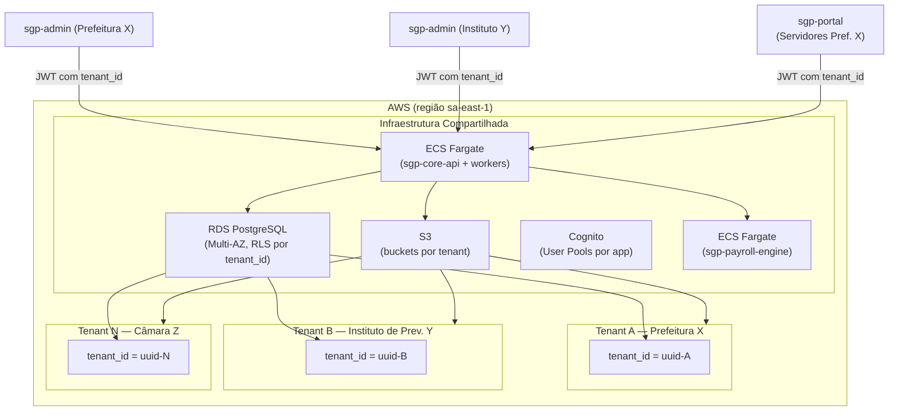
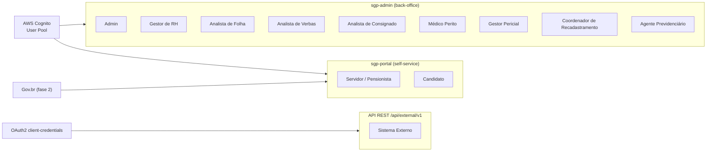
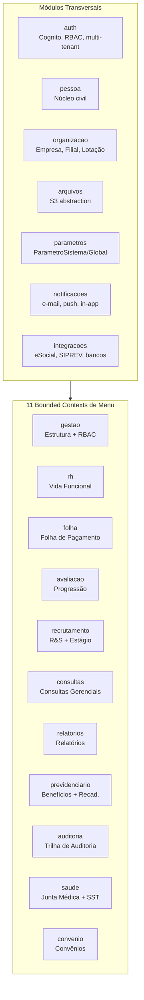
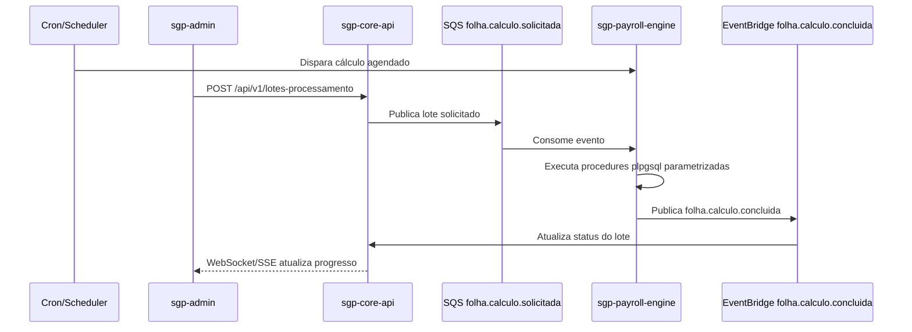
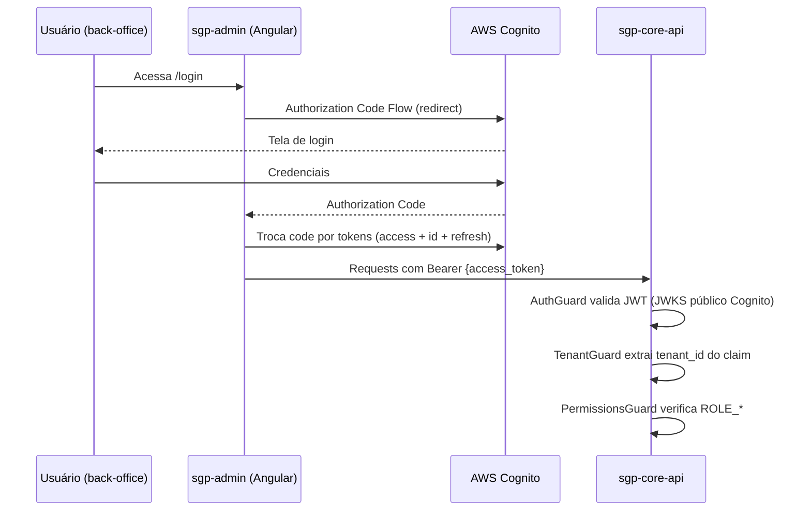
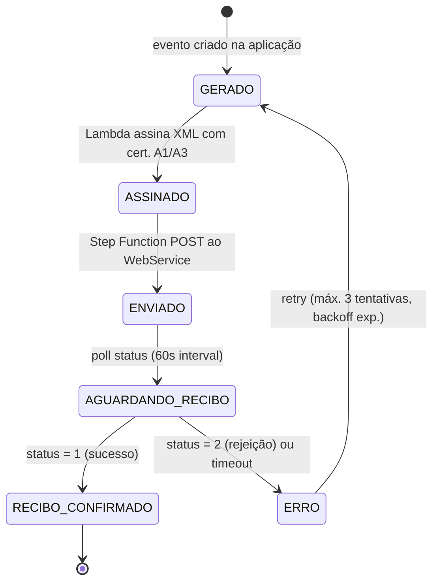
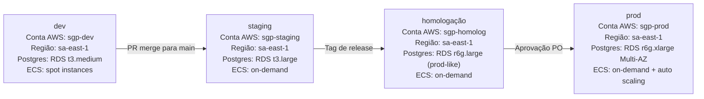

# Product Authority

Authored product authority: mission, scope, glossary, domain map, and binding decisions.

## Merged Artifact Index

- BRIEF — SGP Moderno (Sistema de Gestão de Pessoas)
- Visão de Produto e Glossário — SGP Moderno
- Escopo e Decisões de Arquitetura — SGP Moderno

## BRIEF — SGP Moderno (Sistema de Gestão de Pessoas)

## BRIEF — SGP Moderno (Sistema de Gestão de Pessoas)

> **Este é o documento mestre para produção da documentação formal.** Todos os agentes que produzirem artefatos desta pasta devem considerar este arquivo como **única fonte da verdade** para as decisões de arquitetura, escopo, stack, domínio, regras e glossário.
>
> O conteúdo abaixo foi consolidado a partir dos 62 documentos legados em `/Users/aarusso/Downloads/interno-rh/docs/` e das decisões de arquitetura aprovadas pelo product owner.

---

### 1. Identidade e escopo do produto

**Nome do produto:** SGP — Sistema de Gestão de Pessoas.
**Tipo:** ERP de Recursos Humanos e Folha de Pagamento para entes públicos e organizações com regime próprio de previdência (RPPS).
**Domínios cobertos:** cadastro de pessoas e vínculos, vida funcional, folha de pagamento, benefícios previdenciários, saúde ocupacional e perícia, recrutamento e seleção, estágio, integrações fiscais e oficiais, transparência.
**Usuários-alvo:** prefeituras, autarquias, fundos e institutos de previdência, órgãos da administração pública direta e indireta.

**Substitui:** legado Java/Spring + AngularJS com 643 estados de navegação, 192 controladores, ~1.200 endpoints, 159 diretórios de páginas. O escopo do novo SGP **cobre paridade funcional completa** com o legado, distribuído nos 11 menus de primeiro nível.

---

**Escopo de versão futura:** Arrecadação Previdenciária fica integralmente fora do v0.0.1. Nenhuma rota, módulo backend, módulo frontend, objeto de banco, teste ou gate de aceite de Arrecadação deve ser exigido no pacote atual. A retomada exige nova decisão de escopo e atualização coordenada dos contratos, menus, autorização, testes e migração.

**Decisões temporárias de escopo (2026-04-26):**

- A árvore frontend do `sgp-admin`, rotas backend administrativas (`/api/v1/admin`, `/api/admin/v1`), gestão corporativa de usuários/perfis/permissões e fluxos OAuth/Cognito/Gov.br seguem instaláveis posteriormente e não são bloqueadores do pacote atual.
- O armazenamento de documentos oficiais continua S3-compatible. Em produção/homologação, S3 real é obrigatório; em testes locais/CI sem configuração S3, é permitido usar MiniIO em Docker como substituto S3-compatible. Fallback para disco local não é aceite de runtime.
- eSocial permanece tratado como provedor externo stubado/sandbox no pacote atual. Geração de payload e persistência interna são escopo corrente; transmissão real, certificados de produção e homologação externa ficam para etapa posterior.
- A escolha de `./infra` está definida: AWS CDK TypeScript é a superfície IaC automatizada do SGP; provisionamento e deploy de artefatos permanecem fluxos separados. O runtime AWS usa EC2 privado com PM2, sem Docker/ECR.
- Gates de governança/release (GitHub Actions completos, Pact broker/provider, scanners e observabilidade produtiva) ficam postergados e não bloqueiam a reavaliação de código atual.

### 2. Decisões de arquitetura aprovadas

| #   | Tema                            | Decisão                                                                                                                                                                                                                                                                                  |
| --- | ------------------------------- | ---------------------------------------------------------------------------------------------------------------------------------------------------------------------------------------------------------------------------------------------------------------------------------------- |
| 1   | **Multi-tenancy**               | **SaaS multi-tenant** com `tenant_id` em todas as tabelas (row-level isolation). Cada tenant = 1 ente contratante. PostgreSQL Row-Level Security obrigatória.                                                                                                                            |
| 2   | **Motor de folha**              | **Implementação separada** (`sgp-payroll-engine`) com execução independente (inclusive em servidor dedicado), acionamento por cron e por requisição de cálculo, consulta de progresso de lote e in-lote, e camada de gestão fina sobre rotinas parametrizadas em PostgreSQL (`plpgsql`). |
| 3   | **Escopo de domínios**          | **Todos os 11 menus de 1º nível** cobertos em profundidade equivalente: Gestão, Módulo RH, Folha de Pgt, Módulo Avaliação, Recrutamento e Seleção, Consultas Gerenciais, Relatório, Módulo Previdenciário, Auditoria, Area de Saúde (Junta Médica/SST), Convênio.                        |
| 4   | **Autenticação / SSO**          | **User pools separados por contexto**: `SGP-CORE` (staff) e `SGP-PORTAL` (employees/beneficiários/candidatos). OAuth2/OIDC com RBAC; API-externa via client-credentials (substitui `SGP-API-KEY`).                                                                                       |
| 5   | **Portal do Funcionário**       | **Aplicação separada do core** (`sgp-portal-ui` + `sgp-portal-api`), com backend próprio, acesso **somente leitura** ao banco com menor privilégio possível e escopo funcional de autoatendimento.                                                                                       |
| 6   | **Armazenamento de arquivos**   | **S3-compatible exclusivamente**; AWS S3 em produção/homologação, MiniIO em Docker permitido apenas em testes sem S3 configurado. Sem fallback para disco local.                                                                                                                         |
| 7   | **eSocial**                     | Apenas **leiaute S-1.2**. No pacote atual, geração de payload e adapter sandbox/stub; envio real via serviços AWS e homologação externa ficam para decisão posterior.                                                                                                                    |
| 8   | **Motor de fórmulas de verbas** | **SQL-based**: fórmulas são traduzidas/compiladas para SQL no momento do cálculo, executando sobre a base consolidada de competência. DSL declarativa é validada e transpiladas a expressões SQL parametrizadas.                                                                         |
| 9   | **Auditoria**                   | Somente em **domínios sensíveis** (folha, verbas, vida funcional, previdenciário, perícia, usuários/papéis). Tabela única `audit_log` com diff JSONB.                                                                                                                                    |
| 10  | **i18n / Terminologia**         | Mantém parametrização `termo_funcionario` / `termo_funcionario_plural` (Funcionário ↔ Servidor) como chaves de i18n injetadas em runtime. pt-BR é o único idioma suportado no MVP.                                                                                                       |

**Stack de referência:**

- **Banco:** PostgreSQL 16+ (RLS, JSONB, particionamento por competência em tabelas de folha, pg_trgm para busca textual).
- **Backend:** NestJS (TypeScript) em arquitetura modular; monorepo (nx ou turborepo) com apps:
  - `sgp-core-api` — API principal administrativa (staff).
  - `sgp-portal-api` — API do portal (somente leitura, privilégios mínimos no banco).
  - `sgp-payroll-engine` — implementação separada de cálculo de folha.
  - `stynx-esocial` — worker assíncrono eSocial S-1.2.
  - `sgp-integrations-worker` — workers de remessa/retorno bancário, SIPREV e DIRF.
- **Frontend:** Angular (última LTS) em monorepo nx, duas SPAs:
  - `sgp-admin` — aplicação administrativa (back-office).
  - `sgp-portal-ui` — Portal do Funcionário / Pensionista / Candidato.
- **Infra AWS:** RDS Postgres Multi-AZ, ECS Fargate (ou EKS), S3, SNS/SQS/EventBridge, Cognito, Secrets Manager, CloudWatch, KMS, API Gateway, CloudFront + WAF.
- **Observabilidade:** OpenTelemetry → CloudWatch/X-Ray; logs estruturados JSON; métricas de negócio (folhas fechadas/mês, contracheques emitidos, eventos eSocial).
- **Testes:** Jest (unit/integration), Playwright (e2e), Pact (contract testing), testes de migração do legado com dumps SQL Server.
- **CI/CD:** GitHub Actions; ambientes dev → staging → homologação → prod; migrations versionadas (Flyway ou Prisma Migrate).
- **Frameworks corporativos obrigatórios:** autenticação/autorização (RBAC), login, gestão de usuários/papéis/permissões e armazenamento/recuperação documental são fornecidos por framework interno comum e tratados como dependências externas.

---

### 3. Menus de 1º nível e módulos (visão geral)

| Menu legado            | Categoria técnica       | Módulo NestJS    | Lib Angular           | Contexto delimitado                     |
| ---------------------- | ----------------------- | ---------------- | --------------------- | --------------------------------------- |
| Gestão                 | `GESTAO`                | `gestao`         | `@sgp/gestao`         | Estrutura Corporativa & Parametrizações |
| Módulo RH              | `MODULO_RH`             | `rh`             | `@sgp/rh`             | Cadastro Funcional e Vida Laboral       |
| Folha de Pgt           | `FOLHA_PAGAMENTO`       | `folha`          | `@sgp/folha`          | Folha e Financeiro                      |
| Módulo Avaliação       | `MODULO_AVALIACAO`      | `avaliacao`      | `@sgp/avaliacao`      | Avaliação e Progressão                  |
| Recrutamento e Seleção | `RECRUTAMENTO_SELECAO`  | `recrutamento`   | `@sgp/recrutamento`   | Recrutamento, Seleção e Estágio         |
| Consultas Gerenciais   | `CONSULTAS_GERENCIAIS`  | `consultas`      | `@sgp/consultas`      | Consultas e BI                          |
| Relatório              | `RELATORIO`             | `relatorios`     | `@sgp/relatorios`     | Emissão de Relatórios                   |
| Módulo Previdenciário  | `MODULO_PREVIDENCIARIO` | `previdenciario` | `@sgp/previdenciario` | Previdenciário e Benefícios             |
| Auditoria              | `AUDITORIA`             | `auditoria`      | `@sgp/auditoria`      | Trilha de Auditoria                     |
| Area de Saúde          | `JUNTA_MEDICA`          | `saude`          | `@sgp/saude`          | Saúde Ocupacional e Perícia             |
| Convênio               | `CONVENIO`              | `convenio`       | `@sgp/convenio`       | Convênios e Descontos                   |

**Módulos transversais (cross-cutting):**

- `auth` — integração ao framework interno corporativo (login, RBAC, user/roles/permissions).
- `pessoa` — núcleo civil compartilhado (Pessoa, Documentos, Endereço, Contato).
- `organizacao` — Tenant, Empresa Matriz, Filial, Lotação, Centro de Custo.
- `arquivos` — integração ao framework interno corporativo de storage/documentos.
- `notificacoes` — e-mail, push, in-app.
- `integracoes` — eSocial, SIPREV, DIRF, Neoconsig, bancos, Gov.br, prefeitura.
- `parametros` — `ParametroSistema`, `ParametroGlobal`, feature flags.
- `enums-catalogo` — listas enumeradas parametrizáveis (tipo vínculo, situação funcional, etc.).

---

### 4. Modelo de autorização

**RBAC com 4 camadas:**

1. **Tenant** — isolamento row-level (`tenant_id`).
2. **Perfil** (`perfil`) — agrupador administrativo; herda múltiplos papéis.
3. **Papel** (`papel`) — capacidade autorizada (`ROLE_<MODULO>_<ACAO>`).
4. **Usuário** (`usuario`) — sujeito final; pertence a perfis; herda papéis.

**Ações padrão por módulo:** `VISUALIZAR`, `CADASTRAR`, `ATUALIZAR`, `EXCLUIR`, `GESTAO` (gestão integral).

**Módulos em GESTAO integral (sem CRUD granular):**
`RECADASTRAMENTO`, `PERICIA_MEDICA`, `AGENDA_MEDICA`, `ARQUIVO_REMESSA`, `FOLHA_DE_PGT`, `RELATORIO_FOLHA_PAGAMENTO`, `AUDITORIA`, `RELATORIO_VERBAS`, `RELATORIO_APOSENTADO_PENSAO`, `RELATORIO_SERV_PAG_BLOQUEADO`, `ARQUIVO_EXPORTACAO_SIPREV`, `DIRF`, `RELATORIO_BATIMENTO_FOLHA`, `RELATORIO_PROVENTOS_DESCONTOS`, `RELATORIO_REPASSE_FUNDO_RH`, `RELATORIO_GERENCIAL`, `ESPECIALIDADE_MEDICA`, `MEDICO`.

**Posse desdobrada:** `POSSE_EFETIVO`, `POSSE_COMISSIONADO`, `POSSE_CONTRATADO`.

**API externa:** `ROLE_EXTERNAL_SYSTEM` via client-credentials Cognito (substitui `SGP-API-KEY` legado).

**Feature flags:** `esocial.enabled`, `PORTAL_SERVIDOR_ENABLED`, `GOV_BR_SSO_ENABLED`, `PROVA_VIDA_PUBLIC_API_ENABLED`.

**Implementação NestJS:**

- Guards: `AuthGuard` (JWT Cognito) → `TenantGuard` (injeta `tenant_id` no contexto) → `PermissionsGuard` (verifica papéis via `@RequirePermissions('MODULO.ACAO')`).
- `@PreAuthorize` legado vira decorator `@Permissions('FOLHA_DE_PGT.GESTAO')`.
- Front-end: `AuthzService.can(modulo, acao)` controla exposição de menus/botões; servidor revalida sempre.

---

### 5. Domínios — entidades, regras, lifecycles

> Esta seção lista as entidades principais que devem aparecer no modelo lógico/físico e nos casos de uso. Ordem canônica dos nomes: **pt-BR, singular, snake_case na base.**

#### 5.1 Pessoa e Vínculo (Módulo RH)

**Entidades principais:**

- `pessoa` (CPF, nome, nome_social, sexo, data_nascimento, estado_civil, filiacao_mae, filiacao_pai, raca_cor, grau_instrucao, tipo_sanguineo, nacionalidade, naturalizado, data_chegada_pais, casamento_brasileiro, filho_brasileiro, foto_s3_key).
- `documento_pessoa` — polimórfico por tipo: `RG`, `CTPS`, `PIS_PASEP`, `SUS`, `TITULO_ELEITOR`, `CNH`, `ALISTAMENTO`, `CONSELHO_PROFISSIONAL`, `DOC_NOMEACAO`.
- `endereco` (CEP, logradouro, numero, complemento, bairro, uf, municipio_id, uf_registro, municipio_registro_id).
- `contato` (email_pessoal, email_corporativo, telefone_principal, telefone_opcional).
- `dependente` (pessoa_id, parentesco, finalidade ∈ {IR, SALARIO_FAMILIA, PENSAO, SAUDE}, data_inicio, data_fim).
- `funcionario` / `matricula` / `vinculo` (matricula, matricula_oficial, filial_id, lotacao_id, centro_custo_id, vinculo_tipo ∈ {EFETIVO, COMISSIONADO, CONTRATADO, PRESTADOR, CEDIDO, ESTAGIARIO, TEMPORARIO}, tipo_ingresso, data_posse, data_exercicio, cargo_id, funcao_id, nivel_salarial_id, referencia_salarial_id, jornada_id, carga_horaria, turno, tipo_folha_id, fgts, ats_adts, abono_permanencia, estado_probatorio, tipo_conta_banco, banco_id, agencia, conta, digito, operacao, dependentes_ir_count, dependentes_salario_familia_count, sindicato_id, vale_transporte).
- `situacao_funcional` (histórico: tipo ∈ {ATIVO, AFASTAMENTO, DESLIGAMENTO, SUSTADO, A_DISPOSICAO}, motivo_id, data_inicio, data_fim, justificativa).
- `cedido_detalhe` (orgao_origem, cargo_origem, documento_amparo {numero, data, tipo, observacao}, publicacao {numero, data, pagina, meio}, sigilo, anexo_s3_key).
- `posse` (funcionario_id, cargo_id, funcao_id, nivel_salarial_id, referencia_salarial_id, filial_id, lotacao_id, centro_custo_id, banco_id, tipo_conta, conta, carga_horaria, turno_id, opcao_remuneracao, bens_declarados, termo_s3_key, data_posse, data_fim_contrato).
- `transferencia` (funcionario_id, filial_origem_id, filial_destino_id, lotacao_origem_id, lotacao_destino_id, centro_custo_destino_id, designado, com_onus, data_transferencia, justificativa).
- `anexo_funcionario` / `dossie` (funcionario_id, tipo_documento_id, s3_key, observacao, data_emissao, numero_documento, publicacao).
- `observacao_funcional` (funcionario_id, texto_historico, data, usuario_id).
- `ficha_funcional` — _view_ materializada consolidando ferias, licenças, transferências, licença-prêmio, vencimentos, desligamentos, observação geral.

**Lifecycle vínculo:** CADASTRO*BASE → POSSE → ATIVO → (AFASTAMENTO ↔ ATIVO)* → TRANSFERÊNCIA\_ → DESLIGAMENTO.

**Regras-chave:**

- CPF obrigatório e único por tenant; idade < 14 anos bloqueia.
- PIS/PASEP único por CPF (validação cross-tenant opcional).
- Matrícula: automática (parametrizada) ou manual; travada após criação.
- Filial → Lotação (cascata); Lotação → Centro de Custo (cascata).
- Cedido força vínculo `A_DISPOSICAO`/`EFETIVO`; documento de amparo obrigatório.
- Afastamento novo valida limite anual por motivo; excedente rejeitado; sem retorno → sustação automática.
- Transferência designada: origem mantém custos; sem ônus: centro de custo opcional.
- Reaproveitamento por CPF: ao detectar vínculo prévio, oferece reuso de dados pessoais/documentais.
- `funcionarioEtapas`: parâmetro que bloqueia enquadramento na etapa 1 (mantém compat. legado).

#### 5.2 Folha de Pagamento (Módulo Folha)

**Entidades principais:**

- `competencia` (tenant_id, mes, ano, estado ∈ {ABERTA, PROGRAMADA_FECHAR, FECHADA}, data_abertura, data_programada_fechamento, usuario_abriu).
- `folha_pagamento` (competencia_id, empresa_matriz_id, filial_id, tipo_processamento_id, periodo_inicial, periodo_final, status ∈ {DESBLOQUEADO, BLOQUEADO}, situacao ∈ {PENDENTE, EM_CALCULO, CALCULADO, EXCLUINDO, ERRO}, data_abertura, data_fechamento). **Chave composta:** (competencia, empresa_matriz, filial, tipo_processamento).
- `tipo_processamento` (MENSAL, DECIMO_TERCEIRO_ADIANTAMENTO, DECIMO_TERCEIRO_INTEGRACAO, FERIAS, RESCISAO, COMPLEMENTAR, ADIANTAMENTO_SALARIAL).
- `contracheque` (folha_pagamento_id, funcionario_id OR pensionista_id, referencia_folha, data_calculo, situacao ∈ {CONCLUIDO, ERRO, PENDENTE}, template ∈ {SERVIDOR, PENSIONISTA}, marca_dagua_flag). Particionado por competência (mês/ano).
- `lancamento` (contracheque_id, verba_id, valor_calculado, tipo ∈ {MANUAL, IMPORTADO, CALCULADO}, origem ∈ {DIRETO, IMPORTADOR, CONSIGNADO, FORMULA}, memoria_calculo JSONB).
- `verba` / `rubrica` (codigo, descricao, tipo ∈ {PROVENTO, DESCONTO, BASE, APOIO_CALCULO}, recorrencia, parcelas_padrao).
- `formula` (verba_id, texto_dsl, texto_sql_compilado, versao, data_vigencia_inicio, data_vigencia_fim, ativa).
- `atributo_formula` (chave, path_semantico, tipo_valor, origem_tabela, origem_coluna).
- `aliquota` (tributo ∈ {INSS, IRRF, PREVIDENCIA_PROPRIA}, ano, faixa_inicial, faixa_final, aliquota_pct, deducao_valor).
- **Elegibilidade (N:N):** `funcionario_verba`, `cargo_verba`, `funcao_verba`, `vinculo_verba`, `categoria_profissional_verba`, `tipo_folha_verbas`.
- `funcionario_verba` (funcionario_id, verba_id, tipo_valor, recorrencia, valor, parcelas_totais, parcelas_pagas, tipo_folha_id, competencia_inicial_mes, competencia_inicial_ano, observacao).
- `consignado` (descricao, contrato, banco_id, agencia, validado).
- `importacao_consignado` (competencia_id, arquivo_s3_key, data_importacao, status ∈ {NAO_IMPORTADO, IMPORTADO, IMPORTADO_PARCIALMENTE}).
- `importacao_lancamento_manual` (folha_pagamento_id, arquivo_s3_key, data_importacao, status).
- `importacao_verba_servidor` / `importacao_verba_pensionista`.
- `lote_processamento` (competencia_id, tipo_processamento_id, filiais[], periodo_inicial, periodo_final, status_global, progresso_folhas_pct, progresso_contracheques_pct).
- `relatorio_financeiro` (competencia_id, status ∈ {NAO_SALVO, SALVO}, data_criacao, conteudo_json).

**Lifecycle folha:**

1. ABRIR_COMPETENCIA → estado ABERTA.
2. CRIAR_FOLHA (por filial × tipo_processamento) → `DESBLOQUEADO` + `PENDENTE`.
3. COMPOR_MASSA (auto + inclusões tardias).
4. APLICAR_LANÇAMENTOS (manual, importado, consignado).
5. CALCULAR_LOTE → `EM_CALCULO` → `CALCULADO`.
6. CONFERIR (relatórios, batimento).
7. FECHAR_COMPETENCIA (programada ou imediata) → `FECHADA` + folha `BLOQUEADO`.
8. REABRIR_ANTERIOR (opcional, para reprocessamento).

**Regras-chave:**

- Competência deve estar `ABERTA` para criar folha.
- Status `BLOQUEADO` trava inclusão, lançamento, remoção, recálculo.
- Situacao `PENDENTE` bloqueia recálculo.
- Valor de lançamento > 0 obrigatório.
- Inclusão tardia de servidor dispara cálculo imediato.
- Importação de verbas é **saneadora** (substitui existentes).
- Reprocessamento em 3 modos: seletivo (contracheques marcados), total (folha inteira), pendentes apenas.
- Três linhas paralelas de folha: mensal, 13º, férias/rescisão/complementar.

**Saídas:**

- Contracheque individual (PDF templates SERVIDOR/PENSIONISTA) com feedback de fórmula por verba.
- Resumo da folha (Excel).
- Relatório de folha (PDF/Excel).
- Relatório financeiro (persistido com status NAO_SALVO/SALVO).
- Batimento (PDF).
- Remessa bancária, retorno bancário, DIRF, SIPREV, eSocial (integrações).

#### 5.3 Previdenciário (Módulo Previdenciário + Recadastramento)

**Entidades:**

- `regra_aposentadoria` (nome, fundamento_legal, criterios_idade, criterios_tempo_contribuicao, criterios_carencia, aplicavel_vinculo).
- `simulacao_aposentadoria` (funcionario_id, regra_id, resultado, detalhe_json, data_simulacao).
- `aposentadoria` (funcionario_id, regra_id, data_concessao, fundamento, ato_nomeacao, status ∈ {CONCEDIDA, REVISADA, CASSADA}).
- `pensao` (instituidor_pessoa_id, beneficiario_pessoa_id, tipo_beneficio, tipo_rateio, cota_parte, forma_reajuste, natureza, data_concessao, data_cessacao).
- `certidao_tempo_contribuicao` (pessoa_id, periodo_inicio, periodo_fim, orgao, ato_emissao, s3_key).
- `compensacao_previdenciaria` (certidao_id, regime_origem, valor, status).
- `declaracao_aposentadoria` / `declaracao_ex_servidor` (pessoa_id, data_emissao, s3_key).
- `campanha_recadastramento` (tipo ∈ {APOSENTADO, PENSIONISTA, PENSIONISTA_UNIVERSITARIO}, ciclo_inicio, ciclo_fim, filtro_json).
- `beneficiario_recadastramento` (pessoa_id, tipo, data_proxima, status ∈ {RECADASTRADO, PERTO_VENCER, NAO_RECADASTRADO}).
- `recadastramento` (beneficiario_id, data, operador_id, dados_snapshot_json, comprovante_s3_key).
- `historico_ligacao` (beneficiario_id, data, usuario_id, observacao).
- `prova_vida_externa` (beneficiario_id, canal ∈ {PORTAL_COLABORADOR, PREFEITURA_PUBLICA, GOV_BR}, autenticacao, data).

**Lifecycle recadastramento:** PRIMEIRO_CICLO (6m após concessão) → ATIVO (anual aposentado / semestral pensionista) → status derivado {NAO_RECADASTRADO ↔ PERTO_VENCER ↔ RECADASTRADO}.

**Regras-chave:**

- Pensionista universitário: alerta aos 25 anos (não bloqueante no legado; manter configurável).
- Novo recadastramento desativa anterior; retroalimenta cadastro base (endereço, telefone, estado civil).
- Comprovante emitido apenas se status = RECADASTRADO.
- Histórico de ligações exige observação.

#### 5.4 Saúde Ocupacional e Perícia (Junta Médica + SST)

**Entidades:**

- `especialidade_medica`, `medico` (crm, uf_crm, especialidades, vinculos_filiais), `profissional_saude` (conselho, numero, uf).
- `agenda_medica` (medico_id, especialidades[], data_inicial, data_final, hora_inicial, hora_final, intervalo_min, periodicidade).
- `janela_agenda` (agenda_id, data, hora_inicio, hora_fim, status).
- `agendamento_pericia` (funcionario_id, especialidade_id, agenda_id, janela_id, data, hora, status ∈ {PENDENTE, CANCELADO, CONCLUIDO, AGENDADO, COMPARECEU, NAO_COMPARECEU}, observacao, telefone_contato, anexo_s3_key).
- `prontuario_pericia` (agendamento_id, medico_id, motivo, hda, exame_fisico, diagnostico, observacao, acao_pericial ∈ {APOSENTAR, NAO_APOSENTAR, DESAPOSENTAR, REMARCAR, RETORNO, ENCAMINHAR_ESPECIALISTA}, tipo_laudo, situacao_laudo ∈ {PENDENTE_ENVIO, PENDENTE_VALIDACAO, APROVADO, REPROVADO}, cid_principal_id, cid_secundarios[]).
- `licenca_medica` (funcionario_id, prontuario_id, tipo_avaliacao, beneficio_previdenciario, motivo_afastamento_id, cid_id, dias_concedidos, data_inicio, data_fim, dependente_id, restricoes_json, readaptacao_json, invalidez_json, justificativa, equipe_multiprofissional[]).
- `cid` (codigo, descricao).
- `restricao_ocupacional` (funcionario_id, tipos[], data_inicio, data_fim, observacao).
- `readaptacao` (funcionario_id, atividades_compativeis, data_inicio, data_fim, dias).
- `invalidez_pericia` (funcionario_id, decisao, grupo_doenca_grave, data_enquadramento, processo_numero).
- `acidente_trabalho` (funcionario_id, data, local, cat_numero, cid, dias_afastamento, atestado_s3_key).
- `exame_ocupacional`, `entidade_exame`, `epi`, `epc`, `agente_nocivo`, `categoria_doenca`, `subcategoria_doenca`.

**Lifecycle perícia:**
PARAMETRIZAR (especialidade + médico + agenda) → AGENDAR (PENDENTE/AGENDADO) → ATENDER (COMPARECEU/NAO_COMPARECEU) → PRONTUÁRIO + LAUDO (PENDENTE_ENVIO → PENDENTE_VALIDACAO → APROVADO/REPROVADO) → LICENÇA (se aplicável) → REPLICAR para outras matrículas do CPF → EFEITO FUNCIONAL (altera situação_funcional).

**Regras-chave:**

- Servidor deve estar ATIVO/EM_EXERCICIO para agendamento.
- Dias concedidos ≤ 720 (24 meses acumulado) para afastamento remunerado.
- Parecer exige ≥1 profissional saúde na equipe, CID, motivo afastamento.
- Benefício previdenciário XOR motivo afastamento remunerado (exclusão mútua, um obrigatório).
- Licença de tratamento família → dependente obrigatório.
- Réplica por CPF alcança todas as matrículas do mesmo indivíduo.
- Comparecimento zera contador de faltas.

#### 5.5 Recrutamento e Seleção (Módulo Recrutamento + Estágio)

**Entidades:**

- `requisicao_pessoal` (solicitante_id, filial_id, lotacao_id, situacao ∈ {RASCUNHO, EM_PROCESSO, APROVADO, REJEITADO, CANCELADA, CONCLUIDO}, justificativa, data_entrada, data_limite, motivo ∈ {AUMENTO_QUADRO, SUBSTITUICAO}, colaborador_substituido_id, data_prevista_admissao).
- `funcao_requisitada` (requisicao_id, funcao_id, tipo_contratacao, quantidade_vagas, custo_vaga, turno_id, requisitos, cursos[], habilidades[], atividades[]).
- `candidato_requisicao` (requisicao_id, pessoa_id, comentario_inicial, comentario_analise, situacao ∈ {PENDENTE, APROVADO, REPROVADO}, curriculo_s3_key).
- `banco_talentos` (pessoa_id, dados_pessoais_json, historico_profissional_json, formacao_json, habilidades[], idiomas[], certificados[], cursos[], links_json, curriculo_s3_key).
- `programa_estagio` (nome, vigencia_inicio, vigencia_fim, periodo_maximo_meses, renovacoes_permitidas, candidatos_por_vaga, idade_minima, bolsa_valor, carga_horaria, relacao_trabalho, normativo_s3_key).
- `estagiario` (pessoa_id, programa_id, filial_id, lotacao_id, instituicao_ensino_id, curso_id, turno_id, centro_custo_id, banco_id, agencia, conta, pne_flag, situacao_funcional, data_inicio, data_fim).
- `prorrogacao_estagio` (estagiario_id, data_solicitacao, duracao_adicional_meses, aprovado_por).
- `recesso_estagio` (estagiario_id, data_inicio, duracao_dias).
- `instituicao_ensino`, `curso`, `turno`.

**Regras-chave:**

- Requisição em RASCUNHO editável só pelo solicitante; encaminhamento → EM_PROCESSO (notifica RH por e-mail).
- Substituição exige colaborador_substituido.
- Candidato nasce PENDENTE; remoção remove currículo S3.
- Conclusão da análise → requisição CONCLUIDO; notifica solicitante.
- Estagiário: vínculo acumulado ≤ 2 anos no programa.
- Desligamento de estágio: inativa verbas ativas; automação ao atingir data_fim.

**Entidades:**

#### 5.7 Avaliação e Progressão (Módulo Avaliação)

**Entidades:**

- `avaliacao_desempenho` (funcionario_id, periodo, nota, criterios_json, avaliador_id, data).
- `progressao_merito` (funcionario_id, nivel_origem, nivel_destino, data_vigencia, ato_nomeacao, tipo ∈ {MERITO, TITULARIDADE, JUDICIAL, CORRECAO_SALARIAL}).
- `plano_cargos_carreira` (nome, versao, data_vigencia, niveis_json, referencias_json).
- `simulador_nivel_salarial` (funcionario_id, cenario, resultado_json).

#### 5.8 Convênio

**Entidades:**

- `convenio` (tenant_id, nome, tipo, contrato, vigencia, banco_id_cobranca).
- `convenio_beneficiario` (convenio_id, pessoa_id, valor_mensal, inicio, fim).
- `convenio_desconto_folha` (convenio_id, competencia_id, pessoa_id, valor, status).

#### 5.9 Auditoria

**Entidade única:**

- `audit_log` (id, tenant_id, timestamp, usuario_id, dominio, entidade, entidade_id, acao ∈ {CREATE, UPDATE, DELETE, LOGIN, EXPORT, PRINT}, diff_jsonb, ip, user_agent, request_id).

**Política:** popular somente em domínios sensíveis (ver decisão #9).

---

### 6. Integrações externas — contratos e protocolos

| Integração                   | Direção | Protocolo             | Leiaute/Contrato                                                                                                                            | Autenticação                                         |
| ---------------------------- | ------- | --------------------- | ------------------------------------------------------------------------------------------------------------------------------------------- | ---------------------------------------------------- |
| **eSocial S-1.2**            | Out/In  | WebService SOAP + XML | Eventos S-1000, S-1005, S-1010, S-1020, S-1030, S-1035, S-1040, S-1050, S-1060, S-1070, S-1080 + S-2xxx/S-3xxx (não-periódicos/periódicos). | Certificado digital A1/A3 (e-CNPJ).                  |
| **SIPREV**                   | Out     | XML export (arquivo)  | Leiaute MPS/SIPREV vigente.                                                                                                                 | Upload manual no portal SIPREV.                      |
| **DIRF**                     | Out     | Arquivo TXT           | Leiaute RFB anual.                                                                                                                          | Upload via PGD-DIRF.                                 |
| **Prefeitura (Portal)**      | In/Out  | REST                  | Endpoints `/publico/prefeitura/{autenticacao,dependente,endereco,incorretos,imagem}`.                                                       | API-key (legado) → OAuth2 client-credentials.        |
| **API Externa (dicionário)** | Out     | REST                  | `/externo/dados`, `/externo/dicionario/{entidades,enums}`.                                                                                  | OAuth2 client-credentials (substitui `SGP-API-KEY`). |
| **Neoconsig/Consignado**     | In      | Arquivo CSV           | Layout Neoconsig.                                                                                                                           | Upload manual.                                       |
| **Remessa/Retorno bancário** | Out/In  | CNAB 240/400          | CNAB por banco.                                                                                                                             | Upload/download via SFTP ou portal banco.            |
| **Portal Transparência**     | Out     | CSV                   | Layout municipal.                                                                                                                           | Upload agendado.                                     |
| **Gov.br SSO** (fase 2)      | In      | OIDC                  | OAuth2 + OpenID Connect.                                                                                                                    | Gov.br como IdP federado Cognito.                    |
| **AWS Cognito**              | In      | OIDC                  | OAuth2 authorization code + client-credentials.                                                                                             | Cognito User Pool + App Client.                      |

---

### 7. Saídas oficiais (documentos)

**Funcionais:**

- Ficha funcional (PDF).
- Dossiê (zip de anexos).
- Termo de posse (PDF gerado).

**Folha:**

- Contracheque servidor (PDF, com ou sem marca d'água).
- Contracheque pensionista (PDF).
- Contracheques em massa (PDF consolidado).
- Resumo da folha (XLSX).
- Relatório de folha (PDF/XLSX).
- Relatório financeiro (PDF/XLSX persistido como `relatorio_financeiro`).
- Batimento de folha (PDF).
- Ficha financeira (PDF/XLSX).
- Relatório de verbas, proventos/descontos, repasse fundo RH.

**Previdenciário:**

- Comprovante de recadastramento (PDF).
- Relatório da carteira (XLSX).
- Certidão de compensação (PDF/XLSX).
- Certidão de ex-segurado, tempo de contribuição (PDF).
- Declaração aposentado/ex-servidor (PDF).
- Relatório aposentado/pensionista.

**Saúde ocupacional:**

- Laudo pericial padrão (PDF).
- Laudo pericial aposentadoria (PDF).
- Relatório de agenda médica.

**Recrutamento/Estágio:**

- Relatório de recrutamento e seleção (PDF/gráficos).
- Relatório de estágio (PDF/XLSX com limite de registros).
- Relatório de recesso (fonte distinta).

**Fiscal/Obrigações:**

- DIRF (PDF + TXT).
- SIPREV (XML).
- Remessa CNAB (TXT).
- SEFIP.

**Geração:** todos os PDFs via serviço `sgp-report-service` (puppeteer/headless-chrome ou wkhtmltopdf); templates em Handlebars/HBS ou Angular Universal server-side. Arquivos TXT/XML gerados por builders typesafe; persistidos no S3 com chave determinística `{tenant}/outputs/{dominio}/{ano}/{mes}/{id}.{ext}`.

---

### 8. Jobs, rotinas assíncronas e eventos

**Jobs agendados (cron):**

- `daily:situacao-funcional-retorno-afastamento` — atualiza retorno de afastamento, reflete encerramento de licenças.
- `daily:licenca-medica-vencida` — inativa licenças vencidas.
- `daily:ferias-programadas` — manutenção automática.
- `daily:competencia-programada-fechamento` — executa fechamento agendado.
- `daily:estagio-desligamento-automatico` — desliga estagiários ao atingir data_fim.
- `monthly:controle-anual-afastamentos` — atualização da tabela de controle anual.
- `daily:prova-vida-proxima-vencer` — atualiza status `PERTO_VENCER`.

**Filas (SQS) / tópicos (SNS):**

- `folha.calculo.solicitada` → `sgp-payroll-engine` consome.
- `folha.calculo.concluida` → `sgp-core-api` atualiza UI.
- `contracheque.gerar.pdf` → `sgp-report-service`.
- `public.esocial_events` → `stynx-esocial` (retry até 3, backoff exponencial).
- `remessa.gerar` / `retorno.processar` → `sgp-integrations-worker`.
- `audit.evento.criado` → consumidor grava em `audit_log`.

**Step Functions:**

- `payroll-lote` — orquestra cálculo em lote por filial/competência, paraleliza cálculos, agrega progresso.
- `esocial-envio` — orquestra geração XML → assinatura → envio → poll status → recibo.

---

### 9. Parametrização crítica

**`ParametroSistema` (identidade do tenant):**

- `termo_funcionario`, `termo_funcionario_plural`.
- `matricula_automatica` (bool), `matricula_formato`, `matricula_prefixo`, `matricula_sufixo`.
- `logo_principal_s3_key`, `logo_secundario_s3_key`, `sigla`, `frase_inicial`.
- `funcionario_etapas` (bool).
- `esocial_url`, `esocial_cnpj_empregador`, `esocial_certificado_s3_key`.
- `cognito_user_pool_id`, `cognito_app_client_id`.

**`ParametroGlobal` (chaves operacionais):**

- `TETO_PREFEITURA`, `TETO_INSS`, `VALOR_DEPENDENTE_IRRF`, `SALARIO_MINIMO`.
- `NUMERO_REMESSA`, `FOLHA_13_SALARIO`.
- `VINCULO_EFETIVO`.

**Feature flags (`feature_flag`):**

- `esocial.enabled`, `PORTAL_SERVIDOR_ENABLED`, `GOV_BR_SSO_ENABLED`, `PROVA_VIDA_PUBLIC_API_ENABLED`, `AUDIT_FULL_TRACE_ENABLED`.

**Cadastros mestres estruturantes:** banco, agência, empresa_filial, lotacao, centro_custo, cargo, funcao, natureza, plano_cargos, turno, tipo_contratacao, tipo_folha, tipo_processamento, verba, referencia_salarial, faixa_salarial, grupo_salarial, municipio, uf, nacionalidade, motivo_afastamento, causa_afastamento, situacao_funcional, especialidade_medica, medico, exame, entidade_exame, programa_estagio, convenio, consignado.

**Enums parametrizáveis** (carregados como catálogos):
tipos vínculo / ingresso / estabilidade / folha / processamento / recorrência / reflexo / arredondamento / pensão / rateio / cota / incidência / férias / perícia / restrição / doença / CID / afastamento / lotação / função / remuneração.

---

### 10. Golden scenarios (regressão funcional)

Derivados da matriz do legado `35-cenarios-dourados-de-regressao-funcional.md`:

- **A. Cadastro e ingresso** — A1/A2 matrícula auto/manual, A3 posse efetiva, A4 verba individual.
- **B. Folha** — B1 abertura/criação, B2 inclusão + cálculo, B3 reprocessar pendências, B4 fechamento programado.
- **C. Recadastramento** — C1 aposentado, C2 pensionista universitário, C3 diligência telefone.
- **D. Perícia** — D1 agendar, D2 atender+licença, D3 validar, D4 réplica multi-vínculo.
- **E. Requisição** — E1 abrir+gestão, E2 currículo+análise, E3 estágio (programa/prorrogação/recesso).
- **F. Integrações** — F1 contracheque oficial, F2 remessa, F3 retorno, F4 SIPREV, F5 eSocial ativo.
- **G. Autorização** — G1 usuário sem alteração, G2 usuário com gestão, G3 menu eSocial oculto.

---

### 11. Convenções de codificação e nomenclatura

**Banco:**

- snake_case; PKs `id` UUID (gen_random_uuid); tenant_id em todas as tabelas de negócio; timestamps `created_at`/`updated_at`/`deleted_at` (soft delete).
- FKs: `<entidade>_id`; enums em tabelas `enum_*` (seed-driven) ou `CHECK`/Postgres ENUM para fechados.
- Particionamento: `contracheque`, `lancamento`, `audit_log` particionados por ano/mês.
- Índices: FKs indexadas; busca textual via `pg_trgm` em `pessoa.nome`, `pessoa.cpf`, `funcionario.matricula`.
- Views materializadas: `ficha_funcional`, `resumo_folha`, `carteira_recadastramento`.

**Backend (NestJS):**

- Estrutura modular por bounded context: `src/modules/<contexto>/{controllers,services,repositories,dto,entities,events}`.
- DTO com class-validator; OpenAPI gerado via `@nestjs/swagger`.
- Repositories via Prisma OU TypeORM (decidir no ADR); transações explícitas em fluxos de folha/perícia.
- Eventos de domínio via EventEmitter2 interno + publicação em EventBridge.
- Guards: AuthGuard → TenantGuard → PermissionsGuard.

**Frontend (Angular):**

- Standalone components, signals, control flow `@if`/`@for`.
- State management: NgRx Signal Store OR Akita (escolher em ADR).
- Feature libs por domínio em nx monorepo; lazy loading por rota.
- i18n: `@angular/localize` com chaves pt-BR; placeholders `{{ termoFuncionario }}`.

**REST:**

- `/api/v1/<recurso>` convenção REST; paginação `page`, `limit`, `sort`; filtros query-string.
- Erros em RFC 7807 (problem+json).
- IDs UUID na URL.
- Endpoints administrativos em `/api/admin/v1/...`; endpoints externos em `/api/external/v1/...` (OAuth2 client credentials).
- Endpoints do portal do servidor em `/api/portal/v1/...`.

---

### 12. Referências cruzadas com o legado

Para qualquer detalhe não coberto aqui, consultar em `/Users/aarusso/Downloads/interno-rh/docs/`:

- **Visão geral:** `01-visao-geral-legado.md`, `05-dominios-funcionais-e-navegacao.md`.
- **Módulos prioritários detalhados:** `06-modulos-prioritarios-detalhados.md`.
- **Domínios mapa fino:** `11` (funcionário), `12` (folha), `13` (recadastramento), `14` (perícia), `15` (requisição).
- **Autorização:** `31-autorizacao-menu-e-capacidades-funcionais.md`, `57-autorizacao-estatica-completa.md`.
- **Parametrização:** `32-catalogo-de-parametrizacoes-criticas.md`, `61-parametros-defaults-e-seeds-locais.md`.
- **Saídas:** `33-catalogo-de-saidas-oficiais-e-arquivos.md`, `58-importacoes-exportacoes-e-documentos-estaticos.md`.
- **Jobs/integrações:** `34-rotinas-operacionais-jobs-e-integracoes.md`, `59-integracoes-e-contratos-estaticos.md`.
- **Cenários:** `35-cenarios-dourados-de-regressao-funcional.md`.
- **Fórmulas de folha:** `52-folha-verbas-formulas-atributos.md`.
- **Menus e tabelas:** `44-inventario-real-menus-rhlinkcon.csv`, `50-inventario-tabelas-relacionadas-funcionario-verba-folha.csv`.

---

### 13. Convenções desta documentação

- Todos os arquivos em **pt-BR**, com terminologia RH/Folha/Previdenciária brasileira.
- Diagramas em **Mermaid** (embutidos no markdown).
- DDL em PostgreSQL 16+ padrão.
- OpenAPI 3.1.
- Ajustes e refinamentos posteriores devem ser registrados em ADRs sequenciais (`adr/0001-*.md`).
- Cada artefato começa com cabeçalho padrão:
  ```
  # <Título>
  **Versão:** 1.0 | **Data:** 2026-04-21 | **Status:** Draft
  **Escopo:** <bounded context(s)> | **Depende de:** BRIEF.md, <outros>.
  ```

---

**Fim do BRIEF.** Os agentes podem complementar leituras diretas nos 62 documentos legados quando necessitarem de detalhe adicional não capturado aqui.

## Visão de Produto e Glossário — SGP Moderno

## Visão de Produto e Glossário — SGP Moderno

**Versão:** 1.0 | **Data:** 2026-04-21 | **Status:** Draft
**Escopo:** transversal (todos os bounded contexts) | **Depende de:** BRIEF.md

---

### Sumário

1. [Visão de Produto](#1-visão-de-produto)
2. [Público-alvo e Perfis de Usuário](#2-público-alvo-e-perfis-de-usuário)
3. [Escopo Funcional](#3-escopo-funcional)
4. [Não-escopo](#4-não-escopo)
5. [Glossário](#5-glossário)
6. [Acrônimos](#6-acrônimos)
7. [Convenções de Escrita](#7-convenções-de-escrita)

---

### 1. Visão de Produto

#### 1.1 Contexto e Motivação

O setor público brasileiro opera um dos regimes de gestão de pessoas mais complexos do mundo. Diferentemente do setor privado, o servidor público está sujeito a:

- **Múltiplos regimes previdenciários simultâneos** — RPPS (Regime Próprio de Previdência Social) para efetivos, RGPS (INSS) para contratados temporários e celetistas, com regras de compensação mútua quando o servidor migra entre regimes.
- **Estrutura de verbas extremamente heterogênea** — adicional de insalubridade, gratificação de função, adicional por tempo de serviço (ATS/ADTS), abono de permanência, progressões por titularidade e mérito, cada uma com fórmulas de elegibilidade e cálculo definidas em lei ou decreto municipal.
- **Obrigações acessórias rigorosas** — DIRF anual, eSocial S-1.2, SEFIP, SIPREV, cada uma com leiautes e prazos distintos.
- **Transparência pública obrigatória** — publicação de remunerações nominais e identificadas no Portal de Transparência (Lei 12.527/2011 e Lei Complementar 131/2009).
- **Particularidades de cada ente** — cada prefeitura, autarquia, câmara ou fundo de previdência tem plano de cargos e carreira, tabela salarial, regras de aposentadoria e legislação própria, frequentemente alteradas por lei ordinária local.

Prefeituras, autarquias, câmaras, fundos e institutos de previdência precisam de um ERP que entenda profundamente essa realidade sem forçar adaptações simplificadoras que rompam com a legislação local.

O **SGP legado**, construído em Java/Spring + AngularJS ao longo de mais de uma década, acumula:

- 643 estados de navegação rastreados no frontend;
- 192 controladores REST no backend;
- aproximadamente 1.200 endpoints REST mapeados;
- 159 diretórios de páginas AngularJS.

Embora funcionalmente completo, a base de código apresenta débito técnico severo:

- **Ausência de testes automatizados** cobrindo os cálculos de folha — a única garantia de correção são comparações manuais com folhas históricas.
- **Interface AngularJS (EOL desde 2021)** — sem suporte a dispositivos móveis, acessibilidade limitada, carregamento lento.
- **Multi-tenancy por schema isolado** — custo operacional crescente: cada novo cliente exige DDL completo de schema, migrations duplicadas e aumento proporcional de conexões de pool.
- **Lógica de negócio em procedimentos SQL** — fórmulas de verbas em PL/pgSQL e Groovy acopladas ao código Java, impossíveis de testar unitariamente.
- **Integrações frágeis** — eSocial no leiaute S-1.0 (em descontinuação), integrações bancárias sem retry, eSocial sem rastreabilidade de eventos.
- **Ausência de auditoria estruturada** — logs de aplicação genéricos sem diff de estado, impossível reconstruir quem alterou qual valor em qual momento.

#### 1.2 Proposta de Valor

O **SGP Moderno** é uma reimplementação completa do SGP legado sobre uma arquitetura contemporânea — PostgreSQL 16 + NestJS (TypeScript) + Angular (última LTS) — projetada para operar como SaaS multi-tenant na AWS, mantendo paridade funcional total com o legado e eliminando os débitos técnicos descritos acima.

**Comparativo direto:**

| Dimensão                  | Legado                                               | SGP Moderno                                                                |
| ------------------------- | ---------------------------------------------------- | -------------------------------------------------------------------------- |
| Arquitetura               | Monólito Java/Spring com schema por tenant           | NestJS modular, microsserviço de folha, RLS PostgreSQL                     |
| Multi-tenancy             | Schema por tenant (alto custo, migrações complexas)  | Row-level isolation com `tenant_id` + PostgreSQL RLS                       |
| Frontend                  | AngularJS (EOL)                                      | Angular última LTS, standalone components, signals, mobile-ready           |
| Autenticação              | Session-based + API-key proprietária (`SGP-API-KEY`) | OAuth2/OIDC via AWS Cognito, federação Gov.br (fase 2)                     |
| Motor de folha            | Procedimentos SQL + Groovy embutidos no monólito     | Microsserviço `sgp-payroll-engine` isolado, Step Functions para lotes      |
| Fórmulas de verbas        | Java/Groovy interpretado, sem validação estática     | DSL declarativa compilada para SQL parametrizado, versionada e auditável   |
| Armazenamento de arquivos | Disco local / NFS                                    | AWS S3 exclusivo, SSE-KMS por tenant, versionamento, lifecycle             |
| eSocial                   | Leiaute S-1.0 (descontinuado), integração ad-hoc     | Leiaute S-1.2, Lambda + Step Functions, retry exponencial automático       |
| Observabilidade           | Logs de arquivo sem rastreamento distribuído         | OpenTelemetry → CloudWatch/X-Ray, métricas de negócio customizadas         |
| Testes                    | Ausência de cobertura sistematizada                  | Jest + Playwright + Pact (contract testing) + testes de migração de dados  |
| Portal do servidor        | Seção dentro do back-office administrativo           | SPA Angular separada (`sgp-portal`) com Gov.br SSO                         |
| Auditoria                 | Logs genéricos de aplicação                          | `audit_log` com diff JSONB em domínios sensíveis, particionado por período |
| Escalabilidade            | Vertical (aumento de VM)                             | Horizontal (ECS Fargate auto scaling por serviço independente)             |

**Benefícios quantificáveis esperados:**

- Redução de 70%+ no custo de infraestrutura por novo ente incorporado (row-level vs schema isolado).
- Eliminação do custo de manutenção de server on-premise para os entes contratantes.
- Fechamento de folha auditável por linha de lançamento, com `memoria_calculo` JSONB rastreável.
- Tempo médio de onboarding de novo ente: de semanas (provisionar schema + instância) para horas (criar tenant + seed).

#### 1.3 Stakeholders

| Papel                                         | Organização          | Interesse principal                                                                                           |
| --------------------------------------------- | -------------------- | ------------------------------------------------------------------------------------------------------------- |
| **Gestor municipal / dirigente de instituto** | Ente contratante     | Conformidade legal, redução de risco de passivo trabalhista, transparência pública                            |
| **Diretor de RH**                             | Ente contratante     | Confiabilidade dos dados funcionais, velocidade de atendimento a servidores, progressões e promoções corretas |
| **Diretor de Folha / Tesouraria**             | Ente contratante     | Cálculo correto, fechamento no prazo, remessa bancária sem erros, DIRF sem inconsistências                    |
| **Equipe de TI do ente**                      | Ente contratante     | Nenhuma infraestrutura on-premise, SLA de disponibilidade, integrações documentadas e estáveis                |
| **Auditores externos (TCE/TCU)**              | Órgão de controle    | Trilha de auditoria completa, SIPREV enviado, DIRF correta, transparência de remunerações                     |
| **Servidores e pensionistas**                 | Usuários finais      | Contracheque online, self-service de recadastramento, prova de vida sem deslocamento                          |
| **Fornecedores de consignado**                | Bancos e financeiras | API padronizada de remessa/retorno Neoconsig/CNAB, controle de contratos                                      |
| **Empresas de estágio / CIEE**                | Parceiros            | Interface de cadastro de estagiários, relatórios de acompanhamento                                            |
| **Time de produto (SGP)**                     | Fornecedor SaaS      | Base de código sustentável, entregas incrementais por wave, NPS alto de usuários                              |

#### 1.4 Posicionamento frente ao Legado

O SGP Moderno **não é** uma evolução incremental do legado; é uma reescrita completa com paridade funcional como pré-requisito de entrega. Esta distinção é fundamental:

1. **Paridade funcional como critério de aceite** — os 11 menus de primeiro nível do legado são mapeados um-a-um para bounded contexts NestJS/Angular. Nenhuma funcionalidade documentada nos 62 documentos de análise será perdida ou simplificada sem ADR aprovado.

2. **Migração de dados como entregável de primeira classe** — a migração de dados do SQL Server legado para o PostgreSQL do SGP Moderno é tratada com a mesma seriedade que o desenvolvimento de features, coberta por testes automatizados com dumps reais de entes-piloto.

3. **Período de coexistência** — durante a Wave 4, o legado permanece ativo como sistema de referência para validação de paridade de folha. O cut-over acontece somente após todos os golden scenarios passarem em homologação com dados reais.

4. **Continuidade de contrato** — os entes não percebem interrupção de serviço. A migração é invisível do ponto de vista do servidor que acessa o contracheque.

#### 1.5 Princípios de Design

Os seguintes princípios guiam todas as decisões de design do SGP Moderno:

| Princípio                                  | Descrição                                                                                                                                                                                  |
| ------------------------------------------ | ------------------------------------------------------------------------------------------------------------------------------------------------------------------------------------------ |
| **Tenant como cidadão de primeira classe** | Todo objeto de domínio carrega `tenant_id`; nenhuma query de negócio é aceita sem esse filtro; RLS é a salvaguarda de banco.                                                               |
| **Cálculo reprodutível**                   | Um contracheque calculado hoje deve poder ser recalculado amanhã com resultado idêntico — fórmulas versionadas, alíquotas históricas preservadas, `memoria_calculo` imutável.              |
| **Auditoria como produto**                 | A trilha de auditoria não é um log de sistema — é um produto entregável para órgãos de controle. Deve ser consultável, exportável e legível por humanos.                                   |
| **Portal como produto autônomo**           | O `sgp-portal` tem equipe, deploy e roadmap independentes do back-office. Servidores merecem UX de qualidade, não uma tela emprestada do sistema administrativo.                           |
| **Integrações com degradação elegante**    | Falha no eSocial ou Gov.br não derruba o sistema principal. Circuit breakers e filas garantem que o impacto seja isolado e os eventos sejam reprocessados quando o sistema externo voltar. |
| **Transparência do cálculo**               | O analista de folha deve conseguir responder a qualquer servidor "por que meu contracheque tem esse valor?" usando somente o SGP, sem consulta a planilhas externas.                       |

#### 1.6 Modelo Operacional SaaS



---

### 2. Público-alvo e Perfis de Usuário

O SGP Moderno atende dois grupos distintos de usuários:

- **Usuários operacionais** — profissionais do ente que operam o back-office via `sgp-admin`.
- **Usuários finais** — servidores, pensionistas e candidatos que acessam o self-service via `sgp-portal`.
- **Sistemas externos** — aplicações de terceiros que consomem a API REST autenticada.

#### Diagrama de Perfis



#### 2.1 Admin

**Papel técnico:** `ROLE_ADMIN_TENANT` + todos os `ROLE_*_GESTAO`.

**Descrição:** Usuário com acesso irrestrito a todos os módulos e parametrizações do tenant. Normalmente um profissional de TI ou gestor sênior de RH designado pelo ente como responsável técnico pelo sistema.

**Responsabilidades:**

- Criação e gestão de usuários, perfis e papéis (`ROLE_*`) dentro do tenant.
- Configuração dos parâmetros de sistema (`ParametroSistema`): `termo_funcionario`, `matricula_automatica`, `matricula_formato`, `logo_principal_s3_key`, `esocial_cnpj_empregador`, etc.
- Configuração de parâmetros globais (`ParametroGlobal`): `TETO_INSS`, `SALARIO_MINIMO`, `VALOR_DEPENDENTE_IRRF`, `NUMERO_REMESSA`.
- Habilitação e desabilitação de feature flags: `esocial.enabled`, `PORTAL_SERVIDOR_ENABLED`, `GOV_BR_SSO_ENABLED`, `PROVA_VIDA_PUBLIC_API_ENABLED`.
- Cadastro e manutenção da estrutura organizacional: empresa matriz, filiais, lotações, centros de custo.
- Gestão de cadastros mestres estruturantes: banco, agência, cargo, função, turno, tipo de folha, referência salarial, faixa salarial, grupo salarial.
- Monitoramento e exportação de trilha de auditoria (`audit_log`) de todos os domínios.
- Configuração de integrações externas: certificado eSocial, URL do WebService eSocial e convênios Neoconsig.
- Gestão de aplicações clientes Cognito para API externa.

**Acesso a dados:** irrestrito dentro do tenant. Não pode acessar dados de outros tenants.

**Restrição:** a conta do Admin deve ser protegida com MFA obrigatório (configuração do Cognito User Pool).

---

#### 2.2 Gestor de RH

**Papel técnico:** `ROLE_MODULO_RH_GESTAO`, `ROLE_POSSE_EFETIVO`, `ROLE_POSSE_COMISSIONADO`, `ROLE_POSSE_CONTRATADO`, `ROLE_MODULO_AVALIACAO_GESTAO`.

**Descrição:** Profissional responsável pela gestão estratégica e operacional de pessoas — admissões, transferências, afastamentos, designações e desligamentos. Entende profundamente o ciclo de vida funcional do servidor mas não necessariamente acessa os detalhes financeiros da folha.

**Responsabilidades:**

- Abertura de cadastro base de servidores (etapas 1 e 2 quando `funcionario_etapas = true`).
- Condução do processo de posse: registro de dados funcionais, bancários, contratuais e bens declarados; geração do termo de posse PDF.
- Gestão de afastamentos: abertura, validação de limites anuais, retorno e sustação automática por excesso.
- Condução de transferências (designadas e com/sem ônus) entre filiais e lotações.
- Gestão de cedências: preenchimento de documento de amparo, controle de sigilo.
- Registro de observações funcionais e manutenção do dossiê.
- Gestão de dependentes por finalidade (IR, salário-família, pensão, saúde).
- Iniciação de processos de progressão e avaliação de desempenho.
- Consulta e emissão de ficha funcional.
- Gerenciamento de desligamentos (exoneração, rescisão, aposentadoria).
- Aprovação de requisições de pessoal (quando configurado como aprovador).
- Gestão de estagiários (quando não há analista dedicado).

**Acesso a dados:** todos os vínculos funcionais do tenant. Sem acesso direto a fórmulas de verba, lançamentos individuais de folha ou dados sigilosos de prontuário médico.

---

#### 2.3 Analista de Folha

**Papel técnico:** `ROLE_FOLHA_DE_PGT_GESTAO`, `ROLE_RELATORIO_FOLHA_PAGAMENTO_GESTAO`, `ROLE_ARQUIVO_REMESSA_GESTAO`, `ROLE_DIRF_GESTAO`, `ROLE_RELATORIO_BATIMENTO_FOLHA_GESTAO`, `ROLE_RELATORIO_PROVENTOS_DESCONTOS_GESTAO`.

**Descrição:** Profissional que opera o ciclo mensal de folha de pagamento — desde a abertura de competência até o fechamento, passando pelo cálculo, conferência e geração de obrigações acessórias.

**Responsabilidades:**

- Abertura e configuração de competências (mes/ano, data programada de fechamento).
- Criação de folhas por (filial × tipo de processamento): MENSAL, DECIMO_TERCEIRO_ADIANTAMENTO, DECIMO_TERCEIRO_INTEGRACAO, FERIAS, RESCISAO, COMPLEMENTAR, ADIANTAMENTO_SALARIAL.
- Composição da massa: adição de servidores e pensionistas à folha, inclusões tardias.
- Lançamentos manuais por servidor e importação de verbas via arquivo (servidores/pensionistas).
- Importação de consignado (arquivo CSV Neoconsig e CNAB).
- Acionamento de cálculo em lote e monitoramento de progresso (Step Functions).
- Reprocessamento em 3 modos: seletivo (contracheques marcados), total (folha inteira), pendentes apenas.
- Conferência via relatório de batimento, relatório financeiro (salvo/não salvo) e resumo da folha.
- Emissão de contracheques individuais e em massa (com/sem marca d'água).
- Programação ou execução do fechamento de competência.
- Reabertura de competência anterior para reprocessamento (quando autorizado).
- Geração de remessa bancária CNAB (240/400).
- Geração de DIRF e acompanhamento de entrega ao PGD-DIRF.
- Monitoramento de erros de cálculo e análise de `memoria_calculo` JSONB.

**Acesso a dados:** todos os contracheques e lançamentos do tenant. Pode visualizar ficha financeira histórica de qualquer servidor. Sem acesso a prontuários médicos, dados sigilosos de cedência nem informações de candidatos.

**Atenção de segurança:** este perfil acessa os dados de rendimentos de todos os servidores do ente, o que o classifica como acesso a dado sigiloso para fins de LGPD. Todas as exportações de relatórios de folha são registradas em `audit_log` com `acao = EXPORT`.

---

#### 2.4 Analista de Verbas

**Papel técnico:** `ROLE_RELATORIO_VERBAS_GESTAO`, papéis de leitura em `FOLHA_DE_PGT` (`ROLE_FOLHA_DE_PGT_VISUALIZAR`).

**Descrição:** Especialista em regras salariais — responsável pela criação, manutenção e validação das verbas, fórmulas e tabelas de referência que determinam quanto cada servidor recebe. É o "intérprete" da legislação local em termos de sistema.

**Responsabilidades:**

- Cadastro e manutenção de verbas (`rubrica`): código, descrição, tipo (PROVENTO, DESCONTO, BASE, APOIO_CALCULO), recorrência, parcelas padrão.
- Escrita, compilação e validação de fórmulas DSL para o motor SQL-based.
- Gestão de atributos de fórmula (`atributo_formula`): mapeamento de variáveis semânticas para colunas do banco.
- Configuração de elegibilidade N:N: por funcionário (`funcionario_verba`), cargo (`cargo_verba`), função (`funcao_verba`), tipo de vínculo (`vinculo_verba`), categoria profissional (`categoria_profissional_verba`), tipo de folha (`tipo_folha_verbas`).
- Manutenção de tabelas de alíquota anuais: INSS, IRRF, previdência própria (faixas, percentuais, deduções).
- Configuração de verbas individuais de servidores (`funcionario_verba`): tipo de valor, recorrência, valor, parcelas, competência inicial, observação.
- Análise de discrepâncias de cálculo via `memoria_calculo` JSONB de lançamentos.
- Gestão de versões de fórmula com vigência temporal (retroalimentação de cálculos históricos).
- Atualização do `SALARIO_MINIMO` e outros `ParametroGlobal` de referência salarial.

**Restrição crítica:** o analista de verbas não deve ter acesso às verbas e salários individuais de servidores específicos para fins de sigilo fiscal — acessa as regras (fórmulas, elegibilidades) mas não os resultados individuais de cálculo de terceiros.

---

#### 2.5 Analista de Consignado

**Papel técnico:** `ROLE_CONVENIO_GESTAO`, `ROLE_ARQUIVO_REMESSA_GESTAO`.

**Descrição:** Profissional responsável pela operação de descontos consignados em folha — importação de arquivos de entidades consignadoras, validação de contratos, monitoramento de lotes e conciliação de retornos bancários.

**Responsabilidades:**

- Cadastro de entidades consignadoras e contratos (`consignado`): descrição, número de contrato, banco, agência, validação.
- Importação de arquivos CSV Neoconsig com validação de estrutura e de CPF dos beneficiários.
- Importação de arquivos CNAB de convênios bancários.
- Gestão de lotes de importação: monitoramento de status (`NAO_IMPORTADO`, `IMPORTADO`, `IMPORTADO_PARCIALMENTE`), identificação de linhas rejeitadas e tratamento de exceções.
- Validação de contratos antes do lançamento em folha.
- Geração de remessa bancária CNAB 240/400 para pagamento de salários.
- Processamento de retorno bancário (arquivo CNAB retorno): atualização de status de pagamento, identificação de créditos rejeitados.
- Geração de relatório de consignados por competência e entidade.
- Gestão de convênios de desconto em folha (`convenio`, `convenio_beneficiario`).

**Acesso a dados:** dados de convênios e consignados de todos os servidores do tenant. Acesso aos arquivos de remessa e retorno no S3.

---

#### 2.6 Médico Perito

**Papel técnico:** `ROLE_PERICIA_MEDICA_GESTAO`, `ROLE_AGENDA_MEDICA_GESTAO`, papéis de leitura em `MODULO_RH` (dados funcionais básicos, sem folha nem sigilo de cedência).

**Descrição:** Profissional médico com CRM ativo que realiza atendimentos periciais na junta médica do ente, preenche prontuários, emite laudos e prescreve licenças ou readaptações.

**Responsabilidades:**

- Consulta da própria agenda médica e das janelas disponíveis.
- Registro de comparecimento ou não-comparecimento do servidor no agendamento.
- Preenchimento completo do prontuário pericial: motivo, HDA (história da doença atual), exame físico, diagnóstico, observação.
- Seleção de CID principal e CIDs secundários.
- Definição de ação pericial: APOSENTAR, NAO_APOSENTAR, DESAPOSENTAR, REMARCAR, RETORNO, ENCAMINHAR_ESPECIALISTA.
- Emissão de laudo pericial (padrão e aposentadoria) com gestão de situação do laudo (PENDENTE_ENVIO → PENDENTE_VALIDACAO).
- Prescrição de licença médica: tipo de avaliação, benefício previdenciário ou motivo de afastamento remunerado (exclusão mútua), dias concedidos, restrições, readaptação, invalidez.
- Encaminhamento a especialistas com registro de equipe multiprofissional.
- Acesso restrito ao histórico pericial do servidor (laudos anteriores, licenças, restrições).

**Restrição crítica:** o médico perito não pode acessar dados de folha, remuneração nem documentos fiscais do servidor. O prontuário é dado sensível de saúde — classificado como dado sensível pela LGPD (Art. 11). Todo acesso a prontuário é registrado em `audit_log`.

---

#### 2.7 Gestor Pericial

**Papel técnico:** `ROLE_ESPECIALIDADE_MEDICA_GESTAO`, `ROLE_MEDICO_GESTAO`, `ROLE_AGENDA_MEDICA_GESTAO`, `ROLE_PERICIA_MEDICA_GESTAO`.

**Descrição:** Coordenador da junta médica e/ou do serviço de saúde ocupacional — configura a estrutura de atendimento, monitora laudos e valida os documentos emitidos pelos médicos peritos.

**Responsabilidades:**

- Cadastro e manutenção de especialidades médicas e vínculos de médicos com filiais.
- Cadastro de profissionais de saúde não médicos (psicólogos, fisioterapeutas) da equipe multiprofissional.
- Criação e manutenção de agendas médicas: datas, horários, intervalo entre atendimentos, periodicidade.
- Geração automática de janelas de agenda a partir dos parâmetros da `agenda_medica`.
- Gestão de agendamentos: cancelamento, remarcação, bloqueio de janelas por feriado ou ausência do médico.
- Validação de laudos em status `PENDENTE_VALIDACAO`: aprovação (→ APROVADO) ou devolução (→ REPROVADO com justificativa).
- Geração de relatório de agenda médica por período, especialidade e médico.
- Gestão de exames ocupacionais (`exame_ocupacional`, `entidade_exame`).
- Gestão de EPI, EPC e agentes nocivos por posto de trabalho.
- Registro e controle de acidentes de trabalho (CAT).
- Gestão de categorias e subcategorias de doenças para fins de SST.

---

#### 2.8 Coordenador de Recadastramento

**Papel técnico:** `ROLE_RECADASTRAMENTO_GESTAO`.

**Descrição:** Profissional responsável pelas campanhas de recadastramento periódico de aposentados e pensionistas — controle de ciclos, atendimento telefônico, atualização cadastral e emissão de comprovantes.

**Responsabilidades:**

- Criação e configuração de campanhas de recadastramento: tipo (APOSENTADO, PENSIONISTA, PENSIONISTA_UNIVERSITARIO), ciclo início/fim, filtros de aplicação.
- Consulta da carteira de beneficiários: `RECADASTRADO`, `PERTO_VENCER`, `NAO_RECADASTRADO`.
- Atendimento presencial: registro de recadastramento com dados atualizados (endereço, telefone, estado civil), upload de comprovante digitalizado.
- Registro de histórico de ligações: data, usuário operador, observação obrigatória.
- Emissão de comprovante de recadastramento em PDF (somente para status `RECADASTRADO`).
- Monitamento da prova de vida externa nos três canais: PORTAL_COLABORADOR, PREFEITURA_PUBLICA, GOV_BR.
- Geração do relatório da carteira de recadastramento (XLSX).
- Controle de pensionistas universitários: alerta de proximidade dos 25 anos (configurável, não bloqueante no legado).
- Retroalimentação do cadastro base com dados atualizados no recadastramento (endereço, telefone, estado civil).

**Acesso a dados:** dados de aposentados e pensionistas do tenant. Sem acesso a dados de folha de servidores ativos nem dados de prontuário médico.

---

#### 2.9 Agente Previdenciário

**Descrição:** Analista do instituto ou fundo de previdência responsável pelos benefícios, certidões e obrigações acessórias do RPPS.

**Responsabilidades:**

- Parametrização de regras de aposentadoria: critérios de idade, tempo de contribuição, carência, aplicabilidade por tipo de vínculo.
- Execução de simulações de aposentadoria para servidores elegíveis.
- Instrução e concessão de aposentadorias com fundamento legal e ato de nomeação.
- Revisão e cassação de aposentadorias quando necessário.
- Gestão de pensões por morte: concessão, definição de beneficiários, cota-parte, forma de reajuste, data de cessação.
- Emissão de certidões: tempo de contribuição, compensação previdenciária, ex-segurado, declaração de aposentado.
- Controle de compensações previdenciárias entre RPPS e RGPS.
- Exportação do arquivo SIPREV por competência e acompanhamento do envio ao portal MPS.

---

#### 2.10 Servidor / Pensionista

**Papel técnico:** `ROLE_PORTAL_SERVIDOR` (escopo restrito ao próprio `pessoa_id`).

**Descrição:** Usuário final do `sgp-portal` — o próprio servidor ativo, servidor aposentado ou pensionista. Acessa exclusivamente seus próprios dados, isolados por `tenant_id + pessoa_id`.

**Funcionalidades disponíveis no Portal:**

- Visualização e download do contracheque de competências disponíveis.
- Consulta de ficha financeira histórica (competências liberadas para o portal).
- Atualização de dados cadastrais básicos: endereço, contatos, dados bancários para crédito de folha.
- Atualização de dependentes (sujeito a aprovação do RH quando configurado).
- Recadastramento online com envio de comprovante digitalizado (aposentados/pensionistas).
- Prova de vida eletrônica via Gov.br (fase 2) ou via validação no portal.
- Consulta de situação previdenciária, benefício de aposentadoria ou pensão (read-only).
- Visualização de informações funcionais básicas: cargo, lotação, situação atual.

**Autenticação:** Cognito User Pool com matrícula/CPF como identificador. Gov.br federado na fase 2 do roadmap.

**Restrições técnicas:**

- Todos os endpoints `/api/portal/v1/` aplicam filtro duplo: `tenant_id` (do JWT) + `pessoa_id` (do claim pessoal).
- Nenhuma query do portal pode retornar dados de outros servidores — validado por teste de contrato obrigatório.
- Alterações de dados cadastrais (endereço, banco) geram registro em `audit_log` para rastreabilidade.

---

#### 2.11 Candidato

**Papel técnico:** `ROLE_PORTAL_CANDIDATO` (escopo restrito ao próprio banco de talentos e candidaturas).

**Descrição:** Pessoa física que cadastrou currículo no banco de talentos ou submeteu candidatura a um processo seletivo em andamento. Pode ser externo (sem vínculo com o ente) ou servidor de outro órgão.

**Funcionalidades disponíveis:**

- Auto-cadastro no portal com e-mail e CPF (sem aprovação prévia do RH).
- Criação e atualização de banco de talentos: dados pessoais, histórico profissional, formação acadêmica, habilidades, idiomas, certificados, cursos, links (LinkedIn, portfólio), upload de currículo PDF.
- Candidatura a requisição de pessoal publicada: submissão de candidatura com comentário inicial.
- Acompanhamento do status da candidatura: PENDENTE → APROVADO / REPROVADO.
- Recebimento de notificação de resultado da análise (e-mail).
- Download de documentos do processo seletivo disponibilizados pelo RH.
- Exclusão da conta (direito ao esquecimento, LGPD Art. 18): remove candidatura e currículo do S3.

**Autenticação:** Cognito User Pool com self-registration. CPF como identificador único. Gov.br não obrigatório nesta fase.

---

#### 2.12 Sistema Externo

**Papel técnico:** `ROLE_EXTERNAL_SYSTEM` (claim Cognito via client-credentials flow).

**Descrição:** Aplicação de terceiros — portal da prefeitura, sistema de BI municipal, integrador de dados — que acessa a API do SGP de forma programática com credenciais de serviço.

**Capacidades disponíveis:**

- `GET /api/external/v1/dados` — consulta de dados de pessoa (validação de CPF, nome, foto).
- `GET /api/external/v1/dicionario/entidades` — dicionário de entidades do tenant.
- `GET /api/external/v1/dicionario/enums` — catálogo de enumerações (tipos de vínculo, situação, etc.).
- `POST /api/external/v1/prefeitura/dependente` — notificação de novo dependente via portal da prefeitura.
- `POST /api/external/v1/prefeitura/endereco` — atualização de endereço via portal da prefeitura.
- `POST /api/external/v1/prefeitura/incorretos` — notificação de dados divergentes (prova de vida).
- `GET /api/external/v1/prefeitura/imagem/{cpf}` — foto do servidor para portal da prefeitura.

**Autenticação:** OAuth2 client-credentials flow no Cognito — substitui completamente a antiga `SGP-API-KEY` do legado. Cada sistema externo tem seu próprio App Client com escopo limitado.

**Restrições:** `ROLE_EXTERNAL_SYSTEM` não permite acesso a dados de folha, prontuário médico, dossiê, auditoria nem qualquer tela administrativa.

---

### 3. Escopo Funcional

O SGP Moderno cobre paridade funcional completa com os **11 menus de primeiro nível** do legado. Cada menu corresponde a um bounded context NestJS e uma lib Angular no monorepo Nx.

#### 3.1 Diagrama de Bounded Contexts



#### 3.2 Tabela dos 12 Menus

| #   | Menu                       | Módulo NestJS    | Lib Angular           | Resumo funcional                                                                                                                                                                                                                                                                                                                                                                                                                                                                              |
| --- | -------------------------- | ---------------- | --------------------- | --------------------------------------------------------------------------------------------------------------------------------------------------------------------------------------------------------------------------------------------------------------------------------------------------------------------------------------------------------------------------------------------------------------------------------------------------------------------------------------------- |
| 1   | **Gestão**                 | `gestao`         | `@sgp/gestao`         | Parametrizações gerais do tenant, estrutura organizacional completa (empresa matriz, filiais, lotações, centros de custo), cadastros mestres estruturantes (banco, cargo, função, turno, tipo de folha, natureza, referência salarial, faixa e grupo salarial, motivo de afastamento, causa de afastamento), e gestão completa de usuários, perfis e papéis RBAC.                                                                                                                             |
| 2   | **Módulo RH**              | `rh`             | `@sgp/rh`             | Ciclo completo de vida funcional do servidor: cadastro de pessoa física com todos os documentos, posse (efetivo, comissionado, contratado), situação funcional, afastamentos com controle de limite anual, transferências com ônus/sem ônus/designadas, cedência com sigilo, reaproveitamento de CPF, desligamentos, ficha funcional (view materializada), dossiê e observações funcionais. Inclui gestão de dependentes, dados bancários e foto.                                             |
| 3   | **Folha de Pagamento**     | `folha`          | `@sgp/folha`          | Ciclo completo de folha: competência (abertura, programação, fechamento), folhas por filial × tipo de processamento (7 tipos), composição de massa, lançamentos manuais, importação de verbas (servidor/pensionista), importação de consignado, cálculo em lote (Step Functions) e pontual, reprocessamento em 3 modos, contracheques PDF (SERVIDOR/PENSIONISTA) com/sem marca d'água, relatório financeiro persistido, batimento, ficha financeira, resumo de folha e remessa bancária CNAB. |
| 4   | **Módulo Avaliação**       | `avaliacao`      | `@sgp/avaliacao`      | Avaliações de desempenho com critérios parametrizáveis por cargo/função, progressões por mérito (avaliação), titularidade (acadêmica), judicial e correção salarial, plano de cargos e carreira versionado com níveis e referências em JSON, simulador de nível salarial para projeção de impacto financeiro, e controle de período probatório.                                                                                                                                               |
| 5   | **Recrutamento e Seleção** | `recrutamento`   | `@sgp/recrutamento`   | Requisições de pessoal (ciclo completo: RASCUNHO → CONCLUIDO, com aumento de quadro ou substituição), análise de candidatos com currículo S3, banco de talentos, e gestão completa de estagiários: programas com normativo, matrícula com dados acadêmicos e bancários, prorrogação com controle de limite, recesso, e desligamento automático por job diário ao atingir data de término.                                                                                                     |
| 6   | **Consultas Gerenciais**   | `consultas`      | `@sgp/consultas`      | Consultas analíticas avançadas: ficha financeira histórica por servidor/pensionista, relatório gerencial de folha por filial/cargo/lotação, quadro de pessoal (quantitativo e qualitativo), servidores em pagamento bloqueado, relatório de repasse para fundo RH, relatório de proventos e descontos por servidor ou coletivo.                                                                                                                                                               |
| 7   | **Relatório**              | `relatorios`     | `@sgp/relatorios`     | Central de emissão de todos os relatórios do sistema — folha, verbas, aposentados/pensionistas, batimento de folha, recrutamento e seleção, estágio (com limite de registros), recesso — em PDF e XLSX. Geração assíncrona via fila; download por S3 presigned URL. Filtros avançados por período, filial, cargo, lotação, situação.                                                                                                                                                          |
| 8   | **Módulo Previdenciário**  | `previdenciario` | `@sgp/previdenciario` | Aposentadorias (parametrização de regras, simulação com múltiplos critérios, concessão, revisão, cassação), pensões por morte (beneficiários, cota-parte, rateio, forma de reajuste, cessação), certidões de tempo de contribuição e compensação previdenciária entre regimes, recadastramento com ciclos diferenciados por tipo de beneficiário, histórico de ligações, prova de vida pelos 3 canais, e declarações de aposentado/ex-servidor.                                               |
| 9   | **Auditoria**              | `auditoria`      | `@sgp/auditoria`      | Trilha de auditoria de domínios sensíveis (folha, verbas, vida funcional, previdenciário, perícia, usuários/papéis) com diff JSONB antes/depois, metadados de contexto (IP, user-agent, request_id), filtros avançados por entidade/ação/usuário/período/tenant, e exportação para conformidade com órgãos de controle. Feature flag `AUDIT_FULL_TRACE_ENABLED` para auditoria total.                                                                                                         |
| 10  | **Área de Saúde**          | `saude`          | `@sgp/saude`          | Saúde ocupacional e junta médica: cadastro de especialidades médicas e médicos peritos com vínculos por filial, agendas com geração automática de janelas, ciclo completo de agendamento pericial → prontuário → laudo (com validação por gestor) → licença médica → réplica para múltiplos vínculos do mesmo CPF, restrições ocupacionais, readaptação, invalidez, SST (exames ocupacionais, EPI/EPC, agentes nocivos, categorias de doenças) e acidentes de trabalho (CAT).                 |
| 11  | **Convênio**               | `convenio`       | `@sgp/convenio`       | Cadastro de convênios de desconto em folha (farmácias, planos de saúde, associações, clubes), gestão de beneficiários com valor mensal e vigência, geração de arquivo de remessa para as entidades conveniadas e processamento de retorno, integração automática com lançamentos de folha na competência vigente.                                                                                                                                                                             |

#### 3.3 Módulos Transversais

| Módulo           | Descrição                                                                                                                                 | Depende de                 |
| ---------------- | ----------------------------------------------------------------------------------------------------------------------------------------- | -------------------------- |
| `auth`           | Cognito/Gov.br, JWT, RBAC com 4 camadas (Tenant/Perfil/Papel/Usuário), guards NestJS composáveis                                          | AWS Cognito, `organizacao` |
| `pessoa`         | Núcleo civil compartilhado: Pessoa (CPF, dados pessoais, foto S3), Documentos polimórficos (RG, CTPS, PIS, CNH, etc.), Endereço, Contato  | —                          |
| `organizacao`    | Tenant, Empresa Matriz, Filial, Lotação, Centro de Custo — hierarquia completa com validações de cascata                                  | `pessoa`                   |
| `arquivos`       | Abstração S3: geração de presigned URL para upload/download, metadata, versionamento, ciclo de vida                                       | AWS S3, KMS                |
| `notificacoes`   | E-mail (SES), push (SNS Mobile), in-app (WebSocket) para eventos de negócio (cálculo concluído, requisição aprovada, etc.)                | AWS SES, SNS               |
| `integracoes`    | Workers de eSocial, SIPREV, DIRF, Neoconsig, bancos CNAB, Gov.br, API da prefeitura                                                       | SQS, EventBridge, Lambda   |
| `parametros`     | ParametroSistema (identidade do tenant), ParametroGlobal (chaves operacionais), feature flags, cache Redis                                | ElastiCache                |
| `enums-catalogo` | Listas enumeradas parametrizáveis: tipos de vínculo, situação funcional, ingresso, folha, processamento, recorrência, incidência e demais | PostgreSQL seed            |

---

### 4. Não-escopo

Arrecadação Previdenciária é escopo de versão futura. O v0.0.1 não expõe menus, rotas, papéis, objetos de banco, telas ou testes para esse domínio.

Os itens a seguir estão **deliberadamente fora** do escopo do SGP Moderno. Qualquer proposta de inclusão deve ser tratada como nova feature com ADR dedicado e aprovação do product owner.

| Item excluído                                                         | Justificativa técnica e de produto                                                                                                                                                                                                                                                        | Alternativa sugerida                                                                                                                       |
| --------------------------------------------------------------------- | ----------------------------------------------------------------------------------------------------------------------------------------------------------------------------------------------------------------------------------------------------------------------------------------- | ------------------------------------------------------------------------------------------------------------------------------------------ |
| **Contabilidade pública (SIAFEM / SIAFIC / SAGRES)**                  | Contabilidade pública envolve plano de contas, empenho, liquidação, pagamento e prestação de contas — domínio completamente distinto do ERP de pessoas, regido por normas próprias (MCASP). Integração pontual via API de referência é suficiente para conciliação de despesa de pessoal. | Sistema dedicado de contabilidade pública; integração via exportação de arquivo de despesa de pessoal.                                     |
| **Gestão patrimonial**                                                | Controle de inventário, bens imóveis e móveis do ente não tem sobreposição funcional com RH/Folha. A entidade "servidor" no SGP não inclui guarda de bens patrimoniais.                                                                                                                   | SIAP, PatrimonioBR ou sistema patrimonial do ente.                                                                                         |
| **Protocolo e gestão documental (SEI / SIPAC / e-DOC)**               | Tramitação de processos administrativos, assinatura digital de documentos gerais e arquivamento permanente são cobertos por sistemas de gestão documental. O SGP apenas referencia números de processo em campos de texto livre.                                                          | SEI ou equivalente adotado pelo ente; o SGP recebe o número do processo como dado textual.                                                 |
| **Licitação e compras públicas**                                      | Regido pela Lei 14.133/2021; sistemas específicos (ComprasNet, BLL, BNC, sistema próprio). Sem sobreposição com gestão de pessoas.                                                                                                                                                        | Sistema de licitação e compras do ente.                                                                                                    |
| **Prontuário clínico ambulatorial completo**                          | O SGP cobre exclusivamente o prontuário pericial (avaliação de aptidão ao trabalho e concessão de licença). Prontuário clínico integral (consultas, exames, prescrições, histórico de saúde geral) é escopo de sistemas de saúde (e-SUS, Tasy, MV, Philips).                              | Sistema de saúde municipal integrado; dado médico relevante para perícia é inserido manualmente pelo médico perito no prontuário pericial. |
| **Previdência complementar (FUNPRESP / EFPC)**                        | Fundos de pensão complementar são regulados pela PREVIC (Lei 12.618/2012), com regras, demonstrativos e obrigações acessórias próprias. A interface do SGP limita-se a exportar dados salariais para o EFPC via arquivo.                                                                  | Sistema próprio do fundo de previdência complementar; o SGP exporta base salarial para cálculo da contribuição.                            |
| **Ensino e capacitação (LMS / EAD)**                                  | Gestão de trilhas de aprendizagem, matrículas em cursos, avaliações e certificados de capacitação interna constitui domínio de Gestão do Conhecimento, não de Gestão de Pessoas no sentido administrativo.                                                                                | Plataforma LMS (Moodle, Totara, etc.); integração via importação de certificados para fins de progressão por titularidade.                 |
| **Gestão de contratos de terceirizados**                              | O SGP registra dados básicos do terceirizado para fins de SST e eSocial (evento S-1200), mas não gerencia o contrato de prestação de serviço, medições, aditivos e encargos da empresa prestadora.                                                                                        | Sistema de contratos e fiscalização de terceiros; o SGP recebe apenas o cadastro mínimo necessário para eSocial.                           |
| **Portal de transparência (exibição pública)**                        | O SGP exporta dados de remuneração no formato CSV conforme Layout de Transparência Ativa, mas a publicação pública (interface web, motor de busca, gráficos comparativos) é responsabilidade do portal de transparência municipal.                                                        | Portal de Transparência municipal; o SGP alimenta com arquivo CSV agendado.                                                                |
| **Módulo financeiro / contas a pagar / orçamento**                    | Pagamento de salários ocorre via remessa bancária CNAB processada pela tesouraria; gestão de contas, fluxo de caixa e orçamento de pessoal são domínio financeiro-contábil externo.                                                                                                       | Sistema financeiro/orçamentário do ente; integração via arquivo de despesa de pessoal.                                                     |
| **Controle de ponto eletrônico / biometria**                          | Registro de frequência (batida de ponto) pode ser importado via arquivo AFD/AFDT, mas o relógio biométrico, o software de REP e o motor de apuração de horas trabalhadas são sistemas externos. O SGP consome o resultado (dias trabalhados por período), não a coleta bruta.             | Software de REP homologado pelo MTE; exportação AFD → importação no SGP.                                                                   |
| **Aplicativo mobile nativo (iOS / Android)**                          | O MVP entrega SPAs responsivas acessíveis em smartphones via browser. Apps nativos têm custo adicional significativo de desenvolvimento e manutenção. Planejados como fase pós-MVP mediante ADR e análise de adoção.                                                                      | PWA (Progressive Web App) como evolução do `sgp-portal` sem necessidade de app store; app nativo em roadmap pós-Wave 4.                    |
| **Integração direta com tribunais (certidões negativas automáticas)** | Consulta automática a sistemas externos de justiça (TRT, TRF, CNJ) para certidões negativas de débitos trabalhistas está fora do escopo; o analista de RH insere o número do processo manualmente.                                                                                        | Campos de texto livre para número de processo e upload de certidão digitalizada.                                                           |

---

### 5. Glossário

Os termos a seguir são usados de forma precisa em toda a documentação do SGP Moderno. Quando existe mapeamento direto no modelo de dados, a coluna **Entidade/Tabela** indica o nome técnico em `snake_case`. Termos configuráveis pelo parâmetro `termo_funcionario` são marcados com \*.

| Termo                          | Entidade/Tabela                                                                                                          | Definição                                                                                                                                                                                                                                                                                                                                                                                                                                                                                                                       |
| ------------------------------ | ------------------------------------------------------------------------------------------------------------------------ | ------------------------------------------------------------------------------------------------------------------------------------------------------------------------------------------------------------------------------------------------------------------------------------------------------------------------------------------------------------------------------------------------------------------------------------------------------------------------------------------------------------------------------- |
| **Ativo**                      | `situacao_funcional` (tipo `ATIVO`)                                                                                      | Situação funcional em que o servidor está em pleno exercício de suas funções, sem afastamento, suspensão ou cessão. Condição habilitante para agendamento pericial, concessão de verbas, lançamento regular em folha e para a maioria dos fluxos do módulo RH.                                                                                                                                                                                                                                                                  |
| **Afastamento**                | `situacao_funcional` (tipo `AFASTAMENTO`)                                                                                | Período em que o servidor está impedido de exercer suas funções, com ou sem prejuízo de remuneração. Registrado em `situacao_funcional` com `motivo_id`, `data_inicio`, `data_fim` e `justificativa`. O sistema controla limite anual de dias por motivo; excedente é rejeitado. Afastamento sem retorno na data prevista pode gerar sustação automática via job diário.                                                                                                                                                        |
| **Agente Nocivo**              | `agente_nocivo`                                                                                                          | Fator ambiental ou ocupacional (físico, químico ou biológico) presente no ambiente de trabalho com potencial de causar dano à saúde do trabalhador. Exemplos: ruído acima de 85 dB, benzeno, poeiras de sílica. Vinculado a exames ocupacionais periódicos, fornecimento de EPI/EPC e enquadramento em aposentadoria especial nos termos da legislação previdenciária.                                                                                                                                                          |
| **Alíquota**                   | `aliquota`                                                                                                               | Percentual aplicado sobre uma base de cálculo para apuração de tributo ou contribuição previdenciária. No SGP: tabela de faixas progressivas para INSS (RGPS), IRRF (Receita Federal) e contribuição ao RPPS, por ano-calendário. A entidade `aliquota` armazena `faixa_inicial`, `faixa_final`, `aliquota_pct` e `deducao_valor` para cálculo da parcela progressiva.                                                                                                                                                          |
| **Anexo**                      | `anexo_funcionario`                                                                                                      | Arquivo digital (PDF, imagem JPEG/PNG) associado ao histórico funcional de um servidor. Armazenado no S3 com chave determinística `{tenant_id}/outputs/dossie/{ano}/{mes}/{id}.{ext}`. Integra o dossiê e pode ser baixado individualmente ou em arquivo ZIP consolidado.                                                                                                                                                                                                                                                       |
| **Aposentadoria**              | `aposentadoria`                                                                                                          | Ato administrativo que concede ao servidor o benefício de inatividade remunerada pelo RPPS, com fundamento em regra previdenciária (por idade e tempo de contribuição, invalidez, compulsória ou especial). O servidor aposentado deixa de ser `ATIVO` e passa a ser beneficiário do instituto, com contracheque próprio e recadastramento anual obrigatório. Status possíveis: `CONCEDIDA`, `REVISADA`, `CASSADA`.                                                                                                             |
| **ATS / ADTS**                 | `funcionario.ats_adts`                                                                                                   | Anuênio por Tempo de Serviço / Adicional por Tempo de Serviço. Verba calculada proporcionalmente ao tempo de serviço acumulado do servidor, geralmente com acréscimo anual de 1% ou conforme legislação do ente. Controlado por parâmetro booleano `ats_adts` no vínculo; o cálculo é feito pela fórmula da verba correspondente.                                                                                                                                                                                               |
| **Atendimento Pericial**       | `agendamento_pericia`                                                                                                    | Evento em que o servidor comparece (ou não) à junta médica do ente para avaliação pericial. Transita pelos status: `PENDENTE` → `AGENDADO` → `COMPARECEU` / `NAO_COMPARECEU`. O comparecimento abre o fluxo de preenchimento de prontuário e laudo. O não-comparecimento pode ser retentado com novo agendamento.                                                                                                                                                                                                               |
| **Atributo de Fórmula**        | `atributo_formula`                                                                                                       | Variável semântica utilizada em expressões DSL de fórmulas de verbas. Mapeada para uma coluna específica do banco de dados via `path_semantico` (ex.: `salario_base` → `funcionario.nivel_salarial_valor`). Permite que analistas de verbas escrevam fórmulas legíveis sem conhecer a estrutura física do banco.                                                                                                                                                                                                                |
| **Banco de Talentos**          | `banco_talentos`                                                                                                         | Repositório de currículos de candidatos a processos seletivos futuros. Inclui dados pessoais, histórico profissional, formação acadêmica, habilidades, idiomas, certificações, cursos, links de portfólio e arquivo de currículo PDF no S3. Alimentado pelos próprios candidatos via `sgp-portal`.                                                                                                                                                                                                                              |
| **Batimento**                  | — (relatório)                                                                                                            | Conferência cruzada entre os valores lançados na folha de uma competência e os valores esperados com base em regras de negócio ou competências anteriores. Identifica discrepâncias de valor, servidores incluídos/excluídos indevidamente e verbas com variação anormal. Produz relatório PDF de batimento de folha. Etapa obrigatória de conferência antes do fechamento de competência.                                                                                                                                      |
| **Beneficiário**               | `beneficiario_recadastramento` / `pensao`                                                                                | (1) Pessoa que recebe pensão por morte de servidor instituidor — gerida no módulo Previdenciário; (2) Pessoa inscrita em campanha de recadastramento periódico (aposentado ou pensionista). Em folha, o pensionista é tratado como beneficiário com contracheque próprio de template `PENSIONISTA`.                                                                                                                                                                                                                             |
| **Cargo**                      | `cargo`                                                                                                                  | Conjunto de atribuições, deveres e responsabilidades criado por lei com denominação própria, número certo e vencimento pago pelos cofres públicos. Base fundamental da elegibilidade de verbas — praticamente todas as verbas têm elegibilidade por cargo. Integrado ao eSocial via evento S-1035 (tabela de cargos públicos).                                                                                                                                                                                                  |
| **Categoria Profissional**     | `categoria_profissional`                                                                                                 | Agrupamento de cargos ou funções com características afins para fins de elegibilidade de verbas, negociação coletiva ou enquadramento em plano de carreira. Permite aplicar uma verba a um conjunto de cargos sem precisar cadastrar a elegibilidade individualmente para cada cargo.                                                                                                                                                                                                                                           |
| **CID**                        | `cid`                                                                                                                    | Código Internacional de Doenças (CID-10/CID-11 da OMS). Obrigatório em prontuários periciais, licenças médicas e acidentes de trabalho (CAT). O SGP mantém a tabela CID como catálogo seed completo. Permite seleção de CID principal e CIDs secundários no prontuário.                                                                                                                                                                                                                                                         |
| **CNAB**                       | —                                                                                                                        | Padrão de troca de arquivos entre bancos e empresas, definido pela FEBRABAN. O SGP gera arquivos de remessa (pagamento de folha e convênios) e processa arquivos de retorno (confirmações bancárias) nos layouts CNAB 240 e CNAB 400. Cada banco tem variações do leiaute que são tratadas por parsers tipesafe específicos.                                                                                                                                                                                                    |
| **Competência**                | `competencia`                                                                                                            | Período mensal (mês e ano) que delimita um ciclo completo de processamento de folha. Possui três estados: `ABERTA` (processamento permitido, criação e cálculo de folhas habilitados), `PROGRAMADA_FECHAR` (fechamento agendado para uma data/hora futura), `FECHADA` (bloqueada para novas alterações; todas as folhas da competência ficam com status `BLOQUEADO`).                                                                                                                                                           |
| **Compensação Previdenciária** | `compensacao_previdenciaria`                                                                                             | Mecanismo previsto em lei pelo qual o RPPS (Regime Próprio) ressarce o RGPS (INSS) — ou vice-versa — pelos anos de contribuição que o servidor realizou antes de migrar entre regimes. Vinculada a uma `certidao_tempo_contribuicao` do regime de origem; o valor é calculado e controlado pelo módulo previdenciário.                                                                                                                                                                                                          |
| **Conselho Profissional**      | `documento_pessoa` (tipo `CONSELHO_PROFISSIONAL`)                                                                        | Registro em entidade de fiscalização profissional: CRM (medicina), CREA (engenharia), CRO (odontologia), OAB (advocacia), CRC (contabilidade), COREN (enfermagem), etc. Documento obrigatório para médicos peritos e profissionais de saúde no SGP. Armazenado com número do conselho, UF e data de validade.                                                                                                                                                                                                                   |
| **Contracheque**               | `contracheque`                                                                                                           | Documento oficial que discrimina todos os proventos (vencimentos, adicionais, gratificações) e descontos (IRRF, RPPS, convênios, consignados) do servidor ou pensionista em uma competência. Gerado em PDF com template `SERVIDOR` ou `PENSIONISTA`. Pode ser emitido com marca d'água de rascunho. Particionado por competência (mês/ano) no banco.                                                                                                                                                                            |
| **Convênio**                   | `convenio`                                                                                                               | Acordo formal entre o ente público e uma entidade privada ou cooperativa (farmácia, plano de saúde, clube recreativo, associação) que permite o desconto automático em folha de pagamento em favor de beneficiários cadastrados. Registrado com tipo, vigência, banco de cobrança e lista de beneficiários.                                                                                                                                                                                                                     |
| **Cota-Parte**                 | `pensao.cota_parte`                                                                                                      | Fração da pensão por morte atribuída a cada beneficiário quando há mais de um herdeiro ou dependente com direito ao benefício. O rateio pode ser igualitário ou proporcional conforme disposição legal e configuração da pensão. A soma das cotas-parte de todos os beneficiários de uma pensão deve ser 100%.                                                                                                                                                                                                                  |
| **Dependente**                 | `dependente`                                                                                                             | Pessoa com vínculo de parentesco ou dependência econômica reconhecida com o servidor, inscrita para uma ou mais finalidades: dedução no cálculo de IRRF, percepção de salário-família, beneficiário de pensão por morte, ou inclusão em plano de saúde. Cada finalidade tem critérios de elegibilidade, início e fim de vigência distintos.                                                                                                                                                                                     |
| **Designação**                 | `funcionario.designacao` / `transferencia.designado`                                                                     | (1) Ato de atribuir ao servidor uma função de confiança ou cargo em comissão temporariamente, sem alterar o cargo efetivo de origem; (2) Modalidade de transferência em que o servidor é formalmente designado para outra unidade, mantendo o vínculo financeiro com a unidade de origem (a responsabilidade pelos custos permanece na filial origem).                                                                                                                                                                          |
| **DIRF**                       | —                                                                                                                        | Declaração do Imposto de Renda Retido na Fonte. Obrigação acessória anual entregue à Receita Federal com os valores de IRRF retidos de cada beneficiário (servidores, pensionistas, prestadores). O SGP gera o arquivo TXT no leiaute RFB vigente e o respectivo PDF de comprovante de entrega.                                                                                                                                                                                                                                 |
| **Dossiê**                     | `dossie` / `anexo_funcionario`                                                                                           | Conjunto de documentos digitalizados associados ao histórico funcional do servidor: atos de nomeação e exoneração, portarias de designação, diplomas, declarações, certidões, publicações no diário oficial e outros documentos relevantes ao vínculo. Disponível para download como arquivo ZIP consolidado com todos os anexos.                                                                                                                                                                                               |
| **eSocial**                    | —                                                                                                                        | Sistema de Escrituração Digital das Obrigações Fiscais, Previdenciárias e Trabalhistas. Plataforma federal obrigatória para envio de informações sobre vínculos empregatícios, remunerações, saúde e segurança do trabalho. O SGP implementa exclusivamente o leiaute S-1.2, com envio assíncrono via Lambda + Step Functions e retry automático com backoff exponencial.                                                                                                                                                       |
| **Elegibilidade**              | `funcionario_verba`, `cargo_verba`, `funcao_verba`, `vinculo_verba`, `categoria_profissional_verba`, `tipo_folha_verbas` | Conjunto de regras que determina quais servidores têm direito a receber determinada verba na folha de pagamento. Implementada como relações N:N entre `verba` e as entidades de dimensão (funcionário, cargo, função, tipo de vínculo, categoria profissional, tipo de folha). Um servidor recebe uma verba se atende a pelo menos uma regra de elegibilidade ativa.                                                                                                                                                            |
| **Empresa Matriz**             | `empresa_matriz`                                                                                                         | Nível organizacional superior às filiais — representa o CNPJ principal do ente contratante (prefeitura, autarquia, câmara, fundo). Utilizada como pivot para criação e consolidação de folhas de pagamento e para relatórios gerenciais consolidados entre filiais.                                                                                                                                                                                                                                                             |
| **Ente**                       | —                                                                                                                        | Organização da administração pública que contrata o SGP como serviço SaaS. Exemplos: prefeitura municipal, câmara municipal, autarquia, fundação pública, fundo de previdência, instituto de previdência. No modelo técnico, corresponde a um **tenant** com `tenant_id` único.                                                                                                                                                                                                                                                 |
| **Estagiário**                 | `estagiario`                                                                                                             | Estudante de nível médio ou superior vinculado ao ente por contrato de estágio, regido pela Lei 11.788/2008. No SGP tem matrícula própria, folha de pagamento específica com verbas de bolsa e auxílio-transporte, e desligamento automático via job diário ao atingir a `data_fim` do contrato. Acumulado máximo de 2 anos no mesmo programa.                                                                                                                                                                                  |
| **Exoneração**                 | `situacao_funcional` (tipo `DESLIGAMENTO`, motivo exoneração)                                                            | Ato administrativo que desfaz o vínculo funcional de servidor comissionado por ato da autoridade, ou de servidor efetivo a pedido. Registrado como desligamento com motivo específico de exoneração. Gera folha de tipo `RESCISAO` para pagamento das verbas rescisórias cabíveis.                                                                                                                                                                                                                                              |
| **Fechamento de Competência**  | `competencia.estado = FECHADA`                                                                                           | Operação que encerra definitivamente o período de processamento de folha para uma competência. Bloqueia todas as folhas da competência (`status = BLOQUEADO`) impedindo novos lançamentos, cálculos ou alterações. Pode ser executado imediatamente ou agendado para uma data/hora futura (`PROGRAMADA_FECHAR`), com execução pelo job `daily:competencia-programada-fechamento`.                                                                                                                                               |
| **Ficha Financeira**           | — (view/relatório)                                                                                                       | Histórico completo de rendimentos e descontos de um servidor ou pensionista ao longo de múltiplas competências. Agrupa todos os `lancamento` de todos os `contracheque` vinculados a um `funcionario_id` ou `pensionista_id`, apresentados de forma cronológica. Disponível para consulta e exportação em PDF e XLSX.                                                                                                                                                                                                           |
| **Ficha Funcional**            | `ficha_funcional` (view materializada)                                                                                   | Consolidado do histórico completo de vida funcional do servidor: férias gozadas, todas as licenças, transferências entre unidades, progressões salariais, vencimentos, licença-prêmio, desligamentos e observações gerais. Gerada como PDF oficial para uso em processos administrativos. Atualizada periodicamente pela view materializada do banco.                                                                                                                                                                           |
| **Filial**                     | `filial`                                                                                                                 | Unidade organizacional subordinada à empresa matriz que representa um órgão, secretaria ou departamento com ou sem CNPJ próprio. As folhas de pagamento são criadas e calculadas por filial × tipo de processamento. A lotação e o centro de custo do servidor sempre pertencem a uma filial.                                                                                                                                                                                                                                   |
| **Folha de Pagamento**         | `folha_pagamento`                                                                                                        | Conjunto de contracheques calculados para uma combinação única de (competência × empresa matriz × filial × tipo de processamento). Possui ciclo de status independente: `PENDENTE` → `EM_CALCULO` → `CALCULADO`, e status de bloqueio: `DESBLOQUEADO` / `BLOQUEADO`. Chave composta de negócio: `(competencia_id, empresa_matriz_id, filial_id, tipo_processamento_id)`.                                                                                                                                                        |
| **Fórmula de Verba**           | `formula`                                                                                                                | Expressão em DSL declarativa não-Turing-complete que define como o valor de uma verba é calculado para um servidor. Validada sintática e semanticamente pelo compilador DSL, traduzida para SQL parametrizado e executada sobre a base de competência. Versionada com `data_vigencia_inicio` e `data_vigencia_fim` — retroalimentação histórica usa a versão vigente na data da competência.                                                                                                                                    |
| **Função**                     | `funcao`                                                                                                                 | Atribuição complementar ao cargo de natureza transitória ou de confiança, criada em lei ou decreto (ex.: chefe de divisão, coordenador de seção, gerente de projeto). Impacta a elegibilidade de verbas de gratificação por função e pode gerar proventos específicos enquanto o servidor estiver designado.                                                                                                                                                                                                                    |
| **Gov.br**                     | —                                                                                                                        | Plataforma de identidade digital do Governo Federal Brasileiro, operada pelo Ministério da Gestão e Inovação em Serviços Públicos. No SGP, será utilizada na fase 2 como Identity Provider federado ao Cognito para autenticação de servidores e pensionistas no `sgp-portal`, com verificação de identidade em múltiplos níveis (Bronze, Prata, Ouro).                                                                                                                                                                         |
| **INSS**                       | —                                                                                                                        | Instituto Nacional do Seguro Social, autarquia federal gestora do RGPS (Regime Geral de Previdência Social). No contexto do SGP, refere-se à contribuição previdenciária ao INSS — calculada por faixa progressiva conforme tabela anual vigente. Verba de desconto obrigatória para servidores com vínculo celetista, temporário ou prestador de serviço não cobertos pelo RPPS.                                                                                                                                               |
| **IRRF**                       | —                                                                                                                        | Imposto de Renda Retido na Fonte. Calculado mensalmente sobre a renda tributável do servidor (vencimentos + adicionais tributáveis − deduções legais: dependentes, contribuição previdenciária, pensão alimentícia). A tabela progressiva de IRRF é atualizada anualmente pela Receita Federal e cadastrada no SGP como `aliquota` de tributo `IRRF`.                                                                                                                                                                           |
| **Janela de Agenda**           | `janela_agenda`                                                                                                          | Slot de tempo disponível em uma agenda médica para agendamento de atendimento pericial. Gerada automaticamente a partir dos parâmetros da `agenda_medica` (data inicial/final, hora início/fim, intervalo em minutos, periodicidade). Cada janela tem status: disponível, ocupada, bloqueada ou encerrada.                                                                                                                                                                                                                      |
| **Jornada**                    | `funcionario.jornada_id`                                                                                                 | Distribuição da carga horária semanal do servidor ao longo dos dias úteis (ex.: 8h/dia, 6h/dia, 12x36, 4h/dia). Base para cálculo proporcional de verbas (adicional noturno proporcional à jornada, faltas em dias, etc.). Diferente do turno, que define o período do dia.                                                                                                                                                                                                                                                     |
| **Laudo Pericial**             | `prontuario_pericia` (campo `tipo_laudo`, `situacao_laudo`)                                                              | Documento médico produzido pelo médico perito após atendimento pericial que formaliza o diagnóstico, CID principal/secundários, ação pericial recomendada (APOSENTAR, NAO_APOSENTAR, REMARCAR, etc.) e a situação do laudo no fluxo de validação: `PENDENTE_ENVIO` → `PENDENTE_VALIDACAO` → `APROVADO` / `REPROVADO`. Gerado em PDF (laudo padrão ou laudo de aposentadoria).                                                                                                                                                   |
| **Licença Médica**             | `licenca_medica`                                                                                                         | Afastamento formal do servidor por motivo de saúde, criado a partir de um prontuário pericial aprovado. Registra tipo de avaliação, se há benefício previdenciário ou motivo de afastamento remunerado (exclusão mútua — um dos dois é obrigatório), dias concedidos (máx. 720 dias acumulados), CID, dependente (quando licença de tratamento familiar), restrições, readaptação e invalidez. Replicada para todas as matrículas do mesmo CPF.                                                                                 |
| **Licença-Prêmio**             | — (verba / motivo afastamento)                                                                                           | Benefício concedido ao servidor efetivo estável pelo cumprimento de período de serviço público ininterrupto sem penalidades (normalmente a cada 5 anos). No SGP, é tratada como motivo de afastamento (quando gozada) ou como verba de provento (quando convertida em pecúnia na rescisão/aposentadoria), conforme legislação do ente.                                                                                                                                                                                          |
| **Lotação**                    | `lotacao`                                                                                                                | Unidade administrativa à qual o servidor está formalmente alocado dentro de uma filial (ex.: Departamento de Pessoal e Capacitação, Secretaria Municipal de Saúde, Núcleo de Informática). Base para filtros de relatórios, concessão de verbas com âmbito local e definição de responsável hierárquico para aprovação de requisições.                                                                                                                                                                                          |
| **Lote de Processamento**      | `lote_processamento`                                                                                                     | Agrupamento de folhas de múltiplas filiais para cálculo simultâneo e coordenado via Step Functions. Registra lista de filiais incluídas, tipo de processamento, período, status global e progresso em percentual de folhas calculadas e contracheques gerados. Permite monitoramento em tempo real pelo analista de folha.                                                                                                                                                                                                      |
| **Marca d'Água**               | `contracheque.marca_dagua_flag`                                                                                          | Indicador booleano que, quando verdadeiro, sobrepõe o texto "RASCUNHO" ou "SIMULAÇÃO" ao PDF do contracheque gerado. Garante que versões preliminares (folha ainda não fechada, contracheque de simulação de verba) não sejam confundidas com documentos oficiais pelo servidor.                                                                                                                                                                                                                                                |
| **Matrícula**                  | `funcionario.matricula`                                                                                                  | Identificador único do vínculo funcional do servidor dentro do ente. Pode ser gerada automaticamente pelo sistema conforme formato parametrizado (`matricula_automatica = true`, `matricula_formato`, `matricula_prefixo`, `matricula_sufixo`) ou informada manualmente. Imutável após a criação do vínculo — travada pelo sistema para preservar integridade histórica.                                                                                                                                                        |
| **Motivo de Afastamento**      | `motivo_afastamento`                                                                                                     | Classificação padronizada do tipo de afastamento do servidor: licença médica, férias anuais, férias-prêmio, licença-prêmio, licença maternidade, licença paternidade, licença gala, licença nojo, suspensão disciplinar, cessão a outros órgãos, entre outros. Controla a elegibilidade à remuneração durante o afastamento, o limite anual de dias por motivo e o código de afastamento para eSocial.                                                                                                                          |
| **Neoconsig**                  | —                                                                                                                        | Empresa de gestão de crédito consignado público e sistema de intermediação de empréstimos e financiamentos com desconto em folha. O SGP recebe arquivos CSV no layout Neoconsig para processar descontos de empréstimos consignados (`lancamento` de tipo `CONSIGNADO`) em folha.                                                                                                                                                                                                                                               |
| **Órgão**                      | `filial` / `empresa_matriz`                                                                                              | Unidade da estrutura administrativa pública. No SGP, órgãos com CNPJ próprio são cadastrados como empresa matriz ou filial; órgãos sem CNPJ próprio são cadastrados como filiais subordinadas. A hierarquia é: `empresa_matriz` (CNPJ raiz) → `filial` (secretaria, autarquia) → `lotacao` (departamento).                                                                                                                                                                                                                      |
| **Parcela**                    | `funcionario_verba.parcelas_totais` / `parcelas_pagas`                                                                   | Fração de valor de uma verba parcelada ao longo de múltiplas competências. O SGP controla o total de parcelas, quantas já foram incluídas na folha (`parcelas_pagas`) e quantas restam (`parcelas_totais - parcelas_pagas`). Quando `parcelas_pagas = parcelas_totais`, a verba individual (`funcionario_verba`) é automaticamente encerrada.                                                                                                                                                                                   |
| **Pensão**                     | `pensao`                                                                                                                 | Benefício previdenciário pago mensalmente pelo RPPS a dependentes do servidor falecido (pensão por morte). No SGP, o pensionista é tratado como entidade separada com matrícula própria, gerando contracheque de template `PENSIONISTA` e participando de recadastramento semestral.                                                                                                                                                                                                                                            |
| **Pensionista**                | `pensao.beneficiario_pessoa_id` (via `pensao`)                                                                           | Beneficiário de pensão por morte. Possui matrícula própria no SGP Moderno, é sujeito de contracheque, recadastramento periódico (semestral) e prova de vida. Pensionistas universitários têm alerta especial ao se aproximar de 25 anos.                                                                                                                                                                                                                                                                                        |
| **Perícia**                    | `agendamento_pericia` / `prontuario_pericia`                                                                             | Avaliação médica formal realizada pela junta médica do ente para fins de concessão de licença por motivo de saúde, readaptação de função, aposentadoria por invalidez, retorno ao trabalho após afastamento prolongado ou encaminhamento a especialista. Distinta do atendimento clínico ambulatorial.                                                                                                                                                                                                                          |
| **Portal do Servidor**         | `sgp-portal` (SPA Angular)                                                                                               | Aplicação Angular separada (`sgp-portal`) para acesso self-service de servidores ativos, servidores aposentados, pensionistas e candidatos a processos seletivos. Hospedada em domínio próprio (`portal.{ente}.sgp.com.br`), reutiliza os serviços de backend via endpoints `/api/portal/v1/` com escopo de permissão estritamente limitado ao próprio usuário.                                                                                                                                                                 |
| **Posse**                      | `posse`                                                                                                                  | Ato formal de ingresso do servidor no cargo público — assinatura do termo de posse com declaração de bens, nos termos da Constituição Federal e da lei orgânica do ente. No SGP, o registro de posse consolida todos os dados do vínculo funcional: cargo, função, lotação, nível salarial, referência, banco e conta para crédito, jornada, turno e demais campos. Gera o PDF do termo de posse.                                                                                                                               |
| **Probatório**                 | `funcionario.estado_probatorio`                                                                                          | Período de avaliação do servidor efetivo recém-empossado (normalmente 3 anos, conforme art. 41 da Constituição Federal), durante o qual o servidor não tem estabilidade garantida e está sujeito a exoneração por insuficiência de desempenho. Controlado como parâmetro booleano no vínculo; impacta elegibilidade a certas progressões que exigem estabilidade.                                                                                                                                                               |
| **Processamento**              | `tipo_processamento` / `lote_processamento`                                                                              | (1) Tipo de cálculo de folha: `MENSAL` (folha regular mensal), `DECIMO_TERCEIRO_ADIANTAMENTO` (adiantamento de 50% do 13º), `DECIMO_TERCEIRO_INTEGRACAO` (pagamento integral do 13º em dezembro), `FERIAS` (folha de férias), `RESCISAO` (verbas rescisórias), `COMPLEMENTAR` (acertos de competências anteriores), `ADIANTAMENTO_SALARIAL` (adiantamento do salário da quinzena); (2) Execução em lote de um conjunto de folhas.                                                                                               |
| **Programa de Estágio**        | `programa_estagio`                                                                                                       | Instrumento normativo interno que regula as condições gerais de estágio no ente: período de vigência do programa, duração máxima por estudante, número de renovações permitidas, valor da bolsa, carga horária semanal, relação de trabalho (obrigatório/não obrigatório), idade mínima e normativo legal associado (resolução, decreto).                                                                                                                                                                                       |
| **Progressão**                 | `progressao_merito`                                                                                                      | Avanço do servidor de uma referência salarial para a imediatamente superior dentro do mesmo nível ou grupo salarial. Tipos: `MERITO` (baseada em avaliação de desempenho), `TITULARIDADE` (obtida por novo título acadêmico), `JUDICIAL` (determinada por sentença judicial), `CORRECAO_SALARIAL` (ajuste de enquadramento por reestruturação do plano). Registrada com `nivel_origem`, `nivel_destino`, `data_vigencia` e `ato_nomeacao`.                                                                                      |
| **Prontuário**                 | `prontuario_pericia`                                                                                                     | Registro médico confidencial produzido pelo médico perito durante o atendimento pericial. Contém: motivo da perícia, história da doença atual (HDA), exame físico, diagnóstico, observações clínicas, CID principal e secundários, ação pericial recomendada, tipo e situação do laudo, e identificação da equipe multiprofissional. Dado classificado como sensível pela LGPD; acesso auditado.                                                                                                                                |
| **Prova de Vida**              | `prova_vida_externa`                                                                                                     | Procedimento periódico que confirma que o beneficiário (aposentado ou pensionista) está vivo, cumprindo exigência de legislação previdenciária municipal. Pode ser realizada presencialmente (registro pelo coordenador de recadastramento), via `sgp-portal` (autenticação com Gov.br ou CPF) ou via API da prefeitura pública. Alimenta o status de recadastramento e impede sustação indevida de benefício.                                                                                                                  |
| **Readaptação**                | `readaptacao`                                                                                                            | Medida pericial que designa o servidor com capacidade laborativa reduzida (por doença, acidente ou limitação funcional permanente) para exercer atividades compatíveis com seu estado de saúde, sem afastamento integral. Registra atividades compatíveis em texto livre, data início/fim e número de dias. Pode ser combinada com restrições ocupacionais.                                                                                                                                                                     |
| **Rubrica / Verba**            | `verba`                                                                                                                  | Unidade básica de cálculo da folha de pagamento. Cada rubrica tem código único, descrição, tipo (`PROVENTO` — crédito ao servidor; `DESCONTO` — débito do servidor; `BASE` — valor de referência para cálculo de outras verbas; `APOIO_CALCULO` — auxiliar interno não exibido no contracheque), recorrência e número padrão de parcelas. Também denominada "rubrica" ou "verba" indistintamente no jargão de folha pública.                                                                                                    |
| **Recadastramento**            | `recadastramento`                                                                                                        | Processo periódico de confirmação e atualização dos dados cadastrais de aposentados e pensionistas, obrigatório para manutenção do benefício. Ciclos: anual para aposentados, semestral para pensionistas, com primeiro ciclo 6 meses após a concessão. O recadastramento bem-sucedido emite comprovante e retroalimenta o cadastro base (endereço, telefone, estado civil).                                                                                                                                                    |
| **Referência Salarial**        | `referencia_salarial`                                                                                                    | Posição na tabela salarial de um cargo ou grupo salarial (ex.: Referência A, B, C ou Nível I, II, III, IV). Define o vencimento-base do servidor em combinação com o cargo e o grupo salarial. Progressões movem o servidor de uma referência para a seguinte.                                                                                                                                                                                                                                                                  |
| **Relação de Trabalho**        | `estagiario.relacao_trabalho`                                                                                            | Classificação legal do vínculo do estagiário com o ente (estágio obrigatório previsto no projeto pedagógico vs. estágio não obrigatório). Necessária para preenchimento correto do eSocial e RAIS. A distinção impacta o cálculo do recesso (proporcional ao período trabalhado para não obrigatório).                                                                                                                                                                                                                          |
| **Remessa**                    | arquivo CNAB remessa                                                                                                     | Arquivo bancário no padrão CNAB enviado ao banco credor para crédito de salários na folha de pagamento, armazenado no S3 com número sequencial e rastreado por status.                                                                                                                                                                                                                                                                                                                                                          |
| **Requisição de Pessoal**      | `requisicao_pessoal`                                                                                                     | Solicitação formal de abertura de vaga (aumento de quadro) ou de contratação para substituição de colaborador afastado ou desligado. Iniciada pelo gestor de unidade, analisada pelo RH. Ciclo de status: `RASCUNHO` (editável pelo solicitante) → `EM_PROCESSO` (encaminhada para análise; notifica RH por e-mail) → `APROVADO` / `REJEITADO` / `CANCELADA` → `CONCLUIDO` (notifica solicitante).                                                                                                                              |
| **Rescisão**                   | `tipo_processamento` tipo `RESCISAO` + `situacao_funcional` tipo `DESLIGAMENTO`                                          | Encerramento formal do vínculo empregatício. Gera folha de tipo `RESCISAO` para cálculo das verbas rescisórias devidas: saldo de salário, aviso prévio indenizado, férias proporcionais com 1/3, 13º proporcional, multa FGTS quando aplicável. O registro de desligamento em `situacao_funcional` inativa todas as verbas individuais ativas do servidor.                                                                                                                                                                      |
| **Restrição Ocupacional**      | `restricao_ocupacional`                                                                                                  | Limitação médica formal que impede o servidor de exercer determinadas atividades (trabalho noturno, carga de peso, exposição a agentes nocivos, uso de equipamentos específicos) ou de ser alocado em certos postos de trabalho. Registrada com lista de tipos de restrição, data início, data fim e observação clínica.                                                                                                                                                                                                        |
| **Retorno Bancário**           | — (arquivo CNAB retorno)                                                                                                 | Arquivo devolvido pelo banco credor após o processamento da remessa de pagamento, confirmando (crédito realizado) ou rejeitando (conta inválida, CPF divergente) cada lançamento. Processado pelo `sgp-integrations-worker`; atualiza o status de pagamento dos contracheques afetados. Registros rejeitados geram alerta para o analista de folha.                                                                                                                                                                             |
| **RG**                         | `documento_pessoa` (tipo `RG`)                                                                                           | Registro Geral — documento de identidade civil emitido pela Secretaria de Segurança Pública do estado de residência. Armazenado no SGP com número, órgão emissor, UF emissora e data de emissão. Documento básico obrigatório para cadastro de pessoa física.                                                                                                                                                                                                                                                                   |
| **RPPS**                       | —                                                                                                                        | Regime Próprio de Previdência Social — sistema previdenciário exclusivo dos servidores públicos titulares de cargos efetivos da União, estados, Distrito Federal e municípios, gerido pelo próprio ente por meio de instituto ou fundo de previdência. Regido pela Emenda Constitucional 103/2019 e pelas legislações locais. O Módulo Previdenciário do SGP é dedicado inteiramente à gestão do RPPS do ente.                                                                                                                  |
| **SEFIP**                      | —                                                                                                                        | Sistema Empresa de Recolhimento do FGTS e Informações à Previdência Social, software da Caixa Econômica Federal. Obrigação acessória mensal para servidores com recolhimento de FGTS. O SGP gera os dados estruturados necessários para preenchimento da GFIP (Guia de Recolhimento do FGTS e Informações à Previdência Social) via software SEFIP.                                                                                                                                                                             |
| **Servidor**                   | `funcionario` (terminologia configurável via `termo_funcionario`)                                                        | Pessoa física ocupante de cargo público ou função de confiança, vinculada ao ente por nomeação (efetivo ou comissionado), contrato (temporário, CLT), cessão de outro órgão ou outro instrumento legal. A terminologia é configurável por tenant (`termo_funcionario`): "Servidor", "Funcionário", "Colaborador" ou outro termo local.                                                                                                                                                                                          |
| **SGP**                        | —                                                                                                                        | Sistema de Gestão de Pessoas — nome do produto documentado neste conjunto de artefatos. Referido no singular: "o SGP". No contexto de documentação: "SGP Moderno" para distinguir da versão legada.                                                                                                                                                                                                                                                                                                                             |
| **SIAPE**                      | —                                                                                                                        | Sistema Integrado de Administração de Recursos Humanos do Governo Federal, operado pelo SERPRO em nome do Ministério da Gestão. Referência externa para importação de histórico funcional de servidores federais cedidos a estados ou municípios. O SGP pode receber dados do SIAPE via arquivo para pré-preenchimento do cadastro de cedidos.                                                                                                                                                                                  |
| **SIPREV**                     | —                                                                                                                        | Sistema de Informações Previdenciárias — plataforma do Ministério do Trabalho e Previdência para coleta de dados de regimes próprios de previdência (RPPS). O SGP exporta arquivo XML no leiaute SIPREV vigente por competência, para upload manual pelo agente previdenciário no portal SIPREV.                                                                                                                                                                                                                                |
| **Sustação**                   | `situacao_funcional` (tipo `SUSTADO`)                                                                                    | Situação em que o servidor tem os efeitos financeiros do vínculo suspensos — sem geração de contracheque e sem crédito de remuneração. Pode decorrer de excesso de afastamento sem retorno na data prevista (sustação automática via job) ou de decisão administrativa (processo disciplinar). Encerrada com retorno ou com desligamento.                                                                                                                                                                                       |
| **Tenant**                     | —                                                                                                                        | Instância lógica de um ente contratante no SaaS multi-tenant do SGP. Todas as tabelas de negócio do banco de dados possuem `tenant_id` (UUID) como coluna indexada, com PostgreSQL Row-Level Security (RLS) ativa como barreira de isolamento. Cada tenant tem parametrizações, usuários, dados e feature flags independentes.                                                                                                                                                                                                  |
| **Tempo de Contribuição**      | `certidao_tempo_contribuicao`                                                                                            | Período total durante o qual o servidor realizou contribuições previdenciárias, contado para fins de elegibilidade à aposentadoria. Inclui tempo no RPPS atual e tempos averbados de outros regimes (RGPS, outros RPPS) via `certidao_tempo_contribuicao`. Fundamental para as simulações e concessões de aposentadoria no Módulo Previdenciário.                                                                                                                                                                               |
| **Terceirizado**               | — (cadastro básico)                                                                                                      | Trabalhador de empresa prestadora de serviço alocado nas dependências do ente público. Cadastrado no SGP apenas com os dados mínimos necessários para SST (exames ocupacionais, EPI/EPC) e eSocial (evento S-1200 quando aplicável). Não gera folha de pagamento no SGP — é pago pela empresa contratada.                                                                                                                                                                                                                       |
| **Titularidade**               | `progressao_merito` (tipo `TITULARIDADE`)                                                                                | Progressão salarial decorrente da obtenção de título acadêmico superior (especialização, mestrado, doutorado) que a lei ou o estatuto do ente prevê como critério de avanço na tabela salarial. Requer comprovação do título (diploma digitalizado como anexo) e despacho autorizativo.                                                                                                                                                                                                                                         |
| **Turno**                      | `turno`                                                                                                                  | Período específico do dia em que o servidor exerce suas funções: diurno matutino, diurno vespertino, noturno, misto, integral, ou escalas especiais (12x36, 24x72). Cadastro mestre que impacta o cálculo de adicional noturno e a composição de escalas de trabalho. Diferente da jornada, que define o total de horas semanais.                                                                                                                                                                                               |
| **Vale-Transporte**            | — (verba / benefício legal)                                                                                              | Benefício de custeio parcial do deslocamento casa-trabalho-casa, obrigatório pela Lei 7.418/1985. No SGP implementado como par de verbas: um provento ("Vale-Transporte creditado") cujo valor é o custo do trajeto calculado pelo declarado pelo servidor, e um desconto ("Desconto Vale-Transporte") de até 6% do salário base. O percentual de desconto é parametrizável.                                                                                                                                                    |
| **Vínculo**                    | `funcionario` / `vinculo_tipo`                                                                                           | Relação jurídica formal entre o servidor e o ente que define direitos, deveres e regime previdenciário. Tipos suportados pelo SGP: `EFETIVO` (nomeado por concurso, RPPS), `COMISSIONADO` (cargo em comissão), `CONTRATADO` (contrato temporário, CLT), `PRESTADOR` (prestador de serviço com nota fiscal), `CEDIDO` (cedido de outro órgão), `ESTAGIARIO` (Lei 11.788/2008), `TEMPORARIO` (contrato temporário por processo seletivo simplificado). O tipo de vínculo é um dos principais critérios de elegibilidade a verbas. |

---

### 6. Acrônimos

| Acrônimo        | Forma extensa                                                                          | Contexto no SGP                                                                                                                                                                                                                                                                                      |
| --------------- | -------------------------------------------------------------------------------------- | ---------------------------------------------------------------------------------------------------------------------------------------------------------------------------------------------------------------------------------------------------------------------------------------------------- |
| **AD**          | Active Directory                                                                       | Diretório corporativo da Microsoft. No legado, alguns entes integram autenticação via LDAP/AD. No SGP Moderno, o Cognito User Pool pode federar um IdP AD via SAML 2.0 — fora do escopo do MVP, mas previsto em ADR futuro.                                                                          |
| **AFD**         | Arquivo Fonte de Dados                                                                 | Arquivo de espelho do REP (Registrador Eletrônico de Ponto) exportado pelo relógio ponto para importação de frequência. O SGP pode consumir o AFD para calcular dias trabalhados como insumo de atributos de fórmula.                                                                                |
| **ASO**         | Atestado de Saúde Ocupacional                                                          | Documento emitido após realização de exame ocupacional (admissional, periódico, retorno ao trabalho, mudança de função, demissional) certificando a aptidão do trabalhador para o cargo. Gerado no módulo SST da Área de Saúde.                                                                      |
| **CAT**         | Comunicação de Acidente de Trabalho                                                    | Documento obrigatório emitido ao INSS/RPPS quando o servidor sofre acidente em serviço, doença profissional ou acidente de trajeto. Registrado na entidade `acidente_trabalho` do SGP; dados enviados via eSocial.                                                                                   |
| **CBO**         | Classificação Brasileira de Ocupações                                                  | Tabela do Ministério do Trabalho e Emprego que codifica todas as ocupações do mercado de trabalho brasileiro. Vinculado ao cargo/função para preenchimento obrigatório de eSocial (evento S-1030/S-1035) e RAIS.                                                                                     |
| **CNAE**        | Classificação Nacional de Atividades Econômicas                                        | Código de atividade econômica da empresa matriz, definido pelo IBGE. Obrigatório em transmissões eSocial (evento S-1000 — tabela de empregadores) e SEFIP. Cadastrado nos parâmetros da empresa matriz.                                                                                              |
| **CNH**         | Carteira Nacional de Habilitação                                                       | Documento de habilitação para conduzir veículos automotores. Registrado como `documento_pessoa` tipo `CNH` com número, categoria e data de validade. Relevante para cargos como motorista e operador de veículos.                                                                                    |
| **CPF**         | Cadastro de Pessoas Físicas                                                            | Número de inscrição individual na Receita Federal, composto por 11 dígitos. Principal chave de negócio da entidade `pessoa` no SGP. Validado por algoritmo de dígito verificador. Único por tenant (com validação cross-tenant opcional por configuração).                                           |
| **CTC**         | Certidão de Tempo de Contribuição                                                      | Documento emitido pelo RPPS ou RGPS certificando um período de contribuição previdenciária de um segurado. No SGP, representado pela entidade `certidao_tempo_contribuicao`; base para cálculo de compensação previdenciária e simulação de aposentadoria.                                           |
| **CTPS**        | Carteira de Trabalho e Previdência Social                                              | Documento do trabalhador que registra contratos de trabalho, períodos de contribuição e anotações trabalhistas. Registrado como `documento_pessoa` tipo `CTPS` com número, série e UF emissora. Obrigatório para servidores celetistas e temporários.                                                |
| **DIRF**        | Declaração do Imposto de Renda Retido na Fonte                                         | Obrigação acessória anual à Receita Federal com todos os valores de IRRF retidos de beneficiários (servidores, pensionistas, prestadores autônomos). O SGP gera o arquivo TXT no leiaute RFB e o PDF de comprovante. Prazo legal: até o último dia útil de fevereiro do ano seguinte.                |
| **eSocial**     | Sistema de Escrituração Digital das Obrigações Fiscais, Previdenciárias e Trabalhistas | Plataforma federal obrigatória gerida pelo Governo Federal (Receita Federal, INSS, MTE). O SGP implementa o leiaute S-1.2 com envio assíncrono via Lambda + Step Functions, com retry automático e rastreabilidade de recibo.                                                                        |
| **FGTS**        | Fundo de Garantia por Tempo de Serviço                                                 | Depósito mensal obrigatório de 8% sobre a remuneração bruta do trabalhador celetista e de alguns servidores temporários, feito pelo empregador na CEF. Parâmetro booleano `fgts` no vínculo do SGP; gera dados para SEFIP/GFIP quando habilitado.                                                    |
| **IR / IRRF**   | Imposto de Renda / Imposto de Renda Retido na Fonte                                    | Tributo federal sobre renda do trabalho. No SGP: calculado mensalmente na folha pela tabela progressiva de IRRF, deduzidas as deduções legais. Base anual consolidada na DIRF. Verba de desconto obrigatória para servidores com rendimento tributável acima da faixa de isenção.                    |
| **INSS**        | Instituto Nacional do Seguro Social                                                    | Autarquia federal gestora do RGPS. No SGP, referência para alíquotas de contribuição de servidores celetistas/temporários e para dados de compensação previdenciária entre RPPS e RGPS.                                                                                                              |
| **MIT**         | Movimento de Inclusão Tardia                                                           | Inclusão de servidor ou pensionista em uma folha de pagamento após o início do processamento da competência (folha já criada). Dispara cálculo imediato do contracheque do servidor incluído, sem aguardar o próximo lote.                                                                           |
| **MR**          | Movimento de Reprocessamento                                                           | Reprocessamento de um ou mais contracheques dentro de uma folha já calculada. Três modos disponíveis no SGP: seletivo (apenas contracheques marcados pelo analista), total (recalcula a folha inteira) e pendentes (somente contracheques em status `PENDENTE` ou com erro).                         |
| **PIS / PASEP** | Programa de Integração Social / Programa de Formação do Patrimônio do Servidor Público | Número de identificação único do trabalhador na previdência social. PIS para trabalhadores do setor privado, PASEP para servidores públicos. Registrado como `documento_pessoa` tipo `PIS_PASEP`. Único por CPF — validado com alerta de divergência entre CPFs. Obrigatório para eSocial.           |
| **RPPS**        | Regime Próprio de Previdência Social                                                   | Sistema previdenciário exclusivo de servidores públicos efetivos. Gerido pelo ente por meio de instituto ou fundo de previdência. Regido pela EC 103/2019 e legislações locais. O Módulo Previdenciário do SGP é o núcleo funcional para gestão do RPPS.                                             |
| **SEFIP**       | Sistema Empresa de Recolhimento do FGTS e Informações à Previdência Social             | Software da CEF para geração da GFIP. O SGP exporta os dados estruturados por competência para preenchimento da GFIP pelo analista no SEFIP. Obrigação mensal para recolhimento de FGTS.                                                                                                             |
| **SIPREV**      | Sistema de Informações Previdenciárias                                                 | Plataforma do Ministério do Trabalho e Previdência para coleta de dados de RPPS. O SGP exporta arquivo XML no leiaute SIPREV por competência para envio manual pelo agente previdenciário ao portal federal.                                                                                         |
| **SST**         | Saúde e Segurança do Trabalho                                                          | Conjunto de normas, procedimentos e práticas para prevenção de acidentes, doenças ocupacionais e promoção da saúde dos trabalhadores. O módulo Área de Saúde do SGP cobre a parte de SST do ente: exames ocupacionais, EPI/EPC, agentes nocivos, categorias de doença e acidentes de trabalho (CAT). |
| **TCE**         | Tribunal de Contas do Estado                                                           | Órgão de controle externo estadual que fiscaliza a aplicação de recursos públicos municipais e estaduais.                                                                                                                                                                                            |

---

### 7. Convenções de Escrita

Esta seção define as regras editoriais obrigatórias para todos os artefatos de documentação do SGP Moderno. Sua observância garante consistência entre documentos produzidos por diferentes autores e agentes de IA.

#### 7.1 Idioma e Ortografia

- Todos os documentos são escritos em **pt-BR** conforme o Acordo Ortográfico de 1990 (vigente no Brasil desde 2016).
- Não usar trema (ü) em palavras portuguesas; usar apenas em nomes próprios estrangeiros.
- Hífens: conforme o acordo — "bem-estar", "anti-inflamatório", mas "antivírus" (prefixos terminados em consoante antes de vogal: hífen; antes de consoante: sem hífen, geralmente).
- Evitar anglicismos desnecessários: preferir "lote de processamento" a _batch_, "fila de mensagens" a _queue_, "envio" a _deploy_ em contextos não técnicos, "espera" a _timeout_ em textos de usuário final.
- Termos técnicos consagrados em inglês (token, payload, endpoint, widget, header, request, response) podem ser usados sem itálico quando incorporados ao vocabulário técnico brasileiro.
- Substantivos próprios de sistemas e produtos estrangeiros mantêm grafia original: Amazon Web Services, Angular, NestJS, PostgreSQL, Gov.br.

#### 7.2 Citação de Papéis (RBAC)

- Papéis RBAC são sempre citados em `código estilo monospace`, prefixo `ROLE_`, maiúsculas e underscore: `ROLE_FOLHA_DE_PGT_GESTAO`, `ROLE_MODULO_RH_VISUALIZAR`.
- Ações padrão: `GESTAO`, `VISUALIZAR`, `CADASTRAR`, `ATUALIZAR`, `EXCLUIR`.
- Formato canônico: `ROLE_<MODULO>_<ACAO>`.
- Forma discursiva: "o usuário precisa do papel `ROLE_FOLHA_DE_PGT_GESTAO`" (nunca "papel de GESTAO DE FOLHA").
- Nunca usar `@PreAuthorize` (legado Java) — usar o decorator NestJS `@Permissions('FOLHA_DE_PGT.GESTAO')`.
- No código Angular: `AuthzService.can('FOLHA_DE_PGT', 'GESTAO')` como expressão de controle de interface.

#### 7.3 Citação de Menus e Módulos

- Nomes de menus são citados em **negrito** com capitalização do legado, exatamente como aparecem no sistema: **Folha de Pagamento**, **Módulo RH**, **Área de Saúde**.
- Nomes de módulos NestJS são citados em `backtick` minúsculos: `folha`, `rh`, `saude`, `previdenciario`.
- Libs Angular são citadas com namespace `@sgp/`: `@sgp/folha`, `@sgp/rh`, `@sgp/saude`.
- Apps NestJS e Angular são citados em `backtick` com prefixo `sgp-`: `sgp-core-api`, `sgp-payroll-engine`, `stynx-esocial`, `sgp-integrations-worker`, `sgp-admin`, `sgp-portal`.
- Workers especializados: `stynx-esocial`, `sgp-integrations-worker`, `sgp-report-service`.

#### 7.4 Citação de Entidades de Banco de Dados

- Nomes de tabelas, views materializadas e colunas em `snake_case` e `backtick`: `folha_pagamento`, `contracheque`, `tenant_id`, `funcionario.matricula`.
- PKs sempre: `id` (UUID v4, gerado por `gen_random_uuid()`).
- FKs sempre: `<entidade>_id` (ex.: `funcionario_id`, `competencia_id`).
- Enums de banco (valores) em `SCREAMING_SNAKE_CASE`: `ATIVO`, `PENDENTE`, `EM_CALCULO`, `NAO_IMPORTADO`.
- Ao citar uma entidade pela primeira vez em um documento, incluir o nome técnico entre parênteses: "A Folha de Pagamento (`folha_pagamento`) possui ciclo próprio de status...".
- Views materializadas são identificadas com sufixo explicativo: `ficha_funcional` (view materializada), `resumo_folha` (view materializada).

#### 7.5 Citação de Endpoints REST

- Endpoints em `backtick` com método HTTP em maiúsculas antes da URL: `GET /api/v1/funcionarios/{id}`, `POST /api/v1/contracheques/{id}/calcular`.
- Prefixos canônicos obrigatórios:
  - `/api/v1/` — back-office administrativo (sgp-admin).
  - `/api/admin/v1/` — operações administrativas de tenant (gestão de usuários, parametrização).
  - `/api/external/v1/` — API para sistemas externos (OAuth2 client-credentials, ex-`SGP-API-KEY`).
  - `/api/portal/v1/` — Portal do Servidor/Pensionista/Candidato (sgp-portal).
- IDs na URL sempre em UUID: `/api/v1/funcionarios/{uuid}`, nunca matrícula ou CPF.
- Paginação padrão: `?page=1&limit=50&sort=nome&order=asc`.
- Erros em RFC 7807 (`application/problem+json`): `type`, `title`, `status`, `detail`, `instance`.

#### 7.6 Citação de Parâmetros e Feature Flags

- Parâmetros de sistema em `backtick` com o nome exato da chave camelCase: `termo_funcionario`, `matricula_automatica`, `logo_principal_s3_key`.
- Parâmetros globais em `backtick` SCREAMING_SNAKE_CASE: `TETO_INSS`, `SALARIO_MINIMO`, `NUMERO_REMESSA`.
- Feature flags em `backtick` com notação ponto: `esocial.enabled`, `GOV_BR_SSO_ENABLED`.
- Forma condicional: "quando `PORTAL_SERVIDOR_ENABLED = true`, o menu Portal é exibido no `sgp-admin`".
- Nunca hardcodes de valor — sempre referenciar o parâmetro: ✓ "conforme `TETO_INSS`", ✗ "para rendimentos acima de R$ 7.786,02".

#### 7.7 Diagramas Mermaid

- Todos os diagramas são obrigatoriamente em **Mermaid** embutidos como bloco ` ```mermaid ` no markdown.
- Tipos preferidos por caso de uso:
  - `flowchart TD` ou `flowchart LR` — fluxos de processo, arquitetura de componentes.
  - `sequenceDiagram` — interações entre atores e sistemas (ex.: fluxo de autenticação).
  - `stateDiagram-v2` — lifecycles de entidades (ex.: estados de `competencia`, de `contracheque`).
  - `erDiagram` — modelo de dados simplificado (relações entre entidades).
  - `gantt` — roadmap e cronogramas.
  - `graph LR` — hierarquias organizacionais e dependências de módulo.
- Cada diagrama deve ser precedido por um parágrafo descritivo que explique o que está sendo representado.
- Limitar a 20 nós por diagrama sem justificativa — para diagramas maiores, dividir em subgrafos ou usar múltiplos diagramas encadeados.
- Não usar caracteres especiais (acentos, cedilha) em identificadores de nós Mermaid — usar em labels entre aspas: `A["Módulo RH"]`.

#### 7.8 Cabeçalho Padrão de Documento

Todo artefato de documentação formal do SGP Moderno deve iniciar com o cabeçalho:

```markdown
## <Título do Documento>

**Versão:** X.Y | **Data:** AAAA-MM-DD | **Status:** Draft | Approved | Deprecated
**Escopo:** <bounded context(s)> | **Depende de:** BRIEF.md, <outros arquivos>.
```

- **Versão:** inicia em `1.0` (Draft); `1.1` a `1.x` para revisões menores; `2.0` para reescrita significativa.
- **Status:** `Draft` (em construção), `Approved` (revisado e aprovado pelo product owner), `Deprecated` (substituído por versão mais recente).
- **Escopo:** um ou mais bounded contexts separados por vírgula, ou "transversal" quando aplicável a todos.
- **Depende de:** lista de outros artefatos que devem ser lidos antes deste.

#### 7.9 Terminologia Variável (i18n)

- O termo para o trabalhador público varia por tenant: "Servidor", "Funcionário", "Colaborador", etc.
- Na documentação, usar sempre **Servidor** como termo canônico de referência, com nota "(configurável via `termo_funcionario`)" na primeira ocorrência do documento.
- No código Angular: `{{ termoFuncionario }}` (property binding via `ParametroService.get('termo_funcionario')`).
- No código NestJS: injetar `ParametroSistemaService.get('termo_funcionario')` onde necessário para labels dinâmicas em PDFs e e-mails.
- Forma plural: `{{ termoFuncionarioPlural }}` via chave `termo_funcionario_plural`.
- Nunca hardcodar "Servidor" em templates de PDF, e-mail ou labels de interface que sejam visíveis ao usuário final.

#### 7.10 Referências Cruzadas

- Referência a outro documento desta pasta: caminho relativo com âncora: `[Decisão #2](./01-escopo-e-decisoes.md#decisão-2--motor-de-folha-como-microsserviço)`.
- Referência a documento legado: caminho absoluto: `/Users/aarusso/Downloads/interno-rh/docs/12-folha-de-pagamento-detalhado.md`.
- ADRs: referenciados como `ADR-0001`, `ADR-0002`, com link para `./adr/0001-titulo-kebab.md`.
- BRIEF: sempre referenciado como "BRIEF.md" ou `./BRIEF.md` (sem número de versão — é documento vivo).
- Golden scenarios: `GS-A1` (Cadastro e Ingresso, cenário 1), `GS-B2` (Folha, cenário 2), etc.

#### 7.11 Status e Fluxos de Estado

- Status de entidades (valores de enum) em `SCREAMING_SNAKE_CASE` no texto corrido: "quando o status muda para `EM_CALCULO`...".
- Transições de estado indicadas com seta `→`: `PENDENTE → EM_CALCULO → CALCULADO`.
- Condições de transição entre colchetes: `PENDENTE → [ao acionar calcular lote] → EM_CALCULO`.
- Guarda de transição proibida entre parênteses: `CALCULADO → (se folha BLOQUEADA) → sem ação`.
- Variações de lifecycle devem ser documentadas tanto em texto como em `stateDiagram-v2` Mermaid quando o fluxo tiver 4 ou mais estados.

#### 7.12 Numeração e Formatação de Valores

- Valores monetários em real brasileiro: `R$ 1.234,56` (ponto para milhares, vírgula para decimais).
- Percentuais: `7,5%` (vírgula decimal, símbolo `%` colado ao número).
- Datas: `DD/MM/AAAA` para exibição ao usuário; `AAAA-MM-DD` (ISO 8601) em código, APIs e banco.
- Horários: `HH:MM` (24 horas) para exibição; ISO 8601 com timezone (`2026-04-21T14:30:00-03:00`) em APIs.
- Matrícula: formato configurável pelo ente (ex.: `00001`, `SP-0001/2026`); nunca hardcodar.
- CPF: exibir mascarado `XXX.XXX.XXX-XX` na interface; armazenar apenas dígitos no banco.

---

_Fim do documento 00-visao-produto-glossario.md_

## Escopo e Decisões de Arquitetura — SGP Moderno

## Escopo e Decisões de Arquitetura — SGP Moderno

**Versão:** 1.0 | **Data:** 2026-04-21 | **Status:** Draft
**Escopo:** transversal (todas as decisões de produto e arquitetura) | **Depende de:** BRIEF.md, 00-visao-produto-glossario.md

---

### Sumário

1. [Decisões de Arquitetura](#1-decisões-de-arquitetura)
2. [Stack Tecnológico Consolidado](#2-stack-tecnológico-consolidado)
3. [Ambientes](#3-ambientes)
4. [Critérios de Paridade com o Legado](#4-critérios-de-paridade-com-o-legado)
5. [Roadmap de Implementação (Ordem Mandatória)](#5-roadmap-de-implementação-ordem-mandatória)
6. [Riscos e Mitigações](#6-riscos-e-mitigações)
7. [Critérios de Aceite por Domínio](#7-critérios-de-aceite-por-domínio)

---

### 1. Decisões de Arquitetura

**Decisão de escopo:** Arrecadação Previdenciária fica em versão futura, fora dos gates de paridade, rotas, banco, menus, autorização e testes do v0.0.1.

**Decisões temporárias de 2026-04-26:** a árvore frontend do `sgp-admin`, rotas administrativas backend, OAuth/Cognito/Gov.br e gestão administrativa de identidade ficam para instalação posterior; eSocial é stub/sandbox no pacote atual; testes sem S3 podem usar MiniIO em Docker; a estratégia de `./infra` e os gates de governança ficam postergados até nova decisão.

As dez decisões a seguir foram aprovadas pelo product owner e são **imutáveis no escopo do MVP**. Alterações requerem novo ADR com número sequencial em `./adr/`.

#### Tabela Resumo

| #   | Tema                        | Decisão                                                                                                                                                          |
| --- | --------------------------- | ---------------------------------------------------------------------------------------------------------------------------------------------------------------- |
| 1   | Multi-tenancy               | SaaS multi-tenant com `tenant_id` em todas as tabelas; PostgreSQL Row-Level Security obrigatória                                                                 |
| 2   | Motor de folha              | Implementação separada `sgp-payroll-engine`, acionável por cron e requisição, com progresso de lote/in-lote e camada fina sobre rotinas `plpgsql` parametrizadas |
| 3   | Escopo de domínios          | Todos os 11 menus de 1º nível cobertos em profundidade equivalente ao legado                                                                                     |
| 4   | Autenticação / SSO          | Alvo futuro OAuth2/OIDC com user pools separados; fluxos OAuth/Cognito/Gov.br ficam em instalação posterior                                                      |
| 5   | Portal do Funcionário       | Aplicação separada (`sgp-portal-ui` + `sgp-portal-api`), backend próprio, acesso read-only ao banco com menor privilégio                                         |
| 6   | Armazenamento de arquivos   | S3 real em produção/homologação; MiniIO em Docker permitido em testes sem S3 configurado                                                                         |
| 7   | eSocial                     | Apenas leiaute S-1.2; adapter stub/sandbox no pacote atual; envio real futuro                                                                                    |
| 8   | Motor de fórmulas de verbas | SQL-based: DSL declarativa compilada para SQL parametrizado no momento do cálculo                                                                                |
| 9   | Auditoria                   | Somente em domínios sensíveis; tabela única `audit_log` com diff JSONB                                                                                           |
| 10  | i18n / Terminologia         | `termo_funcionario` como chave de i18n; pt-BR único idioma no MVP                                                                                                |

---

#### Decisão 1 — Multi-tenancy com Row-Level Security

**Decisão:** Modelo SaaS multi-tenant com isolamento de dados por `tenant_id` em todas as tabelas de negócio, aplicando PostgreSQL Row-Level Security (RLS) como barreira de garantia.

**Contexto:** O legado implementa multi-tenancy por schema isolado (um schema PostgreSQL ou banco SQL Server por cliente). Esse modelo tem custo operacional alto: cada novo cliente exige DDL de schema inteiro, as migrations precisam ser rodadas N vezes (uma por tenant), índices e estatísticas ficam fragmentados, e conexões de pool aumentam proporcionalmente ao número de clientes. Com dezenas de prefeituras, o modelo legado se torna inviável.

**Justificativa:**

- **Row-level isolation** permite que todos os tenants compartilhem a mesma instância RDS Multi-AZ, reduzindo custo de infra em até 70% comparado a schemas isolados.
- **PostgreSQL RLS** é o mecanismo de banco que garante isolamento mesmo se um bug de aplicação não filtrar `tenant_id` — a política de banco é a última linha de defesa.
- **Migrations únicas:** com Flyway/Prisma Migrate, uma única migration é aplicada a todos os tenants simultaneamente, eliminando deriva de schema.
- O `TenantGuard` NestJS injeta o `tenant_id` no contexto de request a partir do claim JWT do Cognito, antes de qualquer acesso a repositório.
- Dados de um tenant nunca aparecem em queries de outro tenant, verificável por teste de contrato (`Pact`).

**Consequências e restrições:**

- Nenhuma tabela de negócio pode existir sem `tenant_id` (verificado por linter de migration).
- Relatórios cross-tenant (ex.: consolidado de todos os entes para o fornecedor do SaaS) usam conta AWS separada com acesso read-only via AWS DMS/replicação.
- Backup por tenant é implementado via tag S3 + snapshot RDS filtrado por `tenant_id` em scripts de restore.

---

#### Decisão 2 — Motor de Folha como Microsserviço

**Decisão:** O cálculo de folha de pagamento é implementado como serviço separado (`sgp-payroll-engine`), com possibilidade de execução em infraestrutura dedicada, acionamento por agendamento (cron) e por requisição explícita de cálculo, consulta de progresso por lote e por item do lote, e lógica de cálculo concentrada em rotinas parametrizadas `plpgsql` sob uma camada fina de orquestração.

**Contexto:** O legado calcula folha diretamente no monólito, misturando lógica de negócio com chamadas de banco e procedimentos SQL. Isso torna impossível escalar o cálculo independentemente do restante da aplicação, gera timeouts em competências com muitos servidores e impede testes unitários isolados das regras de cálculo.

**Justificativa:**

- **Escala independente:** a engine pode escalar e ser implantada separadamente sem degradar o backend REST administrativo.
- **Execução operacional flexível:** suporta fechamento automático por agenda e execução sob demanda por ação de usuário/sistema.
- **Visibilidade de execução:** progresso de lote e in-lote alimenta interfaces sem polling pesado no backend principal.
- **Performance orientada a banco:** rotinas `plpgsql` reduzem tráfego entre aplicação e banco e aproveitam processamento próximo dos dados.
- **Camada de gestão mínima:** orchestration e observabilidade ficam na aplicação; regras matemáticas e agregações ficam no banco.

**Comunicação:**



---

#### Decisão 3 — Cobertura de Todos os 12 Menus

**Decisão:** O escopo do SGP Moderno cobre paridade funcional completa com todos os 11 menus de primeiro nível do legado, sem simplificações ou exclusões de funcionalidade documentada.

**Contexto:** Houve debate sobre priorizar apenas Módulo RH + Folha no MVP e deixar Previdenciário, Perícia e Recrutamento para fases posteriores. Essa abordagem foi rejeitada porque clientes do legado utilizam os 11 módulos em operação diária — uma migração parcial obrigaria a manutenção simultânea de dois sistemas por prazo indeterminado.

**Justificativa:**

- Paridade total elimina o risco de dupla operação (legado + novo) que gera inconsistência de dados e custo operacional dobrado.
- Os 11 bounded contexts são suficientemente isolados para serem desenvolvidos em paralelo por times diferentes.
- Os golden scenarios (ver seção BRIEF §10) cobrem os fluxos críticos de todos os módulos.
- O roadmap por waves (seção 5 deste documento) define a ordem de entrega, mas o escopo total é garantido no MVP.

---

#### Decisão 4 — Autenticação via AWS Cognito e OAuth2/OIDC

**Decisão:** A autenticação usa OAuth2/OIDC com separação explícita de domínios de identidade: user pool de staff para `SGP-CORE` e user pool de employees/beneficiários/candidatos para `SGP-PORTAL`. Sistemas externos seguem client-credentials flow.

**Contexto:** O legado usa session-based authentication com uma API-key proprietária (`SGP-API-KEY`) para sistemas externos. Não há SSO, não há MFA padronizado e a gestão de usuários é acoplada ao banco de dados da aplicação.

**Justificativa:**

- **Separação de blast radius:** incidente de autenticação no portal não contamina autenticação administrativa do core.
- **Políticas diferentes por população:** MFA, ciclo de senha, lockout e políticas de risco podem divergir entre staff e employees.
- **Client-credentials flow** para sistemas externos é auditável, revogável e elimina API-keys proprietárias.
- **Claim `tenant_id`** no JWT mantém isolamento multitenant no core.
- **Integração com IdP externo** (ex.: Gov.br) pode existir no pool do portal sem impactar o pool do core.

**Fluxo de autenticação back-office:**



---

#### Decisão 5 — Portal do Funcionário como Aplicação Separada

**Decisão:** O Portal do Funcionário é uma aplicação separada do core, composta por frontend próprio (`sgp-portal-ui`) e backend próprio (`sgp-portal-api`), com acesso somente leitura ao banco e privilégios mínimos.

**Contexto:** No legado, o portal do servidor é uma seção dentro da mesma aplicação administrativa, com controle de acesso frágil baseado em roles. Isso cria risco de exposição de dados sensíveis e dificulta customização da experiência do usuário final.

**Justificativa:**

- **Separação real de aplicação:** portal não compartilha processo backend com core administrativo.
- **Privilégio mínimo de banco:** `sgp-portal-api` opera com role read-only e acesso restrito a objetos publicados para portal.
- **Userpool separado:** autenticação de employees não compartilha superfície de identidade com staff.
- **Deploy e escala independentes:** mudanças no portal não afetam o backend administrativo.

---

#### Decisão 6 — S3-Compatible como Único Armazenamento de Arquivos

**Decisão:** Todo arquivo digital gerado ou recebido pelo SGP (PDFs, contracheques, remessas CNAB, XMLs eSocial, currículos, laudos, comprovantes) é armazenado em S3-compatible storage. Produção/homologação usam AWS S3; testes sem S3 configurado podem usar MiniIO em Docker. Sem fallback para disco local ou NFS.

**Contexto:** O legado armazena arquivos em sistema de arquivos local do servidor de aplicação, criando dependência de volume compartilhado (NFS) em ambientes com múltiplas instâncias, risco de perda em restart de containers e impossibilidade de controle de acesso por tenant.

**Justificativa:**

- **Isolamento por tenant:** cada tenant tem bucket próprio (ou prefixo de bucket com política de bucket policy por `tenant_id`), garantindo que arquivos de um ente não sejam acessíveis a outro.
- **SSE-KMS:** cifragem em repouso com chave KMS por tenant — atende requisitos de LGPD para dados sensíveis (laudos médicos, dados de folha).
- **Versionamento:** habilitado para buckets de documentos oficiais; permite auditoria de versões anteriores de contracheques e laudos.
- **Lifecycle policies:** arquivos de remessa CNAB processados são movidos para S3 Glacier após 90 dias; contracheques de competências fechadas após 12 meses.
- **Presigned URLs:** o backend não serve arquivos diretamente — emite presigned URLs com TTL curto (15 minutos), eliminando o custo de transferência pelo Fargate.

**Convenção de chave S3:**

```
{tenant_id}/outputs/{dominio}/{ano}/{mes}/{entidade_id}.{ext}
{tenant_id}/inputs/{dominio}/{ano}/{mes}/{arquivo_original}
{tenant_id}/fotos/{pessoa_id}.jpg
```

---

#### Decisão 7 — eSocial Apenas Leiaute S-1.2

**Decisão:** O SGP implementa exclusivamente o leiaute eSocial S-1.2. Eventos assíncronos são processados por Lambda + Step Functions (`stynx-esocial`). Leiautes anteriores (S-1.0, S-1.1) não são suportados.

**Contexto:** O legado suporta o leiaute S-1.0, que está em processo de descontinuação pelo Governo Federal. Manter compatibilidade com múltiplos leiautes aumentaria o custo de manutenção e o risco de inconsistência.

**Justificativa:**

- **S-1.2 é o leiaute ativo e obrigatório** para entes do setor público a partir dos prazos estabelecidos pelo Governo Federal; suportar S-1.0 apenas adicionaria débito técnico.
- **Lambda + Step Functions** torna o envio resiliente: retry automático com backoff exponencial até 3 tentativas, rastreabilidade de cada evento (estado: gerado, assinado, enviado, recibo confirmado).
- **Eventos cobertos:** S-1000 (empregador), S-1005 (tabela de estabelecimentos), S-1010 (tabela de rubricas), S-1020 (tabela de lotações), S-1030 (tabela de cargos), S-1035 (cargos públicos), S-1040 (funções), S-1050 (horários), S-1060 (ambientes), S-1070 (processos adm./judicial), S-1080 (operadores portuários), S-2xxx (eventos não-periódicos), S-3xxx (exclusões).
- **Feature flag `esocial.enabled`:** permite habilitar/desabilitar o módulo por tenant sem redeploy, facilitando implantação faseada.

**Fluxo de envio:**



---

#### Decisão 8 — Motor de Fórmulas SQL-Based

**Decisão:** As fórmulas de verbas são escritas em DSL declarativa, validadas e compiladas para expressões SQL parametrizadas no momento do cálculo de folha. A execução ocorre sobre a base consolidada de competência no banco PostgreSQL.

**Contexto:** O legado implementa fórmulas como código Java/Groovy interpretado, o que torna a manutenção arriscada (scripts podem executar código arbitrário), impede validação estática e dificulta auditoria. A alternativa de reescrever em Turing-complete (ex.: JavaScript sandbox) foi considerada e descartada por risco de performance e segurança.

**Justificativa:**

- **Segurança por design:** a DSL é não-Turing-complete — não permite loops, recursão nem acesso a sistemas externos. O compilador rejeita qualquer expressão fora do subconjunto permitido.
- **Performance:** expressões SQL executadas diretamente no PostgreSQL aproveitam índices, estatísticas e paralelismo do banco — mais eficiente que loops em aplicação para N servidores.
- **Transparência:** `memoria_calculo JSONB` no lançamento registra cada variável (`atributo_formula`) e seu valor no momento do cálculo, permitindo auditoria linha a linha do contracheque.
- **Versionamento:** a entidade `formula` tem `versao`, `data_vigencia_inicio` e `data_vigencia_fim` — retroalimentar cálculos históricos usa a versão vigente na data da competência.
- **Atributos semânticos:** `atributo_formula` mapeia nomes legíveis (`salario_base`, `dias_trabalhados`) para colunas do banco, isolando o analista de verbas da estrutura física.

**Exemplo de DSL e SQL compilado:**

```
DSL:    valor = salario_base * (dias_trabalhados / dias_mes)
SQL:    SELECT f.nivel_salarial_valor * (t.dias_trab / t.dias_mes)
        FROM funcionario f
        JOIN competencia_contexto t ON t.funcionario_id = f.id
        WHERE f.id = :funcionario_id AND f.tenant_id = :tenant_id
```

---

#### Decisão 9 — Auditoria Seletiva em Domínios Sensíveis

**Decisão:** A trilha de auditoria é registrada apenas em domínios sensíveis (folha, verbas, vida funcional, previdenciário, perícia, usuários/papéis). A tabela `audit_log` é única, com diff JSONB, particionada por ano/mês.

**Contexto:** Auditar 100% das operações de todos os módulos geraria volume de dados excessivo, degradaria performance de escrita e tornaria inviável a análise humana dos registros. A decisão é fazer auditoria seletiva e rica (diff de estado) em vez de auditoria exaustiva e rasa (apenas log de acesso).

**Justificativa:**

- **Conformidade LGPD:** dados sensíveis de folha (rendimentos, descontos, situação previdenciária) e dados médicos (CID, laudos) requerem trilha rastreável de acesso e modificação.
- **Diff JSONB:** registrar antes/depois em JSON permite reconstruir o histórico exato de qualquer entidade auditada sem consultar tabelas de negócio.
- **Particionamento:** `audit_log` particionado por `(tenant_id, ano, mes)` mantém queries ágeis mesmo com bilhões de registros acumulados ao longo de anos.
- **Feature flag `AUDIT_FULL_TRACE_ENABLED`:** permite habilitar auditoria completa para tenants que requeiram (ex.: por determinação judicial) sem afetar outros.
- **Módulos auditados obrigatoriamente:** folha, verbas, vida funcional, previdenciário, perícia, usuários, papéis. Módulos opcionais (quando flag ativa): cadastro de pessoa, documentos, dependentes.

---

#### Decisão 10 — i18n por Terminologia Configurável, pt-BR Único Idioma

**Decisão:** O único idioma suportado no MVP é pt-BR. A variação de terminologia (Servidor vs Funcionário vs Colaborador) é resolvida por chave de i18n `termo_funcionario` / `termo_funcionario_plural`, injetada em runtime por tenant.

**Contexto:** Entes públicos usam termos diferentes para seus trabalhadores: prefeituras falam "servidor", câmaras falam "vereador" ou "funcionário", empresas mistas falam "colaborador". O legado resolve isso com parametrização de label, mantida como chave de sistema. A pedido do product owner, i18n completo para outros idiomas (espanhol, inglês) foi descartado do MVP por custo/benefício.

**Justificativa:**

- **Custo de i18n completo:** traduzir 11 módulos com centenas de labels, mensagens de erro e relatórios para múltiplos idiomas representa esforço desproporcionalmente alto para um produto de mercado interno brasileiro.
- **Terminologia variável é suficiente:** a única variação real entre tenants é o nome do trabalhador — não a língua. Resolver só isso tem custo mínimo e valor máximo.
- **Angular i18n:** `@angular/localize` com chave única `{{ termoFuncionario }}` interpolada em todos os componentes que exibam esse label.
- **Backend:** `ParametroSistemaService.get('termo_funcionario')` é injetado em labels de relatórios PDF e mensagens de e-mail via template Handlebars.

---

#### Diretriz Complementar — Framework Corporativo Comum para Auth/Authz e Storage

**Decisão:** Funcionalidades de armazenamento/recuperação documental, gestão de usuários, login, autenticação, autorização e RBAC são providas por framework interno comum da organização, consumido pelo SGP como dependência externa.

**Contexto:** Esses blocos não são diferenciais de domínio do SGP e já possuem implementação institucional mantida por equipe dedicada.

**Justificativa:**

- **Foco no domínio:** times SGP concentram esforço em RH/Folha/Previdência e paridade com legado.
- **Padronização corporativa:** mecanismos de identidade e autorização ficam consistentes entre produtos internos.
- **Menor custo de manutenção local:** o core não reimplementa funcionalidades transversais já maduras.

---

### 2. Stack Tecnológico Consolidado

#### Backend

| Componente          | Tecnologia                          | Versão mínima              | Justificativa                                                                  |
| ------------------- | ----------------------------------- | -------------------------- | ------------------------------------------------------------------------------ |
| Runtime             | Node.js                             | 20 LTS                     | Suporte LTS ativo; compatível com NestJS e dependências                        |
| Framework           | NestJS (TypeScript)                 | 10.x                       | Modular, decorators, DI nativo, OpenAPI integrado, guards composáveis          |
| Linguagem           | TypeScript                          | 5.x                        | Tipagem forte; fundamental para DSL/motor de fórmulas                          |
| ORM / Query Builder | Prisma OU TypeORM                   | Prisma 5.x / TypeORM 0.3.x | Decidir em ADR-0002; Prisma preferido por migrations versionadas e type-safety |
| Banco de dados      | PostgreSQL                          | 16+                        | RLS, JSONB, particionamento, pg_trgm, paralelismo de queries                   |
| Mensageria          | AWS SQS + SNS + EventBridge         | —                          | Fanout, dead-letter queues, retry gerenciado                                   |
| Cache               | AWS ElastiCache (Redis)             | 7.x                        | Cache de parâmetros de sistema, sessões, rate limiting                         |
| Geração de PDF      | Puppeteer (headless Chrome)         | —                          | Templates Handlebars renderizados server-side                                  |
| Validação           | class-validator + class-transformer | —                          | DTOs com decorators; integrado ao NestJS Pipes                                 |
| Documentação API    | @nestjs/swagger (OpenAPI 3.1)       | —                          | Gerado automaticamente dos decorators                                          |
| Testes unitários    | Jest                                | 29.x                       | Padrão NestJS; mocks, coverage, snapshot                                       |
| Testes de contrato  | Pact                                | 12.x                       | Garantia de compatibilidade entre `sgp-core-api` e `sgp-payroll-engine`        |

#### Frontend

| Componente       | Tecnologia                      | Versão mínima      | Justificativa                                                                 |
| ---------------- | ------------------------------- | ------------------ | ----------------------------------------------------------------------------- |
| Framework        | Angular                         | última LTS (18.x+) | Standalone components, signals, SSR, enterprise-grade                         |
| Linguagem        | TypeScript                      | 5.x                | Consistência com backend                                                      |
| Monorepo         | Nx                              | 19.x               | Lazy loading, libs compartilhadas (`@sgp/*`), build cache, affected builds    |
| State management | NgRx Signal Store OU Akita      | —                  | Decidir em ADR-0003; Signal Store preferido por integração nativa com signals |
| UI Kit           | Angular Material + customização | 18.x               | Acessibilidade (WCAG 2.1 AA), componentes de formulário ricos                 |
| i18n             | @angular/localize               | —                  | Chaves pt-BR; `termo_funcionario` como token injetável                        |
| Testes e2e       | Playwright                      | 1.x                | Multi-browser; testes de fluxo completo de folha e perícia                    |
| Build            | esbuild (via Angular CLI)       | —                  | Build incremental; code splitting por feature lib                             |

#### Infra AWS

| Serviço                     | Uso                                                                                              |
| --------------------------- | ------------------------------------------------------------------------------------------------ |
| **RDS PostgreSQL Multi-AZ** | Banco principal; réplica de leitura para relatórios pesados                                      |
| **ECS Fargate**             | Containers de `sgp-core-api`, `sgp-portal-api`, `sgp-payroll-engine`, workers; auto scaling      |
| **S3**                      | Armazenamento de arquivos por tenant (contracheques, remessas, laudos, currículos)               |
| **SNS / SQS**               | Mensageria assíncrona entre serviços; dead-letter queues para retry                              |
| **EventBridge**             | Eventos de domínio cross-service (folha calculada, eSocial pendente)                             |
| **Lambda**                  | Funções utilitárias: assinatura digital eSocial, conversão de arquivo, CRON triggers             |
| **Step Functions**          | Orquestração de cálculo em lote (`payroll-lote`) e envio eSocial (`esocial-envio`)               |
| **Cognito User Pools**      | User pools separados para `SGP-CORE` (staff) e `SGP-PORTAL` (employees/beneficiários/candidatos) |
| **API Gateway**             | Entrada pública de APIs; WAF integrado; rate limiting por tenant                                 |
| **CloudFront + WAF**        | CDN para SPAs Angular; proteção de borda; regras de geo-bloqueio                                 |
| **Secrets Manager**         | Credenciais de banco, certificados eSocial, API keys de bancos                                   |
| **KMS**                     | Chaves de cifragem S3 SSE-KMS por tenant; cifragem de secrets em repouso                         |
| **CloudWatch**              | Logs estruturados JSON; métricas de negócio; dashboards operacionais                             |
| **X-Ray**                   | Rastreamento distribuído de requests através dos microsserviços                                  |
| **EC2 + PM2**               | Host privado Amazon Linux 2023 para APIs, serviços e workers SGP sem Docker                      |
| **Route 53**                | DNS gerenciado; health checks; failover                                                          |

#### Observabilidade

| Dimensão            | Ferramenta                                | Detalhes                                                                                 |
| ------------------- | ----------------------------------------- | ---------------------------------------------------------------------------------------- |
| Logs                | CloudWatch Logs                           | Estruturado JSON; campos obrigatórios: `tenant_id`, `request_id`, `service`, `level`     |
| Traces              | AWS X-Ray via OpenTelemetry               | Span por request HTTP, span por query DB, span por evento SQS                            |
| Métricas de negócio | CloudWatch Custom Metrics                 | `folhas_fechadas_mes`, `contracheques_emitidos_mes`, `esocial_events_mensagens_enviadas` |
| Alertas             | CloudWatch Alarms → SNS → PagerDuty/Slack | SLA: p99 API < 2s; erro 5xx < 0.1%; fila SQS > 1000 msgs                                 |
| Dashboards          | CloudWatch Dashboards                     | Por ambiente (staging, prod) e por serviço                                               |

#### Testes

| Nível      | Ferramenta                            | Escopo                                                          |
| ---------- | ------------------------------------- | --------------------------------------------------------------- |
| Unitário   | Jest                                  | Services, repositories, formula engine, DTOs                    |
| Integração | Jest + testcontainers (PostgreSQL)    | Módulos completos com banco real                                |
| Contrato   | Pact                                  | Interface `sgp-core-api` ↔ `sgp-payroll-engine`                 |
| E2E        | Playwright                            | Golden scenarios A-G (ver BRIEF §10)                            |
| Migração   | Scripts Jest + dumps SQL Server reais | Comparação de dados legado × novo após ETL                      |
| Carga      | k6                                    | Simulação de fechamento de folha com 10k servidores simultâneos |

#### CI/CD

Alvo futuro. Pela decisão temporária de 2026-04-26, gates de governança/release e a escolha final de IaC não bloqueiam a reavaliação atual.

| Etapa        | Ferramenta                         | Ação                                                                          |
| ------------ | ---------------------------------- | ----------------------------------------------------------------------------- |
| CI           | GitHub Actions                     | Lint, typecheck, testes, build, SAST (CodeQL)                                 |
| CD (staging) | Artefato versionado → S3 → EC2/PM2 | Deploy de artefato separado do provisionamento; gates falhos bloqueiam deploy |
| CD (prod)    | Artefato versionado → S3 → EC2/PM2 | Release/homologação permanece pendente de decisão focada                      |
| Migrations   | Manual                             | Evidência de migração é exigida antes do deploy de artefato                   |
| IaC          | AWS CDK TypeScript                 | Provisionamento AWS em fluxo separado do deploy de artefato                   |

---

### 3. Ambientes

#### Visão Geral



#### Detalhamento por Ambiente

| Dimensão          | dev                                               | staging                                      | homologação                                       | prod                                                                          |
| ----------------- | ------------------------------------------------- | -------------------------------------------- | ------------------------------------------------- | ----------------------------------------------------------------------------- |
| **Conta AWS**     | `sgp-dev`                                         | `sgp-staging`                                | `sgp-homolog`                                     | `sgp-prod`                                                                    |
| **Região AWS**    | sa-east-1 (São Paulo)                             | sa-east-1                                    | sa-east-1                                         | sa-east-1 (+ us-east-1 para DR)                                               |
| **PostgreSQL**    | RDS t3.medium, Single-AZ                          | RDS t3.large, Single-AZ                      | RDS r6g.large, Single-AZ                          | RDS r6g.xlarge, Multi-AZ, réplica de leitura                                  |
| **ECS**           | Fargate Spot (reduz custo)                        | Fargate on-demand                            | Fargate on-demand                                 | Fargate on-demand + auto scaling (min 2, max 10)                              |
| **S3**            | Bucket por ambiente, sem lifecycle                | Bucket por ambiente                          | Bucket prod-like com lifecycle                    | Buckets por tenant, SSE-KMS, lifecycle policies                               |
| **Cognito**       | UserPools core+portal (dev)                       | UserPools core+portal (staging)              | UserPools core+portal (homolog)                   | UserPools core+portal (prod), com federação externa opcional apenas no portal |
| **Deploy**        | Automático em push para branch feature (opcional) | Automático em push para `main`               | Manual via tag de release                         | Manual via aprovação do PO                                                    |
| **Dados**         | Fixtures e seeds gerados; sem dados reais         | Dados anonimizados do legado (ETL obfuscado) | Cópia de prod anonimizada para testes de paridade | Dados reais dos tenants; LGPD em pleno vigor                                  |
| **Migrations**    | Automáticas no boot                               | Automáticas no boot                          | Automáticas via pipeline                          | Pré-aprovadas; rodadas no pipeline antes do deploy                            |
| **Monitoramento** | CloudWatch básico; sem alertas PagerDuty          | CloudWatch + alertas Slack                   | CloudWatch + alertas Slack                        | CloudWatch + X-Ray + alertas PagerDuty (on-call)                              |
| **Backup**        | Não (dados sintéticos)                            | Snapshot diário (retenção 7 dias)            | Snapshot diário (retenção 30 dias)                | Snapshot automático Multi-AZ + PITR 35 dias                                   |

#### Isolamento de Dados

- Dados de produção **nunca** são copiados para dev ou staging sem processo de anonimização aprovado.
- Para homologação, um job de ETL obfusca CPF, nome, data de nascimento, dados bancários e endereço antes da cópia.
- Cada conta AWS tem IAM roles separadas — um desenvolvedor com acesso a `sgp-dev` não pode assumir role em `sgp-prod`.
- Secrets de produção (certificados eSocial, chaves KMS de tenant) são inacessíveis fora da conta `sgp-prod`.

---

### 4. Critérios de Paridade com o Legado

Paridade funcional é o critério de aceite do MVP. A tabela abaixo define o que deve existir por menu para declarar paridade.

#### 4.1 Paridade por Menu

| Menu                       | Critério de paridade mínimo                                                                                                                                                                                                                                                                                                                                                                                          |
| -------------------------- | -------------------------------------------------------------------------------------------------------------------------------------------------------------------------------------------------------------------------------------------------------------------------------------------------------------------------------------------------------------------------------------------------------------------- |
| **Gestão**                 | CRUD de empresa matriz, filial, lotação, centro de custo, cargo, função, turno, banco, referência salarial; gestão de usuários, perfis e papéis com todos os `ROLE_*` documentados; parametrização de `ParametroSistema` e `ParametroGlobal`.                                                                                                                                                                        |
| **Módulo RH**              | Ciclo funcional completo (CADASTRO_BASE → POSSE → ATIVO → AFASTAMENTO → TRANSFERÊNCIA → DESLIGAMENTO); ficha funcional como view materializada; dossiê com download ZIP; regras de CPF único, matrícula automática/manual, cedência com sigilo, validação de limite anual de afastamentos.                                                                                                                           |
| **Folha de Pagamento**     | Abertura/fechamento de competência; criação de folha por (filial × tipo_processamento); todos os 7 tipos de processamento; lançamentos manuais, importação de verbas (servidor/pensionista), importação de consignado; cálculo em lote e pontual; reprocessamento em 3 modos; emissão de contracheque (SERVIDOR, PENSIONISTA) com/sem marca d'água; relatório financeiro, batimento, ficha financeira; remessa CNAB. |
| **Módulo Avaliação**       | Avaliações de desempenho com critérios parametrizáveis; progressões por mérito, titularidade, judicial e correção salarial; plano de cargos e carreira; simulador de nível salarial.                                                                                                                                                                                                                                 |
| **Recrutamento e Seleção** | Ciclo completo de requisição de pessoal (RASCUNHO → CONCLUIDO); banco de talentos com currículo S3; programa de estágio; matrícula de estagiário; prorrogação e recesso; desligamento automático por data.                                                                                                                                                                                                           |
| **Consultas Gerenciais**   | Ficha financeira histórica; relatório gerencial de folha; quadro de pessoal; servidores em pagamento bloqueado; relatório de repasse fundo RH.                                                                                                                                                                                                                                                                       |
| **Relatório**              | Todos os relatórios PDF/XLSX documentados no BRIEF §7; geração assíncrona; filtros avançados; download via S3 presigned URL.                                                                                                                                                                                                                                                                                         |
| **Módulo Previdenciário**  | Simulação e concessão de aposentadoria; pensão com rateio por cota-parte; certidão de tempo de contribuição; compensação previdenciária; ciclo de recadastramento (aposentado anual, pensionista semestral, universitário com alerta 25 anos); prova de vida pelos 3 canais.                                                                                                                                         |
| **Auditoria**              | Registro em `audit_log` para todos os 6 domínios sensíveis; diff JSONB antes/depois; filtros por entidade, ação, usuário, período; exportação; feature flag `AUDIT_FULL_TRACE_ENABLED`.                                                                                                                                                                                                                              |
| **Área de Saúde**          | Cadastro de especialidades, médicos e agendas; janelas de agenda geradas automaticamente; ciclo completo de agendamento → prontuário → laudo → licença médica; réplica de licença por CPF para múltiplos vínculos; restrição ocupacional; readaptação; SST (exames, EPI/EPC, agentes nocivos, CAT).                                                                                                                  |
| **Convênio**               | Cadastro de convênios; gestão de beneficiários; geração de arquivo de remessa e processamento de retorno; desconto automático em folha na competência.                                                                                                                                                                                                                                                               |

#### 4.2 Paridade por Saída Oficial

Cada documento listado no BRIEF §7 deve ser produzido pelo SGP Moderno com conteúdo equivalente ao legado:

| Documento                         | Formato    | Critério de paridade                                                   |
| --------------------------------- | ---------- | ---------------------------------------------------------------------- |
| Contracheque servidor             | PDF        | Mesmo layout de verbas, totais, dados funcionais; com/sem marca d'água |
| Contracheque pensionista          | PDF        | Template PENSIONISTA com beneficiários e rateio                        |
| Ficha financeira                  | PDF / XLSX | Histórico completo de competências com todos os lançamentos            |
| Ficha funcional                   | PDF        | View materializada com histórico funcional completo                    |
| Relatório de folha                | PDF / XLSX | Totais por filial, tipo de processamento, verba                        |
| Batimento                         | PDF        | Comparação competências; sinalização de discrepâncias                  |
| Laudo pericial padrão             | PDF        | Campos de prontuário + assinatura do médico                            |
| Comprovante de recadastramento    | PDF        | Dados do beneficiário + data/hora + operador                           |
| Certidão de tempo de contribuição | PDF        | Período, órgão, ato de emissão                                         |
| DIRF                              | TXT + PDF  | Leiaute RFB anual com todos os beneficiários                           |
| SIPREV                            | XML        | Leiaute MPS/SIPREV vigente                                             |
| Remessa CNAB                      | TXT        | CNAB 240 ou 400 por banco; todos os campos obrigatórios                |

#### 4.3 Paridade por Integração

| Integração           | Critério                                                                           |
| -------------------- | ---------------------------------------------------------------------------------- |
| eSocial S-1.2        | Envio dos 11 eventos S-1xxx + S-2xxx/S-3xxx com recibo confirmado em staging       |
| SIPREV               | Arquivo XML gerado sem erros de validação no portal SIPREV sandbox                 |
| DIRF                 | Arquivo TXT validado pelo PGD-DIRF sem inconsistências                             |
| CNAB remessa/retorno | Remessa gerada; retorno bancário processado com atualização de status de pagamento |
| Portal prefeitura    | Endpoints `/publico/prefeitura/*` respondendo com dados equivalentes ao legado     |
| API externa          | Endpoints `/externo/dados` e `/externo/dicionario/*` com OAuth2 client-credentials |
| Neoconsig            | Import CSV com status `IMPORTADO` / `IMPORTADO_PARCIALMENTE` corretos              |

---

### 5. Roadmap de Implementação (Ordem Mandatória)

O roadmap de v0.0.1 segue sequência estrita e não prevê camada de compatibilidade retroativa, shim ou modo híbrido com legado.

1. **SGP-CORE Database**

- Implementar o modelo físico canônico cobrindo 100% das features de referência.
- Garantir operações 1-para-1 com o legado no nível de dados.
- Organizar por schemas (`hr`, `payroll`, `portal`) sempre que aplicável.
- Publicar consumo do portal sobre `MATVIEWs` de `hr` e `payroll`.
- Melhorar desenho quando houver ganho técnico claro, preservando equivalência funcional.

2. **SGP-CORE Backend**

- Implementar rotas, métodos e contratos necessários para toda a cobertura funcional extraída da referência.
- Priorizar fechamento de lacunas em endpoints mutáveis (create/update/delete/ações de negócio).
- Manter `sgp-core-api` e `sgp-portal-api` separados, sem compartilhamento de runtime.

3. **Testes de Backend**

- Subir cobertura com testes unitários, testes de API/contrato e testes e2e de backend.
- Atingir os thresholds de governança definidos no repositório.
- Consolidar suíte de regressão para paridade de regras críticas (folha, RH, previdenciário, perícia).

4. **SGP-CORE Frontend**

- Estender a implementação atual para cobrir todos os casos de uso reportados na referência.
- Preservar separação de aplicações (`sgp-admin` e `sgp-portal-ui`) com experiência e escopo próprios.

5. **Testes de Frontend**

- Implantar testes unitários e e2e para frontend até níveis de cobertura exigidos pela governança.
- Assegurar regressão automatizada para fluxos críticos administrativos e de autoatendimento.

---

### 6. Riscos e Mitigações

| #   | Risco                                                                                                                                                                                               | Probabilidade | Impacto                                      | Mitigação                                                                                                                                                                                  |
| --- | --------------------------------------------------------------------------------------------------------------------------------------------------------------------------------------------------- | ------------- | -------------------------------------------- | ------------------------------------------------------------------------------------------------------------------------------------------------------------------------------------------ |
| R01 | **Paridade de fórmulas de verbas:** fórmulas do legado (Java/Groovy) produzem resultados diferentes das fórmulas SQL compiladas para edge cases numéricos (arredondamento, truncamento, dias úteis) | Alta          | Crítico (folha errada = passivo trabalhista) | Criar test suite com 200+ casos extraídos de folhas históricas reais; validar cada verba individualmente durante a Fase 1 (database) e Fase 2 (backend)                                    |
| R02 | **Migração de dados:** schema legado (SQL Server) tem inconsistências históricas, CPFs inválidos, vínculos sem posse, períodos sobrepostos                                                          | Alta          | Alto                                         | ETL incremental com regras de sanitização documentadas; testes de migração com dumps reais de staging; campo `migrado_legado_id` para rastreabilidade; período de coexistência com legado  |
| R03 | **eSocial S-1.2 complexidade:** leiaute S-1.2 tem regras de validação XSD e regras de negócio publicadas pelo governo; falhas geram multas                                                          | Média         | Alto                                         | Ambiente sandbox eSocial desde início da Fase 2 (backend); parceria com empresa especializada em eSocial para revisão; cobertura de testes com XSD validator                               |
| R04 | **Multi-tenancy performance:** queries com `tenant_id` em tabelas de bilhões de linhas (contracheque, lancamento, audit_log) podem degradar com muitos tenants                                      | Média         | Alto                                         | Particionamento por `(tenant_id, ano, mes)`; índices compostos `(tenant_id, <campo_filtro>)`; testes de carga k6 simulando 50 tenants com 10k servidores cada                              |
| R05 | **Sigilo fiscal IRRF:** dados de rendimentos e IRRF são sigilosos; vazamento entre tenants ou exposição indevida via API tem implicações legais                                                     | Baixa         | Crítico                                      | RLS PostgreSQL como última barreira; `TenantGuard` validado em testes de contrato; auditoria obrigatória de `EXPORT` e `PRINT`; pentest antes do go-live de produção                       |
| R06 | **Integração bancária CNAB:** cada banco tem variações do layout CNAB 240/400; formato de agência, conta e dígito variam                                                                            | Alta          | Médio                                        | Biblioteca de parsers CNAB tipesafe com testes por banco (Bradesco, BB, Caixa, Itaú, Santander como prioritários); modo simulação de retorno para homologação                              |
| R07 | **Escalabilidade do motor de folha:** processamento de lote de 50.000+ contracheques em uma única competência pode ultrapassar timeouts de Lambda e ECS                                             | Média         | Alto                                         | Step Functions `payroll-lote` com paralelismo por filial; cada tarefa processa até 500 contracheques; timeout por tarefa 15min; teste de carga obrigatório até o fim da Fase 2             |
| R08 | **Certificado digital eSocial (A1/A3):** gestão do ciclo de vida do certificado (expiração, revogação) pode causar interrupção de envios                                                            | Média         | Médio                                        | Alerta automático com 90/30/7 dias de antecedência; rotação de certificado em Secrets Manager sem downtime; runbook documentado                                                            |
| R09 | **Dependência de IdP externo no portal:** integrações federadas podem sofrer instabilidade e mudanças de contrato sem aviso prévio                                                                  | Alta          | Médio (apenas portal)                        | Circuit breaker no módulo de federação; fallback para autenticação no user pool próprio do portal; separar domínio de identidade do core                                                   |
| R10 | **Complexidade do Módulo Previdenciário:** regras de aposentadoria variam por ente (EC 103/2019 + legislações estaduais/municipais); parametrização insuficiente pode bloquear implantação          | Alta          | Alto                                         | `regra_aposentadoria` totalmente parametrizável (critérios em JSON); levantamento de regras com pelo menos 3 entes-piloto antes da Wave 2; validação legal por especialista previdenciário |

---

### 7. Critérios de Aceite por Domínio

Os checklists a seguir são a tradução operacional da matriz de paridade legado × novo. Cada item deve ser verificado em ambiente de homologação com dados reais (anonimizados) antes da entrega final.

#### 7.1 Gestão e RBAC

- [ ] Todos os 21 módulos com GESTAO integral listados no BRIEF §4 têm papel `ROLE_*_GESTAO` criado e funcional.
- [ ] Todos os CRUD granulares (`VISUALIZAR`, `CADASTRAR`, `ATUALIZAR`, `EXCLUIR`) funcionam por papel.
- [ ] `TenantGuard` bloqueia acesso de usuário de tenant A a dados de tenant B (teste de contrato obrigatório).
- [ ] Feature flags `esocial.enabled`, `PORTAL_SERVIDOR_ENABLED`, `GOV_BR_SSO_ENABLED` controlam exposição de menus corretamente.
- [ ] `ParametroSistema.termo_funcionario` altera labels em todas as telas do back-office e nos PDFs gerados.
- [ ] Estrutura organizacional: criação de empresa matriz → filial → lotação → centro de custo em cascata, com validações de unicidade.

#### 7.2 Módulo RH

- [ ] Golden scenario A1: cadastro com matrícula automática conforme formato configurado.
- [ ] Golden scenario A2: cadastro com matrícula manual com validação de unicidade.
- [ ] Golden scenario A3: posse de servidor efetivo com todos os campos obrigatórios e geração de termo de posse PDF.
- [ ] CPF inválido (dígito verificador) é rejeitado; CPF duplicado no tenant é rejeitado.
- [ ] Afastamento com motivo de limite anual: excedente é rejeitado com mensagem explicativa.
- [ ] Cedência com sigilo: dados do documento de amparo ocultados para usuários sem papel de gestão.
- [ ] Transferência designada: custos permanecem na filial de origem.
- [ ] Reaproveitamento de CPF: sistema oferece reuso de dados pessoais existentes.
- [ ] Desligamento: inativa todas as verbas individuais ativas (`funcionario_verba`).
- [ ] Ficha funcional (view materializada) exibe histórico completo e é gerada em PDF.
- [ ] Dossiê: download ZIP com todos os anexos do funcionário, preservando nomes de arquivo originais.

#### 7.3 Folha de Pagamento

- [ ] Golden scenario B1: abertura de competência e criação de folha mensal para pelo menos 2 filiais.
- [ ] Golden scenario B2: inclusão de servidor + cálculo imediato (MIT) + conferência do contracheque.
- [ ] Golden scenario B3: reprocessamento seletivo de contracheques marcados com erro.
- [ ] Golden scenario B4: fechamento programado — `competencia.estado` muda para FECHADA no horário configurado; folhas mudam para BLOQUEADO.
- [ ] Todos os 7 tipos de processamento geram contracheques corretos (verificar 13º integrante vs adiantamento, rescisão com verbas rescisórias).
- [ ] Importação de verbas é saneadora: importação substitui lançamentos existentes para a mesma verba.
- [ ] Batimento identifica discrepâncias ≥ R$ 0,01.
- [ ] Relatório financeiro: salvo com status `SALVO` e recuperado sem recálculo.
- [ ] Contracheque com marca d'água: PDF contém sobreposição visual "RASCUNHO".
- [ ] Motor de fórmulas: para cada verba com fórmula, `memoria_calculo` JSONB contém todos os atributos usados e seus valores.
- [ ] Remessa CNAB gerada sem erros de validação para os 5 bancos prioritários.

#### 7.4 Módulo Previdenciário e Recadastramento

- [ ] Golden scenario C1: aposentado recadastrado presencialmente; comprovante emitido; status atualizado para RECADASTRADO.
- [ ] Golden scenario C2: pensionista universitário com 24 anos e 11 meses; alerta de proximidade dos 25 anos exibido (não bloqueante).
- [ ] Golden scenario C3: registro de ligação sem observação é rejeitado; com observação é aceito e aparece no histórico.
- [ ] Simulação de aposentadoria: resultado consistente com regra parametrizada do ente.
- [ ] Pensão: rateio entre beneficiários soma 100% (validação).
- [ ] Recadastramento via portal: prova de vida registrada com canal `PORTAL_COLABORADOR` e atualiza status.
- [ ] Certidão de tempo de contribuição: gerada em PDF com período, órgão e ato de emissão.

#### 7.5 Área de Saúde (Junta Médica + SST)

- [ ] Golden scenario D1: agendamento de servidor ATIVO para especialidade disponível; janela de agenda marcada como ocupada.
- [ ] Golden scenario D2: atendimento com COMPARECEU → prontuário preenchido → licença médica criada com dias concedidos ≤ 720 acumulado.
- [ ] Golden scenario D3: laudo em PENDENTE_VALIDACAO → gestor aprova → status APROVADO; laudo reprovado retorna para médico.
- [ ] Golden scenario D4: licença replicada para todas as matrículas do mesmo CPF.
- [ ] Licença de tratamento familiar: dependente obrigatório; validação rejeita sem dependente.
- [ ] Benefício previdenciário XOR motivo afastamento remunerado: sistema rejeita ambos preenchidos simultaneamente.
- [ ] Dias acumulados de licença > 720: sistema exibe alerta e bloqueia concessão.

#### 7.6 Recrutamento e Seleção

- [ ] Golden scenario E1: requisição aberta por gestor em RASCUNHO → encaminhada → EM_PROCESSO → notificação de e-mail para RH.
- [ ] Golden scenario E2: candidato adicionado com currículo PDF em S3 → análise → APROVADO → requisição CONCLUIDO com notificação ao solicitante.
- [ ] Golden scenario E3: programa de estágio criado → estagiário matriculado → prorrogação dentro do limite → recesso registrado → desligamento automático no job diário.
- [ ] Substituição sem colaborador substituído preenchido é rejeitada.
- [ ] Remoção de candidato: currículo excluído do S3.

#### 7.7 Auditoria

- [ ] Criação de servidor: registro em `audit_log` com `acao = CREATE`, `dominio = VIDA_FUNCIONAL`, diff com estado inicial.
- [ ] Atualização de vínculo funcional: registro com `acao = UPDATE`, diff JSONB mostrando campos alterados.
- [ ] Emissão de contracheque: registro com `acao = PRINT`.
- [ ] Exportação de relatório de folha: registro com `acao = EXPORT`.
- [ ] Filtro por `usuario_id + periodo` retorna somente registros do tenant correto.
- [ ] Feature flag `AUDIT_FULL_TRACE_ENABLED = false`: nenhum registro gerado para módulos não sensíveis (ex.: cadastro de banco).

#### 7.8 Integrações

- [ ] eSocial: evento S-1000 gerado com CNPJ do tenant e enviado ao sandbox com recibo confirmado.
- [ ] SIPREV: arquivo XML gerado para competência fechada sem erros de validação XSD.
- [ ] DIRF: arquivo TXT do ano-calendário validado pelo PGD-DIRF sem inconsistências.
- [ ] CNAB remessa: arquivo CNAB 240 gerado para folha calculada; campo de agência, conta e dígito corretos por banco.
- [ ] CNAB retorno: arquivo processado com atualização de status de pagamento dos contracheques correspondentes.
- [ ] Neoconsig: arquivo CSV importado com status `IMPORTADO`; descontos aparecem em lançamentos da folha.
- [ ] API externa: `GET /api/external/v1/` com token de sistema externo retorna dados do tenant correto; token de outro tenant é rejeitado com 403.

---

_Fim do documento 01-escopo-e-decisoes.md_
