# Schema Digest

## Basal Snapshot Metadata

- Snapshot date: 2026-05-03.
- Live HEAD: 63f67c79ecff5745b7370ea1e7af4e0f1d010572.
- Workspaces: npm workspaces with roots backend/, frontend/; sgp-admin source is frontend/src/ and sgp-portal source is frontend/portal/.
- Backend: NestJS TypeScript with 7 entrypoints including backend/src/main-report-worker.ts; strict-mode posture is part of the accepted stack contract.
- Frontend: Angular ^21.2.0 admin and portal apps.
- DB: PostgreSQL; canonical SQL lives in database/sql/; backend/prisma/schema.prisma is informational and not runtime authority.
- Test runners: Jest backend, Vitest frontend, Playwright e2e.
- Package manager: npm@11.12.1; engine Node >=24.0.0 <25.
- CI: .github/workflows/source-ci.yml. Dispatcher: scripts/run.mjs plus scripts/lib/workspace-commands.mjs.

## Source and Check Inputs

- Canonical DDL: database/sql/\*_/_.sql.
- Informational Prisma surface: backend/prisma/schema.prisma.
- Machine inventory seed: docs/gov/audit/inv/round-3/schema-digest.json.
- Reused checks: scripts/check-db.mjs fk-coverage check; scripts/check-db.mjs alignment check --json; scripts/audit.mjs live-data output docs/work/round-3/live-data-inventory.md.

## Summary

| metric                      | value |
| --------------------------- | ----- |
| tables                      | 294   |
| columns                     | 3315  |
| foreign keys                | 689   |
| indices                     | 1036  |
| RLS enabled tables          | 290   |
| RLS policies                | 612   |
| audit triggers              | 264   |
| PII/classification comments | 64    |
| SQL source files            | 57    |
| Prisma schema LOC           | 4382  |

## Per-Domain Index

| domain bucket     | tables | FKs | RLS enabled | PII tags |
| ----------------- | ------ | --- | ----------- | -------- |
| audit.\*          | 2      | 5   | 2           | 0        |
| avaliacao.\*      | 2      | 4   | 2           | 0        |
| esocial.\*        | 23     | 32  | 21          | 0        |
| fiscal.\*         | 14     | 27  | 13          | 1        |
| hr.\*             | 101    | 271 | 101         | 52       |
| lgpd.\*           | 5      | 15  | 4           | 0        |
| payment.\*        | 13     | 31  | 13          | 1        |
| payroll/folha\_\* | 27     | 86  | 27          | 0        |
| payroll_calc.\*   | 1      | 2   | 1           | 0        |
| ponto.\*          | 33     | 84  | 33          | 0        |
| public.\*         | 19     | 38  | 16          | 2        |
| public_data.\*    | 5      | 7   | 5           | 0        |
| recrutamento.\*   | 26     | 46  | 26          | 8        |
| saude.\*          | 14     | 33  | 14          | 0        |
| tce.\*            | 9      | 8   | 9           | 0        |

## Per-Table Digest

| schema.table                              | PK                                                  | FKs (count + targets)                                                                                                                     | RLS posture         | audit triggers                                                                                                                                                                                | soft-delete/status               | PII tag count | size_bin (LOC of DDL) |
| ----------------------------------------- | --------------------------------------------------- | ----------------------------------------------------------------------------------------------------------------------------------------- | ------------------- | --------------------------------------------------------------------------------------------------------------------------------------------------------------------------------------------- | -------------------------------- | ------------- | --------------------- |
| avaliacao.career_plan                     | id                                                  | 1 -> public.tenant                                                                                                                        | enabled; 2 policies | -                                                                                                                                                                                             | active                           | 0             | 0-50 (16)             |
| avaliacao.career_plan_job_position        | career_plan_id, job_position_id                     | 3 -> avaliacao.career_plan, hr.job_position, public.tenant                                                                                | enabled; 2 policies | -                                                                                                                                                                                             | -                                | 0             | 0-50 (16)             |
| esocial.endpoint_circuit_state            | endpoint_url                                        | 0                                                                                                                                         | enabled; 2 policies | trg_endpoint_circuit_state_audit                                                                                                                                                              | -                                | 0             | 0-50 (21)             |
| esocial.esocial_totalizer                 | tenant_id, competence, kind, source_event_recibo    | 1 -> public.tenant                                                                                                                        | enabled; 2 policies | trg_esocial_totalizer_audit                                                                                                                                                                   | -                                | 0             | 0-50 (21)             |
| esocial.event_retry_schedule              | tenant_id, event_id                                 | 2 -> public.esocial_event, public.tenant                                                                                                  | enabled; 2 policies | trg_event_retry_schedule_audit                                                                                                                                                                | -                                | 0             | 0-50 (21)             |
| esocial.response_classification           | response_code                                       | 0                                                                                                                                         | not enabled         | -                                                                                                                                                                                             | -                                | 0             | 0-50 (21)             |
| esocial.s1200_emission_state              | tenant_id, payroll_run_id, employee_id              | 0                                                                                                                                         | enabled; 2 policies | es04_s1200_emission_state_audit                                                                                                                                                               | -                                | 0             | 0-50 (21)             |
| esocial.s1202_emission_state              | tenant_id, payroll_run_id, employee_id              | 0                                                                                                                                         | enabled; 2 policies | es04_s1202_emission_state_audit                                                                                                                                                               | -                                | 0             | 0-50 (21)             |
| esocial.s1210_emission_state              | tenant_id, payment_batch_id, employee_id            | 0                                                                                                                                         | enabled; 2 policies | es04_s1210_emission_state_audit                                                                                                                                                               | -                                | 0             | 0-50 (21)             |
| esocial.s1299_emission_state              | tenant_id, competence                               | 2 -> public.esocial_event, public.tenant                                                                                                  | enabled; 2 policies | trg_s1299_emission_state_audit                                                                                                                                                                | status                           | 0             | 0-50 (21)             |
| esocial.s1xxx_dispatch_state              | tenant_id, event_kind, source_entity_id             | 1 -> public.tenant                                                                                                                        | enabled; 2 policies | trg_s1xxx_dispatch_state_audit                                                                                                                                                                | -                                | 0             | 0-50 (21)             |
| esocial.s2200_emission_state              | tenant_id, employee_id                              | 2 -> hr.employee, public.tenant                                                                                                           | enabled; 2 policies | -                                                                                                                                                                                             | -                                | 0             | 0-50 (21)             |
| esocial.s2205_pending_alteration          | id                                                  | 4 -> esocial.s2205_trigger_field, hr.employee, public.esocial_event, public.tenant                                                        | enabled; 2 policies | -                                                                                                                                                                                             | status                           | 0             | 0-50 (21)             |
| esocial.s2205_trigger_field               | field_path                                          | 0                                                                                                                                         | not enabled         | -                                                                                                                                                                                             | -                                | 0             | 0-50 (21)             |
| esocial.s2210_pending                     | tenant_id, cat_emission_id                          | 2 -> public.tenant, saude.cat_emission                                                                                                    | enabled; 2 policies | s2210_pending_audit                                                                                                                                                                           | -                                | 0             | 0-50 (21)             |
| esocial.s2220_pending                     | tenant_id, aso_record_id                            | 2 -> public.tenant, saude.aso_record                                                                                                      | enabled; 2 policies | s2220_pending_audit                                                                                                                                                                           | -                                | 0             | 0-50 (21)             |
| esocial.s2230_pending                     | id                                                  | 1 -> public.esocial_event                                                                                                                 | enabled; 2 policies | es03_s2230_pending_audit, es03_s2230_pending_touch_updated_at                                                                                                                                 | status                           | 0             | 0-50 (21)             |
| esocial.s2240_pending                     | tenant_id, environmental_exposure_id, trigger_event | 2 -> public.tenant, saude.environmental_exposure                                                                                          | enabled; 1 policies | s2240_pending_audit, s2240_pending_touch_updated_at                                                                                                                                           | -                                | 0             | 0-50 (21)             |
| esocial.s2298_event                       | id                                                  | 2 -> hr.reintegration_order, public.tenant                                                                                                | enabled; 2 policies | audit_s2298_event_mutation                                                                                                                                                                    | status                           | 0             | 0-50 (21)             |
| esocial.s2299_pending                     | id                                                  | 3 -> hr.employee, hr.employment_link, public.esocial_event                                                                                | enabled; 2 policies | es03_s2299_pending_audit, es03_s2299_pending_touch_updated_at                                                                                                                                 | status                           | 0             | 0-50 (21)             |
| esocial.s2306_event                       | id                                                  | 2 -> hr.tsv_contract_change, public.tenant                                                                                                | enabled; 2 policies | audit_s2306_event_mutation                                                                                                                                                                    | status                           | 0             | 0-50 (21)             |
| esocial.s3000_request                     | tenant_id, request_id                               | 3 -> public.esocial_event, public.tenant                                                                                                  | enabled; 2 policies | trg_s3000_prepare_request, trg_s3000_request_audit                                                                                                                                            | status                           | 0             | 0-50 (21)             |
| esocial.submission_batch                  | tenant_id, batch_id                                 | 1 -> public.tenant                                                                                                                        | enabled; 2 policies | trg_submission_batch_audit                                                                                                                                                                    | http_status, status              | 0             | 0-50 (21)             |
| esocial.tenant_certificate                | tenant_id, certificate_id                           | 1 -> public.tenant                                                                                                                        | enabled; 2 policies | trg_tenant_certificate_audit                                                                                                                                                                  | status                           | 0             | 0-50 (21)             |
| esocial.xsd_validation_failure            | tenant_id, attempt_id                               | 1 -> public.tenant                                                                                                                        | enabled; 2 policies | trg_xsd_validation_failure_audit                                                                                                                                                              | -                                | 0             | 0-50 (21)             |
| fiscal.dctf_pgd_tax_debit                 | tenant_id, pgd_debit_id                             | 1 -> public.tenant                                                                                                                        | enabled; 2 policies | -                                                                                                                                                                                             | mit_status                       | 0             | 0-50 (31)             |
| fiscal.dctfweb_declaration                | tenant_id, id                                       | 2 -> fiscal.dctfweb_declaration, public.tenant                                                                                            | enabled; 2 policies | dctfweb_declaration_audit, dctfweb_declaration_touch_updated_at                                                                                                                               | status                           | 0             | 0-50 (31)             |
| fiscal.dctfweb_item                       | tenant_id, id                                       | 2 -> fiscal.dctfweb_declaration, public.tenant                                                                                            | enabled; 2 policies | dctfweb_item_audit                                                                                                                                                                            | -                                | 0             | 0-50 (31)             |
| fiscal.dirf_arquivo                       | tenant_id, id                                       | 2 -> fiscal.dirf_arquivo, public.tenant                                                                                                   | enabled; 2 policies | dirf_arquivo_audit, dirf_arquivo_touch_updated_at                                                                                                                                             | status                           | 0             | 0-50 (31)             |
| fiscal.dirf_beneficiario                  | tenant_id, id                                       | 2 -> fiscal.dirf_arquivo, public.tenant                                                                                                   | enabled; 2 policies | dirf_beneficiario_audit                                                                                                                                                                       | -                                | 1             | 0-50 (31)             |
| fiscal.dirf_pagamento                     | tenant_id, id                                       | 2 -> fiscal.dirf_beneficiario, public.tenant                                                                                              | enabled; 2 policies | dirf_pagamento_audit                                                                                                                                                                          | -                                | 0             | 0-50 (31)             |
| fiscal.efd_reinf_event                    | tenant_id, id                                       | 2 -> fiscal.efd_reinf_event, public.tenant                                                                                                | enabled; 2 policies | efd_reinf_event_audit, efd_reinf_event_touch_updated_at                                                                                                                                       | status                           | 0             | 0-50 (31)             |
| fiscal.efd_reinf_item                     | tenant_id, id                                       | 2 -> fiscal.efd_reinf_event, public.tenant                                                                                                | enabled; 2 policies | efd_reinf_item_audit                                                                                                                                                                          | -                                | 0             | 0-50 (31)             |
| fiscal.efd_reinf_totalizer                | tenant_id, competence, kind, source_event_id        | 2 -> fiscal.efd_reinf_event, public.tenant                                                                                                | enabled; 2 policies | efd_reinf_totalizer_audit                                                                                                                                                                     | -                                | 0             | 0-50 (31)             |
| fiscal.gps_payment_code                   | id                                                  | 0                                                                                                                                         | not enabled         | gps_payment_code_touch_updated_at                                                                                                                                                             | active                           | 0             | 0-50 (31)             |
| fiscal.gps_remittance                     | tenant_id, id                                       | 2 -> fiscal.gps_payment_code, public.tenant                                                                                               | enabled; 2 policies | gps_remittance_audit, gps_remittance_touch_updated_at                                                                                                                                         | status                           | 0             | 0-50 (31)             |
| fiscal.siafic_sync_batch                  | tenant_id, id                                       | 2 -> payroll.payroll_run, public.tenant                                                                                                   | enabled; 2 policies | siafic_sync_batch_audit, siafic_sync_batch_touch_updated_at                                                                                                                                   | stage_status, status             | 0             | 0-50 (31)             |
| fiscal.siafic_sync_item                   | tenant_id, id                                       | 4 -> fiscal.siafic_sync_batch, payroll.accounting_account, payroll.employee_payroll_item, public.tenant                                   | enabled; 2 policies | siafic_sync_item_audit, siafic_sync_item_touch_updated_at                                                                                                                                     | status                           | 0             | 0-50 (31)             |
| fiscal.yearly_income_aggregate            | tenant_id, employee_id, year_base                   | 2 -> hr.employee, public.tenant                                                                                                           | enabled; 2 policies | -                                                                                                                                                                                             | -                                | 0             | 0-50 (31)             |
| hr.absence_reason                         | id                                                  | 1 -> public.tenant                                                                                                                        | enabled; 2 policies | -                                                                                                                                                                                             | status                           | 0             | 0-50 (20)             |
| hr.act_classification                     | id                                                  | 1 -> public.tenant                                                                                                                        | enabled; 2 policies | -                                                                                                                                                                                             | status                           | 0             | 0-50 (20)             |
| hr.administrative_process                 | id                                                  | 1 -> public.tenant                                                                                                                        | enabled; 2 policies | -                                                                                                                                                                                             | status                           | 0             | 0-50 (20)             |
| hr.administrative_process_function        | id                                                  | 5 -> hr.administrative_process, hr.branch, hr.job_function, hr.work_location, public.tenant                                               | enabled; 2 policies | -                                                                                                                                                                                             | status                           | 0             | 0-50 (20)             |
| hr.agreement                              | id                                                  | 3 -> hr.education_institution, hr.internship_program, public.tenant                                                                       | enabled; 2 policies | -                                                                                                                                                                                             | status                           | 0             | 0-50 (20)             |
| hr.bank                                   | id                                                  | 1 -> public.tenant                                                                                                                        | enabled; 2 policies | -                                                                                                                                                                                             | status                           | 0             | 0-50 (20)             |
| hr.beneficiary_contact_history            | id                                                  | 2 -> hr.recertification_beneficiary, public.tenant                                                                                        | enabled; 2 policies | -                                                                                                                                                                                             | -                                | 0             | 0-50 (20)             |
| hr.branch                                 | id                                                  | 2 -> hr.company, public.tenant                                                                                                            | enabled; 2 policies | -                                                                                                                                                                                             | status                           | 1             | 0-50 (20)             |
| hr.business_day                           | id                                                  | 1 -> public.tenant                                                                                                                        | enabled; 2 policies | -                                                                                                                                                                                             | status                           | 0             | 0-50 (20)             |
| hr.cadastral_change_request               | id                                                  | 2 -> hr.employee, public.tenant                                                                                                           | enabled; 3 policies | hr07_cadastral_change_audit                                                                                                                                                                   | status                           | 0             | 0-50 (20)             |
| hr.career_plan                            | id                                                  | 2 -> hr.employee, public.tenant                                                                                                           | enabled; 2 policies | -                                                                                                                                                                                             | active                           | 0             | 0-50 (20)             |
| hr.company                                | id                                                  | 2 -> hr.legal_nature, public.tenant                                                                                                       | enabled; 2 policies | -                                                                                                                                                                                             | status                           | 1             | 0-50 (20)             |
| hr.competence_period                      | id                                                  | 1 -> public.tenant                                                                                                                        | enabled; 4 policies | -                                                                                                                                                                                             | status                           | 0             | 0-50 (20)             |
| hr.consignment_entity                     | id                                                  | 1 -> public.tenant                                                                                                                        | enabled; 2 policies | -                                                                                                                                                                                             | status                           | 0             | 0-50 (20)             |
| hr.consignment_import_job                 | id                                                  | 1 -> public.tenant                                                                                                                        | enabled; 2 policies | -                                                                                                                                                                                             | status                           | 0             | 0-50 (20)             |
| hr.contract_type                          | id                                                  | 1 -> public.tenant                                                                                                                        | enabled; 2 policies | -                                                                                                                                                                                             | status                           | 0             | 0-50 (20)             |
| hr.contribution_time_certificate          | id                                                  | 2 -> hr.employee, public.tenant                                                                                                           | enabled; 2 policies | -                                                                                                                                                                                             | -                                | 0             | 0-50 (20)             |
| hr.cost_center                            | id                                                  | 2 -> hr.branch, public.tenant                                                                                                             | enabled; 6 policies | hr06_org_structure_audit                                                                                                                                                                      | status                           | 0             | 0-50 (20)             |
| hr.education_institution                  | id                                                  | 1 -> public.tenant                                                                                                                        | enabled; 2 policies | -                                                                                                                                                                                             | status                           | 2             | 0-50 (20)             |
| hr.employee                               | id                                                  | 15 -> hr.bank, hr.branch, hr.contract_type, hr.cost_center, hr.employment_link, hr.functional_status, hr.job_function, hr.job_position    | enabled; 8 policies | employee_pii_encrypt, hr01_employee_optimistic_version, hr01_employee_timeline, trg_employee_s2205_pending                                                                                    | lifecycle_status, marital_status | 18            | 0-50 (20)             |
| hr.employee_alimony                       | id                                                  | 2 -> hr.employee, public.tenant                                                                                                           | enabled; 3 policies | employee_alimony_audit                                                                                                                                                                        | status                           | 1             | 0-50 (20)             |
| hr.employee_alimony_history               | history_id                                          | 3 -> hr.employee, hr.employee_alimony, public.tenant                                                                                      | enabled; 1 policies | -                                                                                                                                                                                             | -                                | 0             | 0-50 (20)             |
| hr.employee_bank_account                  | id                                                  | 4 -> hr.bank, hr.employee, hr.employee_dependent, public.tenant                                                                           | enabled; 1 policies | employee_bank_account_audit, employee_bank_account_pii_encrypt                                                                                                                                | validation_status                | 4             | 0-50 (20)             |
| hr.employee_bank_account_history          | id                                                  | 2 -> hr.employee_bank_account, public.tenant                                                                                              | enabled; 1 policies | -                                                                                                                                                                                             | -                                | 0             | 0-50 (20)             |
| hr.employee_benefit_dependent             | id                                                  | 3 -> hr.employee, hr.employee_dependent, public.tenant                                                                                    | enabled; 2 policies | -                                                                                                                                                                                             | status                           | 2             | 0-50 (20)             |
| hr.employee_complement_data               | id                                                  | 2 -> hr.employee, public.tenant                                                                                                           | enabled; 2 policies | employee_complement_pii_encrypt                                                                                                                                                               | -                                | 8             | 0-50 (20)             |
| hr.employee_dependent                     | id                                                  | 2 -> hr.employee, public.tenant                                                                                                           | enabled; 3 policies | employee_dependent_pii_encrypt, trg_employee_dependent_s2205_pending                                                                                                                          | -                                | 4             | 0-50 (20)             |
| hr.employee_exercise                      | id                                                  | 5 -> hr.branch, hr.employee, hr.job_function, hr.work_location, public.tenant                                                             | enabled; 2 policies | -                                                                                                                                                                                             | status                           | 0             | 0-50 (20)             |
| hr.employee_frequency                     | id                                                  | 2 -> hr.employee, public.tenant                                                                                                           | enabled; 2 policies | -                                                                                                                                                                                             | -                                | 0             | 0-50 (20)             |
| hr.employee_payroll_item_import_job       | id                                                  | 1 -> public.tenant                                                                                                                        | enabled; 2 policies | -                                                                                                                                                                                             | status                           | 0             | 0-50 (20)             |
| hr.employee_status_history                | id                                                  | 4 -> hr.employee, hr.functional_status, hr.reason, public.tenant                                                                          | enabled; 7 policies | hr01_status_history_immutable, hr08_status_history_immutable                                                                                                                                  | -                                | 0             | 0-50 (20)             |
| hr.employee_transfer                      | id                                                  | 12 -> hr.administrative_process, hr.branch, hr.employee, hr.job_position, hr.reason, hr.work_location, public.tenant, public.user_account | enabled; 2 policies | employee_transfer_effect_after_update                                                                                                                                                         | status                           | 0             | 0-50 (20)             |
| hr.employee_transit_benefit               | id                                                  | 3 -> hr.employee, hr.transit_benefit, public.tenant                                                                                       | enabled; 2 policies | -                                                                                                                                                                                             | status                           | 0             | 0-50 (20)             |
| hr.employee_union_contribution            | id                                                  | 3 -> hr.employee, hr.union_entity, public.tenant                                                                                          | enabled; 2 policies | -                                                                                                                                                                                             | status                           | 0             | 0-50 (20)             |
| hr.employment_contract                    | id                                                  | 3 -> hr.contract_type, hr.employee, hr.employment_link                                                                                    | enabled; 2 policies | hr01_employment_contract_updated_at                                                                                                                                                           | status                           | 0             | 0-50 (20)             |
| hr.employment_link                        | id                                                  | 4 -> hr.functional_status, hr.job_position, payroll.payroll_run, public.tenant                                                            | enabled; 6 policies | es03_employment_link_s2299, hr02_employment_link_optimistic_version, hr02_employment_link_timeline                                                                                            | status                           | 0             | 0-50 (20)             |
| hr.external_life_proof                    | id                                                  | 2 -> hr.recertification_beneficiary, public.tenant                                                                                        | enabled; 2 policies | -                                                                                                                                                                                             | -                                | 0             | 0-50 (20)             |
| hr.file_export_job                        | id                                                  | 1 -> public.tenant                                                                                                                        | enabled; 2 policies | -                                                                                                                                                                                             | status                           | 0             | 0-50 (20)             |
| hr.function_nature                        | id                                                  | 1 -> public.tenant                                                                                                                        | enabled; 2 policies | -                                                                                                                                                                                             | status                           | 0             | 0-50 (20)             |
| hr.functional_status                      | id                                                  | 1 -> public.tenant                                                                                                                        | enabled; 4 policies | -                                                                                                                                                                                             | lifecycle_status, status         | 0             | 0-50 (20)             |
| hr.health_exam_provider_exam_link         | id                                                  | 3 -> hr.reference_catalog_entry, public.tenant                                                                                            | enabled; 2 policies | -                                                                                                                                                                                             | status                           | 0             | 0-50 (20)             |
| hr.health_provider_agreement_link         | id                                                  | 3 -> hr.agreement, hr.reference_catalog_entry, public.tenant                                                                              | enabled; 2 policies | -                                                                                                                                                                                             | status                           | 0             | 0-50 (20)             |
| hr.internship_program                     | id                                                  | 2 -> hr.education_institution, public.tenant                                                                                              | enabled; 2 policies | -                                                                                                                                                                                             | status                           | 0             | 0-50 (20)             |
| hr.internship_record                      | id                                                  | 6 -> hr.agreement, hr.employee, hr.internship_program, hr.tsv_contract, public.tenant                                                     | enabled; 2 policies | -                                                                                                                                                                                             | status                           | 1             | 0-50 (20)             |
| hr.job_function                           | id                                                  | 2 -> hr.function_nature, public.tenant                                                                                                    | enabled; 6 policies | hr06_org_structure_audit                                                                                                                                                                      | status                           | 0             | 0-50 (20)             |
| hr.job_function_legislation_history       | id                                                  | 3 -> hr.job_function, hr.legislation, public.tenant                                                                                       | enabled; 2 policies | -                                                                                                                                                                                             | status                           | 0             | 0-50 (20)             |
| hr.job_position                           | id                                                  | 2 -> hr.salary_range, public.tenant                                                                                                       | enabled; 6 policies | hr06_org_structure_audit                                                                                                                                                                      | status                           | 0             | 0-50 (20)             |
| hr.job_structure_employment_link          | id                                                  | 4 -> hr.employment_link, hr.job_function, hr.job_position, public.tenant                                                                  | enabled; 6 policies | hr06_org_structure_audit                                                                                                                                                                      | status                           | 0             | 0-50 (20)             |
| hr.job_structure_reference_link           | id                                                  | 4 -> hr.job_function, hr.job_position, hr.reference_catalog_entry, public.tenant                                                          | enabled; 2 policies | -                                                                                                                                                                                             | status                           | 0             | 0-50 (20)             |
| hr.leave_record                           | id                                                  | 3 -> hr.absence_reason, hr.employee, public.tenant                                                                                        | enabled; 4 policies | es03_leave_record_s2230, hr04_leave_record_audit, hr05_leave_record_approval_history, hr05_leave_record_validate                                                                              | status                           | 0             | 0-50 (20)             |
| hr.legal_nature                           | id                                                  | 1 -> public.tenant                                                                                                                        | enabled; 2 policies | -                                                                                                                                                                                             | status                           | 0             | 0-50 (20)             |
| hr.legal_responsible                      | id                                                  | 2 -> hr.branch, public.tenant                                                                                                             | enabled; 2 policies | -                                                                                                                                                                                             | status                           | 1             | 0-50 (20)             |
| hr.legislation                            | id                                                  | 1 -> public.tenant                                                                                                                        | enabled; 2 policies | -                                                                                                                                                                                             | status                           | 0             | 0-50 (20)             |
| hr.medical_appointment                    | id                                                  | 2 -> hr.employee, public.tenant                                                                                                           | enabled; 2 policies | hr04_medical_appointment_audit                                                                                                                                                                | status                           | 1             | 0-50 (20)             |
| hr.medical_leave                          | id                                                  | 5 -> hr.absence_reason, hr.employee, hr.medical_record, public.tenant                                                                     | enabled; 2 policies | -                                                                                                                                                                                             | status                           | 0             | 0-50 (20)             |
| hr.medical_record                         | id                                                  | 3 -> hr.employee, hr.medical_appointment, public.tenant                                                                                   | enabled; 2 policies | hr04_medical_record_audit, hr04_medical_record_conclude                                                                                                                                       | report_status                    | 0             | 0-50 (20)             |
| hr.merit_progression                      | id                                                  | 8 -> hr.administrative_process, hr.employee, hr.performance_evaluation, hr.salary_range_level, hr.salary_reference, public.tenant         | enabled; 2 policies | trg_apply_merit_progression                                                                                                                                                                   | status                           | 0             | 0-50 (20)             |
| hr.organic_definition                     | id                                                  | 3 -> hr.job_position, hr.work_location, public.tenant                                                                                     | enabled; 6 policies | hr06_org_structure_audit                                                                                                                                                                      | status                           | 0             | 0-50 (20)             |
| hr.pension_compensation                   | id                                                  | 2 -> hr.employee, public.tenant                                                                                                           | enabled; 2 policies | -                                                                                                                                                                                             | status                           | 0             | 0-50 (20)             |
| hr.pension_grant                          | id                                                  | 2 -> hr.employee, public.tenant                                                                                                           | enabled; 2 policies | -                                                                                                                                                                                             | -                                | 1             | 0-50 (20)             |
| hr.performance_evaluation                 | id                                                  | 6 -> hr.branch, hr.employee, hr.job_function, hr.job_position, hr.work_location, public.tenant                                            | enabled; 2 policies | -                                                                                                                                                                                             | status                           | 0             | 0-50 (20)             |
| hr.previdentiary_declaration              | id                                                  | 2 -> hr.employee, public.tenant                                                                                                           | enabled; 2 policies | -                                                                                                                                                                                             | -                                | 0             | 0-50 (20)             |
| hr.probation_evaluation                   | id                                                  | 2 -> hr.employee, public.tenant                                                                                                           | enabled; 2 policies | hr08_probation_evaluation_updated_at, hr08_probation_statutory_only                                                                                                                           | -                                | 0             | 0-50 (20)             |
| hr.professional_experience                | id                                                  | 2 -> hr.employee, public.tenant                                                                                                           | enabled; 2 policies | -                                                                                                                                                                                             | -                                | 0             | 0-50 (20)             |
| hr.reason                                 | id                                                  | 1 -> public.tenant                                                                                                                        | enabled; 2 policies | -                                                                                                                                                                                             | status                           | 0             | 0-50 (20)             |
| hr.recertification_beneficiary            | id                                                  | 3 -> hr.employee, hr.recertification_campaign, public.tenant                                                                              | enabled; 2 policies | -                                                                                                                                                                                             | status                           | 0             | 0-50 (20)             |
| hr.recertification_campaign               | id                                                  | 1 -> public.tenant                                                                                                                        | enabled; 2 policies | -                                                                                                                                                                                             | active                           | 0             | 0-50 (20)             |
| hr.recertification_record                 | id                                                  | 2 -> hr.recertification_beneficiary, public.tenant                                                                                        | enabled; 2 policies | -                                                                                                                                                                                             | -                                | 0             | 0-50 (20)             |
| hr.recruitment_candidate                  | id                                                  | 2 -> hr.recruitment_request, public.tenant                                                                                                | enabled; 2 policies | -                                                                                                                                                                                             | status                           | 0             | 0-50 (20)             |
| hr.recruitment_request                    | id                                                  | 3 -> hr.branch, hr.work_location, public.tenant                                                                                           | enabled; 2 policies | -                                                                                                                                                                                             | status                           | 0             | 0-50 (20)             |
| hr.recruitment_request_function           | id                                                  | 4 -> hr.job_function, hr.recruitment_request, hr.shift, public.tenant                                                                     | enabled; 2 policies | -                                                                                                                                                                                             | -                                | 0             | 0-50 (20)             |
| hr.reference_catalog_entry                | id                                                  | 1 -> public.tenant                                                                                                                        | enabled; 2 policies | -                                                                                                                                                                                             | status                           | 0             | 0-50 (20)             |
| hr.reintegration_order                    | id                                                  | 3 -> hr.employment_link, public.esocial_event, public.tenant                                                                              | enabled; 2 policies | audit_reintegration_order_mutation                                                                                                                                                            | status                           | 0             | 0-50 (20)             |
| hr.retirement_grant                       | id                                                  | 3 -> hr.employee, hr.retirement_rule, public.tenant                                                                                       | enabled; 2 policies | -                                                                                                                                                                                             | status                           | 0             | 0-50 (20)             |
| hr.retirement_rule                        | id                                                  | 1 -> public.tenant                                                                                                                        | enabled; 2 policies | -                                                                                                                                                                                             | active                           | 0             | 0-50 (20)             |
| hr.retirement_simulation                  | id                                                  | 3 -> hr.employee, hr.retirement_rule, public.tenant                                                                                       | enabled; 2 policies | -                                                                                                                                                                                             | -                                | 0             | 0-50 (20)             |
| hr.salary_level_history                   | id                                                  | 4 -> hr.employee, hr.salary_range_level, hr.salary_reference, public.tenant                                                               | enabled; 2 policies | -                                                                                                                                                                                             | -                                | 0             | 0-50 (20)             |
| hr.salary_range                           | id                                                  | 2 -> avaliacao.career_plan, public.tenant                                                                                                 | enabled; 2 policies | -                                                                                                                                                                                             | status                           | 0             | 0-50 (20)             |
| hr.salary_range_level                     | id                                                  | 3 -> hr.salary_range, hr.salary_reference, public.tenant                                                                                  | enabled; 2 policies | -                                                                                                                                                                                             | status                           | 0             | 0-50 (20)             |
| hr.salary_reference                       | id                                                  | 2 -> hr.salary_range, public.tenant                                                                                                       | enabled; 5 policies | -                                                                                                                                                                                             | status                           | 0             | 0-50 (20)             |
| hr.salary_simulation                      | id                                                  | 3 -> hr.employee, hr.merit_progression, public.tenant                                                                                     | enabled; 2 policies | -                                                                                                                                                                                             | -                                | 0             | 0-50 (20)             |
| hr.salary_simulation_adjustment           | id                                                  | 2 -> hr.salary_simulation, public.tenant                                                                                                  | enabled; 2 policies | -                                                                                                                                                                                             | -                                | 0             | 0-50 (20)             |
| hr.service_provider                       | id                                                  | 6 -> hr.agreement, hr.branch, hr.reference_catalog_entry, payroll.payroll_earning_deduction, public.tenant                                | enabled; 2 policies | -                                                                                                                                                                                             | status                           | 4             | 0-50 (20)             |
| hr.service_taker                          | id                                                  | 3 -> payroll.gps_payment_code, payroll.sefip_code, public.tenant                                                                          | enabled; 2 policies | -                                                                                                                                                                                             | status                           | 2             | 0-50 (20)             |
| hr.service_time_record                    | id                                                  | 2 -> hr.employee, public.tenant                                                                                                           | enabled; 4 policies | -                                                                                                                                                                                             | -                                | 0             | 0-50 (20)             |
| hr.shift                                  | id                                                  | 1 -> public.tenant                                                                                                                        | enabled; 2 policies | -                                                                                                                                                                                             | status                           | 0             | 0-50 (20)             |
| hr.shift_day_off                          | id                                                  | 2 -> hr.shift, public.tenant                                                                                                              | enabled; 2 policies | -                                                                                                                                                                                             | status                           | 0             | 0-50 (20)             |
| hr.termination_reason                     | id                                                  | 1 -> public.tenant                                                                                                                        | enabled; 2 policies | -                                                                                                                                                                                             | status                           | 0             | 0-50 (20)             |
| hr.training_suggestion                    | id                                                  | 2 -> hr.reference_catalog_entry, public.tenant                                                                                            | enabled; 2 policies | -                                                                                                                                                                                             | status                           | 0             | 0-50 (20)             |
| hr.training_suggestion_complement         | id                                                  | 3 -> hr.reference_catalog_entry, hr.training_suggestion, public.tenant                                                                    | enabled; 2 policies | -                                                                                                                                                                                             | status                           | 0             | 0-50 (20)             |
| hr.training_suggestion_cost               | id                                                  | 2 -> hr.training_suggestion, public.tenant                                                                                                | enabled; 2 policies | -                                                                                                                                                                                             | status                           | 0             | 0-50 (20)             |
| hr.training_suggestion_employee           | id                                                  | 3 -> hr.employee, hr.training_suggestion, public.tenant                                                                                   | enabled; 2 policies | -                                                                                                                                                                                             | status                           | 0             | 0-50 (20)             |
| hr.transit_benefit                        | id                                                  | 1 -> public.tenant                                                                                                                        | enabled; 2 policies | -                                                                                                                                                                                             | status                           | 0             | 0-50 (20)             |
| hr.tsv_contract                           | id                                                  | 4 -> hr.employee, hr.employment_link, hr.work_location, public.tenant                                                                     | enabled; 2 policies | audit_tsv_contract_mutation                                                                                                                                                                   | -                                | 0             | 0-50 (20)             |
| hr.tsv_contract_change                    | id                                                  | 2 -> hr.tsv_contract, public.tenant                                                                                                       | enabled; 2 policies | audit_tsv_contract_change_mutation                                                                                                                                                            | -                                | 0             | 0-50 (20)             |
| hr.union_entity                           | id                                                  | 1 -> public.tenant                                                                                                                        | enabled; 2 policies | -                                                                                                                                                                                             | status                           | 1             | 0-50 (20)             |
| hr.vacation_record                        | id                                                  | 4 -> hr.employee, hr.vacation_type, payroll.payroll_run, public.tenant                                                                    | enabled; 5 policies | es03_vacation_record_s2230, hr03_vacation_record_audit                                                                                                                                        | status                           | 0             | 0-50 (20)             |
| hr.vacation_type                          | id                                                  | 1 -> public.tenant                                                                                                                        | enabled; 2 policies | -                                                                                                                                                                                             | status                           | 0             | 0-50 (20)             |
| hr.work_accident                          | id                                                  | 3 -> hr.employee, hr.medical_leave, public.tenant                                                                                         | enabled; 2 policies | -                                                                                                                                                                                             | -                                | 0             | 0-50 (20)             |
| hr.work_location                          | id                                                  | 3 -> hr.branch, hr.work_location, public.tenant                                                                                           | enabled; 6 policies | hr06_org_structure_audit                                                                                                                                                                      | status                           | 0             | 0-50 (20)             |
| hr.work_location_structure_assignment     | id                                                  | 4 -> hr.job_function, hr.job_position, hr.work_location, public.tenant                                                                    | enabled; 6 policies | hr06_org_structure_audit                                                                                                                                                                      | status                           | 0             | 0-50 (20)             |
| lgpd.data_subject_request                 | id                                                  | 4 -> lgpd.legal_basis_rule, lgpd.ropa_entry, public.tenant                                                                                | enabled; 2 policies | data_subject_request_touch_updated_at                                                                                                                                                         | status                           | 0             | 0-50 (33)             |
| lgpd.legal_basis_rule                     | id                                                  | 0                                                                                                                                         | not enabled         | -                                                                                                                                                                                             | status                           | 0             | 0-50 (33)             |
| lgpd.public_power_treatment               | id                                                  | 4 -> lgpd.legal_basis_rule, lgpd.ropa_entry, public.tenant                                                                                | enabled; 2 policies | public_power_treatment_touch_updated_at                                                                                                                                                       | status                           | 0             | 0-50 (33)             |
| lgpd.ropa_entry                           | id                                                  | 3 -> lgpd.legal_basis_rule, public.tenant                                                                                                 | enabled; 2 policies | ropa_entry_touch_updated_at                                                                                                                                                                   | status                           | 0             | 0-50 (33)             |
| lgpd.security_incident                    | id                                                  | 4 -> lgpd.legal_basis_rule, lgpd.ropa_entry, public.tenant                                                                                | enabled; 2 policies | security_incident_touch_updated_at                                                                                                                                                            | status                           | 0             | 0-50 (33)             |
| payment.consignment_entity                | tenant_id, consignment_entity_id                    | 1 -> public.tenant                                                                                                                        | enabled; 1 policies | consignment_entity_audit                                                                                                                                                                      | status                           | 1             | 0-50 (28)             |
| payment.consignment_loan                  | tenant_id, loan_id                                  | 5 -> hr.employee, payment.consignment_entity, payment.consignment_loan, public.tenant                                                     | enabled; 1 policies | consignment_loan_audit                                                                                                                                                                        | status                           | 0             | 0-50 (28)             |
| payment.consignment_portability_detail    | tenant_id, file_id, sequence                        | 3 -> payment.consignment_loan, payment.consignment_portability_file                                                                       | enabled; 1 policies | consignment_portability_detail_audit                                                                                                                                                          | internal_status                  | 0             | 0-50 (28)             |
| payment.consignment_portability_file      | tenant_id, file_id                                  | 3 -> payment.consignment_entity, public.tenant                                                                                            | enabled; 1 policies | consignment_portability_file_audit                                                                                                                                                            | status                           | 0             | 0-50 (28)             |
| payment.dirf_payment_source               | tenant_id, id                                       | 1 -> public.tenant                                                                                                                        | enabled; 2 policies | dirf_payment_source_audit, dirf_payment_source_touch_updated_at                                                                                                                               | -                                | 0             | 0-50 (28)             |
| payment.fgts_account                      | tenant_id, fgts_account_id                          | 3 -> hr.employee, hr.employment_link, public.tenant                                                                                       | enabled; 2 policies | fgts_account_audit                                                                                                                                                                            | status                           | 0             | 0-50 (28)             |
| payment.fgts_caixa_adapter                | id                                                  | 1 -> public.tenant                                                                                                                        | enabled; 1 policies | fgts_caixa_adapter_audit, fgts_caixa_adapter_touch_updated_at                                                                                                                                 | active                           | 0             | 0-50 (28)             |
| payment.fgts_grf                          | id                                                  | 3 -> payment.fgts_remittance, payroll.payroll_run, public.tenant                                                                          | enabled; 1 policies | fgts_grf_audit                                                                                                                                                                                | -                                | 0             | 0-50 (28)             |
| payment.fgts_grrf                         | id                                                  | 3 -> hr.employment_link, payment.fgts_remittance, public.tenant                                                                           | enabled; 1 policies | fgts_grrf_audit                                                                                                                                                                               | -                                | 0             | 0-50 (28)             |
| payment.fgts_movement                     | tenant_id, fgts_movement_id                         | 3 -> payment.fgts_account, payroll.payroll_run, public.tenant                                                                             | enabled; 2 policies | fgts_movement_audit                                                                                                                                                                           | -                                | 0             | 0-50 (28)             |
| payment.fgts_remittance                   | id                                                  | 1 -> public.tenant                                                                                                                        | enabled; 1 policies | fgts_remittance_audit, fgts_remittance_touch_updated_at                                                                                                                                       | status                           | 0             | 0-50 (28)             |
| payment.pis_pasep_base_year               | tenant_id, employee_id, year_base                   | 2 -> hr.employee, public.tenant                                                                                                           | enabled; 2 policies | pis_pasep_base_year_audit                                                                                                                                                                     | -                                | 0             | 0-50 (28)             |
| payment.prior_notice                      | tenant_id, employment_link_id                       | 2 -> hr.employment_link, public.tenant                                                                                                    | enabled; 2 policies | prior_notice_audit                                                                                                                                                                            | -                                | 0             | 0-50 (28)             |
| payroll_calc.formula_cache                | tenant_id, earning_deduction_id, version            | 2 -> payroll.payroll_earning_deduction, public.tenant                                                                                     | enabled; 2 policies | -                                                                                                                                                                                             | -                                | 0             | 0-50 (12)             |
| payroll.accounting_account                | id                                                  | 6 -> hr.branch, hr.cost_center, payroll.accounting_history, payroll.payroll_earning_deduction, payroll.simple_account, public.tenant      | enabled; 2 policies | -                                                                                                                                                                                             | status                           | 0             | 0-50 (20)             |
| payroll.accounting_account_work_location  | accounting_account_id, work_location_id             | 3 -> hr.work_location, payroll.accounting_account, public.tenant                                                                          | enabled; 2 policies | -                                                                                                                                                                                             | -                                | 0             | 0-50 (20)             |
| payroll.accounting_history                | id                                                  | 1 -> public.tenant                                                                                                                        | enabled; 2 policies | -                                                                                                                                                                                             | status                           | 0             | 0-50 (20)             |
| payroll.advance_payment                   | id                                                  | 4 -> hr.employee, payroll.advance_request, payroll.payroll_run, public.tenant                                                             | enabled; 2 policies | -                                                                                                                                                                                             | status                           | 0             | 0-50 (20)             |
| payroll.advance_request                   | id                                                  | 3 -> hr.employee, payroll.payroll_run, public.tenant                                                                                      | enabled; 2 policies | -                                                                                                                                                                                             | status                           | 0             | 0-50 (20)             |
| payroll.blocked_payment                   | id                                                  | 6 -> hr.branch, hr.employee, hr.functional_status, hr.reason, payroll.payroll_run, public.tenant                                          | enabled; 2 policies | -                                                                                                                                                                                             | -                                | 0             | 0-50 (20)             |
| payroll.employee_payroll_item             | id                                                  | 4 -> hr.employee, payroll.payroll_earning_deduction, payroll.payroll_run, public.tenant                                                   | enabled; 8 policies | block_generated_payroll_item_change                                                                                                                                                           | deleted_at, payment_status       | 0             | 0-50 (20)             |
| payroll.employment_link_earning           | id                                                  | 3 -> hr.employment_link, payroll.payroll_earning_deduction, public.tenant                                                                 | enabled; 2 policies | -                                                                                                                                                                                             | status                           | 0             | 0-50 (20)             |
| payroll.formula_attribute                 | id                                                  | 2 -> payroll.payroll_earning_deduction, public.tenant                                                                                     | enabled; 2 policies | -                                                                                                                                                                                             | status                           | 0             | 0-50 (20)             |
| payroll.gps_payment_code                  | id                                                  | 1 -> public.tenant                                                                                                                        | enabled; 2 policies | -                                                                                                                                                                                             | status                           | 0             | 0-50 (20)             |
| payroll.job_function_earning              | id                                                  | 3 -> hr.job_function, payroll.payroll_earning_deduction, public.tenant                                                                    | enabled; 2 policies | -                                                                                                                                                                                             | status                           | 0             | 0-50 (20)             |
| payroll.job_position_earning              | id                                                  | 3 -> hr.job_position, payroll.payroll_earning_deduction, public.tenant                                                                    | enabled; 2 policies | -                                                                                                                                                                                             | status                           | 0             | 0-50 (20)             |
| payroll.payment_remittance_detail         | id                                                  | 4 -> hr.employee, hr.employee_alimony, payroll.payment_remittance_file, public.tenant                                                     | enabled; 1 policies | payment_remittance_detail_audit                                                                                                                                                               | last_internal_status             | 0             | 0-50 (20)             |
| payroll.payment_remittance_file           | id                                                  | 6 -> hr.branch, hr.reason, payroll.payroll_run, payroll.processing_type, public.tenant, public.user_account                               | enabled; 1 policies | payment_remittance_file_audit                                                                                                                                                                 | status                           | 0             | 0-50 (20)             |
| payroll.payment_return_detail             | return_detail_id                                    | 4 -> hr.employee, payroll.payment_remittance_detail, payroll.payment_return_file, public.tenant                                           | enabled; 1 policies | payment_return_detail_audit                                                                                                                                                                   | internal_status                  | 0             | 0-50 (20)             |
| payroll.payment_return_file               | return_file_id                                      | 3 -> payroll.payment_remittance_file, public.tenant, public.user_account                                                                  | enabled; 1 policies | payment_return_file_audit                                                                                                                                                                     | status                           | 0             | 0-50 (20)             |
| payroll.payroll_earning_deduction         | id                                                  | 1 -> public.tenant                                                                                                                        | enabled; 6 policies | trg_compile_formula_expression, trg_earning_after_delete, trg_earning_before_delete, trg_earning_before_truncate, trg_earning_formula_cache_invalidate, trg_earning_formula_cache_materialize | active                           | 0             | 0-50 (20)             |
| payroll.payroll_financial_record          | id, competence                                      | 6 -> hr.branch, hr.employee, hr.functional_status, hr.work_location, payroll.payroll_run, public.tenant                                   | enabled; 8 policies | -                                                                                                                                                                                             | -                                | 0             | 0-50 (20)             |
| payroll.payroll_run                       | id                                                  | 5 -> hr.branch, payroll.payroll_type, payroll.processing_type, public.tenant, public.user_account                                         | enabled; 8 policies | -                                                                                                                                                                                             | status                           | 0             | 0-50 (20)             |
| payroll.payroll_run_status_history        | id                                                  | 3 -> payroll.payroll_run, public.tenant, public.user_account                                                                              | enabled; 8 policies | -                                                                                                                                                                                             | status                           | 0             | 0-50 (20)             |
| payroll.payroll_run_work_location         | id                                                  | 3 -> hr.work_location, payroll.payroll_run, public.tenant                                                                                 | enabled; 5 policies | -                                                                                                                                                                                             | -                                | 0             | 0-50 (20)             |
| payroll.payroll_type                      | id                                                  | 1 -> public.tenant                                                                                                                        | enabled; 5 policies | -                                                                                                                                                                                             | status                           | 0             | 0-50 (20)             |
| payroll.payroll_type_earning              | id                                                  | 3 -> payroll.payroll_earning_deduction, payroll.payroll_type, public.tenant                                                               | enabled; 2 policies | -                                                                                                                                                                                             | status                           | 0             | 0-50 (20)             |
| payroll.processing_type                   | id                                                  | 3 -> hr.employment_link, payroll.payroll_type, public.tenant                                                                              | enabled; 5 policies | -                                                                                                                                                                                             | status                           | 0             | 0-50 (20)             |
| payroll.professional_category_earning     | id                                                  | 3 -> hr.reference_catalog_entry, payroll.payroll_earning_deduction, public.tenant                                                         | enabled; 2 policies | -                                                                                                                                                                                             | status                           | 0             | 0-50 (20)             |
| payroll.sefip_code                        | id                                                  | 1 -> public.tenant                                                                                                                        | enabled; 2 policies | -                                                                                                                                                                                             | status                           | 0             | 0-50 (20)             |
| payroll.simple_account                    | id                                                  | 1 -> public.tenant                                                                                                                        | enabled; 2 policies | -                                                                                                                                                                                             | status                           | 0             | 0-50 (20)             |
| ponto.absence_justification               | absence_justification_id                            | 6 -> hr.employee, hr.medical_leave, public.document_attachment, public.tenant, public.user_account                                        | enabled; 1 policies | absence_justification_audit, absence_justification_touch_updated_at                                                                                                                           | status                           | 0             | 0-50 (24)             |
| ponto.afd_export                          | afd_export_id                                       | 2 -> ponto.rep_device, public.tenant                                                                                                      | enabled; 1 policies | afd_export_audit, afd_export_touch_updated_at                                                                                                                                                 | status                           | 0             | 0-50 (24)             |
| ponto.afd_import                          | afd_import_id                                       | 2 -> ponto.rep_device, public.tenant                                                                                                      | enabled; 1 policies | afd_import_audit, afd_import_touch_updated_at                                                                                                                                                 | status                           | 0             | 0-50 (24)             |
| ponto.afd_import_line                     | afd_import_id, line_no                              | 4 -> ponto.afd_import, ponto.rep_device, ponto.time_record_identity, public.tenant                                                        | enabled; 1 policies | afd_import_line_audit, afd_import_line_touch_updated_at                                                                                                                                       | -                                | 0             | 0-50 (24)             |
| ponto.biometric_consent                   | id                                                  | 2 -> hr.employee, public.tenant                                                                                                           | enabled; 1 policies | biometric_consent_audit, biometric_consent_touch_updated_at                                                                                                                                   | -                                | 0             | 0-50 (24)             |
| ponto.biometric_match                     | id                                                  | 4 -> hr.employee, ponto.rep_device, ponto.time_record_identity, public.tenant                                                             | enabled; 1 policies | biometric_match_audit                                                                                                                                                                         | -                                | 0             | 0-50 (24)             |
| ponto.day_schedule                        | day_schedule_id                                     | 2 -> ponto.work_shift, public.tenant                                                                                                      | enabled; 1 policies | day_schedule_audit, day_schedule_touch_updated_at                                                                                                                                             | -                                | 0             | 0-50 (24)             |
| ponto.duty_roster                         | duty_roster_id                                      | 1 -> public.tenant                                                                                                                        | enabled; 1 policies | duty_roster_audit, duty_roster_touch_updated_at                                                                                                                                               | status                           | 0             | 0-50 (24)             |
| ponto.duty_roster_entry                   | duty_roster_id, employee_id, work_date              | 3 -> hr.employee, ponto.duty_roster, public.tenant                                                                                        | enabled; 1 policies | duty_roster_entry_audit, duty_roster_entry_touch_updated_at                                                                                                                                   | -                                | 0             | 0-50 (24)             |
| ponto.employee_biometric_template         | id                                                  | 2 -> hr.employee, public.tenant                                                                                                           | enabled; 1 policies | employee_biometric_template_audit, employee_biometric_template_touch_updated_at                                                                                                               | status                           | 0             | 0-50 (24)             |
| ponto.employee_face_template              | id                                                  | 2 -> hr.employee, public.tenant                                                                                                           | enabled; 1 policies | employee_face_template_audit, employee_face_template_touch_updated_at                                                                                                                         | status                           | 0             | 0-50 (24)             |
| ponto.employee_schedule_assignment        | assignment_id                                       | 3 -> hr.employee, ponto.work_schedule, public.tenant                                                                                      | enabled; 1 policies | employee_schedule_assignment_audit, employee_schedule_assignment_touch_updated_at                                                                                                             | -                                | 0             | 0-50 (24)             |
| ponto.face_consent                        | id                                                  | 2 -> hr.employee, public.tenant                                                                                                           | enabled; 1 policies | face_consent_audit, face_consent_touch_updated_at                                                                                                                                             | -                                | 0             | 0-50 (24)             |
| ponto.face_match                          | id                                                  | 3 -> hr.employee, ponto.time_record_identity, public.tenant                                                                               | enabled; 1 policies | face_match_audit                                                                                                                                                                              | -                                | 0             | 0-50 (24)             |
| ponto.face_threshold_config               | tenant_id                                           | 1 -> public.tenant                                                                                                                        | enabled; 1 policies | face_threshold_config_audit                                                                                                                                                                   | -                                | 0             | 0-50 (24)             |
| ponto.hour_bank                           | hour_bank_id                                        | 2 -> hr.employee, public.tenant                                                                                                           | enabled; 1 policies | hour_bank_audit, hour_bank_touch_updated_at                                                                                                                                                   | status                           | 0             | 0-50 (24)             |
| ponto.hour_bank_movement                  | hour_bank_movement_id                               | 5 -> payroll.payroll_run, ponto.hour_bank, public.tenant, public.user_account                                                             | enabled; 1 policies | hour_bank_movement_audit, hour_bank_movement_expired_guard, hour_bank_movement_recalculate                                                                                                    | -                                | 0             | 0-50 (24)             |
| ponto.mobile_clock_in_attempt             | id                                                  | 4 -> hr.employee, hr.work_location, ponto.time_record_identity, public.tenant                                                             | enabled; 1 policies | mobile_clock_in_attempt_audit                                                                                                                                                                 | -                                | 0             | 0-50 (24)             |
| ponto.mobile_device_registration          | id                                                  | 2 -> hr.employee, public.tenant                                                                                                           | enabled; 1 policies | mobile_device_registration_audit, mobile_device_registration_touch_updated_at                                                                                                                 | -                                | 0             | 0-50 (24)             |
| ponto.mobile_geolocation_consent          | id                                                  | 2 -> hr.employee, public.tenant                                                                                                           | enabled; 1 policies | mobile_geolocation_consent_audit, mobile_geolocation_consent_touch_updated_at                                                                                                                 | -                                | 0             | 0-50 (24)             |
| ponto.payroll_bridge_event                | payroll_bridge_event_id                             | 4 -> hr.employee, payroll.payroll_run, ponto.timesheet_period, public.tenant                                                              | enabled; 1 policies | payroll_bridge_event_audit                                                                                                                                                                    | -                                | 0             | 0-50 (24)             |
| ponto.rep_device                          | rep_device_id                                       | 1 -> public.tenant                                                                                                                        | enabled; 1 policies | rep_device_audit, rep_device_touch_updated_at                                                                                                                                                 | status                           | 0             | 0-50 (24)             |
| ponto.rep_ingestion_batch                 | batch_id                                            | 2 -> ponto.rep_device, public.tenant                                                                                                      | enabled; 1 policies | rep_ingestion_batch_audit, rep_ingestion_batch_touch_updated_at                                                                                                                               | status                           | 0             | 0-50 (24)             |
| ponto.rep_ingestion_line                  | batch_id, line_no                                   | 4 -> ponto.rep_device, ponto.rep_ingestion_batch, ponto.time_record_identity, public.tenant                                               | enabled; 1 policies | rep_ingestion_line_audit, rep_ingestion_line_touch_updated_at                                                                                                                                 | -                                | 0             | 0-50 (24)             |
| ponto.shift_assignment                    | shift_assignment_id                                 | 3 -> hr.employee, ponto.shift_pattern, public.tenant                                                                                      | enabled; 1 policies | shift_assignment_audit, shift_assignment_locked_guard, shift_assignment_touch_updated_at                                                                                                      | -                                | 0             | 0-50 (24)             |
| ponto.shift_pattern                       | shift_pattern_id                                    | 1 -> public.tenant                                                                                                                        | enabled; 1 policies | shift_pattern_audit, shift_pattern_touch_updated_at                                                                                                                                           | -                                | 0             | 0-50 (24)             |
| ponto.shift_pattern_day                   | shift_pattern_id, day_index                         | 2 -> ponto.shift_pattern, public.tenant                                                                                                   | enabled; 1 policies | shift_pattern_day_audit, shift_pattern_day_touch_updated_at                                                                                                                                   | -                                | 0             | 0-50 (24)             |
| ponto.time_record                         | time_record_id, recorded_at                         | 2 -> hr.employee, public.tenant                                                                                                           | enabled; 1 policies | time_record_append_only, time_record_audit, time_record_identity_register                                                                                                                     | -                                | 0             | 0-50 (24)             |
| ponto.time_record_identity                | time_record_id                                      | 2 -> hr.employee, public.tenant                                                                                                           | enabled; 1 policies | time_record_identity_append_only                                                                                                                                                              | -                                | 0             | 0-50 (24)             |
| ponto.time_record_justification_link      | tenant_id, time_record_id, absence_justification_id | 4 -> ponto.absence_justification, ponto.time_record_identity, public.tenant                                                               | enabled; 1 policies | time_record_justification_link_audit                                                                                                                                                          | -                                | 0             | 0-50 (24)             |
| ponto.timesheet_period                    | timesheet_period_id                                 | 2 -> hr.employee, public.tenant                                                                                                           | enabled; 1 policies | timesheet_period_audit, timesheet_period_touch_updated_at                                                                                                                                     | status                           | 0             | 0-50 (24)             |
| ponto.work_schedule                       | work_schedule_id                                    | 1 -> public.tenant                                                                                                                        | enabled; 1 policies | work_schedule_audit, work_schedule_touch_updated_at                                                                                                                                           | status                           | 0             | 0-50 (24)             |
| ponto.work_shift                          | work_shift_id                                       | 2 -> ponto.work_schedule, public.tenant                                                                                                   | enabled; 1 policies | work_shift_audit, work_shift_touch_updated_at                                                                                                                                                 | -                                | 0             | 0-50 (24)             |
| public_data.lai_request                   | id                                                  | 1 -> public.tenant                                                                                                                        | enabled; 2 policies | lai_request_audit                                                                                                                                                                             | status                           | 0             | 0-50 (17)             |
| public_data.lai_request_event             | id                                                  | 2 -> public.tenant, public_data.lai_request                                                                                               | enabled; 2 policies | -                                                                                                                                                                                             | from_status, to_status           | 0             | 0-50 (17)             |
| public_data.transparency_access_log       | id                                                  | 1 -> public.tenant                                                                                                                        | enabled; 1 policies | -                                                                                                                                                                                             | -                                | 0             | 0-50 (17)             |
| public_data.transparency_payroll_snapshot | tenant_id, competence, employee_public_id           | 1 -> public.tenant                                                                                                                        | enabled; 1 policies | -                                                                                                                                                                                             | -                                | 0             | 0-50 (17)             |
| public_data.transparency_publish_event    | id                                                  | 2 -> payroll.payroll_run, public.tenant                                                                                                   | enabled; 2 policies | -                                                                                                                                                                                             | -                                | 0             | 0-50 (17)             |
| public.access_profile                     | id                                                  | 1 -> public.tenant                                                                                                                        | enabled; 2 policies | -                                                                                                                                                                                             | status                           | 0             | 0-50 (18)             |
| public.audit_event                        | id, occurred_at                                     | 2 -> public.tenant, public.user_account                                                                                                   | enabled; 2 policies | audit_event_immutable                                                                                                                                                                         | -                                | 0             | 0-50 (18)             |
| public.document_attachment                | id                                                  | 2 -> public.document_type, public.tenant                                                                                                  | enabled; 2 policies | -                                                                                                                                                                                             | -                                | 0             | 0-50 (18)             |
| public.document_download_audit            | id                                                  | 3 -> public.document_attachment, public.tenant, public.user_account                                                                       | enabled; 2 policies | -                                                                                                                                                                                             | -                                | 0             | 0-50 (18)             |
| public.document_type                      | id                                                  | 1 -> public.tenant                                                                                                                        | enabled; 2 policies | -                                                                                                                                                                                             | status                           | 0             | 0-50 (18)             |
| public.document_upload_session            | id                                                  | 2 -> public.document_attachment, public.tenant                                                                                            | enabled; 2 policies | -                                                                                                                                                                                             | status                           | 0             | 0-50 (18)             |
| public.esocial_event                      | id                                                  | 2 -> payroll.payroll_run, public.tenant                                                                                                   | enabled; 2 policies | -                                                                                                                                                                                             | status                           | 0             | 0-50 (18)             |
| public.generated_report_file              | id                                                  | 5 -> hr.employee, payroll.payroll_run, public.document_attachment, public.report_request, public.tenant                                   | enabled; 4 policies | trg_generated_report_file_audit                                                                                                                                                               | -                                | 0             | 0-50 (18)             |
| public.menu_item                          | id                                                  | 3 -> public.access_profile, public.menu_item, public.tenant                                                                               | enabled; 2 policies | -                                                                                                                                                                                             | status                           | 0             | 0-50 (18)             |
| public.notification                       | id                                                  | 2 -> public.tenant, public.user_account                                                                                                   | enabled; 2 policies | -                                                                                                                                                                                             | -                                | 0             | 0-50 (18)             |
| public.payslip_batch                      | batch_id                                            | 2 -> payroll.payroll_run, public.user_account                                                                                             | enabled; 2 policies | trg_payslip_batch_audit                                                                                                                                                                       | status                           | 0             | 0-50 (18)             |
| public.permission                         | id                                                  | 0                                                                                                                                         | not enabled         | -                                                                                                                                                                                             | -                                | 0             | 0-50 (18)             |
| public.profile_assignment                 | id                                                  | 3 -> public.access_profile, public.tenant, public.user_account                                                                            | enabled; 2 policies | -                                                                                                                                                                                             | -                                | 0             | 0-50 (18)             |
| public.profile_permission                 | id                                                  | 2 -> public.access_profile, public.permission                                                                                             | not enabled         | -                                                                                                                                                                                             | -                                | 0             | 0-50 (18)             |
| public.report_definition                  | id                                                  | 1 -> public.tenant                                                                                                                        | enabled; 2 policies | -                                                                                                                                                                                             | status                           | 0             | 0-50 (18)             |
| public.report_request                     | id                                                  | 6 -> hr.branch, payroll.payroll_run, payroll.processing_type, public.report_definition, public.tenant, public.user_account                | enabled; 2 policies | -                                                                                                                                                                                             | status                           | 0             | 0-50 (18)             |
| public.system_parameter                   | id                                                  | 2 -> public.tenant, public.user_account                                                                                                   | enabled; 2 policies | -                                                                                                                                                                                             | -                                | 0             | 0-50 (18)             |
| public.tax_rate                           | id                                                  | 1 -> public.tenant                                                                                                                        | enabled; 3 policies | -                                                                                                                                                                                             | status                           | 0             | 0-50 (18)             |
| public.tenant                             | id                                                  | 0                                                                                                                                         | not enabled         | -                                                                                                                                                                                             | status                           | 0             | 0-50 (18)             |
| public.user_account                       | id                                                  | 1 -> public.tenant                                                                                                                        | enabled; 2 policies | -                                                                                                                                                                                             | status                           | 2             | 0-50 (18)             |
| public.user_group_snapshot                | id                                                  | 2 -> public.tenant, public.user_account                                                                                                   | enabled; 2 policies | -                                                                                                                                                                                             | -                                | 0             | 0-50 (18)             |
| recrutamento.banca_membro                 | tenant_id, id                                       | 1 -> recrutamento.concurso                                                                                                                | enabled; 2 policies | recrutamento_banca_membro_audit                                                                                                                                                               | active                           | 1             | 0-50 (25)             |
| recrutamento.biometric_consent            | tenant_id, id                                       | 1 -> recrutamento.candidato                                                                                                               | enabled; 2 policies | biometric_consent_audit                                                                                                                                                                       | -                                | 0             | 0-50 (25)             |
| recrutamento.biometric_match_attempt      | tenant_id, id                                       | 2 -> recrutamento.candidato, recrutamento.online_exam_session                                                                             | enabled; 2 policies | biometric_match_attempt_audit                                                                                                                                                                 | -                                | 0             | 0-50 (25)             |
| recrutamento.candidate_biometric          | tenant_id, id                                       | 1 -> recrutamento.candidato                                                                                                               | enabled; 2 policies | candidate_biometric_audit                                                                                                                                                                     | status                           | 0             | 0-50 (25)             |
| recrutamento.candidato                    | tenant_id, id                                       | 1 -> public.tenant                                                                                                                        | enabled; 2 policies | candidato_audit                                                                                                                                                                               | pool_status                      | 7             | 0-50 (25)             |
| recrutamento.classificacao_item           | tenant_id, snapshot_id, vaga_id, inscricao_id       | 3 -> hr.job_position, recrutamento.classificacao_snapshot, recrutamento.inscricao                                                         | enabled; 2 policies | classificacao_item_audit, classificacao_item_immutable                                                                                                                                        | -                                | 0             | 0-50 (25)             |
| recrutamento.classificacao_snapshot       | tenant_id, id                                       | 1 -> recrutamento.concurso                                                                                                                | enabled; 2 policies | classificacao_snapshot_audit, classificacao_snapshot_immutable                                                                                                                                | status                           | 0             | 0-50 (25)             |
| recrutamento.concurso                     | tenant_id, id                                       | 1 -> public.tenant                                                                                                                        | enabled; 2 policies | concurso_audit                                                                                                                                                                                | status                           | 0             | 0-50 (25)             |
| recrutamento.convocacao                   | tenant_id, id                                       | 1 -> recrutamento.nomeacao                                                                                                                | enabled; 2 policies | convocacao_audit                                                                                                                                                                              | -                                | 0             | 0-50 (25)             |
| recrutamento.document_signature           | tenant_id, id                                       | 2 -> recrutamento.banca_membro, recrutamento.signed_document                                                                              | enabled; 2 policies | recrutamento_document_signature_audit                                                                                                                                                         | -                                | 0             | 0-50 (25)             |
| recrutamento.edital                       | tenant_id, concurso_id, version                     | 1 -> recrutamento.concurso                                                                                                                | enabled; 2 policies | edital_audit                                                                                                                                                                                  | -                                | 0             | 0-50 (25)             |
| recrutamento.gabarito                     | tenant_id, id                                       | 1 -> recrutamento.prova                                                                                                                   | enabled; 2 policies | gabarito_no_final_update, recrutamento_gabarito_audit                                                                                                                                         | status                           | 0             | 0-50 (25)             |
| recrutamento.inscricao                    | tenant_id, id                                       | 4 -> recrutamento.candidato, recrutamento.concurso, recrutamento.payment_charge, recrutamento.vaga                                        | enabled; 2 policies | inscricao_audit                                                                                                                                                                               | status                           | 0             | 0-50 (25)             |
| recrutamento.nomeacao                     | tenant_id, id                                       | 4 -> hr.act_classification, recrutamento.concurso, recrutamento.inscricao, recrutamento.vaga                                              | enabled; 2 policies | nomeacao_audit, nomeacao_touch_updated_at                                                                                                                                                     | status                           | 0             | 0-50 (25)             |
| recrutamento.nota                         | tenant_id, id                                       | 2 -> recrutamento.inscricao, recrutamento.prova                                                                                           | enabled; 2 policies | recrutamento_nota_audit                                                                                                                                                                       | -                                | 0             | 0-50 (25)             |
| recrutamento.online_exam_session          | tenant_id, id                                       | 2 -> recrutamento.inscricao, recrutamento.prova                                                                                           | enabled; 2 policies | recrutamento_online_exam_session_audit                                                                                                                                                        | ended_at, status                 | 0             | 0-50 (25)             |
| recrutamento.payment_charge               | tenant_id, id                                       | 1 -> recrutamento.inscricao                                                                                                               | enabled; 2 policies | payment_charge_audit                                                                                                                                                                          | status                           | 0             | 0-50 (25)             |
| recrutamento.posse                        | tenant_id, id                                       | 3 -> hr.employee, hr.work_location, recrutamento.nomeacao                                                                                 | enabled; 2 policies | posse_audit, posse_touch_updated_at                                                                                                                                                           | status                           | 0             | 0-50 (25)             |
| recrutamento.proctoring_artifact          | tenant_id, id                                       | 1 -> recrutamento.online_exam_session                                                                                                     | enabled; 2 policies | recrutamento_proctoring_artifact_audit                                                                                                                                                        | -                                | 0             | 0-50 (25)             |
| recrutamento.proctoring_event             | tenant_id, id                                       | 1 -> recrutamento.online_exam_session                                                                                                     | enabled; 2 policies | recrutamento_proctoring_event_audit                                                                                                                                                           | -                                | 0             | 0-50 (25)             |
| recrutamento.prova                        | tenant_id, id                                       | 1 -> recrutamento.concurso                                                                                                                | enabled; 2 policies | recrutamento_prova_audit                                                                                                                                                                      | -                                | 0             | 0-50 (25)             |
| recrutamento.questao                      | tenant_id, id                                       | 1 -> recrutamento.prova                                                                                                                   | enabled; 2 policies | recrutamento_questao_audit                                                                                                                                                                    | -                                | 0             | 0-50 (25)             |
| recrutamento.recurso                      | tenant_id, id                                       | 3 -> recrutamento.inscricao, recrutamento.prova, recrutamento.questao                                                                     | enabled; 2 policies | recrutamento_recurso_audit                                                                                                                                                                    | status                           | 0             | 0-50 (25)             |
| recrutamento.resposta_candidato           | tenant_id, id                                       | 3 -> recrutamento.inscricao, recrutamento.prova, recrutamento.questao                                                                     | enabled; 2 policies | recrutamento_resposta_candidato_audit                                                                                                                                                         | -                                | 0             | 0-50 (25)             |
| recrutamento.signed_document              | tenant_id, id                                       | 1 -> recrutamento.concurso                                                                                                                | enabled; 2 policies | recrutamento_signed_document_audit                                                                                                                                                            | status                           | 0             | 0-50 (25)             |
| recrutamento.vaga                         | tenant_id, concurso_id, position_id                 | 3 -> hr.job_position, hr.organic_definition, recrutamento.concurso                                                                        | enabled; 2 policies | vaga_audit                                                                                                                                                                                    | -                                | 0             | 0-50 (25)             |
| saude.aso_attachment                      | id                                                  | 2 -> public.tenant, saude.aso_record                                                                                                      | enabled; 2 policies | aso_attachment_audit, aso_attachment_touch_updated_at                                                                                                                                         | -                                | 0             | 0-50 (26)             |
| saude.aso_exam_item                       | id                                                  | 3 -> public.tenant, saude.aso_record, saude.medical_exam                                                                                  | enabled; 2 policies | aso_exam_item_audit, aso_exam_item_touch_updated_at                                                                                                                                           | -                                | 0             | 0-50 (26)             |
| saude.aso_record                          | id                                                  | 3 -> hr.employee, public.esocial_event, public.tenant                                                                                     | enabled; 2 policies | aso_record_audit, aso_record_touch_updated_at, sst04_aso_record_s2220                                                                                                                         | status                           | 0             | 0-50 (26)             |
| saude.cat_emission                        | id                                                  | 3 -> public.esocial_event, public.tenant, saude.work_accident                                                                             | enabled; 1 policies | cat_emission_audit, cat_emission_touch_updated_at, cat_emission_validate, sst03_cat_emission_s2210                                                                                            | -                                | 0             | 0-50 (26)             |
| saude.environmental_exposure              | id                                                  | 3 -> hr.employee, public.tenant, saude.risk_management_program                                                                            | enabled; 1 policies | environmental_exposure_audit, environmental_exposure_touch_updated_at, environmental_exposure_validate, sst05_environmental_exposure_s2240                                                    | -                                | 0             | 0-50 (26)             |
| saude.epi_delivery                        | id                                                  | 3 -> hr.employee, public.tenant, saude.epi_inventory                                                                                      | enabled; 1 policies | epi_delivery_audit, epi_delivery_touch_updated_at, epi_delivery_validate                                                                                                                      | -                                | 0             | 0-50 (26)             |
| saude.epi_inventory                       | id                                                  | 1 -> public.tenant                                                                                                                        | enabled; 1 policies | epi_inventory_audit, epi_inventory_touch_updated_at                                                                                                                                           | -                                | 0             | 0-50 (26)             |
| saude.health_program                      | id                                                  | 2 -> hr.work_location, public.tenant                                                                                                      | enabled; 1 policies | health_program_audit, health_program_touch_updated_at                                                                                                                                         | status                           | 0             | 0-50 (26)             |
| saude.medical_exam                        | id                                                  | 1 -> public.tenant                                                                                                                        | enabled; 1 policies | medical_exam_audit, medical_exam_touch_updated_at                                                                                                                                             | active                           | 0             | 0-50 (26)             |
| saude.pcmso_required_exam                 | id                                                  | 4 -> hr.job_position, public.tenant, saude.health_program, saude.medical_exam                                                             | enabled; 1 policies | pcmso_required_exam_audit, pcmso_required_exam_touch_updated_at                                                                                                                               | -                                | 0             | 0-50 (26)             |
| saude.ppp_record                          | id                                                  | 2 -> hr.employee, public.tenant                                                                                                           | enabled; 1 policies | ppp_record_audit, ppp_record_no_delete, ppp_record_no_update                                                                                                                                  | -                                | 0             | 0-50 (26)             |
| saude.program_revision                    | id                                                  | 1 -> public.tenant                                                                                                                        | enabled; 1 policies | program_revision_audit, program_revision_no_delete, program_revision_no_update                                                                                                                | -                                | 0             | 0-50 (26)             |
| saude.risk_management_program             | id                                                  | 3 -> hr.employee, hr.work_location, public.tenant                                                                                         | enabled; 1 policies | risk_management_program_audit, risk_management_program_touch_updated_at                                                                                                                       | status                           | 0             | 0-50 (26)             |
| saude.work_accident                       | id                                                  | 2 -> hr.employee, public.tenant                                                                                                           | enabled; 1 policies | work_accident_audit, work_accident_state_machine, work_accident_touch_updated_at                                                                                                              | status                           | 0             | 0-50 (26)             |
| tce.adapter_circuit_state                 | id                                                  | 0                                                                                                                                         | enabled; 2 policies | adapter_circuit_state_touch_updated_at                                                                                                                                                        | -                                | 0             | 0-50 (32)             |
| tce.adapter_lifecycle_event               | id                                                  | 1 -> tce.adapter_registry                                                                                                                 | enabled; 2 policies | adapter_lifecycle_event_audit                                                                                                                                                                 | -                                | 0             | 0-50 (32)             |
| tce.adapter_registry                      | id                                                  | 0                                                                                                                                         | enabled; 2 policies | adapter_registry_audit                                                                                                                                                                        | last_health_status, status       | 0             | 0-50 (32)             |
| tce.layout_field                          | id                                                  | 1 -> tce.layout_version                                                                                                                   | enabled; 2 policies | layout_field_audit, layout_field_touch_updated_at                                                                                                                                             | -                                | 0             | 0-50 (32)             |
| tce.layout_version                        | id                                                  | 1 -> tce.state                                                                                                                            | enabled; 2 policies | layout_version_audit, layout_version_no_active_overlap, layout_version_touch_updated_at                                                                                                       | status                           | 0             | 0-50 (32)             |
| tce.state                                 | id                                                  | 1 -> tce.state                                                                                                                            | enabled; 2 policies | state_audit, state_touch_updated_at                                                                                                                                                           | -                                | 0             | 0-50 (32)             |
| tce.submission                            | id                                                  | 2 -> payroll.payroll_run, tce.layout_version                                                                                              | enabled; 2 policies | submission_audit, submission_touch_updated_at                                                                                                                                                 | status                           | 0             | 0-50 (32)             |
| tce.submission_attempt                    | id                                                  | 1 -> tce.submission_queue                                                                                                                 | enabled; 2 policies | submission_attempt_audit                                                                                                                                                                      | -                                | 0             | 0-50 (32)             |
| tce.submission_queue                      | id                                                  | 1 -> tce.submission                                                                                                                       | enabled; 2 policies | submission_queue_audit, submission_queue_touch_updated_at                                                                                                                                     | status                           | 0             | 0-50 (32)             |

## Top 30 FK In-Degree ER Diagram

```mermaid
erDiagram
  public_tenant ||--o{ avaliacao_career_plan : "career_plan_tenant_id_fkey"
  hr_job_position ||--o{ avaliacao_career_plan_job_position : "career_plan_job_position_job_position_id_fkey"
  public_tenant ||--o{ avaliacao_career_plan_job_position : "career_plan_job_position_tenant_id_fkey"
  public_tenant ||--o{ esocial_esocial_totalizer : "esocial_totalizer_tenant_fk"
  public_esocial_event ||--o{ esocial_event_retry_schedule : "event_retry_schedule_event_fk"
  public_tenant ||--o{ esocial_event_retry_schedule : "event_retry_schedule_tenant_fk"
  public_esocial_event ||--o{ esocial_s1299_emission_state : "s1299_emission_state_emitted_event_id_fkey"
  public_tenant ||--o{ esocial_s1299_emission_state : "s1299_emission_state_tenant_fk"
  public_tenant ||--o{ esocial_s1xxx_dispatch_state : "s1xxx_dispatch_state_tenant_fk"
  hr_employee ||--o{ esocial_s2200_emission_state : "s2200_emission_state_employee_fk"
  public_tenant ||--o{ esocial_s2200_emission_state : "s2200_emission_state_tenant_fk"
  public_esocial_event ||--o{ esocial_s2205_pending_alteration : "s2205_pending_alteration_emitted_event_id_fkey"
  hr_employee ||--o{ esocial_s2205_pending_alteration : "s2205_pending_alteration_employee_id_fkey"
  public_tenant ||--o{ esocial_s2205_pending_alteration : "s2205_pending_alteration_tenant_id_fkey"
  public_tenant ||--o{ esocial_s2210_pending : "s2210_pending_tenant_id_fkey"
  public_tenant ||--o{ esocial_s2220_pending : "s2220_pending_tenant_id_fkey"
  public_esocial_event ||--o{ esocial_s2230_pending : "s2230_pending_emitted_event_id_fkey"
  public_tenant ||--o{ esocial_s2240_pending : "s2240_pending_tenant_id_fkey"
  public_tenant ||--o{ esocial_s2298_event : "s2298_event_tenant_id_fkey"
  public_esocial_event ||--o{ esocial_s2299_pending : "s2299_pending_emitted_event_id_fkey"
  hr_employee ||--o{ esocial_s2299_pending : "s2299_pending_employee_id_inferred_fkey"
  hr_employment_link ||--o{ esocial_s2299_pending : "s2299_pending_employment_link_id_inferred_fkey"
  public_tenant ||--o{ esocial_s2306_event : "s2306_event_tenant_id_fkey"
  public_esocial_event ||--o{ esocial_s3000_request : "s3000_request_emitted_event_id_fkey"
  public_esocial_event ||--o{ esocial_s3000_request : "s3000_request_target_event_fk"
  public_tenant ||--o{ esocial_s3000_request : "s3000_request_tenant_fk"
  public_tenant ||--o{ esocial_submission_batch : "submission_batch_tenant_fk"
  public_tenant ||--o{ esocial_tenant_certificate : "tenant_certificate_tenant_fk"
  public_tenant ||--o{ esocial_xsd_validation_failure : "xsd_validation_failure_tenant_fk"
  public_tenant ||--o{ fiscal_dctf_pgd_tax_debit : "dctf_pgd_tax_debit_tenant_id_fkey"
  public_tenant ||--o{ fiscal_dctfweb_declaration : "dctfweb_declaration_tenant_id_fkey"
  public_tenant ||--o{ fiscal_dctfweb_item : "dctfweb_item_tenant_id_fkey"
  public_tenant ||--o{ fiscal_dirf_arquivo : "dirf_arquivo_tenant_id_fkey"
  public_tenant ||--o{ fiscal_dirf_beneficiario : "dirf_beneficiario_tenant_id_fkey"
  public_tenant ||--o{ fiscal_dirf_pagamento : "dirf_pagamento_tenant_id_fkey"
  fiscal_efd_reinf_event ||--o{ fiscal_efd_reinf_event : "efd_reinf_event_original_fk"
  public_tenant ||--o{ fiscal_efd_reinf_event : "efd_reinf_event_tenant_id_fkey"
  fiscal_efd_reinf_event ||--o{ fiscal_efd_reinf_item : "efd_reinf_item_event_fk"
  public_tenant ||--o{ fiscal_efd_reinf_item : "efd_reinf_item_tenant_id_fkey"
  fiscal_efd_reinf_event ||--o{ fiscal_efd_reinf_totalizer : "efd_reinf_totalizer_event_fk"
  public_tenant ||--o{ fiscal_efd_reinf_totalizer : "efd_reinf_totalizer_tenant_id_fkey"
  public_tenant ||--o{ fiscal_gps_remittance : "gps_remittance_tenant_id_fkey"
  payroll_payroll_run ||--o{ fiscal_siafic_sync_batch : "siafic_sync_batch_payroll_run_fk"
  public_tenant ||--o{ fiscal_siafic_sync_batch : "siafic_sync_batch_tenant_id_fkey"
  public_tenant ||--o{ fiscal_siafic_sync_item : "siafic_sync_item_tenant_id_fkey"
  hr_employee ||--o{ fiscal_yearly_income_aggregate : "yearly_income_aggregate_employee_fk"
  public_tenant ||--o{ fiscal_yearly_income_aggregate : "yearly_income_aggregate_tenant_id_fkey"
  public_tenant ||--o{ hr_absence_reason : "hr_absence_reason_tenant_fk"
  public_tenant ||--o{ hr_act_classification : "hr_act_classification_tenant_fk"
  public_tenant ||--o{ hr_administrative_process : "hr_administrative_process_tenant_fk"
  hr_branch ||--o{ hr_administrative_process_function : "administrative_process_function_branch_id_fkey"
  hr_job_function ||--o{ hr_administrative_process_function : "administrative_process_function_job_function_id_fkey"
  hr_administrative_process ||--o{ hr_administrative_process_function : "administrative_process_function_process_id_fkey"
  hr_work_location ||--o{ hr_administrative_process_function : "administrative_process_function_work_location_id_fkey"
  public_tenant ||--o{ hr_administrative_process_function : "hr_administrative_process_function_tenant_fk"
  public_tenant ||--o{ hr_agreement : "hr_agreement_tenant_fk"
  public_tenant ||--o{ hr_bank : "hr_bank_tenant_fk"
  hr_recertification_beneficiary ||--o{ hr_beneficiary_contact_history : "beneficiary_contact_history_beneficiary_id_fkey"
  public_tenant ||--o{ hr_beneficiary_contact_history : "hr_beneficiary_contact_history_tenant_fk"
  public_tenant ||--o{ hr_branch : "hr_branch_tenant_fk"
  public_tenant ||--o{ hr_business_day : "hr_business_day_tenant_fk"
  hr_employee ||--o{ hr_cadastral_change_request : "cadastral_change_request_employee_id_fkey"
  public_tenant ||--o{ hr_cadastral_change_request : "cadastral_change_request_tenant_id_fkey"
  hr_employee ||--o{ hr_career_plan : "career_plan_employee_id_fkey"
  public_tenant ||--o{ hr_career_plan : "hr_career_plan_tenant_fk"
  public_tenant ||--o{ hr_company : "hr_company_tenant_fk"
  public_tenant ||--o{ hr_competence_period : "hr_competence_period_tenant_fk"
  public_tenant ||--o{ hr_consignment_entity : "hr_consignment_entity_tenant_fk"
  public_tenant ||--o{ hr_consignment_import_job : "hr_consignment_import_job_tenant_fk"
  public_tenant ||--o{ hr_contract_type : "hr_contract_type_tenant_fk"
  hr_employee ||--o{ hr_contribution_time_certificate : "contribution_time_certificate_employee_id_fkey"
  public_tenant ||--o{ hr_contribution_time_certificate : "hr_contribution_time_certificate_tenant_fk"
  hr_branch ||--o{ hr_cost_center : "cost_center_branch_id_fkey"
  public_tenant ||--o{ hr_cost_center : "hr_cost_center_tenant_fk"
  public_tenant ||--o{ hr_education_institution : "hr_education_institution_tenant_fk"
  hr_branch ||--o{ hr_employee : "employee_branch_id_fkey"
  hr_employment_link ||--o{ hr_employee : "employee_employment_link_id_fkey"
  hr_functional_status ||--o{ hr_employee : "employee_functional_status_id_fkey"
  hr_job_function ||--o{ hr_employee : "employee_job_function_id_fkey"
  hr_job_position ||--o{ hr_employee : "employee_job_position_id_fkey"
  hr_salary_range_level ||--o{ hr_employee : "employee_salary_range_level_id_fkey"
  hr_salary_reference ||--o{ hr_employee : "employee_salary_reference_id_fkey"
  hr_work_location ||--o{ hr_employee : "employee_work_location_id_fkey"
  public_tenant ||--o{ hr_employee : "hr_employee_tenant_fk"
  hr_employee ||--o{ hr_employee_alimony : "employee_alimony_employee_id_fkey"
  public_tenant ||--o{ hr_employee_alimony : "hr_employee_alimony_tenant_fk"
  hr_employee ||--o{ hr_employee_alimony_history : "employee_alimony_history_employee_id_fkey"
  public_tenant ||--o{ hr_employee_alimony_history : "employee_alimony_history_tenant_id_fkey"
  hr_employee ||--o{ hr_employee_bank_account : "employee_bank_account_employee_id_fkey"
  public_tenant ||--o{ hr_employee_bank_account : "employee_bank_account_tenant_id_fkey"
  public_tenant ||--o{ hr_employee_bank_account_history : "employee_bank_account_history_tenant_id_fkey"
  hr_employee ||--o{ hr_employee_benefit_dependent : "employee_benefit_dependent_employee_id_fkey"
  public_tenant ||--o{ hr_employee_benefit_dependent : "hr_employee_benefit_dependent_tenant_fk"
  hr_employee ||--o{ hr_employee_complement_data : "employee_complement_data_employee_id_fkey"
  public_tenant ||--o{ hr_employee_complement_data : "hr_employee_complement_data_tenant_fk"
```

## PII Column Appendix

| target                                                | classification            | category           | comment                                                                                                |
| ----------------------------------------------------- | ------------------------- | ------------------ | ------------------------------------------------------------------------------------------------------ |
| fiscal.dirf_beneficiario.cpf_cnpj                     | tax_identifier            | CPF_CNPJ           | pii=true;classification=tax_identifier;category=CPF_CNPJ;ropa_export=true;source=R2-204                |
| hr.branch.cnpj                                        | organization_identifier   | CNPJ               | pii=true;classification=organization_identifier;category=CNPJ;ropa_export=true;source=R2-204           |
| hr.company.cnpj                                       | organization_identifier   | CNPJ               | pii=true;classification=organization_identifier;category=CNPJ;ropa_export=true;source=R2-204           |
| hr.education_institution.address                      | address                   | address            | pii=true;classification=address;category=address;ropa_export=true;source=R2-204                        |
| hr.education_institution.cnpj                         | organization_identifier   | CNPJ               | pii=true;classification=organization_identifier;category=CNPJ;ropa_export=true;source=R2-204           |
| hr.employee_alimony.beneficiary_cpf                   | national_identifier       | CPF                | pii=true;classification=national_identifier;category=CPF;ropa_export=true;source=R2-204                |
| hr.employee_bank_account.account_number               | banking                   | bank_account       | pii=true;classification=banking;category=bank_account;ropa_export=true;source=R2-204                   |
| hr.employee_bank_account.account_number_cipher        | banking                   | -                  | encrypted_personal_data=true;classification=banking;source=R2-206                                      |
| hr.employee_bank_account.holder_cpf                   | national_identifier       | CPF                | pii=true;classification=national_identifier;category=CPF;ropa_export=true;source=R2-204                |
| hr.employee_bank_account.holder_cpf_cipher            | national_identifier       | -                  | encrypted_personal_data=true;classification=national_identifier;source=R3-032                          |
| hr.employee_benefit_dependent.dependent_cpf           | national_identifier       | CPF                | pii=true;classification=national_identifier;category=CPF;ropa_export=true;source=R2-204                |
| hr.employee_benefit_dependent.dependent_name          | personal_name             | dependent_identity | pii=true;classification=personal_name;category=dependent_identity;ropa_export=true;source=R2-204       |
| hr.employee_complement_data.address                   | address                   | address            | pii=true;classification=address;category=address;ropa_export=true;source=R2-204                        |
| hr.employee_complement_data.emergency_contact         | contact                   | emergency_contact  | pii=true;classification=contact;category=emergency_contact;ropa_export=true;source=R2-204              |
| hr.employee_complement_data.pis_pasep                 | social_program_identifier | PIS_PASEP          | pii=true;classification=social_program_identifier;category=PIS_PASEP;ropa_export=true;source=R2-204    |
| hr.employee_complement_data.pis_pasep_cipher          | social_program_identifier | -                  | encrypted_personal_data=true;classification=social_program_identifier;source=R2-206                    |
| hr.employee_complement_data.rg                        | national_identifier       | RG                 | pii=true;classification=national_identifier;category=RG;ropa_export=true;source=R2-204                 |
| hr.employee_complement_data.rg_cipher                 | national_identifier       | -                  | encrypted_personal_data=true;classification=national_identifier;source=R3-032                          |
| hr.employee_complement_data.voter_registration        | national_identifier       | voter_registration | pii=true;classification=national_identifier;category=voter_registration;ropa_export=true;source=R2-204 |
| hr.employee_complement_data.voter_registration_cipher | national_identifier       | -                  | encrypted_personal_data=true;classification=national_identifier;source=R3-032                          |
| hr.employee_dependent.birth_date                      | demographic               | birth_date         | pii=true;classification=demographic;category=birth_date;ropa_export=true;source=R2-204                 |
| hr.employee_dependent.cpf                             | national_identifier       | CPF                | pii=true;classification=national_identifier;category=CPF;ropa_export=true;source=R2-204                |
| hr.employee_dependent.cpf_cipher                      | national_identifier       | -                  | encrypted_personal_data=true;classification=national_identifier;source=R3-032                          |
| hr.employee_dependent.name                            | personal_name             | dependent_identity | pii=true;classification=personal_name;category=dependent_identity;ropa_export=true;source=R2-204       |
| hr.employee.address                                   | address                   | address            | pii=true;classification=address;category=address;ropa_export=true;source=R2-204                        |
| hr.employee.bank_account                              | banking                   | bank_account       | pii=true;classification=banking;category=bank_account;ropa_export=true;source=R2-204                   |
| hr.employee.bank_account_cipher                       | banking                   | -                  | encrypted_personal_data=true;classification=banking;source=R2-206                                      |
| hr.employee.bank_agency                               | banking                   | bank_agency        | pii=true;classification=banking;category=bank_agency;ropa_export=true;source=R2-204                    |
| hr.employee.bank_agency_cipher                        | banking                   | -                  | encrypted_personal_data=true;classification=banking;source=R3-032                                      |
| hr.employee.birth_date                                | demographic               | birth_date         | pii=true;classification=demographic;category=birth_date;ropa_export=true;source=R2-204                 |
| hr.employee.cpf                                       | national_identifier       | CPF                | pii=true;classification=national_identifier;category=CPF;ropa_export=true;source=R2-204                |
| hr.employee.cpf_cipher                                | national_identifier       | -                  | encrypted_personal_data=true;classification=national_identifier;source=R3-032                          |
| hr.employee.email                                     | contact                   | email              | pii=true;classification=contact;category=email;ropa_export=true;source=R2-204                          |
| hr.employee.father_name                               | family_name               | parent_name        | pii=true;classification=family_name;category=parent_name;ropa_export=true;source=R2-204                |
| hr.employee.mother_name                               | family_name               | parent_name        | pii=true;classification=family_name;category=parent_name;ropa_export=true;source=R2-204                |
| hr.employee.name                                      | personal_name             | identity           | pii=true;classification=personal_name;category=identity;ropa_export=true;source=R2-204                 |
| hr.employee.phone                                     | contact                   | phone              | pii=true;classification=contact;category=phone;ropa_export=true;source=R2-204                          |
| hr.employee.pis_pasep                                 | social_program_identifier | PIS_PASEP          | pii=true;classification=social_program_identifier;category=PIS_PASEP;ropa_export=true;source=R2-204    |
| hr.employee.pis_pasep_cipher                          | social_program_identifier | -                  | encrypted_personal_data=true;classification=social_program_identifier;source=R2-206                    |
| hr.employee.rg                                        | national_identifier       | RG                 | pii=true;classification=national_identifier;category=RG;ropa_export=true;source=R2-204                 |
| hr.employee.rg_cipher                                 | national_identifier       | -                  | encrypted_personal_data=true;classification=national_identifier;source=R3-032                          |
| hr.employee.social_name                               | personal_name             | identity           | pii=true;classification=personal_name;category=identity;ropa_export=true;source=R2-204                 |
| hr.internship_record.intern_cpf                       | national_identifier       | CPF                | pii=true;classification=national_identifier;category=CPF;ropa_export=true;source=R2-204                |
| hr.legal_responsible.cpf                              | national_identifier       | CPF                | pii=true;classification=national_identifier;category=CPF;ropa_export=true;source=R2-204                |
| hr.medical_appointment.contact_phone                  | contact                   | phone              | pii=true;classification=contact;category=phone;ropa_export=true;source=R2-204                          |
| hr.pension_grant.beneficiary_cpf                      | national_identifier       | CPF                | pii=true;classification=national_identifier;category=CPF;ropa_export=true;source=R2-204                |
| hr.service_provider.address                           | address                   | address            | pii=true;classification=address;category=address;ropa_export=true;source=R2-204                        |
| hr.service_provider.cpf_cnpj                          | tax_identifier            | CPF_CNPJ           | pii=true;classification=tax_identifier;category=CPF_CNPJ;ropa_export=true;source=R2-204                |
| hr.service_provider.email                             | contact                   | email              | pii=true;classification=contact;category=email;ropa_export=true;source=R2-204                          |
| hr.service_provider.phone                             | contact                   | phone              | pii=true;classification=contact;category=phone;ropa_export=true;source=R2-204                          |
| hr.service_taker.address                              | address                   | address            | pii=true;classification=address;category=address;ropa_export=true;source=R2-204                        |
| hr.service_taker.cnpj                                 | organization_identifier   | CNPJ               | pii=true;classification=organization_identifier;category=CNPJ;ropa_export=true;source=R2-204           |
| hr.union_entity.cnpj                                  | organization_identifier   | CNPJ               | pii=true;classification=organization_identifier;category=CNPJ;ropa_export=true;source=R2-204           |
| payment.consignment_entity.cnpj                       | organization_identifier   | CNPJ               | pii=true;classification=organization_identifier;category=CNPJ;ropa_export=true;source=R2-204           |
| public.user_account.cpf                               | national_identifier       | CPF                | pii=true;classification=national_identifier;category=CPF;ropa_export=true;source=R2-204                |
| public.user_account.email                             | contact                   | email              | pii=true;classification=contact;category=email;ropa_export=true;source=R2-204                          |
| recrutamento.banca_membro.cpf                         | national_identifier       | CPF                | pii=true;classification=national_identifier;category=CPF;ropa_export=true;source=R2-204                |
| recrutamento.candidato.address                        | address                   | address            | pii=true;classification=address;category=address;ropa_export=true;source=R2-204                        |
| recrutamento.candidato.cpf                            | national_identifier       | CPF                | pii=true;classification=national_identifier;category=CPF;ropa_export=true;source=R2-204                |
| recrutamento.candidato.curriculum_s3_key              | document_reference        | curriculum         | pii=true;classification=document_reference;category=curriculum;ropa_export=true;source=R3-025          |
| recrutamento.candidato.email                          | contact                   | email              | pii=true;classification=contact;category=email;ropa_export=true;source=R2-204                          |
| recrutamento.candidato.phone                          | contact                   | phone              | pii=true;classification=contact;category=phone;ropa_export=true;source=R2-204                          |
| recrutamento.candidato.profile_summary                | profile                   | talent_pool        | pii=true;classification=profile;category=talent_pool;ropa_export=true;source=R3-025                    |
| recrutamento.candidato.skills                         | profile                   | talent_pool        | pii=true;classification=profile;category=talent_pool;ropa_export=true;source=R3-025                    |

## RLS Appendix

| table                                     | policy count | policy summary                                                                                                                                                                       |
| ----------------------------------------- | ------------ | ------------------------------------------------------------------------------------------------------------------------------------------------------------------------------------ |
| avaliacao.career_plan                     | 2            | career_plan_select, career_plan_write                                                                                                                                                |
| avaliacao.career_plan_job_position        | 2            | career_plan_job_position_select, career_plan_job_position_write                                                                                                                      |
| esocial.endpoint_circuit_state            | 2            | endpoint_circuit_state_select, endpoint_circuit_state_worker_write                                                                                                                   |
| esocial.esocial_totalizer                 | 2            | esocial_totalizer_select, esocial_totalizer_write                                                                                                                                    |
| esocial.event_retry_schedule              | 2            | event_retry_schedule_select, event_retry_schedule_write                                                                                                                              |
| esocial.s1200_emission_state              | 2            | s1200_emission_state_select, s1200_emission_state_write                                                                                                                              |
| esocial.s1202_emission_state              | 2            | s1202_emission_state_select, s1202_emission_state_write                                                                                                                              |
| esocial.s1210_emission_state              | 2            | s1210_emission_state_select, s1210_emission_state_write                                                                                                                              |
| esocial.s1299_emission_state              | 2            | s1299_emission_state_select, s1299_emission_state_write                                                                                                                              |
| esocial.s1xxx_dispatch_state              | 2            | s1xxx_dispatch_state_select, s1xxx_dispatch_state_write                                                                                                                              |
| esocial.s2200_emission_state              | 2            | s2200_emission_state_select, s2200_emission_state_write                                                                                                                              |
| esocial.s2205_pending_alteration          | 2            | s2205_pending_alteration_select, s2205_pending_alteration_write                                                                                                                      |
| esocial.s2210_pending                     | 2            | s2210_pending_select, s2210_pending_write                                                                                                                                            |
| esocial.s2220_pending                     | 2            | s2220_pending_select, s2220_pending_write                                                                                                                                            |
| esocial.s2230_pending                     | 2            | p_s2230_pending_select, p_s2230_pending_write                                                                                                                                        |
| esocial.s2240_pending                     | 1            | s2240_pending_rw                                                                                                                                                                     |
| esocial.s2298_event                       | 2            | s2298_event_read, s2298_event_write                                                                                                                                                  |
| esocial.s2299_pending                     | 2            | p_s2299_pending_select, p_s2299_pending_write                                                                                                                                        |
| esocial.s2306_event                       | 2            | s2306_event_read, s2306_event_write                                                                                                                                                  |
| esocial.s3000_request                     | 2            | s3000_request_select, s3000_request_write                                                                                                                                            |
| esocial.submission_batch                  | 2            | submission_batch_select, submission_batch_write                                                                                                                                      |
| esocial.tenant_certificate                | 2            | tenant_certificate_select, tenant_certificate_write                                                                                                                                  |
| esocial.xsd_validation_failure            | 2            | xsd_validation_failure_select, xsd_validation_failure_write                                                                                                                          |
| fiscal.dctf_pgd_tax_debit                 | 2            | dctf_pgd_tax_debit_select, dctf_pgd_tax_debit_write                                                                                                                                  |
| fiscal.dctfweb_declaration                | 2            | dctfweb_declaration_select, dctfweb_declaration_write                                                                                                                                |
| fiscal.dctfweb_item                       | 2            | dctfweb_item_select, dctfweb_item_write                                                                                                                                              |
| fiscal.dirf_arquivo                       | 2            | dirf_arquivo_select, dirf_arquivo_write                                                                                                                                              |
| fiscal.dirf_beneficiario                  | 2            | dirf_beneficiario_select, dirf_beneficiario_write                                                                                                                                    |
| fiscal.dirf_pagamento                     | 2            | dirf_pagamento_select, dirf_pagamento_write                                                                                                                                          |
| fiscal.efd_reinf_event                    | 2            | efd_reinf_event_select, efd_reinf_event_write                                                                                                                                        |
| fiscal.efd_reinf_item                     | 2            | efd_reinf_item_select, efd_reinf_item_write                                                                                                                                          |
| fiscal.efd_reinf_totalizer                | 2            | efd_reinf_totalizer_select, efd_reinf_totalizer_write                                                                                                                                |
| fiscal.gps_remittance                     | 2            | gps_remittance_select, gps_remittance_write                                                                                                                                          |
| fiscal.siafic_sync_batch                  | 2            | siafic_sync_batch_select, siafic_sync_batch_write                                                                                                                                    |
| fiscal.siafic_sync_item                   | 2            | siafic_sync_item_select, siafic_sync_item_write                                                                                                                                      |
| fiscal.yearly_income_aggregate            | 2            | yearly_income_aggregate_select, yearly_income_aggregate_write                                                                                                                        |
| hr.absence_reason                         | 2            | absence_reason_select, absence_reason_write                                                                                                                                          |
| hr.act_classification                     | 2            | act_classification_select, act_classification_write                                                                                                                                  |
| hr.administrative_process                 | 2            | administrative_process_select, administrative_process_write                                                                                                                          |
| hr.administrative_process_function        | 2            | administrative_process_function_select, administrative_process_function_write                                                                                                        |
| hr.agreement                              | 2            | agreement_select, agreement_write                                                                                                                                                    |
| hr.bank                                   | 2            | bank_select, bank_write                                                                                                                                                              |
| hr.beneficiary_contact_history            | 2            | beneficiary_contact_history_select, beneficiary_contact_history_write                                                                                                                |
| hr.branch                                 | 2            | branch_select, branch_write                                                                                                                                                          |
| hr.business_day                           | 2            | business_day_select, business_day_write                                                                                                                                              |
| hr.cadastral_change_request               | 3            | p_cadastral_change_request_select, p_cadastral_change_request_update, p_cadastral_change_request_write                                                                               |
| hr.career_plan                            | 2            | career_plan_select, career_plan_write                                                                                                                                                |
| hr.company                                | 2            | company_select, company_write                                                                                                                                                        |
| hr.competence_period                      | 4            | calc11_competence_period_monthly_write, calc11_competence_period_portal_paystub_select, competence_period_select, competence_period_write                                            |
| hr.consignment_entity                     | 2            | consignment_entity_select, consignment_entity_write                                                                                                                                  |
| hr.consignment_import_job                 | 2            | consignment_import_job_select, consignment_import_job_write                                                                                                                          |
| hr.contract_type                          | 2            | contract_type_select, contract_type_write                                                                                                                                            |
| hr.contribution_time_certificate          | 2            | contribution_time_certificate_select, contribution_time_certificate_write                                                                                                            |
| hr.cost_center                            | 6            | cost_center_select, cost_center_write, hr06_org_structure_delete, hr06_org_structure_read                                                                                            |
| hr.education_institution                  | 2            | education_institution_select, education_institution_write                                                                                                                            |
| hr.employee                               | 8            | calc04_employee_execute_read, calc05_employee_vacation_payroll, calc11_employee_portal_paystub_select, calc12_employee_termination_payroll                                           |
| hr.employee_alimony                       | 3            | employee_alimony_rw, employee_alimony_select, employee_alimony_write                                                                                                                 |
| hr.employee_alimony_history               | 1            | employee_alimony_history_rw                                                                                                                                                          |
| hr.employee_bank_account                  | 1            | p_employee_bank_account_rw                                                                                                                                                           |
| hr.employee_bank_account_history          | 1            | p_employee_bank_account_history_rw                                                                                                                                                   |
| hr.employee_benefit_dependent             | 2            | employee_benefit_dependent_select, employee_benefit_dependent_write                                                                                                                  |
| hr.employee_complement_data               | 2            | employee_complement_data_select, employee_complement_data_write                                                                                                                      |
| hr.employee_dependent                     | 3            | calc05_employee_dependent_vacation_payroll, calc12_employee_dependent_termination_payroll, p_employee_dependent_rw                                                                   |
| hr.employee_exercise                      | 2            | employee_exercise_select, employee_exercise_write                                                                                                                                    |
| hr.employee_frequency                     | 2            | employee_frequency_select, employee_frequency_write                                                                                                                                  |
| hr.employee_payroll_item_import_job       | 2            | employee_payroll_item_import_job_select, employee_payroll_item_import_job_write                                                                                                      |
| hr.employee_status_history                | 7            | calc04_employee_status_history_execute_read, calc12_employee_status_history_termination_payroll, employee_status_history_select, employee_status_history_write                       |
| hr.employee_transfer                      | 2            | employee_transfer_select, employee_transfer_write                                                                                                                                    |
| hr.employee_transit_benefit               | 2            | employee_transit_benefit_select, employee_transit_benefit_write                                                                                                                      |
| hr.employee_union_contribution            | 2            | employee_union_contribution_select, employee_union_contribution_write                                                                                                                |
| hr.employment_contract                    | 2            | hr01_employee_read, hr01_employee_write                                                                                                                                              |
| hr.employment_link                        | 6            | calc05_employment_link_vacation_payroll, calc12_employment_link_termination_payroll, employment_link_select, employment_link_write                                                   |
| hr.external_life_proof                    | 2            | external_life_proof_select, external_life_proof_write                                                                                                                                |
| hr.file_export_job                        | 2            | file_export_job_select, file_export_job_write                                                                                                                                        |
| hr.function_nature                        | 2            | function_nature_select, function_nature_write                                                                                                                                        |
| hr.functional_status                      | 4            | calc04_functional_status_execute_read, calc12_functional_status_termination_payroll, functional_status_select, functional_status_write                                               |
| hr.health_exam_provider_exam_link         | 2            | health_exam_provider_exam_link_select, health_exam_provider_exam_link_write                                                                                                          |
| hr.health_provider_agreement_link         | 2            | health_provider_agreement_link_select, health_provider_agreement_link_write                                                                                                          |
| hr.internship_program                     | 2            | internship_program_select, internship_program_write                                                                                                                                  |
| hr.internship_record                      | 2            | internship_record_select, internship_record_write                                                                                                                                    |
| hr.job_function                           | 6            | hr06_org_structure_delete, hr06_org_structure_read, hr06_org_structure_update, hr06_org_structure_write                                                                              |
| hr.job_function_legislation_history       | 2            | job_function_legislation_history_select, job_function_legislation_history_write                                                                                                      |
| hr.job_position                           | 6            | fol02_job_position_select, fol02_job_position_write, hr06_org_structure_delete, hr06_org_structure_read                                                                              |
| hr.job_structure_employment_link          | 6            | hr06_org_structure_delete, hr06_org_structure_read, hr06_org_structure_update, hr06_org_structure_write                                                                              |
| hr.job_structure_reference_link           | 2            | job_structure_reference_link_select, job_structure_reference_link_write                                                                                                              |
| hr.leave_record                           | 4            | leave_record_select, leave_record_write, p_leave_record_select, p_leave_record_write                                                                                                 |
| hr.legal_nature                           | 2            | legal_nature_select, legal_nature_write                                                                                                                                              |
| hr.legal_responsible                      | 2            | legal_responsible_select, legal_responsible_write                                                                                                                                    |
| hr.legislation                            | 2            | legislation_select, legislation_write                                                                                                                                                |
| hr.medical_appointment                    | 2            | p_medical_appointment_select, p_medical_appointment_write                                                                                                                            |
| hr.medical_leave                          | 2            | p_medical_leave_select, p_medical_leave_write                                                                                                                                        |
| hr.medical_record                         | 2            | p_medical_record_select, p_medical_record_write                                                                                                                                      |
| hr.merit_progression                      | 2            | merit_progression_select, merit_progression_write                                                                                                                                    |
| hr.organic_definition                     | 6            | hr06_org_structure_delete, hr06_org_structure_read, hr06_org_structure_update, hr06_org_structure_write                                                                              |
| hr.pension_compensation                   | 2            | pension_compensation_select, pension_compensation_write                                                                                                                              |
| hr.pension_grant                          | 2            | pension_grant_select, pension_grant_write                                                                                                                                            |
| hr.performance_evaluation                 | 2            | performance_evaluation_select, performance_evaluation_write                                                                                                                          |
| hr.previdentiary_declaration              | 2            | previdentiary_declaration_select, previdentiary_declaration_write                                                                                                                    |
| hr.probation_evaluation                   | 2            | p_probation_evaluation_select, p_probation_evaluation_write                                                                                                                          |
| hr.professional_experience                | 2            | professional_experience_select, professional_experience_write                                                                                                                        |
| hr.reason                                 | 2            | reason_select, reason_write                                                                                                                                                          |
| hr.recertification_beneficiary            | 2            | recertification_beneficiary_select, recertification_beneficiary_write                                                                                                                |
| hr.recertification_campaign               | 2            | recertification_campaign_select, recertification_campaign_write                                                                                                                      |
| hr.recertification_record                 | 2            | recertification_record_select, recertification_record_write                                                                                                                          |
| hr.recruitment_candidate                  | 2            | recruitment_candidate_select, recruitment_candidate_write                                                                                                                            |
| hr.recruitment_request                    | 2            | recruitment_request_select, recruitment_request_write                                                                                                                                |
| hr.recruitment_request_function           | 2            | recruitment_request_function_select, recruitment_request_function_write                                                                                                              |
| hr.reference_catalog_entry                | 2            | reference_catalog_entry_select, reference_catalog_entry_write                                                                                                                        |
| hr.reintegration_order                    | 2            | reintegration_order_read, reintegration_order_write                                                                                                                                  |
| hr.retirement_grant                       | 2            | retirement_grant_select, retirement_grant_write                                                                                                                                      |
| hr.retirement_rule                        | 2            | retirement_rule_select, retirement_rule_write                                                                                                                                        |
| hr.retirement_simulation                  | 2            | retirement_simulation_select, retirement_simulation_write                                                                                                                            |
| hr.salary_level_history                   | 2            | fol05_salary_level_history_select, fol05_salary_level_history_write                                                                                                                  |
| hr.salary_range                           | 2            | fol02_salary_range_select, fol02_salary_range_write                                                                                                                                  |
| hr.salary_range_level                     | 2            | fol02_salary_range_level_select, fol02_salary_range_level_write                                                                                                                      |
| hr.salary_reference                       | 5            | calc04_salary_reference_execute_read, calc05_salary_reference_vacation_payroll, calc12_salary_reference_termination_payroll, fol05_salary_reference_select                           |
| hr.salary_simulation                      | 2            | salary_simulation_select, salary_simulation_write                                                                                                                                    |
| hr.salary_simulation_adjustment           | 2            | salary_simulation_adjustment_select, salary_simulation_adjustment_write                                                                                                              |
| hr.service_provider                       | 2            | service_provider_select, service_provider_write                                                                                                                                      |
| hr.service_taker                          | 2            | service_taker_select, service_taker_write                                                                                                                                            |
| hr.service_time_record                    | 4            | hr08_service_time_select, hr08_service_time_write, service_time_record_select, service_time_record_write                                                                             |
| hr.shift                                  | 2            | shift_select, shift_write                                                                                                                                                            |
| hr.shift_day_off                          | 2            | shift_day_off_select, shift_day_off_write                                                                                                                                            |
| hr.termination_reason                     | 2            | termination_reason_select, termination_reason_write                                                                                                                                  |
| hr.training_suggestion                    | 2            | training_suggestion_select, training_suggestion_write                                                                                                                                |
| hr.training_suggestion_complement         | 2            | training_suggestion_complement_select, training_suggestion_complement_write                                                                                                          |
| hr.training_suggestion_cost               | 2            | training_suggestion_cost_select, training_suggestion_cost_write                                                                                                                      |
| hr.training_suggestion_employee           | 2            | training_suggestion_employee_select, training_suggestion_employee_write                                                                                                              |
| hr.transit_benefit                        | 2            | transit_benefit_select, transit_benefit_write                                                                                                                                        |
| hr.tsv_contract                           | 2            | tsv_contract_read, tsv_contract_write                                                                                                                                                |
| hr.tsv_contract_change                    | 2            | tsv_contract_change_read, tsv_contract_change_write                                                                                                                                  |
| hr.union_entity                           | 2            | union_entity_select, union_entity_write                                                                                                                                              |
| hr.vacation_record                        | 5            | calc05_vacation_record_vacation_payroll, p_vacation_record_select, p_vacation_record_write, vacation_record_select                                                                   |
| hr.vacation_type                          | 2            | p_vacation_type_select, p_vacation_type_write                                                                                                                                        |
| hr.work_accident                          | 2            | work_accident_select, work_accident_write                                                                                                                                            |
| hr.work_location                          | 6            | hr06_org_structure_delete, hr06_org_structure_read, hr06_org_structure_update, hr06_org_structure_write                                                                              |
| hr.work_location_structure_assignment     | 6            | hr06_org_structure_delete, hr06_org_structure_read, hr06_org_structure_update, hr06_org_structure_write                                                                              |
| lgpd.data_subject_request                 | 2            | data_subject_request_insert, data_subject_request_select                                                                                                                             |
| lgpd.public_power_treatment               | 2            | public_power_treatment_select, public_power_treatment_write                                                                                                                          |
| lgpd.ropa_entry                           | 2            | ropa_entry_select, ropa_entry_write                                                                                                                                                  |
| lgpd.security_incident                    | 2            | security_incident_select, security_incident_write                                                                                                                                    |
| payment.consignment_entity                | 1            | consignment_entity_rw                                                                                                                                                                |
| payment.consignment_loan                  | 1            | consignment_loan_rw                                                                                                                                                                  |
| payment.consignment_portability_detail    | 1            | consignment_portability_detail_rw                                                                                                                                                    |
| payment.consignment_portability_file      | 1            | consignment_portability_file_rw                                                                                                                                                      |
| payment.dirf_payment_source               | 2            | dirf_payment_source_select, dirf_payment_source_write                                                                                                                                |
| payment.fgts_account                      | 2            | fgts_account_select, fgts_account_write                                                                                                                                              |
| payment.fgts_caixa_adapter                | 1            | fgts_caixa_adapter_tenant_policy                                                                                                                                                     |
| payment.fgts_grf                          | 1            | fgts_grf_tenant_policy                                                                                                                                                               |
| payment.fgts_grrf                         | 1            | fgts_grrf_tenant_policy                                                                                                                                                              |
| payment.fgts_movement                     | 2            | fgts_movement_select, fgts_movement_write                                                                                                                                            |
| payment.fgts_remittance                   | 1            | fgts_remittance_tenant_policy                                                                                                                                                        |
| payment.pis_pasep_base_year               | 2            | pis_pasep_base_year_select, pis_pasep_base_year_write                                                                                                                                |
| payment.prior_notice                      | 2            | prior_notice_select, prior_notice_write                                                                                                                                              |
| payroll.accounting_account                | 2            | accounting_account_select, accounting_account_write                                                                                                                                  |
| payroll.accounting_account_work_location  | 2            | accounting_account_work_location_select, accounting_account_work_location_write                                                                                                      |
| payroll.accounting_history                | 2            | accounting_history_select, accounting_history_write                                                                                                                                  |
| payroll.advance_payment                   | 2            | advance_payment_select, advance_payment_write                                                                                                                                        |
| payroll.advance_request                   | 2            | advance_request_select, advance_request_write                                                                                                                                        |
| payroll.blocked_payment                   | 2            | blocked_payment_select, blocked_payment_write                                                                                                                                        |
| payroll.employee_payroll_item             | 8            | calc04_employee_payroll_item_execute, calc05_employee_payroll_item_execute, calc09_employee_payroll_item_select, calc09_employee_payroll_item_write                                  |
| payroll.employment_link_earning           | 2            | employment_link_earning_select, employment_link_earning_write                                                                                                                        |
| payroll.formula_attribute                 | 2            | fol01_formula_attribute_select, fol01_formula_attribute_write                                                                                                                        |
| payroll.gps_payment_code                  | 2            | gps_payment_code_select, gps_payment_code_write                                                                                                                                      |
| payroll.job_function_earning              | 2            | job_function_earning_select, job_function_earning_write                                                                                                                              |
| payroll.job_position_earning              | 2            | fol01_job_position_earning_select, fol01_job_position_earning_write                                                                                                                  |
| payroll.payment_remittance_detail         | 1            | payment_remittance_detail_rw                                                                                                                                                         |
| payroll.payment_remittance_file           | 1            | payment_remittance_file_rw                                                                                                                                                           |
| payroll.payment_return_detail             | 1            | payment_return_detail_rw                                                                                                                                                             |
| payroll.payment_return_file               | 1            | payment_return_file_rw                                                                                                                                                               |
| payroll.payroll_earning_deduction         | 6            | calc04_payroll_earning_deduction_execute, calc05_payroll_earning_deduction_execute, calc11_payroll_earning_deduction_portal_paystub_select, calc12_payroll_earning_deduction_execute |
| payroll.payroll_financial_record          | 8            | calc04_payroll_financial_record_execute, calc05_payroll_financial_record_execute, calc09_payroll_financial_record_select, calc09_payroll_financial_record_write                      |
| payroll.payroll_financial_record_default  | 0            | -                                                                                                                                                                                    |
| payroll.payroll_run                       | 8            | calc04_payroll_run_execute, calc05_payroll_run_execute, calc09_payroll_run_select, calc09_payroll_run_write                                                                          |
| payroll.payroll_run_status_history        | 8            | calc04_payroll_run_status_history_execute, calc05_payroll_run_status_history_execute, calc09_payroll_run_status_history_select, calc09_payroll_run_status_history_write              |
| payroll.payroll_run_work_location         | 5            | calc04_payroll_run_work_location_execute, calc09_payroll_run_work_location_select, calc09_payroll_run_work_location_write, payroll_run_work_location_select                          |
| payroll.payroll_type                      | 5            | calc04_payroll_type_execute, calc05_payroll_type_execute, calc12_payroll_type_execute, payroll_type_select                                                                           |
| payroll.payroll_type_earning              | 2            | payroll_type_earning_select, payroll_type_earning_write                                                                                                                              |
| payroll.processing_type                   | 5            | calc04_processing_type_execute, calc05_processing_type_execute, calc12_processing_type_execute, processing_type_select                                                               |
| payroll.professional_category_earning     | 2            | professional_category_earning_select, professional_category_earning_write                                                                                                            |
| payroll.sefip_code                        | 2            | sefip_code_select, sefip_code_write                                                                                                                                                  |
| payroll.simple_account                    | 2            | simple_account_select, simple_account_write                                                                                                                                          |
| payroll_calc.formula_cache                | 2            | calc01_formula_cache_select, calc01_formula_cache_write                                                                                                                              |
| ponto.absence_justification               | 1            | absence_justification_rw                                                                                                                                                             |
| ponto.afd_export                          | 1            | afd_export_rw                                                                                                                                                                        |
| ponto.afd_import                          | 1            | afd_import_rw                                                                                                                                                                        |
| ponto.afd_import_line                     | 1            | afd_import_line_rw                                                                                                                                                                   |
| ponto.biometric_consent                   | 1            | biometric_consent_rw                                                                                                                                                                 |
| ponto.biometric_match                     | 1            | biometric_match_rw                                                                                                                                                                   |
| ponto.day_schedule                        | 1            | day_schedule_rw                                                                                                                                                                      |
| ponto.duty_roster                         | 1            | duty_roster_rw                                                                                                                                                                       |
| ponto.duty_roster_entry                   | 1            | duty_roster_entry_rw                                                                                                                                                                 |
| ponto.employee_biometric_template         | 1            | employee_biometric_template_rw                                                                                                                                                       |
| ponto.employee_face_template              | 1            | employee_face_template_rw                                                                                                                                                            |
| ponto.employee_schedule_assignment        | 1            | employee_schedule_assignment_rw                                                                                                                                                      |
| ponto.face_consent                        | 1            | face_consent_rw                                                                                                                                                                      |
| ponto.face_match                          | 1            | face_match_rw                                                                                                                                                                        |
| ponto.face_threshold_config               | 1            | face_threshold_config_rw                                                                                                                                                             |
| ponto.hour_bank                           | 1            | hour_bank_rw                                                                                                                                                                         |
| ponto.hour_bank_movement                  | 1            | hour_bank_movement_rw                                                                                                                                                                |
| ponto.mobile_clock_in_attempt             | 1            | mobile_clock_in_attempt_rw                                                                                                                                                           |
| ponto.mobile_device_registration          | 1            | mobile_device_registration_rw                                                                                                                                                        |
| ponto.mobile_geolocation_consent          | 1            | mobile_geolocation_consent_rw                                                                                                                                                        |
| ponto.payroll_bridge_event                | 1            | payroll_bridge_event_rw                                                                                                                                                              |
| ponto.rep_device                          | 1            | rep_device_rw                                                                                                                                                                        |
| ponto.rep_ingestion_batch                 | 1            | rep_ingestion_batch_rw                                                                                                                                                               |
| ponto.rep_ingestion_line                  | 1            | rep_ingestion_line_rw                                                                                                                                                                |
| ponto.shift_assignment                    | 1            | shift_assignment_rw                                                                                                                                                                  |
| ponto.shift_pattern                       | 1            | shift_pattern_rw                                                                                                                                                                     |
| ponto.shift_pattern_day                   | 1            | shift_pattern_day_rw                                                                                                                                                                 |
| ponto.time_record                         | 1            | time_record_rw                                                                                                                                                                       |
| ponto.time_record_default                 | 0            | -                                                                                                                                                                                    |
| ponto.time_record_identity                | 1            | time_record_identity_rw                                                                                                                                                              |
| ponto.time_record_justification_link      | 1            | time_record_justification_link_rw                                                                                                                                                    |
| ponto.timesheet_period                    | 1            | timesheet_period_rw                                                                                                                                                                  |
| ponto.work_schedule                       | 1            | work_schedule_rw                                                                                                                                                                     |
| ponto.work_shift                          | 1            | work_shift_rw                                                                                                                                                                        |
| public.access_profile                     | 2            | access_profile_select, access_profile_write                                                                                                                                          |
| public.audit_event                        | 2            | audit_event_insert, audit_event_select                                                                                                                                               |
| public.audit_event_default                | 0            | -                                                                                                                                                                                    |
| public.document_attachment                | 2            | document_attachment_select, document_attachment_write                                                                                                                                |
| public.document_download_audit            | 2            | document_download_audit_insert, document_download_audit_select                                                                                                                       |
| public.document_type                      | 2            | document_type_select, document_type_write                                                                                                                                            |
| public.document_upload_session            | 2            | document_upload_session_select, document_upload_session_write                                                                                                                        |
| public.esocial_event                      | 2            | esocial_event_select, esocial_event_write                                                                                                                                            |
| public.generated_report_file              | 4            | generated_report_file_select, generated_report_file_write, generated_report_file_yearly_income_select, generated_report_file_yearly_income_write                                     |
| public.menu_item                          | 2            | menu_item_select, menu_item_write                                                                                                                                                    |
| public.notification                       | 2            | notification_select, notification_write                                                                                                                                              |
| public.payslip_batch                      | 2            | payslip_batch_select, payslip_batch_write                                                                                                                                            |
| public.profile_assignment                 | 2            | profile_assignment_select, profile_assignment_write                                                                                                                                  |
| public.report_definition                  | 2            | report_definition_select, report_definition_write                                                                                                                                    |
| public.report_request                     | 2            | report_request_select, report_request_write                                                                                                                                          |
| public.system_parameter                   | 2            | system_parameter_select, system_parameter_write                                                                                                                                      |
| public.tax_rate                           | 3            | calc12_tax_rate_payroll_select, tax_rate_select, tax_rate_write                                                                                                                      |
| public.user_account                       | 2            | user_account_select, user_account_write                                                                                                                                              |
| public.user_group_snapshot                | 2            | user_group_snapshot_select, user_group_snapshot_write                                                                                                                                |
| public_data.lai_request                   | 2            | lai_request_operator_read, lai_request_operator_write                                                                                                                                |
| public_data.lai_request_event             | 2            | lai_request_event_operator_read, lai_request_event_operator_write                                                                                                                    |
| public_data.transparency_access_log       | 1            | transparency_access_log_write                                                                                                                                                        |
| public_data.transparency_payroll_snapshot | 1            | transparency_snapshot_public_read                                                                                                                                                    |
| public_data.transparency_publish_event    | 2            | transparency_publish_event_select, transparency_publish_event_write                                                                                                                  |
| recrutamento.banca_membro                 | 2            | banca_membro_select, banca_membro_write                                                                                                                                              |
| recrutamento.biometric_consent            | 2            | biometric_consent_select, biometric_consent_write                                                                                                                                    |
| recrutamento.biometric_match_attempt      | 2            | biometric_match_attempt_select, biometric_match_attempt_write                                                                                                                        |
| recrutamento.candidate_biometric          | 2            | candidate_biometric_select, candidate_biometric_write                                                                                                                                |
| recrutamento.candidato                    | 2            | candidato_select, candidato_write                                                                                                                                                    |
| recrutamento.classificacao_item           | 2            | classificacao_item_select, classificacao_item_write                                                                                                                                  |
| recrutamento.classificacao_snapshot       | 2            | classificacao_snapshot_select, classificacao_snapshot_write                                                                                                                          |
| recrutamento.concurso                     | 2            | concurso_select, concurso_write                                                                                                                                                      |
| recrutamento.convocacao                   | 2            | convocacao_select, convocacao_write                                                                                                                                                  |
| recrutamento.document_signature           | 2            | document_signature_select, document_signature_write                                                                                                                                  |
| recrutamento.edital                       | 2            | edital_select, edital_write                                                                                                                                                          |
| recrutamento.gabarito                     | 2            | gabarito_select, gabarito_write                                                                                                                                                      |
| recrutamento.inscricao                    | 2            | inscricao_select, inscricao_write                                                                                                                                                    |
| recrutamento.nomeacao                     | 2            | nomeacao_select, nomeacao_write                                                                                                                                                      |
| recrutamento.nota                         | 2            | nota_select, nota_write                                                                                                                                                              |
| recrutamento.online_exam_session          | 2            | online_exam_session_select, online_exam_session_write                                                                                                                                |
| recrutamento.payment_charge               | 2            | payment_charge_select, payment_charge_write                                                                                                                                          |
| recrutamento.posse                        | 2            | posse_select, posse_write                                                                                                                                                            |
| recrutamento.proctoring_artifact          | 2            | proctoring_artifact_select, proctoring_artifact_write                                                                                                                                |
| recrutamento.proctoring_event             | 2            | proctoring_event_select, proctoring_event_write                                                                                                                                      |
| recrutamento.prova                        | 2            | prova_select, prova_write                                                                                                                                                            |
| recrutamento.questao                      | 2            | questao_select, questao_write                                                                                                                                                        |
| recrutamento.recurso                      | 2            | recurso_select, recurso_write                                                                                                                                                        |
| recrutamento.resposta_candidato           | 2            | resposta_candidato_select, resposta_candidato_write                                                                                                                                  |
| recrutamento.signed_document              | 2            | signed_document_select, signed_document_write                                                                                                                                        |
| recrutamento.vaga                         | 2            | vaga_select, vaga_write                                                                                                                                                              |
| saude.aso_attachment                      | 2            | aso_attachment_select, aso_attachment_write                                                                                                                                          |
| saude.aso_exam_item                       | 2            | aso_exam_item_select, aso_exam_item_write                                                                                                                                            |
| saude.aso_record                          | 2            | aso_record_select, aso_record_write                                                                                                                                                  |
| saude.cat_emission                        | 1            | cat_emission_rw                                                                                                                                                                      |
| saude.environmental_exposure              | 1            | environmental_exposure_rw                                                                                                                                                            |
| saude.epi_delivery                        | 1            | epi_delivery_rw                                                                                                                                                                      |
| saude.epi_inventory                       | 1            | epi_inventory_rw                                                                                                                                                                     |
| saude.health_program                      | 1            | health_program_rw                                                                                                                                                                    |
| saude.medical_exam                        | 1            | medical_exam_rw                                                                                                                                                                      |
| saude.pcmso_required_exam                 | 1            | pcmso_required_exam_rw                                                                                                                                                               |
| saude.ppp_record                          | 1            | ppp_record_rw                                                                                                                                                                        |
| saude.program_revision                    | 1            | program_revision_rw                                                                                                                                                                  |
| saude.risk_management_program             | 1            | risk_management_program_rw                                                                                                                                                           |
| saude.work_accident                       | 1            | work_accident_rw                                                                                                                                                                     |
| tce.adapter_circuit_state                 | 2            | adapter_circuit_state_select, adapter_circuit_state_worker_write                                                                                                                     |
| tce.adapter_lifecycle_event               | 2            | adapter_lifecycle_event_select, adapter_lifecycle_event_worker_write                                                                                                                 |
| tce.adapter_registry                      | 2            | adapter_registry_select, adapter_registry_worker_write                                                                                                                               |
| tce.layout_field                          | 2            | layout_field_select, layout_field_write                                                                                                                                              |
| tce.layout_version                        | 2            | layout_version_select, layout_version_write                                                                                                                                          |
| tce.state                                 | 2            | state_select, state_write                                                                                                                                                            |
| tce.submission                            | 2            | submission_select, submission_write                                                                                                                                                  |
| tce.submission_attempt                    | 2            | submission_attempt_select, submission_attempt_write                                                                                                                                  |
| tce.submission_queue                      | 2            | submission_queue_select, submission_queue_write                                                                                                                                      |

## Audit Triggers Appendix

| table                                    | triggers                                                                                                                                                                                      |
| ---------------------------------------- | --------------------------------------------------------------------------------------------------------------------------------------------------------------------------------------------- |
| esocial.endpoint_circuit_state           | trg_endpoint_circuit_state_audit                                                                                                                                                              |
| esocial.esocial_totalizer                | trg_esocial_totalizer_audit                                                                                                                                                                   |
| esocial.event_retry_schedule             | trg_event_retry_schedule_audit                                                                                                                                                                |
| esocial.s1200_emission_state             | es04_s1200_emission_state_audit                                                                                                                                                               |
| esocial.s1202_emission_state             | es04_s1202_emission_state_audit                                                                                                                                                               |
| esocial.s1210_emission_state             | es04_s1210_emission_state_audit                                                                                                                                                               |
| esocial.s1299_emission_state             | trg_s1299_emission_state_audit                                                                                                                                                                |
| esocial.s1xxx_dispatch_state             | trg_s1xxx_dispatch_state_audit                                                                                                                                                                |
| esocial.s2210_pending                    | s2210_pending_audit                                                                                                                                                                           |
| esocial.s2220_pending                    | s2220_pending_audit                                                                                                                                                                           |
| esocial.s2230_pending                    | es03_s2230_pending_audit, es03_s2230_pending_touch_updated_at                                                                                                                                 |
| esocial.s2240_pending                    | s2240_pending_audit, s2240_pending_touch_updated_at                                                                                                                                           |
| esocial.s2298_event                      | audit_s2298_event_mutation                                                                                                                                                                    |
| esocial.s2299_pending                    | es03_s2299_pending_audit, es03_s2299_pending_touch_updated_at                                                                                                                                 |
| esocial.s2306_event                      | audit_s2306_event_mutation                                                                                                                                                                    |
| esocial.s3000_request                    | trg_s3000_prepare_request, trg_s3000_request_audit                                                                                                                                            |
| esocial.submission_batch                 | trg_submission_batch_audit                                                                                                                                                                    |
| esocial.tenant_certificate               | trg_tenant_certificate_audit                                                                                                                                                                  |
| esocial.xsd_validation_failure           | trg_xsd_validation_failure_audit                                                                                                                                                              |
| fiscal.dctfweb_declaration               | dctfweb_declaration_audit, dctfweb_declaration_touch_updated_at                                                                                                                               |
| fiscal.dctfweb_item                      | dctfweb_item_audit                                                                                                                                                                            |
| fiscal.dirf_arquivo                      | dirf_arquivo_audit, dirf_arquivo_touch_updated_at                                                                                                                                             |
| fiscal.dirf_beneficiario                 | dirf_beneficiario_audit                                                                                                                                                                       |
| fiscal.dirf_pagamento                    | dirf_pagamento_audit                                                                                                                                                                          |
| fiscal.efd_reinf_event                   | efd_reinf_event_audit, efd_reinf_event_touch_updated_at                                                                                                                                       |
| fiscal.efd_reinf_item                    | efd_reinf_item_audit                                                                                                                                                                          |
| fiscal.efd_reinf_totalizer               | efd_reinf_totalizer_audit                                                                                                                                                                     |
| fiscal.gps_payment_code                  | gps_payment_code_touch_updated_at                                                                                                                                                             |
| fiscal.gps_remittance                    | gps_remittance_audit, gps_remittance_touch_updated_at                                                                                                                                         |
| fiscal.siafic_sync_batch                 | siafic_sync_batch_audit, siafic_sync_batch_touch_updated_at                                                                                                                                   |
| fiscal.siafic_sync_item                  | siafic_sync_item_audit, siafic_sync_item_touch_updated_at                                                                                                                                     |
| hr.cadastral_change_request              | hr07_cadastral_change_audit                                                                                                                                                                   |
| hr.cost_center                           | hr06_org_structure_audit                                                                                                                                                                      |
| hr.employee                              | employee_pii_encrypt, hr01_employee_optimistic_version, hr01_employee_timeline, trg_employee_s2205_pending                                                                                    |
| hr.employee_alimony                      | employee_alimony_audit                                                                                                                                                                        |
| hr.employee_bank_account                 | employee_bank_account_audit, employee_bank_account_pii_encrypt                                                                                                                                |
| hr.employee_complement_data              | employee_complement_pii_encrypt                                                                                                                                                               |
| hr.employee_dependent                    | employee_dependent_pii_encrypt, trg_employee_dependent_s2205_pending                                                                                                                          |
| hr.employee_status_history               | hr01_status_history_immutable, hr08_status_history_immutable                                                                                                                                  |
| hr.employee_transfer                     | employee_transfer_effect_after_update                                                                                                                                                         |
| hr.employment_contract                   | hr01_employment_contract_updated_at                                                                                                                                                           |
| hr.employment_link                       | es03_employment_link_s2299, hr02_employment_link_optimistic_version, hr02_employment_link_timeline                                                                                            |
| hr.job_function                          | hr06_org_structure_audit                                                                                                                                                                      |
| hr.job_position                          | hr06_org_structure_audit                                                                                                                                                                      |
| hr.job_structure_employment_link         | hr06_org_structure_audit                                                                                                                                                                      |
| hr.leave_record                          | es03_leave_record_s2230, hr04_leave_record_audit, hr05_leave_record_approval_history, hr05_leave_record_validate                                                                              |
| hr.medical_appointment                   | hr04_medical_appointment_audit                                                                                                                                                                |
| hr.medical_record                        | hr04_medical_record_audit, hr04_medical_record_conclude                                                                                                                                       |
| hr.merit_progression                     | trg_apply_merit_progression                                                                                                                                                                   |
| hr.organic_definition                    | hr06_org_structure_audit                                                                                                                                                                      |
| hr.probation_evaluation                  | hr08_probation_evaluation_updated_at, hr08_probation_statutory_only                                                                                                                           |
| hr.reintegration_order                   | audit_reintegration_order_mutation                                                                                                                                                            |
| hr.tsv_contract                          | audit_tsv_contract_mutation                                                                                                                                                                   |
| hr.tsv_contract_change                   | audit_tsv_contract_change_mutation                                                                                                                                                            |
| hr.vacation_record                       | es03_vacation_record_s2230, hr03_vacation_record_audit                                                                                                                                        |
| hr.work_location                         | hr06_org_structure_audit                                                                                                                                                                      |
| hr.work_location_structure_assignment    | hr06_org_structure_audit                                                                                                                                                                      |
| lgpd.data_subject_request                | data_subject_request_touch_updated_at                                                                                                                                                         |
| lgpd.public_power_treatment              | public_power_treatment_touch_updated_at                                                                                                                                                       |
| lgpd.ropa_entry                          | ropa_entry_touch_updated_at                                                                                                                                                                   |
| lgpd.security_incident                   | security_incident_touch_updated_at                                                                                                                                                            |
| payment.consignment_entity               | consignment_entity_audit                                                                                                                                                                      |
| payment.consignment_loan                 | consignment_loan_audit                                                                                                                                                                        |
| payment.consignment_portability_detail   | consignment_portability_detail_audit                                                                                                                                                          |
| payment.consignment_portability_file     | consignment_portability_file_audit                                                                                                                                                            |
| payment.dirf_payment_source              | dirf_payment_source_audit, dirf_payment_source_touch_updated_at                                                                                                                               |
| payment.fgts_account                     | fgts_account_audit                                                                                                                                                                            |
| payment.fgts_caixa_adapter               | fgts_caixa_adapter_audit, fgts_caixa_adapter_touch_updated_at                                                                                                                                 |
| payment.fgts_grf                         | fgts_grf_audit                                                                                                                                                                                |
| payment.fgts_grrf                        | fgts_grrf_audit                                                                                                                                                                               |
| payment.fgts_movement                    | fgts_movement_audit                                                                                                                                                                           |
| payment.fgts_remittance                  | fgts_remittance_audit, fgts_remittance_touch_updated_at                                                                                                                                       |
| payment.pis_pasep_base_year              | pis_pasep_base_year_audit                                                                                                                                                                     |
| payment.prior_notice                     | prior_notice_audit                                                                                                                                                                            |
| payroll.employee_payroll_item            | block_generated_payroll_item_change                                                                                                                                                           |
| payroll.payment_remittance_detail        | payment_remittance_detail_audit                                                                                                                                                               |
| payroll.payment_remittance_file          | payment_remittance_file_audit                                                                                                                                                                 |
| payroll.payment_return_detail            | payment_return_detail_audit                                                                                                                                                                   |
| payroll.payment_return_file              | payment_return_file_audit                                                                                                                                                                     |
| payroll.payroll_earning_deduction        | trg_compile_formula_expression, trg_earning_after_delete, trg_earning_before_delete, trg_earning_before_truncate, trg_earning_formula_cache_invalidate, trg_earning_formula_cache_materialize |
| payroll.payroll_financial_record_default | payroll_financial_record_default_partition_auto_create                                                                                                                                        |
| ponto.absence_justification              | absence_justification_audit, absence_justification_touch_updated_at                                                                                                                           |
| ponto.afd_export                         | afd_export_audit, afd_export_touch_updated_at                                                                                                                                                 |
| ponto.afd_import                         | afd_import_audit, afd_import_touch_updated_at                                                                                                                                                 |
| ponto.afd_import_line                    | afd_import_line_audit, afd_import_line_touch_updated_at                                                                                                                                       |
| ponto.biometric_consent                  | biometric_consent_audit, biometric_consent_touch_updated_at                                                                                                                                   |
| ponto.biometric_match                    | biometric_match_audit                                                                                                                                                                         |
| ponto.day_schedule                       | day_schedule_audit, day_schedule_touch_updated_at                                                                                                                                             |
| ponto.duty_roster                        | duty_roster_audit, duty_roster_touch_updated_at                                                                                                                                               |
| ponto.duty_roster_entry                  | duty_roster_entry_audit, duty_roster_entry_touch_updated_at                                                                                                                                   |
| ponto.employee_biometric_template        | employee_biometric_template_audit, employee_biometric_template_touch_updated_at                                                                                                               |
| ponto.employee_face_template             | employee_face_template_audit, employee_face_template_touch_updated_at                                                                                                                         |
| ponto.employee_schedule_assignment       | employee_schedule_assignment_audit, employee_schedule_assignment_touch_updated_at                                                                                                             |
| ponto.face_consent                       | face_consent_audit, face_consent_touch_updated_at                                                                                                                                             |
| ponto.face_match                         | face_match_audit                                                                                                                                                                              |
| ponto.face_threshold_config              | face_threshold_config_audit                                                                                                                                                                   |
| ponto.hour_bank                          | hour_bank_audit, hour_bank_touch_updated_at                                                                                                                                                   |
| ponto.hour_bank_movement                 | hour_bank_movement_audit, hour_bank_movement_expired_guard, hour_bank_movement_recalculate                                                                                                    |
| ponto.mobile_clock_in_attempt            | mobile_clock_in_attempt_audit                                                                                                                                                                 |
| ponto.mobile_device_registration         | mobile_device_registration_audit, mobile_device_registration_touch_updated_at                                                                                                                 |
| ponto.mobile_geolocation_consent         | mobile_geolocation_consent_audit, mobile_geolocation_consent_touch_updated_at                                                                                                                 |
| ponto.payroll_bridge_event               | payroll_bridge_event_audit                                                                                                                                                                    |
| ponto.rep_device                         | rep_device_audit, rep_device_touch_updated_at                                                                                                                                                 |
| ponto.rep_ingestion_batch                | rep_ingestion_batch_audit, rep_ingestion_batch_touch_updated_at                                                                                                                               |
| ponto.rep_ingestion_line                 | rep_ingestion_line_audit, rep_ingestion_line_touch_updated_at                                                                                                                                 |
| ponto.shift_assignment                   | shift_assignment_audit, shift_assignment_locked_guard, shift_assignment_touch_updated_at                                                                                                      |
| ponto.shift_pattern                      | shift_pattern_audit, shift_pattern_touch_updated_at                                                                                                                                           |
| ponto.shift_pattern_day                  | shift_pattern_day_audit, shift_pattern_day_touch_updated_at                                                                                                                                   |
| ponto.time_record                        | time_record_append_only, time_record_audit, time_record_identity_register                                                                                                                     |
| ponto.time_record_default                | time_record_default_partition_auto_create                                                                                                                                                     |
| ponto.time_record_identity               | time_record_identity_append_only                                                                                                                                                              |
| ponto.time_record_justification_link     | time_record_justification_link_audit                                                                                                                                                          |
| ponto.timesheet_period                   | timesheet_period_audit, timesheet_period_touch_updated_at                                                                                                                                     |
| ponto.work_schedule                      | work_schedule_audit, work_schedule_touch_updated_at                                                                                                                                           |
| ponto.work_shift                         | work_shift_audit, work_shift_touch_updated_at                                                                                                                                                 |
| public_data.lai_request                  | lai_request_audit                                                                                                                                                                             |
| public.audit_event                       | audit_event_immutable                                                                                                                                                                         |
| public.audit_event_default               | audit_event_default_partition_auto_create                                                                                                                                                     |
| public.generated_report_file             | trg_generated_report_file_audit                                                                                                                                                               |
| public.payslip_batch                     | trg_payslip_batch_audit                                                                                                                                                                       |
| recrutamento.banca_membro                | recrutamento_banca_membro_audit                                                                                                                                                               |
| recrutamento.biometric_consent           | biometric_consent_audit                                                                                                                                                                       |
| recrutamento.biometric_match_attempt     | biometric_match_attempt_audit                                                                                                                                                                 |
| recrutamento.candidate_biometric         | candidate_biometric_audit                                                                                                                                                                     |
| recrutamento.candidato                   | candidato_audit                                                                                                                                                                               |
| recrutamento.classificacao_item          | classificacao_item_audit, classificacao_item_immutable                                                                                                                                        |
| recrutamento.classificacao_snapshot      | classificacao_snapshot_audit, classificacao_snapshot_immutable                                                                                                                                |
| recrutamento.concurso                    | concurso_audit                                                                                                                                                                                |
| recrutamento.convocacao                  | convocacao_audit                                                                                                                                                                              |
| recrutamento.document_signature          | recrutamento_document_signature_audit                                                                                                                                                         |
| recrutamento.edital                      | edital_audit                                                                                                                                                                                  |
| recrutamento.gabarito                    | gabarito_no_final_update, recrutamento_gabarito_audit                                                                                                                                         |
| recrutamento.inscricao                   | inscricao_audit                                                                                                                                                                               |
| recrutamento.nomeacao                    | nomeacao_audit, nomeacao_touch_updated_at                                                                                                                                                     |
| recrutamento.nota                        | recrutamento_nota_audit                                                                                                                                                                       |
| recrutamento.online_exam_session         | recrutamento_online_exam_session_audit                                                                                                                                                        |
| recrutamento.payment_charge              | payment_charge_audit                                                                                                                                                                          |
| recrutamento.posse                       | posse_audit, posse_touch_updated_at                                                                                                                                                           |
| recrutamento.proctoring_artifact         | recrutamento_proctoring_artifact_audit                                                                                                                                                        |
| recrutamento.proctoring_event            | recrutamento_proctoring_event_audit                                                                                                                                                           |
| recrutamento.prova                       | recrutamento_prova_audit                                                                                                                                                                      |
| recrutamento.questao                     | recrutamento_questao_audit                                                                                                                                                                    |
| recrutamento.recurso                     | recrutamento_recurso_audit                                                                                                                                                                    |
| recrutamento.resposta_candidato          | recrutamento_resposta_candidato_audit                                                                                                                                                         |
| recrutamento.signed_document             | recrutamento_signed_document_audit                                                                                                                                                            |
| recrutamento.vaga                        | vaga_audit                                                                                                                                                                                    |
| saude.aso_attachment                     | aso_attachment_audit, aso_attachment_touch_updated_at                                                                                                                                         |
| saude.aso_exam_item                      | aso_exam_item_audit, aso_exam_item_touch_updated_at                                                                                                                                           |
| saude.aso_record                         | aso_record_audit, aso_record_touch_updated_at, sst04_aso_record_s2220                                                                                                                         |
| saude.cat_emission                       | cat_emission_audit, cat_emission_touch_updated_at, cat_emission_validate, sst03_cat_emission_s2210                                                                                            |
| saude.environmental_exposure             | environmental_exposure_audit, environmental_exposure_touch_updated_at, environmental_exposure_validate, sst05_environmental_exposure_s2240                                                    |
| saude.epi_delivery                       | epi_delivery_audit, epi_delivery_touch_updated_at, epi_delivery_validate                                                                                                                      |
| saude.epi_inventory                      | epi_inventory_audit, epi_inventory_touch_updated_at                                                                                                                                           |
| saude.health_program                     | health_program_audit, health_program_touch_updated_at                                                                                                                                         |
| saude.medical_exam                       | medical_exam_audit, medical_exam_touch_updated_at                                                                                                                                             |
| saude.pcmso_required_exam                | pcmso_required_exam_audit, pcmso_required_exam_touch_updated_at                                                                                                                               |
| saude.ppp_record                         | ppp_record_audit, ppp_record_no_delete, ppp_record_no_update                                                                                                                                  |
| saude.program_revision                   | program_revision_audit, program_revision_no_delete, program_revision_no_update                                                                                                                |
| saude.risk_management_program            | risk_management_program_audit, risk_management_program_touch_updated_at                                                                                                                       |
| saude.work_accident                      | work_accident_audit, work_accident_state_machine, work_accident_touch_updated_at                                                                                                              |
| tce.adapter_circuit_state                | adapter_circuit_state_touch_updated_at                                                                                                                                                        |
| tce.adapter_lifecycle_event              | adapter_lifecycle_event_audit                                                                                                                                                                 |
| tce.adapter_registry                     | adapter_registry_audit                                                                                                                                                                        |
| tce.layout_field                         | layout_field_audit, layout_field_touch_updated_at                                                                                                                                             |
| tce.layout_version                       | layout_version_audit, layout_version_no_active_overlap, layout_version_touch_updated_at                                                                                                       |
| tce.state                                | state_audit, state_touch_updated_at                                                                                                                                                           |
| tce.submission                           | submission_audit, submission_touch_updated_at                                                                                                                                                 |
| tce.submission_attempt                   | submission_attempt_audit                                                                                                                                                                      |
| tce.submission_queue                     | submission_queue_audit, submission_queue_touch_updated_at                                                                                                                                     |
