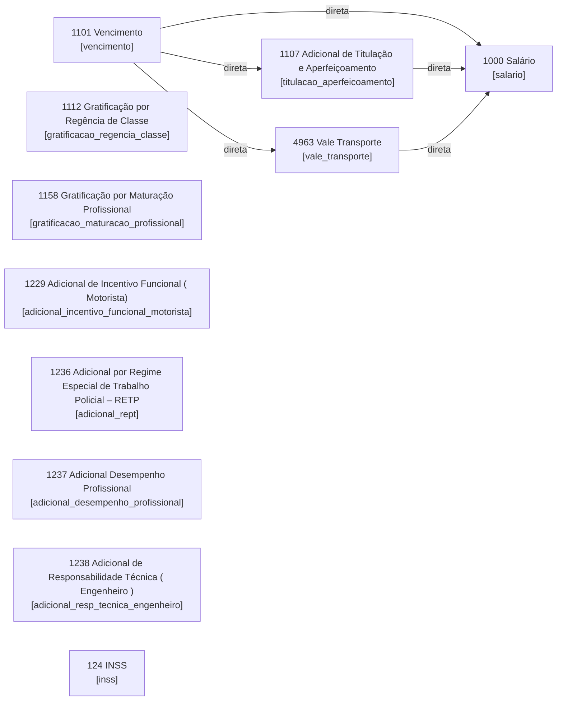
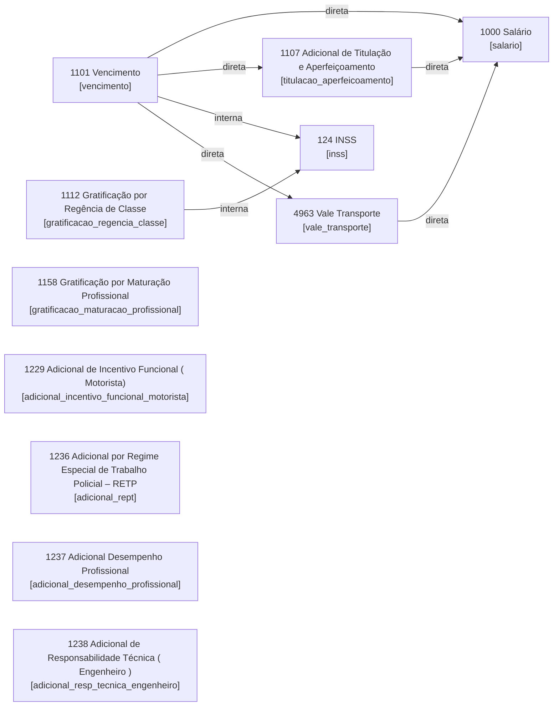

# Grafo funcional e ordem provável de cálculo das fórmulas de folha

Este artefato deriva o grafo funcional entre rubricas de folha a partir das dependências `r{...}` identificadas nas fórmulas persistidas. A direção adotada no grafo é `rubrica pré-requisito -> rubrica dependente`.

## Artefatos gerados

- `67-grafo-funcional-formulas-folha.csv`: lista de arestas do grafo por banco.
- Este arquivo (`68`) consolida a leitura funcional e a ordem provável de cálculo.

## Banco `rhlinkcon`

- Nós no grafo: `11` rubricas com fórmula persistida.
- Arestas de dependência entre rubricas: `5`.
- Rubricas sem dependência explícita de outra rubrica: `8`.
- Não houve ciclo entre dependências de rubricas persistidas.

### Grafo

### Camadas prováveis de cálculo

1. `1101 | Vencimento [vencimento]`; `1112 | Gratificação por Regência de Classe [gratificacao_regencia_classe]`; `1158 | Gratificação por Maturação Profissional [gratificacao_maturacao_profissional]`; `1229 | Adicional de Incentivo Funcional ( Motorista) [adicional_incentivo_funcional_motorista]`; `1236 | Adicional por Regime Especial de Trabalho Policial – RETP [adicional_rept]`; `1237 | Adicional Desempenho Profissional [adicional_desempenho_profissional]`; `1238 | Adicional de Responsabilidade Técnica ( Engenheiro ) [adicional_resp_tecnica_engenheiro]`; `124 | INSS [inss]`
2. `1107 | Adicional de Titulação e Aperfeiçoamento [titulacao_aperfeicoamento]`; `4963 | Vale Transporte [vale_transporte]`
3. `1000 | Salário [salario]`

### Ordem linear provável

`1101|vencimento` -> `1107|titulacao_aperfeicoamento` -> `1112|gratificacao_regencia_classe` -> `1158|gratificacao_maturacao_profissional` -> `1229|adicional_incentivo_funcional_motorista` -> `1236|adicional_rept` -> `1237|adicional_desempenho_profissional` -> `1238|adicional_resp_tecnica_engenheiro` -> `124|inss` -> `4963|vale_transporte` -> `1000|salario`

### Leitura funcional

- `Vencimento` forma a principal base de cálculo observada.
- `Titulação/Aperfeiçoamento` e `Vale Transporte` dependem de `Vencimento`.
- `INSS` aparece como função do motor sem base explícita persistida na fórmula; por isso sua posição relativa fica menos determinada do que no banco do motor.
- `Salário` é calculado depois das rubricas que o compõem ou reduzem.

## Banco `rhlinkcon_motor`

- Nós no grafo: `11` rubricas com fórmula persistida.
- Arestas de dependência entre rubricas: `7`.
- Rubricas sem dependência explícita de outra rubrica: `7`.
- Não houve ciclo entre dependências de rubricas persistidas.

### Grafo

### Camadas prováveis de cálculo

1. `1101 | Vencimento [vencimento]`; `1112 | Gratificação por Regência de Classe [gratificacao_regencia_classe]`; `1158 | Gratificação por Maturação Profissional [gratificacao_maturacao_profissional]`; `1229 | Adicional de Incentivo Funcional ( Motorista) [adicional_incentivo_funcional_motorista]`; `1236 | Adicional por Regime Especial de Trabalho Policial – RETP [adicional_rept]`; `1237 | Adicional Desempenho Profissional [adicional_desempenho_profissional]`; `1238 | Adicional de Responsabilidade Técnica ( Engenheiro ) [adicional_resp_tecnica_engenheiro]`
2. `1107 | Adicional de Titulação e Aperfeiçoamento [titulacao_aperfeicoamento]`; `124 | INSS [inss]`; `4963 | Vale Transporte [vale_transporte]`
3. `1000 | Salário [salario]`

### Ordem linear provável

`1101|vencimento` -> `1107|titulacao_aperfeicoamento` -> `1112|gratificacao_regencia_classe` -> `1158|gratificacao_maturacao_profissional` -> `1229|adicional_incentivo_funcional_motorista` -> `1236|adicional_rept` -> `1237|adicional_desempenho_profissional` -> `1238|adicional_resp_tecnica_engenheiro` -> `124|inss` -> `4963|vale_transporte` -> `1000|salario`

### Leitura funcional

- `Vencimento` e as gratificações baseadas em referência salarial formam a base inicial.
- `Titulação/Aperfeiçoamento` só pode ser processada após `Vencimento`.
- `Vale Transporte` também depende de `Vencimento`.
- `Gratificação por Regência de Classe` entra como base explícita do cálculo de `INSS` neste banco.
- `Salário` é uma rubrica agregadora posterior, porque depende de `Vencimento`, `Titulação/Aperfeiçoamento` e `Vale Transporte`.

## Banco `rhlinkcon_20190701`

- Nós no grafo: `11` rubricas com fórmula persistida.
- Arestas de dependência entre rubricas: `5`.
- Rubricas sem dependência explícita de outra rubrica: `8`.
- Não houve ciclo entre dependências de rubricas persistidas.

### Grafo

### Camadas prováveis de cálculo

1. `1101 | Vencimento [vencimento]`; `1112 | Gratificação por Regência de Classe [gratificacao_regencia_classe]`; `1158 | Gratificação por Maturação Profissional [gratificacao_maturacao_profissional]`; `1229 | Adicional de Incentivo Funcional ( Motorista) [adicional_incentivo_funcional_motorista]`; `1236 | Adicional por Regime Especial de Trabalho Policial – RETP [adicional_rept]`; `1237 | Adicional Desempenho Profissional [adicional_desempenho_profissional]`; `1238 | Adicional de Responsabilidade Técnica ( Engenheiro ) [adicional_resp_tecnica_engenheiro]`; `124 | INSS [inss]`
2. `1107 | Adicional de Titulação e Aperfeiçoamento [titulacao_aperfeicoamento]`; `4963 | Vale Transporte [vale_transporte]`
3. `1000 | Salário [salario]`

### Ordem linear provável

`1101|vencimento` -> `1107|titulacao_aperfeicoamento` -> `1112|gratificacao_regencia_classe` -> `1158|gratificacao_maturacao_profissional` -> `1229|adicional_incentivo_funcional_motorista` -> `1236|adicional_rept` -> `1237|adicional_desempenho_profissional` -> `1238|adicional_resp_tecnica_engenheiro` -> `124|inss` -> `4963|vale_transporte` -> `1000|salario`

### Leitura funcional

- `Vencimento` forma a principal base de cálculo observada.
- `Titulação/Aperfeiçoamento` e `Vale Transporte` dependem de `Vencimento`.
- `INSS` aparece como função do motor sem base explícita persistida na fórmula; por isso sua posição relativa fica menos determinada do que no banco do motor.
- `Salário` é calculado depois das rubricas que o compõem ou reduzem.

## Observação metodológica

- Esta ordem é `provável`, não uma prova completa do scheduler do motor. Ela deriva apenas das referências explícitas entre rubricas persistidas em `verba_formula`.
- Dependências implícitas do motor, incidências legais, prioridade por tipo de verba e regras fora de `verba_formula` podem alterar a ordem real de processamento.
